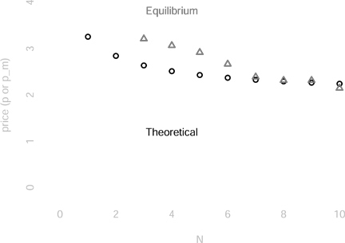
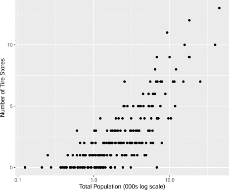

# 2 내쉬 균형 (Nash Equilibrium)

DOI: [10.1201/b23262-2](./https___doi.org_10.1201_b23262-2.md)

## 2.1 서론 (Introduction)

현대 게임 이론은 미국 수학자 존 내쉬(John Nash)의 박사 학위 논문에서 시작되었습니다. 호주 출신 러셀 크로우(Russell Crowe)가 웨스트버지니아 출신의 내쉬 역할을 맡았던 인기 영화 _뷰티풀 마인드(A Beautiful Mind)_를 통해 이 이름을 들어보셨을 것입니다. 내쉬는 대규모 게임 집합에서 안정적인 결과가 적어도 하나 이상 존재한다는 것을 보여주었습니다. 내쉬는 게임에서 어떤 결과가 발생할 가능성이 높은지에 관심을 가졌습니다. 안정성은 우리가 관찰할 가능성이 높은 모든 결과의 전제 조건인 것처럼 보입니다. 안정성은 어떤 결과가 우연히 발생한다면 게임의 결과가 바뀔 가능성이 낮다는 것을 의미합니다. 반대로 불안정성은 어떤 결과가 발생하더라도 게임의 결과가 바뀔 가능성이 높다는 것을 의미합니다. 불안정한 결과를 관찰할 가능성은 거의 없습니다. 내쉬의 해(solution) 개념은 발생 가능성이 높은 결과의 전제 조건인 동시에 많은 게임 집합에서 존재한다는 사실 때문에 매우 가치 있는 아이디어로 평가받습니다. 오늘날 우리는 그가 제안한 결과를 **내쉬 균형(Nash equilibrium)**이라고 부릅니다.

내쉬는 비협조적 게임 이론(non-cooperative game theory)이라는 게임 이론의 하위 분야에서 연구했습니다. 내쉬 자신이 노벨상 에세이에서 지적했듯이, 당시 이러한 스타일의 게임 이론은 유행하지 않았습니다.[1](./10-chapter2.md#fn2_1) 이는 내쉬가 박사 논문을 작성했던 프린스턴 대학교의 선임 수학자였던 조니 폰 노이만(Johnny von Neumann)의 아이디어와는 상당히 달랐습니다. 헝가리계 미국인인 폰 노이만은 게임 이론을 발전시키는 데 기여했으며 이를 경제학에 적용할 것을 처음 제안한 사람 중 한 명이었습니다. 독일계 미국인 경제학자 오스카 모겐스턴(Oskar Morgenstern)과의 협력을 통해 최초의 게임 이론 교과서인 _게임 이론과 경제 행동(Theory of Games and Economic Behavior)_ (1944)이 출간되었습니다. 다행스럽게도 내쉬는 고집이 셌고, 그의 노력 덕분에 비협조적 게임 이론은 오늘날 우리가 단순히 게임 이론이라고 부르는 분야로 탈바꿈할 수 있었습니다.

_________________ [1](./10-chapter2.md#fn2_12b)<https://www.nobelprize.org/prizes/economic-sciences/1994/ceremony-speech/>. 2023년 2월 23일 접속.

이 장에서는 이 핵심적인 균형 개념과 **우월 전략 균형(dominant strategy equilibrium)**의 개념을 소개합니다. 또한 소매 타이어 매장의 시장 구조를 살펴보며 이러한 개념을 설명합니다. 시장에는 몇 개의 매장이 존재하게 될까요? 매장의 수는 시장에서 타이어 가격과 어떤 관련이 있을까요?

## 2.2 내쉬 균형이란 무엇인가? (What is a Nash Equilibrium?)

**균형(equilibrium)**이란 무엇일까요? 우리는 게임의 합리적인 예측이 되는 결과를 찾고 있습니다. 가장 좋거나 나쁜 결과가 아니라 경험적 내용(empirical content)이 가장 많은 결과를 찾습니다. 즉, 현실에서 관찰될 가능성이 가장 높은 결과입니다. 이 결과는 임시방편(ad hoc)으로 선택되는 것이 아니라 일련의 가정들, 즉 규칙의 집합을 기반으로 합니다.

정의 4. _균형 개념(equilibrium concept)은 게임의 어떤 결과(들)가 발생할지 결정하기 위한 규칙의 집합입니다._

특정 결과를 게임의 합리적인 예측이라고 말하기 위해 유지하고 싶은 다양한 가정들이 있을 수 있습니다. 이 섹션에서는 **우월성(dominance)**의 아이디어와 게임의 플레이어들이 합리적으로 선택한다는 가정만을 바탕으로 어떻게 게임의 예측을 도출할 수 있는지 제시합니다.

### 2.2.1 우월성 (Dominance)

**내쉬 균형**을 다루기 전에 **우월 전략 균형**이라는 대안적인 균형 개념을 고려해 보겠습니다. [1장](./09-chapter1.md)에서는 **우월 전략(dominant strategy)**과 **약우월 전략(weakly dominant strategy)**의 개념을 소개했습니다.

정의 5. _어떤 전략이 다른 플레이어들의 전략에 관계없이 플레이어에게 가장 높은 보수(payoff)를 제공한다면 그 전략은_ 우월(dominant) _합니다. 다른 플레이어들의 일부 전략에 대해 보수가 동률로 가장 높다면 그 전략은_ 약우월(weakly dominant) _합니다._

우월 전략은 항상 최선의 선택입니다. 게임의 다른 플레이어가 무엇을 하든 상관없습니다. 항상 최선의 선택이라는 점을 감안할 때, 합리적인 플레이어가 선택할 가능성이 가장 높은 전략일 것입니다.

정의 6. _(약)우월 전략 균형은 모든 플레이어가 (약)우월 전략을 플레이하는 게임의 결과입니다._

플레이어가 합리적이라고 가정하고 **우월 전략 균형**인 결과가 존재한다면, 우리는 그 결과가 우리가 관찰하게 될 결과일 것으로 예상합니다. 문제는 우리가 연구하는 게임에서 그러한 결과가 존재하지 않을 수도 있다는 것입니다.

위 논의에는 미묘하지만 중요한 가정이 포함되어 있습니다. 플레이어가 _A_와 _B_ 두 가지 선택권을 갖고 있고, _A_가 제안된 균형의 일부이지만 _B_가 플레이어에게 정확히 같은 보수를 제공한다면, _A_는 여전히 균형의 일부입니다. _A_가 균형의 일부가 아니기 위해서는 플레이어를 엄격하게(strictly) 더 나은 상태로 만드는 _B_가 있어야 합니다.

### 2.2.2 죄수의 딜레마 (Prisoner's Dilemma)

[1장](./09-chapter1.md)에 제시된 죄수의 딜레마 게임의 버전을 생각해 봅시다. 이 버전에서 행동(actions)은 일반적인 이름을 갖지만, 보수는 이전 장에 제시된 버전과 동일한 순서를 갖습니다. 포뮬러 1(Formula 1)과 마찬가지로 중요한 것은 순서임을 기억하십시오.

[표 2.1](./10-chapter2.md#tbl2_1)은 두 플레이어 _P_1과 _P_2, 그리고 두 가지 행동 BLACK과 RED를 가진 일반적인 죄수의 딜레마 게임을 보여줍니다. 보수는 게임의 행렬형 표현인 **정규형(normal form)**으로 작성됩니다.

**[표 2.1](chapter2) 플레이어 _P_1과 _P_2, 그리고 행동 BLACK과 RED를 가진 죄수의 딜레마 게임의 정규형 표현. _P_1의 행동은 행(rows)에 있습니다. 보수는 각 셀에 위치하며 _P_1의 보수가 첫 번째 위치에 있습니다.**
| P1,P2 | BLACK | RED  |
| ----- | ----- | ---- |
| BLACK | 3, 3  | 0, 5 |
| RED   | 5, 0  | 2, 2 |

두 플레이어 모두 **우월 전략**을 플레이하는 결과는 {RED, RED}입니다.

만약 당신이 플레이어 1이라면, 플레이어 2가 무엇을 하든 상관없이 RED를 선택하는 것이 더 낫다는 것을 알 수 있습니다. 표에서 플레이어 1의 보수는 셀의 첫 번째 요소입니다. 플레이어 1의 전략은 행입니다. 플레이어 2가 BLACK을 선택하면 RED의 보수는 5이고 이는 3보다 큽니다. 플레이어 2가 RED를 선택하면 RED의 보수는 2이고 이는 0보다 큽니다. RED는 플레이어 1의 **우월 전략**입니다. 플레이어 2의 경우에도 마찬가지입니다.

죄수의 딜레마가 그토록 유명한 이유는 게임의 플레이어들에게 나쁜 결과를 예측하기 때문입니다. 합리적인 두 플레이어는 결국 우월 전략 균형에 도달하겠지만, 두 플레이어 모두 {3, 3}의 보수를 갖는 {BLACK, BLACK}을 선택하는 것이 더 나을 것입니다. 이 결과는 {2, 2}의 보수를 갖는 예측된 결과보다 두 플레이어 모두에게 엄격하게 더 나은 보수를 제공합니다. 우리의 균형 개념은 반드시 플레이어에게 가장 좋은 결과가 아니라 발생할 가능성이 가장 높다고 믿는 결과를 예측합니다.

이 게임의 예측은 현실 세계의 정책을 주도합니다. 미국 법무부(DOJ)는 시장에서의 담합 증거를 가장 먼저 제공하는 기업에 관대함을 베푸는 명시적인 정책을 가지고 있습니다.[2](./10-chapter2.md#fn2_2) 이 정책은 담합하는 기업들 사이에 죄수의 딜레마를 조성하는 것을 명시적인 목표로 합니다.

_________________ [2](./10-chapter2.md#fn2_22b)<https://www.justice.gov/atr/leniency-program> 2023년 11월 12일 접속.

우월 전략 균형이 실제 게임에서 결과를 예측할 수 있을까요? [1장](./09-chapter1.md)에서는 플레이어들이 실제 돈을 걸고 죄수의 딜레마 게임을 하는 실제 TV 프로그램의 데이터를 분석합니다. _Friend or Foe(친구인가 적인가)_에서 두 플레이어가 모두 Foe(적)를 선택하면 두 사람 모두 상금을 받지 못하고 쇼를 떠납니다. 반면 둘 다 Friend(친구)를 선택하면 상금을 나눠 갖습니다. 데이터에 따르면 {Foe, Foe}가 발생할 확률이 가장 높게 나타납니다.[3](./10-chapter2.md#fn2_3)

### 2.2.3 조정 게임 (Coordination Game)

이제 약간 다른 게임을 고려해 보겠습니다. [표 2.2](./10-chapter2.md#tbl2_2)에 정규형으로 제시된 게임을 조정 게임이라고 부릅니다. 그 이유는 곧 알게 될 것입니다.

**[표 2.2](chapter2) 플레이어 _P_1과 _P_2, 그리고 행동 RED와 BLACK을 가진 **조정 게임**의 정규형 표현. _P_1의 행동 선택은 행에 있습니다. 보수는 괄호 안에 있으며 _P_1이 먼저 나열됩니다.**
| P1,P2 | BLACK | RED  |
| ----- | ----- | ---- |
| BLACK | 2, 5  | 0, 0 |
| RED   | 0, 0  | 5, 2 |

당신이 플레이어 1이라고 가정해 봅시다. 최선의 전략을 찾을 수 있나요? 플레이어 2의 각 선택에 대한 최선의 선택을 살펴볼 수 있습니다.

* _P_2가 BLACK을 선택한다고 가정합니다. _P_1의 보수는 다음과 같습니다:  
   1. BLACK: 2  
   2. RED: 0
* _P_2가 RED를 선택한다고 가정합니다. _P_1의 보수는 다음과 같습니다:  
   1. BLACK: 0  
   2. RED: 5

이 게임에 우월 전략이 있습니까? 아닙니다. 당신을 위한 최선의 선택은 플레이어 2의 선택에 따라 달라집니다. 플레이어 2가 BLACK을 플레이하면 2>0이므로 당신도 BLACK을 플레이해야 합니다. 플레이어 2가 RED를 플레이하면 5>0이므로 당신도 RED를 플레이해야 합니다. **조정 게임**을 보세요! 두 플레이어 모두 색상을 조정(협력)해야 합니다.

_________________ [3](./10-chapter2.md#fn2_32b)이 책의 두 번째 부분에서는 플레이어가 더 높은 보수를 받는 예측된 결과로 이어지는 죄수의 딜레마 게임의 변화를 고려합니다.

이 게임에서 어떤 결과가 발생할 것으로 예측합니까? 두 플레이어 모두 조정하기를 원하지만 어떤 결과에 조정할지에 대해서는 동의하지 않습니다. 플레이어 1은 RED에 조정하는 것을 선호하고 플레이어 2는 BLACK에 조정하는 것을 선호합니다.

## 2.3 내쉬 균형 (Nash Equilibrium)

이 섹션에서는 **내쉬 균형**의 정의를 논의하고, 죄수의 딜레마와 조정 게임 등 이 장 앞부분에서 제시된 게임에서 하나 이상의 내쉬 균형을 찾는 방법을 설명합니다.

### 2.3.1 정의 (Definition)

정의 7. 내쉬 균형 _은 다른 플레이어들의 전략이 주어졌을 때 각 플레이어의 전략이 가장 높은 보수를 갖는 전략들의 집합입니다._

우월 전략 균형과 마찬가지로 각 플레이어는 가장 높은 보수를 제공하는 전략을 선택한다고 가정합니다. 기본 가정은 게임의 플레이어들이 합리적이라는 것입니다. 차이점은 여기서 선택이 다른 플레이어들의 선택에 종속된다는 것입니다.

안정성은 내쉬의 개념에 내재되어 있습니다. 각 플레이어는 다른 모든 플레이어들의 선택이 주어졌을 때 최선의 옵션을 선택합니다. 모든 플레이어가 최선의 옵션을 선택한다면 어느 플레이어도 전략을 변경할 필요가 없습니다. 이 결과는 안정적입니다.

### 2.3.2 내쉬 균형을 찾는 알고리즘 (Algorithm for Finding Nash Equilibrium)

내쉬 균형은 여러 가지 좋은 특성을 가지고 있지만, 그것을 찾는 과정은 그렇지 않습니다. 우리는 다음과 같은 번거로운 알고리즘을 사용할 것입니다. 게임 이론을 처음 접하는 학생들이 겪는 문제 중 하나는 교사가 임의로 어떤 결과를 선택하고 "짠, 이것이 균형입니다!"라고 말하는 것처럼 보인다는 것입니다. 물론 교사는 무작위로 선택하지 않았습니다. 그들은 이미 정답을 알고 있었습니다. 현실적으로 당신은 어떤 것을 선택해야 할지 알 수 없으므로 불행히도 모든 결과를 직접 시도해 보아야 합니다. 지름길은 없습니다.

* 1단계: 후보 결과(전략 집합)를 선택합니다.
* 2단계: 플레이어 1의 전략을 고정시킵니다. 플레이어 2의 전략이 최적인가요?  
   1. 예: 3단계로 이동합니다.  
   2. 아니요: 내쉬 균형이 아닙니다.
* 3단계: 플레이어 2의 전략을 고정시킵니다. 플레이어 1의 전략이 최적인가요?  
   1. 예: 내쉬 균형입니다.  
   2. 아니요: 내쉬 균형이 아닙니다.

게임에 두 명 이상의 플레이어가 있는 경우, 알고리즘을 확장하여 각 플레이어를 차례대로 살펴볼 수 있습니다.

### 2.3.3 죄수의 딜레마 게임 (Prisoner's Dilemma Game)

이미 알고 있는 게임인 죄수의 딜레마에 우리의 알고리즘을 테스트해 봅시다. 이 게임에 대해서는 더 효율적인 알고리즘이 존재하지만, 우리는 이 보다 일반적인 알고리즘이 어떻게 작동하는지 설명하고 있습니다. 첫 번째 단계는 단순히 결과를 선택하는 것임을 기억하십시오. 마법은 없습니다.

* 1단계: {BLACK,BLACK}
* 2단계: _P_1이 BLACK을 플레이합니다. _P_2에게 BLACK이 최적입니까?  
   1. BLACK: 3, RED: 5  
   2. 아니요: 내쉬 균형이 아닙니다.

다른 결과를 선택해 봅시다.

* 1단계: {RED,RED}
* 2단계: _P_1이 RED를 플레이합니다. RED가 _P_2의 최적 전략입니까?  
   1. BLACK: 0, RED: 2  
   2. 예. 3단계로 이동합니다.
* 3단계: _P_2가 RED를 플레이합니다. RED가 _P_1의 최적 전략입니까?  
   1. BLACK: 0, RED: 2  
   2. 예!  
   3. {RED,RED}는 내쉬 균형입니다.

좋습니다. 마법이 조금 있었습니다. 다른 두 가지 결과에 대해서도 알고리즘을 시도해 보아야 합니다.

### 2.3.4 조정 게임 (Coordination Game)

[표 2.2](./10-chapter2.md#tbl2_2)에 제시된 조정 게임처럼 좀 더 복잡한 것을 시도해 봅시다.

* 1단계: {BLACK,BLACK}
* 2단계: _P_1이 BLACK을 플레이합니다. _P_2에게 BLACK이 최적입니까?  
   1. BLACK: 5, RED: 0  
   2. 예. 3단계로 이동합니다.
* 3단계: _P_2가 BLACK을 플레이합니다. _P_1에게 BLACK이 최적입니까?  
   1. BLACK: 2, RED: 0  
   2. 예.  
   3. {BLACK,BLACK}은 내쉬 균형입니다.

쉽고 운이 좋았습니다. 이 게임에 다른 내쉬 균형이 있습니까?

* 1단계: {RED,RED}
* 2단계: _P_1이 RED를 플레이합니다. RED가 _P_2의 최적 전략입니까?  
   1. BLACK: 0, RED: 2  
   2. 예. 3단계로 이동합니다.
* 3단계: _P_2가 RED를 플레이합니다. RED가 _P_1의 최적 전략입니까?  
   1. BLACK: 0, RED: 5  
   2. 예.  
   3. {RED,RED}는 내쉬 균형입니다.

두 개의 내쉬 균형이 있습니다. 사실 더 많이 존재하지만 이 내용은 [5장](./13-chapter5.md)에서 다시 다룰 것입니다.

내쉬 균형의 가치 중 하나는 그것이 항상 존재한다는 것입니다.[4](./10-chapter2.md#fn2_4) 불행히도 그 대가는 게임에 둘 이상의 내쉬 균형이 있을 수 있다는 것입니다. 조정 게임의 내쉬 균형 중 하나가 다른 것보다 더 합리적일까요? 게임의 가장 합리적인 예측은 무엇일까요? 더 합리적인 균형이 존재하는지에 대한 질문을 정제(refinement)라고 부릅니다. 이 책에서는 내쉬 균형의 여러 가지 정제 방법을 고려할 것입니다. [4장](./12-chapter4.md)에서는 데이터로 분석하고자 하는 게임에 다중 균형이 있는 경우 어떤 일이 발생하는지 분석합니다.

## 2.4 진입 게임 (Entry Games)

이 섹션에서는 실증적 진입 게임을 소개합니다. 시장에 참여하는 기업의 수를 결정하는 요인에 대해 경제학자들이 일반적으로 어떻게 생각하는지에 대한 틀(framework)을 제시합니다. 종종 정책 입안자들이 경쟁 부족으로 인해 가격이 높다고 불평하는 것을 듣게 됩니다. 시장에 진입한 기업이 너무 적다는 것입니다. 하지만 왜 시장에 기업이 적은지 한발 물러서서 질문하는 정책 입안자는 드뭅니다. 이 섹션에서는 소수의 기업이 시장 진입 여부를 선택하는 게임을 제시합니다.

_________________ [4](./10-chapter2.md#fn2_42b)내쉬 균형은 모든 유한 게임, 즉 플레이어 수와 전략 수가 유한한 모든 게임에 존재합니다.

### 2.4.1 브레스나한과 리스 (Bresnahan and Reiss)

1990년대 초반에 발표된 일련의 논문에서 미국 경제학자 팀 브레스나한(Tim Bresnahan)과 피터 리스(Peter Reiss)는 단순한 진입 게임의 경험적 함의를 분석했습니다. [Bresnahan and Reiss (1991b)](./25-refbib.md#ref17)는 미국 여러 도시의 소매 타이어 매장 평균 가격을 분석합니다. 데이터에 따르면 관찰된 타이어의 평균 가격과 시장의 타이어 소매업체 수 사이에는 기본적으로 아무런 관계가 없음을 보여줍니다.[5](./10-chapter2.md#fn2_5) 그 이유가 무엇이라고 생각하십니까?

문제는 **내생성(endogeneity)**입니다.[6](./10-chapter2.md#fn2_6) 이 타이어 소매업체들이 타이어 판매 비용을 포함한 다양한 요소를 기반으로 시장에 남을지 여부를 선택한다는 사실이 원시 관측치(raw observations)에 반영되어 있지 않습니다. 시장 규모가 클수록 더 많은 기업이 존재할 가능성이 높지만, 그 기업들 중 일부는 타이어 판매 비용이 높을 것이고 이러한 높은 비용이 가격을 끌어올릴 것입니다. 즉, 더 많은 경쟁이 가격을 낮추는 힘과 덜 효율적인 기업이 가격을 올리는 힘이라는 서로 상쇄되는 두 가지 힘이 존재합니다.

이것은 단순히 학문적인 문제가 아닙니다. 이것은 Staples와 Office Depot의 합병에 반대하는 미국 연방거래위원회(FTC) 소송의 핵심 쟁점이었습니다 ([Ashenfelter et al., 2006](./25-refbib.md#ref7)). 1990년대 후반 두 대형 사무용품 전문 매장이 합병을 원했습니다. FTC는 합병에 반대하는 증거로 매장 수가 많은 도시일수록 가격이 저렴하다는 것을 제시했습니다. 이것이 인과 관계에 기반한 진술일까요? 매장 수의 증가가 가격 하락의 원인이었을까요? 게다가 그 반대의 현상이 일어날 수 있을까요? 합병이 이루어지고 시장에서 독립적인 기업의 수가 줄어든다면 가격이 상승할까요?

### 2.4.2 두 기업 진입 게임 (Two Firm Entry Game)

기업이 두 개뿐인 비교적 단순한 버전의 진입 게임을 고려해 봅시다. 하나의 기업만 진입하는 경우 해당 기업은 독점이윤을 얻고 숫자 2로 표시되는 고정 진입 비용을 지불합니다. 만약 그 기업이 진입하지 않으면 아무 일도 일어나지 않으며 이는 0으로 표시됩니다. 두 기업이 모두 진입하면 경쟁이 발생하지만 기업은 진입 비용도 지불해야 합니다. 이 보수는 -1로 표시되며 좋지 않은 결과입니다. 따라서 기업은 독점적인 경우에만 시장 진입을 원합니다.

좀 더 공식적으로 두 명의 플레이어가 있고 기업의 전략은 진입(Enter)하거나 진입하지 않는 것(Don't Enter)이며, 보수는 다른 기업이 진입하는지 여부에 따라 달라집니다.

* 플레이어: Firm 1, Firm 2
* 전략:  
   1. Firm 1: Enter, Don't Enter  
   2. Firm 2: Enter, Don't Enter
* 보수:  
   1. {Enter, Enter}: {-1, -1}  
   2. {Enter, Don't}: {2, 0}  
   3. {Don't, Enter}: {0, 2}  
   4. {Don't, Don't Enter}: {0, 0}

_________________ [5](./10-chapter2.md#fn2_52b)놀랍게도 저자들은 자신들의 데이터를 통해 “진입이 마진을 낮춘다”고 밝혔습니다. 그들이 어떻게 이런 결론에 도달했는지는 불분명합니다.

[6](./10-chapter2.md#fn2_62b)계량경제학에서는 데이터에서 관찰된 여러 사례들이 무작위로 결정되지 않았을 수 있음을 의미하기 위해 **내생성**이라는 용어를 사용합니다. 중요한 것은 사례의 할당이 관찰된 결과와 직접적인 관련이 있을 수 있다는 점입니다.

우리는 또한 이 게임을 정규형 보수 행렬(payoff matrix)로 나타낼 수 있습니다.

[표 2.3](./10-chapter2.md#tbl2_3)은 게임의 정규 표현을 보여줍니다. 이 게임의 내쉬 균형은 무엇일까요? 두 기업 모두 진입할 것 같지는 않으며 우리는 그것이 균형이 아니라는 것을 금방 알 수 있습니다. 두 기업 모두 진입하는 경우, 0이 -1보다 크기 때문에 Firm 1은 진입하지 않는 편이 더 나았을 것입니다. 첫 번째 열과 Firm 1에 해당하는 첫 번째 요소의 보수를 참조하세요.

**[표 2.3](chapter2) 두 기업 진입 게임의 정규형 표현. Firm 1의 전략은 행이고 Firm 2의 전략은 열입니다. 보수는 셀에 있으며 Firm 1의 보수가 먼저 표시됩니다.**
| Firm 1, Firm 2 | Enter   | Don't |
| -------------- | ------- | ----- |
| Enter          | \-1, -1 | 2, 0  |
| Don't          | 0, 2    | 0, 0  |

두 기업 모두 진입하지 않는 경우는 어떨까요? 여기서도 Firm 1은 진입하는 것이 더 유리하다는 것을 알 수 있습니다. 두 번째 열을 보고 2가 0보다 크다는 것을 확인하세요.

우리의 알고리즘을 사용하여 다른 결과들을 더 체계적으로 확인해 봅시다.

* 1단계: {Enter, Don't}
* 2단계: Firm 1이 Enter를 플레이합니다. Firm 2에게 Don't가 최적입니까?  
   1. Enter: -1, Don't: 0  
   2. 예. 3단계로 이동합니다.
* 3단계. Firm 2가 Don't를 플레이합니다. Firm 1에게 Enter가 최적입니까?  
   1. Enter: 2, Don't: 0  
   2. 예. 내쉬 균형입니다!

이것이 게임의 유일한 내쉬 균형입니까?

아닙니다. Firm 2는 진입하지만 Firm 1은 진입하지 않는 또 다른 내쉬 균형이 존재합니다.[7](./10-chapter2.md#fn2_7) 이 진입 게임은 일종의 조정 게임입니다.

_________________ [7](./10-chapter2.md#fn2_72b)이번에도 다른 균형들이 있지만 나중에 다룰 것입니다. 조금만 기다리세요!

게임 이론은 흥미로운 예측을 내놓습니다. 시장이 독점이 될 것이라고 예측하지만 어느 기업이 독점할 것인지는 예측하지 않습니다. 이것은 [4장](./12-chapter4.md)에서 분석된 서점의 실증 분석에 몇 가지 함의를 가집니다.

### 2.4.3 다수 기업 진입 게임 (Many Firm Entry Game)

최대 N¯개의 기업이 진입 여부를 선택하도록 함으로써 게임을 더 일반화할 수 있습니다.

* 플레이어: N¯>0 기업
* 전략: Enter, Don't Enter
* 보수:  
   1. Enter: (a−c)2b(N+1)2−F, 여기서 N≤N¯, 그리고 _N_은 Enter를 선택한 기업의 수입니다.  
   2. Don't Enter: 0

이 경우 우리는 적은 수의 기업인 N¯를 갖습니다. 각 기업의 진입 비용은 _F_입니다. 진입 비용에는 소매 공간 확보, 타이어 판매를 위한 공간 개발, 도매업체 및 제조업체와의 계약 등이 포함될 수 있습니다. 기업이 진입(또는 비진입)을 결정하면 시장 메커니즘이 각 기업이 얻을 이윤을 결정합니다.

이윤 함수는 다소 복잡한 편입니다. 시장에서 기업이 얻는 이윤은 진입하는 기업의 수(_N_)에 의해 결정된다는 점에 주목하세요. 더 많은 기업이 진입할수록 이윤은 낮아집니다. 경쟁은 가격과 이윤을 낮춥니다. 게다가 이윤이 너무 낮아서 고정 진입 비용보다 적어질 수 있습니다. 그런 경우 기업들은 진입하지 않는 것이 더 낫습니다.

복잡한 이윤 함수가 어디에서 나오는지 보려면, 가격이 다음 함수에 의해 결정된다고 가정해 보세요.[8](./10-chapter2.md#fn2_8)

p = \frac{a}{N+1} + \frac{N c}{N+1} \tag{2.1}

여기서 _c_는 **한계 생산 비용(marginal cost of production)**, _a_는 수요 매개변수, _N_은 시장에 진입하는 기업의 수입니다. 기업이 진입함에 따라 가격이 하락하고 _N_이 커지면 한계 비용에 수렴합니다. 첫 번째 부분은 N이 커질 때 0에 가까워집니다. 두 번째 부분은 _N_이 커질 때 N+1에 대한 _N_의 분수가 1에 가까워지기 때문에 c에 가깝습니다. **한계 생산 비용**은 시간당 임금 및 타이어 자체의 도매 비용을 포함하여 타이어를 판매하는 데 드는 점진적인 비용을 의미합니다.

만약 어떤 기업이 시장에 진입한다면, 그 기업의 이윤은 판매량(_q_)에 이윤 폭(p-c)을 곱하여 결정됩니다. 시장 내 수요는 Q(p)=a−bp라는 선형 함수에 의해 결정된다고 가정합니다. 매개변수 _a_는 수요 수준을 결정하고 매개변수 _b_는 가격에 대한 수요의 민감도를 결정합니다. 특정 가격 상승에 대해 수요가 더 급격하게 감소한다면 이는 _b_가 더 크기 때문입니다. 시장 내 각 기업은 동일하므로 수요를 균등하게 분할하여 q=Q/N이 됩니다.

q × (p - c) = \frac{(a-c)^2}{b(N+1)^2} \tag{2.2}

수요에 마진을 곱하면 이윤 함수가 도출됩니다.

_________________ [8](./10-chapter2.md#fn2_82b)이것은 [3장](./11-chapter3.md)에서 논의되는 대칭적인 기업 _N_개가 참여하는 꾸르노(Cournot) 게임의 해(solution)입니다.

### 2.4.4 내쉬 균형 (Nash Equilibrium)

이 게임의 결과는 무엇일까요? 내쉬 균형이 성립하려면 각 기업이 다른 모든 기업의 행동이 주어졌을 때 최적의 전략을 플레이해야 합니다.

각 기업은 다음과 같은 부등식이 성립할 때만 시장에 진입합니다.

\frac{(a-c)^2}{b(N+1)^2} > F \tag{2.3}

이것은 균형 상태에서 시장에 _N_개의 기업이 있다면 위 부등식이 성립해야 함을 의미합니다. 만약 성립하지 않는다면 일부 기업은 시장에 진입하지 않을 것입니다. 또한 다른 기업이 추가로 진입하는 것이 수익성이 있어서는 안 됩니다. 만약 한 기업이 더 진입한다면 어떻게 될까요? 그 경우 각 기업의 이윤은 고정 진입 비용 아래로 떨어져야 합니다.

\frac{(a-c)^2}{b(N+2)^2} < F \tag{2.4}

만약 시장에 N<N¯ 개의 기업이 있다면, 이 기업들 모두에게 진입하는 것이 수익성이 있어야 하지만, 더 이상의 기업이 진입하는 것은 수익성이 없어야 합니다.

### 2.4.5 고정 진입 비용 (Fixed Cost of Entry)

게임에 한 가지 더 복잡한 요소를 추가해 봅시다. 고정 비용을 진입하는 기업 수의 함수인 F=θ(N+1)^K로 설정하고, 여기서 _K_와 _θ_는 비용의 매개변수라고 합시다. 이 가정은 시장에 더 많은 기업이 존재할 때 진입 비용이 더 높다는 것을 의미합니다. 타이어를 판매하기 위해 토지나 공간을 사용하려는 기업이 많아질수록 그 비용이 더 비싸질 수 있습니다. 이는 서로 다른 기업이 서로 다른 고정 진입 비용을 갖는다는 아이디어입니다. 시장에 소수의 기업만 있는 경우 진입하는 기업은 낮은 고정 진입 비용을 갖게 됩니다. 반면 균형 상태에서 다수의 기업이 있는 시장에서는 기업들이 더 높은 고정 진입 비용을 갖게 됩니다.

### 2.4.6 균형 기업 수 (Equilibrium Number of Firms)

시장에 있는 기업의 수는 1, 2, 85 등 셀 수 있는 정수입니다. 불행히도 이러한 숫자는 이해하기는 쉽지만 방정식을 푸는 데 사용하기에는 성가십니다. 방정식을 더 쉽게 풀기 위해 시장의 기업 수가 실수(real number)라는 비현실적인 가정을 할 것입니다.[9](./10-chapter2.md#fn2_9) 실수는 우리의 균형 방정식에 대한 해가 존재한다는 특성을 가지고 있기 때문에 유용합니다.

균형 상태에서는 다음 등식이 성립합니다.

\frac{(a-c)^2}{b(N+1)^2} = \theta (N+1)^K \tag{2.5}

_________________ [9](./10-chapter2.md#fn2_92b)실수에는 정수와 유리수(분수)뿐만 아니라 _π_나 \sqrt{2} 같은 좀 더 특이한 숫자도 포함됩니다.

_N_개의 기업이 진입한다면 각 기업은 진입하거나 진입하지 않는 것에서 동일한 이윤을 얻습니다. 내쉬 균형은 어떤 _N_개의 기업이 진입할지는 예측하지 않고 단지 _N_개의 기업이 진입할 것이라는 점만 예측합니다. 균형 기업 수를 구하면 N=\left(\frac{(a-c)^2}{b\theta}\right)^{\frac{1}{K+2}}-1이 됩니다. 아래에서는 로그를 사용할 것이며 식이 더 깔끔해 보일 것입니다.

균형 기업 수는 시장의 수익성에 비례하여 증가하고 가격에 대한 고객의 민감도에 반비례하여 감소한다는 것을 알 수 있습니다.

### 2.4.7 **R**을 이용한 진입 게임 시뮬레이션 (Simulation of Entry Game in **R**)

이 게임이 어떻게 작동하는지 이해하기 위해 우리는 수천 개의 시장 진입을 시뮬레이션할 수 있습니다. 시뮬레이션에는 최대 10개의 기업이 있는 1,000개의 시장이 있습니다. 수요 및 비용 매개변수와 진입 비용은 시장마다 다릅니다.

이 코드는 runif() 함수를 사용합니다. 이 함수는 0과 1 사이에 균등하게 분포된 난수 세트를 생성합니다. 0과 1 사이의 특정 숫자를 뽑을 확률은 동일합니다. 결과를 정확하게 재현할 수 있도록 set.seed()를 사용합니다.[10](./10-chapter2.md#fn2_10) 사용된 다른 값들은 임의로 만들어진 것입니다.

```r
>   set.seed(123456789)
>   M = 1000
>   Nbar = 10
>   a = 4 + 1*runif(M)
>   b = 0 + 0.6*runif(M)
>   c = 1 + 2*runif(M)
>   theta = 0 + 0.05*runif(M)
>   K = 0.9
```

방정식 (2.5)의 해를 코드 형태로 작성할 수 있습니다. 균형 진입이 주어지면 그 숫자를 다시 가격 방정식에 대입하여 각 시장의 균형 가격을 결정할 수 있습니다. 이것은 **R**이 빛을 발하는 사례 중 하나입니다. 수학과 매우 유사해 보이는 코드를 작성할 수 있지만 이면에는 훨씬 더 많은 복잡성이 숨겨져 있습니다. 이 두 줄은 실제로 1,000개 시장 모두에 대해 균형 기업 수와 균형 가격을 결정합니다.

```r
> N = (((a - c)^2)/(b*theta))^(1/(K+2)) - 1
> p = a/(N+1) + (N*c)/(N+1)
```

우리는 균형 가격을 가격과 기업 수 사이의 이론적 관계와 비교할 수 있습니다. 균형 가격을 결정하기 위해 기업 수의 각 균형 수준에서 평균 가격을 계산합니다. 이를 위해 data.table 패키지를 사용합니다.[11](./10-chapter2.md#fn2_11) 이 패키지는 데이터의 여러 다른 부분 집합에 대해 계산을 수행하는 데 매우 유용합니다. 여기서 우리는 동일한 균형 진입자 수를 가진 각 시장에 대해 계산을 수행하려고 합니다. 기업 수가 정수가 되도록 round()를 사용하여 반올림합니다. 결과 데이터 세트인 데이터 테이블용 dt는 "N"과 "p"라는 두 가지 변수를 갖습니다. 다음 줄은 _N_개의 기업이 있는 각 시장의 평균 가격을 취하고 새로운 데이터 세트 dt1을 생성합니다.

_________________ [10](./10-chapter2.md#fn2_102b)컴퓨터는 실제로 난수를 생성하지 않습니다. 이 숫자는 복잡한 비선형 함수에서 나옵니다. 무작위처럼 보이지만 수열의 이전 숫자와 사용된 함수를 알고 있다면 시퀀스의 다음 숫자를 정확히 결정할 수 있습니다.

[11](./10-chapter2.md#fn2_112b)data.table에서 사용하는 구문은 기본 **R**과 다르고 tidyverse()와도 다릅니다.

```r
> library(data.table)
> dt = data.table(N = round(N),
+                 p = p)
> dt1 = dt[, .(p = mean(p)), by = N]
```

이론적인 등가값을 계산하기 위해 매개변수 값의 평균을 구하고, 시장의 기업 수가 균형에 의해서가 아니라 외생적으로 결정된 경우의 가격을 계산합니다. 마지막 줄은 방정식 (2.1)의 가격 공식을 사용합니다.

```r
>   am   =   mean(a)
>   cm   =   mean(c)
>   Nm   =   1:Nbar
>   pm   =   am/(Nm + 1) + (Nm*cm)/(Nm + 1)
```

[그림 2.1](./10-chapter2.md#fig2_1)은 시장의 기업 수와 가격 간의 관계를 보여줍니다. 이것은 예시일 뿐이지만, 가격과 기업 수 간의 이론적 관계가 경험적(실증적) 관계와 다를 수 있음을 보여줍니다. 이론적 관계는 경쟁으로 인해 가격이 하락한다는 것을 보여줍니다. 시뮬레이션된 데이터에서, 시장의 기업 수와 가격 간의 관계는 적어도 기업 수가 적을 때는 덜 부정적(음의 관계가 약함)입니다. 그 이유는 경험적 관계가 기업들이 시장 진입을 결정할 때 가격이 어떻게 될지 고려하는 균형 상태이기 때문입니다.



[그림 2.1](chapter2) 시뮬레이션 데이터의 가격 산점도는 시장 내 기업 수(_N_)를 나타냅니다. 균형 가격(dt1$p)(빨간색 삼각형)은 이론 가격(p_m)(검은색 원)보다 더 천천히 하락합니다.

단순하게(naively) 한 시장의 기업 수를 취하고 이를 가격에 회귀(regress)시키면 가격과 경쟁 간의 진정한 관계를 찾을 수 없습니다. 우리는 기업들의 균형 결정에 의해 매개된 관계를 추정하고 있는 것입니다. 이 사실을 인지하게 되면 우리에게는 두 가지 선택권이 주어집니다. 포기하고 손을 떼거나, 이러한 균형 결정과 데이터가 생성되는 방식에 대해 진지하게 생각해 보는 것입니다.

## 2.5 실증 분석: **R**을 활용한 타이어 시장 (Empirical Analysis: Tire Markets using **R**)

브레스나한과 리스(Bresnahan and Reiss)는 진입 게임의 경험적 함의에 대해 깊이 고찰한 일련의 논문을 작성했습니다. 그 중 한 논문에서 저자들은 소매 타이어 매장을 포함한 다양한 산업에 걸쳐 지리적으로 구별되는 도시의 기업 수에 대한 데이터를 확보합니다.

이 섹션에서는 소매 타이어 시장에 대한 데이터와 앞서 제시된 모델을 데이터에 어떻게 적용할 것인지에 대해 논의합니다. 게임의 매개변수를 추정하고 게임을 사용하여 새로운 기업을 설립하는 데 드는 비용을 줄이는 등의 정책 변화를 시뮬레이션합니다.

### 2.5.1 데이터 (Data)

이 데이터는 각 도시의 타이어 매장 수, 각 도시의 인구, 도시로 통근하는 사람 수, 집값 및 땅값과 같은 다양한 경제 지표, 연령 및 가구 소득과 같은 다양한 인구통계학적 지표에 대한 정보를 제공합니다.[12](./10-chapter2.md#fn2_12)

_________________ [12](./10-chapter2.md#fn2_122b)여기서 사용된 데이터는 Jeremy Bejara와 2019년 구조적 산업 조직(structural industrial organization) 코스의 Github 저장소에서 가져왔습니다. <https://github.com/jmbejara/comp-econ-sp19/blob/master/lectures/5-14%5FStructural%5FIO%5Fwith%5FMLE/bresnahan-reiss-1991-discussion.ipynb>

아래 코드는 데이터를 로드하고 그림을 그립니다. 데이터는 csv 파일에 있으며 read.csv()를 사용하여 읽어옵니다. dir 변수를 정의해야 합니다. 이 변수는 데이터가 있는 경로와 같게 설정됩니다. 그런 다음 ggplot2(또는 tidyverse) 패키지의 ggplot()을 사용하여 데이터를 그립니다.

```r
> file = paste0(dir, "BresnahanAndReiss1991DATA.csv")
> read.csv(file) |>
+   ggplot(mapping = aes(TPOP,
+                        TIRE)) +
+   geom_point() +
+   labs(x = "Total Population (000s log scale)",
+        y = "Number of Tire Stores") +
+   scale_x_log10()
```

우리의 관심사는 시장의 매장 수를 결정하는 요인을 알아내는 것입니다. [그림 2.2](./10-chapter2.md#fig2_2)는 시장 규모가 커짐에 따라 기업의 수가 증가함을 보여줍니다.



[그림 2.2](chapter2) 타이어 매장 수와 도시 인구 간의 경험적 관계를 보여주는 산점도. 더 큰 도시일수록 소매 타이어 매장 수가 더 많은 일반적인 양의 관계를 보여줍니다.

### 2.5.2 구조적 모델 (Structural Model)

우리는 [Bresnahan and Reiss (1991b)](./25-refbib.md#ref17)를 따라 구조적 모델(structural model)을 구축할 것입니다. 기본 아이디어는 게임 이론이 데이터와 일치시킬 수 있는 경험적(실증적) 관계를 제공한다는 것입니다. 이 일치 작업을 통해 우리는 게임 이론 모델의 매개변수를 역산(back out)할 수 있습니다. 모델 매개변수를 구하면 정책 시뮬레이션을 실행할 수 있습니다. 적어도 이론적으로는 그렇습니다.

방정식 (2.5)를 로그 형식으로 작성할 수 있습니다. 방정식 양변에 로그를 취한 다음 기업 수의 로그 값을 왼쪽으로 오게 정리합니다. 이렇게 하면 방정식이 선형 회귀 방정식과 더 비슷해 보입니다.

\frac{(a-c)^2}{b(N+1)^2} = \theta (N+1)^K
또는
(2+K)\log(N+1) = 2\log(a-c) - \log(b) - \log(\theta)
또는
\log(N+1) = \frac{2}{2+K}\log(a-c) - \frac{1}{2+K}\log(b) - \frac{1}{2+K}\log(\theta) \tag{2.6}

이 변환은 표준 **선형 회귀(linear regression)** 추정기를 사용할 수 있게 해주기 때문에 유용합니다.

구조적 모델에서 도출된 관계는 기업의 수가 기업의 평균 이윤(a-c)이 증가할수록 많아지고, 다른 제품으로의 대체(_b_)와 진입 비용(_θ_)이 증가할수록 감소한다는 것을 나타냅니다. 증가 속도는 매개변수 _K_에 의해 결정됩니다.

### 2.5.3 진입 추정기 (Entry Estimator)

방정식 (2.6)은 균형 상태에서 기업 수(기업 수의 로그 값)가 총인구 및 1인당 소득과 같은 수요 규모를 결정하는 요인, 임금과 같은 비용을 결정하는 요인, 대체재의 근접성과 같은 수요 함수의 기울기를 결정하는 요인, 그리고 마지막으로 부동산 임대료와 같은 진입 비용을 결정하는 요인에 의해 결정된다는 것을 나타냅니다.

불행히도 우리 데이터가 이론적 매개변수에 어떻게 매핑되는지는 명확하지 않습니다. 총인구와 같은 전반적인 수요에 대한 좋은 측정치는 있지만 임금에 대한 정보는 없습니다. 임대료 및 진입 비용에 영향을 줄 수 있는 땅값에 대한 약간의 정보가 있습니다. 또한 시장 규모와 시장 외부로의 대체(substitution)를 모두 나타내는 지표일 수 있는 통근자 수에 대한 정보도 있습니다.

### 2.5.4 **R**을 이용한 추정 (Estimation in **R**)

추정을 수행하기 위해 인구, 통근자 수, 소득, 땅값과 같은 도시 특성에 대해 소매 타이어 매장 수의 로그 값을 종속 변수로 하는 선형 회귀 분석을 실행할 수 있습니다. 아래 코드는 데이터를 읽고 회귀 분석을 실행합니다. data라는 이름의 data.frame은 na.omit()을 사용하여 누락된 값이 있는 모든 관측치를 제거합니다.[13](./10-chapter2.md#fn2_13) 그런 다음 코드는 두 개의 회귀 분석을 실행합니다. 첫 번째 회귀 분석에는 도시의 인구만 포함됩니다.

_________________ [13](./10-chapter2.md#fn2_132b)**R**은 결측값을 나타내기 위해 NA를 사용합니다.

```r
> data = read.csv(file) |>
+   mutate(
+     logstores = log(TIRE + 1),
+     population = TPOP,
+     cummuters = OCTY,
+     income = PINC,
+     landvalue = LANDV
+   ) |>
+   na.omit()
> lm1 = lm(logstores ~ population, data)
> lm2 = lm(logstores ~ population + cummuters +
+             income + landvalue, data)
```

[표 2.4](./10-chapter2.md#tbl2_4)는 매장 수와 다양한 경제적 요인 간의 경험적 관계를 보여줍니다. 시장 규모와 기업 수 사이에 강한 양의 관계가 있음을 보여줍니다. 다른 요인 간의 경험적 관계는 적어도 이 데이터에서는 명확하지 않습니다.

**[표 2.4](chapter2) 시장 특성과 소매 타이어 매장 수 간의 관계에 대한 OLS 추정치.**
| _종속 변수(Dependent variable):_ |                                             |                                             |
| --------------------- | ------------------------------------------- | ------------------------------------------- |
| log_stores            |                                             |                                             |
| (1)                   | (2)                                         |                                             |
| population            | 0.08[\*\*\*](./10-chapter2.md#tblfn2_4_1) | 0.07[\*\*\*](./10-chapter2.md#tblfn2_4_1) |
| |  (0.01)             | (0.01)                                      |                                             |
| cummuters             | 0.04                                        |                                             |
| |  (0.07)             |                                             |                                             |
| income                | 0.13[\*\*\*](./10-chapter2.md#tblfn2_4_1) |                                             |
| |  (0.04)             |                                             |                                             |
| land_value            | 0.07                                        |                                             |
| |  (0.19)             |                                             |                                             |
| Constant              | 0.74[\*\*\*](./10-chapter2.md#tblfn2_4_1) | -0.03                                      |
| |  (0.05)             | (0.22)                                      |                                             |
| 관측치(Observations)          | 202                                         | 202                                         |
| R2                    | 0.36                                        | 0.40                                        |

_참고:_ \*p<0.1; \*\*p<0.05; [\*\*\*](./10-chapter2.md#tblfn2_4_1c)p<0.01

### 2.5.5 구조적 추정 (Structural Estimation)

[표 2.4](./10-chapter2.md#tbl2_4)에 제시된 추정치는 시장 내 기업 수와 관찰된 시장 특성 간의 경험적 관계를 제공합니다. 우리는 이러한 추정치를 우리의 게임 이론 모델에 매핑하는 데 관심이 있습니다. [표 2.4](./10-chapter2.md#tbl2_4)의 두 번째 열이 포착한 관찰된 관계가 위에서 설명한 게임(방정식 (2.6))에 의해 생성된다고 가정해 봅시다. 구체적으로 그것은 해당 게임의 내쉬 균형 집합을 나타냅니다.

우리는 다음과 같이 가정할 것입니다.

* a = a_0 \exp(\text{population})^{a_1} \exp(\text{commuters})^{a_2} \epsilon_a
* c = \epsilon_c
* b = b_0 \exp(\text{income})^{b_1} \epsilon_b
* \theta = \theta_0 \exp(\text{land\_value})^{\theta_1} \epsilon_\theta

즉, 수요 수준은 인구와 통근자 수, 그리고 관찰되지 않은 어떤 특성(\epsilon_a)의 함수입니다. 왜 이렇게 이상한 방식으로 식을 썼는지는 잠시 후에 알게 될 것입니다.[14](./10-chapter2.md#fn2_14) 한계 비용은 관찰되지 않습니다. 아래 수행할 분석을 위해 강제적으로 \epsilon_c=0이라고 가정해야 합니다.[15](./10-chapter2.md#fn2_15) 수요의 기울기는 소득과 관찰되지 않은 특성(\epsilon_b)의 함수입니다. 마지막으로 진입 비용은 땅값과 관찰되지 않은 특성(\epsilon_\theta)의 함수입니다.

이러한 가정과 [표 2.4](./10-chapter2.md#tbl2_4)의 회귀 결과를 바탕으로 다음과 같은 관계를 얻습니다.[16](./10-chapter2.md#fn2_16) 계수(coefficient) 추정치는 관찰된 특성 값의 변화에 대한 것입니다.

0.07 = \frac{2}{2+K}a_1 \quad 0.04 = \frac{2}{2+K}a_2 \quad 0.13 = -\frac{1}{2+K}b_1 \quad 0.07 = -\frac{1}{2+K}\theta_1 \tag{2.7}

이 방정식들로부터 매개변수 값을 고유하게(uniquely) 결정할 수는 없습니다. 앞으로 진행하기 위해 a_1=1이라고 가정해 봅시다. 이 가정하에 K=0.86, a_2=0.06, b_1=-0.37, 그리고 \theta_1=-0.20이 됩니다. 매개변수 추정치는 인구에 대한 계수에 상대적으로 결정됩니다.

_________________ [14](./10-chapter2.md#fn2_142b)경제학에서는 일반적으로 이러한 사양(specification)을 콥-더글러스(Cobb-Douglas) 함수라고 부릅니다.

[15](./10-chapter2.md#fn2_152b)한계 비용을 관찰하지 못한다는 점을 감안할 때, 큰 변화를 모델링하려고 시도하지 않는 한 우리의 정책 추정치는 괜찮을 것입니다.

[16](./10-chapter2.md#fn2_162b)우리는 단순히 모델 (2)에서 계수 값을 취하고 있으며 해당 계수들이 얼마나 잘 추정되었는지에 대해서는 신경 쓰지 않고 있습니다.

우리에게는 숨겨진 경험적 관계가 하나 더 있습니다. 회귀 분석에서 상수는 -0.03입니다. 우리의 가정에 따라 0.70\log(a_0) - 0.35\log(b_0) - 0.35\log(\theta_0) = -0.03이 됩니다. 이번에도 모든 매개변수를 확정할(pin down) 충분한 정보가 없습니다. 만약 a_0 = b_0 = 1이라고 가정한다면, \theta_0 = 1.09가 됩니다.

### 2.5.6 **R**을 이용한 정책 시뮬레이션 (Policy Simulation in **R**)

시장 규모가 커지거나 진입 비용이 낮아지면 어떤 일이 일어날까요?

이 경우 균형 기업 수와 균형 가격을 결정하기 위해 function()을 사용하여 두 개의 함수를 생성합니다. 이 함수들은 총인구 로그 값, 통근자 로그 값, 소득 로그 값, 토지 가치 로그 값을 취합니다. 이들은 각각 방정식 (2.6)과 (2.1)을 기반으로 합니다. p()는 N() 함수를 통해 균형 기업 수를 포함합니다.

```r
>   N = function() {
+     exp((2/(2 + K))*(log(a0) + a1*population + a2*commuters) -
+       (1/(2 + K))*(log(b0) + b1*income) -
+         (1/(2 + K))*(log(theta0) + theta1*landvalue) - 1)
+   }
>   p = function() {
+     exp((log(a0) + a1*population + a2*commuters))/
+       (N()+1)
+   }
```

게임 이론 모델의 매개변수 추정치를 사용하여 다양한 정책 변화의 예상되는 영향을 이해할 수 있습니다.

```r
>   K = 0.86
>   a0 = 1
>   a1 = 1
>   a2 = 0.06
>   b0 = 1
>   b1 = -0.37
>   theta0 = 1.09
>   theta1 = -0.20
```

이것들은 관찰된 데이터를 기반으로 한 베이스라인 추정치와 시장의 기업 수 및 가격에 대한 베이스라인 추정치인 N0 및 p0입니다.[17](./10-chapter2.md#fn2_17)

```r
>   population = mean(data$TPOP)
>   commuters = mean(data$OCTY)
>   income = mean(data$PINC)
>   landvalue = mean(data$LANDV)
>   N0 = N()
>   p0 = p()
```
_________________ [17](./10-chapter2.md#fn2_172b)어떤 함수 외부에서 변수를 정의한다는 것은 어떤 함수에서도 접근할 수 있는 **전역(global)** 변수라는 의미입니다. 이 경우 N()과 p()에서 해당 변수에 접근할 수 있습니다.

통근자 수를 10% 늘리는 정책을 생각해 봅시다. 이는 도시로 운전하기 쉽게 만들거나, 철도 수용력을 높이거나, 시내 주차 비용을 줄이거나, 공무원들에게 사무실 출근을 의무화하는 정책일 수 있습니다. 변화가 나타나는 이상한 방식에 주목하세요. 이는 측정값이 로그 형태이기 때문입니다.

```r
> commuters = mean(data$OCTY) + log(1.1)
> N()/N0
  [1] 1.004007
> p()/p0
  [1] 1.002058
```

이 정책은 시장의 기업 수를 0.4% 증가시키고 가격을 약 0.2% 인상하는 등 매우 작은 효과를 갖습니다.

대안적으로, 인구를 10% 늘리는 정책을 생각해 보세요. 이것은 마을을 인근 마을과 더 잘 연결시키거나 더 많은 주택이 건설되도록 허용하는 조치일 수 있습니다.

```r
> population = mean(data$TPOP) + log(1.1)
> commuters = mean(data$OCTY)
> N()/N0
```


  [1] 1.068922
> p()/p0
  [1] 1.034692
```
이 정책은 기업 수를 7% 증가시키고 가격을 약 3.5% 인상합니다. 두 정책 모두 시장의 기업 수를 증가시키지만 타이어 소매 가격도 인상시킵니다. 수요 증가로 가격이 오르지만 그 영향은 기업 수와 경쟁의 균형 변화에 의해 조정(mediated)됩니다.

마지막으로, 진입 비용을 10% 줄이는 정책을 고려해 봅시다. 이것은 타이어 소매점이 시장에 진입하는 것을 더 쉽게 만드는 정책일 수 있는데, 예를 들면 매장을 설립하거나 짓는 데 필요한 허가를 줄여주는 것입니다.

```r
> population = mean(data$TPOP)
> theta0 = 0.9*theta0
> N()/N0
  [1] 1.037526
> p()/p0
  [1] 0.9667752
```

이 정책은 기업 수를 4% 늘리고 가격을 3% 낮춥니다.

진입 비용을 낮추는 정책이 진입과 가격 모두에 상당한 영향을 미칠 것이라고 단순하게 기대할 수 있습니다. 그러나 균형 상태에서는 두 효과 모두 완화됩니다. 시장에 진입하는 비용이 저렴해짐에 따라 기업들은 가격이 하락할 것이므로 진입이 그렇게 수익성이 높지 않을 수 있음을 이해합니다. 마찬가지로 진입 반응이 크지 않기 때문에 가격 반응도 크지 않습니다.

## 2.6 논의 및 추가 읽기자료 (Discussion and Further Reading)

일련의 논문에서 팀 브레스나한(Tim Bresnahan)과 피터 리스(Peter Reiss)는 게임 이론이 어떻게 시장 구조의 실증 분석을 향상시키는 데 사용될 수 있는지 보여주었습니다. 이 장에서는 소매 타이어 시장에서 기업 진입의 구조적 모델을 설명하기 위해 [Bresnahan and Reiss (1991b)](./25-refbib.md#ref17)의 데이터를 사용합니다. 원본 논문에서 저자들은 여러 시장을 조사하고 소매 타이어 시장의 가격에 대한 정보를 포함했습니다.

이 장에서는 내쉬 균형의 아이디어를 소개합니다. 진입 게임에서 기업들은 함께 진입할 다른 모든 기업을 고려했을 때 이익이 되는 한 진입할 것입니다. 기업들은 다른 기업들의 결정에 전략적으로 반응할 수 있기 때문에, 단순하게 가격을 크게 낮출 것이라고 믿는 정책들이 그렇지 않을 수 있습니다.

이 장에서는 구조적 모델을 사용하여 데이터를 해석하는 아이디어를 소개합니다. 데이터에서 관찰된 관계가 특정 진입 게임의 내쉬 균형이라고 가정합니다. 비록 활용 가능한 데이터를 고려할 때 의심스러운 가정들이 많이 필요하지만, 이 분석은 다양한 정책들이 왜 시장의 기업 수와 타이어 가격에 꽤 미미한 영향을 미칠 수 있는지 이해하는 데 도움을 줍니다.

Staples의 Office Depot 인수에 대한 FTC의 소송에서, FTC는 가격과 소매 사무용품 매장 수 사이에 양(+)의 관계가 있다는 증거를 제시했습니다 ([Ashenfelter et al., 2006](./25-refbib.md#ref7)). 이 분석에서 우려되는 점은 가격과 매장 수 모두 토지 가치(land values)와 같은 다른 요인에 의해 주도될 수 있다는 것입니다 ([Manuszak and Moul, 2008](./25-refbib.md#ref44)). 게임 이론은 실증 분석의 잠재적인 함정과 어떤 계량경제학적 방법이 해결책을 제공할 수 있는지 이해하는 데 도움을 줄 수 있습니다. [4장](./12-chapter4.md)에서는 미국 전역의 다양한 시장에 진입하려는 Barnes & Noble과 Borders의 결정을 분석하여 기업 진입 게임을 다시 다룹니다.

[_OceanofPDF.com_](./https___oceanofpdf.com)

