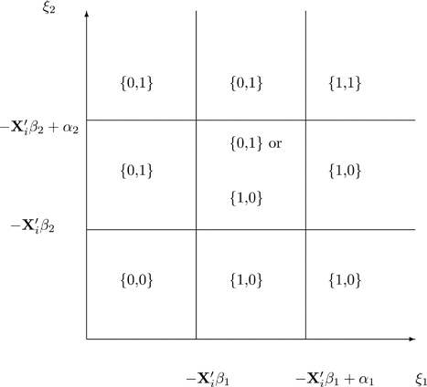

# 4 실증적 진입 게임

DOI: [10.1201/b23262-4](./https___doi.org_10.1201_b23262-4.md)

## 4.1 서론

이 장에서는 [제2장](./10-chapter2.md)에서 제시된 진입 게임을 다시 살펴봅니다. 이 게임에서는 두 기업이 시장 진입 여부를 고려하고 있습니다. 문제는 진입에 비용이 들고 두 기업 모두 시장을 독점하기를 원한다는 점입니다. 균형 상태에서는 하나의 기업이 시장에 진입하는 경향이 있지만, 게임 이론은 어느 기업이 진입할지 예측하지 못할 수도 있습니다.

이 장에서는 1990년대에 거대 서점인 보더스(Borders)와 반스앤노블(Barnes & Noble)이 어느 시장에 진입했는지에 대한 질문에 진입 게임을 적용합니다. 90년대에는 도서 소매업에 큰 변화가 있었습니다. 유통 기술의 변화로 인해 대형 서점들이 다양한 종류의 도서뿐만 아니라 음악, 게임, 심지어 커피와 같은 다른 제품들을 가지고 시장에 진입하는 것이 수익성이 있게 되었습니다. 보더스와 반스앤노블 같은 체인점들은 소규모 체인점을 인수하고 새로운 부지(green fields sites)에 진입함으로써 이러한 변화를 주도했습니다. 이 기업들은 어느 시장에 진입했을까요? 만약 이들의 합병이 허용되었다면 어떤 일이 발생했을까요?

이 장에서는 댄 맥패든(Dan McFadden)의 의사결정 모델을 기반으로 한 실증적 진입 모델을 소개합니다. 이 실증적 모델은 기업들이 서로 의존적인 의사결정을 할 수 있도록 게임 형태로 확장됩니다. 90년대 초반에 합병이 이루어졌다면 그 합병의 영향이 어떠했을지 분석합니다.

## 4.2 실증적 모델

이 절은 표준 선택 모델에 대한 설명으로 시작합니다. 이 모델은 1970년대 초반 댄 맥패든이 소비자 선택 문제를 분석하기 위해 처음 개발했습니다. 맥패든은 샌프란시스코에 건설된 새로운 지하철 시스템인 베이 에어리어 고속철도(BART, Bay Area Rapid Transit) 시스템을 누가 이용할지에 관심이 있었습니다. 여기서는 기업이 어느 시장에 진입할지 선택하는 것을 분석하기 위해 이 모델을 조정합니다. 이 모델은 시장의 관측되지 않은 특성들이 기업 간에 상관관계가 있을 수 있도록 일반화됩니다. 또한 기업들이 서로에게 의존적인 선택을 할 수 있도록 한 번 더 일반화됩니다.

### 4.2.1 단일 기업 진입 모델

2000년까지 반스앤노블은 미국 내 283개 카운티에 서점을 보유하고 있었지만, 이는 3,000개가 넘는 카운티 중 일부에 불과합니다. 이러한 대형 서점을 특정 위치에 배치하는 것은, 특히 새로운 건축이 포함되는 경우 저렴하지 않습니다. 그렇다면 반스앤노블은 어느 카운티에 위치하기로 선택했을까요?

특정 카운티에 위치함으로써 얻는 기업의 잠재적 이윤(latent profits)이 다음과 같다고 가정합니다.

π1i\=Xi′β1+ξ1i(4.1)

여기서 Xi는 인구 규모와 같은 시장 특성이며, _β_1은 이러한 특성이 기업의 이윤으로 어떻게 연결되는지를 결정하고, ξ1i는 시장의 관측되지 않은 특성으로 기업의 진입 비용을 나타낸다고 생각할 수 있습니다. 이러한 관측되지 않은 특성은 계량경제학자(즉, 여러분)에게는 관측되지 않지만 기업 자신에게는 관측됩니다.

데이터에 인구 규모(_pop_)와 중위 소득(_income_) 같은 시장 정보가 포함되어 있다면 진입 결정은 다음과 같이 작성할 수 있습니다.

π1i\=β10+β11popi+β12incomei+ξ1i(4.2)

기업 1의 경우, 시장 _i_에서의 이윤은 매개변수 _β_11과 _β_12에 의해 각각 결정되는 popi와 incomei에 의존합니다.

행렬 표기법으로 매개변수 벡터를 다음과 같이 쓸 수 있습니다.

β1\=\[β10β11β12\](./4.3)

마찬가지로 _N_개 시장의 관측된 특성 행렬은 다음과 같습니다.

X\=\[1pop1income11pop2income2⋯1popNincomeN\](./4.4)

첫 번째 열은 모두 1입니다. 행렬 대수에서 이 열은 매개변수 _β_10과 곱해져 모든 시장에 걸쳐 상수를 제공합니다. 우리는 행렬의 _i_번째 행을 사용하고 있으며 그것이 매개변수 벡터 _β_1과 곱해짐을 강조하기 위해 표기법 Xi′를 사용합니다.

반스앤노블은 다음 부등식이 성립할 때만 시장에 진입합니다.

Xi′β1+ξ1i\>0 orξ1i\>−Xi′β1(4.5)

따라서 관측되지 않은 진입 비용이 충분히 낮다면 반스앤노블은 시장에 진입할 것입니다.

기업의 이윤은 도서 수요에 영향을 미치는 다양한 요인, 도서 판매와 관련된 비용, 그리고 매장 위치와 관련된 고정 비용에 의해 결정될 것으로 예상합니다. 관측되지 않은 진입 비용이 표준 정규 분포인 ξi∼N(0,1)를 따른다고 가정하면, 진입 확률은 Φ(−Xi′β1)이며, 여기서 Φ()는 표준 정규 분포의 누적 분포 함수입니다. 이것은 [제1장](./09-chapter1.md)에서 소개된 **프로빗(probit)** 모델입니다. 우리는 [제1장](./09-chapter1.md)에서 사용한 glm() 프로시저를 사용하여 매개변수 _β_1을 추정할 수 있습니다.

maxβ1∑i\=1Ny1ilog(Φ(−Xi′β1))+(1−y1i)log((1−Φ(−Xi′β1))(4.6)

이 모델을 추정하기 위해 우리는 데이터의 우도(likelihood)를 최대화하는 _β_1을 찾을 수 있습니다. 여기서 y1i는 각 카운티에 대해 관측된 진입 결정입니다.[1](./12-chapter4.md#fn4_1)

### 4.2.2 다중 기업 독립 진입 모델

전체 모델로 나아가기 위한 작은 단계로서, 두 기업이 시장에 진입하지만 두 기업이 서로 독립적으로 결정을 내리는 모델을 고려해 봅니다. 이는 반스앤노블과 베스트바이(Best Buy)의 진입 모델일 수 있습니다. 둘 다 대형 매장이며 시장 진입 결정은 계량경제학자에게 관측되거나 관측되지 않은 비슷한 요소들에 기반할 것입니다. 그러나 하나는 책에 초점을 맞추고 다른 하나는 전자제품에 초점을 맞추고 있으므로 특정 시장에 진입하기 위한 이들의 결정이 서로 의존적일 가능성은 낮습니다.

두 기업은 다음 부등식이 성립할 때만 시장 _i_에 진입할 것입니다.

Xi′β1+ξ1i\>0Xi′β2+ξ2i\>0(4.7)

다시 한번 Xi는 인구 규모와 같은 시장의 관측된 특성을 나타냅니다. 이러한 특성은 매개변수 벡터 _β_1과 _β_2에 의해 각 기업의 이윤 함수로 매핑됩니다.

지금까지는 이것이 이전 절의 모델과 다를 바 없어 보입니다. 차이점은 시장의 관측되지 않은 특성들이 두 기업 간에 상관관계를 가질 수 있도록 허용한다는 것입니다. {ξ1i,ξ2i}∼N(μ,Σ)를 따른다고 가정합시다. 여기서 μ\={0,0}이고

Σ\=\[1ρρ1\](./4.8)

말하자면, 시장의 관측되지 않은 특성들이 표준 이변량 정규 분포를 따르도록 허용합니다. 매개변수 ρ∈\[−1,1\]는 두 기업 간의 상관관계를 나타냅니다. 이 매개변수는 두 기업이 고객층과 매장 설립 비용 면에서 얼마나 유사한지에 의존할 가능성이 높습니다. 패스트푸드 레스토랑과 대형 서점은 매우 상관관계가 없는(ρ\=0) 관측되지 않은 특성을 가질 수 있는 반면, 두 대형 서점은 매우 강한 양의 상관관계(높은 _ρ_)를 가질 수 있습니다.

\_\_\_\_\_\_\_\_\_\_\_\_\_\_\_\_\_ [1](./12-chapter4.md#fn4_14b)우리는 컴퓨터가 표현하기에 숫자가 너무 작아서 발생하는 문제를 피하기 위해 확률에 로그를 취합니다.

1을 진입, 0을 진입하지 않는 선택으로 나타내겠습니다. 이 모델에서 우리는 두 기업 모두 진입하지 않는 경우 {0,0}, 기업 1은 진입하지만 기업 2는 진입하지 않는 경우 {1,0}, 기업 1은 진입하지 않지만 기업 2는 진입하는 경우 {0,1}, 그리고 두 기업 모두 진입하는 경우 {1,1}의 네 가지 사례를 관측합니다.

[그림 4.1](./12-chapter4.md#fig4_1)은 두 기업을 위한 시장의 관측되지 않은 특성의 분포가 주어졌을 때 네 가지 사례를 보여줍니다. 시장 전반의 진입 패턴은 관측되지 않은 특성이 기업 간에 상관관계가 있는지 여부를 말해줄 것입니다. 두 기업이 같은 행동을 하는 경우, 즉 두 기업 모두 시장에 진입하거나 어느 기업도 시장에 진입하지 않는 경우를 많이 본다면, 이는 양의 상관관계를 갖는 관측되지 않은 특성과 일치합니다. 시장에 단 하나의 기업만 있는 경우가 많지만 그 분포가 꽤 고르다면, 이는 관측되지 않은 특성이 두 기업 간에 상관관계가 없거나 음의 상관관계가 있는 것과 일치합니다.

[그림 4.1](chapter4) 두 기업 독립 진입 모델의 실증적 함의. 기업 1의 진입은 괄호의 첫 번째 위치에 표시됩니다. 두 기업 모두 낮은 관측되지 않은 특성을 가지면 어느 쪽도 진입하지 않고 {0, 0}, 기업 1의 관측되지 않은 특성이 높으면 기업 1이 진입하며 {1, 0}, 기업 2의 관측되지 않은 특성도 높으면 기업 2 역시 진입합니다 {1, 1}.

우리는 다시 한번 관측된 데이터의 우도를 최대화하는 _β_1, _β_2, _ρ_를 찾고자 하며, 이는 _y_1과 _y_2로 나타납니다.

### 4.2.3 진입 게임

이 모든 설정을 마친 후에 우리의 실증적 진입 게임을 작성할 수 있습니다. 이전 절과 마찬가지로 두 기업이 시장 _i_에 진입해야 할지 여부를 고려하고 있습니다. 이들은 다음 부등식이 성립하면 진입할 것입니다.

Xi′β1−D2iα1+ξ1i\>0Xi′β2−D1iα2+ξ2i\>0(4.9)

여기서 D1i∈{0,1}이고 D2i∈{0,1}입니다. 이 부등식들과 식 (4.7)의 부등식들 사이에는 몇 가지 차이점이 있습니다. 첫 번째는 두 개의 추가 매개변수 _α_1과 _α_2가 있다는 것입니다. 이들은 다른 기업과 경쟁하는 것과 관련된 감소된 이윤을 나타냅니다. 이것은 다른 기업이 시장에 진입할 때만 발생합니다. D2i\=1이면 기업 1의 이윤은 _α_1만큼 낮아지며, 여기서 D2i\=1은 오직 두 번째 부등식이 성립할 때만 그러합니다. D1i\=1이면 기업 2의 이윤이 낮아지며, 이는 오직 첫 번째 부등식이 성립할 때만 발생합니다.

이제 여러분은 문제의 시작을 볼 수 있을 것입니다. 첫 번째 부등식은 두 번째 부등식의 결과에 의존하며, 두 번째 부등식은 첫 번째 부등식의 결과에 의존합니다! 무슨 일이 일어나고 있는지 알아보기 위해 위에서 제시된 그림의 버전을 고려해 보세요.

[그림 4.2](./12-chapter4.md#fig4_2)는 게임을 나타냅니다. 두 기업 모두 관측되지 않은 이익이 크면(고정 진입 비용이 낮으면) 두 기업 모두 진입할 것이고 {1,1}, 작으면 어느 쪽도 진입하지 않을 것입니다 {0,0}. 기업 1에게는 매우 크고 기업 2에게는 매우 작다면 기업 1이 진입할 것입니다 {1,0}. 마찬가지로 반대의 경우도 성립합니다 {0,1}. 모델이 무엇이 일어날지에 대해 명확한 예측을 하지 못하는 중간 결과도 존재합니다. 기업 1이 진입하고 기업 2는 진입하지 않을 수도 있고, 또는 그 반대일 수도 있습니다. 모델은 분명히 한 기업이 진입할 것이라고 예측하지만, 그것이 어느 기업이 될지는 예측하지 않습니다.

 Long Description for Figure 4.2 

수평축은 xi 밑첨자 1로 라벨이 지정되어 있으며, 음의 x 밑첨자 i 프라임 베타 밑첨자 1과 음의 x 밑첨자 i 프라임 베타 밑첨자 1 플러스 알파 밑첨자 1에 눈금 표시가 있습니다. 수직축은 xi 밑첨자 2로 라벨이 지정되어 있으며, 음의 x 밑첨자 i 프라임 베타 밑첨자 2와 음의 x 밑첨자 i 프라임 베타 밑첨자 2 플러스 알파 밑첨자 2에 눈금 표시가 있습니다. 수직선과 수평선은 라벨이 지정된 지점들에서 연장됩니다. 왼쪽 아래에서 오른쪽 위까지 각 상자의 항목은 다음과 같습니다: 0 콤마 0; 1 콤마 0; 1 콤마 0; 0 콤마 0; 0 콤마 1 또는 1 콤마 0; 1 콤마 0; 0 콤마 1; 0 콤마 1; 그리고 1 콤마 1.

[그림 4.2](chapter4) 진입 게임의 실증적 함의. 기업 1의 진입은 괄호의 첫 번째 위치에 표시됩니다. 중간 사각형 영역은 결정되지 않은(in determinant) 결과를 가집니다. 한 기업은 진입하지만, 어느 기업이 진입할지는 분명하지 않습니다.

## 4.3 실증적 분석: **R**을 이용한 서점 진입

이 절에서는 위에서 제시된 실증적 모델을 추정하기 위한 코드를 제시합니다. 원래의 진입 모델에서 진입 게임으로의 발전을 보여주기 위해 세 모델 모두에 대한 코드를 제공합니다. 첫 번째 모델은 프로빗일 뿐이므로 **R**에 내장된 glm() 함수를 사용할 수 있습니다. 그러나 이 경우에 대한 코드를 포함하면 더 복잡한 모델들이 어떻게 작동하는지 쉽게 볼 수 있습니다.

### 4.3.1 **R**에서의 단일 기업 진입 모델

추정 알고리즘은 **최대 우도법(maximum likelihood)**입니다. 이 방법에서는 관측한 데이터가 특정 모델에 의해 생성되었을 우도(가능도)를 최대화하는 매개변수 값을 찾습니다. 특정 매개변수 값이 주어졌을 때 관측된 데이터가 발생할 확률을 계산하는 함수가 필요합니다. **R**에서는 이를 수행하는 몇 가지 다른 방법이 있습니다. 이 절에서는 확률을 **수치적으로(numerically)** 계산할 것입니다. 즉, 이 절은 컴퓨터가 많은 계산을 하도록 하여 확률을 근사화하는 방법을 제시합니다. 이 방법은 C 기반의 내장 함수를 사용하는 것만큼 효율적이지는 않지만, 특히 문제가 더 복잡해질 때 무슨 일이 일어나고 있는지 파악하기가 더 쉽습니다.

`_> set.seed(123456789)_`
`_> K = 10000_`
`_> Z1 = rnorm(K)_`
이 코드는 표준 정규 분포에서 K = 10000개의 의사 난수(pseudo-random draws)를 생성합니다. 함수 rnorm()은 표준 정규 분포에서 추출하기 위한 **R** 함수입니다. 이것들은 **전역(global)** 변수이므로 우리가 작성하는 모든 함수에서 사용할 수 있습니다. 함수 set.seed()는 결과를 정확하게 복제할 수 있도록 확인하는 데 사용됩니다.

`_>   fentry = function(X, beta1) {_`
`_+     X1 = as.matrix(cbind(1, X))`
`_+     N = dim(X1)[1]`
`_+     xi = Z1`
`_+     Xb = X1%*%beta1`
`_+     p = rep(0, N)`
`_+     for(k in 1:K) {`
`_+       pik = Xb + xi[k]`
`_+       p = p + (pik > 0)`
`_+     }`
`_+     return(p/K)`
`_+   }_`
`_>   floglik = function(X, y, beta) {_`
`_+     epsilon = 1e-5`
`_+     p = fentry(X, beta)`
`_+     return(-mean((y == 1)*log(p + epsilon) +`
`_+                  (y == 0)*log(1 - p + epsilon)))`
`_+   }_`
함수 f\_entry()는 데이터 행렬 X (1의 열 없이)와 매개변수 벡터 beta를 받습니다. 행렬 X는 인구 규모와 중위 소득과 같은 각 시장의 관측된 특성을 나타내는 데이터 열로 구성됩니다.

시장 _i_에 진입할 확률은 관측되지 않은 특성 xi의 수많은 가능한 값들이 주어졌을 때 이윤이 양수가 될 확률에 의해 결정됩니다.

함수 f\_loglik은 관측된 데이터가 주어졌을 때 모델이 참일 확률을 계산합니다. 이 코드는 식 (4.6)과 동등합니다. 이 함수는 결과 벡터 y를 취합니다. 벡터 y는 1이 진입을 나타내고 0이 기업이 시장에 진입하지 않았음을 나타내는 데이터의 각 시장에 기업이 진입했는지 여부를 명시합니다. 이 함수는 우리가 계산하는 숫자가 컴퓨터가 처리할 수 있는 가장 작은 숫자보다 작아져서 문제가 발생하지 않도록 확률을 로그로 변환합니다. 나중에 이 함수를 실제 문제에 적용할 때, 로그 변환된 함수에서 beta의 최적값이 원래 함수와 동일하다는 사실에서 이득을 얻을 것입니다. 유의할 점은 mean() 함수 앞에 음수 기호가 있다는 것입니다. 이것은 사용된 최적화 알고리즘이 최솟값을 찾도록 기본 설정되어 있기 때문에 음의 로그-우도(negative log-likelihood)의 최솟값이 최대 로그-우도가 되게 하기 위해 존재합니다. 값 epsilon은 컴퓨터가 0의 로그를 계산하려고 시도할 때 충돌하지 않도록 보장하기 위해 설계된 작은 숫자입니다.

### 4.3.2 **R**에서의 다중 기업 독립 진입

`_> Z2 = rnorm(K)_`
이번에는 2차원 분포가 필요합니다. 따라서 첫 번째 단계는 표준 정규 함수에서 추출된 또 다른 대규모 난수 집합을 만드는 것입니다.

`_>   f2entry = function(X, beta1, beta2, rho) {_`
`_+     N = dim(X)[1]`
`_+     xi1 = Z1`
`_+     xi2 = Z2*sqrt(1 - rho^2) + rho*Z1`
`_+     Xb1 = X%*%beta1`
`_+     Xb2 = X%*%beta2`
`_+     p00 = p01 = p11 = rep(0, N)`
`_+     for(k in 1:K) {`
`_+       pi1k = Xb1 + xi1[k]`
`_+       pi2k = Xb2 + xi2[k]`
`_+       p00 = p00 + (pi1k < 0 & pi2k < 0)`
`_+       p01 = p01 + (pi1k < 0 & pi2k > 0)`
`_+       p11 = p11 + (pi1k > 0 & pi2k > 0)`
`_+     }`
`_+     return(list(p00 = p00/K,`
`_+                 p01 = p01/K,`
`_+                 p11 = p11/K))`
`_+   }_`
`_>   floglik2 = function(X, y, beta1, beta2, rho) {_`
`_+     epsilon = 1e-10`
`_+     Lik = f2entry(X, beta1, beta2, rho)`
`_+     return((y[,1] == 0 & y[,2] == 0)*log(Lik$p00 + epsilon) +`
`_+            (y[,1] == 0 & y[,2] == 1)*log(Lik$p01 + epsilon) +`
`_+            (y[,1] == 1 & y[,2] == 1)*log(Lik$p11 + epsilon) +`
`_+            (y[,1] == 1 & y[,2] == 0)*log(1 -`
`_+                                          Lik$p00 -`
`_+                                          Lik$p01 -`
`_+                                          Lik$p11 +`
`_+                                          epsilon))`
`_+   }_`
`_>   floglik2int = function(par, X, y) {_`
`_+     X = as.matrix(cbind(1, X))`
`_+     J = dim(X)[2]`
`_+     beta1 = par[1:J]`
`_+     beta2 = par[(J+1):(2*J)]`
`_+     rho = -1 + 2*exp(par[2*J+1])/(1 + exp(par[2*J+1]))`
`_+     return(-mean(floglik2(X, y, beta1, beta2, rho)))`
`_+   }_`
코드 줄 수를 세어보면 결정을 독립적으로 내리지만 상관관계가 있는 두 기업이 있을 때 일이 훨씬 더 복잡해짐을 알 수 있습니다. 함수 f\_2entry()에는 기업 1 (beta\_1), 기업 2 (beta\_2) 및 관측되지 않은 항(rho) 간의 상관관계를 위한 매개변수가 있습니다. 관측되지 않은 항 xi\_2는 Z\_1과 Z\_2 모두의 함수입니다. rho가 높을수록 Z\_1에 더 많은 가중치를 부여합니다. 이 함수는 아무도 진입하지 않음, 기업 1만 진입함, 둘 다 진입함의 세 가지 사례를 관측할 확률을 결정합니다. 확률의 합은 1이어야 하므로 네 번째 사례는 나머지(residual)로 계산됩니다.

코드는 이제 추가 함수인 f\_loglik\_2\_int()를 포함합니다. 이것은 **R**의 최적화 알고리즘 optim()에서 사용하도록 설계된 중간 함수입니다. 이 경우 매개변수 rho는 -1과 1 사이로 제한됩니다. 최적화 알고리즘이 원하는 값을 선택하도록 허용하되 해당 값을 모델에서 요구하는 제한된 집합으로 변환하는 것이 좋은 코딩 관행입니다. 이를 위해 코드는 **소프트맥스(softmax)** 함수로도 알려진 exp(x)/(1 + exp(x))를 사용합니다. 이 함수는 임의의 x 값을 받아 0과 1 사이의 숫자로 바꿉니다.

### 4.3.3 **R**에서의 진입 게임

진입 게임은 이전 모델보다 꽤 복잡하지만 추정량은 크게 다르지 않습니다. alpha\_1과 alpha\_2라는 두 개의 추가 매개변수가 있지만 그 외의 모든 것은 거의 같습니다. 가장 큰 차이점은 모델이 데이터 내에서 두 사례를 구별할 수 없다는 점입니다. 모델은 한 기업이 언제 시장에 진입할지 예측하지만, 그것이 어느 기업이 될지는 예측하지 않습니다. 따라서 모델을 추정하기 위해서는 이 두 사례를 결합해야 합니다.

`_> fentrygame = function(X, beta1, beta2, alpha1, alpha2`
`_+                          , rho) {_`
`_+   N = dim(X)[1]`
`_+   xi1 = Z1`
`_+   xi2 = Z2*sqrt(1 - rho^2) + rho*Z1`
`_+   Xb1 = X%*%beta1`
`_+   Xb2 = X%*%beta2`
`_+   p00 = p11 = rep(0, N)`
`_+   for(k in 1:K) {`
`_+     pi1k = Xb1 + xi1[k]`
`_+     pi2k = Xb2 + xi2[k]`
`_+     p00 = p00 + (pi1k < 0 & pi2k < 0)`
`_+     p11 = p11 +`
`_+       (pi1k - alpha1 > 0 & pi2k - alpha2 > 0)`
`_+   }`
`_+   return(list(p00 = p00/K,`
`_+               p11 = p11/K))`
`_+ }_`
함수 f\_loglik\_game\_int()는 이전 절의 동등한 함수와 꽤 비슷합니다. 차이점은 추가 매개변수가 두 개 더 있다는 것입니다. 우리는 이 두 매개변수가 양수가 되도록 제한할 것입니다. 경쟁 증가가 이윤을 감소시킨다는(혹은 아무 일도 하지 않는다는) 결과를 부과할 것입니다.

`_>   floglikgame = function(X, y, beta1, beta2, alpha1,`
`_+                              alpha2, rho) {_`
`_+     epsilon = 1e-10`
`_+     Lik = fentrygame(X, beta1, beta2, alpha1, alpha2, rho)`
`_+     return((y[,1] == 0 & y[,2] == 0)*log(Lik$p00 + epsilon) +`
`_+            (y[,1] == 1 & y[,2] == 1)*log(Lik$p11 + epsilon) +`
`_+            ((y[,1] == 1 & y[,2] == 0) +`
`_+               (y[,1] == 0 & y[,2] == 1))*log(1 -`
`_+                                                Lik$p00 -`
`_+                                                Lik$p11 +`
`_+                                                epsilon))`
`_+   }_`
`_>   floglikgameint = function(par, X, y) {_`
`_+     X = as.matrix(cbind(1, X))`
`_+     J = dim(X)[2]`
`_+     beta1 = par[1:J]`
`_+     beta2 = par[(J+1):(2*J)]`
`_+     alpha1 = exp(par[2*J+1])`
`_+     alpha2 = exp(par[2*J+2])`
`_+     rho = -1 + 2*exp(par[2*J+3])/(1 + exp(par[2*J+3]))`
`_+     return(-mean(floglikgame(X, y, beta1, beta2, alpha1,`
`_+                                alpha2, rho)))`
`_+   }_`
## 4.4 실증적 분석: **R**을 이용한 서점 진입

반스앤노블은 그 기원을 1800년대로 두고 있지만 1990년대 초 이 기업은 슈퍼 서점을 개발했습니다. 거대한 상자 형태의 서점입니다. 목표는 다양한 종류의 서적, 음악, 게임, 심지어 음식과 커피까지 취급하는 것이었습니다. 이는 미국 도서 소매업에 혁명을 일으켰습니다.

반스앤노블은 어디에 진입하기로 선택했을까요? 무엇이 그 위치를 결정했을까요?

### 4.4.1 데이터

여기서 사용된 데이터는 [Adams and Basker (2025)](./25-refbib.md#ref2)의 것입니다. 저자들은 공개적으로 이용 가능한 인구조사 데이터와 출판된 소매 서점 디렉토리의 정보를 결합합니다.

[표 4.1](./12-chapter4.md#tbl4_1)은 보더스와 반스앤노블 매장이 있는 카운티와 없는 카운티 간의 차이를 보여줍니다. 놀랍지 않게도 이 기업들은 인구가 더 많은 카운티, 더 부유한 카운티, 고등 교육을 받은 인구가 많은 카운티, 1990년에 더 많은 서점이 있었던 카운티에 진입했습니다.

__[표 4.1](chapter4) 반스앤노블 및 보더스 존재 여부에 따른 카운티 평균 특성.__
| 대학(College)             |         |           |                |    |
| ------------------- | ------- | --------- | -------------- | -- |
| 인구(Population)          | 소득(Income)  | 점유율 (%)(Share (%)) | 서점 수 (#)(Bookstores (#)) |    |
| 없음(None)                | 37,857  | 33,513    | 15             | 2  |
| 반스앤노블만(Only Barnes & Noble) | 275,435 | 43,210    | 27             | 14 |
| 보더스만(Only Borders)        | 548,218 | 49,118    | 31             | 40 |
| 둘 다(Both)                | 272,191 | 46,476    | 26             | 12 |

참고: 반스앤노블과 보더스의 존재 여부는 2000년을 기준으로 합니다. 어느 체인점도 없는 카운티는 2,792개, 반스앤노블만 있는 카운티는 155개, 보더스만 있는 카운티는 36개, 두 체인점 모두 있는 카운티는 128개입니다. 인구, 소득, 대학 점유율은 2000년 데이터를 사용합니다. 소득은 2000년의 카운티 수준 가계 중위 소득을 나타냅니다. 대학 점유율은 2000년에 대학 학위를 소지한 25세 이상 인구의 비율입니다. 서점 수는 1990년 카운티 내 총 서점 수입니다.

### 4.4.2 단일 기업 진입의 추정

식 (4.5)에 제시된 모델은 반스앤노블 매장 위치에 대한 데이터와 카운티 수준의 다양한 경제 및 인구통계학적 정보를 결합하여 추정할 수 있습니다. 이 데이터 외에도 반스앤노블 슈퍼 서점이 생기기 이전인 1990년의 카운티 내 서점 수에 대한 정보가 있습니다. 우리는 유사하게 보더스의 진입을 모델링할 수 있습니다.

이 분석에서 게임은 없습니다. 반스앤노블과 보더스는 이들의 진입 결정을 최적으로 내린다고 가정하지만, 이러한 결정은 서로 완전히 독립적입니다. 모델의 매개변수를 추정하기 위해 우리는 최대 우도 추정량과 함수 f\_loglik() 및 f\_enter()를 사용하거나 [제1장](./09-chapter1.md)에서 소개된 glm() 프로시저를 사용할 수 있습니다.

`_> file = paste0(dir, “book2000.csv”)_`
`_> dt = fread(file)_`
` `
` `
`_> glm1 = glm(enter ~ logpop2000 + medincome + college +`
`_+              stores1990,`
`_+            data = dt,`
`_+            family = binomial(link = “probit”))_`
이 함수는 결과가 진입 또는 진입하지 않음과 같이 이진수이고 시장의 관측되지 않은 특성이 평균 0과 표준 편차 1인 정규 분포로 분포된 경우를 추정하는 데 사용됩니다. 이것이 **프로빗 모델**입니다.

`_>   init = glm1$coefficients_`
`_>   data = data.frame(y = dt$enter,`
`_+                     pop = dt$logpop2000,`
`_+                     income = dt$medincome,`
`_+                     college = dt$college,`
`_+                     stores1990 = dt$stores1990)_`
`_>   data = na.omit(data)_`
`_>   res1 = bs(init, floglik,`
`_+             y = data$y,`
`_+             X = cbind(data$pop,`
`_+                       data$income,`
`_+                       data$college,`
`_+                       data$stores1990))_`
glm1 결과는 f\_loglik()을 사용하는 최대 우도 추정량을 위한 초기 시작 값으로 사용됩니다. 그런 다음 코드는 반스앤노블이 어느 서점에 진입했는지에 대한 정보, 카운티의 인구 규모, 카운티의 대졸자 비율 및 1990년 카운티 내 서점 수를 포함하여 추정량에 사용될 데이터를 생성합니다. 객체 res1은 결과를 저장합니다. 이것은 데이터 세트에서 의사 샘플(pseudo samples)을 생성하고 optim() 함수를 사용하여 f\_loglik() 함수를 이용해 우도를 최대화하는 매개변수 값을 결정하는 bs()라는 함수를 사용합니다.[2](./12-chapter4.md#fn4_2)

`_> dt$enter2 = ifelse(dt$borders > 0, 1, 0)_`
`_> glm2 = glm(enter2 ~ logpop2000 +`
`_+              medincome +`
`_+              college + stores1990, data = dt,`
`_+            family=binomial(link=“probit”))_`
데이터 세트는 누락된 값이 있는 관측치를 제거하도록 조정됩니다. 이를 수행하기 위해 함수 na.omit()가 사용됩니다.[3](./12-chapter4.md#fn4_3)

\_\_\_\_\_\_\_\_\_\_\_\_\_\_\_\_\_ [2](./12-chapter4.md#fn4_24b)함수 bs()는 이 책의 github 페이지에서 얻을 수 있습니다.

[3](./12-chapter4.md#fn4_34b)**R**은 누락된 값을 나타내기 위해 NA를 사용합니다.

`_>   init = glm2$coefficients_`
`_>   data = data.frame(y = dt$enter2,`
`_+                     pop = dt$logpop2000,`
`_+                     income = dt$medincome,`
`_+                     college = dt$college,`
`_+                     stores1990 = dt$stores1990)_`
`_>   data = na.omit(data)_`
`_>   res2 = bs(init, floglik,`
`_+             y = data$y,`
`_+             X = cbind(data$pop,`
`_+                       data$income,`
`_+                       data$college,`
`_+                       data$stores1990))_`
위 코드는 비슷하게 보더스 매장이 진입할 시장 선택을 추정하기 위한 데이터 세트를 생성합니다. bs() 함수를 사용하여 프로빗 모델을 추정하고 결과를 res2 객체에 저장합니다.

### 4.4.3 두 기업 진입 모델의 추정

[표 4.2](./12-chapter4.md#tbl4_2)는 위에서 논의된 여러 진입 모델의 결과를 제시합니다. 첫 번째 모델은 두 기업이 서로 독립적인 최적의 결정을 내린다고 가정합니다. 또한 두 기업이 각 시장에서 직면하는 관측되지 않은 특성들이 두 기업 간에 독립적이라고 가정합니다.

__[표 4.2](chapter4) 세 모델의 추정 결과. "Probit"으로 표시된 첫 번째 열 집합은 두 기업이 전략적으로 독립적이고 통계적으로도 독립적인 진입 결정을 내린다는 가정을 바탕으로 한 추정치입니다. "BiProbit"으로 표시된 두 번째 열 집합은 기업의 진입 결정이 전략적으로 독립적이라고 가정합니다. 여기서는 시장의 관측되지 않은 특성이 기업 간에 상관관계가 있을 수 있도록 허용합니다. "Game"으로 표시된 두 열은 두 기업의 진입 결정이 전략적으로나 통계적(stochastically)으로 종속적인 경우를 나타냅니다. "SD"로 표시된 열은 부트스트랩 표준 오차를 나타냅니다.__
| 프로빗(Probit)          | 표준오차(SD)     | 이변량 프로빗(BiProbit) | 표준오차(SD)     | 게임(Game) | 표준오차(SD)     |      |
| --------------- | ------ | -------- | ------ | ---- | ------ | ---- |
| const\_1        | ‒15.06 | 0.22     | ‒15.03 | 0.09 | ‒15.11 | 0.25 |
| Pop\_1          | 1.08   | 0.02     | 1.09   | 0.01 | 1.07   | 0.01 |
| Income\_1       | ‒1.03  | 0.44     | ‒1.04  | 0.25 | ‒0.76  | 0.48 |
| College\_1      | 5.68   | 0.66     | 5.51   | 0.34 | 5.65   | 0.55 |
| Stores\_1990\_1 | 0.28   | 0.09     | 0.28   | 0.07 | 0.37   | 0.11 |
| const\_2        | ‒11.57 | 0.26     | ‒11.54 | 0.11 | ‒11.37 | 0.20 |
| Pop\_2          | 0.66   | 0.03     | 0.66   | 0.01 | 0.65   | 0.02 |
| Income\_2       | 1.75   | 0.51     | 1.74   | 0.25 | 1.31   | 0.80 |
| College\_2      | 2.49   | 0.70     | 2.59   | 0.33 | 2.70   | 0.55 |
| Stores\_1990\_2 | 0.52   | 0.08     | 0.49   | 0.06 | 0.79   | 0.11 |
| alpha\_1        | 0.73   | 0.18     |        |      |        |      |
| alpha\_2        | 0.70   | 0.12     |        |      |        |      |
| rho             | ‒0.08  | 0.10     | 0.47   | 0.10 |        |      |

두 기업 모델은 단일 기업 진입 모델과 유사합니다. 두 기업의 진입 결정은 서로 독립적이지만 시장의 관측되지 않은 특성들은 기업 간에 상관관계가 있을 수 있습니다. 우리는 두 기업이 전략적으로는 독립적이지만 시장은 통계적으로 종속되어 있다고 말합니다. 이것이 **이변량 프로빗 모델(biprobit model)**입니다. 코드는 다시 분석을 위한 데이터 세트를 만들고 누락된 값을 제거하며 f\_loglik\_2\_int를 호출하는 bs() 함수를 사용합니다. 이 결과를 res3에 저장합니다.

`_>   init = c(glm1$coefficients,`
`_+            glm2$coefficients,`
`_+            0)_`
`_>   data = data.frame(y1 = dt$enter,`
`_+                     y2 = dt$enter2,`
`_+                     pop = dt$logpop2000,`
`_+                     income = dt$medincome,`
`_+                     college = dt$college,`
`_+                     stores1990 = dt$stores1990)_`
`_>   data = na.omit(data)_`
`_>   res3 = bs(init, floglik2int,`
`_+             y = cbind(data$y1,`
`_+                       data$y2),`
`_+             X = cbind(data$pop,`
`_+                       data$income,`
`_+                       data$college,`
`_+                       data$stores1990))_`
### 4.4.4 진입 게임 모델의 추정

세 번째 모델의 경우, 두 기업이 시장에 진입하며 두 기업의 관측되지 않은 특성들이 다시 시장 전반에 걸쳐 상관관계가 있습니다. 이번에는 진입 결정이 상대방 기업의 선택에 의존합니다. 결정은 이제 서로 종속적입니다. 이 모델은 이전 모델과 동일한 데이터를 사용합니다. f\_loglik\_game\_int() 우도 함수와 함께 bs() 함수를 사용하며 결과를 res4 객체에 저장합니다.

`_> init = c(glm1$coefficients,`
`_+          glm2$coefficients,`
`_+          0,`
`_+          0,`
`_+          0)_`
`_> res4 = bs(init, floglikgameint,`
`_+           y = cbind(data$y1,`
`_+                     data$y2),`
`_+           X = cbind(data$pop,`
`_+                     data$income,`
`_+                     data$college,`
`_+                     data$stores1990))_`
결과 표에는 추정 매개변수의 표준 오차에 대한 정보도 제시되어 있습니다. 이 값들은 **부트스트랩(bootstrap)** 방법을 사용하여 결정됩니다. 이 방법은 다른 샘플을 사용할 때 추정치가 어떻게 달라질 수 있는지를 근사화합니다.[4](./12-chapter4.md#fn4_4)

[표 4.2](./12-chapter4.md#tbl4_2)는 위에서 논의한 세 가지 모델에 대한 추정 매개변수 값을 제시합니다. _α_ 매개변수는 두 기업이 있을 경우 이윤이 낮아짐을 나타냅니다. 매장 위치는 인구 규모, 교육 수준, 기존 서점 수와 양의 상관관계가 있습니다. 소득이 어떠한 영향을 미치는지는 불분명합니다. 마지막으로 관측되지 않은 진입 비용은 두 기업 간에 높은 상관관계가 있습니다.

\_\_\_\_\_\_\_\_\_\_\_\_\_\_\_\_\_ [4](./12-chapter4.md#fn4_44b)부트스트랩 방법은 현재 데이터를 리샘플링(resampling)하고 새로운 의사 샘플(pseudo-sample)을 사용하여 모델을 다시 추정함으로써 새로운 샘플에서의 추정치를 근사화합니다.

### 4.4.5 모델 적합도

우리는 추정된 매개변수를 사용하여 모델을 시뮬레이션하고 예측된 진입 결정을 실제 진입 결정과 비교할 수 있습니다. 이는 모델의 적합도(fit)를 테스트하는 한 가지 방법을 제공합니다. 표시되지 않은 코드는 모델을 1,000번 시뮬레이션하고 예측된 진입 결정을 실제 진입 결정과 비교합니다. 결과는 [표 4.3](./12-chapter4.md#tbl4_3)에 제시되어 있습니다.

__[표 4.3](chapter4) 세 모델의 예측과 실제 결과 비교. 대각선의 백분율이 높을수록 모델의 적합도가 좋습니다. 모든 모델은 발생 확률이 높은 사건, 즉 어느 기업도 진입하지 않는 것을 예측하는 데 탁월합니다. 비전략적 모델들은 2개 기업 시장에 2개 기업이 존재할 때를 가장 잘 예측하는 반면, 게임 이론 모델은 1개 기업 시장을 가장 잘 예측합니다.__
| 없음(None)           | 1개 기업(One Firm) | 2개 기업(Two Firm) |      |
| -------------- | -------- | -------- | ---- |
| 프로빗(Probit): 없음(None)   | 97.2     | 42.3     | 9.4  |
| 프로빗(Probit): 1개 기업(One)    | 2.5      | 38.8     | 34.9 |
| 프로빗(Probit): 2개 기업(Two)    | 0.3      | 18.9     | 55.6 |
| 이변량 프로빗(BiProbit): 없음(None) | 97.1     | 41.6     | 9.0  |
| 이변량 프로빗(BiProbit): 1개 기업(One)  | 2.6      | 40.0     | 35.9 |
| 이변량 프로빗(BiProbit): 2개 기업(Two)  | 0.3      | 18.4     | 55.1 |
| 게임(Game): 없음(None)     | 97.1     | 41.0     | 9.0  |
| 게임(Game): 1개 기업(One)      | 2.6      | 41.7     | 36.6 |
| 게임(Game): 2개 기업(Two)      | 0.3      | 17.3     | 54.4 |

[표 4.3](./12-chapter4.md#tbl4_3)은 세 가지 모델에 대한 모델 적합도 결과를 제시합니다. 비록 게임 이론 모델이 1개 기업 시장을 예측하는 데 약간 더 낫긴 하지만, 세 추정량 간에 큰 차이는 없습니다.

## 4.5 **R**을 이용한 정책 분석

반스앤노블과 보더스가 합병했다면 어떻게 되었을까요? 여기서 우리는 가격에 미치는 영향이 아니라 합병된 기업이 어느 카운티에 진입할지에 주목할 것입니다. _α_ 매개변수가 합병 후에도 동일하게 유지된다고 가정해 봅시다.[5](./12-chapter4.md#fn4_5) 합병이 가져오는 차이점은 기업들이 진입을 조정(coordinate)할 수 있게 된다는 것입니다. 이 분석은 합병된 기업이 두 개의 고유 브랜드를 유지할 것이라고 가정합니다.

이 대안적 현실에서 어떤 일이 일어날지 결정하기 위해 우리는 위에서 추정한 매개변수 값을 사용하여 데이터가 있는 시장의 수천 가지 결과를 시뮬레이션해 볼 수 있습니다.

\_\_\_\_\_\_\_\_\_\_\_\_\_\_\_\_\_ [5](./12-chapter4.md#fn4_54b)_α_ 매개변수가 매장 간의 고객 전환(diversion)과 가격 모두를 설명한다는 점을 감안할 때, 합병 후에는 이 값이 더 작아지겠지만 영(0)이 되지는 않을 것으로 예상합니다.

[표 4.4](./12-chapter4.md#tbl4_4)는 보더스와 반스앤노블의 합병 시뮬레이션 요약을 제시합니다. 시뮬레이션은 우리가 실제로 보는 것보다 매장이 있는 카운티를 더 많이 예측하는 경향이 있지만, 두 매장이 모두 존재하는 카운티는 더 적게 예측합니다. 모델은 합병으로 인해 보더스와 반스앤노블이 모두 있는 시장이 더 적어질 것이라고 예측합니다. 추정치의 분산은 제시되지 않았지만, 두 매장이 모두 있는 시장이 더 적어질 것이라는 점은 꽤 분명합니다. 일부 소비자들은 어느 한쪽을 선호하므로, 그러한 시장의 사람들은 더 나빠지게 됩니다. 우리는 그것을 품질 하락으로 생각할 수 있습니다. 또한 그러한 시장에서의 경쟁 감소는 더 높은 가격으로 이어질 가능성이 높습니다.[6](./12-chapter4.md#fn4_6)

__[표 4.4](chapter4) 2000년의 실제 진입과 시뮬레이션 된 진입, 그리고 합병 조건 하에서 시뮬레이션 된 진입의 비교.__
| 실제(Actual)        | 시뮬레이션(Sim)  | 합병(Merge) |      |
| ------------- | ---- | ----- | ---- |
| 없음(none)          | 2919 | 2895  | 2895 |
| BN 또는 Borders(BN or Borders) | 170  | 191   | 238  |
| 둘 다(both)          | 128  | 93    | 46   |

2열과 3열의 첫 번째 행 값은 동일합니다. 합병은 시장에 두 개의 기업이 있을지 혹은 한 개의 기업이 있을지를 변경하지만, 적어도 한 기업이 진입할 것인지 여부는 변경하지 않습니다. 그 이유는 게임이 명시적으로 두 기업이 진입을 조정한다고 가정하기 때문입니다. [제5장](./13-chapter5.md)과 [제8장](./17-chapter8.md)에서는 기업이 조정할 수 없는 게임을 고려합니다. 이러한 경우에는 합병이 실제로 시장에 진입하는 기업을 더 많게 만들 수도 있습니다.

\_\_\_\_\_\_\_\_\_\_\_\_\_\_\_\_\_ [6](./12-chapter4.md#fn4_64b)[제3장](./11-chapter3.md)에 제시된 분석을 참조하십시오.

## 4.6 토론 및 추가 독서

이 분석은 [Adams and Basker (2025)](./25-refbib.md#ref2)를 기반으로 합니다. 저자들은 공개적으로 이용 가능한 인구 조사 데이터와 소매 서점의 디렉토리를 사용하여 미국 내 대형 서점의 진입을 분석합니다. 진입 게임 분석은 [Bresnahan and Reiss (1991a)](./25-refbib.md#ref16)와 [Tamer (2003)](./25-refbib.md#ref54)를 기반으로 합니다. [제5장](./13-chapter5.md), [제6장](./15-chapter6.md), [제8장](./17-chapter8.md)은 서로 다른 모델링 가정을 하에 이 문제를 다시 살펴봅니다. [제5장](./13-chapter5.md)은 데이터에서 게임의 결과가 혼합 전략 내시 균형(mixed strategy Nash equilibrium)이라고 가정하고 문제를 다시 살펴봅니다.

게임 이론은 우리가 관측하는 진입 결정을 더 잘 설명해 주지만, 분석을 더 어렵게 만들 수도 있습니다. 진입 문제는 일종의 조정 게임(coordination game)이며 다른 조정 게임과 마찬가지로 다중 균형(multiple equilibria)을 가지는 경향이 있습니다. 이는 매개변수 값의 한 세트에 대해 모델이 우리가 데이터에서 볼 것에 대해 다중 예측을 내림을 의미합니다. 이것이 모델 추정을 어렵게 만듭니다. 여기서 제시된 해결책은 단순히 모든 균형을 하나의 관측된 결과로 결합하는 [Bresnahan and Reiss (1991a)](./25-refbib.md#ref16)를 따릅니다. [Tamer (2003)](./25-refbib.md#ref54)는 더 효율적인 모델을 추정하는 방법을 제시합니다. 실증적 산업 조직(empirical industrial organization) 분야의 많은 논문들은 게임으로부터 고유한 예측을 도출할 수 있는 대안적 가정을 세웁니다. [제6장](./15-chapter6.md)에서 이 옵션에 대해 논의합니다.

보더스와 반스앤노블은 1990년대나 2000년대에 합병을 제안하지 않았습니다. 그들이 그것을 고려하긴 했을까요? 그들은 1999년과 2005년에 있었던 연방거래위원회(FTC)의 블록버스터(Blockbuster)와 할리우드 비디오(Hollywood Video) 합병 저지에 단념했던 것일까요?[7](./12-chapter4.md#fn4_7) 보더스는 2011년에 파산 절차에 들어갔고, 반스앤노블이 보더스의 지적 재산 중 일부를 인수했습니다.[8](./12-chapter4.md#fn4_8)

\_\_\_\_\_\_\_\_\_\_\_\_\_\_\_\_\_ [7](./12-chapter4.md#fn4_74b)<https://www.nytimes.com/2005/03/26/business/media/blockbuster-ends-bid-for-rival.html>

[8](./12-chapter4.md#fn4_84b)<https://www.barnesandnobleinc.com/about-bn/history/>. 접속일자 2/20/23.

[_OceanofPDF.com_](./https___oceanofpdf.com)

