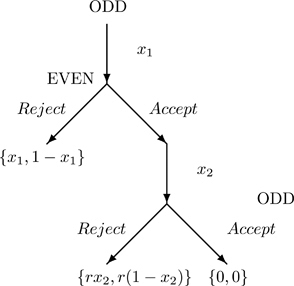
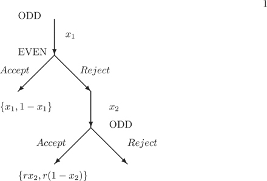

# 8Bargaining

DOI: [10.1201/b23262-8](./https___doi.org_10.1201_b23262-8.md)

## 8.1 Introduction

When you take your first economics class you learn about two price setting mechanisms, perfect competition and monopoly. You learn about the case where no seller in the market has any power to determine the price and the case where the only seller has the power to determine the price. You may have also been exposed to the idea that the buyer has the power to determine the price, monopsony. What about the case when both the buyer and the seller have the power to determine the price? What happens in that case?

In the case where both sides of the transaction have the ability to determine the price, we need a bargaining model. We need a model that can help determine what the outcome will be. This chapter considers three models of bargaining, the **ultimatum game**, the **alternating offer game** and the **Nash bargaining model**.

While the **ultimatum game** is very simple, our predictions of what will happen in the game are both unsatisfactory and do not seem to agree with what happens when actual people play the game. The chapter goes through the various predictions for this game and then looks at what happens in experiments where real people play the game. In order to develop a game that predicts outcomes that seem more reasonable the chapter presents the **alternating offers game**. The chapter shows that while this game is quite complicated, its predictions are quite intuitive. The third model of bargaining is not technically a game. That said, it can be shown that the Nash bargaining model is equivalent to certain alternating offers games. So, although the model itself is not game theoretic, it does have a game theoretic foundation. More importantly, the Nash bargaining model is much simpler than the alternating offers game. This simplicity has allowed the model to become an important tool in empirical analysis of situations where bargaining is used to determine prices.

The chapter uses the Nash bargaining model to understand competition between hospitals in Florida. The empirical estimates are used to predict the effect on hospital prices of a merger between hospitals located in Palm Beach County, the home county for this book's publisher.

## 8.2 Ultimatum Game

The simplest way to model a bargaining game is with a “take-it-or-leave-it” offer. A TIOLI offer if you will. The game has two periods. In the first period, one player makes an offer on how to split the pie between the two players.[1](./17-chapter8.md#fn8_1) In the second period, the other player observes the offer and decides to accept or reject. If the second player accepts, then the two players split the pie as determined by the first player's offer. If the second player rejects the offer, then the pie vanishes and neither players gets anything.

What would you do if you are the first player? How much would you give to the second player? How much would you keep for yourself? What if the pie is $5.00? Would you give the other player $2.50? $2.00? $1.00? Whoa. $0.00? How about if the pie is $5,000,000.00? What if you are the second player? Would you reject an offer that you believe is unreasonably low? Would you reject an offer of $2.00? What if the pie is $5,000,000.00, would you reject the $2.00 offer in that case?

This section considers the prediction when we use **Nash equilibrium** and when we use **subgame perfect Nash equilibrium**. It then brings in some data from experiments where actual people play the game and compares the observed outcomes to the predicted outcomes.

### 8.2.1 The Game

We can write down the ultimatum game using a formal representation. Odd's strategy is simple. She offers some number between zero and one, including zero or one. This number represents the share of the pie that Odd keeps if the offer is accepted. Even's strategy is more complicated. Even will accept certain offers and will reject other offers. The notation below is completely general. It includes strategies like reject all offers and accept all offers and accept all offers that are multiples of 0.1345888, etc.

* Players: Odd, Even
* Strategies:  
   1. Odd: Offer x∈\[0,1\]  
   2. Even: If x∈R reject, otherwise accept, where R⊂\[0,1\].
* Payoffs:  
   1. Odd offers _x_, Even accepts: {x,1−x}  
   2. Odd offers _x_, Even rejects: {0,0}

\_\_\_\_\_\_\_\_\_\_\_\_\_\_\_\_\_ [1](./17-chapter8.md#fn8_18b)The term “pie” is used to refer to some outcome that can be divided up between the players. In many cases, this is some fixed amount of money.

where Odd gets the payoff associated with the first element of the set. Odd's strategy is denoted as _x_, which is the share of the pie that Odd receives. The remainder, 1−x, is the share received by Even. Even rejects Odd's offer if _x_ lies in a particular subset of the offers called _R_, which stands for reject. To make things simpler, we will generally assume that Even plays a “cutoff” strategy. That is _R_ is equivalent to the set _x_ where x≥y, where y∈\[0,1\]. If _x_ is large, then Even's share is small and he will reject the offer.

### 8.2.2 Game Tree

While this game is not that complicated, it turns out that presenting it in extensive form is very useful.

[Figure 8.1](./17-chapter8.md#fig8_1) presents the extensive form representation of the ultimatum game. In the first period, Odd makes an offer of _x_ which is some value between 0 and 1\. It is the share of the pie that Odd will keep if Even accepts the offer. After observing Odd's offer, Even decides whether to accept or reject the offer. If Even accepts, then he gets 1−x. If he rejects, then no one gets nothing.

[Figure 8.1](chapter8) An extensive form representation of an ultimatum game. Odd makes an offer _x_ which is the share of the pie that they will keep. Even observes the offer and decides whether or not to accept or reject the offer.

### 8.2.3 Normal Form

As mentioned above, while we generally use extensive form representations for dynamic games, there is nothing to stop us from using a normal form representation. In order to think about some of the predicted outcomes of this game, it is useful to think about the normal form representation.

We will simplify and just consider three strategies by Odd, x∈{0,0.5,1}. We will also limit Even to three strategies. We will further limit Even to cutoff strategies. That is, Even will choose some number such that he will accept any offer less than or equal to that number and reject any offer above that number. We will denote the cutoff value _y_. So y\=0 means that Even rejects any offer that gives him less than the full share. While y\=0.5 means that Even will accept an offer that gives him at least half. Lastly, y\=1 means that Even accepts any offer that Odd makes.

[Table 8.1](./17-chapter8.md#tbl8_1) presents a normal form representation of a simplified version of the ultimatum game. What is the Nash equilibrium of the game? Is x\=0.5,y\=0.5 a Nash equilibrium? What about x\=0,y\=0 or x\=1,y\=1 ?

__[Table 8.1](chapter8) Normal form representation of simplified ultimatum game. Odd's offer is _x_ which is the share Odd receives, with 1−x going to Even. Even's strategy is denoted _y_, and it gives the level of the offer that she will accept. The payoffs are in the cells with Odd first.__
| Odd, Even | y\=0 | y\=0.5   | y\=1     |
| --------- | ---- | -------- | -------- |
| x\=0      | 0, 1 | 0, 1     | 0, 1     |
| x\=0.5    | 0, 0 | 0.5, 0.5 | 0.5, 0.5 |
| x\=1      | 0, 0 | 0, 0     | 1, 0     |

### 8.2.4 Nash Equilibrium

This is a pretty simple game. Odd makes an offer, Even observes the offer and decides to reject or accept the offer. What do you think is the likely outcome of the game? Do you think x\=0.5 in equilibrium? Do you think there will be an even split? Do you think x\=1 ? Do you think Odd will make an offer where she gets to keep the whole pie? What would Even do if he saw such an offer?

Is x\=0.5 a Nash equilibrium? It is if we are a bit more careful in what it is. Remember Even's strategy needs to state what will happen in every possible case, that is, every possible offer Odd could make. Consider the following set of strategies. Odd offers x\=0.5 and Even accepts any offer below 0.5 (or equal) and rejects any offer above 0.5\. This is a Nash equilibrium.

To see that it is a Nash equilibrium, let's go back to our algorithm. In the algorithm, we first assume Odd plays her strategy. We then determine if it is optimal for Even to play the strategy stated in the proposed equilibrium. If it is, we reverse things and assume Even plays the strategy stated in the proposed equilibrium. Given that strategy, we determine if Odd's optimal strategy is the same as in the proposed equilibrium. If it is, then we have a Nash equilibrium!

The proposed equilibrium is {x\=0.5,y\=0.5}

* Assume Odd offers x\=0.5, what is Even's optimal response?  
   1. Even's Payoffs for his different strategies:  
         1. \* y\=0.5: 0.5  
         2. \* y<0.5: 0  
         3. \* y\>0.5: 0.5  
   2. Even can't be made better off with y≠0.5, so y\=0.5 is optimal.
* Assume Even's cutoff is y\=0.5, what is Odd's optimal response?  
   1. Odd's Payoffs from her strategies:  
         1. \* x\=0.5: 0.5  
         2. \* x<0.5: _x_ (which is less than 0.5)  
         3. \* x\>0.5: 0  
   2. Odd is not better off choosing some other offer, so Odd's strategy is optimal and the proposed set of strategies is a Nash equilibrium.

The offer that splits the difference can be part of a Nash equilibrium. Can any split be supported as part of a Nash equilibrium? Yes. All of them.

Any offer by Odd can be supported as a Nash equilibrium of the game. Consider the case where Odd offers _a_ where _a_ is between 0 and 1\. For this case also assume that Even's strategy is for y\=a. That is, Even accepts any offer less than _a_ (or equal to) and rejects any offer above _a_.

* Assume Odd Offers x\=a, what is Even's optimal response?  
   1. Even's payoffs from his strategies:  
         1. \* y\=a: 1−a  
         2. \* y<a: 0  
         3. \* y\>a: 1−a  
   2. Even can't be made better off with y≠a.
* Assume Even will accept any offer below _a_ (y\=a), what is Odd's optimal response?  
   1. Odd's payoffs from her strategies:  
         1. \* x\=a: a  
         2. \* x<a: _x_  
         3. \* x\>a: 0  
   2. Odd is not better off choosing some other offer.

There is a set of Nash equilibrium of the ultimatum game such that {x\=a,y\=a}, where _x_ represents Odd's offer and _y_ represents Even's cutoff. Even will accept any offer below _y_ and reject any offer above _y_.

So Nash equilibrium predicts any outcome. That doesn't seem particularly useful nor does it seem intuitive. Do you think Even would really have a strategy that says he will accept any offer below a 10 percent share of the pie?

### 8.2.5 Subgame Perfection

So Nash equilibrium predicts any thing can happen. What about **subgame perfection**? Remember the definition. An outcome is subgame perfect if it is a Nash equilibrium of every subgame. Our ultimatum game has two (sort of) subgames. There is a subgame after Odd makes the offer _x_ and Even observes the offer. This subgame has one player, Even, and the strategy is just the action accept or reject. The other subgame is the whole game.

What is the Nash equilibrium of the first subgame? Let Odd offer _x_. Even is best off accepting that offer. If Even accepts he gets 1−x, while if he rejects he gets 0\. Even is always at least weakly better off accepting Odd's offer.

So going back to the whole game the only strategy of Even's that is subgame perfect is for y\=1. That is Even accepts any offer Odd makes. Given that Even will accept any offer, Odd is best off offering x\=1.

So subgame perfection substantially reduces the number of outcomes that are an equilibrium. Now we just have one. It is for Odd to get the whole pie! Does that seem reasonable?

## 8.3 Empirical Analysis: Ultimatum Game in India using **R**

The ultimatum game may be one of the most studied games in economic experiments. How people play the ultimatum game give us an interesting view into different cultures. What do people think is a fair split? Will people reject splits that they do not think is fair even if it means giving up real money? Do the stakes matter? In particular, do the so called “fair” offers go away when the players are playing with real money? Is subgame perfection actually a better prediction than you thought?

The section analyzes data from an experiment conducted in northern India where the experimenters vary the stakes.

### 8.3.1 Data

These data are replication data for [Andersen et al. (2011)](./25-refbib.md#ref5). The authors went into a very poor northern Indian village and ran an experiment where villagers played for real money. In terms of hours worked equivalent, the size of the pie varied from $30 to $48,000 (assuming $20 per hour). So yes, real money.

[Figure 8.2](./17-chapter8.md#fig8_2) presents the density of the offer percentages. These are the amounts that Even receives if he accepts Odd's offer. The modal offer is the 50-50 split and it is actually very rare to offer more than that! The proposer seems to be unwilling to give the responder more than half the pie. That said, there is quite a lot of density less than 50–50 and even some that is pretty low.

[Figure 8.2](chapter8) Density plot of share of the pie offered by the proposer (Odd) to the responder (Even). The bulk of the offers are just below half of the pie going to the responder.

`_> file = paste0(dir, “20100982DATA.dta”)_`
`_> read.dta(file) |>_`
`_+   ggplot(aes(x = percentoffer)) +_`
`_+   geomdensity(fill = “gray”, alpha = 0.5) +_`
`_+   geomvline(xintercept = 0.5, col = “gray”) +_`
`_+   labs(title = “Density of Offer Shares”_,`
`_+        x = “Offer Share Responder Receives”_,`
`_+        y = “”) +_`
`_+   # remove y-axis_`
`_+   theme(axis.text.y=elementblank()_,`
`_+         axis.ticks.y=elementblank())_`
Some responders make pretty lower offers.

### 8.3.2 Equilibrium Play or Fairness?

We see in [Figure 8.2](./17-chapter8.md#fig8_2) that a large number of offers are around the 50% mark. Is this just the proposers playing fair or is it part of the equilibrium behavior? That is, do the proposers believe that if they make an offer below the 50–50 split, it will be rejected?

While we observe the proposer's strategy, we don't observe the strategy for the responder. We could estimate it. If we assume all responders are the same, then we can estimate a model of their strategy.

Assume that we can represent the responder's strategy using a logit. We use glm() to estimate the logit. We can determine the probability of accepting the offer as a function of the percent of the pie offered. In order to plot it out, we can determine the predicted probability of accepting the offer for each actual offer we observe in the data.

`_>   file = paste0(dir, “20100982DATA.dta”)_`
`_>   data = read.dta(file)_`
`_>   glm1 = glm(accept ~ percentoffer_,`
`_+              data = data_,`
`_+              family = binomial(link = “logit”))_`
`_>   data = data |>_`
`_+     mutate(_`
`_+       acceptpred = predict.glm(glm1, type = c(“response”))_`
`_+     )_`
[Figure 8.3](./17-chapter8.md#fig8_3) looks nothing like what we would expect an equilibrium strategy to look like. If the strategy is Reject if x<0.5 and Accept if x≥0.5, then we would expect an S-shape, going to 0 when offers are close to 0 and close to 1 when offers are close to 1, with a cross around 0.50\. These players are accepting offers that are much lower than the equilibrium predicts. Similarly, it is not consistent with subgame perfection. In that case, we would expect something like a straight horizontal line at 1.00\. There are many more rejections than we would expect if the strategies were part of a subgame perfect Nash equilibrium.

[Figure 8.3](chapter8) Plot of predicted acceptance rate as a function of the actual offer shares. The predicted acceptance percentage grows to approach 100 as the offer gets closer to 50 percent.

### 8.3.3 Do Stakes Matter?

What do things look like for a subset of the data where there are very large stakes? Let's restrict the data to when the stakes are 20,000 rupees. In this case, the average offer is just 12 percent of the pie and for the average person the pie is worth 24 days of work.

We can filter the data to only include the large stakes games and then estimate the predicted acceptance rate for these games.

`_> data = data |>_`
`_+   filter(_`
`_+     stakes4 == 1_`
`_+   )_`
`_> glm2 = glm(accept   ~ percentoffer_,`
`_+            data =   data_,`
`_+            family   = binomial(link = “logit”))_`
`_> data = data |>_`
`_+     mutate(_`
`_+       acceptpred   = 7.5*predict.glm(glm2, type = c(“response”))_`
`_+     )_`
Here is the code to create a ggplot() object that shows the density of offers and the predicted acceptance rate for the subset of experiments with large stakes.

`_> ggplotpredaccepths = data |>_`
`_+   ggplot() +_`
`_+   geomdensity(aes(x = percentoffer)_,`
`_+                fill = “gray”_,`
`_+                alpha = 0.5) +_`
`_+   geomsmooth(aes(x = percentoffer_,`
`_+                   y = acceptpred)_,`
`_+               se = FALSE) +_`
`_+   scaleycontinuous(breaks = seq(0, 7.5, by = 7.5/2)_,`
`_+                      labels = seq(0, 100, by = 50)) +_`
`_+   geomtext(aes(x = 0.2, y = 9_,`
`_+                 label = “Predicted Acceptance Rate (percent)”)_,`
`_+             color = “gray”) +_`
`_+   geomtext(aes(x = 0.4, y = 2_,`
`_+                 label = “Density of Offer Shares”)_,`
`_+             color = “gray”) +_`
`_+   labs(title = “”_,`
`_+        x = “Offer Share to Responder”_,`
`_+        y = “”)_`
` `
` `
`_> ggplotpredaccepths_`
[Figure 8.4](./17-chapter8.md#fig8_4) presents the density of offers and the predicted acceptance rates. This graph is consistent with the subgame perfect Nash equilibrium. The weight of offers is 0, and the predicted acceptance rate is consistent with a strategy of accepting any offer.

[Figure 8.4](chapter8) Density plot of offer shares and predicted acceptance rate for the subset of experiments with large stakes. The proposers makes offers that tend to be close to zero. The receiver's predicted acceptance rate is close to 100 percent.

Do stakes matter? Yes. Apparently they do. When they do, subgame perfection predicts the likely outcome of the game. Is that what you would have thought?

## 8.4 Two Period Alternating Offers Game

It is nice that the very strong prediction of subgame perfection in the ultimatum game can be born out in some actual games. But it is not that satisfying. Most of the results of the experiment are not consistent with either subgame perfection or Nash equilibrium. Nor are the predictions of the game consistent with our intuition. Why is the 50–50 split so dominant? It is only one of many predictions of the game.

If the simple model is doing a poor job of predicting outcomes of interest, then one solution is a more complicated slash realistic model. This section considers what happens when the model is made more realistic slash more complicated. An alternating offers game is one in which the two players take it in turns to make the offer, where the game only ends if the offer is accepted.

The section presents the game, the extensive form representation and finds the subgame perfect Nash equilibrium.

### 8.4.1 The Game

We formally represent the game with some compact notation. Compact is code for confusing. As before _xt_ refers to the share that Odd gets, while Even gets 1−xt. The t∈{1,2} refers to which period we are in, the first or second. The _yt_ refers to the cutoff strategy. It's exact meaning depends on who the responder is. If the responder is Even (_y_1) means that Even will accept any offer where Odd gets less than _y_1.

In the second period, Odd and Even switch roles. The _x_2 is still the amount that Odd gets, but it is Even that is making the proposal. This may be a function of the offer made by Odd in the first period. It is also a function of whether the offer was accepted or rejected but given that we only see this strategy if it was rejected we can ignore that part of the history. The _y_2 refer to Odd's cutoff strategy. This means that Odd will REJECT any offer less than _y_2. Remember we are always talking about the share that Odd gets. This is also a function of Odd's offer in period 1.

* Players: Odd, Even
* Strategies:  
   1. Odd: {x1,y2(x1)}  
   2. Even: {y1,x2(x1)}
* Payoffs  
   1. x1<y1: {x1,1−x1}  
   2. x1\>y1, x2\>y2: {rx2,r(1−x2)}  
   3. x1\>y1, x2<y2: {0,0}

where _xt_ is the offer in period _t_ and the amount received by Odd, _yt_ is the cutoff amount in period _t_.

The probability _r_ is meant to capture the possibility that the parties risk failure by extending the negotiations. We will see that the size of this risk bears heavily on the negotiated outcome.

### 8.4.2 Game Tree

[Figure 8.5](./17-chapter8.md#fig8_5) presents the extensive form representation of the two-period alternating offers game. The size of the pie decreases from the first period to the second period. The amount of the decrease is determined by _r_.

 Long Description for Figure 8.5 

The first node labeled odd moves downward with a branch labeled x subscript 1 to even. From even, two branches labeled accept and reject lead to two outcomes. The accept branch leads to a payoff labeled x subscript 1 comma 1 minus x subscript 1\. The reject branch leads to a second offer labeled x subscript 2 by odd. From here, two branches labeled accept and reject extend. The accept branch leads to a payoff labeled r times x subscript 2 comma r times 1 minus x subscript 2\. The reject branch leads to a payoff of 0 comma 0.

[Figure 8.5](chapter8) Two period alternating offers game. Odd makes first offer of _x_1. If rejected, Even makes an offer of _x_2. With probability _r_ the game continues. Odd's payoff is listed first in brackets.

### 8.4.3 Subgame Perfection

The second period is an ultimatum game with Even as the proposer and Odd as the responder. Given this, y2\=0 and x2\=0. That is, Odd will accept any offer and Even will offer 0.

Moving back to the first period, we can take the second period equilibrium as given. If Even accepts, then he gets 1−x1 and if he rejects he gets r(1−x2)\=r, where _r_ is the probability that the second period occurs. Given this, Odd will make an offer such that 1−x1\=r or x1\=1−r.

In this case, the subgame perfect equilibrium is

x1\=1−r,y2\=0,y1\=1−r,x2\=0(8.1)

The outcome we actually see is an offer of x1\=1−r. So having this probability that the game ends prior to the second period changes the outcome of the game. Instead of Odd getting the whole pie, they get the pie less a portion equal to the probability that the game continues to the next period.

## 8.5 Infinite Alternating Offers Game

While we see some evidence that the subgame perfect Nash equilibrium does occur when real people play the ultimatum game, it is not clear that real people actually play the ultimatum game. Maybe there is some other game that more accurately represents what is happening when people bargain.

We saw in the previous section that adding both a second period and the probability that the game ends prior to the second period changes the outcomes. What happens if we add even more periods? What happens if we add an infinite number of periods?

In acknowledgement of the seminal contribution by Israeli economist, Ariel Rubinstein, we generally refer to this as the **Rubinstein bargaining model**.

The section presents the game, the extensive form representation, finds the subgame perfect Nash equilibrium and presents an algorithm for finding that outcome.

### 8.5.1 The Game

The game is as before, but now with an infinite number of periods. In each period, there is a proposer and a responder. If the period is odd, then the proposer is Odd, while the proposer is Even if the period is even. As before, the responder can either accept or reject the offer. If the responder accepts, the game ends and the players get the payoffs {xt,1−xt}. If the responder rejects the offer, then the game goes to the next period and the proposer and responder swap roles.

Similar to the previous game, the size of the pie changes over time. The parameter r∈(0,1) represents the change in the size of the pie from period to period. We can think of it as standard financial discount rate. Alternatively, we could think about it as representing the probability that the game will continue.

* Players: Odd, Even
* Strategies:  
   1. Odd  
         1. \* If the time period _t_ is odd, then given the history of offers up to time period t−1, offer _xt_ to Even.  
         2. \* If the time period _t_ is even, then accept or reject Even's offer based on _xt_ and the history of offers up to t−1.  
   2. Even  
         1. \* If the time period _t_ is even, then given the history of offers up to time period t−1, offer _xt_ to Odd.  
         2. \* If the time period _t_ is odd, then accept or reject Odd's offer based on _xt_ and the history of offers up to t−1.
* Payoffs  
   1. If at time _t_ the an offer _xt_ is accepted:  
         1. \* Odd: 0,0,0,...,rtxt  
         2. \* Even: 0,0,0,...,rt(1−xt)  
   2. If at time _t_ the offer _xt_ is rejected and the offer _xs_ is accepted in periods s\>t.  
         1. \* Odd: 0,0,0,...,0,...,rsxs  
         2. \* Even: 0,0,0,...,0,...,rs(1−xs)

### 8.5.2 Game Tree

[Figure 8.6](./17-chapter8.md#fig8_6) presents the first two periods of an infinite period alternating offers game. In each period, the size of the pie decreases in proportion to the discount rate _r_.

 Long Description for Figure 8.6 

The top node is labeled odd and branches down with label x subscript 1 to even. Even chooses between accept and reject. Accept leads to payoff x subscript 1 comma 1 minus x subscript 1\. Reject leads to a new offer x subscript 2 from odd. Odd then chooses between accept and reject. Accept leads to payoff r times x subscript 2 comma r times 1 minus x subscript 2\. The branch for reject continues downward but no further action or payoff is shown.

[Figure 8.6](chapter8) The first two periods of an infinite period alternating offers game.

### 8.5.3 Subgame Perfection

So we know how to solve for the subgame perfect Nash equilibrium. Simply go to the last period, work out the equilibrium for that game and then work your way backwards. OK, but what if there is no last period? What if the game has an infinite number of periods?

The standard solution is to approximate our infinite period game with a finite period game. Consider a game that ends at period _T_ (assume odd).

The last period is an ultimatum game where Odd offers _xT_ and Even observes the offer and chooses whether to accept or reject. In the subgame where Odd has made the offer of _xT_, Even's payoffs are

* Accept: 1−xT
* Reject: 0

Even will accept any offer where 1−xT≥0 (indifference assume Even accepts). Working backwards, Odd will choose the _xT_ that is as small as possible, Odd offers xT\=1. If the game gets to period _T_ the payoffs are {1,0}.

Now let's do T−1. This is an ultimatum game where Even makes the offer and Odd chooses whether or not to accept or reject. Even offers Odd xT−1. Odd's payoffs are:

* Accept: xT−1
* Reject: r×1

where _r_ is how much Odd discounts the future. If Odd rejects, she gets nothing immediately, but in one period she knows that she will get the whole pie of 1\. But that pie gets discounted in proportion to _r_.

Odd's best response is to accept any offer such that xT−1≥r and reject otherwise. Even knows this and wants to make xT−1 as small as possible but still have Odd accept the offer. That is where xT−1\=r. If the game gets to T−1, then the payoffs are {r,1−r}.

Now consider T−2. This an ultimatum game where Odd makes an offer of xT−2 to Even and Even decides to accept or reject. Even's payoffs are

* Accept: 1−xT−2
* Reject: r×(1−r)\=r−r2.

Therefore, Even will accept any offer 1−xT−2≥r−r2. Odd wants to make xT−2 as large as possible, so they will choose xT−2\=1−r+r2. If the game gets to T−2 then the payoffs are {1−r+r2,r−r2 }.

If we let r\=0.9, then the payoffs if the game gets to _T_ are {1,0}, if it gets to T−1 they are {0.9,0.1} and if it gets to T−2 the payoffs are {0.91,0.09}

What happens in T−3 ?

### 8.5.4 Game Ends in Period 1

Working all the way back to Period 1, Odd makes an offer _x_1 and Even decides to Accept or Reject. In the game with _T_ periods, the offer of _x_1 will be the amazingly complicated thing with lots of _r_s. However, as _T_ gets very large _x_1 converges to 0.5\. That is, the subgame perfect Nash equilibrium of the game is a 50-50 split! It is a super complicated game that makes a very simple and intuitive prediction.

### 8.5.5 Infinite Alternating Offers Game in **R**

We can use the computer to analyze more complicated games than what we looked at above. We can allow the two players to have different beliefs about when the game is going to end and different payoffs if the parties fail to reach a bargain.

Odd makes an offer at time _t_, assume that the next period the game ends in agreement and Even gets a payoff of (1−xt+1)VA, where _VA_ is the size of the pie if the offer is accepted. Also assume that Even discounts the future by _rE_. In addition, assume that if there is no agreement, this period Even gets vEN.

By having different discount rates and non-agreement values, we can get different bargaining outcomes. You can see that what looks to be small differences lead to quite large differences in the bargaining outcomes.

What offer should Odd make?

Even will accept Odd's offer if and only if

1−xt≥vEN+rE(1−xt+1)VA(8.2)

Assume that the offer is such that the payoff for the responder makes them indifferent between accepting or rejecting the offer. In the function below x is the proportion of the pie received by the responder, V\_A is the size of the pie, v\_N is the period amount the responder gets if they do not accept the offer and r is the discount rate.

`_>   offer = function(x, VA, vN, r) {_`
`_+     vN + r*x*VA_`
`_+   }_`
`_>   T = 250_`
`_>   rodd = 0.99_`
`_>   reven = 0.98_`
`_>   VA = 1_`
`_>   vEN = 0_`
`_>   vON = 0.002_`
Given the parameter values above the following loop determines the equilibrium of the game.

`_>   oddoffers = rep(NA, T)_`
`_>   evenoffers = rep(NA, T)_`
`_>   oddofferold = 0_`
`_>   for (i in 1:T) {_`
`_+     evenofferold = offer(1 - oddofferold, VA, vON, rodd)_`
`_+     oddofferold = offer(1 - evenofferold, VA, vEN, reven)_`
`_+     oddoffers[i] = oddofferold_`
`_+     evenoffers[i] = evenofferold_`
`_+     #print(oddofferold)_`
`_+   }_`
[Figure 8.7](./17-chapter8.md#fig8_7) shows that the equilibrium offer to Even converges to 0.27, with Odd receiving 0.73 of the pie. Why is this split not even? Why is it in favor of Odd? What change could you make to get it more of an even split?

[Figure 8.7](chapter8) Line chart of offers to Even as the number of periods gets large. It shows that in equilibrium the offer to Even approaches 27 percent.

## 8.6 Nash Bargaining Model

John Nash developed one of the most important ideas in modern game theory - every (finite) game has what we now call a Nash equilibrium. It has an outcome which is “stable” in the sense that no player would want to deviate from that strategy if they knew which strategies all the other players were playing.

Nash was interested in another problem, how to determine the outcome when entities bargain. While the Nash equilibrium became the keystone concept in non-cooperative game theory, Nash himself was not able to work out how to model bargaining as a non-cooperative game. Instead he developed an alternative framework for analyzing bargaining problems known as the Nash bargaining model. The parameterization of the model presented below gives same split of the pie as the infinite period alternating offers game above. This suggests an equivalence between the two models.

The section presents the Nash bargaining model and shows how it is used to analyze competition between hospitals.

### 8.6.1 The Model

Consider a game where we have two players, say a hospital and an insurance company. The two firms are bargaining over how to pay the hospital for various services that the hospital provides to the insurance companies beneficiaries. The price that the hospital will receive depends on two sets of things. First, it depends upon what both the hospital and the insurance company get if negotiations break down. If there is only one hospital in an area, then the insurance company is not going to be able offer its beneficiaries much of a product if it can't come to a deal with the hospital. If most of the people in the area work for the same firm and are covered by the same insurance then demand for the hospital will drop dramatically if the hospital can't come to a deal with the insurance company. Second, it depends on how good each side is at bargaining, which we will conceptualize as the relative “bargaining weights.” These are somewhat amorphous. Practically, these weights are often set to be equal. Below we look at how these weights relate to the _r_s used in the alternating offers game presented earlier.

maxx(x−a)λ(1−x−b)1−λ(8.3)

where _a_ and _b_ are the alternative outcomes (the outcome if bargaining fails) for Odd and Even, respectively, _x_ is the share of the pie that goes to Odd and _λ_ is the bargaining weight.

Taking first-order conditions and simplifying.

λ(x−a)λ−1(1−x−b)1−λ−(1−λ)(x−a)λ(1−x−b)−λ\=0λ(1−x−b)−(x−a)(1−λ)\=0x\=λ(1−b)+(1−λ)a(8.4)

We see that Odd's share is increasing in the size of the alternative and decreasing in the size of Even's alternative. The size of Odd's share depends on how much Odd has to lose. If Odd's alternative is good, _a_ is large, then Even will need to offer Odd more to have her accept the bargain.

Definition 14. _A_ Nash bargaining model _is an algorithm for determining the outcome from bargaining based on the player's payoffs from agreement and disagreement and from their relative bargaining weights_.

### 8.6.2 Nash Solution using **R**

Let's set up the problem so that it is equivalent to the infinite alternating offer model analyzed above.

maxx(xVA−vON)λ((1−x)VA−vEN)(1−λ)(8.5)

where _VA_ is the value of the agreement, vON is the value to Odd if there is no agreement, and vEN is the same for Even, _x_ is the proportion of the pie that Odd receives and _λ_ is Odd's bargaining weight.

We can create a little numerical version of the model. You can see how things change when you change various parameters.

`_>   lambda = 0.74_`
`_>   nashvalue = function(x) {_`
`_+     ((x*VA - vON)^lambda)*(((1 - x)*VA - vEN)^(1-lambda))_`
`_+   }_`
`_>   optimize(nashvalue, c(0, 1), maximum = TRUE)_`
`    $maximum`
`    [1] 0.7405195`
` `
`    $objective`
`    [1] 0.5626717`
The resulting share is similar to the results of the alternating offers game analyzed above. There is an equivalence between the bargaining weights in this model and the relative difference in the _r_s in the infinite period alternating offers model.

## 8.7 Modeling Hospital Competition and Pricing

How do we work out the effect of hospital mergers on prices when most of the customers don't pay anything or just a small fraction of the actual cost of the services? Insurers pay numbers closers to the actual costs but insurers don't really use the services. A solution is to use the Nash bargaining model to estimate how much the insurer will pay given the choices made by the insurer's beneficiaries.

In the early 2000s, economists of the FTC and in academia began rethinking how pricing worked in the hospital market. They realized that while hospitals provided services to patients, patients were not the ones that determined prices. Prices for hospital services are determined by the interaction of large hospitals bargaining with large insurers.

The section shows how the Nash bargaining model can be used to analyze hospital competition.

### 8.7.1 Bargaining Model

Consider a hospital and an insurer bargaining over the price of services (_p_). We have simplified things by assuming that the hospital only has one price and the insurer only has one set of beneficiaries. The insurer's payoff from a successful negotiation is just the value of the hospital to the insurer's beneficiaries (v(h)) minus the price paid to the hospital (_p_). The hospital's payoff is the price paid by the insurer (_p_) times the number of beneficiaries (_q_). If the bargaining fails, then the hospital gets no revenue from the insurer and the insurer gets the value of the alternative hospital to insurer's beneficiaries is v(h′) and the insurer pays _p_′.

* Successful:  
   1. Hospital: _pq_  
   2. Insurer: (v(h)−p)q
* Failure:  
   1. Hospital: 0  
   2. Insurer: (v(h′)−p′)q

The solution to the Nash bargaining model is as follows.

maxp(pq)λ((v(h)−v(h′)−(p−p′))q)1−λ(8.6)

For the hospital, the value of agreement is seeing the insurer's beneficiaries. For the insurer, it is the value to their beneficiaries of going to that hospital relative to the alternative less the relative price.

The first-order condition gives the following result. Let A\=pq and B\=(v(h)−v(h′)−(p−p′))q.

λAλ−1qB1−λ−(1−λ)AλB−λq\=0λA−1B−(1−λ)\=0λB−(1−λ)A\=0(8.7)

Substituting in the definitions of _A_ and _B_, we get the following.

λ(v(h)−v(h′)−(p−p′))q−(1−λ)pq\=0p\=λ(v(h)−v(h′)+p′)(8.8)

The price depends on the incremental value of the hospital to the insurer's beneficiaries, (v(h)−v(h′)), the price of the alternative hospital (_p_′) and the bargaining weight of the hospital (_λ_).

To determine the market price, we need to estimate the incremental value of the hospital.

### 8.7.2 Demand for Hospitals

We don't know a beneficiary's value for a hospital but we can know their revealed preference. We used the same idea in [Chapter 4](./12-chapter4.md) when looking at the choice of bookstores to enter a market.

A particular person will choose the hospital if the following inequality holds.

vi(h)−vi(h′)\>0(8.9)

Our standard demand model replaces the inequality with the following. Again, this is what we did in [Chapter 4](./12-chapter4.md). The hospital and the alternative hospital have observed characteristics Xh and Xh′ respectively. The individual values characteristics according to weighting vector _β_. The unobserved characteristics are _ξh_ and ξh′ respectively.

(Xh−Xh′)′β+ξh−ξh′\>0(8.10)

Under certain assumptions on _ξ_, we get the logit form for the probability that an individual will choose hospital _h_.

sh\=exp(δh)1+exp(δh)(8.11)

where δh\=(Xh−Xh′)β+ξh−ξh′.

The beneficiary often pays close to nothing for hospital services, so we generally ignore the beneficiaries out of pocket expenses to simplify the problem.

### 8.7.3 Willingness-to-Pay

From our demand set up and what we know from the bargaining model, we can calculate what an insurance company would be willing to pay to keep a hospital in network. That is, keep the hospital available to its beneficiaries at the discount prices. A common measure is called willingness-to-pay (WTP), equal to −log(1−sh). That is, an insurance company is willing to pay a lot more for the hospital when its beneficiaries are not willing to go to any other hospital.

Why such a weird formula? Remember above we have Equation (8.7), which states the price should be equal to the difference in the relative value of the hospital and the next best alternative plus the price of the next best alternative. Let's not worry about the last part. What is v(h)−v(h′) ? Let's make things simpler and assume that v(h′) is just the outside option.

The first thing to note is in our logit world with our assumptions on the distribution of the unobserved values, v(h)\=log(exp(δh)+1). Why? Another excellent question. This formula is the expected value of optimal choice.[2](./17-chapter8.md#fn8_2) As _h_′ is the outside option, v(h′)\=log(1)\=0. It is the expected value when hospital _h_ is removed as an option. So v(h)−v(h′)\=log(exp(δh)+1).

Now, Equation (8.11) tells us what exp(δh) is. Rearranging that equation, we have the following relationship between it and the **diversion ratio** to the hospital.[3](./17-chapter8.md#fn8_3)

sh(1+exp(δh))\=exp(δh)exp(δh)(1−sh)\=shexp(δh)\=sh1−sh(8.12)

Plugging this back in we get our WTP formula.

v(h)−v(h′)\=log(sh1−sh+1)\=log(sh+1−sh1−sh)\=log(11−sh)\=−log(1−sh)(8.13)

Now we have a measure of how much the insurer is willing to pay for the hospital as a function of stuff that we observe in the data.

This simple measure has turned out to be an extremely good predictor of what actually happens in hospital markets. We generally find that a 10% increase in WTP is associated with a 2% increase in hospital prices.[4](./17-chapter8.md#fn8_4) Below we will estimate this relationship on data from Florida hospitals.

\_\_\_\_\_\_\_\_\_\_\_\_\_\_\_\_\_ [2](./17-chapter8.md#fn8_28b)See [Capps et al. (2003)](./25-refbib.md#ref21).

[3](./17-chapter8.md#fn8_38b)The diversion ratio is the share of people who go to the hospital over the share of people who go to all the other options in the market.

[4](./17-chapter8.md#fn8_48b)See Bob Town's expert report in a Virginia hospital merger case, <https://www.vdh.virginia.gov/content/uploads/sites/96/2017/10/Expert-Report-of-Robert-Town.pdf>.

## 8.8 Empirical Analysis: Hospital Competition with **R**

By the early 2000s, the two federal antitrust agencies, the FTC and DOJ, had an impressive string of losses in hospital merger enforcement. The FTC's Republican Chairman, Tim Muris, decided to put a large amount of the commission's resources in turning the record around. While most of this work was legal analysis, the FTC's Bureau of Economics became heavily involved in the effort. A lot of the important work in modeling hospital mergers and measuring their potential impact has been done by economists who have been in the Bureau.

The section uses publicly available data from Florida, the US Census Bureau and the Centers for Medicaid and Medicare Services (CMS) to analyze demand for hospitals and uses the parameter estimates to simulate a merger in Palm Beach County.

### 8.8.1 Data

The section uses publicly available discharge from Florida for 2018\. These data provide detailed information on discharges from Florida's hospitals at various demographics and conditions. The analysis uses the demographic data and assume demand is the same across conditions. A more standard analysis would group by condition (“DRG”) as well. In addition to this, it is usual in hospital merger cases to have zip code level data. Here we only know the county where the hospital is. We assume that everyone discharged from the hospital lives in the same county and people in the county only choose between hospitals in the county.

Added to this information, we will use the American Community Survey data to determine counts of people in the various demographic groups at the county level. We assume that people who do not visit one of the county's hospitals in a particular year choose the outside option.

WTP is calculated using the observed shares at the demographic levels by county.

To construct these measures, we use weights. These weights are the importance of the group to the hospital. That is if a hospital specializes in a particular disease then that will be captured by the weighting and may lead to a high price even if the hospital doesn't have a large share of the market more generally. For example, the hospital may have a low market share overall but high market share for child birth. In that case, the market share for women aged 25 to 54 will be a lot more important than the same hospital's market share for men 55 or older. In the data we have 6 demographic groups. We label things \_ fw for firm weight and \_ cw for county weight. As we go through each case we find the importance of that demographic to the hospital then we find the share of that demographic in the market for the hospital. Last we calculate the WTP and the hospital share where the weights are the importance of the demographic to the hospital.

`_>   ages = c(“024”, “2554”, “55”)_`
`_>   genders = c(“female”, “male”)_`
`_>   file = paste0(dir, “hospitals.csv”)_`
`_>   df = read.csv(file)[,-1]_`
`_>   df$WTP = 0_`
`_>   df$share = 0_`
`_>   for(i in 1:length(ages)) {_`
`_+     for(j in 1:length(genders)) {_`
`_+       col = colnames(df)==paste(“Discharges”_,`
`_+                                 ages[i],“”_,`
`_+                                 genders[j],“fw”,sep=“”)_`
`_+       weight = df[,col]_`
`_+       col = colnames(df)==paste0(“Discharges”_,`
`_+                                 ages[i],“”_,`
`_+                                 genders[j],“cw”)_`
`_+       share = df[,col]_`
`_+       df$WTP = ifelse(share==1, df$WTP, df$WTP -_`
`_+                         weight*log(1 - share))_`
`_+       df$share = df$share + weight*share_`
`_+     }_`
`_+   }_`
Lastly, we match the data above to hospital cost and pricing reports from the Centers for Medicare and Medicaid (CMS). Not all the hospitals match and so the analysis is limited to the cases where we have matches across the discharge data and the cost reporting data.

### 8.8.2 Pricing and WTP

Our analysis is limited to estimating the effect of mergers on WTP. The measure could be used in its own right for merger review, similar to the way Herfindahl-Hirschman Index (HHI) or Upward Pricing Pressure (UPP) is used.[5](./17-chapter8.md#fn8_5)

Usually in merger cases some sort of relationship between prices and WTP is presented. We combine estimates of WTP and share above with information about prices and costs from CMS for Florida hospitals in 2018\. The code brings in the data which combines information on Florida hospitals with prices, demographic and competition measures. It then runs two linear regressions, price on WTP and price on share of market.

\_\_\_\_\_\_\_\_\_\_\_\_\_\_\_\_\_ [5](./17-chapter8.md#fn8_58b)See the 2010 Horizontal Merger Guidelines, <https://www.justice.gov/atr/horizontal-merger-guidelines-08192010> accessed August 5 2023.

`_> require(data.table)_`
`_> file = paste0(dir, “hospital3.csv”)_`
`_> dt = fread(file)_`
` `
`_> lm1 = lm(Price ~ Wages + Beds + WTP, data = dt)_`
`_> lm2 = lm(Price ~ Wages + Beds + share, data = dt)_`
[Table 8.2](./17-chapter8.md#tbl8_2) presents the linear regressions of price on measures of competition, WTP and share. Both regressions show that there is a positive relationship, although there is a lot of uncertainty. The estimated elasticity of 0.2 between WTP and price seems to be consistent with other estimates.

__[Table 8.2](chapter8) Linear regression estimates of the relationship of price on WTP and share using data from Florida hospitals for 2018.__
| _Dependent variable:_ |                                               |                                               |
| --------------------- | --------------------------------------------- | --------------------------------------------- |
| Price                 |                                               |                                               |
| (1)                   | (2)                                           |                                               |
| Wages                 | 0.048                                         | 0.047                                         |
| |  (0.058)            | (0.058)                                       |                                               |
| Beds                  | 0.010                                         | 0.007                                         |
| |  (0.067)            | (0.067)                                       |                                               |
| WTP                   | 0.223                                         |                                               |
| |  (0.141)            |                                               |                                               |
| share                 | 0.357                                         |                                               |
| |  (0.221)            |                                               |                                               |
| Constant              | 11.288[\*\*\*](./17-chapter8.md#tblfn8_8_2) | 11.301[\*\*\*](./17-chapter8.md#tblfn8_8_2) |
| |  (0.468)            | (0.468)                                       |                                               |
| Observations          | 106                                           | 106                                           |
| R2                    | 0.034                                         | 0.035                                         |

_Note:_ \*p<0.1; \*\*p<0.05; [\*\*\*](./17-chapter8.md#tblfn8_8_2c)p<0.01

### 8.8.3 Mergers and Willingness To Pay

Consider a hospital merger in the home county for this publisher, Palm Beach County. The hospitals are Bethesda East, Bethesda West, and Boca Raton Regional. To estimate the effect of the merger, we recalculate the WTP for the combined hospital. The code is the same as above but recalculated just for the new merged firm.

`_>   df2 = df_`
`_>   merger = c(“BETHESDA HOSPITAL EAST”, “BETHESDA HOSPITAL WEST”_,`
`_+              “BOCA RATON REGIONAL HOSPITAL”)_`
`_>   df$merge = ifelse(df$Hospital.Name %in% merger, 1, 0)_`
`_>   df2$merge = ifelse(df2$Hospital.Name %in% merger, 1, 0)_`
`_>   df2[df2$merge==1,]$Discharges =_`
`_+     sum(df2[df2$merge==1,]$Discharges)_`
`_>   for(i in 1:length(ages)) {_`
`_+     for(j in 1:length(genders)) {_`
`_+       col = which(colnames(df)==paste0(“Discharges”_,`
`_+                                 ages[i],“”_,`
`_+                                 genders[j],“fw”))_`
`_+       df2[df2$merge==1,col] = sum(df2[df2$merge==1,col])_`
`_+       col = which(colnames(df)==paste0(“Discharges”_,`
`_+                                 ages[i],“”_,`
`_+                                 genders[j],“cw”))_`
`_+       df2[df2$merge==1,col] = sum(df2[df2$merge==1,col])_`
`_+     }_`
`_+   }_`
It then creates a new data where the shares are passed from the merging hospitals to the new hospital. We drop the merged hospitals from the data.

`_> df3 = df2[-which(df2$Hospital.Name %in%_`
`_+                    c(“BETHESDA HOSPITAL EAST”_,`
`_+                      “BETHESDA HOSPITAL WEST”)), ]_`
Given the post-merger data, the WTP and share can be recalculated.

`_>   df3$WTP = 0_`
`_>   df3$share = 0_`
`_>   l = 1_`
`_>   for(i in 1:length(ages)) {_`
`_+     for(j in 1:length(genders)) {_`
`_+       col = which(colnames(df3)==paste0(“Discharges”_,`
`_+                                  ages[i],“”_,`
`_+                                  genders[j],“fw”))_`
`_+       weight = df3[,col]_`
`_+       col = which(colnames(df3)==paste0(“Discharges”_,`
`_+                                  ages[i],“”_,`
`_+                                  genders[j],“cw”))_`
`_+       share = df3[,col]_`
`_+       df3$WTP = ifelse(share==1, df3$WTP_,`
`_+                        df3$WTP - weight*log(1 - share))_`
`_+       df3$share = df3$share + weight*share_`
`_+       l = l + 1_`
`_+     }_`
`_+   }_`
Now we can determine the impact of the merger on prices using the WTP change caused by the merger on the price in Palm Beach County.

`_> indexmerge = which(df$merge==1)_`
`_> index3merge = which(df3$merge==1)_`
`_> a = sum(df$WTP[indexmerge], na.rm = TRUE)_`
`_> b = sum(df3$WTP[index3merge], na.rm = TRUE)_`
`_> c = (b - a)/a_`
`_> lm1$coefficients[4]*c*_`
`_+   mean(exp(dt$Price[dt$county.x == “palm beach”])_,`
`_+                            na.rm = TRUE)_`
`       WTP`
`  53583.48`
`_> lm1$coefficients[4]*c_`
`        WTP`
`  0.4429545`
This analysis suggests that a merger between these hospitals in Palm Beach County will have a substantive effect on price, a 44 percent increase or $53,583.48 per discharge.[6](./17-chapter8.md#fn8_6) Across the Florida hospitals in the sample, the price goes up $333 per discharge or 0.3 of a percent.

## 8.9 Discussion and Further Reading

The ultimatum game is one of the most common games used in experiments. The results used here suggest that very high stakes games do provide support for subgame perfection as a predictor of the outcome. However, [Cameron (2007)](./25-refbib.md#ref20) suggests that may not always occur.

Bargaining models have become very important in industrial organization, particularly analysis of mergers. They form the heart of antitrust analysis of hospital mergers but have also been used in other mergers where similar dynamics is at play.

\_\_\_\_\_\_\_\_\_\_\_\_\_\_\_\_\_ [6](./17-chapter8.md#fn8_68b)This should not be consider a legal analysis, but rather an illustration of how these methods are used in legal analysis.

[Capps et al. (2003)](./25-refbib.md#ref21) came along at just the right time for US antitrust authorities. The agencies had been on an impressive losing streak with trying to prevent hospital mergers. To the credit of the antitrust agencies, the learnings presented there, in [Gaynor and Vogt (2003)](./25-refbib.md#ref26), [Gowrisankaran and Town (2003)](./25-refbib.md#ref28) and others, were incorporated into antitrust enforcement. The FTC brought a retrospective case against a hospital merger in Chicago and used these methods to prove that the merger was anticompetitive. That is, the FTC showed that the observed post-merger price increases were caused by the merger.[7](./17-chapter8.md#fn8_7)

Economists at Federal Trade Commission have made major contributions to this literature. The analysis presented in this chapter is heavily influenced by [Raval et al. (2017)](./25-refbib.md#ref52). [Raval et al. (2022)](./25-refbib.md#ref53) provide a very interesting test of the modeling approach. [Garmon (2017)](./25-refbib.md#ref25) and [Balan and Brand (2018)](./25-refbib.md#ref12) are among other great papers testing and using these methods to analyze the effects of hospital mergers.

\_\_\_\_\_\_\_\_\_\_\_\_\_\_\_\_\_ [7](./17-chapter8.md#fn8_78b)<https://www.ftc.gov/sites/default/files/documents/cases/2005/10/051020initialdecision.pdf>.

[_OceanofPDF.com_](./https___oceanofpdf.com)
