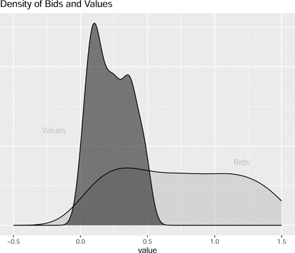
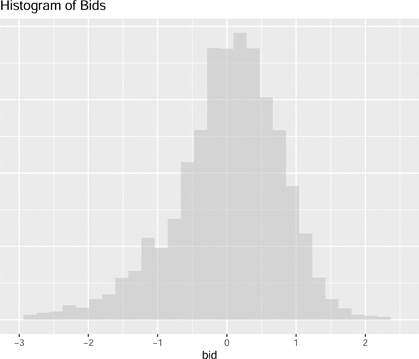

# 10 경매 (Auctions)

DOI: [10.1201/b23262-10](./https___doi.org_10.1201_b23262-10.md)

## 10.1 서론 (Introduction)

여행 진행자 릭 스티브스(Rick Steves)에 따르면, 알스미어(Aalsmeer) 경매장은 세계에서 가장 큰 상업 건물 중 하나입니다. 알스미어의 소유주인 로열 플로라 홀랜드(Royal Flora Holland)는 2016년 경매장을 통해 125억 개의 식물과 꽃을 판매했습니다. 그러나 52억 달러의 경매 매출에도 불구하고, 로열 플로라 홀랜드는 세계에서 가장 큰 경매장과는 거리가 멉니다.[1](./20-chapter10.md#fn10_1) 그 영예는 구글에 돌아갈 것입니다. 경제학자 할 배리언(Hal Varian)이 세계에서 가장 큰 경매라고 불렀던 방식을 사용하여 구글은 476억 달러의 검색 광고를 판매했습니다([Varian, 2007](./25-refbib.md#ref58)).[2](./20-chapter10.md#fn10_2) 이것도 인상적이지만, 2015년의 단일 경매 하나가 구글의 연간 실적을 거의 뛰어넘었습니다. 미국 연방통신위원회(FCC)의 97번 경매(AWS-3)는 미국 납세자들을 위해 449억 달러를 모금했습니다.[3](./20-chapter10.md#fn10_3) 이는 미국 연방 정부가 매주 수십억 달러의 증권 경매를 제공한다는 사실에 비하면 아무것도 아닙니다. 2023년 7월 6일 단일 4주 T-bill 경매 금액은 700억 달러였습니다.

경매는 많은 수의 제품을 팔고 사는 데 사용됩니다. 정부는 종이부터 경찰 바디캠에 이르기까지 모든 것을 구매하기 위해 경매를 사용합니다. 미국 연방 정부는 석유 시추권, FCC 주파수, 10년 만기 채권 및 목재 접근권을 판매하기 위해 경매를 사용합니다. 경매를 사용하여 [eBay.com](./http___eBay.com)에서 물건을 팔고 살 수 있습니다.

알스미어의 경매는 독특합니다. 이 경매는 짧은 시간 동안 진행되며, 경매가 진행됨에 따라 가격을 낮추는 "시계"가 째깍거립니다. 가격이 떨어짐에 따라 버튼을 가장 먼저 누르는 첫 번째 입찰자가 시계에 표시된 가격으로 낙찰받습니다. 알스미어의 대변인은 가격이 떨어지기 때문에 이를 **더치 경매(Dutch auction)**라고 부른다고 밝혔습니다. 사실 그들은 인과 관계를 거꾸로 파악한 것입니다. 네덜란드 사람들이 꽃을 팔기 위해 이러한 유형의 경매를 대중화했기 때문에 우리는 이를 **더치 경매**라고 부릅니다.

여러분이 가장 잘 알고 있을 경매 스타일은 **영국식 경매(English auction)**라고 불립니다. 이 경매에는 입찰자들이 패들을 들거나 손짓을 하는 동안 매우 빠르게 말하며 손가락질을 많이 하는 경매인이 있습니다. 영국식 경매에서는 마지막 입찰자가 낙찰을 받고 입찰이 멈춘 가격을 지불합니다.

\_\_\_\_\_\_\_\_\_\_\_\_\_\_\_\_\_ [1](./20-chapter10.md#fn10_110b)<https://www.royalfloraholland.com>

[2](./20-chapter10.md#fn10_210b)[eMarketer.com](./http___eMarketer.com), 7/26/16

[3](./20-chapter10.md#fn10_310b)<https://www.fcc.gov/auction/97/factsheet>

경매에 대한 경제적 분석은 윌리엄 비크리(William Vickrey)의 중요한 1961년 논문 _Counterspeculation, Auctions, and Competitive Sealed Bid Tenders_에서 시작되었습니다. 비크리는 더치 경매와 **밀봉 입찰 경매(sealed bid auctions)**가 **전략적으로 동등하다(strategically equivalent)**고 지적했습니다. 표준 밀봉 입찰 경매에서 각 입찰자는 비밀리에 서면으로 입찰을 제출합니다. 경매인은 가장 높은 입찰가를 선택하고, 입찰자는 자신의 입찰에 적힌 금액을 지불합니다.

비크리는 이러한 경매에서 입찰자가 최적으로 입찰해야 하는 금액을 특징지었습니다. 그런 다음 그는 동일한 입찰자가 더치 경매에서 정확히 같은 금액을 입찰해야 함을 보여주었습니다. 즉, 더치 경매에서 입찰자는 가격이 적어 둔 숫자로 떨어질 때까지 기다렸다가 버튼을 눌러야 합니다. 비크리는 이 두 가지 경매 형식이 전략적으로 동등하지만, 영국식 경매와는 전략적으로 동등하지 않음을 보여주었습니다.

비크리는 영국식 경매와 전략적으로 동등한 밀봉 입찰 경매가 있는지 궁금해했습니다. 비크리는 새로운 경매를 발명했습니다. **비크리 경매(Vickrey auction)**에서 각 입찰자는 표준 밀봉 입찰 경매처럼 입찰가를 적어내고 가장 높은 입찰가를 적어낸 사람이 낙찰자가 됩니다. 그러나 낙찰자는 두 번째로 높은 입찰자가 적어낸 금액을 지불합니다. 비크리는 그의 경매가 영국식 경매와 전략적으로 동등하다는 것을 보여주었습니다.

이 장에서는 가장 중요한 두 가지 경매 형식인 밀봉 입찰 경매와 영국식 경매에 대해 논의합니다. 이 장에서는 두 방식에 대한 추정량을 제시합니다. 밀봉 입찰 경매 추정은 [Guerre et al. (2000)](./25-refbib.md#ref29)에 기초합니다. 영국식 경매 분석은 [Athey and Haile (2002)](./25-refbib.md#ref9)의 순서 통계량(order statistic) 접근법을 사용합니다. 두 경우 모두 목재 경매 분석을 제시합니다. 이 장에서는 벌목업자들이 밀봉 입찰 경매에서 합리적으로 입찰하고 있는지, 그리고 영국식 경매에서 벌목업자들이 담합했는지 여부를 검증합니다.

## 10.2 밀봉 입찰 경매 (Sealed Bid Auctions)

밀봉 입찰 경매는 가장 널리 사용되는 경매 형식 중 하나입니다. 이러한 경매는 정부 및 민간 부문의 조달에서 매우 두드러집니다. 밀봉 입찰 경매에서 각 입찰자는 자신의 입찰가를 적어 비밀리에 경매인에게 제출합니다. 경매인은 입찰가를 최고가에서 최저가 순으로 정렬합니다(판매가 아니라 구매하는 경우 최저가에서 최고가로). 낙찰자는 가장 높은 입찰자이며 그녀는 자신이 적어낸 금액을 지불합니다. 가격이 가장 높은 입찰가 또는 첫 번째 가격에 의해 결정되기 때문에 이를 **제1가격 경매(first price auction)**라고 합니다.

비크리는 밀봉 입찰 경매가 전략적으로 복잡하다고 지적했습니다. 이를 알아보기 위해, 아이템에 대한 입찰자의 효용이 해당 아이템에 대한 본질적인 가치에서 해당 아이템에 대해 지불하는 가격을 뺀 값과 같다고 가정해 보겠습니다. 예를 들어, 목재 경매에 입찰하는 벌목업자는 통나무에서 얻은 수익에서 나무에 접근하기 위해 미국 산림청에 지불한 가격을 뺀 수익을 얻습니다. 벌목업자가 기대 수익과 같은 금액을 입찰한다면, 낙찰을 받더라도 벌목에서 아무것도 얻지 못할 것입니다. 벌목업자가 입찰가를 낮추는(shade down) 것이 최적입니다. 문제는 그녀가 더 많이 낮출수록 경매 낙찰 확률이 낮아진다는 것입니다. 입찰자는 경매 낙찰 확률과 낙찰의 가치 사이의 절충(trade off)을 계산해야 합니다.

이 섹션에서는 밀봉 입찰 경매의 모델을 제시한 다음 해당 경매의 데이터를 시뮬레이션합니다. 이 섹션에서는 각 입찰자의 유형, 즉 아이템에 대한 가치 평가(valuation)를 결정하기 위한 추정량을 개발합니다.

### 10.2.1 밀봉 입찰 모델

밀봉 입찰 게임에는 _N_명의 입찰자가 있으며 각 입찰자 _i_는 자신의 유형(type) _vi_를 알고 있습니다.

* 플레이어: 가치 평가 _vi_ (유형)를 가진 _N_명의 입찰자
* 전략: 입찰자 _i_의 각 가치 평가(유형) _vi_에 대해, 그녀는 입찰가 bi(vi)를 선택합니다.
* 보수:  
   1. bi\>bj∀j≠i: vi−bi  
   2. bi<bj∀j≠i: 0
* 믿음: vi∼F

우리는 무승부를 무시할 것입니다.[4](./20-chapter10.md#fn10_4)

입찰자가 가장 높은 입찰가를 제시하면 낙찰되고 수익(payoff) vi−bi를 얻습니다. 이는 그녀의 본질적인 가치에서 입찰 금액을 뺀 값입니다. 패배하면 아무것도 얻지 못합니다.

[가정 4 (Assumption 4).](chapter10) _독립적인 개인 가치 (Independent Private Values, IPV). _ vi∼iidF_라고 합시다. 여기서 vi는 입찰자 i의 가치이고 F는 분포 함수입니다._

[가정 4](./20-chapter10.md#assu10_1)는 설명을 훨씬 간단하게 만듭니다. 이것은 또한 이 장에서 고려하는 문제에 대해 합리적인 근사치인 것처럼 보입니다. 이는 경매에서 입찰자의 아이템 가치가 동일한 분포에서 도출된다는 점을 제외하고는 경매의 다른 입찰자의 가치와 관련이 없음을 명시합니다. 다음 장에서는 가치 평가가 서로 연관되어 있다는 대안적 가정을 살펴봅니다.

### 10.2.2 베이즈 내쉬 균형 (Bayes Nash Equilibrium)

균형 상태에서 입찰자는 경매에서 기대 수익을 극대화한다고 가정합니다. 입찰자가 지면 0을 얻는다고 가정합니다. 그녀가 이기면, 아이템에 대한 내재 가치(_vi_)에서 입찰가(_bi_)를 뺀 값을 얻는다고 가정합니다.

maxbiPr(win|bi)(vi−bi)(10.1)

\_\_\_\_\_\_\_\_\_\_\_\_\_\_\_\_\_ [4](./20-chapter10.md#fn10_410b)입찰 증가폭이 작고 가치가 연속적으로 분포된 경우 무승부 확률은 적습니다.

방정식 (10.1)의 1계 조건을 취하면 다음 식을 얻습니다.

g(bi|N)(vi−bi)−G(bi|N)\=0(10.2)

G(bi|N)를 경매에 _N_명의 입찰자가 있다는 조건 하에 입찰자 _i_가 입찰가 _bi_로 가장 높은 입찰자가 될 확률이라고 하고, g(bi|N)는 그 미분이라고 합시다. G(bi|N)는 그녀가 경매에서 이길 확률입니다.

우리는 입찰자가 입찰가를 얼마나 낮춰야 하는지 보여주기 위해 이 공식을 재배열할 수 있습니다.

bi\=vi−G(bi|N)g(bi|N)(10.3)

이 공식은 입찰자가 자신의 가치에서 입찰가 감소가 경매 낙찰 확률을 얼마나 줄이는지에 의해 결정되는 조정 계수(shading factor)를 뺀 금액을 입찰해야 함을 나타냅니다.

경매에서 승리할 확률을 데이터에서 관찰되는 입찰 분포의 함수로 작성하는 것이 코드를 작성하는 데 유용할 것입니다. H(b)를 경매의 입찰 분포라고 합시다. [가정 4](./20-chapter10.md#assu10_1)가 주어지면 특정 입찰자가 경매에서 승리할 확률은 다음 방정식으로 주어집니다.

G(bi|N)\=H(bi)N−1(10.4)

경매에 두 명의 입찰자가 있는 경우 낙찰 확률은 단순히 자신의 입찰가가 다른 입찰자보다 높을 확률입니다. 입찰자가 두 명 이상인 경우 그녀의 입찰가가 다른 모든 입찰자보다 높을 확률입니다. 독립적인 개인 가치 가정인 [가정 4](./20-chapter10.md#assu10_1)는 이것이 다른 각 입찰자가 그녀보다 낮은 입찰가를 제시할 확률을 모두 곱한 것과 같음을 시사합니다.

또한 데이터에서 관찰된 입찰 분포의 관점에서 이 함수의 미분을 결정할 수 있습니다.

g(bi|N)\=(N−1)h(bi)H(bi)N−2(10.5)

여기서 _h_는 입찰 분포 _H_의 도함수입니다.

### 10.2.3 **R**을 이용한 밀봉 입찰 시뮬레이션

시뮬레이션된 데이터에서 각 입찰자는 균등 분포에서 자신의 가치를 도출합니다. 비크리는 이 경매의 최적 입찰가가 다음 공식을 사용하여 계산됨을 보여줍니다.

bi\=(N−1)viN(10.6)

비크리 버전의 게임에서 입찰자들은 방정식 (10.6)으로 표현된 함수를 알고 있습니다. 균등 분포는 문제를 단순화하므로 이것이 사용됩니다. 시뮬레이션된 각 경매에는 다른 수의 시뮬레이션된 입찰자가 있습니다.

`_>   set.seed(123456789)_`
`_>   M = 1000 # number of simulated auctions._`
`_>   data1 = matrix(NA,M,12)_`
`_>   for (i in 1:M) {_`
`_+     N = round(runif(1, min=2,max=10)) # number of bidders._`
`_+     v = runif(N) # valuations, uniform distribution._`
`_+     b = (N - 1)*v/N # bid function_`
`_+     p = max(b) # auction price_`
`_+     x = rep(NA,10)_`
`_+     x[1:N] = b # bid data_`
`_+     data1[i,1] = N_`
`_+     data1[i,2] = p_`
`_+     data1[i,3:12] = x_`
`_+   }_`
`_>   colnames(data1) = c(“Num”,“Price”,“Bid1”_,`
`_+                        “Bid2”,“Bid3”,“Bid4”_,`
`_+                        “Bid5”,“Bid6”,“Bid7”_,`
`_+                        “Bid8”,“Bid9”,“Bid10”)_`
`_>   data1 = as.data.frame(data1)_`

이 시뮬레이션은 1,000건의 경매가 있는 데이터 세트를 생성합니다. 각 경매에는 2명에서 10명 사이의 입찰자가 있습니다. 입찰자는 순서대로 나열되지 않습니다.

### 10.2.4 밀봉 입찰 추정량

추정량은 방정식 (10.3)을 사용하여 관찰된 입찰가에서 가치를 역산합니다. 이를 위해 입찰자 수를 조건으로 경매에서 승리할 확률을 계산합니다. 데이터에서 이를 결정하는 것은 어렵지 않아야 합니다. 이 함수가 있으면 공식을 사용하여 입찰가의 가치를 결정합니다.

첫 번째 단계는 입찰 분포를 추정하는 것입니다.

H^(b)\=1N∑i\=1N1(bi<b)(10.7)

분포 함수 H(b)의 **비모수적 추정량(non-parametric estimate)**은 어떤 값 _b_보다 낮은 입찰의 비율입니다.[5](./20-chapter10.md#fn10_5)

\_\_\_\_\_\_\_\_\_\_\_\_\_\_\_\_\_ [5](./20-chapter10.md#fn10_510b)비모수적 추정량은 데이터에 입찰이 분산되는 방식에 대해 모수적 가정을 하지 않습니다.

두 번째 단계는 입찰 분포의 도함수를 추정하는 것입니다. 이는 어떤 주어진 "작은(small)" 숫자 _ϵ_에 대해 수치적으로 계산할 수 있습니다.[6](./20-chapter10.md#fn10_6)

h^(b)\=H^(b+ϵ)−H^(b−ϵ)2ϵ(10.8)

두 명의 입찰자가 있는 경우 방정식 (10.3)은 각 입찰자의 가치 평가를 결정합니다.

v^i\=bi+H^(bi)h^(bi)(10.9)

여기서 i∈{1,2}입니다.

### 10.2.5 **R**을 이용한 밀봉 입찰 추정량

추정량은 데이터를 두 명의 입찰자가 있는 경매로만 제한합니다. 이 특별한 경우, 낙찰 확률은 입찰의 분포에 의해 주어집니다.[7](./20-chapter10.md#fn10_7) 코드에서 엡실론은 그리스 문자 _ϵ_를 의미하며 "작은" 숫자를 나타냅니다. 방정식 (10.8)을 참조하십시오.

`_> fsealed2bid = function(bids, epsilon=0.5) {_`
`_+   # epsilon for “small” number for finite difference method_`
`_+   # of taking numerical derivatives._`
`_+   values = rep(NA,length(bids))_`
`_+   for (i in 1:length(bids)) {_`
`_+     Hhat = mean(bids < bids[i])_`
`_+     # bid probability distribution_`
`_+     hhat = (mean(bids < bids[i] + epsilon) -_`
`_+       mean(bids < bids[i] - epsilon))/(2*epsilon)_`
`_+     # bid density_`
`_+     values[i] = bids[i] + Hhat/hhat_`
`_+   }_`
`_+   return(values)_`
`_+ }_`

낙찰 확률은 다른 입찰자가 더 적게 입찰할 확률이므로 계산하는 것은 직관적입니다. IPV([가정 4](./20-chapter10.md#assu10_1))가 주어지면 이것은 특정 입찰에 대한 누적 확률입니다. 밀도 계산은 약간 더 복잡합니다. 입찰의 "작은" 변화에 대한 확률 변화를 관찰하여 이 도함수를 수치적으로 근사화할 수 있습니다.[8](./20-chapter10.md#fn10_8) 가치는 방정식 (10.3)을 사용하여 계산됩니다.

\_\_\_\_\_\_\_\_\_\_\_\_\_\_\_\_\_ [6](./20-chapter10.md#fn10_610b)이것은 **유한 차분 추정량(finite difference estimator)**의 한 예입니다.

[7](./20-chapter10.md#fn10_710b)낙찰 확률은 귀하의 입찰가가 경매의 다른 입찰자보다 높을 확률입니다.

[8](./20-chapter10.md#fn10_810b)이것은 수치 미분을 계산하기 위해 유한 차분을 사용하는 예입니다. 엡실론 값이 다르면 어떻게 됩니까?

코드는 입찰의 밀도와 2인 경매에서 파생된 가치를 보여주는 ggplot() 객체를 생성합니다.

`_> data2 = data1 |>_`
`_+   filter(_`
`_+     Num == 2_`
`_+   )_`
`_> ggplotsealed = data.frame(_`
`_+   “bids” = c(data2$Bid1, data2$Bid2)_,`
`_+   “values” = fsealed2bid(c(data2$Bid1, data2$Bid2))_`
`_+ ) |>_`
`_+   ggplot() +_`
`_+   geomdensity(aes(values)_,`
`_+                fill = “gray”_,`
`_+                alpha = 0.5) +_`
`_+   geomdensity(aes(bids)_,`
`_+                fill=“black”_,`
`_+                alpha = 0.5) +_`
`_+   scalexcontinuous(limits = c(-0.5,1.5)) +_`
`_+   labs(_`
`_+     x = “value”_,`
`_+     y = “”_,`
`_+     title = “Density of Bids and Values”_`
`_+   ) +_`
`_+   geomtext(aes(x = 1.2, y = 0.8, label = “Bids”)_,`
`_+             color = “gray”) +_`
`_+   geomtext(aes(x = -0.2, y = 1.2, label = “Values”)_,`
`_+             color = “gray”) +_`
`_+   theme(axis.text.y=elementblank()_,`
`_+         axis.ticks.y=elementblank())_`
` `
`_> ggplotsealed_`

[그림 10.1](./20-chapter10.md#fig10_1)은 입찰가가 실제 가치에 비해, 특히 매우 높은 가치 평가의 경우 크게 조정되었음(shaded)을 보여줍니다. 이 그림은 입찰가에 대한 밀도 함수와 2인 경매에서 파생된 가치를 보여줍니다. 가치 평가의 실제 밀도는 0.5에 위치하며 0에서 1까지 이어집니다. 여기서 추정된 밀도는 약간 더 높고 경계를 넘어갑니다. 그러나 그 이유 중 일부는 그림에서 밀도를 나타내는 데 사용하는 방법일 수 있습니다.[9](./20-chapter10.md#fn10_9) 그것이 어떻게 변화를 주는지 보기 위해 다른 엡실론 값을 시도해 보아야 합니다.

[그림 10.1](chapter10) 2인 경매의 입찰 및 가치에 대한 밀도 함수 플롯. 가치의 실제 분포는 0에서 1까지 0.5의 밀도를 가집니다.

\_\_\_\_\_\_\_\_\_\_\_\_\_\_\_\_\_ [9](./20-chapter10.md#fn10_910b)커널 밀도 방법은 분포가 정규 분포의 혼합으로 근사될 수 있다고 가정합니다.

## 10.3 영국식 경매 (English Auctions)

사람들에게 가장 익숙한 경매 형식은 영국식 경매입니다. 이 경매는 가축, 골동품, 수집용 우표 및 주택(호주의 경우)을 판매하는 데 사용됩니다. 1970년대에 이 방식은 미국 산림청에서 목재 이용권을 판매하는 데 사용하는 표준 형식이기도 했습니다([Aryal et al., 2018](./25-refbib.md#ref6)).

경매가 진행됨에 따라 입찰자들이 서로의 입찰을 관찰할 수 있기 때문에 이는 동적(dynamic) 게임입니다. 우리의 삶을 훨씬 단순하게 만들기 위해 우리는 비크리의 분석에 크게 의존하고 이 경매를 제2가격 밀봉 입찰 경매(second price sealed bid auctions)로 모델링할 것입니다.

이 섹션은 제2가격 밀봉 입찰 경매를 가정하에 게임을 제시하고 베이즈 내쉬 균형을 결정합니다. 그런 다음 영국식 경매에서 가치를 추정하는 것으로 초점을 전환합니다. 종종 이러한 경매에서는 낙찰가 또는 가격과 경우에 따라 입찰자 수만 관찰합니다. 이 데이터의 한계로 인해 순서 통계량의 아이디어와 [Athey and Haile (2002)](./25-refbib.md#ref9)의 결과를 사용할 것입니다.

### 10.3.1 제2가격 경매 게임

이 게임은 _N_명의 입찰자와 가치 평가 _vi_를 갖는 제2가격 밀봉 입찰 경매입니다.

* 플레이어: 가치 평가 _vi_를 갖는 _N_명의 입찰자
* 전략: 각 입찰자 _i_는 아이템에 대한 자신의 가치 평가를 바탕으로 입찰가 bi(vi)를 선택합니다.
* 보수:  
   1. bi\>bj∀j≠i: vi−b2, 여기서 _b_2는 두 번째로 높은 입찰자의 입찰가입니다.  
   2. bi<bj∀j≠i: 0
* 믿음: vi∼F

역학을 가정에서 제외하는 것 외에도 문제를 복잡하게 만들 수 있는 입찰 증가분도 제외합니다.

### 10.3.2 베이즈 내쉬 균형

비크리는 영국식 경매가 전략적으로 매우 단순하다는 것을 보여주었습니다. 입찰자가 영국식 경매에서 입찰을 돕기 위해 전문 경매 컨설턴트를 고용한다고 상상해 보십시오.

* 전문가: "해당 아이템에 대한 당신의 가치는 얼마입니까?"
* 입찰자: "$2,300"
* 전문가: "$2,300까지 입찰하고 멈추세요."

밀봉 입찰 경매에서는 낙찰과 경매 수익 사이의 최적의 절충안이 존재합니다. 제2가격 경매에는 이러한 절충안이 없습니다.

입찰자 _i_에 대한 최적 입찰가는 자신의 가치대로 입찰하는 것입니다.

bi\=vi(10.10)

방정식 (10.10)은 영국식 경매에 대한 실증적 분석이 밀봉 입찰 경매보다 훨씬 간단하다는 것을 시사합니다. 정말로 그럴 수만 있다면! 분명히 말하자면, 방정식 (10.10)의 "입찰"은 전문가가 설명한 전략을 의미합니다. 데이터에서 이 전략이 실행되는 것을 반드시 관찰할 수 있는 것은 아닙니다.

경매에서 모든 입찰 전략을 관찰할 수 있다면 가치 분포의 추정치를 가질 수 있을 것입니다. 하지만 그것이 문제인 경향이 있습니다. 상황에 따라 경매의 모든 활성 입찰자가 실제로 입찰하는 것으로 관찰되지 않을 수 있습니다. 또한 경매 중에 가격이 급등하는 경우 입찰자가 언제 입찰을 중단했는지 제대로 파악하지 못할 수 있습니다([Haile and Tamer, 2003](./25-refbib.md#ref30)).

[Athey and Haile (2002)](./25-refbib.md#ref9)가 해결책을 제공합니다. 그들은 영국식 경매의 가격이 직관적인 해석을 갖는다고 지적합니다. 가치 평가가 [가정 4](./20-chapter10.md#assu10_1)를 따를 때 가격은 경매에 입찰한 사람들의 두 번째로 높은 가치 평가입니다. 가격이 두 번째로 높은 가치보다 낮은 경우를 생각해 보십시오. 어떻게 그럴 수 있습니까? 입찰자 중 한 명이 자신의 가치보다 낮은 가격에 경매를 포기한 이유는 무엇입니까? 가격이 두 번째로 높은 가치보다 높다면 어떻습니까? 어떻게 그럴 수 있습니까? 입찰자가 자신의 가치보다 더 많이 입찰하는 이유는 무엇입니까?

가격이 두 번째로 높은 가치 평가와 같다면, 그것은 가치 분포의 특정한 순서 통계량입니다. [Athey and Haile (2002)](./25-refbib.md#ref9)는 관찰된 순서 통계량의 분포가 어떻게 가치 분포를 고유하게 결정하는지 보여줍니다.

### 10.3.3 순서 통계량 (Order Statistics)

순서 통계량이 어떻게 작동하는지 이해하기 위해 WNBA 선수의 키 분포를 결정하는 문제를 고려해 보겠습니다. 이를 수행하는 확실한 방법은 선수 키에 대한 데이터 세트를 가져와서 분포를 계산하는 것입니다. 덜 확실한 방법은 순서 통계량을 사용하는 것입니다.

이 방법에서는 팀의 무작위 표본에서 데이터를 가져오며, 각 팀에서 가장 키가 큰 선수의 키를 측정합니다. 각 팀의 로스터에 10명의 선수가 있고, 가장 키가 큰 선수, 예를 들어 센터의 키를 알고 있다고 가정해 봅시다. 이것은 WBNA의 키 분포를 추정하기에 충분한 정보입니다. 우리는 순서 통계량 수학과 우리가 가장 키가 큰 사람의 키를 알고 있고 다른 9명의 선수가 더 작다는 것을 알고 있다는 사실을 사용할 수 있습니다. 이 경우 우리는 가장 키가 큰 선수를 사용하고 있지만 가장 키가 작은 선수나 두 번째로 키가 큰 선수 등에도 동일한 방법을 적용할 수 있습니다.

가격은 다소간 경매 입찰자 중 두 번째로 높은 가치 평가와 거의 같습니다.[10](./20-chapter10.md#fn10_10) _N_개의 가치 중 두 번째로 높은 값이 어떤 값 _b_와 같을 확률은 다음 공식으로 주어집니다.

Pr(b(N−1):N\=b)\=N(N−1)F(b)N−2f(b)(1−F(b))(10.11)

_N_개 중 두 번째로 높은 입찰에 대한 순서 통계 표기법은 b(N−1):N입니다. 이 방정식을 오른쪽에서 왼쪽으로 분석할 수 있습니다. 이는 _b_와 같은 가격을 볼 확률이 한 입찰자가 _b_보다 큰 가치를 가질 확률이라는 것을 나타냅니다. 이 사람이 경매의 낙찰자이며 이 확률은 1−F(b)로 주어집니다. 여기서 F(b)는 입찰자의 가치 평가가 _b_보다 작을 누적 확률입니다. 이 확률에 _b_의 가치 평가를 가진 입찰자가 정확히 한 명 있을 확률을 곱합니다. 이 사람은 자신의 가치대로 입찰한다고 가정되는 두 번째로 높은 입찰자입니다. 이는 밀도 함수 f(b)로 표현됩니다.[11](./20-chapter10.md#fn10_11) 이 두 값에 나머지 입찰자의 가치 평가가 _b_보다 작을 확률을 곱합니다. 경매에 _N_명의 입찰자가 있는 경우 그 중 N−2명은 가격보다 낮은 가치 평가를 가집니다. [가정 4](./20-chapter10.md#assu10_1)가 주어졌을 때 이것이 발생할 확률은 F(b)N−2입니다. 마지막으로, 입찰자의 순서는 무관하므로 N!1!(N−2)!\=N(N−1)개의 가능한 조합이 있습니다. 경매에 두 명의 입찰자가 있는 경우 가격 _p_를 관찰할 확률은 2f(p)(1−F(p))입니다.

\_\_\_\_\_\_\_\_\_\_\_\_\_\_\_\_\_ [10](./20-chapter10.md#fn10_1010b)공식적으로 가격은 두 번째로 높은 입찰자의 입찰가보다 약간 높을 수 있습니다. 우리는 이러한 가능성을 무시할 것입니다.

[11](./20-chapter10.md#fn10_1110b)이것은 F(b)의 도함수입니다.

[Athey and Haile (2002)](./25-refbib.md#ref9)가 제기한 질문은 우리가 이 공식을 사용하여 _F_를 결정할 수 있는지 여부입니다. 가격 분포의 순서 통계량 공식을 사용하여 기본 가치 분포를 알아낼 수 있을까요? 네, 가능합니다.

### 10.3.4 가치 분포의 식별 (Identifying the Value Distribution)

우리가 아이템에 대해 가능한 가장 낮은 가치 평가와 동일한 가격으로 2인 입찰자 경매를 관찰한다고 가정해 봅시다. 이를 _v_0라고 부르겠습니다. 사실, 가격이 가능한 가장 낮은 가치보다 약간 높은 경우를 생각하는 것이 훨씬 쉽습니다. 가격이 v1\=v0+ϵ보다 작다고 가정해 보겠습니다. 여기서 _ϵ_은 "작은" 숫자입니다. 우리는 무엇을 알고 있습니까? 우리는 한 입찰자가 F(v1)와 같은 확률로 발생하는 그 매우 낮은 가치 평가를 가지고 있다는 것을 알고 있습니다. 다른 입찰자는 어떻습니까? 다른 입찰자 역시 가장 낮은 가치 평가와 동일한 가치를 가질 수도 있고 더 높은 가치를 가질 수도 있습니다. 즉, 아이템에 대한 그들의 가치는 무엇이든 될 수 있습니다. 가치가 가능한 최고값과 최저값 사이에 있을 확률은 1입니다. 따라서 Pr(p≤v1)\=2×1×F(v1)이며 어느 입찰자든 최고 입찰자가 될 수 있습니다. 2가지 가능성이 있으므로 2를 곱해야 합니다. 데이터에서 _v_1보다 낮은 가격의 확률이 관찰되므로 배열을 조정하여 초기 확률 F(v1)\=Pr(p≤v1)/2를 얻을 수 있습니다.

이제 다른 값 v2\=v1+ϵ를 취합니다. _v_1과 _v_2 사이의 가격을 관찰할 확률은 다음과 같습니다.

Pr(p∈(v1,v2\])\=2(F(v2)−F(v1))(1−F(v1))(10.12)

이것은 한 입찰자가 _v_2와 _v_1 사이의 가치를 갖고 두 번째 입찰자가 _v_1보다 큰 가치를 갖는 것을 볼 확률입니다. 다시 말하지만, 두 입찰자는 두 가지 방법으로 순서를 정할 수 있습니다.

방정식 (10.12)를 사용하여 F(v2)를 풀 수 있습니다. 우리는 좌변의 수량을 관찰하고 이전에 F(v1)를 계산했습니다.

가치 평가의 유한한 부분 집합에 대해 우리는 이 반복적 방법을 사용하여 전체 분포를 계산할 수 있습니다. 보다 일반적으로 우리는 미분 방정식을 사용할 것입니다. 이것이 작동하려면 각 입찰자의 가치 평가가 다른 입찰자와 독립적이며 동일한 가치 분포에서 나온다고 가정해야 합니다([가정 4](./20-chapter10.md#assu10_1)).

### 10.3.5 영국식 경매 추정량

분포의 비모수적 추정량은 위 논리를 따릅니다.

초기 단계는 최솟값에서의 확률을 결정합니다,

F^(v1)\=∑j\=1M1(pj≤v1)2M(10.13)

여기서 _M_개의 경매가 있고 _pj_는 경매 _j_의 가격입니다.

이 초기 조건에 반복 방정식을 추가할 수 있습니다.

F^(vk)\=∑j\=1M1(vk<pj≤vk+1)2M(1−F^(vk−1))+F^(vk−1)(10.14)

그런 다음 이 방정식들을 사용하여 가치 분포를 결정합니다.

### 10.3.6 **R**을 이용한 영국식 경매 추정량

관찰된 값의 범위에 걸쳐 고르게 분포된 K\=100개 포인트에서 근사화하여 분포 함수를 비모수적으로 추정할 수 있습니다. 추정량은 방정식 (10.13)과 (10.14)에 기초합니다.

`_> fEnglish2bid = function(price, K=100, epsilon=1e-8) {_`
`_+   # K number of finite values._`
`_+   # epsilon small number for getting the probabilities_`
`_+   # calculated correctly._`
`_+   min1 = min(price)_`
`_+   max1 = max(price)_`
`_+   diff1 = (max1 - min1)/K_`
`_+   Fv = matrix(NA,K,2)_`
`_+   mintemp = min1 - epsilon_`
`_+   maxtemp = mintemp + diff1_`
`_+   # determines the boundaries of the cell._`
`_+   Fv[1,1] = (mintemp + maxtemp)/2_`
`_+   gp = mean(price > mintemp & price < maxtemp)_`
`_+   # price probability_`
`_+   Fv[1,2] = gp/2 # initial probability_`
`_+   for (k in 2:K) {_`
`_+     mintemp = maxtemp - epsilon_`
`_+     maxtemp = mintemp + diff1_`
`_+     Fv[k,1] = (mintemp + maxtemp)/2_`
`_+     gp = mean(price > mintemp & price < maxtemp)_`
`_+     Fv[k,2] = gp/(2*(1 - Fv[k-1,2])) + Fv[k-1,2]_`
`_+     # cumulative probability_`
`_+   }_`
`_+   return(Fv)_`
`_+ }_`

## 10.4 실증 분석: **R**을 이용한 벌목업자의 합리성 검증 (Empirical Analysis: Testing the Rationality of Loggers using **R**)

1970년대에 미국 산림청은 흥미로운 실험을 수행했습니다. 1977년에 밀봉 입찰 경매를 도입했습니다. 그 이전에는 대부분의 미국 산림청 경매가 영국식 경매였습니다.[12](./20-chapter10.md#fn10_12) 1977년에 산림청은 경매 형식을 혼합했습니다. 위에서 논의했듯이 밀봉 입찰 경매에서의 입찰은 영국식 경매에서의 입찰보다 전략적으로 훨씬 복잡합니다. 후자의 경우 입찰자는 단순히 자신의 가치대로 입찰합니다. 전자의 경우 입찰을 높여 낙찰 가능성을 높이는 것과 낙찰 시 더 많은 비용을 지불하는 것 사이에서 절충해야 합니다.

실험 덕분에 우리는 밀봉 입찰 경매에 참여한 벌목업자들이 영국식 경매에서의 행동과 일관되게 입찰했는지 테스트할 수 있습니다. 우리의 테스트는 밀봉 입찰 경매의 입찰 데이터를 사용하여 기본 가치 분포를 추정하고 이를 영국식 경매의 가격 데이터를 사용하여 추정한 기본 가치 분포와 비교하는 것을 포함합니다. 게임 이론 모델의 가정 하에 이 두 가치 분포는 동일합니다.

### 10.4.1 목재 데이터 (Timber Data)

여기에 사용된 데이터는 필 하일(Phil Haile)의 웹사이트에서 다운로드한 미국 산림청 데이터입니다.[13](./20-chapter10.md#fn10_13)

입찰 및 가치의 분포를 추정하기 위해서는 동등한 조건(apples to apples)에서 비교할 수 있도록 이를 "정규화(normalize)"하는 것이 도움이 됩니다. 표준적인 방법은 입찰 금액의 로그 함수를 사용하고, 입찰된 에이커 수, 목재의 예상 가치, 접근 비용 및 숲과 수종의 특성을 포함한 경매의 다양한 특성에 대해 선형 회귀를 실행하는 것입니다([Haile et al., 2006](./25-refbib.md#ref31)).[14](./20-chapter10.md#fn10_14)

코드는 데이터를 가져오고 lm()을 사용하여 lm1 객체를 생성합니다. 회귀는 as.factor()를 사용하여 다양한 수종, 지역, 숲 및 지구에 대한 더미 변수를 만듭니다. 그런 다음 선형 회귀의 잔차(residuals)를 사용하여 정규화된 입찰을 만듭니다.

\_\_\_\_\_\_\_\_\_\_\_\_\_\_\_\_\_ [12](./20-chapter10.md#fn10_1210b)이것을 단순한 학문적 질문이라고 생각할 수 있습니다. 그러나 아이다호 주 상원의원인 처치(Church) 상원의원은 이 결정에 만족하지 않았습니다. "사실, 밀봉 입찰 요구의 결과로 심각한 경제적 혼란이 이미 발생하고 있을 수 있음을 보여주는 증거가 늘어나고 있습니다." _의회 기록(Congressional Record)_ 1977년 9월 14일, 29223페이지를 참조하십시오.

[13](./20-chapter10.md#fn10_1310b)<http://www.econ.yale.edu/~pah29/timber/timber.htm>. 여기에서 사용된 버전은 다음 링크에서 얻을 수 있습니다: <https://sites.google.com/view/microeconometricswithr/table-of-contents>.

[14](./20-chapter10.md#fn10_1410b)[Baldwin et al. (1997)](./25-refbib.md#ref13)는 목재 경매의 관찰 가능한 다양한 특성의 중요성을 논의합니다.

`_>   file = paste0(dir, “auctions.csv”)_`
`_>   df = read.csv(file)_`
`_>   lm1 = lm(logamount ~ as.factor(Salvage) + Acres +_`
`_+               Sale.Size + logvalue + Haul +_`
`_+               Road.Construction + as.factor(Species) +_`
`_+               as.factor(Region) + as.factor(Forest) +_`
`_+               as.factor(District), data=df)_`
`_>   # as.factor creates a dummy variable for each entry under the_`
`_>   # variable name. For example, it will have a dummy for each_`
`_>   # species in the data._`
`_>   df$normbid = NA_`
`_>   df$normbid[-lm1$na.action] = lm1$residuals_`
`_>   # lm object includes “residuals” term which is the difference_`
`_>   # between the model estimate and the observed outcome._`
`_>   # na.action accounts for the fact that lm drops_`
`_>   # missing variables (NAs)_`

일반적으로 우리는 정규 분포와 유사한 분포를 찾고 있습니다. [그림 10.2](./20-chapter10.md#fig10_2)는 정규화된 로그 입찰의 히스토그램을 보여줍니다. 분포가 정규적일 필요는 없지만 정규 분포와 상당히 다를 경우 그 이유에 대해 생각해 보아야 합니다. 이 분포가 정상적으로 보입니까?[15](./20-chapter10.md#fn10_15)

[그림 10.2](chapter10) 1977년 미국 산림청 경매에 대한 정규화된 입찰 잔차의 히스토그램.

### 10.4.2 밀봉 입찰 경매

상황을 단순화하기 위해 우리는 2인 입찰자 경매로 분석을 제한할 것입니다. 데이터에서 밀봉 입찰 경매는 "S"로 표시됩니다.

`_> df1 = df |>_`
`_+   filter(_`
`_+     numbidders == 2 &_`
`_+       Method.of.Sale == “S”_`
`_+   ) |>_`
`_+   mutate(_`
`_+     bids = as.vector(normbid)_,`
`_+     values = fsealed2bid(normbid)_`
`_+   )_`
`_> summary(df1$bids)_`
`     Min. 1st Qu. Median     Mean 3rd Qu.    Max.`
`  -4.0262 -0.7987 -0.1918 -0.2419 0.3437 5.0647`
`_> summary(df1$values)_`
`      Min. 1st Qu.    Median     Mean 3rd Qu.      Max.`
`   -4.0262 -0.0218    0.9185   4.8704   2.3108 860.0647`

\_\_\_\_\_\_\_\_\_\_\_\_\_\_\_\_\_ [15](./20-chapter10.md#fn10_1510b)이것은 대략적으로 정규 분포를 보이지만 다소 낮은 값으로 치우쳐 있습니다. 이는 영국식 경매의 낮은 입찰 때문일 수 있습니다. 밀봉 입찰만 그래프로 나타낼 경우 분포가 어떻게 보입니까?

위에서 사용한 것과 동일한 방법을 사용하면 데이터의 입찰에서 가치 분포 추정치를 역산할 수 있습니다. 가치를 입찰과 비교하면 입찰은 특히 더 높은 가치 평가에서 상당히 조정되었음을(shaded) 알 수 있습니다. 음수가 이상해 보일 수 있지만 경매에서 입찰을 정규화했다는 것을 기억하십시오.

`_> df |>_`
`_+   ggplot() +_`
`_+   geomhistogram(aes(x = normbid)_,`
`_+                  fill = “gray”_,`
`_+                  alpha = 0.5) +_`
`_+   scalexcontinuous(limits = c(-3,2.5)) +_`
`_+   labs(_`
`_+     x = “bid”_,`
`_+     y = “”_,`
`_+     title = “Histogram of Bids”_`
`_+   ) +_`
`_+   theme(axis.text.y = elementblank()_,`
`_+         axis.ticks.y = elementblank())_`

### 10.4.3 영국식 경매와 밀봉 입찰 경매 비교

가격이 두 번째로 높은 입찰가, 즉 두 번째로 높은 **순서 통계량**이라고 가정하여 영국식 경매에서 가치 분포를 역산할 수 있습니다. 영국식 경매는 "A"로 표시됩니다.

f\_English\_2bid 함수는 가치 분포에 대한 누적 확률 함수를 추정합니다.

`_> df2 = df |>_`
`_+   filter(_`
`_+     numbidders == 2 &_`
`_+       Method.of.Sale == “A” &_`
`_+       Rank == 2_`
`_+   )_`
`_> Fvenglish = fEnglish2bid(df2$normbid)_`

밀봉 입찰 경매에 대한 등가를 계산하기 위해 ecdf() 함수를 사용할 수 있습니다.

`_> Fvsealed = ecdf(df1$values)_`

[그림 10.3](./20-chapter10.md#fig10_3)은 밀봉 입찰 경매와 영국식 경매의 가치 분포 추정치 사이에 큰 차이가 없음을 보여줍니다. 밀봉 입찰 경매와 영국식 경매의 가치 평가에 대한 두 분포는 특히 더 낮은 값에 대해 서로 상당히 가깝습니다. 이는 벌목업자들이 합리적으로 입찰하고 있음을 시사합니다. 그렇긴 하지만 값이 더 높을수록 두 분포는 서로 갈라집니다. 밀봉 입찰 경매의 가치 분포는 가치 평가가 영국식 경매의 추정치보다 높음을 시사합니다. 이 차이를 또 무엇이 설명할 수 있을까요?

[그림 10.3](chapter10) 2인 입찰자 영국식 경매와 밀봉 입찰 경매에서 추정된 분포 비교. 영국식 경매의 추정치와 밀봉 입찰 경매의 추정치는 약 0까지 유사하며, 그 이후 영국식 경매의 추정치는 밀봉 입찰 경매의 추정치보다 낮은 가치에 더 많은 비중을 둡니다.

## 10.5 실증 분석: **R**을 이용한 담합 검증 (Empirical Analysis: Testing for Collusion using **R**)

영국식 경매에서 입찰자들이 담합했다는 증거가 있습니까? 이 섹션에서는 규모가 더 큰 영국식 경매에서 입찰자들의 내재된 가치 분포를 역산하기 위해 경매 이론을 사용하여 담합 검증을 제시합니다. 유추된 분포를 위에서 추정한 분포와 비교할 수 있습니다.

### 10.5.1 담합 테스트

다음과 같은 담합 테스트를 고려해 보십시오. 규모가 큰 영국식 경매를 사용하여 가치 분포를 추정할 수 있습니다. 게임 이론 모델의 지배적인 가설 하에서, 이 추정치는 2인 입찰자 경매에 대한 추정치와 동일해야 합니다. 큰 규모의 경매의 추정치가 가치가 2인 입찰자 경매에 비해 훨씬 낮음을 시사한다면 이는 담합을 시사하는 것입니다.

구체적으로, 이 더 큰 경매에서 유추된 가치가 입찰자가 적은 경매와 매우 유사하게 보인다면 말입니다. 즉, 입찰자들은 경매에 실제로 더 적은 수의 입찰자가 있는 "것처럼(as if)" 행동할 수 있습니다. 예를 들어, 활성화된 **입찰 연합(bid ring)**이 있는 경우 입찰자는 누가 경매에서 이길지, 그리고 입찰하지 않은 입찰자에게 어떻게 보상할지 결정하는 메커니즘을 가질 수 있습니다.[16](./20-chapter10.md#fn10_16) 영국식 경매에서는 입찰이 관찰되는 경매에서 입찰 연합의 구성원이 입찰할 수 있기 때문에 담합 합의를 집행하기가 간단합니다.

입찰 연합의 규모를 파악할 수 있습니까? 몇 명의 사람이 담합하여 입찰하고 있습니까? 6명의 입찰자가 있는 경매가 있다면 어떻습니까? 그 중 3명이 입찰 연합의 구성원인 경우, 그 3명은 연합에서 누가 입찰할 것인지에 동의할 것입니다. 입찰 연합의 구성원 중 한 명만 자신의 가치를 입찰합니다. 독립적인 입찰자가 4명이라는 가정 하에 모델을 추정하면 우리가 2인 입찰자 경매에서 추정한 가치 분포와 일치할 것입니다.[17](./20-chapter10.md#fn10_17)

\_\_\_\_\_\_\_\_\_\_\_\_\_\_\_\_\_ [16](./20-chapter10.md#fn10_1610b)[Asker (2010)](./25-refbib.md#ref8)는 우표 경매에서 입찰 연합에 대한 자세한 설명을 제공합니다.

[17](./20-chapter10.md#fn10_1710b)[Asker (2010)](./25-refbib.md#ref8)에서 논의된 입찰 연합 메커니즘에서 담합은 실제 본 경매에서 더 높은 가격을 초래합니다.

### 10.5.2 "규모가 큰(Large)" 영국식 경매

경매에 6명의 입찰자가 있다고 가정합니다. 위에서 설명했듯이, 이 경우에 대한 순서 통계량 공식은 다음과 같습니다.

Pr(b5:6\=b)\=30F(b)4f(b)(1−F(b))(10.15)

위와 같이 순서 통계량은 기초 가치 분포(_F_)를 결정하는 데 사용됩니다. 그러나 이 경우 시작 값을 결정하는 것이 조금 더 복잡합니다.

6인 입찰자 경매의 가격이 최소 가치 평가에서 관찰되는 상황을 생각해 보십시오. 우리는 무엇을 알고 있습니까? 이전과 마찬가지로, 한 입찰자가 최솟값과 같거나 최솟값보다 큰 가치를 가질 수 있습니다. 즉, 그들의 가치는 무엇이든 될 수 있습니다. 가치 평가가 최솟값과 최댓값 사이에 있을 확률은 1입니다. 우리는 또한 다른 5명의 입찰자가 최솟값의 가치 평가를 가졌다는 것도 알고 있습니다. 그렇지 않다면 그 중 한 명이 더 많이 입찰했을 것이고 가격은 더 높았을 것입니다. 6명의 입찰자가 있으므로 최고 가치 평가를 가질 수 있는 다른 6명의 입찰자가 있습니다. 이 추론은 시작 값에 대해 다음 공식을 제공합니다.

Pr(b5:6<v1)\=6F(v1)5(10.16)

재배열하면, F(v1)\=(Pr(p<v1)6)15를 얻습니다.

이 공식이 주어지면 우리는 2인 입찰자 경매와 동일한 반복적 방법을 사용하여 가치 평가의 분포를 풀 수 있습니다.

### 10.5.3 대규모 영국식 경매 추정량

다시 우리는 반복적 프로세스를 사용하여 가치 분포를 추정할 수 있습니다. 이 경우 우리는 다음과 같은 추정량을 가집니다.

F^(v1)\=(∑j\=1M1(pj<v1)6M)15(10.17)

및

F^(vk)\=∑j\=1M1(vk<pj<vk+1)30MF^(vk−1)4(1−F^(vk−1))+F^(vk−1)(10.18)

다른 함수들은 이전 섹션에 정의된 바와 같습니다.

우리는 또한 입찰자가 3명이라는 가정 하에 그리고 입찰자가 2명이라는 가정 하에 유추된 분포를 풀 수 있습니다.[18](./20-chapter10.md#fn10_18) 각 경매에는 최소 6명의 입찰자가 있음에 유의하십시오.[19](./20-chapter10.md#fn10_19)

\_\_\_\_\_\_\_\_\_\_\_\_\_\_\_\_\_ [18](./20-chapter10.md#fn10_1810b)다른 사례에 대해서는 방정식 (10.11)을 참조하십시오.

[19](./20-chapter10.md#fn10_1910b)단순함을 위해 이러한 모든 경매에는 6명의 입찰자가 있다고 가정합니다. 경매에 입찰자가 충분히 많아지면 가격은 더 많은 입찰자로 인해 실제로 변하지 않습니다. 사실, 이 방법은 입찰자 수가 많아질수록 작동하지 않을 수 있습니다([Deltas, 2004](./25-refbib.md#ref22)).

### 10.5.4 **R**을 이용한 대규모 영국식 경매 추정량

우리는 위 추정량을 조정하여 임의의 수의 입찰자 _N_을 허용할 수 있습니다.

`_> fEnglishNbid = function(price, N, K=100, epsilon=1e-8) {_`
`_+   min1 = min(price)_`
`_+   max1 = max(price)_`
`_+   diff1 = (max1 - min1)/K_`
`_+   Fv = matrix(NA,K,2)_`
`_+   mintemp = min1 - epsilon_`
`_+   maxtemp = mintemp + diff1_`
`_+   Fv[1,1] = (mintemp + maxtemp)/2_`
`_+   gp = mean(price > mintemp & price < maxtemp)_`
`_+   Fv[1,2] = (gp/N)^(1/(N-1))_`
`_+   for (k in 2:K) {_`
`_+     mintemp = maxtemp - epsilon_`
`_+     maxtemp = mintemp + diff1_`

`_+     Fv[k,1] = (mintemp + maxtemp)/2_`
`_+     gp = mean(price > mintemp & price < maxtemp)_`
`_+     Fv[k,2] =_`
`_+       gp/(N*(N-1)*(Fv[k-1,2]^(N-2))*(1 - Fv[k-1,2])) +_`
`_+       Fv[k-1,2]_`
`_+   }_`
`_+   return(Fv)_`
`_+ }_`

### 10.5.5 담합의 증거 (Evidence of Collusion)

우리는 경매를 5명 이상의 입찰자가 있는 경매로 제한합니다.

`_> df3 = df |>_`
`_+   filter(_`
`_+     numbidders > 5 &_`
`_+       Method.of.Sale == “A” &_`
`_+       Rank == 2_`
`_+   )_`

우리는 경매에 6명의 입찰자가 있다는 가정 하에 가치 분포를 추정할 수 있습니다. 또한 3명의 입찰자와 2명의 입찰자가 있다는 가정 하에 가치 분포를 추정할 수 있습니다. 결과는 [그림 10.4](./20-chapter10.md#fig10_4)에 제시되어 있습니다.

`_> Fv6 = fEnglishNbid(df3$normbid, N = 6)_`
`_> Fv3 = fEnglishNbid(df3$normbid, N = 3)_`
`_> Fv2 = fEnglish2bid(df3$normbid)_`

 그림 10.4에 대한 긴 설명

네 개의 곡선이 표시됩니다. 6 bidders(6명 입찰자)라고 표시된 곡선은 급격히 상승하여 값 1 부근에서 100에 도달합니다. as if 3 bidders(마치 3명 입찰자인 것처럼)라고 표시된 곡선은 점진적으로 상승하여 90 부근에 도달합니다. as if 2 bidders(마치 2명 입찰자인 것처럼)라고 표시된 곡선은 서서히 상승하여 약 80에 도달합니다. true(진짜)라고 표시된 곡선은 3명과 2명 입찰자 사이에 있습니다. 처음에 as if 3 bidders를 따르다가 정규화된 값 0에서 벗어나 상승하여 80에 도달합니다. 모든 데이터는 근사치입니다.

[그림 10.4](chapter10) 최소 6명의 입찰자가 있는 영국식 경매에서 추정된 가치 분포 비교. 이러한 추정치는 "true(진짜)"로 표시된 2인 입찰자 경매의 추정치와 비교됩니다. 6인 입찰자 경매의 추정치는 2인 입찰자 경매보다 가치 평가가 훨씬 낮음을 시사합니다.

[그림 10.4](./20-chapter10.md#fig10_4)는 이 경매에서 실제로 담합이 있었음을 시사합니다! 경매에 6명의 입찰자가 있다고 가정하면 영국식 경매와 밀봉 입찰 경매 모두에서 2인 입찰자 경매에 대해 추정한 것보다 가치가 훨씬 더 낮음을 암시합니다. 차트에서 분포 함수는 왼쪽으로 이동하며, 이는 가치가 낮아질 확률이 더 높다는 것을 의미합니다.

이론적으로 이 두 추정치는 같거나 매우 가까워야 합니다. 경매 입찰자 수와 무관한 기초 가치 분포를 추정하고 있음을 기억하십시오. 6명의 입찰자가 있는 추정치는 2명의 입찰자가 있을 때보다 입찰자가 목재를 훨씬 더 낮게 평가함을 시사합니다. 2인 입찰자 경매에 담합이 없다고 생각한다면 이러한 추정치는 실측 자료(ground truth)를 제공합니다. 이러한 추정치는 목재가 어떻게 평가되는지 알려줍니다. 이는 가치 분포가 더 낮은 이유가 가치가 낮아서가 아니라 입찰가가 낮기 때문임을 의미합니다.

연합에 5명의 입찰자가 있는 경우, 입찰자들은 마치 2인 입찰자 경매에 참여하는 것처럼 입찰하게 됩니다. 우리는 경매에 2명의 입찰자가 있다고 가정하고 가치 분포를 추정할 수 있습니다. 결과적으로 추정된 가치 분포가 실측 자료보다 높게 나타납니다. 2명의 입찰자가 너무 많이 입찰하고 있거나 경매에 2명 이상의 독립적인 입찰자가 있는 것입니다.

연합에 4명의 입찰자가 있는 경우, 입찰자들은 마치 3인 입찰자 경매에 참여하는 것처럼 입찰하게 됩니다. 입찰자가 3명과 2명이라고 가정한 추정치는 실제 가치의 위아래에 각각 위치합니다. 이는 입찰자가 경매에 2~3명의 입찰자가 있는 것처럼 행동하고 있음을 시사합니다. 이는 입찰 연합이 각 경매에 4명에서 5명의 입찰자를 보유하고 있음을 의미합니다.

이러한 결과는 1977년 당시 이 경매에 활발한 입찰 연합이 존재했음을 암시합니다. 실제로 이것은 실질적인 우려 사항이었습니다. 1977년 미국 상원은 이 경매의 담합에 대한 청문회를 개최했습니다. 사실, 이 때문에 미국 산림청이 밀봉 입찰 경매로 전환하는 것을 검토했을 수 있습니다. 미국 법무부 또한 벌목업자와 제재업자들을 상대로 소송을 제기했습니다([Baldwin et al., 1997](./25-refbib.md#ref13)). 대안적인 실증적 접근법인 [Baldwin et al. (1997)](./25-refbib.md#ref13) 및 [Athey et al. (2011)](./25-refbib.md#ref10) 등에서도 이 경매에서 담합의 증거를 발견했습니다.

## 10.6 토론 및 추가 읽을거리 (Discussion and Further Reading)

경매에 대한 경제적 분석은 비크리의 1961년 논문에서 시작되었습니다. 비크리는 게임 이론을 사용하여 밀봉 입찰 경매, 더치 경매 및 영국식 경매를 분석했습니다. 비크리는 또한 새로운 경매인 제2가격 밀봉 입찰 경매를 도출했습니다.

이 장에서는 가장 중요한 경매 메커니즘인 밀봉 입찰 경매와 영국식 경매 두 가지를 살펴봅니다. 밀봉 입찰 경매는 [Guerre et al. (2000)](./25-refbib.md#ref29)의 2단계 절차를 사용하여 분석됩니다. 첫 번째 단계는 비모수적 방법을 사용하여 입찰 분포를 추정합니다. 두 번째 단계는 내쉬 균형을 사용하여 가치 분포를 역산합니다.

밀봉 입찰 경매에서는 모든 입찰을 관찰하지만, 영국식 경매에서는 일반적으로 최고 입찰가만 관찰합니다. 이 장에서는 [Athey and Haile (2002)](./25-refbib.md#ref9)의 순서 통계량 접근법을 사용하여 이러한 경매에서 가치 분포를 추정합니다.

[Baldwin et al. (1997)](./25-refbib.md#ref13) 및 [Athey et al. (2011)](./25-refbib.md#ref10)은 미국 목재 경매의 담합을 분석합니다. [Aryal et al. (2018)](./25-refbib.md#ref6)은 의사 결정자가 위험과 불확실성을 어떻게 설명하는지 측정하기 위해 미국 목재 경매를 사용합니다.

[_OceanofPDF.com_](./https___oceanofpdf.com)

