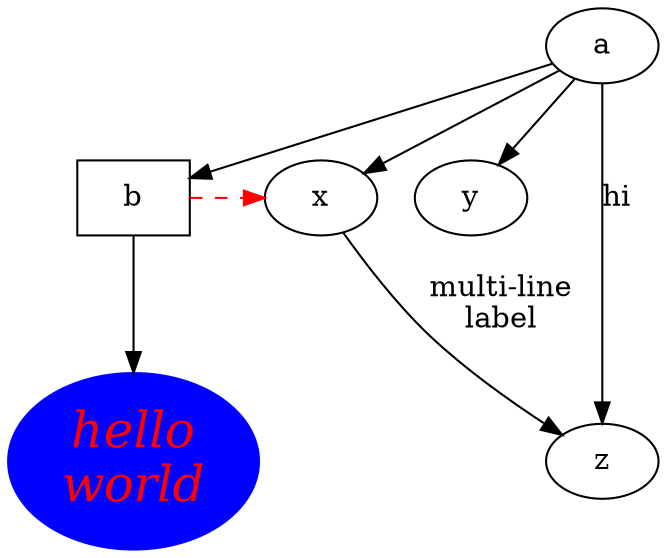

# R과 knitr를 활용한 동적 문서

###### 머리말

우리는 데이터 세트를 통계 소프트웨어 패키지로 가져오고, 결과를 얻기 위해 절차를 실행한 다음, 선택한 부분을 조판 프로그램에 복사하여 붙여넣고, 몇 가지 설명을 추가하여 보고서를 완성합니다. 이는 통계 보고서를 작성할 때 흔히 볼 수 있는 관행입니다. 이러한 과정에는 분명한 위험과 단점이 있습니다.

- 1. 수작업이 많아 오류가 발생하기 쉽습니다.
- 2. 문서 간에 결과를 복사하는 등의 지루한 작업을 수행하는 데 많은 인력이 필요합니다.
- 3. 작업 흐름은 특히 GUI(그래픽 사용자 인터페이스) 작업이 포함될 때 기록하기 어렵기 때문에 재현하기 어렵습니다.
- 4. 향후 데이터 소스가 조금만 변경되더라도 작성자는 동일한 절차를 다시 거쳐야 하며, 이로 인해 거의 같은 시간과 노력이 소요될 수 있습니다.
- 5. 분석과 글쓰기가 분리되어 있으므로 두 부분의 동기화에 세심한 주의를 기울여야 합니다.

사실, 보고서는 프로그램 코드에서 동적으로 생성될 수 있습니다. 소프트웨어 패키지에 소스 코드가 있는 것처럼, 동적 문서는 보고서의 소스 코드입니다. 컴퓨터 코드와 그에 해당하는 서술의 조합입니다. 동적 문서를 컴파일하면 그 안의 프로그램 코드가 실행되고 출력으로 대체되며, 코드 출력과 서술을 혼합하여 최종 보고서를 얻습니다. 소스 코드만 관리하기 때문에 위에서 언급한 모든 발생 가능한 문제로부터 자유롭습니다. 예를 들어, 소스 코드에서 단일 매개변수를 변경하여 즉석에서 다른 보고서를 얻을 수 있습니다.

이 책에서 동적 문서란 프로그램 코드와 서술이 모두 포함된 종류의 소스 문서를 의미합니다. 때로는 "동적"이라는 말이 일부 사람들에게 혼란스럽고 모호하게 들릴 수 있으므로(상호 작용이나 애니메이션을 의미하지는 않음) 소스 문서라고 부르기도 합니다. 이 책 전체에서 보고서라는 용어도 자주 사용하는데, 이는 동적 문서에서 컴파일된 출력 문서를 의미합니다.

###### 이 책의 대상 독자

이 책은 초보자와 고급 사용자 모두를 위해 작성되었습니다. 주요 목표는 보고서 작성을 더 쉽게 만드는 것입니다. 여기서 "보고서"는 학생 과제나 프로젝트 보고서, 시험, 책, 블로그, 웹 페이지에서부터 통계 그래픽, 컴퓨팅, 데이터 분석과 관련된 거의 모든 문서에 이르기까지 다양합니다.

초보자의 경우 1장부터 8장까지 기본 애플리케이션에 충분할 것입니다(이미 많은 기능을 다루고 있음). 파워 유저의 경우 9장부터 11장까지 knitr 패키지의 확장성을 이해하는 데 도움이 될 수 있습니다.

LATEX 및 HTML에 대한 친숙함은 도움이 될 수 있지만 전혀 요구되지 않습니다. 기본 아이디어를 이해하면 마크다운과 같은 간단한 언어로 보고서를 작성할 수 있으며, 이는 초보자가 배우기 상당히 쉽습니다. 달리 명시되지 않는 한 모든 기능은 모든 문서 형식에 적용되지만, 주로 예제로 LATEX를 사용합니다.

사용자가 기여한 수많은 문서가 포함된 웹사이트 RPubs(http://rpubs.com)를 살펴보는 것을 권장합니다. 동적 문서를 빠르고 쉽게 작성할 수 있다는 것을 보여주기에 충분히 설득력이 있기를 바랍니다.

###### 소프트웨어 정보 및 규칙

이 책에서 소개하는 주요 도구는 이 책을 작성하는 데 사용된 R 언어(R Core Team, 2015)와 knitr 패키지(Xie, 2015b)이지만 문서의 언어가 R로 제한되는 것은 아닙니다. 예를 들어 Python, awk, 셸 스크립트 등을 보고서에 통합할 수도 있습니다. 문서 형식으로는 주로 LATEX, HTML, 마크다운을 사용합니다.

R과 knitr는 모두 CRAN(Comprehensive R Archive Network)에서 무료 오픈 소스 소프트웨어로 사용할 수 있습니다. http://cran.rstudio.com과 같은 CRAN 미러에서 다운로드할 수 있습니다. 아래 R 세션 정보에서 이 책에 대한 버전 정보를 찾을 수 있습니다.

###### sessionInfo()

## R version 3.2.0 (2015-04-16) ## Platform: x86_64-pc-linux-gnu (64-bit)

머리말 xv

## Running under: Ubuntu 14.04.2 LTS ## ## locale:

- ## [1] LC_CTYPE=en_US.UTF-8
- ## [2] LC_NUMERIC=C
- ## [3] LC_TIME=en_US.UTF-8
- ## [4] LC_COLLATE=en_US.UTF-8
- ## [5] LC_MONETARY=en_US.UTF-8
- ## [6] LC_MESSAGES=en_US.UTF-8
- ## [7] LC_PAPER=en_US.UTF-8
- ## [8] LC_NAME=C
- ## [9] LC_ADDRESS=C
- ## [10] LC_TELEPHONE=C
- ## [11] LC_MEASUREMENT=en_US.UTF-8
- ## [12] LC_IDENTIFICATION=C ## ## attached base packages: ## [1] stats graphics grDevices utils datasets ## [6] base ## ## other attached packages: ## [1] knitr_1.10 ## ## loaded via a namespace (and not attached): ## [1] formatR_1.2 tools_3.2.0 highr_0.5 ## [4] stringr_0.6.2 evaluate_0.7

knitr 패키지는 웹사이트 http://yihui.name/knitr/ 에 자세히 문서화되어 있으며, 가장 중요한 페이지는 아마도 청크 옵션에 대한 전체 참조를 찾을 수 있는 http://yihui.name/knitr/options 일 것입니다(5.1.1절). 개발 버전은 Github(https://github.com/yihui/knitr)에서 호스팅됩니다. 언제든지 최신 개발 버전을 확인하거나, 이슈/기능 요청을 제출하거나, 저장소를 포크하고 직접 변경하여 개발에 참여할 수 있습니다. https://github.com/yihui/knitr-examples 저장소에는 최소한의 예제와 고급 예제를 모두 포함하여 수많은 예제가 있습니다. Karl Broman은 http://kbroman.org/knitr_knutshell 에 knitr에 대한 멋진 최소한의 자습서를 준비했으며, 이는 초보자가 knitr를 빠르게 배우는 데 유용할 수 있습니다. 밴더빌트 대학교 생물통계학과의 Frank Harrell 등이 유지 관리하는 위키 페이지도 있으며, knitr 사용에 대한 몇 가지 요령과 유용한 경험을 소개했습니다. http://biostat.mc.vanderbilt.edu.

R에 대한 다른 많은 책과 달리 이 책에서는 R 소스 코드에 프롬프트를 추가하지 않으며, 이전 R 세션 정보에서 볼 수 있듯이 기본적으로 두 개의 해시 ##를 사용하여 텍스트 출력을 주석 처리합니다. 이러한 규칙의 이유는 6장에서 설명합니다. 패키지 이름은 일반 텍스트(rpart)로, 함수 이름은 평문(paste())으로, 인라인 코드는 타자기로 된 글꼴(mean(1:10, trim = 0.1))로 서식이 지정되며, 파일 이름은 산세리프 글꼴(figure/foo.pdf)로 지정됩니다.

###### 책의 구조

1장은 동적 문서에 대한 개요로, 리터럴 프로그래밍의 아이디어를 소개합니다. 2장은 재현 가능한 연구의 관점에서 동적 문서가 과학 연구에 중요한 이유를 설명합니다. 3장은 기본 개념과 knitr로 할 수 있는 작업을 다루는 첫 번째 완전한 예제를 제공합니다. 4장은 소스 문서에서 보고서를 컴파일하기 쉽도록 knitr를 지원하는 몇 가지 일반적인 텍스트 편집기를 소개합니다. 그리고 5장은 LATEX, HTML, 마크다운과 같은 다양한 문서 형식에 대한 구문을 설명합니다.

6장부터 11장까지는 패키지의 핵심 기능을 설명합니다. 6장과 7장은 knitr에서 텍스트와 그래픽 출력을 제어하는 방법을 제시합니다. 8장은 연산 시간을 줄일 수 있는 캐싱 메커니즘에 대해 설명합니다. 9장은 청크 참조로 소스 코드를 재사용하고 하위 문서를 구성하는 방법을 보여줍니다. 10장은 고급 주제인 청크 훅으로 구성되어 있으며, 이는 리터럴 프로그래밍 문서를 진정으로 프로그래밍 가능하고 확장 가능하게 만듭니다. 11장은 Python 및 awk 등과 같은 다른 언어를 knitr 프레임워크의 하나의 보고서에 통합하는 방법을 설명합니다.

12장은 knitr로 문서를 작성하기 쉽게 만드는 몇 가지 유용한 요령을 소개합니다. 13장은 PDF, HTML, HTML5 슬라이드를 포함한 다양한 형식으로 보고서를 게시하는 방법을 보여줍니다. 14장은 13장의 형식을 포함하여 다양한 문서 형식으로 변환할 수 있는 R 마크다운 v2에 초점을 맞춥니다. 15장은 몇 가지 중요한 애플리케이션을 다룹니다. 16장은 Sweave, 다른 R 패키지, 다른 언어로 된 소프트웨어와 같은 동적 보고서 생성을 위한 다른 도구를 소개합니다. 부록 A는 다른 패키지 개발자에게 유용할 수 있는 knitr의 일부 내부 구조에 대한 안내입니다.

6장부터 11장까지의 주제는 서로 병렬적입니다. 예를 들어 그래픽 출력에 대해 더 알고 싶다면 6장을 건너뛰고 7장으로 직접 이동할 수 있습니다.

결론적으로, 보고서 작성 효율성을 개선하고, 보고서의 모든 측면을 미세 조정하며, 프로그램 출력에서 출판 품질의 보고서로 이동하는 방법을 보여줍니다.

###### 2판의 새로운 기능

이 책의 2판에서 주요한 새로운 내용은 14장으로, R 마크다운 v2에 대한 소개입니다. 그런 다음 6.3(표 생성 방법), 6.4(코드 청크의 객체에 대한 사용자 정의 인쇄 방법 정의 방법), 11.2.2(C/Fortran 엔진), 11.2.4(Stan 엔진), 11.3(영구 세션에서 엔진을 실행하는 방법), 15.2(동적 문서를 제공하기 위해 로컬 서버를 시작하는 방법) 등의 몇 가지 새로운 섹션이 있습니다. 이 책 곳곳에 많은 사소한 업데이트도 있습니다.

2판에서는 knitr 패키지의 변경 사항에 따라 여러 가지 변경 사항도 도입되었습니다(1판은 knitr 1.3 기반).

- • 청크 옵션 tidy의 기본값이 TRUE에서 FALSE로 변경되었습니다. 즉, 코드 청크는 기본적으로 자동으로 다시 서식이 지정되지 않습니다(6.2.2절).
- • 인라인 R 표현식은 try() 없이 평가됩니다. 즉, 인라인 평가 중에 오류가 발생하면 R이 즉시 중지됩니다.
- • 전역 R 옵션 digits는 더 이상 knitr에서 수정되지 않습니다. 기본값은 7이며, 이전 동작을 원하면 options(digits = 4)를 설정할 수 있습니다.
- • plot 훅 함수는 길이가 2인 벡터(basename 및 extension) 대신 plot 파일 이름을 첫 번째 인수(5.3절)로 사용합니다.
- • 오류 발생 시 knitr를 중지하는 선호하는 방법은 더 이상 사용되지 않는 패키지 옵션 stop_on_error 대신 청크 옵션 error = FALSE를 설정하는 것입니다(6.2.4절).
- • 구문 강조 표시는 Highlight 패키지가 설치된 경우(11.2.7절) 셸 스크립트, awk, Python 등과 같은 다른 언어(11장)에서도 사용할 수 있습니다.
- • 외부 코드 청크(9.2절)의 경우 이제 선호되는 청크 구분 기호는 ## @knitr 대신 ## ---- 입니다.

knitr의 변경 사항을 추적하려면 https://github.com/yihui/knitr/releases 에서 각 버전에 대한 릴리스 노트를 볼 수 있습니다.

###### 감사의 글

먼저, 이 책의 1판의 핵심 장을 작성하기 시작했을 때(에임스의 지루한 겨울) 고장 났던 제 무선 라우터에 감사드립니다. 게다가 그 기간 동안 이더넷 케이블을 주지 않은 아내에게도 감사합니다.

이 책은 의심할 여지 없이 강력한 R 언어가 없었다면 불가능했을 것이며, R 핵심 팀과 기여자들에게 감사드립니다. Sweave(Friedrich Leisch와 R-core가 개발)의 획기적인 연구는 knitr의 가장 중요한 영감의 원천입니다. 일부 추가 기능은 cacheSweave(Roger Peng), pgfSweave(Cameron Bracken 및 Charlie Sharpsteen), weaver(Seth Falcon), SweaveListingUtils(Peter Ruckdeschel), highlight(Romain Francois), brew(Jeffrey Horner)를 포함한 다른 R 패키지에서 영감을 얻었습니다. 초기 디자인은 Hadley Wickham의 decumar 패키지를 기반으로 했으며, 평가자는 그의 evaluate 패키지를 기반으로 합니다. LYX와 RStudio 모두 knitr가 나온 후 신속하게 knitr에 대한 지원을 포함했으며, 이로 인해 소스 문서를 작성하기가 훨씬 쉬워졌습니다. 개발자(특히 Jean-Marc Lasgouttes, JJ Allaire, Joe Cheng)에게 감사드립니다. 마찬가지로 Emacs/ESS와 같은 다른 편집기의 개발자에게도 감사드립니다. John MacFarlane의 Pandoc을 어떻게 설명해야 할지 모르겠습니다. 그것은 마법입니다. "네, 워드를 지원합니다! 재현 가능한 연구의 세계에 오신 것을 환영합니다!"

R/knitr 사용자 커뮤니티는 정말 놀랍습니다. 2011년 말 개발이 시작된 이래로 많은 피드백이 있었습니다. 제가 첫 베타 버전을 출시했을 때 일부 사용자들이 옥상에서 외쳤던 것을 아직도 기억합니다. 저는 이런 종류의 흥분을 감사합니다. 메일링 리스트(https://groups.google.com/group/knitr)와 웹사이트 StackOverflow(http://stackoverflow.com/tags/knitr/)의 수천 개의 질문과 의견이 이 패키지를 제가 상상했던 것보다 훨씬 더 강력하게 만들었습니다. 개발 저장소는 Github에 있으며, 이곳에서 Ramnath Vaidyanathan, Taiyun Wei, Kirill Müller, JJ Allaire를 포함한 많은 기여자로부터 거의 800개의 이슈와 160개 이상의 풀 리퀘스트를 받았습니다(https://github.com/yihui/knitr/pulls).

# 전체 기여자 목록을 보려면 packageDescription("knitr", fields = "Authors@R")

이 "비고전적인" 통계 영역에서 제 연구에 대한 개방적인 마음과 일관된 지원을 해주신 아이오와 주립 대학교의 박사 과정 지도교수인 Di Cook과 Heike Hofmann에게 감사드립니다. 또한 이 책의 2판 작업을 할 수 있는 자유를 제공해 주신 RStudio(http://www.rstudio.com)에 감사드립니다.

마지막으로, 제 경력의 첫 번째 책인 이 책의 품질을 향상시키는 데 귀중한 조언을 해주신 리뷰어 Frank Harrell, Douglas Bates, Carl Boettiger, Joshua Wiley, Scott Kostyshak, Jim Robison-Cox에게 감사드리며, 저의 편집자인 John Kimmel이 없었다면 제 첫 책을 빨리 출판할 수 없었을 것입니다.

Yihui Xie 에임스, 아이오와

###### 저자 소개

Yihui Xie(http://yihui.name)는 현재 RStudio(http://www.rstudio.com)의 소프트웨어 엔지니어입니다. 아이오와 주립 대학교 통계학과에서 박사 학위를 취득했습니다. 대화형 통계 그래픽과 통계 컴퓨팅에 관심이 있습니다. 활발한 R 사용자로서 animation, knitr, formatR, fun, mime, highr, servr, Rd2roxygen 등 여러 R 패키지를 작성했으며, 그중 animation 패키지는 2009년 John M. Chambers 통계 소프트웨어 상(ASA)을 수상했고, knitr 패키지는 Revolution Analytics 덕분에 "비즈니스에서의 R 응용 콘테스트 2012"에서 "명예로운 언급" 상을 수상했습니다.

2006년에는 중국에서 대규모 통계 온라인 커뮤니티로 성장한 "통계의 수도"(http://cos.name)를 설립했습니다. 2008년 제1회 중국 R 컨퍼런스를 시작했으며 그 이후로 중국에서 R 컨퍼런스를 조직하고 있습니다. 아이오와 주립 대학교 박사 과정 중 통계학과에서 Vince Sposito 통계 컴퓨팅 상(2011)과 Snedecor 상(2012)을 수상했습니다.

xxi

###### 그림 목록

1.1 브라운 운동 시뮬레이션 . . . . . . . . . . . . . 2

- 3.1 최소한의 Rnw 문서의 소스 . . . . . . . . . 13
- 3.2 LATEX의 최소 예제 . . . . . . . . . . . . . . . . 14
- 3.3 최소한의 Rmd 문서의 소스 . . . . . . . . . 15
- 3.4 마크다운의 최소 예제 . . . . . . . . . . . . . 16

- 4.1 RStudio에서 Rnw 문서 편집 . . . . . . . . . . . . . 20
- 4.2 RStudio에서 Rmd 문서 편집 . . . . . . . . . . . . . 22
- 4.3 LYX에서 knitr 사용 . . . . . . . . . . . . . . . . . . . . . . 24

- 5.1 knitr의 Sweave 스타일 . . . . . . . . . . . . . . . . . . 41
- 5.2 knitr의 listings 스타일 . . . . . . . . . . . . . . . . . . 42

- 7.1 명시적으로 인쇄할 필요가 없는 ggplot2에서 생성된 그림 . . . . . . . . . . . . . . . . . . . . . . . . . . . . 59
- 7.2 Bookman 글꼴 계열을 사용한 그림 . . . . . . . . . . . 62
- 7.3 Windows-1250 코드 페이지 표 . . . . . . . . . . . . . 64
- 7.4 세 개의 표현식이 두 개의 그림을 생성함 . . . . . . . . . . . 66
- 7.5 모든 상위 수준 그림 캡처됨 . . . . . . . . . . . . . . 67
- 7.6 코드 바로 아래에 그림 표시 . . . . . . . . . . . . . . 68
- 7.7 마지막 그림만 유지됨 . . . . . . . . . . . . . . . . . 69
- 7.8 시계 애니메이션 . . . . . . . . . . . . . . . . . . . . . . 70
- 7.9 ?stars 에서 가져온 우측 정렬된 그림 . . . . . . . . 72
- 7.10 다른 각도로 두 그림 회전 . . . . . . . . . . . . . . 74
- 7.11 그림에 수학 식을 쓰는 전통적인 방식 . . . . . . . . . . . . . . . . . . . . . . . . . . . . . . 75
- 7.12 tikz() 장치로 네이티브 LATEX에 수학 쓰기 . . . . . 75
- 7.13 하위 그림이 있는 그림 환경 . . . . . . . . . . 77

- 10.1 기본 여백이 있는 그림 . . . . . . . . . . . . . . . 100
- 10.2 더 작은 여백이 있는 그림 . . . . . . . . . . . . . . . . 101
- 10.3 큰 흰색 여백이 있는 원본 그림 . . . . . . . . 104
- 10.4 잘린 그림 . . . . . . . . . . . . . . . . . . . . . . . 105
- 10.5 hook_rgl()로 캡처한 rgl 그림 . . . . . . . . . . . . . 106 xxiii

xxiv 그림 목록

- 10.6 GGobi로 생성한 그림 . . . . . . . . . . . . . . . . . . . 107
- 10.7 기존 rgl 그림에 요소 추가 . . . . . . . . . . 109

- 11.1 TikZ로 그린 다이어그램 . . . . . . . . . . . . . . . . 121
- 11.2 Graphviz의 dot으로 그린 다이어그램 . . . . . . . . . . 122

- 12.1 gridExtra 패키지로 생성된 표 . . . . . . . . . 129
- 12.2 목록으로 긴 줄 끊기 . . . . . . . . . . . . . . . . 134
- 12.3 beamer 슬라이드에서 knitr 사용에 대한 간단한 예제 . . . . 135
- 12.4 beamer 슬라이드의 샘플 페이지 . . . . . . . . . . . . . 136
- 12.5 R Example 환경의 R 코드 청크 . . . . . . 141
- 12.6 HTML 출력을 위한 Docco 스타일 . . . . . . . . . . . . . 142
- 12.7 ggplot2 geom 예제의 소스 문서 . . 148
- 12.8 ggplot2 설명서의 샘플 페이지 . . . . . . 149
- 12.9 다이어그램 패키지의 순서도 데모 . . . . . . 152
- 12.10 순서도 데모의 샘플 페이지 . . . . . . . . . . 153
- 12.11 회귀 모델 템플릿 . . . . . . . . . . . . . 157

  13.1 마크다운에서 변환된 OpenDocument Text . . . . 164 13.2 HTML5 슬라이드 예제 소스 . . . . . . 165

- 14.1 R 마크다운 v2의 HTML 출력 문서 미리보기 . . . . . . . . . . . . . . . . . . . . . . . . . . . . 178
- 14.2 표, 각주, 인용 미리보기 . . . . . . 179
- 14.3 목차와 번호가 매겨진 섹션이 있는 "읽을 수 있는" 테마 미리보기 . . . . . . . . . . . . . . . . 181
- 14.4 R 마크다운 v2의 PDF 출력 문서 미리보기 . . . . . . . . . . . . . . . . . . . . . . . . . . . . 185
- 14.5 목차와 번호가 매겨진 섹션이 있는 PDF 출력 문서 미리보기 . . . . . . . . . . . . . . 186
- 14.6 R 마크다운 v2의 Microsoft Word 문서 미리보기 . . . . . . . . . . . . . . . . . . . . . . . . . . . . 189
- 14.7 Word에서 스타일 패널 열기 . . . . . . . . . . . . . . . 190
- 14.8 Word에서 요소의 스타일 수정 . . . . . . . . . . . . . 191
- 14.9 ioslides 프레젠테이션의 제목 슬라이드 . . . . . . . . . 192
- 14.10 Slidy 프레젠테이션의 한 슬라이드 . . . . . . . . . . . . 194
- 14.11 R 마크다운으로 만든 Beamer 프레젠테이션의 두 슬라이드 . . . . . . . . . . . . . . . . . . . . . . . . . . 196
- 14.12 Tufte 유인물 스타일을 사용한 예제 페이지 . . . . . 200
- 14.13 R 마크다운 및 Shiny를 사용한 간단한 대화형 문서 . . . . . . . . . . . . . . . . . . . . . . . . . . . . . . 201
- 14.14 템플릿에서 새 R 마크다운 문서 만들기 . . 206
- 14.15 R 마크다운으로 전자책 만들기 . . . . . . . . . . . . 207

그림 목록 xxv

- 14.16 R 마크다운의 DataTables 라이브러리로 생성된 표 . . . . . . . . . . . . . . . . . . . . . . . . . . . . . . 210

- 15.1 이변량 정규 분포에 대한 깁스 샘플링 추적 . . . . . . . . . . . . . . . . . . . . . . . . . . . . . . . 215
- 15.2 깁스 샘플링의 5000개 포인트 . . . . . . . . . . . . . 215
- 15.3 R 마크다운 문서 레이아웃 및 RStudio 뷰어 출력 . . . . . . . . . . . . . . . . . . . . 218
- 15.4 servr의 make() 함수에 대한 Makefile 예제 . . . 219
- 15.5 knitr 비네트의 메타데이터 . . . . . . . . . . . . . 223
- 15.6 ggplot2 전환 가이드의 샘플 페이지 . . . . . . 225
- 15.7 knitr를 사용하여 PDF 비네트를 컴파일하기 위한 Makefile . . . 226
- 15.8 HTML 비네트를 컴파일하기 위한 Makefile . . . . . . . . . 227 16.1 IPython 스크린샷 . . . . . . . . . . . . . . . . . . . 243

###### 표 목록

1.1 mtcars 데이터 세트의 하위 세트 . . . . . . . . . . . . . . . 4 5.1 모든 문서 형식의 구문 요약 . . . . . . . 32 5.2 출력 훅 함수와 evaluate 패키지의 결과 객체 클래스. . . . . . . . . . . . . . . . . 40 11.1 knitr가 지원하는 인터프리터 언어 . . . . . . . 117

### 1

###### 소개

동적 문서의 기본 아이디어는 Donald Knuth가 고안한 프로그래밍 패러다임인 리터럴 프로그래밍(Knuth, 1984)에서 비롯되었습니다. 원래 아이디어는 주로 소프트웨어 작성을 위한 것이었습니다. 소스 코드와 문서를 혼합합니다. 소스 코드를 추출하거나(tangle이라고 함) 코드를 실행하여 컴파일된 결과를 얻을 수 있습니다(weave라고 함). 동적 문서는 컴퓨터 프로그램과 완전히 다르지 않습니다. 동적 문서의 경우 아이디어(종종 소스 코드로 구현됨)를 숫자 또는 그래픽 출력으로 컴파일하기 위해 소프트웨어 패키지를 실행하고 출력을 리터럴 글(문서와 같은)에 삽입해야 합니다.

간단한 예로 이 아이디어를 설명하겠습니다. 보고서에 2π의 값을 써야 한다고 가정해 보겠습니다. 물론 6.2832라는 숫자를 직접 쓸 수 있습니다. 이제 마음이 바뀌어 6π를 원한다면 계산기를 찾아서 이전 값을 지우고 새 답을 써야 할 수도 있습니다. 컴퓨터가 6π를 계산하는 것은 매우 쉬우므로 이 작업을 컴퓨터에 완전히 맡기고 이런 종류의 수작업에서 벗어나는 것은 어떨까요? 우리가 해야 할 일은 하드 코딩된 값 대신 문서에 소스 코드를 남겨두고, 컴퓨터에 소스 코드를 찾아서 실행하는 방법을 알려주는 것입니다. 일반적으로 소스 보고서의 컴퓨터 코드에 대한 특수 마커를 사용합니다. 예를 들어 다음과 같이 쓸 수 있습니다.

정답은 {{ 6 * pi }}입니다.

여기서 {{ 와 }} 는 6 \* pi가 소스 코드이며 실행되어야 함을 컴퓨터에 알려주는 한 쌍의 마커입니다. 여기서 pi(π)는 R의 상수입니다.

웹 스크립팅 언어(프로그램 코드를 HTML 문서에 삽입할 수 있는 PHP)를 알고 있다면 이 아이디어가 익숙할 것입니다. 위 예제는 인라인 코드 출력을 보여주며, 이는 소스 코드가 문장 안에 혼합되어 있음을 의미합니다. 다른 유형의 출력은 전체 코드 블록에서 결과를 제공하는 청크 출력입니다. 청크 출력은 훨씬 더 유연성이 있습니다. 예를 들어, 코드 청크에서 그래픽과 표를 생성할 수 있습니다.

그림 1.1은 R 코드 청크로 동적으로 생성되었으며, 아래에 인쇄되어 있습니다.

1

|     |     |     |     |     |     |     |     |
| --- | --- | --- | --- | --- | --- | --- | --- |
|     |     |     |     |     |     |     |     |
|     |     |     |     |     |     |     |     |
|     |     |     |     |     |     |     |     |
|     |     |     |     |     |     |     |     |
|     |     |     |     |     |     |     |     |
|     |     |     |     |     |     |     |     |

###### 1.1 브라운 운동 시뮬레이션

그림 1.1: 100단계에 대한 브라운 운동 시뮬레이션: x1 = 1, xi+1 = xi + i+1, i iid∼ N(0,1), i = 1,2, · · · ,100

```r
set.seed(1213) # 난수 재현성을 위해
x <- cumsum(rnorm(100))
plot(x, type = "l", ylab = "$x_{i+1}=x_i+\\epsilon_{i+1}$", xlab = "step")
```

이 작업을 수작업으로 수행한다면 R을 열고 코드를 R 콘솔에 붙여넣어 그림을 그리고 PDF 파일로 저장한 다음 \includegraphics{}를 사용하여 LATEX 문서에 삽입해야 합니다. 이는 작성자에게 지루할 뿐만 아니라 유지 관리하기도 어렵습니다. set.seed()에서 임의 시드를 변경하거나 단계 수를 늘리거나 꺾은선형 차트 대신 산점도를 사용하려는 경우 소스 코드와 출력을 모두 업데이트해야 합니다. 실제로 컴퓨팅 및 분석은 그림 1.1의 장난감 예제보다 훨씬 더 복잡할 수 있으며, 그에 따라 더 많은 수작업이 필요할 것입니다.

동적 문서의 정신은 S 언어에 대한 ESS 프로젝트(Rossini et al., 2004)의 철학으로 가장 잘 설명할 수 있습니다.

소스 코드가 진짜입니다.

ESS[S] 사용을 위한 철학

소스 코드에서 출력을 생성할 수 있으므로 소스 코드만 유지 관리할 수 있습니다. 그러나 대부분의 경우 소스 코드의 직접적인 출력만으로는 사람이 읽을 수 있는 보고서가 되지 않습니다.

서론 3

이것이 리터럴 프로그래밍 패러다임이 필요한 이유입니다. 이 패러다임에서 작성자는 두 가지 작업을 수행합니다.

- 1. 컴퓨팅을 수행하는 프로그램 코드를 작성합니다.
- 2. 프로그램 코드가 수행하는 작업을 설명하는 서술을 작성합니다.

두 번째 작업을 수행하는 전통적인 방법은 코드에 대한 주석을 작성하는 것이지만, 주석은 작성자의 전체적인 생각을 표현하는 측면에서 한계가 있는 경우가 많습니다. 일반적으로 수백 줄의 코드 주석 대신 논문이나 보고서에 아이디어를 작성합니다.

프로그램 구성에 대한 우리의 전통적인 태도를 바꿔 봅시다. 우리의 주요 임무가 컴퓨터에게 무엇을 해야 할지 지시하는 것이라고 생각하는 대신, 컴퓨터가 해주기를 원하는 것을 사람들에게 설명하는 데 집중합시다.

Donald E. Knuth, 리터럴 프로그래밍, 1984

기술적으로 리터럴 프로그래밍에는 세 가지 단계가 포함됩니다.

- 1. 소스 문서를 구문 분석하고 서술에서 코드를 분리합니다.
- 2. 소스 코드를 실행하고 결과를 반환합니다.
- 3. 소스 코드의 결과를 원래 서술과 혼합합니다.

이러한 단계는 소프트웨어 패키지에서 구현될 수 있으므로 작성자가 이러한 기술적 세부 사항에 신경 쓸 필요가 없습니다. 대신 출력 결과가 어떻게 보일지만 제어합니다. 리터럴 프로그래밍의 아이디어는 단순해 보이지만 보고서(특히 데이터 분석과 관련된 보고서)를 위해 조정할 수 있는 세부 사항은 많습니다. 예를 들어, 데이터 보고서에는 종종 표가 포함되며 표 1.1은 knitr의 kable() 함수를 사용하여 아래 R 코드에서 생성된 표입니다.

```r
library(knitr)
kable(head(mtcars[, 1:6]))
```

수많은 줄의 지저분한 LATEX 코드를 유지 관리하는 것과 비교하여 두 줄의 R 코드를 유지 관리하는 것이 얼마나 쉬운지 생각해 보십시오!

컴퓨터 코드와 서술을 통합하여 동적으로 보고서를 생성하는 것은 더 쉬울 뿐만 아니라 다음 장에서 논의할 재현 가능한 연구와 밀접한 관련이 있습니다.

표 1.1: mtcars 데이터 세트의 하위 세트: 처음 6개 행과 6개 열.

|                   | mpg  | cyl | disp | hp  | drat | wt    |
| ----------------- | ---- | --- | ---- | --- | ---- | ----- |
| Mazda RX4         | 21.0 | 6   | 160  | 110 | 3.90 | 2.620 |
| Mazda RX4 Wag     | 21.0 | 6   | 160  | 110 | 3.90 | 2.875 |
| Datsun 710        | 22.8 | 4   | 108  | 93  | 3.85 | 2.320 |
| Hornet 4 Drive    | 21.4 | 6   | 258  | 110 | 3.08 | 3.215 |
| Hornet Sportabout | 18.7 | 8   | 360  | 175 | 3.15 | 3.440 |
| Valiant           | 18.1 | 6   | 225  | 105 | 2.76 | 3.460 |

### 2

###### 재현 가능한 연구

과학 연구의 결과는 신뢰할 수 있으려면 재현할 수 있어야 합니다. 우리는 발견이 단지 고립된 사건(예를 들어, 특정 실험실 연구원만이 특정 날짜에 결과를 생성할 수 있고 다른 누구도 같은 조건에서 동일한 결과를 생성할 수 없음)으로 인한 것이기를 원하지 않습니다.

재현 가능한 연구(RR)는 동적 문서의 가능한 부산물 중 하나이지만 동적 문서가 RR을 절대적으로 보장하지는 않습니다. 보고서를 동적으로 생성할 때 일반적으로 사람의 개입이 없기 때문에 동일한 소프트웨어 및 하드웨어 환경을 준비하기가 비교적 쉽기 때문에 재현 가능할 가능성이 높습니다. 이것이 우리가 결과를 재현하는 데 필요한 전부입니다. 그러나 재현성의 의미는 하나의 특정 결과 또는 하나의 특정 보고서를 재현하는 것 이상일 수 있습니다. 사소한 예로, 특정 무작위 시드로 몬테카를로 시뮬레이션을 수행하고 매개변수에 대한 좋은 추정치를 얻었지만 그 결과는 실제로 "운이 좋은" 무작위 시드로 인한 것일 수 있습니다. 추정치를 엄격하게 재현할 수는 있지만 일반적인 의미에서 실제로 재현 가능한 것은 아닙니다. 최적화 알고리즘에도 유사한 문제가 존재합니다. 예를 들어, 서로 다른 시작 값은 동일한 방정식의 서로 다른 근으로 이어질 수 있습니다.

어쨌든 동적 보고서 생성은 여전히 RR을 향한 중요한 단계입니다. 이 장에서는 엄선된 RR 문헌과 RR 관행에 대해 논의합니다.

###### 2.1 문헌

재현 가능한 연구라는 용어는 스탠포드 대학교의 Jon Claerbout가 처음 제안했습니다(Fomel and Claerbout, 2009). 그 아이디어는 연구의 최종 산물이 논문 자체일 뿐만 아니라 결과를 재현하고 연구를 기반으로 구축하는 데 필요한 코드 및 데이터와 같이 논문에서 결과를 생성하는 데 사용되는 전체 계산 환경이라는 것입니다.

5

마찬가지로 Buckheit와 Donoho(1995)는 논문의 학문적 본질을 다음과 같이 지적했습니다.

과학 출판물에 실린 계산 과학에 대한 논문은 학문 자체가 아니라 단지 학문을 광고하는 것일 뿐입니다. 실제 학문은 완전한 소프트웨어 개발 환경과 그림을 생성한 일련의 지침 전체입니다.

D. Donoho, WaveLab 및 재현 가능한 연구

정말 명언입니다! 다행히도 저널들 역시 그러한 방향으로 나아가고 있습니다. 예를 들어, Peng(2009)은 Biostatistics 저널에서 재현성 기준과 논문 재현을 위한 자료 제출 방법에 대한 자세한 지침을 저자에게 제공했습니다.

기술적인 수준에서 RR은 종종 Donald Knuth가 하나의 문서에 소프트웨어 문서와 컴퓨터 코드를 통합하기 위해 고안한 패러다임인 리터럴 프로그래밍(Knuth, 1984)과 관련이 있습니다. 그러나 WEB(Knuth, 1983) 및 Noweb(Ramsey, 1994)과 같은 초기 구현은 데이터 분석 및 보고서 생성에 직접적으로 적합하지 않았습니다. Doxygen(van Heesch, 2008)의 R 구현인 roxygen2(Wickham et al., 2015)와 같이 이 문서 생성 경로에는 다른 도구가 있습니다. Sweave(Leisch, 2002)는 R에서 동적 문서를 처리하기 위한 첫 번째 구현 중 하나였습니다(Ihaka and Gentleman, 1996; R Core Team, 2015). 기존 도구로 해결되지 않은 몇 가지 과제가 여전히 있습니다. 예를 들어, Sweave는 LATEX와 밀접하게 연결되어 있으며 확장하기 어렵습니다. knitr 패키지(Xie, 2015b)는 프레임워크 재설계를 통해 이전 도구의 아이디어를 기반으로 구축되어 보고서의 여러 측면을 쉽고 세밀하게 제어할 수 있습니다. 다른 도구는 16장에서 소개할 것입니다.

통계 분석에 적용된 리터럴 프로그래밍의 개요는 Rossini(2002)에서 찾을 수 있습니다. Gentleman과 Temple Lang(2004)은 통계 분석을 위한 리터럴 프로그래밍 문서의 일반적인 개념을 소개하고 소프트웨어 아키텍처에 대해 논의했습니다. Gentleman(2005)은 재현 가능한 분석을 배포하기 위해 R 패키지 GolubRR을 사용하는 Gentleman과 Temple Lang(2004)을 기반으로 한 실용적인 예제입니다. Baggerly 등(2004)은 데이터 분석 결과를 발표하는 표준 관행에서 발생할 수 있는 여러 가지 문제를 밝혔으며, 이는 재현성에 대한 세부 정보가 부족하여(심지어 데이터 세트가 제공되더라도) 잘못된 발견으로 이어질 수 있습니다. 결과와 컴퓨팅을 분리하는 대신 컴퓨터 코드와 서술을 포함하여 모든 것을 하나의 문서(Gentleman과 Temple Lang(2004)에서는 compendium이라고 함)에 넣을 수 있습니다. 이 문서를 컴파일하면 컴퓨터 코드가 실행되어 결과가 직접 제공됩니다.

###### 2.2 좋은 관행과 나쁜 관행

RR을 위해 명심해야 할 핵심은 다른 사람들이 결과를 재현할 수 있어야 하므로 컴퓨팅을 이식 가능하게 만들기 위해 최선을 다해야 한다는 것입니다. 아래에서는 RR에 대한 몇 가지 좋은 관행을 논의하고 이를 따르지 않는 것이 왜 나쁠 수 있는지 설명합니다.

- • 동일한 디렉터리 아래에서 모든 소스 파일을 관리하고 가능하면 상대 경로를 사용하십시오: 절대 경로는 재현성을 깰 수 있습니다. 예를 들어, C:/Users/john/foo.csv 또는 /home/joe/foo.csv와 같은 데이터 파일은 한 컴퓨터에만 존재할 수 있으며, 하드 디스크에서 절대 경로가 다를 수 있기 때문에 다른 사람들은 이를 읽지 못할 수 있습니다. 모든 것을 동일한 디렉터리 아래에 유지하면 read.csv('foo.csv')(현재 작업 디렉터리에 있는 경우) 또는 read.csv('../data/foo.csv')(한 수준 위로 올라가서 data/ 디렉터리 아래에서 파일 찾기)로 데이터 파일을 읽을 수 있습니다. 결과를 배포할 때 전체 디렉터리의 아카이브(zip 패키지)를 만들 수 있습니다.
- • 컴퓨팅이 시작된 후에는 작업 디렉터리를 변경하지 마십시오: setwd()는 작업 디렉터리를 설정하는 R의 함수이며 사용자의 코드에서 setwd('C:/path/to/some/dir')를 보는 것은 드문 일이 아닙니다. 이는 절대 경로일 뿐만 아니라 나머지 소스 문서에 전역적인 영향을 미치기 때문에 좋지 않습니다. 이 경우 루트 디렉터리가 변경되었으므로 모든 상대 경로에 조정이 필요할 수 있으며 소프트웨어가 예기치 않은 위치에 출력을 쓸 수 있다는 점을 명심해야 합니다(예를 들어, 그림은 ./figures/ 디렉터리에 생성될 것으로 예상되지만 setwd('./data/')를 설정하면 대신 ./data/figures/에 기록됩니다). 작업 디렉터리를 설정해야 하는 경우 R 세션의 맨 처음에서 설정하십시오. 4장에서 소개할 대부분의 편집기는 이 규칙을 따르며, 문서를 컴파일하기 위해 knitr가 호출되기 전에 작업 디렉터리가 소스 문서의 디렉터리로 설정됩니다. 다른 작업 디렉터리를 설정한 후 코드를 작성하는 것이 불가피하거나 훨씬 더 편리한 경우 나중에 디렉터리를 복원해야 합니다. 예를 들면 다음과 같습니다.

```r
f <- function(...) {
  # 현재 디렉터리를 owd 변수에 저장
  owd <- setwd("a/different/dir/")
  # 함수가 종료될 때 작업 디렉터리 복원
  on.exit(setwd(owd), add = TRUE)
  # 이제 a/different/dir 아래에서 작업할 수 있습니다.
  ...
}
```

- • 깨끗한 R 세션에서 문서를 컴파일하십시오: 현재 R 세션에 있는 기존 R 객체는 출력 결과를 "오염"시킬 수 있습니다. 코드 청크를 하나씩 누적하고 대화식으로 실행하여 결과를 확인하여 보고서를 작성하는 것은 괜찮지만, 최종적으로는 모든 결과가 코드에서 새로 생성되도록 새 R 세션이 있는 일괄 처리 모드에서 보고서를 컴파일해야 합니다.
- • 사람의 상호 작용이 필요한 명령을 피하십시오: 사람의 입력은 매우 예측하기 어려울 수 있습니다. 예를 들어, 사용자에게 데이터 파일을 선택하도록 요청하는 대화 상자를 팝업하면 사용자가 어떤 파일을 선택할지 확실히 알 수 없습니다. file.choose()와 같은 함수를 사용하여 read.table()에 파일을 입력하는 대신 파일 이름을 명시적으로 작성해야 합니다(read.table('a-specific-file.txt')).
- • 데이터 분석을 위한 환경 변수를 피하십시오: 환경 변수는 구성 목적으로 프로그래밍에서 많이 사용되지만, 사용자가 설정하기 위한 추가 지침이 필요하고 사람들이 간단히 이 작업을 잊어버릴 수 있으므로 데이터 분석에 사용하는 것은 바람직하지 않습니다. 설정할 옵션이 있으면 소스 문서 내부에서 설정하십시오.
- • sessionInfo()(또는 devtools::session_info()) 및 이 문서를 컴파일하는 방법에 대한 지침을 첨부하십시오: 세션 정보는 R 버전, 운영 체제 및 사용된 추가 패키지와 같은 소프트웨어 환경을 독자가 인식하게 합니다. 때로는 단일 함수를 호출하여 문서를 컴파일하는 것만큼 간단하지 않을 수 있으며 추가 단계가 필요한 경우 컴파일 방법을 명확히 해야 합니다. 그러나 셸 스크립트, Makefile 또는 배치 파일과 같은 컴퓨터 스크립트 형식으로 지침을 제공하는 것이 좋습니다.

예제로 R을 사용했지만 이러한 관행은 R 언어에만 국한되지 않습니다. 다른 컴퓨팅 환경에도 동일한 규칙이 적용됩니다.

리터럴 프로그래밍 도구는 종종 사용자가 일괄 처리 모드에서 문서를 컴파일해야 하며 재현 가능한 연구에 좋지만 탐색적 데이터 분석의 경우 일괄 처리 모드가 번거로울 수 있습니다. 최종 문서에 무엇을 넣을지 결정하지 않은 경우 데이터 및 코드와 자주 상호 작용해야 할 수 있으며 코드를 업데이트할 때마다 전체 문서를 컴파일할 가치가 없습니다. 이 문제는 4장에서 소개하는 RStudio 및 Emacs/ESS와 같은 유능한 편집기를 사용하여 해결할 수 있습니다. 이러한 편집기에서 우리는 코드와 상호 작용하고 데이터를 자유롭게 탐색할 수 있으며(연결된 R 세션에서 R 코드 전송 또는 작성), 코딩 작업이 끝나면 일괄 처리 모드에서 전체 문서를 컴파일하여 모든 코드가 깨끗한 R 세션에서 작동하는지 확인할 수 있습니다.

###### 2.3 장벽

RR의 모든 장점에도 불구하고 몇 가지 실질적인 장벽이 있으며 다음은 완전하지 않은 목록입니다.

- • 데이터가 방대할 수 있습니다. 예를 들어 생물학의 고에너지 물리학 및 차세대 시퀀싱 데이터는 수십 테라바이트의 데이터를 생성할 수 있으며, 데이터를 보고서와 함께 보관하고 배포하는 것은 사소한 일이 아닙니다.
- • 데이터의 기밀성: 보고서와 함께 원시 데이터를 공개하는 것이 금지될 수 있으며, 특히 기밀성 문제로 인해 인체 실험 대상과 관련된 경우 더욱 그렇습니다.
- • 소프트웨어 버전 및 구성: 더 이상 사용할 수 없는 구버전 소프트웨어 패키지나 운영 체제에 따라 다르게 컴파일되는 소프트웨어 패키지로 보고서가 생성될 수 있습니다.
- • 경쟁: 잠재적인 경쟁자가 모든 것을 쉽게 무료로 얻을 수 있는 반면 원래 작성자는 많은 돈과 노력을 투자했다는 사실 때문에 보고서와 함께 코드나 데이터를 공개하지 않기로 선택할 수 있습니다.

세계의 모든 보고서가 공개적으로 사용 가능하고 엄격하게 재현 가능할 것으로 기대해서는 안 되지만 아무것도 공유하지 않는 것보다 평범하거나 결함이 있는 코드 또는 문제가 있는 데이터 세트라도 공유하는 것이 낫습니다. 정책을 통해 사람들을 RR로 설득하는 대신 복사 및 붙여넣기보다 RR을 더 쉽게 만드는 도구를 만들려고 노력할 수 있으며 knitr는 그러한 시도입니다. RPubs(http://rpubs.com)의 성공은 사용자가 사용하는 것을 즐기기 때문에 쉬운 도구가 RR을 빠르게 촉진할 수 있다는 증거입니다. 독자들은 RPubs 웹사이트에서 사용자가 제공한 수백 개의 보고서를 찾을 수 있습니다. 그곳에서 학생 과제와 연습 문제를 흔히 볼 수 있으며 학생들이 이런 방식으로 훈련을 받으면 미래에 더 많은 재현 가능한 과학 연구를 기대할 수 있습니다.

### 3

###### 첫인상

knitr 패키지는 범용 리터럴 프로그래밍 엔진으로 LATEX, HTML 및 마크다운(5장 참조)을 포함한 문서 형식과 R, Python, awk, C++ 및 셸 스크립트(11장 참조)와 같은 프로그래밍 언어를 지원합니다. 시작하기 전에 R에 knitr를 설치해야 합니다. 그런 다음 최소한의 예제를 통해 기본 개념을 소개합니다. 마지막으로 순수한 R 스크립트에서 보고서를 빠르게 생성하는 방법을 보여줄 것입니다. 이는 동적 문서에 대해 아무것도 모르는 초보자에게 유용할 수 있습니다.

###### 3.1 설정

knitr는 R 패키지이므로 R에서 일반적인 방법으로 CRAN에서 설치할 수 있습니다.

```r
install.packages("knitr", dependencies = TRUE)
```

여기서 dependencies = TRUE는 선택 사항이며, 절대적으로 필요하지는 않지만 몇 가지 유용한 기능으로 이 패키지를 향상시킬 수 있는 모든 패키지를 설치합니다. 개발 버전은 Github(https://github.com/yihui/knitr)에서 호스팅되며 언제든지 최신 개발 버전을 확인할 수 있습니다. 안정적이지 않을 수 있지만 최신 버그 수정 및 새로운 기능이 포함되어 있습니다. knitr에 문제가 있는 경우 가장 먼저 확인해야 할 것은 버전입니다.

```r
packageVersion("knitr") # 최신 버전이 아니면 update.packages() 실행
```

조판 도구로 LATEX를 선택하는 경우 MiKTEX(Windows, http://miktex.org/), MacTEX(Mac OS, http://tug.org/mactex/) 또는 TEXLive(Linux, http://tug.org/texlive/)를 설치해야 할 수 있습니다. HTML 또는 마크다운으로 작업하려는 경우 출력 결과가 웹 브라우저로 볼 수 있는 웹 페이지가 되므로 다른 것을 설치할 필요가 없습니다.

knitr를 설치하면 knit() 함수를 사용하여 소스 문서를 컴파일할 수 있습니다. 예를 들면 다음과 같습니다.

```r
library(knitr)
knit("your-file.Rnw")
```

\*.Rnw 파일은 일반적으로 다음 섹션과 5장에서 살펴볼 것처럼 R 코드가 포함된 LATEX 문서이며, 여기에서 더 많은 유형의 문서가 소개될 것입니다.

###### 3.2 최소한의 예제

각각 LATEX와 마크다운으로 작성된 두 가지 최소한의 예제를 사용하여 동적 문서의 구조를 설명합니다. 당분간은 LATEX나 마크다운의 구문에 대해서는 논의하지 않습니다(대신 5장 참조). 간단히 말해서 기본 R의 cars 데이터 세트를 사용하여 단순 선형 회귀 모델을 구축합니다. R에서 ?cars를 입력하여 자세한 설명서를 참조하십시오. 기본적으로 속도와 거리의 두 가지 변수가 있습니다.

```r
str(cars)

##  data.frame : 50 obs. of 2 variables:
## $ speed: num 4 4 7 7 8 9 10 10 10 11 ...
## $ dist : num 2 10 4 22 16 10 18 26 34 17 ...
```

###### 3.2.1 LATEX 예제

그림 3.1은 LATEX에 포함된 R 코드의 전체 예제입니다. 파일 이름 확장자가 관례상 Rnw이기 때문에 이러한 종류의 문서를 앞으로 Rnw 문서라고 부릅니다. 이를 minimal.Rnw 파일로 저장하고 전에 설명한 대로 R에서 knit('minimal.Rnw')를 실행하면 knitr가 minimal.tex라는 LATEX 출력 문서를 생성합니다. LATEX에 익숙한 사람들은 pdflatex를 통해 이 문서를 PDF로 컴파일할 수 있습니다. 그림 3.2는 Rnw 문서에서 컴파일된 PDF 문서입니다.

여기서 필수적인 것은 R 코드를 LATEX에 어떻게 내장했는지입니다. Rnw 문서에서 < <> >=는 코드 청크의 시작을 나타내고 @는 코드 청크를 종료합니다(이 설명은 엄밀하지는 않지만 이해하기 더 쉽습니다). 이 예제에서는 산점도를 그리고, 선형 모델을 맞추고, 산점도에 회귀선을 추가하기 위해 두 마커 사이에 4줄의 R 코드가 있습니다. \Sexpr{} 명령은 인라인 R 코드를 내장하는 데 사용됩니다(이 예제의 coef(fit)[2]). < <와 > >= 사이에 코드 청크에 대한 청크 옵션을 쓸 수 있습니다. 이 예제의 청크 옵션은 플롯 크기를 4 x 3인치(fig.width 및 fig.height)로 지정하고 플롯을 중앙에 정렬해야 함(fig.align)을 지정했습니다.

이 최소한의 예제에는 보고서의 가장 기본적인 요소가 있습니다.

- 1. 제목, 저자 및 날짜
- 2. 모델 설명
- 3. 데이터 및 계산
- 4. 그래픽
- 5. 숫자 결과

모든 출력은 R에서 동적으로 생성됩니다. 데이터가

그림 3.2: R 코드 청크, 플롯 및 숫자 출력(회귀 계수)이 포함된 LATEX의 최소한의 예제.

그림 3.3: 최소한의 Rmd 문서의 소스: 그림 3.4의 출력을 참조하십시오.

변경되더라도 처음부터 보고서를 다시 작성할 필요가 없으며 데이터 및 보고서를 다시 컴파일하면 출력이 그에 따라 업데이트됩니다.

###### 3.2.2 마크다운 예제

LATEX는 수많은 명령어로 인해 초보자에게 압도적으로 보일 수 있습니다. 이에 비해 마크다운(Gruber, 2004)은 훨씬 더 간단한 형식입니다. 그림 3.3은 이전 예제와 동일한 분석을 수행하는 마크다운 예제입니다.

마크다운의 이상적인 출력은 그림 3.4(Mozilla Firefox)와 같이 HTML 웹 페이지입니다. 마찬가지로 마크다운 문서에서 R 코드에 대한 구문을 볼 수 있습니다. `{r}은 코드 청크를 열고, `는 청크를 종료하며, 인라인 R 코드는 `r ` 내에 넣을 수 있습니다. 여기서 `는 백틱입니다.

knitr에서 약간 더 긴 예제는 마크다운을 기반으로 하는 notebook이라는 데모입니다. 마크다운의 잠재력뿐만 아니라 knitr로 웹 애플리케이션을 구축할 가능성도 보여줍니다. 데모를 보려면 아래 코드를 실행하십시오.


그림 3.4: 그림 3.2와 동일한 분석을 수행하는 마크다운의 최소한의 예제이지만 이제 출력은 PDF가 아닌 HTML입니다.

```r
if (!require("shiny")) install.packages("shiny")
demo("notebook", package = "knitr")
```

기본 웹 브라우저가 실행되어 웹 노트북을 표시합니다. 소스 코드는 왼쪽 패널에 있고 실시간 결과는 오른쪽 패널에 있습니다. 소스 코드를 자유롭게 실험하고 노트북을 다시 컴파일할 수 있습니다.

###### 3.3 빠른 보고서 작성

사용자가 R에 대한 기본 지식만 있고 knitr에 대해서는 아무것도 모르거나 R 스크립트 외에는 아무것도 작성하고 싶지 않다면 stitch() 함수를 사용하여 이 R 스크립트에서 빠른 보고서를 생성할 수도 있습니다.

stitch()의 기본 아이디어는 knitr가 일부 기본 설정이 포함된 소스 문서의 템플릿을 제공하여 사용자가 이 템플릿에 R 스크립트(하나의 코드 청크)만 입력하면 되도록 하는 것입니다. 그런 다음 knitr가 템플릿을 보고서로 컴파일합니다. 현재 LATEX, HTML 및 마크다운에 대한 기본 제공 템플릿이 있습니다. 사용법은 다음과 같습니다.

```r
library(knitr)
stitch("your-script.R")
```

###### 3.4 R 코드 추출하기

리터럴 프로그래밍 문서의 경우 보고서로 컴파일(코드 실행)하거나 문서 내의 프로그램 코드를 추출할 수 있습니다. 이를 각각 "위빙(weaving)" 및 "탱글링(tangling)"이라고 합니다. knitr에서 위빙을 위한 함수는 knit()이고, 해당하는 탱글링 함수는 purl()입니다. 예를 들면 다음과 같습니다.

```r
library(knitr)
purl("your-file.Rnw")
purl("your-file.Rmd")
```

탱글링의 결과는 R 스크립트입니다. 위 예제에서 기본 출력은 your-file.R이 되며, 이는 소스 문서의 모든 코드 청크로 구성됩니다.

지금까지 knitr의 명령줄 사용법을 소개했는데, 명령어를 반복해서 입력하는 것은 종종 지루합니다. 다음 장에서는 괜찮은 편집기가 어떻게 마우스 클릭 한 번이나 키보드 단축키로 소스 문서를 편집하고 컴파일하는 데 도움이 될 수 있는지 보여줍니다.

### 4

###### 편집기

knitr용 문서는 일반 텍스트 파일이므로 모든 텍스트 편집기로 작성할 수 있습니다. 예를 들어, Windows의 메모장이나 Linux의 Gedit과 같은 가벼운 편집기도 작동합니다. 특수한 텍스트 편집기가 필요한 주요 이유는 다음과 같습니다.

- 1. 매번 문자를 입력하는 대신 키보드 단축키를 사용하여 < <> >= 및 @ 등을 입력하는 등 R 코드 청크를 더 쉽게 입력하고자 합니다.
- 2. R을 열고 knitr::knit() 명령을 입력하는 대신 편집기 내에서 R과 knitr를 호출하여 소스 문서를 PDF/HTML로 컴파일하고 싶으며, 더 나아가 편집기 내에서 직접 R에 R 코드 청크를 보내고자 합니다.

LATEX, HTML 및 마크다운 문서를 위한 성숙하고 훌륭한 편집기가 많이 있으며, 다음 섹션에서 설명하겠지만 일부 편집기에는 knitr가 통합되어 있습니다.

###### 4.1 RStudio

RStudio는 특별히 R을 대상으로 하는 비교적 새로운 편집기입니다. Sweave 및 knitr를 가장 포괄적으로 지원하므로 초보자가 시작하기에 가장 좋은 편집기일 수 있습니다. RStudio는 크로스 플랫폼 무료 오픈 소스 소프트웨어이며 http://www.rstudio.com 에서 다운로드할 수 있습니다. R 프로그래밍에 대한 탁월한 지원 외에도 다른 많은 편집기에는 없는 가장 주목할 만한 기능이 있습니다. 데스크톱 버전과 동일하게 보이는 서버 버전이 있으며 Linux 서버에 서버 버전을 설치한 후 웹 브라우저에서 R을 사용할 수 있습니다.

전체 설명서는 웹사이트에서 찾을 수 있습니다. 여기서는 동적 문서와 관련된 기능만 간략하게 소개합니다. Rnw 문서(LATEX)를 작성하려는 경우 RStudio에서 knitr를 사용하기 위해 가장 먼저 해야 할 일은 Tools 메뉴에서 옵션을 변경하는 것입니다.

19

(그림 4.1 설명: RStudio에서 Rnw 문서 편집. 청크 헤더 내에 자동 완성이 있습니다. 코드 청크는 메뉴나 키보드 단축키에서 삽입할 수 있습니다. Compile PDF 버튼은 Rnw에서 PDF를 원클릭으로 생성하도록 지원합니다.)

옵션 Sweave; Rnw 문서를 위빙(즉, 컴파일)하기 위한 기본 옵션은 Sweave이며, R에 knitr를 설치했다면 이를 knitr로 전환할 수 있습니다. knitr 대 Sweave에 대한 자세한 논의는 16.1절을 참조하십시오. R 마크다운과 같은 다른 유형의 문서로 작업하려는 경우 어떤 옵션도 구성할 필요가 없으며, 누락된 경우 RStudio에서 필요한 패키지를 설치하라는 팁을 제공합니다.

RStudio에서 지원하는 모든 문서 형식은 File New 메뉴에서 찾을 수 있습니다. 현재 여기에는 R Sweave, R 마크다운 및 R HTML이 포함됩니다. 모든 문서 형식에 대해 원클릭 컴파일이 지원됩니다. 즉, 버튼을 클릭하여 소스 문서를 해당 출력 형식(LATEX를 PDF로, 마크다운을 HTML로 등)으로 컴파일할 수 있습니다. Ctrl + Alt + I를 사용하여 R 코드 청크를 입력할 수 있습니다. 청크 헤더에는 청크 옵션의 자동 완성이 있습니다. 예를 들어, Rnw 문서의 < <와 > >= 사이에 "fig."를 입력하면 fig.width, fig.height 등과 같은 가능한 후보가 표시됩니다. 청크의 R 코드는 일반 R 스크립트에서 하는 것과 마찬가지로 Ctrl + Enter를 사용하여 R 콘솔로 보낼 수 있습니다. 이런 식으로 전체 문서를 컴파일하기 전에 특정 R 코드 청크를 대화식으로 실행할 수 있습니다. 그림 4.1은 RStudio에서 Rnw 문서가 어떻게 보이는지 보여주는 스크린샷입니다.

Rnw 문서의 경우 최종 출력 형식은 일반적으로 PDF(LATEX를 통해)입니다. RStudio는 PDF 문서와 소스 문서 간의 동기화를 제공하며, 이는 다음 기능을 의미합니다.

- 1. 정방향 검색: 소스 문서의 한 줄에서 소스 줄에 해당하는 PDF 문서의 적절한 위치로 이동할 수 있습니다.
- 2. 역방향 검색: PDF 문서에서 클릭하면 RStudio가 Rnw 소스의 해당 줄로 다시 이동할 수 있습니다.
- 3. 오류 탐색: R 또는 LATEX에서 오류가 발생하면 RStudio는 오류의 원인이 된 소스 문서의 위치로 이동할 수 있으며, 이를 통해 R 또는 LATEX 코드의 문제를 더 빨리 해결할 수 있습니다.

R 마크다운 문서의 경우 RStudio는 HTML을 포함한 다양한 형식으로의 원클릭 컴파일을 제공합니다. 또한 HTML 출력에서 이미지를 base64 인코딩하고 (MathJax 라이브러리를 통해) LATEX 수학 식을 렌더링할 수도 있습니다. 전자의 기능은 생성된 HTML 페이지가 독립적임을 보장하기 위한 것입니다. 즉, 이미지가 페이지에 포함되어 있으므로 외부 이미지에 의존하지 않습니다. 후자의 기능은 통계학자가 웹 페이지에 수학을 쓰고 싶을 때 특히 유용합니다.

R 마크다운(Rmd) 형식은 상당히 간단하며

(그림 4.2 설명: RStudio에서 Rmd 문서 편집: 청크 옵션 값에 대한 자동 완성도 있습니다. Knit HTML 버튼은 Rmd에서 HTML 페이지를 원클릭으로 생성하도록 지원합니다.)

5분 안에 쉽게 마스터할 수 있습니다. 그 단순성 때문에 이 형식으로 작성된 방대한 수의 보고서가 RStudio에서 사용자의 knitr 보고서를 호스팅하기 위해 제공하는 무료 플랫폼인 RPubs에 게시되었습니다. 더 많은 예제는 http://rpubs.com 을 참조하십시오. 그림 4.2는 RStudio의 샘플 Rmd 문서를 보여줍니다.

3.3절에서 빠른 보고서 작성을 언급했으며 이는 RStudio에서도 지원됩니다. RStudio의 R 스크립트의 경우 도구 모음의 버튼을 클릭하여 "R Notebook"(순전히 R 스크립트를 기반으로 하는 보고서)을 만들 수 있습니다.

###### 4.2 LYX

LYX는 기본적으로 문서 작성을 돕는 멋진 GUI를 갖춘 LATEX용 프런트 엔드입니다. 화면에서는 많은 워드 프로세서처럼 보이지만

- 핵심은 LATEX입니다. 원시 LATEX 편집기와 LYX의 주요 차이점 중 하나는 원시 LATEX에서는 \alpha + \beta 만 볼 수 있지만 LYX에서는 α + β를 볼 수 있다는 것입니다. 화면 뒤에서는 본질적으로 \alpha + \beta 입니다. LYX의 모든 것은 LATEX이지만 백슬래시로 가득 찬 화면으로 인해 시야가 왜곡되지 않습니다.

버전 2.0.3부터 LYX는 공식 모듈로 knitr 지원을 시작했습니다. 자세한 내용은 http://yihui.name/knitr/demo/lyx/ 에서 찾을 수 있습니다. 이 모듈은 다음과 같은 방식으로 작동합니다.

```
*.lyx -LyX-> *.Rnw -R+knitr-> *.tex -LaTeX-> *.pdf (weave)
*.lyx -LyX-> *.Rnw -R+knitr-> *.R (tangle)
```

현재 LYX에서 사용할 수 있는 유일한 형식은 Rnw입니다. R 코드와 LYX를 혼합하는 것처럼 보이지만 LYX는 사실 래퍼일 뿐이므로 실제로는 Rnw 문서에 R 코드를 삽입하는 것입니다.

Linux 및 Mac OS 사용자의 경우 모듈 사용법은 다음과 같습니다.

- 1. 새 LYX 문서를 만듭니다.
- 2. Document Settings Modules로 이동하여 Rnw (knitr)라는 모듈을 삽입합니다.
- 3. Insert TEX Code를 사용하여 문서에 R 코드 청크를 삽입한 다음 평소와 같이 <<>>= 및 @를 입력하기 시작합니다.

도구 모음에서 View 버튼을 클릭하거나 Ctrl + R을 눌러 문서를 PDF로 컴파일하고 결과를 봅니다. 메뉴 File Export R/S code에서 LYX 문서의 R 코드를 추출할 수도 있습니다. R 코드가 있는 LYX 스크린샷은 그림 4.3에 나와 있습니다.

(그림 4.3 설명: LYX에서 knitr 사용: Rnw 구문을 사용하여 빨간색 상자에 R 코드가 삽입됩니다. View 버튼을 클릭하면 knitr와 LYX를 통해 컴파일된 PDF 문서가 표시됩니다.)

Windows 환경에서 knitr 모듈을 사용하려면 한 가지 단계가 더 필요합니다. Tools Preferences Paths PATH prefix로 이동하여 거기에 R의 bin 경로를 추가합니다. 이는 종종 C:\Program Files\R\R-x.x.x\bin과 같으며 R에서 찾을 수 있습니다.

```r
R.home("bin")
```

이 변경 사항을 적용한 후에는 Tools Reconfigure에서 LYX를 재구성해야 합니다. 이는 LYX가 R이 설치된 위치를 확인하여 Rnw 문서를 컴파일하기 위해 R과 knitr를 호출할 수 있도록 하기 위한 것입니다. 특히 Rscript.exe가 어디에 있는지 알아야 합니다. PATH에 없으면 knitr 모듈을 사용할 수 없습니다. Linux 및 Mac OS에서는 이러한 시스템이 기본적으로 PATH에 R 실행 파일을 넣기 때문에 이 단계가 종종 필요하지 않습니다.

그래픽 인터페이스가 사용하기에 충분히 쉬워 보이지만, 여전히 LYX를 시도하기 전에 LATEX를 마스터하는 것을 강력히 권장합니다. 그렇지 않으면 오류가 발생했을 때 LATEX 문제를 진단하기 어려울 수 있습니다. 어쨌든 LYX는 Word가 아닙니다.

###### 4.3 Emacs/ESS

ESS(Emacs Speaks Statistics)는 텍스트 편집기 Emacs(Rossini et al., 2004)의 애드온 패키지입니다. R, S-Plus, SAS, JAGS 등과 같은 통계 소프트웨어 패키지를 지원합니다. knitr에 대한 지원은 버전 12.09 이후에 추가되었습니다. 그 이전에는 Sweave만 지원되었습니다.

ESS도 무료 오픈 소스 소프트웨어입니다. http://ess.r-project.org 에서 사용할 수 있습니다. Emacs와 함께 설치한 후 Emacs에서 knitr를 호출하는 것은 매우 쉽습니다. Rnw 문서의 기본 옵션은 Sweave이며 다음 명령을 사용하여 knitr로 변경할 수 있습니다(Emacs 키 표기법에서 M은 Meta 키를 나타내며, 이는 대부분의 키보드에서 Alt 키이며 M-x는 Meta를 누른 상태에서 x를 누름을 의미합니다).

```
M-x customize-group ess-R
```

ess-swv-processor 옵션을 찾아 knitr로 변경합니다. 그런 다음 새 Rnw 문서를 만들고 M-n s를 눌러 Rnw를 TEX로 컴파일하고 M-n P를 눌러 TEX를 PDF로 컴파일할 수 있습니다.

ESS에서 Rmd 문서 및 기타 문서 형식의 지원은 아직 개발 중입니다. 개발자에 따르면 이 기능은

ESS 13.03에 포함될 수 있으며, 독자들은 향후 공식 발표에 주의를 기울일 수 있습니다.

###### 4.4 기타 편집기

문서를 컴파일하기 위한 사용자 정의 명령을 정의할 수만 있다면 다른 편집기에 지원을 추가하는 것은 어렵지 않습니다. 일반적으로 사용자 정의 명령은 다음과 같습니다.

```r
Rscript -e "library(knitr); knit('input.ext')"
```

이 명령은 R을 호출하여 knitr 패키지를 로드하고 knit() 함수를 사용하여 input.ext라는 입력 문서를 컴파일합니다.

WinEdt(독점 소프트웨어)에는 knitr를 지원하기 위한 R-Sweave라는 모드가 있습니다. Tinn-R(무료)에는 기본 지원이 있습니다. 내부에서 편리하게 보고서를 컴파일할 수 있도록 Texmaker, Eclipse, TextMate, TEXShop 및 Vim과 같은 다른 텍스트 편집기를 구성하는 것도 가능합니다. 구성 지침은 http://yihui.name/knitr/demo/editors/ 에 수집되어 있습니다.

### 5

###### 문서 형식

knitr 패키지의 설계는 이론상 어떤 일반 텍스트 문서도 처리할 수 있을 만큼 유연합니다. 다음은 설계의 세 가지 핵심 구성 요소입니다.

- 1. 소스 파서
- 2. 코드 평가기
- 3. 출력 렌더러

파서는 소스 문서를 구문 분석하고 문서에서 인라인 코드뿐만 아니라 컴퓨터 코드 청크를 식별합니다. 평가기는 코드를 실행하고 결과를 반환합니다. 렌더러는 컴퓨팅 결과를 적절한 형식으로 서식을 지정하여 최종적으로 원본 문서와 결합합니다.

코드 평가기는 문서 형식과 무관하지만 파서와 렌더러는 문서 형식을 고려해야 합니다. 전자는 입력 구문에 해당하고 후자는 출력 구문과 관련이 있습니다.

###### 5.1 입력 구문

정규 표현식(Friedl, 2006, 또는 Wikipedia 참조)은 문서에서 인라인 코드와 같은 다른 요소 및 코드 블록(청크)을 식별하는 데 사용됩니다. 이러한 정규 표현식 패턴은 knitr의 all_patterns 객체에 저장됩니다. 예를 들어 Rnw 문서의 코드 청크 시작 패턴은 다음과 같습니다.

```r
all_patterns$rnw$chunk.begin
## [1] "^\\s*<<(.*)>>=.*$"
```

정규 표현식에서 ^는 문자열의 시작을 의미합니다. \s*는 숫자(0 포함)에 관계없이 모든 공백과 일치합니다. .*는

27

아무 문자나 숫자와 일치합니다. 이 정규 표현식은 "줄의 시작 부분에 있는 모든 공백 + << + 아무 문자 + >>="을 의미하므로 아래 줄은 가능한 청크 헤더입니다.

```
<<>>=
<<foo>>=
<<bar, echo=TRUE>>=
<<a=1, b=2>>=
```

그리고 다음은 유효하지 않은 청크 헤더입니다(첫 번째 헤더에서는 < <가 줄의 시작 부분에 나타나지 않고, 두 번째 헤더에서는 >가 하나뿐이며, 세 번째 헤더에서는 =가 누락됨).

```
hi<<>>=
<<foo>=
<<bar>>
```

위의 정규 표현식에 대한 두 가지 추가 기술 참고 사항:

- 1. 정규 표현식에서 \s는 공백을 나타내지만 R 문자열에서 \\는 실제 백슬래시 하나를 의미하기 때문에 R에서는 이중 백슬래시를 작성해야 합니다(첫 번째 백슬래시는 역시 백슬래시인 두 번째 문자를 이스케이프하는 역할을 합니다). 이스케이프 문자로 사용되는 백슬래시는 초보자에게 다소 혼란스러울 수 있으며 경험상 실제 백슬래시가 필요할 때는 두 개의 백슬래시가 필요할 수 있습니다.
- 2. 정규 표현식의 중괄호 ()는 일련의 문자를 그룹화하여 후방 참조로 추출할 수 있도록 합니다. 예를 들어 abbbc에서 두 번째 문자 그룹을 추출합니다.

```r
# [b]+ 는 'b'를 하나 이상 일치시킴을 의미합니다.
gsub("(a)([b]+)(c)", "\\2", "abbbc")

## [1] "bbb"
```

청크 헤더에서 청크 옵션을 추출해야 하므로 정규 표현식에서 ._를 ()로 묶어 < <(._)> >=와 같이 만들었습니다.

###### 5.1.1 청크 옵션

3장에서 언급했듯이 청크 헤더에 청크 옵션을 작성할 수 있습니다. 청크 옵션의 구문은 다음과 거의 동일합니다.

R의 함수 인수 구문. 다음과 같은 형태입니다.

```
option = value
```

R의 구문과 일관성이 있기 때문에 이 구문에 대해 기억할 것이 없습니다. 옵션 값이 유효한 R 코드인 한 knitr에 유효합니다. echo = TRUE(논리값) 또는 out.width = '\\linewidth'(문자열) 또는 fig.height = 5(숫자)와 같은 상수 값 외에도 소스 문서를 프로그래밍할 수 있도록 청크 옵션에 임의의 유효한 R 코드를 작성할 수 있습니다. 다음은 사소한 예입니다.

```
<<foo, eval=if (bar < 5) TRUE else FALSE>>=
```

bar가 이 청크 이전의 소스 문서에 생성된 숫자 변수라고 가정합니다. if (bar < 5) TRUE else FALSE 표현식을 eval 옵션에 전달할 수 있습니다. 이렇게 하면 eval 옵션이 bar 값에 의존하게 되며 그 결과 bar 값을 기준으로 이 청크를 평가합니다(5보다 크면 청크가 평가되지 않음). 즉, 특정 청크를 선택적으로 평가할 수 있습니다. 이 예제는 청크 옵션에서 임의로 복잡한 R 표현식을 작성할 수 있음을 보여주기 위한 것입니다. 사실 bar < 5 표현식은 일반적으로 TRUE 또는 FALSE를 반환하기 때문에 eval = bar < 5 로 단순화할 수 있습니다(bar가 NA가 아닌 경우).

###### 5.1.2 청크 레이블

유일한 예외는 구문 규칙을 따를 필요가 없는 청크 레이블입니다. 즉, 유효하지 않은 R 코드일 수 있습니다. 이는 역사적인 이유(Sweave 규칙)와 편의성(따옴표 입력 방지) 때문입니다. 엄밀히 말해서 청크 옵션의 일부인 청크 레이블은 문자 값을 취해야 하므로 따옴표로 묶어야 하지만, 대부분의 경우 knitr는 레이블 표현식에 사용된 "객체"가 존재하지 않더라도 따옴표 없는 레이블을 처리하고 내부적으로 따옴표로 묶을 수 있습니다. 다음은 청크 레이블을 작성하는 모든 유효한 방법입니다.

```
<<foo>>=
<<foo-bar>>=
<<foo_bar>>=
<<"foo">>=
<< foo-bar >>=
<<label="foo">>=
<<echo=FALSE, label="foo-bar">>=
```

청크 레이블은 문서의 고유한 ID로 간주되며 이미지(7장) 및 캐시 파일(8장)과 같은 외부 파일을 생성하는 데 주로 사용됩니다. 비어 있지 않은 두 청크가 동일한 레이블을 가지면 한 청크에서 생성된 파일이 다른 청크를 덮어쓸 잠재적 위험이 있기 때문에 knitr는 중지되고 오류 메시지를 내보냅니다. 청크 레이블을 비워 두면 knitr가 자동으로 unnamed-chunk-i 형식의 레이블을 생성합니다. 여기서 i는 1, 2, 3, · · · 부터 점진적으로 증가하는 청크 번호입니다.

###### 5.1.3 전역 옵션

청크 옵션은 6장부터 11장까지 자세히 살펴보겠지만 코드 청크의 모든 측면을 제어합니다. 대부분의 청크에 공통적으로 사용되는 특정 옵션이 있는 경우 opts_chunk 객체를 사용하여 전역 청크 옵션으로 설정할 수 있습니다. 전역 옵션은 옵션이 설정된 위치 이후의 모든 후속 청크에서 공유되며, 청크 헤더의 로컬 옵션은 전역 옵션을 무시할 수 있습니다. 예를 들어 옵션 echo를 전역적으로 FALSE로 설정합니다.

```r
opts_chunk$set(echo = FALSE)
```

그러면 아래 두 청크의 경우 echo가 각각 FALSE와 TRUE가 됩니다.

```
<<foo>>=
1+1
@
<<bar, echo=TRUE>>=
rnorm(10)
@
```

###### 5.1.4 청크 구문

리터럴 프로그래밍의 원래 구문은 사실 다음과 같습니다. 하나의 마커는 컴퓨터 코드의 시작(< <> >=)을 나타내고 하나의 마커는 문서의 시작(@)을 나타내는 데 사용합니다. 이것은 3장에서 소개한 내용과 미묘한 차이가 있습니다. 리터럴 프로그래밍 패러다임에서 소스 문서는 다음과 같을 수 있습니다.

```
@ 이것은 문서입니다. @

문서의 또 다른 줄입니다.
<<>>=
1 + 1 # 일부 코드
<<>>=
rnorm(10) # 또 다른 코드 청크
@
더 많은 문서.
```

knitr 구문에서는 코드 청크를 열고 문서 청크를 여는 대신 코드 청크를 열고 닫습니다. 전통적인 구문을 버린 이유는 보고서에서 코드 청크가 일반 텍스트보다 덜 빈번하게 나타나는 경우가 많아 코드 청크의 구문에만 집중하기 때문입니다. 보고서에 코드를 "삽입"한다는 것이 더 직관적으로 보입니다. 새로운 구문을 기반으로 하여 이것도 knitr의 합법적인 소스 문서 조각입니다.

```
여기 문서.
<<>>=
1+1
<<>>=
rnorm(10)
@
더 많은 문서.
```

###### 5.2 문서 형식

우리는 Rnw 문서의 구문을 예로 사용해 왔습니다. 다음으로 다른 문서 형식으로 R 코드를 작성하는 방법을 소개합니다. 표 5.1은 구문 요약입니다. 코드 청크는 모든 문서 형식에서 임의의 개수의 공백으로 들여쓰기할 수 있습니다.

###### 5.2.1 마크다운

R 마크다운(Rmd) 문서의 경우 `{r} 및 ` 사이에 코드 청크를 작성하고 인라인 R 코드는 `r ` 에 작성합니다. 청크 옵션은 청크 헤더의 닫는 중괄호 앞에 작성됩니다. 인라인 R 코드는 백틱을 포함할 수 없습니다. 예를 들어 `r pi*2`는 괜찮지만 `r `pi`*2`는 그렇지 않습니다. `pi`\*2가 유효한 R 코드임에도 불구하고 파서는 첫 번째 백틱이 인라인 R 코드 표현식을 종료하기 위한 것이 아님을 알 수 없습니다.

표 5.1: 모든 문서 형식의 구문 요약: R LATEX, R 마크다운, R HTML, R reStructuredText, R AsciiDoc.
AsciiDoc, R Textile 및 brew.

마크다운을 사용하면 읽기 쉽고 쓰기 쉬운 일반 텍스트 형식으로 작성한 다음 구조적으로 유효한 XHTML 또는 HTML로 변환할 수 있습니다. 이메일을 작성하는 방법만 알고 있다면 몇 분 안에 배울 수 있습니다. http://en.wikipedia.org/wiki/Markdown. 다음은 짧은 예입니다.

```markdown
# 첫 번째 수준 제목

## 두 번째 수준

이것은 단락입니다. 이것은 굵은 글씨이고, 이것은 기울임꼴입니다.

- 목록 항목
- 목록 항목

백틱은 <code> 태그를 생성합니다. 이것은 [링크](url)이고, 이것은 입니다. 코드 블록(<pre> 태그):
```

```r
1 + 1
rnorm(10)
```

```markdown
### 세 번째 수준 섹션 제목

순서가 있는 목록을 작성할 수 있습니다.

1. 항목 1
2. 항목 2
```

원래 마크다운 구문은 단순하게 설계되었기 때문에 표, LATEX 수학 식 또는 참고 문헌을 작성하는 기능과 같이 저작 환경 측면에서 약간의 제한이 있을 수밖에 없습니다. 짧은 숙제를 작성하는 것과 같은 일부 경우에는 복잡한 기능이 필요하지 않으므로 마크다운이 상당히 잘 작동할 것입니다.

마크다운의 한 가지 문제는 파생물입니다. Pandoc의 마크다운(http://johnmacfarlane.net/pandoc), Github Flavored 마크다운(http://github.com), kramdown(http://kramdown.rubyforge.org) 등 여러 가지 변형이 있습니다. 이러한 방식은 특정 요소(표)를 작성하는 방법에 대한 자체 정의가 있을 수 있습니다. CommonMark(http://commonmark.org)는 마크다운 구문을 모호하지 않게 정의하려는 노력의 일환이며, Pandoc의 마크다운은 CommonMark 표준과 호환됩니다. 게다가 현재 마크다운을 위한 가장 포괄적인 도구는 아마도 Pandoc일 것입니다. 원본 마크다운에 다음과 같은 여러 유용한 확장을 추가했습니다.

- 1. 세 개의 백틱 쌍 안의 제한된 코드 블록;
- 2. 일반 LATEX(PDF 출력용) 또는 MathJax(http://mathjax.org, HTML 출력용)를 통한 LATEX 수학. 이를 통해 웹 페이지에서 LATEX 구문(즉, $math$ 또는 $$math$$)을 사용하여 수학 방정식을 쓸 수 있습니다.
- 3. 제목, 저자 및 날짜 정보와 같은 문서의 메타데이터;
- 4. 공백이나 파이프로 열이 분리된 표;
- 5. 정의 목록, 각주, 인용 등.

다음은 일부 확장이 어떻게 보이는지 보여줍니다.

````markdown
---
title: 내 보고서 제목
author: Yihui Xie
---

코드를 아래에 작성하거나 평소와 같이 4개의 공백으로 들여쓰기합니다.

```{r}
1 + 1
rnorm(10)
```
````

인라인 수학: $\alpha + \beta$.
디스플레이 스타일: $$f(x) = x^{2} + 1$$
인용[@joe2014]에서 가져온 간단한 표:

| id  | age | sex |
| :-- | --: | :-: |
| a   |  49 |  M  |
| b   |  32 |  F  |

````

더 중요한 것은 Pandoc이 마크다운을 PDF/LATEX, HTML, Word(Microsoft Word 또는 OpenOffice) 및 프레젠테이션 슬라이드(LATEX beamer 또는 HTML5 슬라이드)를 포함한 여러 다른 문서 형식으로 변환할 수 있다는 것입니다. rmarkdown 패키지(Allaire et al., 2015a)는 knitr와 Pandoc을 기반으로 하며 몇 가지 일반적으로 사용되는 출력 형식을 포함하므로 사용자가 기본적으로 상당히 아름다운 출력을 빠르게 만들 수 있습니다.

rmarkdown 패키지는 RStudio 개발자들이 소개했기 때문에 R 마크다운 문서 형식이 RStudio에서 가장 잘 지원된다는 것은 놀라운 일이 아닙니다. RStudio에서 Rmd 문서를 열거나 만들 때(File > New > R Markdown) 원하는 출력 형식을 묻는 마법사를 볼 수 있습니다. R 마크다운에 대해서는 14장에서 자세히 다루겠습니다.

- 5.2.2 LATEX

마크다운은 주로 웹을 위해 설계되었으며 더 복잡한 조판 목적을 위해서는 LATEX가 선호될 수 있습니다. 예를 들어 이 책은 LATEX로 쓰였습니다. Oetiker 등(1995)은 초보자가 LATEX를 배울 수 있는 고전적인 튜토리얼입니다. 학습 곡선이 가파를 수 있지만 조판에 관심이 많다면 보람이 있습니다.

LATEX 문서의 경우 R 코드 청크는 < <> >= 및 @ 사이에 삽입되며 인라인 R 코드는 이전에 여러 번 보았듯이 \Sexpr{} 에 작성됩니다.

- 5.2.3 HTML

HTML(Hyper-Text Markup Language)은 웹 페이지 이면의 언어입니다. 일반적으로 웹 브라우저가 구문 분석하고 요소를 렌더링했기 때문에 HTML 코드를 직접 볼 수는 없습니다. 예를 들어 굵은 글꼴의 텍스트를 볼 때 소스 코드는 <strong>bold</strong> 일 수 있습니다. 대부분의 웹 브라우저는 HTML 소스 코드를 보여줄 수 있습니다. 예를 들어 Firefox 및 Google Chrome의 경우 Ctrl + U를 눌러 페이지 소스를 볼 수 있습니다.

HTML에는 페이지의 다양한 요소를 나타내는 크고 제한된 수의 태그가 있습니다. 태그/명령을 신중하게 구성하여 조판을 정밀하게 제어할 수 있다는 점에서 HTML은 LATEX와 비슷합니다. 대가는 입력해야 할 태그가 많기 때문에 문서를 작성하는 데 오랜 시간이 걸릴 수 있다는 것입니다. 그렇기 때문에 소규모 문서에는 마크다운이 더 나을 수 있습니다. 어쨌든 HTML이 모든 권한을 가지고 있다는 사실 때문에 때로는 HTML을 사용해야 합니다. 다음은 HTML 문서의 예입니다.

```html
<html>
<head>
<title>이것은 HTML 페이지입니다</title>
</head>
<body>

<p>이것은 <em>단락</em>입니다.</p>
<div><code>div</code> 레이어입니다.</div>
<!-- 저는 주석입니다. 당신은 저를 볼 수 없습니다. -->

</body>
</html>
````

HTML 문서에 R 코드를 작성하려면 HTML의 주석 구문을 사용합니다. 예:

```html
<!--begin.rcode test-html, eval=TRUE 
1 + 1 
rnorm(10) 
end.rcode-->

<p>
  그리고 이것은 pi의 값입니다.
  <!--rinline pi -->.
</p>
```

###### 5.2.4 reStructuredText

마크다운과 비슷하지만 더 강력한(그리고 그에 따라 복잡한) reStructuredText(reST) 문서(http://docutils.sourceforge.net/rst.html)에 R 코드를 삽입할 수도 있습니다. 다음은 R reST 문서에 포함된 R 코드의 예입니다.

```rst
knitr용 reST 문서
=========================

이것은 reStructuredText 문서(*.Rrst)입니다. 다음은 knitr용 R 코드를 작성하는 방법입니다.

.. {r test-rst, eval=TRUE}
1 + 1
rnorm(10)
.. ..

pi의 값은 :r:`pi` 입니다.
```

Docutils 시스템(Python으로 작성됨)은 reST 문서를 HTML로 변환하는 데 종종 사용됩니다.

###### 5.2.5 AsciiDoc

AsciiDoc(http://en.wikipedia.org/wiki/AsciiDoc)은 소프트웨어 설명서, 기사, 책 및 HTML 페이지와 같은 여러 유형의 출력으로 변환할 수 있는 일반 텍스트 문서 형식입니다. 다음은 책을 쓰기 위한 최소한의 R AsciiDoc 예입니다.

```asciidoc
= 책 제목
:author: A Knitter

== 첫 번째 장
Hello world!
// begin.rcode test, eval=TRUE
1 + 1
rnorm(10)
// end.rcode
pi의 값은 `r pi` 입니다.
```

###### 5.2.6 Textile

Textile은 또 다른 가벼운 마크업 언어이며 일반적으로 HTML로 변환됩니다. Wikipedia 페이지 http://en.wikipedia.org/wiki/Textile_(markup_language) 에서 자세한 정보를 확인할 수 있습니다.

다음은 구문을 보여주는 R Textile 예입니다.

```textile
h1. Knitting Textile Files
Hello world!
###. begin.rcode test, tidy=FALSE
if (1 + 1 == 2) {
  "of course!"
}
###. end.rcode

그리고 인라인 표현식 @r 2*pi@.
```

###### 5.2.7 사용자 지정

소스 문서를 구문 분석하기 위해 자신만의 구문을 정의할 수 있습니다. 이전에 살펴본 것처럼 구문 분석은 정규 표현식을 통해 수행됩니다. 내부적으로 knitr는 knit_patterns 개체를 사용하여 정규 표현식을 관리합니다. 예를 들어 이 책의 세 가지 주요 패턴은 다음과 같습니다.

```r
knit_patterns$get(
  c("chunk.begin", "chunk.end", "inline.code")
)

## $chunk.begin
## [1] "^\\s*<<(.*)>>=.*$"
##
## $chunk.end
## [1] "^\\s*@\\s*(%+.*|)$"
##
## $inline.code
## [1] "\\\\Sexpr\\{([^}]+)\\}"
```

고유한 구문을 지정하려면 기본 구문을 무시하는 knit_patterns$set() 을 사용할 수 있습니다. 예:

```r
knit_patterns$set(
chunk.begin = "^<<r(.*)",
chunk.end = "^r>>$",
inline.code = "\\{\\{([^}]+)\\}\\}"
)
```

그러면 사용자 정의 구문으로 다음과 같은 문서를 구문 분석할 수 있습니다.

```
<<r test-syntax, eval=TRUE
1 + 1
x <- rnorm(10)
r>>

x의 평균은 {{mean(x)}}입니다.
```

그러나 실제로 이러한 종류의 사용자 지정은 종종 불필요합니다. 기본 구문을 따르는 것이 더 낫습니다. 그렇지 않으면 소스 문서를 컴파일하기 위해 추가 지침이 필요합니다.

knitr에는 접두사 pat\_ 이 있는 일련의 함수가 있으며 구문 패턴을 설정하는 편의 함수입니다. 예를 들어 pat_rnw() 는 knit_hooks$set() 을 호출하여 Rnw 문서에 대한 패턴을 설정합니다. 모든 패턴 기능에는 다음이 포함됩니다.

```r
grep("^pat_", ls("package:knitr"), value = TRUE)
## [1] "pat_asciidoc" "pat_brew" "pat_html"
## [4] "pat_md" "pat_rnw" "pat_rst"
## [7] "pat_tex" "pat_textile"
```

소스 문서를 구문 분석할 때 knitr는 먼저 파일 이름 확장자에 따라 사용할 패턴 목록을 결정합니다. 예를 들어 \*.Rmd 문서는 R 마크다운 구문을 사용합니다. 파일 확장자를 모르는 경우,

knitr는 문서에서 코드 청크를 추가로 감지하고 구문이 기존 패턴 목록과 일치하는지 확인합니다. 일치하면 해당 패턴 목록이 사용됩니다. 예를 들어 파일 foo.txt의 경우 확장자 txt는 knitr에 알려지지 않았지만 이 파일에 ```{r}로 시작하는 코드 청크가 포함되어 있으면 knitr는 자동으로 R 마크다운 구문을 사용합니다.

###### 5.3 출력 렌더러

evaluate 패키지(Wickham, 2015)는 코드 청크를 실행하는 데 사용되며 기본 R의 eval() 함수는 인라인 R 코드를 실행하는 데 사용됩니다. 후자는 R의 "언어 컴퓨팅"(R Core Team, 2014)의 힘으로 이해하기 쉽고 가능해졌습니다. 문자열로 코드 조각 1+1이 있다고 가정하면 R 코드로 구문 분석하고 평가할 수 있습니다.

```r
eval(parse(text = "1+1"))
## [1] 2
```

코드 청크의 경우 더 복잡합니다. evaluate 패키지는 R 소스 코드 조각을 가져와 평가하고 character(일반 텍스트 출력), source(소스 코드), warning, message, error 및 recordedplot(플롯)의 6가지 가능한 클래스의 결과를 포함하는 목록을 반환합니다.

이러한 결과를 출력에 쓰려면 출력 형식을 고려해야 합니다. 예를 들어 소스 코드가 1+1이고 출력 형식이 TEX이면 verbatim 환경을 사용할 수 있지만, 출력이 HTML이어야 하는 경우 출력에 <pre>1+1</pre> 을 대신 쓸 수 있습니다. 핵심 질문은 R의 원시 결과를 어떻게 포장해야 하는가입니다. 이에 대한 답은 최종 출력을 구성하기 위한 출력 훅 함수 목록이 포함된 knit_hooks 개체에서 얻을 수 있습니다. 훅 함수는 종종 다음과 같은 형식으로 정의됩니다.

```r
hook_fun <- function(x, options) {
# 마크업이 포함된 문자열을 반환합니다.
}
```

출력 훅에서 x는 일반적으로 R의 원시 출력이고 options는 현재 청크 옵션 목록입니다. 출력 클래스에 해당하는 knit_hooks 의 훅 이름은 표 5.2에 나열되어 있습니다.

(message() 함수에서 내보낸) 메시지 출력을 Rmessage와 같은 사용자 지정 LATEX 환경에 넣으려면 메시지 훅을 다음과 같이 설정할 수 있습니다.

```r
knit_hooks$set(message = function(x, options) {
  paste0("\\begin{Rmessage}\n", x, "\\end{Rmessage}")
})
```

물론 사전에 LATEX 서문에서 Rmessage 환경을 정의해야 합니다. 예:

```latex
\newenvironment{Rmessage}{
  \rule[0.5ex]{1\columnwidth}{1pt} % 수평선
}{
  \rule[0.5ex]{1\columnwidth}{1pt}
}
```

그러면 출력에 메시지가 있을 때마다 위와 아래에 수평선이 나타납니다.

기본적으로 knitr는 각 출력 형식에 대해 일련의 기본 출력 훅을 설정하므로 일반적으로 모든 훅을 직접 설정할 필요는 없습니다. 다양한 출력 형식에 대한 기본 출력 훅을 설정하는 데 knitr의 접두사 render\_ 가 있는 일련의 함수를 사용할 수 있습니다.

```r
grep("^render_", ls("package:knitr"), value = TRUE)

## [1] "render_asciidoc" "render_html"
## [3] "render_jekyll" "render_latex"
## [5] "render_listings" "render_markdown"
## [7] "render_rst" "render_sweave"
## [9] "render_textile"
```

그림 5.1: knitr의 Sweave 스타일: Rnw 문서 시작 부분에서 render_sweave()를 실행하면 Sweave 스타일이 표시됩니다.

render_latex(), render_html() 및 render_markdown() 함수는 각각 출력 형식이 LATEX, HTML 및 마크다운일 때 호출됩니다. render_sweave() 및 render_listings() 는 LATEX 출력의 두 가지 변형입니다. 전자는 Sweave.sty(Sinput 및 Soutput 등)에 정의된 기존 Sweave 환경을 사용하고 후자는 출력을 장식하기 위해 LATEX의 listings 패키지를 사용합니다. 두 스타일이 어떻게 보이는지는 그림 5.1과 그림 5.2를 참조하십시오.

출력 훅을 설정하려는 경우 소스 문서의 맨 처음부터 설정하여 나머지 출력에 영향을 미칠 수 있도록 하는 것이 더 낫습니다. 예를 들어, 아래 청크는 Rnw 문서의 첫 번째 청크일 수 있습니다(청크 옵션 include = FALSE는 독자에게 흥미롭지 않기 때문에 이 청크의 어떤 내용도 출력에 표시하지 않음을 의미합니다).

```
<<setup, include=FALSE>>=
render_sweave()
@
```

그러면 출력이 Sweave 스타일로 렌더링됩니다. 이 책은 구문 강조 표시를 지원하는 기본 LATEX 스타일을 사용했으며 코드 청크는 회색 음영 상자에 들어 있습니다.

표 5.2의 모든 출력 훅 중에서 추가 설명이 필요한 다섯 가지 특별한 훅이 있습니다.

그림 5.2: (코드 예시 생략) listings 패키지를 사용할 때의 모습.

- 그림 5.2: knitr의 listings 스타일: render_listings()는 이와 같은 스타일(색상이 지정된 텍스트와 회색 음영)을 생성합니다.

- • plot 훅은 파일 이름의 문자열(foo.pdf)인 파일 이름을 입력 x로 사용합니다. 아래는 LATEX 출력을 위한 plot 훅의 단순화된 버전입니다(실제 훅은 out.width 및 out.height 등 고려해야 할 많은 청크 옵션이 있기 때문에 이것보다 훨씬 복잡합니다).

```r
knit_hooks$set(plot = function(x, options) {
  paste("\\includegraphics{", x, "}", sep = "")
})
```

- • chunk 훅은 전체 청크의 출력을 입력으로 사용하며, 이는 source, output, message 등과 같은 다른 훅에서 생성됩니다. 예를 들어 HTML에서 Rchunk 클래스가 있는 div 태그에 청크 출력을 넣으려면 chunk 훅을 다음과 같이 정의할 수 있습니다.

```r
knit_hooks$set(chunk = function(x, options) {
  paste("<div class='Rchunk'>", x, "</div>")
})
```

그런 다음 이 HTML 문서의 CSS 스타일시트에서 Rchunk 의 스타일을 정의해야 합니다.

- • inline 훅은 코드 청크와 연결되어 있지 않습니다. 인라인 R 코드의 출력 형식을 지정하는 방법을 정의합니다. 예를 들어 인라인 출력의 모든 숫자를 두 자리로 반올림하려면 다음과 같이 인라인 훅을 정의할 수 있습니다.

```r
knit_hooks$set(inline = function(x) {
  if (is.numeric(x)) {
    x <- round(x, 2)
  }
  as.character(x) # x를 문자로 변환하고 반환
})
```

knitr는 기본 인라인 훅(6.1절)에서 반올림을 처리하므로 실제로 이 훅을 재설정할 필요는 없습니다.

- • text 훅은 텍스트 청크, 즉 서술을 처리합니다. 예를 들어 텍스트 청크 주변의 공백을 자르는 훅을 설정합니다.

```r
knit_hooks$set(text = function(x) {
  gsub("^\\s*|\\s*$", "", x)
})
```

- • document 훅은 chunk 훅과 유사하며 전체 문서의 출력을 입력 x로 사용합니다. 이 훅은 문서를 후처리하는 데 유용할 수 있습니다. 사실 이 책에서는 이 훅을 사용하여 모든 표 캡션 아래(tabular 환경 앞)에 수직 간격 \medskip{} 을 추가했습니다.

```r
knit_hooks$set(document = function(x) {
  gsub("\\begin{tabular}", "\\medskip{}\\begin{tabular}", x, fixed = TRUE)
})
```

###### 5.4 R 스크립트

knitr에는 기본적으로 roxygen 주석이 있는 R 스크립트인 특별한 소스 문서 형식이 있습니다(roxygen에 대한 자세한 내용은 Wickham 등(2015) 및 부록 A.1 참조). 일반적인 R 주석은 #으로 시작하고 roxygen 주석은 # 다음에 아포스트로피가 있습니다. 예를 들면 다음과 같습니다.

```r
#' 이것은 roxygen 주석입니다
##' 저도요
```

때로는 R 코드를 일반 텍스트와 섞고 싶지 않고 주석에 텍스트를 작성하여 전체 문서가 유효한 R 스크립트가 되도록 하고 싶을 때가 있습니다. knitr의 spin() 함수는 주석이 roxygen 구문을 사용하여 작성된 경우 이러한 R 스크립트를 처리할 수 있습니다. spin() 의 기본 아이디어 역시 리터럴 프로그래밍에서 영감을 받았습니다. 이 R 스크립트를 컴파일할 때 일반 텍스트가 "복원"되도록 #' 가 제거되고 R 코드가 평가됩니다. roxygen 주석 뒤에 없는 것은 모두 코드 청크로 취급됩니다. 청크 옵션을 작성하려면 청크 옵션이 뒤따르는 특수 주석 #+ 또는 #- 의 다른 유형을 사용할 수 있습니다. 다음은 간단한 예입니다.

```r
#' 여기에 방법을 소개하고 R 코드를 작성합니다.
1 + 1
x <- rnorm(10)

#' 청크 옵션을 작성할 수도 있습니다. 예:
#+ test-label, fig.height=4
plot(x)
#' 문서가 이제 완료되었습니다.
```

이 스크립트를 test.R이라는 파일에 저장하고 보고서로 컴파일할 수 있습니다.

```r
library(knitr)
spin("test.R")
```

spin() 함수에는 출력 문서 형식(기본값은 R 마크다운)을 지정하는 format 인수가 있습니다. 예를 들어 format = 'Rnw' 인 경우 R 코드가 먼저 < <> >= 와 @ 사이에 삽입된 다음 컴파일되어 LATEX 출력을 생성합니다.

이것은 R 스크립트를 기반으로 보고서를 생성하는 3.3절의 stitch() 함수와 유사해 보이지만, spin() 은 텍스트 청크를 작성할 수 있게 해주는 반면 stitch() 는 미리 정의된 템플릿만 사용할 수 있으므로 자유도가 떨어집니다.

### 6

###### 텍스트 출력

이 장부터 우리는 knitr의 청크 옵션을 다루기 시작할 것입니다. 먼저 이 장에서는 인라인 R 코드의 출력과 코드 청크의 텍스트 출력을 포함하여 텍스트 출력을 조정하는 방법을 설명합니다.

###### 6.1 인라인 출력

인라인 R 코드가 문자 결과를 생성하면 출력에 직접 기록됩니다. 결과가 숫자인 경우 너무 크거나 너무 작은 숫자를 나타내기 위해 과학적 기수법을 고려합니다.

과학적 기수법과 고정 기수법 사이의 임계값은 R 옵션 scipen(자세한 내용은 ?options 참조)입니다. 기본적(scipen = 0)으로 양수가 10^4보다 크거나 10^-4보다 작으면(음수의 절댓값에도 적용됨) 과학적 기수법으로 표시됩니다. 출력 형식(LATEX 또는 HTML)에 따라 knitr는 $3.14 \times 10^5$ 또는 3.14 &times; 10<sup>5</sup>와 같은 적절한 코드를 사용합니다. 과학적 기수법을 사용하는 이유는 작은 P-값과 같은 숫자를 더 쉽게 읽을 수 있도록 하기 위함입니다. 예를 들어 0.000143과 1.43 × 10^-4를 비교해 보십시오.

또 다른 R 옵션인 digits는 숫자를 반올림할 자릿수를 제어합니다. R의 기본값은 7이며, 종종 숫자를 불필요하게 "정밀하게" 만듭니다. 다음과 같이 문서의 첫 번째 청크에서 기본값을 변경할 수 있습니다.

```r
# 10^5 이상의 숫자는 과학적 기수법으로 표시하고 소수점 이하 2자리로 반올림합니다.
options(scipen = 1, digits = 2)
```

예를 들어, 이 책은 digits = 4를 사용하며 숫자 123456789는 책 소스가 PDF로 컴파일된 후 1.2346 × 10^8 이 됩니다. 이 두 가지 옵션은 knitr에만 국한되지 않습니다. 전역 옵션입니다.

45

만약 기본 인라인 출력에 만족하지 않는다면 5.3절에서 소개한 것처럼 인라인 훅을 다시 작성할 수 있습니다. 다음으로 코드 청크의 텍스트 출력에 영향을 미치는 청크 옵션을 소개하겠습니다.

문자 결과의 경우 특히 LATEX 및 HTML을 위해 일부 특수 문자를 처리해야 할 수 있습니다. 예를 들어 %는 LATEX에서 주석을 의미하고 리터럴 앰퍼샌드(&)는 HTML에서 &amp; 로 작성해야 합니다. 필요한 경우 이러한 문자를 이스케이프하는 방법은 12.3.6절을 참조하십시오.

대부분의 경우 문자는 출력에 있는 그대로 쓰입니다. 예를 들어, \Sexpr{letters[1]} 은 Rnw 문서의 출력에서 "a"를 생성하고 Rmd 문서의 `r month.name[2]`는 "February"를 생성합니다. 특별한 경우는 R HTML 문서입니다. 인라인 문자 결과는 기본적으로 <code></code> 태그로 쓰입니다. 예를 들어 <!--rinline 'ABC' -->는 <code class='knitr inline'>ABC</code>를 생성합니다. code 태그를 제거하려면 결과를 문자를 그대로 인쇄한다는 의미인 I() 함수로 래핑할 수 있습니다. 예: <!--rinline I('ABC')-->.

###### 6.2 청크 출력

이 섹션의 "텍스트 출력"은 그래픽이 아닌 R의 모든 출력을 의미하므로 메시지와 경고도 텍스트 출력으로 분류됩니다.

###### 6.2.1 청크 평가

청크 옵션 eval(TRUE 또는 FALSE)은 코드 청크를 평가할지 여부를 결정합니다. 청크가 평가되지 않으면 원래 소스 코드를 제외하고 아무 결과도 반환되지 않습니다. 이 옵션은 숫자 벡터를 사용하여 평가할 표현식을 지정할 수도 있습니다. 이 경우 평가되지 않도록 설정된 코드는 주석 처리됩니다. 아래 청크의 경우 eval = -2를 설정하여 두 번째 표현식이 평가되지 않음을 의미합니다.

```r
1 + 1
## [1] 2

## if (TRUE) {
## print("hi")
## }
dnorm(0)

## [1] 0.3989
```

###### 6.2.2 코드 서식

formatR 패키지(Xie, 2015a)의 tidy_source() 함수는 R 코드를 재서식화하는 데 사용됩니다(청크 옵션 tidy = TRUE일 때). 예를 들어 공백 및 들여쓰기를 추가하고, 긴 줄을 짧은 줄로 끊고, 대입 연산자 =를 <-로 자동 치환할 수 있습니다. 자세한 내용은 formatR의 설명서를 참조하십시오. 청크 옵션 tidy.opts(리스트)가 tidy_source()에 전달되어 R 코드의 서식을 제어합니다. 아래 예제는 tidy = TRUE/FALSE의 효과를 보여줍니다.

```r
# 옵션 tidy=FALSE
for(k in 1:10){j=cos(sin(k)*k^2)+3;print(j-5)}

# 옵션 tidy=TRUE
for (k in 1:10) {
  j <- cos(sin(k) * k^2) + 3
  print(j - 5)
}
```

청크 옵션 tidy.opts = list(width.cutoff = 40)을 통해 width.cutoff 인수를 tidy_source()에 전달하여 소스 코드의 너비를 대략 40으로 맞출 수 있습니다. 예:

```r
0 + 1 + 2 + 3 + 4 + 5 + 6 + 7 + 8 + 9 + 0 + 1 + 2 + 3 + 4 + 5 + 6 + 7 + 8 + 9 + 0 + 1 + 2 + 3 + 4 + 5 + 6 + 7 + 8 + 9 + 0 + 1 + 2 + 3 + 4 + 5 + 6 + 7 + 8 + 9

## [1] 180
# tidy_source()의 모든 인수
names(formals(formatR::tidy_source))

## [1] "source" "comment" "blank"
## [4] "arrow" "brace.newline" "indent"
## [7] "output" "text" "width.cutoff"
## [10] "..."
```

###### 6.2.3 코드 장식

구문 강조 표시는 knitr(청크 옵션 highlight = TRUE)에서 기본으로 제공되는데 소스 코드의 가독성을 높이기 때문입니다(문자열, 주석, 함수 이름 등이 다른 색상으로 표시됨).

이 작업은 highr 패키지(Qiu 및 Xie, 2015)에 의해 수행됩니다. 이 옵션은 LATEX 및 HTML 출력에만 작동하며 웹 페이지에서 코드를 강조 표시할 수 있는 다른 라이브러리가 있기 때문에 마크다운에는 필요하지 않습니다. 예를 들어 JavaScript 라이브러리 highlight.js는 HTML 페이지에 구문 강조 표시를 하는 데 널리 사용됩니다.

LATEX 출력의 경우 LATEX 패키지 framed는 이 책에서 볼 수 있듯이 연한 회색 배경으로 코드 청크를 장식하는 데 사용됩니다. 이 패키지가 시스템에 없는 경우 knitr에서 직접 버전이 복사됩니다. HTML 문서의 출력은 LATEX와 유사한(회색 음영 및 구문 강조 표시가 있는) CSS로 스타일이 지정됩니다. 배경색은 '#FF0000', 'red' 또는 rgb(1, 0, 0)과 같은 색상 값을 갖는 청크 옵션 background로 제어됩니다(R에서 유효한 색상인 한 가능합니다).

기본적으로 프롬프트 문자는 출력에서 R 소스 코드를 망가뜨리고 R 코드를 복사하기 어렵게 만들기 때문에 제거됩니다. 동일한 원리(옵션 comment = '##')에 따라 R 출력은 기본적으로 주석으로 마스킹됩니다. 사실 이것은 조교로 일할 때 숙제를 채점한 저자의 경험에서 큰 동기를 얻었습니다. 기본 프롬프트가 있으면 소스 코드를 복사하기가 매우 불편하기 때문에 숙제에서 결과를 검증하기가 어렵습니다. 어쨌든 프롬프트가 있는 출력으로 되돌리기는 쉽습니다(옵션 prompt = TRUE 설정). 그리고 출력 문서에서 코드를 실행하려는 독자의 불편함을 금방 깨닫게 될 것입니다. 예를 들어 아래 청크는 prompt = TRUE 및 comment = NA를 사용합니다.

```r
> x <- rnorm(5)
> x
[1] -0.01156 -0.90915 0.37367 1.90694 0.16459
> var(x)
[1] 1.041
```

이것이 재현 가능한 연구와 관련이 없어 보일 수 있지만, 우리는 첫눈에 매력적이고 유용해 보이는 스타일을 디자인하는 것이 큰 중요성을 가지며 사용자가 이 방식으로 보고서를 작성하도록 장려할 수 있다고 주장합니다.

LATEX 출력의 경우 size 옵션을 통해 청크 출력의 글꼴 크기를 지정할 수도 있습니다. 이 옵션은 LATEX 글꼴 크기 값(footnotesize, small, large, Large 등)을 사용합니다(기본 크기는 normalsize). beamer 슬라이드와 같이 출력이 길고 공간이 제한적일 때 더 작은 글꼴 크기를 설정하는 것이 도움이 됩니다. 아래 청크는 size = 'footnotesize'를 사용합니다.

```
<<font-size, size='footnotesize'>>=
x <- rnorm(20, mean = 5, sd = 3)
x^2

## [1] 5.039 8.314 10.604 5.749 28.855 38.501 14.089
## [8] 10.535 16.023 94.736 32.549 33.854 37.890 54.440
## [15] 41.333 31.910 8.445 2.227 46.454 25.077
@
```

###### 6.2.4 출력 표시/숨기기

소스 코드, 일반 텍스트 출력, 경고, 메시지, 오류 및 전체 청크를 포함하여 텍스트 출력의 다른 부분을 표시하거나 숨길 수 있습니다. 아래는 중괄호 안에 기본값이 있는 해당 청크 옵션입니다.

echo (TRUE) 소스 코드를 표시할지 여부. eval 옵션과 같은 숫자 벡터를 사용하여 출력에 표시할 식을 선택할 수도 있습니다. 예를 들어 echo = 1:3은 처음 3개의 식을 선택하고 echo = -5는 5번째 식을 표시하지 않음을 의미합니다.

results ('markup') R에서 코드를 실행했을 때 R 콘솔에 인쇄되었을 일반 텍스트 출력을 마무리하는 방법. 기본값은 LATEX 환경 또는 HTML div 태그와 같은 특수 환경에서 결과를 마크업하는 것을 의미합니다. 다른 가능한 값은 다음과 같습니다.

'asis' 아무 마크업 없이 R의 원시 출력을 출력 문서에 씁니다. 예를 들어 소스 코드 cat('<em>emphasize</em>')는 results = 'asis' 일 때 HTML에서 기울임꼴 텍스트를 생성할 수 있습니다. 이는 R을 사용하여 출력용 원시 요소(LATEX 마크업을 사용하는 표, 6.3절 참조)를 생성할 때 매우 유용합니다.

'hold' 텍스트 출력을 보류하고 청크 끝에 씁니다. 'hide' 이 옵션 값은 일반 텍스트 출력을 숨깁니다.

warning/error/message (TRUE) 출력에 경고, 오류 및 메시지를 표시할지 여부. 일반적으로 이러한 세 가지 유형의 메시지는 R의 warning(), stop() 및 message()에 의해 생성됩니다.

split (FALSE) 청크 출력을 별도의 파일로 리디렉션할지 여부(파일 이름은 청크 레이블에 의해 결정됨). LATEX의 경우 파일에서 청크 출력을 입력하기 위해 split = TRUE이면 \input{}이 사용됩니다. HTML의 경우 <iframe> 태그가 사용됩니다. 다른 출력 형식은 이 옵션을 무시합니다.

include (TRUE) 문서에 청크 출력을 포함할지 여부. FALSE일 경우 전체 청크가 출력에 나타나지 않지만 eval = FALSE가 아닌 한 코드 청크는 여전히 평가됩니다.

아래는 results = 'asis'와 세 가지 유형의 메시지를 보여주는 예입니다.

```r
b <- coef(lm(dist ~ speed, data = cars))
# 회귀 방정식 작성
cat(sprintf("$dist = %.02f + %.02f speed$", b[1], b[2]))

dist = −17.58 + 3.93speed

x <- dnorm(0, sd = -1) # 경고를 생성합니다.
## Warning in dnorm(0, sd = -1): NaNs produced

y <- 1 + "a" # 불가능; 오류
## Error: non-numeric argument to binary operator

message("hello world!")
## hello world!
```

results 옵션을 사용하지 않으면 출력에 방정식 대신 원시 LATEX 코드가 표시됩니다.

```r
cat(sprintf("$dist = %.02f + %.02f speed$", b[1], b[2]))
## $dist = -17.58 + 3.93 speed$
```

5.1절에서 소개한 것처럼 opts_chunk를 사용하여 전역 청크 옵션을 설정할 수 있습니다. 예를 들어, 전체 문서에서 모든 경고와 메시지를 표시하지 않으려면 문서의 첫 번째 청크에서 다음 작업을 수행할 수 있습니다.

```r
knitr::opts_chunk$set(warning = FALSE, message = FALSE)
```

warning = FALSE (또는 message = FALSE) 인 경우 경고(또는 메시지)가 보고서 출력이 아닌 R 콘솔에 인쇄됩니다. 정말로 경고를 숨기고 싶다면 R 식에서 suppressWarnings() (또는 suppressMessages()) 함수를 호출해야 합니다. 예:

```r
suppressWarnings(1:2 + 1:3) # 더 이상 경고 없음
## [1] 2 4 4
suppressMessages(message("foo"))
```

knitr가 오류 발생 시 멈추지 않는다는 사실은 knitr 사용자에게 매우 놀라울 수 있습니다! 이전 예제에서 볼 수 있듯이, 1 + 'a'는 R에서 유효한 덧셈 연산(숫자 + 문자열)이 아니기 때문에 R을 중지시켰어야 합니다. knitr의 기본 동작은 코드를 R 콘솔에 붙여넣은 것처럼 작동하는 것입니다. 1 + 'a'를 R 콘솔에 붙여넣으면 오류 메시지가 표시되지만 R이 멈추지는 않으므로 더 많은 코드를 계속 입력하거나 붙여넣을 수 있습니다. 오류가 발생했을 때 knitr를 완전히 멈추게 하려면 청크 옵션 error = FALSE를 설정해야 합니다.

```r
knitr::opts_chunk$set(error = FALSE)
```

###### 6.2.5 출력 축소

현재 이 기능은 R 마크다운에만 적용됩니다. 코드 청크에 여러 개의 짧은 R 식이 있고 각 식이 약간의 출력을 인쇄하는 경우 R의 각 식과 출력 조각이 별도의 시각적 블록을 차지하기 때문에 출력을 읽기가 방해됩니다. 이 경우 청크 옵션 collapse = TRUE를 사용하여 모든 코드 및 출력 조각을 하나의 블록으로 축소할 수 있습니다. 다음은 예입니다.

```r
1 + 1
## [1] 2
2 + 3
## [1] 5
if (TRUE) 1:10
## [1] 1 2 3 4 5 6 7 8 9 10
```

다음은 기본 출력이 어떻게 보이는지 보여줍니다(즉, collapse = FALSE일 때).

```r
1 + 1

## [1] 2

2 + 3

## [1] 5

if (TRUE) 1:10

## [1] 1 2 3 4 5 6 7 8 9 10
```

###### 6.2.6 빈 줄 자르기

청크 옵션 strip.white(기본값은 TRUE)를 사용하여 소스 코드 청크의 시작과 끝에 있는 빈 줄을 자를 수 있습니다. 예를 들어 이 청크 끝에 있는 빈 줄은 기본적으로 제거됩니다.

```r
1 + 1 # 아래에 빈 줄
```

###### 6.3 표

표는 본질적으로 텍스트 출력이지만 이 책의 초판에서는 다음과 같은 이유로 표 생성에 대해 다루지 않았습니다.

- 1. 이 기능은 knitr와 직교합니다. 표를 만들 다른 패키지를 찾을 수만 있다면 knitr는 청크 옵션 results = 'asis' 를 사용하여 출력에 쉽게 보여줄 수 있습니다. xtable(Dahl, 2014), Hmisc(Harrell, 2015) 및 tables(Murdoch, 2012)가 좋은 예입니다.
- 2. 다양한 문서 형식과 다양한 유형의 R 객체에 대한 표를 생성하는 것은 매우 까다롭고 복잡할 수 있으며 저자는 아직 완벽한 솔루션을 찾지 못했습니다.
- 3. 때로는 그래픽이 표보다 정보를 더 잘 나타낼 수 있으며 플롯을 만드는 것이 훨씬 쉽습니다.

그러나 이 특정 기능에 대한 수요가 여전히 높은 것 같아서 이 주제를 조금 확장해 보겠습니다. LATEX 표의 경우 앞서 언급한 패키지가 잘 작동할 것입니다. HTML 표의 경우 xtable 및 R2HTML(Lecoutre, 2014)을 사용할 수 있습니다. 또한 표 1.1은 LATEX, HTML 및 마크다운 표를 위해 knitr에서 제공하는 간단한 함수인 kable()의 예입니다. 더 중요한 것은 kable() 함수가 출력 형식을 인식하고 적절한 형식의 표를 자동으로 생성할 수 있다는 것입니다. 예를 들어 동일한 데이터 객체에 대해 Rnw 문서에서는 LATEX 표를, Rmd 문서에서는 마크다운 표를, R HTML 문서에서는 HTML 표를 생성합니다. 따라서 어떤 유형의 문서에 있는지 기억할 필요 없이 코드 청크에서 kable()만 호출하면 됩니다. 아래 코드 청크는 다양한 형식의 표 소스 코드를 보여줍니다.

```r
# 표 소스를 인쇄하는 함수 정의
kable_source <- function(...) cat(kable(...), sep = "\n")
# 예제 데이터 프레임
d <- data.frame(a = 1:3, b = pi * (1:3), c = c("ab", "cd", "efg"))
# kable()의 두 번째 인수는 출력 형식입니다.
kable_source(d, "latex")

\begin{tabular}{rrl}
a & b & c\\
\hline
1 & 3.142 & ab\\
\hline
2 & 6.283 & cd\\
\hline
3 & 9.425 & efg\\
\end{tabular}

kable_source(d, "markdown")

| a| b|c |
|--:|-----:|:---|
| 1| 3.142|ab |
| 2| 6.283|cd |
| 3| 9.425|efg |

# 첫 번째 및 세 번째 열을 가운데 정렬하고, 두 번째 열을 오른쪽 정렬합니다.
kable_source(d, "markdown", align = c("c", "r", "c"))

| a | b| c |
|:-:|-----:|:---:|
| 1 | 3.142| ab |
| 2 | 6.283| cd |
| 3 | 9.425| efg |

kable_source(d, "pandoc")

a b c
--- ------ ----
1 3.142 ab
2 6.283 cd
3 9.425 efg

# 두 자리 숫자 사용
kable_source(d, "pandoc", digits = 2)

a b c
--- ----- ---
1 3.14 ab
2 6.28 cd
3 9.42 efg

# 다른 열 이름 및 두 자리 숫자 사용
kable_source(d, "pandoc", col.names = c("AAA", "BBB", "CCC"))

AAA BBB CCC
---- ------ ----
1 3.142 ab
2 6.283 cd
3 9.425 efg

kable_source(d, "html")
<table>
<thead>
<tr>
<th style="text-align:right;"> a </th>
<th style="text-align:right;"> b </th>
<th style="text-align:left;"> c </th>
</tr>
</thead>
<tbody>
<tr>
<td style="text-align:right;"> 1 </td>
<td style="text-align:right;"> 3.142 </td>
<td style="text-align:left;"> ab </td>
</tr>
<tr>
<td style="text-align:right;"> 2 </td>
<td style="text-align:right;"> 6.283 </td>
<td style="text-align:left;"> cd </td>
</tr>
<tr>
<td style="text-align:right;"> 3 </td>
<td style="text-align:right;"> 9.425 </td>
<td style="text-align:left;"> efg </td>
</tr>
</tbody>
</table>
```

직사각형 데이터를 일반 표로 간단히 표시하려면 kable()이 좋은 선택일 수 있습니다. 조건부 서식(특정 행/셀에 색상 지정)과 같이 더 발전되고 복잡한 기능을 원하는 경우 다른 패키지를 사용하는 것이 좋습니다.

###### 6.4 자동 인쇄

기본적으로 내부에서 knitr는 S3 제네릭 함수인 knit_print()를 사용하여 R 코드 청크의 객체를 인쇄합니다. 모든 보이는 객체는 텍스트 출력을 렌더링하기 위해 knit_print()에 전달됩니다. 기본적으로 knit_print()는 print()와 같지만 R의 print() 함수를 변경하지 않고도 S3 메서드를 작성하여 이 S3 제네릭 함수를 확장할 수 있습니다. 이에 대한 자세한 내용은 다음 패키지 비네트(vignette)를 참조하십시오.

```r
vignette("knit_print", package = "knitr")
```

printr 패키지(Xie, 2014)는 knit_print() 함수에 대한 여러 S3 메서드를 제공했습니다. 이 패키지가 로드되면 코드 청크에 객체 이름만 입력하면 되며, knitr는 출력 형식에 따라 자동으로 인쇄하는 방법을 인식합니다. 예를 들어,

R 콘솔에 ??sunflower를 입력하면(??는 R에서 help.search()를 의미함) "sunflower"라는 키워드를 사용한 검색 결과를 보여주는 도움말 창이 팝업으로 나타납니다. 그러나 R 코드 청크에 이것을 입력하고 knitr를 사용하여 컴파일하면 일반적으로 출력에 임시 도움말 창을 포함할 수 없기 때문에 아무것도 표시되지 않습니다. ??는 본질적으로 hsearch 클래스의 특수 객체를 반환하는 R 함수이기 때문에 printr 패키지는 검색 결과 객체를 처리하기 위해 S3 메서드인 knit_print.hsearch()를 정의했습니다. 따라서 printr 패키지를 로드한 후에 ?? 명령을 사용할 수 있습니다.

```r
library(printr)
??sunflower

Package Topic Title graphics sunflowerplot Produce a Sunflower Scatter Plot grDevices xyTable Multiplicities of (x,y) Points, e.g., ...

head(iris[, 1:4])

Sepal.Length Sepal.Width Petal.Length Petal.Width
5.1 3.5 1.4 0.2
4.9 3.0 1.4 0.2
4.7 3.2 1.3 0.2
4.6 3.1 1.5 0.2
5.0 3.6 1.4 0.2
5.4 3.9 1.7 0.4
```

독자의 관점에서 보면 코드 청크에서 kable()과 같은 표 생성 함수를 명시적으로 호출하는 것보다 더 깔끔합니다. 독자는 표 함수가 뒤에서 어떻게 작동하는지 알 필요가 없으며, 아마도 신경 쓰지 않을 것입니다.

사실 knit_print() 함수를 사용할 필요는 없습니다. 그것은 단지 인쇄 함수를 취하는 render 청크 옵션의 기본값일 뿐입니다. 다른 인쇄 함수를 자유롭게 정의하고 render 옵션에 할당할 수 있습니다. 사소한 예로, R 콘솔의 기본 인쇄 동작으로 되돌리려면 render = print를 사용할 수 있습니다(print()는 기본 R의 함수입니다).

###### 6.5 테마

구문 강조 표시 테마는 조정하거나 완전히 사용자 지정할 수 있습니다. 기본 테마가 만족스럽지 않다면 knit_theme 객체를 사용하여

변경할 수 있습니다. knitr에는 약 80개의 테마가 포함되어 있으며 knit_theme$get() 으로 해당 이름을 볼 수 있습니다. 다음은 처음 20개입니다.

```r
head(knit_theme$get(), 20)

## [1] "acid" "aiseered" "andes"
## [4] "anotherdark" "autumn" "baycomb"
## [7] "bclear" "biogoo" "bipolar"
## [10] "blacknblue" "bluegreen" "breeze"
## [13] "bright" "camo" "candy"
## [16] "clarity" "dante" "darkblue"
## [19] "darkbone" "darkness"
```

테마를 설정하려면 knit_theme$set()을 사용할 수 있습니다. 예:

```r
knit_theme$set("autumn")
```

각 테마에는 일련의 색상 및 글꼴 정의가 포함되어 있으며 결국 LATEX 명령 또는 CSS 정의(HTML용)로 변환됩니다. 구문 강조 표시 테마는 LATEX 및 HTML 출력에만 작동합니다. 마크다운의 경우 highlight.js 라이브러리에서도 사용자 지정을 허용하지만 이는 R 및 knitr의 범위를 벗어납니다. 이 모든 테마를 미리 보려면 http://bit.ly/knitr-themes 를 참조하십시오.

다음 장에서는 그래픽 출력을 제어하는 방법을 보여줍니다.


### 7

###### 그래픽

그래픽은 보고서의 중요한 부분이며, knitr에서는 그래픽 출력이 자연스럽고 유연하도록 많은 노력을 기울였습니다. 예를 들어 knitr는 R 콘솔의 동작을 모방하려고 시도하며 동일한 코드가 R 콘솔에서 플롯을 생성할 수 있는 한 그리드 그래픽(Murrell, 2011)을 명시적으로 인쇄할 필요가 없을 수 있습니다(그러나 R 콘솔에서 그렇게 해야 하기 때문에 루프와 같은 일부 경우에는 인쇄해야 합니다). 아래는 R 콘솔과 knitr 모두에서 플롯을 생성하는 코드 청크입니다(그림 7.1 참조).

```r
library(ggplot2)
p <- qplot(carat, price, data = diamonds) + geom_hex()
p # print(p)가 필요하지 않습니다
```

(그림 7.1 설명: ggplot2로 작성되어 명시적으로 인쇄할 필요가 없는 플롯. 비교하자면 Sweave에서는 print(p)를 해야 하며 이는 매우 혼란스럽습니다. 16.1절을 참조하십시오.)

59

###### 7.1 그래픽 장치

dev 청크 옵션을 통해 knitr에서 지원하는 20개 이상의 그래픽 장치가 있습니다. 예를 들어 dev = 'png' 는 기본 R의 grDevices 패키지에 있는 png() 장치를 사용하고 dev = 'CairoJPEG' 는 추가 패키지 Cairo에 있는 CairoJPEG() 장치를 사용합니다(물론 먼저 설치해야 합니다). dev에 사용 가능한 값은 다음과 같습니다.

```r
[1] "bmp" "postscript" "pdf"
[4] "png" "svg" "jpeg"
[7] "pictex" "tiff" "win.metafile"
[10] "cairo_pdf" "cairo_ps" "quartz_pdf"
[13] "quartz_png" "quartz_jpeg" "quartz_tiff"
[16] "quartz_gif" "quartz_psd" "quartz_bmp"
[19] "CairoJPEG" "CairoPNG" "CairoPS"
[22] "CairoPDF" "CairoSVG" "CairoTIFF"
[25] "Cairo_pdf" "Cairo_png" "Cairo_ps"
[28] "Cairo_svg" "tikz"
```

###### 7.1.1 사용자 지정 장치

이러한 장치 중 어느 것도 만족스럽지 않으면, 사용자 지정 장치 함수의 이름을 제공할 수 있습니다. 이 함수는 사용하기 전에 다음 형태로 정의되어야 합니다.

```r
custom_dev <- function(file, width, height, ...) {
  # 여기에 장치를 엽니다. 예:
  # pdf(file, width, height, ...)
}
```

그런 다음 청크 옵션 dev = 'custom_dev' 로 설정할 수 있습니다(장치 이름은 위에서 정의한 함수 이름입니다).

###### 7.1.2 장치 선택

Rnw 문서의 기본 장치는 PDF(grDevices의 pdf())이고, Rmd/Rhtml/Rrst 문서의 경우에는 HTML 출력에서 일반적으로 PDF가 작동하지 않기 때문에 PNG(grDevices의 png())입니다. Cairo 시리즈 장치는 PNG 또는 JPEG와 같은 고품질 래스터 이미지를 원할 때 매우 유용할 수 있으며 파일 크기는 종종

grDevices의 png() 또는 jpeg()에 의해 생성된 플롯 파일의 크기보다 큽니다. CairoXXX 장치는 Cairo 패키지에서, Cairo_xxx 장치는 cairoDevice 패키지에서 가져옵니다. quartz_xxx 장치는 Mac OS 전용입니다.

HTML 출력의 경우 보통 래스터 이미지를 사용하지만, 오늘날 대부분의 웹 브라우저는 벡터 그래픽 형식으로 SVG도 지원합니다. 래스터 그래픽에 비해 벡터 그래픽의 명백한 이점 중 하나는 고품질입니다. 예를 들어 품질 저하 없이 SVG 이미지를 확대하거나 축소할 수 있습니다. 마크다운 또는 HTML에 대한 SVG 플롯을 생성하기 위해 dev = 'svg' 를 사용할 수 있습니다. 다시 말하지만 고품질에 대해 지불해야 할 대가는 여전히 파일 크기입니다(이것은 R 플롯 전반에 적용되지만, SVG 플롯이 항상 래스터 이미지보다 커야 하는 것은 아닙니다).

모든 장치를 모든 출력 형식에 사용할 수 있는 것은 아닙니다. 앞에서 언급했듯이 PDF는 현재 웹 브라우저에서 자동으로 작동하지 않으며, 마찬가지로 win.metafile(Windows 메타파일) 장치는 LATEX에서 작동하지 않습니다.

###### 7.1.3 장치 크기

청크 옵션 fig.width 및 fig.height는 플롯의 너비와 높이를 설정하기 위해 그래픽 장치로 전달되며(단위는 인치이며 두 옵션 모두 기본값은 7임) 플롯은 다른 옵션(7.4절)을 사용하여 출력에서 크기가 조정될 수 있습니다. png() 와 같은 비트맵 장치의 경우 R의 기본 단위는 인치가 아닌 픽셀이지만 knitr는 단위를 모든 장치에 맞게 일치시켰습니다. 청크 옵션 dpi(인치당 도트 수)는 픽셀을 인치로 변환하는 데 사용됩니다. 기본값은 72이며 이는 1인치가 72픽셀과 같다는 의미이므로 fig.width = 7 은 PNG 이미지의 504픽셀을 의미합니다.

###### 7.1.4 추가 장치 옵션

플롯 파일의 크기를 설정하는 옵션 외에도 dev.args 옵션을 통해 장치에 더 많은 인수를 리스트로 전달할 수 있습니다. 이는 특정 그래픽 장치의 사용 가능한 인수에 따라 결정됩니다. 예를 들어 포인트 크기를 변경하기 위해 dev.args = list(pointsize = 10) 을 png 장치에 전달하거나, 글꼴 패밀리를 변경하기 위해 dev.args = list(family = 'Bookman') 을 pdf 장치에 전달할 수 있습니다. 그림 7.2는 Bookman 글꼴 패밀리를 사용하여 제작되었지만 아래 코드에서는 설정을 볼 수 없습니다(소스 문서에 있습니다).

```r
plot(rep(0:1, 10), pch = 1:20, col = 2, xlab = "xlab font",
ylab = "ylab font")

mtext("Bookman in the PDF device", side = 3, cex = 1.2)
text(6, 0.5, "Aa Bb Cc\nRr Ss Tt\nXx Yy Zz", cex = 1.5)
text(16, 0.5, "g", cex = 6, col = 3)
```

(그림 7.2 설명: Bookman 글꼴 패밀리를 사용한 플롯. 이 플롯의 청크 옵션은 dev.args = list(family = 'Bookman') (dev = 'pdf' 와 함께)입니다.)

그림 7.2의 글꼴 패밀리를 pdf 장치의 기본 글꼴 패밀리(Helvetica)를 사용한 그림 7.1과 비교할 수 있으며, 두 글꼴 스타일은 확실히 다릅니다.

###### 7.1.5 인코딩

pdf 장치의 경우 pdf.options()를 통해 전역적으로 옵션을 설정할 수 있습니다. 즉 이 함수에서 설정된 옵션은 현재 R 세션의 모든 pdf 장치에 영향을 미칩니다. 플롯에 다중 바이트 문자가 있는 경우 pdf 장치의 인코딩을 설정하는 것이 이 함수의 한 가지 중요한 응용 프로그램입니다. 예를 들어 유로 기호나 양음 악센트가 있는 문자 A를 쓰고자 할 때 인코딩을 CP1250으로 설정해야 할 수 있습니다(라틴 문자를 사용하는 중부 및 동부 유럽 언어의 텍스트를 나타내기 위함, http://en.wikipedia.org/wiki/Windows-1250 참조).

```r
pdf.options(encoding = "CP1250")
```

가능한 인코딩의 전체 목록을 보려면 다음을 참조하십시오.

```r
list.files(system.file("enc", package = "grDevices"))

## [1] "AdobeStd.enc" "AdobeSym.enc" "CP1250.enc"
## [4] "CP1251.enc" "CP1253.enc" "CP1257.enc"
## [7] "Cyrillic.enc" "Greek.enc" "ISOLatin1.enc"
## [10] "ISOLatin2.enc" "ISOLatin7.enc" "ISOLatin9.enc"
## [13] "KOI8-R.enc" "KOI8-U.enc" "MacRoman.enc"
## [16] "PDFDoc.enc" "TeXtext.enc" "WinAnsi.enc"
```

그림 7.3은 Windows-1250 코드 페이지의 문자 표를 보여주며, 이 표는 아래 코드에서 생성됩니다.

```r
x <- c("\U20AC", "\U201A", "\U201E", "\U2026", "\U2020",
"\U2021", "\U2030", "\U0160", "\U2039", "\U015A", "\U0164", "\U017D", "\U0179", "\U2018", "\U2019", "\U201C", "\U201D", "\U2022", "\U2013", "\U2014", "\U2122", "\U0161", "\U203A", "\U015B", "\U0165", "\U017E", "\U017A", "\U02C7", "\U02D8", "\U0141",
"\U00A4", "\U0104", "\U00A6", "\U00A7", "\U00A8", "\U00A9", "\U015E", "\U00AB", "\U00AC", "\U00AE", "\U017B", "\U00B0", "\U00B1", "\U02DB", "\U0142",
"\U00B4", "\U00B5", "\U00B6", "\U00B7", "\U00B8", "\U0105", "\U015F", "\U00BB", "\U013D", "\U02DD", "\U013E", "\U017C", "\U0154", "\U00C1", "\U00C2", "\U0102", "\U00C4", "\U0139", "\U0106", "\U00C7", "\U010C")

plot(c(1, 11), c(1, 6), type = "n", ann = F, axes = F)
box()
text(rep(1:11, 6), rep(1:6, each = 11), x)
```

적절한 인코딩을 설정하지 않으면 아래와 같은 경고가 표시되고 문자가 "..."으로 대체될 수 있습니다(아래의 문자 \U20AC는 유로 기호 €입니다).

```r
plot(1, main = "\U20AC")

## Warning: conversion failure on '€' in 'mbcsToSbcs': dot substituted for <e2>
## Warning: conversion failure on '€' in 'mbcsToSbcs': dot substituted for <82>
## Warning: conversion failure on '€' in 'mbcsToSbcs': dot substituted for <ac>
```

(그림 7.3 설명: Windows-1250 코드 페이지의 문자 표. 유로 기호와 양음 악센트가 있는 문자 A와 같이 코드 페이지의 문자 하위 집합만 표시합니다.)

###### 7.1.6 딩뱃 글꼴

pdf()의 설명서에 따르면, useDingbats 인수는 작은 원이 포함된 PDF의 파일 크기를 줄일 수 있습니다. RStudio에서 knitr를 사용하는 경우 이 옵션은 기본적으로 비활성화되어 있습니다. 대형 산점도가 있는 경우 소스 문서에 pdf.options(useDingbats = TRUE)를 넣어 활성화할 수 있으며 PDF 플롯 파일이 더 작아집니다. 다른 편집기를 사용하는 사용자는 이 옵션을 FALSE로 설정하려는 경우를 제외하고 이 옵션에 신경 쓸 필요가 없습니다.

###### 7.2 플롯 기록

코드 청크의 모든 플롯은 먼저 evaluate 패키지에 의해 R 객체로 기록된 다음 플롯 파일을 생성하기 위해 그래픽 장치 내에서 "재생"됩니다. 플롯의 두 가지 출처가 있습니다. 첫째, plot.new() 또는 grid.newpage()가 호출될 때마다(이것은 기본 R 및 그리드 플롯이 생성되기 전에 발생함), evaluate는 현재 플롯이 있는 경우 스냅샷을 저장하려고 시도합니다. 둘째, 완전한 각 식이 평가된 후 스냅샷도 저장됩니다. 기술적인 세부 사항은 ?setHook 및 ?recordPlot (둘 다 기본 R의 함수)을 참조하십시오. 기록 속도를 높이기 위해 null 그래픽 장치 pdf(file = NULL)가 사용됩니다. 아래는 플롯이 기록되는 방법을 보여주는 간단한 예입니다.

```r
pdf(file = NULL) # 플롯을 기록할 pdf 장치 열기
## 현재 장치에 대한 기록 활성화
dev.control("enable")
plot(rnorm(100)) # 플롯 그리기
x <- recordPlot()
dev.off()
## pdf
## 2

str(x, 1) # recordedplot 클래스의 R 객체
## List of 3
## $ :Dotted pair list of 8
## $ : raw [1:35992] 00 00 00 00 ...
## $ : NULL
## - attr(*, "pid")= int 31856
## - attr(*, "class")= chr "recordedplot"

print(x) # 플롯 객체 다시 그리기
```

null 장치는 대부분의 경우 작동합니다. 작동하지 않을 수 있는 한 가지 경우는 플롯에 다중 바이트 문자가 포함되어 있고 글꼴을 다루기가 복잡한 경우입니다(Murrell 및 Ripley, 2006). options()에서 device 옵션을 설정하여 기록 장치를 변경할 수 있습니다. 예를 들어 cairo_pdf() 장치는 비표준 글꼴을 처리하는 데 더 좋으며 이 장치를 대신 지정하여 그래픽을 기록할 수 있습니다.

```r
options(device = function(width = 7, height = 7, ...) {
  cairo_pdf(tempfile(), width, height, ...)
})
```

그런 다음 dev = 'cairo_pdf' 청크 옵션을 설정하여 플롯을 PDF 파일로 저장할 수도 있습니다.

evaluate 패키지는 식별로 플롯을 기록합니다. 다시 말해 소스 코드는 개별 완전한 식으로 분할되고 evaluate는 각각의 단일 식이 평가된 후 스냅샷에서 가능한 플롯 변경 사항을 검사합니다. R 식이 반드시 한 줄의 코드일 필요는 없다는 점에 유의하십시오. 예를 들어 아래 코드는 세 개의 식으로 구성되어 있으며 그 중 두 개는 플롯 그리기와 관련이 있습니다(첫 번째 줄인

par()는 플롯을 생성하지 않음). 따라서 evaluate는 기본적으로 두 개의 플롯을 생성합니다(그림 7.4 참조).

```r
par(mar = c(3, 3, 0.1, 0.1))
plot(1:10, ann = FALSE, las = 1)
if (TRUE) {
  text(5, 9, "mass $\\rightarrow$ energy\n$E=mc^2$")
}
```

(그림 7.4 설명: 세 개의 식이 두 개의 플롯을 생성했습니다. 첫 번째 식은 아무 플롯도 그리지 않습니다. 두 번째는 높은 수준의 플롯을 그립니다. 세 번째는 플롯에 낮은 수준의 변경(텍스트)을 추가합니다. 7.6절은 오른쪽 플롯에서 LATEX 코드가 어떻게 렌더링되었는지 설명합니다.)

이는 동적 문서를 위한 R의 기존 도구와 상당한 차이를 가져오는데 저수준 플롯 변경도 기록할 수 있기 때문입니다. 반면 기존 도구(Sweave)는 이러한 변경 사항을 캡처하지 못합니다.

참고로 R에는 고수준 및 저수준 플롯 명령이 있습니다. 고수준 플롯 명령은 새롭고 완전한 플롯을 시작하고(plot(), hist(), boxplot()), 저수준 명령은 기존 플롯에 정보를 추가하는 경우가 많습니다(text(), points(), segments()). 이것은 고수준 플롯이 만들어진 후에 호출되어야 합니다. 자세한 내용은 Murrell(2011)을 참조하십시오.

일반적으로 저수준 플롯 변경을 별도의 플롯으로 캡처하는 것은 직관적이지 않거나 불가능합니다. evaluate 패키지는 이 작업을 쉽게 만들었습니다.

그림 7.5는 두 개의 고수준 플롯을 생성하는 두 개의 식을 보여줍니다. knitr가 그래픽 출력을 자연스럽게 만들려고 시도한다는 점을 상기하십시오. 한 청크에 두 개의 플롯이 있으면 추가 작업 없이 둘 다 출력에 표시됩니다.

```r
plot(cars)
boxplot(cars$dist, xlab = "dist")
```

(그림 7.5 설명: 모든 고수준 플롯이 캡처되어 나란히 정렬됩니다.)

청크 옵션 fig.keep은 출력에 유지할 플롯을 제어합니다. fig.keep = 'all'은 저수준 변경을 별도의 플롯으로 유지함을 의미합니다. 기본적으로 fig.keep = 'high'이며, 이는 knitr가 저수준 플롯 변경 사항을 이전 고수준 플롯에 병합함을 의미합니다. 이 기능은 R 그래픽을 단계별로 가르치는 데 유용할 수 있습니다. 그림 7.4는 한 예였고 그림 7.6(두 청크가 아니라 하나의 청크임에 유의)은 생성된 위치에 플롯이 배치되도록 fig.show = 'asis' 와 함께 fig.keep = 'all' 을 사용한 또 다른 예입니다.

그러나 다른 식(일반적인 경우는 루프) 내부의 저수준 플롯 명령은 누적되어 기록되지 않지만 고수준 플롯 명령은 어디에 있든 항상 기록됩니다. 예를 들어 이 청크에는 두 개의 완전한 식이 있으므로 21개의 플롯이 아닌 2개의 플롯만 생성합니다.

```r
plot(0, 0, type = "n", ann = FALSE)
for (i in seq(0, pi, length = 20))
  points(cos(i), sin(i))
```

그러나 식이 하나뿐이더라도 plot()이 고수준 플롯 명령이기 때문에 예상대로 20개의 플롯이 생성됩니다.

```r
for (i in seq(0, pi, length = 20)) {
  plot(cos(i), sin(i), xlim = c(-1, 1), ylim = c(-1, 1))
}
```

(그림 7.6 설명: 코드 바로 아래에 플롯 표시: fig.show = 'asis' 옵션이 사용되었습니다.)

fig.keep = 'last'를 사용하여 모든 이전 플롯을 버리고 마지막 플롯만 유지하거나, fig.keep = 'first'를 사용하여 첫 번째 플롯만 유지하거나, fig.keep = 'none'을 사용하여 모든 플롯을 버릴 수 있습니다. 마지막 플롯만 유지하는 예제는 그림 7.7을 참조하고 코드는 아래에 있습니다.

```r
library(ggplot2)
pie <- ggplot(diamonds, aes(x = factor(1), fill = cut)) +
  xlab("cut") + geom_bar(width = 1)
pie + coord_polar(theta = "y") # 파이 차트
pie + coord_polar() # 불스아이 차트
```

(그림 7.7 설명: 이 청크에서 두 개의 플롯이 생성되었지만 마지막 플롯만 유지되었습니다. 이것은 여러 플롯으로 실험하지만 마지막 결과만 원할 때 유용할 수 있습니다. ggplot2 웹사이트에서 각색.)

플롯 기록에 대한 추가 참고 사항: knitr는 기록된 모든 플롯(R 객체)을 검사하고 순차적으로 비교합니다. 이전 플롯이 다음 플롯의 "부분 집합"인 경우(= 이전 플롯 + 저수준 변경 사항) 이전 플롯은 기본적으로(즉, fig.keep = 'high' 일 때) 제거됩니다. 연속된 두 플롯이 동일한 경우 두 번째 플롯은 기본적으로 제거되므로 fig.keep 옵션을 변경하지 않으면 다음 청크가 하나의 플롯만 생성한다는 사실이 놀라울 수 있습니다.

```r
m <- matrix(1:100, ncol = 10)
image(m)
image(m * 2) # 이전 플롯과 정확히 동일함
```

###### 7.3 플롯 재배열

청크 옵션 fig.show는 청크의 모든 플롯을 보류하고 청크 끝으로 모두 "플러시"할지(fig.show = 'hold'; 예제는 그림 7.4 및 7.5 참조), 아니면 플롯이 생성된 장소에 바로 삽입할지(기본적으로 fig.show = 'asis') 결정합니다. 7.2절에서는 하나의 청크에 있는 두 개의 플롯에 대해 fig.show = 'asis' 인 예를 보여주었습니다.

```
<<clock-animation, fig.show='animate', interval=1>>=
par(mar = rep(3, 4))
for (i in seq(pi/2, -4/3 * pi, length = 12)) {
  plot(0, 0, pch = 20, ann = FALSE, axes = FALSE)
  arrows(0, 0, cos(i), sin(i))
  axis(1, 0, "VI"); axis(2, 0, "IX")
  axis(3, 0, "XII"); axis(4, 0, "III"); box()
}
@
```

(그림 7.8 설명: 시계 애니메이션. Adobe Reader에서 보아야 합니다. 재생/일시 중지하려면 클릭합니다. 애니메이션 속도를 높이거나 늦추는 버튼도 있습니다. 여기서는 실제 애니메이션이 표시되지 않습니다. 실제 애니메이션을 보려면 knitr의 그래픽 설명서를 참조하십시오.)

###### 7.3.1 애니메이션

'hold' 및 'asis' 외에도 옵션 fig.show는 세 번째 값인 'animate' 를 취할 수 있으며, 이 값을 사용하면 출력 문서에 애니메이션을 삽입할 수 있습니다. LATEX에서는 animate 패키지를 사용하여 이미지 프레임을 함께 묶어 애니메이션으로 만듭니다. 애니메이션이 작동하려면 청크에서 플롯이 두 개 이상 생성되어야 합니다. 청크 옵션 interval은 애니메이션 프레임 간의 시간 간격을 제어합니다. 기본값은 1초입니다. knitr는 자동으로 LATEX 서문에 \usepackage{animate}를 추가하지 않으므로 사용자가 직접 추가해야 합니다. PDF 출력의 애니메이션은 Adobe Reader에서만 볼 수 있습니다. knitr 패키 웹사이트에서 주 설명서와 그래픽 설명서 모두 애니메이션 예제를 찾을 수 있습니다. 그림 7.8은 PDF 문서에서 애니메이션을 생성할 수 있는 청크의 소스 코드를 보여주지만 종이에 인쇄할 때는 당연히 애니메이션이 작동하지 않으므로 여기에 출력을 표시하지 않았습니다.

HTML 출력(마크다운 포함)의 경우에도 이 옵션이 작동하며 세 가지 가능한 애니메이션 형식이 있습니다. 패키지 옵션 animation.fun을 사용하여 애니메이션을 생성하는 훅 함수를 설정할 수 있습니다. knitr 패키지에는 다음 세 가지 내장 훅 함수가 있습니다.

hook_ffmpeg_html FFmpeg를 호출하여 일련의 이미지 프레임을 비디오 파일로 변환합니다. 이 훅이 작동하려면 무료 소프트웨어 패키지인 FFmpeg가 설치되어 있어야 합니다.

hook_scianimator JavaScript 라이브러리인 SciAnimator(https://github.com/brentertz/scianimator)를 사용하여 이미지 프레임을 하나씩 표시하여

애니메이션을 형성합니다. 이 훅을 사용하려면 HTML 출력의 헤더에 jQuery 및 SciAnimator를 모두 포함해야 합니다. 예:

```html
<head>
  <link rel="stylesheet" href="css/scianimator.css" />
  <script src="js/jquery-1.4.4.min.js"></script>
  <script src="js/jquery.scianimator.pack.js"></script>
</head>
```

```html
</head>
```

이러한 _.js 및 _.css 파일은 SciAnimator의 Github 저장소에서 다운로드할 수 있습니다. 겉보기에는 이 훅 함수가 HTML에 대한 상당한 지식을 필요로 하는 것 같습니다.

hook_r2swf R2SWF 패키지(Qiu 등, 2015)를 사용하여 이미지를 Flash(SWF) 애니메이션으로 변환합니다. 이 훅은 R에 R2SWF 패키지만 설치하면 되며, 추가 소프트웨어 패키지나 구성이 필요하지 않으므로 사용하기 가장 쉬울 수 있습니다.

이 패키지 옵션을 설정하는 방법은 다음과 같습니다.

```r
opts_knit$set(animation.fun = hook_scianimator)
# 또는 opts_knit$set(animation.fun = hook_r2swf)
```

###### 7.3.2 정렬

청크 옵션 fig.align을 통해 그림 정렬을 지정할 수 있습니다(가능한 값은 'default', 'left', 'center', 'right'입니다). 이 책의 전역 옵션은 fig.align = 'center' 이므로 대부분의 플롯이 가운데 정렬됩니다. 그림 7.9는 아래 코드 청크에 의해 생성된 오른쪽 정렬 플롯의 예입니다.

```r
stars(cbind(1:16, 10 * (16:1)), draw.segments = TRUE)
```

LATEX의 경우 knitr는 플롯의 왼쪽 또는 오른쪽에 수평 채우기(\hfill{})를 사용하여 플롯을 오른쪽 또는 왼쪽으로 정렬하고 {\centering }을 사용하여 플롯을 가운데에 정렬합니다. HTML 출력의 경우 플롯에 CSS 클래스를 첨부하여 정렬합니다. 예를 들어 왼쪽 정렬 플롯의 경우 <div class='rimage left'></div>라는 div 요소에 배치되며 left 클래스의 CSS 정의는 float: left;입니다. 마크다운에서는 정렬 옵션이 무시됩니다.

(그림 7.9 설명: ?stars에서 수정된 오른쪽 정렬 플롯. 청크 옵션은 fig.align = 'right' 입니다.)

###### 7.4 출력의 플롯 크기

fig.width 및 fig.height 옵션은 그래픽 장치에서 플롯의 크기를 지정하며, 출력 문서의 실제 크기는 다를 수 있습니다(out.width 및 out.height로 지정됨). 코드 청크당 플롯이 여러 개 있는 경우 여러 플롯을 나란히 배열할 수 있습니다. 예를 들어 LATEX에서는 out.width를 현재 줄 너비의 절반보다 작게 설정하기만 하면 됩니다. 예를 들어 out.width = '.49\\linewidth'(이것은 이 장의 플롯에 대한 일반적인 설정임)를 설정하면 다음 코드와 같이 LATEX 문서에 플롯이 삽입됩니다.

```latex
\includegraphics[width=.49\linewidth]{plot-foo}
```

fig.width와 fig.height는 일반적으로 숫자 값을 취하는 반면, out.width와 out.height는 출력 형식에 따라 달라지는 문자 값을 취합니다. 예를 들어 HTML 출력의 그림에 대해 out.width = '50%'(부모 컨테이너 너비의 50%) 또는 '480px'(480픽셀)를 취합니다.

LATEX 출력에 대한 out.width의 기본값은 표준 LATEX 길이가 아닌 \maxwidth이며 다음과 같이 정의되었습니다.

```latex
% maxwidth가 linewidth보다 작으면 원래 너비이고 % 그렇지 않으면 linewidth를 사용합니다
\makeatletter \def\maxwidth{ %
\ifdim\Gin@nat@width>\linewidth
\linewidth \else
\Gin@nat@width \fi
} \makeatother
```

플롯이 선 너비보다 넓으면 선 너비에 맞게 크기가 조정되고, 그렇지 않으면 원래 너비가 사용되므로 이것은 합리적인 기본값입니다. 즉, 플롯은 기본적으로 LATEX의 페이지 여백을 초과하지 않습니다.

Retina 디스플레이의 경우 청크 옵션 fig.retina를 사용하여 HTML 출력의 이미지 품질을 향상시킬 수 있습니다. 예를 들어 fig.retina = 2를 사용하면 이미지의 실제 크기가 fig.width 및 fig.height로 지정된 크기의 두 배가 되지만 표시 크기는 실제 크기의 절반이 됩니다. 즉, 표시에 사용되는 크기는 여전히 fig.width 및 fig.height입니다.

###### 7.5 추가 출력 옵션

청크 옵션 out.extra를 사용하여 플롯 출력을 조정하기 위한 더 많은 옵션을 작성할 수 있습니다. LATEX 출력의 경우 이 옵션은 \includegraphics 뒤의 대괄호 안에 작성됩니다. 예를 들어, out.extra = 'angle=90'을 설정하여 그림을 90도 회전할 수 있습니다. HTML 출력의 경우  태그에 작성됩니다. 예를 들어 CSS 속성 display를 통해 플롯을 숨기려면 out.extra = 'style="display:none"' 을 사용합니다.

옵션 out.width, out.height 및 out.extra는 청크에 여러 플롯이 있는 경우 이러한 옵션이 먼저 플롯의 길이로 확장되고 각 옵션의 i번째 요소가 i번째 플롯에 적용된다는 의미에서 재활용됩니다. 그림 7.10은 동일한 코드 청크에 있지만 회전 각도가 다른 두 개의 플롯을 보여줍니다(out.extra = sprintf('angle=%d', c(-30, 90)')).

```r
plot(1:10, pch = 1:10, col = 1:10, cex = 2, lwd = 2)
lines(1:10, type = "h", col = "lightgray")
plot(rnorm(30), pch = 21, cex = 1.5, col = "darkgreen", bg = "lightgreen")
```

(그림 7.10 설명: 서로 다른 각도로 두 플롯 회전: 첫 번째 플롯은 -30도 회전하고 두 번째 플롯은 90도 회전합니다.)

###### 7.6 tikz() 장치

PDF, PNG 및 기타 기존 R 그래픽 장치 외에도 knitr는 pgfSweave 패키지의 기능과 유사한 tikzDevice 패키지(Sharpsteen 및 Bracken, 2015)를 통해 TikZ 그래픽(Tantau, 2008)을 특별히 지원합니다. 청크 옵션 dev = 'tikz' 를 설정하면 tikzDevice의 tikz() 장치가 플롯을 생성하는 데 사용됩니다. knitr는 확장자 \*.tikz를 사용하지만 tikz() 장치로 생성된 플롯 파일은 본질적으로 LATEX 파일입니다.

sanitize(\ 및 %와 같은 플롯의 특수 TEX 문자를 이스케이프하기 위한 옵션) 및 external 옵션은 tikz() 장치와 관련이 있습니다. 자세한 내용은 tikz() 설명서를 참조하십시오. knitr의 external = TRUE는 tikz()의 standAlone = TRUE를 의미하며, TikZ 그래픽 출력은 생성 직후 PDF로 컴파일되므로 "외부화"는 LATEX의 tikz 패키지(PGF 및 TikZ 설명서 참조)에 있는 공식적이지만 복잡한 외부화 명령에 의존하지 않습니다. 외부화의 이점은 메인 LATEX 문서가 컴파일될 때 TikZ 그래픽을 PDF로 컴파일하는 시간을 절약한다는 것입니다.

(글꼴) 스타일의 일관성을 유지하기 위해 knitr는 입력 문서의 서문을 읽고 tikz() 장치에 전달하여

(그림 7.11 설명: 플롯에 수학 식을 작성하는 기존 접근 방식: R 식 객체를 신중하게 구성해야 합니다.)

(그림 7.12 설명: tikz() 장치를 사용하여 기본 LATEX로 수학 식 쓰기: 모든 것이 자연스러운 LATEX 코드입니다. paste() 함수는 이 책을 조판하기 위한 목적으로만 사용되었습니다(같은 문자열에 쓸 수 있는 긴 문자열을 두 줄로 나눔).)

플롯의 글꼴 스타일이 전체 LATEX 문서의 스타일과 동일해지도록 합니다.

글꼴 스타일의 일관성 외에도 tikz() 장치를 사용하면 R 플롯에 임의의 LATEX 식을 작성할 수 있습니다. 일반적인 용도는 수학 식을 작성하는 것입니다. R의 기존 접근 방식은 expression() 객체를 사용하여 플롯에 수학 기호를 작성하는 것이며, tikz() 장치의 경우 일반 LATEX 코드만 작성하면 됩니다. 아래는 두 가지 접근 방식을 각각 사용하여 작성한 수학 식 p(θ|x) ∝ π(θ)f(x|θ)의 예입니다. 이것은 그림 7.11(기존 접근 방식)을 위한 코드 청크입니다.

```r
plot(0, type = "n", ann = FALSE)
text(0, expression(p(theta ~ "|" ~ bold(x)) %prop%
pi(theta) * f(bold(x) ~ "|" ~ theta)), cex = 2)
```

tikz() 장치를 사용하면 더 직관적이고(LATEX에 익숙한 경우) 더 아름답습니다(그림 7.12).

```r
plot(0, type = "n", ann = FALSE)
text(0, paste("$p(\\theta|\\mathbf{x})", "\\propto",
"\\pi(\\theta)f(\\mathbf{x}|\\theta)$"), cex = 2)
```

기존 접근 방식에서 글꼴을 개선하는 것이 불가능한 것은 아닙니다. 자세한 내용은 Murrell 및 Ripley(2006)를 참조하십시오.

tikz() 장치의 한 가지 단점은 LATEX가 큰 tikz 파일을 처리하지 못할 수 있다는 것입니다(LATEX의 메모리가 부족해질 수 있음). 예를 들어, tikz() 장치를 사용하면 수만 개의 그래픽 요소가 있는 R 플롯이 LATEX에서 컴파일되지 않을 수 있습니다. 이러한 경우 PDF 또는 PNG 장치로 전환하거나 플롯 유형에 대한 결정을 재고할 수 있습니다. 예를 들어 수백만 개의 점이 있는 산점도는 일반적으로 읽기 어렵고,

2D 밀도를 보여주는 등고선 플롯이나 육각형 플롯이 더 나은 대안이 될 수 있습니다(크기가 더 작음).

PDFTEX 대신 XeTEX 또는 LuaTEX를 사용하여 문서를 컴파일하는 경우 모든 플롯 청크 앞(가급적이면 첫 번째 청크)에 tikzDefaultEngine 옵션을 설정해야 합니다.

```r
options(tikzDefaultEngine = "xetex") # 또는 'luatex'
```

이것은 다중 바이트 문자가 포함된 tikz 플롯을 컴파일할 때 유용하고 종종 필요합니다.

###### 7.7 Figure 환경

LATEX 출력의 플롯의 경우 knitr는 자동으로 figure 환경을 생성할 수 있습니다. 이것은 fig.cap 옵션을 그림 캡션의 문자열로 설정할 때 발생합니다. figure 환경은 다음과 같습니다.

```latex
\begin{figure}[position]
% 예: \includegraphics{foo}
\caption[short caption]{full caption.}
\label{label}
\end{figure}
```

fig.cap 옵션은 전체 캡션을 지정합니다. 관련된 기타 청크 옵션은 다음과 같습니다(중괄호 안에 기본값 표시).

fig.env ('figure') 사용할 환경 이름. 예: 기본 figure 환경 대신 marginfigure 또는 sidewaysfigure 환경을 사용할 수 있습니다.

fig.pos ('') 그림의 위치 배치. 예: 'tbp'

fig.scap (NULL) 짧은 캡션. NULL인 경우 fig.cap에서 . 또는 ; 또는 : 앞의 모든 단어가 짧은 캡션으로 사용됩니다. NA인 경우 무시됩니다.

fig.lp ('fig:') 레이블 접두사. 각 청크의 경우 그림 레이블은 fig.lp를 접두사로 사용하여 청크 레이블에서 파생됩니다. 예를 들어 청크 레이블이 foo인 경우 그림 레이블은 기본적으로 fig:foo가 됩니다. 그림 레이블을 사용하여 LATEX 명령 \ref{}로 그림을 상호 참조할 수 있습니다.

한 청크에서 생성된 플롯이 여러 개인 경우 이에 따라 여러 figure 환경을 생성할 수 있습니다. 이 경우 fig.cap은 그림 캡션의 벡터여야 하고 길이는 플롯 수와 같아야 합니다.

(그림 7.13 설명: 하위 그림(sub-figures)이 있는 figure 환경: fig.subcap 및 fig.cap 옵션으로 만들 수 있습니다.)

한편, 청크 옵션 fig.show는 'asis' 여야 합니다(그렇지 않으면 하나의 figure 환경만 생성됩니다).

청크당 여러 플롯이 있는 경우 플롯을 정렬하는 다른 방법은 하위 그림(sub-figures)을 사용하는 것이며, 이는 LATEX 서문에 subfig 패키지가 필요합니다. 모든 플롯을 하위 그림 환경에 넣으려면 fig.subcap 옵션을 통해 플롯에 하위 캡션을 할당해야 합니다. 예를 들어, fig.subcap = c('sub caption 1', 'sub caption 2') 이고 fig.cap = 'full main caption.' 인 경우 다음과 같이 하위 부동 환경(\subfloat{})이 있는 figure 환경을 생성합니다.

```latex
\begin{figure}
  \subfloat[sub caption 1\label{foo1}]{\includegraphics{foo1}}
  \subfloat[sub caption 2\label{foo2}]{\includegraphics{foo2}}
  \caption[short main caption]{full main caption.}
  \label{foo}
\end{figure}
```

그림 7.13은 하나의 figure 환경에 있는 두 개의 플롯을 보여줍니다. 플롯의 출력 너비가 .49\linewidth로 설정되어 나란히 배치될 수 있었습니다.

분명히 figure 환경은 LATEX에 한정되지만 fig.cap은 HTML의 플롯에도 사용할 수 있으며, 이 경우 캡션은  태그에 title 및 alt 속성으로 쓰입니다. 아래는 LATEX에서 figure 환경을 만드는 예입니다.

```r
<<waiting, fig.cap='Waiting time: Old Faithful geyser.'>>=
hist(faithful$waiting, main = "")
@
```

LATEX 출력은 다음과 같습니다.

```latex
\begin{figure}[]
\includegraphics{figure/waiting}
\caption[Waiting time]{Waiting time: Old Faithful geyser.}
\label{fig:waiting}
\end{figure}
```

HTML의 코드 청크인 경우 다음과 같이 생성됩니다.

```html

```

###### 7.8 그림 경로

그래픽 장치를 소개했지만 실제로 플롯이 파일로 어떻게 저장되는지는 설명하지 않았습니다. 각 플롯은 파일로 저장되며 파일 형식은 그래픽 장치에 따라 다릅니다. 파일 이름은 청크 레이블, fig.path 및 fig.ext의 세 가지 청크 옵션에 의해 결정됩니다. fig.path 옵션은 그림의 경로를 지정하고(기본적으로 상대 디렉터리 figure/ 임), fig.ext는 플롯 파일의 확장자를 지정합니다(기본적으로 dev 옵션에서 자동으로 파생됨, 예: Cairo_pdf 장치에 해당하는 확장자는 pdf임). 엄밀히 말해서 fig.path는 경로 접두사입니다. 예를 들어, fig.path = 'figure/mcmc-' 는 모든 플롯 파일이 figure/ 디렉터리 아래에 mcmc- 라는 접두사를 갖게 합니다.

청크의 모든 플롯 파일은 foo-1, foo-2, ..., foo-n과 같이 순차적으로 이름이 지정됩니다. 여기서 foo는 청크 레이블이고 n은 청크의 총 플롯 수입니다. 청크에 플롯이 하나만 있더라도 파일 이름에는 여전히 -1 접미사가 붙습니다.

fig.path에 존재하지 않는 디렉터리가 포함된 경우 knitr는 자동으로 디렉터리를 만들려고 시도합니다. LATEX 출력의 경우 그림 경로 및 파일 이름에 영숫자, 하이픈(-) 및 밑줄(\_)만 허용되며 다른 모든 문자는 밑줄로 바뀝니다. LATEX가 이러한 문자(공백 및 마침표)를 처리하는 데 문제가 있을 수 있기 때문입니다.
대부분의 경우 fig.ext를 지정할 필요는 없지만

사용자 지정 장치를 사용하여 그래픽을 저장할 때 knitr는 적절한 파일 이름 확장자를 알 수 없으므로 이 옵션을 문자열로 명시적으로 설정해야 합니다.

5.1절에서 청크 레이블의 고유성을 강조했으며, 이것이 고유해야 하는 한 가지 이유입니다. 청크 레이블은 플롯의 파일 이름에 사용됩니다. 동일한 레이블을 공유하는 두 개의 청크가 있는 경우 뒤의 청크가 이전 청크에서 생성된 플롯을 덮어씁니다. 다음 장의 캐시 파일도 마찬가지입니다.

### 8

###### 캐시

동적 문서의 한 가지 과제는 일부 코드 청크가 실행되는 데 오랜 시간이 걸릴 수 있고 이러한 청크가 자주 수정되거나 업데이트되지 않을 수 있다는 것입니다. 이 경우 캐싱이 매우 도움이 될 수 있습니다. 기본 아이디어는 마지막 실행 이후 청크가 수정되지 않는 한 다시 실행되지 않고 이전 결과가 직접 로드된다는 것입니다.

###### 8.1 구현

캐시는 새로운 아이디어가 아닙니다. cacheSweave 및 weaver 패키지 모두 Sweave를 기반으로 구현했으며, 전자는 filehash를 사용하고 후자는 \*.RData 이미지를 사용합니다. cacheSweave는 filehash를 기반으로 객체의 지연 로드(lazy-loading)도 지원합니다. knitr 패키지는 내부 기본 R 함수를 직접 사용하여 객체를 저장하고(tools:::makeLazyLoadDB()) 지연 로드합니다(lazyLoad()).

cacheSweave 비네트(vignette)는 지연 로드의 개념을 명확하게 설명했습니다. 대략적으로 말해서 지연 로드란 객체가 실제로 어딘가에 사용될 때까지 메모리에 로드되지 않는다는 것을 의미합니다. 대신 "약속(promise)"만 생성되며 이는 일반적으로 메모리 소비 측면에서 빠르고 저렴합니다. 이 약속이 계산에 사용될 때 실제 객체가 하드 디스크에서 로드됩니다. 이것은 캐시에 매우 유용합니다. 때로는 큰 객체를 읽고 캐시한 다음 분석을 위해 하위 집합을 가져오고 이 하위 집합도 캐시합니다. 앞으로 계산이 해당 하위 집합 객체에만 기초하는 경우 초기 큰 객체는 R로 로드되지 않습니다. R의 약속에 대한 자세한 내용은 ?promise를 참조하십시오.

캐싱을 켜려면 청크 옵션 cache를 TRUE로 설정할 수 있습니다(기본값은 FALSE). 다음은 캐시 효과를 빠르게 보여주는 코드 청크입니다.

```r
x <- 1
Sys.sleep(10)
x <- 2
```

81

Sys.sleep()을 사용하여 R을 10초 동안 대기하게 했습니다. 이 청크가 처음 컴파일될 때는 일시 중지되는 것을 볼 수 있지만, 코드 평가가 실제로 완전히 건너뛰어지기 때문에 다시 컴파일할 때는 일시 중지가 없습니다. 이 청크에서 생성된 객체 x가 있으며 다음번에 지연 로드될 것입니다. knitr는 청크에서 새로 생성된 모든 객체를 파악하고 지연 로드 데이터베이스(_.rdb 및 _.rdx 파일)에 저장합니다. 이제 x의 값을 확인할 수 있습니다.

```r
x # 이전 청크의 값
## [1] 2
```

###### 8.2 캐시 쓰기

캐시 파일의 경로는 청크 옵션 cache.path에 의해 결정됩니다. 기본적으로 모든 캐시 파일은 현재 작업 디렉터리에 상대적인 cache/ 디렉터리 아래에 생성됩니다. 옵션 값에 디렉터리(cache.path = 'cache/abc-')가 포함된 경우 캐시 파일은 해당 디렉터리 아래에 저장됩니다. 그림 경로와 마찬가지로 캐시 디렉터리가 없으면 자동으로 만들어지며, cache.path는 물리적 경로 대신 캐시 파일의 접두사가 될 수도 있습니다.

캐시는 R 코드와 청크 옵션을 모두 포함하여 코드 청크가 변경될 때마다 무효화되고 삭제됩니다. 이는 이 청크의 이전 캐시 파일이 제거되고 새 캐시 파일로 대체됨을 의미합니다. 캐시 파일 이름은 청크 레이블을 접두사로 사용하여 식별되며(문서에서 청크 레이블은 고유해야 함을 상기하십시오), 캐시 파일 이름의 접미사는 R 객체의 MD5 해시 문자열입니다. 이 객체는 R 코드, 청크 옵션 및 getOption('width') 값을 포함하는 리스트입니다. MD5 해시는 digest 패키지에 의해 계산되며, knitr에서 캐시 파일 이름 생성을 에뮬레이트하는 아래 예제를 통해 이것이 어떻게 작동하는지 분명해질 것입니다.

```r
d <- digest::digest
## x$code는 코드 청크라고 상상해보세요. x$options는 청크 옵션입니다
x <- list(code = "1+1", options = list(results = "asis", fig.height = 3), width = getOption("width"))

d(x)
## [1] "667308d70fc72f26eb7454dde04af9a0"

x$code <- "1 + 1" # 코드에 공백 추가
d(x)
## [1] "e903b616477cfa3e2314a3da65062dfb"

x$options$eval <- FALSE # eval 옵션을 FALSE로 추가
d(x)
## [1] "8decb2a180f7f49b47de54bd5ec8fb34"

x$width <- 40
d(x)
## [1] "7e1d77987b195b14d9b563b9a8f0ca6c"
```

위의 너비 32 문자열은 MD5 해시입니다. MD5 해시가 콘텐츠의 변경에 민감하다는 것을 알 수 있습니다. 단순한 공백 변경이더라도 어떠한 변경이든 새로운 해시 문자열로 이어집니다. 캐시 파일 이름은 label_hash.rdb 형식입니다. 매번 knitr는 현재 청크의 해시를 캐시 파일 이름과 비교합니다. 일치하지 않으면 청크에 변경 사항이 있음을 의미하며 이전 캐시를 삭제해야 합니다.

한 가지 예외는 include 옵션입니다. include = TRUE / FALSE는 코드 평가에 영향을 미치지 않으므로 캐시되지 않으며, 캐시에 영향을 주지 않고 이 청크 옵션을 변경할 수 있습니다.

getOption('width')가 캐시에 영향을 미치는 이유는 인쇄된 텍스트 출력의 너비에 영향을 미칠 수 있기 때문입니다.

###### 8.3 캐시 업데이트 시기

위에서 설명한 세 가지 구성 요소를 고려하는 것이 합리적으로 보이지만 특정 상황에서는 캐시를 언제 업데이트해야 하는지 명확하지 않을 수 있습니다. 다음과 같은 두 가지 경우를 살펴보겠습니다.

- 1. R은 여전히 몇 달마다 업데이트되며 각 새 버전에서는 버그가 수정되고 새로운 기능이 도입됩니다. R을 새 버전으로 업그레이드한 후 캐시를 업데이트해야 합니까? (R 패키지에도 유사한 우려가 적용됨)
- 2. 소스 문서에서 외부 데이터 파일을 읽고 해당 파일이 수정된 경우, knitr에게 모든 캐시된 결과를 업데이트해야 한다고 (소스 문서가 변경되지 않은 경우에도) 어떻게 말할 수 있습니까?

이러한 경우 해시를 계산할 객체에 더 많은 구성 요소를 넣어야 합니다. 코드 청크는 임의의 옵션(이 책에 소개된 옵션뿐만 아니라)을 허용할 수 있고 모든 청크 옵션이 해시에 반영되므로 추가 청크 옵션을 사용하여 캐시에 영향을 줄 수 있습니다.

첫 번째 질문에 답하기 위해, R 버전을 값으로 취하는 version과 같은 청크 옵션을 문서에 추가할 수 있습니다. 예:

```r
<<cache-rversion, cache=TRUE, version=R.version.string>>=
# R 버전에 영향을 받을 수 있는 코드
R.version.string
## [1] "R version 3.2.0 (2015-04-16)"
@
```

그러면 R이 업그레이드된 경우 이 청크가 다시 실행됩니다. 두 번째 문제를 해결하려면 knitr에게 외부 파일의 변경 사항을 알려야 합니다. 한 가지 자연스러운 지표는 file.info() 함수로 얻을 수 있는 파일의 수정 시간입니다. 데이터 파일 이름이 iris.csv라고 가정하고 해당 수정 시간을 청크 옵션 iris_time에 넣을 수 있습니다. 예:

```r
<<itime, cache=TRUE, iris_time=file.info('iris.csv')$mtime>>=
# iris.csv가 최신 버전이 되면 데이터를 다시 읽습니다.
iris <- read.csv("iris.csv")
@
```

캐시 업데이트 시기 또는 여부에 대한 고정된 규칙은 없습니다. 그것은 특정 응용 프로그램에 달려 있습니다. 예를 들어 R을 업그레이드한 후 캐시를 반드시 비울 필요는 없습니다. 어쨌든 결과가 항상 최신 상태임을 보장하기 위해 청크 옵션을 신중하게 설정해야 합니다.

###### 8.4 부작용

컴퓨터 과학에서 부작용(side effect)이란 반환된 값이 아닌 함수의 외부에서 발생하는 상태 변경을 말합니다. 일반적인 부작용으로는 플롯(창 또는 파일) 생성, 파일 쓰기, 결과를 콘솔에 인쇄하는 것 등이 있습니다. 부작용은 캐시하기 직관적이지 않습니다. R 객체를 캐시 데이터베이스에 쉽게 저장할 수는 있지만, 플롯 창은

함수가 반환하는 값이 아니기 때문에 어떻게 저장해야 할지 명확하지 않습니다. 이러한 이유로 weaver 및 cacheSweave와 같은 패키지는 부작용을 캐시하지 않지만, knitr는 다음과 같은 일부 부작용을 보존하려고 시도합니다.

- 1. 인쇄된 결과: 캐시된 청크에 대한 출력 문서에 코드 청크의 모든 출력이 실제로 평가되지 않더라도 로드됨을 의미합니다. 그 이유는 knitr가 청크의 출력을 문자열로도 캐시하기 때문입니다. 그래픽 출력도 출력의 일부이기 때문에 캐시됨을 의미합니다.
- 2. 로드된 패키지: 각 캐시된 청크가 평가된 후, 현재 R 세션에서 사용된 패키지 목록이 \_\_packages 접미사가 붙은 캐시 경로 아래의 파일에 작성됩니다. 다음에 캐시된 청크를 다시 빌드해야 하는 경우 이러한 패키지가 먼저 로드됩니다. 패키지 이름을 캐시하는 이유는 일부 패키지를 로드하는 속도가 느릴 수 있으며, 이전에 캐시된 청크에서 로드된 패키지가, 나중에 캐시된 청크만 다시 빌드해야 할 때 사용할 수 없을 수도 있기 때문입니다. 이는 캐시된 청크에만 적용되며 캐시되지 않은 청크의 경우 항상 library()를 사용하여 패키지를 명시적으로 로드해야 합니다.
- 3. 난수 시드: 청크가 난수 시드(정수 벡터)를 생성한 경우 임의 시뮬레이션의 재현성을 향상시키기 위해 다음에 시드가 저장되고 로드됩니다(12.4.7절 참조).

knitr가 일부 부작용을 유지하려고 시도하지만, 캐시되지 않는 par() 또는 options() 설정과 같은 다른 유형의 부작용도 있습니다. 사용자는 이러한 특별한 경우를 인지하고 캐시되지 않아야 할 코드를 캐시되지 않은 청크로 명확하게 분리해야 합니다. 예를 들어 문서의 첫 번째 청크에 모든 전역 옵션을 설정하고 해당 청크를 캐시하지 않습니다. 일반적으로 이 청크를 문서의 첫 번째 청크로 둡니다.

```r
<<setup, cache=FALSE, include=FALSE>>=
# 문서에 대한 일부 전역 옵션 설정
options(width = 60, show.signif.stars = FALSE)
# 전역 청크 옵션도 설정
library(knitr)
opts_chunk$set(fig.width = 5, fig.height = 4, tidy = FALSE)
@
```

위의 청크에서 cache = FALSE는 종종 불필요합니다. 기본값이기 때문입니다. 보수적이어서 이 청크가 확실히 캐시되지 않도록 하려면 거기에 넣을 수 있습니다.

###### 8.5 청크 종속성

때로는 캐시된 청크가 다른 캐시된 청크의 객체를 사용해야 할 수 있으며, 이는 심각한 문제를 야기할 수 있습니다. 이전 청크의 객체가

변경되었을 경우, 다른 청크에서 그러한 변경 사항을 감지하는 방법이 없다면 이 청크는 변경 사항을 인지하지 못하고 여전히 이전의 캐시된 결과를 사용할 것입니다. 따라서 캐시된 청크에 종속성을 도입해야 합니다.

###### 8.5.1 수동 종속성

knitr에는 dependson이라는 청크 옵션이 있습니다(cacheSweave에서 가져온 아이디어). dependson = c('chunkA', 'chunkB') 와 같이 청크 레이블의 벡터를 설정하여 이 청크가 종속되는 다른 청크를 지정합니다. 그러면 캐시된 청크 chunkA 또는 chunkB 중 하나가 다시 빌드될 때마다 이 청크도 캐시를 잃고 다시 빌드됩니다.

청크 종속성은 체인을 형성할 수 있습니다. 다음 예제에서 chunkC는 chunkB에 종속되고 chunkB는 다시 chunkA에 종속됩니다.

```r
<<chunkA>>=
x <- 1

<<chunkB, dependson='chunkA'>>=
y <- x + 2

<<chunkC, dependson='chunkB'>>=
y + 5
@
```

chunkC는 chunkB에서 생성된 객체 y를 사용하고 chunkB는 chunkA에서 생성된 x 값이 필요하기 때문에 종속성이 필요합니다. 첫 번째 청크의 x가 변경되면 나머지 두 청크도 그에 따라 업데이트되어야 합니다.

dependson 옵션은 청크 인덱스의 정수 벡터를 취할 수도 있습니다. 예를 들어, dependson = 1 은 이 청크가 문서의 첫 번째 청크에 종속됨을 의미하고 dependson = c(3, 5) 는 세 번째 및 다섯 번째 청크에 대한 종속성을 나타냅니다. 인덱스가 음수이면 이 청크에서 뒤로 센다는 의미입니다. 예를 들어 dependson = -1 은

이 청크가 이전 청크에 종속됨을 의미하고 -c(1, 2, 3) 은 이전 세 개의 청크를 의미합니다. dependson이 정수 값을 취할 때는 이후의 청크에 종속되도록 할 수 없습니다(이전 청크만 가능한 후보임). dependson의 문자 값에는 이 제한이 없습니다.

###### 8.5.2 자동 종속성

청크 간의 종속성을 지정하는 또 다른 방법은 청크 옵션 autodep과 dep_auto() 함수를 사용하는 것입니다. 이것은 weaver에서 빌려온 실험적 기능으로 수동으로 청크 종속성을 설정하는 데서 우리를 해방시켜줍니다. 기본 아이디어는, 나중의 청크가 이전 청크에서 생성된 객체를 사용하는 경우 나중의 청크는 이전 청크에 종속된다고 말하는 것입니다.

codetools 패키지의 findGlobals() 함수는 청크에 있는 모든 전역 객체를 찾아내는 데

사용되며 해당 설명서에 따르면 결과는 근사치입니다. 전역 객체는 대략 로컬에서 생성되지 않은 객체를 의미합니다. 예를 들어 function() {y <- x} 식에서 x는 이 함수의 본문에서 생성되는 것을 볼 수 없기 때문에 외부의 기존 전역 객체여야 합니다(실제로 어떤 객체이든 상관없이). 반면 y는 로컬입니다. 한편으로는 나중의 청크에 있는 전역 객체와 비교할 수 있도록 각 캐시된 청크에서 생성된 객체의 목록도 저장해야 합니다. 예를 들어, 청크 A가 객체 x를 생성하고 청크 B가 이 객체를 사용하는 경우 청크 B는 A에 종속되어야 합니다. 즉, A가 변경될 때마다 B도 업데이트되어야 합니다.

autodep = TRUE 인 경우 knitr는 캐시된 청크에서 생성된 객체 이름과 이러한 전역 객체를 각각 **objects 및 **globals 라는 두 파일에 기록합니다. 나중에 dep_auto() 함수를 사용하여 객체 이름을 분석하여 자동으로 종속성을 파악할 수 있습니다. 일반적인 사용법은 다음과 같습니다.

```r
<<setup, cache=FALSE, include=FALSE>>=
opts_chunk$set(autodep = TRUE) # autodep을 전역적으로 설정
dep_auto() # 종속성 파악
@
```

종속성을 지정하는 또 다른 방법은 dep_prev() 입니다. 이것은 캐시된 청크가 이전의 모든 청크에 종속되도록 종속성을 설정하는 보수적인 접근 방식입니다. 즉, 이전 청크가 업데이트될 때마다 이후의 모든 청크도 그에 따라 업데이트됩니다.

어떤 경우이든, knitr는 캐시된 청크의 변경 사항만 확인하기 때문에 캐시되지 않은 청크에 대한 종속성은 knitr에게 무의미합니다. knitr는 캐시되지 않은 청크에 대한 종속성을 볼 때 경고를 제공합니다. 어떻게든 캐시되지 않은 청크에 종속되어야

한다면 8.3절에서 소개한 트릭, 즉 캐시되지 않은 객체를 캐시된 청크의 청크 옵션에 넣는 방법을 사용할 수 있습니다. 아래에 예가 있습니다.

```r
<<A, cache=FALSE>>=
x <- 1
@

<<B, cache=TRUE, foo=x>>=
y <- x + 2
@
```

캐시되지 않은 청크 A에서 객체 x를 만들어 캐시된 청크 B에서 사용했습니다. 두 청크 사이에 종속성이 없으면 A가 업데이트될 때 B가 업데이트되지 않지만, 청크 B에서 foo = x 옵션을 설정한 경우 x 값이 변경되면 청크 B의 청크 옵션에 변경이 생기므로 B가 자동으로 업데이트됩니다.

###### 8.6 수동 캐시 로드

일반적으로 캐시된 청크에 대해 캐시 데이터베이스가 자동으로 로드되며 실제로 수동으로 로드할 수 있습니다. 여기에는 유용한 응용 프로그램이 있습니다. 이후 청크에서 값 x를 계산했지만 문서 앞부분에서 사용하려고 한다고 가정해 보겠습니다. knitr는 선형적인 방식으로 문서를 컴파일하므로 미래에 생성되는 객체를 사용할 수 없기 때문에 그것은 불가능합니다. 그러나 해당 청크에 대해 캐시를 켰다면 캐시 데이터베이스를 일찍 로드할 수 있습니다.

knitr의 load_cache() 함수는 이 목적으로 설계되었습니다. 캐시 데이터베이스를 찾기 위해 청크 레이블을 취하며 선택적으로 이 함수가 캐시에서 반환하도록 할 객체를 지정할 수 있습니다.

```r
load_cache(label, object, notfound = "NOT AVAILABLE", path = opts_chunk$get("cache.path"), lazy = TRUE)
```

이제 문서 뒷부분에 객체 x를 생성하는 foo라는 이름의 캐시된 청크가 있다고 가정할 때 해당 청크의 x 값을 가져오기 위해 load_cache('foo', 'x') 를 실행할 수 있습니다. 물론 문서를 처음 컴파일할 때는 x를 사용할 수 없으며, 이것이 notfound 인수가 필요한 이유입니다. 인라인 R 식에서 x를 사용하면 출력에 NOT AVAILABLE이 표시되며, 문서를 다시 컴파일하면 청크 foo가 캐시되었으므로 x 값으로 대체됩니다.

###### 8.7 기타 옵션

지연 로드는 유용하지만 아직 우리에게 명확하지 않은 이유로 특정 경우에는 작동하지 않을 수 있습니다. 어쨌든 청크 옵션 cache.lazy = FALSE 를 사용하여 지연 로드를 끌 수 있습니다. 이 경우 knitr는 save()를 사용하여 객체를 저장하고 load()를 사용하여 객체를 로드하며, 이는 항상 작동해야 합니다.

때로는 코드의 다른 부분을 실제로 변경하지 않고 코드 내의 주석을 수정하는 경우가 있으며, 단지 코드 주석을 업데이트했다는 이유만으로 캐시 데이터베이스를 업데이트하고 싶지는 않을 것입니다. 이 경우 청크 옵션 cache.comments = FALSE를 사용할 수 있습니다. 그러면 MD5 해시를 계산할 때 주석이 제외되므로 주석의 변경 사항이 캐시에 영향을 미치지 않습니다.

### 9

###### 상호 참조

knitr에서 코드 청크와 하위 문서(child documents)를 모두 상호 참조할 수 있습니다. 이를 통해 소스 문서를 더 잘 구성할 수 있습니다. 다음은 실용적인 예입니다. 사용자 지정 ggplot2 테마가 있고 이를 문서의 몇몇 플롯에 적용하려고 합니다.

```r
<<my-theme, eval=FALSE>>=
theme(legend.text = element_text(size = 12, angle = 45)) +
theme(legend.position = "bottom")
@
```

이 코드 조각을 한 번만 사용하는 경우 코드 청크에 복사하여 붙여넣을 수 있지만 유지 관리하기가 재앙이 될 것이므로 여러 청크에 붙여넣는 것은 확실히 좋은 생각이 아닙니다. 청크 레이블을 사용하여 간단히 참조할 수 있습니다. 예:

```r
qplot(carat, price, data = diamonds, color = cut) +
<<my-theme>>
```

그러면 knitr는 이 청크를 평가하기 전에 < <my-theme> >를 실제 소스 코드로 확장합니다. 이 참조를 여러 곳에서 사용할 수 있지만 소스 사본은 하나만 유지 관리하면 됩니다.

###### 9.1 청크 참조

청크 참조를 사용하면 다시 입력하지 않고도 코드 청크를 쉽게 재사용할 수 있습니다. 정의된 청크를 다른 청크에 포함시키거나 전체 청크를 새 청크로 재사용할 수 있습니다.

###### 9.1.1 코드 청크 포함시키기

한 청크를 다른 청크의 일부로 사용할 수 있으며 구문은 < <label> > 입니다(그 앞에 공백 허용. label은 청크

레이블을 의미함). 청크 헤더와 달리 > > 뒤에 =가 없다는 점에 유의하십시오. 예를 들어 청크 A를 B에 포함시킵니다.

```r
<<A>>=
x <- rnorm(1)
@
<<B>>=
x
<<A>>
x
@
```

이 경우 청크 B는 기본적으로 다음과 같습니다(< <A> >는 청크 A의 코드로 대체되지만 eval을 포함하여 A의 모든 청크 옵션은 무시됨).

```r
x
x <- rnorm(1)
x
```

재귀가 유한한 한 청크를 서로 재귀적으로 중첩할 수 있습니다. 예를 들어 A를 B에 포함하고 B를 C에 포함할 수 있지만 C를 다시 A에 포함해서는 안 됩니다. 그렇지 않으면 무한 재귀가 발생합니다.

###### 9.1.2 전체 청크 재사용

전체 청크를 재사용하는 데에는 두 가지 방법이 있습니다. 첫 번째 방법은 동일한 레이블을 사용하되 청크를 비워두는 것입니다. 이 접근 방식의 한 가지 문제는 청크 옵션이 다를 경우 두 청크의 MD5 해시가 달라지므로 두 청크를 모두 캐시할 수 없다는 것입니다(knitr는 레이블당 하나의 캐시 파일 세트만 허용함). 다음은 한 가지 예입니다.

```r
<<chunkA, eval=FALSE>>=
x <- 1 + 1
@
<<chunkA, eval=TRUE>>=
@
```

두 번째 접근 방식은 소스 청크의 청크 레이블 벡터를 취하는 ref.label 옵션을 사용하는 것입니다. 대상 청크에 새 레이블을 사용할 수 있습니다. 다음 예제에서 청크 C는 A와 B 모두의 코드를 사용합니다.

```r
<<A>>=
x <- rnorm(1)
@

<<B>>=
y <- x + 2
@

<<C, ref.label=c('A', 'B')>>=
@
```

청크 C의 코드는 기본적으로 다음과 같습니다.

```r
x <- rnorm(1)
y <- x + 2
```

###### 9.2 코드 외부화

R 코드 청크를 소스 문서에 섞는 것보다 별도의 R 스크립트로 작성하는 것이 더 편리할 수 있습니다. 예를 들어 다른 텍스트를 건너뛰지 않고 순수한 R 스크립트에서 한 청크에서 다른 청크로 R 코드를 연속적으로 실행할 수 있습니다.

또 다른 이유는 LYX와 같은 일부 편집기는 대화형으로 R 코드를 실행하는 기능을 지원하지 않아 단일 청크의 결과만 알고 싶더라도 매번 전체 문서를 다시 컴파일해야 하기 때문입니다.

따라서 knitr는 코드 외부화 기능을 도입했습니다. 즉, 코드 청크는 read_chunk()를 통해 외부 R 스크립트에서 읽을 수 있습니다. R 스크립트는 두 가지 형식으로 작성할 수 있습니다. 스크립트 내에서 레이블을 사용하여 코드 청크를 구분하거나 줄 번호를 기반으로 청크를 지정합니다.

###### 9.2.1 레이블 지정된 청크

설정은 다음과 같습니다. R 스크립트도 청크 레이블을 사용하며(## ---- chunk-label 형식으로 표시됨), 소스 문서의 코드 청크가 비어 있으면 knitr는 해당 레이블을 R 스크립트의 레이블과 일치시켜 외부 R 코드를 입력합니다.
예를 들어 소스 문서와 같은 디렉터리에 있는 shared.R이라는 R 스크립트에 Q1로 레이블이 지정된 다음과 같은 코드 청크가 있다고 가정해 보겠습니다.

```r
## ---- Q1 ----
gcd <- function(m, n) {
  while ((r <- m%%n) != 0) {
    m <- n
    n <- r
  }
  n
}
```

소스 문서에서 먼저 read_chunk() 함수를 사용하여 스크립트를 읽을 수 있습니다.

```r
read_chunk("shared.R")
```

이것은 일반적으로 문서의 첫 번째 청크와 같은 초기 청크에서 수행되며, 나중에 소스 문서에서 Q1 청크를 사용할 수 있습니다.

```r
<<Q1>>=
@
```

###### 9.2.2 줄 기반 청크

기본적으로 read_chunk()는 R 스크립트에 레이블이 지정되어 있다고 가정하지만(## ---- 가 구분 기호임), 동일한 길이의 벡터인 labels, from, to라는 세 가지 인수를 통해 코드 청크를 지정하는 다른 접근 방식이 있습니다. 코드 청크의 시작 및 끝 줄 번호는 각각 from 및 to를 통해 설정할 수 있으며, labels는 청크 레이블의 벡터입니다.

예를 들어 foo.R R 스크립트의 1~5줄, 7~9줄, 15~21줄이 각각 A, B, C 레이블이 있는 세 개의 청크를 형성하도록 하려면 다음과 같이 read_chunk() 함수를 호출할 수 있습니다.

```r
read_chunk("foo.R", labels = c("A", "B", "C"), from = c(1, 7, 15), to = c(5, 9, 21))
```

그런 다음 소스 문서에 레이블이 A, B, C인 세 개의 빈 청크를 쓸 수 있습니다. 또는 from과 to를 시작 줄과 끝 줄에 대한 정규식으로 사용할 수 있습니다.

다른 문서에서 동일한 R 스크립트를 읽을 수 있으므로 다른 입력 문서에서 R 코드를 재사용할 수 있습니다.

###### 9.3 하위 문서

하위 문서(child documents)의 개념은 LATEX 사용자에게 익숙할 것입니다. 메인 문서가 큰 경우 이를 작은 부분으로 나누고 \input{foo.tex}를 사용하여 메인 문서에 입력할 수 있습니다. 예를 들어 책을 장으로 나누고 각 장을 하나의 파일로 만들 수 있습니다.

###### 9.3.1 하위 문서 입력

마찬가지로 knitr 소스 문서를 하위 문서의 컬렉션으로 관리할 수 있습니다. 청크 옵션 child는 하위 문서에 대한 참조를 제공합니다. 동일한 디렉터리 아래에 메인 문서인 book.Rnw와 하위 문서인 chap1.Rnw가 있다고 가정해 보겠습니다. 메인 문서에는 다음이 포함됩니다.

다음은 메인 문서의 한 청크입니다.

```r
<<A, eval=TRUE>>=
x <- rnorm(12)
@
```

변수 x를 사용하는 하위 문서를 포함합니다.

```r
<<B, child='chapt1.Rnw'>>=
@
```

자유도가 12인 카이제곱 확률 변수의 한 실현값은 \Sexpr{y}입니다.

청크 B에서 하위 문서를 참조했습니다. 메인 문서가 컴파일될 때 knitr는 하위 문서를 찾아 그에 따라 컴파일합니다. 이 시점까지 메인 문서의 환경에 있는 모든 것(변수 x)을 하위 문서에서 사용할 수 있습니다. 하위 문서는 다음과 같습니다.

이것은 하위 문서입니다.

```r
<<B1>>=
y <- sum(x^2)
@
```

하위 문서에 새 객체 y를 만들었습니다. 하위 문서가 컴파일된 후에는

메인 문서의 이후 청크에서도 이 객체를 사용할 수 있습니다. 이것이 \Sexpr{y}가 작동하는 이유입니다. 참고로 n개의 독립 동일 분포(i.i.d) 표준 정규 확률 변수의 합은 χ2n 분포(자유도가 n)를 따르므로 y는 χ212에서 생성된 하나의 난수입니다.

청크 참조와 마찬가지로 하위 문서도 중첩 수준에 제한이 없습니다. 하나의 하위 문서가 더 많은 하위 문서를 가질 수 있으며 하나의 청크가 두 개 이상의 하위 문서를 포함할 수 있습니다.

###### 9.3.2 템플릿으로서의 하위 문서

다른 데이터 입력을 가지고 템플릿을 사용하여 동일한 분석을 수행하는 것은 흔한 일이며 하위 문서도 이러한 작업에 도움이 될 수 있습니다. 사소한 예로 메인 문서의 카이제곱 분포에서 다른 난수를 계속 생성해 보겠습니다.

```latex
% book.Rnw의 두 번째 부분
% 위 예제를 계속합니다. 이제 자유도를 8로 변경합니다.

<<C, eval=TRUE>>=
x <- rnorm(8)
@
% 그리고 하위 문서를 다시 포함시킵니다.
<<D, child='chapt1.Rnw'>>=
@

자유도가 8인 카이제곱 확률 변수의 한 실현값은 \Sexpr{y}입니다.
```

여기서 하위 문서가 하는 일은 x의 제곱합을 계산하여 그 결과를 y에 할당하는 것뿐입니다. 우리가 흔히 보는 "순수한 소스 코드"는 아니지만 서브루틴과 매우 유사합니다.

청크 참조와 하위 문서를 사용하면 프로그래밍과 같은 방식으로 분석을 모듈화할 수 있습니다.

###### 9.3.3 독립 실행 모드

이 절은 LATEX에만 적용됩니다. Rnw 하위 문서는 LATEX 서문(\documentclass부터 \begin{document}까지의 줄)이 없다는 점에서 불완전한 경우가 많으므로 직접 컴파일하면 LATEX 오류가 발생합니다.

하위 문서는 부모 문서와 관련이 있어야 하지만 일부 경우에는 반드시 그렇지는 않습니다. 때로는 하위 문서가 거대한 문서를 정리하기 위한 목적으로만 존재하며 하위 문서의 계산이 부모 문서와 전혀 무관할 수도 있습니다. 이 경우 부모 문서의 서문을 빌려 결과를 컴파일할 때 하위 문서에 추가하기만 하면 됩니다.

set_parent() 함수는 knitr에 하위 문서의 부모 문서를 알립니다. 이 함수가 한 번 호출되면 knitr는 부모 문서의 서문을 읽고 Rnw 문서가 TEX로 컴파일될 때 해당 서문을 하위 문서에 씁니다. 예를 들어 chapt1.Rnw에서 다음과 같이 할 수 있습니다.

```r
<<parent, include=FALSE>>=
set_parent("book.Rnw")
@
```

그러면 book.Rnw의 서문에 정의된 모든 LATEX 스타일을, 마치 chapt1.Rnw의 내용이 book.Rnw에 있는 것처럼 chapt1.tex에서 사용할 수 있습니다.

### 10

###### 훅

훅(Hooks)은 knitr를 확장하는 중요한 구성 요소입니다. 훅은 knitr의 기본 기능을 넘어서는 작업을 수행하기 위해 사용자가 정의한 R 함수입니다. 훅에는 청크 훅과 출력 훅의 두 가지 유형이 있습니다. 이미 5.3절에서 일부 내장 출력 훅을 소개했으며, 청크 및 인라인 R 출력을 모두 사용자 지정하는 방법을 설명했습니다. 이 장에서는 청크 훅에 중점을 둡니다.

###### 10.1 청크 훅

청크 훅은 knit_hooks에 저장되고 사용자 지정 청크 옵션에 의해 트리거되는 함수입니다. 모든 청크 훅에는 before, options 및 envir(나중에 설명됨)라는 세 가지 인수가 있습니다.

###### 10.1.1 청크 훅 만들기

knit_hooks의 기존 훅과 충돌하지 않는 한 청크 훅의 이름은 임의로 지정할 수 있습니다. 모든 내장 훅의 이름은 다음과 같습니다.

```r
names(knit_hooks$get(default = TRUE))

## [1] "source" "output" "warning" "message"
## [5] "error" "plot" "inline" "chunk"
## [9] "text" "document"
```

예를 들어 margin이라는 이름은 위 이름에 없으므로 청크 훅의 이름을 margin으로 지정할 수 있습니다.

```r
knit_hooks$set(margin = function(before, options, envir) {
  if (before)
    par(mar = c(4, 4, 0.1, 0.1))
  else NULL
})
```

(그림 10.1 설명: 기본 여백(par(mar = c(5.1, 4.1, 4.1, 2.1)))이 있는 플롯.)

이 훅은 R 기본 그래픽에 대해 par()로 여백 매개변수를 설정하는 데 사용됩니다(기본 여백이 너무 큰 경우가 많기 때문입니다).

###### 10.1.2 청크 훅 트리거하기

훅을 정의한 후, 훅 함수를 실행하려면 이름이 같은 청크 옵션을 NULL이 아닌 값으로 설정해야 합니다. 기본적으로 정의되지 않은 모든 청크 옵션은 NULL이므로 아래 청크는 margin = NULL 옵션이 있는 청크와 같습니다. 이 청크는 컴파일될 때 우리가 방금 정의한 훅을 호출하지 않습니다(그림 10.1).

```r
<<mar-normal>>=
par(bg = "gray")
plot(1:10)
@
```

그러나 margin = TRUE 로 설정하면 TRUE가 NULL이 아니므로 청크가 평가되기 전에 훅이 호출됩니다(그림 10.2).

```r
<<mar-small, margin=TRUE>>=
par(bg = "gray")
plot(1:10)
@
```

여백을 더 명확하게 표시하기 위해 플롯 배경을 회색으로 설정했습니다.

(그림 10.2 설명: 여백 훅(par(mar = c(4, 4, .1, .1)))을 사용하여 더 작은 여백을 가진 플롯.)

###### 10.1.3 훅 인수

이제 청크 훅의 4가지 인수를 설명합니다. 네 가지 인수 모두 선택 사항입니다.

before: 논리 값입니다. 훅이 청크 전에 호출되는 경우 TRUE, 청크 뒤에 호출되는 경우 FALSE입니다.

options: 현재 청크 옵션의 리스트입니다. 예를 들어 options$label은 현재 청크 레이블입니다.

envir: 현재 코드 청크가 평가되는 환경입니다. 예를 들어 envir$x는 현재 청크의 객체 x(존재하는 경우)입니다.

name: 현재 훅 함수의 이름입니다.

청크 훅은 청크에 대해 두 번 호출됩니다. 청크 이전에 한 번, 청크 이후에 한 번 호출됩니다. 위의 margin 훅에서 par()는 청크가 평가되기 전에 호출되었으므로 플롯은 par()에 의해 설정된 매개변수를 사용합니다. 청크 이후에 par()를 설정하면 플롯이 이미 그려졌기 때문에 너무 늦을 것입니다(따라서 쓸모가 없습니다).

###### 10.1.4 훅과 청크 옵션

해당 청크 옵션이 NULL이 아닌 한 청크 훅이 호출되므로, 문서의 모든 청크에 청크 훅을 적용하려면 이러한 청크 옵션을 전역적으로 설정할 수 있습니다. 예:

```r
opts_chunk$set(margin = TRUE)
```

NULL이 아니라는 것이 반드시 TRUE를 의미하는 것은 아닙니다. 위 예제에서 margin = 1 또는 margin = 'hello' 등으로 설정할 수도 있습니다. 이러한 값 역시 NULL이 아니기 때문입니다.

knitr는 임의의 청크 옵션을 허용하므로 청크 훅의 options 인수는 매우 유연할 수 있습니다. 이전 예제에서는 훅에서 이 옵션이 기본적으로 무시되었기 때문에 margin 청크 옵션을 제대로 활용하지 못했습니다. 이제 par(mar = ...)에 전달될 벡터 margin과 함께 훅을 약간 확장해 보겠습니다.

```r
knit_hooks$set(margin = function(before, options, envir) {
  if (before) {
    m <- options$margin
    if (is.numeric(m) && length(m) == 4L) {
      par(mar = m)
    }
  } else NULL
})
```

여백 매개변수에 고정된 값 c(4, 4, .1, .1)을 사용하는 대신, 이제 길이 4의 임의의 숫자 벡터를 사용할 수 있습니다. 예:

```r
<<mar-numeric, margin=c(2, 3, 1, .1)>>=
plot(1:10)
@
```

그러면 이 청크가 평가되기 전에 par(mar = c(2, 3, 1, .1))이 먼저 호출됩니다.

###### 10.1.5 출력 쓰기

청크 훅은 함수이므로 반환된 값도 있습니다. 반환된 값이 문자이면 출력에 기록됩니다. 이전 훅들은 문자 값을 반환하지 않았기 때문에 출력에 아무것도 쓰지 않았습니다(par()는 리스트를 반환함).

아래는 청크 전에 아래쪽 중괄호를, 청크 뒤에 위쪽 중괄호라는 문자 값을 반환하는 훅입니다.

```r
knit_hooks$set(brace = function(before, options, envir) {
  if (before) {
    "\\noindent\\downbracefill{}\n\n"
  } else {
    "\n\n\\noindent\\upbracefill{}\n"
  }
})
```

이 brace 훅을 다음 청크에 적용합니다.

```r
<<test, brace=TRUE>>=
1 + 1
## [1] 2
rnorm(10)
## [1] -0.1738 1.1675 0.8677 -0.8149 -1.6213 0.8553
## [7] -1.8358 -0.7550 -1.6286 -0.6447
@
```

문자 값을 반환하는 청크 훅을 사용하면 우리가 원하는 것을 무엇이든 청크 출력에 작성할 수 있습니다. 한 가지 중요한 응용 프로그램은 청크 내에서 R 코드를 통해 만든 이미지를 출력에 쓰는 것입니다. 문자 값은 \includegraphics{...}(LATEX), (HTML) 또는 (마크다운) 등과 같을 수 있습니다. 이것은 rgl 및 GGobi 플롯을 저장하는 것과 같이 다음 몇 절에서 우리가 사용할 트릭입니다.

###### 10.2 예제

이 절에서는 청크 훅의 몇 가지 예를 제공하며 대부분은 knitr에 미리 정의되어 있습니다. 즉, knitr가 로드된 후 직접 사용할 수 있습니다.

###### 10.2.1 플롯 자르기(Crop)

일부 R 사용자는 R 플롯의 추가적인 여백(특히 기본 그래픽에서. ggplot2는 일반적으로 이 측면에서 더 낫습니다)으로 인해 어려움을 겪었을 수 있습니다. 기본 그래픽 옵션 mar은 약 c(5, 4, 4, 2) 이므로

-30-10-35-25-20-15


lat

165 170 175 180 185
long

(그림 10.3 설명: 큰 흰색 여백과 함께 R에서 생성된 원본 플롯.)

그림 10.1에서 언급했던 것(또한 ?par 참조)처럼 여백이 종종 너무 큽니다. par(mar)를 끝없이 조정하는 대신 흰색 여백을 자동으로 자를 수 있는 pdfcrop 프로그램(http://www.ctan.org/pkg/pdfcrop)을 고려할 수 있습니다. knitr에서 crop과 같은 청크 옵션과 함께 작동하도록 hook_pdfcrop() 훅을 설정할 수 있습니다.

```r
knit_hooks$set(crop = hook_pdfcrop)
```

이제 아래 동일한 코드 청크에 의해 생성된 두 플롯을 비교합니다. 첫 번째 것은 잘리지 않았습니다(그림 10.3). 그리고 동일한 플롯이 청크 옵션 crop = TRUE 와 함께 생성되며 자르기(crop) 훅을 호출합니다(그림 10.4).

```r
par(mar = c(5, 4, 4, 2)) # 큰 여백
plot(lat ~ long, data = quakes, pch = 20, col = rgb(0, 0, 0, 0.2))
```

보시다시피 흰색 여백이 사라졌습니다(차이를 더 잘 확인하기 위해 각 플롯 주위에 프레임 상자를 넣었습니다). par()를 사용한다면 너무 작은 여백으로 인해 레이블이 잘리거나 여백이 너무 커지지 않게끔 합리적인 여백 크기를 파악하는 것이 어렵고 지루할 수 있습니다.

-35-30-25-20-15-10


lat

165 170 175 180 185

long

(그림 10.4 설명: 잘린(cropped) 플롯. 분명히 상단과 우측의 흰색 여백이 제거되었습니다.)

###### 10.2.2 rgl 플롯

hook_rgl() 훅을 사용하면 rgl 패키지에서 쉽게 스냅샷을 저장할 수 있습니다(Adler 및 Murdoch, 2014). rgl 훅은 훅 내에서 options 인수를 주의 깊게 사용하여 세부 사항을 처리하는 좋은 예입니다. 예를 들어 rgl.snapshot() 또는 rgl.postscript()에서 rgl 플롯의 너비와 높이를 직접 설정할 수 없으므로, 옵션 fig.width, fig.height 및 dpi를 사용하여 창의 예상 크기를 계산한 다음, par3d()로 현재 창의 크기를 조정하고 플롯을 저장하며 마지막으로 출력에 플롯을 삽입하기 위한 적절한 코드가 포함된 문자열을 반환합니다. 다음은 hook_rgl()의 빠르고 대략적인 버전입니다.

```r
knit_hooks$set(rgl = function(before, options, envir) {
  library(rgl)
  if (before || rgl.cur() == 0)
    return() # 청크 전에는 아무것도 반환하지 않음

  name <- paste(options$fig.path, options$label, sep = "")

```


(그림 10.5 설명: hook_rgl()에 캡처된 rgl 플롯. 이 훅 함수는 rgl의 rgl.snapshot()을 호출하여 PNG 이미지에 스냅샷을 저장합니다.)

```r
  rgl.snapshot(paste(name, ".png", sep = ""), fmt = "png")
  paste("\\includegraphics{", name, "}\n", sep = "")
})
```

knitr의 실제 훅 함수는 고려해야 할 세부 사항이 많기 때문에 이것보다 훨씬 더 복잡합니다. 아래는 rgl 훅을 사용하여 rgl 플롯을 저장하는 예입니다. 먼저 hook_rgl() 함수에 대해 rgl이라는 이름의 훅을 정의합니다.

```r
knit_hooks$set(rgl = hook_rgl)
```

그런 다음 청크 옵션 rgl = TRUE로 설정하기만 하면 캡처된 플롯이 그림 10.5에 표시됩니다.

```r
library(rgl)
demo("bivar", package = "rgl", echo = FALSE)
par3d(zoom = 0.7)
```

###### 10.2.3 플롯 수동 저장

7.2절에서 R 플롯이 어떻게 기록되는지 설명했습니다. 어떤 경우에는 recordPlot()으로 플롯을 캡처할 수 없지만(rgl 플롯) 다른 함수를 사용하여 저장할 수 있습니다. 이러한 플롯을 출력에 삽입하려면 먼저 다음과 같이 훅을 설정해야 합니다(자세한 내용은 도움말 페이지 ?hook_plot_custom 참조).


(그림 10.6 설명: GGobi에 의해 생성되고 내보내진 플롯. hook_plot_custom() 훅에 의해 LATEX에 작성되었습니다.)

```r
knit_hooks$set(custom_plot = hook_plot_custom)
```

그런 다음 청크 옵션을 custom_plot = TRUE로 설정하고 청크에서 플롯 파일을 수동으로 작성합니다. 다음은 rggobi 패키지의 ggobi_display_save_picture() 함수를 사용하여 GGobi 플롯을 캡처하는 예입니다(Temple Lang 등, 2014).

```r
<<ggobi-plot, custom_plot=TRUE, fig.ext='png'>>=
library(rggobi)
data("flea", package = "tourr")
ggobi(flea)
Sys.sleep(1) # 스냅샷을 위해 대기
ggobi_display_save_picture(path = fig_path(".png"))
@
```

그림 10.6은 GGobi의 플롯 출력입니다. 여기서 유의할 두 가지는 다음과 같습니다.

- 1. 플롯 파일 이름이 fig_path()에서 가져온 것인지 확인해야 합니다. fig_path()는 현재 청크의 그림 경로(청크 레이블, fig.path 및 fig.ext의 조합)를 반환하는 편리한 함수입니다.
- 2. knitr가 해당 값을 자동으로 파악할 수 없기 때문에 청크 옵션 fig.ext(그림 파일 확장자)를 설정해야 합니다(우리는 어떠한 그래픽 장치도 사용하지 않습니다).

fig.show = 'animate' 옵션(7.3.1절)을 통해 일련의 이미지를 저장하여 애니메이션을 만들 수도 있습니다. 아래는 rgl을 사용하여 산점도를 확대하는 예입니다(실제 애니메이션은 knitr의 메인 설명서 참조).

```r
## 청크 옵션 사용: custom_plot=TRUE, fig.ext='png',
## out.width='2.5in', fig.show='animate', fig.num=20
library(animation)
# demo('rgl_animation')에서 차용
data(pollen)
uM <- matrix(c(-0.37, -0.51, -0.77, 0, -0.73, 0.67, -0.1,
0, 0.57, 0.53, -0.63, 0, 0, 0, 0, 1), 4, 4)
library(rgl)
open3d(userMatrix = uM, windowRect = c(0, 0, 400, 400))
plot3d(pollen[, 1:3])
zm <- seq(1, 0.05, length = 20)
par3d(zoom = 1) # 나중에 확대/축소 비율을 점진적으로 변경합니다.
for (i in 1:length(zm)) {
  par3d(zoom = zm[i])
  Sys.sleep(0.05)
  rgl.snapshot(paste(fig_path(i), "png", sep = "."))
}
```

###### 10.2.4 PNG 플롯 최적화

무료 소프트웨어인 OptiPNG는 정보 손실 없이 이미지 파일을 더 작은 크기로 다시 압축하는 PNG 옵티마이저입니다(http://optipng.sourceforge.net/). knitr에서 훅 함수 hook_optipng()은 OptiPNG를 감싸는 래퍼(wrapper) 역할을 하여 PNG 플롯을 압축하며, OptiPNG는 사전에 설치되어 있어야 합니다. Windows 사용자의 경우 실행 파일이 PATH 변수에 있어야 합니다. 평소와 같이 훅을 설정할 수 있습니다.

```r
knit_hooks$set(optipng = hook_optipng)
```

그런 다음 청크 옵션 optipng = TRUE 로 설정하여 청크에 대해 활성화하거나 이 옵션에 문자열을 전달하여 OptiPNG에서 추가 명령줄 인수로 사용하게 할 수 있습니다. 예를 들어, optipng = '-o7' 을 사용하여 최고 수준의 최적화를 지정할 수 있습니다. 가능한 모든 인수에 대해서는 OptiPNG 설명서를 참조하십시오.


(그림 10.7 설명: 기존 rgl 플롯에 요소 추가: 새 장치를 열지 않으면 나중의 요소가 기존 장치에 추가됩니다.)

###### 10.2.5 rgl 장치 닫기

기본 rgl 훅인 hook_rgl()은 새 플롯을 그리기 전에 rgl 장치를 닫지 않기 때문에 문제가 될 수 있습니다. 이는 후속 플롯이 이전 장면 위에 그려지기 때문입니다. 예를 들어, 다음 두 줄을 함께 실행하면 두 개의 구가 있는 하나의 플롯을 얻습니다(그림 10.7). 그러나 첫 번째 플롯을 닫고 두 번째 줄을 실행하면 각각 하나의 구가 있는 두 개의 플롯을 얻게 됩니다.

```r
rgl.spheres(0, 0, 0)
rgl.spheres(0, 2, 0)
```

일반적으로 서로 다른 코드 청크는 서로 다른 그래픽 장치를 사용하므로 나중의 청크에 있는 그래픽 요소는 이전 청크에 추가되지 않지만 rgl 플롯의 경우에는 그렇지 않습니다. 플롯을 그리기 전에 장치를 닫으려면 훅을 약간 조정해야 합니다. 예:

```r
knit_hooks$set(rgl = function(before, options, envir) {
  # 이 청크 전에 장치가 열렸다면 닫습니다.
  if (before && rgl.cur() > 0)
    rgl.close()

  hook_rgl(before, options, envir)
})
```

함수 rgl.cur()는 현재 장치 ID를 반환합니다. 0보다 크면 기존 장치가 있음을 의미하며 rgl.close()로 닫을 수 있습니다.

###### 10.2.6 WebGL

10.2.2절에서 정적 rgl 플롯을 저장하는 방법을 설명했습니다. 사실 writeWebGL() 함수를 사용하여 rgl 3D 플롯을 WebGL(http://en.wikipedia.org/wiki/WebGL)로 내보낼 수도 있습니다. 그러면 WebGL을 지원하는 웹 브라우저에서 플롯을 재현할 수 있습니다. 예를 들어 플롯을 회전하고 확대/축소할 수 있습니다.

knitr의 훅 함수 hook_webgl()은 rgl의 WebGL 함수에 대한 래퍼입니다. 이 훅을 사용하면 3D 장면을 캡처하여 HTML 출력으로 만들 수 있습니다.

### 11

###### 언어 엔진

knitr가 R 패키지이고 일차적으로 R 환경 내에서 실행되어야 하지만, knitr에서는 R에 국한되지 않고 다양한 언어와 도구로 작업할 수 있습니다. 현재 knitr는 Python, Ruby, Haskell, awk/gawk, sed, 셸 스크립트, Perl, SAS, TikZ, Graphviz, C++ 등을 지원합니다. 엔진을 사용하려면 해당 소프트웨어 패키지를 미리 설치해야 합니다.

###### 11.1 설계

청크 훅과 마찬가지로 모든 언어 엔진은 기본적으로 knitr의 R 함수입니다. 이 함수들은 코드 청크를 외부 프로그램에 전달하고 거기서 코드를 실행한 뒤 결과를 다시 가져와 출력에 씁니다. 대부분의 경우 코드는 system() 함수를 통해 외부 프로그램으로 전달됩니다. 예를 들어 -c 옵션을 통해 코드를 bash에 전달할 수 있습니다.

```r
system("bash -c 'ls ~ | grep ^D'", intern = TRUE)
## [1] "Desktop" "Downloads" "Dropbox"
```

bash 스크립트에 익숙하지 않은 사람들을 위해 설명하자면, ls ~ | grep ^D 코드는 홈 디렉터리(~) 아래의 파일을 나열하고 그 파일 이름들을 파이프(|)를 통해 grep에 전달하여 D 문자로 시작하는 파일 이름을 일치시킨다는 의미입니다. ls와 grep은 표준 Linux 명령입니다.

청크 옵션 engine을 사용하여 청크에 대한 언어 엔진을 지정할 수 있습니다. 예를 들어 아래 청크는 engine = 'bash'를 사용합니다.

```bash
ls ~ | grep ^D

## Desktop
## Downloads
## Dropbox
```

111

그러면 청크의 코드는 R 스크립트 대신 bash 스크립트로 처리됩니다. 출력 렌더링은 R 출력과 유사합니다. 소스 코드는 소스 훅(즉, knit_hooks$get('source'))으로 전달되고 출력은 출력 훅(knit_hooks$get('output'))으로 전달됩니다. 내장 출력 훅은 문서 형식 측면에서 상당히 일반적입니다. 출력이 LATEX인지 HTML인지 마크다운인지 생각할 필요가 없으며, 출력 문서 형식에 따라 모든 것이 자동으로 올바르게 마크업됩니다.

###### 11.1.1 엔진 함수

모든 언어 엔진은 knit_engines 객체에 저장되며, 이 객체에는 knit_hooks(청크 훅) 및 opts_chunk(청크 옵션)와 같이 $get() 및 $set() 메서드가 있습니다. 예를 들어 knit_engines$get('python')으로 Python 엔진을 가져오거나 knit_engines$set(python = function(options) {...})으로 내장 Python 엔진을 재정의할 수 있습니다.

엔진에는 현재 청크 옵션의 리스트인 options라는 한 가지 인수가 있습니다. 모든 옵션 중에는 code라는 특별한 옵션이 있는데, 이는 현재 청크의 코드(문자열 형태)이며 언어 엔진에서 중심적인 역할을 합니다.

bash 예제를 계속 진행하기 위해 다음과 같이 기초적인 엔진을 정의할 수 있습니다.

```r
knit_engines$set(bash = function(options) {
  code <- paste(options$code, collapse = "\n")
  out <- system(paste("bash -c", shQuote(code), sep = " "), intern = TRUE)
  paste(c(code, out), collapse = "\n")
})
```

이 엔진이 하는 일은 명령어 bash -c를 소스 코드와 연결하고 system()을 통해 전체 명령어를 실행한 다음, 소스 코드와 출력을 줄바꿈으로 구분된 하나의 문자열로 반환하는 것입니다. 반환된 문자열은 출력 문서에 기록됩니다.

실제 bash 엔진은 이보다 더 복잡합니다. echo, results, include, cache 등과 같은 몇 가지 청크 옵션을 처리해야 합니다. 예를 들어 echo = FALSE 일 때 소스 코드는 숨겨져야 하고 cache = TRUE 일 때 코드 청크는 캐시되어야 합니다. 종합해 보면 이러한 언어 엔진의 동작은 지원이 R만큼 포괄적이지는 않더라도 R 엔진과 매우 유사합니다.

특히 R 이외의 언어 엔진의 캐시에 유의하십시오. 코드가 R로 작성되지 않은 경우 코드 청크에서 어떤 객체가 생성되었는지 R이 알기 어렵기 때문에 대부분의 경우

인쇄와 같은 부작용만 캐시됩니다. 즉, 청크를 종료할 때 (파일로 내보내지 않는 한) 객체가 손실됩니다. 일반적으로 우리는 이전 청크에서 생성된 객체를 재사용할 수 없습니다. 서로 다른 청크 간에 R 객체를 사용할 수 있는 이유는 모든 R 청크가 동일한 R 세션에서 평가되기 때문이지만, 다른 언어는 청크 단위로 별도의 세션에서 평가됩니다.

###### 11.1.2 엔진 옵션

언어 엔진의 경우 두 가지 일반적인 청크 옵션이 있습니다.

engine.path 엔진 프로그램의 전체 경로를 문자열로 지정합니다. 이는 호출할 프로그램이 환경 변수 PATH에 없을 때(즉, 명령줄에서 전체 경로 없이는 프로그램을 실행할 수 없을 때) Windows 사용자에게 유용할 수 있습니다. 또는 프로그램의 여러 버전이 설치되어 있고 기본 버전을 사용하고 싶지 않은 경우 Linux 사용자에게도 유용할 수 있습니다. 두 경우 모두 청크 옵션을 engine.path = 'full/path/to/program' 으로 설정할 수 있습니다. 예를 들어 engine.path = '/usr/bin/ruby1.9.1' (Ruby 버전이 여러 개인 경우) 또는 engine.path = 'C:/Program Files/SASHome/x86/9.3/sas.exe' (SAS의 전체 경로 지정)로 설정합니다.

engine.opts 엔진에 전달할 추가 옵션입니다. 그 값은 특정 엔진에 따라 다릅니다. 대부분의 엔진의 경우 추가 명령줄 인수가 포함됩니다. 예를 들어 engine = 'ruby' 인 경우 engine.opts = '-v' 를 설정하여 Ruby가 버전 번호를 인쇄한 다음 자세한(verbose) 모드를 켜도록 할 수 있습니다.

###### 11.2 언어 및 도구

이전 절에서 언급했듯이 대부분의 언어와 도구는 system() 인터페이스를 통해 지원됩니다. 하지만 C++ 및 TikZ와 같은 몇 가지 예외가 있습니다.

###### 11.2.1 C++

C++는 Rcpp 패키지를 통해 knitr에서 지원됩니다(Eddelbuettel 등, 2015). engine = 'Rcpp' 를 설정하면 Rcpp의 sourceCpp() 함수가 C++ 코드 청크를 컴파일하는 데 사용되며, 이는 내부적으로 R CMD SHLIB를 호출하여

공유 라이브러리를 빌드하고 나중에 사용할 수 있도록 R에 로드합니다.

아래는 Rcpp가 포함된 C++로 작성된 피보나치 수열(xi = xi−1 + xi−2, x0 = 0 및 x1 = 1)의 예입니다.

```cpp
#include <Rcpp.h>
// [[Rcpp::export]]
int fibCpp(const int x) {
  if (x == 0 || x == 1) return(x);
  return (fibCpp(x - 1)) + fibCpp(x - 2);
}
```

컴파일된 후에는 Rcpp::export 속성으로 표시했기 때문에 R에서 직접 fibCpp() 함수를 호출할 수 있습니다.

```r
fibCpp(10L)
## [1] 55
system.time(fibCpp(27L))

## user system elapsed
## 0.001 0.000 0.001
```

아래는 순수 R로 구현된 버전입니다.

```r
fibR <- function(x) {
  if (x == 0L || x == 1L) return(x)
  return(fibR(x - 1L) + fibR(x - 2L))
}
```

놀랍지 않게도, 수치 결과는 같더라도 R 버전이 훨씬 느립니다.

```r
fibR(10L)
## [1] 55
system.time(fibR(27L))

## user system elapsed
## 0.708 0.000 0.708
```

마지막으로 청크 옵션 engine.opts를 통해 sourceCpp()에 추가 인수를 전달할 수 있습니다. 예를 들어, R CMD SHLIB의 출력을 표시하기 위해 engine.opts = list(showOutput = TRUE) 를 지정할 수 있습니다(showOutput은 sourceCpp()의 인수임에 유의하십시오).

###### 11.2.2 C/Fortran

C 언어와 Fortran을 위한 두 개의 간단한 언어 엔진 c와 fortran이 각각 있습니다. 이러한 엔진은 명령어 R CMD SHLIB 및 R 함수 dyn.load()를 위한 래퍼일 뿐입니다. 이 엔진들이 하는 일은 코드 청크를 임시 파일에 쓰고, R CMD SHLIB를 실행하여 컴파일하고, dyn.load()를 사용하여 컴파일된 라이브러리(.dll 또는 .so 파일)를 로드하는 것입니다. 이러한 엔진을 사용하려면 시스템에 GCC와 같은 C/Fortran 컴파일러가 있는지 확인해야 합니다.

```r
# 이 책을 집필할 당시 환경의 컴파일러
Sys.which("gcc")

## gcc
## "/usr/bin/gcc"

Sys.which("gfortran")

## gfortran
## "/usr/bin/gfortran"
```

아래는 이 두 엔진의 사용법을 보여주는 두 가지 예입니다. 먼저 이 예제에 대해 청크 옵션 engine = 'c' 를 설정합니다.

```c
/* 숫자의 제곱 계산 */
void my_square(double *x) {
  *x = *x * *x;
}
```

위의 코드 청크를 컴파일한 후 .C() 인터페이스를 통해 C 함수 my_square()를 호출할 수 있습니다.

```r
.C("my_square", 9)

## [[1]]
## [1] 81

.C("my_square", 123)

## [[1]]
## [1] 15129
```

다음으로 아래 청크의 청크 옵션을 engine = 'fortran' 으로 설정하여 Fortran 예제를 보여줍니다.

```fortran
C Fortran test
      subroutine fexp(n, x)
      double precision x
```

```fortran
C 출력
      integer n, i
C 입력 값
      do 10 i = 1, n
        x = dexp(dcos(dsin(dble(float(i)))))
10    continue
      return
      end
```

그리고 .Fortran() 인터페이스를 통해 Fortran 서브루틴을 호출할 수 있습니다.

```r
res <- .Fortran("fexp", n = 100000L, x = 0)
str(res)

## List of 2
## $ n: int 100000
## $ x: num 2.72
```

###### 11.2.3 인터프리터 언어

C++, C, Fortran은 컴파일 언어에 속하며, 그 외에 인터프리터 언어인 다른 언어들도 있습니다. 이러한 언어들의 경우 컴파일하지 않고 코드를 실행할 수 있습니다. 예로는 awk 및 셸 스크립트가 있습니다. Python과 같이 두 범주 모두에 속하는 일부 언어도 있습니다. 표 11.1은 system() 인터페이스를 통해 knitr가 지원하는 일부 인터프리터 언어를 나열합니다.

예를 들어 Perl 청크는 perl -e code 와 같이 실행되며 여기서 code는 코드 청크의 문자열입니다. awk 및 sed의 경우 프로그램 뒤의 인수가 소스 코드로 취급되므로 코드에 대한 인수 이름이 필요하지 않습니다. 예를 들어 awk 'END{print NR;}' README 는 README 파일의 줄 수를 셉니다. SAS의 경우 코드 청크는 tempfile.sas 파일에 기록되고 sas -SYSIN tempfile.sas 로 실행됩니다. 셸에는 sh, bash 및 zsh의 세 가지 변형이 있습니다.

표 11.1: knitr에서 지원하는 인터프리터 언어: 언어 이름, 엔진 이름 및 코드를 실행하기 위한 명령줄 인수.

| 언어         | 엔진        | 코드 인수 |
| ------------ | ----------- | --------- |
| Python       | python      | -c        |
| Ruby         | ruby        | -e        |
| (g)awk       | (g)awk      |           |
| sed          | sed         |           |
| shell        | sh/bash/zsh | -c        |
| Perl         | perl        | -e        |
| Haskell      | haskell     | -e        |
| CoffeeScript | coffee      | -e        |
| Groovy       | groovy      | -e        |
| Node.js      | node        | -e        |
| Scala        | scala       | -e        |
| SAS          | sas         | -SYSIN    |

앞서 언급했듯이 엔진 이름 자체가 실행 파일이 아닐 수 있으므로 프로그램의 실제 경로를 지정해야 할 수도 있습니다. Haskell의 경우 haskell은 Haskell을 실행하는 프로그램이 아니라 ghc이므로 engine = 'haskell' 과 engine.path = 'ghc' 를 모두 지정해야 합니다.

위 언어에 대한 몇 가지 예를 제공합니다. 다음은 Python 청크(청크 옵션 engine = 'python')입니다.

```python
x = 'hello, python world!'
print x
print x.split(' ')

## hello, python world!
## ['hello,', 'python', 'world!']
```

다음은 Ruby 청크입니다.

```ruby
x = 'hello, ruby world!'
p x.split(' ')

## ["hello,", "ruby", "world!"]
```

아래는 knitr 패키지의 NEWS.Rd 파일에 있는 비어 있지 않은 줄 수를 세는 awk 스크립트입니다. awk에서 NF는 한 줄의 필드 수를 나타냅니다. 이것이 0이 아니면 변수 i가 1씩 증가하며, 이것이 이 스크립트가 파일에서 비어 있지 않은 줄을 세는 이유입니다.

이 청크에 대해 engine.opts = shQuote(system.file('NEWS.Rd', package = 'knitr')) 옵션을 사용했음에 유의하십시오. 즉, R에서 NEWS.Rd 파일의 경로를 가져와 shQuote()로 인용하고 두 번째 인수로 awk에 전달합니다(첫 번째 인수는 코드 청크임을 기억하십시오). 즉, awk로 읽을 파일입니다.

```awk
# NEWS 파일에 비어 있지 않은 줄이 몇 개 있습니까?
NF {
  i = i + 1
}
END { print i }

## 8
```

마지막으로 Perl 코드 청크입니다.

```perl
$test = "jello world";
$test =~ s/j/h/;
print $test

## hello world
```

###### 11.2.4 Stan

rstan 패키지(Guo 등, 2014)를 사용하여 베이지안 통계 추론을 특징으로 하는 비교적 새로운 프로그래밍 언어인 Stan의 모델을 컴파일할 수 있습니다. knitr에는 stan이라는 언어 엔진이 있어 코드 청크에 Stan 모델을 작성할 수 있습니다. 물론 특별한 언어 엔진을 사용하지 않고 일반적인 R 코드 청크에서 모델을 파일로 저장하거나 모델을 R 코드의 긴 문자열로 작성하여 Stan 모델을 컴파일할 수 있습니다. 두 가지 방법 모두 단점이 있습니다. 모델이 외부 파일에 있는 경우 독자가 보고서에서 실제 모델을 보기가 불편하고, R에서 모델을 여러 줄의 긴 문자열로 작성하는 것은 번거롭습니다. stan 엔진은 모델을 코드 청크로 작성할 수 있게 하여 앞서 언급한 두 가지 문제를 모두 해결합니다. 다음은 베르누이 분포의 매개변수 p(X = 1 확률)의 사후 분포에서 표본을 추출하는 간단한 예입니다.

```stan
<<engine='stan', engine.opts = list(x = 'ex1')>>=
data {
  int<lower=0,upper=1> X[20];
}
parameters {
  real<lower=0,upper=1> p;
}
model {
  X ~ bernoulli(p);
}
@
```

청크 옵션 engine = 'stan' 외에도 옵션 engine.opts = list(x = 'ex1')을 지정했습니다. 여기서 x는 R 세션에 저장될 Stan 모델의 이름을 의미합니다. 이 코드 청크는 rstan의 stan_model() 함수에 모델을 전달하고 모델을 객체 ex1에 저장합니다. 다음 청크에서 객체 ex1을 사용할 수 있는 이유가 바로 이것입니다.

```r
library(rstan)
fit <- sampling(ex1, data = list(X = rbinom(20, 1, 0.3)))

SAMPLING FOR MODEL 'anon_model' NOW (CHAIN 1).

Iteration: 1 / 2000 [ 0%] (Warmup)
Iteration: 200 / 2000 [ 10%] (Warmup)
Iteration: 400 / 2000 [ 20%] (Warmup)
Iteration: 600 / 2000 [ 30%] (Warmup)
Iteration: 800 / 2000 [ 40%] (Warmup)
Iteration: 1000 / 2000 [ 50%] (Warmup)
Iteration: 1001 / 2000 [ 50%] (Sampling)
....
print(fit)

Inference for Stan model: anon_model.
4 chains, each with iter=2000; warmup=1000; thin=1;
post-warmup draws per chain=1000, total post-warmup draws=4000.

      mean se_mean   sd   2.5%    25%    50%    75%
p     0.36    0.00 0.10   0.18   0.29   0.36   0.43
lp__ -14.93    0.02 0.73 -16.99 -15.12 -14.65 -14.47

      97.5% n_eff Rhat
p      0.57  1498    1
lp__ -14.42  1703    1
....
```

p = 0.3인 베르누이 분포에서 20개의 임의의 데이터 포인트를 생성하고 이를 베이지안 추론을 위한 샘플 데이터 Y로 사용했습니다. 샘플링 출력에서 p의 사후 평균이 0.3에 가깝다는 것을 알 수 있습니다.

###### 11.2.5 TikZ

7.6절에서 R 그래픽을 TikZ(Tantau, 2008)로 변환할 수 있는 tikzDevice 패키지를 소개했습니다. 사실 tikz 엔진을 사용하면 knitr에서 직접 원시 TikZ 코드를 작성할 수 있습니다.

tikz 엔진이 내부적으로 하는 일은 다음과 같습니다. LATEX 템플릿을 사용하여 코드 청크를 삽입하고 tex 문서를 PDF로 컴파일합니다. 기본적으로 knitr의 템플릿(knitr의 설치 디렉터리 내 misc 디렉터리 아래의 tikz2pdf.tex)을 사용합니다.

```r
f <- system.file("misc", "tikz2pdf.tex", package = "knitr")
cat(readLines(f), sep = "\n")

\documentclass{article}
\include{preview}
\usepackage[pdftex,active,tightpage]{preview}
\usepackage{amsmath}
\usepackage{tikz}
\usetikzlibrary{matrix}
\begin{document}
\begin{preview}
%% TIKZ_CODE %%
\end{preview}
\end{document}
```

%% TIKZ_CODE %% 줄은 TikZ 코드 청크로 대체됩니다. 기본 템플릿이 만족스럽지 않으면 청크 옵션 engine.opts를 통해 템플릿을 제공할 수 있습니다. 예를 들어 engine.opts = list(template = 'path/to/tikz/template.tex') 와 같이 제공합니다. 그런 다음 이 TEX 파일은 R 함수 tools::texi2pdf()를 통해 PDF로 컴파일됩니다. 지정된 그림 파일 확장자(청크 옵션 fig.ext)가 pdf가 아닌 경우 ImageMagick(convert 유틸리티를 통해)이 호출되어 PDF 파일을 PNG와 같은 다른 파일 형식으로 변환합니다(문서 형식이 HTML인 경우).

그림 11.1은 아래 원시 TikZ 코드에서 그려진 다이어그램입니다.

```latex
\usetikzlibrary{arrows}
\begin{tikzpicture}[node distance=2cm, auto,>=latex', thick]
\node (P) {$P$};

% 아래 코드는 단순화된 TikZ 구조입니다.
% f^ k
% P^
% f
% g
% f
% g^ g
% P B
% A C
```

(그림 11.1 설명: TikZ로 그린 다이어그램. 소스 코드는 \*.tex 파일에 기록되고 LATEX에 의해 PDF로 컴파일됩니다.)

```latex
  \node (B) [right of=P] {$B$};
  \node (A) [below of=P] {$A$};
  \node (C) [below of=B] {$C$};
  \node (P1) [node distance=1.4cm, left of=P, above of=P]
  {$\hat{P}$};
  \draw[->] (P) to node {$f$} (B);
  \draw[->] (P) to node [swap] {$g$} (A);
  \draw[->] (A) to node [swap] {$f$} (C);
  \draw[->] (B) to node {$g$} (C);
  \draw[->, bend right] (P1) to node [swap] {$\hat{g}$} (A);
  \draw[->, bend left] (P1) to node {$\hat{f}$} (B);
  \draw[->, dashed] (P1) to node {$k$} (P);
\end{tikzpicture}
```

tikz 그래픽을 개발하려면 그래픽 사용자 인터페이스(편집기)를 제공하여 결과를 미리 볼 수 있도록 하는 qtikz 또는 ktikz 프로그램이 도움이 될 수 있습니다.

###### 11.2.6 Graphviz

Graphviz(Ellson 등, 2002)는 오픈 소스의 인기 있는 그래프 시각화 소프트웨어 패키지(http://www.graphviz.org)입니다. 추상 그래프 및 네트워크 다이어그램을 그리는 데 강력합니다. Graphviz에는 방향성 그래프를 그리기 위한 dot, 무방향 그래프를 그리기 위한 neato 등과 같은 몇 가지 "필터"가 포함되어 있습니다. engine = 'dot' 일 때 기본적으로 dot이 사용됩니다. 다른 필터를 사용하려면 예를 들어 engine.path = 'neato' 로 설정할 수 있습니다.

그림 11.2는 Graphviz의 설명서에서 가져온 예입니다.

(그림 11.2의 요소들: a, b, x, y, hi, multi-line label, hello world, z)

(그림 11.2 설명: Graphviz의 dot으로 그린 다이어그램(dot 매뉴얼에서 발췌).)

여기서는 PDF 그래프 파일을 생성하기 위해 fig.ext = 'pdf' 를 사용했으며 PNG와 같은 다른 파일 형식으로 변경할 수도 있습니다.



R 마크다운에서 생성된 HTML 문서에 다이어그램을 그리려면 몇 가지 JavaScript 라이브러리를 래핑하는 HTML 위젯 패키지인 DiagrammeR 패키지(https://github.com/rich-iannone/DiagrammeR)를 고려해 볼 수 있습니다(HTML 위젯에 대한 자세한 내용은 14.5.3절 참조).

###### 11.2.7 Highlight

Highlight는 C, PHP, R 등을 포함한 매우 다양한 언어에 대한 구문 강조 표시(syntax highlighting)를 수행하는 Andre Simon(http://www.andre-simon.de)의 무료 오픈 소스 소프트웨어 패키지입니다. 출력을 LATEX 또는 HTML로 작성할 수 있습니다.

청크 옵션 engine = 'highlight' 인 경우, 구문이 강조 표시된 코드 청크를 생성하기 위해 highlight 프로그램이 호출됩니다. 청크 옵션 engine.opts는 Highlight에 추가 인수를 전달하는 문자열입니다. 예를 들어 -S를 통해 입력 구문을 지정하고 -O를 통해 출력 유형을 지정할 수 있습니다.

아래 청크는 이전 awk 예제에서 가져온 것입니다. 입력 구문이 awk이고 출력 유형이 LATEX임을 Highlight에 알려 적절한 LATEX 명령을 키워드에 생성할 수 있도록 청크 옵션 engine.opts = '-S awk -O latex' 를 사용합니다. 이 책의 인쇄판에서는 색상을 확인하기 어려울 수 있지만 최소한 첫 번째 줄이 이탤릭체(주석)라는 것은 볼 수 있습니다.

```awk
# NEWS 파일에 비어 있지 않은 줄이 몇 개 있습니까?
NF {
  i = i + 1
}
END { print i }
```

Highlight는 코드의 다양한 토큰을 마크업하기 위해 \hlnum{}(숫자용) 및 \hlstr{}(문자열용)과 같은 명령을 생성합니다. 이러한 명령은 대부분 knitr의 구문 강조 표시 명령과 일치하지만 몇 가지 예외가 있습니다. 예를 들어 Highlight에 의해 생성된 \hlslc{}(주석용)는 knitr 명령의 일부가 아니므로 LATEX 서문에 정의해야 합니다. 마찬가지로 Highlight 출력이 HTML인 경우 hl slc 클래스에 대한 CSS 스타일을 정의해야 합니다.

###### 11.2.8 기타 엔진

본질적으로 모든 언어에 대한 두 개의 엔진인 cat과 asis가 더 있습니다. cat 엔진은 cat() 함수를 호출하여 코드 청크를 파일에 쓰며, 파일 이름은 청크 옵션 engine.opts = list(file = '?') 에 제공될 수 있습니다. asis 엔진은 코드 청크를 출력에 그대로(as-is) 쓰기만 합니다. 그러나 청크 옵션 eval 및 echo를 준수합니다. 이 옵션 중 하나가 FALSE인 경우 코드 청크가 출력에서 숨겨지며, 이는 출력에 일부 콘텐츠를 표시할지 여부를 동적으로 제어하려는 경우 유용할 수 있습니다.

예를 들어 cat 엔진을 통해 styles.css라는 파일에 아래 코드 청크를 쓸 수 있습니다.

```css
<<engine='cat', engine.opts = list(file = 'styles.css')>>=
p {
  margin: 5px 2px 5px 2px;
}
@
```

변수 internal.only가 TRUE인 경우 다음 코드 청크가 최종 출력에 포함됩니다(보고서 내용 중 그룹 내에서 내부적으로만 표시하려는 부분이 있다고 가정).

```r
<<engine='asis', echo = internal.only>>=
다음은 'internal.only'를 TRUE로 설정하여 이 보고서의 공개 버전에서는 숨겨진 분석에 대한 몇 가지 1급 비밀입니다. 비밀 번호 1: ...
@
```

###### 11.3 영구 세션

사실, 앞서 소개된 인터프리터 언어용 엔진에는 중대한 결함이 있습니다. 이 엔진의 모든 단일 코드 청크에 대해 새 엔진 세션이 설정됩니다. 이는 모든 코드 청크가 메모리에서 독립적이며 이전 청크에서 생성된 변수를 후속 청크에서 사용할 수 없음을 의미합니다. 유일한 예외는 R 코드 청크입니다. 모든 R 코드 청크는 동일한 R 세션에서 평가됩니다. 이 문제를 해결하려면 엔진에 대한 영구 세션을 열고 이 세션에서 코드 청크를 계속 실행해야 합니다. 예를 들어 Python 코드 청크에서 변수를 생성하고 다음 Python 청크에서 계속 사용할 수 있습니다.

runr 패키지(Xie, 2013)는 이 문제를 해결하기 위한 시도입니다. 현재 소켓 연결을 기반으로 Bash 및 Julia 코드에 대한 실험적 지원이 있습니다. 기본 아이디어는 다음과 같습니다(Julia 엔진을 예로 들겠습니다).

- 1. 소켓 서버를 시작하고 계속 수신 대기하는 백그라운드 Julia 프로세스를 엽니다(백그라운드 프로세스는 system('julia script.jl', wait = FALSE) 에 의해 현재 R 세션에서 분리됩니다).
- 2. R은 socketConnection(open = 'w') 을 통해 Julia 소켓 서버에 연결하고 Julia 코드 청크를 서버에 씁니다.
- 3. Julia는 코드를 수신하고 평가한 다음 표준 출력(일반 텍스트)을 소켓에 씁니다.
- 4. R은 socketConnection(open = 'r') 을 통해 소켓에서 읽고 R 코드 청크 출력과 마찬가지로 Julia 출력을 보고서에 씁니다.
- 5. 다음 Julia 코드 청크가 들어오면 2~4단계를 반복하고 quit() 코드를 보내면 Julia가 종료됩니다.
     이러한 방식으로 Julia 세션은 R에서 명시적으로 종료할 때까지 활성화된 상태로 유지되며, 모든 Julia 코드 청크는 동일한 Julia 세션에서 평가됩니다. runr 패키지는 아직 초기 단계에 있으며 커뮤니티의 기여를 환영합니다.

### 12

###### 요령 및 해결책

이 장에서는 보고서를 더 쉽고 빠르게 작성하고 컴파일하는 데 유용한 몇 가지 요령(Tricks)과 자주 묻는 질문에 대한 해결책(Solutions)을 보여줍니다.

###### 12.1 청크 옵션

knitr에는 여러 가지 내장 청크 옵션이 있으며 일반적으로 청크 헤더에 값을 할당하지만, 이러한 고정 옵션을 사용자 지정할 수 있습니다(옵션 이름 바꾸기).

###### 12.1.1 옵션 별칭(Aliases)

일부 옵션이 매우 자주 사용되지만 이름이 입력하기 너무 길다고 느낄 수 있습니다. 이 경우 문서 시작 부분에 set_alias() 함수를 사용하여 청크 옵션에 대한 별칭을 설정할 수 있습니다. 예:

```r
set_alias(w = "fig.width", h = "fig.height")
```

그러면 다음과 같이 그림 너비와 높이에 대해 각각 w와 h를 사용할 수 있습니다.

```r
<<fig-size, w=5, h=3>>=
plot(1:10)
@
```

위의 청크는 다음과 같습니다.

```r
<<fig-size, fig.width=5, fig.height=3>>=
plot(1:10)
@
```

127

###### 12.1.2 옵션 템플릿

옵션 이름 외에도 자주 사용하는 옵션 값들을 옵션 템플릿으로 함께 묶을 수도 있습니다. knitr의 opts_template 객체를 사용하여 이러한 템플릿을 빌드할 수 있습니다. 템플릿은 옵션 세트들의 명명된 컬렉션입니다. 예를 들어 그래픽 장치 크기를 7 × 5 인치로 설정하려는 플롯이 다수 있고 나머지 다른 플롯에 대해서는 크기를 3.5 × 3 인치로 설정하려 한다고 가정해 보겠습니다. 확실히 첫 번째 플롯 그룹에는 fig.width = 7, fig.height = 5 를 입력하고 두 번째 그룹에는 fig.width = 3.5, fig.height = 3 을 입력할 수 있지만 이것은 (옵션 별칭을 사용하더라도) 분명히 지루한 작업입니다. 이 경우 두 개의 옵션 세트를 템플릿에 넣기만 하면 됩니다.

```r
opts_template$set(
  fig.large = list(fig.width = 7, fig.height = 5),
  fig.small = list(fig.width = 3.5, fig.height = 3)
)
```

템플릿이 설정된 후에는 향후 청크 헤더에서 청크 옵션 opts.label을 사용하여 참조하기만 하면 됩니다. 예를 들어 아래 청크에서 큰 플롯에 대한 옵션을 원한다고 해보겠습니다.

```r
<<fig-ex, opts.label='fig.large'>>=
plot(1:10)
@
```

이것은 다음과 같습니다.

```r
<<fig-ex, fig.width=7, fig.height=7>>=
plot(1:10)
@
```

###### 12.1.3 청크 옵션 프로그래밍

청크 옵션은 임의의 R 식을 취할 수 있으므로 숫자나 논리 값과 같은 고정된 값을 설정하는 것 외에도 청크 옵션을 프로그래밍할 수 있습니다. 아래에 gridExtra 패키지로 표를 그리는 예를 보여줍니다. 먼저 tableGrob() 함수를 사용하여 테이블 Grob(그래픽 객체)을 만듭니다.

```r
library(gridExtra)

g <- tableGrob(head(iris))
```

|     | Sepal.Length | Sepal.Width | Petal.Length | Petal.Width | Species |
| --- | ------------ | ----------- | ------------ | ----------- | ------- |
| 1   | 5.1          | 3.5         | 1.4          | 0.2         | setosa  |
| 2   | 4.9          | 3.0         | 1.4          | 0.2         | setosa  |
| 3   | 4.7          | 3.2         | 1.3          | 0.2         | setosa  |
| 4   | 4.6          | 3.1         | 1.5          | 0.2         | setosa  |
| 5   | 5.0          | 3.6         | 1.4          | 0.2         | setosa  |
| 6   | 5.4          | 3.9         | 1.7          | 0.4         | setosa  |

(그림 12.1 설명: gridExtra 패키지로 생성된 표: 테이블 Grob을 생성하고 적절한 그래픽 장치에 그립니다.)

다음으로 grid 패키지의 grid.draw()를 사용하여 객체를 플롯에 그립니다. 그 전에 그래픽 장치에 적절한 크기를 결정해야 합니다. 그렇지 않으면 플롯에 추가적인 흰색 여백이 생길 수 있습니다. 사실 grid 패키지의 convertWidth() 및 convertHeight() 함수는 미리 계산된 Grob의 너비와 높이를 인치로 변환할 수 있습니다. 따라서 평소처럼 고정된 숫자를 사용하는 대신 두 개의 함수 호출을 청크 옵션 fig.width 및 fig.height에 전달합니다. 그림 12.1은 grid.draw()에 의해 그려진 iris 데이터의 첫 네 줄 표입니다.

```r
<<table, fig.width=convertWidth(grobWidth(g), 'in', TRUE)>>=
## 인치 단위의 너비와 높이
convertWidth(grobWidth(g), "in", value = TRUE)
## [1] 5.55

convertHeight(grobHeight(g), "in", value = TRUE)
## [1] 1.94
grid.draw(g)
@
```

프로그래밍 가능한 청크 옵션을 통해 우리는 여러 측면에서 보고서를 프로그래밍할 수 있습니다. 한 가지 잠재적 응용으로, 각 절차가 하위 문서에 있는 공통 진단 절차가 포함된 선형 회귀 보고서를 빌드할 수 있습니다(9.3절). 그런 다음 특정 조건에 따라 특정 절차를 포함할지 여부를 결정할 수 있습니다. 예를 들어 회귀 모델에서 이상치를 감지한 경우 이상치를 처리하는 이상치 모듈을 포함합니다. 아래 청크는 이 아이디어의 개요를 보여줍니다.

```r
<<cooks-distance>>=
cookd <- cooks.distance(fit)
# 거리가 1보다 크면 이상치 절차를 포함합니다.
<<outlier, child=if (any(cookd > 1)) 'outlier.Rnw'>>=
@
```

###### 12.1.4 부록의 코드

때로는 보고서 본문에 코드 청크를 표시하고 싶지 않지만 코드를 완전히 숨기고 싶지도 않은 경우가 있습니다. 이 경우 모든 코드 청크를 부록으로 이동시킬 수 있으며 여기서 청크 옵션 ref.label이 유용할 수 있습니다(9.1.2절).

문서에 코드 청크가 적은 경우 레이블을 수동으로 입력할 수 있습니다. 예:

```r
<<A, echo=FALSE>>=
1+1

<<B, echo=FALSE>>=
2+2

<<C, echo=FALSE>>=
rnorm(10)

<<show-code, ref.label=c('A', 'B', 'C'), eval=FALSE>>=
@
```

여기서는 echo = FALSE를 통해 이전 청크의 코드를 숨기고 ref.label로 마지막 청크에 모았습니다. 마지막 청크는 코드가 다시 평가되지 않도록 청크 옵션 eval = FALSE를 사용했습니다.

문서에 코드 청크가 많다면 knitr의 all_labels() 함수를 사용하여 문서의 모든 청크 레이블을 얻어 ref.label에 전달할 수 있습니다. 예:

```r
<<show-code, ref.label=all_labels()>>=
@
```

opts_chunk$set()으로 전역적으로 echo = FALSE 를 설정하고 코드를 표시할 마지막 청크에 echo = TRUE를 사용할 수 있습니다. 물론 해당 청크에 포함할 청크 레이블을 선택할 수도 있습니다. 예를 들어 all_labels()[-1]을 통해 첫 번째 청크를 제거합니다.

###### 12.1.5 로컬 R 옵션

청크 옵션 R.options는 특정 코드 청크에 대해 options()에 전달할 R 옵션 리스트를 가질 수 있습니다. 이러한 옵션은 코드 청크에 적용되고 청크 후에 복원되므로, 특정 코드 청크에 대해 R 옵션을 일시적으로 변경하려는 경우에 유용할 수 있습니다.

예를 들어 다음 코드 청크에 대해 로컬 옵션 width = 30 (인쇄를 위한 대략적인 너비) 및 digits = 2 (인쇄를 위한 자릿수)를 사용합니다.

```r
<<R.options = list(width=30, digits=2)>>=
seq(0, 10, length = 20)

## [1] 0.00 0.53 1.05 1.58
## [5] 2.11 2.63 3.16 3.68
## [9] 4.21 4.74 5.26 5.79
## [13] 6.32 6.84 7.37 7.89
## [17] 8.42 8.95 9.47 10.00
@
```

###### 12.1.6 동적 코드

일반적으로는 청크에 코드를 직접 입력하거나 참조를 통해 다른 청크의 코드를 포함시킵니다(9장). code라는 이름의 청크 옵션을 사용하여 청크에 코드를 할당하는 또 다른 방법이 있습니다. 이렇게 하면 코드 청크를 동적으로 구성할 수 있습니다. 예를 들어 외부 스크립트에서 코드를 읽어올 수 있습니다.

```r
<<code = readLines('foo.R')>>=
@
```

###### 12.2 패키지 옵션

이전에 구체적으로 언급하지는 않았지만 knitr에는 패키지 수준의 몇몇 옵션을 제어하는 opts_knit라는 객체가 있으며 그 사용법은 청크 옵션(opts_chunk)과 같습니다.

기본적으로 knitr를 호출할 때 진행률 표시줄이 나타나며 opts_knit$set(progress = FALSE) 를 설정하여 이를 억제할 수 있습니다. 이 진행률

표시줄은 knit()의 진행률을 보여주므로, 비교적 오랜 시간이 걸리는 경우 현재 어떤 청크가 컴파일되고 있는지 알 수 있습니다. 소스 코드 등 청크에 대한 더 자세한 정보를 보려면 opts_knit$set(verbose = TRUE) 로 자세한(verbose) 모드를 켤 수 있습니다.

패키지 옵션 root.dir을 사용하면 코드 청크를 평가할 때 루트 작업 디렉터리를 설정할 수 있습니다. 기본 작업 디렉터리는 입력 문서의 디렉터리이지만 이 옵션으로 변경할 수 있습니다. 예를 들어 다음과 같이 설정한 후,

```r
opts_knit$set(root.dir = "/home/foo/bar/")
```

그러면 전체 경로를 사용하지 않고도 해당 디렉터리 아래의 데이터 파일을 읽을 수 있습니다. 그러나 일반적으로는 데이터 세트와 소스 문서를 같은 디렉터리에 넣고 이 디렉터리를 작업 디렉터리로 사용하는 것을 권장합니다.

레이블이 지정되지 않은 청크의 경우 unnamed-chunk-i 형식의 자동 레이블이 사용됩니다. 이는 패키지 옵션 unnamed.chunk.label을 통해 사용자 지정할 수 있습니다. 예:

```r
opts_knit$set(unnamed.chunk.label = "fig")
```

그러면 자동 청크 레이블이 fig-1, fig-2 와 같이 생성됩니다.

###### 12.3 조판

이 절에서는 보고서의 조판을 미세하게 조정하기 위한 몇 가지 해결책을 보여줍니다.

###### 12.3.1 출력 너비

LATEX에서 knitr를 사용할 때 흔히 발생하는 문제는 출력 너비가 페이지 여백을 초과할 수 있다는 것입니다. 너비에는 소스 코드, 텍스트 출력, 그래픽 출력의 세 가지 유형이 있습니다. 7.4절에서 \maxwidth를 언급했는데, 이는 그래픽 출력이 페이지 너비보다 넓어지지 않도록 보장합니다.

소스 코드와 텍스트 출력의 너비는 options()의 전역 옵션 width에 의해 제어됩니다(6.2.2절). 이 옵션의 기본값은 75이며, 페이지 여백을 재설정하지 않은 경우(geometry 패키지 사용) LATEX 문서에 비해 너무 클 수 있습니다.

소스 코드나 텍스트 출력이 너무 넓은 것을 확인하면 더 작은 width 옵션을 사용할 수 있습니다. 예:

```r
options(width = 55)
```

그러나 이것이 항상 작동하는 것은 아닙니다. 소스 코드의 경우 R이 소스 라인을 분할할 적절한 장소를 찾지 못할 수 있습니다. 텍스트 출력의 경우 원래 줄에 줄바꿈이 포함되지 않을 수 있습니다(verbatim 환경에 있기 때문에 LATEX가 줄을 자동으로 바꿈 처리하지 않음). 아래 예제의 경우 width 옵션이 아무리 작아도 텍스트 줄이 래핑되지 않습니다.

```r
# 소스 코드를 래핑할 수 없음
x <- "thisistoolongandRisunabletofindaplacetoinsertthelinebreak"
# 출력 줄을 래핑할 수 없음
cat(x, "---")
## thisistoolongandRisunabletofindaplacetoinsertthelinebreak ---
```

이것은 극단적인 예입니다. 일반적으로 소스 코드는 여러 줄로 포맷할 수 있습니다. 소스 코드에 너무 긴 문자열이 있는 경우 이를 여러 개의 작은 조각으로 수동으로 나누고 paste()로 함께 붙여넣는 것을 고려할 수 있습니다. 예:

```r
x <- paste("this", "is", "too", "long", "and", "R", "is", "unable", "to", "find", "a", "place", "to", "insert", "the", "line", "break", sep = "")
```

다른 접근 방식은 listings 스타일을 사용하는 것입니다(그림 5.2 및 render_listings() 함수 상기). LATEX 서문의 listings 패키지에 대해 breaklines 옵션을 true로 설정할 수 있습니다.

```latex
\lstset{breaklines=true}
```

LATEX에서 이 옵션의 예는 그림 12.2를 참조하십시오.

###### 12.3.2 메시지 색상

LATEX 출력의 경우 메시지, 경고 및 오류에 각각 해당하는 세 가지 색상이 정의되어 있습니다.

```latex
\definecolor{messagecolor}{rgb}{0, 0, 0}
\definecolor{warningcolor}{rgb}{1, 0, 1}
\definecolor{errorcolor}{rgb}{1, 0, 0}
```

기본적으로 메시지는 검은색, 경고는 자홍색(magenta), 오류는 빨간색입니다. LATEX 서문에서 \definecolor{} 명령을 사용하여 이들을 재정의할 수 있습니다.

| breaklines 옵션을 true로 설정하여 긴 줄을 줄 바꿈할 수 있습니다.<br><br>print (” a s d l f j k s a d f l k j kljsd klwjr klwjre klwjer kljwre kljwer lkjrwee lkwjre lkwjere lkwjer lkwjre lkasdfa afsd afdafsd afddadf adfsadf afdasdf ”)<br><br> | [1] "asdlfjk sadflkj kljsd klwjr klwjre klwjer kljwre kljwer lkjrwee lkwjre lkwjere lkwjer lkwjre lkasdfa afsd afdafsd afddadf adfsadf afdasdf"<br><br> |
| ------------------------------------------------------------------------------------------------------------------------------------------------------------------------------------------------------------------------------------------------- | ------------------------------------------------------------------------------------------------------------------------------------------------------- |
| <br><br>비교를 위해 다음은 breaklines=false인 경우를 보여줍니다.<br><br>print (” a s d l f j k s a d f l k j kljsd klwjr klwjre klwjer kljwre kljwer lkjrw<br><br>                                                                                | [1] "asdlfjk sadflkj kljsd klwjr klwjre klwjer kljwre kljwer lkjrwee lkwjre lkwjere lkwjer lkwjre lkasdfa afsd afdafsd afddadf adfsadf afdasdf"<br><br> |
| ---                                                                                                                                                                                                                                               |

|
|---|

ee lkwjre lkwjere lkwjer lkwjre lkasdfa afsd afdafsd afddadf adfsadf afdasdf ”)

(그림 12.2 설명: listings로 긴 줄 바꿈: R에서 render_listings() 함수를 사용하고 LATEX에서 \lstset{breaklines=true}를 사용할 수 있습니다.)

###### 12.3.3 상자 패딩(Padding)

6.2.3절에서 소개했듯이 knitr의 기본 LATEX 스타일은 framed 패키지를 기반으로 하며, 이것이 모든 코드 청크 아래에 음영 처리된 상자가 표시되는 이유입니다. 상자의 기본 패딩이 너무 빡빡하다고 느껴지면 \setlength를 통해 \fboxsep{} 의 길이를 재설정할 수 있습니다. 예:

```latex
\setlength\fboxsep{5mm}
```

```r
## 페이지 여백에 닿기 위해
## 일부러 주석을 늘려 to to to to to to to to to to to to
rpois(40, 5)

## [1] 6 4 6 4 9 5 2 4 2 4 4 10 6 3 1 8 8
## [18] 2 7 4 10 6 5 2 7 4 6 4 2 5 8 7 2 3
## [35] 2 7 7 3 3 3
```

이제 회색 상자가 더 커져서 5mm의 패딩 공간이 생겼습니다. HTML 출력의 경우 스타일을 디자인하기가 훨씬 쉽습니다. 예를 들어 CSS에서 chunk 클래스를 다음과 같이 정의하여 패딩을 5mm로 만들 수 있습니다.

```css
div.chunk {
  padding: 5mm;
}
```

```latex
\documentclass{beamer}
\begin{document}
\title{Using knitr in Beamer}
\author{Yihui Xie}

\maketitle
\begin{frame}
\frametitle{Introduction}
This is a normal slide.
\end{frame}
% 코드 출력을 위해서는 [fragile] 옵션이 필요합니다!
\begin{frame}[fragile]
\frametitle{Code chunks}
<<test, out.width='.6\\linewidth', fig.align='center'>>=
par(mar = c(4, 4, .1, .1))
x = rnorm(100)
hist(x, main="", col="lightblue", border="white")
rug(x)
@
\end{frame}
\end{document}
```

(그림 12.3 설명: beamer 슬라이드에서 knitr를 사용하는 간단한 예: \begin{frame} 뒤에 [fragile] 옵션이 필요하다는 점에 유의하십시오.)

###### 12.3.4 Beamer

Beamer(Tantau 등, 2012)는 LATEX로 슬라이드를 만드는 데 널리 사용되는 문서 클래스입니다. beamer 슬라이드에서 knitr를 사용하는 것은 다른 LATEX 문서와 크게 다르지 않습니다. 명심해야 할 유일한 사항은 verbatim 출력이 있을 때 beamer 프레임에 fragile 옵션을 지정해야 한다는 것입니다. 간단한 beamer 예제의 Rnw 소스는 그림 12.3을 참조하고, 그림 12.4에 출력의 한 페이지가 나와 있습니다.

beamer 슬라이드의 공간이 제한되어 있기 때문에 코드에 더 작은 글꼴 크기를 사용하는 것이 바람직할 수 있습니다. 이 경우 전역 청크 옵션 size를 설정할 수 있습니다. 예:

(그림 12.4 내용 시작)
Code chunks

```r
par(mar = c(4, 4, 0.1, 0.1))
x = rnorm(100)
hist(x, main = "", col = "lightblue", border = "white")
rug(x)
```

(막대 그래프 그림 생략)
(그림 12.4 내용 끝)

(그림 12.4 설명: beamer 슬라이드의 샘플 페이지: 플롯이 있는 코드 청크.)

```r
<<setup, include=FALSE>>=
opts_chunk$set(size = "footnotesize")
@
```

다음으로 출력 내용을 프로그래밍하는 예를 보여주며, 이를 통해 beamer 명령 \only{}를 사용하여 화면의 동일한 위치에 플롯을 하나씩 표시할 수 있습니다(자세한 내용은 beamer 설명서 참조). 기본 아이디어는 그래픽 명령 \includegraphics{}를 \only<n>{\includegraphics{}}로 바꾸는 것이며, 여기서 n은 현재 청크의 n번째 플롯입니다. 다음은 이 작업을 수행하는 수정된 플롯 훅입니다.

```r
<<setup, include=FALSE>>=
hook_plot <- knit_hooks$get("plot") # 기본 훅
# 기본 훅을 미세 조정하고 재설정
knit_hooks$set(plot = function(x, options) {
  txt <- hook_plot(x, options)
  if (options$fig.cur <= 0)
    return(txt)

  # \includegraphics 앞에 \only<n> 추가
  gsub("(\\\\includegraphics[^}]+})",
       sprintf("\\\\only<%d>{\\1}", options$fig.cur), txt)
})
@
```

여기서 중요한 요소 중 하나는 옵션 fig.cur입니다. 이 옵션은 사용자가 지정하는 것이 아니라 현재 그림 번호를 제공하는 내부 청크 옵션입니다. \includegraphics{}의 치환은 정규식을 통해 수행되었습니다. 플롯 훅을 수정한 후에는 LATEX 출력의 플롯 명령이 그에 따라 변경됩니다.

###### 12.3.5 긴 출력 억제

Venables와 Ripley(2002)의 "Modern Applied Statistics with S"(MASS)라는 책을 읽어본 분들은 저자가 여러 곳에서 책 내용 중 출력을 생략한 것을 보았을 것입니다. 출력이 너무 길어질 수 있기 때문입니다. 예를 들어 17페이지의 painters 데이터 프레임에는 54개의 행이 있지만 해당 페이지에는 처음 5개의 행만 표시되고 나머지 행은 생략되었습니다(생략은 ....로 표시됨). knitr에서 출력 훅을 재정의하여 이 작업을 자동화할 수 있습니다(5.3절). 예:

```r
# 기본 출력 훅
hook_output <- knit_hooks$get("output")
knit_hooks$set(output = function(x, options) {
  # 기본적으로 처음 5줄 인쇄
  if (is.null(n <- options$out.lines))
    n <- 5
  x <- unlist(stringr::str_split(x, "\n"))
  if (length(x) > n) {
    # 출력 자르기
    x <- c(head(x, n), "....\n")
  }

  # 처음 n줄을 함께 붙여넣기
  x <- paste(x, collapse = "\n")
  hook_output(x, options)
})
```

그러면 MASS 책의 예제와 유사한 효과를 얻을 수 있습니다.

```r
library(MASS)
painters

##               Composition Drawing Colour Expression
## Da Udine               10       8     16          3
## Da Vinci               15      16      4         14
## Del Piombo              8      13     16          7
## Del Sarto              12      16      9          8
....
```

위에 정의된 훅의 기본 아이디어는 출력의 줄 수가 5보다 크면 head(x, 5)로 처음 5줄을 추출하고 출력 벡터에 ....를 추가한 다음 수정된 출력을 기본 출력 훅 함수 hook_output()에 전달하는 것입니다. 이 기본 함수는 출력 훅을 재설정하기 전에 가져온 것입니다. 줄 수를 5로 하드코딩할 필요는 없으므로 청크 옵션 out.lines가 NULL인지도 확인합니다. NULL이 아니면 출력에 유지할 줄 수를 지정하는 숫자로 간주됩니다. 예를 들어 대신 처음 10줄을 인쇄할 수 있습니다.

```r
<<print-painters, out.lines=8>>=
library(MASS)
painters
@
```

새로운 정의에는 문서별(document-specific) 코드가 없기 때문에 이 훅은 모든 문서 형식(Rnw, Rmd 등)에 적용됩니다. 문서 형식에 따라 knit_hooks$get('output') 도 다르기 때문에 새로운 훅은 이식 가능합니다.

###### 12.3.6 특수 문자 이스케이프

5.3절에서 소개했듯이 인라인 훅 함수는 인라인 결과를 출력에 쓰는 데 사용됩니다. 기본적으로 문자를 그대로 쓰지만, 때로는 LATEX나 HTML에서 특수 문자를 이스케이프해야 할 수도 있습니다. 예를 들어 인라인 R 코드 조각이 30%라는 백분율을 생성하면 LATEX에서 %를 \%로 써야 합니다. 그렇지 않으면 LATEX 주석을 의미합니다.

특수 문자를 이스케이프해야 할지 여부가 불분명할 수도 있습니다. 예를 들어 인라인 R 코드에서 LATEX 수식을 생성할 수 있으며 이 경우에는 백슬래시와 같은 특수 문자를 이스케이프해서는 안 됩니다. 어쨌든 이스케이프를 원한다면 다음과 같이 새로운 인라인 훅 함수를 만들 수 있습니다.

```r
# 기본 인라인 훅 가져오기
hook_inline <- knit_hooks$get("inline")
# 새 인라인 훅 빌드
knit_hooks$set(inline = function(x) {
  if (is.character(x))
    x <- knitr:::escape_latex(x)
  hook_inline(x)
})
```

특수 LATEX 문자를 이스케이프하기 위해 내부 함수 escape_latex()가 사용되었으며, 이스케이프된 텍스트 문자열은 기본 인라인 훅으로 전달됩니다. 기본 훅 함수 전에 단계를 하나만 추가했으며 자동 과학적 표기법(6.1절)과 같은 기본 훅의 모든 기능은 유지됩니다.

마찬가지로 대신 R HTML 문서를 작성하는 경우 escape_html() 함수를 호출할 수 있습니다.

###### 12.3.7 예제(Example) 환경

교과서나 튜토리얼을 작성할 때 R 코드 청크에 정리나 수식처럼 번호를 매기면 유용할 수 있습니다. 예를 들어 amsthm 패키지를 사용하여 LATEX 서문에 "Example(예제)" 환경을 쉽게 정의할 수 있습니다.

```latex
\usepackage{amsthm}
\newtheorem{rexample}{R Example}[section]
```

그런 다음 문서에서 이 새로운 환경 rexample을 사용할 수 있습니다.

```latex
\begin{rexample}
<<test, eval=TRUE>>=
1 + 1
rnorm(10)
@
\end{rexample}
```

사실 청크 훅 함수를 사용하여 이 작업을 자동화할 수 있으므로 환경을 반복해서 입력할 필요가 없습니다. 아래의 rexample 훅은 rexample 청크 옵션이 NULL이 아닌 청크에 대해 환경을 자동으로 작성합니다.

```r
knit_hooks$set(rexample = function(before, options, envir) {
  if (before) {
    sprintf("\\begin{rexample}\\label{%s}\\hfill{}", options$label)
  } else "\\end{rexample}"
})
```

기본적으로 이 훅은 청크 앞에 \begin{rexample} 을 쓰고 뒤에 \end{rexample} 을 씁니다. 또한 나중에 참조할 수 있도록 환경에 대한 레이블을 쓰며, 이 레이블은 청크 레이블이 됩니다. 이제 청크에 이 훅을 적용할 수 있습니다. 예:

```r
<<test, rexample=TRUE>>=
1 + 1
@
```

그림 12.5는 이 훅 함수를 사용한 샘플 페이지를 보여줍니다. R 코드 청크 번호가 섹션 번호 뒤에 매겨져 있음을 알 수 있는데, 이는 rexample 환경 정의에 포함된 [section] 옵션 때문입니다. rexample 환경에도 레이블이 함께 제공되므로 교차 참조를 위해 \ref{} 를 사용할 수 있습니다.

R HTML 문서에 대해서도 유사한 훅을 만들 수 있지만 HTML은 조판을 주 목적으로 하는 것이 아니기 때문에 LATEX처럼 자동 번호 매기기를 하기는 쉽지 않습니다. 하지만 R에서 자체 카운터를 사용할 수 있습니다. 예:

```r
## HTML을 위한 예제 카운터
example_count <- 0
knit_hooks$set(rexample = function(before, options, envir) {
  if (before) {
    # 1씩 증가
    example_count <<- example_count + 1
    sprintf("<div>Example %d</div>", example_count)
  } else ""
})
```

###### 12.3.8 Docco 스타일

LATEX 문서 외에도 조판된 HTML 문서를 사용할 수도 있습니다. knitr에는 HTML 문서에 2열 레이아웃을 제공하는 rocco() 함수가 있습니다. 이 스타일은 Docco(https://github.com/jashkenas/docco)라는 문학적 프로그래밍 패키지에서 차용했습니다. 설명과 코드가 별도의 열로 정렬되어 있어 한쪽 열에서 설명이나 코드를 계속 읽을 수 있습니다.

###### knitr와 함께 예제 환경 사용하기

###### Yihui Xie 2013년 1월 2일

요령 및 해결책 141

| 1 소개<br><br>이것은 R 예제 환경의 테스트입니다.<br><br>1.1 시작!<br><br>R Example 1.1. 1 + 1 ## [1] 2<br><br>예제 1.1을 보세요!<br><br>1.2 하!<br><br>R Example 1.2. x = rnorm(10)<br><br>계속 진행하세요!<br><br>R Example 1.3. sd(x) # 표준편차 ## [1] 1.124<br> |
| ------------------------------------------------------------------------------------------------------------------------------------------------------------------------------------------------------------------------------------------------------------------- |

1.2와 1.3은 어떤가요? 모든 코드 청크에 대해 이 R 예제 환경을 사용하려면

(그림 12.5 설명: R 예제 환경에서의 R 코드 청크: 예제는 절 번호에 따라 번호가 매겨집니다.)

설정 청크에서 rexample을 전역 청크 옵션으로 만드세요.

단축키를 사용하여 각 열을 숨길 수 있습니다. 그림 12.6은 이 스타일을 사용하는 knitr의 패키지 삽화(vignette) 스크린샷입니다.

1

```r
vignette("docco-classic", package = "knitr")
```

###### 12.4 유틸리티

knitr에는 R 패키지에 대한 BibTEX 데이터베이스 작성, HTML 출력을 위한 이미지의 base64 인코딩, 소스 문서를 최종 출력으로 컴파일하는 등

|  |
| --------------------------------------------------------------------------- |

###### (그림 12.6 설명: HTML 출력의 Docco 스타일: 설명은 왼쪽 열에 있고 R 코드는 오른쪽 열에 있습니다. knitr의 rocco() 함수를 사용하여 R 마크다운에서 이러한 페이지를 렌더링할 수 있습니다.)

다양한 작업을 완료하기 위한 몇 가지 유틸리티 함수가 있습니다.

###### 12.4.1 R 패키지 인용(Citation)

write_bib() 함수는 기본 R의 citation() 및 toBibtex() 함수에 대한 래퍼입니다. 기본적으로 현재 R 세션에 로드된 패키지들을 수집하고 해당 인용 정보를 추출합니다. 또한 tweak이라는 인수를 가지는데, 이 인수는 기본 인용 정보를 미세 조정할지 여부를 결정합니다. 예를 들어 서지(bibliography) 데이터베이스에서 작성자 이름 "Duncan Temple Lang"은 "Duncan {Temple Lang}"이어야 합니다. 이처럼 정보를 수동으로 수정하는 대신 write_bib()가 자동으로 처리할 수 있습니다.

```r
write_bib(c("filehash", "RGtk2", "rms"))
@Manual{R-filehash,
  title = {filehash: Simple key-value database},
  author = {Roger D. Peng},
  year = {2014},
  note = {R package version 2.2-2},
  url = {http://CRAN.R-project.org/package=filehash},
}
@Manual{R-RGtk2,
  title = {RGtk2: R bindings for Gtk 2.8.0 and above},
  author = {Michael Lawrence and Duncan {Temple Lang}},
  year = {2014},
  note = {R package version 2.20.31},
  url = {http://CRAN.R-project.org/package=RGtk2},
}
@Manual{R-rms,
  title = {rms: Regression Modeling Strategies},
  author = {Frank E. {Harrell, Jr.}},
  year = {2015},
  note = {R package version 4.3-0},
  url = {http://CRAN.R-project.org/package=rms},
}
```

write_bib()의 두 번째 인수는 file이며 서지 항목을 파일에 저장하기 위해 파일 이름을 전달할 수 있습니다. 기본적으로 이 함수는 표준 출력으로 인쇄(write)합니다.

이 함수를 사용하여 서지 데이터베이스를 생성하면, 우리가 문서에서 실제로 사용하는 버전의

패키지를 항상 인용한다고 보장할 수 있다는 이점이 있습니다. 서지를 하드코딩하면 R 패키지를 업데이트한 후 인용이 구식이 될 수 있습니다.

문서를 컴파일할 때마다 파일을 작성하고 싶지 않다면 청크를 캐시할 수 있습니다. 그러면 다음으로 자연스러운 질문은 언제 또는 어떻게 캐시를 업데이트할 수 있는가입니다. 8장을 기억해 보세요. 한 가지 해결책은 패키지 버전을 청크 옵션에 넣는 것입니다. 예를 들어 문서에 사용하는 기본 패키지가 foo인 경우 다음과 같이 청크를 작성할 수 있습니다.

```r
<<write-bib, cache=TRUE, version=packageVersion('foo')>>=
write_bib(c("foo", "other", "packages"), file = "paper.bib")
@
```

그러면 foo 패키지가 업데이트될 때마다 캐시된 청크도 그에 따라 업데이트됩니다.

###### 12.4.2 이미지 URI

PDF 문서는 특히 플롯을 포함하여 모든 것을 하나의 파일에 포함하기 때문에 PDF 보고서를 출판하는 것이 편리합니다. 그러나 HTML 보고서의 경우에는 다릅니다. HTML 페이지에 외부 파일인 이미지가 포함된 경우 이러한 이미지들도 HTML 파일과 함께 게시해야 합니다. 그렇지 않으면 웹 브라우저에서 이미지를 찾을 수 없습니다. 웹 페이지에는 이 문제를 해결하는 "데이터 URI"라는 기술이 있습니다. 간단히 말해 파일을 문자(base64)열로 인코딩하여 HTML에 포함할 수 있으므로, HTML 페이지를 게시할 때 더 이상 원본 파일이 필요하지 않습니다. 즉, HTML 페이지는 PDF와 마찬가지로 독립적으로 완전해집니다(self-contained).

knitr의 image_uri() 함수는 이미지를 base64 문자열로 인코딩하도록 설계되었습니다. 당연히 HTML 출력(마크다운 포함)에만 적용됩니다. opts_knit에서 이 함수를 활성화할 수 있습니다.

```r
opts_knit$set(upload.fun = image_uri)
```

그러면 HTML 출력에 플롯이 있는 경우 이미지 파일 경로가 base64 문자열로 대체됩니다. 다음은 R 로고(JPEG 이미지)를 인코딩하는 예입니다.

```r
# R 로고 인코딩
logo <- file.path(R.home("doc"), "html", "logo.jpg")
uri <- image_uri(logo)
# 처음 250개 문자
uri.sub <- substring(uri, seq(1, 201, 50), seq(50, 250, 50))

cat(uri.sub, sep = "\n")

data:image/jpeg;base64,/9j/4AAQSkZJRgABAQEBKwErAAD
/4QAWRXhpZgAATU0AKgAAAAgAAAAAAAD/2wBDAAUDBAQEAwUEB
AQFBQUGBwwIBwcHBw8LCwkMEQ8SEhEPERETFhwXExQaFRERGCE
YGh0dHx8fExciJCIeJBweHx7/2wBDAQUFBQcGBw4ICA4eFBEUH
h4eHh4eHh4eHh4eHh4eHh4eHh4eHh4eHh4eHh4eHh4eHh4eHh4
```

###### 12.4.3 이미지 업로드

위와 같은 이유로 Imgur.com 웹사이트에 이미지를 업로드하기 위한 imgur_upload() 라는 또 다른 함수를 설계했으며, 이 함수는 업로드된 이미지의 URL을 반환합니다. 그런 다음 이미지 파일 경로를 사용하여 이미지를 참조하는(앞서 언급한 문제가 발생함) 대신, 인터넷 연결이 있는 한 어디서나 접근할 수 있는 URL을 사용합니다. 이전 예제를 계속 진행하기 위해 다음과 같이 Imgur 웹사이트에 R 로고를 업로드할 수 있습니다.

```r
imgur_upload(logo)
```

그러면 http://i.imgur.com/xxxxx.jpg 형식의 URL이 반환됩니다. 더 쉽게 만들기 위해 이전 절에서와 같이 패키지 옵션 upload.fun을 설정할 수 있습니다.

```r
opts_knit$set(upload.fun = imgur_upload)
```

그러면 문서를 니트(knit)할 때 이미지가 Imgur에 자동으로 업로드됩니다. 동일한 이미지를 반복해서 업로드하지 않으려면 캐시를 켤 수 있습니다.

###### 12.4.4 문서 컴파일

일부 문서 형식의 경우 컴파일 단계가 두 개입니다. 예를 들어 Rnw 문서는 knitr를 통해 LATEX 문서로 컴파일되며, 이 LATEX 문서는 다시 LATEX를 통해 PDF로 컴파일되어야 합니다. Rmd 문서의 경우, 최종 결과물은 보통 마크다운(knitr의 직접적인 출력)이 아니라 HTML입니다.

이 두 단계를 하나로 통합하기 위해 knit2pdf() 및 knit2html()

함수를 사용할 수 있습니다. 전자는 먼저 Rnw 문서를 TEX 문서로 knit() 한 다음 기본 R의 texi2pdf()를 호출하여 PDF로 컴파일합니다. 후자는 Rmd 문서를 마크다운 문서로 knit() 한 다음,

markdown 패키지의 markdownToHTML()을 호출하여 마크다운을 HTML로 컴파일합니다.

유닉스 계열 시스템 사용자의 경우 knitr의 설치 경로 중 bin 디렉터리 아래에 knit라는 이름의 Bash 스크립트가 있습니다. 다음을 통해 찾을 수 있습니다.

```r
system.file("bin", "knit", package = "knitr")
## [1] "/home/yihui/R/knitr/bin/knit"
```

이것은 R을 호출하여 knitr를 로드하고 파일 이름 확장자에 따라 knit2pdf() 또는 knit2html()을 자동으로 사용하는 실행 가능한 스크립트입니다. 이 스크립트를 PATH 변수에 넣으면 명령줄에서 직접 호출할 수 있습니다. 예를 들어 저는 ~/bin/ 아래에 이 스크립트에 대한 심볼릭 링크를 만들고 이것을 ~/.bashrc에 추가했습니다.

```bash
PATH=$PATH:$HOME/bin
export PATH
```

그러면 R을 시작하고 명령어를 모두 입력할 필요 없이 터미널에서 다른 프로그램처럼 knit를 실행할 수 있습니다.

###### 12.4.5 코드 청크 구성

지금까지는 knitr의 knit() 함수에 대한 입력으로 파일을 사용해 왔습니다. 사실 text라는 소스 문서를 수신하는 대안적인 인수가 있습니다.

```r
# knit()의 인수
formatR::usage(knit, width = 40)

## knit(input, output = NULL, tangle = FALSE,
##     text = NULL, quiet = FALSE, envir = parent.frame(),
##     encoding = getOption("encoding"))
```

knit()에 입력 파일을 제공하면 knitr로 읽혀서 결국 text 인수에 할당됩니다. 파일의 내용은 대개 고정되어 있지만 text 인수에 대해서는 문자 변수일 뿐이므로 R을 사용하여 동적으로 구성할 수 있습니다.

이제 포괄적인 예로 ggplot2 패키지의 모든 geom 예제에 대해 PDF 문서를 빌드해 보겠습니다. 그림 12.7의 소스 코드와 그림 12.8의 샘플 출력 페이지를 참조하십시오. 처음 보기에는 조금 복잡해 보일 수 있지만 기본 아이디어는 간단합니다.

- 1. 설정 청크에서 두 가지 전역 청크 옵션을 설정합니다. tidy = FALSE(선택 사항) 및 cache = TRUE(나중에 실행할 예제 코드 청크가 많기 때문).
- 2. write-examples 청크에서 apropos()를 사용하여 geom\_ 으로 시작하는 모든 함수 이름을 찾습니다. 그런 다음 해당 도움말 파일을 찾고 거기에서 tools 패키지의 Rd2ex()를 사용하여 예제 코드를 추출합니다. 마지막으로 함수 이름을 섹션 제목 및 청크 레이블로 사용하여 Rnw 청크를 구성하고 소스 텍스트를 변수 ex에 할당합니다.
- 3. 마지막 단계에서는 text 인수로 전달된 소스를 니트(knit)하고,

knit()는 LATEX 코드를 반환하며, 우리는 이 코드를 \Sexpr{}을 사용하여 텍스트 문자열로서 문서에 삽입합니다.

이 소스 문서는 200페이지가 넘는 PDF 문서를 생성하며 첫 번째 실행 시 몇 분 정도 걸립니다. 설치해야 할 수도 있는 LATEX 클래스인(기본으로 제공되는 표준 클래스가 아님) tufte-handout 문서 클래스를 사용한다는 점에 유의하십시오.

###### 12.4.6 소스 코드 추출

3.4절에서 purl() 함수를 간략하게 언급했습니다. 사실 이 함수에는 설명(documentation) 청크의 세부 수준을 제어하는 documentation이라는 추가 인수가 있습니다.

```r
args(purl)

## function (..., documentation = 1L)
## NULL
```

documentation 인수는 세 가지 값을 취할 수 있습니다.

- 0L 청크 헤더를 포함한 모든 텍스트 청크를 버리고 프로그램 코드만 출력합니다.
- 1L 텍스트 청크는 버리지만 내보낸 코드 파일에는 청크 헤더를 보존합니다.
- 2L 소스 문서의 모든 항목을 유지하되 텍스트 청크를 roxygen 주석(즉, #' 뒤)에 넣습니다.

다음 청크는 documentation 인수의 세 가지 값에 해당하는 예제를 보여줍니다. 청크 헤더는 ## ---- 뒤에, 텍스트 청크는 #' 뒤에 작성됩니다. documentation = 2 인 경우 생성된 R 스크립트를 spin() 함수에 전달하여 원본 문서를 복원할 수 있습니다(5.4절).

| \documentclass[a4paper,titlepage]{tufte-handout} \title{ggplot2 Gallery} \begin{document} \maketitle \tableofcontents<br><br><<setup, include=FALSE>>= # 청크를 캐시하고 ggplot2 예제 코드를 깔끔하게(tidy) 정리하지 않음 opts*chunk$set(tidy = FALSE, cache = TRUE) @<br><br>% ggplot2의 모든 geom <<write-examples, include=FALSE>>= library(ggplot2) ex = lapply(apropos("^geom*"), function(g) {<br><br>p = utils:::index.search(g, find.package(), TRUE) tools::Rd2ex(utils:::.getHelpFile(p), f <- tempfile()) c(sprintf("\\section{%s}\n\n<<%s>>=",<br><br>knitr:::escape_latex(g), g), readLines(f), "@\n\n")<br><br>}) @<br><br>\Sexpr{knit(text = unlist(ex))} \end{document} |
| --------------------------------------------------------------------------------------------------------------------------------------------------------------------------------------------------------------------------------------------------------------------------------------------------------------------------------------------------------------------------------------------------------------------------------------------------------------------------------------------------------------------------------------------------------------------------------------------------------------------------------------------------------------------------------------- |

(그림 12.7 설명: ggplot2 geom 예제의 소스 문서: Rd2ex() 함수를 사용하여 geom 함수에 대한 모든 예제 코드를 추출했으며, knitr가 컴파일할 Rnw 구문을 사용하여 코드 청크를 구성합니다.)


35

30

25
factor(cyl)

4 6

mpg

20

8

15

10

2 3 4 wt

5

(그림 12.8 설명: ggplot2 문서의 샘플 페이지: 섹션 제목, 코드 및 플롯이 모두 동적으로 생성됩니다.)

```r
src <- c("this is the source document", "<<A, tidy=FALSE>>=", "1+1", "@", "the end")

cat(purl(text = src, documentation = 0L))
## 1+1

cat(purl(text = src, documentation = 1L))

## ----A, tidy=FALSE----------------------------------
## 1+1

cat(purl(text = src, documentation = 2L))

## #'  this is the source document
## ----A, tidy=FALSE----------------------------------
## 1+1

## #'  the end
```

청크 옵션 purl = FALSE 인 코드 청크의 경우 코드가 무시됩니다. eval = FALSE 인 청크의 경우 코드가 주석 처리됩니다.

###### 12.4.7 재현 가능한 시뮬레이션

8장에서 논의했듯이 다른 사람들이 쉽고 완벽하게 재현할 수 있는 보고서를 작성하는 것은 결코 쉬운 일이 아닙니다. 한 가지 과제는 난수 시뮬레이션을 재현 가능하게 만드는 것입니다. 물론 set.seed()를 사용하여 난수 시드를 고정할 수 있지만, 캐시를 활성화한 경우에는 어떻게 될까요?

문제는 난수와 관련된 캐시된 청크를 언제 업데이트해야 하느냐입니다. 한 가지 충분 조건은 난수 시드의 변경입니다. 즉, 청크 이전에 난수 시드가 변경된 경우 이 청크는 다시 평가되어야 합니다.

knitr의 rand_seed 객체는 이러한 목적으로 설계되었습니다. 이 객체는 본질적으로 평가되지 않은 식(unevaluated expression)입니다.

```r
rand_seed

## {
##     if (exists(".Random.seed", envir = globalenv()))
##         get(".Random.seed", envir = globalenv())
## }

is.language(rand_seed)

## [1] TRUE
```

기본적으로 난수 시드가 존재하면 이를 반환합니다. 이 객체를 청크 옵션에 할당할 수 있습니다. 이는 평가되지 않은 식이기 때문에 청크가 컴파일될 때마다 이 객체가 다시 평가됩니다(knitr는 평가되지 않은 청크 옵션을 항상 평가함). 그러면 난수 시드가 변경된 경우 knitr가 변경 사항을 감지하고 캐시된 청크를 그에 따라 업데이트할 수 있습니다. 다음은 예입니다.

```r
<<random-cache, cache=TRUE, cache.extra=rand_seed>>=
x <- rnorm(100)
@
```

캐시된 두 청크의 위치를 바꾸기만 하더라도(코드와 옵션은 그대로 둔 채) 지난번 실행에 비해 이 두 청크에 대한 rand_seed의 평가 결과가 달라지기 때문에 캐시가 무효화됩니다.

###### 12.4.8 R 설명서(Documentation)

R에는 표준 설명서 시스템이 있으며 개선될 수 있는 한 가지는 도움말 페이지의 예제입니다. 독자가 설명서에서 코드를 복사하여 붙여넣지 않고도 결과를 더 쉽게 알 수 있도록, 실제로 이러한 예제를 실행하고 그 결과를 페이지에 넣을 수 있습니다.

knit_rd() 함수는 이 작업을 위해 설계되었습니다. 이 함수는 패키지 이름을 가져와서 모든 HTML 도움말 페이지를 추출한 다음 모든 예제를 컴파일합니다. 이는 패키지 작성자에게 유용할 수 있는데, 기본 R 설명서보다 더 풍부한 형태의, 웹에 게시할 수 있는 HTML 파일을 생성해 주기 때문입니다. 예를 들어 rpart 패키지의 모든 도움말 페이지를 다시 컴파일해 보겠습니다.

```r
knit_rd("rpart")
```

현재 작업 디렉터리 아래에 몇 개의 HTML 파일이 보일 것입니다. 예제에 플롯이 있으면 base64로 인코딩되어 페이지에 삽입되므로 추가 파일을 관리할 필요가 없습니다. 생성된 모든 HTML 파일을 웹사이트에 업로드하기만 하면 됩니다.

###### 12.4.9 Rst2pdf

Rst2pdf(http://rst2pdf.ralsina.com.ar)는 reStructuredText에서 PDF를 생성하는 무료 소프트웨어 패키지입니다. 소스 문서를 작성할 때

| \documentclass{article} \begin{document} <<read-demo>>= library(diagram) read_demo('flowchart', package = 'diagram',<br><br>labels = 'demo-flowchart') <<demo-flowchart, dev='tikz', cache=TRUE>>= @ \end{document} |
| ------------------------------------------------------------------------------------------------------------------------------------------------------------------------------------------------------------------- |

(그림 12.9 설명: diagram 패키지의 flowchart 데모: knitr로 데모를 읽고 demo-flowchart 라는 레이블을 할당한 후, 이 레이블을 사용하여 문서에 삽입합니다.)

R reST 형식(5.2.4절)으로 작성하면 knitr의 출력은 \*.rst 문서가 되며, knitr의 래퍼 함수 rst2pdf()를 통해 Rst2pdf(설치된 경우)를 호출하여 PDF로 변환하거나 한 번에 knit2pdf('foo.Rrst') 를 호출할 수 있습니다.

###### 12.4.10 패키지 데모

일부 R 패키지에는 demo() 함수로 실행할 수 있는 데모가 포함되어 있습니다. 예:

```r
demo("plotmath")
demo("notebook", package = "knitr")
```

9.2.2절에 소개된 read_chunk()의 래퍼일 뿐인 knitr의 read_demo() 함수를 사용하여 소스 문서에 데모를 삽입할 수 있습니다.

그림 12.9는 diagram 패키지의 flowchart 데모를 Rnw 문서에 포함하는 전체 예제를 보여주며, 출력의 샘플 페이지는 그림 12.10을 참조하십시오. 물론 demo('flowchart', echo = TRUE) 의 단일 코드 청크를 대신 사용할 수도 있지만 구문 강조 표시는 손실됩니다.

###### 12.4.11 예쁘게 인쇄하기(Pretty Printing)

R 함수의 소스 코드를 보려면 함수의 이름을 입력하기만 하면 R이 그 소스 코드를 인쇄합니다. 예:


###### (그림 12.10 설명: flowchart 데모의 샘플 페이지: 다이어그램뿐만 아니라 구문 강조 표시도 볼 수 있습니다.)

```r
fivenum

## function (x, na.rm = TRUE)
## {
##     xna <- is.na(x)
##     if (any(xna)) {
##         if (na.rm)
##             x <- x[!xna]
##         else return(rep.int(NA, 5))
##     }
##     x <- sort(x)
##     n <- length(x)
##     if (n == 0)
##         rep.int(NA, 5)
##     else {
##         n4 <- floor((n + 3)/2)/2
##         d <- c(1, n4, (n + 1)/2, n + 1 - n4, n)
##         0.5 * (x[floor(d)] + x[ceiling(d)])
##     }
## }
## <environment: namespace:stats>
```

하지만 knitr는 구문 강조 표시 및 코드 재포맷을 지원하므로(6.2.2절 및 6.2.3절) 함수 소스에도 이러한 기능을 사용할 수 있습니다. 유일한 질문은 이 소스 코드를 knitr에 어떻게 가져올 것인가이며, 이번에도 한 가지 대답은 read_chunk()가 될 수 있습니다. 우리는 R 객체의 (덤프된) 소스 코드를 청크에 할당하기 위해 아래와 같이 insert_fun() 함수를 정의합니다.

```r
insert_fun <- function(name) {
  read_chunk(lines = capture.output(dump(name, "")),
             labels = paste(name, "source", sep = "-"))
}
```

객체 name에 대해 덤프된 표현식은 name-source 레이블의 코드 청크에 캡처됩니다(자세한 내용은 ?dump 및 ?capture.output 참조). 이제 이 함수를 사용하여 임의의 함수의 소스 코드를 소스 문서에 삽입할 수 있습니다(fivenum() 함수).

```r
insert_fun("fivenum")
```

그런 다음 fivenum-source 청크 레이블만 사용하여 (강조 표시되고 재포맷된) 소스 코드를 표시하면 됩니다.

```r
fivenum <- function(x, na.rm = TRUE) {
  xna <- is.na(x)
  if (any(xna)) {
    if (na.rm)
      x <- x[!xna]
    else return(rep.int(NA, 5))
  }
  x <- sort(x)
  n <- length(x)
  if (n == 0)
    rep.int(NA, 5)
  else {
    n4 <- floor((n + 3)/2)/2
    d <- c(1, n4, (n + 1)/2, n + 1 - n4, n)
    0.5 * (x[floor(d)] + x[ceiling(d)])
  }
}
```

위 청크의 소스 코드는 다음과 같습니다.

```r
<<fivenum-source>>=
@
```

###### 12.4.12 매크로 전처리기

knit_expand() 함수는 소스 문서를 전처리하기 위해 설계되었는데, 이 소스 문서는 흔히 변경되는 일부 매개변수와 함께 반복적인 텍스트를 작성하기 위한 템플릿 파일입니다. 예를 들어 우리는 여러 가지 다른 독립 변수들에 대한 동일한 반응 변수의 회귀 모델을 빌드하려고 하며 모든 모델은 형태가 거의 같고 모델의 변수 이름만 변경하면 된다고 가정해 보겠습니다. 예를 들어 mtcars 데이터에 있는 두 변수에 대한 mpg의 선형 회귀의 경우입니다.

```r
fit1 <- lm(mpg ~ cyl + disp, data = mtcars)
fit2 <- lm(mpg ~ hp + drat, data = mtcars)
```

knit_expand()의 기본 아이디어는 템플릿에 일부 태그를 삽입하고 현재 환경에서 이를 동적으로 평가하는 것입니다. 다음은 몇 가지 간단한 예입니다.

```r
knit_expand(text = "The value of pi is {{ round(pi,4) }}.")
## [1] "The value of pi is 3.1416."

knit_expand(text = "The value of pi is {{ round(pi,4) }}.", pi = 1.234567)
## [1] "The value of pi is 1.2346."

knit_expand(text = "radius = {{r}} and area = {{pi*r^2}}", r = 5)
## [1] "radius = 5 and area = 78.5398163397448"

knit_expand(text = "$a = {{a}}$ and $b = {{b}}$", a = 1, b = 2)
## [1] "$a = 1$ and $b = 2$"
```

위에서 볼 수 있듯이 {{}} 내의 R 식이 평가되고 그 값이 출력에 쓰입니다.

12.4.5절의 예제처럼 knit_expand()를 기반으로 하여 knit()용 소스 문서를 동적으로 만들 수 있습니다. 예를 들어, mtcars 데이터에 있는 두 변수의 모든 조합에 대한 mpg의 선형 회귀 모델을 작성하고 각 모델을 하나의 섹션에 배치합니다. 그림 12.11에 표시된 대로 템플릿 파일을 작성하고 이름을 mtcars-template.Rnw 로 지정합니다. 그런 다음 이 템플릿을 기반으로 모델을 빌드할 수 있습니다.

```r
## 다음과 같이 mpg 대 cyl+disp 의 모델 하나를 빌드할 수 있습니다.
knit_expand("mtcars-template.Rnw", x1 = "cyl", x2 = "disp", i = 1)
## 그리고 mapply()로 전체 작업을 벡터화할 수 있습니다.
vars <- combn(names(mtcars)[-1], 2)
src <- mapply(knit_expand, file = "mtcars-template.Rnw",
              x1 = vars[1, ], x2 = vars[2, ], i = seq_len(ncol(vars)))
```

우리는 combn() 함수를 사용하여 두 변수의 모든 조합을 얻고 mapply()를 통해 knit_expand()에 전달했습니다. 다음 단계는 간단합니다. 전처리된 소스 텍스트 src를 knit()에 전달합니다(knit(text = src, output = 'lm-mtcars.tex')). 그러면 회귀 결과가 포함된 LATEX 출력을 얻게 됩니다.

###### 12.4.13 편물 짜기(knitting) 조기 종료

전체 문서를 니트(knit)하고 싶지 않은 경우 knit_exit() 함수를 사용하면 일찍 종료할 수 있습니다. 이것을 코드 청크에 넣으면 문서의 나머지 부분은 무시되고 이전의 모든 텍스트/코드 청크의 결과가 즉시 반환됩니다.

```latex
\section{Regression against {{x1}} and {{x2}}}
<<lm-{{x1}}-{{x2}}>>=
fit{{i}} = lm(mpg ~ {{x1}} + {{x2}}, data = mtcars)
summary(fit{{i}})
@
```

(그림 12.11 설명: 회귀 모델 템플릿: 변수 x1 및 x2는 mtcars의 두 변수 이름으로 대체되고, 청크 레이블도 변수 이름에서 생성됩니다(따라서 고유합니다).)

###### 12.4.14 기호 그대로의(Literal) knitr 소스 코드

인라인 R 표현식의 소스 코드(\Sexpr{x})와 같은 기호 그대로의 knitr 소스 코드를 작성하려고 할 때 이 작업이 어렵다는 것을 알게 될 수 있습니다. 이는 특히 knitr 튜토리얼을 작성할 때 일반적인 작업입니다. 분명히 knitr가 소스 코드를 평가할 것이기 때문에 소스 코드를 있는 그대로 작성할 수는 없습니다. knitr는 LATEX 명령 \verb|| 의 특별한 의미를 이해하지 못하기 때문에 \verb|\Sexpr{x}| 라고 쓸 수도 없습니다. 마찬가지로 R 마크다운에서 기호 그대로의 인라인 표현식 `r x` 를 작성하는 것도 어려울 수 있습니다.

knitr의 inline_expr() 함수는 이 문제에 대한 하나의 솔루션을 제공합니다. 이 함수는 문자열을 가져와 인라인 표현식의 적절한 구문을 사용하여 래핑합니다.

```r
inline_expr("1 + 1")
## [1] "\\Sexpr{1 + 1}"
inline_expr("paste('a', 'b')")
## [1] "\\Sexpr{paste('a', 'b')}"
```

그런 다음 인라인 표현식에서 이 함수를 호출할 수 있습니다. 예를

들어 Rnw 문서에서는 \verb|\Sexpr{inline_expr('1 + 1')}|, Rmd 문서에서는 `r inline_expr('1 + 1')` 로 입력합니다. 인라인 표현식에서 특정 문자를 변경하는 또 다른 해결책도 있습니다.

예를 들어 LATEX에서 \Sexpr{} 대신 \textbackslash{}Sexpr{} 을 작성하면 후자는 인라인 표현식으로 인식되지 않습니다.

기호 그대로의 코드 청크를 작성하는 데에도 비슷한 어려움이 있습니다. 이번에도 역시

knitr가 더 이상 인식하지 못하도록 코드 청크의 소스 코드를 변경하기만 하면 됩니다. 예를 들어 청크 헤더 앞에 빈 문자열이 포함된 인라인 표현식을 추가할 수 있습니다. 예를

들어 \Sexpr{""}<< >>= 또는 `r ""````{r} 과 같이 입력합니다. knitr의 구문은 청크 헤더 앞의 공백만 허용하기 때문에 이러한 줄은 유효한 청크 헤더로 취급되지 않습니다.

###### 12.4.15 맞춤법 검사

기본 R에는 utils 패키지에 aspell()이라는 맞춤법 검사 함수가 있으며, 이 함수는 Aspell, Hunspell 또는 Ispell을 통해 맞춤법 검사를 수행할 수 있습니다. knitr 문서의 맞춤법을 검사할 때 프로그램 코드에는 종종 철자가 틀린 것으로 간주되는 단어가 포함되어 있기 때문에 코드 청크는 건너뛰는 것이 좋을 수 있습니다.

aspell() 함수는 필터 함수를 사용하여 파일의 특정 줄을 건너뛸 수 있습니다. knit_filter() 함수는 파일의 코드 청크를 건너뛰도록 설계되었습니다. 다음은 각각 Rnw 및 Rmd 파일을 검사하는 두 가지 예입니다.

```r
library(knitr)
knitr_example <- function(...) system.file("examples", ..., package = "knitr")

# -t는 TeX 모드를 의미합니다.
aspell(knitr_example("knitr-minimal.Rnw"), knit_filter, control = "-t")

## backref
## /home/yihui/R/knitr/examples/knitr-minimal.Rnw:13:37
##
## boxplots
## /home/yihui/R/knitr/examples/knitr-minimal.Rnw:41:45
##
## colorlinks
## /home/yihui/R/knitr/examples/knitr-minimal.Rnw:13:51
##
## knitr
## /home/yihui/R/knitr/examples/knitr-minimal.Rnw:26:26

....
# -H는 HTML 모드입니다.
aspell(knitr_example("knitr-minimal.Rmd"), knit_filter, control = "-H -t")
## knitr

## /home/yihui/R/knitr/examples/knitr-minimal.Rmd:3:38
## /home/yihui/R/knitr/examples/knitr-minimal.Rmd:59:42
##
## LaTeX
## /home/yihui/R/knitr/examples/knitr-minimal.Rmd:38:1
```

철자가 맞다고 알고 있는 단어를 사전에 추가하여 맞춤법 검사기가 다음에 해당 단어를 보고하지 않도록 할 수 있습니다. R에는 "LATEX"라는 단어가 포함된 내장 사전이 있습니다. 이 사전을 적용하면 "LATEX"라는 단어가 더 이상 보고되지 않습니다(그러나 "knitr"는 여전히 보고됨).

```r
# 사전 사용: LaTeX는 알려진 단어입니다.
dict <- Sys.glob(file.path(R.home("share"), "dictionaries", "*.rds"))
# 사전에 무엇이 있습니까?
if (length(dict) >= 1) head(readRDS(dict[1]), 20)

## [1] "Accessor" "accessor"
## [3] "accessors" "ACF"
## [5] "Affymetrix" "AIC"
## [7] "Akaike" "Akaike's"
## [9] "alikes" "ANOVA"
## [11] "API" "approximative"
## [13] "ARIMA" "ARMA"
## [15] "ascii" "AUC"
## [17] "autocorrelation" "autocorrelations"
## [19] "autocovariance" "autocovariances"

aspell(knitr_example("knitr-minimal.Rmd"), knit_filter,
       control = "-H -t", dictionaries = dict)

## knitr
## /home/yihui/R/knitr/examples/knitr-minimal.Rmd:3:38
## /home/yihui/R/knitr/examples/knitr-minimal.Rmd:59:42
```

###### 12.5 디버깅

knitr를 대화형 R 세션에서 실행할지 아니면 비대화형(non-interactive) R 세션에서 실행할지에 대한 엄격한 요구 사항은 없지만, R 작업 공간의 기존 객체에 의해 "오염"될 가능성이 적기 때문에 새로운

비대화형 R 세션을 사용하는 것을 권장합니다. 이러한 고려 사항을 바탕으로 RStudio와 같은 일부 편집기는 기본적으로 보고서를 컴파일하기 위해 새 R 세션을 엽니다.

비대화형 R 세션의 문제점은 디버깅이 불편할 수 있다는 것입니다. 오류가 발생하면 knitr는 화면에 레이블과 줄 번호를 포함하여 문제가 있는 청크를 보여주는 메시지를 출력하고 R에서 종료됩니다.

위에 언급된 정보가 충분하지 않다면 대화형 R 세션을 열고 그 안에서 knit()를 실행할 수도 있습니다. 이 경우 오류가 발생하면 traceback()(오류를 발생시킨 호출 스택을 보기 위해), debug(), browser()와 같은 일반적인 디버깅 도구를 사용할 수 있습니다.

###### 12.6 다국어 지원

소스 문서가 현재 시스템의 기본 인코딩으로 인코딩되지 않은 경우 knit()의 encoding 인수를 통해 수동으로 인코딩을 지정해야 합니다. 예를 들어 소스 문서가 중국어 간체로 작성되고 GB2312로 인코딩된 경우 다음을 통해 컴파일해야 합니다.

```r
knit("yourfile.Rnw", encoding = "GB2312")
```

knitr는 입력 문서의 인코딩을 자동으로 감지하려고 시도하지 않지만 일반적으로 편집기가 문서에 대한 인코딩 정보를 알고 있다는 점에 유의하십시오. 예를 들어 RStudio와 LYX는 문서를 컴파일하기 전에 인코딩 문자열을 knitr에 전달합니다.

### 13

###### 보고서 출판(Publishing)

knitr를 통해 보고서를 컴파일한 후, 출력 문서가 바로 최종 결과물이 아닐 수도 있습니다. 특히 Rnw 문서와 Rmd 문서의 출력은 종종 추가적인 컴파일이 필요합니다. Rnw의 직접적인 출력은 LATEX이며 이를 PDF로 컴파일할 수 있습니다. Rmd의 출력은 마크다운이며, 우리가 실제로 읽는 것은 마크다운에서 변환된 웹 페이지입니다.

LATEX로 할 일은 많지 않습니다. 도구 모음(tool chain)이 꽤 표준화되고 성숙해졌습니다(LATEX, PDFTEX, XeTEX, LuaTEX 등). Rnw 소스 문서를 기반으로 보고서를 출판할 때는 단일 PDF 파일만 출판하면 됩니다. 독자가 읽고 싶어 하지 않을 수도 있기 때문에 소스 코드를 숨기는 작업이 필요할 수 있습니다. 이 경우 청크 옵션 echo를 전역적으로 FALSE로 설정할 수 있으며 때로는 R에서 나오는 메시지와 경고를 숨기고 싶을 수도 있습니다.

```r
<<setup, include=FALSE>>=
knitr::opts_chunk$set(
  echo = FALSE, message = FALSE, warning = FALSE
)
@
```

그러면 최종 보고서에는 결과만 표시됩니다. 이 장에서는 knitr의 결과를 최종 결과물로 변환하는 데 도움이 되는 몇 가지 도구와 프레젠테이션 도구를 소개합니다.

###### 13.1 RStudio

4.1절에서 소개했듯이 RStudio는 knitr를 포괄적으로 지원합니다. RStudio가 정말 쉽게 만들어 준 것 중 하나는 R 마크다운에서 생성된 HTML 보고서를 출판하는 것입니다. Knit HTML 버튼을 클릭하면 미리 보기 페이지의 도구 모음에 Publish라는 버튼이 표시됩니다. 이 버튼을 사용하면 클릭 한 번으로 보고서를

161

http://rpubs.com 웹사이트에 게시할 수 있습니다. 보고서를 귀하의 계정에 게시하려면 해당 웹사이트에 미리 등록해야 합니다.

Knit HTML 버튼을 클릭할 때 이면에서 일어나는 일은 RStudio가 Rmd를 마크다운으로 컴파일하기 위해 knitr를 호출한 다음, 마크다운을 HTML로 변환하기 위해 Pandoc을 호출하는 것입니다. 두 번째 단계에서 Pandoc은 문서에서 가능한 모든 이미지를 찾아 HTML 파일이 독립적으로 완전해지도록 base64 문자열로 인코딩합니다(12.4.2절). 웹사이트에 게시할 때 이미지 파일을 별도로 업로드할 필요가 없습니다. 또는 12.4.3절에 소개된 imgur_upload()를 사용하여 Imgur에 이미지를 업로드할 수 있습니다.

Pandoc은 이미지 인코딩 외에도 문서의 LATEX 수학 표현식도 감지합니다. 표현식이 있으면 HTML 헤더에 JavaScript 라이브러리인 MathJax가 사용되어 웹 페이지에서 수학 표현식이 올바르게 렌더링됩니다.

###### 13.2 Pandoc

Pandoc(http://johnmacfarlane.net/pandoc)은 범용 문서 변환기입니다. 특히 Pandoc은 마크다운을 LATEX, HTML, 서식 있는 텍스트 형식(_.rtf), EBook(_.epub), Microsoft Word(_.docx), OpenDocument Text(_.odt) 등과 같은 다양한 다른 문서 형식으로 변환할 수 있습니다. 이 절에서는 Pandoc이 이면에서 어떻게 작동하는지 알려주며, 이 절에서 소개하는 내용보다 작업하기 훨씬 더 편리한 R 마크다운 v2에 대해서는 14장을 참조하십시오.

Pandoc은 명령줄 도구입니다. Linux 및 Mac 사용자는 문제없이 사용할 수 있습니다. Windows 사용자의 경우 시작 메뉴를 통해 명령 창에 접근한 다음 실행 > cmd를 입력합니다. 명령 창(또는 터미널)을 연 후 다음과 같은 명령을 입력하여 test.md와 같은 마크다운 파일을 다른 형식으로 변환할 수 있습니다.

```bash
pandoc test.md -o test.html
pandoc test.md -s --mathjax -o test.html
pandoc test.md -o test.odt
pandoc test.md -o test.rtf
pandoc test.md -o test.docx
pandoc test.md -o test.pdf
pandoc test.md --latex-engine=xelatex -o test.html
pandoc test.md -o test.epub
```

-o 옵션은 출력 파일 이름을 지정합니다. 그림 13.1은

모양 면에서 Microsoft Word와 매우 유사한 OpenDocument Text 문서의 스크린샷을 보여줍니다.

knitr에는 R에서 Pandoc을 호출하는 pandoc() 함수가 있습니다. 이 함수를 사용하면 Rmd 문서에 Pandoc 인수를 포함할 수도 있습니다. 자세한 내용은 해당 설명서를 참조하십시오.

보편적으로 작동하는 문서 형식을 찾는 것은 항상 큰 과제입니다. 일부 사용자는 Word에 만족하지 않고, 다른 사용자는 LATEX를 배우기 어렵다고 생각합니다. Pandoc이 다양한 문서 형식을 지원하므로 마크다운이 하나의 가능한 해결책이 될 수 있습니다. 그러나 조판 세부 사항이 모든 문서 형식에서 만족스럽지 않을 수 있으며 나중에 변환된 문서를 수동으로 수정해야 할 가능성이 큽니다.

###### 13.3 HTML5 슬라이드

프레젠테이션을 만들기 위해 12.3.4절에 언급된 Beamer 클래스를 사용할 수 있습니다. 웹 기술의 발달로 웹에 HTML5 슬라이드를 만들어 웹 브라우저에서 볼 수도 있습니다. 슬라이드를 일반적인 (PDF 또는 PPT) 파일로 다운로드할 필요가 없습니다. 또한 HTML5 슬라이드를 사용하면 비디오 클립 및 대화형 콘텐츠(JavaScript 응용 프로그램)와 같은 풍부한 미디어를 슬라이드에 삽입할 수 있습니다.

HTML5 슬라이드를 만드는 방법에는 여러 가지가 있습니다. 한 가지 방법은 Pandoc을 사용하여 마크다운에서 변환하는 것입니다. 그림 13.2는 knitr를 통해 마크다운으로 컴파일할 수 있는 Rmd 문서를 보여줍니다. 그런 다음 명령줄에서 Pandoc을 호출하여 이를 HTML5 슬라이드로 변환할 수 있습니다(파일 이름이 test.md라고 가정).

```bash
pandoc -s -t dzslides test.md -o test.html
```

-s 옵션은 Pandoc에게 (모든 CSS 정의가 문서에 기록된) 독립적인 문서를 생성하도록 지시합니다. -t 옵션은 생성할 형식을 의미합니다. dzslides는 HTML5 슬라이드에 가능한 값 중 하나일 뿐입니다. 다른 형식에 대해서는 Pandoc의 온라인 설명서를 참조하십시오.

이제 웹 브라우저에서 HTML 파일을 열고 왼쪽/오른쪽 화살표를 사용하여 슬라이드를 탐색할 수 있습니다.

명령줄 도구가 불편하다면 slidify(Vaidyanathan, 2012) 및 rmarkdown(Allaire 등, 2015a)과 같이 편하게 작업할 수 있게 해주는 몇 가지 R 패키지가 있습니다. Rmd 파일에서 직접 HTML 슬라이드를 만들 수 있으며 이 패키지들과 함께 제공되는 몇 가지 멋진 템플릿과 테마도 있습니다.

(그림 13.1 내용)
그림 13.1 설명: 마크다운에서 변환된 OpenDocument Text: 3.2.2절에서와 동일한 마크다운 문서를 사용했지만 청크 옵션 `fig.align='center'`는 제거했습니다.

(그림 13.2 내용)
% 아름답고 재현 가능한 슬라이드를 빠르게 작성하기
% Yihui Xie
% 2012/12/05

# 소개

- knitr
- pandoc

# 코드 청크

```r
head(cars)
cor(cars)
```

(그림 13.2 내용 끝)

(그림 13.2 설명: HTML5 슬라이드 예제의 소스: 이 문서를 knitr를 통해 컴파일한 다음 Pandoc을 통해 마크다운 출력을 DZSlides로 변환할 수 있습니다.)

###### 13.4 Jekyll

Jekyll(http://jekyllrb.com)은 일반 텍스트 파일을 기반으로 하는 블로그 엔진입니다. 블로그 게시물은 마크다운으로 작성할 수 있으므로 knitr의 결과를 웹사이트에 게시할 수 있습니다. 주의해야 할 점 하나는 코드 블록의 구문이 기존 마크다운(백틱 세 개)과 다르다는 것입니다. Jekyll의 경우 코드 블록을 Liquid 태그 안에 넣어야 합니다.

```liquid

# 코드를 여기에

```

knitr에는 Jekyll 렌더러인 render_jekyll()이 있으므로 이러한 기술적 세부 사항에 대해 걱정할 필요가 없습니다. 이 함수를 호출하면 R 코드와 그 출력이 올바른 태그 안에 기록됩니다. 사실 코드 블록의 구문은 Jekyll에 사용하는 마크다운 렌더러에 따라 다릅니다. 기본 렌더러는 백틱 세 개를 지원하지 않는 kramdown(http://kramdown.gettalong.org)이지만 redcarpet(https://github.com/vmg/redcarpet)과 같은 다른 렌더러는 이 구문을 지원할 수도 있습니다. 5.2.1절에서 언급했듯이 마크다운의 큰 문제는 렌더러마다 구문이 다르다는 것입니다.

사실 knitr 웹사이트(http://yihui.name/knitr)는 Jekyll로 빌드되어 Github에서 호스팅되었습니다.

###### 13.5 WordPress

WordPress는 PHP 및 MySQL 기반의 무료 오픈 소스이자 인기 있는 블로깅 시스템입니다. 타사 클라이언트에서 블로그 게시물을 게시할 수 있는 API가 있습니다. RWordPress 패키지는 WordPress 사이트와 통신할 수 있는 R 함수를 제공합니다. knitr에는 Rmd 문서를 컴파일하여 WordPress로 직접 보낼 수 있게 하는 래퍼 함수 knit2wp()가 있습니다. 로그인 이름 및 비밀번호와 같은 구성의 세부 사항은 http://yihui.name/knitr/demo/wordpress/ 를 참조하십시오.

### 14

###### R 마크다운

이 책의 초판 이후 R 마크다운 개발에 많은 진전이 있었습니다. 명확히 하자면 R 마크다운에는 두 가지 버전이 있습니다. markdown 패키지의 구현을 (Allaire 등, 2015b) "R 마크다운 v1"(https://github.com/rstudio/markdown)이라고 부르고 rmarkdown 패키지의 구현을 (Allaire 등, 2015a) "R 마크다운 v2"(http://rmarkdown.rstudio.com)라고 부릅니다. 이 장에서 달리 명시하지 않는 한 "R 마크다운"이라는 용어는 R 마크다운 v2를 나타냅니다.

R 마크다운 v1은 C 라이브러리인 sundown을 기반으로 하며 HTML 출력에 주로 초점을 맞춥니다. 인용이나 각주를 지원하지 않는 등 기능이 매우 제한적입니다. R 마크다운 v2는 Pandoc을 기반으로 하며 마크다운을 완전히 새로운 수준으로 끌어올렸습니다. 두 가지 측면의 개선 사항이 있습니다. Pandoc 마크다운 구문이 더 풍부해져서 더 다양한 유형의 요소를 작성할 수 있게 되었고, 출력 형식이 더 이상 HTML에 국한되지 않습니다. 마크다운을 LATEX/PDF, Word, HTML5 슬라이드 등으로 내보낼 수도 있습니다. 이 장에서는 rmarkdown의 설계 철학, 기능, 사용자 정의 또는 확장 방법에 대해 소개합니다.

###### 14.1 개요

knitr가 다양한 문서 형식을 지원하지만(5장) R 마크다운이 아마도 가장 인기 있는 형식일 것입니다. 기능 측면에서 제한적이지만 마크다운은 초보자를 위한 훌륭한 문서 언어입니다. 한편, 저자들은 많은 기능을 원하지 않을 수도 있습니다. LATEX 사용자의 관점에서 볼 때 마크다운은 제약이 많을 수 있지만, 모든 사람이 조판 세부 사항에 그렇게 신경 써야 하는 것은 아닙니다.

마크다운의 한계는 Pandoc을 통해 상당 부분 해소될 수 있지만 문제는 Pandoc이 명령줄 도구라는 것입니다. 파워 유저는 이것이 큰 문제라고 생각하지 않을 수 있지만 많은 명령줄 인수는 초보자를 압도할 수 있습니다.

167

rmarkdown과 R 마크다운 v2의 목표는 합리적으로 아름다운 템플릿을 사용하여 R 마크다운 파일을 다른 문서 형식으로 빠르게 변환하는 것입니다. 이 목표를 달성하는 방법은 자주 사용하는 명령줄 인수를 rmarkdown의 R 함수로 래핑하는 것입니다. R 마크다운 문서를 다른 문서 형식으로 렌더링하기 위한 rmarkdown의 주요 함수는 render()입니다. 첫 번째 인수는 Rmd 파일 이름이고 두 번째 인수는 출력 형식이며, 이는 이 장의 뒷부분에서 자세히 소개합니다. 예를 들어 foo.Rmd라는 R 마크다운 문서를 Word로 변환하려면 코드 한 줄만 실행하면 됩니다.

```r
rmarkdown::render("foo.Rmd", "word_document")
```

물론 어려운 방법으로 할 수도 있습니다. 먼저 13.2절에서 소개한 것처럼 knitr의 knit()를 호출하여 foo.Rmd를 foo.md로 컴파일한 다음, 터미널을 열거나 R 함수 system()을 사용하여 다음과 같은 명령어를 실행합니다.

```bash
pandoc foo.md --output foo.docx \
  --from markdown+tex_math_single_backslash \
  --highlight-style tango
```

현재 rmarkdown에는 PDF, HTML, Word, Markdown, ioslides, Slidy, Beamer 등 7개의 출력 형식 함수가 있습니다. 처음 4개는 문서 형식이고 나머지 3개는 프레젠테이션 형식입니다. 이 함수들은 knitr와 Pandoc 모두에 대한 래퍼 함수이므로 많은 knitr 옵션과 Pandoc 인수를 기억할 필요가 없습니다. knitr 청크 옵션과 Pandoc 명령줄 인수는 rmarkdown 함수 인수로 변환됩니다. 예를 들어 Pandoc 인수 --toc 또는 --table-of-contents는 rmarkdown의 함수 인수 toc = TRUE 에 해당합니다.

게다가 rmarkdown은 기본적으로 시각적으로 만족스러운 자체 템플릿을 제공합니다. 예를 들어 HTML 출력의 경우 Twitter Bootstrap 스타일 및 테마를 사용합니다. 프로그램 코드의 구문 강조 표시도 기본적으로 활성화되어 있습니다.

rmarkdown 패키지는 RStudio IDE에서 잘 지원됩니다. render() 함수를 수동으로 호출할 필요가 없으며 도구 모음에서 Knit 버튼을 클릭하기만 하면 됩니다. 도구 모음의 톱니바퀴 버튼을 통해 팝업되는 작은 GUI에서 출력 형식과 옵션을 설정할 수도 있습니다. RStudio 외부에서 rmarkdown을 실행하려면 나중에 rmarkdown이 작동하는 방식에 대한 더 자세한 내용을 알아야 합니다.

참고로 RStudio에는 Pandoc이 내장되어 있으므로 RStudio를 사용하는 경우 Pandoc을 별도로 설치할 필요가 없습니다. 그렇지 않으면 Pandoc을 직접 설치해야 합니다. Pandoc을 별도로 설치한 경우 RStudio는 해당 버전이 RStudio의 Pandoc 버전보다 높은 경우에만 이를 사용합니다.

###### 14.2 Pandoc의 마크다운 확장

먼저 Pandoc의 마크다운 구문을 소개합니다. R 마크다운 v1에 익숙하다면 Pandoc에서도 해당 구문을 계속 사용할 수 있으며 유일한 중요한 변경 사항은 수학 요소가 아닌 위첨자를 작성하는 방법입니다. v1에서는 x^2와 같이 단일 캐럿을 사용합니다. Pandoc의 마크다운에서는 x^2^처럼 위첨자를 ^로 묶어야 합니다. 수학 식의 경우 $x^2$와 같이 여전히 단일 캐럿을 사용합니다.

###### 14.2.1 기본 구문

다른 요소의 구문은 Pandoc의 마크다운에서도 거의 동일하게 유지됩니다. 예를 들어 1수준 섹션 헤더를 작성하려면 # 기호를 한 개 사용하고 2수준 헤더에는 # 기호를 두 개 사용합니다. 마크다운의 기본 요소 구문은 5.2.1절을 검토하십시오. 아래에는 유용할 수 있는 몇 가지 새로운 요소가 나와 있으며(전체 문서는 http://johnmacfarlane.net/pandoc/ 참조), 글머리 기호 아래에 이 요소들에 대한 짧은 예제가 표시됩니다.

- 정의 리스트와 예제 리스트

  특별한 용어 :
  여기에 용어를 설명/해석합니다.

  (@) 번호가 매겨진 예제입니다.
  (@) 또 다른 번호가 매겨진 예제입니다.

  (@cool-example) 이 예제에는 레이블이 지정되어 있습니다.
  이것은 일반적인 단락이며, 여기서 예제 (@cool-example)를 참조할 수 있습니다.

- ^[...]을 사용한 각주 및 [@id]를 사용한 인용문

  여기에 X에 대한 멋진 설명을 작성합니다^[Y와 혼동하지 마십시오]. 그리고 X는 유용합니다.

  사실 X에 대해 더 자세히 알아보려면 참고 문헌 [@joe2014]를 읽어야 합니다. 여기서 joe2014는 서지 데이터베이스의 키입니다.

- 그림/표 캡션

  Pandoc에는 기본적으로 활성화된 implicit_figures라는 마크다운 확장이 있습니다. 다음과 같은 이미지는

  

  LaTeX에서 다음과 같이 렌더링됩니다.

  \begin{figure}
  \includegraphics{path/to/image.png} \caption{그림 캡션.}
  \end{figure}

  마찬가지로 표 캡션을 추가할 수 있습니다. 예:

  Table: 표 캡션입니다.

  |     |     |     |
  | --- | --- | --- |
  | A   | B   | C   |
  | a   | 10  | bc  |
  | d   | 25  | ef  |

- 원시 TEX/HTML 내용

  때로는 마크다운이 여전히 제한적이라고 느껴져서 LaTeX를 사용하고 싶은 유혹을 받을 수 있습니다. 괜찮습니다. 마크다운에 원시 \TeX{} 코드를 작성할 수 있습니다.

  마크다운 버전:
  

  LaTeX 버전:
  \begin{figure}
  \includegraphics[width=.8\textwidth]{foo.png} \caption[짧은 캡션]{긴 캡션.}
  \end{figure}

  Pandoc은 이 문서를 LaTeX/PDF로 변환할 때 원시 TeX 내용을 보존할 수 있습니다.

인용을 사용할 때는 서지 데이터베이스를 지정해야 합니다. LATEX에 익숙하다면 BibTEX도 알 가능성이 높습니다. 서지 데이터베이스는 YAML 메타데이터의 bibliography 필드에 지정된 .bib 파일일 수 있습니다(다음 절 참조). BibTEX를 모르는 경우 references 필드를 사용하여 (bibliography 대신) YAML 메타데이터에 서지 항목을 포함할 수 있습니다. 예:

```yaml
---
references:
  - id: joe2014
    title: A Nice Paper
    author:
      - family: Smith
        given: Joe
    issued:
      year: 2014
    container-title: The Journal of Awesome Research
    type: article-journal
  - id: john1980
    title: A Great Book
    author:
      - family: Brown
        given: John
    issued:
      year: 1980
    publisher: An Excellent Publisher
    type: book
---
```

원시 TEX/HTML 코드를 제외한 다른 모든 요소는 모든 문서 형식에서 이식 가능합니다. 예를 들어 각주 ^[foo bar] 는 출력 형식이 LATEX일 때 \footnote{foo}로 변환되고 HTML인 경우 <a href="#footnote-1"><sup>1</sup></a> 와 같이 변환되며, 여기서

링크 대상인 footnote-1은 페이지 맨 아래의 각주 항목입니다. 원시 TEX 및 HTML 콘텐츠는 상당히 복잡할 수 있고 완벽한 변환이 거의 불가능하기 때문에 마크다운의 원시 TEX가 Word로, 또는 원시 HTML이 Beamer로 완벽하게 변환될 것이라고 기대해서는 안 됩니다.

###### 14.2.2 YAML 메타데이터

Pandoc의 마크다운에서 또 다른 중요한 확장은 YAML 메타데이터입니다. YAML은 "YAML Ain't Markup Language" 또는 "Yet Another Markup Language"의 약자이며, 기본적으로 중첩된 리스트 구조입니다. Pandoc은 YAML을 사용하여 제목, 작성자, 날짜 정보와 같은 문서의 메타데이터를 작성합니다. 메타데이터는 대개 문서의 시작 부분에 나타나며 --- 와 같이 세 개의 대시로 이루어진 두 줄 사이에 묶입니다. 전형적인 YAML 메타데이터는 다음과 같습니다.

```yaml
---
title: "A Nice Report"
author: "John Smith"
date: 2014/12/31
output:
  html_document:
    toc: yes
    number_sections: yes
  word_document: default
---
R 마크다운 문서의 본문.
```

rmarkdown용 YAML 메타데이터에서 가장 중요한 필드는 output 필드입니다. 여기서 우리는 원하는 출력 형식을 지정합니다. 이것이 없으면 rmarkdown은 출력 형식을 HTML 문서로 가정합니다. 여러 형식이 지정된 경우 render() 함수는 두 번째 인수를 명시적으로 지정하지 않는 한 기본적으로 첫 번째 형식을 사용합니다. render('foo.Rmd', 'all')을 사용하여 output 필드에 정의된 모든 형식을 렌더링할 수도 있습니다.

###### 14.3 출력 형식

rmarkdown에는 \_document 및 \_presentation 접미사가 있는 일련의 형식 함수가 있습니다(html_document(), pdf_document(), beamer_presentation() 등). 이러한 함수는 다음과 같이 render()의 두 번째 인수로 사용할 수 있습니다.

```r
library(rmarkdown)
render("foo.Rmd")
render("foo.Rmd", pdf_document())
render("foo.Rmd", word_document())
render("foo.Rmd", beamer_presentation())
render("foo.Rmd", ioslides_presentation())
```

각 출력 형식 함수에는 고유한 인수가 있습니다. 예를 들어 HTML 문서에 목차를 활성화하려는 경우 다음과 같이 호출할 수 있습니다.

```r
library(rmarkdown)
render("foo.Rmd", html_document(toc = TRUE))
```

이는 다음의 YAML 메타데이터를 제공하는 것과 동일합니다.

```yaml
---
output:
  html_document:
    toc: yes
---
```

YAML에서 yes와 true는 모두 논리 값 TRUE를 의미합니다. YAML 메타데이터를 사용하고 두 번째 인수 없이 render()를 호출하거나, YAML 메타데이터를 생략/무시하고 render()에 명시적으로 두 번째 인수를 제공할 수 있습니다. YAML 접근 방식이 더 편리하고 일반적입니다. 출력 정보가 소스 문서에 포함되기 때문입니다. 두 번째 접근 방식은 YAML에 정의된 출력 형식을 재정의할 때 유용할 수 있습니다. 가능한 옵션이 무엇인지 각 출력 형식 함수의 도움말 페이지를 참조하십시오. 예를 들어 R 콘솔에서 ?rmarkdown::pdf_document 를 입력하면 PDF 출력에 대한 옵션을 볼 수 있습니다.

출력 형식 함수는 knitr 패키지/청크 옵션, Pandoc 인수, rmarkdown에 대한 기타 보조 옵션을 포함한 옵션 리스트를 반환합니다. html_document()를 예로 들어 설명하겠습니다.

###### 14.3.1 HTML 문서

html_document()가 실제로 반환하는 내용을 확인하려면 이를 실행하고 반환된 객체의 구조를 인쇄해 볼 수 있습니다.

```r
library(rmarkdown)
str(html_document(), width = 55, strict.width = "wrap")

## List of 6
##  $ knitr           :List of 3
##   ..$ opts_knit    : NULL
##   ..$ opts_chunk   :List of 5
##   .. ..$ dev       : chr "png"
##   .. ..$ dpi       : num 96
##   .. ..$ fig.width : num 7
##   .. ..$ fig.height: num 5
##   .. ..$ fig.retina: num 2
##   ..$ knit_hooks   : NULL
##  $ pandoc          :List of 5
##   ..$ to           : chr "html"
##   ..$ from         : chr
##   "markdown+autolink_bare_uris+ascii_identifiers+te"..
##   ..$ args         : chr [1:8] "--smart" "--email-obfuscation"
##   "none" "--self-contained" ...
##   ..$ keep_tex     : logi FALSE
##   ..$ ext          : NULL
##  $ keep_md         : logi FALSE
##  $ clean_supporting: logi TRUE
##  $ pre_processor   :function (...)
##  $ post_processor  :function (metadata, input_file,
##     output_file, clean,
##     verbose)
##  - attr(*, "class")= chr "rmarkdown_output_format"
```

보시다시피 html_document()는 fig.height(knitr의 기본값은 7) 및 fig.retina(원래 기본값은 1)와 같은 knitr 기본 청크 옵션 중 일부를 수정했습니다. 어떤 옵션 값이 더 보기 좋은 결과를 낳는지 결정하는 것은 다소 주관적이지만, 이러한 변경 사항은 미적인 이유 때문입니다.

리스트에는 Pandoc 옵션도 포함되어 있습니다. pandoc$to 요소에서 볼 수 있듯이 출력 형식은 html이며,

--smart 및 --self-contained와 같은 몇 가지 Pandoc 인수도 리스트에 포함되어 있습니다.

rmarkdown에 대한 몇 가지 보조 옵션도 있습니다. 예를 들어 clean_supporting은 HTML 파일이 렌더링된 후 중간 출력 파일을 정리할지 여부를 의미합니다. 중간 파일에는 그림 파일이 포함될 수 있습니다. HTML 파일이 독립적이기를 원하는 경우 Pandoc은 모든 외부 리소스(이미지)를 그 안에 포함시키므로 더 이상

이러한 외부 파일이 필요하지 않습니다. 이 경우 render()는 HTML 파일을 렌더링한 후 외부 파일들을 삭제합니다.

출력 형식 함수의 내부를 알고 나면 다른 knitr/Pandoc 옵션을 사용하여 고유한 형식 함수를 작성할 수 있습니다. 사용자 지정 형식을 구현하는 방법은 이 장 뒷부분에서 소개합니다.

이제 Rmd-v2.Rmd라는 이름의 R 마크다운 v2 문서의 전체 예를 보여줍니다. 조금 길긴 하지만 Pandoc과 rmarkdown의 대부분의 기능을 보여줍니다.

````yaml
---
title: "R Markdown v2 Demo"
author:
- Li Lei
- Han Meimei
date: "2015/01/01"
output:
  html_document:
    fig_caption: yes
  pdf_document:
    template: null
  word_document: default
bibliography: Rmd-v2.bib
---

# 멋진 섹션으로 시작
여기에 약간의 _소개_ 를 넣습니다. [links](http://yihui.name/knitr) 및 `code` 와 같은 전통적인 **마크다운** 구문을 사용할 수 있습니다.

# 다른 섹션이 뒤따름
물론 리스트를 작성할 수 있습니다.

- apple
- pear
- banana

또는 정렬된 리스트:

1. items
1. will
1. be
1. ordered
- nested
- items

# 더 많은 섹션
## 안녕 안녕 안녕
## 여보세요 여보세요 여보세요
## 안녕하세요 안녕하세요 안녕하세요

# 좋습니다, 몇 가지 R 코드
```{r linear-model}
fit = lm(dist ~ speed, data = cars)
b = coef(fit) # coefficients
summary(fit)
````

코드는 모든 출력 형식에서 강조 표시됩니다.

# 그리고 몇 가지 그림

```{r lm-vis, fig.cap='Regression diagnostics'}
par(mfrow = c(2, 2), pch = 20, mar = c(4, 4, 2, .1),
bg = 'white')
plot(fit)
```

# 약간의 수학

회귀 방정식은 $Y= `r b[1]` + `r b[2]` x$ 이고 모델은 다음과 같습니다.
$$ Y = \beta_0 + \beta_1 x + \epsilon$$

# Pandoc 확장: 정의 리스트

프로그래머 : 커피를 코드로 바꾸는 사람.
LaTeX : 몇 개의 백슬래시가 있는 간단한 언어.

# Pandoc 확장: 예제들

몇 가지 예제가 있습니다.
(@) `0.3 + 0.4 - 0.7`은 무엇일까요? 0입니다. 쉽죠.
(@weird) 이제 `0.3 - 0.7 + 0.4`는 무엇일까요? 여전히 0일까요? 사람들은 흔히 (@weird)에 놀랍니다.

# Pandoc 확장: 표들

여기에 표가 있습니다.
Table: 간단한 표 구문의 예.

```{r echo=FALSE}
knitr::kable(head(iris))
```

# Pandoc 확장: 각주

각주[^1]를 작성할 수도 있습니다.
[^1]: 안녕하세요, 각주입니다
또는 인라인 각주^[여기서 볼 수 있듯이]를 작성하십시오.

# Pandoc 확장: 인용문

우리는 R [@R-base]에서 **knitr** [@R-knitr]를 통해 R 마크다운 파일을 마크다운으로 컴파일합니다. @R-knitr에 대한 자세한 내용은 <http://yihui.name/knitr>를 참조하십시오.

````


(그림 14.1 설명: RStudio 창에서 R 마크다운 v2의 HTML 출력 문서 미리 보기.)

```r
# 참고 문헌
```{r include=FALSE}
knitr::write_bib(c('base', 'knitr'), 'Rmd-v2.bib')
````

````

kable() 또는 write_bib()가 어떻게 작동하는지 잘 모르는 경우 6.3절과 12.4.1절을 검토해야 할 수 있습니다.

그림 14.1은 RStudio에서 이 예제를 렌더링한 후의 HTML 출력 문서 미리 보기입니다. 문서의 제목, 저자, 날짜 및 처음 몇 개 섹션이 표시됩니다. 이것이 rmarkdown의 기본 Twitter Bootstrap 스타일입니다. 그림 14.2는 마지막 몇 개 섹션의 미리 보기입니다. 각주와 인용은 HTML의 기본 요소가 아니더라도(LATEX 사용자에게는 자연스러울 수 있음) Pandoc은 어쨌든 HTML에서 각주와 인용을 생성해 냈습니다.

HTML 출력에 맞게 조정할 수 있는 많은 옵션이 있습니다. 전체 리스트는 도움말 페이지 ?rmarkdown::html_document 를 참조하십시오.

||
|---|

###### (그림 14.2 설명: 표, 각주 및 인용 미리 보기: 표는 kable()에 의해 생성되었고, 서지 데이터베이스는 knitr의 write_bib()에서 생성되었습니다.)

예를 들어, YAML에서 theme 필드를 사용하여 CSS 테마를 변경하고, toc 필드를 사용하여 목차를 추가하고, number_sections 필드를 사용하여 섹션 제목의 번호를 매깁니다(그림 14.3).

```yaml
---
output:
  html_document:
    fig_caption: yes
    number_sections: yes
    theme: readable
    toc: yes
---
````

현재 이러한 CSS 테마를 rmarkdown에서 사용할 수 있습니다(http://bootswatch.com 에서 미리 보기를 볼 수 있습니다).

```r
## [1] "default" "cerulean" "journal" "flatly"
## [5] "readable" "spacelab" "united" "cosmo"
```

출력 모양을 더 조정해야 하는 경우 css 필드를 사용하여 자체 CSS 파일을 적용할 수 있습니다. 예:

```yaml
---
output:
  html_document:
    css: my_own.css
---
```

자체 CSS만 사용하고 rmarkdown의 어떠한 테마(구문 강조 표시 테마 포함)도 원하지 않는 경우 theme 및 highlight를 null로 지정하여 완전히 제거할 수 있습니다.

```yaml
---
output:
  html_document:
    css: my_own.css
    theme: null
    highlight: null
---
```

HTML 페이지에는 종종 CSS, JavaScript 및 이미지 파일과 같은 외부 종속성이 있기 때문에, 다른 사람과 HTML 파일을 공유할 때 불편할 수 있습니다. HTML 파일을 보낼 때 이러한 종속성도 포함되어 있는지 확인해야 하기 때문입니다.

|  |
| --------------------------------------------------------------------------- |

###### (그림 14.3 설명: 목차와 번호가 매겨진 섹션이 있는 "readable" 테마의 미리 보기(그림 14.1과 글꼴이 다르다는 것을 알 수 있습니다).)

Pandoc에는 모든 외부 종속성을 HTML 파일에 포함시켜 HTML 파일을 독립적으로(self-contained) 만드는 옵션이 있습니다. 예를 들어 JavaScript 파일은 HTML 파일로 읽히고 이미지는 base64로 인코딩됩니다. 마치 PDF 파일처럼 독립적인 HTML 파일을 공유할 수 있습니다. 필요한 모든 것이 하나의 파일에 포함되어 있습니다. rmarkdown에서는 self_contained 옵션으로 이를 제어합니다. rmarkdown으로 렌더링할 Rmd 파일이 여러 개인 경우 self-contained 모드를 끄는 것이 좋습니다. 그렇지 않으면 일부 외부 종속성이 모든 단일 HTML 출력 파일에 포함될 수 있으므로 중복이 많이 발생할 것입니다. self-contained 모드가 꺼져 있으면 lib_dir 옵션을 통해 지정된 공통 디렉터리에 공유 종속성을 넣을 수 있습니다. 예:

```yaml
---
output:
  html_document:
    self_contained: no
    lib_dir: assets
---
```

때로는 HTML 헤더, 본문 앞, 또는 본문 뒤에 추가 콘텐츠를 포함하고 싶을 수 있습니다. 이런 경우 rmarkdown에는 추가 콘텐츠의 파일 이름을 지정할 수 있는 includes 옵션이 있습니다. HTML 출력에서 JavaScript 라이브러리 D3(http://d3js.org)를 사용한다고 가정하면 doc_header.html 파일에 다음을 작성할 수 있습니다.

```html
<script src="http://d3js.org/d3.v3.min.js" charset="utf-8"></script>
```

본문 앞뒤에 각각 삽입할 콘텐츠인 doc_before.html과 doc_after.html 두 파일도 있습니다. 예를 들어 doc_before.html에는 내비게이션 메뉴를 쓰고 doc_after.html에는 일부 저작권 정보를 쓸 수 있습니다. 이 세 파일은 다음과 같이 HTML 출력 파일에 포함될 수 있습니다.

```yaml
---
output:
  html_document:
    includes:
      in_header: doc_header.html
      before_body: doc_before.html
      after_body: doc_after.html
```

모든 출력 형식에 대해 Pandoc은 출력 파일을 만들기 위해 템플릿이 필요합니다. 템플릿에서 사용할 수 있는 몇 가지 Pandoc 변수가 있으며, 이러한 변수를 사용하여 고유한 템플릿을 정의할 수 있습니다. 예를 들어 최소 HTML 템플릿은 다음과 같을 수 있습니다.

```html
<html>
  <head>
    <title>$title$</title>
  </head>
  <body>
    $body$
  </body>
</html>
```

우리는 이 템플릿에서 $title$과 $body$ 두 가지 변수만 사용했습니다. 첫 번째 변수는 YAML 메타데이터의 title 필드에 지정된 문서 제목을 포함합니다. 두 번째 변수는 HTML로 변환된 후의 마크다운 문서 본문입니다. rmarkdown 소스 패키지(https://github.com/rstudio/rmarkdown) 또는 Pandoc의 기본 템플릿(https://github.com/jgm/pandoc-templates)에서 더 많은 가능한 변수를 알아볼 수 있습니다.

사용자 지정 템플릿을 사용하려면 YAML의 template 필드를 사용할 수 있습니다. 예:

```yaml
---
output:
  html_document:
    template: my_template.html
---
```

마지막으로 pandoc_args 필드에서 Pandoc에 전달할 명령줄 인수를 사용자 정의할 수 있습니다. 사실 html_document()의 R 인수는 결국 Pandoc 인수로 변환됩니다. 예를 들어 R 인수 self_contained = TRUE (또는 YAML의 self_contained: yes)는 Pandoc 인수 --self-contained와 동일하며 다음의 YAML과도 동일합니다.

```yaml
---
output:
  html_document:
    pandoc_args: "--self-contained"
```

지금까지 Pandoc의 마크다운 측면에서 출력을 사용자 지정할 수 있는 대부분의 가능성을 다루었습니다. YAML에서 knitr 청크 옵션을 사용자 지정하는 것도 가능합니다. 현재 YAML에서 설정할 수 있는 네 가지 청크 옵션이 있습니다.

- fig_width, fig_height: 그림의 기본 크기
- fig_retina: 레티나 디스플레이를 위한 비율 조정; rmarkdown의 기본값은 2이며, 이는 m × n 크기의 그림이 실제 크기 2m × 2n을 가지지만 출력에서는 실제 크기의 절반으로 축소된다는 것을 의미합니다(이렇게 하면 레티나 디스플레이에서 이미지 품질을 향상시킬 수 있음).
- fig_caption: 그림 캡션을 렌더링하고 표시할지 여부(이것은 기본적으로 출력 형식이 LATEX일 때 \caption{}이 포함된 figure 환경을 의미함); FALSE인 경우 캡션이 보이지 않는  태그의 alt 속성에 배치되므로 HTML 출력에서 그림 캡션이 표시되지 않습니다.

분명히 fig_retina 옵션은 이미지 품질을 대가로 이미지 파일 크기를 더 크게 만듭니다. fig_retina = TRUE 와 FALSE 를 각각 시도해 보고 자신의 장치에서 차이점을 확인할 수 있는지 확인해 보세요.

###### 14.3.2 LATEX/PDF 문서

HTML 문서 형식에 익숙해지면 다른 출력 형식도 마스터하기 쉬울 것입니다. 이러한 형식에는 공통적인 옵션이 많기 때문입니다. 예를 들어 pdf_document()에서도 fig_width, fig_height, toc, number_sections 및 highlight와 같은 옵션을 사용할 수 있습니다. 이 절에서는 PDF 문서 출력과 관련된 옵션에만 중점을 둡니다.

그림 14.4는 이전 절에서 사용한 것과 동일한 예제의 PDF 출력 페이지 미리 보기입니다. 그림 14.2와 크게 달라 보이지 않습니다. 동일한 R 마크다운 문서에 대해 HTML 출력에서 작동했던 모든 내용(섹션 제목, 표, 각주, 인용 등 포함)이 LATEX/PDF에서도 여전히 작동합니다.

마찬가지로 HTML 출력에 했던 것처럼 목차를 추가하고 섹션에 번호를 매길 수 있습니다(그림 14.5).

```yaml
---
output:
  pdf_document:
    number_sections: yes
    toc: yes
```

| Pandoc 확장: 표<br><br>여기에 표가 있습니다.<br><br>Table 1: 간단한 표 구문의 예.<br><br>Sepal.Length Sepal.Width Petal.Length Petal.Width Species<br><br>5.1 3.5 1.4 0.2 setosa 4.9 3.0 1.4 0.2 setosa<br><br>4.7 3.2 1.3 0.2 setosa<br><br>4.6 3.1 1.5 0.2 setosa<br>5.0 3.6 1.4 0.2 setosa<br><br><br>5.4 3.9 1.7 0.4 setosa<br><br><br>Pandoc 확장: 각주<br><br>각주1를 작성할 수도 있습니다. 또는 인라인 각주2를 작성하십시오.<br><br>Pandoc 확장: 인용문<br><br>우리는 R (R Core Team 2014)에서 knitr (Xie 2014)를 통해 R 마크다운 파일을 마크다운으로 컴파일합니다. Xie (2014)에 대한 자세한 내용은 http://yihui.name/knitr를 참조하십시오.<br><br>참고 문헌<br><br>R Core Team. 2014. R: A Language and Environment for Statistical Computing. Vienna, Austria: R Foundation for Statistical Computing. http://www.R-project. org/.<br><br>Xie, Yihui. 2014. Knitr: A General-Purpose Package for Dynamic Report Generation in R. http://yihui.name/knitr/.<br><br>1안녕하세요, 각주입니다 2여기서 볼 수 있듯이 |
| ----------------------------------------------------------------------------------------------------------------------------------------------------------------------------------------------------------------------------------------------------------------------------------------------------------------------------------------------------------------------------------------------------------------------------------------------------------------------------------------------------------------------------------------------------------------------------------------------------------------------------------------------------------------------------------------------------------------------------------------------------------------------------------------------------------------------------------------------------------------------------------------------------------------------------------------------------------------------------------------------------------------------- |

###### (그림 14.4 설명: R 마크다운 v2 예제의 PDF 출력 문서 4페이지 미리 보기.)

| R 마크다운 v2 Demo<br><br>Li Lei Han Meimei<br><br>2015/01/01<br><br>Contents<br><br>1 멋진 섹션으로 시작 2<br>2 다른 섹션이 뒤따름 2<br>3 더 많은 섹션 2<br><br>3.1 안녕 . . . . . . . . . . . . . . . . . . . . . . . . . . . . . . . . . . . 2<br>3.2 여보세요 . . . . . . . . . . . . . . . . . . . . . . . . . . . . . . . . . . 2<br>3.3 안녕하세요 . . . . . . . . . . . . . . . . . . . . . . . . . . . . . . . . . 2<br><br><br>4 좋습니다, 몇 가지 R 코드 3<br>5 그리고 몇 가지 그림 3<br>6 약간의 수학 4<br>7 Pandoc 확장: 정의 리스트 4<br>8 Pandoc 확장: 예제들 4<br>9 Pandoc 확장: 표들 5<br>10 Pandoc 확장: 각주 5<br>11 Pandoc 확장: 인용문 5<br><br><br>참고 문헌 5 |
| ------------------------------------------------------------------------------------------------------------------------------------------------------------------------------------------------------------------------------------------------------------------------------------------------------------------------------------------------------------------------------------------------------------------------------------------------------------------------------------------------------------------------------------------------------------------------------------------------------------------------------------------------------------------------------------ |

1

(그림 14.5 설명: 목차와 번호가 매겨진 섹션이 있는 PDF 출력 문서의 미리 보기.)

Pandoc에는 YAML 메타데이터에서 사용할 수 있는 몇 가지 LATEX 관련 옵션이 있으며 Pandoc 웹사이트에서 전체 문서를 찾을 수 있습니다. 여기서는 그중 몇 가지만 나열합니다.

- fontsize: 문서의 글꼴 크기, 예: 10pt, 11pt, 12pt
- documentclass: 문서 클래스, 예: article, book, report
- classoption: 문서 클래스에 대한 옵션, 예: a4paper, twocolumn
- geometry: geometry 패키지에 대한 옵션, 예: tmargin=2cm, bmargin=2cm, lmargin=3cm, rmargin=3cm

참고로 이들은 YAML의 최상위 옵션이므로 pdf_document 필드 아래에 두어서는 안 됩니다.

기본 LATEX 엔진은 pdflatex이며 pdf_document()의 latex_engine 옵션을 통해 변경할 수 있습니다. 현재 가능한 엔진은 pdflatex, xelatex 및 lualatex입니다. keep_tex 옵션을 통해 중간 LATEX 출력 파일을 유지할 수도 있는데, 이는 디버깅 및 기타 목적에 유용할 수 있습니다.

다음은 book 클래스, 11pt 글꼴 크기, 2단 레이아웃, 사용자 지정 여백 설정, XeLATEX 엔진을 사용하고 LATEX 파일도 보존하는 문서의 YAML 메타데이터 예입니다.

```yaml
---
documentclass: book
classoption: twocolumn
fontsize: 11pt
geometry:
  - tmargin=2cm
  - bmargin=2cm
  - lmargin=3cm
  - rmargin=3cm
output:
  pdf_document:
    latex_engine: xelatex
    keep_tex: yes
---
```

이전 절에서 includes 및 template 옵션을 소개했으며, LATEX 사용자가 서문의 특정 LATEX 패키지를 사용하여 출력을 사용자 정의하는 경우가 매우 많기 때문에 이 옵션들은 LATEX 출력에 더 유용할 수 있습니다. 이러한 내용을 외부 파일에 넣고 includes 옵션 아래 in_header 옵션을 통해 서문에 포함할 수 있습니다. 기본 LATEX 템플릿이 만족스럽지 않다면

직접 작성할 수 있습니다. 실제로 작성하기 전에 Pandoc 설명서를 주의 깊게 확인하여 YAML 옵션으로 원하는 결과를 얻을 수 있는지 확인하십시오. 새로운 LATEX 템플릿을 작성하는 것은 비교적 쉽지만 향후 Pandoc의 가능한 변경 사항을 인지해야 하므로 유지 관리하는 것은 간단하지 않을 수 있습니다.

###### 14.3.3 Word 문서

Word 문서에는 사용자 지정할 수 있는 옵션이 많지 않습니다. 그래도 그림 크기나 구문 강조 표시 테마 등을 설정할 수 있습니다. 그림 14.6은 Microsoft Word 2013의 예제에서 Word 출력을 보여줍니다.

Word 문서에서 가장 중요하고 유용한 기능은 아마도 템플릿일 것입니다. 다른 문서 형식의 경우 일반 텍스트 템플릿을 제공할 수 있지만 Word 문서는 비교적 복잡한 바이너리 파일이므로 쉽게 제공할 수 없습니다. 그러나 Pandoc을 사용하면 Word 문서를 본질적으로 스타일 템플릿인 "참조 문서"로 제공할 수 있습니다. 이 참조 문서는 Pandoc의 Word 출력 문서 중 하나를 기반으로 해야 하며, 해당 문서에서 다양한 요소에 대한 스타일을 업데이트합니다. 문서에 정의된 스타일만 사용되고 내용은 대부분 무시됩니다.

Word 문서에서 스타일을 정의하는 방법을 보여주기 위해 https://vimeo.com/110804387에 짧은 동영상을 준비했습니다. 그림 14.7 및 14.8도 볼 수 있습니다. 기본 단계는 다음과 같습니다.

- 1. Pandoc을 사용하여 임의의 Word 문서를 만듭니다(YAML 메타데이터의 출력 옵션으로 word_document 사용).
- 2. Word 문서를 열고 그림 14.7에 표시된 "스타일(Styles)" 패널을 찾습니다.
- 3. 스타일을 수정할 요소에 커서를 놓으면 스타일 패널에 한 항목이 강조 표시되어야 합니다.
- 4. 오른쪽의 ¶ 기호를 클릭하여 항목을 열면 그림 14.8과 같은 창이 나타납니다. 여기서 스타일을 수정할 수 있습니다. 예를 들어 title 요소의 글꼴 모음을 Bookman Old Style로 변경할 수 있습니다.
     이 Word 문서의 스타일을 업데이트한 후 (예를 들어, Rmd 파일과 동일한 디렉터리에 template.docx로) 저장하고 이를 참조 문서(reference document)로 사용할 수 있습니다.

```yaml
---
output:
  word_document:
    reference_docx: template.docx
---
```


###### (그림 14.6 설명: R 마크다운 v2에서 생성된 Microsoft Word(2013) 문서의 미리 보기.)


(그림 14.7 설명: Word에서 스타일 패널 열기: 도구 모음에서 "스타일(Styles)"이라는 창을 찾아 플로팅(floating) 패널로 확장합니다.)

Pandoc >= 1.13을 사용하는 경우 요소의 스타일 외에도 레이아웃 스타일도 존중될 수 있습니다. 예를 들어 참조 문서의 여백, 페이지 크기, 페이지 방향, 머리글 및 바닥글이 새 Word 문서로 이월됩니다.

###### 14.3.4 마크다운 문서

R 마크다운 문서는 Pandoc의 마크다운, 원본(엄격한) 마크다운, Github 형식 마크다운, 멀티마크다운, PHP 마크다운 Extra와 같은 다양한 마크다운 문서 변형으로 변환할 수 있습니다. render()에 md_document() 함수를 사용하거나 YAML에 output: md_document 를 사용할 수 있습니다. md_document의 주요 옵션은 원하는 마크다운 변형을 지정하는 variant입니다.


(그림 14.8 설명: Word에서 요소 스타일 수정: 글꼴 모음, 글꼴 크기, 글꼴 스타일, 색상 등을 변경할 수 있습니다.)

###### 14.3.5 ioslides 프레젠테이션

R 마크다운은 프레젠테이션 목적의 슬라이드를 만드는 데 사용할 수 있습니다. 웹 기술의 발달로 요즘은 HTML5 슬라이드가 인기를 끌고 있는 것 같습니다. 웹 브라우저에서 슬라이드를 프레젠테이션할 수 있습니다. 슬라이드를 표시하기 위해 특별한 소프트웨어 패키지가 필요하지 않고 웹 브라우저는 어디서나 찾을 수 있으므로 편리합니다. Microsoft PowerPoint나 Mac용 Keynote와 같은 독점(proprietary) 소프트웨어의 경우에는 그렇지 않습니다.

rmarkdown에는 ioslides와 Slidy라는 두 가지 유형의 내장 HTML5 프레젠테이션 형식이 있습니다. 자신이 선호하는 HTML5 프레젠테이션 라이브러리를 사용하도록 rmarkdown을 확장할 수 있습니다.

ioslides의 경우 기본적으로 각 1수준 섹션 제목이 어두운 배경의 별도 슬라이드를


(그림 14.9 설명: ioslides 프레젠테이션의 제목 슬라이드: RStudio의 목차를 사용하여 슬라이드를 탐색할 수도 있습니다.)

만들고, 각 2수준 제목은 해당 섹션의 내용이 포함된 새 슬라이드를 만듭니다. 섹션 제목을 원하지 않는 경우 세 개의 대시 --- 로 새 슬라이드를 만들 수 있습니다.

- 그림 14.9는 이전 섹션들과 동일한 예제 및 YAML 메타데이터를 사용하여 만든 RStudio 미리 보기 창의 ioslides 스크린샷입니다(이 예제를 직접 시도해 보려면 1수준 제목과 2수준 제목 사이의 내용은 제거하는 것이 좋습니다).

```yaml
---
output:
  ioslides_presentation: default
---
```

프레젠테이션을 할 때 키보드 단축키 f(F 키를 누르기만 하면 됨)로 전체 화면 모드를 켤 수 있습니다.

W 키는 와이드 스크린 모드를 토글(toggle)합니다. 슬라이드 크기가 너무 크거나 작으면 페이지를 확대/축소할 수 있습니다. 보통은 Ctrl(또는 Command) 키를 누른 채 더하기(+) 또는 빼기(-) 키를 눌러 수행할 수 있습니다.

슬라이드의 모양을 조정하는 데 사용할 수 있는 ioslides_presentation 형식에 대한 몇 가지 옵션이 있습니다.

- incremental (yes/no): 글머리 기호를 점진적으로(incrementally) 표시할지 여부
- logo: 슬라이드에서 로고로 사용할 이미지(각 슬라이드의 바닥글에 표시됨)
- css: 사용자 지정 CSS 파일

각 슬라이드를 개별적으로 사용자 지정할 수도 있습니다. 예를 들어 2수준 섹션 제목 뒤에 {.build} 토큰을 넣으면 프레젠테이션을 진행할 때 이 페이지의 요소가 점진적으로 표시됩니다. 예:

```markdown
## 새 슬라이드 {.build}

먼저 이것을 보여줍니다.
그런 다음 저것을 보여줍니다.
마지막으로 재미있는 GIF 애니메이션을 보여줍니다.

```

HTML5 슬라이드는 일반적으로 인쇄 목적이 아니라 프레젠테이션용입니다. 그러나 웹 브라우저에서 슬라이드를 PDF로 인쇄할 수도 있습니다. 현재 슬라이드를 인쇄하려면 Chrome을 사용하는 것이 좋습니다. 인쇄된 슬라이드의 모양은 표시된 슬라이드의 모양과 다를 수 있음을 예상해야 합니다.

###### 14.3.6 Slidy 프레젠테이션

Slidy를 위한 슬라이드 작성 규칙은 ioslides와 같습니다. rmarkdown에서 Slidy 프레젠테이션 출력을 위한 함수는 slidy_presentation()입니다.

- 그림 14.10은 R 마크다운 예제에서 생성된 Slidy 프레젠테이션의 한 슬라이드를 보여줍니다.

목차를 보려면 C, 글꼴을 작게 하려면 S, 글꼴을 크게 하려면 B를 누르는 등 몇 가지 키보드 단축키를 사용할 수 있습니다.


(그림 14.10 설명: R 마크다운 예제에서 생성된 Slidy 프레젠테이션의 한 슬라이드: 맨 아래의 "Contents"를 클릭하여 목차를 표시할 수도 있습니다.)

앞서 언급한 incremental 및 css 옵션 외에도 Slidy에는

유용할 수 있는 몇 가지 추가 기능이 있으며 다음 옵션들이 포함됩니다.

- duration: 시간을 상기시키기 위해 바닥글에 카운트다운 타이머를 설정합니다. 예를 들어 50분 동안 발표하는 경우 YAML에 duration: 50 을 설정할 수 있습니다.
- footer: 바닥글의 사용자 지정 메시지. 예를 들어

소속 기관의 이름이나 저작권 정보를 표시할 수 있습니다. Slidy 슬라이드를 인쇄하려면 Chrome을 사용할 수도 있습니다.

###### 14.3.7 Beamer 프레젠테이션

12.3.4절에서 소개된 Beamer는 LATEX 응용 프로그램이므로 12.3.4절에 표시된 코드 청크가 있는 Rnw 파일을 LATEX 문서로 빌드하여

직접 PDF 형식으로 컴파일할 수 있습니다. 마크다운은 베테랑 LATEX 사용자를 제외한 모든 사람에게 더 간단하고 빠르기 때문에 beamer_presentation 형식으로 시도해 보는 것을 권장합니다. 더 고급 기능의 Beamer나 LATEX 기능이 필요한 경우, Pandoc이 마크다운 내에서 LATEX 코드를 지원하므로 마크다운 내에 추가할 수 있습니다.

그림 14.11은 이전 R 마크다운 예제에서 만들어진 Beamer 프레젠테이션의 두 슬라이드를 보여줍니다. 우리가 한 일은 YAML 메타데이터를 다음과 같이 변경한 것뿐입니다.

```yaml
---
title: "R Markdown v2 Demo"
author:
  - Li Lei
  - Han Meimei
date: "2015/01/01"
output:
  beamer_presentation:
    theme: AnnArbor
bibliography: Rmd-v2.bib
---
```

슬라이드를 원시 LATEX로 작성한다면 소스 문서는 다음과 같을 것입니다.

```latex
\documentclass{beamer}
\usetheme{AnnArbor}

\title{R Markdown v2 Demo}
\author{Li Lei \and Han Meimei}
\date{2015/01/01}

\begin{document}
\frame{\titlepage}

\begin{frame}{Start with a cool section}
A bit \emph{introduction} here.
You can use traditional \textbf{Markdown} syntax, such as \href{http://yihui.name/knitr}{links} and \texttt{code}.
\end{frame}
\begin{frame}{Followed by another section}
```

| R Markdown v2 Demo<br><br>Li Lei Han Meimei<br><br>2015/01/01<br><br>Li Lei, Han Meimei R Markdown v2 Demo 2015/01/01 1 / 13<br><br> |
| ------------------------------------------------------------------------------------------------------------------------------------ |

| Pandoc extension: examples<br><br>We have some examples.<br><br>1 Think what is 0.3 + 0.4 - 0.7. Zero. Easy.<br>2 Now think what is 0.3 - 0.7 + 0.4. Still zero?<br><br><br>People are often surprised by (2).<br><br>Li Lei, Han Meimei R Markdown v2 Demo 2015/01/01 9 / 13<br><br> |
| ------------------------------------------------------------------------------------------------------------------------------------------------------------------------------------------------------------------------------------------------------------------------------------- |

###### (그림 14.11 설명: R 마크다운이 생성한 Beamer 프레젠테이션의 두 슬라이드: 제목 슬라이드 및 예제 환경의 Pandoc 확장을 보여주는 슬라이드.)

```latex
Of course you can write lists:

\begin{itemize}
  \item apple
  \item pear
  \item banana
\end{itemize}

....
\end{document}
```

14.3.1절의 R 마크다운 소스 코드와 비교해 보면 마크다운으로 작성할 때보다 원시 LATEX로 작성할 때 얼마나 더 많은 코드를 입력해야 하는지 알 수 있을 것입니다.

각각의 새 슬라이드는 마크다운의 새로운 섹션이며 섹션의 수준은 문서 계층 구조에서 슬라이드 내용 바로 뒤에 오는 가장 높은 수준에 의해 결정됩니다. 다음 예에서 각 1수준 섹션(#)은 새로운 슬라이드입니다.

```yaml
---
output: beamer_presentation
---
```

```markdown
# 섹션 하나

- content
- content

# 또 다른 섹션


```

그리고 다음 예에서는 각 하위 섹션(##)이 새로운 슬라이드입니다.

```yaml
---
output: beamer_presentation
---
```

```markdown
# 섹션 하나

## 하위 섹션 하나

- content
- content

# 또 다른 섹션

## 또 다른 하위 섹션


```

리스트 항목을 점진적으로 표시하려면 ioslides 및 Slidy 프레젠테이션에서 할 수 있는 것과 마찬가지로 incremental 옵션을 사용할 수 있습니다. toc, highlight, fig_width, fig_height, fig_caption, includes 및 template 과 같은 다른 옵션들은 이전 절에서 설명했습니다.

Beamer에는 많은 테마(글꼴 테마 및 색상 테마 포함)가 있습니다. theme, fonttheme 및 colortheme 옵션을 통해 이들을 사용할 수 있습니다. 그림 14.11은 AnnArbor 테마와 기본 글꼴/색상 테마를 사용했습니다. RStudio를 사용하는 경우 GUI에서 이러한 테마를 선택할 수 있으므로 많은 테마 이름을 기억할 필요가 없습니다.

###### 14.3.8 기타 형식

문서 및 프레젠테이션 형식 외에도 rmarkdown에는 두 가지 특수 출력 형식이 있습니다. HTML 패키지 삽화(15.4절)를 위한 html_vignette() 와 Tufte 유인물(여기서 Tufte는 Edward R. Tufte를 말함)을 위한 tufte_handout() 입니다.

html_vignette() 형식은 특별한 CSS 테마가 있는 html_document()의 래퍼입니다. html_document()에 의해 생성된 HTML 삽화의 파일 크기는 기본적으로 Twitter Bootstrap 자원(assets), jQuery 라이브러리 및 highlight.js를 포함하기 때문에 너무 큽니다. html_vignette() 형식은 이러한 구성 요소를 모두 제거하고 가벼운 단일 CSS 파일을 사용합니다. fig_retina 옵션을 1로 설정하여 이미지 파일 크기를 더 줄였습니다. 이 형식 함수는 기존 형식 함수를 기반으로 고유한 형식을 빌드하는 방법의 좋은 예이며 그 소스 코드는 매우 간단합니다.

```r
html_vignette <- function(fig_width = 3, fig_height = 3, dev = "png", css = NULL,
...) {
  if (is.null(css)) {
    css <- system.file("rmarkdown", "templates",
                       "html_vignette", "resources", "vignette.css", package = "rmarkdown")
  }
  html_document(fig_width = fig_width,
                fig_height = fig_height, dev = dev, fig_retina = FALSE, css = css, theme = NULL, highlight = "pygments", ...)
}
```

tufte_handout() 형식은 LATEX 문서 클래스 tufte-handout.cls에 대한 래퍼입니다. Tufte 유인물 스타일의 가장 주목할 만한 특징은 아마도 여백(sidenote)의 사용과 잘 설계된 타이포그래피일 것입니다. 예제 페이지는 그림 14.12를 참조하십시오. 해당 YAML 메타데이터는 다음과 같습니다.

```yaml
---
title: "Tufte Handout"
author: "John Smith"
date: "August 13th, 2014"
output: rmarkdown::tufte_handout
---
```

###### 14.4 Shiny를 사용한 대화형 문서

Shiny(Chang 등, 2015)는 R을 사용하여 대화형 앱을 쉽게 만들 수 있는 웹 애플리케이션 프레임워크입니다. Shiny UI 함수(텍스트 입력 상자, 드롭다운 리스트, 라디오 버튼, 슬라이더 등)를 사용하여 웹 사용자 인터페이스(UI)를 만들 수 있습니다. 이러한 UI 요소들은 R에서 서버 논리(버튼을 클릭한 후 R이 수행할 작업)를 지정한 후에 R과 상호 작용할 수 있습니다. Shiny에 익숙하지 않은 경우 http://shiny.rstudio.com 웹사이트를 확인하여 Shiny에 대한 기본 사항을 알아보십시오.

Shiny 앱은 기본적으로 HTML 페이지이고, 마침 R 마크다운도 HTML로 렌더링될 수 있으므로 한 문서에 R 마크다운과 Shiny를 결합하는 것이 가능합니다. Shiny의 대화형 구성 요소가 포함되어 있기 때문에 이러한 문서를 "대화형 문서"라고 부릅니다. 그림 14.13은 대화형 문서의 최소한의 예를 보여줍니다. 해당 소스 문서는 다음과 같습니다.

|  |
| --------------------------------------------------------------------------- |

###### (그림 14.12 설명: Tufte 유인물 스타일을 사용하는 예제 페이지: 각주, 그림, 수식 등과 같은 요소를 측면 여백에 정렬할 수 있습니다.)


###### (그림 14.13 설명: R 마크다운과 Shiny를 사용한 간단한 대화형 문서: 슬라이더의 값을 변경할 수 있으며 히스토그램의 막대(bins) 개수가 자동으로 변경됩니다.)

```yaml
---
title: "R Markdown v2 Demo"
runtime: shiny
output: html_document
---
```

````r
```{r}
library(shiny)
sliderInput("bins", "Number of bins:", min = 1, max = 50, value = 30)

renderPlot({
  x <- faithful[, 2] # Old Faithful Geyser 데이터
  bins <- seq(min(x), max(x), length.out = input$bins + 1)
  # 지정된 수의 막대로 히스토그램을 그립니다.
  hist(x, breaks = bins, col = 'darkgray', border = 'white')
})
````

````

일반 R 마크다운 문서를 대화형 문서로 전환하려면 YAML 메타데이터에 runtime: shiny 옵션만 추가하면 됩니다. 그런 다음 shiny 패키지의 함수를 사용할 수 있습니다. 위 예에서는 shiny의 UI 함수인 sliderInput()을 사용하여 HTML 페이지에 슬라이더를 만들었습니다. 슬라이더의 id는 bins입니다. 그런 다음 renderPlot() 함수를 사용하여 히스토그램을 렌더링했습니다. 이 코드 청크에서 가장 중요한 부분은 input$bins로, 이는 id가 bins인 슬라이더와 연결된 변수 값입니다. 슬라이더의 값을 업데이트하면 해당 값이 renderPlot()의 식으로 전달되고 그에 따라 플롯이 다시 그려집니다.

대화형 문서는 render() 대신 rmarkdown의 run() 함수에 의해 컴파일되어야 합니다. RStudio를 사용하는 경우 R 마크다운 문서에 runtime: shiny를 추가하면 도구 모음에 있는 Knit 버튼의 레이블이 Run Document로 바뀌는 것을 볼 수 있으며, 이 버튼을 클릭하여 문서를 실행할 수 있습니다.

모든 Shiny 앱이 그림 14.13과 같이 간단할 수는 없습니다. UI 요소가 여러 개인 경우 코드 청크에 선형으로 나열하는 대신 별도의 앱으로 구성하고 싶을 수 있습니다. shiny의 shinyApp() 함수를 사용하면 하나의 함수에서 모든 UI 요소와 서버 논리를 지정하여 완전한 앱을 빌드할 수 있습니다. 그런 다음 R 마크다운에서 shinyApp()을 명시적으로 사용하여 전체 앱을 포함하거나, shinyApp() 객체를 반환하는 고유한 함수를 작성하여 다른 사람들도 귀하의 앱을 쉽게 사용할 수 있도록 할 수 있습니다.

정적 HTML 문서는 문서를 공유하려 할 때

웹사이트에 업로드하거나 이메일로 보낼 수 있습니다. 대화형 문서의 경우 배후에서 실행되는 활성화된 R 세션이 있어야 합니다. 대화형 문서를 공유하는 한 가지 가능한 방법은 RStudio에서 호스팅하는 http://shinyapps.io 에 게시하는 것입니다. 이 웹사이트에 게시하고 싶지 않은 경우 자체 Shiny 서버(http://www.rstudio.com/products/shiny/shiny-server/)를 설정할 수 있습니다.

###### 14.5 R 마크다운 v2 확장

어떤 출력 형식 함수도 사용자의 요구를 충족하지 못하는 경우 이를 확장하거나 완전히 새로운 형식을 작성할 수 있습니다. 그렇게 하기 전에 기존 출력 형식의 모든 가능성을 살펴보았는지 확인하십시오. 때로는 새로운 것을 고안할 필요가 없습니다. 예를 들어 원하는 것이 LATEX 문서 클래스를 다르게 사용하는 것뿐이라면 원하는 문서 클래스로 새 템플릿을 작성할 수도 있겠지만 YAML 메타데이터에서 documentclass 옵션을 설정하는 편이 나을 수 있습니다. Tufte 유인물을 예로 들어 보겠습니다.

```yaml
---
title: "R Markdown v2 Demo"
author: John Smith
date: "2015/01/01"
output:
  pdf_document:
    documentclass: tufte-handout
    classoption: nohyper
    geometry: no
---
````

위의 YAML 메타데이터는 기존 pdf_document() 형식을 활용합니다. 대안으로 다음과 같은 템플릿을 준비할 수 있습니다.

```latex
\documentclass{tufte-handout}
$if(title)$ \title{$title$} $endif$
$if(author)$ \author{$for(author)$$author$$sep$ \and $endfor$} $endif$
$if(date)$ \date{$date$}
$endif$
\begin{document}
$if(title)$ \maketitle $endif$
$body$
\end{document}
```

그런 다음 pdf_document에 template 옵션을 사용합니다. 이와 같이 사용자 지정 템플릿을 작성하는 데에는 여러 가지 단점이 있습니다.

- Pandoc의 기본 LATEX는 훨씬 더 유연하며(https://github.com/jgm/pandoc-templates) 목차, 그림 리스트, 요약문 등도 처리할 수 있습니다.
- YAML의 기존 옵션을 사용하는 것보다 새로운 템플릿을 작성하는 데 더 많은 노력이 듭니다.
- 템플릿을 작성한 후에는 향후 Pandoc의 변경 사항으로 인해 템플릿이 망가지거나 일부 유용한 새 기능을 놓칠 수 있으므로 항상 주의해야 합니다. 이에 비해 Pandoc의 템플릿을 사용하면 별도로 유지 관리할 필요가 없습니다.

그렇다면 rmarkdown에 왜 굳이 tufte_handout() 형식이 있는지 물을 수 있습니다. 사실 이 새로운 형식이 하는 일은 단순한 LATEX 템플릿 이상입니다. 전체 너비 그림(fig.fullwidth = TRUE)과 여백 그림(fig.margin = TRUE)을 생성하기 위한 몇 가지 knitr 청크 옵션도 정의합니다. 기존 출력 형식은 이러한 두 가지 다른 그림 유형을 제공하지 않습니다.

###### 14.5.1 템플릿

첫 번째 유형의 rmarkdown 확장은 새로운 템플릿을 정의하는 것입니다. Tufte 유인물에 대한 예제는 위에서, HTML 문서 출력에 대한 예제는 앞의 14.3.1절에서 보여주었습니다.

https://github.com/jgm/pandoc-templates 저장소에는 Pandoc에서 사용하는 모든 템플릿이 포함되어 있으며, https://github.com/rstudio/rmarkdown 의 rmarkdown 소스 패키지에서 사용자 지정 템플릿을 살펴볼 수도 있습니다. 이해되지 않는 템플릿 변수가 있으면 http://johnmacfarlane.net/pandoc/ 의 설명서를 확인하십시오.

다른 사용자와 템플릿을 공유하는 가장 쉬운 방법은 inst/rmarkdown/templates/ 디렉터리 아래에 있는 R 패키지에 템플릿을 넣는 것입니다. 예를 들어 my_template이라는 새 디렉터리를 만들고 그 아래에 템플릿 파일을 넣을 수 있습니다. 귀하의 템플릿에는 CSS/JavaScript 파일이나 LATEX 패키지와 같은 특정 종속성이 필요할 수 있습니다. 이들은 my_template 아래의 하위 디렉터리인 skeleton/ 아래에 수집할 수 있습니다. skeleton/ 디렉터리에는 예제 Rmd 파일인 skeleton.Rmd 도 제공할 수 있습니다. 마지막으로 my_template 아래에 있는 YAML 파일인 template.yaml 에 다음 세 가지 YAML 필드를 사용하여 템플릿을 설명할 수 있습니다.

- name: 템플릿의 이름, 예: "Journal of Statistical Software";
- description: 템플릿에 대한 짧은 설명, 예: "This is a template for JSS articles";
- create_dir: yes 또는 no, 또는 true 또는 false(곧 설명함);

myPackage라는 R 패키지를 설치했다고 가정하면 draft() 함수를 사용하여 템플릿에서 새 초안을 만들 수 있습니다.

```r
rmarkdown::draft("my_article.Rmd", template = "my_template", package = "myPackage")
```

이 함수는 myPackage에서 my_template 템플릿을 찾고 skeleton.Rmd 를 my_article.Rmd 로 현재 작업 디렉터리에 복사하며 종속성도 함께 복사합니다. 위에서 언급한 YAML 옵션인 create_dir은 초안인 my_article.Rmd 에 대한 새 디렉터리를 생성할지 여부를 결정합니다.

RStudio는 이 과정을 훨씬 더 쉽게 만들었습니다. 메뉴 File > New File > R Markdown 에서 로컬에 설치된 모든 패키지의 템플릿을 볼 수 있습니다(그림 14.14).

rticles 패키지(https://github.com/rstudio/rticles)는 여러 LATEX 문서 클래스용 템플릿 모음입니다. 이 템플릿들을 사용하여 Journal of Statistical Software, The R Journal 등을 위한 논문을 R 마크다운으로 작성할 수 있습니다.

###### 14.5.2 새로운 형식

두 번째 유형의 rmarkdown 확장은 새로운 출력 형식입니다. 새로운 형식은 기존 출력 형식을 기반으로 할 수도 있고 완전히 새로운 형식일 수도 있습니다. 전자는 쉽습니다. 기존 출력 형식 함수에서 특정 옵션을 수정한 후 출력 형식 객체를 반환하는 R 함수를 정의하기만 하면 됩니다. 최소한의 예제로 아래에 toc 인수의 기본값을 FALSE에서 TRUE로 바꾸는 html_toc 함수를 생성해 봅니다.


###### (그림 14.14 설명: 템플릿에서 새 R 마크다운 문서 만들기: 리스트에서 템플릿을 선택할 수 있습니다.)

```r
html_toc <- function(toc = TRUE, ...) {
  rmarkdown::html_document(toc = toc, ...)
}
```

새 형식 함수는 R 패키지(이름이 여전히 myPackage라고 가정함)에 넣어야 하며, 그런 다음 YAML에서 사용할 수 있습니다. 다음은 두 가지 예입니다.

```yaml
---
output: myPackage::html_toc
---
```

```yaml
---
output:
  myPackage::html_toc:
    toc: no
    self_contained: no
---
```


###### (그림 14.15 설명: R 마크다운에서 E-book 만들기: 이 그림은 FBReader(무료 E-book 리더)에서 EPUB 책의 제목 페이지를 보여줍니다.)

두 번째 예의 경우 이 Rmd 파일을 렌더링할 때 호출되는 것은 다음과 같습니다.

```r
rmarkdown::render("foo.Rmd", myPackage::html_doc(toc = FALSE, self_contained = FALSE))
# 이는 기본적으로 다음과 같습니다.
# render('foo.Rmd', html_document(toc = FALSE, self_contained = FALSE))
```

14.3.1절에서 설명했듯이 출력 형식은 knitr 옵션, Pandoc 옵션 및 rmarkdown 옵션이라는 세 가지 유형의 옵션 리스트입니다. 위의 최소한의 예제에서는 Pandoc toc를 사용자 지정했지만 출력 형식 함수에서 더 많은 옵션을 사용자 지정할 수 있습니다. rmarkdown에는 출력 형식을 구성하는 데 사용할 수 있는 몇 가지 도우미 함수(output_format(), knitr_options(), pandoc_options())가 있습니다. reveal.js(HTML5 프레젠테이션 형식)를 위한 새로운 형식을 만드는 방법에 대한 예제는 https://github.com/jjallaire/revealjs 저장소를 참조하십시오. 아래에서는 EPUB(E-book 형식)용 출력을 만드는 방법에 대한 최소한의 예를 보여줍니다.

```r
#' @importFrom rmarkdown output_format
#' @importFrom rmarkdown knitr_options
#' @importFrom rmarkdown pandoc_options

epub_book <- function(to = c("epub", "epub3")) {
  to <- match.arg(to)
  optk <- knitr_options()
  optp <- pandoc_options(to, ext = ".epub")
  output_format(knitr = optk, pandoc = optp)
}
```

이 함수를 myPackage 패키지에 넣으면 R 마크다운에서 E-book을 만들 수 있게 됩니다. 다음은 최소한의 R 마크다운 예제입니다(그림 14.15).

```yaml
---
title: "R Markdown v2 Demo"
author:
  - Li Lei
  - Han Meimei
date: "2015/01/01"
output: myPackage::epub_book
---
```

````markdown
# 멋진 섹션으로 시작

```{r}
1 + 1
```
````

````

형식 함수 epub_book()의 핵심은 pandoc_options()의 to 인수를 epub 또는 epub3로 지정하는 것이었습니다. Pandoc은 수많은 문서 형식을 지원하지만 rmarkdown은 그중 일부만 포함했습니다. 위에서 소개한 접근 방식을 사용하여 고유한 형식 함수를 빌드할 수 있습니다.

###### 14.5.3 HTML 위젯

14.3.1절에서 YAML 메타데이터의 includes 옵션을 설명했습니다. HTML 문서 출력에 JavaScript 라이브러리를 포함하고 싶을 때 includes 옵션을 사용할 수 있습니다. 이 접근 방식에는 두 가지 단점이 있습니다.

- 1. 다른 사람과 R 마크다운 문서를 공유할 때 includes 옵션에 지정된 종속성을 복사하는 것을 잊지 않아야 하므로 이식성이 떨어집니다. 다른 사람이 귀하의 종속성을 재사용하는 것도 편리하지 않습니다.
- 2. JavaScript 라이브러리를 호출하려면 R 마크다운에 (때로는 많은 양의) JavaScript 코드를 작성해야 하지만, 모든 R 사용자가 JavaScript에 익숙한 것은 아니므로 R 마크다운 문서 작업을 할 수 없을 수도 있습니다.

HTML 위젯의 아이디어는 JavaScript 라이브러리에 대한 기본 R 인터페이스를 제공하여 JavaScript를 모르는 사람들도

기본 종속성이나 JavaScript 구문에 대해 걱정하지 않고 라이브러리를 사용할 수 있도록 하는 것입니다. JavaScript 라이브러리를 사용하여 플롯을 그릴 때 필요한 것은 코드 청크에서 R 함수를 호출하는 것뿐입니다.

htmlwidgets 패키지(Vaidyanathan 등, 2014)는 패키지 개발자가 JavaScript 라이브러리를 R로 쉽게 포팅할 수 있도록 고안되었습니다. http://www.htmlwidgets.org 에 잘 문서화되어 있으며 웹사이트에서도 몇 가지 예제 패키지를 볼 수 있습니다. 여기서는 기술적인 세부 사항을 설명하지 않고 HTML 위젯이 어떻게 생겼는지 보여주는 빠른 예제만 보여드리겠습니다. 다음은 최소한의 R 마크다운 예제입니다(이 예제를 시도하기 전에 https://github.com/rstudio/DT 에서 DT 패키지를 설치해야 합니다).

```yaml
---
title: "R Markdown v2 Demo"
author:
- Li Lei
- Han Meimei
date: "2015/01/01"
output: html_document
---
````

````markdown
DataTables 라이브러리에서 생성된 표는 다음과 같습니다.

```{r}
DT::datatable(iris)
```
````

````

그림 14.16은 그 출력을 보여줍니다. DT 패키지는 JavaScript 라이브러리 DataTables(http://datatables.net)에 대한 인터페이스입니다. 보시다시피 R 마크다운 소스 문서는 정말 간단하며 JavaScript 파일이나 JavaScript 코드는 전혀 볼 수 없습니다. datatable() 함수를 호출하기만 하면 데이터 프레임이 DataTables를 통해 표시됩니다. HTML 페이지에 데이터를 전달하고 구문 분석하고 렌더링하는 어려운 작업은 패키지 작성자가 모두 수행했으며 사용자는 기본 기술 세부 사항을 모두 이해할 필요가 없습니다.

###### 14.6 R 마크다운 v1에서 v2로의 변경 사항

R 마크다운이 v1일 때부터 사용하기 시작한 경우, v1에서 v2로 전환할 때 알아야 할 변경 사항 목록은 다음과 같습니다.


###### (그림 14.16 설명: R 마크다운에서 DataTables 라이브러리가 생성한 표: 열을 정렬하고 표 내에서 검색할 수 있으며, 전체 표가 여러 페이지에 표시될 수 있습니다.)

- knitr 패키지는 v2에서 더 이상 기본적으로 로드(엄밀히 말해 연결(attached))되지 않습니다. 즉, library(knitr) 명령을 통해 명시적으로 로드하지 않는 한 knitr 패키지의 함수와 객체를 사용할 수 없습니다. 그렇지 않으면 "객체 'opts_chunk'를 찾을 수 없습니다"와 같은 오류가 발생할 수 있습니다.
- Rmd 파일을 렌더링할 때 청크 옵션 fig.path (그림 경로) 및 cache.path (캐시 경로)가 rmarkdown에서 수정되었습니다. knitr에서는 각각 figure/ 및 cache/ 입니다. 이제 rmarkdown에서는 각각 foo_files/figure-format/ 및 foo_files/cache-format/ 입니다(여기서 foo는 파일 확장자를 제외한 입력 Rmd 파일의 기본 파일 이름이고, format은 출력 형식(tex 또는 html)임).
- 청크 옵션 error가 TRUE에서 FALSE로 변경되었습니다. 이는 R 마크다운 출력 문서에 오류 메시지를 표시하는 대신 기본적으로 R이 중지됨을 의미합니다(6.2.4절 참조).
- 청크 옵션 fig.width, fig.height 및 fig.retina는 출력 형식에 따라 다른 값을 가질 수 있습니다. 출력 형식 함수의 rmarkdown 설명서를 확인하거나 R 마크다운 문서에서 str(knitr::opts_chunk$get()) 을 인쇄하여 청크 옵션의 값을 확인할 수 있습니다.

### 15

###### 응용 프로그램

단순성을 위해 지금까지 짧은 예제들로 knitr의 사용법을 소개해 왔습니다. 이 장에서는 구체적이고 완전한 예제를 사용하여 knitr가 실제 애플리케이션에서 어떻게 작동하는지 보여줍니다. 이러한 애플리케이션의 모든 세부 사항을 설명하지는 않으며 중요한 부분만 지적할 것입니다.

###### 15.1 과제(Homework)

과제 애플리케이션의 경우, 단순성 때문에 R 마크다운이 선호하는 문서 형식일 수 있으며 과제는 대개 출판을 목표로 하지 않습니다. 앞서 언급했듯이 RPubs(http://rpubs.com)는 knitr가 RStudio에서 생성한 (HTML) 보고서를 공유하기 위한 플랫폼입니다. 과제 제출물도 많습니다.

과제 보고서는 비교적 간단하므로 너무 많은 knitr 기능이 필요하지 않을 수 있습니다. 과제에 사용되는 몇 가지 일반적인 기능은 다음과 같습니다. 그림의 크기 설정(fig.width 및 fig.height), 채점자가 코드를 읽고 싶지 않을 수 있으므로 소스 코드 숨기기(echo = FALSE), 시간이 많이 걸리는 계산 작업에 캐시 활성화(cache = TRUE) 등입니다. tidy = TRUE 및 highlight = TRUE 와 같이 기본으로 제공되는 다른 기능은 코딩 스타일에 신경 쓰지 않는 사용자가 출력 문서에서 더 읽기 쉬운 코드를 생성하는 데 도움이 될 수 있습니다.

이제 Gibbs 샘플링의 예를 보여줍니다. 이변량(bivariate) 정규 분포의 경우

σX2 ρσXσY
ρσXσY σY2

X
Y ∼ N

µX
µY

,

(15.1)

우리는 조건부 분포를 알고 있으므로

σY
σX

ρ(x − µX), (1 − ρ2)σY2

Y|X = x ∼ N µY +

σX

σY

ρ(y − µY), (1 − ρ2)σX2 (15.2)

X|Y = y ∼ N µX +

213

Gibbs 샘플링을 사용하여 결합 정규 분포에서 난수를 생성할 수 있습니다. 먼저 x(0) 과 y(0) 을 초기화한 다음, x(k) ∼ f(x|y(k−1)) 과 y(k) ∼ f(y|x(k)) 를 반복해서 생성합니다. 아래의 R 코드는 15.2를 변환한 것입니다.

```r
rbinormal <- function(n, mu1, mu2, sigma1, sigma2, rho) {
  # 초기화
  x <- rnorm(1, mu1, sigma1)
  y <- rnorm(1, mu2, sigma2)
  xy <- matrix(nrow = n, ncol = 2, dimnames = list(NULL, c("X", "Y")))

  # 조건부 분포에서 샘플링
  for (i in 1:n) {
    x <- rnorm(1, mu1 + sigma1/sigma2 * rho * (y - mu2), sqrt(1 - rho^2) * sigma1)
    y <- rnorm(1, mu2 + sigma2/sigma1 * rho * (x - mu1), sqrt(1 - rho^2) * sigma2)
    xy[i, ] <- c(x, y)
  }
  xy
}
````

그림 15.1은 µX = 0, σX = 2, µY = 1, σY = 3, ρ = 0.7 인 이변량 정규 분포에 대한 Gibbs 샘플링의 처음 20단계를 보여줍니다.

```r
set.seed(123)
n <- 20
z <- rbinormal(n, mu1 = 0, mu2 = 1, sigma1 = 2, sigma2 = 3, rho = 0.7)
plot(z, pch = 19)
arrows(z[-n, 1], z[-n, 2], z[-1, 1], z[-1, 2], length = 0.15, col = "gray40")
```

또한 다음과 같이 일부 샘플을 그릴 수도 있습니다.

```r
z <- rbinormal(5000, 0, 1, 2, 3, 0.7)
smoothScatter(z, nbin = 64)
points(0, 1, col = "white", pch = 19) # 이론적 평균
```

그림 15.2는 이 분포에서 추출한 5,000개의 샘플을 보여주며, 샘플 평균, 표준편차 및 상관관계를 계산할 수 있습니다. 이들은 해당하는 이론적 값에 가까워야 합니다.

6

4

2

Y

0

-6
-4
-2

-3 -2 -1 0 1 2 3

X

###### (그림 15.1 설명: 이변량 정규 분포를 위한 Gibbs 샘플링의 흔적(trace): 화살표는 Gibbs 샘플링의 처음 20단계를 보여줍니다.)

-6 -4 -2 0 2 4 6

-5

0
(그림 15.2 설명: Gibbs 샘플링에서 추출한 5000개의 점: 매끄러운 산점도는 2D 분포의 밀도를 보여줍니다.)

```r
apply(z, 2, mean) # 샘플 평균

## X Y
## 0.001287 0.971010

apply(z, 2, sd) # 샘플 표준편차

## X Y
## 1.973 2.971

cor(z) # 샘플 상관관계

## X Y
## X 1.0000 0.6948
## Y 0.6948 1.0000
```

이 작은 응용 프로그램에서는 캐시(이 특정 예제는 그다지 느리지 않지만)와 TikZ 그래픽을 사용했습니다. 플롯 크기(그림 15.1의 경우 5 × 3, 그림 15.2의 경우 5 × 4)를 조정했습니다. 설명과 코드 청크가 엮여 있어 독자가 동일한 보고서 안에서 이론을 배우고, 계산을 보고, 결과를 확인할 수 있다는 점에 유의하십시오. 모든 것이 투명하며 오류를 찾기 쉬울 것입니다. 때때로 우리가 작성하는 컴퓨터 코드가 이론에서 말한 내용을 제대로 반영하지 못할 수 있으며, 계산과 보고서를 분리하면 이러한 오류를 찾아내기 어려울 것입니다.

데이터, 코드 및 소프트웨어 공유 측면에서 볼 때, 게시물을 공유하고 연구를 완전히 재현 가능하게 만드는 데 있어 선의와 자율성에만 의존할 수는 없습니다.

Huang과 Gottardo (2013) 생체의학 데이터의 비교 가능성 및 재현성

재현 가능한 연구를 위해 데이터 분석에서 데이터, 코드, 소프트웨어를 공유해야 한다고 사람들은 제안해 왔습니다(Huang과 Gottardo(2013)). 우리는 교육에 대한 더 많은 노력이 중요한 단계여야 한다고 믿으며, 재현 가능한 과제부터 시작할 수 있습니다.

###### 15.2 동적 문서 제공(Serve)

servr 패키지(Xie, 2015c)는 httpuv 패키지를 기반으로 주어진 디렉터리 아래의 파일을 제공(serve)하기 위한 몇 가지 간단한 HTTP 서버 함수를 제공합니다. 파이썬에 익숙하다면 이 패키지는 어느 정도 `python -m SimpleHTTPServer` 나 `python -m http.server` 와 비슷합니다. 원래는 디렉터리 아래의 정적 파일을 제공하도록 설계되었으며 기본 함수는 httd()였습니다.

```r
servr::httd("./")
```

R 콘솔에서 위 함수를 실행하면 R이 웹 브라우저를 실행하여 현재 작업 디렉터리(./) 아래의 파일 리스트를 표시하거나 이 파일이 존재하는 경우 index.html 을 표시합니다. 파일 링크를 클릭하여 해당 내용을 볼 수 있습니다.

나중에 servr는 knitr 및 rmarkdown을 기반으로 확장되었으므로 동적인 R 마크다운 문서도 제공할 수 있습니다. 이 패키지에는 R 마크다운 문서에서 (knitr 또는 rmarkdown을 통해) 생성된 HTML 파일을 제공하는 jekyll(), rmdv1(), rmdv2() 함수가 있습니다. HTML 출력 파일이 해당 소스 파일보다 오래된 경우 R 마크다운 문서를 자동으로 다시 컴파일할 수 있으며 웹 브라우저의 HTML 페이지도 그에 따라 자동으로 새로 고쳐집니다. 따라서 R 마크다운 문서를 작성하는 데에만 집중할 수 있고 결과는 웹 브라우저에서 즉시 업데이트됩니다. 이를 통해 Knit HTML 버튼을 클릭하고 웹 브라우저를 새로 고치는 두 가지 단계를 줄일 수 있습니다. 이 두 단계 모두 보고서를 작성할 때 주의를 산만하게 할 수 있습니다. servr를 사용하면 서버를 시작한 후 R 마크다운 문서를 작성하기만 하면 됩니다.

servr는 RStudio IDE를 감지할 때 웹 브라우저를 기본적으로 RStudio Viewer로 설정하기 때문에 RStudio IDE에서 R 마크다운 문서를 작성할 때 훨씬 더 유용합니다. 그림 15.3의 레이아웃처럼 소스 문서와 해당 출력을 나란히 놓을 수 있습니다. RStudio를 사용하지 않아도 전혀 문제가 없습니다. 다른 편집기나 웹 브라우저를 사용하는 경우에도 자동 컴파일 및 새로 고침이 작동합니다.

rmdv1() 및 rmdv2() 함수는 각각 R 마크다운 v1 및 v2에 해당합니다. R 콘솔에서 servr::rmdv1() 또는 servr::rmdv2()를 호출한 후 HTML 파일 foo.html 에 소스 문서 foo.Rmd 가 있는 경우, 해당 HTML 파일을 클릭하여 HTML 출력을 볼 수 있습니다. 그런 다음 foo.Rmd 를 편집하고 저장할 때마다 servr는 자동으로 다시 컴파일하고 HTML 출력 페이지를 새로 고칩니다.

jekyll() 함수는 rmdv1() 및 rmdv2()와 유사하지만 Jekyll 웹사이트에 맞게 조정되었습니다. 13.4절에서 Jekyll을 간략하게 소개했습니다.


###### (그림 15.3 설명: R 마크다운 문서(왼쪽 위 패널)와 RStudio Viewer의 출력(오른쪽 패널)의 레이아웃: R 콘솔(왼쪽 아래)에 servr 함수를 입력했고 R 마크다운의 출력이 RStudio Viewer에 표시됩니다. 이 그림은 설명을 위한 것입니다. 텍스트를 읽고 싶다면 원본 이미지인 https://github.com/yihui/servr 를 참조하십시오.)

R 마크다운 게시물이나 페이지를 마크다운으로 반복해서 컴파일하는 것은 지루한 작업이므로 jekyll() 이 유용할 수 있습니다. Jekyll 웹사이트의 루트 디렉터리에서 servr::jekyll() 함수를 호출하면 웹 브라우저에서 웹사이트의 미리 보기를 얻을 수 있습니다. 게다가 블로그 게시물을 편집하고 저장하면 웹 브라우저가 페이지를 새로 고쳐 업데이트된 출력을 보여줍니다. knitr-jekyll 저장소(https://github.com/yihui/knitr-jekyll)는 servr를 사용하여 Jekyll 웹사이트를 제공하는 예입니다.

나중에 15.4절에서 패키지 삽화(vignette)를 소개할 것이며, servr의 vign() 함수는 R 패키지를 개발할 때 HTML 삽화를 제공하는 데 사용할 수 있습니다. 그 장점은 삽화를 제공할 때 소스 패키지에 HTML 출력 파일을 보존하지 않아 소스 패키지가 깨끗하게 유지된다는 것입니다.

기술적 세부 사항이 궁금한 사람들을 위해, 구현은 WebSockets를 기반으로 합니다. servr는 HTML 페이지를 보여줄 때 R과 주기적으로(1초 단위로) 통신하기 위해 WebSocket 연결을 설정하는 약간의 JavaScript 코드도 주입합니다. R이 WebSocket으로부터 요청을 받을 때마다 Rmd 파일의 타임스탬프와 그들의 출력 HTML 파일을 비교합니다. Rmd 파일이 해당 HTML 출력보다 최신인 경우 servr는 knitr 또는 rmarkdown을 호출하여 Rmd 파일을 HTML로 다시 컴파일한 다음 다시 WebSocket으로 메시지를 보냅니다.

```makefile
all: example.html
%.html: %.Rmd
  Rscript -e "rmarkdown::render('$^')"
```

(그림 15.4 설명: servr의 make() 함수에 대한 Makefile 예: 대상 all에 생성할 HTML 파일이 지정되어 있고, rmarkdown을 통해 Rmd 파일에서 HTML 파일을 생성하는 방법에 대한 규칙이 지정되어 있습니다.)

WebSocket이 이 메시지를 받으면 JavaScript에서 location.reload()를 호출하여 페이지를 새로 고칩니다.

이 프로세스에서 중요한 단계는 Rmd 파일을 다시 컴파일해야 하는지 확인하는 것입니다. 이것은 GNU Make(http://www.gnu.org/software/make/)가 잘하는 작업이므로 servr는 make() 함수도 제공하여 필요할 때 자체 Makefile을 제공하여 Rmd 파일을 다시 빌드할 수 있도록 합니다. 그림 15.4는 make() 함수에 대한 Makefile의 예입니다.

기본적으로 서버 함수는 현재 R 세션을 차단하는데, 동일한 R 세션에서 계속 작업하고 싶은 경우 문제가 될 수 있습니다. 이 문제를 해결하려면 서버 함수에 daemon = TRUE 인수를 사용할 수 있습니다. 예: httd(daemon = TRUE) 또는 rmdv2(daemon = TRUE). 이것은 servr에게 현재 R 세션을 차단하지 않는 데몬화된(daemonized) 서버를 시작하라고 지시합니다.

###### 15.3 웹사이트와 블로깅

이 절에서는 knitr를 기반으로 구축된 몇 가지 웹사이트와 블로그를 소개하며 웹 페이지는 R 마크다운 또는 R HTML로 생성됩니다.

###### 15.3.1 Vistat 및 Rcpp Gallery

Vistat(http://vis.supstat.com)는 R 마크다운과 Jekyll(13.4절)을 기반으로 하는 웹사이트입니다. 재현 가능한 통계 그래픽 갤러리를 제공하는 것을 목표로 합니다. 웹사이트 저장소는 Github(https://github.com/supstat/vistat)에서 공개적으로 사용할 수 있습니다.

이 저장소의 핵심은 몇 가지 전역 청크 옵션을 설정하고 Rmd 문서를 마크다운 출력으로 컴파일하는 R 스크립트 ./\_bin/knit 입니다. 수학 방정식은 MathJax에 의해 렌더링되고 애니메이션은 SciAnimator 라이브러리(7.3.1절)를 통해 지원되며, D3 라이브러리를 통해 웹 그래픽을 만들 수도 있습니다.

knitr가 Rmd 소스 파일을 마크다운 파일로 컴파일한 후 Jekyll은 마크다운을 HTML로 컴파일하여 웹사이트를 제공합니다.

Rcpp Gallery(http://gallery.rcpp.org)는 Rcpp(Eddelbuettel 등, 2015) 문서와 예제를 위한 웹사이트로 R 마크다운 위에 구축되었습니다. 특히 knitr의 Rcpp 엔진(11.2.1절)을 사용합니다.

###### 15.3.2 UCLA R Tutorial

UCLA 통계 컨설팅 그룹(Statistical Consulting Group)은 수년간 여러 통계 패키지에 대한 소프트웨어 튜토리얼을 유지 관리해 왔으며 그중 하나는 R 전용(http://www.ats.ucla.edu/stat/r/)입니다. 2012년 이전에 이 웹사이트는 복사 및 붙여넣기로 빌드되었습니다. 결과는 R에서 생성되어 HTML 페이지로 복사되었습니다. 2012년에 knitr가 출시된 후, 웹 관리자 중 한 명인 Joshua Wiley는 R HTML 형식 대신 knitr로 R 튜토리얼 페이지를 다시 작성하기로 결정했습니다. 이제 웹 페이지를 유지 관리하기가 훨씬 쉬워졌고 R 출력도 재현성이 훨씬 좋아졌습니다. R이 업데이트되거나 데이터 세트가 변경된 후 모든 소스 문서를 다시 컴파일하여 전체 웹사이트를 자동으로 다시 빌드할 수 있습니다.

###### 15.3.3 cda 및 RHadoop Wiki

Github에는 각 저장소마다 통합된 위키 시스템이 있습니다. 마크다운, reStructuredText 등과 같은 다양한 형식으로 위키 페이지를 작성할 수 있습니다. 각 페이지는 본질적으로 파일이고 위키는 본질적으로 Git 저장소이므로, Rmd 파일을 작성하여 마크다운 파일로 컴파일하고 Git을 통해 Github에 푸시할 수 있습니다.

cda 패키지(Auguie, 2013)는 위와 같은 방식을 사용하여 Github(https://github.com/baptiste/cda/wiki)에 자체 위키 사이트를 구축했습니다. 패키지의 wiki 디렉터리 아래에서 Rmd 소스 파일을 찾을 수 있습니다.

RHadoop 프로젝트에도 https://github.com/RevolutionAnalytics/RHadoop/wiki 에 비슷한 위키가 있습니다.

###### 15.3.4 ggbio 패키지

ggbio 패키지(Yin 등, 2012)는 ggplot2 패키지를 기반으로 게놈 데이터를 위한 그래픽의 문법(Grammar of Graphics)을 확장하기 위한 R 구현입니다. 해당 설명서를 찾을 수 있는 웹사이트 http://tengfei.github.com/ggbio/ 가 있습니다. knit_rd() 함수(12.4.8절)를 사용하여 R 문서 페이지를 HTML로 컴파일했으므로

예제의 출력을 직접 볼 수 있습니다. 이 패키지가 설치되면 한 줄의 코드만으로 HTML 페이지를 얻을 수 있습니다.

```r
knitr::knit_rd("ggbio")
```

그런 다음 HTML 파일을 Github에 게시할 수 있으며 이미지는 파일에 base64로 인코딩되어 있기 때문에 이미지에 대해서는 아무 작업도 수행할 필요가 없습니다.

참고로 ggbio 패키지에는 knitr로 작성된 PDF 삽화도 있으며, 웹사이트나 다음 명령을 통해 찾을 수 있습니다. `vignette("ggbio", package = "ggbio")`

###### 15.3.5 R을 넘어선 지리공간 데이터(Geospatial Data in R and Beyond)

Barry Rowlingson은 useR! 2012 회의에서 R의 지리공간 데이터 분석에 대한 튜토리얼 워크샵을 진행했으며, 해당 웹사이트는 http://www.maths.lancs.ac.uk/~rowlings/Teaching/UseR2012/ 입니다. 이 웹사이트는 R HTML 파일로 만들어졌으며 Twitter Bootstrap(인기 있는 CSS 프레임워크)의 멋진 스타일을 갖추고 있습니다. R 마크다운보다 R HTML을 사용할 때의 이점은 스타일을 완전히 제어할 수 있다는 것입니다. 이 웹사이트는 사용자 지정 CSS 스타일을 적용하여 R 코드 청크 및 출력을 div 요소로 배열한 좋은 예입니다.

###### 15.4 패키지 삽화(Vignettes)

Gentleman과 Temple Lang(2004)이 논의했듯이 R 패키지는 컴퓨터 루틴을 제공하는 명백한 기능 외에도 재현 가능한 보고서를 작성하고 배포할 수 있는 큰 잠재력을 가지고 있습니다. 구체적으로 R 패키지 삽화는 재현 가능한 보고서를 작성하는 데 이상적인 형식이 될 수 있으며 패키지의 다른 구성 요소는 함수, 단위 테스트 및 데이터 세트와 같은 기반을 제공합니다. R 패키지 삽화는 논문과 같으며, 출력은 패키지 빌드 프로세스, 즉 `R CMD build` 동안 소스 문서에서 동적으로 컴파일됩니다.

버전 3.0.0 미만의 R의 경우 Sweave를 사용하여 패키지 삽화를 빌드합니다. Sweave의 한계(16.1절)와 LATEX의 장벽 때문에 R 패키지 삽화는 R 3.0.0 이전에는 널리 사용되지 않았습니다. 하지만 BioConductor는 예외인데, BioConductor의 패키지에는 삽화가 필수이기 때문입니다.

Henrik Bengtsson, Duncan Murdoch, 그리고 R 코어 팀 덕분에 R 3.0.0부터 패키지 삽화를 컴파일하는 것이 훨씬 더 자연스럽고 쉬워졌습니다. 현재 CRAN의 약 300개 패키지에 knitr로 컴파일된 500개 이상의 패키지 삽화가 있습니다(https://gist.github.com/yihui/7698648). 다음 절에서는 knitr 삽화 엔진을 소개한 다음 몇 가지 예제를 보여드리겠습니다. 15.4.3절 및 15.4.4절은 이전 버전의 R에 관심 있는 사람들을 위한 것이며, 이 두 절에 언급된 트릭을 사용하는 것을 더 이상 권장하지 않습니다.

###### 15.4.1 삽화 메타데이터 및 엔진

knitr를 사용하여 삽화를 빌드하려면 다음과 같은 간단한 단계를 따르기만 하면 됩니다.

- 삽화 소스 문서(Rnw 또는 Rmd 파일)에 %\VignetteEngine{knitr::knitr}와 같은 삽화 엔진 지정
- 패키지 DESCRIPTION 파일에 VignetteBuilder: knitr 필드 추가
- DESCRIPTION의 Suggests 필드에 knitr 추가

그런 다음 knitr 구문(코드 청크의 경우 << >>= 또는 ```{r})을 사용하여 삽화를 작성할 수 있습니다. 삽화는 패키지 루트 디렉터리의 vignettes/ 디렉터리 아래에 두어야 한다는 것을 기억하십시오.

R 매뉴얼 "Writing R Extensions(R 확장 작성)"에 따라 \VignetteIndexEntry{}에 삽화의 제목도 작성해야 합니다. \VignetteKeyword{}와 같은 몇 가지 다른 선택적 메타데이터 사양도 있습니다. knitr에서 R 마크다운 v2 삽화의 삽화 메타데이터(제목 및 삽화 엔진) 예는 그림 15.5를 참조하십시오. 패키지를 빌드한 후 삽화들이 HTML 색인 페이지에 나열됩니다.

knitr 패키지에는 이런 식으로 컴파일된 여러 PDF 및 HTML 삽화가 있으며 다음을 실행하여 볼 수 있습니다.

```r
browseVignettes(package = "knitr")
# 또는 파일 이름을 아는 경우 특정 삽화를 봅니다.
vignette("knitr-intro", package = "knitr")
vignette("knitr-refcard", package = "knitr")
```

삽화 엔진 knitr::knitr는 knitr의 가능한 엔진 중 하나일 뿐입니다. 이들을 모두 보려면 tools 패키지의 vignetteEngine() 함수를 사용할 수 있습니다.

```yaml
---
title: "Not An Introduction to knitr"
author: "Yihui Xie"
date: "`r Sys.Date()`"
bibliography:
  - ../inst/examples/knitr-packages.bib
  - ../inst/examples/knitr-manual.bib
vignette: >
  %\VignetteEngine{knitr::rmarkdown} 
  %\VignetteIndexEntry{Not an Introduction to knitr}
output: knitr:::html_vignette
---
```

(그림 15.5 설명: knitr 삽화의 메타데이터: 이것은 knitr 삽화에서 추출된 것이며 `system.file('doc', 'knitr-intro.Rmd', package='knitr')`에서 찾을 수 있습니다.)

```r
library(knitr)
sort(names(tools::vignetteEngine(package = "knitr")))

## [1] "knitr::docco_classic"
## [2] "knitr::docco_classic_notangle"
## [3] "knitr::docco_linear"
## [4] "knitr::docco_linear_notangle"
## [5] "knitr::knitr"
## [6] "knitr::knitr_notangle"
## [7] "knitr::rmarkdown"
## [8] "knitr::rmarkdown_notangle"
```

\_notangle 이라는 접미사가 있는 엔진은 접미사가 없는 엔진과 동일한 weave 함수를 갖지만 tangle 기능을 비활성화했기 때문에 R CMD build 또는 R CMD check 중에 삽화에서 생성되는 R 스크립트가 없습니다. 코드가 weave에서 실행된 후 R CMD check에서 동일한 코드를 다시 실행하는 것이 중복이고, 현재 인라인 R 코드 식이 tangle 출력에 포함되지 않아 문제를 일으킬 수도 있기 때문에, 때로는 삽화에서 R 스크립트를 추출(tangle)하고 싶지 않을 수 있습니다.

:: 연산자는 삽화 엔진에서 아무런 특별한 의미가 없음에 유의하십시오. base R에서 ::는 패키지에서 내보낸 객체를 가져오는 연산자(stats::lm)이므로 오해의 소지가 있을 수 있습니다. 그러나 삽화 엔진 표기법에서 ::는 패키지 이름과 엔진 이름을 구분하는 구분 기호에 불과하므로 knitr::rmarkdown은 rmarkdown이 knitr의 함수라는 뜻이 아니라 knitr의 삽화 엔진 중 하나라는 뜻일 뿐입니다.

rmarkdown 삽화 엔진을 사용할 때, 현재 R이 이 두 가지 유형의 삽화 출력만 인식하기 때문에 파일 이름 확장자가 .html 또는 .pdf인 한 자유롭게 출력 형식을 선택할 수 있습니다. 출력 형식이 HTML인 경우 HTML 문서이거나 HTML5 프레젠테이션(ioslides 또는 Slidy) 중 하나일 수 있습니다. PDF인 경우 PDF 문서이거나 Beamer 슬라이드일 수 있습니다.

###### 15.4.2 삽화 예제

https://gist.github.com/yihui/7698648 에 knitr 삽화 엔진을 사용하는 현재 CRAN 패키지들의 삽화 목록을 모아 두었으며 이러한 예제들을 통해 배울 수 있습니다.

Murphy(2012)의 ggplot2 마이그레이션 가이드는 ggplot2 패키지와 함께 제공되지는 않지만 R 패키지 삽화의 훌륭한 예입니다. 이 가이드는 새로운 기능을 발표하고 이전 버전 사용자에게 영향을 미칠 수 있는 ggplot2 0.9.0의 변경 사항을 설명하기 위해 작성되었습니다.

이 가이드의 좋은 특징 중 하나는 Rnw 문서를 컬러 또는 흑백 버전으로 컴파일할 수 있다는 점인데, 이는 전역 변수 bw_version에 의해 제어됩니다. 이것이 TRUE이면 흑백 버전이 생성됩니다. 이는 흑백 플롯을 생성하는 청크(ggplot2에서는 theme_bw() 및 scale_fill_gray()와 같은 회색조를 의미함)에 대해 청크 옵션 eval = bw_version 및 echo = bw_version 을 설정하여 수행할 수 있습니다. bw_version이 FALSE이면 이러한 청크는 출력에서 숨겨집니다(소스 코드는 평가되지도 않고 반영되지도 않습니다). 마찬가지로 옵션 eval = !bw_version 및 echo = !bw_version 을 가진 다른 청크들이 있으며, 이 청크들은 컬러 플롯을 생성합니다. 결과적으로 단일 변수로 PDF 출력을 컬러로 할지 흑백으로 할지 제어할 수 있어 매우 편리합니다(5.1.1절 참조). 그림 15.6은 컬러 버전의 마이그레이션 가이드 샘플 페이지입니다.

corrplot 패키지(Wei, 2013)에는 HTML 삽화 예제가 있습니다. Github의 https://github.com/taiyun/corrplot/tree/master/vignettes 에서 삽화의 소스 문서를 찾을 수 있습니다. 이것이 Rmd 문서라는 것은 분명합니다(5.2.1절). R 마크다운 v1을 사용한다는 점에 유의하십시오. 텍스트 편집기(RStudio)로 열면 R 코드 청크가 보입니다. 다음을 실행하여 컴파일된 HTML 삽화를 웹 브라우저에서 볼 수 있습니다.

```r
help(package = "corrplot", help_type = "html")
```

corrplot 설명서의 HTML 인덱스 페이지가 표시되고,

(그림 15.6 내용)

cyl 4 6 8

cyl 4 6 8

35

vs: 0 vs: 1

35

30

30

25

mpg

25

mpg

20

20

15

15

10

10

0 1

4 6 8 4 6 8

vs

No. cylinders

###### 3.4 geom_violin()

이 함수는 여러 그룹을 비교할 때 특히 유용한 방식인 하나 이상의 연속형 밀도 추정치를 그리는 방법인 바이올린 플롯을 ggplot2에 생성합니다. 바이올린 플롯은 상자 그림(box plot)과 커널 밀도 추정치의 조합으로, 커널 밀도 추정치는 상자 그림 양쪽을 따라 대칭으로 진행되도록 회전되어 있습니다. 아래 예제는 함수의 도움말 페이지에서 가져온 것입니다.

geom_violin()에서 미적 요소(aesthetic)가 팩터인 경우 바이올린은 자동으로 회피(dodged)됩니다. 기본적으로 최대 너비는 표본 크기에 비례하여 조정됩니다. 아래의 맨 오른쪽 플롯에서는 커널 밀도 추정기의 대역폭이 기본값인 1에서 감소되어 밀도 추정치가 덜 매끄러워지고 따라서 바이올린 플롯도 덜 매끄러워집니다.

```r
p <- ggplot(mtcars, aes(factor(cyl), mpg))
p + geom_violin() # 기본 배율은 "count"입니다.
p + geom_violin(aes(fill = factor(cyl), colour = factor(cyl)))
p + geom_violin(adjust = 0.5)
```

| 10<br><br>15<br><br>20<br><br>25<br><br>30<br><br>4 6 8<br><br>factor(cyl)<br><br>mpg |
| ------------------------------------------------------------------------------------- |

|10<br><br>15<br><br>20<br><br>25<br><br>30<br><br>4 6 8<br><br>factor(cyl)<br><br>mpg<br><br>factor(cyl) 4 6 8<br><br>| |
|10<br><br>15<br><br>20<br><br>25<br><br>30<br><br>35<br><br>4 6 8<br><br>factor(cyl)<br><br>mpg|
|---|

다음 플롯들은 단순히 몇 가지 추가 기능들을 시험해 봅니다. 왼쪽의 플롯은 각 그룹의 바이올린에 스트립(strip) 플롯을 추가합니다. 가운데 플롯은 바이올린에 채우기 색상과 알파 투명도를 추가하고 상자 그림으로 보강됩니다. 맨 오른쪽의 플롯은 주위에 점(dot) 플롯을 추가합니다.

19

###### (그림 15.6 설명: ggplot2 마이그레이션 가이드의 샘플 페이지: ggplot2 0.9.0에 추가된 새로운 geom인 geom_violin()을 소개합니다.)

```makefile
PDFS= foo.pdf bar.pdf
all: $(PDFS)
clean:
  rm -f *.tex *.bbl *.blg *.aux *.out *.log
%.pdf: %.Rnw
  $(R_HOME)/bin/Rscript -e "knitr::knit2pdf('$*.Rnw')"
```

###### (그림 15.7 설명: knitr를 사용하여 PDF 삽화를 컴파일하기 위한 Makefile: knit2pdf()를 사용하여 Rnw 문서를 PDF로 컴파일합니다.)

삽화인 "Overview of user guides and package vignettes"로 연결되는 링크를 볼 수 있습니다. corrplot은 상관 행렬을 시각화하기 위한 패키지이므로 많은 그래픽 예제가 있으며, 이는 HTML 삽화에 표시되어 있습니다.

knitr의 소스 패키지에는 PDF 및 HTML 삽화가 혼합되어 포함되어 있으며, 이들은 모두 이 패키지의 HTML 도움말 페이지에 나열되어 있습니다.

sampSurf 패키지(Gove, 2013)에도 http://sampsurf.r-forge.r-project.org 에 멋진 HTML 삽화가 있습니다. 이 삽화는 R HTML 소스 문서에서 만들어졌으며 rgl 패키지에서 생성된 일부 3D 플롯도 포함하고 있습니다.

###### 15.4.3 PDF 삽화

R 3.0.0 이하 버전에 대해 knitr로 삽화를 빌드하려면 몇 가지 트릭을 사용해야 합니다. 이를 수행하는 한 가지 방법은 삽화를 빌드할 때 R CMD build에서 사용될 Makefile(http://www.gnu.org/software/make/)을 통하는 것입니다. 이 Makefile에서는 knitr와 같은 사용자 지정 도구를 사용하여 PDF 파일을 생성하는 규칙을 설정할 수 있습니다.

Makefile은 소스 패키지의 vignettes/ 디렉터리 아래에 있습니다. R이 삽화를 컴파일할 때 먼저 Sweave()를 호출합니다. Makefile이 있으면 그 위에서 make 명령이 실행됩니다. Makefile에서는 R에도 접근할 수 있으므로 명령줄을 통해 knitr를 호출하여 삽화를 컴파일할 수 있습니다. 그림 15.7은 knitr로 삽화를 컴파일하는 데 사용할 Makefile의 샘플을 보여줍니다. 핵심은 Rnw 파일에서 knitr::knit2pdf()를 실행하는 것입니다. 생성할 모든 PDF 파일을 PDFS 변수에 넣습니다.

분명히 이 접근 방식의 단점은 추가 처리 전에 모든 Rnw 문서가 Sweave에 의해 컴파일되어야 한다는 것입니다.

```makefile
HTMLS= foo.html bar.html
all: $(HTMLS)
clean:
  rm -rf figure/ *.md
%.html: %.Rmd
  $(R_HOME)/bin/Rscript -e "knitr::knit2html('$*.Rmd')"
```

###### (그림 15.8 설명: HTML 삽화를 컴파일하기 위한 Makefile: knit2html()을 사용하여 Rmd 문서를 HTML로 컴파일합니다.)

게다가 R >= 3.0.0의 새로운 접근 방식은 make 유틸리티를 설치할 필요가 없습니다.

###### 15.4.4 HTML 삽화

마찬가지로 R 마크다운 문서에서 HTML 형식으로 패키지 삽화를 만들 수 있습니다. 다시 말하지만 HTML 삽화는 R 3.0.0 이전에 Makefile로 컴파일해야 했습니다. 그림 15.8은 HTML 삽화를 빌드하기 위한 샘플 Makefile의 소스를 보여주며, 여기서 knit2html() 함수가 호출되었습니다. make clean이 figure/ 디렉터리를 제거한다는 점에 유의하십시오. 이는 knitr에서 생성된 이미지가 HTML 출력에서 base64로 인코딩되므로 이미지 파일이 더 이상 필요하지 않기 때문입니다.

###### 15.5 책

knitr로 책을 쓸 수도 있습니다. 이 책을 쓸 당시에 적어도 한 권의 책이 출판되었으며(Lebanon, 2012), Regression Modeling Strategies(Harrell, 2001)라는 책은 knitr를 기반으로 하는 새 에디션을 위해 개정 중입니다.

###### 15.5.1 이 책

"자신의 개 사료 먹기(eating one’s own dog food)" 정신에 따라(이 내용이 불분명하다면 Wikipedia를 참조하십시오), 이 책은 LYX의 knitr로 작성되었습니다(4.2절 참조). 챕터를 개별 파일로 분할하는 것이 전적으로 가능하긴 하지만

전체 책이 하나의 LYX 파일에 있습니다.

문서 맨 처음에 cache = TRUE(속도용), dev = 'tikz'(그래픽 스타일용), fig.align = 'center'(플롯 정렬용) 등과 같은 몇 가지 청크 옵션이 전역적으로 설정되었습니다. 우리는 또한 options(formatR.arrow = TRUE)를 설정했습니다(formatR 패키지 참조). 왜냐하면 할당 연산자에 대한 저자의 선호는 <- 대신 = 이지만 R 사용자는 <- 를 더 일반적으로 사용하기 때문입니다. 비록 제가 입력한 것은 모두 등호이지만, 이 옵션은 적용 가능한 곳이라면 언제든 등호가 왼쪽 화살표로 자동 대체되도록 허용합니다.

다양한 목적을 위해 이 책에는 몇 가지 청크 훅(10장)이 있습니다. 예를 들어 그래픽 매개변수를 다음과 같이 설정하는 par 훅이 있습니다.

```r
par(mar = c(4, 4, 0.1, 0.1), cex.lab = 0.95, cex.axis = 0.9,
    mgp = c(2, 0.7, 0), tcl = -0.3, las = 1)
```

따라서 이 매개변수 세트를 사용하고 싶을 때는 반복해서 입력할 필요 없이 청크 옵션 par = TRUE 를 추가하기만 하면 됩니다.

이 책에서는 코드 청크와 플롯이 분리되어 있는 것으로 보이지만 소스 문서에서는 그렇지 않습니다. 코드 청크는 실제로 figure 환경 안에 있지만 문서 훅 hook_movecode()를 사용하여 결국 코드 청크를 figure 환경 밖으로 이동시켰습니다.

교육 목적으로 청크 헤더를 가끔 보여주어야 하기 때문에 우리는 append라는 청크 훅을 만들어 청크 출력에 << >>= 및 @ 를 추가했습니다.

```r
knit_hooks$get("append")

## function(before, options, envir) {
##     txt = options$append[[ifelse(before, 1, 2)]]
##     txt = c("\\begin{alltt}", txt, "\\end{alltt}")
##     paste(txt, collapse = "")
## }
```

기본적으로 이 훅을 사용하면 청크 앞이나 뒤에 추가 문자열을 쓸 수 있습니다. 예를 들어 청크 옵션 `append = list('<<A>>=', '@')` 를 사용하여 청크 출력에 구문 정보를 추가할 수 있습니다. 청크 헤더를 소스 문서에 직접 쓸 수 없기 때문에 이 훅을 사용해야 합니다. 직접 쓰게 되면 구문 분석되어 최종 출력에서 사라집니다.

플롯에 프레임 상자를 추가하여 기본 플롯 훅 함수를

수정하는 출력 훅이 있으며, 그림 10.3 및 그림 10.4에 사용되었습니다.

모든 R 패키지의 서지 데이터베이스는 12.4.1절에서 소개한 대로 write_bib() 함수에 의해 동적으로 작성되므로 버전 정보가 최신 상태임을 보장합니다(적어도 원고가 출판사에 제출되기 전까지는).

###### 15.5.2 데이터 분석(The Analysis of Data)

또 다른 주목할 만한 예는 Lebanon(2012)의 "The Analysis of Data(데이터 분석)"라는 책입니다. 이 책의 가장 주목할 만한 특징은 이중 PDF/HTML 버전을 가지고 있다는 것입니다. HTML 버전은 http://theanalysisofdata.com 에서 무료로 사용할 수 있습니다. 두 버전 모두 본질적으로 동일한 소스 문서 세트에서 생성됩니다. HTML 버전의 경우 추가 설정이 있는데, 예를 들어 수학 식의 조판은 MathJax 라이브러리에 의해 수행되므로 HTML 소스의 head 섹션에 포함되어야 합니다.

###### 15.5.3 R을 이용한 통계적 탐정(The Statistical Sleuth in R)

"The Statistical Sleuth(통계적 탐정)"(Ramsey와 Schafer, 2002)는 훌륭한 통계학 교재이며, 이 책의 한 가지 특징은 수많은 데이터 세트를 가지고 있다는 것입니다. 책 자체는 knitr로 작성되지 않았지만, 일부 다른 저자들(Horton 등, 2012)이 웹사이트(http://www.math.smith.edu/~nhorton/sleuth/)를 만들어 그곳에서 책의 많은 데이터 분석 예제를 R에서 다시 실행했습니다. 해당 웹사이트에서 PDF 문서와 Rnw 소스 파일을 모두 확인할 수 있습니다.

###### 15.5.4 문학도를 위한 R을 이용한 텍스트 분석(Text Analysis with R for Students of Literature)

Jockers(2014)의 "Text Analysis with R for Students of Literature(문학도를 위한 R을 이용한 텍스트 분석)"라는 책은 LATEX와 knitr를 사용하여 작성되었습니다. 이 책에 관한 가장 놀라운 사실은 아마도 저자가 LATEX로 이 책을 구성하기 시작하기 전에 혼자서 LATEX를 독학했고 단 몇 달 만에 책의 초안을 완성했다는 것일 겁니다. 이 책은 계산적(computational) 텍스트 분석에 대한 소개서이며 많은 짧은 예제들을 포함하고 있습니다. 저자가 각 예제를 실행하고 그 결과를 LATEX 원고에 일일이 복사해야 했다면 극도로 지루했을 것입니다.

###### 15.6 R 패키지를 위한 문학적 프로그래밍(Literate Programming)

이 책의 서두에서 문학적 프로그래밍(LP)을 소개했지만, 실제로 프로그래밍 목적으로 knitr 패키지를 사용하지는 않습니다. 대신 우리는 대개 데이터 분석 및 보고 목적으로 knitr를 사용합니다. 원래의 LP 패러다임은 편물 짜기(weaving)와 추출(tangling)에 모두 관한 것입니다. 소스 문서를 소프트웨어 문서로 엮거나, 프로그램 코드를 실행하기 위해 추출할 수 있습니다. 분명히 knitr를 사용할 때는 코드 실행이 바로 엮기(weaving) 과정에서 발생하기 때문에, 실행 목적으로 프로그램 코드를 굳이 추출할 필요가 없습니다.

흥미롭게도 Knuth의 원래 LP 패러다임이 가장 흔하게 적용되는 것은, 패키지 작성자를 위한 "프로그래밍"이 아니라 사용자를 위해 (특수한 형태의 주석을 사용하여) 소프트웨어를 문서화하는 작업인 듯합니다. 다시 말해 우리는 소스 코드를 문서화하는 대신 소프트웨어 사용법을 문서화하기 위해 LP를 사용합니다. Doxygen(van Heesch, 2008), Javadoc(http://en.wikipedia.org/wiki/Javadoc) 및 roxygen2(Wickham 등, 2015) 등의 예를 참조하십시오. 하지만 LATEX 세계에는 한 가지 예외가 있습니다. 일부 LATEX 패키지 작성자는 단일 문서에 LATEX 코드와 문서를 모두 작성하고, 이를 엮어 소스 코드와 문서가 모두 포함된 하나의 PDF 문서로 만듭니다. Knuth가 TEX와 Pascal을 사용하여 LP를 처음 구현했던 것을 생각하면 이는 전혀 놀라운 일이 아닙니다. Terry Therneau의 survival 및 coxme 패키지와 같이 LP를 사용하는 소수의 R 패키지도 존재합니다.

LP가 널리 사용되는 프로그래밍 접근 방식은 아닌 듯하지만 여전히 흥미로운 아이디어이며, 자신이 선호하는 언어에 적용할 때 특히 유용할 수 있습니다. LATEX 소스 코드를 읽는 것은 일부 사람들에게는 지루할 수 있지만 R 소스 코드를 읽는 것은 더 즐거울 수 있습니다. 객관적인 의견을 떠나 우리는 LP에 적어도 두 가지 장점이 있다고 믿습니다.

- 1. 일반적으로 주석으로 할 수 있는 것보다 훨씬 더 광범위하고 풍부한 문서를 작성할 수 있습니다. 일반적으로 코드의 주석은 간결해야 하며 일반 텍스트로 제한됩니다. 일반적으로 몇 줄의 코드를 설명하기 위해 5개 단락의 주석을 작성하지는 않으며 주석에 읽을 수 있는 수학 식을 작성하거나 비디오를 포함시킬 수 없습니다.
- 2. 코드 청크에 레이블을 지정하고 레이블을 사용하여 참조하거나 재사용할 수 있으므로 여러 다양한 코드 청크 조각을 사용하여 프로그램을 유연하게 구성할 수 있습니다. 예를 들어 나중에 문서에서 코드 청크를 정의하고 설명하되 해당 레이블을 사용하여 이전 코드 청크에 삽입할 수 있습니다. 이 기능은 Knuth에 의해 강조되었지만 어떤 이유에서인지 널리

채택되지는 않았습니다. 아마도 대부분의 사람들은 코드 청크보다 함수와 같은 더 작은 단위로 큰 프로그램을 설계하는 데 더 익숙할 것이며, 이는 사실 좋은 생각입니다.

사실 R 패키지를 개발하는 데 LP를 적용할 수 있습니다. 목표를 달성하는 방법은 여러 가지가 있으며 여기서는 다음 도구를 사용하여 그중 하나만 소개합니다.

- 1. 소스 문서에서 프로그램 코드를 추출할 수 있게 해주는 knitr의 purl() 함수
- 2. 프로그램 코드와 문서를 모두 포함할 수 있는 패키지 삽화
- 3. 소스 파일에서 출력 파일을 언제 어떻게 생성할지 정의할 수 있는 GNU Make

rlp 패키지(https://github.com/yihui/rlp)는 LP 기술을 사용하여 R 패키지를 작성하는 예입니다. 자세한 내용은 이 저장소에서 확인할 수 있으며 구현의 기본 아이디어는 다음과 같습니다.

- 1. 패키지의 R/ 디렉터리 아래에 R 소스 코드를 작성하는 대신 vignettes/ 디렉터리 아래에 패키지 삽화(R 마크다운)로 코드를 작성할 수 있습니다.
- 2. Makefile을 사용하여 삽화 vignettes/_.Rmd 에서 R 스크립트 R/_.R 을 생성하는 방법을 정의합니다.
- 3. make를 실행하여 R/ 디렉터리에 R 스크립트를 생성하고 R CMD build를 실행하여 패키지를 빌드합니다.

이러한 단계는 RStudio IDE를 사용하면 쉬워질 수 있으며, 실제로 버튼 하나를 클릭하는 것만으로 이러한 단계를 수행할 수 있습니다. 구현 세부 사항은 너무 기술적이고 이 책의 범위를 벗어나므로 독자들이 이 패키지의 설명서를 읽어보시기를 권합니다.

### 16

###### 기타 도구

knitr 외에도 동적 문서를 위한 수많은 다른 도구들이 있습니다. 일부는 R 패키지이고 다른 일부는 파이썬 및 awk와 같은 다른 언어로 된 도구입니다. 이 장에서는 이러한 도구에 대해 knitr와 비교하여 간략하게 소개하고 특히 Sweave 사용자를 위해 Sweave와 knitr의 차이점을 설명합니다.

###### 16.1 Sweave

knitr 패키지는 주로 R의 동적 문서를 위한 오랜 대표적 도구였으며 기본 R의 일부(utils 패키지의 Sweave() 함수로서)인 Sweave(Leisch, 2002)에서 크게 영감을 받았습니다. Sweave는 주로 Rnw 문서를 다루지만, 모듈식 설계를 갖추고 있어 다른 문서 형식으로 확장될 수 있습니다. CRAN에는 Sweave를 기반으로 하는 몇 가지 확장 기능이 있으며 다음 절에서 소개합니다.

Sweave를 실행하는 방법에는 두 가지가 있습니다. 대화형 R 세션에서 호출할 수 있습니다(utils 패키지를 로드할 필요 없음).

```r
Sweave("your_file.Rnw") # your_file.tex 를 생성합니다.
```

또한 명령줄을 사용할 수도 있습니다. `R CMD Sweave your_file.Rnw`

Sweave는 기본 R의 일부이기 때문에 그 발전은 최근 몇 년간 거의 정체 상태입니다. 또 다른 주요 문제는 그 모듈식 설계가 충분히 모듈화되어 있지 않아 기본 R에서 Sweave가 업데이트될 때 확장 프로그램이 호환되지 않을 수 있다는 것입니다. 우리가 아는 한, Sweave를 기반으로 하는 몇 가지 R 패키지는 Sweave에서 대량의 핵심 코드를 복사했으며 더 이상 Sweave의 개발과 동기화되지 않습니다.

eval, echo, results 등 knitr의 많은 청크 옵션은 Sweave에서 빌려왔지만 233

설계가 다르기 때문에 이들 사이에는 몇 가지 차이점이 있습니다. 버전 1.0 이전의 knitr는 Sweave와 호환성을 유지하려 했으며 차이점을 자동으로 수정하는 일부 내부 함수 덕분에 knitr는 Sweave 문서를 컴파일할 수 있었습니다. v1.0부터 이 호환성이 중단되었으며, Sweave 문서를 knitr용으로 수동 변환할 수 있도록 변환 함수 Sweave2knitr() 가 제공되었습니다. 아래는 utils 패키지의 Rnw 문서를 변환하고 변환 후 차이점을 보여주는 예제입니다(< 는 원본 문서를 나타내고 > 는 변환된 파일을 나타냄).

```r
testfile <- system.file("Sweave", "Sweave-test-1.Rnw",
                        package = "utils")
outfile <- tempfile(fileext = ".Rnw")
Sweave2knitr(testfile, output = outfile)

# true/false를 대문자 TRUE/FALSE로 변경:
# * fig=true
# 불필요한 옵션 fig=TRUE 제거:
# * fig=TRUE
# * fig=TRUE
# results 옵션 인용(quoting):
# * results=hide
# 'print', 'term', 'prefix' 옵션 제거:
# * print=TRUE
# * echo=TRUE,print=TRUE
# true/false를 대문자 TRUE/FALSE로 변경:
# * echo=true
# \SweaveOpts{}를 opts_chunk$set()으로 변경:
# * \SweaveOpts{echo=FALSE}
# * \SweaveOpts{echo=true}
# 여분의 줄 제거(#n은 줄 번호를 나타냄):
# * (#69) @

cat(system(sprintf("diff %s %s", shQuote(testfile),
                   shQuote(outfile)), intern = TRUE), sep = "\n")

# 7c7,14
# < \SweaveOpts{echo=FALSE}
# ---
# >
# > <<include=FALSE>>=
# > library(knitr)
# > opts_chunk$set(
# > echo=FALSE
```

```r
# > )
# > @
# >
# 15c22
# < <<print=TRUE>>=
# ---
# > <<>>=
# 17c24
# < <<results=hide>>=
# ---
# > <<results='hide'>>=
# 22c29
# < <<echo=TRUE,print=TRUE>>=
# ---
# > <<echo=TRUE>>=
# 43c50,57
# < \SweaveOpts{echo=true}
# ---
# >
# > <<include=FALSE>>=
# > library(knitr)
# > opts_chunk$set(
# > echo=TRUE
# > )
# > @
# >
# 53c67
# < <<fig=TRUE>>=
# ---
# > <<>>=
# 63c77
# < <<fig=true>>=
# ---
# > <<>>=
# 69d82
# < @
```

###### 16.1.1 구문

기본적으로 knitr는 R 함수 인수와 유사한 새로운 유형의 구문을 사용하여 청크 옵션을 분석합니다. 이것은

기존의 Sweave 구문보다 훨씬 더 많은 권한을 제공합니다. 청크 옵션에 임의의 객체를 사용하고 R의 모든 기능을 활용할 수 있습니다.

Sweave는 청크 옵션을 문자열로 처리하고 옵션을 쉼표로 분할하여 구문 분석하는 반면, knitr는 R 구문을 사용합니다. 즉 옵션이 문자값을 취하는 경우 R에서 하는 것처럼 따옴표로 묶어야 합니다(results = 'hide')(Sweave에서는 results = hide 로 씀). 청크 옵션 내에서 계산을 직접 수행하는 예제는 12.1.3절을 참조하십시오. 아래의 또 다른 예제는 새로운 구문이 얼마나 유연한지를 보여줍니다(그림 캡션을 동적으로 만들 수 있습니다).

```r
<<cap, fig.cap=paste('The P-value is', t.test(x)$p.value)>>=
x <- rnorm(100)
boxplot(x)
@
```

구문상 또 다른 작은 차이점은 knitr의 경우 청크 헤더가 앞에 있지 않는 한 @ 기호를 텍스트 청크의 시작으로 인식하지 않는다는 것입니다. 예를 들어 knitr는 아래 예제에서 첫 번째 @ 를 유지하지만 Sweave는 이를 제거합니다.

```
text @
<<A>>=
1 + 1
@
```

Sweave2knitr()는 이 문제를 자동으로 해결할 수 있습니다.

###### 16.1.2 옵션

Sweave의 일부 옵션이 knitr에서 삭제되거나 변경되었으며 다음이 포함됩니다.

- concordance는 주로 RStudio를 지원하기 위해 변경되었습니다. 패키지 옵션 opts_knit$get('concordance') 가 TRUE 이면 출력 줄 번호가 입력 줄 번호에 매핑된 input-concordance.tex 라는 파일이 기록됩니다(이 구현은 Sweave보다 덜 정확함에 유의).
- keep.source는 더 유연한 옵션인 tidy로 병합되었습니다.
- print는 삭제되었습니다. R 표현식이 인쇄될지 여부는 R 사용 경험과 일치합니다(x <- 1 은 인쇄되지 않지만 1:10 은 인쇄됨. R 콘솔에서 명령을 입력하고 있다고 상상해 보십시오). 표현식의 출력을 정말로 보이지 않게 하려면 invisible() 함수를 사용할 수 있습니다.
- term은 삭제되었습니다(term = TRUE 라고 생각하십시오).
- prefix는 삭제되었습니다(prefix = TRUE 라고 생각하십시오).
- prefix.string은 fig.path로 이름이 바뀌었으며 항상 그림

파일 이름에 사용됩니다.

- eps, pdf 및 그래픽 장치에 대한 모든 논리 옵션이 삭제되었습니다. 대신 새로운 옵션인 dev를 사용하십시오. 이는 Sweave의 grdevice와 유사하지만 20개 이상의 미리 정의된 그래픽 장치를 가지고 있습니다(7장 참조).
- fig는 삭제되었습니다. 이제 fig.keep을 사용하십시오. knitr의 fig.keep = 'high' 는 fig = TRUE 와 같고 fig.keep = 'none' 은 Sweave의 fig = FALSE 와 같습니다.

- width, height는 각각 fig.width 및 fig.height로 이름이 변경되었습니다. 한편 \SweaveOpts{} 및 \SweaveInput{}은 더 이상 사용되지 않습니다. 각각 opts_chunk$set() 및 청크 옵션 child를 사용하여 전역 청크 옵션을 설정하고 하위 문서를 포함하십시오.

논리 옵션의 경우 TRUE/FALSE/T/F 만 지원되며(처음 두 개가 권장됨), true/false는 작동하지 않습니다. 예를 들어 eval = FALSE 는 정상 작동하지만 eval = false 는 작동하지 않습니다(우연히 논리 값 FALSE를 갖는 false라는 R 객체가 있지 않는 한). <<label>> 구문을 사용한 청크 참조는 여전히 사용할 수 있으며 다른 참조 방법도 존재합니다. 예를 들어 새로운 옵션 ref.label을 사용할 수 있으며 9장에서 소개한 대로 청크 참조는 재귀적일 수 있습니다.

###### 16.1.3 문제점

Sweave에서 알려진 일부 문제 및 자주 묻는 질문은 knitr에서 해결되었습니다.

- • 비어 있는 그림 청크는 Sweave에서 LATEX 오류를 발생시키지만 knitr에서는 발생하지 않습니다. 그림이 전혀 생성되지 않기

때문입니다. knitr는 청크에 플롯이 있을 때만 그림을 LATEX에 작성합니다.

- • lattice(및 ggplot2) 그래픽을 명시적으로 print()하지 않으면 Sweave에서는 작동하지 않지만, knitr에서는 R 콘솔에서와 마찬가지로 작동합니다(이러한 플롯 객체가 최상위 환경에 나타나면 인쇄할 필요가 없습니다).
- • Sweave에서는 LATEX 스타일인 Sweave.sty 에 정의된 \setkeys{Gin}{width=.8\textwidth} 를 통해 출력되는 그림의 너비가 기본적으로 .8\textwidth 로 설정됩니다.

이것은 Sweave에 의해 생성되었는지 여부와 관계없이 문서의 모든 그림에 영향을 미치며 그림에 대한 개별 너비를 설정하는 간단한 방법이 없습니다. 이 문제는 knitr의 out.width 옵션으로 해결되었습니다.

- • 하나의 그림 청크에서 나오는 다중 그림은 기본적으로 Sweave에서 작동하지 않으며

이 경우 LATEX 코드를 직접 작성해야 합니다. knitr의 경우 한 청크 안에 플롯이 몇 개가 있든 전혀 차이가 없습니다.

- • knitr에서 출력 형식을 변경하기 위해 출력 훅을 사용하는 것이

가능하며, Sweave의 Sinput/Soutput과 같은 하드 코딩된 LATEX 환경을 사용할 필요가 없습니다. 실제로 render_sweave()를 호출하여 knitr에서 Sweave 스타일을 렌더링할 수 있습니다.

- • knitr를 사용하면 (R HTML 또는 R Markdown으로) HTML 출력을 생성하기 쉽고, Sweave는 HTML만 처리하는 R2HTML과 같은 확장 프로그램이 필요합니다.

Sweave를 실행한 후 때때로 길 잃은 Rplots.pdf 파일이 표시되는데, 그 이유는 비대화형 R 세션에 대한 R의 기본 그래픽 장치가 pdf()이고 이것이 Rplots.pdf 를 생성하기 때문입니다. knitr에서 기본 장치는 널(null) 장치(pdf(file = NULL))로 설정되어 길 잃은 PDF 파일이 생성되지 않습니다.

###### 16.2 기타 R 패키지

아래 소개되는 Sweave 및 R 패키지(R2HTML 제외)의 대부분의 기능은 knitr가 다루므로 이 절은 주로 역사적 관심을 위한 것입니다.

highlight 패키지(Francois, 2013)는 Rnw 문서에서 R 코드에 대한 구문 강조 표시를 제공합니다. 아래의 pgfSweave, cacheSweave, R2HTML과 마찬가지로 highlight도 Sweave를 기반으로 확장되었습니다. 초기 버전(v0.6 이전)에서 knitr는 구문 강조 표시를 위해 highlight에 의존했지만 이 종속성은 나중에 유지 관리 문제와 추가 종속성(Rcpp 및 parser 패키지)이 있다는 사실 때문에 제거되었습니다. 현재 knitr는 R 3.0.0 이전에는 정규 표현식을 기반으로 하고 R 3.0.0 이후에는 기본 R의 utils 패키지 내 getParseData() 함수에 의존하는 자체 구문 강조 표시 함수를 사용합니다. highlight와 유사한 기능을 얻으려면 knitr에서 청크 옵션 highlight = TRUE 를 사용하기만 하면 됩니다.

cacheSweave 패키지(Peng, 2012)는 Sweave에 중요한 기능인 캐시 시스템을 추가했습니다. weaver 패키지(Falcon, 2013)는 다른 구현으로 비슷한 작업을 수행했습니다. cache 및 dependson 청크 옵션이 추가되었으며 knitr에서와 같은 의미를 갖습니다(8장 참조).

pgfSweave 패키지(Bracken과 Sharpsteen, 2012)는 highlight 및 cacheSweave의 기능을 결합하고 그래픽에 대한 추가 지원을 추가했습니다. 특히 플롯도 캐시할 수 있으며 글꼴 스타일의 일관성을 위해 tikzDevice 패키지를 통한 TikZ 그래픽도 지원됩니다. 이 책의 저자는 pgfSweave가 나왔을 때 Sweave에서 pgfSweave로 전환했고 formatR 지원(tidy 옵션)에 기여했지만 시간이 지남에 따라 Sweave의 변경 사항을 따라가기가 점점 더 어려워졌습니다. 이 패키지는 CRAN 저장소에서 제거되었습니다. 어쨌든 knitr의 디자인은 저자가 pgfSweave를 사용한 경험에서 많은 이점을 얻었습니다.

brew 패키지(Horner, 2011)는 가벼운 템플릿 프레임워크이며 구문은 PHP(<?php ?>)와 유사합니다. 기본적으로 템플릿 태그 <% %> 내에서 R 코드를 구문 분석하고 실행합니다. 이것은 Sweave 및 knitr의 인라인 R 코드와 같다고 생각할 수 있습니다. 캐시 시스템이 있지만 그래픽을 직접 지원하지는 않습니다. knitr 패키지는 또한 brew 구문을 부분적으로 지원하는데 5장에서는 언급하지 않았습니다. 다음은 knitr를 통해 컴파일할 수 있는 예입니다.

```r
pi의 값은 <% pi %>이고, pi의 2배는 <% 2*pi %>입니다.
```

입력 파일의 확장자가 \*.brew인 경우 knitr는 brew 구문을 자동으로 사용합니다. brew는 실제로 여러 인라인 표현식에서 불완전한 코드 조각을 지원하므로 PHP와 정말 유사합니다. 다음은 brew에서 가져온 예제이지만 knitr는 이를 컴파일할 수 없습니다.

```html
<% for (i in c('1+1', '1+pi', '1+pi', 'sin(pi/2)')) { -%> > <%=i%> <%
print(eval(parse(text=i))) %> <% } -%>
```

R2HTML 패키지(Lecoutre, 2014)에는 R 객체를 HTML로 내보내는 수많은 함수가 포함되어 있습니다. 주요 함수는 데이터 프레임, 테이블, lm 객체(lm()이 반환함) 등과 같은 다양한 R 객체에 적용될 수 있는 S3 제네릭 함수 HTML()입니다. 다음은 HTML 테이블로 변환된 iris 데이터의 일부입니다.

```r
library(R2HTML)
HTML(head(iris[, -5], 1), "", caption = NULL)
```

```html
<p align="center"></p>
<table cellspacing="0" border="1">
  <tr>
    <td>
      <table border="0" class="dataframe">
        <tbody>
          <tr class="firstline">
            <th>&nbsp;</th>
            <th>Sepal.Length</th>
            <th>Sepal.Width</th>
            <th>Petal.Length</th>
            <th>Petal.Width</th>
          </tr>
          <tr>
            <td class="firstcolumn">1</td>
            <td class="cellinside">5.1</td>
            <td class="cellinside">3.5</td>
            <td class="cellinside">1.4</td>
            <td class="cellinside">0.2</td>
          </tr>
        </tbody>
      </table>
    </td>
  </tr>
</table>
```

출력에 원시 HTML 코드를 작성하는 청크 옵션 `results = 'asis'` 와 함께 R HTML 문서를 위한 knitr 내부에서 R2HTML을 사용할 수 있습니다.

R2HTML의 또 다른 주요 기여는 Sweave 확장 기능으로, Sweave를 기반으로 HTML 보고서를 작성할 수 있게 해줍니다.

CRAN에는 재현 가능한 연구에 관한 작업 뷰(task view)가 있습니다. http://cran.r-project.org/web/views/ReproducibleResearch.html. 여기에서 이 주제에 관한 더 많은 패키지를 찾을 수 있습니다.

###### 16.3 파이썬 패키지

이 절에서는 동적 문서를 위한 파이썬 기반의 패키지 3개(Dexy, PythonTEX, IPython)를 소개합니다.

###### 16.3.1 Dexy

Dexy(http://www.dexy.it)는 매우 일반적인 디자인을 특징으로 하는 무료 파이썬 패키지입니다. 웹사이트에 따르면:

Dexy는 코드를 통합하는 모든 종류의 기술 문서를 작성하기 위한 자유로운 형식의 문학적 문서화 도구(literate documentation tool)입니다. Dexy는 올바른 문서를 작성하고 코드가 변경됨에 따라 시간이 지나도 쉽게 유지 관리할 수 있도록 도와줍니다.

네 가지 주요 특징은 다음과 같습니다.

- 1. 모든 언어 (소스 코드)
- 2. 모든 마크업 (출력)
- 3. 모든 템플릿
- 4. 모든 API (프로그래밍)

Dexy와 knitr 사이에는 다중 언어 지원과 같은 유사점이 분명히 있습니다. Dexy의 중요한 개념 중 하나는 "필터(filter)"입니다. 필터는 입력 파일을 받아 출력 파일로 변환하는데, 이는 셸 스크립트의 파이프 `|` 와 비슷합니다. Dexy의 필터는 사실 knitr의 개념들의 조합입니다. 필터는 출력을 렌더링(마크다운에서 HTML로)하거나, 프로그래밍 언어(knitr의 언어 엔진처럼)를 실행하거나, knitr의 청크 훅과 같은 추가 작업을 수행할 수 있습니다.

일반적으로 Dexy는 컴퓨터 코드와 템플릿을 분리하는데, 이는 장단점이 있습니다. 장점은 소스 스크립트를 재사용할 수 있다는 것이고, 단점은 보고서 환경과 소스 코드를 앞뒤로 왔다 갔다 해야 한다는 것입니다. 기본적으로 knitr는 보고서에 코드 청크를 직접 삽입하지만, 9장에서 소개한 대로 코드 청크를 외부화(externalize)할 수도 있습니다.

###### 16.3.2 PythonTEX

PythonTEX(https://github.com/gpoore/pythontex)는 LATEX 패키지로, LATEX 내에서 파이썬 코드를 실행할 수 있는 기능을 제공합니다. 설명서에 따르면:

PythonTEX는 LATEX 내에서 파이썬에 빠르고 사용자 친화적인 접근을 제공합니다. LATEX 문서 내에 입력된 파이썬 코드를 실행하고 그 결과를 원본 문서 내에 포함할 수 있습니다. 또한 Pygments 패키지를 통해 LATEX 문서 내 코드에 대한 구문 강조 표시도 제공합니다.

\pyb{} 명령을 사용하여 인라인 파이썬 코드를 삽입하거나 pyconsole 환경을 사용하여 LATEX에서 파이썬 세션을 에뮬레이트할 수 있습니다. 예:

```latex
\begin{pyconsole}[][frame=single]
x = 123
y = 345
z = x + y
z

def f(expr):
    return(expr**4)

f(x)
print('Python says hi from the console!')
\end{pyconsole}
```

이 문서를 컴파일하면 파이썬 코드가 평가되고 결과가 출력에 삽입됩니다.

파이썬 기반이기 때문에 SymPy(기호 연산) 및 matplotlib(플롯)과 같은 다른 파이썬 패키지와의 통합도 제공합니다.

###### 16.3.3 IPython

IPython(http://ipython.org)은 파이썬을 위한 대화형 셸로, 코드, 텍스트, 수학 식, 인라인 플롯 및 기타 리치 미디어에 대한 지원과 병렬 컴퓨팅을 위한 고성능 도구 등을 지원하는 웹 기반 노트북을 특징으로 합니다.

그림 16.1은 Ubuntu의 GNOME 터미널에 있는 IPython의 스크린샷입니다. 명령 자동 완성 기능과 같은 셸의 기본 기능을 가지고 있음을 알 수 있습니다. 셸에 `x.spl<TAB>` 을 입력하면 아래에 자동 완성 항목이 표시됩니다.

보고서 생성과 관련된 가장 눈에 띄는 기능은 웹 기반 노트북입니다. 웹 브라우저에서 파이썬 명령으로 작업하고 결과(숫자 및 그래픽 결과 모두 포함)를 즉시 볼 수 있으며, 노트북에 더 많은 내용을 입력함에 따라 지속적으로 업데이트할 수 있습니다. 이것은 knitr에서 코드 청크를 작성하는 것과 매우 비슷합니다.

IPython 노트북은 확장자가 \*.ipynb인 JSON 파일로 저장할 수 있으며 다른 사람과 공유할 수 있습니다. 노트북에는 출력이 포함될 수도 있고 포함되지 않을 수도 있습니다. 출력이 없는 노트북은 knitr의 소스 문서(Rnw 및 Rmd 문서)와 유사합니다.

IPython에서 영감을 받아 knitr도 유사한 웹 노트북(하지만 기능은 더 적음)을 갖추게 되었으며, 이는 3.2.2절에서 언급했습니다.


(그림 16.1 설명: IPython의 스크린샷: 입력은 `In[n]`으로 표시되고 출력은 `Out[n]`으로 표시됩니다.)

###### 16.4 기타 도구

R 및 파이썬 패키지 외에도 다른 프로그램의 도구들이 있습니다. 이 장에서 동적 문서를 위한 모든 도구를 열거하는 것은 불가능합니다. Schulte 등(2012)은 Javadoc, cweb, noweb, Sweave, SASweave 등 문학적 프로그래밍과 재현 가능한 연구를 위한 기존 도구 목록을 제공했습니다.

###### 16.4.1 Org-mode

Org-mode는 Emacs 텍스트 편집기에 구현된 일반 텍스트 마크업 언어입니다(Schulte 등, 2012). 문학적 프로그래밍과 재현 가능한 연구(동적 문서의 의미에서)를 모두 지원합니다. WEB 및 noweb과 같은 문학적 프로그래밍 초기 구현의 구문을 다소 따르는데, 즉 코드 청크와 텍스트 청크(텍스트 청크는 종종 "prose(산문)"라고 불림)의 개념이 있습니다. Org-mode의 코드 청크는 다음과 같습니다.

```
#+name: c-chunk
#+begin_src C

int main(){
return 0; }

#+end_src
```

비교를 위해 knitr에서 동일한 청크는 다음과 같이 작성됩니다.

```c
<<c-chunk, engine='c'>>=
int main(){
return 0;
}
@
```

메타데이터는 청크 헤더에 저장됩니다. Org-mode는 LATEX 또는 HTML을 출력 형식으로 사용하여 모든 입력 언어를 지원합니다.

Schulte 등(2012)은 기존 도구의 문학적 프로그래밍 기능(Sweave에는 없음)에 대해 언급했지만, 보고서 작성자에게 흥미롭지 않은 것처럼 보여 이 책에서는 강조하지 않았습니다. 사실 knitr에도 코드 청크를 재구성하는 기능이 있습니다(9장 참조). 아래는 나중에 청크 B를 정의하지만 이를 이전 청크 A에 포함시키는 간단한 예입니다.

```r
<<A>>=
df <- data.frame(x = 1:10, y = rnorm(10))
<<B>>
coef(fit)
@

<<B>>=
fit <- lm(y ~ x, data = df)
@
```

강력하기는 하지만 Org-mode의 Emacs적 특성이 초보자에게는 장애물이 될 수 있습니다.

###### 16.4.2 SASweave

SASweave(http://homepage.cs.uiowa.edu/~rlenth/SASweave)는 SAS 및 R을 사용한 문학적 프로그래밍의 구현입니다. gawk로 작성되었습니다. 기본 아이디어는 Sweave 및 knitr와 같습니다. 자세한 내용은 Lenth와 Højsgaard(2007)를 참조하십시오. knitr 패키지는 SASweave에 비해 R을 더 포괄적으로 지원하지만 SAS에 대한 지원은 적습니다.

###### 16.4.3 오피스(Office) 문서

동적 문서에 대해 반드시 일반 텍스트 형식을 선택해야 하는 것은 아니지만, 이 책에서 소개한 거의 모든 것은 일반 텍스트를 기반으로 합니다. OpenOffice(또는 OpenDocument Text)나 Microsoft Office 제품(줄여서 오피스 문서라고 부름)을 기반으로 하는 도구도 있으며 얼핏 보기에는 매력적으로 보일 수 있습니다. 핵심적으로 오피스 문서는 보통 XML 파일(압축될 수 있음)이므로 그 안에 코드 청크를 포함할 수 있습니다. 코드 청크를 구문 분석하고 실행한 후 그 결과를 다시 삽입할 수 있습니다.

우리가 보는 주요 문제점은 XML 형식이 너무 복잡하고 표준이 너무 많아서 수정된 문서가 여전히 유효한 오피스 문서인지 확인하는 것이 간단하지 않다는 것입니다. 한 가지 예로, StatWeave 패키지(http://homepage.stat.uiowa.edu/~rlenth/StatWeave/)는 "OpenOffice가 수정된 문서를 손상된 것으로 플래그(flag)하기" 때문에 OpenOffice(3.2 이상)에서 더 이상 작동하지 않습니다.

이에 비해 일반 텍스트 파일은 다루기가 훨씬 쉽습니다. 신경 써야 할 ECMA-376과 같은 복잡한 표준이 없습니다. 굳이 오피스 문서를 원한다면 마크다운에서 변환할 수 있는 가능성은 적어도 있습니다. 1장에서 인용한 내용을 떠올려 보십시오.

소스 코드는 진짜다(The source code is real).

### 부록 A

###### 내부 구조(Internals)

이 부록에서는 다른 개발자가 패키지를 더 잘 이해하고 필요할 때 코드를 기여하는 데 도움이 될 수 있는 knitr 패키지의 일부 내부 구조를 설명합니다. 일반 사용자는 이 부록을 읽을 필요가 없습니다. 문서(documentation), 클로저(closure)의 적용, 일부 기능의 구현이라는 세 가지 측면에서 내부 구조를 보여줍니다.

###### A.1 문서(Documentation)

knitr에는 세 가지 유형의 문서가 있습니다. R 문서(Rd), PDF 매뉴얼, 그리고 웹사이트.

R 문서는 roxygen2(Wickham 등, 2015)를 기반으로 하며, 태그가 있는 roxygen 주석(`# '`)으로 Rd를 작성할 수 있게 해주고, 이 주석은 실제 Rd로 변환됩니다. 다음은 roxygen 주석의 예입니다.

```r
#' @author Yihui Xie
```

이것은 Rd로 다음과 같이 번역됩니다. `\author{Yihui Xie}`

roxygen에는 @usage, @param, @return, @examples와 같은 일련의 태그가 있으며, 이는 Rd에서 각각 \usage{}, \arguments{\item{}}, \value{}, \examples{}에 해당합니다. 공식적인 Rd를 작성하는 것보다 roxygen 주석을 작성할 때의 이점은 문서와 소스 코드를 같은 파일에 유지할 수 있다는 것입니다. 이에 비해 R 패키지를 작성하는 공식적인 접근 방식은 R/ 디렉터리 아래에 R 소스를 작성하고 man/ 아래에 \*.Rd 파일로 설명서 페이지를 작성하는 것입니다. 이 방식은 두 파일 사이를 왔다 갔다 해야 하고, R 소스는 업데이트했지만 문서를 업데이트하는 것을 잊어버릴 가능성이 있어 불편합니다. roxygen 주석은 소스의 R 함수 바로 위에 나타나므로 소스와 문서를 모두 유지 관리하기가 훨씬 쉽습니다.

다음은 roxygen 주석으로 문서화된 함수의 완전한 예입니다.

```r
#' 문자열 반복
#'
#' 문자열을 n번 반복하고 하나의 문자열로 만듭니다.
#' @param x 문자열
#' @param n 정수
#' @return 문자열.
#' @examples
#' f('hi', n = 5)
f <- function(x, n = 10) {
  paste(rep(x, n), collapse = "")
}
```

roxygen2의 roxygenize() 함수를 사용하여 roxygen 주석을 공식 Rd 파일로 변환할 수 있습니다. knitr의 모든 객체는 이런 방식으로 문서화됩니다. 게다가 roxygen2는 NAMESPACE와 DESCRIPTION의 Collate 필드도 자동으로 처리하므로 R 소스 파일 작업에 진정으로 집중할 수 있습니다.

PDF 매뉴얼의 소스 문서는 examples 디렉터리(소스 패키지의 inst/examples/ 참조)에 있습니다. 예: 주요 매뉴얼은 knitr-manual.Rnw 입니다. Rnw 파일은 LYX 파일에서 내보낸 것이므로(4.2절) PDF 매뉴얼을 편집하거나 컴파일하려면 LYX 파일을 여는 것을 권장합니다. PDF 매뉴얼은 소스 패키지와 함께 배포되지 않습니다. 왜냐하면 (1) 버전 관리 하에 바이너리 파일(특히 소스 파일의 부산물일 때)을 두고 싶지 않고 (2) 패키지 웹사이트에 호스팅되기 때문입니다.

패키지 웹사이트는 13.4절에서 소개한 대로 Jekyll을 기반으로 구축되었습니다. 특히 모든 페이지는 마크다운으로 작성되며 Git 저장소의 gh-pages 브랜치 아래에 배치됩니다(패키지 자체는 master 브랜치에 있음). Git을 통해 변경 사항이 푸시되면 Github가 자동으로 웹사이트를 다시 빌드합니다. 웹사이트에 기여하고 싶다면 gh-pages 브랜치로 전환하고 마크다운 파일을 업데이트하기만 하면 됩니다.

###### A.2 클로저(Closures)

클로저는 knitr에서 중심적인 역할을 합니다. opts_chunk(5.1.1절) 및 knit_engines(11장)와 같은 일부 일반적인 객체는 클로저를 기반으로 구축됩니다.

클로저는 본질적으로 함수이며 비지역(non-local) 변수에도 접근할 수 있습니다. 다음은 간단한 예입니다.

```r
f <- function() {
  x <- 1
  function(y) x + y
}
g <- f()

g(5) # x에 5 더하기
## [1] 6

ls(environment(g)) # g는 x를 볼 수 있습니다.
## [1] "x"
```

함수 g()는 f()에서 생성되었고(f()가 함수를 반환한다는 점에 유의), g()는 f() 내부에서 생성된 객체 x를 사용하며 x는 f() 안에만 존재합니다. g()가 어디에서 호출되든 항상 이 x에 접근할 수 있습니다.

사실 우리는 클로저를 통해 비지역 변수를 수정할 수도 있습니다. 다음은 청크 옵션 관리자인 opts_chunk가 작동하는 방식을 보여주는 최소한의 예제입니다.

```r
new_list <- function(default = list()) {
  list(get = function() default,
       set = function(...) {
         x <- list(...)
         if (length(x)) default[names(x)] <<- x
       })
}
```

함수 new_list()는 함수 리스트(setter와 getter)를 반환합니다. 객체 default는 이 두 함수에 바인딩(bound)됩니다. 이를 청크 옵션의 기본 리스트라고 생각할 수 있습니다. 다음으로 청크 옵션을 가져오고 설정하는 방법을 보여줍니다.

```r
opts <- new_list(list(eval = TRUE))
str(opts$get())

## List of 1
## $ eval: logi TRUE

opts$set(eval = FALSE) # eval을 FALSE로 변경
opts$set(results = "markup") # 청크 옵션 추가
str(opts$get())

## List of 2
## $ eval : logi FALSE
## $ results: chr "markup"

opts$set(results = "hide") # results 옵션 변경
```

$set() 함수에서는 인수를 객체 default에 할당하기 위해 `<<-` 를 사용했으며, 그렇기 때문에 상위 환경(parent environment)에서 이 객체를 수정할 수 있습니다(일반적인 `<-` 를 사용했다면 상위 환경의 default는 수정되지 않고, 대신 로컬 복사본이 생성되었을 것입니다).

클로저를 사용함으로써 knitr는 동일한 구문을 가지고 각자의 환경에서 객체들을 관리할 수 있습니다. knitr의 내부 함수 new_defaults()는 이러한 클로저 리스트를 생성하는 데 사용됩니다.

객체 opts_chunk(청크 옵션 관리용) 및 knit_engines(언어 엔진 관리용) 외에도 몇 가지 다른 유사한 객체가 있습니다.

- opts_knit : 패키지 옵션 (12.2절)
- opts_current : 현재 청크의 청크 옵션
- opts_template : 청크 옵션 템플릿 (12.1.2절)
- knit_hooks : 훅 함수 (출력 훅 및 청크 훅 모두)
- knit_patterns : 구문 분석기를 위한 구문 패턴 (5.1절)

###### A.3 구현

이 절에서는 이 패키지에 대한 몇 가지 구현 세부 사항을 설명합니다. 먼저 언급해야 할 사소한 점은 제가 할당 연산자로 `<-` 대신 `=` 를 사용한다는 것이며, 소스 코드 곳곳에서 `=` 를 보게 될 것입니다. 이는 개인적인 취향 문제이며, 실제로는 단점이 없다고 보지만 패키지에 코드를 기여할 때는 `=` 를 따르도록 기대됩니다. 이 책에서 여러분이 `<-` 를 보는 이유는 제가 등호를 입력했지만 formatR에 의해 자동으로 대체되었기 때문입니다.

###### A.3.1 구문 분석기(Parser)

문서 구문 분석기(5.1절)는 다음과 같이 작동합니다. 구문 패턴 객체의 하위 요소인 chunk.begin과 chunk.end는 문서를 조각(코드 청크와 텍스트 청크)으로 분할하는 데 사용되며, 코드 청크의 경우 청크 옵션(즉, 첫 번째 줄에서 추출된 텍스트)은 R 코드로 분석(parsed)됩니다. 이것이 청크 옵션이 R 구문을 따라야 하는 이유입니다. 다음은 knitr가 텍스트 조각에서 어떻게 청크 옵션을 가져오는지 설명하는 예입니다.

```r
## 이것이 청크 옵션 텍스트라고 가정합니다.
txt <- "label, eval=TRUE, echo=1:3, foo=if(TRUE) 2 else 5"
opc <- eval(parse(text = paste("alist(", txt, ")")))
names(opc) # 청크 레이블에는 이름이 지정되지 않습니다.

## [1] "" "eval" "echo" "foo"

str(opc) # 일부는 평가되지 않은 표현식입니다.

## List of 4
## $ : symbol label
## $ eval: logi TRUE
## $ echo: language 1:3
## $ foo : language if (TRUE) 2 else 5
```

먼저 텍스트 앞뒤에 함수 alist()를 추가했습니다. 이 함수는 인수들을 마치 함수 인수를 설명하는 것처럼 취급하므로 현재 어떠한 "인수"도 평가되지 않습니다. 그러나 구문은 적어도 유효해야 합니다. 한 가지 예외는 청크 레이블입니다. 이는 문자열이어야 하므로 필요한 경우 자동으로 따옴표로 묶입니다. 내부 함수 parse_params()는 청크 옵션을 분석하는 데 사용됩니다.

```r
p <- knitr:::parse_params
str(p("chunk-label, eval=TRUE, foo=5"))

## List of 3
## $ label: chr "chunk-label"
## $ eval : logi TRUE
## $ foo : num 5

# 2a는 R에서 유효한 기호가 아니지만 knitr가
# 자동으로 인용(quote)하므로 구문 분석은 정상입니다.
parse(text = "alist(2a)")
## Error: <text>:1:8: unexpected symbol
## 1: alist(2a
## ^

str(p("2a, eval=FALSE"))

## List of 2
## $ label: chr "2a"
## $ eval : logi FALSE

str(p("'2a', eval=FALSE")) # 또는 수동으로 인용(quote)할 수 있습니다.

## List of 2
## $ label: chr "2a"
## $ eval : logi FALSE
```

청크 옵션은 청크가 실행되기 전까지는 평가되지 않으므로, 청크 옵션은 구문 분석 시 문서에 있는 알 수 없는 값의 객체를 사용할 수 있습니다. 예를 들어 위의 옵션 echo와 foo는 평가되지 않은 표현식이며, 나중에 명시적으로 평가합니다.

```r
eval(opc$echo)
## [1] 1 2 3

eval(opc$foo)
## [1] 2
```

모든 코드 청크는 내부 객체 knit_code에 명명된 리스트로 저장됩니다. 이름은 청크 레이블이고 내용은 코드입니다. 이 객체 또한 클로저 리스트로 생성되어 get()과 set() 메서드가 있지만, 예상치 못한 결과가 발생할 수 있으므로 이 객체를 수정하는 것은 권장되지 않습니다. 필요한 경우 `knitr:::knit_code$get('chunk-label')` 을 통해 코드 청크에 접근할 수 있습니다.

###### A.3.2 청크 훅(Chunk Hooks)

knit_hooks에는 수많은 기본 훅이 있으며, 이는 출력 훅(5.3절)입니다.

```r
names(knit_hooks$get(default = TRUE))

## [1] "source" "output" "warning" "message"
## [5] "error" "plot" "inline" "chunk"
## [9] "text" "document"
```

이 객체의 다른 모든 훅은 청크 훅(10장)으로 간주됩니다. 코드 청크가 실행되기 전과 후에 모든 추가 훅이 호출됩니다. 다음은 의사 코드(pseudo code)입니다.

```
hook(before = TRUE, ...)
evaluate(code)
hook(before = FALSE, ...)
```

명심해야 할 한 가지 문제는 실행할 훅의 순서입니다. knit_hooks에 A와 B라는 두 개의 훅이 정의되어 있다면 어떤 순서로 호출될까요? 이 순서는 청크 옵션에서 가져옵니다. 즉, 이 두 훅에 해당하는 두 개의 청크 옵션 A와 B가 있어야 하며 청크 옵션의 순서가 훅을 실행할 순서를 결정합니다. 예를 들어 A가 B 앞에 있으면 훅 A가 B보다 먼저 호출됩니다. 그러나 코드 청크가 평가된 후에는 이 순서가 역전되는데, 그 이유는 훅 쌍(pair)에서 반환된 결과가 그룹화되도록 하기 위함입니다. 예를 들어 훅 A가 청크 앞에는 \begin{Aenvir}를 반환하고 청크 뒤에는 \end{Aenvir}를 반환한다고 가정해 보겠습니다. 마찬가지로 B는 Benvir를 반환합니다. 그러면 출력에서 우리가 원하는 것은 다음과 같습니다.

```latex
\begin{Aenvir}
\begin{Benvir}
% 청크의 결과
\end{Benvir}
\end{Aenvir}
```

\end{Benvir}가 \end{Aenvir} 앞에 온다는 점에 유의하십시오. 이러한 이유로 훅 A와 B가 정의되었을 때 다음 두 청크는 서로 다른 결과를 반환합니다.

- <<A=TRUE, B=TRUE>>=
- <<B=TRUE, A=TRUE>>=

###### A.3.3 옵션 별칭(Option Aliases)

리스트에 있는 특정 요소를 대체하는 간단한 작업이므로 청크 옵션 별칭(12.1.1절)을 구현하는 데에는 몇 줄밖에 걸리지 않습니다. 아래는 이 아이디어를 보여주는 짧은 함수입니다.

```r
apply_aliases <- function(x, list) {
  ## 이름(names)은 x의 별칭입니다.
  list[x] <- list[names(x)]
  list
}

al <- c(w = "fig.width", h = "fig.height", a = "fig.align")
op <- list(w = 7, h = 7, echo = TRUE, a = "center")
str(op) # 사용자의 옵션

## List of 4
## $ w : num 7
## $ h : num 7
## $ echo: logi TRUE
## $ a : chr "center"

str(apply_aliases(al, op)) # 수정된 옵션

## List of 7
## $ w : num 7
## $ h : num 7
## $ echo : logi TRUE
## $ a : chr "center"
## $ fig.width : num 7
## $ fig.height: num 7
## $ fig.align : chr "center"
```

별칭은 명명된(named) 문자형 벡터(character vector)에 설정되며 이름은 벡터에 있는 요소의 별칭입니다. 위 예제에서 apply_aliases()는 사용자가 지정한 w 및 h의 값에 따라 각각 요소 fig.width 및 fig.height를 op 리스트에 추가했지만, 내부적으로 knitr는 여전히 fig.width 및 fig.height를 사용합니다.

###### A.3.4 캐시(Cache)

knitr의 캐시 또한 클로저로 구성된 객체에 의해 관리되지만 더 복잡합니다(내부 함수 new_cache() 참조). 클로저는 캐시 파일을 저장하고, 로드하고, 삭제하는 데 사용되며, 여기서는 인쇄의 부수 효과(side effect)가 어떻게 캐시되는지에 대한 한 가지 측면만 설명합니다(8.4절).

5.3절에서 언급했듯이 코드 청크는 evaluate 패키지에 의해 평가됩니다. 사실 인쇄된 결과는 문자열로 반환되고 전체 청크의 출력도 (출력 렌더러에 의해 포맷된) 문자열입니다. 이 문자열은 변수에 할당되며 변수 이름은 MD5 해시와 청크 레이블로 구성됩니다. 이 변수는 청크에서 생성된 모든 다른 변수와 함께 캐시 데이터베이스에 저장됩니다. 다음에 청크를 평가할 때 knitr는 청크를 업데이트해야 하는지 확인합니다. 그렇지 않으면 인쇄된 결과(사실상 이 청크의 모든 것)가 포함된 청크 출력 객체를 비롯한 모든 객체가 직접 로드됩니다. 즉 청크를 다시 평가하는 대신 이 객체가 출력에 직접 쓰여집니다.

###### A.3.5 Sweave와의 호환성

knitr는 Sweave와 다른 일부 청크 옵션을 사용하기 때문에 부적절한 옵션과 그 값을 수정하는 Sweave2knitr() 함수가 있습니다. 예를 들어 results = tex 는 자동으로 results = 'markup' 으로 변경됩니다('tex'는 results 옵션이 실제로 수행하는 작업을 반영하는 적절한 값이 아니기 때문입니다).

구현은 주로 정규 표현식을 기반으로 하며 다음은 간단한 예입니다.

```r
op <- "<<eval=TRUE, results=tex>>="
gsub("(results)\\s*=\\s*tex", "\\1='markup'", op)
## [1] "<<eval=TRUE, results='markup'>>="
```

Sweave2knitr()는 부적절한 청크 옵션뿐만 아니라 \SweaveOpts{} 및 \SweaveInput{}의 수많은 경우를 처리합니다. 예제는 16.1절을 참조하십시오.

###### A.3.6 일치(Concordance)

일치의 개념은 Rnw/LATEX에 고유합니다. 해결해야 할 문제는 TEX 출력과 Rnw 소스 간의 줄 번호 매핑입니다. LATEX에서 오류가 발생하면 (오류 로그를 구문 분석하여) 문제가 있는 줄의 줄 번호를 알 수 있지만 두 문서의 줄 번호가 일치하지 않을 수 있으므로 Rnw 소스 문서에서 해당하는 줄 번호는 알 수 없습니다. Rnw 문서의

- 5줄짜리 하나의 청크가 출력에서 10줄 또는 3줄의 LATEX 코드를 생성할 수 있습니다.

Sweave는 knitr보다 일치를 더 잘 구현합니다. 매핑은 Sweave에서 더 정밀합니다. knitr에서는 다음과 같은 방식으로 달성되는 근사치일 뿐입니다. 소스 문서를 구문 분석할 때 코드 청크와 텍스트 청크의 줄 수가 기록되고, 이러한 청크가 평가된 후 해당 출력 청크의 줄 수가 다시 계산됩니다. 하나의 소스 청크가 5줄이라고 가정해 보겠습니다. 만약

- • 출력도 5줄인 경우 소스의 i번째 줄은 출력의 i번째 줄에 매핑됩니다.
- • 출력이 3줄인 경우 소스의 처음 3줄은 출력의 3줄에 매핑됩니다.
- • 출력이 10줄인 경우 소스의 5줄은 출력의 처음 5줄에 매핑됩니다.

분명히 이것은 좋은 근사치가 아닐 수 있지만 오류 탐색에는 충분히 도움이 될 것입니다. 적어도 LATEX의 오류 번호는 문제가 있는 소스의 대략적인 영역을 가리킬 수 있습니다.

일치의 또 다른 용도는 PDF와 Rnw 파일 사이의 탐색(navigation)입니다. SyncTEX는 이러한 종류의 탐색을 지원합니다. PDF 문서에서 한 줄을 클릭하여 소스 파일로 돌아가거나 소스에서 한 줄을 클릭하여 PDF로 점프할 수 있습니다. 일치 정보가 없으면 Rnw와 PDF 사이를 탐색할 수 없습니다(TEX↔PDF 만 가능).

현재로서는 RStudio만이 knitr에서 생성된 일치 정보를 사용합니다. 일치를 활성화하려면(기본적으로 비활성화되어 있음) 패키지 옵션을 설정할 수 있습니다(RStudio는 이 작업을 자동으로 수행함).

```r
opts_knit$set(concordance = TRUE)
```

일치가 활성화되면 Rnw 파일 이름이 input.Rnw 인 경우 input-concordance.tex 파일이 생성됩니다. 이 파일에는 압축된 매핑 정보가 포함되어 있습니다.

###### A.4 구문(Syntax)

사용자는 왜 knitr가 문서 형식에 따라 다른 입력 구문을 사용하는지 궁금할 수 있습니다(5.1절). 예를 들어 Rnw는 << >>= 를 사용하고 Rmd는 ```{r} 을 사용합니다. 사실 구문은 문서 형식에 묶여 있지 않습니다. Rmd 문서에 Rnw 구문을 사용할 수도 있습니다.

```
# This is a markdown document
Here is a **code chunk**:
<<test>>=
1 + 1
rnorm(5)
@
And an inline value \Sexpr{pi}.
```

위의 예제 문서(이름이 test.Rmd 라고 가정)의 경우 다음과 같이 컴파일할 수 있습니다.

```r
library(knitr)
pat_rnw() # 입력은 Rnw 구문입니다.
render_markdown() # 출력은 마크다운입니다.
knit("test.Rmd")
```

함수 pat_rnw()는 구문을 Rnw로 설정하고, 함수 render_markdown()은 출력 렌더러를 마크다운 훅으로 설정합니다.

하지만 왜 모든 문서에 Rnw 구문을 사용하지 않을까요? 작성 형식에 따라 더 자연스러운 구문을 원했기 때문에 그렇게 결정했습니다. 그리고 << >>= 는 어떤 문서 형식에서도 유효한 마크업이 아닙니다. 예를 들어 LATEX 명령도 아니고 HTML 태그도 아닙니다. 사실 Sweave에는 LATEX와 유사한 또 다른 구문 세트가 있습니다. 예:

```latex
\begin{Scode}{fig = TRUE, echo = FALSE}
library("graphics")
boxplot(Ozone ~ Month, data = airquality)
\end{Scode}
```

저는 청크 옵션에 대해 {} 보다 [] 를 선호하는데, 이는 LATEX에서

더 자연스러운 선택일 것입니다. 어쨌든 << >>= 는 인기 때문에 knitr에 남았습니다.

Rnw 문서(역사적 이유로 인해)를 제외하고 다른 형식들은 R 코드가 실행되기 전에도 knitr 소스 문서를 여전히 유효한 문서로 만듭니다. 예를 들어 R HTML 문서의 R 코드는 HTML 주석(<!-- -->) 안에 들어갑니다.

###### 참고문헌

Adler, D. and Murdoch, D. (2014). rgl: 3D visualization device system (OpenGL). R package version 0.95.1201.

Allaire, J., Cheng, J., Xie, Y., McPherson, J., Chang, W., Allen, J., Wickham, H., and Hyndman, R. (2015a). rmarkdown: Dynamic Documents for R. R package version 0.5.1.

Allaire, J., Horner, J., Marti, V., and Porte, N. (2015b). markdown: Markdown Rendering for R. R package version 0.7.7.

Auguie, B. (2013). cda: Coupled dipole approximation in electromagnetic scattering. R package version 1.3.3.

Baggerly, K. A., Morris, J. S., and Coombes, K. R. (2004). Reproducibility of seldi-tof protein patterns in serum: comparing datasets from different experiments. Bioinformatics, 20(5):777–785.

Bracken, C. and Sharpsteen, C. (2012). pgfSweave: Quality speedy graphics compilation and caching with Sweave. R package version 1.3.0.

Buckheit, J. and Donoho, D. (1995). Wavelab and reproducible research. Wavelets and Statistics, 103:55.

Chang, W., Cheng, J., Allaire, J., Xie, Y., and McPherson, J. (2015). shiny: Web Application Framework for R. R package version 0.11.1.

Dahl, D. B. (2014). xtable: Export tables to LaTeX or HTML. R package version 1.7-4.

Eddelbuettel, D., Francois, R., Allaire, J., Ushey, K., Bates, D., and Chambers, J. (2015). Rcpp: Seamless R and C++ Integration. R package version 0.11.5.

Ellson, J., Gansner, E., Koutsofios, L., North, S., and Woodhull, G.
(2002). Graphviz — open source graph drawing tools. In Graph Drawing, pages 483–484. Springer-Verlag.

Falcon, S. (2013). weaver: Tools and extensions for processing Sweave documents. R package version 1.26.0.

Fomel, S. and Claerbout, J. (2009). Guest editors’ introduction: Reproducible research. Computing in Science & Engineering, 11(1):5–7.

Francois, R. (2013). highlight: Syntax highlighter. R package version 0.4.3.

Friedl, J. (2006). Mastering Regular Expressions. O’Reilly Media, Incorporated.

Gentleman, R. (2005). Reproducible research: A bioinformatics case study. Statistical Applications in Genetics and Molecular Biology, 4(1):1034.

Gentleman, R. and Temple Lang, D. (2004). Statistical analyses and reproducible research. Bioconductor Project Working Papers. URL: http://biostats.bepress.com/bioconductor/paper2.

Gove, J. H. (2013). sampSurf: Sampling Surface Simulation for Areal Sampling Methods. R package version 0.6-8.

Gruber, J. (2004). The Markdown Project. URL: http://daringfireball.net/projects/markdown/.

Guo, J., Betancourt, M., Brubaker, M., Carpenter, B., Gao, Y., Goodrich, B., Hoffman, M., Lee, D., Li, P., Malecki, M., and Gelman, A. (2014). rstan: RStan: R interface to Stan. R package version 2.5.0.

Harrell, Jr., F. E. (2001). Regression Modeling Strategies: With Applications to Linear Models, Logistic Regression, and Survival Analysis. Springer New York.

Harrell, Jr., F. E. (2015). Hmisc: Harrell Miscellaneous. R package version 3.15-0.

Horner, J. (2011). brew: Templating Framework for Report Generation. R package version 1.0-6.

Horton, N., Aloisio, K., Zhang, R., and Loi, L. (2012). The statistical sleuth (2nd edition) in R. URL: http://www.math.smith.edu/~nhorton/sleuth/.

Huang, Y. and Gottardo, R. (2013). Comparability and reproducibility of biomedical data. Briefings in Bioinformatics, 14(4):391–401.

Ihaka, R. and Gentleman, R. (1996). R: A language for data analysis and graphics. Journal of Computational and Graphical Statistics, 5(3):299–314.

Jockers, M. L. (2014). Text Analysis with R for Students of Literature. Springer.

- Knuth, D. E. (1983). The WEB system of structured documentation. Technical report, Department of Computer Science, Stanford University.
- Knuth, D. E. (1984). Literate programming. The Computer Journal, 27(2):97–111.

Lebanon, G. (2012). Probability: The Analysis of Data, volume 1. CreateSpace Independent Publishing Platform.

Lecoutre, E. (2014). R2HTML: HTML exportation for R objects. R package version 2.3.1.

Leisch, F. (2002). Sweave: Dynamic generation of statistical reports using literate data analysis. In COMPSTAT 2002 Proceedings in Computational Statistics, number 69, pages 575–580. Heidelberg: Physica Verlag.

Lenth, R. V. and Højsgaard, S. (2007). Sasweave: Literate programming using sas. Journal of Statistical Software, 19(8):1–20.

Murdoch, D. (2012). tables: Formula-driven table generation. R package version 0.7.

Murphy, D. (2012). Changes and additions to ggplot2 0.9.0. URL: https://github.com/djmurphy420/ggplot2-transition-guide.

Murrell, P. (2011). R Graphics, Second Edition. Chapman & Hall/CRC.

Murrell, P. and Ripley, B. (2006). Non-standard fonts in PostScript and PDF graphics. R News, 6(2):41–47.

Oetiker, T., Partl, H., Hyna, I., and Schlegl, E. (1995). The not so short introduction to LATEX2ε. URL: http://www.ctan.org/tex-archive/info/lshort/.

Peng, R. (2009). Reproducible research and biostatistics. Biostatistics, 10(3):405–408.

Peng, R. D. (2012). cacheSweave: Tools for caching Sweave computations. R package version 0.6-1.

Qiu, Y. and Xie, Y. (2015). highr: Syntax Highlighting for R Source Code. R package version 0.5.

Qiu, Y., Xie, Y., and Bracken, C. (2015). R2SWF: Convert R Graphics to Flash Animations. R package version 0.9.

- R Core Team (2014). R Language Definition. R Foundation for Statistical Computing, Vienna, Austria.
- R Core Team (2015). R: A Language and Environment for Statistical Computing. R Foundation for Statistical Computing, Vienna, Austria.

Ramsey, F. and Schafer, D. (2002). The Statistical Sleuth: A Course in Methods of Data Analysis, Second Edition. Duxbury Press.

Ramsey, N. (1994). Literate programming simplified. Software, IEEE, 11(5):97–105.

Rossini, A. (2002). Literate statistical analysis. In Proceedings of the 2nd International Workshop on Distributed Statistical Computing, pages 15–17, Vienna, Austria.

Rossini, A., Heiberger, R., Sparapani, R., Maechler, M., and Hornik, K. (2004). Emacs speaks statistics: A multiplatform, multipackage development environment for statistical analysis. Journal of Computational and Graphical Statistics, 13(1):247–261.

Schulte, E., Davison, D., Dye, T., and Dominik, C. (2012). A multilanguage computing environment for literate programming and reproducible research. Journal of Statistical Software, 46(3):1–24.

Sharpsteen, C. and Bracken, C. (2015). tikzDevice: R Graphics Output in LaTeX Format. R package version 0.8.1.

Tantau, T. (2008). The TikZ and PGF Packages. URL: http://sourceforge.net/projects/pgf/.

Tantau, T., Wright, J., and Miletic, V. (2012). User’s Guide to the Beamer Class. URL: http://bitbucket.org/rivanvx/beamer.

Temple Lang, D., Swayne, D., Wickham, H., and Lawrence, M. (2014). rggobi: Interface between R and GGobi. R package version 2.1.20.

Vaidyanathan, R. (2012). slidify: Generate reproducible html5 slides from R markdown. R package version 0.4.5.

Vaidyanathan, R., Cheng, J., Allaire, J., Xie, Y., and Russell, K. (2014). htmlwidgets: HTML Widgets for R. R package version 0.3.2.

van Heesch, D. (2008). Doxygen: Source code documentation generator tool. URL: http://www.doxygen.org/.

Venables, W. N. and Ripley, B. D. (2002). Modern Applied Statistics with S. Springer-Verlag, 4th edition.

Wei, T. (2013). corrplot: Visualization of a correlation matrix. R package version 0.73.

Wickham, H. (2015). evaluate: Parsing and Evaluation Tools that Provide More Details than the Default. R package version 0.7.

Wickham, H., Danenberg, P., and Eugster, M. (2015). roxygen2: In-Source Documentation for R. R package version 4.1.1.

- Xie, Y. (2013). runr: Run External Programs from R. R package version 0.0.6.
- Xie, Y. (2014). printr: Automatically Print R Objects According to knitr Output Format. R package version 0.0.3.
- Xie, Y. (2015a). formatR: Format R Code Automatically. R package version 1.2.
- Xie, Y. (2015b). knitr: A General-Purpose Package for Dynamic Report Generation in R. R package version 1.10.
- Xie, Y. (2015c). servr: A Simple HTTP Server to Serve Static Files or Dynamic Documents. R package version 0.2.

Yin, T., Cook, D., and Lawrence, M. (2012). ggbio: an R package for extending the grammar of graphics for genomic data. Genome Biology, 13(8):R77.


통계학(Statistics)

초보자와 숙련자 모두에게 적합한 "Dynamic Documents with R and knitr, Second Edition(R 및 knitr를 사용한 동적 문서, 제2판)"은 컴퓨팅을 보고서 작성과 직접 통합하여 통계 보고서를 더 쉽게 작성할 수 있도록 합니다. 보고서의 범위는 숙제, 프로젝트, 시험, 책, 블로그, 웹 페이지에서부터 통계 그래픽, 컴퓨팅 및 데이터 분석과 관련된 거의 모든 문서에 이릅니다. 이 책은 초보자를 위한 기본 응용 프로그램부터 시작하여 숙련자가 knitr 패키지의 확장성을 이해하도록 안내합니다.

###### 제2판의 새로운 기능

- • R 마크다운 v2를 소개하는 새로운 챕터
- • knitr 패키지의 개선 사항을 반영하는 변경 사항
- • 표 생성, 코드 청크 내 객체에 대한 사용자 지정 인쇄 방법 정의, C/Fortran 엔진, Stan 엔진, 지속적인 세션에서 엔진 실행, 동적 문서를 제공하는 로컬 서버 시작에 대한 새로운 섹션

높은 평가를 받은 이전 판과 마찬가지로 이 책은 보고서 작성 시 효율성을 높이는 방법을 보여줍니다. 이 책은 프로그램 출력부터 출판 수준의 보고서까지 전체 과정을 안내하며 보고서의 모든 측면을 미세하게 조정할 수 있도록 도와줍니다. 패키지에 대한 데모 및 기타 정보는 저자의 웹사이트에서 확인할 수 있습니다.

Yihui Xie는 RStudio의 소프트웨어 엔지니어입니다. Iowa State University의 통계학과에서 박사 학위를 취득했습니다. 그의 연구는 대화형 통계 그래픽과 통계 컴퓨팅에 중점을 두고 있습니다. 그는 활발한 R 사용자이며 여러 상을 수상한 R 패키지의 저자입니다. 또한 중국의 대규모 온라인 통계 커뮤니티인 "Capital of Statistics(통계의 수도)"의 창립자이기도 합니다.

K25425

w w w . c r c p r e s s . c o m

제2판

DynamicDocumentswithRandknitr

Xie

## TheRSeries

# Dynamic Documents with R and knitr

Second Edition

Yihui Xie

K25425_cover.indd 1 4/17/15 11:01 AM
