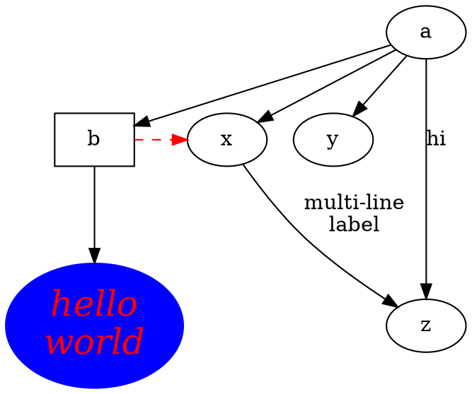

### 2

###### 재현 가능한 연구 (Reproducible Research)

과학적 연구에서 얻은 결과가 신뢰성을 가지려면 반드시 재현 가능해야 합니다. 결과가 단순히 독립적인 단일 사건으로 발생하는 것을 원치 않습니다. 예를 들어, 특정 실험실 연구원 한 명이 특정 날짜에만 결과를 도출할 수 있고, 다른 어느 누구도 같은 조건에서 동일한 결과를 도출할 수 없다면 이는 신뢰할 수 없는 연구입니다.

재현 가능한 연구(RR)는 동적 문서(dynamic document)의 부산물이 될 수 있지만, 동적 문서가 재현 가능한 연구를 완벽하게 보장하는 것은 아닙니다. 보고서를 동적으로 생성할 때는 일반적으로 사람의 개입이 없으므로 결과를 재현하는 데 필요한 동일한 소프트웨어 및 하드웨어 환경을 준비하기가 비교적 쉽고, 따라서 재현될 가능성이 높습니다. 그러나 재현성의 의미는 특정 결과나 특정 보고서를 재현하는 것 이상일 수 있습니다. 사소한 예로, 몬테카를로 시뮬레이션을 수행할 때 특정 난수 시드(random seed)를 사용하여 파라미터에 대한 좋은 추정치를 얻었을 수 있지만, 실제로는 "운이 좋은" 시드 때문이었을 수도 있습니다. 비록 우리가 그 추정치를 엄격하게 재현할 수는 있더라도, 일반적인 의미에서 재현 가능하다고 할 수는 없습니다. 최적화 알고리즘에서도 유사한 문제가 존재합니다. 예를 들어 시작 값이 다르면 같은 방정식이라도 다른 해(root)를 도출할 수 있습니다.

어쨌든 동적 보고서 생성은 여전히 재현 가능한 연구를 향한 중요한 단계입니다. 이 장에서는 재현 가능한 연구와 관련된 주요 문헌 및 실천 방안을 논의합니다.

###### 2.1 문헌

'재현 가능한 연구'라는 용어는 스탠포드 대학교의 존 클라보(Jon Claerbout)가 처음 제안했습니다(Fomel and Claerbout, 2009). 이는 연구의 최종 산출물이 논문 그 자체뿐만 아니라 논문의 결과를 도출하는 데 사용된 전체 컴퓨팅 환경, 즉 결과를 재현하고 연구를 발전시키는 데 필요한 코드와 데이터까지 모두 포함해야 한다는 아이디어입니다.

유사하게, Buckheit와 Donoho(1995)는 과학 출판물에서 컴퓨터 과학 논문의 학문적 본질을 다음과 같이 지적했습니다.

과학 출판물에서 컴퓨팅 과학에 관한 논문은 학문 그 자체가 아니며, 단지 학문에 대한 광고일 뿐입니다. 실제 학문은 그림을 생성한 완전한 소프트웨어 개발 환경과 전체 명령어 세트입니다.

D. Donoho 웨이브랩과 재현 가능한 연구 (WaveLab and Reproducible Research)

정말 적절한 말입니다! 다행히도 학술지들 또한 이러한 방향으로 움직이고 있습니다. 예를 들어 Peng(2009)은 저자들에게 재현성의 기준과 논문 재현을 위한 자료 제출 방법에 대한 자세한 지침을 Biostatistics 학술지에 제시했습니다.

기술적인 수준에서 재현 가능한 연구는 종종 문학적 프로그래밍(Literate Programming, Knuth, 1984)과 관련이 있습니다. 이는 도널드 크누스(Donald Knuth)가 컴퓨터 코드와 소프트웨어 문서를 하나의 문서에 통합하기 위해 고안한 패러다임입니다. 그러나 WEB(Knuth, 1983)이나 Noweb(Ramsey, 1994)과 같은 초기 구현체는 데이터 분석 및 보고서 생성에 직접 사용하기에는 적합하지 않았습니다. 문서 생성을 위한 다른 도구로는 Doxygen(van Heesch, 2008)의 R 구현체인 roxygen2(Wickham et al., 2015) 등이 있습니다. Sweave(Leisch, 2002)는 R(Ihaka and Gentleman, 1996; R Core Team, 2015)에서 동적 문서를 처리하기 위한 최초의 구현체 중 하나입니다. 기존 도구들로 해결되지 않은 여러 과제들도 여전히 존재합니다. 예를 들어 Sweave는 LATEX와 밀접하게 연관되어 있어 확장이 어렵습니다. knitr 패키지(Xie, 2015b)는 프레임워크를 재설계하여 기존 도구들의 아이디어를 발전시켰으며, 이를 통해 보고서의 다양한 측면을 쉽고 세밀하게 제어할 수 있게 되었습니다. 16장에서는 다른 도구들을 소개할 예정입니다.

통계 분석에 적용된 문학적 프로그래밍에 대한 개요는 Rossini(2002)에서 찾아볼 수 있습니다. Gentleman과 Temple Lang(2004)은 통계 분석을 위한 문학적 프로그래밍 문서의 일반적인 개념을 소개하고 소프트웨어 아키텍처에 대해 논의했습니다. Gentleman(2005)은 R 패키지 GolubRR을 사용하여 재현 가능한 분석을 배포하는, Gentleman과 Temple Lang(2004)에 기반한 실용적인 사례입니다. Baggerly 등(2004)은 데이터 분석 결과를 발표하는 일반적인 관행에서 발생할 수 있는 여러 문제점을 밝혔으며, 이는 재현성을 위한 세부 정보가 부족하여 (심지어 데이터 세트가 제공되더라도) 잘못된 발견으로 이어질 수 있음을 보여줍니다.

결과를 컴퓨팅과 분리하는 대신 컴퓨터 코드와 서술을 모두 포함하여 모든 것을 하나의 문서(Gentleman과 Temple Lang(2004)에서 요약본(compendium)이라 부름)에 넣을 수 있습니다. 이 문서를 컴파일할 때 컴퓨터 코드가 실행되어 우리에게 직접 결과를 제공합니다.

###### 2.2 좋은 사례와 나쁜 사례

재현 가능한 연구를 위해 명심해야 할 핵심은 다른 사람들도 우리의 결과를 재현할 수 있어야 한다는 점이며, 따라서 우리의 컴퓨팅 환경을 최대한 이식 가능하게(portable) 만들어야 합니다. 아래에서는 재현 가능한 연구를 위한 몇 가지 좋은 사례를 논의하고, 이를 따르지 않을 경우 왜 문제가 될 수 있는지 설명합니다.

- 모든 소스 파일은 동일한 디렉터리 내에서 관리하고 가능한 한 상대 경로를 사용하십시오: 절대 경로는 재현성을 깰 수 있습니다. 예를 들어 C:/Users/john/foo.csv 또는 /home/joe/foo.csv와 같은 데이터 파일은 한 대의 컴퓨터에만 존재할 수 있으며, 다른 사람의 하드 디스크에서는 절대 경로가 다를 가능성이 높기 때문에 해당 파일을 읽을 수 없습니다. 모든 항목을 동일한 디렉터리 아래에 보관하면 read.csv('foo.csv')(현재 작업 디렉터리에 있는 경우) 또는 read.csv('../data/foo.csv')(한 단계 위로 이동하여 data/ 디렉터리에서 파일을 찾음)를 통해 데이터 파일을 읽을 수 있습니다. 결과를 배포할 때는 전체 디렉터리의 아카이브(zip 패키지)를 만들 수 있습니다.
- 연산이 시작된 후에는 작업 디렉터리를 변경하지 마십시오: setwd()는 R에서 작업 디렉터리를 설정하는 함수이며, 사용자의 코드에서 setwd('C:/path/to/some/dir')를 보는 것은 드문 일이 아닙니다. 이는 절대 경로일 뿐만 아니라 나머지 소스 문서에도 전역적인 영향을 미치기 때문에 좋지 않습니다. 이런 경우에는 루트 디렉터리가 변경되었기 때문에 모든 상대 경로를 조정해야 할 수도 있다는 점을 염두에 두어야 하며, 소프트웨어가 예기치 않은 곳에 결과를 쓸 수도 있습니다. (예를 들어, 그림이 ./figures/ 디렉터리에 생성될 것으로 예상했지만 setwd('./data/')를 설정한 경우 실제로는 ./data/figures/에 저장됩니다.) 작업 디렉터리를 꼭 설정해야 한다면, R 세션의 맨 처음에 수행하십시오. 4장에서 소개할 대부분의 편집기는 이 규칙을 따르며, knitr가 문서를 컴파일하기 위해 호출되기 전에 소스 문서의 디렉터리로 작업 디렉터리가 설정됩니다. 불가피하거나 다른 작업 디렉터리를 설정한 후 코드를 작성하는 것이 훨씬 더 편리하다면 나중에 디렉터리를 복원해야 합니다. 예:

```r
f <- function(...) {
  # 현재 디렉터리를 변수에 저장
  owd <- setwd("a/different/dir/")
  # 함수가 종료될 때 작업 디렉터리 복원
  on.exit(setwd(owd), add = TRUE)
  # 이제 a/different/dir에서 작업할 수 있습니다.
  ...
}
```

- 문서는 깨끗한 R 세션에서 컴파일하십시오: 현재 R 세션에 존재하는 R 객체들이 출력 결과물을 오염시킬 수 있습니다. 코드 청크를 하나씩 쌓아가고 대화형으로 실행하여 결과를 확인하면서 보고서를 작성하는 것은 괜찮지만, 최종적으로 보고서를 컴파일할 때는 새 R 세션과 함께 배치 모드로 진행하여 모든 결과가 코드에서 새롭게 생성되도록 해야 합니다.
- 사람의 상호 작용이 필요한 명령어는 피하십시오: 사람의 입력은 매우 예측 불가능할 수 있습니다. 예를 들어, 사용자에게 데이터 파일을 선택하라고 묻는 대화 상자를 띄울 경우 사용자가 어떤 파일을 선택할지 확실히 알 수 없습니다. read.table()에 파일을 입력하기 위해 file.choose()와 같은 함수를 사용하는 대신 파일 이름을 명시적으로 작성해야 합니다. 예: read.table('a-specific-file.txt').
- 데이터 분석을 위한 환경 변수 사용을 피하십시오: 프로그래밍에서는 환경 변수가 설정 목적으로 자주 사용되지만, 데이터 분석에서는 권장되지 않습니다. 사용자가 설정하기 위한 추가 지침이 필요하고, 사람이 이를 설정하는 것을 쉽게 잊을 수 있기 때문입니다. 설정해야 할 옵션이 있다면 소스 문서 내부에서 수행하십시오.
- sessionInfo() (또는 devtools::session_info())와 이 문서의 컴파일 방법에 대한 지침을 첨부하십시오: 세션 정보는 독자에게 사용된 R의 버전, 운영 체제 및 추가 패키지와 같은 소프트웨어 환경을 알려줍니다. 문서를 컴파일하는 과정이 단일 함수 호출처럼 간단하지 않고 추가 단계가 필요한 경우 컴파일 방법을 명확히 해야 합니다. 쉘 스크립트, Makefile 또는 배치 파일과 같은 컴퓨터 스크립트 형태로 지침을 제공하는 것이 더 좋습니다.

이러한 사례들은 R 언어를 예로 들어 설명했지만, 굳이 R에만 국한되는 것은 아닙니다. 동일한 규칙이 다른 컴퓨팅 환경에도 적용됩니다.

문학적 프로그래밍 도구는 종종 사용자가 배치 모드로 문서를 컴파일하도록 요구하며, 이는 재현 가능한 연구에 적합합니다. 그러나 탐색적 데이터 분석의 경우 배치 모드는 번거로울 수 있습니다. 최종 문서에 무엇을 넣을지 아직 결정하지 못했을 때는 데이터와 코드를 자주 상호 작용하며 살펴보아야 할 수도 있는데, 코드를 업데이트할 때마다 전체 문서를 컴파일하는 것은 비효율적입니다. 이 문제는 RStudio 및 Emacs/ESS와 같은 강력한 편집기를 사용하여 해결할 수 있으며, 이에 대해서는 4장에서 소개합니다. 이러한 편집기에서는 코드와 자유롭게 상호 작용하고 데이터를 탐색할 수 있으며(연결된 R 세션으로 R 코드를 보내거나 작성함), 코딩 작업이 끝나면 깨끗한 R 세션에서 모든 코드가 작동하는지 확인하기 위해 배치 모드로 전체 문서를 컴파일할 수 있습니다.

###### 2.3 장벽

재현 가능한 연구의 모든 장점에도 불구하고 다음과 같은 몇 가지 실질적인 장벽이 존재합니다. (이외에도 더 있을 수 있습니다.)

- 데이터의 방대함: 예를 들어, 생물학의 차세대 염기서열 분석 데이터나 고에너지 물리학의 데이터는 수십 테라바이트(TB)를 넘나드는 경우가 흔하며, 이 데이터들을 보고서와 함께 아카이브화하고 배포하는 것은 결코 쉬운 일이 아닙니다.
- 데이터 기밀성: 데이터가 인간 대상과 관련이 있을 경우 기밀 유지 문제로 인해 보고서와 함께 원본 데이터를 공개하는 것이 금지될 수 있습니다.
- 소프트웨어 버전 및 구성: 현재는 제공되지 않는 구형 버전의 소프트웨어 패키지 또는 운영 체제에 따라 다르게 컴파일되는 소프트웨어 패키지를 사용하여 보고서가 생성되었을 수 있습니다.
- 경쟁 문제: 잠재적 경쟁자들이 원저자가 들인 막대한 시간과 비용을 투자 없이 얻을 수 있기 때문에 보고서와 함께 코드나 데이터를 공개하지 않기로 선택할 수도 있습니다.

물론 전 세계의 모든 보고서가 공개적으로 이용 가능하고 엄격하게 재현 가능하기를 기대해서는 안 되겠지만, 평범하거나 결함이 있는 코드 또는 문제가 있는 데이터 세트라도 전혀 공유하지 않는 것보다는 공유하는 것이 낫습니다. 정책을 통해 사람들을 재현 가능한 연구로 이끄는 대신 잘라내어 붙여넣기(cut-and-paste)보다 쉬운 도구를 만드는 것이 바람직하며, knitr은 바로 그런 시도의 하나입니다. RPubs(http://rpubs.com)의 성공은 사용하기 쉬운 도구가 사람들에게 즐거움을 주기 때문에 재현 가능한 연구를 빠르게 장려할 수 있음을 보여주는 증거입니다. 독자들은 RPubs 웹사이트에서 사용자들이 제공한 수백 개의 보고서를 찾아볼 수 있습니다. 학생들의 과제와 연습 문제도 자주 볼 수 있는데, 이런 방식으로 학생들이 훈련을 받는다면 향후 재현 가능한 과학적 연구가 더 많이 나올 것으로 기대할 수 있습니다.

### 3

###### 첫걸음 (A First Look)

knitr 패키지는 다목적 문학적 프로그래밍 엔진으로, LATEX, HTML 및 Markdown(5장 참조)을 포함한 문서 형식과 R, Python, awk, C++, 쉘 스크립트(11장)와 같은 프로그래밍 언어를 지원합니다. 시작하기 전에 먼저 R에 knitr를 설치해야 합니다. 그런 다음 최소한의 예제로 기본 개념을 소개하겠습니다. 마지막으로 순수한 R 스크립트에서 빠르게 보고서를 생성하는 방법을 보여줄 것이며, 이는 동적 문서에 대해 아무것도 모르는 초보자에게 유용할 수 있습니다.

###### 3.1 설정

knitr은 R 패키지이므로 R에서 일반적인 방법으로 CRAN에서 설치할 수 있습니다.

```r
install.packages("knitr", dependencies = TRUE)
```

여기서 dependencies = TRUE는 선택 사항이며, 이 패키지의 기능을 향상시킬 수 있는 유용한 패키지들(절대적으로 필요하지는 않음)을 설치합니다. 개발 버전은 Github(https://github.com/yihui/knitr)에서 호스팅되며, 안정적이지는 않더라도 최신 버그 수정 및 새로운 기능이 포함된 최신 개발 버전을 언제든지 확인할 수 있습니다. knitr에 문제가 있는 경우 먼저 확인해야 할 것은 버전입니다.

```r
packageVersion("knitr") # 최신 버전이 아닌 경우, update.packages() 실행
```

LATEX를 조판 도구로 선택한 경우, MiKTEX(Windows, http://miktex.org/), MacTEX(Mac OS, http://tug.org/mactex/) 또는 TEXLive(Linux, http://tug.org/texlive/)를 설치해야 할 수 있습니다. HTML이나 Markdown으로 작업할 경우 출력물이 웹 브라우저로 볼 수 있는 웹 페이지가 되므로 다른 것은 설치할 필요가 없습니다.

knitr이 설치되면 knit() 함수를 사용하여 소스 문서를 컴파일할 수 있습니다.

```r
library(knitr)
knit("your-file.Rnw")
```

\*.Rnw 파일은 일반적으로 R 코드가 포함된 LATEX 문서이며, 이에 대해서는 다음 절과 다양한 형식의 문서를 다루는 5장에서 확인할 수 있습니다.

###### 3.2 최소한의 예제

동적 문서의 구조를 설명하기 위해 각각 LATEX와 Markdown으로 작성된 두 가지 간단한 예제를 사용합니다. 당분간은 LATEX나 Markdown의 구문에 대해 논의하지 않겠습니다(대신 5장을 참조하십시오). 단순성을 위해 기본 R의 cars 데이터 세트를 사용하여 단순 선형 회귀 모델을 구축합니다. R에서 ?cars를 입력하면 자세한 문서를 볼 수 있습니다. 기본적으로 speed와 dist라는 두 개의 변수가 있습니다.

```r
str(cars)

## 'data.frame': 50 obs. of 2 variables:
## $ speed: num 4 4 7 7 8 9 10 10 10 11 ...
## $ dist : num 2 10 4 22 16 10 18 26 34 17 ...
```

###### 3.2.1 LATEX 예제

그림 3.1은 LATEX에 R 코드가 포함된 전체 예제입니다. 파일 이름 확장자가 관례상 Rnw이기 때문에 이하에서는 이런 종류의 문서를 Rnw 문서라고 부르겠습니다. 이 문서를 minimal.Rnw라는 파일로 저장하고 앞서 설명한 대로 R에서 knit('minimal.Rnw')를 실행하면, knitr는 minimal.tex라는 LATEX 출력 문서를 생성합니다. LATEX에 익숙한 분들은 pdflatex를 통해 이 문서를 PDF로 컴파일할 수 있습니다. 그림 3.2는 Rnw 문서에서 컴파일된 PDF 문서입니다.

여기서 핵심은 R 코드를 LATEX에 어떻게 삽입했는가입니다. Rnw 문서에서 `<<>>=`는 코드 청크의 시작을 나타내고, `@`는 코드 청크를 종료합니다(이 설명은 엄밀하지는 않지만 보통 이해하기 쉽습니다). 이 예제에서는 두 마커 사이에 산점도를 그리고, 선형 모델을 적합(fit)시키며, 산점도에 회귀선을 추가하는 4줄의 R 코드가 있습니다. 인라인(inline) R 코드를 삽입할 때는 `\Sexpr{}` 명령어가 사용되며, 이 예제에서는 `\Sexpr{coef(fit)[2]}`와 같이 쓰였습니다. `<<`와 `>>=` 사이에 코드 청크 옵션을 작성할 수 있는데, 이 예제에서는 그림 크기를 4 x 3인치(fig.width 및 fig.height)로, 그림을 중앙에 정렬(fig.align)하도록 청크 옵션을 지정했습니다.

이 최소한의 예제에는 다음과 같은 보고서의 대부분의 기본 요소가 포함되어 있습니다.

1. 제목, 저자 및 날짜
2. 모델 설명
3. 데이터 및 계산
4. 그래픽
5. 숫자 결과

모든 출력은 R에서 동적으로 생성됩니다. 데이터가 변경되더라도 처음부터 보고서를 다시 작성할 필요 없이, 데이터를 업데이트하고 보고서를 다시 컴파일하면 그에 따라 출력이 업데이트됩니다.

###### 3.2.2 Markdown 예제

LATEX는 수많은 명령어 때문에 초보자에게 압도적으로 보일 수 있습니다. 반면에 Markdown(Gruber, 2004)은 훨씬 더 간단한 형식입니다. 그림 3.3은 이전 예제와 동일한 분석을 수행하는 Markdown 예제입니다.

Markdown의 이상적인 출력물은 그림 3.4(Mozilla Firefox)에 표시된 HTML 웹 페이지입니다. 유사하게 Markdown 문서에서 R 코드에 대한 구문을 볼 수 있습니다. `{r}`은 코드 청크를 열고, ` ``` `은 청크를 종료하며, 인라인 R 코드는 백틱(backtick)과 함께 `` `r ` `` 안에 넣을 수 있습니다.

knitr에서 약간 더 긴 예제로는 Markdown 기반의 notebook이라는 데모가 있습니다. 이는 Markdown의 잠재적인 기능뿐만 아니라 knitr로 웹 애플리케이션을 구축할 수 있는 가능성도 보여줍니다. 데모를 보려면 아래 코드를 실행하십시오.

```r
if (!require("shiny")) install.packages("shiny")
demo("notebook", package = "knitr")
```

기본 웹 브라우저가 시작되어 웹 노트북을 보여줍니다. 소스 코드는 왼쪽 패널에 있고 실시간 결과는 오른쪽 패널에 있습니다. 소스 코드를 자유롭게 실험하고 노트북을 다시 컴파일해 볼 수 있습니다.

###### 3.3 빠른 보고서 작성

사용자가 R에 대한 기본 지식만 있고 knitr에 대해 아무것도 모르거나, R 스크립트 외에 다른 것을 작성하고 싶지 않은 경우, stitch() 함수를 사용하여 이 R 스크립트에서 빠르게 보고서를 생성할 수도 있습니다.

stitch()의 기본 아이디어는 knitr가 일부 기본 설정이 포함된 소스 문서의 템플릿을 제공하여 사용자가 이 템플릿에 R 스크립트(하나의 코드 청크)를 입력하기만 하면 knitr가 템플릿을 보고서로 컴파일하는 것입니다. 현재 LATEX, HTML 및 Markdown을 위한 내장 템플릿이 있습니다. 사용 방법은 다음과 같습니다.

```r
library(knitr)
stitch("your-script.R")
```

###### 3.4 R 코드 추출

문학적 프로그래밍 문서의 경우 보고서로 컴파일(코드 실행)하거나 문서 내의 프로그램 코드를 추출할 수 있습니다. 이를 각각 "위빙(weaving, 엮기)" 및 "탱글링(tangling, 얽힌 것 풀기)"이라고 부릅니다. 명백하게 knit() 함수는 위빙을 위한 것이며, knitr에서 해당하는 탱글링 함수는 purl()입니다. 예를 들면 다음과 같습니다.

```r
library(knitr)
purl("your-file.Rnw")
purl("your-file.Rmd")
```

탱글링의 결과는 R 스크립트입니다. 위 예제의 경우 기본 출력물은 소스 문서의 모든 코드 청크로 구성된 your-file.R이 됩니다.

지금까지 knitr의 커맨드 라인 사용법을 소개했는데, 명령어를 반복해서 입력하는 것은 종종 지루한 일입니다. 다음 장에서는 강력한 편집기가 단 한 번의 마우스 클릭이나 키보드 단축키로 소스 문서를 쉽게 편집하고 컴파일하는 데 어떻게 도움이 되는지 살펴보겠습니다.

### 4

###### 편집기

knitr을 위한 문서는 일반 텍스트 파일이므로 어떤 텍스트 편집기에서든 작성할 수 있습니다. 예를 들어 Windows의 메모장이나 Linux의 Gedit 같은 가벼운 편집기도 가능합니다. 특별한 텍스트 편집기가 필요한 주된 이유는 다음과 같습니다.

1. 키보드 단축키를 사용하여 R 코드 청크(`<<>>=` 및 `@`)를 매번 타이핑하는 대신 더 쉽게 입력하기 위함입니다.
2. 편집기 내에서 R과 knitr를 호출하여 소스 문서를 PDF/HTML로 컴파일하고 싶기 때문입니다. R을 열어 knitr::knit() 명령어를 치는 대신에, 나아가 R 코드 청크를 편집기에서 R로 바로 보내는 것이 훨씬 낫습니다.
   LATEX, HTML, 그리고 Markdown 문서를 위한 성숙하고 훌륭한 편집기들이 많이 있으며, 다음 섹션에서 설명하겠지만 일부 편집기들은 그 안에 knitr가 내장되어 있습니다.

###### 4.1 RStudio

RStudio는 R에 특화된 비교적 새로운 편집기입니다. Sweave와 knitr을 포괄적으로 지원하기 때문에 초보자가 시작하기에 좋은 편집기일 것입니다. RStudio는 크로스 플랫폼(다양한 운영 체제 지원)이며, 무료 오픈소스 소프트웨어입니다. (http://www.rstudio.com 에서 다운로드 가능) R 프로그래밍을 훌륭하게 지원하는 것 외에도 다른 많은 편집기에는 없는 눈에 띄는 기능이 있습니다. 데스크톱 버전과 똑같이 생긴 서버 버전이 있어서, Linux 서버에 서버 버전을 설치한 후 웹 브라우저에서 R을 사용할 수 있다는 점입니다.

전체 문서는 웹사이트에서 확인할 수 있습니다. 여기서는 동적 문서와 관련된 기능들만 간략하게 소개하겠습니다. Rnw 문서(LATEX)를 작성하려는 경우 RStudio에서 knitr를 사용하기 위해 먼저 해야 할 일은 Tools 옵션에서 설정을 변경하는 것입니다.

그림 4.1: RStudio에서 Rnw 문서 편집: 청크 헤더 안에 자동 완성 기능이 있습니다("fig."를 입력하면 모든 후보가 나타남). 코드 청크는 메뉴나 키보드 단축키를 통해 삽입할 수 있습니다. Compile PDF 버튼은 Rnw에서 PDF의 원클릭 생성을 지원합니다.

Options ➔ Sweave에서 Rnw 문서의 위빙(즉, 컴파일)을 위한 기본 옵션은 Sweave이며, R에 knitr가 설치되어 있는 한 이를 knitr로 바꿀 수 있습니다. knitr와 Sweave의 비교에 대한 자세한 논의는 16.1절을 참조하십시오. R Markdown과 같은 다른 형식의 문서로 작업하려는 경우에는 옵션을 구성할 필요가 없으며, RStudio는 필요한 패키지가 누락된 경우 설치 팁을 제공합니다.

RStudio에서 지원하는 모든 문서 형식은 File ➔ New 메뉴에서 찾을 수 있습니다. 현재 지원하는 형식에는 R Sweave, R Markdown 및 R HTML이 포함됩니다. 모든 문서 형식에 대해 원클릭 컴파일이 지원됩니다. 즉, 버튼을 클릭하여 소스 문서를 해당 출력 형식(LATEX를 PDF로, Markdown을 HTML로 등)으로 컴파일할 수 있습니다. Ctrl + Alt + I 단축키로 R 코드 청크를 입력할 수 단축키를 통해 삽입할 수 있으며, 청크 헤더의 청크 옵션에는 자동 완성이 제공됩니다. 예를 들어, Rnw 문서의 `<<`와 `>>=` 사이에 "fig."를 입력하면 fig.width, fig.height 등의 후보가 표시됩니다. 일반적인 R 스크립트에서 수행하는 것처럼 Ctrl + Enter를 사용하여 청크의 R 코드를 R 콘솔로 보낼 수 있습니다. 이 방법을 통해 전체 문서를 컴파일하기 전에 특정 R 코드 청크를 대화형으로 실행해 볼 수 있습니다. 그림 4.1은 RStudio에서 Rnw 문서가 어떻게 보이는지를 보여주는 스크린샷입니다.

Rnw 문서의 경우 최종 출력 형식은 일반적으로 PDF(LATEX를 통해)입니다. RStudio는 PDF 문서와 소스 문서 간의 동기화를 제공하며, 이는 다음 기능을 의미합니다.

1. 정방향 검색: 소스 문서의 한 줄에서 해당 소스 줄에 해당하는 PDF 문서의 적절한 위치로 이동할 수 있습니다.
2. 역방향 검색: PDF 문서를 클릭하면 RStudio가 해당 Rnw 소스의 줄로 다시 안내할 수 있습니다.
3. 오류 탐색: R 또는 LATEX에서 오류가 발생하면 RStudio가 해당 오류의 원인이 된 소스 문서의 위치로 이동시켜 줍니다. 이를 통해 R 또는 LATEX 코드의 문제를 더 빠르게 해결할 수 있습니다.

R Markdown 문서의 경우, RStudio는 HTML을 포함한 다양한 형식으로의 원클릭 컴파일을 제공합니다. 또한 이미지 파일을 base64로 인코딩하고 HTML 출력에서 LATEX 수식(MathJax 라이브러리 사용)을 렌더링할 수 있습니다. 전자의 기능은 생성된 HTML 페이지가 이미지를 포함하고 있기 때문에 독립적(self-contained)이라는 것, 즉 외부 이미지에 의존하지 않음을 보장하기 위한 것입니다. 후자의 기능은 통계학자들이 웹 페이지에 수식을 작성하고 싶을 때 특히 유용합니다.

R Markdown(Rmd) 형식은 매우 간단하여 5분 만에 쉽게 익힐 수 있습니다. 단순함 덕분에 이 형식으로 작성된 수많은 보고서들이 RStudio가 사용자들의 knitr 보고서를 호스팅하기 위해 제공하는 무료 플랫폼인 RPubs에 게시되었습니다. 더 많은 예제는 http://rpubs.com 에서 확인하십시오. 그림 4.2는 RStudio의 샘플 Rmd 문서를 보여줍니다.

그림 4.2: RStudio에서 Rmd 문서 편집: 청크 옵션 값에 대한 자동 완성 기능도 있습니다. Knit HTML 버튼은 Rmd에서 HTML 페이지의 원클릭 생성을 지원합니다.

3.3절에서 빠른 보고서 작성을 언급했는데, 이 역시 RStudio에서 지원됩니다. RStudio의 R 스크립트에서 도구 모음의 버튼을 클릭하여 R 스크립트 기반의 "R 노트북(R Notebook)"(순전히 R 스크립트를 기반으로 한 보고서)을 생성할 수 있습니다.

###### 4.2 LYX

LYX는 문서 작성을 돕는 훌륭한 GUI를 갖춘, 본질적으로 LATEX의 프런트엔드입니다. 화면상으로는 많은 워드 프로세서와 비슷해 보이지만, 핵심은 LATEX입니다. 원시 LATEX 편집기와 LYX의 큰 차이점 중 하나는 원시 LATEX에서는 `\alpha + \beta`로만 보이는 반면, LYX에서는 `α + β`로 보인다는 것입니다(화면 뒤에서는 본질적으로 `\alpha + \beta`입니다). LYX에서 모든 것은 LATEX이지만 백슬래시로 가득 찬 화면 때문에 시각적으로 방해를 받지 않습니다.

버전 2.0.3부터 LYX는 knitr을 공식 모듈로 지원하기 시작했습니다. 자세한 내용은 http://yihui.name/knitr/demo/lyx/ 에서 확인할 수 있습니다. 이 모듈은 다음과 같은 방식으로 작동합니다.

- _.lyx ➔ (LYX) ➔ _.Rnw ➔ (knitr) ➔ _.tex ➔ (LaTeX) ➔ _.pdf (위빙)
-                                         ➔ *.R (탱글링)

현재 LYX에서 사용할 수 있는 유일한 형식은 Rnw라는 점에 유의하십시오. R 코드를 LYX와 섞어 쓰는 것처럼 보이지만, LYX는 단지 래퍼(wrapper)일 뿐이므로 실제로는 Rnw 문서에 R 코드를 포함하는 셈입니다.

Linux 및 Mac OS 사용자의 경우 모듈 사용 방법은 다음과 같습니다.

1. 새로운 LYX 문서를 생성합니다.
2. Document ➔ Settings ➔ Modules로 이동하여 Rnw (knitr)라는 이름의 모듈을 삽입합니다.
3. Insert ➔ TEX Code를 사용하여 문서에 R 코드 청크를 삽입한 다음, 평소처럼 `<<>>=` 및 `@`을 입력하기 시작합니다.

도구 모음의 View 버튼을 클릭하거나 Ctrl + R을 누르면 문서를 PDF로 컴파일하고 결과를 볼 수 있습니다. File ➔ Export ➔ R/S code 메뉴를 통해 LYX 문서에서 R 코드를 추출할 수도 있습니다. R 코드가 포함된 LYX의 스크린샷은 그림 4.3에 나타나 있습니다.

그림 4.3: LYX 사용하기: R 코드는 Rnw 구문을 사용하여 빨간색 상자 안에 삽입됩니다. View 버튼을 클릭하면 knitr와 LYX를 통해 컴파일된 PDF 문서를 볼 수 있습니다.

Windows에서 knitr 모듈을 사용하려면 추가적인 단계가 하나 더 필요합니다. Tools ➔ Preferences ➔ Paths ➔ PATH prefix로 이동하여 R의 bin 경로를 추가합니다. 이 경로는 보통 `C:\Program Files\R\R-x.x.x\bin`과 같으며, 다음과 같이 R 환경 내에서 찾을 수 있습니다.

```r
R.home("bin")
```

이 변경 사항을 적용한 후에는 Tools ➔ Reconfigure를 통해 LYX를 재구성해야 합니다. 이는 LYX가 R이 설치된 위치를 파악하여 Rnw 문서를 컴파일할 때 R과 knitr를 호출할 수 있도록 하기 위함입니다. 구체적으로 Rscript.exe가 어디에 있는지 알아야 합니다. PATH에 존재하지 않으면 knitr 모듈을 사용할 수 없게 됩니다. Linux 및 Mac OS에서는 기본적으로 R 실행 파일을 PATH에 등록하기 때문에 이 단계가 필요하지 않은 경우가 많습니다.

그래픽 인터페이스가 꽤 사용하기 쉬워 보이지만, LYX를 시도하기 전에 사용자들이 LATEX를 마스터하는 것을 여전히 강력히 권장합니다. 그렇지 않으면 오류가 발생했을 때 LATEX 문제를 진단하기가 어려울 수 있습니다. 결국 LYX는 워드(Word)가 아니기 때문입니다.

###### 4.3 Emacs/ESS

ESS(Emacs Speaks Statistics)는 텍스트 편집기 Emacs를 위한 애드온 패키지입니다(Rossini 등, 2004). R, S-Plus, SAS, JAGS 등과 같은 통계 소프트웨어 패키지를 지원합니다. knitr에 대한 지원은 버전 12.09 이후에 추가되었으며, 그 이전에는 Sweave만 지원되었습니다.

ESS 역시 무료 오픈소스 소프트웨어입니다(http://ess.r-project.org 에서 다운로드 가능). Emacs와 함께 설치한 후에는 Emacs에서 knitr를 호출하는 것이 매우 쉽습니다. Rnw 문서에 대한 기본 옵션은 Sweave이며, 다음 명령어를 사용하여 knitr로 변경할 수 있습니다(Emacs 단축키 표기법에서 M은 대부분의 키보드에서 Alt 키인 Meta 키를 나타내며, M-x는 Meta를 누른 상태에서 x를 누르는 것을 의미합니다).

```
M-x customize-group ess-R
```

ess-swv-processor 옵션을 찾아 knitr로 변경합니다. 그런 다음 새 Rnw 문서를 생성하고 M-n s를 눌러 Rnw를 TEX로 컴파일하거나 M-n P를 눌러 TEX를 PDF로 컴파일할 수 있습니다.

ESS에서 Rmd 문서 및 다른 문서 형식에 대한 지원은 여전히 개발 중입니다. 개발자에 따르면 이 기능은 ESS 13.03 버전에 도입될 수 있으므로 독자들은 추후 공식 발표를 주목하시기 바랍니다.

###### 4.4 기타 편집기

문서를 컴파일하는 사용자 지정 명령어를 정의할 수 있는 다른 편집기에 지원을 추가하는 것은 어렵지 않습니다. 일반적으로 사용자 지정 명령어는 다음과 같습니다.

```sh
Rscript -e "library(knitr); knit('input.ext')"
```

이 명령어는 R을 호출하여 knitr 패키지를 불러온 후, knit() 함수를 사용하여 input.ext라는 이름의 입력 문서를 컴파일합니다.

WinEdt(상용 소프트웨어)에는 knitr를 지원하는 R-Sweave라는 모드가 있으며, Tinn-R(무료)은 내장 지원 기능을 갖추고 있습니다. 또한 Texmaker, Eclipse, TextMate, TEXShop, Vim과 같은 다른 텍스트 편집기들도 편집기 내에서 보고서를 편리하게 컴파일하도록 구성할 수 있습니다. 구성 지침은 http://yihui.name/knitr/demo/editors/ 에 모아져 있습니다.

### 5

###### 문서 형식

knitr 패키지의 설계는 이론상으로 어떠한 일반 텍스트 문서도 처리할 수 있을 만큼 유연합니다. 아래는 설계의 핵심 구성 요소 3가지입니다.

1. 소스 파서 (source parser)
2. 코드 실행기 (code evaluator)
3. 출력 렌더러 (output renderer)

파서는 소스 문서를 분석하여 컴퓨터 코드 청크와 문서 안의 인라인 코드를 식별합니다. 실행기는 코드를 실행하고 결과를 반환합니다. 렌더러는 계산 결과를 적절한 형식으로 구성하며, 이는 최종적으로 원본 문서와 결합됩니다.

코드 실행기는 문서 형식과 무관하지만, 파서와 렌더러는 문서 형식을 고려해야 합니다. 파서는 입력 구문에 해당하고, 렌더러는 출력 구문과 관련이 있습니다.

###### 5.1 입력 구문

정규 표현식(Regular expressions, Friedl(2006) 참조 또는 위키백과 참조)을 사용하여 문서 내 코드 블록(청크) 및 인라인 코드와 같은 다른 요소들을 식별합니다. 이 정규 표현식 패턴들은 knitr 내의 all_patterns 객체에 저장됩니다. 예를 들어, Rnw 문서에서 코드 청크의 시작 패턴은 다음과 같습니다.

```r
all_patterns$rnw$chunk.begin
## [1] "^\\s*<<(.*)>>=.*$"
```

정규 표현식에서 `^`는 문자열의 시작을 의미하고, `\s*`는 공백을 임의의 개수(0개 포함)만큼 일치시킵니다. `.*`는 임의의 문자를 임의의 개수만큼 일치시킵니다. 이 정규 표현식은 "줄의 시작에 있는 임의의 공백 + `<<` + 임의의 문자열 + `>>=`"을 의미하므로 다음과 같은 줄은 가능한 청크 헤더입니다.

```r
<<>>=
<<foo>>=
<<bar, echo=TRUE>>=
<<a=1, b=2>>=
```

그리고 다음은 유효하지 않은 청크 헤더입니다 (첫 번째 것은 줄의 시작에 `<<`가 없고, 두 번째 것은 `>`가 하나뿐이며, 세 번째 것은 `=`가 없습니다).

```r
hi<<>>=
<<foo>=
<<bar>>
```

위 정규 표현식에 대한 두 가지 기술적 참고 사항이 더 있습니다.

1. 정규 표현식에서 `\s`는 공백을 의미하지만, R 문자열 내에서는 `\\`가 실제로 하나의 백슬래시를 의미하기 때문에 이중 백슬래시를 사용해야 합니다(첫 번째 백슬래시는 두 번째 문자인 백슬래시를 이스케이프하는 역할을 합니다). 이스케이프 문자로 쓰이는 백슬래시는 초보자에게 상당히 혼란스러울 수 있는데, 경험적인 규칙은 '실제 백슬래시를 원할 때는 두 개의 백슬래시가 필요할 수도 있다'는 것입니다.
2. 정규 표현식 안의 괄호 `()`는 일련의 문자를 그룹화하여 나중에 후방 참조(back reference)로 추출할 수 있게 해줍니다. 예를 들어 abbbc에서 두 번째 문자 그룹을 다음과 같이 추출할 수 있습니다.

```r
# [b]+는 'b'가 한 번 이상 일치함을 의미합니다.
gsub("(a)([b]+)(c)", "\\2", "abbbc")
## [1] "bbb"
```

청크 헤더에서 청크 옵션을 추출해야 하므로 정규 표현식에서 `<<(.*)>>=`와 같이 `.*`를 `()`로 묶어 그룹화한 것입니다.

###### 5.1.1 청크 옵션

3장에서 언급했듯이 청크 헤더 안에 청크 옵션을 작성할 수 있습니다. 청크 옵션의 구문은 R의 함수 인자 구문과 거의 정확히 동일합니다. 이들은 다음과 같은 형식입니다.

```r
option = value
```

R 구문과의 일관성 덕분에 이 구문에 대해 특별히 외워야 할 것은 없습니다. 옵션 값이 유효한 R 코드이기만 하다면 knitr에도 유효합니다. echo = TRUE(논리값), out.width = '\\linewidth'(문자열) 또는 fig.height = 5(숫자)와 같은 상수 값 외에도 청크 옵션으로 임의의 유효한 R 코드를 작성할 수 있으며, 이는 소스 문서를 프로그래밍 가능하게 만듭니다. 간단한 예제는 다음과 같습니다.

```r
<<foo, eval=if (bar < 5) TRUE else FALSE>>=
```

소스 문서에서 이 청크 이전에 bar라는 숫자 변수가 생성되었다고 가정해 보겠습니다. if (bar < 5) TRUE else FALSE라는 표현식을 eval 옵션에 전달하면 eval 옵션이 bar의 값에 의존하게 됩니다. 그 결과 bar의 값에 따라 이 청크를 평가(실행)할지 여부가 결정됩니다(5보다 크면 평가되지 않습니다). 즉, 특정 청크를 조건부로 실행할 수 있습니다. 이 예제는 청크 옵션에 임의의 복잡한 R 표현식을 작성할 수 있음을 보여주기 위한 것입니다. 사실 bar < 5 표현식은 (bar가 NA가 아닌 한) 일반적으로 TRUE 또는 FALSE를 반환하므로, 이는 eval = bar < 5로 훨씬 단순화할 수 있습니다.

###### 5.1.2 청크 레이블

유일한 예외는 청크 레이블(chunk label)인데, 이는 구문 규칙을 반드시 따르지 않아도 됩니다. 다시 말해, 유효하지 않은 R 코드여도 괜찮습니다. 이는 역사적인 이유(Sweave 관례)와 편의성(따옴표 입력 회피) 때문입니다. 엄밀히 말하면 청크 옵션의 일부로서 청크 레이블은 문자(character) 값을 가져야 하므로 인용부호(따옴표)로 묶여야 합니다. 그러나 레이블 표현식에 사용된 "객체"가 존재하지 않더라도 대부분의 경우 knitr가 따옴표가 없는 레이블을 처리하여 내부적으로 인용부호를 추가합니다. 아래는 청크 레이블을 작성하는 모든 유효한 방법입니다.

```r
<<foo>>=
<<foo-bar>>=
<<foo_bar>>=
<<"foo">>=
<< foo-bar >>=
<<label="foo">>=
<<echo=FALSE, label="foo-bar">>=
```

청크 레이블은 문서 내에서 고유한 ID 역할을 해야 하며, 주로 이미지(7장) 및 캐시 파일(8장)과 같은 외부 파일을 생성하는 데 사용됩니다. 두 개의 비어 있지 않은 청크가 동일한 레이블을 가지면, 한 청크에서 생성된 파일이 다른 청크를 덮어쓸 위험이 있기 때문에 knitr는 중단되고 오류 메시지를 출력합니다. 청크 레이블을 비워 두면 knitr는 자동으로 unnamed-chunk-i 형식의 레이블을 생성하는데, 여기서 i는 1, 2, 3, ··· 씩 증가하는 청크 번호입니다.

###### 5.1.3 전역 옵션

6장에서 11장까지 더 자세히 살펴보겠지만, 청크 옵션은 코드 청크의 모든 측면을 제어합니다. 대부분의 청크에서 공통적으로 사용되는 특정 옵션이 있는 경우 opts_chunk 객체를 사용하여 전역(global) 청크 옵션으로 설정할 수 있습니다. 전역 옵션은 옵션이 설정된 위치 이후의 모든 청크에 걸쳐 공유되며, 청크 헤더의 로컬 옵션은 전역 옵션을 재정의(오버라이드)할 수 있습니다. 예를 들어, 전역적으로 echo 옵션을 FALSE로 설정해 보겠습니다.

```r
opts_chunk$set(echo = FALSE)
```

그러면 다음 두 청크의 경우 echo는 각각 FALSE와 TRUE가 됩니다.

```r
<<foo>>=
1+1
@
<<bar, echo=TRUE>>=
rnorm(10)
@
```

###### 5.1.4 청크 구문

문학적 프로그래밍의 원래 구문은 다음과 같습니다. 컴퓨터 코드의 시작을 나타내는 하나의 마커(`<<>>=`)를 사용하고, 문서의 시작을 나타내는 마커(`@`)를 사용합니다. 이는 3장에서 소개한 것과 미묘한 차이가 있습니다. 문학적 프로그래밍 패러다임에서 소스 문서는 다음과 같이 보일 수 있습니다.

```r
@
이것은 문서입니다.
@
```

다른 줄의 문서 내용.

```r
<<>>=
1 + 1 # 어떤 코드
<<>>=
rnorm(10) # 다른 코드 청크
@
```

더 많은 문서 내용.

knitr 구문에서는 코드 청크를 열고 문서를 여는 방식 대신에, 코드 청크를 열고 닫습니다. 전통적인 구문을 버린 이유는 보고서에서 코드 청크가 일반 텍스트보다 덜 빈번하게 나타나는 경우가 많기 때문에 코드 청크를 위한 구문에만 집중하기 위해서입니다. 또한 보고서에 코드를 "임베딩"한다는 직관에도 더 부합합니다. 새로운 구문에 따라, 아래 역시 knitr를 위한 소스 문서의 올바른 조각(fragment)입니다.

여기에 문서 내용이 있습니다.

```r
<<>>=
1+1
<<>>=
rnorm(10)
@
```

더 많은 문서 내용.

###### 5.2 문서 형식

지금까지는 Rnw 문서의 구문을 예로 사용했습니다. 다음으로는 다른 문서 형식에서 R 코드를 작성하는 방법을 소개하겠습니다. 표 5.1은 구문을 요약한 것입니다. 모든 문서 형식에서 코드 청크는 원하는 개수만큼의 공백으로 들여쓰기를 할 수 있음에 유의하십시오.

###### 5.2.1 Markdown

R Markdown(Rmd) 문서의 경우, 코드 청크는 ``{r}`과 `` `` ```` 사이에 작성하며, 인라인 R 코드는 ` `r ` `안에 작성합니다. 청크 옵션은 청크 헤더의 닫는 중괄호 전에 작성됩니다. 인라인 R 코드에는 백틱이 포함될 수 없습니다. 예를 들어` `r pi*2` `는 괜찮지만, ` `r `pi`*2` `는 안 됩니다. ` `pi`\*2 ``가 유효한 R 코드이긴 하지만, 파서는 첫 번째 백틱이 인라인 R 코드 표현식을 종료하는 용도가 아니라는 것을 알 수 없기 때문입니다.

표 5.1: 모든 문서 형식에 대한 구문 요약: R LATEX, R Markdown, R HTML, R reStructuredText, R AsciiDoc, R Textile 및 brew.

| 형식      | 시작               | 종료             | 인라인              |
| --------- | ------------------ | ---------------- | ------------------- |
| Rnw       | `<<>>=`            | `@`              | `\Sexpr{x}`         |
| Rmd       | ````{r} `          | ` ``` `          | `` `r x` ``         |
| Rhtml     | `<!--begin.rcode`  | `end.rcode-->`   | `<!--rinline x -->` |
| Rrst      | `.. {r}`           | `.. ..`          | `:r:`x``            |
| Rtex      | `%begin.rcode`     | `%end.rcode`     | `\rinline{x}`       |
| Rnw(brew) | `<%`               | `%>`             | `<%=x%>`            |
| Rtextile  | `###. begin.rcode` | `###. end.rcode` | `@r x@`             |
| Rasciidoc | `// begin.rcode`   | `// end.rcode`   | `` `r x` ``         |

Markdown은 읽고 쓰기 쉬운 일반 텍스트 형식을 사용하여 문서를 작성한 다음, 구조적으로 유효한 XHTML 또는 HTML로 변환할 수 있게 해줍니다. 이메일을 작성할 줄 안다면 누구나 몇 분 안에 배울 수 있습니다 (http://en.wikipedia.org/wiki/Markdown). 아래는 짧은 예제입니다.

```markdown
# 첫 번째 수준 헤더

## 두 번째 수준

이것은 단락입니다. 이것은 굵게, 그리고 이탤릭체입니다.

- 목록 항목
- 목록 항목

백틱은 <code> 태그를 생성합니다. 이것은 [링크](url)이며, 이것은 입니다.
코드 블록(<pre> 태그):

    1 + 1
    rnorm(10)

### 세 번째 수준 섹션 제목

순서가 있는 목록도 작성할 수 있습니다.

1. 항목 1
2. 항목 2
```

원래의 Markdown 구문은 단순하게 설계되었기 때문에 표, LATEX 수식 표현, 참고문헌 등을 작성하는 저작 환경 측면에서는 어느 정도 제약이 따를 수밖에 없습니다. 짧은 과제를 작성하는 등의 경우 복잡한 기능이 필요하지 않으므로 Markdown이 합리적으로 잘 작동할 것입니다.

Markdown의 한 가지 문제는 파생 버전들입니다. Pandoc's Markdown(http://johnmacfarlane.net/pandoc), Github Flavored Markdown(http://github.com), kramdown(http://kramdown.rubyforge.org) 등 다양한 변형(variant)들이 존재합니다. 이러한 각 버전들은 특정 요소(표)를 작성하는 방법에 대한 자체적인 정의를 가질 수 있습니다. CommonMark(http://commonmark.org)는 Markdown 구문을 명확하게 정의하려는 노력의 일환이며, Pandoc's Markdown은 CommonMark 표준과 호환됩니다. 게다가 현재로서는 Pandoc이 Markdown을 위한 포괄적인 도구일 것입니다. Pandoc은 원래의 Markdown에 다음과 같은 유용한 확장을 다수 추가했습니다.

1. 3개의 백틱 쌍으로 묶인 펜스 코드 블록 (Fenced code blocks)
2. 일반 LATEX(PDF 출력용) 또는 MathJax(HTML 출력용, http://mathjax.org)를 통한 LATEX 수식 지원. 이를 통해 `$math$` 또는 `$$math$$`와 같이 LATEX 구문을 사용하여 웹 페이지에 수학 방정식을 작성할 수 있습니다.
3. 문서의 메타데이터 (제목, 저자, 날짜 정보)
4. 공백이나 파이프로 열을 구분하는 표
5. 정의 목록, 각주, 인용 등

아래는 확장 기능 중 일부가 어떻게 보이는지를 보여줍니다.

````markdown
---
title: 내 보고서의 제목
author: Yihui Xie
---

코드는 이전과 동일하게 작성하거나 4개의 공백으로 들여쓰기합니다.

```{r}
1 + 1
rnorm(10)
```
````

인라인 수학: $\alpha + \beta$.
디스플레이 스타일: $$f(x) = x^{2} + 1$$

인용에서 발췌한 간단한 표 [@joe2014]:

| id  | age | sex |
| :-- | --: | :-: |
| a   |  49 |  M  |
| b   |  32 |  F  |

````

더욱 중요한 점은 Pandoc이 Markdown을 PDF/LATEX, HTML, Word(Microsoft Word 또는 OpenOffice), 프레젠테이션 슬라이드(LATEX beamer 또는 HTML5 슬라이드)를 포함한 여러 다른 문서 형식으로 변환할 수 있다는 것입니다. R 패키지 rmarkdown(Allaire 등, 2015a)은 knitr와 Pandoc을 기반으로 하며 몇 가지 일반적으로 사용되는 출력 형식을 포함하고 있어 사용자가 기본적으로 꽤 아름다운 출력물을 빠르게 만들 수 있습니다.

rmarkdown 패키지는 RStudio 개발자들이 소개했기 때문에 R Markdown 문서 형식이 RStudio에서 잘 지원된다는 것은 놀라운 일이 아닙니다. RStudio에서 Rmd 문서를 열거나 생성할 때(File ➔ New ➔ R Markdown), 원하는 출력 형식을 묻는 마법사(wizard)를 볼 수 있습니다. 14장에서는 R Markdown에 대해 자세히 다룰 것입니다.

###### 5.2.2 LATEX

Markdown은 주로 웹용으로 설계되었으며, 더 복잡한 조판 목적의 경우 LATEX가 선호될 수 있습니다. 예를 들어 이 책은 LATEX로 작성되었습니다. Oetiker 등(1995)은 초보자가 LATEX를 배울 수 있는 고전적인 튜토리얼입니다. 학습 곡선이 가파를 수 있지만 조판(typesetting)을 스스로 세밀하게 제어하고자 한다면 가치 있는 일입니다.

LATEX 문서의 경우 앞에서 여러 번 보았듯이 R 코드 청크는 `<<>>=`와 `@` 사이에 포함되며 인라인 R 코드는 `\Sexpr{}` 안에 작성됩니다.

###### 5.2.3 HTML

HTML(Hyper-Text Markup Language)은 웹 페이지의 기반이 되는 언어입니다. 일반적으로 우리는 HTML 코드를 직접 보지 않는데, 이는 웹 브라우저가 이를 파싱하고 요소를 렌더링했기 때문입니다. 예를 들어 굵은 텍스트를 볼 때 소스 코드는 `<strong>bold</strong>`일 수 있습니다. 대부분의 웹 브라우저는 HTML 소스 코드를 보여줄 수 있습니다. 예를 들어 Firefox와 Google Chrome의 경우 Ctrl + U를 눌러 페이지 소스를 볼 수 있습니다.

HTML에는 페이지의 다양한 요소를 나타내는 크고(하지만 제한된) 수의 태그가 있습니다. HTML은 태그/명령어를 주의 깊게 구성하여 조판을 정밀하게 제어할 수 있다는 점에서 LATEX와 유사합니다. 대신 입력해야 할 태그가 많기 때문에 문서를 작성하는 데 오랜 시간이 걸릴 수 있습니다. 그렇기 때문에 소규모 문서의 경우 Markdown이 더 나을 수 있습니다. 어쨌든 HTML이 전체적인 제어 권한을 갖고 있기 때문에 때로는 HTML을 사용해야 합니다. 아래는 HTML 문서의 예입니다.

```html
<html>
<head>
<title>이것은 HTML 페이지입니다</title>
</head>
<body>
<p>이것은 <em>단락</em>입니다.</p>
<div>div 레이어.</div>
<!-- 나는 주석입니다. 당신은 나를 볼 수 없습니다. -->
</body>
</html>
````

HTML 문서에 R 코드를 작성하려면 HTML의 주석 구문을 사용합니다. 예:

```html
<!--begin.rcode test-html, eval=TRUE
1 + 1
rnorm(10)
end.rcode-->

<p>
  그리고 여기 파이 값입니다.
  <!--rinline pi -->.
</p>
```

###### 5.2.4 reStructuredText

reStructuredText(reST) 문서(http://docutils.sourceforge.net/rst.html)에도 R 코드를 포함할 수 있습니다. 이는 Markdown과 비슷하지만 더 강력합니다(그만큼 더 복잡하기도 합니다). 아래는 R reST 문서에 포함된 R 코드의 예입니다.

```rst
knitr를 위한 reST 문서
=========================

이것은 reStructuredText 문서입니다 (*.Rrst). knitr를 위한 R 코드를 작성하는 방법은 다음과 같습니다.

.. {r test-rst, eval=TRUE}
1 + 1
rnorm(10)
.. ..

파이 값은 :r:`pi` 입니다.
```

(Python으로 작성된) Docutils 시스템은 주로 reST 문서를 HTML로 변환하는 데 사용됩니다.

###### 5.2.5 AsciiDoc

AsciiDoc(http://en.wikipedia.org/wiki/AsciiDoc)은 일반 텍스트 문서 형식으로 소프트웨어 문서, 기사, 책, HTML 페이지 등 다양한 유형의 출력으로 변환할 수 있습니다. 아래는 책을 작성하기 위한 최소한의 R AsciiDoc 예제입니다.

```asciidoc
= 책 제목
:author: 니터(Knitter)

== 첫 번째 장
Hello world!

// begin.rcode test, eval=TRUE
1 + 1
rnorm(10)
// end.rcode

파이 값은 `r pi` 입니다.
```

###### 5.2.6 Textile

Textile은 또 다른 가벼운 마크업 언어이며 주로 HTML로 변환됩니다. 자세한 정보는 위키백과 페이지(http://en.wikipedia.org/wiki/Textile_(markup_language))에서 확인할 수 있습니다.

구문을 보여주는 R Textile 예제는 다음과 같습니다.

```textile
h1. Textile 파일 엮기(Knitting)

Hello world!

###. begin.rcode test, tidy=FALSE
if (1 + 1 == 2) {
  "of course!"
}
###. end.rcode

그리고 인라인 표현식 @r 2*pi@.
```

###### 5.2.7 사용자 정의 (Customization)

소스 문서를 파싱하기 위해 자신만의 구문을 정의하는 것도 가능합니다. 앞서 보았듯이 파싱은 정규 표현식을 통해 수행됩니다. 내부적으로 knitr는 knit_patterns 객체를 사용하여 정규 표현식을 관리합니다. 예를 들어 이 책에 사용된 3가지 주요 패턴은 다음과 같습니다.

```r
knit_patterns$get(
  c("chunk.begin", "chunk.end", "inline.code")
)

## $chunk.begin
## [1] "^\\s*<<(.*)>>=.*$"
##
## $chunk.end
## [1] "^\\s*@\\s*(%+.*|)$"
##
## $inline.code
## [1] "\\\\Sexpr\\{([^}]+)\\}"
```

우리만의 구문을 지정하려면 knit_patterns$set()을 사용할 수 있으며, 이는 기본 구문을 재정의(override)합니다. 예:

```r
knit_patterns$set(
  chunk.begin = "^<<r(.*)",
  chunk.end = "^r>>$",
  inline.code = "\\{\\{([^}]+)\\}\\}"
)
```

그러면 사용자 정의 구문으로 다음과 같은 문서를 파싱할 수 있습니다.

```r
<<r test-syntax, eval=TRUE
1 + 1
x <- rnorm(10)
r>>

x의 평균은 {{mean(x)}}입니다.
```

그러나 실제로는 이러한 사용자 지정 설정이 필요하지 않은 경우가 많습니다. 기본 구문을 따르는 것이 좋은데, 그렇지 않으면 소스 문서를 컴파일하기 위해 추가적인 지시 사항이 필요해지기 때문입니다.

knitr에는 구문 패턴을 설정하기 위한 편리한 함수인 `pat_` 접두사를 가진 일련의 함수들이 있습니다. 예를 들어 pat_rnw()는 Rnw 문서에 대한 패턴을 설정하기 위해 knit_hooks$set()을 호출합니다. 모든 패턴 함수는 다음과 같습니다.

```r
grep("^pat_", ls("package:knitr"), value = TRUE)
## [1] "pat_asciidoc" "pat_brew" "pat_html"
## [4] "pat_md" "pat_rnw" "pat_rst"
## [7] "pat_tex" "pat_textile"
```

소스 문서를 파싱할 때 knitr는 먼저 파일 이름 확장자에 따라 사용할 패턴 목록을 결정합니다. 예를 들어 \*.Rmd 문서는 R Markdown 구문을 사용합니다. 파일 확장자를 알 수 없는 경우 knitr는 문서 내에서 코드 청크를 감지하여 기존 패턴 목록과 일치하는 구문이 있는지 확인합니다. 일치하는 구문이 있으면 해당 패턴 목록이 사용됩니다. 예를 들어 foo.txt 파일의 경우 txt 확장자는 knitr가 알 수 없는 것이지만 이 파일이 ````{r}`로 시작하는 코드 청크를 포함하고 있다면 knitr는 R Markdown 구문을 자동으로 사용합니다.

###### 5.3 출력 렌더러

evaluate 패키지(Wickham, 2015)는 코드 청크를 실행하는 데 사용되며, 기본 R의 eval() 함수는 인라인 R 코드를 실행하는 데 사용됩니다. 후자는 이해하기 쉬우며 R의 "언어 기반 컴퓨팅(computing 대략적으로 언어로 연산하기)" 기능(R Core Team, 2014) 덕분에 가능합니다. `1+1`이라는 코드 조각이 문자열로 있다고 가정하면 이를 파싱하여 R 코드로서 실행할 수 있습니다.

```r
eval(parse(text = "1+1"))
## [1] 2
```

코드 청크의 경우 조금 더 복잡합니다. evaluate 패키지는 R 소스 코드의 일부를 가져와 실행한 후, 문자열(일반 텍스트 출력), 소스(소스 코드), 경고, 메시지, 오류 및 기록된 플롯(recordedplot, 플롯) 등 6가지 가능한 클래스의 결과가 포함된 리스트를 반환합니다.
이러한 결과를 출력물에 기록하려면 출력 형식을 고려해야 합니다. 예를 들어 소스 코드가 `1+1`이고 출력 형식이 TEX인 경우 verbatim 환경을 사용할 수 있지만, 출력이 HTML인 경우 대신 `<pre>1+1</pre>`를 출력물에 작성할 수 있습니다. 핵심적인 질문은 R의 원시(raw) 결과를 어떻게 포장(wrap up)해야 하는가입니다. 이 질문에 대한 답은 최종 출력을 구성하기 위한 출력 훅(hook) 함수의 목록이 포함된 knit_hooks 객체에 있습니다. 훅 함수는 종종 다음과 같은 형태로 정의됩니다.

```r
hook_fun <- function(x, options) {
  # 마크업이 포함된 문자열을 반환합니다.
}
```

출력 훅에서 x는 일반적으로 R의 원시 출력이며, options는 현재 청크 옵션의 리스트입니다. 출력 클래스에 해당하는 knit_hooks의 훅 이름은 표 5.2에 나열되어 있습니다.

표 5.2: 출력 훅 함수 및 evaluate 패키지의 결과 객체 클래스

| 클래스       | 출력 훅  | 인자       |
| ------------ | -------- | ---------- |
| source       | source   | x, options |
| character    | output   | x, options |
| recordedplot | plot     | x, options |
| message      | message  | x, options |
| warning      | warning  | x, options |
| error        | error    | x, options |
|              | chunk    | x, options |
|              | inline   | x          |
|              | text     | x          |
|              | document | x          |

message() 함수에서 발생한 메시지 출력을 Rmessage와 같은 사용자 정의 LATEX 환경에 넣고 싶다면, 메시지 훅을 다음과 같이 설정할 수 있습니다.

```r
knit_hooks$set(message = function(x, options) {
  paste0("\\begin{Rmessage}\n", x, "\\end{Rmessage}")
})
```

물론 LATEX 서문(preamble)에 Rmessage 환경을 미리 정의해야 합니다. 예:

```latex
\newenvironment{Rmessage}{
\rule[0.5ex]{1\columnwidth}{1pt} % 수평선
}{
\rule[0.5ex]{1\columnwidth}{1pt}
}
```

이렇게 하면 출력에 메시지가 있을 때마다 메시지 위아래로 수평선이 나타나게 됩니다.

기본적으로 knitr는 각 출력 형식에 대해 일련의 기본 출력 훅을 설정하므로, 일반적으로 사용자가 직접 모든 훅을 설정할 필요는 없습니다. knitr에서 `render_` 접두사를 가진 일련의 함수를 사용하여 다양한 출력 형식에 대한 기본 출력 훅을 설정할 수 있습니다.

```r
grep("^render_", ls("package:knitr"), value = TRUE)

## [1] "render_asciidoc" "render_html"
## [3] "render_jekyll" "render_latex"
## [5] "render_listings" "render_markdown"
## [7] "render_rst" "render_sweave"
## [9] "render_textile"
```

그림 5.1: knitr의 Sweave 스타일: Rnw 문서 시작 부분에서 render_sweave()를 실행하면 위와 같은 Sweave 스타일이 적용됩니다.

render_latex(), render_html() 및 render_markdown() 함수는 출력 형식이 각각 LATEX, HTML 및 Markdown일 때 호출됩니다. render_sweave() 및 render_listings()는 LATEX 출력의 두 가지 변형입니다. 전자는 Sweave.sty에 정의된 기존의 Sweave 환경(Sinput, Soutput 등)을 사용하고, 후자는 출력을 꾸미기 위해 LATEX의 listings 패키지를 사용합니다. 두 스타일이 어떻게 보이는지는 그림 5.1과 그림 5.2를 참조하십시오.

출력 훅을 설정하려는 경우 소스 문서의 맨 처음에 수행하여 나머지 출력에 모두 영향을 미치도록 하는 것이 좋습니다. 예를 들어 아래 청크는 Rnw 문서의 첫 번째 청크가 될 수 있습니다(include = FALSE라는 청크 옵션은 독자에게 특별히 보여줄 내용이 없으므로 이 청크에서 생성되는 모든 내용을 숨긴다는 뜻입니다).

```r
<<setup, include=FALSE>>=
render_sweave()
@
```

그러면 출력물이 Sweave 스타일로 렌더링됩니다. 이 책은 구문 강조(syntax highlighting)를 지원하고 코드 청크가 회색 음영 상자에 들어가는 기본 LATEX 스타일을 사용했습니다.

표 5.2의 모든 출력 훅 중에서 추가 설명이 필요한 5가지 특별한 훅이 있습니다.

그림 5.2: knitr의 listings 스타일: render_listings()를 사용하면 (텍스트 색상 및 회색 음영 등의) 이런 스타일을 생성합니다.

- plot 훅은 문자열 형식의 파일 이름(foo.pdf)을 입력 x로 취합니다. 다음은 LATEX 출력용 플롯 훅의 단순화된 버전입니다(out.width, out.height 등 고려해야 할 청크 옵션이 많기 때문에 실제 훅은 이보다 훨씬 복잡합니다).

```r
knit_hooks$set(plot = function(x, options) {
  paste("\\includegraphics{", x, "}", sep = "")
})
```

- chunk 훅은 source, output, message 등 다른 훅에서 생성된 전체 청크의 출력을 입력으로 취합니다. 예를 들어 HTML에서 클래스가 Rchunk인 div 태그 안에 청크 출력을 넣으려면 다음과 같이 청크 훅을 정의할 수 있습니다.

```r
knit_hooks$set(chunk = function(x, options) {
  paste("<div class='Rchunk'>", x, "</div>")
})
```

그러고 나서 이 HTML 문서를 위한 CSS 스타일시트에서 Rchunk의 스타일을 정의해야 합니다.

- inline 훅은 코드 청크와 연관되어 있지 않으며, 인라인 R 코드의 출력을 어떻게 구성할지 정의합니다. 예를 들어 인라인 출력의 모든 숫자를 소수점 둘째 자리까지 반올림하고 싶다면 인라인 훅을 다음과 같이 정의할 수 있습니다.

```r
knit_hooks$set(inline = function(x) {
  if (is.numeric(x))
    x <- round(x, 2)
  as.character(x) # x를 문자로 변환하고 반환
})
```

knitr는 기본 인라인 훅(6.1절)에서 반올림을 처리하므로 실제로 이 훅을 재설정할 필요는 없습니다.

- text 훅은 텍스트 청크(즉, 설명문)를 처리합니다. 예를 들어 텍스트 청크 주변의 공백을 자르기(trim) 위해 훅을 설정할 수 있습니다.

```r
knit_hooks$set(text = function(x) {
  gsub("^\\s*|\\s*$", "", x)
})
```

- document 훅은 chunk 훅과 유사하며 문서 전체의 출력을 입력 x로 취합니다. 이 훅은 문서를 후처리할 때 유용할 수 있습니다. 실제로 이 책에서는 모든 표 캡션 아래(tabular 환경 이전)에 수직 간격 `\medskip{}`을 추가하기 위해 이 훅을 사용했습니다.

```r
knit_hooks$set(document = function(x) {
  gsub("\\begin{tabular}", "\\medskip{}\\begin{tabular}", x, fixed = TRUE)
})
```

###### 5.4 R 스크립트

knitr에는 특별한 소스 문서 형식이 있는데, 이는 본질적으로 roxygen 주석이 포함된 R 스크립트입니다. (roxygen에 대한 자세한 내용은 Wickham 등(2015) 및 부록 A.1 참조) 일반 R 주석은 `#`으로 시작하고, roxygen 주석은 `#` 뒤에 아포스트로피(`'`)가 옵니다. 예:

```r
#' 이것은 roxygen 주석입니다
#' 나도 그래요
```

때로는 일반 텍스트와 R 코드를 섞고 싶지 않지만 주석 안에 텍스트를 작성하여 전체 문서가 유효한 R 스크립트가 되도록 만들고 싶을 때가 있습니다. 주석이 roxygen 구문을 사용하여 작성된 경우, knitr의 spin() 함수는 이러한 R 스크립트를 처리할 수 있습니다. spin()의 기본 아이디어 역시 문학적 프로그래밍에서 영감을 받았습니다. 이 R 스크립트를 컴파일하면 `#'`가 제거되어 일반 텍스트가 "복원"되고 R 코드가 실행됩니다. roxygen 주석 뒤에 있지 않은 모든 항목은 코드 청크로 취급됩니다. 청크 옵션을 작성하려면 특수 주석인 `#+` 또는 `#-`를 사용하고 그 뒤에 청크 옵션을 쓸 수 있습니다. 아래는 간단한 예제입니다.

```r
#' 여기에 방법을 소개하고; 그다음 R 코드를 작성합니다.
1 + 1
x <- rnorm(10)

#' 청크 옵션을 작성하는 것도 가능합니다. 예:
#'
#+ test-label, fig.height=4
plot(x)
#' 문서가 이제 완료되었습니다.
```

이 스크립트를 test.R이라는 파일로 저장하고 다음과 같이 보고서로 컴파일할 수 있습니다.

```r
library(knitr)
spin("test.R")
```

spin() 함수에는 출력 문서 형식(기본값은 R Markdown)을 지정하는 format 인자가 있습니다. 예를 들어 format = 'Rnw'인 경우 R 코드가 먼저 `<<>>=`와 `@` 사이에 삽입된 다음 LATEX 출력을 생성하도록 컴파일됩니다.

이는 3.3절의 stitch() 함수와 유사해 보입니다. stitch() 역시 R 스크립트를 기반으로 보고서를 생성하지만, spin()은 텍스트 청크를 작성할 수 있게 해주는 반면 stitch()는 미리 정의된 템플릿만 사용할 수 있어 자유도가 떨어집니다.

### 6

###### 텍스트 출력

이 장부터는 knitr의 청크 옵션에 대해 본격적으로 살펴보겠습니다. 첫 번째로 이 장에서는 인라인 R 코드의 출력뿐만 아니라 코드 청크의 텍스트 출력을 포함하여 텍스트 출력을 미세 조정하는 방법을 설명합니다.

###### 6.1 인라인 출력

인라인 R 코드가 문자(character) 결과를 생성하는 경우 출력에 직접 작성됩니다. 결과가 숫자인 경우, 너무 크거나 작은 숫자를 나타내기 위해 과학적 표기법(scientific notation)이 적용될 수 있습니다.

과학적 표기법과 일반 표기법(fixed notation) 사이의 임계값은 R 옵션인 scipen입니다(자세한 내용은 `?options` 참조). 기본적으로(scipen = 0), 양수가 10^4보다 크거나 10^-4보다 작은 경우(음수의 절댓값에도 적용됨) 과학적 표기법으로 표기됩니다. 출력 형식(LATEX 또는 HTML)에 따라 knitr는 `$3.14 \times 10^5$` 또는 `3.14 &times; 10<sup>5</sup>`와 같은 적절한 코드를 사용합니다. 과학적 표기법을 사용하는 이유는 작은 P-value와 같은 숫자를 읽기 쉽게 만들기 위해서입니다. 예를 들어 0.000143을 1.43 × 10^-4 와 비교해 보십시오.

또 다른 R 옵션인 digits는 숫자를 소수점 이하 몇 자리까지 반올림할지 제어합니다. R의 기본값은 7인데, 이로 인해 숫자가 불필요할 정도로 너무 "정밀"해지곤 합니다. 문서의 첫 번째 청크에서 다음과 같이 기본값을 변경할 수 있습니다.

```r
# 10^5 이상의 숫자는 과학적 표기법으로 표기되며,
# 소수점 둘째 자리까지 반올림됩니다.
options(scipen = 1, digits = 2)
```

예를 들어 이 책은 digits = 4를 사용하며, 책의 소스가 PDF로 컴파일되고 나면 123456789라는 숫자는 1.2346 × 10^8이 됩니다. 이 두 옵션은 knitr에만 특정된 것이 아니라 R의 전역(global) 옵션이라는 점에 유의하십시오. 기본 인라인 출력이 마음에 들지 않으면 5.3절에 소개된 대로 인라인 훅을 다시 작성할 수 있습니다. 다음으로 코드 청크의 텍스트 출력에 영향을 주는 청크 옵션을 소개하겠습니다.

문자 결과의 경우, 특히 LATEX 및 HTML을 위해 일부 특수 문자를 신경 써야 할 수 있습니다. 예를 들어 LATEX에서 `%`는 주석을 의미하고, 리터럴 앰퍼샌드(`&`)는 HTML에서 `&amp;`로 작성되어야 합니다. 필요할 경우 이러한 문자를 이스케이프하는 방법은 12.3.6절을 참조하십시오.

대부분의 경우 문자는 출력에 있는 그대로 작성됩니다. 예를 들어 `\Sexpr{letters[1]}`은 Rnw 문서의 출력에서 "a"를 생성하고, Rmd 문서에서 `` `r month.name[2]` ``는 "February"를 생성합니다. 한 가지 특별한 경우는 R HTML 문서입니다. 기본적으로 인라인 문자 결과는 `<code></code>` 태그 안에 작성됩니다. 예를 들어 `<!--rinline "ABC" -->`는 `<code class='knitr inline'>ABC</code>`를 생성합니다. code 태그를 없애려면 결과를 I() 함수(문자를 있는 그대로 인쇄함을 의미)로 감쌀 수 있습니다. 예: `<!--rinline I("ABC") -->`.

###### 6.2 청크 출력

이 절에서 말하는 "텍스트 출력"은 그래픽이 아닌 R의 모든 출력을 의미하므로 메시지와 경고도 텍스트 출력으로 분류됩니다.

###### 6.2.1 청크 실행 여부 (Chunk Evaluation)

eval(TRUE 또는 FALSE) 청크 옵션은 코드 청크를 실행할지 여부를 결정합니다. 청크가 실행되지 않으면 원본 소스 코드 외에는 어떠한 결과도 반환되지 않습니다. 이 옵션에 숫자 벡터를 지정하여 어느 표현식을 실행할지 결정할 수도 있습니다. 이 경우 실행되지 않도록 설정된 코드는 주석 처리됩니다. 아래 청크에서는 eval = -2를 설정했는데, 이는 두 번째 표현식을 실행하지 않겠다는 의미입니다.

```r
1 + 1
## [1] 2

## if (TRUE) {
##   print("hi")
## }
dnorm(0)
## [1] 0.3989
```

###### 6.2.2 코드 형식 지정 (Code Formatting)

formatR 패키지(Xie, 2015a)의 tidy_source() 함수는 R 코드를 재구성하는 데 사용됩니다(청크 옵션 tidy = TRUE일 때). 예를 들어 공백과 들여쓰기를 추가하고, 긴 줄을 짧게 나누며, 할당 연산자 `=`를 `<-`로 자동으로 바꿀 수 있습니다. 자세한 내용은 formatR 매뉴얼을 참조하십시오. 청크 옵션 tidy.opts(리스트 형태)를 tidy_source()에 전달하여 R 코드의 형식을 제어할 수 있습니다. 아래 예제는 tidy = TRUE/FALSE의 효과를 보여줍니다.

```r
# 옵션 tidy=FALSE
for(k in 1:10){j=cos(sin(k)*k^2)+3;print(j-5)}

# 옵션 tidy=TRUE
for (k in 1:10) {
    j <- cos(sin(k) * k^2) + 3
    print(j - 5)
}
```

청크 옵션 `tidy.opts = list(width.cutoff = 40)`을 통해 tidy_source()에 width.cutoff 인자를 전달하여 소스 코드의 너비를 대략 40으로 맞출 수 있습니다. 예:

```r
0 + 1 + 2 + 3 + 4 + 5 + 6 + 7 + 8 + 9 +
    0 + 1 + 2 + 3 + 4 + 5 + 6 + 7 + 8 +
    9 + 0 + 1 + 2 + 3 + 4 + 5 + 6 + 7 +
    8 + 9 + 0 + 1 + 2 + 3 + 4 + 5 + 6 +
    7 + 8 + 9
## [1] 180

# tidy_source()의 모든 인자
names(formals(formatR::tidy_source))
##  [1] "source"        "comment"       "blank"
##  [4] "arrow"         "brace.newline" "indent"
##  [7] "output"        "text"          "width.cutoff"
## [10] "..."
```

###### 6.2.3 코드 꾸미기 (Code Decoration)

문자열, 주석, 함수 이름 등을 다른 색상으로 표시하여 소스 코드의 가독성을 향상시키기 때문에, 기본적으로 knitr에서는 구문 강조(syntax highlighting) 기능이 제공됩니다(청크 옵션 highlight = TRUE).

이 기능은 highr 패키지(Qiu 및 Xie, 2015)에 의해 수행됩니다. 이 옵션은 LATEX 및 HTML 출력에만 적용되며, Markdown의 경우 웹 페이지에서 코드를 강조 표시할 수 있는 다른 라이브러리(HTML 페이지의 구문 강조를 위해 널리 사용되는 JavaScript 라이브러리인 highlight.js)가 있기 때문에 필요하지 않습니다.

LATEX 출력의 경우, (이 책에서 볼 수 있듯이) 연한 회색 배경으로 코드 청크를 장식하기 위해 LATEX 패키 framed가 사용됩니다. 시스템에서 이 패키지를 찾을 수 없으면 버전 하나가 knitr에서 직접 복사됩니다. HTML 문서의 출력은 CSS로 스타일이 지정되며, 이는 LATEX와 비슷하게 보입니다(회색 음영 및 구문 강조). 배경색은 background 청크 옵션으로 제어되며, '#FF0000', 'red' 또는 rgb(1, 0, 0)과 같은 색상 값(R에서 유효한 색상이기만 하면 됨)을 취합니다.

프롬프트(prompt) 문자는 출력된 R 소스 코드를 훼손하고 R 코드를 복사하기 어렵게 만들기 때문에 기본적으로 제거됩니다. R 출력 또한 동일한 이유로 기본적으로 주석으로 처리되어 가려집니다(옵션 comment = '##'). 사실 이는 저자가 조교 시절 과제를 채점할 때 겪은 경험에서 크게 비롯되었습니다. 기본 프롬프트가 있으면 소스 코드를 복사하기가 매우 불편해서 과제 결과를 확인하기가 어렵습니다. 어쨌든 프롬프트가 포함된 출력으로 되돌리기는 쉬우며(옵션 prompt = TRUE 설정), 만약 독자들이 출력 문서에 있는 코드를 실행해 보고자 할 때 프롬프트가 있으면 얼마나 불편한지 금방 깨닫게 될 것입니다. 예를 들어 아래 청크는 prompt = TRUE 및 comment = NA를 사용했습니다.

```r
> x <- rnorm(5)
> x
[1] -0.01156 -0.90915  0.37367  1.90694  0.16459
> var(x)
[1] 1.041
```

이것이 재현 가능한 연구와 관련이 없어 보일지 모르지만, 우리는 첫눈에 매력적이고 도움이 되는 스타일을 디자인하는 것이 대단히 중요하다고 생각합니다. 이를 통해 사용자들이 이런 방식으로 보고서를 작성하도록 장려할 수 있기 때문입니다.

LATEX 출력의 경우 size 옵션을 통해 청크 출력의 글꼴 크기를 지정할 수도 있습니다. 이 옵션은 footnotesize, small, large, Large 등 LATEX 글꼴 크기의 값을 취합니다(기본 크기는 normalsize). beamer 슬라이드처럼 출력이 길고 공간이 제한되어 있을 때 글꼴 크기를 작게 설정하는 것이 유용합니다. 아래 청크는 size = 'footnotesize'를 사용했습니다.

```r
<<font-size, size='footnotesize'>>=
x <- rnorm(20, mean = 5, sd = 3)
x^2
##  [1]  5.039  8.314 10.604  5.749 28.855 38.501 14.089
##  [8] 10.535 16.023 94.736 32.549 33.854 37.890 54.440
## [15] 41.333 31.910  8.445  2.227 46.454 25.077
@
```

###### 6.2.4 출력 표시/숨기기

소스 코드, 일반 텍스트 출력, 경고, 메시지, 오류 및 전체 청크를 포함한 텍스트 출력의 다양한 부분을 표시하거나 숨길 수 있습니다. 아래는 해당 청크 옵션과 괄호 안의 기본값입니다.

- echo (TRUE): 소스 코드를 표시할지 여부. eval 옵션과 마찬가지로 숫자 벡터를 취하여 출력에 표시할 표현식을 선택할 수도 있습니다. 예를 들어 echo = 1:3은 처음 3개의 표현식을 선택하고, echo = -5는 5번째 표현식을 표시하지 않음을 의미합니다.
- results ('markup'): 만약 우리가 R에서 코드를 실행했다면 R 콘솔에 인쇄되었을 일반 텍스트 출력을 포장(wrap up)하는 방법. 기본값은 LATEX 환경이나 HTML div 태그와 같은 특수 환경에서 결과를 마크업하는 것을 의미합니다. 다른 가능한 값은 다음과 같습니다.
  - 'asis': 어떠한 마크업도 없이 R의 원시 출력을 출력 문서에 작성합니다. 예를 들어 results = 'asis'일 때 소스 코드 `cat('<em>emphasize</em>')`는 HTML에서 이탤릭체 텍스트를 생성할 수 있습니다. 이는 R을 사용하여 LATEX 마크업(6.3절 참조)을 이용한 표 등 출력물을 위한 원시 요소를 생성할 때 매우 유용합니다.
  - 'hold': 텍스트 출력을 보류했다가 청크의 끝에 작성합니다.
  - 'hide': 이 옵션 값은 일반 텍스트 출력을 숨깁니다.
- warning/error/message (TRUE): 출력에 경고, 오류 및 메시지를 표시할지 여부. 일반적으로 이 세 가지 유형의 메시지는 R의 warning(), stop() 및 message()에 의해 생성됩니다.
- split (FALSE): 청크 출력을 별도의 파일로 리디렉션할지 여부(파일 이름은 청크 레이블에 의해 결정됨). LATEX의 경우 split = TRUE이면 파일에서 청크 출력을 입력하기 위해 `\input{}`이 사용되고, HTML의 경우 `<iframe>` 태그가 사용됩니다. 다른 출력 형식은 이 옵션을 무시합니다.
- include (TRUE): 문서에 청크 출력을 포함할지 여부. FALSE인 경우 출력에는 전체 청크가 없지만, eval = FALSE가 아닌 한 코드 청크 자체는 계속 실행됩니다.

아래는 results = 'asis'와 세 가지 유형의 메시지를 보여주는 예입니다.

```r
b <- coef(lm(dist ~ speed, data = cars))
# 회귀 방정식 작성
cat(sprintf("$dist = %.02f + %.02f speed$", b[1], b[2]))
```

dist = -17.58 + 3.93 speed

```r
x <- dnorm(0, sd = -1) # 경고 생성
## Warning in dnorm(0, sd = -1): NaNs produced

y <- 1 + "a" # 불가능; 오류
## Error: non-numeric argument to binary operator

message("hello world!")
## hello world!
```

results 옵션을 사용하지 않았다면 출력물에서 방정식 대신 원시 LATEX 코드를 보았을 것입니다.

```r
cat(sprintf("$dist = %.02f + %.02f speed$", b[1], b[2]))
## $dist = -17.58 + 3.93 speed$
```

5.1절에서 소개한 것처럼 opts_chunk를 사용하여 전역 청크 옵션을 설정할 수 있습니다. 예를 들어 전체 문서의 모든 경고와 메시지를 억제하려면 문서의 첫 번째 청크에서 이 작업을 수행할 수 있습니다.

```r
knitr::opts_chunk$set(warning = FALSE, message = FALSE)
```

warning = FALSE (또는 message = FALSE)일 때 경고(또는 메시지)는 보고서 출력 대신 R 콘솔에 출력됩니다. 만약 실제로 억제하고 싶다면 R 표현식에서 suppressWarnings() (또는 suppressMessages()) 함수를 호출해야 합니다.

```r
suppressWarnings(1:2 + 1:3) # 경고가 발생하지 않음
## [1] 2 4 4
suppressMessages(message("foo"))
```

오류가 발생해도 knitr가 중단되지 않는다는 점은 knitr 사용자에게 매우 놀라운 일일 수 있습니다! 이전 예제에서 볼 수 있듯이 R에서 유효한 덧셈 연산(숫자 + 문자열)이 아니기 때문에 `1 + 'a'`는 R을 중지시켰어야 합니다. knitr의 기본 동작은 코드를 R 콘솔에 붙여넣은 것처럼 행동하는 것입니다. R 콘솔에 `1 + 'a'`를 붙여넣으면 오류 메시지가 나타나지만 R이 중단되지는 않으며 더 많은 코드를 입력하거나 붙여넣을 수 있습니다. 오류가 발생할 때 knitr를 완전히 중지하려면 error = FALSE 청크 옵션을 설정해야 합니다.

```r
knitr::opts_chunk$set(error = FALSE)
```

###### 6.2.5 출력 접기 (Collapse Output)

현재 이 기능은 R Markdown에만 적용됩니다. 코드 청크에 여러 개의 짧은 R 표현식이 있고 각 표현식이 일부 출력을 인쇄하는 경우, 각 R 표현식과 출력 조각이 별도의 시각적 블록을 차지하기 때문에 출력을 읽는 데 방해가 될 수 있습니다. 이 경우 collapse = TRUE 청크 옵션을 사용하여 모든 코드와 출력 조각을 하나의 블록으로 축소할 수 있습니다. 예를 들면 다음과 같습니다.

```r
1 + 1
## [1] 2
2 + 3
## [1] 5
if (TRUE) 1:10
## [1] 1 2 3 4 5 6 7 8 9 10
```

기본 출력이 어떤 모습인지(즉, collapse = FALSE인 경우)는 다음과 같습니다.

```r
1 + 1
```

```r
## [1] 2
```

```r
2 + 3
```

```r
## [1] 5
```

```r
if (TRUE) 1:10
```

```r
## [1] 1 2 3 4 5 6 7 8 9 10
```

###### 6.2.6 빈 줄 제거 (Trim Blank Lines)

strip.white 청크 옵션(기본값 TRUE)을 사용하면 소스 코드 청크의 시작과 끝에 있는 빈 줄을 제거할 수 있습니다. 예를 들어 아래 청크 끝에 있는 빈 줄은 기본적으로 제거됩니다.

```r
1 + 1
# 이 아래에 있는 빈 줄
```

###### 6.3 표 (Tables)

표는 본질적으로 텍스트 출력이지만, 이 책의 초판에서는 다음과 같은 여러 가지 이유로 표 생성을 다루지 않았습니다.

1. 이 기능은 knitr와 직교적(독립적)입니다. 표를 만들 다른 패키지를 찾을 수만 있다면 knitr는 results = 'asis' 청크 옵션을 사용하여 출력물에 표를 쉽게 표시할 수 있습니다. 좋은 예시로 xtable(Dahl, 2014), Hmisc(Harrell, 2015) 및 tables(Murdoch, 2012) 등이 있습니다.
2. 다양한 문서 형식과 다양한 유형의 R 객체에 대해 표를 생성하는 것은 매우 까다롭고 복잡할 수 있으며, 저자는 아직 완벽한 해결책을 찾지 못했습니다.
3. 때로는 그래픽이 표보다 정보를 더 잘 나타낼 수 있고 플롯(plot)을 만드는 것이 훨씬 쉽습니다.

그러나 여전히 이 특정 기능에 대한 수요가 높은 것 같아서 이 주제를 약간 더 확장하겠습니다. LATEX 표의 경우 앞서 언급한 패키지들이 잘 작동할 것입니다. HTML 표의 경우 xtable 및 R2HTML(Lecoutre, 2014)을 사용할 수 있습니다. 추가적으로 표 1.1은 LATEX, HTML 및 Markdown 표를 위해 knitr에서 제공하는 간단한 함수인 kable()의 예입니다. 더욱 중요한 점은 kable() 함수가 출력 형식을 인식하여 적절한 형식의 표를 자동으로 생성할 수 있다는 것입니다. 예를 들어 동일한 데이터 객체에 대해 Rnw 문서에서는 LATEX 표를, Rmd 문서에서는 Markdown 표를, R HTML 문서에서는 HTML 표를 생성합니다. 따라서 작업 중인 문서 유형이 무엇인지 기억할 필요 없이 코드 청크에서 kable()을 호출하기만 하면 됩니다. 아래 코드 청크는 다양한 형식의 표 소스 코드를 보여줍니다.

```r
# 표 소스를 출력하는 함수 정의
kable_source <- function(...) cat(kable(...), sep = "\n")

# 예제 데이터 프레임
d <- data.frame(a = 1:3, b = pi * (1:3), c = c("ab", "cd", "efg"))

# kable()의 두 번째 인자는 출력 형식입니다
kable_source(d, "latex")

\begin{tabular}{rrl}
a & b & c\\
\hline
1 & 3.142 & ab\\
\hline
2 & 6.283 & cd\\
\hline
3 & 9.425 & efg\\
\end{tabular}

kable_source(d, "markdown")

|  a|     b|c  |
|--:|-----:|:--|
|  1| 3.142|ab |
|  2| 6.283|cd |
|  3| 9.425|efg|

# 첫 번째와 세 번째 열을 가운데 정렬하고,
# 두 번째 열을 오른쪽 정렬합니다.
kable_source(d, "markdown", align = c("c", "r", "c"))

| a |     b| c |
|:-:|-----:|:-:|
| 1 | 3.142| ab|
| 2 | 6.283| cd|
| 3 | 9.425|efg|

kable_source(d, "pandoc")

  a       b c
--- ------- ----
  1   3.142 ab
  2   6.283 cd
  3   9.425 efg

# 숫자를 소수점 둘째 자리까지 사용합니다
kable_source(d, "pandoc", digits = 2)

  a      b c
--- ------ ---
  1   3.14 ab
  2   6.28 cd
  3   9.42 efg

# 열 이름을 다르게 지정합니다
kable_source(d, "pandoc", col.names = c("AAA", "BBB", "CCC"))

AAA     BBB CCC
---- ------ ----
   1  3.142 ab
   2  6.283 cd
   3  9.425 efg

kable_source(d, "html")
<table>
 <thead>
  <tr>
   <th style="text-align:right;"> a </th>
   <th style="text-align:right;"> b </th>
   <th style="text-align:left;"> c </th>
  </tr>
 </thead>
 <tbody>
```

```html
  <tr>
   <td style="text-align:right;"> 1 </td>
   <td style="text-align:right;"> 3.142 </td>
   <td style="text-align:left;"> ab </td>
  </tr>
  <tr>
   <td style="text-align:right;"> 2 </td>
   <td style="text-align:right;"> 6.283 </td>
   <td style="text-align:left;"> cd </td>
  </tr>
  <tr>
   <td style="text-align:right;"> 3 </td>
   <td style="text-align:right;"> 9.425 </td>
   <td style="text-align:left;"> efg </td>
  </tr>
 </tbody>
</table>
```

단순히 직사각형 데이터를 일반 표(plain tables)로 표시하려는 경우 kable()이 좋은 선택이 될 수 있습니다. 특정 행/셀에 색상을 지정하는 등 조건부 서식 지정과 같이 더 고급스럽고 복잡한 기능을 원한다면 다른 패키지를 사용하는 것을 권장합니다.

###### 6.4 자동 인쇄 (Automatic Printing)

knitr는 기본적으로 R 코드 청크 내의 객체를 인쇄하기 위해 내부적으로 S3 제네릭(generic) 함수인 knit_print()를 사용합니다. 모든 보이는 객체는 텍스트 출력을 렌더링하기 위해 knit_print()로 전달됩니다. 기본적으로 knit_print()는 print()와 같지만, R의 print() 함수를 변경하지 않고도 S3 메서드를 작성하여 이 S3 제네릭 함수를 확장할 수 있습니다. 이에 대한 자세한 내용은 다음 패키지 비네트(vignette)를 참조하십시오.

```r
vignette("knit_print", package = "knitr")
```

printr 패키지(Xie, 2014)는 knit_print() 함수를 위한 여러 S3 메서드를 제공합니다. 이 패키지를 불러오면(load) 코드 청크에 객체 이름만 입력해도 knitr가 출력 형식에 따라 자동으로 객체를 인쇄하는 방법을 알게 됩니다. 예를 들어, R 콘솔에 `??sunflower`(`??`는 R에서 help.search()를 의미함)를 입력하면 "sunflower"라는 키워드를 사용한 검색 결과를 보여주는 도움말 창이 팝업됩니다. 그러나 R 코드 청크에 이것을 입력하고 knitr를 사용하여 컴파일하면, 일반적으로 일시적인 도움말 창을 출력물에 포함할 수 없으므로 아무것도 볼 수 없습니다. `??`는 본질적으로 hsearch 클래스의 특수 객체를 반환하는 R 함수이기 때문에 printr 패키지는 검색 결과 객체를 처리하는 S3 메서드인 knit_print.hsearch()를 정의했습니다. 따라서 printr 패키지를 로드한 후에는 `??` 명령을 사용할 수 있습니다.

```r
library(printr)
??sunflower

# 패키지        주제            제목
# graphics      sunflowerplot   해바라기 산점도 그리기(Produce a Sunflower Scatter Plot)
# grDevices     xyTable         (x,y) 점의 중복도, 예: ...
```

```r
head(iris[, 1:4])

# Sepal.Length Sepal.Width Petal.Length Petal.Width
#          5.1         3.5          1.4         0.2
#          4.9         3.0          1.4         0.2
#          4.7         3.2          1.3         0.2
#          4.6         3.1          1.5         0.2
#          5.0         3.6          1.4         0.2
#          5.4         3.9          1.7         0.4
```

독자의 관점에서는 이것이 코드 청크 내에서 kable()과 같은 표 생성 함수를 명시적으로 호출하는 것보다 더 깔끔합니다. 독자는 이면에서 어떤 표 함수가 사용되었는지 알 필요가 없으며, 어쩌면 관심조차 없을 것입니다.

사실 반드시 knit_print() 함수를 사용할 필요는 없습니다. 이는 인쇄 함수를 인자로 취하는 render 청크 옵션의 기본값일 뿐입니다. 자유롭게 다른 인쇄 함수를 정의하여 render 옵션에 할당할 수 있습니다. 간단한 예로, R 콘솔에서의 기본 인쇄 동작으로 복원하려면 `render = print`를 사용할 수 있습니다(print()는 기본 R의 함수입니다).

###### 6.5 테마 (Themes)

구문 강조 테마는 조정하거나 완전히 사용자 정의할 수 있습니다. 기본 테마가 만족스럽지 않다면 knit_theme 객체를 사용하여 변경할 수 있습니다. knitr에는 약 80개의 테마가 제공되며, `knit_theme$get()`을 통해 이름들을 확인할 수 있습니다. 다음은 처음 20개입니다.

```r
head(knit_theme$get(), 20)

##  [1] "acid"       "aiseered"   "andes"
##  [4] "anotherdark" "autumn"     "baycomb"
##  [7] "bclear"     "biogoo"     "bipolar"
## [10] "blacknblue" "bluegreen"  "breeze"
## [13] "bright"     "camo"       "candy"
## [16] "clarity"    "dante"      "darkblue"
## [19] "darkbone"   "darkness"
```

테마를 설정하려면 knit_theme$set()을 사용할 수 있습니다. 예:

```r
knit_theme$set("autumn")
```

각 테마에는 색상 및 글꼴 정의 세트가 포함되어 있으며, 이는 최종적으로 LATEX 명령이나 CSS 정의(HTML의 경우)로 변환됩니다. 구문 강조 테마는 LATEX 및 HTML 출력에서만 작동한다는 점에 유의하십시오. Markdown의 경우 highlight.js 라이브러리에서도 사용자 정의를 허용하지만 이는 R 및 knitr의 범위를 벗어납니다. 이 모든 테마의 미리 보기는 http://bit.ly/knitr-themes 에서 확인할 수 있습니다.

다음 장에서는 그래픽 출력을 제어하는 방법에 대해 설명합니다.

그림 6: (이미지)

### 7

###### 그래픽 (Graphics)

그래픽은 보고서의 중요한 부분이며, knitr에서 그래픽 출력을 자연스럽고 유연하게 만들기 위해 많은 노력을 기울였습니다. 예를 들어, knitr는 R 콘솔의 동작을 모방하려고 시도하므로, 동일한 코드가 R 콘솔에서 플롯을 생성할 수만 있다면 grid 그래픽(Murrell, 2011)을 명시적으로 인쇄(print)할 필요가 없을 수도 있습니다(그러나 반복문 등과 같은 일부 경우에는 R 콘솔에서 해야 하는 것처럼 인쇄해야 합니다). 아래는 R 콘솔과 knitr 모두에서 플롯을 생성하는 코드 청크입니다(그림 7.1 참조).

```r
library(ggplot2)
p <- qplot(carat, price, data = diamonds) + geom_hex()
p # print(p)를 사용할 필요가 없음
```

그림 7.1: ggplot2에서 생성된 플롯으로 명시적으로 인쇄(print)할 필요가 없습니다. (이에 비해 Sweave에서는 print(p)를 사용해야 하므로 매우 혼란스럽습니다. 16.1절 참조).

###### 7.1 그래픽 장치 (Graphical Devices)

knitr는 dev 청크 옵션을 통해 20개 이상의 그래픽 장치를 지원합니다. 예를 들어 dev = 'png'는 기본 R의 grDevices 패키지에 있는 png() 장치를 사용하고, dev = 'CairoJPEG'는 추가 패키지인 Cairo에 있는 CairoJPEG() 장치를 사용합니다(물론 먼저 설치해야 합니다). dev에 가능한 값들은 다음과 같습니다.

```r
 [1] "bmp"          "postscript"   "pdf"
 [4] "png"          "svg"          "jpeg"
 [7] "pictex"       "tiff"         "win.metafile"
[10] "cairo_pdf"    "cairo_ps"     "quartz_pdf"
[13] "quartz_png"   "quartz_jpeg"  "quartz_tiff"
[16] "quartz_gif"   "quartz_psd"   "quartz_bmp"
[19] "CairoJPEG"    "CairoPNG"     "CairoPS"
[22] "CairoPDF"     "CairoSVG"     "CairoTIFF"
[25] "Cairo_pdf"    "Cairo_png"    "Cairo_ps"
[28] "Cairo_svg"    "tikz"
```

###### 7.1.1 사용자 정의 장치 (Custom Device)

이 장치 중 어느 것도 만족스럽지 않다면, 사용자 정의 장치 함수의 이름을 제공할 수 있습니다. 이 함수는 사용하기 전에 다음과 같은 형태로 정의되어야 합니다.

```r
custom_dev <- function(file, width, height, ...) {
  # 여기서 장치를 엽니다. 예:
  # pdf(file, width, height, ...)
}
```

그런 다음 청크 옵션을 `dev = 'custom_dev'`로 설정할 수 있습니다(장치 이름은 위에서 정의한 함수 이름입니다).

###### 7.1.2 장치 선택 (Choose a Device)

Rnw 문서의 기본 장치는 PDF(grDevices의 pdf())이고, Rmd/Rhtml/Rrst 문서의 경우 PNG(grDevices의 png())입니다. 그 이유는 일반적으로 PDF가 HTML 출력(웹 브라우저)에서 작동하지 않기 때문입니다. Cairo 계열의 장치는 PNG나 JPEG와 같은 고품질의 래스터 이미지를 원할 때 매우 유용할 수 있으며, grDevices의 png() 또는 jpeg()에 의해 생성된 플롯 파일의 크기보다 파일 크기가 더 큰 경우가 많습니다. CairoXXX 장치는 Cairo 패키지에 속하며, Cairo_xxx 장치는 cairoDevice 패키지에 속합니다. quartz_xxx 장치는 Mac OS 전용입니다.

HTML 출력의 경우 대개 래스터 이미지를 사용하지만, 오늘날 대부분의 웹 브라우저는 벡터 그래픽 형식인 SVG도 지원합니다. 래스터 그래픽에 비해 벡터 그래픽이 갖는 한 가지 확실한 장점은 고품질이라는 점입니다. 예를 들어 SVG 이미지는 품질 손실 없이 확대하거나 축소할 수 있습니다. Markdown 또는 HTML에서 SVG 플롯을 생성하기 위해 dev = 'svg'를 사용할 수 있습니다. 그러나 이 고품질에 대한 대가는 여전히 파일 크기입니다(이것은 R 플롯 전반에 적용되는 사실이지만, 반드시 SVG 플롯이 래스터 이미지보다 커야 하는 것은 아닙니다).

모든 장치가 아무 출력 형식에나 다 쓰일 수 있는 것은 아닙니다. 앞서 언급했듯이 PDF는 현재 웹 브라우저에서 자동으로 작동하지 않으며, 마찬가지로 win.metafile(Windows 메타파일) 장치는 LATEX와 함께 작동하지 않습니다.

###### 7.1.3 장치 크기 (Device Size)

fig.width 및 fig.height 청크 옵션은 그래픽 장치에 전달되어 플롯의 너비와 높이를 설정하며(단위는 인치, 두 옵션 모두 기본값은 7), 다른 옵션을 사용하여 출력물에서 플롯의 크기를 재조정할 수 있습니다(7.4절). png()와 같은 비트맵 장치의 경우 R의 기본 단위는 인치가 아닌 픽셀이지만, knitr는 모든 장치의 단위를 통일했습니다. 픽셀을 인치로 변환하기 위해 dpi(인치당 도트 수) 청크 옵션이 사용됩니다. 기본값은 72인데, 이는 1인치가 72픽셀에 해당함을 의미하므로, PNG 이미지의 경우 fig.width = 7은 504픽셀을 의미합니다.

###### 7.1.4 추가 장치 옵션 (More Device Options)

플롯 파일의 크기를 설정하는 옵션 외에도, 리스트 형태인 dev.args 옵션을 통해 장치에 훨씬 더 많은 인자를 전달할 수 있습니다. 이는 특정 그래픽 장치의 가능한 인자에 따라 결정됩니다. 예를 들어 포인트 크기를 변경하기 위해 png 장치에 `dev.args = list(pointsize = 10)`을 전달하거나, 글꼴 패밀리를 변경하기 위해 pdf 장치에 `dev.args = list(family = 'Bookman')`을 전달할 수 있습니다. 그림 7.2는 Bookman 글꼴 패밀리를 사용하여 생성되었습니다. 비록 아래 코드에서 이 설정을 볼 수는 없지만 말입니다(설정은 소스 문서에 포함되어 있습니다).

```r
plot(rep(0:1, 10), pch = 1:20, col = 2, xlab = "xlab font",
  ylab = "ylab font")
mtext("Bookman in the PDF device", side = 3, cex = 1.2)
text(6, 0.5, "Aa Bb Cc\nRr Ss Tt\nXx Yy Zz", cex = 1.5)
text(16, 0.5, "g", cex = 6, col = 3)
```

그림 7.2: Bookman 글꼴 패밀리를 사용한 플롯: 이 플롯을 위한 청크 옵션은 `dev.args = list(family = 'Bookman')` (그리고 `dev = 'pdf'`)입니다.

그림 7.2의 글꼴 패밀리를 pdf 장치의 기본 글꼴 패밀리(Helvetica)를 사용한 그림 7.1과 비교해 보면, 두 글꼴 스타일이 분명히 다름을 알 수 있습니다.

###### 7.1.5 인코딩 (Encoding)

pdf 장치의 경우 pdf.options()를 통해 전역적으로 옵션을 설정할 수 있습니다. 즉, 이 함수에서 설정된 옵션은 현재 R 세션의 모든 pdf 장치에 영향을 미칩니다. 이 함수의 한 가지 중요한 적용 사례는 플롯 내의 멀티바이트 문자를 위해 pdf 장치의 인코딩을 설정하는 것입니다. 예를 들어 유로(Euro) 기호나 예각 악센트(acute accent)가 있는 문자 A를 작성하려면 인코딩을 CP1250으로 설정해야 할 수 있습니다(라틴 문자를 사용하는 중부 및 동유럽 언어의 텍스트를 나타내기 위해. http://en.wikipedia.org/wiki/Windows-1250 참조).

```r
pdf.options(encoding = "CP1250")
```

가능한 인코딩의 전체 목록을 보려면 다음을 실행하십시오.

```r
list.files(system.file("enc", package = "grDevices"))
##  [1] "AdobeStd.enc"  "AdobeSym.enc"  "CP1250.enc"
##  [4] "CP1251.enc"    "CP1253.enc"    "CP1257.enc"
##  [7] "Cyrillic.enc"  "Greek.enc"     "ISOLatin1.enc"
## [10] "ISOLatin2.enc" "ISOLatin7.enc" "ISOLatin9.enc"
## [13] "KOI8-R.enc"    "KOI8-U.enc"    "MacRoman.enc"
## [16] "PDFDoc.enc"    "TeXtext.enc"   "WinAnsi.enc"
```

그림 7.3은 Windows-1250 코드 페이지의 문자들을 나타내는 표를 보여주며, 이 표는 아래 코드에서 생성되었습니다.

```r
x <- c("\U20AC", "\U201A", "\U201E", "\U2026", "\U2020",
  "\U2021", "\U2030", "\U0160", "\U2039", "\U015A",
  "\U0164", "\U017D", "\U0179", "\U2018", "\U2019",
  "\U201C", "\U201D", "\U2022", "\U2013", "\U2014",
  "\U2122", "\U0161", "\U203A", "\U015B", "\U0165",
  "\U017E", "\U017A", "\U02C7", "\U02D8", "\U0141",
  "\U00A4", "\U0104", "\U00A6", "\U00A7", "\U00A8",
  "\U00A9", "\U015E", "\U00AB", "\U00AC", "\U00AE",
  "\U017B", "\U00B0", "\U00B1", "\U02DB", "\U0142",
  "\U00B4", "\U00B5", "\U00B6", "\U00B7", "\U00B8",
  "\U0105", "\U015F", "\U00BB", "\U013D", "\U02DD",
  "\U013E", "\U017C", "\U0154", "\U00C1", "\U00C2",
  "\U0102", "\U00C4", "\U0139", "\U0106", "\U00C7", "\U010C")

plot(c(1, 11), c(1, 6), type = "n", ann = F, axes = F)
box()
text(rep(1:11, 6), rep(1:6, each = 11), x)
```

적절한 인코딩을 설정하지 않으면 아래와 같은 경고가 표시되고 문자가 "..."로 대체될 수 있습니다(아래의 `\U20AC` 문자는 유로 기호 €입니다).

```r
plot(1, main = "\U20AC")
## Warning: conversion failure on '€' in 'mbcsToSbcs': dot substituted for <e2>
## Warning: conversion failure on '€' in 'mbcsToSbcs': dot substituted for <82>
## Warning: conversion failure on '€' in 'mbcsToSbcs': dot substituted for <ac>
```

그림 7.3: Windows-1250 코드 페이지의 표: 이 표는 유로 기호와 예각 악센트가 있는 문자 A와 같은 코드 페이지 문자의 일부만 보여줍니다.

###### 7.1.6 딩뱃 글꼴 (The Dingbats Font)

pdf()의 문서에 따르면 useDingbats 인자를 사용하면 작은 원이 포함된 PDF의 파일 크기를 줄일 수 있습니다. RStudio에서 knitr를 사용하는 경우 이 옵션은 기본적으로 비활성화되어 있습니다. 큰 산점도가 있는 경우 소스 문서에 `pdf.options(useDingbats = TRUE)`를 넣어서 이 옵션을 활성화하면 PDF 플롯 파일이 더 작아질 것입니다. 다른 편집기를 사용하는 사용자는 이 옵션을 FALSE로 설정하려는 경우가 아니라면 신경 쓰지 않아도 됩니다.

###### 7.2 플롯 기록 (Plot Recording)

코드 청크의 모든 플롯은 먼저 evaluate 패키지에 의해 R 객체로 기록된 다음, 플롯 파일을 생성하기 위해 그래픽 장치 내에서 "재생(replayed)"됩니다. 플롯의 소스는 두 가지입니다. 첫째, plot.new() 또는 grid.newpage()가 호출될 때마다 (이는 임의의 R 기본 및 grid 플롯이 생성되기 전에 발생함) evaluate는 현재 플롯이 존재할 경우 스냅샷을 저장하려고 시도합니다. 둘째, 완전한 표현식이 평가(실행)된 후에도 각각 스냅샷이 저장됩니다. 기술적인 세부 사항은 `?setHook` 및 `?recordPlot`(둘 다 기본 R의 함수)을 참조하십시오. 기록 속도를 높이기 위해 null 그래픽 장치인 `pdf(file = NULL)`이 사용됩니다. 아래는 플롯이 어떻게 기록되는지 설명하는 간단한 예입니다.

```r
pdf(file = NULL) # 플롯을 기록할 pdf 장치를 엽니다
## 현재 장치에 대한 기록 활성화
dev.control("enable")
plot(rnorm(100)) # 플롯을 그립니다
x <- recordPlot()
dev.off()
## pdf
##   2

str(x, 1) # recordedplot 클래스의 R 객체
## List of 3
## $ :Dotted pair list of 8
## $ : raw [1:35992] 00 00 00 00 ...
## $ : NULL
## - attr(*, "pid")= int 31856
## - attr(*, "class")= chr "recordedplot"

print(x) # 플롯 객체를 다시 그립니다
```

대부분의 경우 null 장치는 잘 작동하지만, 작동하지 않을 수 있는 한 가지 예외는 플롯에 멀티바이트 문자가 포함되어 있고 글꼴 처리가 복잡한 경우입니다(Murrell 및 Ripley, 2006). options()에서 device 옵션을 설정하여 기록 장치를 변경할 수 있습니다. 예를 들어 cairo_pdf() 장치는 비표준 글꼴 처리에 더 나으므로 다음과 같이 그래픽을 기록하도록 이 장치를 지정할 수 있습니다.

```r
options(device = function(width = 7, height = 7, ...) {
  cairo_pdf(tempfile(), width, height, ...)
})
```

그런 다음 `dev = 'cairo_pdf'` 청크 옵션을 설정하여 플롯을 PDF 파일로 저장할 수도 있습니다.

evaluate 패키지는 표현식 단위로 플롯을 기록합니다. 즉, 소스 코드가 개별적이고 완전한 표현식으로 나뉘며, evaluate는 단일 표현식이 평가된 후 각 스냅샷에서 발생할 수 있는 플롯 변경 사항을 검사합니다. R 표현식이 반드시 코드 한 줄을 의미하는 것은 아님에 유의하십시오. 예를 들어, 아래 코드는 3개의 표현식으로 구성되며 이 중 2개는 플롯 그리기와 관련되어 있습니다(첫 번째 줄 par()는 플롯을 생성하지 않음). 따라서 evaluate는 기본적으로 두 개의 플롯을 생성합니다(그림 7.4 참조).

```r
par(mar = c(3, 3, 0.1, 0.1))
plot(1:10, ann = FALSE, las = 1)
if (TRUE) {
  text(5, 9, "mass $\\rightarrow$ energy\n$E=mc^2$")
}
```

그림 7.4: 3개의 표현식으로 2개의 플롯이 생성되었습니다. 첫 번째 표현식은 아무런 플롯도 그리지 않고, 두 번째는 고수준(high-level) 플롯을 그리며, 세 번째는 이 플롯에 저수준(low-level) 변경 사항(텍스트)을 추가합니다. 7.6절에서는 오른쪽 플롯에서 어떻게 LATEX 코드가 렌더링되었는지 설명합니다.

이것은 저수준 플롯 변경 사항도 기록될 수 있다는 점에서 동적 문서를 위한 R의 기존 도구들과 큰 차이를 가져옵니다. 반면 기존 도구(Sweave)는 이러한 변경 사항을 캡처하지 못합니다.

참고로 R에는 고수준 플롯 명령어와 저수준 플롯 명령어가 있습니다. 고수준 플롯 명령어는 새롭고 완전한 플롯(plot(), hist() 및 boxplot())을 시작하는 반면, 저수준 명령어는 종종 기존 플롯에 추가 정보(text(), points() 및 segments())를 더합니다. 저수준 명령어는 고수준 플롯이 생성된 후에 호출되어야 합니다(자세한 내용은 Murrell(2011) 참조).

일반적으로 저수준 플롯 변경 사항을 별개의 플롯으로 캡처하는 것은 불가능하지는 않지만 결코 간단하지 않은 작업입니다. evaluate 패키지는 이 작업을 쉽게 만들어 주었습니다.

그림 7.5는 두 개의 고수준 플롯을 생성하는 두 가지 표현식을 보여줍니다. knitr가 그래픽 출력을 자연스럽게 만들려고 시도한다는 점을 떠올려보십시오. 하나의 청크에 두 개의 플롯이 있는 경우 둘 다 별도의 노력 없이 출력물에 표시됩니다.

그림 7.5: 모든 고수준 플롯이 캡처되어 나란히 배치됩니다.

```r
plot(cars)
boxplot(cars$dist, xlab = "dist")
```

fig.keep 청크 옵션은 출력에 유지할 플롯을 제어합니다. `fig.keep = 'all'`은 저수준 변경 사항을 별도의 플롯에 유지하는 것을 의미하고, 기본값인 `fig.keep = 'high'`는 knitr가 저수준 플롯 변경 사항을 이전의 고수준 플롯에 병합한다는 것을 의미합니다. 이 기능은 R 그래픽을 단계별로 가르치는 데 유용할 수 있습니다. 앞서 본 그림 7.4가 그 예이며, 그림 7.6(두 청크가 아니라 한 청크라는 점에 유의)은 플롯이 생성된 위치에 플롯이 배치되도록 `fig.show = 'asis'`와 함께 `fig.keep = 'all'`을 사용한 또 다른 예입니다.

하지만 다른 표현식 내부(일반적으로 루프 안)에 있는 저수준 플롯 명령어는 누적하여 기록되지 않지만, 고수준 플롯 명령어는 그 위치에 상관없이 항상 기록됩니다. 예를 들어 아래 청크는 21개의 플롯 대신 2개의 플롯만 생성할 것인데, 이는 코드가 2개의 완전한 표현식으로 구성되어 있기 때문입니다.

```r
plot(0, 0, type = "n", ann = FALSE)
for (i in seq(0, pi, length = 20))
  points(cos(i), sin(i))
```

그러나 다음 코드는 단일 표현식이지만 plot()이 고수준 플롯 명령어이므로 예상대로 20개의 플롯을 생성합니다.

```r
for (i in seq(0, pi, length = 20)) {
  plot(cos(i), sin(i), xlim = c(-1, 1), ylim = c(-1, 1))
}
```

그림 7.6: 코드 바로 아래에 플롯 표시: `fig.show = 'asis'` 옵션이 사용되었습니다.

`fig.keep = 'last'`로 이전의 모든 플롯을 버리고 마지막 플롯만 유지하거나, `fig.keep = 'first'`로 첫 번째 플롯만 유지하거나, `fig.keep = 'none'`으로 모든 플롯을 버릴 수 있습니다. 그림 7.7은 마지막 플롯을 유지하는 예제를 보여주며 아래 코드가 사용되었습니다.

```r
library(ggplot2)
pie <- ggplot(diamonds, aes(x = factor(1), fill = cut)) +
  xlab("cut") + geom_bar(width = 1)
pie + coord_polar(theta = "y") # 파이 차트
pie + coord_polar() # 불스아이(bullseye) 차트
```

그림 7.7: 이 청크에서는 2개의 플롯이 생성되었지만 마지막 플롯만 유지되었습니다. 이것은 많은 플롯으로 실험을 하면서 마지막 결과만 원할 때 유용할 수 있습니다. (ggplot2 웹사이트에서 채택함.)

플롯 기록에 대한 추가 참고 사항: knitr는 (R 객체로서) 기록된 모든 플롯을 검사하고 순차적으로 비교합니다. 이전 플롯이 다음 플롯의 "부분집합"(= 이전 플롯 + 저수준 변경 사항)인 경우 이전 플롯은 기본적으로 제거됩니다(즉, `fig.keep = 'high'`일 때). 또한 두 개의 연속된 플롯이 동일한 경우 기본적으로 두 번째 플롯이 제거됩니다. 따라서 fig.keep 옵션을 변경하지 않을 경우 다음 청크에서 단 하나의 플롯만 생성되는 것이 놀라울 수 있습니다.

```r
m <- matrix(1:100, ncol = 10)
image(m)
image(m * 2) # 이전 플롯과 정확히 동일
```

###### 7.3 플롯 재배치 (Plot Rearrangement)

fig.show 청크 옵션은 한 청크 안의 모든 플롯을 보류했다가 청크의 끝부분에서 한 번에 모두 출력할지(fig.show = 'hold', 예시는 그림 7.4 및 7.5 참조), 아니면 플롯이 생성된 위치에 바로 삽입할지(기본값은 fig.show = 'asis')를 결정합니다. 7.2절에서는 하나의 청크에 있는 두 개의 플롯에 대해 fig.show = 'asis'를 사용한 예제를 보여주었습니다.

```r
<<clock-animation, fig.show='animate', interval=1>>=
par(mar = rep(3, 4))
for (i in seq(pi/2, -4/3 * pi, length = 12)) {
  plot(0, 0, pch = 20, ann = FALSE, axes = FALSE)
  arrows(0, 0, cos(i), sin(i))
  axis(1, 0, "VI"); axis(2, 0, "IX")
  axis(3, 0, "XII"); axis(4, 0, "III"); box()
}
@
```

그림 7.8: 시계 애니메이션. 이 애니메이션은 Adobe Reader에서 봐야 합니다. 재생/일시 정지하려면 클릭하십시오. 애니메이션 속도를 높이거나 늦추는 버튼도 있습니다. (여기서는 실제 애니메이션이 표시되지 않습니다. 실제 애니메이션을 보려면 knitr의 그래픽 매뉴얼을 참조하십시오.)

###### 7.3.1 애니메이션 (Animation)

'hold' 및 'asis' 외에도 fig.show 옵션은 세 번째 값인 'animate'를 취할 수 있는데, 이를 통해 출력 문서에 애니메이션을 삽입할 수 있습니다. LATEX에서는 animate 패키지를 사용하여 이미지 프레임들을 모아 애니메이션으로 만듭니다. 애니메이션이 작동하려면 한 청크에서 두 개 이상의 플롯이 생성되어야 합니다. interval 청크 옵션은 애니메이션 프레임 사이의 시간 간격을 제어하며, 기본값은 1초입니다. knitr가 이를 자동으로 추가하지 않으므로 LATEX 서문에 `\usepackage{animate}`를 수동으로 추가해야 합니다. PDF 출력물의 애니메이션은 Adobe Reader에서만 볼 수 있습니다. 패키지 웹사이트에서 제공되는 knitr의 기본 매뉴얼과 그래픽 매뉴얼 모두에서 애니메이션 예제를 찾을 수 있습니다. 그림 7.8은 PDF 문서에서 애니메이션을 생성할 수 있는 청크의 소스 코드를 보여주지만, (당연하게도) 종이에 인쇄할 때는 애니메이션이 작동하지 않기 때문에 여기서는 출력물을 보여주지 않았습니다.

HTML 출력(Markdown 포함)의 경우에도 이 옵션이 작동하며 세 가지 가능한 애니메이션 형식이 있습니다. animation.fun 패키 옵션을 사용하여 애니메이션을 생성하는 훅 함수를 설정할 수 있습니다. knitr 패키지에는 세 가지 내장 훅 함수가 있습니다.

- hook_ffmpeg_html: 일련의 이미지 프레임을 비디오 파일로 변환하기 위해 FFmpeg를 호출합니다. 이 훅이 작동하려면 무료 소프트웨어 패키지인 FFmpeg가 설치되어 있어야 합니다.
- hook_scianimator: JavaScript 라이브러리인 SciAnimator(https://github.com/brentertz/scianimator)를 사용하여 애니메이션을 구성할 이미지 프레임들을 하나씩 표시합니다. 이 훅을 사용하려면 HTML 출력의 `<head>` 영역에 jQuery와 SciAnimator가 모두 포함되어야 합니다. 예:
  ```html
  <head>
    <link rel="stylesheet" href="css/scianimator.css" />
    <script src="js/jquery-1.4.4.min.js"></script>
    <script src="js/jquery.scianimator.pack.js"></script>
  </head>
  ```
  이러한 _.js 및 _.css 파일은 SciAnimator의 Github 저장소에서 다운로드할 수 있습니다. 분명히 이 훅 함수를 사용하려면 HTML에 대한 상당한 지식이 필요합니다.
- hook_r2swf: R2SWF 패키지(Qiu 등, 2015)를 사용하여 이미지를 Flash(SWF) 애니메이션으로 변환합니다. 이 훅은 R에 R2SWF 패키지만 설치하면 되며, 추가 소프트웨어 패키지나 구성이 필요하지 않으므로 사용하기 쉬울 수 있습니다.

이 패키지 옵션을 설정하는 방법은 다음과 같습니다.

```r
opts_knit$set(animation.fun = hook_scianimator)
# 또는
opts_knit$set(animation.fun = hook_r2swf)
```

###### 7.3.2 정렬 (Alignment)

fig.align 청크 옵션을 통해 그림의 정렬 방식을 지정할 수 있습니다(가능한 값은 'default', 'left', 'center', 'right'). 이 책의 전역 옵션은 fig.align = 'center'이므로 대부분의 플롯이 가운데로 정렬됩니다. 그림 7.9는 아래의 코드 청크에 의해 생성된 오른쪽 정렬 플롯의 예입니다.

```r
stars(cbind(1:16, 10 * (16:1)), draw.segments = TRUE)
```

LATEX의 경우 knitr는 플롯의 왼쪽 또는 오른쪽에 수평 채우기(`\hfill{}`)를 사용하여 플롯을 오른쪽 또는 왼쪽으로 정렬하며, 플롯을 중앙에 배치하기 위해 `{\centering}`이 사용됩니다. HTML 출력의 경우 플롯을 정렬하기 위해 CSS 클래스가 플롯에 연결됩니다. 예를 들어 왼쪽 정렬된 플롯은 `div` 요소인 `<div class='rimage left'></div>` 안에 배치되며, left 클래스에 대한 CSS 정의는 `float: left;`가 됩니다. Markdown에서는 정렬 옵션이 무시됩니다.

그림 7.9: `?stars`를 변형한 우측 정렬 플롯. 청크 옵션으로 `fig.align = 'right'`가 사용되었습니다.

###### 7.4 출력물에서의 플롯 크기 (Plot Size in Output)

fig.width 및 fig.height 옵션은 그래픽 장치에서 플롯의 크기를 지정하며, 출력 문서에서의 실제 크기는 다를 수 있습니다(out.width 및 out.height로 지정). 코드 청크당 플롯이 여러 개 있는 경우 여러 플롯을 나란히 배열할 수 있습니다. 예를 들어 LATEX에서는 out.width를 현재 줄 너비의 절반 미만으로 설정하기만 하면 됩니다. 예: `out.width = '.49\\linewidth'` (이것은 이 장의 플롯에 대한 공통 설정입니다). 그러면 아래와 같은 코드를 사용하여 LATEX 문서에 플롯이 삽입됩니다.

```latex
\includegraphics[width=.49\linewidth]{plot-foo}
```

fig.width와 fig.height는 일반적으로 숫자 값을 취하는 반면, out.width와 out.height는 출력 형식에 따라 달라지는 문자 값을 취합니다. 예를 들어 HTML 출력의 그림에 대해 `out.width = '50%'`(상위 컨테이너 너비의 50%) 또는 `'480px'`(480픽셀)를 사용할 수 있습니다.

LATEX 출력에 대한 out.width의 기본값은 `\maxwidth`인데, 이는 표준 LATEX 길이가 아니며 다음과 같이 정의되었습니다.

```latex
% maxwidth는 원래 너비가 linewidth보다 작은 경우 원래 너비이며,
% 그렇지 않으면 linewidth를 사용합니다.
\makeatletter
\def\maxwidth{ %
  \ifdim\Gin@nat@width>\linewidth
    \linewidth
  \else
    \Gin@nat@width
  \fi
}
\makeatother
```

플롯이 줄 너비보다 넓은 경우 줄 너비에 맞게 크기가 조정되고, 그렇지 않은 경우 원래 너비가 사용되므로 합리적인 기본값입니다. 다시 말해, 기본적으로 플롯은 LATEX에서 페이지 여백을 초과하지 않습니다.

Retina 디스플레이의 경우, fig.retina 청크 옵션을 사용하여 HTML 출력의 이미지 품질을 개선할 수 있습니다. 예를 들어 fig.retina = 2를 사용하면 이미지의 실제 크기는 fig.width와 fig.height로 지정된 크기의 두 배가 되지만 디스플레이 크기는 실제 크기의 절반이 됩니다. 즉 디스플레이에 사용되는 크기는 여전히 fig.width와 fig.height입니다.

###### 7.5 추가 출력 옵션 (Extra Output Options)

out.extra 청크 옵션을 사용하여 플롯 출력을 미세 조정하는 옵션을 추가로 작성할 수 있습니다. LATEX 출력의 경우 이 옵션은 `\includegraphics` 뒤의 대괄호 안에 작성됩니다. 예를 들어 플롯을 90도 회전하려면 `out.extra = 'angle=90'`을 설정할 수 있습니다. HTML 출력의 경우 `` 태그 안에 작성됩니다. 예를 들어 CSS 속성 display를 통해 플롯을 숨기려면 `out.extra = 'style="display:none"'`을 사용합니다.

옵션 out.width, out.height 및 out.extra는 재활용(recycle)됩니다. 즉, 한 청크에 여러 개의 플롯이 있는 경우 이러한 옵션은 먼저 플롯 수만큼 확장되며 각 옵션의 i번째 요소가 i번째 플롯에 적용됩니다. 그림 7.10은 같은 코드 청크에 있지만 회전 각도가 서로 다른 두 개의 플롯을 보여줍니다 (`out.extra = sprintf('angle=%d', c(-30, 90))`).

```r
plot(1:10, pch = 1:10, col = 1:10, cex = 2, lwd = 2)
lines(1:10, type = "h", col = "lightgray")
plot(rnorm(30), pch = 21, cex = 1.5, col = "darkgreen",
  bg = "lightgreen")
```

그림 7.10: 다른 각도로 두 플롯 회전하기: 첫 번째 플롯은 -30도 회전하고 두 번째 플롯은 90도 회전합니다.

###### 7.6 tikz() 장치

PDF, PNG 및 기타 기존 R 그래픽 장치 외에도 knitr는 tikzDevice 패키지(Sharpsteen 및 Bracken, 2015)를 통해 TikZ 그래픽(Tantau, 2008)을 특별히 지원합니다. 이는 pgfSweave 패키지의 기능과 유사합니다. 청크 옵션 `dev = 'tikz'`를 설정하면 tikzDevice의 tikz() 장치가 플롯 생성에 사용됩니다. tikz() 장치로 생성된 플롯 파일은 knitr가 `*.tikz`라는 파일 확장자를 사용하지만 본질적으로 LATEX 파일입니다.

sanitize(플롯 내의 `\` 및 `%` 같은 특수 TEX 문자를 이스케이프하기 위함) 및 external 옵션은 tikz() 장치와 관련이 있습니다. 자세한 내용은 tikz() 문서를 참조하십시오. knitr에서 `external = TRUE`는 tikz()에서 `standAlone = TRUE`를 의미하며, TikZ 그래픽 출력은 생성 직후에 바로 PDF로 컴파일됩니다. 따라서 "외부화(externalization)"는 LATEX의 tikz 패키지에 있는 공식적이지만 복잡한 외부화 명령어에 의존하지 않습니다(PGF 및 TikZ 매뉴얼 참조). 외부화의 장점은 메인 LATEX 문서를 컴파일할 때 TikZ 그래픽을 PDF로 컴파일하는 시간을 절약해 준다는 것입니다.

(글꼴) 스타일의 일관성을 유지하기 위해 knitr는 입력 문서의 서문(preamble)을 읽어 tikz() 장치에 전달합니다. 이렇게 하면 플롯의 글꼴 스타일이 전체 LATEX 문서의 스타일과 동일해집니다.

그림 7.11: 플롯에 수식을 작성하는 전통적인 접근 방식: R의 expression 객체를 주의 깊게 구성해야 합니다.

그림 7.12: tikz() 장치를 사용하여 원시 LATEX로 수식 작성하기: 모든 것이 자연스러운 LATEX 코드입니다. `paste()` 함수는 단순히 이 책을 조판하기 위한 목적으로(한 문자열로 썼어도 될 긴 문자열을 두 줄로 나누기 위해) 사용되었습니다.

글꼴 스타일의 일관성 외에도 tikz() 장치를 사용하면 임의의 LATEX 표현식을 R 플롯 안에 작성할 수 있습니다. 대표적인 예가 수식을 작성하는 것입니다. R의 기존 접근 방식은 expression() 객체를 사용하여 플롯에 수학 기호를 작성하는 것이었으나, tikz() 장치의 경우 일반적인 LATEX 코드만 작성하면 됩니다. 다음은 두 접근 방식을 각각 사용하여 수학식 $p(\theta|x) \propto \pi(\theta)f(x|\theta)$를 작성한 예입니다. 그림 7.11(전통적인 접근 방식)의 코드 청크는 다음과 같습니다.

```r
plot(0, type = "n", ann = FALSE)
text(0, expression(p(theta ~ "|" ~ bold(x)) %prop%
  pi(theta) * f(bold(x) ~ "|" ~ theta)), cex = 2)
```

tikz() 장치를 사용하면 (LATEX에 익숙하다면) 작성하기도 훨씬 쉽고 더 예쁩니다(그림 7.12).

```r
plot(0, type = "n", ann = FALSE)
text(0, paste("$p(\\theta|\\mathbf{x})", "\\propto",
  "\\pi(\\theta)f(\\mathbf{x}|\\theta)$"), cex = 2)
```

물론 기존 방식에서도 글꼴을 개선하는 것이 불가능한 것은 아닙니다. 자세한 내용은 Murrell과 Ripley(2006)를 참조하십시오.

tikz() 장치의 한 가지 단점은 LATEX가 너무 큰 tikz 파일을 처리하지 못할 수 있다는 것입니다(LATEX에 메모리 부족이 발생할 수 있음). 예를 들어 tikz() 장치를 사용할 때 수만 개의 그래픽 요소가 포함된 R 플롯은 LATEX에서 컴파일에 실패할 수 있습니다. 이런 경우에는 PDF나 PNG 장치로 전환하거나 플롯 유형에 대한 결정을 재고할 수 있습니다. 예를 들어 수백만 개의 점이 있는 산점도는 일반적으로 읽기 어렵기 때문에 2D 밀도를 보여주는 등고선 플롯이나 헥사곤 플롯(크기가 더 작음)이 더 나은 대안이 될 수 있습니다.

PDFTEX 대신 XeTEX나 LuaTEX를 사용하여 문서를 컴파일할 때는 모든 플롯 청크 이전(가급적이면 첫 번째 청크)에 tikzDefaultEngine 옵션을 설정해야 합니다.

```r
options(tikzDefaultEngine = "xetex") # 또는 "luatex"
```

이것은 멀티바이트 문자가 포함된 tikz 플롯을 컴파일할 때 유용하며 보통 필수적입니다.

###### 7.7 그림 환경 (Figure Environment)

LATEX 출력의 플롯의 경우 knitr는 자동으로 `figure` 환경을 생성할 수 있습니다. 이는 fig.cap 옵션을 그림 캡션 문자열로 설정할 때 발생합니다. 그림 환경은 다음과 같습니다.

```latex
\begin{figure}[position]
% 예: \includegraphics{foo} 위치
\caption[short caption]{full caption.}
\label{label}
\end{figure}
```

fig.cap 옵션은 전체 캡션을 지정합니다. 관련된 다른 청크 옵션은 다음과 같습니다(괄호 안은 기본값).

- fig.env ('figure'): 사용할 환경의 이름입니다. 예를 들어 기본 `figure` 환경 대신 `marginfigure` 또는 `sidewaysfigure` 환경을 사용할 수 있습니다.
- fig.pos (''): 그림의 위치 배치입니다. 예: 'tbp'
- fig.scap (NULL): 짧은 캡션(short caption)입니다. NULL인 경우 fig.cap에서 `.` 또는 `;` 또는 `:` 앞의 모든 단어가 짧은 캡션으로 사용됩니다. NA인 경우 무시됩니다.
- fig.lp ('fig:'): 레이블 접두사입니다. 각 청크에 대해 그림 레이블은 fig.lp를 접두사로 사용하여 청크 레이블에서 파생됩니다. 예를 들어 청크 레이블이 foo인 경우 그림 레이블은 기본적으로 fig:foo가 됩니다. 그림 레이블은 LATEX 명령 `\ref{}`를 사용하여 그림을 교차 참조하는 데 사용할 수 있습니다.

한 청크에서 여러 플롯이 생성된 경우 그에 따라 여러 그림 환경을 만들 수 있습니다. 이 경우 fig.cap은 그림 캡션 벡터여야 하며 길이는 플롯 수와 같습니다.
이때 fig.show 청크 옵션은 'asis'여야 합니다(그렇지 않으면 단 하나의 그림 환경만 생성됩니다).

청크당 플롯이 여러 개 있는 경우, 플롯을 정렬하는 또 다른 접근 방식은 하위 그림(sub-figures)을 사용하는 것입니다. 이 경우 LATEX 서문에 subfig 패키지가 필요합니다. 모든 플롯을 하위 그림 환경에 배치하려면 fig.subcap 옵션을 통해 플롯에 하위 캡션을 할당해야 합니다. 예를 들어 `fig.subcap = c('sub caption 1', 'sub caption 2')`로 설정하고 `fig.cap = 'full main caption.'`을 설정하면 아래와 같이 내부에 하위 플로트(`\subfloat{}`)가 있는 그림 환경이 생성됩니다.

```latex
\begin{figure}
\subfloat[sub caption 1\label{foo1}]{\includegraphics{foo1}}
\subfloat[sub caption 2\label{foo2}]{\includegraphics{foo2}}
\caption[short main caption]{full main caption.}
\label{foo}
\end{figure}
```

그림 7.13: 하위 그림이 있는 그림 환경: fig.subcap 및 fig.cap 옵션으로 만들 수 있습니다.

그림 7.13은 하나의 그림 환경에 있는 두 개의 플롯을 보여줍니다. 플롯의 출력 너비는 나란히 배치할 수 있도록 `.49\linewidth`로 설정되었습니다.

분명히 그림 환경은 LATEX에 특화되어 있지만, HTML의 플롯에 대해서도 fig.cap을 사용할 수 있습니다. 이 경우 캡션은 `` 태그에 title 및 alt 속성으로 작성됩니다. 다음은 LATEX에서 그림 환경을 생성하는 예입니다.

```r
<<waiting, fig.cap='Waiting time: Old Faithful geyser.'>>=
hist(faithful$waiting, main = "")
@
```

LATEX 출력물은 다음과 같을 것입니다.

```latex
\begin{figure}[]
\includegraphics{figure/waiting}
\caption[Waiting time]{Waiting time: Old Faithful geyser.}
\label{fig:waiting}
\end{figure}
```

만약 HTML의 코드 청크였다면 다음을 생성했을 것입니다.

```html

```

###### 7.8 그림 경로 (Figure Path)

그래픽 장치를 소개했지만, 플롯이 실제로 파일로 어떻게 저장되는지는 설명하지 않았습니다. 각 플롯은 그래픽 장치에 따라 파일 유형이 결정되어 파일로 저장됩니다. 파일 이름은 세 가지 청크 옵션(청크 레이블, fig.path, fig.ext)에 의해 결정됩니다. fig.path 옵션은 그림의 경로(기본값은 상대 디렉터리 `figure/`)를 지정하고, fig.ext는 플롯 파일의 파일 확장자를 지정합니다(기본적으로는 dev 옵션에서 자동으로 파생됩니다. 예: Cairo_pdf 장치에 해당하는 확장자는 pdf입니다). 엄밀히 말하면 fig.path는 경로 접두사입니다. 예를 들어 `fig.path = 'figure/mcmc-'`로 설정하면 모든 플롯 파일이 `figure/` 디렉터리 아래에 `mcmc-`라는 접두사를 가지게 됩니다.

한 청크 내의 모든 플롯 파일은 foo-1, foo-2, ..., foo-n 순서로 이름이 순차적으로 지정됩니다. 여기서 foo는 청크 레이블이고 n은 청크 내 총 플롯 수입니다. 청크에 플롯이 하나만 있는 경우에도 파일 이름은 여전히 `-1`이라는 접미사를 가집니다.

fig.path에 존재하지 않는 디렉터리가 포함된 경우 knitr는 자동으로 해당 디렉터리를 만들려고 시도합니다. LATEX 출력의 경우 그림 경로와 파일 이름에 영숫자, 하이픈(`-`), 밑줄(`_`)만 허용되며 다른 모든 문자는 밑줄로 대체됩니다. 이는 LATEX가 공백이나 점과 같은 문자를 처리하는 데 문제가 있을 수 있기 때문입니다.

대부분의 경우 fig.ext를 지정할 필요는 없지만, 그래픽을 저장하기 위해 사용자 정의 장치를 사용하는 경우 knitr가 적절한 파일 확장자를 알 수 없으므로 이 옵션을 명시적으로 문자열로 설정해야 합니다.

5.1절에서 청크 레이블의 고유성을 강조했는데, 이것이 고유해야 하는 이유 중 하나입니다. 청크 레이블은 플롯의 파일 이름에 사용됩니다. 만약 동일한 레이블을 공유하는 두 개의 청크가 있는 경우, 뒤에 나오는 청크가 이전 청크에서 생성된 플롯을 덮어쓰게 됩니다. 다음 장에서 다룰 캐시(cache) 파일의 경우도 마찬가지입니다.

### 8

###### 캐시 (Cache)

동적 문서의 한 가지 난관은 일부 코드 청크를 실행하는 데 시간이 오래 걸릴 수 있으며, 이러한 청크가 자주 수정되거나 업데이트되지 않을 수 있다는 점입니다. 이 경우 캐싱(caching)이 매우 유용할 수 있습니다. 기본적인 아이디어는, 마지막 실행 이후 청크가 수정되지 않은 한 다시 실행되지 않고 대신 이전 결과가 직접 로드된다는 것입니다.

###### 8.1 구현 (Implementation)

캐시는 새로운 아이디어가 아닙니다. cacheSweave 패키지와 weaver 패키지 모두 Sweave를 기반으로 이 아이디어를 구현했으며, 전자는 filehash를 사용하고 후자는 `*.RData` 이미지를 사용합니다. cacheSweave는 filehash를 기반으로 한 객체의 지연 로딩(lazy-loading)도 지원합니다. knitr 패키지는 객체를 저장(`tools:::makeLazyLoadDB()`)하고 지연 로딩(`lazyLoad()`)하기 위해 내부 기본 R 함수를 직접 사용합니다.

cacheSweave 비네트(vignette)는 지연 로딩의 개념을 명확하게 설명하고 있습니다. 대략적으로 말하자면, 지연 로딩은 객체가 실제로 어딘가에서 사용될 때까지 메모리에 로드되지 않음을 의미합니다. 대신 메모리 소비 측면에서 일반적으로 빠르고 저렴한 "약속(promise)"만이 생성됩니다. 이 약속이 연산에 사용될 때 실제 객체가 하드 디스크에서 로드됩니다. 이것은 캐시에 매우 유용합니다. 때로는 큰 객체를 읽어서 캐시하고, 분석을 위해 부분 집합을 취하여 그 부분 집합 또한 캐시합니다. 나중에 이 부분 집합 객체에 대해서만 연산을 수행한다면 초기의 큰 객체는 R에 로드되지 않을 것입니다. R의 약속(promises)에 대한 자세한 내용은 `?promise`를 참조하십시오.

캐싱을 켜려면 청크 옵션 cache를 TRUE로 설정할 수 있습니다(기본값은 FALSE). 다음은 캐시 효과를 빠르게 보여주는 코드 청크입니다.

```r
x <- 1
Sys.sleep(10)
x <- 2
```

R을 10초 동안 대기(sleep)시키기 위해 Sys.sleep()을 사용했습니다. 이 청크를 처음 컴파일할 때는 대기 시간을 체감할 수 있지만, 다시 컴파일할 때는 코드 평가가 실제로 완전히 건너뛰어지므로 대기 시간이 없습니다. 이 청크에서 x라는 객체가 생성되었으며, 이는 다음에 지연 로드될 것입니다. knitr는 한 청크에서 새로 생성된 모든 객체를 파악하고 지연 로드 데이터베이스(`*.rdb` 및 `*.rdx` 파일)에 저장합니다. 이제 x의 값을 확인할 수 있습니다.

```r
x # 이전 청크에서의 값
## [1] 2
```

###### 8.2 캐시 작성 (Write Cache)

캐시 파일의 경로는 cache.path 청크 옵션에 의해 결정됩니다. 기본적으로 모든 캐시 파일은 현재 작업 디렉터리에 상대적인 `cache/` 디렉터리 아래에 만들어집니다. 옵션 값에 디렉터리가 포함된 경우(`cache.path = 'cache/abc-'`), 캐시 파일은 해당 디렉터리 아래에 저장됩니다. 그림 경로와 마찬가지로 캐시 디렉터리가 없으면 자동으로 생성되며, cache.path는 물리적 경로 대신 캐시 파일의 접두사 역할을 할 수도 있습니다.

R 코드 및 청크 옵션을 포함하여 코드 청크에 대한 변경 사항이 있으면 캐시가 무효화되고 삭제됩니다. 즉, 이 청크의 이전 캐시 파일이 제거되고 새 캐시 파일로 교체됩니다. 캐시 파일 이름은 청크 레이블을 접두사로 사용하여 식별되며(문서에서 청크 레이블은 고유해야 함을 기억하십시오), 캐시 파일 이름의 접미사는 R 코드, 청크 옵션 및 `getOption('width')` 값이 포함된 리스트인 R 객체의 MD5 해시 문자열입니다. MD5 해시는 digest 패키지에 의해 계산되며, knitr의 캐시 파일 이름 생성을 에뮬레이트하는 아래 예제를 통해 이것이 어떻게 작동하는지 분명해질 것입니다.

```r
d <- digest::digest
## x$code가 코드 청크이고, x$options가 청크 옵션이라고 가정합니다.

x <- list(code = "1+1",
  options = list(results = "asis", fig.height = 3),
  width = getOption("width"))

d(x)
## [1] "667308d70fc72f26eb7454dde04af9a0"

x$code <- "1 + 1" # 코드에 공백 추가
d(x)
## [1] "e903b616477cfa3e2314a3da65062dfb"

x$options$eval <- FALSE # eval 옵션을 FALSE로 추가
d(x)
## [1] "8decb2a180f7f49b47de54bd5ec8fb34"

x$width <- 40
d(x)
## [1] "7e1d77987b195b14d9b563b9a8f0ca6c"
```

위에서 볼 수 있는 길이 32의 문자열은 MD5 해시입니다. MD5 해시가 내용의 변경에 민감하다는 것을 알 수 있습니다. 단순한 공백 하나의 변경이라 할지라도 변경 사항이 발생하면 새로운 해시 문자열이 생성됩니다. 캐시 파일 이름은 `label_hash.rdb` 형식입니다. 매번 knitr는 현재 청크의 해시를 캐시 파일 이름과 비교하며, 일치하지 않으면 청크에 변경 사항이 있었음을 의미하므로 이전 캐시를 지워야 합니다.

한 가지 예외는 include 옵션입니다. `include = TRUE / FALSE`는 코드 평가에 영향을 미치지 않기 때문에 캐시되지 않습니다. 따라서 우리는 이 청크 옵션을 캐시에 영향을 주지 않고 변경할 수 있습니다.

`getOption('width')`가 캐시에 영향을 미치는 이유는 인쇄되는 텍스트 출력의 폭에 영향을 미칠 수 있기 때문입니다.

###### 8.3 언제 캐시를 업데이트해야 하는가

위에서 설명한 세 가지 구성 요소를 고려하는 것이 합리적으로 보이긴 하지만, 어떤 특정 상황에서는 언제 캐시를 업데이트해야 하는지 명확하지 않을 수 있습니다. 다음과 같은 두 가지 사례를 고려해 보겠습니다.

1. R은 여전히 몇 달마다 업데이트되며 각 새 버전에서는 버그가 수정되고 새로운 기능이 도입됩니다. R을 새 버전으로 업그레이드한 후 캐시를 업데이트해야 할까요? (R 패키지에도 비슷한 고민이 적용됩니다.)
2. 만약 소스 문서 내에서 외부 데이터 파일을 읽어왔고 해당 파일이 수정되었다면, (소스 문서가 변경되지 않았더라도) 캐시된 모든 결과를 업데이트해야 한다고 knitr에 어떻게 알릴 수 있을까요?

이러한 경우, 해시를 계산하는 객체에 더 많은 구성 요소를 넣어야 합니다. 코드 청크는 (이 책에서 소개된 옵션뿐만 아니라) 임의의 옵션을 취할 수 있고 모든 청크 옵션이 해시에 반영되므로, 추가적인 청크 옵션을 사용하여 캐시에 영향을 줄 수 있습니다.

첫 번째 질문에 답하기 위해, 예를 들어 R의 버전을 값으로 취하는 version이라는 청크 옵션을 문서에 추가할 수 있습니다.

```r
<<cache-rversion, cache=TRUE, version=R.version.string>>=
# R 버전에 영향을 받을 수 있는 코드
R.version.string
## [1] "R version 3.2.0 (2015-04-16)"
@
```

그러면 R이 업그레이드되었을 때 이 청크가 다시 실행됩니다. 두 번째 문제를 해결하려면 knitr에 외부 파일의 변경 사항을 알려야 합니다. 한 가지 자연스러운 지표는 파일의 수정 시간으로, `file.info()` 함수를 통해 얻을 수 있습니다. 데이터 파일의 이름이 iris.csv라고 가정하면 해당 파일의 수정 시간을 다음과 같이 청크 옵션 iris_time에 넣을 수 있습니다.

```r
<<itime, cache=TRUE, iris_time=file.info('iris.csv')$mtime>>=
# iris.csv가 최신 파일이 되면 데이터를 다시 읽어옵니다.
iris <- read.csv("iris.csv")
@
```

캐시를 업데이트할지 또는 언제 업데이트할지에 대한 고정된 규칙은 없으며 특정 애플리케이션에 따라 다릅니다. 예를 들어 R이 업그레이드된 후에 캐시를 비울 의무는 없습니다. 어쨌든 결과가 항상 최신 상태를 유지하도록 청크 옵션을 신중하게 설정해야 합니다.

###### 8.4 부작용 (Side Effects)

컴퓨터 과학에서 부작용(side effect)이란, 반환값이 아니면서 함수 외부에서 발생하는 상태 변경을 의미합니다. 일반적인 부작용으로는 플롯(창 또는 파일) 생성, 파일 쓰기, 콘솔에 결과 인쇄 등이 있습니다. 부작용은 곧바로 캐시될 수 없습니다. R 객체는 캐시 데이터베이스에 쉽게 저장할 수 있지만, 플롯 창은 함수에서 반환되는 값이 아니기 때문에 이를 어떻게 저장해야 할지가 불분명합니다. 이러한 이유로 weaver나 cacheSweave 같은 패키지는 부작용을 캐시하지 않지만, knitr는 다음과 같은 몇 가지 부작용을 보존하려고 시도합니다.

1. 인쇄된 결과: 캐시된 청크의 코드 출력이 실제로 실행되지 않더라도 출력 문서에 로드됨을 의미합니다. 이유는 knitr가 청크의 출력 또한 문자열로 캐시하기 때문입니다. 그래픽 출력도 출력의 일부이므로 캐시된다는 점에 유의하십시오.
2. 로드된 패키지: 캐시된 각 청크의 평가가 끝난 후, 현재 R 세션에서 사용된 패키지 목록이 캐시 경로 아래에 `__packages`라는 접미사를 가진 파일에 작성됩니다. 다음에 캐시된 청크를 다시 빌드해야 할 경우 이러한 패키지가 먼저 로드됩니다. 패키지 이름을 캐시하는 이유는 일부 패키지는 로드하는 데 속도가 느릴 수 있고, 나중의 캐시된 청크만 다시 빌드해야 할 때 이전의 캐시된 청크에서 로드된 패키지를 이용할 수 없는 상황이 발생할 수 있기 때문입니다. 이는 캐시된 청크에만 적용되며 캐시되지 않은 청크의 경우 항상 library()를 사용하여 패키지를 명시적으로 로드해야 합니다.
3. 난수 시드(random seed): 만약 청크가 난수 시드(정수 벡터)를 생성했다면, 무작위 시뮬레이션의 재현성을 향상시키기 위해 다음에 시드를 저장하고 로드합니다(12.4.7절도 참조).

knitr가 일부 부작용을 유지하려고 시도하지만, `par()` 또는 `options()` 설정과 같이 캐시되지 않는 다른 유형의 부작용도 존재합니다. 사용자는 이러한 특별한 경우를 인지하고, 캐시하지 않아야 할 코드를 캐시되지 않은 청크에 명확히 분리해야 합니다. 예를 들어, 문서의 첫 번째 청크에서 모든 전역 옵션을 설정하고 해당 청크는 캐시하지 않는 식입니다. 일반적으로 다음과 같이 문서의 첫 번째 청크를 작성합니다.

```r
<<setup, cache=FALSE, include=FALSE>>=
# 문서에 대한 전역 옵션 설정
options(width = 60, show.signif.stars = FALSE)
# 전역 청크 옵션도 설정
library(knitr)
opts_chunk$set(fig.width = 5, fig.height = 4, tidy = FALSE)
@
```

위의 청크에서 `cache = FALSE`는 기본값이므로 종종 불필요합니다. 그러나 만약 보수적으로 접근하여 이 청크가 확실히 캐시되지 않도록 보장하고 싶다면 옵션을 기입할 수 있습니다.

###### 8.5 청크 종속성 (Chunk Dependencies)

때로는 캐시된 청크가 다른 캐시된 청크의 객체를 사용해야 할 수 있는데, 이는 심각한 문제를 야기할 수 있습니다. 이전 청크의 객체가 변경되었을 때, 다른 청크의 변경 사항을 감지할 방법이 없다면 이 청크는 변경 사항을 알지 못한 채 이전의 캐시된 결과를 그대로 사용할 것입니다. 따라서 캐시된 청크에 종속성(dependencies)을 도입해야 합니다.

###### 8.5.1 수동 종속성 (Manual Dependency)

knitr에는 dependson이라는 청크 옵션이 있습니다(cacheSweave에서 차용한 아이디어). 이 옵션은 `dependson = c('chunkA', 'chunkB')`와 같이 청크 레이블 벡터를 설정하여 해당 청크가 어떤 다른 청크들에 의존하는지 지정합니다. 그러면 캐시된 청크인 chunkA 또는 chunkB가 다시 빌드될 때마다 해당 청크 또한 캐시를 잃고 함께 다시 빌드됩니다.

청크 종속성은 체인을 형성할 수 있습니다. 다음 예제에서 chunkC는 chunkB에 의존하고, chunkB는 다시 chunkA에 의존합니다.

```r
<<chunkA>>=
x <- 1

<<chunkB, dependson='chunkA'>>=
y <- x + 2

<<chunkC, dependson='chunkB'>>=
y + 5
@
```

이 종속성은 chunkC가 chunkB에서 생성된 y 객체를 사용하고, chunkB는 chunkA에서 생성된 x 값이 필요하기 때문에 필수적입니다. 첫 번째 청크의 x가 변경되면 뒤의 두 청크도 그에 따라 업데이트되어야 합니다.

dependson 옵션은 정수 인덱스 벡터도 사용할 수 있습니다. 예를 들어 `dependson = 1`은 해당 청크가 문서의 첫 번째 청크에 의존한다는 것을 의미하고, `dependson = c(3, 5)`는 세 번째와 다섯 번째 청크에 대한 의존성을 나타냅니다. 인덱스가 음수이면 이 청크부터 뒤로 역순으로 셈을 의미합니다. 예를 들어 `dependson = -1`은
이 청크가 이전 청크에 의존한다는 것을 의미하고, `-c(1, 2, 3)`은 이전 세 개의 청크에 의존함을 의미합니다. dependson이 정수 값을 가질 때, 청크가 이후의 청크에 의존하도록 만들 수는 없습니다(이전 청크들만 후보가 될 수 있음). dependson의 문자(character) 값에는 이러한 제한이 없습니다.

###### 8.5.2 자동 종속성 (Automatic Dependency)

청크 간의 종속성을 지정하는 또 다른 방법은 autodep 청크 옵션과 dep_auto() 함수를 사용하는 것입니다. 이것은 weaver에서 가져온 실험적인 기능으로, 청크 종속성을 수동으로 설정하는 수고를 덜어줍니다. 기본적인 아이디어는, 뒤에 나오는 청크가 이전 청크에서 생성된 객체를 하나라도 사용하는 경우, 뒤의 청크가 이전 청크에 의존한다고 간주하는 것입니다.

codetools 패키지의 findGlobals() 함수는 청크에 있는 모든 전역(global) 객체를 찾는 데 사용되며, 해당 문서에 따르면 이 결과는 근삿값입니다. 전역 객체란 대략 지역적(locally)으로 생성되지 않은 객체를 의미합니다. 예를 들어 `function() { y <- x }`라는 표현식에서 x는 이 함수의 본문(body)에서 생성된 것을 볼 수 없으므로(실제로 어떤 객체이든 간에) 외부에 존재하는 전역 객체여야 하는 반면, y는 지역 변수입니다. 한편, 우리는 이후 청크의 전역 객체와 비교할 수 있도록 캐시된 각 청크에서 생성된 객체의 목록도 저장해야 합니다. 예를 들어 청크 A에서 객체 x를 생성하고 청크 B에서 이 객체를 사용하는 경우, 청크 B는 A에 의존해야 합니다. 즉, A가 변경될 때마다 B도 업데이트되어야 합니다.

`autodep = TRUE`인 경우, knitr는 캐시된 청크에서 생성된 객체의 이름과 전역 객체의 이름을 각각 `__objects` 및 `__globals`라는 두 파일에 작성합니다. 나중에 dep_auto() 함수를 사용하여 객체 이름을 분석함으로써 종속성을 자동으로 파악할 수 있습니다. 일반적인 사용법은 다음과 같습니다.

```r
<<setup, cache=FALSE, include=FALSE>>=
opts_chunk$set(autodep = TRUE) # autodep를 전역적으로 설정
dep_auto() # 종속성 파악
@
```

종속성을 지정하는 또 다른 방법으로 dep_prev()가 있습니다. 이는 캐시된 청크가 그보다 이전의 모든 청크에 의존하도록 종속성을 설정하는 보수적인 접근 방식입니다. 즉, 이전 청크가 업데이트될 때마다 이후의 모든 청크도 그에 따라 업데이트됩니다.

어떤 경우든, 캐시되지 않은 청크에 대한 의존은 knitr에게 무의미합니다. knitr는 캐시된 청크에 대해서만 변경 사항을 확인하기 때문입니다. knitr는 캐시되지 않은 청크에 대한 종속성을 발견하면 경고를 표시합니다. 굳이 캐시되지 않은 청크에 의존해야 한다면 8.3절에서 소개한 트릭을 사용할 수 있습니다. 즉, 캐시되지 않은 객체를 캐시된 청크의 청크 옵션에 넣는 것입니다. 다음은 그 예입니다.

```r
<<A, cache=FALSE>>=
x <- 1
@

<<B, cache=TRUE, foo=x>>=
y <- x + 2
@
```

캐시되지 않은 청크 A에서 객체 x를 생성하고 캐시된 청크 B에서 사용했습니다. 두 청크 간에 종속성이 없으면 A가 업데이트될 때 B는 업데이트되지 않지만, 청크 B에 `foo = x` 옵션을 설정했기 때문에 x의 값이 변경되면 B의 청크 옵션에 변경을 초래하여 B가 자동으로 업데이트됩니다.

###### 8.6 수동으로 캐시 로드하기 (Load Cache Manually)

보통 캐시된 청크에 대해서는 캐시 데이터베이스가 자동으로 로드되지만, 실제로는 수동으로 로드할 수도 있습니다. 이것은 유용하게 활용될 수 있습니다. 만약 뒤에 나오는 청크에서 값 x를 계산했는데, 문서의 더 앞부분에서 그 값을 사용하고 싶다고 가정해 봅시다. knitr는 문서를 선형적으로(순차적으로) 컴파일하고 미래에 생성될 객체를 미리 사용할 수는 없으므로 이는 불가능합니다. 하지만 해당 청크에 대해 캐시를 켜두었다면 그 캐시 데이터베이스를 일찍 로드할 수도 있습니다.

knitr의 load_cache() 함수는 이런 목적을 위해 설계되었습니다. 이 함수는 캐시 데이터베이스를 찾기 위해 청크 레이블을 사용하며, 선택적으로 이 함수가 캐시에서 반환하기를 원하는 객체를 지정할 수 있습니다.

```r
load_cache(label, object, notfound = "NOT AVAILABLE",
  path = opts_chunk$get("cache.path"), lazy = TRUE)
```

이제 문서 뒷부분에 객체 x를 생성하는 foo라는 캐시된 청크가 있다고 가정해 보겠습니다. `load_cache('foo', 'x')`를 수행하여 해당 청크에 있는 x의 값을 가져올 수 있습니다. 물론 문서를 처음 컴파일할 때는 x를 사용할 수 없을 것이며, 이때 필요한 것이 notfound 인자입니다. 인라인 R 표현식에서 x를 사용하면 출력물에 "NOT AVAILABLE"이 표시되며, 청크 foo가 캐시된 후 문서를 다시 컴파일하면 x의 값으로 대체됩니다.

###### 8.7 기타 옵션 (Other Options)

지연 로딩이 유용하긴 하지만, 아직 우리에게 명확하지 않은 이유로 특정 상황에서는 작동하지 않을 수 있습니다. 어쨌든 `cache.lazy = FALSE` 청크 옵션을 사용하여 지연 로딩을 끌 수 있습니다. 이 경우 knitr는 `save()`를 통해 객체를 저장하고 `load()`를 통해 로드하며, 이는 항상 작동할 것입니다.

때로는 코드의 다른 부분은 실제로 변경하지 않고 코드 내의 주석만 수정하는 경우가 있는데, 단지 주석을 업데이트했다는 이유만으로 캐시 데이터베이스를 업데이트하고 싶지는 않을 것입니다. 이 경우 `cache.comments = FALSE` 청크 옵션을 사용할 수 있습니다. 그러면 MD5 해시를 계산할 때 주석이 제외되므로 주석의 변경이 캐시에 영향을 미치지 않습니다.

### 9

###### 상호 참조 (Cross Reference)

knitr에서는 코드 청크와 하위 문서(child documents)를 모두 상호 참조할 수 있습니다. 이를 통해 우리는 소스 문서를 더 잘 구성할 수 있습니다. 아래에 실용적인 예제가 있습니다. 사용자 정의 ggplot2 테마가 있고 이를 문서의 여러 플롯에 적용하고 싶다고 합시다.

```r
<<my-theme, eval=FALSE>>=
theme(legend.text = element_text(size = 12, angle = 45)) +
  theme(legend.position = "bottom")
@
```

이 코드 조각을 한 번만 사용한다면 코드 청크에 복사해서 붙여넣기만 하면 되지만, 여러 청크에 붙여넣는 것은 유지 관리에 있어 재앙이 될 것이기 때문에 확실히 좋은 생각이 아닙니다. 우리는 단순히 청크 레이블을 사용하여 참조할 수 있습니다. 예:

```r
qplot(carat, price, data = diamonds, color = cut) +
  <<my-theme>>
```

그러면 knitr는 이 청크를 평가(실행)하기 전에 `<<my-theme>>`를 실제 소스 코드로 확장합니다. 이 참조를 여러 곳에서 사용할 수 있으면서도 소스 복사본은 하나만 유지할 수 있습니다.

###### 9.1 청크 참조 (Chunk Reference)

청크 참조를 사용하면 다시 입력할 필요 없이 코드 청크를 쉽게 재사용할 수 있습니다. 정의된 청크를 다른 청크에 포함(embed)시킬 수도 있고, 전체 청크를 단순히 새 청크로 재사용할 수도 있습니다.

###### 9.1.1 코드 청크 포함시키기 (Embed Code Chunks)

한 청크를 다른 청크의 일부로 사용할 수 있으며, 구문은 `<<label>>`입니다 (앞에 공백이 허용되며, label은 청크 레이블을 의미합니다). 청크 헤더처럼 `>>` 뒤에 `=`가 없다는 점에 유의하십시오. 예를 들어 청크 A를 B에 포함시킵니다.

```r
<<A>>=
x <- rnorm(1)
@

<<B>>=
x
<<A>>
x
@
```

이 경우 청크 B는 본질적으로 다음과 같습니다 (`<<A>>`가 청크 A의 코드로 대체되지만 eval을 포함하여 A의 모든 청크 옵션은 무시된다는 점에 유의하십시오).

```r
x
x <- rnorm(1)
x
```

재귀가 유한하기만 하다면 청크는 서로 재귀적으로 중첩될 수 있습니다. 예를 들어 A를 B에, B를 C에 포함시킬 수 있지만, C를 A에 다시 포함시켜서는 안 됩니다. 그렇지 않으면 무한 재귀가 발생합니다.

###### 9.1.2 전체 청크 재사용 (Reuse Whole Chunks)

전체 청크를 재사용하는 방법에는 두 가지가 있습니다. 첫 번째는 동일한 레이블을 사용하되 청크를 비워두는 것입니다. 이 방식의 한 가지 문제점은 청크 옵션이 다를 경우 MD5 해시가 달라져 두 청크를 모두 캐시할 수 없다는 것입니다(knitr는 레이블당 하나의 캐시 파일 세트만 허용합니다). 다음은 한 예입니다.

```r
<<chunkA, eval=FALSE>>=
x <- 1 + 1
@

<<chunkA, eval=TRUE>>=
@
```

두 번째 접근 방식은 소스 청크의 청크 레이블 벡터를 취하는 ref.label 옵션을 사용하는 것입니다. 대상 청크에는 새 레이블을 사용할 수 있습니다. 다음 예제에서 청크 C는 A와 B 모두의 코드를 사용합니다.

```r
<<A>>=
x <- rnorm(1)
@

<<B>>=
y <- x + 2
@

<<C, ref.label=c('A', 'B')>>=
@
```

청크 C의 코드는 본질적으로 다음과 같습니다.

```r
x <- rnorm(1)
y <- x + 2
```

###### 9.2 코드 외부화 (Code Externalization)

R 코드 청크를 소스 문서에 섞어 넣는 것보다 별도의 R 스크립트에 작성하는 것이 더 편리할 수 있습니다. 예를 들어, 다른 텍스트를 건너뛰지 않고 순수한 R 스크립트 내에서 한 청크에서 다른 청크로 R 코드를 연속적으로 실행할 수 있습니다.

또 다른 이유는 LYX와 같은 일부 편집기는 대화형으로 R 코드를 실행하는 것을 지원하지 않아, 단일 청크의 결과만 알고 싶을 때도 매번 전체 문서를 다시 컴파일해야 하기 때문입니다.

따라서 knitr는 코드 외부화 기능을 도입했습니다. `read_chunk()`를 통해 외부 R 스크립트에서 코드 청크를 읽어올 수 있습니다. R 스크립트는 두 가지 형태로 작성할 수 있습니다. 스크립트 내에서 레이블을 사용하여 코드 청크를 구분하거나, 줄 번호를 기반으로 청크를 지정할 수 있습니다.

###### 9.2.1 레이블이 지정된 청크 (Labeled Chunks)

설정은 이렇습니다. R 스크립트 역시 청크 레이블을 사용합니다(`## ---- chunk-label` 형식으로 표시됨). 소스 문서의 코드 청크가 비어 있으면, knitr는 외부 R 코드를 입력하기 위해 해당 레이블과 R 스크립트의 레이블을 일치시킵니다.

예를 들어 소스 문서와 같은 디렉터리에 있는 shared.R이라는 R 스크립트 내에 Q1로 레이블이 지정된 코드 청크가 있다고 가정해 봅시다.

```r
## ---- Q1 ----
gcd <- function(m, n) {
  while ((r <- m%%n) != 0) {
    m <- n
    n <- r
  }
  n
}
```

소스 문서에서는 먼저 read_chunk() 함수를 사용하여 스크립트를 읽을 수 있습니다.

```r
read_chunk("shared.R")
```

이 작업은 일반적으로 문서의 첫 번째 청크와 같은 초기 청크에서 수행되며, 나중에 소스 문서에서 Q1 청크를 사용할 수 있습니다.

```r
<<Q1>>=
@
```

###### 9.2.2 줄 기반 청크 (Line-Based Chunks)

기본적으로 read_chunk()는 R 스크립트에 레이블이 지정되어 있다고 가정하지만(`## ----`가 구분 기호), 세 개의 인자 labels, from 및 to를 통해 코드 청크를 지정하는 대안적인 방식도 있습니다. 이 인자들은 모두 길이가 같은 벡터입니다. 코드 청크의 시작 및 끝 줄 번호는 각각 from 및 to를 통해 설정할 수 있으며, labels는 청크 레이블의 벡터입니다.

예를 들어 foo.R이라는 R 스크립트의 1-5줄, 7-9줄, 15-21줄로 A, B, C라는 레이블을 가진 3개의 청크를 구성하고 싶다면 다음과 같이 read_chunk() 함수를 호출할 수 있습니다.

```r
read_chunk("foo.R", labels = c("A", "B", "C"),
  from = c(1, 7, 15), to = c(5, 9, 21))
```

그런 다음 소스 문서에 A, B, C라는 레이블로 3개의 빈 청크를 작성할 수 있습니다. 대안적으로 from과 to는 시작 줄과 끝 줄에 대한 정규 표현식일 수 있습니다.

다른 문서에서도 동일한 R 스크립트를 읽어올 수 있으므로 R 코드를 다른 입력 문서들 간에 재사용할 수 있습니다.

###### 9.3 하위 문서 (Child Documents)

메인 문서가 클 때 하위 문서(child documents)라는 개념은 LATEX 사용자들에게 친숙할 것입니다. 문서를 작은 부분으로 나누고 `\input{foo.tex}`를 사용하여 메인 문서에 입력(삽입)할 수 있습니다. 예를 들어 책을 여러 장(chapters)으로 분할하고 각 장을 하나의 파일에 담을 수 있습니다.

###### 9.3.1 하위 문서 입력하기 (Input Child Documents)

마찬가지로 knitr 소스 문서를 여러 하위 문서의 모음으로 관리할 수 있습니다. child 청크 옵션은 하위 문서에 대한 참조를 제공합니다. 동일한 디렉터리 아래에 메인 문서 book.Rnw와 하위 문서 chap1.Rnw가 있다고 가정해 봅시다. 메인 문서에는 다음과 같은 내용이 있습니다.

```r
여기는 메인 문서의 한 청크입니다.

<<A, eval=TRUE>>=
x <- rnorm(12)
@

변수 x를 사용하는 하위 문서를 포함합니다.

<<B, child='chapt1.Rnw'>>=
@

자유도(df)가 12인 카이제곱 확률 변수의 한 실현값은 \Sexpr{y}입니다.
```

우리는 청크 B에서 하위 문서를 참조했습니다. 메인 문서가 컴파일될 때 knitr는 하위 문서를 찾아 그에 맞게 컴파일합니다. 이때까지의 메인 문서 환경 내의 모든 것(변수 x)을 하위 문서에서 사용할 수 있습니다. 하위 문서는 다음과 같습니다.

```r
이것은 하위 문서입니다.

<<B1>>=
y <- sum(x^2)
@
```

우리는 하위 문서에서 y라는 새 객체를 만들었습니다. 하위 문서가 컴파일된 후에는 메인 문서의 이후 청크에서도 이 객체를 사용할 수 있게 됩니다. 이것이 `\Sexpr{y}`가 제대로 작동하는 이유입니다. 참고로 n개의 독립적이고 동일하게 분포된(i.i.d) 표준 정규 확률 변수의 합은 $\chi^2_n$ 분포(자유도 n)를 따르므로, y는 $\chi^2_{12}$에서 생성된 하나의 난수입니다.

청크 참조와 마찬가지로 하위 문서도 중첩 수준에 제한이 없습니다. 한 하위 문서가 또 다른 하위 문서를 가질 수 있고, 하나의 청크에 둘 이상의 하위 문서를 포함할 수도 있습니다.
이 청크가 이전 청크에 의존한다는 것을 의미하고, `-c(1, 2, 3)`은 이전 세 개의 청크에 의존함을 의미합니다. dependson이 정수 값을 가질 때, 청크가 이후의 청크에 의존하도록 만들 수는 없습니다(이전 청크들만 후보가 될 수 있음). dependson의 문자(character) 값에는 이러한 제한이 없습니다.

###### 8.5.2 자동 종속성 (Automatic Dependency)

청크 간의 종속성을 지정하는 또 다른 방법은 autodep 청크 옵션과 dep_auto() 함수를 사용하는 것입니다. 이것은 weaver에서 가져온 실험적인 기능으로, 청크 종속성을 수동으로 설정하는 수고를 덜어줍니다. 기본적인 아이디어는, 뒤에 나오는 청크가 이전 청크에서 생성된 객체를 하나라도 사용하는 경우, 뒤의 청크가 이전 청크에 의존한다고 간주하는 것입니다.

codetools 패키지의 findGlobals() 함수는 청크에 있는 모든 전역(global) 객체를 찾는 데 사용되며, 해당 문서에 따르면 이 결과는 근삿값입니다. 전역 객체란 대략 지역적(locally)으로 생성되지 않은 객체를 의미합니다. 예를 들어 `function() { y <- x }`라는 표현식에서 x는 이 함수의 본문(body)에서 생성된 것을 볼 수 없으므로(실제로 어떤 객체이든 간에) 외부에 존재하는 전역 객체여야 하는 반면, y는 지역 변수입니다. 한편, 우리는 이후 청크의 전역 객체와 비교할 수 있도록 캐시된 각 청크에서 생성된 객체의 목록도 저장해야 합니다. 예를 들어 청크 A에서 객체 x를 생성하고 청크 B에서 이 객체를 사용하는 경우, 청크 B는 A에 의존해야 합니다. 즉, A가 변경될 때마다 B도 업데이트되어야 합니다.

`autodep = TRUE`인 경우, knitr는 캐시된 청크에서 생성된 객체의 이름과 전역 객체의 이름을 각각 `__objects` 및 `__globals`라는 두 파일에 작성합니다. 나중에 dep_auto() 함수를 사용하여 객체 이름을 분석함으로써 종속성을 자동으로 파악할 수 있습니다. 일반적인 사용법은 다음과 같습니다.

```r
<<setup, cache=FALSE, include=FALSE>>=
opts_chunk$set(autodep = TRUE) # autodep를 전역적으로 설정
dep_auto() # 종속성 파악
@
```

종속성을 지정하는 또 다른 방법으로 dep_prev()가 있습니다. 이는 캐시된 청크가 그보다 이전의 모든 청크에 의존하도록 종속성을 설정하는 보수적인 접근 방식입니다. 즉, 이전 청크가 업데이트될 때마다 이후의 모든 청크도 그에 따라 업데이트됩니다.

어떤 경우든, 캐시되지 않은 청크에 대한 의존은 knitr에게 무의미합니다. knitr는 캐시된 청크에 대해서만 변경 사항을 확인하기 때문입니다. knitr는 캐시되지 않은 청크에 대한 종속성을 발견하면 경고를 표시합니다. 굳이 캐시되지 않은 청크에 의존해야 한다면 8.3절에서 소개한 트릭을 사용할 수 있습니다. 즉, 캐시되지 않은 객체를 캐시된 청크의 청크 옵션에 넣는 것입니다. 다음은 그 예입니다.

```r
<<A, cache=FALSE>>=
x <- 1
@

<<B, cache=TRUE, foo=x>>=
y <- x + 2
@
```

캐시되지 않은 청크 A에서 객체 x를 생성하고 캐시된 청크 B에서 사용했습니다. 두 청크 간에 종속성이 없으면 A가 업데이트될 때 B는 업데이트되지 않지만, 청크 B에 `foo = x` 옵션을 설정했기 때문에 x의 값이 변경되면 B의 청크 옵션에 변경을 초래하여 B가 자동으로 업데이트됩니다.

###### 8.6 수동으로 캐시 로드하기 (Load Cache Manually)

보통 캐시된 청크에 대해서는 캐시 데이터베이스가 자동으로 로드되지만, 실제로는 수동으로 로드할 수도 있습니다. 이것은 유용하게 활용될 수 있습니다. 만약 뒤에 나오는 청크에서 값 x를 계산했는데, 문서의 더 앞부분에서 그 값을 사용하고 싶다고 가정해 봅시다. knitr는 문서를 선형적으로(순차적으로) 컴파일하고 미래에 생성될 객체를 미리 사용할 수는 없으므로 이는 불가능합니다. 하지만 해당 청크에 대해 캐시를 켜두었다면 그 캐시 데이터베이스를 일찍 로드할 수도 있습니다.

knitr의 load_cache() 함수는 이런 목적을 위해 설계되었습니다. 이 함수는 캐시 데이터베이스를 찾기 위해 청크 레이블을 사용하며, 선택적으로 이 함수가 캐시에서 반환하기를 원하는 객체를 지정할 수 있습니다.

```r
load_cache(label, object, notfound = "NOT AVAILABLE",
  path = opts_chunk$get("cache.path"), lazy = TRUE)
```

이제 문서 뒷부분에 객체 x를 생성하는 foo라는 캐시된 청크가 있다고 가정해 보겠습니다. `load_cache('foo', 'x')`를 수행하여 해당 청크에 있는 x의 값을 가져올 수 있습니다. 물론 문서를 처음 컴파일할 때는 x를 사용할 수 없을 것이며, 이때 필요한 것이 notfound 인자입니다. 인라인 R 표현식에서 x를 사용하면 출력물에 "NOT AVAILABLE"이 표시되며, 청크 foo가 캐시된 후 문서를 다시 컴파일하면 x의 값으로 대체됩니다.

###### 8.7 기타 옵션 (Other Options)

지연 로딩이 유용하긴 하지만, 아직 우리에게 명확하지 않은 이유로 특정 상황에서는 작동하지 않을 수 있습니다. 어쨌든 `cache.lazy = FALSE` 청크 옵션을 사용하여 지연 로딩을 끌 수 있습니다. 이 경우 knitr는 `save()`를 통해 객체를 저장하고 `load()`를 정해 로드하며, 이는 항상 작동할 것입니다.

때로는 코드의 다른 부분은 실제로 변경하지 않고 코드 내의 주석만 수정하는 경우가 있는데, 단지 주석을 업데이트했다는 이유만으로 캐시 데이터베이스를 업데이트하고 싶지는 않을 것입니다. 이 경우 `cache.comments = FALSE` 청크 옵션을 사용할 수 있습니다. 그러면 MD5 해시를 계산할 때 주석이 제외되므로 주석의 변경이 캐시에 영향을 미치지 않습니다.

### 9

###### 상호 참조 (Cross Reference)

knitr에서는 코드 청크와 하위 문서(child documents)를 모두 상호 참조할 수 있습니다. 이를 통해 우리는 소스 문서를 더 잘 구성할 수 있습니다. 아래에 실용적인 예제가 있습니다. 사용자 정의 ggplot2 테마가 있고 이를 문서의 여러 플롯에 적용하고 싶다고 합시다.

```r
<<my-theme, eval=FALSE>>=
theme(legend.text = element_text(size = 12, angle = 45)) +
  theme(legend.position = "bottom")
@
```

이 코드 조각을 한 번만 사용한다면 코드 청크에 복사해서 붙여넣기만 하면 되지만, 여러 청크에 붙여넣는 것은 유지 관리에 있어 재앙이 될 것이기 때문에 확실히 좋은 생각이 아닙니다. 우리는 단순히 청크 레이블을 사용하여 참조할 수 있습니다. 예:

```r
qplot(carat, price, data = diamonds, color = cut) +
  <<my-theme>>
```

그러면 knitr는 이 청크를 평가(실행)하기 전에 `<<my-theme>>`를 실제 소스 코드로 확장합니다. 이 참조를 여러 곳에서 사용할 수 있으면서도 소스 복사본은 하나만 유지할 수 있습니다.

###### 9.1 청크 참조 (Chunk Reference)

청크 참조를 사용하면 다시 입력할 필요 없이 코드 청크를 쉽게 재사용할 수 있습니다. 정의된 청크를 다른 청크에 포함(embed)시킬 수도 있고, 전체 청크를 단순히 새 청크로 재사용할 수도 있습니다.

###### 9.1.1 코드 청크 포함시키기 (Embed Code Chunks)

한 청크를 다른 청크의 일부로 사용할 수 있으며, 구문은 `<<label>>`입니다 (앞에 공백이 허용되며, label은 청크 레이블을 의미합니다). 청크 헤더처럼 `>>` 뒤에 `=`가 없다는 점에 유의하십시오. 예를 들어 청크 A를 B에 포함시킵니다.

```r
<<A>>=
x <- rnorm(1)
@

<<B>>=
x
<<A>>
x
@
```

이 경우 청크 B는 본질적으로 다음과 같습니다 (`<<A>>`가 청크 A의 코드로 대체되지만 eval을 포함하여 A의 모든 청크 옵션은 무시된다는 점에 유의하십시오).

```r
x
x <- rnorm(1)
x
```

재귀가 유한하기만 하다면 청크는 서로 재귀적으로 중첩될 수 있습니다. 예를 들어 A를 B에, B를 C에 포함시킬 수 있지만, C를 A에 다시 포함시켜서는 안 됩니다. 그렇지 않으면 무한 재귀가 발생합니다.

###### 9.1.2 전체 청크 재사용 (Reuse Whole Chunks)

전체 청크를 재사용하는 방법에는 두 가지가 있습니다. 첫 번째는 동일한 레이블을 사용하되 청크를 비워두는 것입니다. 이 방식의 한 가지 문제점은 청크 옵션이 다를 경우 MD5 해시가 달라져 두 청크를 모두 캐시할 수 없다는 것입니다(knitr는 레이블당 하나의 캐시 파일 세트만 허용합니다). 다음은 한 예입니다.

```r
<<chunkA, eval=FALSE>>=
x <- 1 + 1
@

<<chunkA, eval=TRUE>>=
@
```

두 번째 접근 방식은 소스 청크의 청크 레이블 벡터를 취하는 ref.label 옵션을 사용하는 것입니다. 대상 청크에는 새 레이블을 사용할 수 있습니다. 다음 예제에서 청크 C는 A와 B 모두의 코드를 사용합니다.

```r
<<A>>=
x <- rnorm(1)
@

<<B>>=
y <- x + 2
@

<<C, ref.label=c('A', 'B')>>=
@
```

청크 C의 코드는 본질적으로 다음과 같습니다.

```r
x <- rnorm(1)
y <- x + 2
```

###### 9.2 코드 외부화 (Code Externalization)

R 코드 청크를 소스 문서에 섞어 넣는 것보다 별도의 R 스크립트에 작성하는 것이 더 편리할 수 있습니다. 예를 들어, 다른 텍스트를 건너뛰지 않고 순수한 R 스크립트 내에서 한 청크에서 다른 청크로 R 코드를 연속적으로 실행할 수 있습니다.

또 다른 이유는 LYX와 같은 일부 편집기는 대화형으로 R 코드를 실행하는 것을 지원하지 않아, 단일 청크의 결과만 알고 싶을 때도 매번 전체 문서를 다시 컴파일해야 하기 때문입니다.

따라서 knitr는 코드 외부화 기능을 도입했습니다. `read_chunk()`를 통해 외부 R 스크립트에서 코드 청크를 읽어올 수 있습니다. R 스크립트는 두 가지 형태로 작성할 수 있습니다. 스크립트 내에서 레이블을 사용하여 코드 청크를 구분하거나, 줄 번호를 기반으로 청크를 지정할 수 있습니다.

###### 9.2.1 레이블이 지정된 청크 (Labeled Chunks)

설정은 이렇습니다. R 스크립트 역시 청크 레이블을 사용합니다(`## ---- chunk-label` 형식으로 표시됨). 소스 문서의 코드 청크가 비어 있으면, knitr는 외부 R 코드를 입력하기 위해 해당 레이블과 R 스크립트의 레이블을 일치시킵니다.

예를 들어 소스 문서와 같은 디렉터리에 있는 shared.R이라는 R 스크립트 내에 Q1로 레이블이 지정된 코드 청크가 있다고 가정해 봅시다.

```r
## ---- Q1 ----
gcd <- function(m, n) {
  while ((r <- m%%n) != 0) {
    m <- n
    n <- r
  }
  n
}
```

소스 문서에서는 먼저 read_chunk() 함수를 사용하여 스크립트를 읽을 수 있습니다.

```r
read_chunk("shared.R")
```

이 작업은 일반적으로 문서의 첫 번째 청크와 같은 초기 청크에서 수행되며, 나중에 소스 문서에서 Q1 청크를 사용할 수 있습니다.

```r
<<Q1>>=
@
```

###### 9.2.2 줄 기반 청크 (Line-Based Chunks)

기본적으로 read_chunk()는 R 스크립트에 레이블이 지정되어 있다고 가정하지만(`## ----`가 구분 기호), 세 개의 인자 labels, from 및 to를 통해 코드 청크를 지정하는 대안적인 방식도 있습니다. 이 인자들은 모두 길이가 같은 벡터입니다. 코드 청크의 시작 및 끝 줄 번호는 각각 from 및 to를 통해 설정할 수 있으며, labels는 청크 레이블의 벡터입니다.

예를 들어 foo.R이라는 R 스크립트의 1-5줄, 7-9줄, 15-21줄로 A, B, C라는 레이블을 가진 3개의 청크를 구성하고 싶다면 다음과 같이 read_chunk() 함수를 호출할 수 있습니다.

```r
read_chunk("foo.R", labels = c("A", "B", "C"),
  from = c(1, 7, 15), to = c(5, 9, 21))
```

그런 다음 소스 문서에 A, B, C라는 레이블로 3개의 빈 청크를 작성할 수 있습니다. 대안적으로 from과 to는 시작 줄과 끝 줄에 대한 정규 표현식일 수 있습니다.

다른 문서에서도 동일한 R 스크립트를 읽어올 수 있으므로 R 코드를 다른 입력 문서들 간에 재사용할 수 있습니다.

###### 9.3 하위 문서 (Child Documents)

메인 문서가 클 때 하위 문서(child documents)라는 개념은 LATEX 사용자들에게 친숙할 것입니다. 문서를 작은 부분으로 나누고 `\input{foo.tex}`를 사용하여 메인 문서에 입력(삽입)할 수 있습니다. 예를 들어 책을 여러 장(chapters)으로 분할하고 각 장을 하나의 파일에 담을 수 있습니다.

###### 9.3.1 하위 문서 입력하기 (Input Child Documents)

마찬가지로 knitr 소스 문서를 여러 하위 문서의 모음으로 관리할 수 있습니다. child 청크 옵션은 하위 문서에 대한 참조를 제공합니다. 동일한 디렉터리 아래에 메인 문서 book.Rnw와 하위 문서 chap1.Rnw가 있다고 가정해 봅시다. 메인 문서에는 다음과 같은 내용이 있습니다.

```r
여기는 메인 문서의 한 청크입니다.

<<A, eval=TRUE>>=
x <- rnorm(12)
@

변수 x를 사용하는 하위 문서를 포함합니다.

<<B, child='chapt1.Rnw'>>=
@

자유도(df)가 12인 카이제곱 확률 변수의 한 실현값은 \Sexpr{y}입니다.
```

우리는 청크 B에서 하위 문서를 참조했습니다. 메인 문서가 컴파일될 때 knitr는 하위 문서를 찾아 그에 맞게 컴파일합니다. 이때까지의 메인 문서 환경 내의 모든 것(변수 x)을 하위 문서에서 사용할 수 있습니다. 하위 문서는 다음과 같습니다.

```r
이것은 하위 문서입니다.

<<B1>>=
y <- sum(x^2)
@
```

우리는 하위 문서에서 y라는 새 객체를 만들었습니다. 하위 문서가 컴파일된 후에는 메인 문서의 이후 청크에서도 이 객체를 사용할 수 있게 됩니다. 이것이 `\Sexpr{y}`가 제대로 작동하는 이유입니다. 참고로 n개의 독립적이고 동일하게 분포된(i.i.d) 표준 정규 확률 변수의 합은 $\chi^2_n$ 분포(자유도 n)를 따르므로, y는 $\chi^2_{12}$에서 생성된 하나의 난수입니다.

청크 참조와 마찬가지로 하위 문서도 중첩 수준에 제한이 없습니다. 한 하위 문서가 또 다른 하위 문서를 가질 수 있고, 하나의 청크에 둘 이상의 하위 문서를 포함할 수도 있습니다.
그림 10.4: 잘린 플롯. 분명히 상단과 우측의 흰색 여백이 제거되었습니다.

너무 좁은 여백 때문에 레이블이 잘리거나, 여백이 너무 커지는 일을 방지합니다.

###### 10.2.2 rgl 플롯 (rgl Plots)

`hook_rgl()` 훅을 사용하면 rgl 패키지(Adler 및 Murdoch, 2014)에서 스냅샷을 쉽게 저장할 수 있습니다. rgl 훅은 훅 내에서 options 인자를 주의 깊게 사용하여 세부 사항을 처리하는 좋은 예입니다. 예를 들어 `rgl.snapshot()`이나 `rgl.postscript()`에서는 rgl 플롯의 폭과 높이를 직접 설정할 수 없으므로, 우리는 fig.width, fig.height, dpi 옵션을 활용하여 예상되는 창의 크기를 계산한 다음, `par3d()`를 통해 현재 창의 크기를 조정하고, 플롯을 저장한 후, 마지막으로 플롯을 출력물에 삽입하기 위한 적절한 코드가 포함된 문자열을 반환합니다. 다음은 임시로 만든 간단한 버전의 `hook_rgl()`입니다.

```r
knit_hooks$set(rgl = function(before, options, envir) {
  library(rgl)
  if (before || rgl.cur() == 0)
    return() # 청크 이전에는 아무것도 반환하지 않음

  name <- paste(options$fig.path, options$label, sep = "")
```

그림 10.5: `hook_rgl()`에 의해 캡처된 rgl 플롯. 이 훅 함수는 스냅샷을 PNG 이미지로 저장하기 위해 rgl 패키지의 `rgl.snapshot()`을 호출합니다.

```r
  rgl.snapshot(paste(name, ".png", sep = ""), fmt = "png")
  paste("\\includegraphics{", name, "}\n", sep = "")
})
```

knitr의 실제 훅 함수는 고려해야 할 많은 세부 사항 때문에 이보다 훨씬 복잡합니다. 아래는 rgl 훅을 사용하여 rgl 플롯을 저장하는 방법의 예입니다. 먼저 `hook_rgl()` 함수를 위해 rgl이라는 훅을 정의합니다.

```r
knit_hooks$set(rgl = hook_rgl)
```

그런 다음 청크 옵션 `rgl = TRUE`만 설정하면 캡처된 플롯이 그림 10.5에 표시됩니다.

```r
library(rgl)
demo("bivar", package = "rgl", echo = FALSE)
par3d(zoom = 0.7)
```

###### 10.2.3 수동으로 플롯 저장하기 (Manually Save Plots)

우리는 7.2절에서 R 플롯이 어떻게 기록되는지 설명했습니다. 어떤 경우에는 (rgl 플롯처럼) `recordPlot()`으로 플롯을 캡처할 수 없지만, 다른 함수를 사용하여 저장할 수는 있습니다. 이러한 플롯을 출력에 삽입하려면 먼저 아래와 같이 훅을 설정해야 합니다(자세한 내용은 `?hook_plot_custom` 도움말 페이지 참조).

그림 10.6: GGobi에 의해 생성 및 내보내기 된 플롯이며, `hook_plot_custom()` 훅에 의해 LATEX에 작성되었습니다.

```r
knit_hooks$set(custom_plot = hook_plot_custom)
```

그런 다음 청크 옵션 `custom_plot = TRUE`를 설정하고 청크에 수동으로 플롯 파일을 작성합니다. 여기서는 rggobi 패키지(Temple Lang 등, 2014)의 `ggobi_display_save_picture()` 함수를 사용하여 GGobi 플롯을 캡처하는 예를 보여줍니다.

```r
<<ggobi-plot, custom_plot=TRUE, fig.ext='png'>>=
library(rggobi)
data("flea", package = "tourr")
ggobi(flea)
Sys.sleep(1) # 스냅샷 대기
ggobi_display_save_picture(path = fig_path(".png"))
@
```

그림 10.6은 GGobi에서 출력된 플롯입니다. 여기서 유의할 두 가지 사항은 다음과 같습니다.

1. 플롯 파일 이름은 반드시 `fig_path()` 함수로부터 얻어야 합니다. 이 함수는 현재 청크에 대한 그림 경로(청크 레이블, fig.path 및 fig.ext의 조합)를 반환하는 편리한 함수입니다.
2. 청크 옵션 fig.ext(그림 파일 확장자)를 설정해야 합니다. 왜냐하면 (그래픽 장치를 사용하지 않으므로) knitr가 자동으로 그 값을 파악할 수 없기 때문입니다.

`fig.show = 'animate'` 옵션(7.3.1절)을 사용하여 여러 장의 이미지를 저장해 애니메이션을 만들 수도 있습니다. 아래는 rgl을 사용하여 산점도를 확대하는 예입니다(실제 애니메이션은 knitr의 기본 매뉴얼 참조).

```r
## 청크 옵션 사용: custom_plot=TRUE, fig.ext='png',
## out.width='2.5in', fig.show='animate', fig.num=20
library(animation) # demo('rgl_animation')에서 차용
data(pollen)
uM <- matrix(c(-0.37, -0.51, -0.77, 0, -0.73, 0.67, -0.1,
  0, 0.57, 0.53, -0.63, 0, 0, 0, 0, 1), 4, 4)
library(rgl)
open3d(userMatrix = uM, windowRect = c(0, 0, 400, 400))
plot3d(pollen[, 1:3])
zm <- seq(1, 0.05, length = 20)
par3d(zoom = 1)
# 나중에 점진적으로 줌(zoom) 비율을 변경합니다
for (i in 1:length(zm)) {
  par3d(zoom = zm[i])
  Sys.sleep(0.05)
  rgl.snapshot(paste(fig_path(i), "png", sep = "."))
}
```

###### 10.2.4 PNG 플롯 최적화 (Optimize PNG Plots)

무료 소프트웨어인 OptiPNG는 정보 손실 없이 이미지 파일을 압축하여 크기를 줄여주는 PNG 최적화 도구입니다(http://optipng.sourceforge.net/). knitr에서 `hook_optipng()` 훅 함수는 OptiPNG를 감싸는 래퍼(wrapper)로 작용하여 PNG 플롯을 압축하며, 사전에 OptiPNG가 설치되어 있어야 합니다. Windows 사용자의 경우 실행 파일이 PATH 변수에 등록되어 있어야 합니다. 일반적인 방식대로 훅을 설정할 수 있습니다.

```r
knit_hooks$set(optipng = hook_optipng)
```

그런 다음 청크 옵션 `optipng = TRUE`를 설정하여 해당 청크에 옵션을 활성화하거나, OptiPNG의 추가 명령줄 인수로 사용되도록 이 옵션에 문자열을 전달할 수 있습니다. 예를 들어 `optipng = '-o7'`을 사용하여 최고 수준의 최적화를 지정할 수 있습니다. 사용 가능한 모든 인수에 대해서는 OptiPNG의 문서를 참조하십시오.

그림 10.7: 기존 rgl 플롯에 요소 추가: 새 장치를 열지 않으면 이후의 요소들이 기존 장치에 추가됩니다.

###### 10.2.5 rgl 장치 닫기 (Close an rgl Device)

기본 rgl 훅인 `hook_rgl()`은 새 플롯을 그리기 전에 rgl 장치를 닫지 않는데, 이전 장면 위에 다음 플롯이 그려지기 때문에 문제가 될 수 있습니다. 예를 들어 아래의 두 줄을 함께 실행하면 구가 두 개 있는 플롯 하나를 얻지만(그림 10.7), 첫 번째 플롯을 닫고 두 번째 줄을 실행하면 각각 구가 하나씩 있는 두 개의 플롯을 얻습니다.

```r
rgl.spheres(0, 0, 0)
rgl.spheres(0, 2, 0)
```

일반적으로 서로 다른 코드 청크는 서로 다른 그래픽 장치를 사용하므로 나중 청크의 그래픽 요소가 이전 청크에 추가되지 않지만, rgl 플롯의 경우에는 그렇지 않습니다. 플롯을 그리기 전에 장치를 닫으려면 훅을 약간 조정해야 합니다. 예:

```r
knit_hooks$set(rgl = function(before, options, envir) {
  # 이 청크 이전에 장치가 열려 있으면 닫습니다
  if (before && rgl.cur() > 0)
    rgl.close()

  hook_rgl(before, options, envir)
})
```

`rgl.cur()` 함수는 현재 장치의 id를 반환합니다. 0보다 크면 기존 장치가 있음을 의미하며 `rgl.close()`로 닫을 수 있습니다.

###### 10.2.6 WebGL

10.2.2절에서 정적(static) rgl 플롯을 저장하는 방법을 소개했습니다. 사실 우리는 `writeWebGL()` 함수를 사용하여 rgl 3D 플롯을 WebGL(http://en.wikipedia.org/wiki/WebGL)로 내보낼 수 있으며, 이렇게 하면 WebGL을 지원하는 웹 브라우저에서 플롯을 재현할 수 있습니다. 예를 들어 플롯을 회전시키고 확대/축소할 수 있습니다.

knitr의 `hook_webgl()` 훅 함수는 rgl의 WebGL 함수를 감싸는 래퍼입니다. 이 훅을 사용하면 3D 장면을 캡처하여 HTML 출력물에 포함할 수 있습니다.

### 11

###### 언어 엔진 (Language Engines)

knitr는 본래 R 패키지이고 일차적으로 R 환경 내에서 실행되어야 하지만, R을 비롯한 수많은 언어 및 도구와 함께 작업할 수 있습니다. 현재 knitr는 Python, Ruby, Haskell, awk/gawk, sed, shell 스크립트, Perl, SAS, TikZ, Graphviz, C++ 등을 지원합니다. 해당 엔진을 사용하려면 관련 소프트웨어 패키지를 미리 설치해야 합니다.

###### 11.1 설계 (Design)

청크 훅과 마찬가지로 모든 언어 엔진은 기본적으로 knitr의 R 함수입니다. 이 함수들은 코드 청크를 외부 프로그램에 전달하고, 그곳에서 코드를 실행한 후, 결과를 가져와 출력물에 작성합니다. 대부분의 경우 `system()` 함수를 통해 외부 프로그램으로 코드가 전달됩니다. 예를 들어 `-c` 옵션을 통해 bash에 코드를 전달할 수 있습니다.

```r
system("bash -c 'ls ~ | grep ^D'", intern = TRUE)
## [1] "Desktop"   "Downloads" "Dropbox"
```

bash 스크립트에 익숙하지 않은 분들을 위해 설명하자면, `ls ~ | grep ^D`라는 코드는 홈 디렉터리(`~`) 아래에 있는 파일들의 목록을 만들고 그 파일명들을 파이프(`|`)를 통해 `grep`으로 넘겨 알파벳 D로 시작하는 것들과 매칭시키는 명령어입니다. 여기서 ls와 grep은 표준 Linux 명령어입니다.

engine 청크 옵션을 사용하여 특정 청크의 언어 엔진을 지정할 수 있습니다. 예를 들어 아래 청크는 `engine = 'bash'`를 사용합니다.

```bash
ls ~ | grep ^D
## Desktop
## Downloads
## Dropbox
```

그러면 해당 청크의 코드는 R 스크립트 대신 bash 스크립트로 취급됩니다. 출력 렌더링은 R 출력과 비슷합니다. 소스 코드는 소스 훅(즉, `knit_hooks$get('source')`)으로 전달되고, 출력은 출력 훅(`knit_hooks$get('output')`)으로 전달됩니다. 내장된 출력 훅들은 문서 형식 측면에서 꽤 범용적입니다. 출력이 LATEX인지, HTML인지, Markdown인지 고민할 필요가 없습니다. 모든 것이 출력 문서 형식에 따라 자동으로 올바르게 마크업됩니다.

###### 11.1.1 엔진 함수 (The Engine Function)

모든 언어 엔진은 knit_engines 객체에 저장되며, 이 객체는 knit_hooks(청크 훅) 및 opts_chunk(청크 옵션)처럼 `$get()` 및 `$set()` 메서드를 가지고 있습니다. 예를 들어 `knit_engines$get('python')`을 통해 Python 엔진을 가져오거나 `knit_engines$set(python = function(options) {...})`을 통해 내장 Python 엔진을 재정의할 수 있습니다.

엔진은 options라는 하나의 인자(현재 청크 옵션들의 리스트)를 갖습니다. 모든 옵션 중에는 code라는 특별한 옵션이 있는데, 이는 현재 청크의 코드(문자열 형태)이며 언어 엔진에서 핵심 역할을 합니다.

이전의 bash 예제를 계속 진행하기 위해 다음과 같이 임시 엔진을 정의할 수 있습니다.

```r
knit_engines$set(bash = function(options) {
  code <- paste(options$code, collapse = "\n")
  out <- system(paste("bash -c", shQuote(code), sep = " "),
    intern = TRUE)

  paste(c(code, out), collapse = "\n")
})
```

이 엔진이 하는 일은 명령어 `bash -c`와 소스 코드를 연결하고, `system()`을 통해 전체 명령어를 실행한 다음, 줄 바꿈으로 구분된 소스 코드와 출력을 하나의 문자열로 반환하는 것입니다. 반환된 문자열은 출력 문서에 작성됩니다.

실제 bash 엔진은 이보다 복잡합니다. echo, results, include, cache 등과 같은 몇 가지 청크 옵션을 처리해야 합니다. 예를 들어 `echo = FALSE`일 때 소스 코드는 숨겨져야 하고, `cache = TRUE`일 때 코드 청크는 캐시되어야 합니다. 종합하면 R에 비해 지원되는 범위가 포괄적이지는 않지만, 이러한 언어 엔진의 동작은 R 엔진의 동작과 매우 유사합니다.

특히 R 이외의 언어 엔진에 대한 캐시 기능에 유의하십시오. 코드가 R로 작성되지 않은 경우 R이 해당 코드 청크에서 생성된 객체를 파악하기 어렵기 때문에, 대부분 인쇄와 같은 부작용(side effects)만 캐시됩니다. 즉, (객체를 파일로 내보내지 않는 한) 청크를 빠져나올 때 객체는 손실됩니다. 일반적으로 이전 청크에서 생성된 객체는 재사용할 수 없습니다. 서로 다른 청크 간에 R 객체를 사용할 수 있는 이유는 모든 R 청크가 동일한 R 세션에서 평가되기 때문이지만, 다른 언어들은 청크 단위로 별도의 세션에서 평가됩니다.

###### 11.1.2 엔진 옵션 (Engine Options)

언어 엔진의 경우 두 가지 공통적인 청크 옵션이 있습니다.

- engine.path: 엔진 프로그램의 전체 경로를 문자열로 지정합니다. 이 옵션은 호출할 프로그램이 환경 변수 PATH에 없을 때(즉, 명령줄에 전체 경로가 없으면 프로그램을 실행할 수 없을 때) Windows 사용자에게 유용할 수 있습니다. 혹은 여러 버전의 동일한 프로그램이 설치되어 있고 기본 버전을 사용하고 싶지 않은 경우 Linux 사용자에게 유용할 수 있습니다. 두 경우 모두 청크 옵션으로 `engine.path = 'full/path/to/program'`을 설정할 수 있습니다. 예: `engine.path = '/usr/bin/ruby1.9.1'`(Ruby 버전이 여러 개인 경우) 또는 `engine.path = 'C:/Program Files/SASHome/x86/9.3/sas.exe'`(SAS의 전체 경로 지정).
- engine.opts: 엔진에 전달될 추가 옵션입니다. 그 값은 특정 엔진에 따라 다릅니다. 대부분의 엔진에서는 추가적인 명령줄 인수를 포함합니다. 예를 들어 `engine = 'ruby'`에 대해 `engine.opts = '-v'`를 설정하면 Ruby가 버전 번호를 인쇄한 다음 자세한(verbose) 모드를 켜도록 할 수 있습니다.

###### 11.2 언어 및 도구 (Languages and Tools)

앞 절에서 언급했듯이 대부분의 언어와 도구는 `system()` 인터페이스를 통해 지원됩니다. 그러나 C++와 TikZ 같은 몇 가지 예외가 있습니다.

###### 11.2.1 C++

C++는 Rcpp 패키지(Eddelbuettel 등, 2015)를 통해 knitr에서 지원됩니다. `engine = 'Rcpp'`를 설정하면 Rcpp의 `sourceCpp()` 함수가 C++ 코드 청크를 컴파일하는 데 사용되며, 이는 내부적으로 `R CMD SHLIB`을 호출하여 공유 라이브러리를 빌드하고 나중에 사용할 수 있도록 이를 R에 로드합니다.

아래는 Rcpp를 사용한 C++의 피보나치 수열(xi = xi−1 + xi−2, x0 = 0 및 x1 = 1) 예입니다.

```cpp
#include <Rcpp.h>
// [[Rcpp::export]]
int fibCpp(const int x) {
  if (x == 0 || x == 1) return(x);
  return (fibCpp(x - 1)) + fibCpp(x - 2);
}
```

컴파일된 후, `Rcpp::export` 속성으로 함수를 표시했기 때문에 R에서 `fibCpp()` 함수를 직접 호출할 수 있습니다.

```r
fibCpp(10L)
## [1] 55
system.time(fibCpp(27L))
##    user  system elapsed
##   0.001   0.000   0.001
```

아래는 순수한 R로 구현된 버전입니다.

```r
fibR <- function(x) {
  if (x == 0L || x == 1L) return(x)
  return(fibR(x - 1L) + fibR(x - 2L))
}
```

당연하게도 R 버전이 훨씬 더 느리지만 숫자 결과는 동일합니다.

```r
fibR(10L)
## [1] 55
system.time(fibR(27L))
##    user  system elapsed
##   0.708   0.000   0.708
```

마지막으로 engine.opts 청크 옵션을 통해 `sourceCpp()`에 추가 인수를 전달할 수 있습니다. 예를 들어 `engine.opts = list(showOutput = TRUE)`를 지정하여 `R CMD SHLIB`의 출력을 표시할 수 있습니다(showOutput은 `sourceCpp()`의 인수입니다).

###### 11.2.2 C/Fortran

각각 C 언어와 Fortran을 위한 c와 fortran이라는 두 가지 간단한 언어 엔진이 있습니다. 이 엔진들은 `R CMD SHLIB` 명령어와 R 함수 `dyn.load()`의 래퍼(wrapper)에 불과합니다. 이들이 하는 일은 코드 청크를 임시 파일에 쓰고, `R CMD SHLIB`를 실행하여 컴파일한 다음, `dyn.load()`를 사용하여 컴파일된 라이브러리(.dll 또는 .so 파일)를 로드하는 것입니다. 이 엔진들을 사용하려면 시스템에 GCC와 같은 C/Fortran 컴파일러가 있는지 확인해야 합니다.

```r
# 이 책을 집필할 당시 환경의 컴파일러
Sys.which("gcc")
##        gcc
## "/usr/bin/gcc"

Sys.which("gfortran")
##       gfortran
## "/usr/bin/gfortran"
```

아래는 이 두 엔진의 사용법을 보여주는 두 가지 예입니다. 먼저 이 예제를 위해 청크 옵션 `engine = 'c'`를 설정합니다.

```c
/* 숫자의 제곱을 계산합니다 */
void my_square(double *x) {
  *x = *x * *x;
}
```

위의 코드 청크를 컴파일한 후 `.C()` 인터페이스를 통해 C 함수 `my_square()`를 호출할 수 있습니다.

```r
.C("my_square", 9)
## [[1]]
## [1] 81

.C("my_square", 123)
## [[1]]
## [1] 15129
```

다음으로 아래 청크에 대해 청크 옵션 `engine = 'fortran'`을 설정하여 Fortran 예제를 보여줍니다.

```fortran
C Fortran test
      subroutine fexp(n, x)
      double precision x
C output
      integer n, i
C input value
      do 10 i = 1, n
         x = dexp(dcos(dsin(dble(float(i)))))
 10   continue
      return
      end
```

그리고 `.Fortran()` 인터페이스를 통해 Fortran 서브루틴을 호출할 수 있습니다.

```r
res <- .Fortran("fexp", n = 100000L, x = 0)
str(res)
## List of 2
##  $ n: int 100000
##  $ x: num 2.72
```

###### 11.2.3 인터프리터 언어 (Interpreted Languages)

C++, C 및 Fortran은 컴파일 언어에 속하며 인터프리터(interpreted) 언어인 다른 언어들도 있습니다. 이러한 언어들의 경우 컴파일하지 않고 코드를 실행할 수 있습니다. 예를 들면 awk와 셸 스크립트가 있습니다. Python과 같이 두 가지 범주 모두에 속하는 언어도 일부 있습니다. 표 11.1은 knitr가 `system()` 인터페이스를 통해 지원하는 몇 가지 인터프리터 언어를 나열한 것입니다.

예를 들어 Perl 청크는 `perl -e code`로 실행되며, 여기서 code는 코드 청크의 문자열입니다. awk와 sed의 경우 프로그램 뒤의 인수를 소스 코드로 취급하므로 코드에 대한 인자 이름이 필요하지 않습니다. 예를 들어 `awk 'END{print NR;}' README`는 README 파일의 줄 수를 셉니다. SAS의 경우 코드 청크가 `tempfile.sas`라는 파일에 쓰여지고 `sas -SYSIN tempfile.sas`로 실행됩니다. 셸 변형에는 sh, bash, zsh 세 가지가 있습니다.

표 11.1: knitr에서 지원하는 인터프리터 언어: 언어 이름, 엔진 이름, 코드를 실행하기 위한 명령줄 인수.

| 언어         | 엔진        | 코드 인수 |
| ------------ | ----------- | --------- |
| Python       | python      | -c        |
| Ruby         | ruby        | -e        |
| (g)awk       | (g)awk      |           |
| sed          | sed         |           |
| shell        | sh/bash/zsh | -c        |
| Perl         | perl        | -e        |
| Haskell      | haskell     | -e        |
| CoffeeScript | coffee      | -e        |
| Groovy       | groovy      | -e        |
| Node.js      | node        | -e        |
| Scala        | scala       | -e        |
| SAS          | sas         | -SYSIN    |

앞서 언급했듯이 엔진 이름 자체가 실행 파일이 아닐 수 있으므로 프로그램의 실제 경로를 지정해야 할 수도 있습니다. Haskell의 경우 haskell이 아니라 ghc가 Haskell을 실행하는 프로그램이므로 `engine = 'haskell'`과 `engine.path = 'ghc'`를 모두 지정해야 합니다.

위 언어들의 몇 가지 예를 들어보겠습니다. 다음은 Python 청크입니다(청크 옵션 `engine = 'python'`).

```python
x = 'hello, python world!'
print x
print x.split(' ')
## hello, python world!
## ['hello,', 'python', 'world!']
```

다음은 Ruby 청크입니다.

```ruby
x = 'hello, ruby world!'
p x.split(' ')
## ["hello,", "ruby", "world!"]
```

아래는 knitr 패키지의 NEWS.Rd 파일에서 비어 있지 않은 줄의 수를 세는 awk 스크립트입니다. awk에서 NF는 한 줄에 있는 필드의 수를 나타내며, 0이 아니면 변수 i가 1씩 증가합니다. 이것이 이 스크립트가 파일에서 비어 있지 않은 줄을 세는 이유입니다. 우리는 이 청크에 대해 `engine.opts = shQuote(system.file('NEWS.Rd', package = 'knitr'))`를 사용했습니다. 즉, R에서 NEWS.Rd 파일의 경로를 가져와 `shQuote()`로 묶고 두 번째 인수로(첫 번째 인수는 코드 청크임) awk에 전달하는데, 이는 awk로 읽어 들일 파일을 의미합니다.

```awk
# NEWS 파일에 비어 있지 않은 줄이 몇 개나 있습니까?
NF {
  i = i + 1
}
END { print i }
## 8
```

마지막으로 Perl 코드 청크가 있습니다.

```perl
$test = "jello world";
$test =~ s/j/h/;
print $test
## hello world
```

###### 11.2.4 Stan

베이지안 통계 추론 기능을 특징으로 하는 비교적 새로운 프로그래밍 언어인 Stan의 모델을 컴파일하기 위해 rstan 패키지(Guo 등, 2014)를 사용할 수 있습니다. knitr에는 코드 청크에서 Stan 모델을 작성할 수 있게 해주는 stan이라는 언어 엔진이 있습니다. 모델을 외부 파일로 저장하거나 R 코드 내에서 긴 문자열로 작성하면, 특별한 언어 엔진을 사용하지 않고도 일반적인 R 코드 청크에서 Stan 모델을 컴파일할 수 있습니다. 두 방법 모두 단점이 있습니다. 모델이 외부 파일에 있으면 독자가 보고서에서 실제 모델을 보기가 불편하며, 모델을 R에서 여러 줄의 긴 문자열로 작성하는 것은 번거롭습니다. stan 엔진은 모델을 코드 청크로 작성할 수 있게 해주어 앞에서 언급한 두 가지 문제를 모두 해결합니다. 다음은 베르누이 분포의 매개변수 p(X = 1일 확률)의 사후(posterior) 분포에서 표본을 추출하는 간단한 예제입니다.

```stan
<<engine='stan', engine.opts = list(x = 'ex1')>>=
data {
  int<lower=0,upper=1> X[20];
}
parameters {
  real<lower=0,upper=1> p;
}
model {
  X ~ bernoulli(p);
}
@
```

청크 옵션 `engine = 'stan'` 외에도 `engine.opts = list(x = 'ex1')` 옵션을 지정했습니다. 여기서 x는 R 세션에 저장될 Stan 모델의 이름을 의미합니다. 이 코드 청크는 모델을 rstan의 `stan_model()` 함수로 전달하고 해당 모델을 ex1 객체에 저장합니다. 이것이 우리가 다음 청크에서 ex1 객체를 사용할 수 있는 이유입니다.

```r
library(rstan)
fit <- sampling(ex1, data = list(X = rbinom(20, 1, 0.3)))

SAMPLING FOR MODEL 'anon_model' NOW (CHAIN 1).

Iteration:    1 / 2000 [  0%]  (Warmup)
Iteration:  200 / 2000 [ 10%]  (Warmup)
Iteration:  400 / 2000 [ 20%]  (Warmup)
Iteration:  600 / 2000 [ 30%]  (Warmup)
Iteration:  800 / 2000 [ 40%]  (Warmup)
Iteration: 1000 / 2000 [ 50%]  (Warmup)
Iteration: 1001 / 2000 [ 50%]  (Sampling)
....
print(fit)

Inference for Stan model: anon_model.
4 chains, each with iter=2000; warmup=1000; thin=1;
post-warmup draws per chain=1000, total post-warmup draws=4000.

       mean se_mean   sd   2.5%    25%    50%    75%
p      0.36    0.00 0.10   0.18   0.29   0.36   0.43
lp__ -14.93    0.02 0.73 -16.99 -15.12 -14.65 -14.47

      97.5% n_eff Rhat
p      0.57  1498    1
lp__ -14.42  1703    1
....
```

우리는 p = 0.3인 베르누이 분포에서 20개의 무작위 데이터 포인트를 생성하고 이를 베이지안 추론을 위한 표본 데이터 Y로 사용했습니다. 샘플링 출력에서 p의 사후 평균이 0.3에 가까운 것을 볼 수 있습니다.

###### 11.2.5 TikZ

우리는 7.6절에서 R 그래픽을 TikZ로 변환할 수 있게 해주는 tikzDevice 패키지를 소개했습니다(Tantau, 2008). 사실 tikz 엔진을 사용하면 knitr에서 원시 TikZ 코드를 직접 작성할 수 있습니다.

tikz 엔진이 내부적으로 하는 일은 LATEX 템플릿을 사용하여 코드 청크를 삽입하고 tex 문서를 PDF로 컴파일하는 것입니다. 기본적으로 knitr 내의 템플릿(knitr 설치 디렉터리의 misc 디렉터리 아래에 있는 tikz2pdf.tex)을 사용합니다.

```r
f <- system.file("misc", "tikz2pdf.tex", package = "knitr")
cat(readLines(f), sep = "\n")

\documentclass{article}
\include{preview}
\usepackage[pdftex,active,tightpage]{preview}
\usepackage{amsmath}
\usepackage{tikz}
\usetikzlibrary{matrix}
\begin{document}
\begin{preview}
%% TIKZ_CODE %%
\end{preview}
\end{document}
```

`%% TIKZ_CODE %%` 줄은 TikZ 코드 청크로 대체됩니다. 기본 템플릿이 만족스럽지 않다면 engine.opts 청크 옵션을 통해 템플릿을 제공할 수 있습니다(`engine.opts = list(template = 'path/to/tikz/template.tex')`). 그런 다음 이 TEX 파일은 R 함수 `tools::texi2pdf()`를 통해 PDF로 컴파일됩니다. 지정된 그림 파일 확장자(청크 옵션 fig.ext)가 pdf가 아닌 경우(문서 형식이 HTML일 때) ImageMagick(의 convert 유틸리티)을 호출하여 PDF 파일을 PNG와 같은 다른 파일 형식으로 변환합니다.

그림 11.1은 아래의 원시 TikZ 코드로 그려진 다이어그램입니다.

```latex
\usetikzlibrary{arrows}
\begin{tikzpicture}[node distance=2cm, auto,>=latex', thick]
\node (P) {$P$};
```

그림 11.1: TikZ로 그린 다이어그램: 소스 코드가 \*.tex 파일에 기록되고 LATEX에 의해 PDF로 컴파일됩니다.

```latex
  \node (B) [right of=P] {$B$};
  \node (A) [below of=P] {$A$};
  \node (C) [below of=B] {$C$};
  \node (P1) [node distance=1.4cm, left of=P, above of=P] {$\hat{P}$};
  \draw[->] (P) to node {$f$} (B);
  \draw[->] (P) to node [swap] {$g$} (A);
  \draw[->] (A) to node [swap] {$f$} (C);
  \draw[->] (B) to node {$g$} (C);
  \draw[->, bend right] (P1) to node [swap] {$\hat{g}$} (A);
  \draw[->, bend left] (P1) to node {$\hat{f}$} (B);
  \draw[->, dashed] (P1) to node {$k$} (P);
\end{tikzpicture}
```

TikZ 그래픽을 개발할 때는 qtikz나 ktikz 프로그램이 유용할 수 있습니다. 결과를 미리 볼 수 있는 그래픽 사용자 인터페이스(편집기)를 제공하기 때문입니다.

###### 11.2.6 Graphviz

Graphviz(Ellson 등, 2002)는 오픈 소스이자 인기 있는 그래프 시각화 소프트웨어 패키지(http://www.graphviz.org)로, 추상적인 그래프와 네트워크의 다이어그램을 그리는 데 강력합니다. Graphviz에는 유향 그래프(directed graphs)를 그리기 위한 dot, 무향 그래프(undirected graphs)를 그리기 위한 neato 등 몇 가지 "필터(filters)"가 포함되어 있습니다. `engine = 'dot'`인 경우 기본적으로 dot이 사용되며, 다른 필터를 사용하려면 예를 들어 `engine.path = 'neato'`를 설정할 수 있습니다.

그림 11.2는 Graphviz의 문서에서 가져온 예입니다.
그림 11.2: Graphviz의 dot으로 그려진 다이어그램(dot 매뉴얼에서 가져옴).

여기서는 PDF 그래프 파일을 생성하기 위해 `fig.ext = 'pdf'`를 사용했으며 PNG와 같은 다른 파일 형식으로 변경할 수도 있습니다.



R Markdown에서 생성된 HTML 문서 내에 다이어그램을 그리려면 DiagrammeR 패키지(https://github.com/rich-iannone/DiagrammeR)를 고려해 볼 수 있습니다. 이 패키지는 몇 가지 JavaScript 라이브러리를 감싸는 HTML 위젯 패키지입니다(HTML 위젯에 대한 자세한 내용은 14.5.3절을 참조하십시오).

###### 11.2.7 Highlight

Highlight는 Andre Simon이 만든 자유 오픈 소스 소프트웨어 패키지(http://www.andre-simon.de)로 C, PHP, R 등 다양한 언어에 대한 구문 강조(syntax highlighting) 기능을 제공합니다. 출력물을 LATEX나 HTML로 작성할 수 있습니다.

청크 옵션 `engine = 'highlight'`일 때 강조 표시된 코드 청크를 생성하기 위해 highlight 프로그램이 호출됩니다. 청크 옵션 engine.opts는 Highlight에 추가 인수를 전달하는 문자열입니다. 예를 들어 `-S`를 통해 입력 구문을 지정하고 `-O`를 통해 출력 유형을 지정할 수 있습니다.

아래 청크는 이전 awk 예제에서 가져온 것으로, 청크 옵션 `engine.opts = '-S awk -O latex'`를 사용하여 Highlight에게 입력 구문이 awk이고 출력 유형이 LATEX임을 알려줍니다. 이렇게 하면 Highlight가 키워드에 적절한 LATEX 명령을 생성할 수 있습니다. 이 책의 인쇄본에서는 색상을 구분하기 어려울 수 있지만, 최소한 첫 번째 줄(주석)이 기울임꼴(italic)이라는 것은 확인할 수 있습니다.

```awk
# NEWS 파일에 비어 있지 않은 줄이 몇 개나 있습니까?
NF {
  i = i + 1
}
END { print i }
```

Highlight는 코드의 여러 토큰을 마크업하기 위해 `\hlnum{}`(숫자용) 및 `\hlstr{}`(문자열용)과 같은 명령어를 생성합니다. 이러한 명령어들은 대체로 knitr의 구문 강조 명령어와 일치하지만 몇 가지 예외가 있습니다. 예를 들어 Highlight가 생성하는 `\hlslc{}`(주석용)는 knitr의 명령어에 포함되어 있지 않으므로 LATEX 서문에서 이를 정의해야 합니다. 마찬가지로 Highlight의 출력이 HTML인 경우 `hl slc` 클래스에 대한 CSS 스타일을 정의해야 합니다.

###### 11.2.8 기타 엔진 (Other Engines)

모든 언어에 적용할 수 있는 두 개의 엔진이 더 있습니다. 바로 cat과 asis입니다. cat 엔진은 `cat()` 함수를 호출하여 코드 청크를 파일에 쓰며, 파일 이름은 `engine.opts = list(file = ?)` 청크 옵션을 통해 제공할 수 있습니다. asis 엔진은 코드 청크를 출력물에 있는 그대로(as-is) 작성하는 것 외에는 아무것도 하지 않습니다. 그러나 이 엔진은 eval 및 echo 청크 옵션을 존중합니다. 이 옵션들 중 하나라도 FALSE인 경우 해당 코드 청크는 출력물에서 숨겨지므로, 출력물에 일부 콘텐츠를 표시할지 여부를 동적으로 제어하고자 할 때 유용할 수 있습니다.

예를 들어 cat 엔진을 통해 아래 코드 청크를 styles.css라는 파일에 쓸 수 있습니다.

```css
<<engine='cat', engine.opts = list(file = 'styles.css')>>=
p {
  margin: 5px 2px 5px 2px;
}
@
```

다음 코드 청크는 internal.only 변수가 TRUE인 경우에만 최종 출력물에 포함됩니다 (여러분이 그룹 내에서 내부적으로만 보여주고 싶은 보고서 내용의 일부가 있다고 상상해 보십시오).

```r
<<engine='asis', echo = internal.only>>=
여기에 'internal.only'를 TRUE로 설정하여 이 보고서의
공개 버전에서는 숨겨져 있는 분석의 일급 비밀이 있습니다.
첫 번째 비밀은: ...
@
```

###### 11.3 지속되는 세션 (Persistent Sessions)

사실 앞서 소개한 인터프리터 언어용 엔진에는 큰 결함이 있습니다. 즉, 이 엔진의 각 개별 코드 청크마다 새로운 엔진 세션이 설정된다는 것입니다. 이는 모든 코드 청크가 메모리 상에서 독립적이며, 이전 청크에서 생성된 변수를 이후 청크에서 사용할 수 없음을 의미합니다. 유일한 예외는 R 코드 청크입니다. 모든 R 청크는 동일한 R 세션에서 평가됩니다. 이 문제를 해결하기 위해 엔진에 대한 지속적인(persistent) 세션을 열고, 이 세션에서 코드 청크를 계속 실행해야 합니다. 예를 들어 Python 코드 청크에서 변수를 하나 만들고 다음 Python 청크에서도 계속 사용할 수 있어야 합니다.

runr 패키지(Xie, 2013)는 이 문제를 해결하기 위한 하나의 시도입니다. 현재 소켓(socket) 연결을 기반으로 Bash 및 Julia 코드에 대한 실험적 지원을 갖추고 있습니다. 기본 아이디어는 다음과 같습니다(Julia 엔진을 예로 듬).

1. 소켓 서버를 시작하고 대기(listening)하는 백그라운드 Julia 프로세스를 엽니다(이 백그라운드 프로세스는 `system('julia script.jl', wait = FALSE)`에 의해 현재 R 세션에서 분리됩니다).
2. R은 `socketConnection(open = 'w')`를 통해 Julia 소켓 서버에 연결하고 Julia 코드 청크를 서버에 씁니다.
3. Julia는 코드를 수신하고 평가한 다음 표준 출력(일반 텍스트 형태)을 소켓에 씁니다.
4. R은 `socketConnection(open = 'r')`을 통해 소켓에서 읽어오고 R 코드 청크 출력과 마찬가지로 Julia 출력을 보고서에 작성합니다.
5. 다음 Julia 코드 청크가 들어오면 2~4단계를 반복하며, R에서 `quit()` 코드를 전송하면 Julia가 종료됩니다.

이렇게 하면 우리가 R에서 명시적으로 종료할 때까지 Julia 세션이 유지되며, 모든 Julia 코드 청크가 동일한 Julia 세션에서 평가됩니다. runr 패키지는 아직 초기 단계에 있으며 커뮤니티의 기여를 환영합니다.

### 12

###### 요령과 솔루션 (Tricks and Solutions)

이 장에서는 보고서를 보다 쉽고 빠르게 작성하고 컴파일하는 데 유용할 수 있는 몇 가지 요령과 자주 묻는 질문에 대한 해결책을 보여줍니다.

###### 12.1 청크 옵션 (Chunk Options)

knitr에는 기본적으로 제공되는 수많은 청크 옵션이 있으며, 우리는 대개 청크 헤더에서 이러한 옵션들에 값을 할당하지만 고정된 옵션을 사용자 정의(옵션 이름 변경)하는 것도 여전히 가능합니다.

###### 12.1.1 옵션 별칭 (Option Aliases)

어떤 옵션은 매우 자주 사용되지만 이름이 너무 길어 입력하기 불편하다고 느낄 수 있습니다. 이러한 경우 문서의 시작 부분에서 `set_alias()` 함수를 사용하여 청크 옵션에 대한 별칭(aliases)을 설정할 수 있습니다. 예:

```r
set_alias(w = "fig.width", h = "fig.height")
```

그러면 다음과 같이 그림 너비와 높이에 각각 w와 h를 사용할 수 있습니다.

```r
<<fig-size, w=5, h=3>>=
plot(1:10)
@
```

위의 청크는 다음과 동일합니다.

```r
<<fig-size, fig.width=5, fig.height=3>>=
plot(1:10)
@
```

###### 12.1.2 옵션 템플릿 (Option Templates)

옵션 이름 외에도 자주 사용하는 옵션 값들을 하나로 묶어 옵션 템플릿(option templates)으로 만들 수 있습니다. knitr의 opts_template 객체를 사용하면 그러한 템플릿을 작성할 수 있습니다. 템플릿은 명명된 옵션 세트 모음입니다. 예를 들어 그래픽 장치 크기를 7 × 5 인치로 설정하려는 대량의 플롯들이 있고, 그 밖의 다른 플롯들의 크기는 3.5 × 3 인치로 설정하고 싶다고 가정해 봅시다. 물론 첫 번째 플롯 그룹에 대해서는 `fig.width = 7, fig.height = 5`를 입력하고 두 번째 그룹에 대해서는 `fig.width = 3.5, fig.height = 3`을 입력할 수도 있겠지만, 이것은 아무래도 지루한 작업입니다(옵션 별칭이 있더라도 말이죠). 이러한 경우 두 개의 옵션 세트를 템플릿 안에 넣기만 하면 됩니다.

```r
opts_template$set(
  fig.large = list(fig.width = 7, fig.height = 5),
  fig.small = list(fig.width = 3.5, fig.height = 3)
)
```

템플릿이 설정된 후에는 향후 작성하는 청크 헤더에서 opts.label 청크 옵션을 사용하여 참조하기만 하면 됩니다. 예를 들어 아래 청크에서 큰 플롯을 위한 옵션을 원한다면:

```r
<<fig-ex, opts.label='fig.large'>>=
plot(1:10)
@
```

이것은 다음과 같습니다.

```r
<<fig-ex, fig.width=7, fig.height=7>>=
plot(1:10)
@
```

###### 12.1.3 청크 옵션 프로그래밍 (Program Chunk Options)

청크 옵션은 임의의 R 표현식을 가질 수 있으므로, 숫자나 논리값 같은 고정된 값을 설정하는 것 외에도 청크 옵션을 프로그래밍할 수 있습니다. 아래에 gridExtra 패키지로 테이블을 그리는 예를 보여드립니다. 먼저 `tableGrob()` 함수를 사용하여 테이블 Grob(그래픽 객체)을 생성합니다.

```r
library(gridExtra)
g <- tableGrob(head(iris))
```

그림 12.1: gridExtra 패키지로 생성된 테이블: 테이블 Grob를 생성하고 이를 적절한 그래픽 장치에 그립니다.

다음으로 grid 패키지의 `grid.draw()`를 사용하여 객체를 플롯에 그립니다. 그 전에 그래픽 장치의 적절한 크기를 결정해야 합니다. 그렇지 않으면 플롯에 여분의 흰색 여백이 생길 수 있습니다. 사실 grid 패키지의 `convertWidth()` 및 `convertHeight()` 함수를 사용하면 미리 계산된 Grob의 너비와 높이를 인치로 변환할 수 있습니다. 따라서 우리는 평소처럼 고정된 숫자를 사용하는 대신 두 개의 함수 호출 결과를 fig.width 및 fig.height 청크 옵션에 전달합니다. 그림 12.1은 `grid.draw()`에 의해 그려진 iris 데이터의 첫 네 줄을 담은 테이블입니다.

```r
<<table, fig.width=convertWidth(grobWidth(g), 'in', TRUE)>>=
## 인치(inch) 단위의 너비와 높이
convertWidth(grobWidth(g), "in", value = TRUE)
## [1] 5.55
convertHeight(grobHeight(g), "in", value = TRUE)
## [1] 1.94
grid.draw(g)
@
```

프로그래밍 가능한 청크 옵션을 사용하면 많은 측면에서 보고서를 프로그래밍할 수 있습니다. 한 가지 잠재적 활용법으로 하위 문서(9.3절) 내의 각 절차가 포함된 일반적인 진단 절차들을 담은 선형 회귀 보고서를 작성할 수 있습니다. 그런 다음 특정 조건에 따라 특정 절차를 포함할지 여부를 결정할 수 있습니다. 예를 들어 회귀 모델에서 이상치(outliers)를 발견했다면 이상치를 처리하기 위한 모듈을 포함하는 것입니다. 아래의 청크는 이러한 아이디어의 스케치를 보여줍니다.

```r
<<cooks-distance>>=
cookd <- cooks.distance(fit)
# 거리가 1보다 큰 값이 있으면 이상치 처리 절차를 포함합니다.
<<outlier, child=if (any(cookd > 1)) 'outlier.Rnw'>>=
@
```

###### 12.1.4 부록의 코드 (Code in Appendix)

보고서 본문에 코드 청크를 표시하고 싶지는 않지만 그렇다고 코드를 완전히 숨기고 싶지도 않은 경우가 있습니다. 이 경우 모든 코드 청크를 부록으로 옮길 수 있으며 이때 ref.label 청크 옵션이 유용할 수 있습니다(9.1.2절).

문서에 코드 청크가 몇 개 없다면 수동으로 레이블을 입력할 수 있습니다. 예:

```r
<<A, echo=FALSE>>=
1+1

<<B, echo=FALSE>>=
2+2

<<C, echo=FALSE>>=
rnorm(10)

<<show-code, ref.label=c('A', 'B', 'C'), eval=FALSE>>=
@
```

여기서는 `echo = FALSE`를 통해 이전 청크들의 코드를 숨기고 `ref.label`을 통해 마지막 청크로 모았습니다. 코드가 다시 평가되지 않도록 마지막 청크에 `eval = FALSE` 청크 옵션을 사용한 점에 유의하십시오.

문서에 코드 청크가 많은 경우 knitr의 `all_labels()` 함수를 사용하여 문서 내의 모든 청크 레이블을 얻고 이를 ref.label에 전달할 수 있습니다. 예:

```r
<<show-code, ref.label=all_labels()>>=
@
```

`opts_chunk$set()`를 통해 전역적으로 `echo = FALSE`를 설정하고, 해당 코드들을 표시할 마지막 청크에 대해서는 `echo = TRUE`를 사용할 수 있습니다. 물론 포함시킬 청크 레이블을 선택할 수도 있습니다. 예를 들어 `all_labels()[-1]`을 사용해 첫 번째 청크는 제외시킬 수 있습니다.

###### 12.1.5 지역 R 옵션 (Local R Options)

R.options 청크 옵션은 한 코드 청크에 대해 `options()`로 전달될 R 옵션들의 리스트를 취할 수 있습니다. 이 옵션들은 코드 청크에 적용되었다가 청크 후에 복원되므로, 특정 코드 청크에 대해 일시적으로 R 옵션을 변경하고 싶을 때 유용할 수 있습니다.

예를 들어 우리는 다음 코드 청크를 위해 `width = 30`(인쇄를 위한 대략적인 너비) 및 `digits = 2`(인쇄를 위한 자릿수)라는 지역 옵션(local options)을 사용합니다.

```r
<<R.options = list(width=30, digits=2)>>=
seq(0, 10, length = 20)
##  [1]  0.00  0.53  1.05  1.58
##  [5]  2.11  2.63  3.16  3.68
##  [9]  4.21  4.74  5.26  5.79
## [13]  6.32  6.84  7.37  7.89
## [17]  8.42  8.95  9.47 10.00
@
```

###### 12.1.6 동적 코드 (Dynamic Code)

일반적으로 우리는 청크에 코드를 입력하거나 참조를 통해 다른 청크의 코드를 포함시킵니다(9장). code라는 청크 옵션을 사용하여 청크에 코드를 할당하는 또 다른 방법도 있습니다. 이를 통해 코드 청크를 동적으로 구성할 수 있습니다. 예를 들어 외부 스크립트에서 코드를 읽어올 수 있습니다.

```r
<<code = readLines('foo.R')>>=
@
```

###### 12.2 패키지 옵션 (Package Options)

이전에 구체적으로 언급하지는 않았지만 knitr에는 일부 패키지 수준의 옵션을 제어하는 opts_knit라는 객체가 있으며, 그 사용법은 청크 옵션(opts_chunk)과 동일합니다.

기본적으로 knitr를 호출하면 진행률 표시줄(progress bar)이 나타나는데, `opts_knit$set(progress = FALSE)`를 설정하여 이를 숨길 수 있습니다. 진행률 표시줄은 `knit()`의 진행 상황을 보여주므로, 컴파일 시간이 비교적 오래 걸리는 경우 현재 어떤 청크가 컴파일되고 있는지 알 수 있습니다. 소스 코드와 같은 청크에 대한 더 자세한 정보를 보려면 `opts_knit$set(verbose = TRUE)`를 통해 자세한(verbose) 모드를 켤 수 있습니다.

패키지 옵션 root.dir은 코드 청크를 평가할 때루트 작업 디렉터리를 설정하는 데 사용할 수 있습니다. 기본 작업 디렉터리는 입력 문서의 디렉터리이지만, 다음과 같이 이 옵션을 사용하여 변경할 수 있습니다.

```r
opts_knit$set(root.dir = "/home/foo/bar/")
```

그러면 전체 경로를 사용하지 않고도 해당 디렉터리를 아래에 있는 데이터 파일을 읽어올 수 있습니다. 그러나 일반적으로는 데이터 세트와 소스 문서를 동일한 디렉터리에 두고 해당 디렉터리를 작업 디렉터리로 사용하는 것을 권장합니다.

레이블이 지정되지 않은 청크의 경우 `unnamed-chunk-i` 형태의 자동 레이블이 사용됩니다. 이는 unnamed.chunk.label 패키지 옵션을 통해 사용자 정의할 수 있습니다. 예:

```r
opts_knit$set(unnamed.chunk.label = "fig")
```

그러면 자동 청크 레이블은 fig-1, fig-2 등이 됩니다.

###### 12.3 조판 (Typesetting)

이 절에서는 보고서의 조판(typesetting)을 조정하는 몇 가지 해결책을 보여줍니다.

###### 12.3.1 출력 너비 (Output Width)

LATEX에서 knitr를 사용할 때 흔히 발생하는 문제는 출력 너비가 페이지 여백을 초과할 수 있다는 점입니다. 너비에는 소스 코드, 텍스트 출력, 그래픽 출력 세 가지 유형이 있습니다. 7.4절에서는 그래픽 출력이 페이지 너비보다 넓어지지 않도록 보장하는 `\maxwidth`에 대해 언급했습니다.

소스 코드와 텍스트 출력의 너비는 `options()`의 전역 옵션인 width에 의해 제어됩니다(6.2.2절). 이 옵션의 기본값은 75인데, 페이지 여백을 재설정하지 않는 한(geometry 패키지 사용) LATEX 문서에 비해 너무 클 수 있습니다.

소스 코드나 텍스트 출력이 너무 넓다고 판단되면 더 작은 너비 옵션을 사용할 수 있습니다. 예:

```r
options(width = 55)
```

하지만 이것이 항상 작동하는 것은 아닙니다. 소스 코드의 경우 R이 소스 라인을 끊을 적절한 위치를 찾지 못할 수 있습니다. 텍스트 출력의 경우 원본 줄에 줄바꿈이 없을 수 있습니다(verbatim 환경에 있기 때문에 LATEX가 자동으로 줄을 나누지 않습니다). 아래 예제의 경우 너비 옵션이 아무리 작아도 텍스트 줄바꿈이 되지 않습니다.

```r
# 소스 코드를 줄바꿈할 수 없음
x <- "thisistoolongandRisunabletofindaplacetoinsertthelinebreak"
# 출력 줄을 줄바꿈할 수 없음
cat(x, "---")
## thisistoolongandRisunabletofindaplacetoinsertthelinebreak ---
```

이것은 극단적인 예입니다. 일반적으로 우리의 소스 코드는 여러 줄로 서식이 지정될 수 있습니다. 소스 코드에 너무 긴 문자열이 있는 경우 수동으로 작은 조각으로 나누어 `paste()`로 이어 붙이는 것을 고려할 수 있습니다. 예:

```r
x <- paste("this", "is", "too", "long", "and", "R", "is", "unable",
  "to", "find", "a", "place", "to", "insert", "the", "line",
  "break", sep = "")
```

다른 접근 방식은 listings 스타일을 사용하는 것입니다(그림 5.2와 `render_listings()` 함수를 상기하십시오). LATEX 서문에서 listings 패키지에 대한 breaklines 옵션을 true로 설정할 수 있습니다.

```latex
\lstset{breaklines=true}
```

LATEX에서 이 옵션을 적용한 예는 그림 12.2를 참조하십시오.

###### 12.3.2 메시지 색상 (Message Colors)

LATEX 출력의 경우 메시지, 경고 및 오류에 해당하는 세 가지 색상이 정의되어 있습니다.

```latex
\definecolor{messagecolor}{rgb}{0, 0, 0}
\definecolor{warningcolor}{rgb}{1, 0, 1}
\definecolor{errorcolor}{rgb}{1, 0, 0}
```

기본적으로 메시지는 검은색, 경고는 자홍색(magenta), 오류는 빨간색입니다. LATEX 서문에서 `\definecolor{}` 명령을 사용하여 이를 다시 정의할 수 있습니다.

| breaklines 옵션을 true로 설정하여 긴 줄을 줄바꿈할 수 있습니다.                                                                                    |
| -------------------------------------------------------------------------------------------------------------------------------------------------- |
| print("asdlfjk sadflkj kljsd klwjr klwjre klwjer kljwre kljwer lkjrwee lkwjre lkwjere lkwjer lkwjre lkasdfa afsd afdafsd afddadf adfsadf afdasdf") |
| [1] "asdlfjk sadflkj kljsd klwjr klwjre klwjer kljwre kljwer lkjrwee lkwjre lkwjere lkwjer lkwjre lkasdfa afsd afdafsd afddadf adfsadf afdasdf"    |

| 이에 비해 이 부분은 breaklines=false 상태를 보여줍니다.                                                                                            |
| -------------------------------------------------------------------------------------------------------------------------------------------------- |
| print("asdlfjk sadflkj kljsd klwjr klwjre klwjer kljwre kljwer lkjrwee lkwjre lkwjere lkwjer lkwjre lkasdfa afsd afdafsd afddadf adfsadf afdasdf") |
| [1] "asdlfjk sadflkj kljsd klwjr klwjre klwjer kljwre kljwer lkjrwee lkwjre lkwjere lkwjer lkwjre lkasdfa afsd afdafsd afddadf adfsadf afdasdf"    |

그림 12.2: listings로 긴 줄 끊기: R에서는 `render_listings()` 함수를, LATEX에서는 `\lstset{breaklines=true}`를 사용할 수 있습니다.

###### 12.3.3 상자 여백 (Box Padding)

6.2.3절에서 소개했듯이 knitr의 기본 LATEX 스타일은 framed 패키지를 기반으로 하며, 모든 코드 청크 아래에 음영이 있는 상자가 보이는 이유가 바로 그 때문입니다. 상자의 기본 여백(padding)이 너무 빡빡하게 느껴지면 `\setlength`를 통해 `\fboxsep{}`의 길이를 재설정할 수 있습니다. 예:

```latex
\setlength\fboxsep{5mm}
```

```r
## 페이지 여백에 도달하기 위한 의도적인 주석 to to to to to to to to to to to to
rpois(40, 5)
##  [1]  6  4  6  4  9  5  2  4  2  4  4 10  6  3  1  8  8
## [18]  2  7  4 10  6  5  2  7  4  6  4  2  5  8  7  2  3
## [35]  2  7  7  3  3  3
```

이제 회색 상자가 더 커져서 5mm의 여백 공간이 생긴 것을 볼 수 있습니다. HTML 출력의 경우 스타일을 디자인하는 것이 훨씬 쉽습니다. 예를 들어 CSS에서 chunk 클래스를 다음과 같이 정의하여 여백을 5mm로 만들 수 있습니다.

```css
div.chunk {
  padding: 5mm;
}
```

```latex
\documentclass{beamer}
\begin{document}
\title{Using knitr in Beamer}
\author{Yihui Xie}
\maketitle

\begin{frame}
\frametitle{Introduction}
This is a normal slide.
\end{frame}

% 코드 출력을 위해 [fragile] 옵션이 필요합니다!
\begin{frame}[fragile]
\frametitle{Code chunks}
<<test, out.width='.6\\linewidth', fig.align='center'>>=
par(mar = c(4, 4, .1, .1))
x = rnorm(100)
hist(x, main='', col='lightblue', border='white')
rug(x)
@
\end{frame}
\end{document}
```

그림 12.3: beamer 슬라이드에서 knitr를 사용하는 간단한 예: `\begin{frame}` 뒤에 `[fragile]` 옵션이 필요하다는 점에 유의하십시오.

###### 12.3.4 Beamer

Beamer(Tantau 등, 2012)는 LATEX로 슬라이드를 생성하기 위해 널리 사용되는 문서 클래스입니다. beamer 슬라이드에서 knitr를 사용하는 것은 다른 LATEX 문서들과 크게 다르지 않습니다. 명심해야 할 유일한 점은 그대로(verbatim) 출력되는 결과물이 있을 때 beamer 프레임에 fragile 옵션을 지정해야 한다는 것입니다. 간단한 beamer 예제의 Rnw 소스는 그림 12.3을, 해당 출력물의 한 페이지는 그림 12.4를 참조하십시오.

beamer 슬라이드의 제한된 공간 때문에 코드에 더 작은 글꼴 크기를 사용하는 것이 바람직할 수 있습니다. 이 경우 전역 청크 옵션인 size를 설정할 수 있습니다. 예:

```r
<<setup, include=FALSE>>=
opts_chunk$set(size = "footnotesize")
@
```

그림 12.4: beamer 슬라이드의 샘플 페이지: 플롯이 있는 코드 청크.

다음으로 출력물의 내용을 프로그래밍하는 예를 보여드리겠습니다. 이를 통해 beamer 명령어 `\only{}`를 사용하여 화면의 동일한 위치에 플롯을 하나씩 표시할 수 있습니다(자세한 내용은 beamer 매뉴얼 참조). 기본적인 아이디어는 그래픽 명령인 `\includegraphics{}`를 `\only<n>{\includegraphics{}}`로 대체하는 것입니다. 여기서 n은 현재 청크에서 n번째 플롯을 의미합니다. 다음은 이 작업을 수행하는 수정된 플롯 훅입니다.

```r
<<setup, include=FALSE>>=
hook_plot <- knit_hooks$get("plot") # 기본 훅
# 기본 훅을 조정하고 재설정합니다.
knit_hooks$set(plot = function(x, options) {
  txt <- hook_plot(x, options)
  if (options$fig.cur <= 0)
    return(txt)
  # \includegraphics 앞에 \only<n>을 추가합니다.
  gsub("(\\\\includegraphics[^}]+})",
    sprintf("\\\\only<%d>{\\1}", options$fig.cur), txt)
})
@
```

여기서 핵심 중 하나는 현재 그림 번호를 제공하는 내부 청크 옵션(사용자가 지정하지 않음)인 fig.cur 옵션입니다. `\includegraphics{}`의 치환은 정규 표현식을 통해 이루어졌습니다. 플롯 훅을 수정하고 나면 LATEX 출력물의 플롯 명령어들이 그에 맞게 변경될 것입니다.

###### 12.3.5 긴 출력물 생략하기 (Suppress Long Output)

Venables와 Ripley(2002)의 "Modern Applied Statistics with S"(MASS)라는 책을 읽어본 사람이라면, 저자들이 책의 여러 곳에서 출력물의 일부를 생략했다는 것을 눈치챘을 것입니다. 출력물이 너무 길어지기 때문입니다. 예를 들어 17페이지의 데이터 프레임 painters에는 54개의 행이 있지만 해당 페이지에는 처음 5개의 행만 표시되었고 나머지 행들은 생략되었습니다(생략은 `....`로 표시됨). knitr에서 출력 훅(5.3절)을 재정의하여 이 작업을 자동화할 수 있습니다. 예:

```r
# 기본 출력 훅
hook_output <- knit_hooks$get("output")
knit_hooks$set(output = function(x, options) {
  # 기본적으로 처음 5줄을 인쇄합니다.
  if (is.null(n <- options$out.lines))
    n <- 5
  x <- unlist(stringr::str_split(x, "\n"))
  if (length(x) > n) {
    # 출력을 자릅니다.
    x <- c(head(x, n), "....\n")
  }
  # 처음 n 줄을 함께 붙입니다.
  x <- paste(x, collapse = "\n")
  hook_output(x, options)
})
```

그러면 MASS 책의 예제와 비슷한 효과를 얻을 수 있습니다.

```r
library(MASS)
painters

##               Composition Drawing Colour Expression
## Da Udine               10       8     16          3
## Da Vinci               15      16      4         14
## Del Piombo              8      13     16          7
## Del Sarto              12      16      9          8
....
```

위에서 정의한 훅의 기본 아이디어는, 출력물의 줄 수가 5보다 큰 경우 `head(x, 5)`로 처음 5줄을 추출하고 출력 벡터에 `....`를 추가한 다음, 수정된 출력물을 기본 출력 훅 함수인 `hook_output()`(출력 훅을 재설정하기 전에 확보해 둠)에 전달하는 것입니다. 줄 수를 반드시 5로 하드 코딩할 필요는 없으므로 청크 옵션 out.lines가 NULL인지도 확인합니다. NULL이 아닌 경우, 이는 출력에 유지할 줄 수를 지정하는 숫자로 간주됩니다. 예를 들어 대신 처음 10줄을 인쇄할 수 있습니다.

```r
<<print-painters, out.lines=8>>=
library(MASS)
painters
@
```

새로운 정의에는 문서 형식에 한정된 코드가 없기 때문에, 이 훅은 모든 문서 형식(Rnw, Rmd 등)에 적용된다는 점에 유의하십시오. 문서 형식이 다르면 `knit_hooks$get('output')`도 그에 따라 다르므로 새로운 훅은 이식성(portable)을 갖습니다.

###### 12.3.6 특수 문자 이스케이프 (Escape Special Characters)

5.3절에서 소개한 것처럼 인라인 훅 함수는 인라인 결과를 출력물에 기록하는 데 사용됩니다. 기본적으로 문자를 있는 그대로 기록하지만, 때로는 LATEX나 HTML에서 특수 문자를 이스케이프해야 할 수도 있습니다. 예를 들어 인라인 R 코드 조각이 30%라는 비율을 생성할 때, LATEX에서는 `%`를 `\%`로 써야 합니다. 그렇지 않으면 LATEX 주석을 의미하게 됩니다.

특수 문자를 이스케이프해야 할지 여부가 불분명할 수 있습니다. 예를 들어 인라인 R 코드에서 LATEX 수식을 생성할 수 있는데, 이 경우 백슬래시 같은 특수 문자를 이스케이프해서는 안 됩니다. 어쨌든 이스케이프를 원한다면 새로운 인라인 훅 함수를 만들 수 있습니다. 예:

```r
# 기본 인라인 훅 가져오기
hook_inline <- knit_hooks$get("inline")
# 새 인라인 훅 빌드하기
knit_hooks$set(inline = function(x) {
  if (is.character(x))
    x <- knitr:::escape_latex(x)
  hook_inline(x)
})
```

특수한 LATEX 문자를 이스케이프하기 위해 내부 함수인 `escape_latex()`가 사용되었으며, 이스케이프된 텍스트 문자열은 기본 인라인 훅으로 전달됩니다. 우리는 기본 훅 함수 앞에 한 단계만 추가했을 뿐이므로, 자동 과학적 표기법(6.1절)과 같은 기본 훅의 모든 기능은 유지됩니다.

마찬가지로 R HTML 문서를 작성하는 경우라면 `escape_html()` 함수를 호출할 수 있습니다.

###### 12.3.7 Example 환경 (The Example Environment)

교재나 자습서를 작성할 때 정리나 수식처럼 R 코드 청크에 번호를 매기면 유용할 수 있습니다. LATEX 서문에서 예를 들어 amsthm 패키지를 사용하여 "Example" 환경을 쉽게 정의할 수 있습니다.

```latex
\usepackage{amsthm}
\newtheorem{rexample}{R Example}[section]
```

그러면 문서에서 이 새로운 rexample 환경을 사용할 수 있습니다.

```latex
\begin{rexample}
<<test, eval=TRUE>>=
1 + 1
rnorm(10)
@
\end{rexample}
```

사실 청크 훅 함수를 사용하면 이 작업을 자동화하여 환경을 계속해서 다시 입력할 필요가 없게 만들 수 있습니다. 아래의 rexample 훅은 NULL이 아닌 rexample 청크 옵션이 있는 청크에 대해 자동으로 환경을 작성합니다.

```r
knit_hooks$set(rexample = function(before, options, envir) {
  if (before) {
    sprintf("\\begin{rexample}\\label{%s}\\hfill{}",
      options$label)
  } else "\\end{rexample}"
})
```

기본적으로 이 훅은 청크 앞에 `\begin{rexample}`을 작성하고 그 뒤에 `\end{rexample}`을 작성합니다. 게다가 나중에 참조할 수 있도록 환경에 대한 레이블을 작성하며 그 레이블은 청크 레이블이 됩니다. 이제 청크에 적용할 수 있습니다. 예:

```r
<<test, rexample=TRUE>>=
1 + 1
@
```

그림 12.5는 이 훅 함수를 사용한 샘플 페이지를 보여줍니다. R 코드 청크가 섹션 번호 뒤에 번호가 매겨져 있는 것을 볼 수 있는데, 이는 rexample 환경 정의에 있는 `[section]` 옵션 때문입니다. rexample 환경에는 레이블도 함께 제공되므로 `\ref{}`를 사용하여 상호 참조(cross references)를 할 수 있습니다.

R HTML 문서에 대해서도 유사한 훅을 만드는 것이 가능합니다. 하지만 HTML은 주로 조판 목적으로 사용되는 것이 아니기 때문에 LATEX에서처럼 자동 번호 매기기를 얻기가 쉽지 않습니다. 어쨌든 우리는 R 내에서 자체 카운터를 사용할 수 있습니다. 예:

```r
## HTML용 예제 카운터
example_count <- 0
knit_hooks$set(rexample = function(before, options, envir) {
  if (before) {
    # 1씩 증가
    example_count <<- example_count + 1
    sprintf("<div>Example %d</div>", example_count)
  } else ""
})
```

###### 12.3.8 Docco 스타일 (The Docco Style)

LATEX 문서 외에도 조판된 HTML 문서를 사용할 수 있습니다. knitr에는 HTML 문서에 대해 두 단(two-column) 레이아웃을 제공하는 `rocco()`라는 함수가 있습니다. 이 스타일은 Docco(https://github.com/jashkenas/docco)라는 문학적 프로그래밍 패키지에서 차용했습니다. 설명과 코드가 별도의 단에 배치되어 있어서 사용자가 설명이나 코드를 한 단에서 계속해서 읽을 수 있습니다. 키보드 단축키를 사용하여 각 단을 숨길 수도 있습니다. 그림 12.6은 이 스타일을 사용한 knitr의 패키지 비네트 스크린샷입니다.

```r
vignette("docco-classic", package = "knitr")
```

###### 12.4 유틸리티 (Utilities)

knitr에는 R 패키지용 BibTEX 데이터베이스 작성, HTML 출력용 이미지의 base64 인코딩, 소스 문서를 최종 출력물로 컴파일하는 것과 같은 잡다한 작업을 완료하기 위한 몇 가지 유틸리티 함수가 있습니다.

| 1 서론 (Introduction)                                  |
| ------------------------------------------------------ |
| 이것은 R Example 환경을 테스트하기 위함입니다.         |
| 1.1 시작! (Go!)                                        |
| R Example 1.1. <br> 1 + 1 <br> ## [1] 2                |
| 예제 1.1을 보세요!                                     |
| 1.2 하! (Ha!)                                          |
| R Example 1.2. <br> x = rnorm(10)                      |
| 계속합시다!                                            |
| R Example 1.3. <br> sd(x) # 표준편차 <br> ## [1] 1.124 |

1.2와 1.3은 어떻습니까? 모든 코드 청크에 이 R Example 환경을 사용하고 싶다면,

그림 12.5: R Example 환경에서의 R 코드 청크: 예제는 섹션 번호를 따라 번호가 매겨집니다.

setup 청크에서 rexample을 전역 청크 옵션으로 만드십시오.

그림 12.6: HTML 출력용 Docco 스타일: 설명은 왼쪽 단에 있고 R 코드는 오른쪽 단에 있습니다. knitr의 `rocco()` 함수를 사용하면 R Markdown에서 이러한 페이지를 렌더링할 수 있습니다.

###### 12.4.1 R 패키지 인용 (R Package Citation)

`write_bib()` 함수는 기본 R에 있는 `citation()` 및 `toBibtex()` 함수의 래퍼입니다. 기본적으로 현재 R 세션에 로드된 패키지들을 수집하고 인용 정보를 추출합니다. 또한 tweak이라는 인수를 가지고 있어 기본 인용 정보를 조정할지 여부를 결정합니다. 예를 들어 참고 문헌 데이터베이스에서 저자 이름 "Duncan Temple Lang"은 "Duncan {Temple Lang}"이 되어야 합니다. 이러한 정보를 수동으로 수정하는 대신 `write_bib()`이 자동으로 처리할 수 있습니다.

```r
write_bib(c("filehash", "RGtk2", "rms"))

@Manual{R-filehash,
  title = {filehash: Simple key-value database},
  author = {Roger D. Peng},
  year = {2014},
  note = {R package version 2.2-2},
  url = {http://CRAN.R-project.org/package=filehash},
}
@Manual{R-RGtk2,
  title = {RGtk2: R bindings for Gtk 2.8.0 and above},
  author = {Michael Lawrence and Duncan {Temple Lang}},
  year = {2014},
  note = {R package version 2.20.31},
  url = {http://CRAN.R-project.org/package=RGtk2},
}
@Manual{R-rms,
  title = {rms: Regression Modeling Strategies},
  author = {Frank E. {Harrell, Jr.}},
  year = {2015},
  note = {R package version 4.3-0},
  url = {http://CRAN.R-project.org/package=rms},
}
```

`write_bib()`의 두 번째 인수는 file이며, 여기에 파일 이름을 전달하여 참고 문헌 항목을 파일로 저장할 수 있습니다. 기본적으로는 표준 출력으로 인쇄합니다.

이 함수를 사용하여 참고 문헌 데이터베이스를 생성하는 이점은 우리가 문서에서 실제로 사용하는 패키지 버전을 항상 올바르게 인용하도록 보장할 수 있다는 점입니다. 참고 문헌을 직접(hard-code) 작성해 두면 R 패키지를 업데이트한 후에 인용 정보가 구식이 될 수 있습니다.

문서를 컴파일할 때마다 파일을 쓰고 싶지 않다면 청크를 캐시할 수 있습니다. 그렇다면 자연스러운 의문은 언제, 또는 어떻게 캐시를 업데이트할 수 있느냐는 것입니다. 8장을 상기해 보십시오. 한 가지 해결책은 패키지 버전을 청크 옵션에 넣는 것입니다. 예를 들어 문서에 사용하는 기본 패키지 이름이 foo라면 다음과 같이 청크를 작성할 수 있습니다.

```r
<<write-bib, cache=TRUE, version=packageVersion('foo')>>=
write_bib(c("foo", "other", "packages"), file = "paper.bib")
@
```

그러면 foo 패키지가 업데이트될 때마다 캐시된 청크가 그에 따라 업데이트됩니다.

###### 12.4.2 이미지 URI (Image URI)

PDF 보고서는 모든 내용(특히 플롯 포함)이 단일 파일에 포함되어 있기 때문에 배포하기가 편리합니다. 그러나 HTML 보고서의 경우는 그렇지 않습니다. HTML 페이지에 외부 파일인 이미지가 포함되어 있는 경우, 우리는 HTML 파일과 함께 이 이미지들을 배포해야 합니다. 그렇지 않으면 웹 브라우저가 해당 이미지를 찾지 못합니다. 이 문제를 해결하는 "데이터 URI(Data URI)"라는 기술이 웹 페이지에 존재합니다. 간단히 말해, 파일을 문자(base64) 문자열로 인코딩하여 HTML에 포함시킬 수 있으며, 이를 통해 HTML 페이지를 게시할 때 원본 이미지가 더 이상 필요하지 않게 됩니다. 즉, HTML 페이지는 PDF처럼 독립적(self-contained)이게 됩니다.

knitr의 `image_uri()` 함수는 이미지를 base64 문자열로 인코딩하도록 설계되었습니다. 당연히 HTML 출력(Markdown 포함)에만 적용됩니다. opts_knit에서 이 함수를 활성화할 수 있습니다.

```r
opts_knit$set(upload.fun = image_uri)
```

그러면 HTML 출력에 플롯이 있을 때 이미지 파일 경로가 base64 문자열로 바뀝니다. 아래는 R 로고(JPEG 이미지)를 인코딩하는 예제입니다.

```r
# R 로고 인코딩
logo <- file.path(R.home("doc"), "html", "logo.jpg")
uri <- image_uri(logo)
# 처음 250개 문자
uri.sub <- substring(uri, seq(1, 201, 50), seq(50, 250, 50))
cat(uri.sub, sep = "\n")

data:image/jpeg;base64,/9j/4AAQSkZJRgABAQEBKwErAAD
/4QAWRXhpZgAATU0AKgAAAAgAAAAAAAD/2wBDAAUDBAQEAwUEB
AQFBQUGBwwIBwcHBw8LCwkMEQ8SEhEPERETFhwXExQaFRERGCE
YGh0dHx8fExciJCIeJBweHx7/2wBDAQUFBQcGBw4ICA4eFBEUH
h4eHh4eHh4eHh4eHh4eHh4eHh4eHh4eHh4eHh4eHh4eHh4eHh4
```

###### 12.4.3 이미지 업로드 (Upload Images)

같은 이유로 우리는 이미지를 Imgur.com 웹사이트에 업로드하는 또 다른 함수인 `imgur_upload()`를 설계했으며 이 함수는 업로드된 이미지의 URL을 반환합니다. 따라서 (앞서 언급한 문제가 있는) 이미지 파일 경로를 사용하여 이미지를 참조하는 대신, 인터넷이 연결된 곳이면 어디서나 액세스할 수 있는 URL을 사용합니다. 이전 예제를 계속하자면 다음과 같이 R 로고를 Imgur 웹사이트에 업로드할 수 있습니다.

```r
imgur_upload(logo)
```

이 함수는 `http://i.imgur.com/xxxxx.jpg` 형식의 URL을 반환합니다. 이전 절에서 했던 것처럼 upload.fun 패키 옵션을 설정하면 작업이 더 쉬워집니다.

```r
opts_knit$set(upload.fun = imgur_upload)
```

그러면 문서를 엮을(knit) 때 이미지가 자동으로 Imgur에 업로드됩니다. 동일한 이미지가 반복적으로 업로드되는 것을 방지하기 위해 캐시를 켤 수 있습니다.

###### 12.4.4 문서 컴파일 (Compile Documents)

일부 문서 형식의 경우 컴파일에 두 단계가 필요합니다. 예를 들어 Rnw 문서는 knitr를 통해 LATEX 문서로 컴파일되며, 이어서 LATEX를 통해 PDF로 컴파일되어야 합니다. Rmd 문서의 경우 knitr의 직접 출력물은 Markdown이지만 최종 산출물은 종종 HTML입니다.

두 단계를 하나로 합치려면 `knit2pdf()`와 `knit2html()` 함수를 사용할 수 있습니다. 전자는 먼저 Rnw 문서를 TEX 문서로 엮은(knit) 다음 기본 R의 `texi2pdf()`를 호출하여 PDF로 컴파일합니다. 후자는 Rmd 문서를 Markdown 문서로 엮고 markdown 패키지의 `markdownToHTML()`을 호출하여 Markdown을 HTML로 컴파일합니다.

유닉스(Unix) 계열 시스템 사용자의 경우 knitr 설치 경로의 bin 디렉터리 아래에 knit라는 Bash 스크립트가 있습니다. 다음을 통해 찾을 수 있습니다.

```r
system.file("bin", "knit", package = "knitr")
## [1] "/home/yihui/R/knitr/bin/knit"
```

이 스크립트는 R을 호출하여 knitr를 로드하고 파일 확장자에 따라 자동으로 `knit2pdf()` 또는 `knit2html()`을 사용하는 실행 가능한 스크립트입니다. 이 스크립트를 PATH 변수에 넣으면 명령줄에서 직접 호출할 수 있습니다. 예를 들어 저는 `~/bin/` 아래에 이 스크립트로 연결되는 심볼릭 링크를 만들고 `~/.bashrc`에 다음을 추가했습니다.

```bash
PATH=$PATH:$HOME/bin
export PATH
```

그러면 터미널에서 다른 프로그램처럼 knit를 실행할 수 있으므로, R을 시작하고 그곳에 모든 명령어를 입력할 필요가 없습니다.

###### 12.4.5 코드 청크 구성 (Construct Code Chunks)

지금까지 우리는 knitr의 `knit()` 함수의 입력으로 파일을 사용했습니다. 사실 소스 문서를 받을 수 있는 또 다른 인수(argument)가 있는데 그 이름은 text입니다.

```r
# knit()의 인수
formatR::usage(knit, width = 40)
## knit(input, output = NULL, tangle = FALSE,
##     text = NULL, quiet = FALSE, envir = parent.frame(),
##     encoding = getOption("encoding"))
```

`knit()`에 입력 파일을 제공하면 파일 내용을 knitr로 읽어 들여 결국 text 인수에 할당합니다. 파일의 내용은 대개 고정되어 있지만, text 인수는 그저 문자 변수일 뿐이므로 R을 사용하여 동적으로 구성할 수 있습니다.

이제 포괄적인 예제를 하나 보여드리겠습니다. 이 예제는 ggplot2 패키지의 모든 geom 예제들을 PDF 문서로 작성합니다. 소스 코드는 그림 12.7에, 출력물 샘플 페이지는 그림 12.8에 있습니다. 첫눈에는 약간 복잡해 보일 수 있지만 기본 아이디어는 간단합니다.

1. setup 청크에서 `tidy = FALSE`(선택 사항) 및 `cache = TRUE`(나중에 실행할 예제 코드 청크가 많기 때문)라는 두 개의 전역 청크 옵션을 설정합니다.
2. write-examples 청크에서 `apropos()`를 사용하여 `geom_`으로 시작하는 모든 함수 이름을 찾습니다. 그런 다음 해당 도움말 파일을 찾고 tools 패키지의 `Rd2ex()`를 사용해 그곳에서 예제 코드를 추출합니다. 마지막으로 함수 이름을 섹션 제목과 청크 레이블로 사용하여 Rnw 청크를 구성하고 소스 텍스트를 ex 변수에 할당합니다.
3. 마지막 단계에서 text 인수를 통해 전달된 소스를 엮고(knit), `knit()`가 LATEX 코드를 반환하면 `\Sexpr{}`를 통해 이 텍스트 문자열을 문서에 삽입합니다.

이 소스 문서는 200페이지가 넘는 PDF 문서를 생성하며 첫 번째 실행 시에는 몇 분 정도 걸립니다. 이 예제는 `tufte-handout`이라는 문서 클래스를 사용하는데, 이것은 기본으로 제공되는 표준 클래스가 아니므로 설치해야 할 수도 있습니다.

###### 12.4.6 소스 코드 추출 (Extract Source Code)

우리는 3.4절에서 `purl()` 함수를 간단히 언급했습니다. 사실 이 함수에는 문서 청크의 세부 수준을 제어하는 documentation이라는 추가 인수가 있습니다.

```r
args(purl)
## function (..., documentation = 1L)
## NULL
```

documentation 인수는 세 가지 값을 취할 수 있습니다.

- 0L: 청크 헤더를 포함한 모든 텍스트 청크를 삭제하여 출력이 순수한 프로그램 코드가 되게 합니다.
- 1L: 텍스트 청크는 삭제하지만 내보낸 코드 파일에는 청크 헤더를 보존합니다.
- 2L: 소스 문서의 모든 내용을 유지하되 텍스트 청크를 roxygen 주석(즉, `#'` 뒤에)으로 처리합니다.

다음 청크는 documentation 인수의 세 가지 값에 해당하는 예제를 보여줍니다. 청크 헤더는 `## ----` 뒤에 쓰이고 텍스트 청크는 `#'` 뒤에 쓰인다는 점에 유의하십시오. `documentation = 2`인 경우 생성된 R 스크립트를 `spin()` 함수에 전달하여 원본 문서를 복원할 수 있습니다(5.4절).

```latex
\documentclass[a4paper,titlepage]{tufte-handout}
\title{ggplot2 Gallery}
\begin{document}
\maketitle
\tableofcontents

<<setup, include=FALSE>>=
# 청크를 캐시하고 ggplot2 예제 코드를 정돈(tidy)하지 않음
opts_chunk$set(tidy = FALSE, cache = TRUE)
@

% ggplot2의 모든 geoms
<<write-examples, include=FALSE>>=
library(ggplot2)
ex = lapply(apropos("^geom_"), function(g) {
  p = utils:::index.search(g, find.package(), TRUE)
  tools::Rd2ex(utils:::.getHelpFile(p), f <- tempfile())
  c(sprintf("\\section{%s}\n\n<<%s>>=",
    knitr:::escape_latex(g), g), readLines(f), "@\n\n")
})
@

\Sexpr{knit(text = unlist(ex))}
\end{document}
```

그림 12.7: ggplot2 geom 예제의 소스 문서: `Rd2ex()` 함수는 geom 함수에 대한 모든 예제 코드를 추출하는 데 사용되었으며, knitr가 컴파일할 수 있도록 Rnw 구문을 사용하여 코드 청크를 구성합니다.

그림 12.8: ggplot2 문서의 샘플 페이지: 섹션 제목, 코드 및 플롯이 모두 동적으로 생성됩니다.

```r
src <- c("이것은 소스 문서입니다.", "<<A, tidy=FALSE>>=", "1+1", "@", "끝")

cat(purl(text = src, documentation = 0L))
## 1+1

cat(purl(text = src, documentation = 1L))
## ----A, tidy=FALSE----------------------------------
## 1+1

cat(purl(text = src, documentation = 2L))
#' 이것은 소스 문서입니다.
## ----A, tidy=FALSE----------------------------------
## 1+1
#' 끝
```

`purl = FALSE` 청크 옵션이 있는 코드 청크의 경우 해당 코드는 무시됩니다. `eval = FALSE`가 있는 청크의 경우 코드가 주석 처리됩니다.

###### 12.4.7 재현 가능한 시뮬레이션 (Reproducible Simulation)

8장에서 논의했듯이 다른 사람들이 쉽고 완벽하게 재현할 수 있는 보고서를 작성하는 것은 결코 쉬운 일이 아닙니다. 한 가지 과제는 무작위 시뮬레이션을 재현 가능하게 만드는 것입니다. 물론 `set.seed()`를 사용하여 난수 시드를 고정할 수 있지만 캐시를 활성화했다면 어떻게 될까요?

문제는 난수가 포함된 캐시된 청크를 언제 업데이트해야 하는가입니다. 한 가지 충분 조건은 난수 시드의 변경입니다. 즉, 어떤 청크 이전에 난수 시드가 변경되었다면 이 청크는 다시 평가되어야 합니다.

knitr의 rand_seed 객체는 이러한 목적을 위해 고안되었습니다. 이 객체는 기본적으로 평가되지 않은(unevaluated) 표현식입니다.

```r
rand_seed
## {
##   if (exists(".Random.seed", envir = globalenv()))
##     get(".Random.seed", envir = globalenv())
## }

is.language(rand_seed)
## [1] TRUE
```

기본적으로 난수 시드가 존재한다면 반환합니다. 우리는 이 객체를 청크 옵션에 할당할 수 있습니다. 이것은 평가되지 않은 표현식이므로 청크가 컴파일될 때마다 이 객체는 다시 평가될 것입니다(knitr는 평가되지 않은 청크 옵션을 항상 평가합니다). 그러면 난수 시드가 변경되었을 때 knitr가 변경 사항을 감지하고 캐시된 청크를 그에 맞게 업데이트할 수 있습니다. 아래는 그 예입니다.

```r
<<random-cache, cache=TRUE, cache.extra=rand_seed>>=
x <- rnorm(100)
@
```

캐시된 두 청크의 위치만 서로 바꾸더라도(코드와 옵션은 그대로 둔 채), 지난 번 실행에 비해 이 두 청크에 대한 rand_seed의 평가 결과가 달라지기 때문에 캐시가 무효화(invalidated)됩니다.

###### 12.4.8 R 설명서 (R Documentation)

R에는 표준 설명서(documentation) 시스템이 있으며 개선될 수 있는 한 가지는 도움말 페이지의 예제입니다. 실제로 이 예제들을 실행하고 그 결과를 페이지에 직접 넣을 수 있다면, 독자가 설명서에서 코드를 복사하여 붙여넣지 않고도 결과를 더 쉽게 알 수 있을 것입니다.

`knit_rd()` 함수는 이 작업을 위해 고안되었습니다. 패키지 이름을 받아서 모든 HTML 도움말 페이지를 추출한 다음 모든 예제를 컴파일합니다. 이렇게 하면 웹에 게시할 수 있는 HTML 파일이 생성되고 기본 R 설명서보다 내용이 풍부해지므로 패키지 작성자에게 유용할 수 있습니다. 예를 들어 rpart 패키지의 모든 도움말 페이지를 다시 컴파일해 보겠습니다.

```r
knit_rd("rpart")
```

현재 작업 디렉터리 아래에 여러 HTML 파일이 생성된 것을 볼 수 있습니다. 예제에 플롯이 있는 경우 base64로 인코딩되어 페이지에 포함되므로 추가 파일을 관리할 필요가 없습니다. 생성된 HTML 파일들을 웹사이트에 업로드하기만 하면 됩니다.

###### 12.4.9 Rst2pdf

Rst2pdf (http://rst2pdf.ralsina.com.ar)는 reStructuredText에서 PDF를 생성하는 무료 소프트웨어 패키지입니다. 만약 소스 문서를 R reST 형식(5.2.4절)으로 작성했다면 knitr의 출력물은 `*.rst` 문서가 됩니다. 이때 knitr의 래퍼 함수인 `rst2pdf()`를 통해 Rst2pdf(설치된 경우)를 호출하여 이를 PDF로 변환할 수 있습니다. 아니면 단순히 한 단계로 `knit2pdf('foo.Rrst')`를 호출할 수도 있습니다.

```latex
\documentclass{article}
\begin{document}
<<read-demo>>=
library(diagram)
read_demo('flowchart', package = 'diagram',
  labels = 'demo-flowchart')
<<demo-flowchart, dev='tikz', cache=TRUE>>=
@
\end{document}
```

그림 12.9: diagram 패키지의 flowchart 데모: 데모를 knitr로 읽어 들여 `demo-flowchart`라는 레이블을 할당하고, 이 레이블을 사용하여 문서에 삽입합니다.

###### 12.4.10 패키지 데모 (Package Demos)

일부 R 패키지에는 `demo()` 함수로 실행할 수 있는 데모가 포함되어 있습니다. 예:

```r
demo("plotmath")
demo("notebook", package = "knitr")
```

9.2.2절에서 소개한 `read_chunk()`의 간단한 래퍼인 knitr의 `read_demo()` 함수를 사용하면 이러한 데모를 소스 문서에 삽입할 수 있습니다.

그림 12.9는 diagram 패키지의 flowchart 데모를 Rnw 문서에 포함하는 전체 예제를 보여줍니다. 출력물 샘플 페이지는 그림 12.10을 참조하십시오. 물론 `demo('flowchart', echo = TRUE)`라는 단 한 줄의 코드가 담긴 단순한 청크를 대신 사용할 수도 있지만, 그럴 경우 구문 강조(syntax highlighting) 기능은 잃게 됩니다.

###### 12.4.11 예쁜 인쇄 (Pretty Printing)

R 함수의 소스 코드를 보고 싶을 때, 단순히 함수의 이름을 입력하면 R이 그 소스 코드를 출력해 줍니다. 예:

그림 12.10: flowchart 데모의 샘플 페이지: 다이어그램뿐만 아니라 구문 강조 표시도 볼 수 있습니다.

```r
fivenum

## function (x, na.rm = TRUE)
## {
##     xna <- is.na(x)
##     if (any(xna)) {
##         if (na.rm)
##             x <- x[!xna]
##         else return(rep.int(NA, 5))
##     }
##     x <- sort(x)
##     n <- length(x)
##     if (n == 0)
##         rep.int(NA, 5)
##     else {
##         n4 <- floor((n + 3)/2)/2
##         d <- c(1, n4, (n + 1)/2, n + 1 - n4, n)
##         0.5 * (x[floor(d)] + x[ceiling(d)])
##     }
## }
## <environment: namespace:stats>
```

하지만 knitr는 구문 강조 표시와 코드 재포맷(6.2.2절 및 6.2.3절)을 지원하므로, 이러한 기능들을 함수의 소스에도 사용하고 싶을 수 있습니다. 유일한 문제는 그 소스 코드를 knitr로 어떻게 가져오느냐 하는 것인데, 그 해답은 역시 `read_chunk()`가 될 수 있습니다. 우리는 R 객체의 덤프(dumped)된 소스 코드를 청크에 할당하기 위해 아래와 같이 `insert_fun()` 함수를 정의합니다.

```r
insert_fun <- function(name) {
  read_chunk(lines = capture.output(dump(name, "")),
             labels = paste(name, "source", sep = "-"))
}
```

어떤 객체 이름이 주어지면, 그것의 덤프된 표현이 `name-source`라는 레이블을 가진 코드 청크에 포착됩니다(자세한 내용은 `?dump`와 `?capture.output`을 참조하십시오). 이제 이 함수를 사용하여 어떤 함수의 소스 코드든 소스 문서에 삽입할 수 있습니다. 예를 들어 `fivenum()` 함수의 경우:

```r
insert_fun("fivenum")
```

그런 다음 (강조 표시되고 재포맷된) 소스 코드를 보여주기 위해 청크 레이블 `fivenum-source`만 사용하면 됩니다.

```r
fivenum <- function(x, na.rm = TRUE) {
  xna <- is.na(x)
  if (any(xna)) {
    if (na.rm)
      x <- x[!xna]
    else return(rep.int(NA, 5))
  }
  x <- sort(x)
  n <- length(x)
  if (n == 0)
    rep.int(NA, 5)
  else {
    n4 <- floor((n + 3)/2)/2
    d <- c(1, n4, (n + 1)/2, n + 1 - n4, n)
    0.5 * (x[floor(d)] + x[ceiling(d)])
  }
}
```

위 청크의 소스 코드는 다음과 같습니다.

```r
<<fivenum-source>>=
@
```

###### 12.4.12 매크로 전처리기 (A Macro Preprocessor)

`knit_expand()` 함수는 소스 문서를 전처리(pre-process)하도록 설계되었는데, 이 소스 문서는 흔히 변경되는 매개변수를 사용하여 텍스트를 반복 생성하기 위한 템플릿 파일입니다. 예를 들어 서로 다른 여러 독립 변수에 대한 동일한 반응 변수의 회귀 모델들을 구축하려고 할 때 모든 모델이 어느 정도 같은 형태라면, 우리는 모델에서 변수 이름만 변경하면 됩니다. 예를 들어 mtcars 데이터에 있는 두 개의 변수에 대한 mpg의 선형 회귀의 경우:

- `fit1 <- lm(mpg ~ cyl + disp, data = mtcars)`
- `fit2 <- lm(mpg ~ hp + drat, data = mtcars)`

`knit_expand()`의 기본 아이디어는 템플릿에 일부 태그(tags)를 삽입하고 현재 환경에서 이를 동적으로 평가하는 것입니다. 아래에 몇 가지 간단한 예제가 있습니다.

```r
knit_expand(text = "The value of pi is {{ round(pi,4) }}.")
## [1] "The value of pi is 3.1416."

knit_expand(text = "The value of pi is {{ round(pi,4) }}.",
  pi = 1.234567)
## [1] "The value of pi is 1.2346."

knit_expand(text = "radius = {{r}} and area = {{pi*r^2}}",
  r = 5)
## [1] "radius = 5 and area = 78.5398163397448"

knit_expand(text = "$a = {{a}}$ and $b = {{b}}$", a = 1,
  b = 2)
## [1] "$a = 1$ and $b = 2$"
```

위에서 볼 수 있듯이 `{{}}` 안의 R 표현식이 평가되고 그 값들이 출력에 기록됩니다.

12.4.5절의 예제처럼 `knit_expand()`를 기반으로 `knit()`를 위한 소스 문서를 동적으로 생성할 수 있습니다. 한 예로 mtcars 데이터에 있는 두 변수의 모든 조합에 대한 mpg의 선형 회귀 모델을 만들고 각 모델을 하나의 섹션에 넣는 작업을 해보겠습니다. 그림 12.11과 같이 템플릿 파일을 작성하고 `mtcars-template.Rnw`로 저장합니다. 그런 다음 이 템플릿을 기반으로 모델들을 구축할 수 있습니다.

```r
## knit_expand("mtcars-template.Rnw", x1 = "cyl", x2 = "disp", i = 1)로
## mpg vs cyl+disp의 모델 하나를 빌드할 수 있으며,
## mapply()를 사용하여 전체 작업을 벡터화할 수 있습니다.
vars <- combn(names(mtcars)[-1], 2)
src <- mapply(knit_expand, file = "mtcars-template.Rnw",
  x1 = vars[1, ], x2 = vars[2, ], i = seq_len(ncol(vars)))
```

우리는 `combn()` 함수를 사용하여 두 변수의 모든 조합을 구한 뒤, 이를 `mapply()`를 통해 `knit_expand()`로 전달했습니다. 다음 단계는 간단합니다. 전처리된 소스 텍스트인 src를 `knit()`에 전달합니다(`knit(text = src, output = 'lm-mtcars.tex')`). 그러면 회귀 결과가 포함된 LATEX 출력물을 얻을 수 있습니다.

###### 12.4.13 편물 짜기(Knitting) 조기 종료하기 (Exit Knitting Early)

가끔 전체 문서를 엮고(knit) 싶지 않을 때가 있는데, 이때 `knit_exit()` 함수를 사용하면 작업을 일찍 종료할 수 있습니다. 코드 청크 안에 이 함수를 넣으면 문서의 나머지 부분은 무시되며, 모든 이전 텍스트/코드 청크의 결과가 즉시 반환됩니다.

```latex
\section{Regression against {{x1}} and {{x2}}}
<<lm-{{x1}}-{{x2}}>>=
fit{{i}} = lm(mpg ~ {{x1}} + {{x2}}, data = mtcars)
summary(fit{{i}})
@
```

그림 12.11: 회귀 모델 템플릿: 변수 x1과 x2는 mtcars의 두 변수 이름으로 대체되며 청크 레이블 역시 변수 이름에서 생성됩니다(따라서 고유한 레이블이 됩니다).

###### 12.4.14 리터럴 knitr 소스 코드 (Literal knitr Source Code)

인라인 R 표현식의 소스 코드(`\Sexpr{x}`)와 같은 리터럴 knitr 소스 코드를 작성하고자 할 때 어려움을 겪을 수 있습니다. 이것은 특히 knitr 자습서를 작성할 때 흔히 겪는 일입니다. knitr가 해당 코드를 평가(evaluate)해 버리기 때문에 소스 코드를 그대로 쓸 수 없습니다. 그렇다고 `\verb|\Sexpr{x}|`처럼 쓸 수도 없습니다. knitr는 LATEX 명령어 `\verb||`의 특별한 의미를 이해하지 못하기 때문입니다. 마찬가지로 R Markdown에서 리터럴 인라인 표현식 `` `r x` ``를 작성하기도 어려울 수 있습니다.

knitr의 `inline_expr()` 함수는 이 문제에 대한 하나의 해결책을 제공합니다. 이 함수는 문자열을 취하여 적절한 구문의 인라인 표현식으로 감쌉니다(wraps).

```r
inline_expr("1 + 1")
## [1] "\\Sexpr{1 + 1}"
inline_expr("paste('a', 'b')")
## [1] "\\Sexpr{paste('a', 'b')}"
```

그러면 인라인 표현식에서 이 함수를 호출할 수 있습니다. 예를 들어 Rnw 문서에서는 `\verb|\Sexpr{inline_expr('1 + 1')}|`, Rmd 문서에서는 `` `r inline_expr('1 + 1')` ``와 같이 작성합니다. 인라인 표현식의 특정 문자를 변형시키는 또 다른 해결책도 있습니다. 예를 들어 LATEX에서 `\Sexpr{}` 대신 `\textbackslash{}Sexpr{}`라고 쓰면 후자는 인라인 표현식으로 인식되지 않습니다.

리터럴 코드 청크를 작성할 때도 비슷한 어려움이 있습니다. 이번에도 코드 청크의 소스 코드를 변경하여 knitr가 이를 더 이상 인식하지 못하게 하면 됩니다. 예를 들어 청크 헤더 앞에 빈 문자열이 있는 인라인 표현식을 추가할 수 있습니다. 즉, `\Sexpr{""}<<>>=` 또는 `` `r ""` ```{r}`` 처럼 말입니다. knitr의 구문은 청크 헤더 앞에 공백만 허용하기 때문에 이러한 줄은 유효한 청크 헤더로 취급되지 않습니다.

###### 12.4.15 맞춤법 검사 (Spell Checking)

기본 R의 utils 패키지에는 `aspell()`이라는 맞춤법 검사 기능이 있으며 Aspell, Hunspell 또는 Ispell을 통해 맞춤법 검사를 수행할 수 있습니다. knitr 문서의 맞춤법을 검사할 때는 코드 청크를 건너뛰고 싶을 텐데, 프로그램 코드에는 종종 철자가 틀린 것으로 간주되는 단어들이 포함되기 때문입니다.

`aspell()` 함수는 파일 내의 특정 줄을 건너뛰기 위해 필터(filter) 함수를 인수로 받을 수 있습니다. 파일에서 코드 청크를 건너뛰도록 고안된 함수가 바로 `knit_filter()`입니다. 다음은 각각 Rnw와 Rmd 파일을 검사하는 두 가지 예입니다.

```r
library(knitr)
knitr_example <- function(...) system.file("examples", ...,
  package = "knitr")

# -t는 TeX 모드를 의미합니다.
aspell(knitr_example("knitr-minimal.Rnw"), knit_filter,
  control = "-t")

## backref
## /home/yihui/R/knitr/examples/knitr-minimal.Rnw:13:37
##
## boxplots
## /home/yihui/R/knitr/examples/knitr-minimal.Rnw:41:45
##
## colorlinks
## /home/yihui/R/knitr/examples/knitr-minimal.Rnw:13:51
##
## knitr
## /home/yihui/R/knitr/examples/knitr-minimal.Rnw:26:26
....

# -H는 HTML 모드입니다.
aspell(knitr_example("knitr-minimal.Rmd"), knit_filter,
  control = "-H -t")
## knitr
## /home/yihui/R/knitr/examples/knitr-minimal.Rmd:3:38
## /home/yihui/R/knitr/examples/knitr-minimal.Rmd:59:42
##
## LaTeX
## /home/yihui/R/knitr/examples/knitr-minimal.Rmd:38:1
```

올바른 철자로 알고 있는 단어를 사전에 추가하여 다음 번 맞춤법 검사기가 이를 문제로 보고하지 않게 만들 수 있습니다. R에는 "LATEX"라는 단어가 포함된 내장 사전이 있습니다. 이 사전을 적용하면 "LATEX"라는 단어는 더 이상 보고되지 않습니다(그러나 "knitr"는 여전히 보고됩니다).

```r
# 사전 사용하기: LaTeX는 이미 알고 있는 단어입니다.
dict <- Sys.glob(file.path(R.home("share"), "dictionaries",
```

```r
"*.rds"))
# 사전에 무엇이 들어있나요?
if (length(dict) >= 1) head(readRDS(dict[1]), 20)

##  [1] "Accessor"         "accessor"
##  [3] "accessors"        "ACF"
##  [5] "Affymetrix"       "AIC"
##  [7] "Akaike"           "Akaike's"
##  [9] "alikes"           "ANOVA"
## [11] "API"              "approximative"
## [13] "ARIMA"            "ARMA"
## [15] "ascii"            "AUC"
## [17] "autocorrelation"  "autocorrelations"
## [19] "autocovariance"   "autocovariances"

aspell(knitr_example("knitr-minimal.Rmd"), knit_filter,
  control = "-H -t", dictionaries = dict)

## knitr
## /home/yihui/R/knitr/examples/knitr-minimal.Rmd:3:38
## /home/yihui/R/knitr/examples/knitr-minimal.Rmd:59:42
```

###### 12.5 디버깅 (Debugging)

대화형(interactive) R 세션에서 knitr를 실행할지 비대화형(non-interactive) R 세션에서 실행할지에 대한 엄격한 요구 사항은 없지만, 새로운 비대화형 R 세션을 사용하는 것이 권장됩니다. 왜냐하면 R 작업 공간에 이미 존재하는 객체들로 인해 "오염(polluted)"될 가능성이 적기 때문입니다. 이러한 고려 사항에 바탕을 두어 RStudio와 같은 일부 편집기는 보고서를 컴파일할 때 기본적으로 새로운 R 세션을 엽니다.

비대화형 R 세션의 문제점은 디버깅이 불편할 수 있다는 것입니다. 오류가 발생하면 knitr는 R에서 종료되며, 화면에 문제가 있는 청크의 레이블과 줄 번호를 포함한 메시지를 인쇄합니다.

위에서 언급한 정보로 충분하지 않은 경우 대화형 R 세션을 열고 그 안에서 `knit()`를 실행할 수도 있습니다. 이 경우 오류가 발생하면 `traceback()`(오류를 발생시킨 호출 스택 보기), `debug()` 또는 `browser()`와 같은 일반적인 디버깅 도구를 사용할 수 있습니다.

###### 12.6 다국어 지원 (Multilingual Support)

소스 문서가 현재 시스템의 기본 인코딩으로 인코딩되지 않은 경우 `knit()`의 encoding 인수를 통해 수동으로 인코딩을 지정해야 합니다. 예를 들어 소스 문서가 중국어 간체로 작성되고 GB2312로 인코딩된 경우 다음과 같이 컴파일해야 합니다.

```r
knit("yourfile.Rnw", encoding = "GB2312")
```

knitr는 입력 문서의 인코딩을 자동으로 감지하려고 시도하지 않지만, 대개 편집기가 문서의 인코딩 정보를 알고 있다는 점에 유의하십시오. 예를 들어 RStudio와 LYX 모두 문서를 컴파일하기 전에 인코딩 문자열을 knitr에 전달합니다.

### 13

###### 보고서 게시하기 (Publishing Reports)

knitr를 통해 보고서를 컴파일한 후 출력된 문서가 곧바로 최종 산출물(end product)이 아닐 수도 있습니다. 특히 Rnw 문서와 Rmd 문서의 출력물은 종종 추가 컴파일을 필요로 합니다. Rnw의 직접 출력물은 LATEX이며 이는 PDF로 컴파일될 수 있습니다. Rmd의 출력물은 Markdown이며, 우리가 실제로 읽는 것은 Markdown에서 변환된 웹 페이지입니다.

LATEX로 할 일은 별로 남아있지 않습니다. 도구 모음(tool chain)이 상당히 표준적이고 성숙해 있기 때문입니다(LATEX, PDFTEX, XeTEX, LuaTEX 등). Rnw 소스 문서를 바탕으로 보고서를 게시할 때 우리는 단일 PDF 파일만 게시하면 됩니다. 독자가 소스 코드를 읽는 데 관심이 없을 수도 있으므로 코드를 숨기는 작업이 필요할 수는 있습니다. 이 경우 echo 청크 옵션을 전역적으로 FALSE로 설정할 수 있으며, 가끔은 R에서 나오는 메시지와 경고도 숨기고 싶을 수 있습니다.

```r
<<setup, include=FALSE>>=
knitr::opts_chunk$set(
  echo = FALSE, message = FALSE, warning = FALSE
)
@
```

그러면 최종 보고서에는 결과만 표시됩니다. 이 장에서는 knitr의 결과를 최종 산출물로 변환하는 데 도움이 되는 몇 가지 도구들과 프레젠테이션 도구들을 소개합니다.

###### 13.1 RStudio

4.1절에서 소개했듯이 RStudio는 knitr를 포괄적으로 지원합니다. RStudio가 정말 쉽게 만들어 준 것 중 하나가 바로 R Markdown에서 생성된 HTML 보고서를 게시(publishing)하는 일입니다. Knit HTML 버튼을 클릭한 후 미리보기 페이지의 도구 모음에서 Publish라는 이름의 버튼을 볼 수 있습니다. 이 버튼을 누르면 단 한 번의 클릭으로 보고서를 http://rpubs.com 웹사이트에 게시할 수 있습니다. 여러분의 계정에 보고서를 게시하려면 사전에 웹사이트에 가입(register)해야 합니다.

우리가 Knit HTML 버튼을 클릭할 때 이면에서 일어나는 일은, RStudio가 knitr를 호출하여 Rmd를 Markdown으로 컴파일한 다음, RStudio가 Pandoc을 호출하여 Markdown을 HTML로 변환하는 것입니다. 두 번째 단계에서 Pandoc은 문서에서 가능한 모든 이미지를 찾아내어 base64 문자열로 인코딩(12.4.2절)하므로 HTML 파일은 독립적(self-contained)이게 됩니다. 웹사이트에 이 파일들을 게시할 때 이미지 파일을 별도로 업로드할 필요가 없습니다. 대신 12.4.3절에서 소개한 `imgur_upload()`를 사용하여 Imgur에 이미지를 업로드할 수도 있습니다.

이미지를 인코딩하는 것 외에도 Pandoc은 문서의 LATEX 수식을 감지합니다. 수식이 있다면 HTML 헤더에 MathJax라는 JavaScript 라이브러리가 사용되어 수식이 웹 페이지에 올바르게 렌더링됩니다.

###### 13.2 Pandoc

Pandoc(http://johnmacfarlane.net/pandoc)은 범용 문서 변환기입니다. 특히 Pandoc은 Markdown을 LATEX, HTML, Rich Text Format(_.rtf), EBook(_.epub), Microsoft Word(_.docx), OpenDocument Text(_.odt) 등 다양한 문서 형식으로 변환할 수 있습니다. 이 절에서는 Pandoc이 이면에서 어떻게 작동하는지 알려드립니다. 이 절에서 소개하는 내용보다 훨씬 더 편리하게 사용할 수 있는 R Markdown v2에 대해서는 14장을 참조하십시오.

Pandoc은 명령줄(command line) 도구입니다. Linux 및 Mac 사용자는 무리 없이 사용할 수 있을 것입니다. Windows 사용자의 경우 시작(Start) 메뉴를 통해 실행(Run)을 선택한 다음 cmd를 입력하여 명령 창에 액세스할 수 있습니다. 명령 창(또는 터미널)을 열었으면 다음과 같은 명령을 입력하여 Markdown 파일(가령 test.md)을 다른 형식으로 변환할 수 있습니다.

```bash
pandoc test.md -o test.html
pandoc test.md -s --mathjax -o test.html
pandoc test.md -o test.odt
pandoc test.md -o test.rtf
pandoc test.md -o test.docx
pandoc test.md -o test.pdf
pandoc test.md --latex-engine=xelatex -o test.html
pandoc test.md -o test.epub
```

옵션 `-o`는 출력 파일 이름을 지정합니다. 그림 13.1은 겉모습 측면에서 Microsoft Word와 매우 비슷해 보이는 OpenDocument Text 문서의 스크린샷입니다.

knitr에는 R에서 Pandoc을 호출하는 `pandoc()`이라는 함수가 있습니다. 이 함수를 사용하면 Rmd 문서 안에 Pandoc 인수를 포함시킬 수도 있습니다. 자세한 내용은 해당 설명서를 참조하십시오.

범용적으로 작동하는 문서 형식을 찾는 것은 언제나 큰 과제입니다. 어떤 사용자는 Word에 만족하지 않고, 어떤 사용자는 LATEX 배우기를 어려워합니다. Pandoc이 매우 다양한 문서 형식을 지원하므로 Markdown이 하나의 가능한 해결책이 될 수 있습니다. 그러나 조판 세부 사항이 모든 문서 형식에서 만족스럽지는 않을 수 있으며, 나중에 변환된 문서를 수동으로 수정해야 할 가능성이 매우 높습니다.

###### 13.3 HTML5 슬라이드 (HTML5 Slides)

프레젠테이션을 만들기 위해 12.3.4절에서 언급한 Beamer 클래스를 사용할 수 있습니다. 웹 기술의 발전에 따라 우리는 평소처럼 슬라이드를 파일(PDF 또는 PPT)로 다운로드할 필요 없이 웹 브라우저에서 볼 수 있는 HTML 슬라이드를 웹에 만들 수도 있습니다. 또한 HTML5 슬라이드를 사용하면 비디오 클립이나 인터랙티브 콘텐츠(JavaScript 애플리케이션)와 같은 풍부한 미디어를 슬라이드에 포함할 수 있습니다.

HTML5 슬라이드를 만드는 방법에는 여러 가지가 있습니다. 한 가지 방법은 Pandoc을 사용하여 Markdown에서 변환하는 것입니다. 그림 13.2는 Rmd 문서를 보여주는데, 이 문서는 knitr를 통해 Markdown으로 컴파일할 수 있습니다. 그런 다음 명령줄에서 Pandoc을 호출하여 이를 HTML5 슬라이드로 변환할 수 있습니다(파일 이름이 test.md라고 가정).

```bash
pandoc -s -t dzslides test.md -o test.html
```

옵션 `-s`는 Pandoc에게 (모든 CSS 정의가 문서 안에 기록된) 독립형 문서를 생성하라고 알려줍니다. 옵션 `-t`는 생성할 형식을 의미합니다. dzslides는 HTML5 슬라이드에 가능한 값 중 하나일 뿐이라는 점에 유의하십시오. 다른 형식에 대해서는 Pandoc의 온라인 설명서를 참조하십시오.

이제 웹 브라우저에서 HTML 파일을 열고 왼쪽/오른쪽 화살표를 사용하여 슬라이드를 탐색할 수 있습니다.

명령줄 도구가 불편하다면 slidify(Vaidyanathan, 2012)와 rmarkdown(Allaire 등, 2015a)과 같은 몇 가지 R 패키지가 작업을 쉽게 만들어 줄 수 있습니다. Rmd 파일에서 직접 HTML 슬라이드를 생성할 수 있으며 이 패키지들에는 멋진 템플릿과 테마도 포함되어 있습니다.

그림 13.1: Markdown에서 변환된 OpenDocument Text: 3.2.2절에서 사용한 것과 동일한 Markdown 문서를 사용했지만 청크 옵션 `fig.align='center'`를 제거했습니다.

````markdown
% 빠르고 아름답고 재현 가능한 슬라이드 작성
% Yihui Xie
% 2012/12/05

# 서론 (Introduction)

- knitr
- pandoc

# 코드 청크 (A code chunk)

```{r computing}
head(cars)
cor(cars)
```
````

````

그림 13.2: HTML5 슬라이드 예제의 소스: 이 문서를 knitr를 통해 컴파일한 다음, Pandoc을 통해 Markdown 출력물을 DZSlides로 변환할 수 있습니다.

###### 13.4 Jekyll

Jekyll(http://jekyllrb.com)은 일반 텍스트 파일을 기반으로 하는 블로그 엔진입니다. 블로그 포스트를 Markdown으로 작성할 수 있으므로 knitr의 결과물을 웹사이트에 게시할 수 있습니다. 한 가지 주의해야 할 점은 코드 블록의 구문이 기존 Markdown(백틱 3개)과 다르다는 것입니다. Jekyll의 경우 코드 블록을 Liquid 태그 안에 넣어야 합니다.

```liquid

# 코드를 여기에 씁니다

````

knitr에는 Jekyll용 렌더러인 `render_jekyll()`이 있으므로 이 기술적인 세부 사항에 대해 걱정할 필요가 없습니다. 이 함수를 호출한 후 R 코드와 그 출력물이 올바른 태그에 작성됩니다. 사실 코드 블록의 구문은 여러분이 Jekyll에 사용하는 마크다운 렌더러에 따라서도 달라집니다. 기본 렌더러는 kramdown(http://kramdown.gettalong.org)이며 백틱 3개를 지원하지 않지만, redcarpet(https://github.com/vmg/redcarpet)과 같은 일부 다른 렌더러는 이 구문을 지원할 수 있습니다. 다시 말하지만 5.2.1절에서 언급했듯이 Markdown의 큰 문제점은 렌더러마다 구문이 다르다는 것입니다.

사실 knitr의 웹사이트(http://yihui.name/knitr)는 Jekyll로 구축되었으며 Github에 호스팅되어 있습니다.

###### 13.5 WordPress

WordPress는 PHP와 MySQL을 기반으로 하는 무료 오픈소스 인기 블로깅 시스템입니다. 타사(third-party) 클라이언트에서 블로그 게시물을 게시할 수 있는 API가 있습니다. RWordPress 패키지는 WordPress 사이트와 통신하기 위한 R 함수들을 제공합니다. knitr에는 Rmd 문서를 컴파일하여 WordPress로 직접 보낼 수 있게 해주는 래퍼 함수 `knit2wp()`가 있습니다. 로그인 이름과 비밀번호 같은 설정에 대한 자세한 내용은 http://yihui.name/knitr/demo/wordpress/를 참조하십시오.

### 14

###### R Markdown

이 책의 초판 이후 R Markdown 개발에 많은 진전이 있었습니다. 명확히 말씀드리자면 두 가지 버전의 R Markdown이 존재합니다. markdown 패키지(Allaire 등, 2015b)에 있는 구현체(https://github.com/rstudio/markdown)를 "R Markdown v1"이라 부르고, rmarkdown 패키지(Allaire 등, 2015a)에 있는 구현체(http://rmarkdown.rstudio.com)를 "R Markdown v2"라고 부르겠습니다. 달리 언급되지 않는 한 이 장에서 "R Markdown"이라는 용어는 R Markdown v2를 지칭합니다.

R Markdown v1은 C 라이브러리 sundown을 기반으로 하며 주요 초점은 HTML 출력입니다. 기능이 매우 제한적이어서, 예를 들면 인용(citations)이나 각주(footnotes)를 지원하지 않습니다. R Markdown v2는 Pandoc을 기반으로 하며 Markdown을 완전히 새로운 수준으로 끌어올렸습니다. 개선의 측면은 크게 두 가지입니다. 하나는 Pandoc Markdown 구문이 더 풍부해져 더 다양한 유형의 요소를 작성할 수 있다는 것이고, 다른 하나는 출력 형식이 HTML에만 국한되지 않고 Markdown을 LATEX/PDF, Word, HTML5 슬라이드 등으로 내보낼(export) 수 있다는 것입니다. 이 장에서는 rmarkdown의 설계 철학, 수행할 수 있는 작업, 사용자 정의하거나 확장하는 방법을 소개합니다.

###### 14.1 개요 (Overview)

knitr가 다양한 문서 형식(5장)을 지원하지만, R Markdown이 아마도 인기 있는 형식일 것입니다. Markdown은 기능 측면에서는 제한적이지만 초보자에게 좋은 문서 언어입니다. 다른 한편으로 저자는 많은 기능을 원하지 않을 수도 있습니다. LATEX 사용자들의 눈에는 Markdown이 제한적으로 보일 수 있지만, 모든 사람이 조판 세부 사항에 대해 그렇게 많이 신경 쓸 필요는 없습니다.

Markdown의 한계는 Pandoc을 통해 상당 부분 제거할 수 있지만 문제는 Pandoc이 명령줄 도구라는 것입니다. 파워 유저에게는 이것이 큰 문제가 되지 않을 수 있으나 수많은 명령줄 인수는 초보자를 압도할 수 있습니다.

rmarkdown 및 R Markdown v2의 목표는 꽤 아름다운 템플릿을 사용하여 R Markdown 파일을 다른 문서 형식으로 빠르게 변환하도록 제공하는 것입니다. 우리가 이 목표를 달성하는 방법은 자주 사용되는 명령줄 인수들을 rmarkdown의 R 함수로 감싸는(wrap) 것입니다. R Markdown 문서를 다른 문서 형식으로 렌더링하는 rmarkdown의 기본 함수는 `render()`입니다. 첫 번째 인수는 Rmd 파일 이름이고 두 번째 인수는 출력 형식이며, 이 장의 뒷부분에서 자세히 소개할 것입니다. 예를 들어 R Markdown 문서 `foo.Rmd`를 Word로 변환하려면 코드 한 줄만 실행하면 됩니다.

```r
rmarkdown::render("foo.Rmd", "word_document")
```

물론 어려운 방법으로 할 수도 있습니다. 13.2절에서 소개한 것처럼 먼저 knitr에서 `knit()`를 호출하여 `foo.Rmd`를 `foo.md`로 컴파일한 다음, 터미널을 열거나 R 함수 `system()`을 사용하여 다음과 같은 명령을 실행하는 것입니다.

```bash
pandoc foo.md --output foo.docx \
--from markdown+tex_math_single_backslash \
--highlight-style tango
```

현재 rmarkdown에는 PDF, HTML, Word, Markdown, ioslides, Slidy, Beamer 등 일곱 가지 출력 형식 함수가 있습니다. 처음 4개는 문서 형식이고 나머지 3개는 프레젠테이션 형식입니다. 이들은 knitr와 Pandoc 모두에 대한 래퍼 함수이므로 많은 knitr 옵션과 Pandoc 인수를 기억할 필요가 없습니다. knitr 청크 옵션과 Pandoc 명령줄 인수는 rmarkdown 함수 인수로 변환됩니다. 예를 들어 Pandoc 인수 `--toc` 또는 `--table-of-contents`는 rmarkdown의 함수 인수 `toc = TRUE`에 해당합니다.

또한 rmarkdown은 기본적으로 시각적으로 만족스러운 자체 템플릿을 제공합니다. 예를 들어 HTML 출력의 경우 Twitter Bootstrap 스타일과 테마를 사용합니다. 프로그램 코드에 대한 구문 강조(Syntax highlighting) 표시도 기본적으로 활성화되어 있습니다.

rmarkdown 패키지는 RStudio IDE에서 잘 지원됩니다. 수동으로 `render()` 함수를 호출할 필요가 없으며, 도구 모음에서 Knit 버튼을 클릭하기만 하면 됩니다. 도구 모음의 톱니바퀴 버튼을 통해 나타나는 작은 GUI 창에서 출력 형식과 해당 옵션을 설정할 수도 있습니다. RStudio 외부에서 rmarkdown을 실행하고 싶다면 나중에 rmarkdown이 작동하는 방식에 대한 자세한 내용을 배우고 싶을 것입니다.

참고로 RStudio에는 Pandoc이 내장되어 있으므로 RStudio를 사용하는 경우 Pandoc을 별도로 설치할 필요가 없습니다. 그렇지 않으면 Pandoc을 직접 설치해야 합니다. Pandoc을 별도로 설치한 경우 RStudio는 여러분의 버전이 RStudio의 Pandoc 버전보다 높은 경우에만 그것을 사용합니다.

###### 14.2 Pandoc의 Markdown 확장 (Pandoc's Markdown Extensions)

먼저 Pandoc의 Markdown 구문을 소개합니다. R Markdown v1에 익숙하다면 Pandoc에서도 그 구문을 여전히 사용할 수 있으며, 유일한 중요한 변경 사항은 수식 요소가 아닌 위첨자(superscripts)를 작성하는 방법입니다. v1에서는 `x^2`처럼 단일 캐럿(caret)을 사용합니다. Pandoc의 Markdown에서는 `x^2^`처럼 위첨자를 `^`로 둘러싸야 합니다. 수식의 경우에는 `x^2`처럼 여전히 단일 캐럿을 사용합니다.

###### 14.2.1 기본 구문 (Basic Syntax)

Pandoc의 Markdown에서 다른 요소들에 대한 구문은 대체로 동일하게 유지됩니다. 예를 들어 첫 번째 수준의 섹션 헤더를 쓰려면 `#` 기호를 하나 사용하고 두 번째 수준의 헤더에는 `#` 기호 두 개를 사용합니다. Markdown의 기본 요소 구문에 대해서는 5.2.1절을 참조하십시오. 다음은 유용할 수 있는 몇 가지 새로운 요소들이며(전체 문서는 http://johnmacfarlane.net/pandoc/ 참조), 글머리 기호(bullets) 아래에 이러한 요소들에 대한 짧은 예제를 보여드립니다.

- **정의 목록(Definition lists) 및 예제 목록(example lists)**
  특별한 용어 : 여기에 용어를 설명/해설합니다.

  (@) 이것은 번호가 매겨진 예제입니다.
  (@) 또 다른 번호가 매겨진 예제입니다.

  (@cool-example) 이 예제에는 레이블이 있습니다.
  이것은 일반적인 단락이며, 우리는 여기서 예제 (@cool-example)을 참조할 수 있습니다.

- **`^[]`를 사용하는 각주(Footnotes)와 `[@id]`를 사용하는 인용(citations)**

  여기에 X에 대한 멋진 설명을 작성합니다^[Y와 혼동하지 마십시오], 그리고 X는 유용합니다.

  사실 X에 대해 더 자세히 알아보려면 참고 문헌 [@joe2014]를 읽어야 합니다. 여기서 `joe2014`는 참고 문헌 데이터베이스의 키(key)입니다.

- **그림/표 캡션(Figure/table captions)**

  Pandoc에는 기본적으로 활성화되어 있는 `implicit_figures`라는 Markdown 확장이 있습니다. 다음과 같은 이미지는

  ``

  LaTeX에서 이와 비슷하게 렌더링될 것입니다.
  `\begin{figure}`
  `\includegraphics{path/to/image.png}`
  `\caption{그림 캡션.}`

`\end{figure}`

마찬가지로 다음과 같이 표 캡션을 추가할 수 있습니다.
`Table: 이것은 표 캡션입니다.`

---

A B C

---

a 10 bc
d 25 ef

---

- **원시(Raw) TEX/HTML 콘텐츠**

가끔 Markdown이 제한적이라고 느껴져서 LaTeX를 사용하고 싶을 때가 있습니다. 괜찮습니다. Markdown에서 원시(raw) `\TeX{}` 코드를 작성할 수 있습니다.

Markdown 버전: ``

LaTeX 버전:
`\begin{figure}`
`\includegraphics[width=.8\textwidth]{foo.png}`
`\caption[짧은 캡션]{긴 캡션.}`
`\end{figure}`

Pandoc은 이 문서를 LaTeX/PDF로 변환할 때 원시 TeX 내용을 보존할 수 있습니다.

인용(citations)을 사용할 때는 참고 문헌 데이터베이스를 지정해야 합니다. LATEX에 익숙하다면 BibTEX도 알 가능성이 높습니다. 참고 문헌 데이터베이스는 YAML 메타데이터(다음 절 참조)의 bibliography 필드에 지정된 `.bib` 파일일 수 있습니다. BibTEX를 모른다면 `bibliography` 대신 `references` 필드를 사용하여 YAML 메타데이터에 참고 문헌 항목을 포함할 수 있습니다. 예:

```yaml
---
references:
  - id: joe2014
    title: 멋진 논문 (A Nice Paper)
    author:
      - family: Smith
        given: Joe
    issued:
      year: 2014
    container-title: The Journal of Awesome Research
    type: article-journal

  - id: john1980
    title: 위대한 책 (A Great Book)
    author:
      - family: Brown
        given: John
    issued:
      year: 1980
    publisher: An Excellent Publisher
    type: book
---
```

원시 TEX/HTML 코드를 제외한 다른 모든 요소는 모든 문서 형식에서 이식성(portable)을 갖습니다. 예를 들어, `^[foo bar]`와 같은 각주는 출력 형식이 LATEX일 때 `\footnote{foo}`로 변환되고, 출력 형식이 HTML일 때는 링크 대상인 `footnote-1`이 페이지 맨 아래의 각주 항목이 되는 `<a href="#footnote-1"><sup>1</sup></a>`과 같은 형태로 변환됩니다. 원시 TEX나 HTML 콘텐츠는 꽤 복잡할 수 있고 완벽한 변환이 거의 불가능하기 때문에, Markdown 내의 원시 TEX가 Word로 완벽하게 변환되거나 원시 HTML이 Beamer로 변환될 것이라고 기대해서는 안 됩니다.

###### 14.2.2 YAML 메타데이터 (YAML Metadata)

Pandoc의 Markdown에서 또 다른 중요한 확장은 YAML 메타데이터입니다. YAML은 "YAML Ain't Markup Language" 또는 "Yet Another Markup Language"를 의미하며, 기본적으로 중첩된 목록(nested list) 구조입니다. Pandoc은 YAML을 사용하여 제목, 저자, 날짜 정보와 같은 문서의 메타데이터를 작성합니다. 메타데이터는 보통 문서의 맨 처음에 나타나며, 세 개의 대시로 이루어진 두 줄 `---` 사이에 포함됩니다. 일반적인 YAML 메타데이터는 다음과 같습니다.

```yaml
---
title: "멋진 보고서 (A Nice Report)"
author: "John Smith"
date: 2014/12/31
output:
  html_document:
    toc: yes
    number_sections: yes
  word_document: default
---
R Markdown 문서의 본문입니다.
```

rmarkdown의 YAML 메타데이터에서 중요한 필드는 output 필드입니다. 이곳에서 우리가 원하는 출력 형식을 지정합니다. 이 필드가 없으면 rmarkdown은 출력 형식을 HTML 문서로 간주합니다. 여러 형식이 지정된 경우, `render()`의 두 번째 인수를 명시적으로 지정하지 않는 한 `render()` 함수는 기본적으로 첫 번째 형식을 사용합니다. `render('foo.Rmd', 'all')`을 사용하여 output 필드에 정의된 모든 형식을 렌더링할 수도 있습니다.

###### 14.3 출력 형식 (Output Formats)

rmarkdown에는 `html_document()`, `pdf_document()`, `beamer_presentation()` 등과 같이 `_document` 및 `_presentation` 접미사가 있는 일련의 형식 함수들이 있습니다. 이 함수들은 `render()`의 두 번째 인수로 사용할 수 있습니다. 예:

```r
library(rmarkdown)
render("foo.Rmd")
render("foo.Rmd", pdf_document())
render("foo.Rmd", word_document())
render("foo.Rmd", beamer_presentation())
render("foo.Rmd", ioslides_presentation())
```

각 출력 형식 함수에는 고유한 인수가 있습니다. 예를 들어 HTML 문서에서 목차(table of contents)를 활성화하려면 다음을 호출할 수 있습니다.

```r
library(rmarkdown)
render("foo.Rmd", html_document(toc = TRUE))
```

이는 YAML 메타데이터를 다음과 같이 제공하는 것과 동일합니다.

```yaml
---
output:
  html_document:
    toc: yes
---
```

YAML에서 yes와 true는 모두 논리값 TRUE를 의미합니다. YAML 메타데이터를 사용하고 두 번째 인수 없이 `render()`를 호출할 수도 있고, YAML 메타데이터를 생략/무시하고 `render()`에 두 번째 인수를 명시적으로 제공할 수도 있습니다. 출력 정보가 소스 문서에 포함되므로 YAML 접근 방식이 더 편리하고 일반적입니다. 두 번째 방식은 YAML에 정의된 출력 형식을 재정의(override)하고 싶을 때 유용할 수 있습니다. 가능한 옵션이 무엇인지 보려면 각 출력 형식 함수의 도움말 페이지를 참조하십시오. 예를 들어 R 콘솔에 `?rmarkdown::pdf_document`를 입력하여 PDF 출력에 대한 옵션을 볼 수 있습니다.

출력 형식 함수는 knitr 패키지/청크 옵션, Pandoc 인수, 기타 rmarkdown용 보조 옵션 등 옵션들의 리스트를 반환합니다. `html_document()`를 예로 들어 이들을 설명하겠습니다.

###### 14.3.1 HTML 문서 (HTML Document)

`html_document()`가 실제로 무엇을 반환하는지 보려면 이를 실행하고 반환된 객체의 구조를 인쇄해 볼 수 있습니다.

```r
library(rmarkdown)
str(html_document(), width = 55, strict.width = "wrap")

## List of 6
##  $ knitr           :List of 3
##   ..$ opts_knit : NULL
##   ..$ opts_chunk:List of 5
##   .. ..$ dev       : chr "png"
##   .. ..$ dpi       : num 96
##   .. ..$ fig.width : num 7
##   .. ..$ fig.height: num 5
##   .. ..$ fig.retina: num 2
##   ..$ knit_hooks: NULL
##  $ pandoc          :List of 5
##   ..$ to      : chr "html"
##   ..$ from    : chr
## "markdown+autolink_bare_uris+ascii_identifiers+te"..
##   ..$ args    : chr [1:8] "--smart" "--email-obfuscation"
## "none" "--self-contained" ...
##   ..$ keep_tex: logi FALSE
##   ..$ ext     : NULL
##  $ keep_md         : logi FALSE
##  $ clean_supporting: logi TRUE
##  $ pre_processor   :function (...)
##  $ post_processor  :function (metadata, input_file,
##     output_file, clean,
##     verbose)
##  - attr(*, "class")= chr "rmarkdown_output_format"
```

위에서 볼 수 있듯이 `html_document()`는 fig.height(knitr의 기본값은 7) 및 fig.retina(원래 기본값은 1)와 같은 knitr의 일부 기본 청크 옵션을 수정했습니다. 이러한 변경은 어떤 옵션 값이 더 보기 좋은 결과를 낼 것인지 결정하는 것이 다소 주관적이긴 하지만, 미학적인 이유 때문입니다.

이 리스트에는 Pandoc 옵션도 포함되어 있습니다. `pandoc$to` 요소에서 볼 수 있듯이 출력 형식은 html이며, `--smart` 및 `--self-contained`와 같은 몇 가지 Pandoc 인수가 리스트에 포함되어 있습니다.

rmarkdown을 위한 몇 가지 보조 옵션도 있습니다. 예를 들어, clean_supporting은 HTML 파일이 렌더링된 후 중간 출력 파일들을 정리할지 여부를 의미합니다. 중간 파일에는 그림 파일이 포함될 수 있습니다. HTML 파일을 독립적(self-contained)으로 만들고 싶다면 Pandoc이 모든 외부 리소스(이미지)를 HTML 내에 포함시킬 것이므로, 이러한 외부 파일들이 더 이상 필요하지 않습니다. 그런 경우 `render()`는 HTML 파일을 렌더링한 후 그것들을 삭제할 것입니다.

출력 형식 함수의 내부를 알고 나면, 다른 knitr/Pandoc 옵션을 사용하여 우리만의 형식 함수를 작성할 수 있습니다. 사용자 정의 형식을 구현하는 방법은 이 장의 뒷부분에서 소개할 것입니다.

이제 `Rmd-v2.Rmd`라는 이름의 R Markdown v2 문서의 전체 예제를 보여드리겠습니다. 조금 길긴 하지만 Pandoc과 rmarkdown의 대부분의 기능을 보여줍니다.

````yaml
---
title: "R Markdown v2 데모 (R Markdown v2 Demo)"
author:
- Li Lei
- Han Meimei
date: "2015/01/01"
output:
  html_document:
    fig_caption: yes
  pdf_document:
    template: null
  word_document: default
bibliography: Rmd-v2.bib
---

# 멋진 섹션으로 시작합니다. (Start with a cool section)
여기에 약간의 _소개(introduction)_를 작성합니다. 전통적인 **Markdown** 구문을 사용할 수 있습니다. 예를 들어 [링크(links)](http://yihui.name/knitr)와 `코드(code)`입니다.

# 다음으로 다른 섹션이 이어집니다. (Followed by another section)
당연히 목록(lists)을 쓸 수 있습니다.

- 사과 (apple)
- 배 (pear)
- 바나나 (banana)

또는 순서가 있는 목록(ordered lists):

1. 순서가 (items)
1. 매겨진 (will)
1. 항목들이 (be)
1. 될 것입니다 (ordered)
    - 중첩된 (nested)
    - 항목들 (items)

# 더 많은 섹션들 (More sections)
## 안녕 안녕 안녕 (Hi hi hi)
## 여보세요 여보세요 여보세요 (Hello hello hello)
## 안녕하세요 안녕하세요 안녕하세요 (Howdy howdy howdy)

# 좋아요, 이제 약간의 R 코드입니다. (Okay, some R code)

```{r linear-model}
fit = lm(dist ~ speed, data = cars)
b = coef(fit)  # 계수 (coefficients)
summary(fit)
````

이 코드는 모든 출력 형식에서 강조 표시(highlighted)됩니다.

# 그리고 몇 가지 사진 (And some pictures)

```{r lm-vis, fig.cap='회귀 진단 (Regression diagnostics)'}
par(mfrow = c(2, 2), pch = 20, mar = c(4, 4, 2, .1),
  bg = 'white')
plot(fit)
```

# 약간의 수식 (A little bit math)

우리의 회귀 방정식은 $Y=`r b[1]` + `r b[2]` x$이며, 모델은 다음과 같습니다.

$$ Y = \beta_0 + \beta_1 x + \epsilon$$

# Pandoc 확장: 정의 목록 (Pandoc extension: definition lists)

프로그래머 (Programmer)
: 프로그래머는 커피를 코드로 바꾸는 사람입니다.
LaTeX
: 백슬래시 몇 개가 있는 간단한 언어입니다.

# Pandoc 확장: 예제 (Pandoc extension: examples)

몇 가지 예제가 있습니다.

(@) `0.3 + 0.4 - 0.7`이 무엇일지 생각해 보세요. 0(Zero)입니다. 쉽죠.
(@weird) 이제 `0.3 - 0.7 + 0.4`가 무엇일지 생각해 보세요. 여전히 0인가요? 사람들은 흔히 (@weird)에 놀라곤 합니다.

# Pandoc 확장: 표 (Pandoc extension: tables)

여기에 표가 있습니다.
Table: 간단한 표 구문의 예시입니다.

```{r echo=FALSE}
knitr::kable(head(iris))
```

# Pandoc 확장: 각주 (Pandoc extension: footnotes)

각주[^1]도 쓸 수 있습니다.
[^1]: 안녕, 나는 각주(footnote)야

또는 약간의 인라인 각주^[여기서 볼 수 있듯이(as you can see here)]를 쓸 수도 있습니다.

# Pandoc 확장: 인용 (Pandoc extension: citations)

우리는 R [@R-base]에서 **knitr** [@R-knitr]를 통해 R Markdown 파일을 Markdown으로 컴파일합니다. @R-knitr에 대한 자세한 내용은 <http://yihui.name/knitr>를 참조하십시오.

````

그림 14.1: RStudio 창에서 R Markdown v2로 만든 HTML 출력 문서의 미리보기.

```r
# 참고 문헌 (References)
```{r include=FALSE}
knitr::write_bib(c('base', 'knitr'), 'Rmd-v2.bib')
````

`kable()`이나 `write_bib()`이 어떻게 작동하는지 잘 모르겠다면 6.3절과 12.4.1절을 검토해야 할 수도 있습니다.

그림 14.1은 RStudio에서 이 예제를 렌더링한 후의 HTML 출력 문서 미리보기입니다. 문서의 제목, 저자, 날짜 및 처음 몇 개 섹션을 보여줍니다. 이것이 rmarkdown의 기본 Twitter Bootstrap 스타일입니다. 그림 14.2는 마지막 몇 섹션의 미리보기입니다. 각주와 인용은 HTML의 네이티브 요소가 아님에도 불구하고(LATEX 사용자에게는 자연스러울 수 있지만), Pandoc은 어떻게든 그것들을 HTML로 생성해 냈습니다.

HTML 출력을 위해 조정할 수 있는 엄청나게 많은 옵션들이 있습니다. 전체 목록은 도움말 페이지 `?rmarkdown::html_document`를 참조하십시오.

그림 14.2: 표, 각주, 인용 미리보기: 표는 `kable()`에 의해 생성되었고, 참고 문헌 데이터베이스는 knitr의 `write_bib()`에서 생성되었습니다.

예를 들어 우리는 theme 필드를 사용하여 CSS 테마를 변경하고, toc 필드를 사용하여 목차를 추가하고, YAML의 number_sections 필드를 사용하여 섹션 제목에 번호를 매깁니다(그림 14.3).

```yaml
---
output:
  html_document:
    fig_caption: yes
    number_sections: yes
    theme: readable
    toc: yes
---
```

현재 rmarkdown에서는 다음과 같은 CSS 테마들을 사용할 수 있습니다(미리보기는 http://bootswatch.com 에서 볼 수 있습니다).

```r
## [1] "default"  "cerulean" "journal"  "flatly"
## [5] "readable" "spacelab" "united"   "cosmo"
```

출력물의 모양을 좀 더 다듬어야 할 경우 css 필드를 사용하여 자체 CSS 파일을 적용할 수 있습니다. 예:

```yaml
---
output:
  html_document:
    css: my_own.css
---
```

자신만의 CSS를 사용하고 싶고 rmarkdown에서 제공하는 어떤 테마(구문 강조 테마 포함)도 원하지 않는 경우 theme과 highlight를 null로 지정하여 완전히 제거할 수 있습니다.

```yaml
---
output:
  html_document:
    css: my_own.css
    theme: null
    highlight: null
---
```

HTML 페이지에는 보통 CSS, JavaScript, 이미지 파일과 같은 외부 종속성(external dependencies)이 있기 때문에, HTML 파일을 다른 사람과 공유할 때 불편할 수 있습니다. 왜냐하면 다른 사람에게 HTML 파일을 보낼 때 이러한 종속성도 포함되어 있는지 확인해야 하기 때문입니다.
그림 14.3: "readable" 테마의 미리보기(그림 14.1과 글꼴이 다른 것을 볼 수 있습니다). 목차와 번호가 매겨진 섹션이 포함되어 있습니다.

Pandoc에는 모든 외부 종속성(external dependencies)을 HTML 파일 내에 포함시켜 HTML 파일 독립적(self-contained)으로 만드는 옵션이 있습니다. 예를 들어 JavaScript 파일은 HTML 파일로 읽어들이고, 이미지는 base64로 인코딩됩니다. 독립적인 HTML 파일은 PDF 파일처럼 공유할 수 있습니다. 필요한 모든 것이 단일 파일에 포함되어 있기 때문입니다. rmarkdown에서는 `self_contained` 옵션으로 이를 제어합니다. rmarkdown으로 렌더링할 Rmd 파일이 여러 개일 경우 독립 실행형 모드를 끄는 것이 좋습니다. 그렇지 않으면 일부 외부 종속성이 모든 개별 HTML 출력 파일에 포함되어 중복이 많이 발생할 것입니다. 독립 실행형 모드가 꺼져 있을 때는 `lib_dir` 옵션을 통해 지정된 공통 디렉토리에 공유 종속성들을 넣을 수 있습니다. 예:

```yaml
---
output:
  html_document:
    self_contained: no
    lib_dir: assets
---
```

가끔 문서의 본문(body) 이전이나 이후, 또는 HTML 헤더에 추가 내용을 포함하고 싶을 수 있습니다. 이러한 경우 rmarkdown에는 추가 내용의 파일 이름을 지정할 수 있는 `includes` 옵션이 있습니다. HTML 출력에서 JavaScript 라이브러리인 D3(http://d3js.org)를 사용하려고 한다고 가정하면, `doc_header.html`이라는 파일에 다음과 같이 작성할 수 있습니다.

```html
<script src="http://d3js.org/d3.v3.min.js" charset="utf-8"></script>
```

또한 본문 이전과 이후에 삽입할 내용을 담은 두 개의 파일 `doc_before.html`과 `doc_after.html`도 준비할 수 있습니다. 예를 들어 `doc_before.html`에는 내비게이션 메뉴를 작성하고 `doc_after.html`에는 저작권 정보를 작성할 수 있습니다. 이 세 파일은 다음과 같이 HTML 출력 파일에 포함할 수 있습니다.

```yaml
---
output:
  html_document:
    includes:
      in_header: doc_header.html
      before_body: doc_before.html
      after_body: doc_after.html
```

모든 출력 형식에 대해 Pandoc은 출력 파일을 생성하기 위해 템플릿(template)을 필요로 합니다. 템플릿 내에서 사용할 수 있는 몇 가지 Pandoc 변수들이 있으며, 이 변수들을 사용하여 여러분만의 템플릿을 정의할 수 있습니다. 예를 들어 다음은 최소한의 HTML 템플릿이 될 수 있습니다.

```html
<html>
  <head>
    <title>$title$</title>
  </head>
  <body>
    $body$
  </body>
</html>
```

우리는 이 템플릿에서 `$title$`과 `$body$`라는 두 개의 변수만 사용했습니다. 첫 번째 변수에는 YAML 메타데이터의 `title` 필드에 지정된 문서 제목이 포함됩니다. 두 번째 변수는 Markdown 문서가 HTML로 변환된 후의 문서 본문입니다. rmarkdown 소스 패키지(https://github.com/rstudio/rmarkdown)나 Pandoc의 기본 템플릿(https://github.com/jgm/pandoc-templates)에서 사용 가능한 다른 변수들에 대해 자세히 알아볼 수 있습니다.

사용자 정의 템플릿을 사용하려면 YAML에서 `template` 필드를 사용할 수 있습니다. 예:

```yaml
---
output:
  html_document:
    template: my_template.html
---
```

마지막으로 `pandoc_args` 필드에서 Pandoc에 전달될 명령줄 인수를 사용자 정의할 수 있습니다. 사실 `html_document()`의 R 인수들은 궁극적으로 Pandoc 인수로 변환됩니다. 예를 들어 R 인수 `self_contained = TRUE`(또는 YAML의 `self_contained: yes`)는 Pandoc 인수 `--self-contained`와 동등하며, 또한 YAML의 다음과 동등합니다.

```yaml
---
output:
  html_document:
    pandoc_args: "--self-contained"
```

지금까지 Pandoc의 Markdown 측면에서 출력을 사용자 정의하기 위한 대부분의 가능성을 다루었습니다. YAML에서 knitr 청크 옵션을 사용자 정의하는 것도 가능합니다. 현재 YAML에서 설정할 수 있는 청크 옵션은 네 가지입니다.

- `fig_width`, `fig_height`: 그림의 기본 크기
- `fig_retina`: Retina 디스플레이를 위한 배율 조정 비율. rmarkdown의 기본값은 2입니다. 즉 $m \times n$ 크기의 그림이 실제 크기는 $2m \times 2n$이 되지만, 출력에서는 실제 크기의 절반으로 축소됩니다(이렇게 하면 Retina 디스플레이에서 이미지 품질이 향상될 수 있습니다).
- `fig_caption`: 그림 캡션을 렌더링하고 표시할지 여부(출력 형식이 LATEX일 때 `\caption{}`이 포함된 figure 환경을 의미함). FALSE로 설정하면 캡션이 보이지 않는 `` 태그의 alt 속성에 배치되므로 HTML 출력에서 그림 캡션이 보이지 않게 됩니다.

분명 `fig_retina` 옵션은 이미지 품질을 향상시키는 대신 이미지의 파일 크기를 더 크게 만듭니다. 장치에서 어떤 차이를 눈치챌 수 있는지 확인하기 위해 `fig_retina = TRUE`와 `FALSE`를 각각 시도해 볼 수 있습니다.

###### 14.3.2 LATEX/PDF 문서 (LATEX/PDF Document)

HTML 문서 형식에 익숙해지면 다른 출력 형식들도 마스터하기 쉬워집니다. 이러한 형식들에는 공통된 옵션이 많기 때문입니다. 예를 들어 `pdf_document()`에서도 `fig_width`, `fig_height`, `toc`, `number_sections`, `highlight`와 같은 옵션을 사용할 수 있습니다. 이 절에서는 PDF 문서 출력에 특화된 옵션들에만 집중합니다.

그림 14.4는 이전 절에서 사용한 것과 동일한 예제로 만든 PDF 출력물의 어느 한 페이지의 미리보기입니다. 그림 14.2와 크게 다르지 않아 보입니다. 동일한 R Markdown 문서에 대해, 섹션 제목, 표, 각주, 인용 등을 포함하여 HTML 출력에서 작동했던 모든 요소가 LATEX/PDF에서도 여전히 작동합니다.

마찬가지로 HTML 출력에 했던 것처럼 목차를 추가하고 섹션에 번호를 매길 수 있습니다(그림 14.5).

```yaml
---
output:
  pdf_document:
    number_sections: yes
    toc: yes
```

그림 14.4: R Markdown v2 예제로 만든 PDF 출력 문서의 4페이지 미리보기.

그림 14.5: 목차와 번호가 매겨진 섹션이 있는 PDF 출력 문서 미리보기.

Pandoc에는 YAML 메타데이터에서 사용할 수 있는 몇 가지 LATEX 전용 옵션이 있으며, 전체 문서는 Pandoc 웹사이트에서 찾을 수 있습니다. 여기에는 그 중 몇 가지만 나열합니다.

- `fontsize`: 문서의 글꼴 크기, 예: 10pt, 11pt, 12pt
- `documentclass`: 문서 클래스, 예: article, book, report
- `classoption`: 문서 클래스용 옵션, 예: a4paper, twocolumn
- `geometry`: geometry 패키지용 옵션, 예: tmargin=2cm, bmargin=2cm, lmargin=3cm, rmargin=3cm

이것들은 YAML의 최상위 옵션이므로 `pdf_document` 필드 아래에 두어서는 안 된다는 점에 유의하십시오.

기본 LATEX 엔진은 pdflatex이며, `pdf_document()`의 `latex_engine` 옵션을 통해 변경할 수 있습니다. 현재 가능한 엔진은 pdflatex, xelatex, lualatex입니다. 디버깅 및 기타 목적에 유용할 수 있는 `keep_tex` 옵션을 통해 중간 LATEX 출력 파일을 유지할 수도 있습니다.

아래는 book 클래스, 11pt 글꼴 크기, 2열(two-column) 레이아웃, 사용자 정의 여백 설정, XeLATEX 엔진을 사용하고 LATEX 파일도 보존하는 문서에 대한 YAML 메타데이터의 예입니다.

```yaml
---
documentclass: book
classoption: twocolumn
fontsize: 11pt
geometry:
  - tmargin=2cm
  - bmargin=2cm
  - lmargin=3cm
  - rmargin=3cm
output:
  pdf_document:
    latex_engine: xelatex
    keep_tex: yes
---
```

이전 절에서 `includes`와 `template` 옵션을 소개했는데, 이는 LATEX 출력에 더 유용할 수 있습니다. 왜냐하면 LATEX 사용자들이 서문(preamble)에 특정 LATEX 패키지를 사용하여 출력을 사용자 정의하는 경우가 매우 흔하기 때문입니다. 그러한 내용을 외부 파일에 넣은 뒤, `includes` 옵션 아래의 `in_header` 옵션을 통해 서문에 포함시킬 수 있습니다. 기본 LATEX 템플릿이 만족스럽지 않다면 그냥 여러분만의 것을 직접 작성할 수도 있습니다. 실제로 작성하기 전에 Pandoc 설명서를 주의 깊게 확인하여 YAML 옵션으로 원하는 결과를 얻을 수 있는지 확인해 보시기 바랍니다. 새로운 LATEX 템플릿을 작성하는 것은 비교적 쉽지만, 향후 Pandoc의 변경 가능성을 염두에 두어야 하므로 이를 유지 관리하는 것은 까다로울 수 있습니다.

###### 14.3.3 Word 문서 (Word Document)

Word 문서를 위해 사용자 정의할 옵션은 많지 않습니다. 그래도 그림 크기나 구문 강조 표시 테마 등을 설정할 수 있습니다. 그림 14.6은 Microsoft Word 2013의 예제로 생성된 Word 출력물을 보여줍니다.

Word 문서에서 중요하고 유용한 기능은 아마도 템플릿일 것입니다. 다른 문서 형식에 대해서는 일반 텍스트 템플릿을 제공할 수 있지만 Word는 상대적으로 복잡한 바이너리 파일이기 때문에 그렇게 쉽게 할 수 없습니다. 그러나 Pandoc은 Word 문서를 "참조 문서(reference document)"로 제공할 수 있게 해주며, 이것이 본질적으로 스타일 템플릿의 역할을 합니다. 이 참조 문서는 Pandoc의 Word 출력 문서 중 하나를 바탕으로 해야 하며, 여기서 여러분이 다양한 요소들의 스타일을 업데이트할 수 있습니다. 참고로 문서에 정의된 스타일만 사용되며 그 내용은 대부분 무시됩니다.

Word 문서에서 스타일을 정의하는 방법을 보여드리기 위해 https://vimeo.com/110804387에 짧은 비디오를 준비했습니다. 그림 14.7 및 14.8을 볼 수도 있습니다. 기본 단계는 다음과 같습니다.

1. YAML 메타데이터의 출력 옵션으로 `word_document`를 사용하는 등 Pandoc을 사용하여 임의의 Word 문서를 만듭니다.
2. Word 문서를 열고 그림 14.7에 표시된 "스타일(Styles)" 패널을 찾습니다.
3. 스타일을 수정하려는 요소 위에 커서를 놓으면 스타일 패널에서 어떤 항목이 강조 표시되어 나타날 것입니다.
4. 오른쪽에 있는 ¶ 기호를 클릭하여 해당 항목을 열면 그림 14.8과 같은 창이 나타납니다. 여기서 스타일을 수정할 수 있습니다. 예를 들어, 제목 요소의 글꼴 패밀리(font family)를 Bookman Old Style로 변경할 수 있습니다.

이 Word 문서의 스타일을 업데이트한 후 (Rmd 파일과 동일한 디렉토리에 `template.docx`로 저장하고) 이를 참조 문서로 사용할 수 있습니다.

```yaml
---
output:
  word_document:
```

그림 14.6: R Markdown v2로 만든 Microsoft Word(2013) 문서의 미리보기.

그림 14.7: Word에서 스타일 패널 열기: 도구 모음에서 "스타일(Styles)"이라는 창을 찾아 플로팅 패널로 확장합니다.

```yaml
reference_docx: template.docx
---
```

Pandoc 1.13 이상을 사용하는 경우, 요소의 스타일 외에 레이아웃 스타일도 반영될 수 있습니다. 예를 들어 참조 문서의 여백, 페이지 크기, 페이지 방향, 머리글(header), 바닥글(footer)이 새 Word 문서로 전달(carried over)됩니다.

###### 14.3.4 Markdown 문서 (Markdown Documents)

R Markdown 문서는 Pandoc의 Markdown, 원래의(엄격한) Markdown, Github Flavored Markdown, MultiMarkdown, PHP Markdown Extra와 같은 다양한 종류(flavors)의 Markdown 문서로 변환할 수 있습니다. `render()`의 경우 `md_document()` 함수를 사용하고 YAML에서는 `output: md_document`를 사용할 수 있습니다. `md_document`의 주요 옵션은 원하는 Markdown 종류를 지정하는 `variant`입니다.

그림 14.8: Word에서 요소의 스타일 수정: 글꼴 패밀리, 글꼴 크기, 글꼴 스타일, 색상 등을 변경할 수 있습니다.

###### 14.3.5 ioslides 프레젠테이션 (ioslides Presentation)

R Markdown을 프레젠테이션용 슬라이드를 만드는 데 사용할 수 있습니다. 웹 기술이 발전함에 따라 오늘날 HTML5 슬라이드가 인기를 끄는 듯합니다. 웹 브라우저에서 슬라이드를 발표할 수 있습니다. 슬라이드를 표시하기 위해 특별한 소프트웨어 패키지가 필요하지 않고 거의 어디서나 웹 브라우저를 찾을 수 있으므로 편리합니다. Microsoft PowerPoint나 Mac용 Keynote와 같은 독점(proprietary) 소프트웨어의 경우에는 그렇지 않습니다.

rmarkdown에는 ioslides와 Slidy라는 두 가지 유형의 기본 제공 HTML5 프레젠테이션 형식이 있습니다. 여러분이 선호하는 HTML5 프레젠테이션 라이브러리를 사용하도록 rmarkdown을 확장할 수도 있습니다.

ioslides의 경우 각 1단계(first-level) 섹션 제목은 기본적으로 어두운 배경의 별도

그림 14.9: ioslides 프레젠테이션의 제목 슬라이드: RStudio의 목차를 사용하여 슬라이드를 탐색할 수도 있습니다.

슬라이드를 만듭니다. 각 2단계 제목은 해당 섹션의 내용을 담은 새 슬라이드를 만듭니다. 섹션 제목을 원하지 않는 경우 세 개의 대시 `---`를 사용하여 새 슬라이드를 만들 수 있습니다.

그림 14.9는 RStudio 미리보기 창에서 본 ioslides의 스크린샷으로, 이전 절과 동일한 예제 및 YAML 메타데이터를 사용하여 만들었습니다(이 예제를 실제로 시도해 본다면 1단계 제목과 2단계 제목 사이의 내용은 제거하는 것이 좋습니다).

```yaml
---
output:
  ioslides_presentation: default
---
```

프레젠테이션을 할 때 전체 화면(fullscreen) 모드를 사용하고 싶을 수 있는데, 이는 키보드 단축키 f(그냥 F 키를 누름)로 켤 수 있습니다. W 키는 와이드스크린 모드를 토글합니다. 슬라이드 크기가 너무 크거나 너무 작으면 페이지를 확대/축소할 수 있습니다. 일반적으로 Ctrl(또는 Command) 키를 누른 채 더하기(+) 또는 빼기(-)를 누르면 됩니다.

`ioslides_presentation` 형식에는 슬라이드의 모양을 조정하는 데 사용할 수 있는 몇 가지 옵션이 있습니다.

- `incremental`: (yes/no) 글머리 기호를 순차적으로(점진적으로) 표시할지 여부
- `logo`: 슬라이드 로고로 사용할 이미지(각 슬라이드의 바닥글에 표시됨)
- `css`: 사용자 정의 CSS 파일

각 슬라이드를 개별적으로 사용자 정의할 수도 있습니다. 예를 들어 2단계 섹션 제목 뒤에 `{.build}` 토큰을 놓으면, 프레젠테이션을 진행함에 따라 이 페이지의 요소들이 순차적으로(점진적으로) 표시될 것입니다. 예:

```markdown
## 새 슬라이드 (A new slide) {.build}

먼저 이것을 보여줍니다.
그 다음 저것을 보여줍니다.
마지막으로 재미있는 GIF 애니메이션을 보여줍니다.

```

HTML5 슬라이드는 일반적으로 인쇄 목적이 아니라 프레젠테이션용입니다. 그러나 웹 브라우저에서 슬라이드를 PDF로 인쇄할 수도 있습니다. 현재 슬라이드를 인쇄하려는 경우 Google Chrome을 사용하는 것을 권장합니다. 인쇄된 슬라이드의 모양은 화면에 표시된 슬라이드 모양과 다를 것이라고 예상해야 합니다.

###### 14.3.6 Slidy 프레젠테이션 (Slidy Presentation)

Slidy를 위한 슬라이드 작성 규칙은 ioslides와 같습니다. rmarkdown에서 Slidy 프레젠테이션 출력을 위한 함수는 `slidy_presentation()`입니다.

그림 14.10은 R Markdown 예제로 만든 Slidy 프레젠테이션의 슬라이드 하나를 보여줍니다.

몇 가지 키보드 단축키를 사용할 수 있습니다. 예를 들어 C를 누르면 목차를 볼 수 있고, S를 누르면 글꼴을 작게 만들고, B를 누르면 글꼴을 크게 만들 수 있습니다.

그림 14.10: R Markdown 예제로 생성된 Slidy 프레젠테이션의 슬라이드 하나: 하단의 "Contents"를 클릭하여 목차를 표시할 수도 있습니다.

앞서 언급한 `incremental` 및 `css` 옵션 외에도 Slidy에는 유용할 수 있는 다음과 같은 추가 기능(옵션)이 있습니다.

- `duration`: 바닥글에 카운트다운 타이머를 설정하여 남은 시간을 알려줍니다. 예를 들어 50분 동안 발표를 해야 한다면 YAML에 `duration: 50`으로 설정할 수 있습니다.
- `footer`: 바닥글에 사용자 정의 메시지를 표시합니다. 예를 들어 기관의 이름이나 저작권 정보를 표시할 수 있습니다.

Slidy 슬라이드를 인쇄할 때도 Google Chrome을 사용할 수 있습니다.

###### 14.3.7 Beamer 프레젠테이션 (Beamer Presentation)

12.3.4절에서 소개된 Beamer는 LATEX 애플리케이션입니다. 따라서 12.3.4절에 나온 것처럼 코드 청크를 포함한 LATEX 문서 형태의 Rnw 파일을 작성하여 직접 PDF 형식으로 컴파일할 수 있습니다. 하지만 베테랑 LATEX 사용자가 아닌 이상 Markdown이 더 간단하고 빠르기 때문에 `beamer_presentation` 형식을 시도해 보는 것을 권장합니다. 좀 더 고급 Beamer나 LATEX 기능이 필요하다면, Pandoc이 Markdown 내에서 LATEX 코드를 지원하므로 Markdown 안에서 해당 기능들을 추가할 수 있습니다.

그림 14.11은 이전 R Markdown 예제에서 만든 Beamer 프레젠테이션의 두 슬라이드를 보여줍니다. 우리가 한 일이라고는 YAML 메타데이터를 다음과 같이 변경한 것뿐입니다.

```yaml
---
title: "R Markdown v2 데모 (R Markdown v2 Demo)"
author:
  - Li Lei
  - Han Meimei
date: "2015/01/01"
output:
  beamer_presentation:
    theme: AnnArbor
bibliography: Rmd-v2.bib
---
```

만약 우리가 원시(raw) LATEX로 슬라이드를 작성한다면, 소스 문서는 다음과 같을 것입니다.

```latex
\documentclass{beamer}
\usetheme{AnnArbor}

\title{R Markdown v2 데모 (R Markdown v2 Demo)}
\author{Li Lei \and Han Meimei}
\date{2015/01/01}

\begin{document}
\frame{\titlepage}

\begin{frame}{멋진 섹션으로 시작합니다 (Start with a cool section)}
여기에 약간의 \emph{소개(introduction)}를 작성합니다. 전통적인 \textbf{Markdown} 구문을 사용할 수 있습니다. 예를 들어 \href{http://yihui.name/knitr}{링크(links)}와 \texttt{코드(code)}입니다.
\end{frame}
\begin{frame}{다음으로 다른 섹션이 이어집니다 (Followed by another section)}
```

그림 14.11: R Markdown으로 만든 Beamer 프레젠테이션의 두 슬라이드: 제목 슬라이드와 예제(example) 환경의 Pandoc 확장을 보여주는 슬라이드.

```latex
당연히 목록(lists)을 쓸 수 있습니다.

\begin{itemize}
\item 사과 (apple)
\item 배 (pear)
\item 바나나 (banana)
\end{itemize}

....
\end{document}
```

이것을 14.3.1절의 R Markdown 소스 코드와 비교해 보면, 원시 LATEX로 작성할 때 마크다운으로 작성할 때보다 얼마나 더 많은 코드를 입력해야 하는지 알 수 있을 것입니다.

각각의 새 슬라이드는 Markdown에서 새로운 섹션이 되며, 슬라이드 내용 바로 앞에 나오는 문서 계층 구조의 최고 수준에 따라 해당 섹션의 수준(level)이 결정됩니다. 다음 예제에서는 각 1단계 섹션(`#`)이 새로운 슬라이드가 됩니다.

```markdown
---
output: beamer_presentation
---

# 한 섹션 (One Section)

- 내용 (content)
- 내용 (content)

# 다른 섹션 (Another Section)


```

그리고 이 예제에서는 각 하위 섹션(`##`)이 새로운 슬라이드가 됩니다.

```markdown
---
output: beamer_presentation
---

# 한 섹션 (One Section)

## 하나의 하위 섹션 (One Sub-section)

- 내용 (content)
- 내용 (content)

# 다른 섹션 (Another Section)

## 또 다른 하위 섹션 (Another Sub-section)


```

목록 항목을 순차적으로 표시하려면 ioslides 및 Slidy 프레젠테이션에서 했던 것처럼 `incremental` 옵션을 사용할 수 있습니다. `toc`, `highlight`, `fig_width`, `fig_height`, `fig_caption`, `includes`, `template`과 같은 기타 옵션은 이전 절에서 설명했습니다.

Beamer에는 많은 테마(글꼴 테마 및 색상 테마 포함)가 있습니다. `theme`, `fonttheme`, `colortheme` 옵션을 통해 사용할 수 있습니다. 그림 14.11에서는 AnnArbor 테마와 기본 글꼴/색상 테마를 사용했습니다. RStudio를 사용한다면 GUI에서 이러한 테마를 선택할 수 있으므로 많은 테마 이름을 기억할 필요가 없습니다.

###### 14.3.8 기타 형식 (Other Formats)

문서 및 프레젠테이션 형식 외에도 rmarkdown에는 HTML 패키지 비네트(vignettes)(15.4절 참조)를 위한 `html_vignette()`와 Tufte 유인물(여기서 Tufte는 Edward R. Tufte를 말합니다)을 위한 `tufte_handout()`이라는 두 가지 특수 출력 형식이 있습니다.

`html_vignette()` 형식은 특수한 CSS 테마가 적용된 `html_document()`의 래퍼입니다. `html_document()`가 생성하는 HTML 비네트의 파일 크기는 너무 큽니다. 기본적으로 Twitter Bootstrap 어셋(assets), jQuery 라이브러리, highlight.js가 포함되어 있기 때문입니다. `html_vignette()` 형식은 이러한 모든 구성 요소를 제거하고 가벼운 단일 CSS 파일을 사용합니다. 이미지 파일 크기를 더 줄이기 위해 `fig_retina` 옵션이 1로 설정되었습니다. 이 형식 함수는 기존 형식 함수를 기반으로 자신만의 형식을 구축하는 좋은 예시이며, 그 소스 코드는 매우 간단합니다.

```r
html_vignette <- function(fig_width = 3, fig_height = 3, dev = "png", css = NULL,
  ...) {
  if (is.null(css)) {
    css <- system.file("rmarkdown", "templates",
      "html_vignette", "resources", "vignette.css", package = "rmarkdown")
  }
  html_document(fig_width = fig_width,
    fig_height = fig_height, dev = dev, fig_retina = FALSE, css = css, theme = NULL, highlight = "pygments", ...)
}
```

`tufte_handout()` 형식은 LATEX 문서 클래스 `tufte-handout.cls`를 위한 래퍼입니다. Tufte 유인물 스타일의 주목할 만한 특징은 측면 여백(sidenotes)의 사용과 잘 설계된 타이포그래피일 것입니다. 샘플 페이지는 그림 14.12를 참조하십시오. 해당 YAML 메타데이터는 다음과 같습니다.

```yaml
---
title: "Tufte Handout"
author: "John Smith"
date: "August 13th, 2014"
output: rmarkdown::tufte_handout
---
```

###### 14.4 Shiny를 사용한 인터랙티브 문서 (Interactive Documents with Shiny)

Shiny(Chang 등, 2015)는 R을 사용하여 인터랙티브 앱을 쉽게 만들 수 있는 웹 애플리케이션 프레임워크입니다. 텍스트 입력 상자, 드롭다운 목록, 라디오 버튼, 슬라이더 등과 같은 Shiny UI 함수들을 사용하여 웹 사용자 인터페이스(UI)를 만들 수 있습니다. 이러한 UI 요소들은 여러분이 R에서 서버 로직을 지정한 뒤(버튼을 클릭한 후 R이 어떻게 동작해야 하는지) R과 상호작용할 수 있습니다. Shiny에 익숙하지 않다면 http://shiny.rstudio.com 웹사이트에서 Shiny에 대한 기초를 확인하십시오.

Shiny 앱은 기본적으로 HTML 페이지이며, R Markdown도 HTML로 렌더링될 수 있으므로 단일 문서에서 R Markdown과 Shiny를 결합하는 것이 가능합니다. 우리는 이러한 문서를 Shiny의 인터랙티브 구성 요소를 포함하기 때문에 "인터랙티브 문서(interactive documents)"라고 부릅니다. 그림 14.13은 인터랙티브 문서의 최소한의 예제를 보여줍니다. 소스 문서는 다음과 같습니다.

그림 14.12: Tufte 유인물 스타일을 사용한 예제 페이지: 각주, 그림, 수식 등의 요소를 측면 여백(side margin)에 배치할 수 있습니다.

그림 14.13: R Markdown과 Shiny를 사용한 간단한 인터랙티브 문서: 슬라이더의 값을 변경하면 히스토그램의 구간(bins) 수가 자동으로 변경됩니다.

```yaml
---
title: "R Markdown v2 데모 (R Markdown v2 Demo)"
runtime: shiny
output: html_document
---
```

````r
```{r}
library(shiny)
sliderInput("bins", "구간 수 (Number of bins):", min = 1, max = 50,
  value = 30)

renderPlot({
  x <- faithful[, 2]  # Old Faithful Geyser 데이터
  bins <- seq(min(x), max(x), length.out = input$bins + 1)
  # 지정된 구간 수로 히스토그램 그리기
  hist(x, breaks = bins, col = 'darkgray', border = 'white')
})
````

````

일반적인 R Markdown 문서를 인터랙티브 문서로 바꾸려면 YAML 메타데이터에 `runtime: shiny` 옵션만 추가하면 됩니다. 그러면 shiny 패키지의 함수를 사용할 수 있습니다. 위 예제에서는 shiny의 UI 함수인 `sliderInput()`을 사용하여 HTML 페이지에 슬라이더를 만들었습니다. 슬라이더의 ID는 bins입니다. 그런 다음 `renderPlot()` 함수를 사용하여 히스토그램을 렌더링했습니다. 이 코드 청크에서 중요한 부분은 `input$bins`인데, 이는 bins라는 ID를 가진 슬라이더와 연결된 변수 값입니다. 우리가 슬라이더의 값을 업데이트하면 이 값이 `renderPlot()`의 표현식으로 전달되고 그에 따라 플롯이 다시 그려집니다.

인터랙티브 문서는 `render()` 대신 rmarkdown의 `run()` 함수에 의해 컴파일되어야 합니다. RStudio를 사용하는 경우 R Markdown 문서에 `runtime: shiny`를 추가하면 도구 모음의 Knit 버튼 레이블이 Run Document로 바뀌는 것을 볼 수 있으며, 그 버튼을 클릭하여 문서를 실행할 수 있습니다.

모든 Shiny 앱이 그림 14.13처럼 간단할 수는 없습니다. 여러 UI 요소가 있는 경우, 코드 청크에 요소들을 선형적으로 나열하는 대신 별도의 앱으로 배열하고 싶을 수 있습니다. shiny의 `shinyApp()` 함수를 사용하면 모든 UI 요소와 서버 로직을 하나의 함수 내에서 지정하여 완전한 앱을 구축할 수 있습니다. 그런 다음 `shinyApp()`을 사용하여 전체 앱을 명시적으로 R Markdown에 포함(embed)하거나, 다른 사람들도 여러분의 앱을 쉽게 사용할 수 있도록 `shinyApp()` 객체를 반환하는 사용자 정의 함수를 작성할 수 있습니다.

정적 HTML 문서는 공유하고 싶을 때 아무 웹사이트에나 업로드하거나 이메일로 보낼 수 있습니다. 하지만 인터랙티브 문서의 경우에는 이면에서 활성 R 세션이 실행되고 있어야 합니다. 인터랙티브 문서를 공유하는 한 가지 가능한 방법은 RStudio에서 호스팅하는 http://shinyapps.io 에 문서를 게시하는 것입니다. 이 웹사이트에 게시하고 싶지 않다면 http://www.rstudio.com/products/shiny/shiny-server/ 에서 자체 Shiny Server를 설정할 수 있습니다.

###### 14.5 R Markdown v2 확장하기 (Extending R Markdown v2)

출력 형식 함수 중 어느 것도 여러분의 요구를 충족하지 못하는 경우 이를 확장하거나 완전히 새로운 형식을 작성할 수 있습니다. 작업을 시작하기 전에 기존 출력 형식에서 가능한 모든 옵션들을 먼저 살펴보시기 바랍니다. 때로는 완전히 새로운 것을 발명할 필요가 없습니다. 예를 들어 원하는 것이 다른 LATEX 문서 클래스를 사용하는 것뿐이라면, 물론 원하는 문서 클래스로 새 템플릿을 작성할 수도 있겠지만, YAML 메타데이터에 `documentclass` 옵션을 설정하는 편이 더 낫습니다. Tufte 유인물을 예로 들어 보겠습니다.

```yaml
---
title: "R Markdown v2 데모 (R Markdown v2 Demo)"
author: John Smith
date: "2015/01/01"
output: pdf_document
documentclass: tufte-handout
classoption: nohyper
geometry: no
---
````

위의 YAML 메타데이터는 기존의 `pdf_document()` 형식을 사용합니다. 다른 방법으로는 다음과 같은 템플릿을 준비할 수도 있습니다.

```latex
\documentclass{tufte-handout}
$if(title)$ \title{$title$} $endif$
$if(author)$ \author{$for(author)$$author$$sep$ \and $endfor$} $endif$
$if(date)$ \date{$date$}
$endif$
\begin{document}
$if(title)$ \maketitle $endif$
$body$
\end{document}
```

그런 다음 `pdf_document`에 `template` 옵션을 사용합니다. 이러한 방식처럼 사용자 정의 템플릿을 작성하면 몇 가지 단점이 있습니다.

- Pandoc의 기본 LATEX 템플릿(https://github.com/jgm/pandoc-templates)이 훨씬 더 유연하며 목차, 그림 목록, 초록(abstract) 등도 처리할 수 있습니다.
- YAML의 기존 옵션을 사용하는 것보다 새 템플릿을 작성하는 데 더 많은 노력이 필요합니다.
- 템플릿을 작성한 후에는 Pandoc의 향후 변경 사항에 주의해야 합니다. 템플릿이 깨질 수도 있고, 유용한 새로운 기능을 놓칠 수도 있기 때문입니다. 반면에 Pandoc의 기본 템플릿을 사용하면 사용자가 유지 관리할 필요가 없습니다.

그러면 도대체 rmarkdown에 `tufte_handout()` 형식이 왜 있는지 의문이 들 것입니다. 사실 이 새 형식이 하는 일은 단순한 LATEX 템플릿 이상입니다. 전체 너비(full-width) 그림(`fig.fullwidth = TRUE`)과 여백(margin) 그림(`fig.margin = TRUE`)을 생성하기 위해 몇 가지 knitr 청크 옵션도 정의합니다. 기존 출력 형식들은 이러한 두 가지 다른 그림 유형을 제공하지 않습니다.

###### 14.5.1 템플릿 (Templates)

첫 번째 유형의 rmarkdown 확장은 새 템플릿을 정의하는 것입니다. 방금 위에서 Tufte 유인물에 대한 예제를 보여주었고, 앞서 14.3.1절에서 HTML 문서 출력에 대한 예제도 보여주었습니다.

https://github.com/jgm/pandoc-templates 저장소에는 Pandoc에서 사용하는 모든 템플릿이 포함되어 있으며, https://github.com/rstudio/rmarkdown 에 있는 rmarkdown 소스 패키지의 사용자 정의 템플릿들도 살펴볼 수 있습니다. 이해가 가지 않는 템플릿 변수가 있다면 http://johnmacfarlane.net/pandoc/ 의 문서를 확인할 수 있습니다.

템플릿을 다른 사용자와 공유하는 쉬운 방법은 R 패키지의 `inst/rmarkdown/templates/` 디렉터리에 템플릿을 넣는 것입니다. `my_template`과 같은 새 디렉터리를 만들고 그 아래에 템플릿 파일을 넣을 수 있습니다. 템플릿에는 CSS/JavaScript 파일이나 LATEX 패키지 등 특정한 종속성이 필요할 수 있습니다. 이들은 `my_template` 아래의 하위 디렉터리인 `skeleton/` 아래에 모을 수 있습니다. `skeleton/` 디렉터리 내에 샘플 Rmd 파일 `skeleton.Rmd`를 제공할 수도 있습니다. 마지막으로 세 개의 YAML 필드가 있는 `my_template` 아래의 YAML 파일 `template.yaml`로 템플릿을 설명할 수 있습니다.

- `name`: 템플릿의 이름, 예: "Journal of Statistical Software"
- `description`: 템플릿에 대한 간략한 설명, 예: "이것은 JSS 논문을 위한 템플릿입니다."
- `create_dir`: `yes` 또는 `no`, 혹은 `true` 또는 `false` (곧 설명하겠습니다).

만약 `myPackage`라는 이름의 R 패키지를 설치했다고 가정하면, `draft()` 함수를 사용하여 템플릿에서 새 초안(draft)을 만들 수 있습니다.

```r
rmarkdown::draft("my_article.Rmd", template = "my_template", package = "myPackage")
```

이 함수는 `myPackage`에서 템플릿 `my_template`을 찾고 `skeleton.Rmd`를 현재 작업 디렉터리에 `my_article.Rmd`로 복사하며 종속성들도 함께 복사합니다. 위에서 언급한 YAML 옵션 `create_dir`은 초안 `my_article.Rmd`를 위한 새 디렉터리를 생성할지 여부를 결정합니다.

RStudio는 이 과정을 더욱 쉽게 만들었습니다. 메뉴 File > New File > R Markdown에서 로컬에 설치된 모든 패키지의 전체 템플릿을 볼 수 있습니다(그림 14.14).

rticles 패키지(https://github.com/rstudio/rticles)는 여러 LATEX 문서 클래스에 대한 템플릿 모음입니다. 이 템플릿들을 사용하여 Journal of Statistical Software, The R Journal 등의 논문을 R Markdown으로 작성할 수 있습니다.

###### 14.5.2 새 형식 (New Formats)

두 번째 유형의 rmarkdown 확장은 새로운 출력 형식입니다. 새로운 형식은 기존 출력 형식을 기반으로 할 수도 있고 완전히 새로운 형식일 수도 있습니다. 전자는 쉽습니다. 기존 출력 형식 함수에서 일부 옵션이 수정된 채 출력 형식 객체를 반환하는 R 함수를 정의하기만 하면 됩니다. 최소한의 예제로 아래에 `toc` 인수의 기본값을 `FALSE`에서 `TRUE`로 바꾸는 `html_toc` 함수를 만들어 보겠습니다.

그림 14.14: 템플릿에서 새 R Markdown 문서 만들기: 목록에서 템플릿을 선택할 수 있습니다.

```r
html_toc <- function(toc = TRUE, ...) {
  rmarkdown::html_document(toc = toc, ...)
}
```

새 형식 함수는 R 패키지(이름이 `myPackage`라고 가정합니다)에 넣어야 하며, 그런 다음 YAML에서 사용할 수 있습니다. 다음은 두 가지 예입니다.

```yaml
---
output: myPackage::html_toc
---
```

```yaml
---
output:
  myPackage::html_toc:
    toc: no
    self_contained: no
---
```

그림 14.15: R Markdown에서 전자책(E-book) 만들기: 이 그림은 FBReader(무료 전자책 리더)에서 EPUB 책의 제목 페이지를 보여줍니다.

두 번째 예제에서 이 Rmd 파일을 렌더링할 때 호출되는 항목은 다음과 같습니다.

```r
rmarkdown::render("foo.Rmd", myPackage::html_doc(toc = FALSE,
  self_contained = FALSE))
# 이는 본질적으로 다음과 같습니다.
# render('foo.Rmd',
#   html_document(toc = FALSE, self_contained = FALSE))
```

14.3.1절에서 설명했듯이 출력 형식은 knitr 옵션, Pandoc 옵션, rmarkdown 옵션이라는 세 가지 유형의 옵션 리스트입니다. 우리는 위의 최소한의 예제에서 Pandoc `toc`를 사용자 정의했으며, 출력 형식 함수에서 더 많은 옵션을 확실히 사용자 정의할 수 있습니다. rmarkdown에는 출력 형식을 구성하는 데 사용할 수 있는 몇 가지 도우미 함수 `output_format()`, `knitr_options()`, `pandoc_options()`가 있습니다. reveal.js(HTML5 프레젠테이션 형식)용 새 형식을 만드는 방법에 대한 예제는 https://github.com/jjallaire/revealjs 저장소를 참조하십시오. 아래에서는 EPUB(전자책 형식) 출력을 생성하는 최소한의 예제를 보여드립니다.

```r
#' @importFrom rmarkdown output_format
#' @importFrom rmarkdown knitr_options
#' @importFrom rmarkdown pandoc_options

epub_book <- function(to = c("epub", "epub3")) {
  to <- match.arg(to)
  optk <- knitr_options()
  optp <- pandoc_options(to, ext = ".epub")
  output_format(knitr = optk, pandoc = optp)
}
```

이 함수를 `myPackage` 패키지에 넣으면 R Markdown에서 전자책을 만들 수 있습니다. 다음은 최소한의 R Markdown 예제입니다(그림 14.15).

````yaml
---
title: "R Markdown v2 데모 (R Markdown v2 Demo)"
author:
- Li Lei
- Han Meimei
date: "2015/01/01"
output: myPackage::epub_book
---

# 멋진 섹션으로 시작합니다 (Start with a cool section)

```{r}
1 + 1
````

````

`epub_book()` 형식 함수의 핵심은 `pandoc_options()`의 `to` 인수를 `epub` 또는 `epub3`로 지정하는 것이었습니다. Pandoc은 수많은 문서 형식을 지원하지만 rmarkdown은 그중 일부만 포함했습니다. 위에 소개된 접근 방식을 사용하여 여러분만의 형식 함수를 구축할 수 있습니다.

###### 14.5.3 HTML 위젯 (HTML Widgets)

14.3.1절에서 YAML 메타데이터의 `includes` 옵션에 대해 설명했습니다. HTML 문서 출력에 JavaScript 라이브러리를 포함하려는 경우 `includes` 옵션을 사용할 수 있습니다. 이 접근 방식에는 두 가지 단점이 있습니다.

1. 이식성이 없습니다(not portable). 다른 사람과 R Markdown 문서를 공유할 때 `includes` 옵션에 지정된 종속성을 복사하는 것을 기억해야 합니다. 다른 사람이 여러분의 종속성을 재사용하는 것도 편리하지 않습니다.
2. JavaScript 라이브러리를 호출하려면 R Markdown에 JavaScript 코드(때로는 매우 많은 양)를 작성해야 합니다. 하지만 모든 R 사용자가 JavaScript에 익숙한 것은 아니므로 그들이 R Markdown 문서에서 작업할 수 없을지도 모릅니다.

HTML 위젯의 핵심 아이디어는 JavaScript 라이브러리에 대한 기본 R 인터페이스를 제공하는 것입니다. 이를 통해 JavaScript를 이해하지 못하는 사람이라도 기본 종속성이나 JavaScript 구문에 대해 걱정하지 않고 라이브러리를 사용할 수 있게 됩니다. JavaScript 라이브러리를 사용하여 플롯을 그릴 때 필요한 작업은 코드 청크에서 R 함수를 호출하는 것뿐입니다.

htmlwidgets 패키지(Vaidyanathan 등, 2014)는 패키지 개발자가 JavaScript 라이브러리를 R로 쉽게 포팅(port)할 수 있도록 설계되었습니다. http://www.htmlwidgets.org 에 문서화가 잘 되어 있으며, 웹사이트에서 여러 예제 패키지도 볼 수 있습니다. 여기서는 기술적인 세부 사항은 설명하지 않고 HTML 위젯이 어떻게 생겼는지에 대한 간단한 예제만 보여 드리겠습니다. 다음은 최소한의 R Markdown 예제입니다(이 예제를 시도하기 전에 https://github.com/rstudio/DT 에서 DT 패키지를 설치해야 합니다).

```yaml
---
title: "R Markdown v2 데모 (R Markdown v2 Demo)"
author:
- Li Lei
- Han Meimei
date: "2015/01/01"
output: html_document
---

DataTables 라이브러리에서 생성된 표는 다음과 같습니다.

```{r}
DT::datatable(iris)
````

````

그림 14.16은 출력 결과를 보여줍니다. DT 패키지는 JavaScript 라이브러리 DataTables(http://datatables.net)의 인터페이스입니다. 보시다시피 R Markdown 소스 문서는 정말 간단하며 JavaScript 파일이나 JavaScript 코드는 전혀 보이지 않습니다. 간단히 `datatable()` 함수를 호출하기만 하면 데이터 프레임이 DataTables를 통해 표시됩니다. HTML 페이지로 데이터를 전달하고 구문 분석(parsing) 및 렌더링을 수행하는 어려운 작업은 패키지 작성자가 수행했으므로, 사용자는 모든 기본 기술 세부 사항을 이해할 필요가 없습니다.

###### 14.6 v1에서 v2로 넘어올 때 R Markdown의 변경 사항 (Changes in R Markdown from v1 to v2)

만약 v1일 때부터 R Markdown을 사용하기 시작했다면, v1에서 v2로 전환할 때 알아두어야 할 변경 사항 목록은 다음과 같습니다.

그림 14.16: R Markdown에서 DataTables 라이브러리로 생성된 표: 열(columns)을 정렬할 수 있고, 표에서 검색이 가능하며, 전체 표가 여러 페이지에 걸쳐 표시될 수 있습니다.

- v2에서는 knitr 패키지가 더 이상 기본적으로 로드(엄밀히 말해 첨부(attached))되지 않습니다. 즉 `library(knitr)` 명령 등을 통해 패키지를 명시적으로 로드하지 않는 한 knitr 패키지의 함수와 객체들을 사용할 수 없습니다. 그렇지 않으면 "object 'opts_chunk' not found(객체 'opts_chunk'를 찾을 수 없음)"와 같은 오류가 발생할 수 있습니다.
- Rmd 파일을 렌더링할 때 청크 옵션 `fig.path`(그림 경로) 및 `cache.path`(캐시 경로)가 rmarkdown에서 수정됩니다. knitr에서 이들은 각각 `figure/` 및 `cache/`입니다. 이제 rmarkdown에서는 각각 `foo_files/figure-format/` 및 `foo_files/cache-format/`이 됩니다. 여기서 `foo`는 파일 확장자가 없는 입력 Rmd 파일의 기본 이름이고 `format`은 출력 형식(`tex` 또는 `html`)입니다.
- 청크 옵션 `error`가 `TRUE`에서 `FALSE`로 변경되었습니다. 이는 R Markdown 출력 문서에 오류 메시지를 표시하는 대신 기본적으로 R이 중지된다는 것을 의미합니다(6.2.4절 참조).
- 청크 옵션 `fig.width`, `fig.height`, `fig.retina`는 출력 형식에 따라 다른 값을 가질 수 있습니다. 출력 형식 함수의 rmarkdown 설명서를 확인하거나, R Markdown 문서에서 `str(knitr::opts_chunk$get())`을 인쇄하여 청크 옵션의 값을 확인할 수 있습니다.

### 15

###### 응용 (Applications)

지금까지는 단순성을 위해 짧은 예제를 가지고 knitr의 사용법을 소개했습니다. 이 장에서는 knitr가 실제 응용 사례에서 어떻게 작동하는지 보여주기 위해 구체적이고 완전한 예제 몇 가지를 사용합니다. 이러한 응용 사례의 모든 세부 사항을 일일이 설명하지는 않으며, 그중 중요한 부분만 지적할 것입니다.

###### 15.1 과제 (Homework)

과제 응용의 경우 단순함 때문에 R Markdown이 작업하기에 선호되는 문서 형식이 될 수 있으며, 보통 과제는 출판을 목적으로 하지 않습니다. 앞서 언급했듯이 RPubs(http://rpubs.com)는 knitr에 의해 RStudio에서 생성된 (HTML) 보고서를 공유하기 위한 플랫폼입니다. 이곳에 과제 제출물도 많이 있습니다.

과제 보고서는 비교적 간단하기 때문에 knitr 기능이 너무 많이 필요하지 않을 수 있습니다. 과제에서 사용되는 몇 가지 일반적인 기능으로는 그림 크기 설정(`fig.width` 및 `fig.height`), 채점자가 읽고 싶지 않을 수 있으므로 소스 코드 숨기기(`echo = FALSE`), 시간이 많이 걸리는 컴퓨팅 작업을 위한 캐시 활성화(`cache = TRUE`) 등이 있습니다. 코딩 스타일에 신경 쓰지 않는 사용자도 `tidy = TRUE`나 `highlight = TRUE`와 같이 기본적으로 제공되는 기타 기능을 사용하면 출력 문서에서 더 읽기 쉬운 코드를 생성하는 데 도움을 받을 수 있습니다.

이제 깁스 샘플링(Gibbs sampling)의 예제를 보여드리겠습니다. 이변량 정규 분포(bivariate Normal distribution)의 경우

$$
\begin{pmatrix} X \\ Y \end{pmatrix} \sim N
\left(
\begin{pmatrix} \mu_X \\ \mu_Y \end{pmatrix},
\begin{pmatrix} \sigma_X^2 & \rho\sigma_X\sigma_Y \\ \rho\sigma_X\sigma_Y & \sigma_Y^2 \end{pmatrix}
\right) , \quad \quad (15.1)
$$

우리는 다음과 같은 조건부 분포를 알고 있으므로

$$
Y|X = x \sim N \left( \mu_Y + \frac{\sigma_Y}{\sigma_X}\rho(x - \mu_X), (1 - \rho^2)\sigma_Y^2 \right)
$$

$$
X|Y = y \sim N \left( \mu_X + \frac{\sigma_X}{\sigma_Y}\rho(y - \mu_Y), (1 - \rho^2)\sigma_X^2 \right) \quad \quad (15.2)
$$

결합 정규 분포(joint Normal distribution)에서 난수를 생성하기 위해 깁스 샘플링을 사용할 수 있습니다. 먼저 $x^{(0)}$과 $y^{(0)}$을 초기화한 다음, $x^{(k)} \sim f(x|y^{(k-1)})$와 $y^{(k)} \sim f(y|x^{(k)})$를 반복적으로 생성합니다. 아래의 R 코드는 15.2 수식을 코드로 번역한 것입니다.

```r
rbinormal <- function(n, mu1, mu2, sigma1, sigma2, rho) {
  # 초기화 (initialize)
  x <- rnorm(1, mu1, sigma1)
  y <- rnorm(1, mu2, sigma2)
  xy <- matrix(nrow = n, ncol = 2, dimnames = list(NULL, c("X", "Y")))

  # 조건부 분포에서 추출 (sample from conditional distributions)
  for (i in 1:n) {
    x <- rnorm(1, mu1 + sigma1/sigma2 * rho * (y - mu2),
      sqrt(1 - rho^2) * sigma1)
    y <- rnorm(1, mu2 + sigma2/sigma1 * rho * (x - mu1),
      sqrt(1 - rho^2) * sigma2)
    xy[i, ] <- c(x, y)
  }
  xy
}
````

그림 15.1은 $\mu_X = 0, \sigma_X = 2, \mu_Y = 1, \sigma_Y = 3, \rho = 0.7$인 이변량 정규 분포에 대한 깁스 샘플링의 첫 20단계를 보여줍니다.

```r
set.seed(123)
n <- 20
z <- rbinormal(n, mu1 = 0, mu2 = 1, sigma1 = 2, sigma2 = 3,
  rho = 0.7)
plot(z, pch = 19)
arrows(z[-n, 1], z[-n, 2], z[-1, 1], z[-1, 2], length = 0.15,
  col = "gray40")
```

또한 몇 가지 샘플을 그려볼 수도 있습니다.

```r
z <- rbinormal(5000, 0, 1, 2, 3, 0.7)
smoothScatter(z, nbin = 64)
points(0, 1, col = "white", pch = 19) # 이론적인 평균 (theoretical mean)
```

그림 15.2는 이 분포에서 나온 5,000개의 샘플을 보여주며, 표본 평균, 표준 편차 및 상관 관계를 계산할 수 있는데 이는 해당 이론적 값에 가까워야 합니다.

그림 15.1: 이변량 정규 분포에 대한 깁스 샘플링의 흔적(Trace): 화살표는 깁스 샘플링의 첫 20단계를 보여줍니다.

그림 15.2: 깁스 샘플링으로 얻은 5000개의 점: 평활화된 산점도(smoothed scatterplot)는 2차원 분포의 밀도를 보여줍니다.

```r
apply(z, 2, mean) # 표본 평균 (sample mean)

## X Y
## 0.001287 0.971010

apply(z, 2, sd) # 표본 표준편차 (sample sd)

## X Y
## 1.973 2.971

cor(z) # 표본 상관관계 (sample correlation)

## X Y
## X 1.0000 0.6948
## Y 0.6948 1.0000
```

이 작은 애플리케이션에서 우리는 캐시를 사용했고(비록 이 특정 예제가 너무 느린 것은 아니지만) TikZ 그래픽을 사용했습니다. 그림 크기도 조정했습니다(그림 15.1의 경우 5 × 3, 그림 15.2의 경우 5 × 4). 이야기(narratives)와 코드 청크가 서로 얽혀 있어서 독자는 한 보고서 내에서 이론을 배우고, 컴퓨팅 과정을 확인하며, 결과를 검증할 수 있습니다. 모든 것이 투명하므로 오류를 쉽게 찾아낼 수 있습니다. 때로는 우리가 작성한 컴퓨터 코드가 이론에서 말한 내용을 제대로 반영하지 못할 수도 있는데, 컴퓨팅과 보고서를 분리하면 그러한 오류를 찾기가 어렵습니다.

데이터, 코드 및 소프트웨어 공유 측면에서 출판 자료를 공유하고 연구를 완전히 재현 가능하게 만드는 것은 아직 사람들의 호의와 자기 수양에 의존할 수밖에 없습니다.

Huang 및 Gottardo(2013) 생체의학 데이터의 비교 가능성 및 재현성 (Comparability and reproducibility of biomedical data)

연구자들은 재현 가능한 연구를 위해 데이터 분석 시 데이터, 코드, 소프트웨어를 공유할 것을 제안해 왔습니다(Huang 및 Gottardo, 2013). 우리는 교육에 더 많은 노력을 기울이는 것이 중요한 단계가 되어야 한다고 믿으며, 재현 가능한 과제부터 시작할 수 있습니다.

###### 15.2 동적 문서 제공 (Serve Dynamic Documents)

servr 패키지(Xie, 2015c)는 httpuv 패키지를 기반으로 주어진 디렉터리 아래에 파일을 제공(serve)하기 위한 몇 가지 간단한 HTTP 서버 함수를 제공합니다. 파이썬에 익숙하다면 이 패키지는 어느 정도 `python -m SimpleHTTPServer` 또는 `python -m http.server`와 비슷합니다. 원래 이 패키지는 디렉터리 아래의 정적 파일을 제공하도록 설계되었으며, 주요 함수는 `httd()`였습니다.

```r
servr::httd("./")
```

위의 함수를 R 콘솔에서 실행하면 R이 웹 브라우저를 시작하여 현재 작업 디렉터리(`./`) 아래의 파일 목록을 표시하거나, `index.html`이 있는 경우 해당 파일을 표시합니다. 파일의 링크를 클릭하여 내용을 볼 수 있습니다.

이후 servr는 knitr 및 rmarkdown을 기반으로 확장되어 동적 R Markdown 문서도 제공(serve)할 수 있게 되었습니다. 이 패키지에는 (knitr 또는 rmarkdown을 통해) R Markdown 문서에서 생성된 HTML 파일을 제공하는 `jekyll()`, `rmdv1()`, `rmdv2()` 함수가 있습니다. R Markdown 문서의 HTML 출력 파일이 해당 소스 파일보다 오래된 경우 R Markdown 문서를 자동으로 다시 컴파일할 수 있으며, 그에 따라 웹 브라우저의 HTML 페이지를 자동으로 새로 고칠 수 있습니다. 따라서 R Markdown 문서를 작성하는 데에만 집중할 수 있으며, 웹 브라우저에서 즉시(on the fly) 결과가 업데이트됩니다. 이를 통해 "Knit HTML 버튼 클릭"과 "웹 브라우저 새로고침"이라는 두 단계를 줄일 수 있습니다. 보고서를 작성할 때 이 두 단계는 집중력을 흩트릴 수 있습니다. servr를 사용하면 서버를 시작한 후 R Markdown 문서만 작성하면 됩니다.

이 기능은 RStudio IDE에서 R Markdown 문서를 작성할 때 훨씬 더 유용합니다. servr는 RStudio IDE를 감지하면 웹 브라우저를 RStudio Viewer로 기본 설정하므로, 그림 15.3의 레이아웃처럼 소스 문서와 해당 출력을 나란히 놓을 수 있습니다. RStudio를 사용하지 않아도 전혀 문제가 없습니다. 다른 편집기나 웹 브라우저를 사용하는 경우에도 자동 컴파일 및 새로 고침이 작동하기 때문입니다.

`rmdv1()` 및 `rmdv2()` 함수는 각각 R Markdown v1 및 v2에 해당합니다. R 콘솔에서 `servr::rmdv1()` 또는 `servr::rmdv2()`를 호출한 후 `foo.html` 파일에 해당 소스 문서 `foo.Rmd`가 있다면 해당 HTML 파일을 클릭하여 HTML 출력을 볼 수 있습니다. 그런 다음 `foo.Rmd`를 편집하고 저장할 때마다 servr가 자동으로 문서를 다시 컴파일하고 HTML 출력 페이지를 새로 고칩니다.

`jekyll()` 함수는 `rmdv1()` 및 `rmdv2()`와 유사하지만 Jekyll 웹사이트에 맞춰져 있습니다. 우리는 13.4절에서 Jekyll을 간단히 소개했습니다.

그림 15.3: R Markdown 문서 레이아웃(왼쪽 위 패널) 및 RStudio Viewer의 출력(오른쪽 패널): R 콘솔(왼쪽 아래)에 servr 함수를 입력했고 RStudio Viewer에 R Markdown의 출력이 표시됩니다. 이 그림은 단지 일러스트레이션을 위한 것입니다. 만약 글자를 읽고 싶다면 https://github.com/yihui/servr 의 원본 이미지를 확인하십시오.

R Markdown 게시물이나 페이지를 Markdown으로 반복해서 컴파일하는 것은 지루한 작업이므로 `jekyll()`이 유용할 수 있습니다. Jekyll 웹사이트의 루트 디렉터리에서 `servr::jekyll()` 함수를 호출하면 웹 브라우저에서 해당 웹사이트의 미리 보기를 볼 수 있습니다. 게다가 블로그 게시물을 편집하고 저장할 때마다 웹 브라우저가 페이지를 새로 고쳐서 업데이트된 출력을 표시합니다. knitr-jekyll 저장소(https://github.com/yihui/knitr-jekyll)는 servr를 사용하여 Jekyll 웹사이트를 제공하는(serve) 좋은 예입니다.

나중에 15.4절에서 패키지 비네트(package vignettes)를 소개할 것인데, R 패키지를 개발할 때 servr의 `vign()` 함수를 사용하여 HTML 비네트를 제공할 수도 있습니다. 이것의 장점은 비네트를 제공할 때 소스 패키지에 HTML 출력 파일을 보존하지 않으므로 소스 패키지가 깨끗하게 유지된다는 것입니다.

기술적 세부 사항이 궁금한 분들을 위해 덧붙이자면, 이 구현은 WebSocket을 기반으로 합니다. servr가 HTML 페이지를 표시할 때 주기적(1초 단위)으로 R과 통신하기 위한 WebSocket 연결을 설정하는 JavaScript 코드를 함께 삽입합니다. R은 WebSocket으로부터 요청을 받을 때마다 Rmd 파일의 타임스탬프와 그 출력 HTML 파일의 타임스탬프를 비교합니다. Rmd 파일이 해당 HTML 출력보다 최신이면 servr는 knitr 또는 rmarkdown을 호출하여 Rmd 파일을 HTML로 다시 컴파일한 다음 WebSocket에 다시 메시지를 보냅니다.

```makefile
all: example.html
%.html: %.Rmd
	Rscript -e "rmarkdown::render('"$^"')"
```

그림 15.4: servr의 `make()` 함수를 위한 Makefile 예제: `all` 타겟에 생성할 HTML 파일을 지정하고 rmarkdown을 통해 Rmd 파일에서 HTML 파일을 생성하는 규칙을 지정합니다.

WebSocket이 이 메시지를 받으면 JavaScript에서 `location.reload()`를 호출하여 페이지를 새로 고칩니다.

이 과정에서 중요한 단계는 Rmd 파일을 다시 컴파일해야 하는지 여부를 확인하는 것입니다. 이는 GNU Make(http://www.gnu.org/software/make/)가 잘 수행하는 작업이므로, servr도 `make()`라는 함수를 제공하여 필요할 때 자체 Makefile을 제공하여 Rmd 파일을 다시 빌드할 수 있게 했습니다. 그림 15.4는 `make()` 함수를 위한 Makefile 예제입니다.

기본적으로 서버 함수는 현재 R 세션을 차단(block)하므로, 만약 동일한 R 세션에서 계속 작업을 진행하려면 문제가 될 수 있습니다. 이 문제를 해결하기 위해 서버 함수에 `daemon = TRUE` 인수를 사용할 수 있습니다. 예: `httd(daemon = TRUE)` 또는 `rmdv2(daemon = TRUE)`. 이렇게 하면 servr가 현재 R 세션을 차단하지 않는 데몬화(daemonized) 서버를 시작하게 됩니다.

###### 15.3 웹사이트 및 블로그 (Website and Blogging)

이 절에서는 knitr를 기반으로 구축된 몇 가지 웹사이트와 블로그를 소개합니다. 웹 페이지들은 R Markdown이나 R HTML로 만들어졌습니다.

###### 15.3.1 Vistat 및 Rcpp Gallery

Vistat(http://vis.supstat.com)는 R Markdown 및 Jekyll(13.4절)을 기반으로 한 웹사이트입니다. 재현 가능한 통계 그래픽의 갤러리를 제공하는 것을 목표로 합니다. 웹사이트의 저장소는 Github(https://github.com/supstat/vistat)에 공개되어 있습니다.

이 저장소의 핵심은 `_bin/knit`라는 R 스크립트로, 이 스크립트는 일부 전역 청크 옵션을 설정하고 Rmd 문서를 Markdown 출력으로 컴파일합니다. 수식은 MathJax에 의해 렌더링되고, 애니메이션은 SciAnimator 라이브러리(7.3.1절)를 통해 지원되며, D3 라이브러리를 통해 웹 그래픽도 생성할 수 있습니다.

knitr가 Rmd 소스 파일을 Markdown 파일로 컴파일하고 나면, Jekyll이 Markdown을 HTML로 컴파일하여 우리에게 웹사이트를 제공합니다.

Rcpp Gallery(http://gallery.rcpp.org)는 Rcpp(Eddelbuettel 등, 2015) 문서와 예제를 위한 웹사이트로 역시 R Markdown 위에 구축되었습니다. 특히 knitr의 Rcpp 엔진(11.2.1절)을 사용합니다.

###### 15.3.2 UCLA R 자습서 (UCLA R Tutorial)

UCLA 통계 컨설팅 그룹(Statistical Consulting Group)은 수년 동안 여러 통계 패키지에 대한 소프트웨어 자습서를 유지 관리해 왔으며 그중 하나는 R 전용(http://www.ats.ucla.edu/stat/r/)입니다. 2012년 이전에 이 웹사이트는 복사 및 붙여넣기로 구축되었습니다. 결과물이 R에서 생성되면 HTML 페이지에 복사되었습니다. 2012년에 knitr가 출시된 후, 웹 관리자 중 한 명인 Joshua Wiley는 R HTML 형식 대신 knitr를 사용하여 R 자습서 페이지를 다시 작성하기로 결정했습니다. 그 덕분에 이제 웹 페이지를 유지 관리하기가 훨씬 쉬워졌고 R 출력의 재현성도 훨씬 좋아졌습니다. R이 업데이트되거나 데이터세트가 변경되더라도 모든 소스 문서를 다시 컴파일하여 전체 웹사이트를 자동으로 다시 빌드할 수 있습니다.

###### 15.3.3 cda 및 RHadoop Wiki

Github에는 각 저장소(repository)를 위한 통합 위키(Wiki) 시스템이 있습니다. 우리는 Markdown 및 reStructuredText 등 다양한 형식으로 위키 페이지를 작성할 수 있습니다. 각 페이지는 본질적으로 파일이며 위키는 본질적으로 Git 저장소입니다. 따라서 우리는 Rmd 파일을 작성하여 Markdown 파일로 컴파일한 다음 Git을 통해 Github에 푸시할 수 있습니다.

cda 패키지(Auguie, 2013)는 이 접근 방식을 사용하여 Github에 위키 사이트(https://github.com/baptiste/cda/wiki)를 구축했습니다. 패키지의 wiki 디렉터리 아래에서 Rmd 소스 파일을 찾을 수 있습니다.

RHadoop 프로젝트에도 유사한 위키(https://github.com/RevolutionAnalytics/RHadoop/wiki)가 있습니다.

###### 15.3.4 ggbio 패키지 (The ggbio Package)

ggbio 패키지(Yin 등, 2012)는 ggplot2 패키지를 기반으로 유전체(genomic) 데이터를 위한 그래픽 문법(Grammar of Graphics)을 확장한 R 구현체입니다. http://tengfei.github.com/ggbio/ 웹사이트가 있으며 여기에서 문서(documentation)를 찾을 수 있습니다. `knit_rd()` 함수(12.4.8절)를 사용하여 R 설명서 페이지를 HTML로 컴파일했기 때문에 예제의 출력을 직접 확인할 수 있습니다. 패키지가 설치되고 나면 한 줄의 코드만으로 HTML 페이지를 얻을 수 있습니다.

```r
knitr::knit_rd("ggbio")
```

그런 다음 HTML 파일을 Github에 게시할 수 있으며, 이미지들은 파일에 base64로 인코딩되어 있으므로 이미지와 관련하여 아무것도 할 필요가 없습니다.

참고로 ggbio 패키지에는 knitr로 작성된 PDF 비네트(vignette)도 있으며, 이는 웹사이트나 다음 명령을 사용하여 확인할 수 있습니다.

```r
vignette("ggbio", package = "ggbio")
```

###### 15.3.5 R 및 그 너머의 지리 공간 데이터 (Geospatial Data in R and Beyond)

Barry Rowlingson은 useR! 2012 콘퍼런스에서 R을 사용한 지리 공간 데이터 분석 튜토리얼 워크숍을 진행했으며, 해당 웹사이트는 http://www.maths.lancs.ac.uk/~rowlings/Teaching/UseR2012/ 입니다. 웹사이트는 R HTML 파일로 만들어졌고 Twitter Bootstrap(인기 있는 CSS 프레임워크)을 사용하여 멋진 스타일을 가집니다. R Markdown보다 R HTML을 사용할 때의 장점은 스타일을 완벽하게 제어할 수 있다는 점입니다. 이 웹사이트는 사용자 정의 CSS 스타일이 적용된 div 요소로 R 코드 청크와 출력을 정렬하는 방법을 보여주는 좋은 예입니다.

###### 15.4 패키지 비네트 (Package Vignettes)

Gentleman 및 Temple Lang(2004)이 논의한 바와 같이 R 패키지는 컴퓨팅 루틴을 제공하는 명백한 기능 외에도 재현 가능한 보고서를 작성하고 배포할 수 있는 훌륭한 잠재력을 가지고 있습니다. 구체적으로 말하면 R 패키지 비네트는 재현 가능한 보고서를 작성하기에 이상적인 형식일 수 있으며, 패키지의 다른 구성 요소들은 함수, 단위 테스트, 데이터 세트와 같은 인프라를 제공합니다. R 패키지 비네트는 마치 논문과 같으며, R CMD build라는 패키지 빌드 프로세스 동안 소스 문서로부터 동적으로 결과물이 컴파일됩니다.

버전 3.0.0 이전의 R은 패키지 비네트를 빌드하는 데에 Sweave를 사용했습니다. Sweave의 한계(16.1절)와 LATEX라는 장벽으로 인해, R 3.0.0 이전에는 R 패키지 비네트가 널리 사용되지 않았습니다. 하지만 BioConductor 패키지의 경우에는 비네트가 필수 항목이므로 예외입니다.

R 3.0.0 이후부터는 Henrik Bengtsson, Duncan Murdoch 및 R 코어 팀 덕분에 패키지 비네트를 컴파일하는 것이 훨씬 자연스럽고 쉬워졌습니다. 현재 CRAN의 약 300개 패키지에는 knitr로 컴파일된 500개 이상의 패키지 비네트가 있습니다(https://gist.github.com/yihui/7698648). 다음 절에서는 knitr 비네트 엔진을 소개한 다음 몇 가지 예를 살펴보겠습니다. 15.4.3절과 15.4.4절은 구 버전의 R에 관심이 있는 분들만을 위한 내용이므로, 더 이상 이 두 절에서 언급한 팁을 사용하는 것을 권장하지 않습니다.

###### 15.4.1 비네트 메타데이터 및 엔진 (Vignette Metadata and Engines)

knitr를 사용하여 비네트를 빌드하려면 다음과 같은 간단한 단계를 따르기만 하면 됩니다.

- 비네트 소스 문서(Rnw 또는 Rmd 파일)에 `%\VignetteEngine{knitr::knitr}`와 같은 비네트 엔진을 지정합니다.
- 패키지의 DESCRIPTION 파일에 `VignetteBuilder: knitr` 필드를 추가합니다.
- DESCRIPTION 파일의 `Suggests` 필드에 `knitr`를 추가합니다.

그러고 나면 knitr 구문(코드 청크에 `<<>>=` 또는 ````{r}`)을 사용하여 비네트를 작성할 수 있습니다. 비네트는 패키지 루트 디렉토리의 `vignettes/` 디렉터리 아래에 두어야 한다는 점을 기억하십시오.

R 매뉴얼 "Writing R Extensions"에 따라 비네트의 제목도 `\VignetteIndexEntry{}`에 작성해야 합니다. `\VignetteKeyword{}`와 같은 몇 가지 다른 선택적 메타데이터 사양(specifications)도 있습니다. knitr 내에 R Markdown v2 비네트를 위한 비네트 메타데이터(제목 및 비네트 엔진) 예제는 그림 15.5를 참조하십시오. 패키지를 빌드한 후에는 비네트가 HTML 색인(index) 페이지에 나열됩니다.

knitr 패키지에는 이런 방식으로 컴파일된 여러 PDF 및 HTML 비네트가 있으며, 다음을 실행하여 볼 수 있습니다.

```r
browseVignettes(package = "knitr")
# 또는 파일 이름을 아는 경우 특정 비네트를 볼 수 있습니다.
vignette("knitr-intro", package = "knitr")
vignette("knitr-refcard", package = "knitr")
```

`knitr::knitr` 비네트 엔진은 knitr에서 사용 가능한 여러 엔진 중 하나일 뿐입니다. 전체 엔진 목록을 보려면 tools 패키지의 `vignetteEngine()` 함수를 사용할 수 있습니다.

```yaml
---
title: "Not An Introduction to knitr"
author: "Yihui Xie"
date: "`r Sys.Date()`"
bibliography:
  - ../inst/examples/knitr-packages.bib
  - ../inst/examples/knitr-manual.bib
vignette: >
  %\VignetteEngine{knitr::rmarkdown}
  %\VignetteIndexEntry{Not an Introduction to knitr}
output: knitr:::html_vignette
---
```

그림 15.5: knitr 비네트의 메타데이터: 이것은 knitr 비네트에서 추출한 것이며 `system.file('doc', 'knitr-intro.Rmd', package='knitr')`에서 찾을 수 있습니다.

```r
library(knitr)
sort(names(tools::vignetteEngine(package = "knitr")))

## [1] "knitr::docco_classic"
## [2] "knitr::docco_classic_notangle"
## [3] "knitr::docco_linear"
## [4] "knitr::docco_linear_notangle"
## [5] "knitr::knitr"
## [6] "knitr::knitr_notangle"
## [7] "knitr::rmarkdown"
## [8] "knitr::rmarkdown_notangle"
```

접미사 `_notangle`이 있는 엔진들은 접미사가 없는 엔진과 동일한 weave 함수를 가지고 있지만 tangle 함수가 비활성화되어 있습니다. 즉 R CMD build 또는 R CMD check 과정 중에 비네트로부터 생성되는 R 스크립트가 없습니다. R CMD check에서 weave를 통해 이미 코드가 실행된 이후에 동일한 코드를 다시 실행하는 것은 중복되기도 하고, 현재 인라인 R 코드 표현식이 tangle 출력에 포함되지 않아 문제를 일으킬 수도 있기 때문에 비네트에서 R 스크립트를 tangle(추출)하고 싶지 않을 때가 있습니다.

비네트 엔진에서 `::` 연산자는 특별한 의미가 없다는 점에 유의하십시오. `::`는 기본 R에서 패키지로부터 내보내진 객체를 가져오는 연산자(`stats::lm`)이기 때문에 오해를 불러일으킬 수 있습니다. 하지만 비네트 엔진 표기법에서 `::`는 패키지 이름과 엔진 이름을 구분하는 구분 기호(delimiter)에 불과합니다. 따라서 `knitr::rmarkdown`은 rmarkdown이 knitr의 함수라는 뜻이 아니라 knitr의 비네트 엔진 중 하나라는 뜻일 뿐입니다.

`rmarkdown` 비네트 엔진을 사용할 때는 현재 R이 이 두 가지 유형의 비네트 출력(html, pdf)만 인식하므로 파일 이름 확장자가 `.html` 또는 `.pdf`인 한 출력 형식을 자유롭게 선택할 수 있습니다. 출력 형식이 HTML인 경우 HTML 문서일 수도 있고 HTML5 프레젠테이션(ioslides 또는 Slidy)일 수도 있습니다. PDF인 경우 PDF 문서 또는 Beamer 슬라이드일 수 있습니다.

###### 15.4.2 비네트 예제 (Vignette Examples)

https://gist.github.com/yihui/7698648 에 knitr 비네트 엔진을 사용하는 현재 CRAN 패키지의 비네트 목록을 정리해 두었으니 이 예제들을 보고 배울 수 있습니다.
Murphy(2012)의 ggplot2 전환(transition) 가이드는 비록 ggplot2 패키지와 함께 제공되지는 않지만 R 패키지 비네트의 훌륭한 예입니다. 이 가이드는 이전 버전 사용자에게 영향을 미칠 수 있는 ggplot2 0.9.0의 새로운 기능을 발표하고 변경 사항을 설명하기 위해 작성되었습니다.

이 가이드의 좋은 점 중 하나는 Rnw 문서를 컬러 또는 흑백 버전으로 컴파일할 수 있다는 점입니다. 이는 전역 변수 `bw_version`에 의해 제어되는데, 이 값이 `TRUE`이면 흑백 버전이 생성됩니다. 이는 흑백 플롯을 생성하는 청크(ggplot2에서는 `theme_bw()` 및 `scale_fill_gray()`와 같은 회색 음영을 의미함)에 대해 `eval = bw_version` 및 `echo = bw_version` 청크 옵션을 설정함으로써 이루어집니다. `bw_version`이 `FALSE`인 경우 이러한 청크는 출력에서 숨겨집니다(소스 코드는 평가되지 않고 에코(출력)되지도 않습니다). 비슷하게, `eval = !bw_version` 및 `echo = !bw_version` 옵션을 갖는 또 다른 청크들은 컬러 플롯을 생성합니다. 결과적으로 단일 변수로 PDF 출력이 컬러인지 흑백인지를 제어할 수 있어 매우 편리합니다(5.1.1절 참조). 그림 15.6은 컬러 버전 전환 가이드의 샘플 페이지입니다.

corrplot 패키지(Wei, 2013)에는 HTML 비네트의 예제가 있습니다. 비네트의 소스 문서는 Github(https://github.com/taiyun/corrplot/tree/master/vignettes)에서 찾을 수 있습니다. 분명히 그것은 Rmd 문서(5.2.1절)입니다. 참고로 이는 R Markdown v1을 사용합니다. 텍스트 편집기(RStudio)로 열어보면 그 안에 R 코드 청크가 있는 것을 볼 수 있습니다. 웹 브라우저에서 다음을 실행하여 컴파일된 HTML 비네트를 볼 수 있습니다.

```r
help(package = "corrplot", help_type = "html")
```

이렇게 하면 corrplot 문서의 HTML 색인 페이지가 표시되고,

그림 15.6: ggplot2 전환 가이드의 샘플 페이지: ggplot2 0.9.0에 추가된 새로운 `geom`인 `geom_violin()`을 소개합니다.

```makefile
PDFS= foo.pdf bar.pdf
all: $(PDFS)
clean:
	rm -f *.tex *.bbl *.blg *.aux *.out *.log
%.pdf: %.Rnw
	$(R_HOME)/bin/Rscript -e "knitr::knit2pdf('"$*.Rnw"')"
```

그림 15.7: knitr를 사용하여 PDF 비네트를 컴파일하는 Makefile: `knit2pdf()`를 사용하여 Rnw 문서를 PDF로 컴파일합니다.

"Overview of user guides and package vignettes(사용자 가이드 및 패키지 비네트 개요)" 비네트에 대한 링크를 볼 수 있습니다. corrplot은 상관 행렬을 시각화하기 위한 패키지이므로 많은 그래픽 예제가 있으며, 해당 예제들이 HTML 비네트에 표시됩니다.

knitr의 소스 패키지에는 PDF 비네트와 HTML 비네트가 혼합되어 포함되어 있으며, 이들은 모두 패키지의 HTML 도움말 페이지에 나열되어 있습니다.

sampSurf 패키지(Gove, 2013) 역시 http://sampsurf.r-forge.r-project.org 에 멋진 HTML 비네트를 가지고 있습니다. 이 비네트는 R HTML 소스 문서에서 만들어졌으며 rgl 패키지에서 생성된 3D 플롯도 포함하고 있습니다.

###### 15.4.3 PDF 비네트 (PDF Vignette)

R 3.0.0 이전 버전의 경우, knitr를 사용하여 비네트를 빌드하려면 약간의 속임수(tricks)를 써야 합니다. 한 가지 방법은 R CMD build가 비네트를 빌드할 때 사용할 Makefile(http://www.gnu.org/software/make/)을 사용하는 것입니다. 이 Makefile 안에서 knitr와 같은 사용자 지정 도구를 사용하여 PDF 파일을 생성하도록 규칙을 설정할 수 있습니다.

Makefile은 소스 패키지의 `vignettes/` 디렉터리에 위치합니다. R이 비네트를 컴파일할 때 먼저 `Sweave()`를 호출하는데, Makefile이 있으면 그 위에서 `make` 명령이 실행됩니다. Makefile에서도 R에 액세스할 수 있으므로 명령줄(command line)을 통해 knitr를 호출하여 비네트를 컴파일할 수 있습니다. 그림 15.7은 knitr로 비네트를 컴파일하는 데 사용되는 Makefile의 예제입니다. 핵심은 Rnw 파일에서 `knitr::knit2pdf()`를 실행하는 것이며, 생성될 모든 PDF 파일을 `PDFS` 변수에 넣습니다.

분명히 이 접근 방식의 단점은 모든 처리를 하기 전에 먼저 `Sweave`로 모든 Rnw 문서를 컴파일해야 한다는 것입니다.

```makefile
HTMLS= foo.html bar.html
all: $(HTMLS)
clean:
	rm -rf figure/ *.md
%.html: %.Rmd
	$(R_HOME)/bin/Rscript -e "knitr::knit2html('"$*.Rmd"')"
```

그림 15.8: HTML 비네트를 컴파일하는 Makefile: `knit2html()`을 사용하여 Rmd 문서를 HTML로 컴파일합니다.

또한 R 3.0.0 이상의 버전에서는 새로운 접근 방식을 사용하므로 `make` 유틸리티를 설치할 필요가 없습니다.

###### 15.4.4 HTML 비네트 (HTML Vignette)

마찬가지로 R Markdown 문서에서 HTML 형식의 패키지 비네트를 만들 수 있습니다. 다시 말하지만 R 3.0.0 이전에는 HTML 비네트를 Makefile로 컴파일해야 했습니다. 그림 15.8은 `knit2html()` 함수가 호출된, HTML 비네트를 빌드하기 위한 샘플 Makefile의 소스 코드를 보여줍니다. 참고로 `make clean`은 `figure/` 디렉터리를 삭제하는데, 이는 knitr에 의해 생성된 이미지가 HTML 출력에 base64로 인코딩되어 포함되므로 이미지 파일이 더 이상 필요하지 않기 때문입니다.

###### 15.5 책 (Books)

knitr로 책을 집필할 수도 있습니다. 이 책을 쓰고 있는 시점에 이미 출간된 책(Lebanon, 2012)이 적어도 하나 있으며, "Regression Modeling Strategies"(Harrell, 2001)라는 책도 knitr를 기반으로 새로운 에디션으로 개정 중입니다.

###### 15.5.1 이 책 (This Book)

"자신이 만든 개 사료 먹기(eating one's own dog food)"(이해가 되지 않는다면 위키백과를 참고하세요)의 정신으로, 이 책은 LYX 환경에서 knitr로 작성되었습니다(4.2절 참조). 물론 챕터를 개별 파일로 분할하는 것도 전적으로 가능하지만, 책 전체는 하나의 LYX 파일에 있습니다.

문서의 맨 처음에 몇 가지 청크 옵션을 전역적으로 설정했습니다. 예를 들어 속도를 위한 `cache = TRUE`, 그래픽 스타일을 위한 `dev = 'tikz'`, 플롯 정렬을 위한 `fig.align = 'center'` 등입니다. 또한 `options(formatR.arrow = TRUE)`도 설정했습니다(formatR 패키지 참조). 저자는 할당 연산자로 `<-`보다 `=`를 선호하지만, R 사용자들은 `<-`를 더 일반적으로 사용합니다. 이 옵션을 사용하면 제가 작성한 것은 모두 `=` 기호일지라도, 가능한 경우 등호를 자동으로 왼쪽 화살표로 대체해 줍니다.

이 책에는 다양한 목적을 위한 몇 가지 청크 훅(10장)이 있습니다. 예를 들어, 그래픽 매개변수를 다음과 같이 설정하는 `par` 훅이 있습니다.

```r
par(mar = c(4, 4, 0.1, 0.1), cex.lab = 0.95, cex.axis = 0.9,
  mgp = c(2, 0.7, 0), tcl = -0.3, las = 1)
```

따라서 이 매개변수 모음을 사용하고 싶을 때는 계속 반복해서 입력하는 대신 청크 옵션 `par = TRUE`만 추가하면 됩니다.

비록 이 책에서는 코드 청크와 플롯이 분리되어 있는 것처럼 보이지만, 소스 문서에서는 그렇지 않습니다. 코드 청크는 사실 figure 환경 안에 있지만 문서 훅인 `hook_movecode()`를 사용하여 코드 청크를 궁극적으로 figure 환경 밖으로 이동시켰습니다.

교육적 목적을 위해 종종 청크 헤더를 보여주어야 했기 때문에, 출력에 `<<>>=`와 `@`를 추가하기 위해 `append`라는 이름의 청크 훅을 작성했습니다.

```r
knit_hooks$get("append")

## function(before, options, envir) {
##   txt = options$append[[ifelse(before, 1, 2)]]
##   txt = c("\\begin{alltt}", txt, "\\end{alltt}")
##   paste(txt, collapse = "")
## }
```

기본적으로 이 훅을 사용하면 청크 전후에 추가 문자열을 작성할 수 있습니다. 예를 들어 청크 옵션 `append = list('<<A>>=', '@')`를 사용하여 구문 정보를 청크 출력에 추가할 수 있습니다. 청크 헤더를 소스 문서에 직접 작성하면 헤더가 분석(parse)되어 최종 출력에서 사라지기 때문에 이 훅을 사용해야 합니다.

플롯에 프레임 상자를 추가하여 기본 플롯 훅 함수를 수정하는 출력 훅도 있으며, 이는 그림 10.3 및 그림 10.4에서 사용되었습니다.

모든 R 패키지의 서지 정보(bibliography) 데이터베이스는 12.4.1절에서 소개한 것처럼 `write_bib()` 함수에 의해 동적으로 작성되므로 버전 정보가 (적어도 원고가 출판사에 제출되기 전까지는) 최신 상태임이 보장됩니다.

###### 15.5.2 데이터 분석 (The Analysis of Data)

또 다른 주목할 만한 예로 Lebanon(2012)의 "The Analysis of Data"라는 책이 있습니다. 이 책의 큰 특징은 PDF/HTML 이중 버전을 제공한다는 점입니다. HTML 버전은 http://theanalysisofdata.com 에서 무료로 이용할 수 있습니다. 두 버전은 본질적으로 동일한 소스 문서를 기반으로 생성됩니다. HTML 버전의 경우 수식 조판을 MathJax 라이브러리가 수행하므로 HTML 소스의 head 섹션에 이를 포함시켜야 하는 것과 같은 추가 설정이 존재합니다.

###### 15.5.3 R에서의 통계적 탐정 (The Statistical Sleuth in R)

"The Statistical Sleuth"(Ramsey 및 Schafer, 2002)는 아주 훌륭한 통계학 교재이며, 이 책의 특징 중 하나는 방대한 양의 데이터세트를 보유하고 있다는 것입니다. 책 자체는 knitr로 작성되지 않았지만, 다른 저자들(Horton 등, 2012)이 책의 많은 데이터 분석 예제들을 R에서 다시 수행한 웹사이트(http://www.math.smith.edu/~nhorton/sleuth/)를 만들었습니다. 해당 웹사이트에서 PDF 문서와 Rnw 소스 파일을 모두 확인할 수 있습니다.

###### 15.5.4 문학도를 위한 R 텍스트 분석 (Text Analysis with R for Students of Literature)

Jockers(2014)의 책 "Text Analysis with R for Students of Literature"는 LATEX와 knitr를 사용하여 집필되었습니다. 이 책에 관해 놀라운 사실은 저자가 이 책을 LATEX로 엮기 시작하기 전에 LATEX를 독학하여 불과 두 달 만에 책 초안을 완성했다는 점일 것입니다. 이 책은 컴퓨터를 이용한 텍스트 분석 입문서이며 수많은 짧은 예제들로 구성되어 있습니다. 만약 저자가 각 예제를 실행하고 그 출력을 일일이 손으로 LATEX 원고에 복사해야 했다면 무척이나 지루하고 고된 작업이 되었을 것입니다.

###### 15.6 R 패키지를 위한 문학적 프로그래밍 (Literate Programming for R Packages)

이 책의 서두에서 문학적 프로그래밍(Literate Programming, LP)을 소개했지만, 우리는 사실 프로그래밍 목적으로 knitr 패키지를 사용하지는 않습니다. 우리는 대부분의 시간을 데이터 분석과 보고서 작성 목적으로 knitr를 사용합니다. 원래 LP 패러다임은 위빙(weaving)과 탱글링(tangling) 모두에 관한 것이었습니다. 즉 소스 문서를 소프트웨어 문서로 위빙(weaving)하거나 프로그램 코드를 실행하기 위해 탱글링(tangling)할 수 있습니다. 하지만 knitr를 사용할 때는 위빙 과정 내에서 바로 코드 실행이 이루어지기 때문에, 코드를 실행하기 위해 굳이 프로그램 코드를 탱글링할 필요가 없습니다.

흥미롭게도 Knuth의 원래 LP 패러다임이 흔하게 적용되는 사례는 패키지 작성자를 위한 "프로그래밍"이라기보다는 사용자를 위해 소프트웨어를 문서화하는 것(특별한 형태의 주석 사용)인 것 같습니다. 다시 말해 우리는 소스 코드를 문서화하는 것이 아니라 소프트웨어의 사용법을 문서화하는 데 LP를 사용합니다. 예제로 Doxygen(van Heesch, 2008), Javadoc(http://en.wikipedia.org/wiki/Javadoc), roxygen2(Wickham 등, 2015) 등을 참조하십시오. 하지만 LATEX 세계에는 한 가지 예외가 존재합니다. 일부 LATEX 패키지 저자들은 단일 문서에 LATEX 코드와 문서를 모두 작성하고, 소스 코드와 문서를 모두 포함하는 PDF 문서로 위빙합니다. TEX와 Pascal을 사용한 Knuth의 원래 LP 구현을 생각해 보면 이는 전혀 놀라운 일이 아닙니다. Terry Therneau의 survival 및 coxme 패키지와 같이 LP를 사용하는 소수의 R 패키지도 존재합니다.

LP가 대중적인 프로그래밍 방식은 아닌 듯하지만 여전히 흥미로운 아이디어이며, 특히 본인이 좋아하는 언어에 적용할 때 유용할 수 있습니다. 누군가에게는 LATEX 소스 코드를 읽는 것이 지루할 수 있지만 R 소스 코드를 읽는 것은 더 즐거울 수 있습니다. 객관적인 견해를 제쳐두더라도, 우리는 LP가 최소한 다음 두 가지 장점을 지니고 있다고 생각합니다.

1. 주석으로 평소에 하는 것보다 훨씬 더 광범위하고 풍부한 문서를 작성할 수 있습니다. 일반적으로 코드 내의 주석은 간결하고 일반 텍스트로 제한됩니다(혹은 그래야 합니다). 보통 단 몇 줄의 코드를 설명하기 위해 5개의 문단 길이의 주석을 달지는 않으며 주석에 가독성 있는 수학적 표현식을 쓰거나 비디오를 삽입할 수도 없습니다.
2. 코드 청크에 레이블을 지정하고 그 레이블을 사용하여 청크를 참조하거나 재사용할 수 있습니다. 이를 통해 여러 코드 청크 조각들을 유연하게 조합하여 프로그램을 구성할 수 있습니다. 예를 들어 문서 뒷부분에서 코드 청크를 정의하고 설명한 후, 이전에 있던 코드 청크에 레이블을 사용하여 삽입할 수 있습니다. 이 기능은 Knuth가 강조했지만 널리 사용되지는 않았습니다.
   어떤 이유로 채택되지 않은 듯합니다. 아마도 대부분의 사람들이 코드 청크보다는 함수처럼 더 작은 단위로 큰 프로그램을 설계하는 것에 더 익숙하기 때문일 것입니다. 사실 그게 더 좋은 아이디어이기도 합니다.

사실 우리는 LP를 R 패키지 개발에 적용할 수 있습니다. 목표를 달성하는 방법은 여러 가지가 있지만 여기서는 다음 도구들을 사용하는 한 가지 방법만 소개합니다.

1. 소스 문서에서 프로그램 코드를 추출할 수 있게 해주는 knitr의 `purl()` 함수
2. 프로그램 코드와 문서를 모두 포함할 수 있는 패키지 비네트
3. 소스 파일에서 출력 파일을 언제 어떻게 생성할지 정의할 수 있는 GNU Make

rlp 패키지(https://github.com/yihui/rlp)는 LP 기법을 사용하여 R 패키지를 작성하는 예입니다. 자세한 내용은 이 저장소에서 확인할 수 있으며 구현의 기본 아이디어는 다음과 같습니다.

1. 패키지의 `R/` 디렉터리 아래에 R 소스 코드를 작성하는 대신, `vignettes/` 디렉터리 아래의 패키지 비네트(R Markdown)에 코드를 작성할 수 있습니다.
2. Makefile을 사용하여 비네트 `vignettes/*.Rmd`에서 R 스크립트 `R/*.R`을 생성하는 방법을 정의합니다.
3. `make`를 실행하여 `R/`에 R 스크립트를 생성하고, `R CMD build`를 실행하여 패키지를 빌드합니다.

이러한 단계는 RStudio IDE를 사용하면 쉽게 수행할 수 있으며, 실제로는 버튼 하나만 클릭하면 이 단계들을 수행할 수 있습니다. 구현 세부 사항은 너무 기술적이고 이 책의 범위를 벗어나므로 독자가 직접 이 패키지의 문서를 읽어보시길 권장합니다.

### 16

###### 기타 도구 (Other Tools)

knitr 외에도 동적 문서를 위한 수많은 다른 도구들이 있습니다. 일부는 R 패키지이고, 일부는 Python 및 awk와 같은 다른 언어의 도구입니다. 이 장에서는 knitr와 비교하여 이러한 도구들에 대한 간략한 개요를 제공하며, 특히 Sweave 사용자를 위해 Sweave와 knitr의 차이점을 설명합니다.

###### 16.1 Sweave

knitr 패키지는 주로 Sweave(Leisch, 2002)에서 영감을 받아 만들어졌습니다. Sweave는 R의 동적 문서를 위한 오랫동안 눈에 띄는 도구였으며 기본 R의 일부입니다(`utils` 패키지 내 `Sweave()` 함수로 존재). Sweave는 주로 Rnw 문서를 다루지만, 모듈식(modular) 설계를 통해 다른 문서 형식으로도 확장할 수 있습니다. CRAN에는 Sweave를 기반으로 한 다양한 확장 도구들이 존재하며, 이는 다음 절에서 소개하겠습니다.

Sweave를 실행하는 방법에는 두 가지가 있습니다. 대화형(interactive) R 세션에서 호출할 수 있습니다(`utils` 패키지를 로드할 필요는 없습니다).

```r
Sweave("your_file.Rnw") # your_file.tex가 생성됩니다
```

명령줄을 사용할 수도 있습니다.

```bash
R CMD Sweave your_file.Rnw
```

Sweave는 기본 R의 일부이기 때문에 최근 몇 년간 그 발전은 거의 정체 상태에 머물러 있습니다. 또 다른 주요 문제는 모듈식 설계가 충분히 모듈화되어 있지 않아서, 기본 R에서 Sweave가 업데이트되면 기존 확장 도구들이 호환되지 않을 수 있다는 점입니다. 우리가 아는 한, Sweave를 기반으로 한 몇몇 R 패키지들은 Sweave의 핵심 코드 상당 부분을 복사하여 사용하고 있어 더 이상 Sweave의 개발과 동기화되지 않고 있습니다.

knitr의 `eval`, `echo`, `results` 등 많은 청크 옵션들이 Sweave에서 빌려온 것이지만 그 설계는 다르므로 이들 사이에는 몇 가지 차이점이 있습니다. 버전 1.0 이전에 knitr는 내부 함수를 통해 차이점을 자동으로 수정함으로써 Sweave와 호환되려고 노력했습니다(knitr가 Sweave 문서를 컴파일할 수 있었습니다). v1.0부터 이 호환성은 지원이 중단되었으며, 대신 Sweave 문서를 knitr로 수동 변환할 수 있는 변환 함수 `Sweave2knitr()`가 제공됩니다. 아래는 `utils` 패키지의 Rnw 문서를 변환하고 변환 전후의 차이점을 보여주는 예제입니다(`<`는 원본 문서를, `>`는 변환된 파일을 나타냅니다).

```r
testfile <- system.file("Sweave", "Sweave-test-1.Rnw",
  package = "utils")
outfile <- tempfile(fileext = ".Rnw")
Sweave2knitr(testfile, output = outfile)

# true/false를 TRUE/FALSE로 대문자 변환:
# * fig=true
# 불필요한 fig=TRUE 옵션 제거:
# * fig=TRUE
# * fig=TRUE
# results 옵션 텍스트 묶기(quote):
# * results=hide
# 'print', 'term', 'prefix' 옵션 제거:
# * print=TRUE
# * echo=TRUE,print=TRUE
# true/false를 TRUE/FALSE로 대문자 변환:
# * echo=true
# \SweaveOpts{}를 opts_chunk$set()으로 변경:
# * \SweaveOpts{echo=FALSE}
# * \SweaveOpts{echo=true}
# 불필요한 줄 제거 (#n은 줄 번호 표시):
# * (#69) @

cat(system(sprintf("diff %s %s", shQuote(testfile),
  shQuote(outfile)), intern = TRUE), sep = "\n")

# 7c7,14
# < \SweaveOpts{echo=FALSE}
# ---
# >
# > <<include=FALSE>>=
# > library(knitr)
# > opts_chunk$set(
# > echo=FALSE
# > )
# > @
# >
# 15c22
# < <<print=TRUE>>=
# ---
# > <<>>=
# 17c24
# < <<results=hide>>=
# ---
# > <<results='hide'>>=
# 22c29
# < <<echo=TRUE,print=TRUE>>=
# ---
# > <<echo=TRUE>>=
# 43c50,57
# < \SweaveOpts{echo=true}
# ---
# >
# > <<include=FALSE>>=
# > library(knitr)
# > opts_chunk$set(
# > echo=TRUE
# > )
# > @
# >
# 53c67
# < <<fig=TRUE>>=
# ---
# > <<>>=
# 63c77
# < <<fig=true>>=
# ---
# > <<>>=
# 69d82
# < @
```

###### 16.1.1 구문 (Syntax)

기본적으로 knitr는 R 함수 인수와 유사한 새로운 유형의 구문을 사용하여 청크 옵션을 구문 분석(parse)합니다. 이는 전통적인 Sweave 구문보다 훨씬 강력합니다. 청크 옵션 내에서 임의의 객체를 사용할 수 있고 R의 강력한 기능을 모두 활용할 수 있습니다.

Sweave는 청크 옵션을 문자열로 취급하여 쉼표로 분할함으로써 옵션을 분석하는 반면, knitr는 R 구문을 사용합니다. 즉 옵션이 문자형 값을 가지는 경우 R에서 하는 것처럼 인용 부호로 묶어야 합니다. 예: `results = 'hide'`(Sweave에서는 `results = hide`로 작성함). 청크 옵션 내에서 직접 연산을 수행하는 예제는 12.1.3절을 참조하십시오. 아래의 다른 예제는 새 구문이 얼마나 유연한지를 보여줍니다(그림 캡션을 동적으로 만들 수 있습니다).

```latex
<<cap, fig.cap=paste('The P-value is', t.test(x)$p.value)>>=
x <- rnorm(100)
boxplot(x)
@
```

구문상 또 다른 사소한 차이점은 knitr가 앞에 청크 헤더가 없는 이상 `@` 기호를 텍스트 청크의 시작으로 인식하지 않는다는 점입니다. 예를 들어, 아래 예제에서 knitr는 첫 번째 `@`를 유지하지만 Sweave는 이를 제거합니다.

```latex
text @
<<A>>=
1 + 1
@
```

`Sweave2knitr()`는 이 문제를 자동으로 해결할 수 있습니다.

###### 16.1.2 옵션 (Options)

Sweave의 일부 옵션은 knitr에서 삭제되었거나 변경되었습니다. 변경 사항은 다음과 같습니다.

- `concordance`는 주로 RStudio를 지원하기 위해 변경되었습니다. 패키지 옵션 `opts_knit$get('concordance')`가 `TRUE`이면 출력 줄 번호가 입력 줄 번호에 매핑된 `input-concordance.tex`라는 파일이 기록됩니다(참고로 이 구현은 Sweave보다 정확도가 떨어집니다).
- `keep.source`는 더 유연한 옵션인 `tidy`로 병합되었습니다.
- `print`는 삭제되었습니다. R 표현식을 출력할지 여부는 여러분이 평소에 R을 사용할 때의 경험과 동일하게 적용됩니다(`x <- 1`은 출력되지 않지만 `1:10`은 출력됩니다. R 콘솔에 명령을 입력한다고 생각하면 됩니다). 표현식의 출력을 정말 보이지 않게 하려면 `invisible()` 함수를 사용하면 됩니다.
- `term`은 삭제되었습니다(기본적으로 `term = TRUE`라고 생각하면 됨).
- `prefix`는 삭제되었습니다(기본적으로 `prefix = TRUE`라고 생각하면 됨).
- `prefix.string`은 `fig.path`로 이름이 바뀌었으며 항상 그림 파일 이름에 사용됩니다.
- `eps`, `pdf` 및 그래픽 장치에 대한 모든 논리형(logical) 옵션이 삭제되었습니다. 대신 `dev`라는 새로운 옵션을 사용하십시오. 이는 Sweave의 `grdevice`와 유사하지만 20개 이상의 미리 정의된 그래픽 장치를 가지고 있습니다(7장 참조).
- `fig`는 삭제되었습니다. 이제 `fig.keep`을 사용하십시오. knitr에서 `fig.keep = 'high'`는 Sweave의 `fig = TRUE`와 같고, `fig.keep = 'none'`은 `fig = FALSE`와 같습니다.
- `width`, `height`는 각각 `fig.width`와 `fig.height`로 이름이 바뀌었습니다.
- 한편 `\SweaveOpts{}`와 `\SweaveInput{}`은 더 이상 사용되지 않습니다(deprecated). 전역 청크 옵션을 설정하려면 `opts_chunk$set()`을, 자식(child) 문서를 포함하려면 청크 옵션 `child`를 사용하십시오.

논리형 옵션의 경우 `TRUE/FALSE/T/F`만 지원되며(처음 두 개를 권장함) `true/false`는 작동하지 않습니다. 예: `eval = FALSE`는 괜찮지만 `eval = false`는 작동하지 않습니다(만약 논리값 `FALSE`를 갖는 `false`라는 이름의 R 객체가 존재한다면 예외입니다). `<<label>>` 구문을 사용한 청크 참조는 여전히 사용할 수 있으며, `ref.label`이라는 새 옵션을 사용하는 등 청크를 재사용하는 다른 방법도 존재합니다. 청크 참조는 9장에서 소개한 것처럼 재귀적일 수 있습니다.

###### 16.1.3 문제점 (Problems)

Sweave에서 알려진 몇 가지 문제점과 자주 묻는 질문(FAQ)들이 knitr에서는 해결되었습니다.

- 빈 그림 청크(empty figure chunks)는 Sweave에서는 LATEX 오류를 발생시키지만 knitr에서는 그림이 아예 생성되지 않으므로 오류가 발생하지 않습니다. knitr는 청크에 플롯이 있을 때만 LATEX에 그림 관련 코드를 작성합니다.
- lattice(및 ggplot2) 그래픽은 명시적으로 `print()`하지 않으면 Sweave에서 작동하지 않지만, knitr에서는 R 콘솔에서처럼 작동합니다(이 플롯 객체들이 최상위(top) 환경에 나타난다면 `print()`할 필요가 없습니다).
- Sweave에서 출력 그림의 너비는 LATEX 스타일 `Sweave.sty`에 정의된 `\setkeys{Gin}{width=.8\textwidth}`를 통해 기본적으로 `.8\textwidth`로 설정됩니다. 이는 Sweave로 생성되었는지 여부와 상관없이 문서 내의 모든 그림에 영향을 미치며, 개별 그림의 너비를 설정하는 직관적인 방법이 없습니다. 이 문제는 knitr의 `out.width` 옵션으로 해결되었습니다.
- 기본적으로 Sweave에서는 하나의 그림 청크에서 여러 개의 그림을 생성하는 것이 작동하지 않으므로 사용자가 직접 LATEX 코드를 작성해야 합니다. knitr에서는 한 청크에 플롯이 몇 개가 있든 상관없이 잘 작동합니다.
- knitr에서는 출력 훅을 사용하여 출력 형식을 변경할 수 있으며, Sweave의 `Sinput/Soutput`과 같이 하드 코딩된 LATEX 환경을 사용할 필요가 없습니다. 사실 `render_sweave()`를 호출하면 knitr에서 Sweave 스타일을 그대로 렌더링할 수 있습니다.
- knitr를 사용하면 (R HTML 또는 R Markdown 중 어느 것을 사용하든) HTML 출력을 쉽게 생성할 수 있습니다. 반면 Sweave는 R2HTML과 같은 확장 도구가 필요하며, 이는 HTML만 처리할 수 있습니다.

때로는 Sweave를 실행한 후 원치 않는(stray) `Rplots.pdf` 파일이 나타나는 것을 볼 수 있는데, 이는 대화형이 아닌(non-interactive) R 세션에 대한 R의 기본 그래픽 장치가 `pdf()`로 설정되어 있어 `Rplots.pdf`를 생성하기 때문입니다. knitr에서는 기본 장치가 null 장치(`pdf(file = NULL)`)로 설정되어 있어 불필요한 PDF 파일이 생성되지 않습니다.

###### 16.2 기타 R 패키지 (Other R Packages)

아래에 소개될 Sweave 및 기타 R 패키지(R2HTML 제외)의 기능들은 대부분 knitr에 포함되어 있으므로 이 절은 주로 역사적인 관심을 위한 것입니다.

highlight 패키지(Francois, 2013)는 Rnw 문서의 R 코드에 구문 강조 표시(syntax highlighting)를 제공합니다. 아래에서 설명할 pgfSweave, cacheSweave, R2HTML과 마찬가지로 highlight도 Sweave를 기반으로 확장되었습니다. 초기 버전(v0.6 이전)에서 knitr는 구문 강조 표시를 highlight에 의존했지만 유지 관리 문제와 추가적인 종속성(Rcpp 및 parser 패키지)이 있다는 사실 때문에 나중에 이 종속성이 제거되었습니다. 이제 knitr는 자체 구문 강조 표시 함수를 사용합니다. 이 함수는 R 3.0.0 이전에는 정규 표현식을 기반으로 했으며 R 3.0.0 이후에는 기본 R의 utils 패키지에 있는 `getParseData()` 함수에 의존합니다. highlight와 유사한 기능을 얻으려면 knitr에서 청크 옵션 `highlight = TRUE`를 사용하기만 하면 됩니다.

cacheSweave 패키지(Peng, 2012)는 Sweave에 중요한 기능인 캐시(cache) 시스템을 추가했습니다(참고로 weaver 패키지(Falcon, 2013)도 다른 구현으로 비슷한 기능을 제공했습니다). knitr에서와 동일한 의미를 갖는 청크 옵션 `cache`와 `dependson`이 추가되었습니다(8장 참조).

pgfSweave 패키지(Bracken 및 Sharpsteen, 2012)는 highlight와 cacheSweave의 기능을 결합하고 그래픽 지원을 추가로 확장했습니다. 특히 플롯도 캐시할 수 있으며, 글꼴 스타일 일관성을 위해 tikzDevice 패키지를 통한 TikZ 그래픽도 지원합니다. 이 책의 저자는 pgfSweave가 출시되었을 때 Sweave에서 pgfSweave로 전환했고 formatR 지원(`tidy` 옵션)을 기여하기도 했지만, 시간이 지남에 따라 Sweave의 변경 사항을 따라가기가 점점 더 어려워졌습니다. 이 패키지는 현재 CRAN 저장소에서 제거되었습니다. 어쨌든 knitr의 디자인은 저자가 pgfSweave를 사용해 본 경험에서 많은 혜택을 받았습니다.

brew 패키지(Horner, 2011)는 가벼운 템플릿(templating) 프레임워크이며 그 구문은 PHP(`<?php ?>`)와 비슷합니다. 기본적으로 템플릿 태그 `<% %>` 내부의 R 코드를 분석하고 실행합니다. 이를 Sweave 및 knitr의 인라인 R 코드라고 생각할 수 있습니다. 캐시 시스템이 있지만 그래픽을 직접 지원하지는 않습니다. knitr 패키지는 brew 구문도 부분적으로 지원하는데 5장에서는 언급하지 않았습니다. 아래는 knitr를 통해 컴파일할 수 있는 예입니다.

```latex
pi의 값은 <% pi %>이고, 2 곱하기 pi는 <% 2*pi %>입니다.
```

입력 파일의 확장자가 `*.brew`인 경우 knitr는 자동으로 brew 구문을 사용합니다. 참고로 brew는 여러 개의 인라인 표현식 안에서 불완전한 코드 조각(fragment)을 실제로 지원하므로 정말 PHP와 비슷합니다. 아래는 brew에서 가져온 예제이지만 knitr는 컴파일할 수 없습니다.

```latex
<% for (i in c('1+1', '1+pi', '1+pi', 'sin(pi/2)')) { -%>
> <%=i%>
<% print(eval(parse(text=i))) %>
<% } -%>
```

R2HTML 패키지(Lecoutre, 2014)에는 R 객체를 HTML로 내보내는 수많은 함수가 포함되어 있습니다. 주요 함수는 S3 제네릭 함수인 `HTML()`이며, 데이터 프레임, 테이블, `lm` 객체(`lm()`이 반환하는 값) 등 다양한 R 객체에 적용할 수 있습니다. 아래는 iris 데이터의 부분집합을 HTML 표로 변환한 예제입니다.

```r
library(R2HTML)
HTML(head(iris[, -5], 1), "", caption = NULL)
```

```html
<p align="center"></p>
<table cellspacing="0" border="1">
  <tr>
    <td>
      <table border="0" class="dataframe">
        <tbody>
          <tr class="firstline">
            <th>&nbsp;</th>
            <th>Sepal.Length</th>
            <th>Sepal.Width</th>
            <th>Petal.Length</th>
            <th>Petal.Width</th>
          </tr>
          <tr>
            <td class="firstcolumn">1</td>
            <td class="cellinside">5.1</td>
            <td class="cellinside">3.5</td>
            <td class="cellinside">1.4</td>
            <td class="cellinside">0.2</td>
          </tr>
        </tbody>
      </table>
    </td>
  </tr>
</table>
```

R HTML 문서용으로 knitr 내에서 R2HTML을 활용할 수 있으며, 청크 옵션 `results = 'asis'`를 사용하여 원본(raw) HTML 코드를 출력에 쓸 수 있습니다.

R2HTML의 또 다른 주요 기여는 Sweave 확장으로, Sweave를 기반으로 HTML 보고서를 작성할 수 있게 해줍니다.

재현 가능한 연구에 관한 CRAN의 작업 뷰(task view)인 http://cran.r-project.org/web/views/ReproducibleResearch.html 에 방문하면 이 주제에 관한 더 많은 패키지들을 찾을 수 있습니다.

###### 16.3 Python 패키지 (Python Packages)

이 절에서는 동적 문서를 위해 Python을 기반으로 하는 세 가지 패키지인 Dexy, PythonTEX, IPython을 소개합니다.

###### 16.3.1 Dexy

Dexy(http://www.dexy.it)는 매우 범용적인 설계를 특징으로 하는 무료 Python 패키지입니다. 이들의 웹사이트에 따르면 다음과 같습니다.

> Dexy는 코드가 통합된 모든 종류의 기술 문서를 작성하기 위한 자유 형식(free-form)의 문학적 문서화 도구입니다. Dexy는 올바른 문서를 작성하고 코드가 변경됨에 따라 시간이 지나도 쉽게 유지 관리할 수 있도록 도와줍니다.

네 가지 주요 특징은 다음과 같습니다.

1. 모든 언어 지원 (소스 코드)
2. 모든 마크업 지원 (출력)
3. 모든 템플릿 지원
4. 모든 API 지원 (프로그래밍)

다중 언어 지원과 같이 Dexy와 knitr 사이에는 분명한 유사점이 있습니다. Dexy의 중요한 개념 중 하나는 "필터(filter)"입니다. 필터는 입력 파일을 받아 출력 파일로 변환하는데, 이는 셸 스크립트의 파이프(`|`)와 유사합니다. Dexy의 필터는 사실 knitr에 있는 개념들의 조합과 같습니다. 필터는 출력을 렌더링하거나(Markdown에서 HTML로), 프로그래밍 언어를 실행하거나(knitr의 언어 엔진처럼), knitr의 청크 훅과 같은 추가 작업을 수행할 수 있습니다.

일반적으로 Dexy는 컴퓨터 코드와 템플릿을 분리하는데, 이는 좋을 수도 있고 나쁠 수도 있습니다. 좋은 점은 소스 스크립트를 재사용할 수 있다는 것이고, 나쁜 점은 보고서 환경과 소스 코드 사이를 앞뒤로 왔다갔다 해야 한다는 것입니다. 기본적으로 knitr는 보고서에 코드 청크를 직접 임베드(embed)하지만, 9장에서 소개한 대로 코드 청크를 외부화(externalize)할 수도 있습니다.

###### 16.3.2 PythonTEX

PythonTEX(https://github.com/gpoore/pythontex)는 LATEX 패키지로서 LATEX 내에서 Python 코드를 실행하는 기능이 특징입니다. 이들의 문서에 따르면 다음과 같습니다.

> PythonTEX는 LATEX 내에서 Python에 빠르고 사용자 친화적인 액세스를 제공합니다. LATEX 문서 내에 입력된 Python 코드를 실행하고 그 결과를 원본 문서에 포함할 수 있게 해줍니다. 또한 Pygments 패키지를 통해 LATEX 문서 내의 코드에 대한 구문 강조 표시(syntax highlighting)를 제공합니다.

`\pyb{}` 명령을 사용하여 인라인 Python 코드를 삽입하거나 `pyconsole` 환경을 사용하여 LATEX에서 Python 세션을 에뮬레이트할 수 있습니다. 예:

```latex
\begin{pyconsole}[][frame=single]
>>> x = 123
>>> y = 345
>>> z = x + y
>>> z
>>> def f(expr):
...     return(expr**4)
...
>>> f(x)
>>> print('Python says hi from the console!')
\end{pyconsole}
```

이 문서를 컴파일할 때, Python 코드가 평가되고 그 결과가 출력에 삽입됩니다.

이 도구는 원래 Python에서 유래했기 때문에 SymPy(기호 조작) 및 matplotlib(플롯)와 같은 다른 Python 패키지와의 통합 기능도 제공합니다.

###### 16.3.3 IPython

IPython(http://ipython.org)은 코드, 텍스트, 수학 수식, 인라인 플롯 및 기타 리치 미디어(rich media)를 지원하는 웹 기반 노트북, 병렬 컴퓨팅을 위한 고성능 도구 등의 기능을 갖춘 대화형 Python 셸입니다.

그림 16.1은 Ubuntu의 GNOME 터미널에서 실행 중인 IPython의 스크린샷입니다. 셸에 `x.spl<TAB>`을 입력하면 아래쪽에 자동 완성 기능이 나타나는 것과 같이 셸의 기본적인 기능들을 갖추고 있음을 알 수 있습니다.

보고서 작성과 관련하여 주목할 만한 기능은 웹 기반 노트북입니다. 웹 브라우저에서 Python 명령을 사용하여 작업할 수 있고(수치 및 그래픽 결과를 포함하여) 즉석에서 결과를 볼 수 있으며, 노트북에 더 많은 내용을 입력함에 따라 노트북을 지속적으로 업데이트할 수 있습니다. 이는 knitr에서 코드 청크를 작성하는 것과 매우 비슷합니다.

IPython 노트북은 다른 사람과 공유할 수 있도록 `*.ipynb` 확장자를 가진 JSON 파일로 저장할 수 있습니다. 노트북에는 출력이 포함될 수도 있고 포함되지 않을 수도 있습니다. 출력이 없는 노트북은 knitr의 소스 문서(Rnw 및 Rmd 문서)와 유사합니다.

IPython에서 영감을 받아 knitr도 3.2.2절에서 언급한 것과 유사한 웹 노트북(단, 기능은 더 적음)을 가지게 되었습니다.


그림 16.1: IPython의 스크린샷: 입력은 `In[n]`으로, 출력은 `Out[n]`으로 표시됩니다.

###### 16.4 기타 도구 (More Tools)

R 및 Python 패키지 외에도 다른 프로그램의 도구들이 있습니다. 이 장에서 동적 문서를 위한 모든 도구를 나열하는 것은 불가능합니다. Schulte 등(2012)은 Javadoc, cweb, noweb, Sweave, SASweave 등과 같이 문학적 프로그래밍(literate programming)과 재현 가능한 연구(reproducible research)를 위한 기존 도구들의 목록을 제공했습니다.

###### 16.4.1 Org-mode

Org-mode는 일반 텍스트 마크업 언어이며 Emacs 텍스트 편집기에 구현되어 있습니다(Schulte 등, 2012). 문학적 프로그래밍과 재현 가능한 연구(동적 문서라는 의미에서)를 모두 지원합니다. 다소 WEB이나 noweb과 같은 문학적 프로그래밍의 초기 구현 구문을 따르고 있습니다. 즉, 코드 청크와 텍스트 청크라는 개념이 있습니다(텍스트 청크는 종종 "prose"라고 불리기도 합니다). Org-mode의 코드 청크는 다음과 같습니다.

```
#+name: c-chunk
#+begin_src C

int main(){
  return 0;
}

#+end_src
```

비교를 위해, 동일한 청크를 knitr에서는 다음과 같이 작성합니다.

```latex
<<c-chunk, engine='c'>>=
int main(){
  return 0;
}
@
```

메타데이터는 청크 헤더에 저장됩니다. Org-mode는 LATEX 또는 HTML을 출력 형식으로 사용하여 모든 입력 언어를 지원합니다.

Schulte 등(2012)은 기존 도구들이 가지는 문학적 프로그래밍의 기능(Sweave는 해당 기능이 없음)을 언급했지만, 보고서 작성자에게 흥미롭게 들리지 않기 때문에 이 책에서는 강조하지 않았습니다. 사실 knitr에도 코드 청크를 재구성하는 기능이 있습니다(9장 참조). 다음은 나중에 청크 B를 정의하지만 그보다 앞에 있는 청크 A에 B를 삽입하는 간단한 예제입니다.

```latex
<<A>>=
df <- data.frame(x = 1:10, y = rnorm(10))
<<B>>
coef(fit)
@


<<B>>=
fit <- lm(y ~ x, data = df)
@
```

강력하기는 하지만 Org-mode가 지닌 Emacs 특성은 초보자에게 장애물이 될 수 있습니다.

###### 16.4.2 SASweave

SASweave(http://homepage.cs.uiowa.edu/~rlenth/SASweave)는 SAS와 R을 사용한 문학적 프로그래밍 구현체입니다. gawk로 작성되었습니다. 기본적인 아이디어는 Sweave 및 knitr와 동일합니다. 자세한 내용은 Lenth 및 Højsgaard(2007)를 참조하십시오. knitr 패키지는 SASweave에 비해 R을 더 포괄적으로 지원하지만 SAS에 대한 지원은 적습니다.

###### 16.4.3 오피스 (Office)

우리가 이 책에서 소개한 거의 모든 것이 일반 텍스트를 기반으로 하지만, 동적 문서의 형식을 굳이 일반 텍스트 형식으로 선택할 필요는 없습니다. OpenOffice(또는 OpenDocument Text)나 Microsoft Office 제품(줄여서 오피스 문서라고 부름)을 기반으로 한 도구들도 존재하며 언뜻 보기에는 매력적으로 보일 수 있습니다. 핵심적으로 오피스 문서는 대개 XML 파일(압축될 수 있음)이므로 그 안에 코드 청크를 임베드하는 것이 가능합니다. 코드 청크를 분석하여 실행하고 그 결과를 다시 삽입할 수 있습니다.

우리가 보는 주요 문제는 XML 형식이 너무 복잡하고 표준이 너무 많아서 수정된 문서가 유효한 오피스 문서인지 확인하는 것이 간단하지 않다는 점입니다. 한 가지 예로, StatWeave 패키지(http://homepage.stat.uiowa.edu/~rlenth/StatWeave/)는 "OpenOffice가 수정된 문서를 손상된 것으로 표시"하기 때문에 OpenOffice(3.2 이상)에서는 더 이상 작동하지 않습니다.

이에 반해 일반 텍스트 파일은 처리하기가 훨씬 쉽습니다. 주의해야 할 ECMA-376과 같은 복잡한 표준이 존재하지 않습니다. 그럼에도 오피스 문서를 원한다면 적어도 Markdown에서 변환할 수 있는 가능성은 열려있습니다. 1장에서 인용했던 말을 떠올려 보십시오.

> 소스 코드는 진짜다. (The source code is real.)

### 부록 A

###### 내부 구조 (Internals)

이 부록에서는 knitr 패키지의 내부 구조 일부를 설명합니다. 이는 다른 개발자들이 패키지를 더 잘 이해하고 필요할 때 코드를 기여하는 데 도움이 될 수 있습니다. 일반 사용자는 이 부록을 읽을 필요가 없습니다. 문서화(documentation), 클로저(closures)의 적용, 그리고 일부 기능의 구현이라는 세 가지 측면에서 내부 구조를 살펴봅니다.

###### A.1 문서화 (Documentation)

knitr에는 R 문서(Rd), PDF 매뉴얼, 웹사이트의 세 가지 문서화 유형이 있습니다.

R 문서는 roxygen2(Wickham 등, 2015)를 기반으로 합니다. 이 도구를 사용하면 사용자가 특수 태그가 포함된 roxygen 주석(`#'`)으로 문서를 작성할 수 있으며, 이 주석들은 실제 Rd 형식으로 번역됩니다. 다음은 roxygen 주석의 예입니다.

```r
#' @author Yihui Xie
```

이것은 Rd로 번역될 때 다음과 같이 됩니다. `\author{Yihui Xie}`

roxygen에는 `@usage`, `@param`, `@return`, `@examples` 등 일련의 태그가 있으며, 이들은 각각 Rd의 `\usage{}`, `\arguments{\item{}}`, `\value{}`, `\examples{}`에 해당합니다. 공식적인 Rd를 작성하는 대신 roxygen 주석을 사용하는 것의 이점은 문서와 소스 코드를 동일한 파일에 보관할 수 있다는 점입니다. 반면, R 패키지를 작성하는 공식적인 접근 방식은 R 소스 코드를 `R/` 디렉터리에 작성하고, 매뉴얼 페이지는 `man/` 디렉터리에 `*.Rd` 파일로 따로 작성하는 것입니다. 이 방식은 두 파일을 번갈아 가며 작업해야 하므로 불편하며, R 소스를 업데이트하고 문서 업데이트를 잊어버릴 가능성도 있습니다. roxygen 주석은 소스 코드의 해당 R 함수 바로 위에 작성되므로 소스와 문서를 모두 유지 관리하기가 훨씬 쉽습니다.

다음은 roxygen 주석으로 문서화된 함수의 완전한 예제입니다.

```r
#' Repeat a character string
#'
#' Repeat a string n times and make one string.
#' @param x a character string
#' @param n an integer
#' @return A character string.
#' @examples f('hi', n = 5)
f <- function(x, n = 10) {
  paste(rep(x, n), collapse = "")
}
```

roxygen2의 `roxygenize()` 함수를 사용하여 roxygen 주석을 공식적인 Rd 파일로 변환할 수 있습니다. knitr의 모든 객체는 이런 방식으로 문서화되어 있습니다. 게다가 roxygen2는 `NAMESPACE`와 `DESCRIPTION` 파일의 `Collate` 필드도 자동으로 처리해 주므로 우리는 작업 중인 R 소스 파일에만 집중할 수 있습니다.

PDF 매뉴얼의 소스 문서는 `examples` 디렉터리 아래에 있습니다(소스 패키지의 `inst/examples/` 참조). 예를 들어 메인 매뉴얼은 `knitr-manual.Rnw`입니다. Rnw 파일은 LYX 파일에서 내보내진 것이므로(4.2절 참조), PDF 매뉴얼을 편집하거나 컴파일할 때는 LYX 파일을 여는 것을 권장합니다. PDF 매뉴얼은 (1) 바이너리 파일을 버전 관리 시스템에 넣고 싶지 않고(특히 소스 파일의 부산물일 경우 더욱 그러함), (2) 패키지 웹사이트에 호스팅되어 있기 때문에 소스 패키지와 함께 배포되지 않습니다.

패키지 웹사이트는 13.4절에서 소개한 바와 같이 Jekyll을 기반으로 구축되었습니다. 구체적으로 모든 페이지는 Markdown으로 작성되며 Git 저장소의 `gh-pages` 브랜치에 저장됩니다(패키지 자체는 `master` 브랜치에 있습니다). Git을 통해 변경 사항이 거기에 푸시되면 Github가 웹사이트를 자동으로 다시 빌드합니다. 웹사이트에 기여하고 싶다면 `gh-pages` 브랜치로 전환한 후 Markdown 파일을 업데이트하기만 하면 됩니다.

###### A.2 클로저 (Closures)

클로저는 knitr에서 중심적인 역할을 합니다. `opts_chunk`(5.1.1절) 및 `knit_engines`(11장)와 같은 몇 가지 일반적인 객체들이 클로저를 기반으로 구축되었습니다.

클로저는 본질적으로 함수이며 로컬이 아닌 변수(non-local variables)에 대한 접근 권한도 가지고 있습니다. 다음은 간단한 예제입니다.

```r
f <- function() {
  x <- 1
  function(y) x + y
}
g <- f()

g(5) # x에 5를 더합니다
## [1] 6
ls(environment(g)) # g는 x를 볼 수 있습니다
## [1] "x"
```

함수 `g()`는 `f()`에서 생성되었습니다(참고로 `f()`는 함수를 반환합니다). `g()`는 `f()` 내부에서 생성된 객체 `x`를 사용하며, `x`는 `f()` 안에만 존재합니다. `g()`가 어디서 호출되든 관계없이 항상 이 `x`에 접근할 수 있습니다.

사실 클로저를 통해 비-로컬 변수를 수정할 수도 있습니다. 아래는 청크 옵션 관리자인 `opts_chunk`가 어떻게 작동하는지 보여주는 최소한의 예제입니다.

```r
new_list <- function(default = list()) {
  list(get = function() default,
       set = function(...) {
         x <- list(...)
         if (length(x)) default[names(x)] <<- x
       })
}
```

`new_list()` 함수는 함수들의 리스트(세터(setter)와 게터(getter))를 반환합니다. `default` 객체는 이 두 함수에 바인딩됩니다. 이를 청크 옵션의 기본 목록(default list)이라고 생각할 수 있습니다. 다음으로 청크 옵션을 얻고 설정하는 방법을 보여줍니다.

```r
opts <- new_list(list(eval = TRUE))
str(opts$get())

## List of 1
## $ eval: logi TRUE

opts$set(eval = FALSE) # eval을 FALSE로 변경합니다
opts$set(results = "markup") # 청크 옵션을 추가합니다
str(opts$get())

## List of 2
## $ eval : logi FALSE
## $ results: chr "markup"

opts$set(results = "hide") # results 옵션을 변경합니다
```

`$set()` 함수에서는 `<<-`를 사용하여 `default` 객체에 인수를 할당했습니다. 이것이 상위 환경에서 이 객체를 수정할 수 있는 이유입니다(일반적인 `<-`를 사용했다면 상위 환경의 `default`는 수정되지 않고 대신 로컬 복사본이 생성되었을 것입니다).

클로저를 사용함으로써 knitr는 동일한 구문을 사용하여 고유한 환경에서 객체를 관리할 수 있습니다. knitr의 내부 함수 `new_defaults()`는 이러한 클로저 리스트를 생성하는 데 사용됩니다.

`opts_chunk`(청크 옵션 관리용)와 `knit_engines`(언어 엔진 관리용) 객체 외에도 몇 가지 다른 유사한 객체들이 있습니다.

- `opts_knit` 패키지 옵션 (12.2절)
- `opts_current` 현재 청크의 청크 옵션
- `opts_template` 청크 옵션 템플릿 (12.1.2절)
- `knit_hooks` 훅 함수 (출력 훅과 청크 훅 모두)
- `knit_patterns` 파서용 구문 패턴 (5.1절)

###### A.3 구현 (Implementation)

이 절에서는 이 패키지의 몇 가지 구현 세부 사항을 설명합니다. 먼저 짚고 넘어가야 할 사소한 점 한 가지는 제가 할당 연산자로 `<-` 대신 `=`를 사용한다는 것이며, 여러분은 소스 코드 곳곳에서 `=`를 보게 될 것입니다. 이는 개인적인 취향의 문제이며, 저는 이것에서 실질적인 단점을 발견하지 못했지만 이 패키지에 코드를 기여할 때는 `=`를 따를 것을 권장합니다. 이 책에서는 제가 등호(`=`)를 입력했음에도 formatR에 의해 자동으로 치환되었기 때문에 `<-`가 보일 것입니다.

###### A.3.1 파서 (Parser)

문서 파서(5.1절)는 다음과 같이 작동합니다. 구문 패턴 객체의 자식(child) 요소인 `chunk.begin`과 `chunk.end`는 문서를 여러 조각(코드 청크와 텍스트 청크)으로 분할하는 데 사용됩니다. 그리고 코드 청크의 경우, 청크 옵션(즉, 첫 번째 줄에서 추출된 텍스트)이 R 코드로 구문 분석(parse)되며, 이것이 청크 옵션이 R 구문을 따라야 하는 이유입니다. 다음은 knitr가 텍스트 조각에서 어떻게 청크 옵션을 가져오는지 설명하는 예제입니다.

```r
## 이 문자열이 청크 옵션 텍스트라고 가정해 봅시다
txt <- "label, eval=TRUE, echo=1:3, foo=if(TRUE) 2 else 5"
opc <- eval(parse(text = paste("alist(", txt, ")")))
names(opc) # 청크 레이블에는 이름이 지정되지 않습니다.

## [1] "" "eval" "echo" "foo"
str(opc) # 일부는 평가되지 않은(unevaluated) 표현식입니다

## List of 4
## $ : symbol label
## $ eval: logi TRUE
## $ echo: language 1:3
## $ foo : language if (TRUE) 2 else 5
```

먼저 텍스트 앞뒤에 `alist()` 함수를 추가했습니다. 이 함수는 인수들을 마치 함수 인수를 설명하는 것처럼 취급하므로 이 시점에서는 "인수"가 전혀 평가(evaluate)되지 않습니다. 그러나 구문은 최소한 유효해야 합니다. 한 가지 예외는 청크 레이블입니다. 청크 레이블은 문자열로 간주되므로 필요한 경우 자동으로 따옴표로 묶입니다. 내부 함수인 `parse_params()`는 청크 옵션을 구문 분석하는 데 사용됩니다.

```r
p <- knitr:::parse_params
str(p("chunk-label, eval=TRUE, foo=5"))

## List of 3
## $ label: chr "chunk-label"
## $ eval : logi TRUE
## $ foo : num 5

# 2a는 R에서 유효한 심볼(symbol)이 아니지만 knitr는 이를 자동으로 따옴표로 묶으므로 구문 분석이 정상적으로 진행됩니다.
parse(text = "alist(2a)")
## Error: <text>:1:8: unexpected symbol
## 1: alist(2a
## ^

str(p("2a, eval=FALSE"))

## List of 2
## $ label: chr "2a"
## $ eval : logi FALSE

str(p("'2a', eval=FALSE")) # 또는 수동으로 따옴표를 묶을 수 있습니다

## List of 2
## $ label: chr "2a"
## $ eval : logi FALSE
```

청크 옵션은 청크가 실행되기 직전까지는 평가되지 않으므로, 파싱(parsing)하는 시점에는 구문 분석(parsing) 시간에 문서에 있는 값을 알 수 없는 객체를 청크 옵션에서 사용할 수 있습니다. 예를 들어 위에서 언급된 옵션 `echo`와 `foo`는 아직 평가되지 않은 표현식이며, 나중에 명시적으로 평가할 것입니다.

```r
eval(opc$echo)
## [1] 1 2 3
eval(opc$foo)
## [1] 2
```

모든 코드 청크는 내부 객체 `knit_code`에 이름이 지정된 리스트 형태로 저장됩니다. 이름은 청크 레이블이고 내용은 코드입니다. 이 객체 역시 클로저의 리스트로 만들어져 있으므로 `get()` 및 `set()` 메서드를 가지고 있지만, 예기치 않은 결과가 발생할 수 있으므로 이 객체를 직접 수정하는 것은 권장하지 않습니다. 필요한 경우 `knitr:::knit_code$get('chunk-label')`을 통해 코드 청크에 접근할 수 있습니다.

###### A.3.2 청크 훅 (Chunk Hooks)

`knit_hooks`에는 수많은 기본 훅(default hooks)이 있으며 이들은 출력 훅(5.3절)입니다.

```r
names(knit_hooks$get(default = TRUE))

## [1] "source" "output" "warning" "message"
## [5] "error" "plot" "inline" "chunk"
## [9] "text" "document"
```

이 객체 내의 다른 모든 훅들은 청크 훅(10장)으로 간주됩니다. 코드 청크가 실행되기 전과 후에 모든 추가 훅이 호출됩니다. 다음은 이에 해당하는 의사 코드(pseudo code)입니다.

```r
hook(before = TRUE, ...)
evaluate(code)
hook(before = FALSE, ...)
```

명심해야 할 한 가지 문제는 훅이 실행되는 순서입니다. 만약 `knit_hooks`에 두 개의 훅 A와 B가 정의되어 있다면 이들은 어떤 순서로 호출될까요? 이 순서는 청크 옵션에서 가져옵니다. 두 훅에 해당하는 두 개의 청크 옵션 A와 B가 있어야 하며, 청크 옵션의 순서가 훅이 실행되는 순서를 결정합니다. 예를 들어 A가 B 앞에 있으면 훅 A가 B보다 먼저 호출됩니다. 하지만 코드 청크가 평가(evaluate)된 후에는 그 순서가 역전됩니다. 그 이유는 훅들이 반환하는 결과들이 짝을 맞추도록 보장하기 위해서입니다. 예를 들어 훅 A가 청크 전에 `\begin{Aenvir}`를 반환하고 청크 후에 `\end{Aenvir}`를 반환한다고 가정해 봅시다. 비슷하게 B는 `Benvir`를 반환합니다. 그렇다면 우리가 출력에서 원하는 모습은 다음과 같습니다.

```latex
\begin{Aenvir}
\begin{Benvir}
% 청크의 결과
\end{Benvir}
\end{Aenvir}
```

`\end{Benvir}`가 `\end{Aenvir}`보다 앞에 온다는 점에 유의하십시오. 이러한 이유로 훅 A와 B가 정의되었을 때 다음 두 청크는 서로 다른 결과를 반환합니다.

```latex
<<A=TRUE, B=TRUE>>=
<<B=TRUE, A=TRUE>>=
```

###### A.3.3 옵션 별칭 (Option Aliases)

청크 옵션 별칭(12.1.1절)을 구현하는 데는 리스트에서 특정 요소를 대체하는 간단한 작업이므로 몇 줄의 코드만 있으면 됩니다. 다음은 이러한 아이디어를 보여주는 짧은 함수입니다.

```r
apply_aliases <- function(x, list) {
  ## 이름(names)은 x의 별칭입니다
  list[x] <- list[names(x)]
  list
}

al <- c(w = "fig.width", h = "fig.height", a = "fig.align")
op <- list(w = 7, h = 7, echo = TRUE, a = "center")
str(op) # 사용자의 옵션

## List of 4
## $ w : num 7
## $ h : num 7
## $ echo: logi TRUE
## $ a : chr "center"

str(apply_aliases(al, op)) # 수정된 옵션

## List of 7
## $ w : num 7
## $ h : num 7
## $ echo : logi TRUE
## $ a : chr "center"
## $ fig.width : num 7
## $ fig.height: num 7
## $ fig.align : chr "center"
```

별칭은 이름이 지정된 문자형 벡터(named character vector)에 설정되며, 이 이름들이 벡터 요소들의 별칭이 됩니다. 위의 예제에서 `apply_aliases()`는 사용자가 지정한 `w`와 `h`의 값에 따라 `fig.width`와 `fig.height` 요소를 `op` 리스트에 추가했지만, knitr 내부적으로는 여전히 `fig.width`와 `fig.height`를 사용합니다.

###### A.3.4 캐시 (Cache)

knitr의 캐시(cache) 역시 클로저로 구성된 객체에 의해 관리되지만 더 복잡합니다(내부 함수 `new_cache()` 참조). 이 클로저들은 캐시 파일을 저장, 로드, 삭제하는 데 사용되며, 여기서는 출력 시 부수 효과(side effect of printing)가 어떻게 캐시되는지에 대해서만 설명합니다(8.4절).

5.3절에서 언급했듯이 코드 청크는 evaluate 패키지에 의해 평가됩니다. 사실 출력된 결과는 문자열로 반환되며, 전체 청크의 출력 또한 (출력 렌더러에 의해 포맷팅된) 문자열입니다. 이 문자열은 MD5 해시(hash)와 청크 레이블로 구성된 변수명에 할당됩니다. 이 변수는 청크에서 생성된 다른 모든 변수들과 함께 캐시 데이터베이스에 저장됩니다. 다음에 이 청크를 평가할 때, knitr는 청크를 업데이트해야 하는지 확인합니다. 업데이트가 필요하지 않다면 출력 결과(사실상 이 청크의 모든 내용)가 포함된 청크 출력 객체를 비롯한 모든 객체들이 직접 로드됩니다. 즉 청크를 다시 평가하는 대신 이 객체가 곧바로 출력에 기록됩니다.

###### A.3.5 Sweave와의 호환성 (Compatibility with Sweave)

knitr는 Sweave와 다른 청크 옵션을 사용하므로 부적절한 옵션과 그 값을 수정해주는 `Sweave2knitr()` 함수가 있습니다. 예를 들어, `results = tex`는 자동으로 `results = 'markup'`으로 변경됩니다(`'tex'`는 `results` 옵션이 실제로 수행하는 것을 반영하기에 적절한 값이 아니기 때문입니다).

이 구현은 주로 정규 표현식을 기반으로 하며, 간단한 예는 다음과 같습니다.

```r
op <- "<<eval=TRUE, results=tex>>="
gsub("(results)\\s*=\\s*tex", "\\1='markup'", op)
## [1] "<<eval=TRUE, results='markup'>>="
```

`Sweave2knitr()`는 `\SweaveOpts{}` 및 `\SweaveInput{}`뿐만 아니라 부적절한 청크 옵션에 대한 많은 사례를 처리합니다. 예제는 16.1절을 참조하십시오.

###### A.3.6 Concordance

concordance 개념은 Rnw/LATEX에 고유한 것입니다. 해결해야 할 문제는 TEX 출력과 Rnw 소스 간의 줄 번호 매핑입니다. LATEX에서 오류가 발생하면 (오류 로그를 파싱하여) 문제가 있는 줄 번호를 알 수 있지만, 두 문서의 줄 번호가 일치하지 않을 수 있으므로 Rnw 소스 문서에서 이에 해당하는 줄 번호는 알 수 없습니다. Rnw 문서에 있는 5줄짜리 청크 하나가 출력에서 10줄이나 3줄짜리 LATEX 코드를 생성할 수도 있기 때문입니다.

Sweave는 knitr보다 더 나은 concordance 구현을 갖추고 있습니다. Sweave의 매핑이 더 정밀합니다. knitr에서는 다음과 같은 방식으로 오직 근사치만을 제공합니다. 소스 문서를 파싱할 때 코드 청크와 텍스트 청크의 줄 수를 기록합니다. 이 청크들이 평가된 후 해당 출력 청크의 줄 수를 다시 계산합니다. 만약 하나의 소스 청크가 5줄이라고 가정해 봅시다.

- 출력이 5줄이면 소스의 i번째 줄은 출력의 i번째 줄에 매핑됩니다.
- 출력이 3줄이면 소스의 처음 3줄이 출력의 3줄에 매핑됩니다.
- 출력이 10줄이면 소스의 5줄이 출력의 처음 5줄에 매핑됩니다.

물론 이것이 좋은 근사치는 아닐 수 있지만 오류를 탐색(navigation)하는 데에는 충분히 유용할 것입니다. 최소한 LATEX의 오류 번호가 문제가 있는 소스의 대략적인 위치를 가리킬 수는 있습니다.

concordance의 또 다른 용도는 PDF와 Rnw 파일 간의 내비게이션(navigation)입니다. SyncTEX는 이러한 종류의 내비게이션을 지원합니다. PDF 문서에서 한 줄을 클릭하면 소스 파일로 돌아가거나, 소스의 한 줄을 클릭하면 PDF로 이동할 수 있습니다. concordance 정보가 없으면 Rnw와 PDF 사이를 이동할 수 없습니다(오직 TEX↔PDF만 가능합니다).

현재로서는 RStudio만이 knitr가 생성한 concordance 정보를 사용합니다. concordance를 활성화하려면(기본적으로 비활성화되어 있음) 다음 패키지 옵션을 설정할 수 있습니다(RStudio는 이를 자동으로 수행합니다).

```r
opts_knit$set(concordance = TRUE)
```

concordance가 활성화되어 있고 Rnw 파일의 이름이 `input.Rnw`인 경우 `input-concordance.tex` 파일이 생성됩니다. 이 파일에는 압축된 매핑 정보가 포함되어 있습니다.

###### A.4 구문 (Syntax)

사용자들은 왜 knitr가 문서 형식에 따라 다른 입력 구문을 사용하는지 궁금해할 수 있습니다(5.1절 참조). 예를 들어 Rnw는 `<<>>=`를 사용하고 Rmd는 ````{r}`을 사용합니다. 사실 구문은 문서 형식에 얽매여 있지 않습니다. Rmd 문서에서도 Rnw 구문을 얼마든지 사용할 수 있습니다.

```latex
# This is a markdown document
Here is a **code chunk**:
<<test>>=
1 + 1
rnorm(5)
@
And an inline value \Sexpr{pi}.
```

위의 예제 문서(`test.Rmd`라고 가정)의 경우 다음과 같이 컴파일할 수 있습니다.

```r
library(knitr)
pat_rnw() # 입력(input)이 Rnw 구문입니다
render_markdown() # 출력(output) 렌더러가 Markdown 훅입니다
knit("test.Rmd")
```

`pat_rnw()` 함수는 구문을 Rnw로 설정하고, `render_markdown()` 함수는 출력 렌더러를 Markdown 훅으로 설정합니다.

하지만 왜 모든 문서에 Rnw 구문을 사용하지 않을까요? 작성 형식에 따라 더 자연스러운 구문을 원했기 때문입니다. `<<>>=`는 어떠한 문서 형식에서도 유효한 마크업이 아닙니다. 예를 들어 LATEX 명령도 아니고 HTML 태그도 아닙니다. 사실 Sweave에는 LATEX와 유사한 또 다른 구문 집합이 있습니다. 예:

```latex
\begin{Scode}{fig = TRUE, echo = FALSE}
library("graphics")
boxplot(Ozone ~ Month, data = airquality)
\end{Scode}
```

저는 청크 옵션에 대해 `{}`보다 `[]`를 선호하는데, 이는 LATEX에서 더 자연스러운 선택이 될 것입니다. 어쨌든 대중성 때문에 `<<>>=` 구문은 knitr에 남아있게 되었습니다.

Rnw 문서(역사적인 이유로)를 제외하고 다른 형식들은 R 코드가 실행되기 전에도 knitr 소스 문서를 여전히 유효한 문서로 만듭니다. 예를 들어, R HTML 문서에서 R 코드는 HTML 주석(`<!-- -->`) 안에 배치됩니다.

###### 참고문헌 (Bibliography)

Adler, D. 및 Murdoch, D. (2014). rgl: 3D 시각화 디바이스 시스템 (OpenGL). R 패키지 버전 0.95.1201.

Allaire, J., Cheng, J., Xie, Y., McPherson, J., Chang, W., Allen, J., Wickham, H., 및 Hyndman, R. (2015a). rmarkdown: R을 위한 동적 문서. R 패키지 버전 0.5.1.

Allaire, J., Horner, J., Marti, V., 및 Porte, N. (2015b). markdown: R을 위한 Markdown 렌더링. R 패키지 버전 0.7.7.

Auguie, B. (2013). cda: 전자기 산란에서의 결합 쌍극자 근사. R 패키지 버전 1.3.3.

Baggerly, K. A., Morris, J. S., 및 Coombes, K. R. (2004). 혈청 내 seldi-tof 단백질 패턴의 재현성: 다른 실험들의 데이터 세트 비교. Bioinformatics, 20(5):777–785.

Bracken, C. 및 Sharpsteen, C. (2012). pgfSweave: Sweave를 통한 고품질의 빠른 그래픽 컴파일 및 캐싱. R 패키지 버전 1.3.0.

Buckheit, J. 및 Donoho, D. (1995). Wavelab과 재현 가능한 연구. Wavelets and Statistics, 103:55.

Chang, W., Cheng, J., Allaire, J., Xie, Y., 및 McPherson, J. (2015). shiny: R을 위한 웹 애플리케이션 프레임워크. R 패키지 버전 0.11.1.

Dahl, D. B. (2014). xtable: 표를 LaTeX 또는 HTML로 내보내기. R 패키지 버전 1.7-4.

Eddelbuettel, D., Francois, R., Allaire, J., Ushey, K., Bates, D., 및 Chambers, J. (2015). Rcpp: 원활한 R 및 C++ 통합. R 패키지 버전 0.11.5.

Ellson, J., Gansner, E., Koutsofios, L., North, S., 및 Woodhull, G. (2002). Graphviz — 오픈 소스 그래프 그리기 도구. In Graph Drawing, pages 483–484. Springer-Verlag.

Falcon, S. (2013). weaver: Sweave 문서 처리를 위한 도구 및 확장 기능. R 패키지 버전 1.26.0.

Fomel, S. 및 Claerbout, J. (2009). 객원 편집자 소개: 재현 가능한 연구. Computing in Science & Engineering, 11(1):5–7.

Francois, R. (2013). highlight: 구문 강조 표시기(Syntax highlighter). R 패키지 버전 0.4.3.

Friedl, J. (2006). Mastering Regular Expressions. O’Reilly Media, Incorporated.

Gentleman, R. (2005). 재현 가능한 연구: 생물정보학 사례 연구. Statistical Applications in Genetics and Molecular Biology, 4(1):1034.

Gentleman, R. 및 Temple Lang, D. (2004). 통계 분석과 재현 가능한 연구. Bioconductor 프로젝트 작업 문서(Working Papers). URL: http://biostats.bepress.com/bioconductor/paper2.

Gove, J. H. (2013). sampSurf: 면적 샘플링 방법을 위한 샘플링 표면 시뮬레이션. R 패키지 버전 0.6-8.

Gruber, J. (2004). Markdown 프로젝트. URL: http://daringfireball.net/projects/markdown/.

Guo, J., Betancourt, M., Brubaker, M., Carpenter, B., Gao, Y., Goodrich, B., Hoffman, M., Lee, D., Li, P., Malecki, M., 및 Gelman, A. (2014). rstan: RStan: Stan에 대한 R 인터페이스. R 패키지 버전 2.5.0.

Harrell, Jr., F. E. (2001). 회귀 모델링 전략: 선형 모델, 로지스틱 회귀 및 생존 분석에 적용. Springer New York.

Harrell, Jr., F. E. (2015). Hmisc: Harrell Miscellaneous. R 패키지 버전 3.15-0.

Horner, J. (2011). brew: 보고서 생성을 위한 템플릿 프레임워크. R 패키지 버전 1.0-6.

Horton, N., Aloisio, K., Zhang, R., 및 Loi, L. (2012). R에서의 통계적 탐정 (제2판). URL: http://www.math.smith.edu/~nhorton/sleuth/.

Huang, Y. 및 Gottardo, R. (2013). 생체의학 데이터의 비교 가능성 및 재현성. Briefings in Bioinformatics, 14(4):391–401.

Ihaka, R. 및 Gentleman, R. (1996). R: 데이터 분석 및 그래픽스를 위한 언어. Journal of Computational and Graphical Statistics, 5(3):299–314.

Jockers, M. L. (2014). 문학도를 위한 R 텍스트 분석. Springer.

Knuth, D. E. (1983). 구조화된 문서화를 위한 WEB 시스템. 기술 보고서, 스탠포드 대학교 컴퓨터 과학부.

Knuth, D. E. (1984). 문학적 프로그래밍. The Computer Journal, 27(2):97–111.

Lebanon, G. (2012). 확률: 데이터 분석, 볼륨 1. CreateSpace Independent Publishing Platform.

Lecoutre, E. (2014). R2HTML: R 객체의 HTML 내보내기. R 패키지 버전 2.3.1.

Leisch, F. (2002). Sweave: 문학적 데이터 분석을 이용한 동적 통계 보고서 생성. In COMPSTAT 2002 Proceedings in Computational Statistics, number 69, pages 575–580. Heidelberg: Physica Verlag.

Lenth, R. V. 및 Højsgaard, S. (2007). Sasweave: SAS를 사용한 문학적 프로그래밍. Journal of Statistical Software, 19(8):1–20.

Murdoch, D. (2012). tables: 수식 기반 표 생성. R 패키지 버전 0.7.

Murphy, D. (2012). ggplot2 0.9.0의 변경 및 추가 사항. URL: https://github.com/djmurphy420/ggplot2-transition-guide.

Murrell, P. (2011). R 그래픽스, 제2판. Chapman & Hall/CRC.

Murrell, P. 및 Ripley, B. (2006). PostScript 및 PDF 그래픽의 비표준 글꼴. R News, 6(2):41–47.

Oetiker, T., Partl, H., Hyna, I., 및 Schlegl, E. (1995). 아주 짧지는 않은 LATEX2ε 입문. URL: http://www.ctan.org/tex-archive/info/lshort/.

Peng, R. (2009). 재현 가능한 연구 및 생물 통계학. Biostatistics, 10(3):405–408.

Peng, R. D. (2012). cacheSweave: Sweave 계산 캐싱을 위한 도구. R 패키지 버전 0.6-1.

Qiu, Y. 및 Xie, Y. (2015). highr: R 소스 코드용 구문 강조 표시. R 패키지 버전 0.5.

Qiu, Y., Xie, Y., 및 Bracken, C. (2015). R2SWF: R 그래픽을 Flash 애니메이션으로 변환. R 패키지 버전 0.9.

R 코어 팀 (2014). R 언어 정의. 오스트리아 빈, R 통계 컴퓨팅 재단.

R 코어 팀 (2015). R: 통계 컴퓨팅을 위한 언어 및 환경. 오스트리아 빈, R 통계 컴퓨팅 재단.

Ramsey, F. 및 Schafer, D. (2002). 통계적 탐정: 데이터 분석 방법 과정, 제2판. Duxbury Press.

Ramsey, N. (1994). 단순화된 문학적 프로그래밍. Software, IEEE, 11(5):97–105.

Rossini, A. (2002). 문학적 통계 분석. 제2회 분산 통계 컴퓨팅 국제 워크숍 컨퍼런스 자료, 페이지 15–17, 오스트리아 빈.

Rossini, A., Heiberger, R., Sparapani, R., Maechler, M., 및 Hornik, K. (2004). Emacs는 통계를 말한다(Emacs speaks statistics): 통계 분석을 위한 다중 플랫폼, 다중 패키지 개발 환경. Journal of Computational and Graphical Statistics, 13(1):247–261.

Schulte, E., Davison, D., Dye, T., 및 Dominik, C. (2012). 문학적 프로그래밍 및 재현 가능한 연구를 위한 다중 언어 컴퓨팅 환경. Journal of Statistical Software, 46(3):1–24.

Sharpsteen, C. 및 Bracken, C. (2015). tikzDevice: LaTeX 형식의 R 그래픽 출력. R 패키지 버전 0.8.1.

Tantau, T. (2008). TikZ 및 PGF 패키지. URL: http://sourceforge.net/projects/pgf/.

Tantau, T., Wright, J., 및 Miletic, V. (2012). Beamer 클래스 사용 설명서. URL: http://bitbucket.org/rivanvx/beamer.

Temple Lang, D., Swayne, D., Wickham, H., 및 Lawrence, M. (2014). rggobi: R과 GGobi 간의 인터페이스. R 패키지 버전 2.1.20.

Vaidyanathan, R. (2012). slidify: R 마크다운에서 재현 가능한 HTML5 슬라이드 생성. R 패키지 버전 0.4.5.

Vaidyanathan, R., Cheng, J., Allaire, J., Xie, Y., 및 Russell, K. (2014). htmlwidgets: R을 위한 HTML 위젯. R 패키지 버전 0.3.2.

van Heesch, D. (2008). Doxygen: 소스 코드 문서 생성기 도구. URL: http://www.doxygen.org/.

Venables, W. N. 및 Ripley, B. D. (2002). S를 사용한 최신 응용 통계학. Springer-Verlag, 제4판.
Wei, T. (2013). corrplot: 상관 행렬 시각화. R 패키지 버전 0.73.

Wickham, H. (2015). evaluate: 기본값보다 더 많은 세부 정보를 제공하는 파싱(parsing) 및 평가 도구. R 패키지 버전 0.7.

Wickham, H., Danenberg, P., 및 Eugster, M. (2015). roxygen2: R용 인소스(In-Source) 문서화. R 패키지 버전 4.1.1.

Xie, Y. (2013). runr: R에서 외부 프로그램 실행. R 패키지 버전 0.0.6.
Xie, Y. (2014). printr: knitr 출력 형식에 따라 자동으로 R 객체 출력. R 패키지 버전 0.0.3.
Xie, Y. (2015a). formatR: 자동으로 R 코드 서식 지정. R 패키지 버전 1.2.
Xie, Y. (2015b). knitr: R에서의 동적 보고서 생성을 위한 다목적 패키지. R 패키지 버전 1.10.
Xie, Y. (2015c). servr: 정적 파일 또는 동적 문서를 제공하는 간단한 HTTP 서버. R 패키지 버전 0.2.

Yin, T., Cook, D., 및 Lawrence, M. (2012). ggbio: 유전체(genomic) 데이터를 위한 그래픽 문법을 확장하는 R 패키지. Genome Biology, 13(8):R77.


통계학

초보자와 숙련자 모두에게 적합한 "Dynamic Documents with R and knitr, Second Edition"은 컴퓨팅과 보고를 직접 통합함으로써 통계 보고서 작성을 훨씬 쉽게 만들어 줍니다. 보고서의 범위는 과제, 프로젝트, 시험, 책, 블로그, 웹 페이지부터 통계 그래픽, 컴퓨팅, 데이터 분석과 관련된 거의 모든 문서에 이르기까지 다양합니다. 이 책은 초보자를 위한 기본적인 활용법을 다루는 동시에 숙련자(power user)가 knitr 패키지의 확장성을 이해할 수 있도록 안내합니다.

###### 제2판의 새로운 내용

- R Markdown v2를 소개하는 새로운 장 추가
- knitr 패키지의 개선 사항을 반영한 변경 사항
- 표 생성, 코드 청크 내 객체에 대한 사용자 정의 출력 메서드 정의, C/Fortran 엔진, Stan 엔진, 영구 세션(persistent session)에서의 엔진 실행, 동적 문서를 제공하기 위한 로컬 서버 시작에 관한 새로운 섹션 추가

높은 평가를 받았던 초판과 마찬가지로, 이 개정판은 보고서 작성의 효율성을 높이는 방법을 보여줍니다. 이 책은 프로그램 출력부터 출판 품질의 보고서에 이르기까지 안내하며 보고서의 모든 측면을 미세 조정할 수 있도록 돕습니다. 패키지에 대한 데모 및 기타 정보는 저자의 웹사이트에서 확인할 수 있습니다.

Yihui Xie는 RStudio의 소프트웨어 엔지니어입니다. 그는 아이오와 주립대학교 통계학과에서 박사 학위를 받았습니다. 그의 주요 연구 분야는 대화형 통계 그래픽(interactive statistical graphics)과 통계 컴퓨팅입니다. 그는 활발한 R 사용자이자 상을 받은 여러 R 패키지의 원저자이기도 합니다. 또한 중국 내 대규모 온라인 통계 커뮤니티인 "Capital of Statistics"의 설립자이기도 합니다.

K25425

w w w . c r c p r e s s . c o m

Second Edition

DynamicDocumentswithRandknitr

Xie

## TheRSeries

# Dynamic Documents with R and knitr

Second Edition

Yihui Xie

K25425_cover.indd 1 4/17/15 11:01 AM
