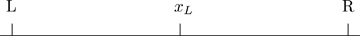

# 3 과점 (Oligopoly)

DOI: [10.1201/b23262-3](./https___doi.org_10.1201_b23262-3.md)

## 3.1 서론

대부분의 사람들, 심지어 대부분의 경제학자들조차도 경쟁에 대해 논의할 때 경제학 원론(Econ 101)에서 제시된 모델을 염두에 둡니다. 시장에 소규모의 양을 더하는 많은 기업들이 있습니다. 어떤 기업도 자신들이 받는 가격을 통제할 수 없습니다. 각 기업은 자유롭게 시장에 진입하거나 퇴출할 수 있으므로, 더 많은 기업이 진입함에 따라 큰 이윤은 사라지게 됩니다. 이 세계에서 가격은 한계비용과 같고, 상품의 양은 소비자와 기업이 더 나아질 수 없는(어느 한쪽이 더 나빠지지 않고서는) 상태에 있습니다. 이것은 산업조직론 경제학자들이 경쟁을 논의할 때 의미하는 바가 아닙니다. 반독점 및 경쟁 정책 분야에서 일하는 경제학자들은 가격을 결정하기 위해 함께 일하는 기업과 서로 독립적으로 일하는 기업을 구별합니다.

이 장에서는 기업이 서로 독립적으로 행동할 때 가격과 생산량을 어떻게 설정하는지에 대한 표준 모델을 제시합니다. [제8장](./17-chapter8.md)에서는 과점(oligopoly)으로 돌아가 가격 설정에서 독립성이 덜한 상황을 허용할 것입니다. 이 장에서는 쿠르노(Cournot), 베르트랑(Bertrand), 호텔링(Hotelling)이라는 세 가지 표준 경쟁 모델을 제시합니다.[1](./11-chapter3.md#fn3_1) 이 장에서는 **R**을 사용하여 세 기업이 참여하는 쿠르노 게임의 내시 균형(Nash equilibrium)을 시뮬레이션합니다.

**\*\*\*\***\_**\*\*\*\*** [1](./11-chapter3.md#fn3_13b)혼란스럽게도 호텔링 모델은 종종 베르트랑 모델로 불립니다. 이 장에서는 가격 설정 게임의 두 가지 예를 제시하지만, 많은 사람들은 제품이 동질적이지 않은 정적 가격 설정 게임에 베르트랑이라는 이름을 부여합니다.

호텔링 모델은 1990년대 후반 캘리포니아주 산타클라라 카운티의 햄버거 가격 책정을 이해하는 데 사용됩니다. 특히, 이 장에서는 산타클라라 카운티 전역의 매장에서 판매되는 맥도날드 빅맥과 버거킹 와퍼의 가격 데이터를 분석합니다. 이 모델을 통해 위치로 차별화된 기업 간의 경쟁이 가격에 어떤 영향을 미치는지 추정할 수 있습니다. 한 가맹점주가 산타클라라 카운티의 모든 맥도날드 매장을 매입한다면 카운티 내의 빅맥과 와퍼 가격에 어떤 일이 일어날까요?

## 3.2 쿠르노 모델

1850년대에 한 프랑스 응용 수학자가 황당한 주장을 했습니다. 오귀스탱 쿠르노(Augustine Cournot)는 경쟁 기업이 있다고 해서 반드시 가격이 한계비용과 같아지는 것은 아니라고 제안했습니다. 맙소사! 어떻게 이럴 수 있을까요? 경제학에서 가격이 한계비용과 같다는 것은 거의 정의에 가깝습니다. 약 50년 후, 또 다른 프랑스인 프랑수아 베르트랑(François Bertrand)은 쿠르노의 주장이 말도 안 된다고 반박했습니다. 단 두 개의 기업만 있어도 가격은 한계비용과 같아질 것이라는 것입니다.

이 절에서는 쿠르노 모델의 2-기업 버전을 제시하고 이를 _N_-기업 버전으로 일반화합니다. **R**을 사용하여 모델의 3-기업 버전에서 내시 균형을 수치적으로 시뮬레이션합니다.

### 3.2.1 두 기업 모델

형식적으로 우리는 두 기업이 생산량(_qi_)을 선택하고 그들의 집합적 선택이 이윤에 미치는 영향을 고려하는 다음과 같은 게임을 갖습니다.

- 플레이어: 기업 1과 기업 2.
- 전략:
  1.  기업 1: q1≥0
  2.  기업 2: q2≥0
- 보수:
  1.  기업 1: p(q1,q2)×q1−c(q1)
  2.  기업 2: p(q1,q2)×q2−c(q2)

기업 1의 보수 중 첫 번째 부분은 수익입니다. 가격 p(q1,q2)는 시장에서 각 기업의 생산량에 대한 함수입니다. 가격에 기업 1이 생산한 생산량인 \_q_1을 곱합니다. 두 번째 부분은 생산된 생산량의 함수인 비용입니다. 상황을 간단하게 유지하기 위해 p(q1,q2)=a−b×(q1+q2) 및 cj(qj)=c×qj라고 가정해 보겠습니다. 즉, 선형 수요와 일정한 한계비용을 갖습니다. 또한 a−c>0이라고 가정합니다. 이것은 나중에 중요해집니다.

쿠르노의 게임은 두 기업이 동일한 재화를 만든다고 가정합니다. 이것은 밀 시장이나 전력 시장의 좋은 모델이 될 수 있습니다. 이러한 시장에서 각 기업은 얼마나 생산할지 결정하고 수요를 받아들여 모두가 받는 가격을 결정하는 중앙 집중식 거래소에 공급합니다. 이 게임에서 각 기업은 상대 기업이 얼마나 생산하는지 알지 못합니다.

### 3.2.2 최적 대응 (Best Response)

게임 이론을 처음 접하는 사람들이 매우 혼란스러워하는 한 가지 문제는 **최적 대응 함수(best response function)**라는 개념입니다. 위의 게임 설명에서는 각 기업이 자신의 행동을 선택할 때 다른 기업의 선택을 알지 못한다고 명확하게 명시되어 있습니다. 그런데 5분 뒤에 우리는 기업들이 자신의 행동이 다른 기업의 행동에 대한 최적 대응이 되도록 하는 함수를 가지고 있다고 주장합니다. 어떻게 상대방이 무엇을 하는지 모르는 동시에 그것에 대한 최적 대응을 할 수 있을까요? 말이 되지 않습니다.

이 두 문장은 서로 다른 개념을 언급하기 때문에 모두 참일 수 있습니다. 하나는 게임에 대한 설명이고 다른 하나는 게임의 내시 균형을 찾는 데 사용되는 알고리즘에 대한 설명입니다. 책의 이 부분에서 논의되는 게임들은 플레이어들이 행동을 한 번, 그리고 동시에 선택한다고 가정합니다. 이런 의미에서 각 기업은 다른 기업이 얼마나 생산하는지 알지 못합니다. 최적 대응 함수는 내시 균형을 찾는 데 사용되는 분석 도구입니다. 내시 균형은 각 기업이 상대 기업이 선택한 생산량을 주어졌을 때 최적의 생산량을 선택하는 상태입니다. 즉, 내시 균형은 각 기업의 생산량 선택이 상대 기업의 생산량 선택에 대한 최적 대응이 되는 상태입니다.

최적 대응 함수는 다음 최적화 문제의 해입니다.

maxq1(a−bq1−bq2)q1−cq1(3.1)

이 최적화 문제의 해는 1계 조건(first order condition)에 의해 주어집니다.

a−bq1−bq2−c−bq1=0orq1=a−c−bq22b(3.2)

최적 대응 함수는 기업 1의 생산량이 a−c의 차이가 클수록 증가하고, 기업 2의 생산량(_q_2)이 늘어날수록 감소하며, 고객이 시장을 이탈하려는 의지(\_b_)가 클수록 감소한다고 명시합니다. 이 모델에서 두 플레이어의 행동은 전략적 대체재(strategic substitutes)입니다. 다시 말해, 한 기업이 생산량을 늘리면 다른 기업은 생산량을 줄이는 것으로 대응합니다.

### 3.2.3 내시 균형 (Nash Equilibrium)

내시 균형은 각 기업이 상대 기업에 대해 최적 대응을 수행하는 지점입니다. 즉, 기업 1에 대한 1계 조건(식 (3.2))과 기업 2에 대한 동등한 조건이 모두 성립하는 지점입니다. 균형을 풀려면 두 개의 선형 방정식 시스템에서 두 개의 미지수를 구해야 합니다. 미지수의 수와 독립적인 선형 방정식의 수를 단순히 세어보면 해가 존재하고 유일하다는 것을 알 수 있습니다.

이 경우, 우리는 훌륭한 요령을 사용하여 이를 해결할 수 있습니다. 두 기업이 동일하기 때문에 균형 상태에서는 정확히 같은 양을 생산해야 합니다. 즉 q1=q2=q입니다. 이것을 식 (3.2)에 대입하면 해를 찾을 수 있습니다.

q=a−c−bq2b2bq=a−c−bq3bq=a−cq=a−c3b(3.3)

이것이 균형 상태에서의 각 기업의 생산량입니다. 식 (3.3)은 한계비용(_c_)이 증가하고 대체 가능성(_b_)이 증가할 때 생산량이 감소할 것임을 나타냅니다. 균형 생산량이 양수가 되려면 위에서 가정한 a−c>0이어야 합니다.

이것을 다시 수요에 대입하면 가격을 결정할 수 있습니다. 두 개의 기업이 있으므로 두 균형 생산량을 모두 대입해야 합니다.

p=a−2ba−c3b=3a−2a+2c3=a+2c3(3.4)

식 (3.4)는 가격이 한계비용에 따라 증가할 것임을 나타내지만, 한계비용보다 높을까요?

p>c⇔a+2c3>c⇔a+2c>3c⇔a−c>0(3.5)

시장에 양수의 생산량이 존재하는 한 가격은 한계비용보다 클 것입니다. 혼돈입니다. 개와 고양이가 함께 사는 격입니다!

### 3.2.4 N개 기업의 쿠르노 모델

기업의 수가 증가하면 어떻게 될까요? 완전 경쟁으로 돌아갈까요?

이 경우 기업 1의 최적 대응은 다음과 같이 됩니다.

q1=a−c−b∑j=2Nqj2b(3.6)

대칭적인 기업들로 균형을 풀기 위해 모든 생산량 수준을 동일하게 설정하는 요령을 다시 사용할 수 있습니다.

q=a−c−b(N−1)q2b2bq=a−c−b(N−1)q(N+1)bq=a−cq=a−c(N+1)b(3.7)

따라서 균형 상태에서 생산량은 시장 내 기업의 수에 비례하여 감소합니다.

균형 생산량을 다시 수요에 대입하여 가격을 결정할 수 있습니다. *N*을 곱해야 한다는 것을 기억하십시오.

p=a−bNa−c(N+1)b=(N+1)a−Na+NcN+1=a+NcN+1=aN+1+NN+1c(3.8)

친숙해 보이나요? 이것은 [제2장](./10-chapter2.md)에서 가격을 결정하는 데 사용된 방정식입니다.

*N*이 커질수록 *p*가 *c*에 수렴하는 것을 볼 수 있습니다. 즉, 쿠르노 모델은 시장에 다수의 기업이 있을 때만 완전 경쟁을 제공합니다.

### 3.2.5 **R**을 이용한 쿠르노 모델

모델이 어떻게 작동하는지 더 잘 이해하기 위해 **R**로 프로그래밍하는 것이 도움이 됩니다. `price_cournot()` 함수는 시장 생산량 `q`가 주어졌을 때 가격을 결정하는 데 사용됩니다. `br_cournot()` 함수는 다른 두 기업의 생산량이 주어졌을 때 해당 기업의 생산량을 결정합니다. 이 함수는 식 (3.6)을 기반으로 합니다. `q[-i]` 표기법은 `q`의 `i`번째 요소를 제외한 모든 요소를 참조하는 데 사용됩니다.

```r
> pricecournot = function(q) a - b*sum(q)


> brcournot = function(q, i) {
+   if (pricecournot(q) > 0) {
+     return(max(c(0, (a - c[i] - b*sum(q[-i]))/(2*b))))
+   } else {
+     return(0)
+   }
+ }
```

최적 대응 함수는 가격과 수량이 양수인지 확인합니다. 이는 식 (3.6)을 기반으로 합니다.

### 3.2.6 **R**을 이용한 내시 균형 풀이

아래 알고리즘은 각 기업의 최적 대응이 동일한 수량으로 이어지는 균형을 찾습니다. 알고리즘은 초기 생산량 수준을 선택한 다음 각 기업의 최적 대응을 계산하여 새로운 생산량 수준을 얻습니다. 그런 다음 새로운 생산량 수준이 이전 생산량 수준과 동일한지 확인합니다. 그렇다면 내시 균형입니다. 내시 균형은 각 기업이 다른 모든 기업에 대한 최적 대응인 생산량 수준을 선택하는 곳임을 기억하십시오. 새로운 생산량 수준이 이전 생산량 수준과 다르면, 알고리즘은 이전 생산량 수준을 방금 계산한 생산량으로 설정하고 그 양에 대한 최적 대응을 찾습니다. 알고리즘은 새로운 양과 이전 양이 같아지거나 거의 같아질 때 중지됩니다.

코드에는 기본 최대 반복 횟수(`maxit = 100`)와 기본 수렴 수준(`epsilon = 1e-5`)이 있습니다.[2](./11-chapter3.md#fn3_2) 코드는 `epsilon`을 사용하여 작은 숫자를 나타냅니다. 조건 중 하나가 유지되지 않을 때까지 실행하기 위해 `while()` 루프를 사용합니다.

**\*\*\*\***\_**\*\*\*\*** [2](./11-chapter3.md#fn3_23b)1e-5는 작은 숫자를 쓰는 한 가지 방법으로, 이 경우 0.00001입니다.

생산량의 초기값은 게임 내의 모든 기업이 동일한 비용을 갖는다고 가정하는 식 (3.7)에 의해 결정됩니다. 그런 다음 알고리즘은 각 기업의 최적 대응을 계산하고 새로운 생산량이 이전 생산량과 동일한지 확인합니다. 알고리즘은 이전 생산량을 새로운 생산량으로 설정하고 해당 생산량에 대한 최적 대응을 계산합니다. 알고리즘은 새로운 생산량과 이전 생산량의 차이가 `epsilon`보다 작거나 반복 횟수가 `maxit`을 초과할 때까지 계속됩니다. 알고리즘은 균형 생산량과 알고리즘이 수렴했는지 여부를 반환합니다.

```r
> necournot = function(maxit=100, epsilon=1e-5,
+                      trace=FALSE, converged=TRUE) {
+   diff = 10000 # some big number
+   iter = 1
+   N = length(c)
+   qold = rep((a - mean(c))/((N+1)*b), N)
+   # initial values for qold
+   while(diff > epsilon & iter < maxit) {
+     qnew = rep(0, N)
+     for(i in 1:N) {
+       qnew[i] = brcournot(qold, i)
+     }
+     diff = sum(abs(qnew - qold))
+     iter = iter + 1
+     if(trace) {
+       print(diff)
+       print(iter)
+     }
+     qold = qnew
+   }
+   if(iter == maxit) {
+     converged = FALSE
+   }
+   return(list(qstar = qnew, converged = converged))
+ }
```

이 알고리즘은 아주 정교하지는 않으며 결과의 고유성을 활용합니다. 이 알고리즘을 통해 위에서 제시한 단순한 대칭 기업 모델보다 더 흥미로운 모델을 시뮬레이션할 수 있습니다.

### 3.2.7 **R**을 이용한 쿠르노 모델 시뮬레이션

다음 시뮬레이션은 기업 간에 비용이 다를 수 있도록 허용하고, 한계비용의 차이가 기업의 시장 점유율 차이로 어떻게 이어지는지 보여줍니다.

```r
>   set.seed(123456789)
>   N = 3
>   a = 0.5
>   b = 0.2
>   c = a*runif(N) # so costs vary between firms.
>   qstar = necournot()$qstar
>   pstar = pricecournot(qstar)
```

결과는 다음과 같습니다. 한계비용(`c`)은 무작위로 결정됩니다. 생산량(`qstar`)과 가격(`pstar`)은 균형 알고리즘에 의해 결정됩니다.

```r
> c
  [1] 0.3465879 0.3364405 0.3269508
> qstar
  [1] 0.1545377 0.2052715 0.2527168
> pstar
  [1] 0.3774948
```

이 예에서 기업 1은 비용이 높고 수량이 적은 반면, 기업 3은 비용이 낮고 수량이 많습니다.

이 시뮬레이션은 효율성이 낮은(한계비용이 높은) 기업은 시장 점유율이 낮고, 효율성이 높은(한계비용이 낮은) 기업은 시장 점유율이 높다는 쿠르노 모델의 표준적인 결과를 설명합니다.

또한 효율성이 덜한 기업이 시장에 존재할 수 있다는 점을 분명히 합니다. 기본적인 쿠르노 게임에는 그들이 시장을 떠나도록 강제하는 것이 전혀 없습니다.

## 3.3 베르트랑 모델

베르트랑은 이 중 어떤 것도 받아들이지 않았습니다. 완전 경쟁은 특이한 예외 사례가 아니었습니다. 쿠르노의 게임에서 기업들은 생산량을 선택하지만, 기업들이 가격을 선택한다면 어떻게 될까요?

이 절에서는 베르트랑 게임의 2-기업 버전을 제시합니다. 서로 옆에 있는 두 개의 아이스크림 스탠드를 생각해 보세요. 각 스탠드는 아이스크림 콘의 가격을 표시합니다. 한 아이스크림 스탠드가 다른 곳보다 높은 가격을 부과하면, 모든 사람은 더 싼 스탠드에서 살 것입니다. 두 스탠드가 같은 가격을 청구하면 그들은 시장을 양분합니다.

### 3.3.1 두 기업 게임

이번에는 두 기업이 가격을 선택하고, 보수는 두 가격의 함수인 수량에 의해 결정됩니다.

- 플레이어: 기업 1과 기업 2.
- 전략:
  1.  기업 1: p1≥0
  2.  기업 2: p2≥0
- 보수:
  1.  기업 1: p1×q1(p1,p2)−c1×q1(p1,p2)
  2.  기업 2: p2×q2(p2,p1)−c2×q2(p2,p1)

다시 각 기업의 보수는 수익에서 비용을 뺀 값입니다. 이번에는 기업이 청구할 가격을 선택하고 시장 메커니즘이 기업이 얼마나 많은 양을 판매할지 결정합니다.

q1={1if q1<q20.5if q1=q20if q1>q2(3.9)

시장 규모가 1이라고 가정해 보겠습니다. 식 (3.9)는 낮은 가격을 제시하면 모든 사람이 여러분에게서 구매하고, 높은 가격을 제시하면 아무도 여러분에게서 구매하지 않는다는 것을 말해줍니다. 두 기업이 동일한 가격을 갖는 경우 시장을 분할합니다.

이곳은 고객이 대체하기가 매우 쉬운 시장입니다. 가격을 조금만 낮춰도 전체 시장이 이동할 수 있습니다.

현실 세계의 예로 공급 계약 견적 요청을 들 수 있습니다. 어느 기업이든 낮은 가격을 제시하는 쪽이 전체 공급 계약을 따냅니다.

### 3.3.2 내시 균형

두 기업이 동일한 한계비용(c1=c2=c)을 갖는 단순한 경우를 생각해 보겠습니다. 유일한 내시 균형은 p1=p2=c입니다.

이것이 균형임을 확인하기 위해 p1=c라고 가정해 보겠습니다. p2>c라면 어떻게 될까요? 이 경우 기업 2의 생산량은 0이고 이윤도 0입니다. p2=c라면 어떨까요? 이 경우 기업 2의 생산량은 0.5이지만 기업 2의 이윤은 0입니다. 마지막으로 p2<c라면 기업 2의 생산량은 1이지만 기업 2의 이윤은 음수입니다. 따라서 기업 2는 p2=c를 선택하는 것과 p2>c를 선택하는 것 사이에서 무차별합니다. 기업 2가 내시 균형보다 더 나은 결과를 얻을 수 없다는 점을 감안할 때, 이는 p2=c가 기업 2에게 최적임을 확인시켜 줍니다. 우리는 기업 1에 대해서도 똑같은 주장을 할 수 있습니다.

이것은 균형일 뿐만 아니라 유일한 균형이기도 합니다. 후보 균형은 p1=p2>c입니다. 다시 기업 1의 가격을 p1>c로 유지해 보겠습니다. 기업 2가 p2>p1을 청구하면 기업 2의 이윤은 0입니다. 기업 2가 p2=p1을 청구하면 기업 2의 이윤은 양수, 0.5(p1−c)가 됩니다. 기업 2가 p2=p1−ϵ(*ϵ*는 임의의 작은 수)을 청구하면 기업 2의 이윤은 (p1−c−ϵ)이 됩니다. 이 이윤은 훨씬 높습니다. 물론 가격은 약간 낮지만, 기업 2는 시장의 절반에 팔던 것에서 전체 시장에 파는 것으로 바뀌었습니다. 이 게임에서는 시장에서 경쟁자보다 약간 낮은 가격을 제시할 거대한 유인이 존재합니다. 이러한 유인 때문에 다른 내시 균형은 존재하지 않습니다.

베르트랑은 자신의 주장을 증명했습니다. 두 기업만 있어도 가격은 완전 경쟁의 중요한 특징인 한계비용과 같아집니다.

두 기업의 한계비용(_cj_)이 서로 다르다면 베르트랑의 모델에서는 어떤 일이 일어날까요?

## 3.4 호텔링 모델

완전 경쟁이 어떤 특이 사례에서 모델의 상수로 바뀌는 데 필요한 것은 단지 기업들이 수량 대신 가격을 선택한다고 가정하는 것뿐이었습니다! 말도 안 됩니다. 더 자세히 살펴보면 두 프랑스인이 제안한 모델은 서로 매우 다릅니다. 특히 베르트랑 모델에서의 수요는 매우 특이합니다.

20세기 초, 미국의 통계학자이자 경제학자인 해럴드 호텔링(Harold Hotelling)은 타협안을 제안했습니다. 그는 기업들이 가격을 선택하지만 베르트랑이 가정하는 것처럼 수요가 그렇게 특이하지 않은 모델을 제안했습니다.

이 절에서는 호텔링의 원래 모델을 제시합니다. 그런 다음 선형 수요를 가진 차별화된 제품 모델을 제시하고 그 모델에 대한 가격의 내시 균형을 결정합니다.

### 3.4.1 호텔링의 선형 도시 (Hotelling's Line)

[그림 3.1](./11-chapter3.md#fig3_1)은 호텔링의 게임을 나타냅니다. 두 개의 기업 *L*과 *R*이 있습니다. 두 기업의 고객들은 선을 따라 "살고" 있습니다. 해변의 산책로 양 끝에 위치한 두 개의 프로즌 커스터드(아이스크림) 가게를 생각해 보십시오. 여러분의 비치 체어는 다른 프로즌 커스터드 가게보다 한 가게에 더 가깝게 위치해 있을 수 있습니다. 제품과 가격이 동일하다면 고객들은 더 가까운 기업에 가는 것을 선호합니다. 호텔링의 핵심 통찰은 기업들이 종종 유사한 제품을 판매하여 경쟁하지만, 이 제품들이 완전히 똑같지 않을 수 있다는 것입니다. 더욱이 일부 사람들은 다른 제품보다 한 제품을 선호할 수도 있습니다. 실제로 어떤 사람들은 코카콜라보다 펩시를 선호합니다. 선 상의 위치는 고객이 *R*보다 *L*을 얼마나 더 선호하는지를 나타냅니다.



[그림 3.1](chapter3) 기업 *L*이 0에, 기업 *R*이 1에 위치한 호텔링의 선. *xL*의 왼쪽에 "사는" 모든 사람은 기업 *L*에서 구매합니다.

선과 고객 및 기업 간의 거리는 그들이 특정 기업에서 구매할 의향이 얼마나 되는지를 나타냅니다. 중요한 것은 두 기업의 제품이 서로 얼마나 대체재 관계에 있는지를 나타낸다는 것입니다. 아래에 제시된 햄버거 예에서, 우리는 매장 간의 실제 거리를 사용하여 대체 가능성을 측정하지만 보다 일반적으로 호텔링의 선은 두 제품이 얼마나 비슷하거나 다른지를 나타내는 은유입니다. 두 기업이 가까울수록 서로 대체하기가 더 쉽고 가격은 더 낮아질 가능성이 큽니다.

### 3.4.2 차별화된 상품 게임

이제 모두 비슷하지만 서로 같지 않은 제품을 판매하는 *N*개의 기업이 있는 게임을 생각해 보십시오. 예를 들어, 산타클라라의 햄버거 레스토랑들이 있습니다. 빅맥은 같을 수 있지만, 각 맥도날드 매장의 위치는 다릅니다.

- 플레이어: *N*개의 기업으로, 각 기업은 위치 {xi,yi}∈ℜ2를 갖습니다.
- 전략: 모든 i∈{1,...,N}에 대해 pi≥0
- 보수: (pi−ci)×qi(pi,p−i)

*N*개의 각 기업은 가격 *pi*를 선택합니다. 이윤은 가격에서 한계비용(_ci_)을 뺀 값에 판매된 수량 *qi*를 곱한 값입니다. 이 수량은 기업이 청구하는 가격 _pi_, 다른 모든 기업이 청구하는 가격 p−i, 그리고 기업 간의 거리에 의해 결정됩니다.[3](./11-chapter3.md#fn3_3)

상황을 더 간단하고 구체적으로 만들기 위해 단 두 개의 기업 *i*와 *j*가 있다고 가정해 봅시다. 기업 *i*의 판매량은 다음과 같은 방식으로 *pi*와 *pj*의 영향을 받습니다.

qi(pi,pj)=α+βpi+γpjdij+ϵi(3.10)

이것은 앞서 이 장에서 제시된 모델과 유사한 선형 수요 모델입니다. 기업 *i*가 판매하는 수량은 기업 *i*가 청구하는 가격, 기업 *j*가 청구하는 가격 및 관측되지 않은 항 *ϵi*의 함수입니다. β<0이라고 가정하면 가격이 높을수록 _i_ 제품에 대한 수요는 낮아집니다. 수요는 경쟁자의 가격 *pj*의 함수이기도 합니다. 이것의 정도는 양수인 *γ*에 의해 결정됩니다. 경쟁자가 더 높은 가격을 청구할 때 *i*에 대한 수요는 더 높아집니다. 경쟁자의 가격이 얼마나 중요한지는 매장 간의 거리에 달려 있습니다. 그 거리(dij)가 클수록 두 기업은 고객을 위해 덜 경쟁하게 됩니다. 다시 말하지만, dij는 물리적 거리 또는 단순히 두 제품 간의 차이를 나타내는 척도일 수 있습니다.[4](./11-chapter3.md#fn3_4)

### 3.4.3 최적 대응

이 모든 것을 감안할 때 시장의 가격은 어떻게 될까요? 우리는 가격이 내시 균형에 의해 결정된다고 가정합니다. 내시 균형은 기업 *j*가 청구하는 가격을 감안할 때 기업 *i*가 자신의 가격을 변경할 의향이 없고, 기업 *i*의 가격을 감안할 때 기업 *j*가 자신의 가격을 변경할 의향이 없는 가격입니다.

**\*\*\*\***\_**\*\*\*\*** [3](./11-chapter3.md#fn3_33b)−i는 *i*가 아님을 의미합니다.

[4](./11-chapter3.md#fn3_43b)우리는 유클리드 거리 dij=((xi−xj)2+(yi−yj)2)를 사용할 것입니다. 이것은 직선 거리입니다.

기업 *i*의 문제는 다음과 같습니다.

maxpi(pi−ci)(α+βpi+γpjdij)(3.11)

최적화 문제의 해는 1계 조건의 해입니다.

(α+βpi+γpjdij)+β(pi−ci)=0(3.12)

기업 *j*의 문제도 유사합니다. 1계 조건에서 도출된 두 방정식은 각 기업의 최적 대응 함수입니다.

### 3.4.4 내시 균형

1계 조건에서 도출된 두 방정식을 감안하여 방정식 시스템을 작성할 수 있습니다. 각 기업의 최적 대응 함수는 다음과 같습니다.

pi=ci2−α2β−γpj2βdijpj=cj2−α2β−γpi2βdij(3.13)

비용이 높을수록 가격은 높아집니다. 가격은 전략적 보완재입니다. _γ_ 앞에 음수 기호가 있지만 위에서 *β*가 음수라고 말했습니다. *pj*가 증가할 때 기업 *i*의 최적 대응은 *pi*를 증가시키는 것입니다. 다시 말하지만 두 기업이 얼마나 상호 작용하는지는 *γ*와 거리 dij에 달려 있습니다.

## 3.5 실증 분석: **R**을 이용한 햄버거 경쟁

워싱턴 대학교(Wash U) 마케팅 교수인 랄프 토마드센(Raph Thomadsen)은 스탠퍼드에서 박사 과정을 할 때 산타클라라 카운티의 햄버거 경쟁을 연구하기로 결심했습니다. 랄프는 거대 체인인 맥도날드와 버거킹 간의 경쟁뿐만 아니라 체인 브랜드 내부의 경쟁에도 관심이 있었습니다.

경쟁을 연구하기 위해 그는 보건부에서 각 매장에 대한 정보를 얻었습니다. 중요한 것은 매장의 위치를 확보한 것이었습니다. 그런 다음 그는 각 매장을 직접 방문하여 제공되는 햄버거의 가격과 매장에 드라이브스루나 플레이랜드와 같은 다른 기능이 있는지 확인했습니다.

이 절에서는 앞서 제시된 모델을 사용하여 90년대 후반 산타클라라 카운티의 햄버거 가격을 모델링합니다.

### 3.5.1 데이터

이 데이터는 랄프 토마드센이 제공했으며 그의 RAND 논문([Thomadsen, 2005](./25-refbib.md#ref56))에서 사용되었습니다.[5](./11-chapter3.md#fn3_5) 각 매장에 대해 브랜드, 소유 구조, 매장의 특징, 매장 연령 및 샌드위치 가격에 대한 정보가 있습니다.

**\*\*\*\***\_**\*\*\*\*** [5](./11-chapter3.md#fn3_53b)코드의 좌표와 구글 지도를 사용한 매장의 위치 사이에는 약간의 불일치가 있습니다.

[그림 3.2](./11-chapter3.md#fig3_2)는 코드의 좌표를 사용하고 아이콘을 가져와 **R**의 `leaflet` 패키지를 사용하여 생성되었습니다. 이 그림은 산타클라라 카운티에서 경쟁이 어떻게 이루어지는지 어느 정도 알려줍니다. 각 브랜드 위치에는 로고가 있습니다. 로고의 크기는 시그니처 샌드위치에 부과된 가격을 나타냅니다. 가격이 높을수록 아이콘이 큽니다. 스탠퍼드 캠퍼스 근처의 매장들은 가격이 상당히 높습니다. 종종 버거킹은 맥도날드와 짝을 이루고 있지만, 둘 다 가격이 정말 낮지는 않습니다. 산호세 서쪽과 남쪽의 가격은 동쪽과 북동쪽보다 낮아 보입니다.


[그림 3.2](chapter3) 산타클라라 카운티의 맥도날드와 버거킹 매장. 로고의 크기는 샌드위치의 가격이 상위 3분의 1에 속하는지, 중간 3분의 1에 속하는지, 하위 3분의 1에 속하는지를 나타냅니다.

하나의 도시 전역에서 빅맥 가격이 얼마나 다양한지에 놀랄 수 있습니다. 흥미로운 경쟁이 맥도날드 매장 간의 경쟁이라는 점에도 놀랄 수 있습니다. 어떻게 그럴 수 있을까요? 맥도날드 본사에서 빅맥 가격을 정하지 않나요? 아닙니다. 상황에 따라 다릅니다. 이 데이터의 일부 매장은 맥도날드 기업이 소유하고 있으며, 그런 경우에는 기업 본사가 가격에 대해 큰 발언권을 갖게 됩니다. 그러나 대부분의 매장은 가맹점주가 소유하고 있습니다. 캘리포니아 법에 따라 기업 본사는 그들에게 요구할 수 있는 것에 제한을 받습니다. 본사는 매장이 샌드위치에 대해 부과하는 가격을 결정할 수 없습니다.

### 3.5.2 추정 ([Part 1](./08-part1.md))

게임 이론 모델의 파라미터를 추정할 때 선형 회귀 모델과 같은 표준 모델의 추정치를 먼저 제시하는 것이 전통적입니다. 게임 이론은 그 회귀 모델에 무엇을 넣을지 생각하는 데 도움을 주지만, 결과를 해석할 때 주의해야 함을 분명히 하기도 합니다. 원시 가격은 회귀 결과가 더 좋게 보이도록 조정됩니다.

분석의 나머지 부분에서 사용되는 데이터는 기업(본사) 소유가 아닌 매장으로 제한됩니다. 문제는 그들의 가격 책정 전략이 가맹점 위치와 매우 다르게 보일 수 있다는 것입니다.

```r
>   file = paste0(dir,"outletsgtch3.csv")
>   data = fread(file) |>
+     mutate(
+       LPrice1 = log(100*(Price - 2.49)),
+       BK = BK == 1
+     )
>   lm1 = lm(LPrice1 ~ BK, data)
>   lm2 = lm(LPrice1 ~ BK + Playland +
+               DriveThru + Mall, data)
>   lm3 = lm(LPrice1 ~ BK + Playland +
+               DriveThru + Mall + Race + Male, data)
```

[표 3.1](./11-chapter3.md#tbl3_1)은 매장의 특성에 따른 샌드위치 가격 로그의 회귀 분석 결과 일부를 제시합니다. 이 설정은 [Thomadsen (2005)](./25-refbib.md#ref56)에 제시된 표와 비교적 밀접하게 일치하는 것으로 보입니다. 와퍼의 가격이 (평균적으로) 더 낮으며, 다양한 편의 시설이 있는 매장과 쇼핑몰, 인구 통계학적 특성에 기반한 다양한 위치의 매장에서 더 낮습니다. 대부분의 특성에 대한 계수는 통계적으로 0과 유의하게 다르지 않습니다. 이는 아마도 표본 크기가 작기 때문일 것입니다. 통계적으로 0과 유의하게 다른 계수 중 하나는 버거킹 매장 여부에 대한 더미(dummy)입니다. 와퍼가 빅맥보다 저렴합니다.

**[표 3.1](chapter3) 매장의 관측된 특성 및 위치와 가격 간의 균형 관계에 대한 OLS 추정치.**
| _종속 변수:_ | | | |
| --------------------- | --------------------------------------------- | --------------------------------------------- | --------------------------------------------- |
| LPrice1 | | | |
| (1) | (2) | (3) | |
| BK | \-0.21[\*\*\*](./11-chapter3.md#tblfn3_3_1) | \-0.23[\*\*\*](./11-chapter3.md#tblfn3_3_1) | \-0.22[\*\*\*](./11-chapter3.md#tblfn3_3_1) |
| | (0.05) | (0.05) | (0.05) | |
| Playland | \-0.08 | \-0.07 | |
| | (0.06) | (0.06) | | |
| DriveThru | \-0.02 | \-0.04 | |
| | (0.06) | (0.06) | | |
| Mall | \-0.13 | \-0.12 | |
| | (0.10) | (0.10) | | |
| Race | 0.50 | | |
| | (0.64) | | | |
| Male | 0.16 | | |
| | (0.19) | | | |
| Constant | 4.54[\*\*\*](./11-chapter3.md#tblfn3_3_1) | 4.59[\*\*\*](./11-chapter3.md#tblfn3_3_1) | 4.50[\*\*\*](./11-chapter3.md#tblfn3_3_1) |
| | (0.03) | (0.06) | (0.11) | |
| 관측치 수 | 79 | 79 | 79 |
| R2 | 0.19 | 0.22 | 0.23 |

_참고:_ \*p<0.1; \*\*p<0.05; [\*\*\*](./11-chapter3.md#tblfn3_3_1c)p<0.01

### 3.5.3 실증 균형

이전 장에서 했던 것처럼, 데이터에서 관측된 가격이 위에서 설명한 게임의 내시 균형에 의해 결정된다고 가정할 것입니다. 이것이 의미하는 바는 모든 매장에서 보는 가격 전체 세트에 대해 전체 최적 대응 세트가 유지되어야 한다는 것입니다. 최종 데이터 세트에는 산타클라라 카운티에 있는 79개 매장의 가격과 정보가 있습니다.

우리의 추정 문제는 관찰하는 79개의 가격과 각 위치 간의 거리가 주어졌을 때 79개의 최적 대응 방정식이 성립하도록 하는 _α, β_ 및 *γ*를 찾는 것입니다. 실제로, 관측된 매장 특성에 대한 파라미터를 추가하여 실증 모델을 조금 더 복잡하게 만들 것입니다.

2βpi−βci+Xi′α+γpjdij+ϵi=0(3.14)

여기서 Xi는 매장 *i*에 대해 관측된 특성들의 벡터입니다((1, brandi, drivethrui)). 여기서 brandi는 매장의 브랜드를 나타내고 drivethrui는 매장에 드라이브스루가 있으면 1, 그렇지 않으면 0입니다.[6](./11-chapter3.md#fn3_6) 파라미터 *α*는 이제 파라미터 벡터 (α0,α1,α2)입니다.[7](./11-chapter3.md#fn3_7)

**\*\*\*\***\_**\*\*\*\*** [6](./11-chapter3.md#fn3_63b)행렬 표기법 X는 데이터 블록을 나타냅니다. 이 경우 각 행은 매장이고 각 열은 매장의 특성입니다.

[7](./11-chapter3.md#fn3_73b)우리는 세 요소로 구성된 두 벡터에 대해 x′y가 (x1y1+x2y2+x3y3)를 의미하는 행렬 표기법을 사용하고 있습니다. 보시다시피 행렬 표기법이 훨씬 더 간결합니다.

모든 매장에 대해 이를 작성하면 성립해야 하는 79개의 방정식(J=79)이 있습니다. 이들이 서로 얼마나 영향을 미치는지는 파라미터 *γ*와 각 매장 간의 거리 dij에 달려 있습니다. 주목해야 할 또 다른 점은 수요 파라미터(_α, β, γ_)가 모든 매장에 대해 동일하다는 가정입니다. 매장마다 다른 점은 관측된 특성 Xi, 한계비용 _ci_ 및 다른 매장까지의 거리 dij 그리고 관측되지 않은 매장 특성 *ϵi*입니다.

2βp1−βc1+X1′α+γ∑j=2Jpjd1j+ϵ1=02βp2−βc2+X2′α+γ(p1d12+∑j=3Jpjd2j)+ϵ2=0...2βpJ−βcJ+XJ′α+γ∑j=1J−1pjdJj)+ϵJ=0(3.15)

이것은 꽤 복잡합니다. 행렬 표기법을 사용해서 작성하면 훨씬 간결해집니다.

무슨 일이 일어나고 있는지 확인하기 위해 두 개의 기업만 있는(J=2) 경우를 살펴보겠습니다. 또한 한계비용이 0이고 매장에 대해 관측되거나 관측되지 않은 특성이 없다고 가정해 봅시다.

2βp1+γp2d12=02βp2+γp1d21=0(3.16)

이것을 행렬로 작성할 수 있습니다.

2β\[p1p2\]+γ\[01d121d210\]\[p1p2\]=\[00\](3.17)

행렬 곱셈 규칙을 기억하면서 이를 풀어서 위의 방정식을 얻을 수 있습니다. 전체 행렬 표기법에서는 다음과 같습니다.

2βp+γDp=0(3.18)

여기서 D는 대각선이 0이고 각 셀에 매장 간의 역거리가 있는 매장 간 거리를 나타내는 행렬이며, *p*는 샌드위치 가격의 벡터입니다.

전체 실증 균형은 행렬 표기법으로 작성할 수 있습니다.

2βp−βc+Xα+γDp+ϵ=0(3.19)

여기서 *p*는 샌드위치 가격 벡터, *c*는 각 매장의 한계비용 벡터, X는 각 매장의 관측된 특성 행렬, *α*는 고객이 그러한 특성을 어떻게 평가하는지를 나타내는 벡터이고, D는 산타클라라 카운티의 모든 매장 간 거리가 있는 전체 행렬입니다. 훨씬 더 깔끔해 보인다는 것을 인정해야 할 것입니다.

### 3.5.4 추정량 (Estimator)

우리의 추정 문제는 모델의 균형 가격이 관측된 가격과 밀접하게 일치하도록 모델의 파라미터를 찾는 것입니다. 이를 위해 우리는 **적률 방법(method of moments)** 추정량을 사용할 것입니다. 꽤 멋지게 들리지만 단순히 최소 제곱법(least squares)입니다. 식 (3.19)에서 *ϵ*으로 표시된, 가격을 결정하는 일부 관측되지 않은 특성이 있기 때문에 방정식이 정확히 성립하지 않을 것이라는 발상입니다.

그러나 우리는 식 (3.19)가 각 매장에 대해 평균적으로 성립한다고 가정할 것입니다. 균형 상태에서 관측되지 않은 항이 평균적으로 0이라고 가정합니다. [가정 1](./11-chapter3.md#assu3_1)은 이 아이디어를 형식화합니다.

[가정 1.](chapter3) E(ϵi|Xi,p,ci,Di)=0 모든 i∈{1,...,N}에 대해, 여기서 Di는 매장 i에서 다른 모든 매장까지의 거리 벡터입니다.

이제 우리는 시장에 있는 매장들의 평균 가격을 실제로 알지 못합니다. 오히려 우리는 각 매장에 대한 가격 세트만 관찰했습니다. 따라서 우리는 [가정 1](./11-chapter3.md#assu3_1)의 아날로그가 관찰한 데이터에서 성립한다고 가정할 것입니다. 이 방정식이 정확히 0이 되어야 한다고 요구하는 대신, _ϵi_ 제곱의 평균을 가능한 한 작게 만드는 파라미터를 찾을 것입니다. 즉, 제곱합 또는 최소 제곱을 최소화할 것입니다.

min{α,β,γ}1N∑i=1N(2βpi−βci+Xiα+γDip)2(3.20)

실제 추정에서는 한 가지 더 복잡한 사항을 추가할 것입니다. 우리는 매장의 한계비용인 *ci*를 관찰하지 못합니다. 단일 브랜드 내에서 한계비용은 데이터의 여러 매장 간에 매우 유사할 것이기 때문에 이것이 큰 문제라고 생각하지 않습니다. 기업 본사의 요구 사항 중 하나는 각 매장이 본사에서 선호하는 공급업체와 비슷한 품질의 공급업체를 사용하는 것입니다. 특정 공급업체를 사용하도록 강제할 수는 없지만 특정 표준을 유지하도록 요구할 수는 있습니다. 샌드위치에 들어가는 재료의 비용은 한 브랜드 내의 모든 매장에서 상당히 유사하다고 생각하는 것이 합리적입니다. 게다가 모든 매장은 유사한 노동 시장에 직면해 있고 유사한 임금을 지불할 것입니다. 이 모든 것은 우리가 ci=brandi+ϵc라고 가정함을 의미합니다.

### 3.5.5 **R**을 이용한 추정량

이제 데이터를 기반으로 추정량을 실행하기 위해 위의 모든 수학을 코드로 변환해야 합니다. 함수 `outlet_price_f()`는 식 (3.20)을 **R** 코드로 매핑합니다. 꽤 비슷해 보이지만 완전히 같지는 않습니다. 추가 행렬 `Omega`가 있습니다. 이 행렬에 대해서는 다음 절에서 걱정하겠습니다. 지금은 대각선에 모두 1이 있고 다른 모든 곳에는 0이 있는 행렬인 **단위 행렬(identity matrix)**이 될 것입니다. 이를 감안할 때 함수는 식 (3.20)과 동일합니다.[8](./11-chapter3.md#fn3_8) **R**에서 행렬 곱셈을 수행하기 위한 연산은 `A%*%B`이며 여기서 `A`와 `B`는 두 행렬이고 `A`의 열 수는 `B`의 행 수와 같습니다. 반면 `A*B` 연산은 `A`의 각 셀이 `B`의 각 셀과 곱해짐을 의미합니다.[9](./11-chapter3.md#fn3_9)

```r
> outletpricef = function(price, D, Omega, cost, X,
+                           alpha, beta, gamma) {
+     epsilon = beta*price +
+       gamma*D%*%price +
+       beta*(price - cost) +
+       gamma*(Omega*D)%*%(price - cost) +
+       X%*%alpha
+     sos = mean(epsilon^2)
+     return(sos)
+ }
```

**\*\*\*\***\_**\*\*\*\*** [8](./11-chapter3.md#fn3_83b)스스로를 확신시키기 위해 단위 행렬을 사용하여 몇 가지 행렬 대수를 수행해 보십시오.

[9](./11-chapter3.md#fn3_93b)A와 B는 동일한 차원을 가져야 하지만 엄격하게 필요한 것은 아니며, 조건이 유지되지 않으면 이상한 결과가 나타납니다.

첫 번째 함수는 최대한 수학에 가깝게 보이려고 노력합니다. 두 번째 함수는 변환 함수입니다. 이것은 최적화할 함수로서 잘 작동하는 것에서 예쁘게 보이는 것으로 변환합니다. 이 변환 함수(`outlet_price_f_int()`)는 **R**에게 `X`가 행렬이라는 것을 분명히 합니다.[10](./11-chapter3.md#fn3_10) 그런 다음 `optim()` 최적화 함수가 사용하는 벡터 `par`를 우리의 파라미터인 `alpha`, `beta`, `gamma`로 변환합니다. 우리는 `beta`를 음수로 강제하고 `gamma`를 양수로 강제합니다. 숫자를 취하여 0보다 크게 만드는 `exp()` 함수를 사용하여 이를 수행합니다.[11](./11-chapter3.md#fn3_11) 경험 법칙상 최적화 알고리즘은 미묘함에 능하지 않습니다. 그것이 원하는 파라미터 값을 선택하도록 둔 다음, 그 선택을 여러분이 파라미터에 두고자 하는 제약 조건으로 변환하는 것이 더 낫습니다.

```r
> outletpricefint = function(par, price, D, Omega, BK, X) {
+   X = as.matrix(X)
+   J = dim(X)[2]
+   alpha = par[1:J]
+   beta = -exp(par[J+1])
+   gamma = exp(par[J+2])
+   cost = cbind(1,BK)%*%par[c(J+3,J+4)]
+   return(outletpricef(price, D, Omega, cost,
+                          X, alpha, beta, gamma))
+ }
```

### 3.5.6 거리 (Distances)

추정에서 매장 간 거리를 사용하려면 매장 간의 거리를 계산해야 합니다. 코드는 `dist()` 함수를 사용하여 두 지점 사이의 유클리드 거리("직선 거리")를 계산합니다. 데이터 세트에 있는 모든 매장 간 거리를 계산하기 위해 루프에 사용됩니다. 코드는 `for()`를 사용하여 **R**에서 루프를 실행합니다. **R**에서 루프를 실행할 때는 루프 중에 채워지는 빈 객체(여기서는 행렬 `dist_mat`)를 생성하는 것이 좋습니다.[12](./11-chapter3.md#fn3_12)

**\*\*\*\***\_**\*\*\*\*** [10](./11-chapter3.md#fn3_103b)**R**은 가끔 무엇이 행렬이고 무엇이 아닌지에 대해 혼동하므로 조금 반복해서 명시할 필요가 있습니다.

[11](./11-chapter3.md#fn3_113b)지수 함수입니다.

[12](./11-chapter3.md#fn3_123b)이 작은 요령은 **R**의 속도를 크게 향상시킵니다.

```r
>   dist = function(lat0, lon0, lat1, lon1) {
+     return(sqrt((lat0 - lat1)^2 + (lon0 - lon1)^2))
+   }
>   J = dim(data)[1]
>   distmat = matrix(NA, J, J)
>   for(i in 1:J) {
+     for(j in 1:J) {
+       distmat[i,j] = dist(data$lat[i], data$lon[i],
+                             data$lat[j], data$lon[j])
+     }
+   }
```

이제 각 매장 조합에 대한 역거리를 찾고 대각선의 값을 0으로 설정하여 행렬 `D`를 만들 수 있습니다.[13](./11-chapter3.md#fn3_13) 마지막으로, 동일한 위치를 가진 매장들이 매우 가까운 거리를 갖도록 설정해야 합니다.[14](./11-chapter3.md#fn3_14)

```r
> D = 1/distmat
> diag(D) = 0
> D[is.infinite(D)] = 1/0.006
```

### 3.5.7 소유권 (Ownership)

거의 다 왔습니다. 가격을 추정하기 전에 논의해야 할 사항이 한 가지 더 있는데, 그것은 바로 소유권입니다. 가격 책정 모델에서 우리는 각 매장이 독립적으로 가격을 책정한다는 단순화된 가정을 했습니다. 하지만 데이터에서는 그렇지 않습니다. 데이터에는 여러 가맹점을 소유한 사람들이 있습니다. 이 경우 소유자는 자신이 다른 매장도 소유하고 있다는 사실을 고려하여 샌드위치의 최적 가격을 책정할 것입니다.

한 사람이 두 개의 매장을 소유하고 있으며 각각의 최적 가격을 선택해야 한다고 가정해 보겠습니다. 각 매장의 수요 함수는 두 매장의 가격 모두에 의존한다는 것을 기억하십시오.

max{p1,p2}q1(p1,p2)(p1−c1)+q2(p2,p1)(p2−c2)(3.21)

이 경우 1계 조건은 다음과 같습니다.

p1:q1(p1,p2)+dq1dp1(p1−c1)+dq2dp1(p2−c2)=0p2:q2(p2,p1)+dq1dp2(p1−c1)+dq2dp1(p2−c2)=0(3.22)

**\*\*\*\***\_**\*\*\*\*** [13](./11-chapter3.md#fn3_133b)**R**에서 `1/D` 연산은 역행렬이 아니라 행렬의 각 셀에서 역수를 계산합니다. 역행렬을 계산하려면 `solve()`를 사용하십시오.

[14](./11-chapter3.md#fn3_143b)0.006은 동일한 위치에 있지 않은 매장들의 최소 거리입니다.

따라서 이번에 매장 1에서 샌드위치 가격을 인상하면 매출(dq1dp1)은 감소하지만, 다른 매장으로 전환하는 사람들의 비율(dq2dp1)에 비례하여 이익을 다시 얻게 됩니다. 가격 인상으로 인한 매장의 손실이 고객 재확보를 통해 완화되기 때문에 가격은 더 높아질 것입니다.

우리의 문제에서는 다음과 같습니다.

dq1dp1=βdq1dp2=γd12(3.23)

오메가 표기법을 사용하면 다양한 소유권 가능성을 추적할 수 있습니다. 각 매장은 자신이 소유한다고 가정하지만(ω11=ω22=1), 두 매장을 같은 사람이 소유하거나(ω12=ω21=1) 다른 사람이 소유할(ω12=ω21=0) 가능성이 있습니다.

βp1+γp2d12+ω11β(p1−c1)+ω12γp2−c2d12=0βp2+γp1d21+ω22β(p2−c2)+ω21γp1−c1d21=0(3.24)

우리는 이를 다음 형식으로 작성할 수 있습니다.

2βp−βc+γDp+γΩ⋅D(p−c)=0(3.25)

여기서 Ω⋅D는 셀 단위 곱셈을 의미하고 Ω는 소유권 행렬입니다.

Ω=\[ω11ω12ω21ω22\](3.26)

행렬 D의 대각선은 0이라는 것을 기억하십시오.

### 3.5.8 매장의 소유권

데이터에는 다른 소유자에 대한 지표가 있습니다. 소유권 변수가 0이면 독립적이고 개인 소유입니다. 변수가 1이면 기업(본사) 소유입니다(그래서 데이터에서 제외되었습니다). 변수가 1보다 크면 해당 번호는 어떤 매장이 동일한 소유자를 갖는지 식별하는 데 사용됩니다. 예를 들어 소유권이 6으로 설정된 매장들은 소유자가 동일합니다. 아래 코드는 소유권 코드가 같은 열을 찾기 위해 `which()`를 사용합니다. 각 매장은 자신이 소유한다고 가정되므로 행렬의 대각선은 1입니다.

```r
>   Omega = matrix(0, J, J)
>   for(j in 1:J) {
+     if(data$Ownership[j] > 1) {
+       Omega[j,which(data$Ownership == data$Ownership[j])] = 1
+     }
+   }
>   diag(Omega) = 1
```

### 3.5.9 추정 ([Part 2](./14-part2.md))

퍼즐의 마지막 조각은 `optim()` 함수를 사용하는 것입니다. 이것은 **R**에서 사용되는 기본적인 최적화 알고리즘입니다. 내시 균형으로 유명한 존 F. 내시(John F. Nash)와는 무관한 존 C. 내시(John C. Nash)가 무료로 제공했기 때문에 사용됩니다. 이 함수를 사용하기 위해 우리는 일련의 초기값(init)을 제공합니다. 여기서 `alpha`에 대해서는 0으로, `beta`와 `gamma`에 대해서는 매우 작은 숫자로 설정됩니다. 첫 번째 함수가 호출될 때 이 값들에 `exp()`를 취하고 `exp(log(a))=a`가 됩니다. 즉, `log`는 `exp`의 역함수입니다. `diag()` 함수는 대각선에 값을 가지고 다른 곳에는 0을 가지는 행렬을 만듭니다. `dim()` 함수는 행렬의 차원을 찾으며, 첫 번째 요소는 행의 수입니다. 우리는 `optim()`에 파라미터의 초기값, 최적화할 함수, 그리고 그 함수가 필요로 할 추가 정보를 제공합니다. 이 경우 `D`, `price`, `Omega`, `BK`, `X` 값입니다. 마지막으로 중지하기 전에 사용할 최대 반복 횟수를 제어할 수 있습니다. 기본값은 작으므로 `maxit`을 사용하여 이를 크게 만들고자 할 수 있습니다. 파라미터 `trace`를 1로 설정하면 함수가 수행 중인 작업의 출력물을 제공합니다.

```r
> init = c(rep(0, 5), log(0.001), log(0.001), c(0,0))
> a1 = optim(par = init,
+             fn = outletpricefint,
+             D = D,
+             price = exp(data$LPrice1),
+             Omega = Omega,
+             BK = data$BK,
+             X = cbind(data$Playland,
+                       data$Mall,
+                       data$DriveThru,
+                       data$Race,
+                       data$BK),
+             control=list(trace = 0,maxit = 10000000))


> # alpha
> a1$par[1:5]
  [1] -0.005985475 -0.017518129   0.005481921 -0.006670482
      -0.005309910
> # beta
> -exp(a1$par[6])
  [1] -2.308111e-05
> # gamma
> exp(a1$par[7])
  [1] 2.583274e-08
> # cost
> a1$par[8:9]
  [1] 4.717501 8.238029
```

이 추정치들에 대해 표준 오차는 계산되지 않았습니다. 여러분이라면 어떻게 하시겠습니까?

### 3.5.10 적합도 (Goodness of Fit)

구조적 계량경제학에서는 어떤 형태의 적합도 분석을 제시하는 것이 표준입니다. 여기서 우리는 파라미터 값을 사용하여 예측 가격을 생성할 수 있습니다. 그런 다음 예측치와 관측된 가격을 비교할 수 있습니다.

분석을 수행하기 위해 새 함수를 만들어야 합니다. 이 함수는 위에서 찾은 파라미터 값을 감안하여 새로운 가격 세트를 찾습니다.

```r
> outletpricefint2 = function(par, D, Omega,
+                                 cost, X, alpha, beta, gamma) {
+   X = as.matrix(X)
+   price = exp(par)
+   return(outletpricef(price, D, Omega,
+                          cost, X, alpha, beta, gamma))
+ }


> init = data$LPrice1
> b1 = optim(par = init,
+             fn = outletpricefint2,
+             D = D,
+             Omega = Omega,
+             cost = cbind(1,data$BK)%*%a1$par[8:9],
+             X = cbind(data$Playland,
+                       data$Mall,
+                       data$DriveThru,
+                       data$Race,
+                       data$BK),
+             alpha = a1$par[1:5],
+             beta = -exp(a1$par[6]),
+             gamma = exp(a1$par[7]))
```

[그림 3.3](./11-chapter3.md#fig3_3)은 추정된 파라미터를 사용한 시뮬레이션의 적합도를 나타냅니다. 이 실습에서는 추정된 파라미터를 사용한 다음 내시 균형 조건을 만족하는 가격을 시뮬레이션합니다. 적합 곡선은 실제 가격보다 약간 높습니다.


[그림 3.3](chapter3) 실제 가격(실선), 추정 모델에서 예측된 가격(파선) 및 독립 맥도날드 매장의 합병 모델에서 시뮬레이션된 가격(점선)의 밀도 도표. 점선은 실제 및 시뮬레이션된 가격 분포에서 위로 이동했습니다.

### 3.5.11 맥도날드 매장의 합병

FTC(연방거래위원회)가 맥도날드 가맹점주 간의 집중화 영향을 분석한 적이 있는지는 명확하지 않습니다. 경제적 이론은 병원이나 슈퍼마켓 간의 합병 영향을 분석하는 것과 다르지 않습니다.

우리의 실험은 독립 맥도날드 매장들이 동일한 사람에게 매입되는 경우를 가정합니다.

```r
>   data$Ownership2 = ifelse(data$BK == 2,
+                           10,
+                           data$Ownership)
>   J = length(data$Ownership2)
>   Omega2 = matrix(0, J, J)
>   for(j in 1:J) {
+     if(data$Ownership2[j] > 1) {
+       Omega2[j, which(data$Ownership2 == data$Ownership2[j])] = 1
+     }
+   }
>   diag(Omega2) = 1
```

우리는 합병이 매장의 소유권은 변경하지만 매장의 존재 자체는 변경하지 않는다고 가정할 것입니다. 우리의 수학식과 코드에서 이 변경 사항은 `Omega` 행렬을 사용하여 포착됩니다. 위 코드는 독립적으로 소유된 모든 맥도날드 매장을 찾아 동일한 소유권을 갖도록 설정합니다.

어느 매장에 대한 것이든 새 기업의 가격 결정은 해당 매장의 가격이 다른 매장의 수요에 어떤 영향을 미치는지 고려합니다. 한 맥도날드 매장이 빅맥 가격을 인상하면 일부 고객은 다른 매장으로 전환할 것입니다. 합병 후에는 이들 고객 중 다수가 동일한 기업이 소유한 매장으로 전환합니다. 합병은 가격이 인상될 때 이익의 감소를 줄여줍니다. 합병은 빅맥 가격의 인상으로 이어질 것입니다.

```r
> init = b1$par
> c1 = optim(par = init,
```

```r
+             fn = outletpricefint2,
+             D = D,
+             Omega = Omega2,
+             cost = cbind(1,data$BK == 1)%*%a1$par[c(8,9)],
+             X = cbind(data$Playland,
+                       data$Mall,
+                       data$DriveThru,
+                       data$Race,
+                       data$BK),
+             alpha = a1$par[1:5],
+             beta = -exp(a1$par[6]),
+             gamma = exp(a1$par[7]))
```

아래 코드는 실제 가격, 추정된 모델의 예측 가격, 그리고 독립 맥도날드 매장의 합병 모델 예측 가격의 밀도에 대한 `ggplot()`을 생성합니다.

```r
> ggplotdensoutlets = data.frame(
+   Price = exp(data$LPrice1),
+   sim = exp(b1$par),
+   merger = exp(c1$par)
+ ) |>
+   ggplot(aes(x = Price)) +
+   geomdensity(aes(y = ‥scaled‥), alpha = 0.5) +
+   geomdensity(aes(x = sim, y = ‥scaled‥),
+                 alpha = 0.5,
+                 linetype = “dashed”) +
+   geomdensity(aes(x = merger, y = ‥scaled‥),
+                 alpha = 0.5,
+                 linetype = “dotted”) +
+   geomtext(aes(x = 50, y = 1, label = “Actual”)) +
+   geomtext(aes(x = 75, y = 0.3, label = “Sim”)) +
+   geomtext(aes(x = 140, y = 0.4, label = “Merger Sim”)) +
+   labs(x = “Price (normalized)”,
+         y = “”,
+         title = “”) +
+   ## no numbers on y axis
+   scaleycontinuous(breaks = NULL) +
+   thememinimal()


> ggplotdensoutlets
```

[그림 3.3](./11-chapter3.md#fig3_3)은 모델의 적합도와 모든 독립 맥도날드 매장 간의 합병이 가격에 미치는 시뮬레이션 영향을 모두 보여줍니다. 독립 맥도날드 매장의 롤업(roll-up, 연쇄 합병)은 시장 내 매장들의 가격을 실질적으로 인상할 것입니다. 맥도날드 매장뿐만 아니라 그들과 경쟁하는 버거킹 매장에서도 마찬가지입니다.

## 3.6 토론 및 추가 읽을거리

경쟁의 과점 모델을 분석하기 위해 게임 이론을 사용하는 것은 실제로 게임 이론보다 앞섭니다. 사실, 이 장에서 제시된 세 가지 모델 모두 균형 개념에 의존하지만 내시의 게임 이론 분석보다 앞서 있습니다.

호텔링의 1929년 논문인 *경쟁에서의 안정성(Stability in Competition)*은 많은 산업조직론 경제학자들이 소매 제품 경쟁에 대해 생각하는 방식에 대한 많은 직관을 제공합니다([Hotelling, 1929](./25-refbib.md#ref37)). 모델에서 경쟁에 중요한 것은 제품 간의 "거리"입니다. 경쟁자의 정확한 수가 중요한 것이 아니라 소비자들의 마음속에서 경쟁자들이 서로 얼마나 가까운지가 중요합니다.

다소 혼란스럽게도 우리는 차별화된 가격 경쟁의 일반적인 모델을 베르트랑 모델이라고 부릅니다.[15](./11-chapter3.md#fn3_15) 이 모델을 데이터에 적용한 고전적인 논문은 [Berry et al. (1995)](./25-refbib.md#ref14)입니다.

호텔링 모델의 미묘함은 미국 독점 금지 당국이 합병 심사를 수행하는 방식과 잘 맞지 않았습니다. 표준 합병 심사 기준은 허핀달-허쉬만 지수(Herfindahl-Hirschman index, HHI)라는 척도와 합병으로 인해 발생하는 지수의 변화입니다. 이는 시장에 어떤 기업이 있는지 결정하고, 각 기업의 점유율을 계산하여 제곱한 다음 합산하는 방식으로 계산됩니다. HHI가 쿠르노가 모델링한 동질적 상품 시장에서의 경쟁에 대한 나쁜 근사치는 아니지만, 호텔링이 모델링한 차별화된 상품 시장에서는 큰 의미가 없습니다. 단순한 호텔링의 선에서는 HHI의 변화 없이도 경쟁의 정도가 크게 다를 수 있습니다.

법무부(Department of Justice)와 연방거래위원회(Federal Trade Commission)의 2010년 합병 가이드라인은 차별화된 상품 합병에 대해 다른 심사 기준이 더 나을 수 있다고 제안하며 조정했습니다. 가격 인상 압력(Upward Price Pressure) 심사는 가격 인상을 위해 얼마나 많은 고객이 전환되는지에 따라 두 기업이 얼마나 가까운지 측정합니다.[16](./11-chapter3.md#fn3_16)

**\*\*\*\***\_**\*\*\*\*** [15](./11-chapter3.md#fn3_153b)[제7장](./16-chapter7.md)에서 이 모델을 다룹니다.

[16](./11-chapter3.md#fn3_163b)<https://www.justice.gov/atr/horizontal-merger-guidelines-08192010> 11/21/23 액세스됨.

[_OceanofPDF.com_](./https___oceanofpdf.com)
