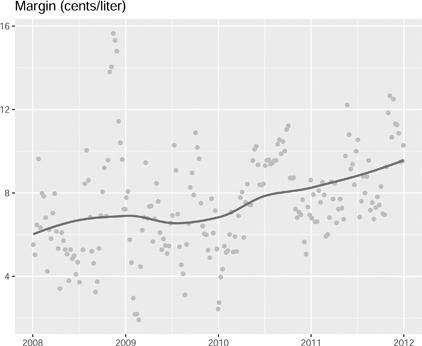

# 7 반복 게임 (Repeated Games)

DOI: [10.1201/b23262-7](./https___doi.org_10.1201_b23262-7.md)

## 7.1 서론

반복 게임은 경쟁 및 경쟁 정책에 대한 우리의 생각을 조정하는 데 사용되는 렌즈입니다. 1990년대 후반에 경쟁 정책의 경제학은 꽤 극적으로 변화했습니다. 게임 이론과 구조적 계량 경제학은 독점 금지 당국에 합병을 모델링하기 위한 새로운 도구를 제공했습니다. [3장](./11-chapter3.md)과 [4장](./12-chapter4.md)에서는 소매 합병의 영향을 분석하는 데 사용되는 방법을 소개합니다. 이러한 모델이 경쟁을 이해하고 합병의 결과를 예측하는 우리의 능력을 실질적으로 향상시켰지만, 무언가 완전하지는 않았습니다. 담합적인 가격 책정이 있는 시장과 담합에 대한 우리의 접근 방식은 초기 단계에 머물러 있었습니다. 새로운 모델을 사용하여 담합을 분석하는 것은 네모난 못을 둥근 구멍에 억지로 밀어넣는 것과 같았습니다.

여기에 제시된 담합적 가격 책정에 대한 분석은 두 편의 논문에 영향을 받았습니다. 첫째, 경제학자 네이선 밀러(Nathan Miller), 글로리아 슈(Gloria Sheu), 매튜 와인버그(Matthew Weinberg)는 미국 맥주 산업을 분석할 때 우리의 새로운 모델이 제대로 작동하지 않는다는 설득력 있는 증거를 제시했습니다. 그들의 논문인 “과점적 가격 선도 및 합병: 미국 맥주 산업(Oligopolistic Price Leadership and Mergers: The United States Beer Industry)”은 2021년 *American Economic Review*에 발표되었으며, 경쟁 분석에 필요한 모델에 대한 대대적인 재고를 제안했습니다. 둘째, 캐나다와 호주 경제학자인 데이비드 번(David Byrne)과 닉 드 로스(Nic de Roos)는 서호주 퍼스(Perth)의 소매 휘발유 시장에서 가격 책정을 분석했습니다. 그들의 논문 “조정 학습: 소매 휘발유 연구(Learning to Coordinate: A study in retail gasoline)”는 2019년 *American Economic Review*에 발표되었습니다. 저자들은 많은 수의 소매업체의 일일 가격 데이터를 사용하여 가격 선도 및 조정의 증거를 보여줍니다.

이 장에서는 반복 게임의 렌즈를 사용하여 기업의 행동과 가격 책정을 설명하는 방법을 보여줍니다. 반복적인 상호 작용은 전략적 관계를 꽤 극적으로 변화시킵니다. 단일 실행 게임(single shot game)에서 플레이어는 자신의 행동에 대한 결과를 책임질 필요가 없습니다. 하지만 반복 게임에서는 책임져야 합니다.

퍼스 소매 휘발유 주유소의 데이터를 사용하여, 이 장에서는 반복적인 상호 작용을 기반으로 한 경쟁 및 가격 책정의 두 가지 모델을 제시합니다. 첫 번째 모델은 [3장](./11-chapter3.md)에서 소개된 표준 정적 가격 책정 모델(static pricing model)입니다. 두 번째는 담합적 과점 가격 책정 모델(collusive oligopoly pricing model)입니다. 이 모델은 기업이 속임수를 쓰고 더 낮은 가격을 선택하려는 인센티브에 의해 가격 책정이 어떻게 제한되는지 보여줍니다. 이 장에서는 2008년 마진이 낮았던 시기에 퍼스 주유소의 데이터를 사용하여 파라미터를 추정합니다. 그런 다음 담합 모델에서 예측한 이윤 마진과 2012년 동일한 기업의 실제 이윤 마진을 비교합니다. 좋은 의도이긴 했지만, 주 정부의 가격 투명성 규제로 인해 퍼스의 운전자들은 휘발유에 더 많은 비용을 지불하게 된 것 같습니다.

이 장에서는 두 가지 가격 책정 행동 모델을 각각 사용하여 합병 시뮬레이션을 실행합니다. 합병의 예상되는 영향을 분석할 때 이러한 변화를 설명해야 한다고 제안합니다. 반복 게임 모델을 사용하여 예측한 가격 인상 폭은 이 책의 앞부분에서 제시한 표준 정적 게임을 사용하여 예측한 가격 인상 폭보다 훨씬 높을 수 있습니다.

## 7.2 반복되는 죄수의 딜레마

죄수의 딜레마는 게임 이론에서 유명한 게임입니다. 이 게임은 예측된 결과가 두 플레이어 모두에게 최선의 결과가 아닐 수도 있음을 보여줍니다. 즉 파레토 효율적이지 않을 수 있습니다. 이 결과의 얼마나 많은 부분이 게임 설정에 기인하는 것일까요? 만약 플레이어들이 서로의 행동을 고려해야 한다면 어떨까요? 만약 게임이 반복된다면 어떨까요?

이 절에서는 죄수의 딜레마 게임을 제시하고 동태성이 추가될 때 내쉬 균형이 어떻게 변하는지 보여줍니다. 특히 언제 협력(Cooperate)을 플레이하는 것이 부분 게임 완전 내쉬 균형(subgame perfect Nash equilibrium)으로 지원되는지 보여줍니다.

### 7.2.1 죄수의 딜레마

게임 설정은 다음과 같습니다. [1장](./09-chapter1.md)과 [2장](./10-chapter2.md)에서 제시된 게임의 전략 레이블을 변경하겠습니다.

- 플레이어: 플레이어 1 및 플레이어 2
- 전략: 협력(Cooperate) 또는 배신(Defect)
- 보수(Payoffs):
  1.  {협력, 협력}: {3, 3}
  2.  {협력, 배신}: {0, 5}
  3.  {배신, 협력}: {5, 0}
  4.  {배신, 배신}: {2, 2}

이 게임에서 {협력, 협력} 결과를 통해 두 사람 모두 더 나아질 수 있음에도 불구하고, 내쉬 균형은 {배신, 배신}입니다. 문제는 게임 설정에 약간의 변화를 주는 것이 예측되는 결과를 변화시키는지 여부입니다.

### 7.2.2 정규형 표현 (Normal Form Representation)

[1장](./09-chapter1.md)에서는 게임의 정규형 표현을 소개했습니다.

[표 7.1](./16-chapter7.md#tbl7_1)은 죄수의 딜레마 게임의 **정규형(normal form)**을 보여줍니다. 우리는 두 번째 열을 보고 플레이어 1이 첫 번째 행(위)을 선택하는 것이 나은지 두 번째 행(아래)을 선택하는 것이 나은지 확인함으로써 내쉬 균형을 결정할 수 있습니다. 플레이어 1은 첫 번째 행을 선택하면 아무것도 얻지 못하고 두 번째 행을 선택하면 2를 얻습니다. 마찬가지로 플레이어 2의 경우 두 번째 행을 보고 플레이어 2가 첫 번째 열을 원하는지 두 번째 열을 원하는지 확인함으로써 내쉬 균형을 확인할 수 있습니다. 플레이어 2는 첫 번째 열에서 0을 얻고 두 번째 열에서 2를 얻습니다. 따라서 {배신, 배신}은 내쉬 균형입니다.

**[표 7.1](chapter7) 두 명의 플레이어, 플레이어 1과 플레이어 2가 있는 죄수의 딜레마 게임의 정규형 표현입니다. 플레이어 1의 경우 그들의 선택은 행이며 그들의 보수는 각 셀에 첫 번째로 나열됩니다.**
| P1,P2 | 협력 (Cooperate) | 배신 (Defect) |
| --------- | --------- | ------ |
| 협력 (Cooperate) | 3, 3 | 0, 5 |
| 배신 (Defect) | 5, 0 | 2, 2 |

### 7.2.3 유한 반복 게임

정적 죄수의 딜레마(위)가 유한한 횟수(_T_ 회)로 반복되는 형태의 게임을 고려해 보겠습니다. 예를 들어 20기가 될 수 있습니다.

게임이 달라집니다. 플레이어는 동일하지만 전략은 완전히 다릅니다. **전략**은 게임의 전체 역사에서부터 행동으로 매핑하는 함수입니다. 1기에서 전체 역사는 아무것도 없으므로 전략은 단순히 행동 선택 {협력, 배신}입니다. 2기에서 전체 역사는 1기의 결과가 무엇이든 그것이 됩니다. 위에서 나열한 바와 같이 4가지 가능성이 있습니다. 각 가능성에서, 전략은 플레이어가 선택할 행동을 명시합니다. 3기에는 상황이 훨씬 더 복잡해집니다. 이제 역사에는 16가지 가능성이 포함됩니다. 1기의 4가지 가능한 결과 각각에 대해 2기에는 4가지 가능한 결과가 있습니다. 다시 한번 전략은 16개의 가능한 각 역사가 주어졌을 때 플레이어가 3기에서 무엇을 할 것인지를 명시합니다. 짐작할 수 있듯이, 20기의 게임의 경우 엄청나게 많은 가능성이 존재합니다.

이 게임의 내쉬 균형은 무엇일까요? 무엇이 균형이 아닌지 묻는 것이 아마도 더 나을 것입니다. 한 플레이어가 마지막 기에 '협력'을 플레이하는 모든 전략 세트를 고려해 보십시오. 마지막 기의 게임은 본질적으로 1기 게임과 동일합니다. 우리는 1기 게임의 분석을 통해 최적 반응이 마지막 기에 '배신'을 플레이하는 전략이어야 한다는 것을 알고 있습니다. 이제 플레이어가 마지막 기에는 항상 '배신'을 플레이하지만 마지막에서 두 번째 기에는 '협력'을 플레이하는 전략 세트를 고려해 보십시오. 이번에도 최적 반응은 플레이어가 마지막에서 두 번째 기에 '배신'을 플레이하고 마지막 기에도 '배신'을 플레이한다는 것을 명시하는 전략이어야 합니다. 이러한 논리를 사용하면 내쉬 균형은 모든 기에 '배신'을 플레이하는 것과 관련이 있음을 보여줄 수 있습니다. 다시 말해, 게임에 많은 복잡성을 추가했음에도 불구하고 예측은 변하지 않습니다.

### 7.2.4 무한 반복 죄수의 딜레마

게임에 한 가지 변화를 더 추가하면 어떻게 될까요? 이번에는 위의 게임을 무한한 횟수만큼 반복합니다. 이것이 합리적인 변화라고 생각하십니까? 무한은 꽤 긴 시간입니다. 전략적 행동이 변하기 위해서는 문자 그대로 무한한 기가 필요한 것이 아니라, 단지 플레이어가 언제 게임이 끝날지 불확실하기만 하면 됩니다. 유한 기간 게임은 모든 플레이어가 게임이 정확히 언제 끝날지 아는 게임으로 생각하는 것이 더 좋습니다. 반면에 무한 반복 게임은 플레이어가 게임이 정확히 언제 끝날지 모르는 게임입니다.

이 경우를 위해, 우리는 보수에 또 다른 파라미터 r∈\[0,1)을 추가해야 합니다. 이것은 할인율을 나타내며 0과 1 사이의 숫자입니다. 할인율을 추가하는 실용적인 이유는 기(period)가 무한할 때는 게임을 분석할 수 없기 때문입니다. 보수는 모든 가능한 전략 하에서 무한대가 됩니다. 미적분학에서 기억하시겠지만, 감소하지 않는 수열의 무한합은 무한대입니다. 하지만 할인율을 사용하면, 무한합이 유한한 숫자로 합산되도록 충분히 빠르게 감소하는 감소 수열을 만들 수 있습니다. 특정 전략 *s*가 주어졌을 때 플레이어의 효용은 매 기의 보수의 할인된 수열의 무한합입니다.

U(s)\=∑t\=1∞rtπt(s)(7.1)

여기서 *s*는 전략입니다. 만약 각 기의 플레이어에 대한 보수(πt(s))가 유계(bounded)이고 미래의 보수가 현재보다 낮아지도록(r<1) 하는 할인율이 있다고 가정하면 무한합인 U(s)<∞가 됩니다. 이제 다른 전략은 다른 보수를 가질 수 있기 때문에 게임을 분석할 수 있습니다.

우리는 또한 매우 유용한 트릭을 사용할 수 있습니다. 만약 πt(s)\=π(s)라면, 즉 주어진 전략 *s*에 대해 매 기의 보수가 일정하고 *r*이 엄밀히 0과 1 사이라면, 우리는 다음과 같은 단순화를 얻을 수 있습니다.

U(s)\=π(s)1−r(7.2)

따라서 할인율이 0.9라면, 전략 *s*에 대한 총 보수는 매 기 보수의 10배입니다.

이 할인율은 어디에서 온 것일까요? 그것은 무엇을 의미할까요? 직관적으로 생각하는 방법은 이자율로 생각하는 것입니다. 사실, 1 마이너스 이자율입니다. 우리가 동태적 결정에 대해 생각할 때 의사 결정권자가 미래 결정의 가치를 결정할 때 이자율을 참고하는 것은 타당합니다. 여기서는 할인율을 게임이 다음 기로 계속될 확률을 나타내는 것으로 생각하는 것이 합리적일 수 있습니다.

### 7.2.5 내쉬 균형으로서의 협력

무한히 반복되는 죄수의 딜레마의 내쉬 균형으로 두 플레이어가 매 기마다 협력하도록 지원할 수 있을까요? 예.

이를 지원하는 전략을 구축하기 위해 우리는 플레이어가 배신을 처벌할 수 있도록 해야 합니다. 이러한 특징을 가진 많은 전략이 있지만 간단한 것을 **가혹한 보복 전략(grim-trigger strategy)**이라고 합니다. 이 전략에서 플레이어는 역사에 다른 플레이어 중 하나가 '배신'을 한 기록이 포함되지 않는 한 '협력'을 플레이합니다. 배신 기록이 있는 경우, 플레이어는 영원히 '배신'을 플레이합니다. "가혹한(grim)"은 위협이 최악의 종류라는 사실 때문이며 "촉발(trigger)"은 전략이 행동을 변화시키는 단순한 이벤트를 수반한다는 사실 때문입니다.

전략은 게임의 전체 역사에서 각 기마다 '배신' 또는 '협력'의 선택으로 매핑됩니다. 그것은 각 기 *t*에 대한 함수들의 집합인 {st}t\=1∞입니다. 각 함수는 st:Ht→{Defect,Cooperate}이며, 여기서 *Ht*는 이전 t−1 기 동안 일어날 수 있었던 가능한 행동의 전체 역사입니다. 이 경우 *Ht*에 '배신'이 포함되어 있으면 st(Ht)\=Defect이고, 그렇지 않으면 st(Ht)\=Cooperate입니다.

가혹한 보복(grim-trigger)이 부분 게임 완전 내쉬 균형입니까? 두 플레이어 모두 가혹한 보복 전략을 사용하는 경우를 생각해 보십시오. 보수는 이전 섹션에 나열된 대로입니다.

1. 가혹한 보복 (Grim-trigger): 31−r
2. _t_ 기에 '배신(Defect)'을 플레이할 경우: 5+r(21−r)

따라서 상대 플레이어가 '협력'을 플레이하는 가혹한 보복 전략에 맞서, 매 기마다 '협력'을 플레이하면 매 기마다 3을 얻습니다. 만약 한 기에 '배신'을 플레이하면, 해당 기에는 5를 얻지만 가혹한 보복 전략이 발동하여 매 기마다 2를 얻게 됩니다. 가혹한 보복이 균형 선택이 되려면 선택 (1)이 선택 (2)보다 높은 보수를 제공해야 합니다.

다음 부등식이 성립하면 플레이어는 가혹한 보복을 플레이하는 것을 선호합니다.

31−r\>5+r(21−r)3\>5(1−r)+r23\>5−5r+2r0\>2−3r3r\>2r\>23(7.3)

플레이어가 미래에 대해 충분히 관심을 갖는다면(즉, *r*이 충분히 높다면), 그들은 가혹한 보복에 맞서 '협력'을 플레이할 것입니다. 그들이 매우 근시안적이라면(*r*이 낮다면) 그들은 속임수를 써서 오늘 높은 보수를 취할 것입니다.

마무리를 위해 두 플레이어 모두 방아쇠(trigger)가 당겨진 후에도 계속해서 '배신'을 플레이할지 확인해야 합니다. 위의 논의를 되돌아보면 이것이 사실임에 틀림없음을 알 수 있습니다.

## 7.3 베르트랑 경쟁

이 절에서는 [3장](./11-chapter3.md)에서 제시된 베르트랑 가격 책정 게임을 다시 살펴봅니다. 문헌에서 더 일반적인 가정인 로짓(logit) 수요를 가정하고 이 모델을 제시합니다. 이 모델을 사용하여 호주 퍼스의 소매 휘발유 데이터를 바탕으로 수요의 파라미터를 추정합니다.

### 7.3.1 두 기업 모델

가격을 선택하는 두 개의 기업이 있는 모델을 생각해 보십시오. 두 기업은 비슷한 제품을 판매하지만 정확히 같지는 않습니다. 예를 들어, 제품은 다른 장소에 위치한 상점일 수 있습니다. 제품 간의 차별화는 각 기업에 어느 정도의 시장 지배력을 유도하기에 충분합니다. 즉 소폭의 가격 인상에 대해 기업은 모든 고객을 잃지는 않을 것입니다. 아래에서는 이 모델을 사용하여 소매 휘발유를 분석할 것입니다. 휘발유 자체는 말 그대로 같은 파이프에서 나오기 때문에 동일합니다.[1](./16-chapter7.md#fn7_1) 주유소 간에 다른 점은 위치와 브랜드입니다.

이 모델에서 기업 1은 마진을 최대화하기 위해 자신의 가격(\_p_1)을 선택합니다. 여기서 마진은 가격에서 비용(\_c_1)을 뺀 것에 기업 1의 점유율(s1(p1,p2))을 곱한 것입니다.

maxp1(p1−c1)s1(p1,p2)(7.4)

로짓 모델은 수요가 다음과 같은 형태를 띤다고 가정합니다.

s1(p1,p2)\=exp(δ1)exp(δ1)+exp(δ2)(7.5)

여기서 δ1\=−α1p1+ξ1 이고 δ2\=−α2p2+ξ2 입니다. 이 모델에서 기업 1에 대한 수요는 기업 특정 가치인 *ξ_1과 기업 1의 가격인 \_p_1에 의해 결정됩니다. 가격에 대한 민감도는 파라미터 *α_1에 의해 결정됩니다.

### 7.3.2 _J_ 개 기업 모델

_J_ 개의 기업과 로짓 수요가 있다고 가정해 봅시다.

δj\=−αjpj+ξj(7.6)

sj(pj,p−j)\=exp(δj)1+∑j′\=1Jexp(δj′)(7.7)

\_\_\_\_\_\_\_\_\_\_\_\_\_\_\_\_\_ [1](./16-chapter7.md#fn7_17b)일부 주유소는 마지막에 첨가물을 추가할 수도 있습니다.

여기서 *pj*는 기업 *j*가 부과하는 가격, *αj*는 기업 _j_ 고객의 가격 민감도를 나타내며, *ξj*는 수요를 결정하는 가격 이외의 일련의 특성입니다. −j 기호는 *j*가 아닌 다른 모든 기업을 의미합니다.

### 7.3.3 **R**을 이용한 내쉬 균형

다음은 로짓 수요 시스템을 사용하여 내쉬 균형을 결정하는 함수들입니다. 함수 f*share()는 *ξ*와 *α\_, 그리고 가격의 벡터가 주어졌을 때 로짓 모델에서 점유율을 결정합니다. 함수 pi_f()는 기업 이윤의 벡터를 결정하는 반면, pi_i()는 다른 기업들의 가격 벡터가 주어졌을 때 기업 *i*의 이윤을 결정합니다. 함수 pi_i_opt()는 가격 집합에 대한 기업 *i*의 최적 반응을 결정하고, pi_opt()는 최적 반응의 벡터를 결정합니다. 함수 ne_f()는 내쉬 균형 가격 벡터를 결정합니다.

```R
>   fshare = function(xi, price, alpha) {
+     delta = xi - alpha*price
+     expdelta = c(1,exp(delta))
+     return((expdelta/sum(expdelta))[-1])
+   }
>   pif = function(xi, price, alpha, cost) {
+     return((price - cost)*fshare(xi, price, alpha))
+   }
>   pii = function(i, pi, xi, price, alpha, cost) {
+     price[i] = pi
+     return(pif(xi, price, alpha, cost)[i])
+   }
>   piiopt = function(i, xi, price, alpha, cost) {
+     ai = optimize(f=pii, interval=c(0, 400),
+                   i = i,
+                   xi = xi,
+                   price = price,
+                   cost = cost,
+                   alpha = alpha,
+                   maximum = TRUE)
+     return(ai$maximum)
+   }
>   piopt = function(xi, price, alpha, cost) {
+     N = length(xi)
+     pricenew = rep(NA, N)
+     for(i in 1:N) {
+       pricenew[i] = piiopt(i,xi,price,alpha,cost)
+     }
+     return(pricenew)
+   }
```

내쉬 균형은 [3장](./11-chapter3.md)에서 꾸르노 모델의 균형을 결정하는 데 사용했던 유사한 반복 방식을 사용하여 결정됩니다. 가격 선택의 수열이 언제 수렴하는지 결정하기 위해 while()을 사용합니다.

```R
> nef = function(xi, price, alpha, cost,
+                tol=1e-10, maxiter=10000,
+                trace=0) {
+   price0 = price
+   diff = sum(abs(price0))
+   iter = 1
+   converge = FALSE
+   while(diff > tol & iter < maxiter) {
+     price1 = piopt(xi, price0, alpha, cost)
+     diff = sum(abs(price1 - price0))
+     price0 = price1
+     if(trace > 0) {
+       print(diff)
+       print(iter)
+     }
+     iter = iter + 1
+   }
+   if(diff < tol) {converge=TRUE}
+   return(list(price=price1,converge=converge))
+ }
```

## 7.4 실증 분석: **R**을 활용한 소매 휘발유 가격 책정

이 절에서는 퍼스의 소매 휘발유 시장이 경쟁적으로 가격이 책정되어 있다고(즉, 정적인 베르트랑 내쉬 균형과 일치한다고) 가정하고 모델의 파라미터를 추정합니다.

### 7.4.1 퍼스 휘발유 가격 데이터

[그림 7.1](./16-chapter7.md#fig7_1)은 주유소의 주별 평균 마진을 보여줍니다. 2008년과 2009년에는 마진 변동이 많지만 평균은 꽤 안정적으로 유지됩니다. 2010년에는 상황이 달라져 마진이 꾸준히 증가하는 것으로 보입니다. 그 이유는 무엇일까요?



[그림 7.1](chapter7) 2008년, 2009년, 2010년 및 2011년의 주간 마진 도표. 2006년부터 2010년까지 변동이 많지만 가격은 같은 평균 근처에서 움직이고 있습니다. 2010년 이후에는 평균 가격이 오르기 시작합니다.

### 7.4.2 파라미터 추정

아래 분석에서는 브랜드 수준으로 합산하여 브랜드 간의 가격 책정 게임을 추정합니다. 마진과 점유율이 정적인 가격 책정 게임의 내쉬 균형 결과라고 가정합니다. 데이터는 일일 가격, 일일 도매 가격, 주유소의 위치 및 각 브랜드의 주유소 수를 제공합니다.

```R
> file = paste0(dir, "perthgasdata.csv")
> dt = fread(file)
> dt[,.(
+   margin = mean(margin),
+   date = mean(date)
+   ),
+         by = c("week", "year")] |>
+   ggplot(aes(x=date, y=margin)) +
+   geompoint(color = "gray") +
+   geomsmooth(se = FALSE) +
+   labs(title = "Margin (cents/liter)",
+        x = "",
+        y = "")
```

기업의 한계 비용을 추정하기 위해, 퍼스 남쪽에 위치한 크위나나(Kwinana) 터미널과 주유소 사이의 거리에 대해 가격을 회귀 분석합니다. 거리에 따른 가격 변동은 연료의 트럭 운송 비용에 의해 결정된다고 가정합니다. 거리에 대한 2차항, 브랜드 더미 및 주 더미를 사용하여 각 주유소의 한계 비용을 추정합니다. 이 값들은 터미널 가격에 추가되어 각 주유소의 예상 비용을 산출합니다. 수량 정보에 접근할 수 없으므로 브랜드 점유율은 해당 브랜드가 보유한 주유소의 비율과 같다고 가정합니다.

모델에는 각 기업에 대해 두 가지 파라미터의 추정이 필요합니다. 가격 민감도 파라미터인 *αj*와 관찰되지 않은 품질 파라미터인 *ξj*입니다. 첫 번째는 수요가 로짓 모델에 의해 결정될 때 기업의 1계 조건(first order condition)에서 구해집니다.

αj\=1(pj−cj)(1−sj)(7.8)

두 번째 값은 로짓 수요를 역산하여 관찰된 가격, 점유율 및 파라미터 *αj*의 함수로서 관찰되지 않은 특성을 구함으로써 얻어집니다.

ξj\=αjpj+log(sj)−log(s0)(7.9)

여기서 \_s_0은 외부 대안의 점유율(outside share)입니다.

### 7.4.3 파라미터 추정치

식 (7.8)과 (7.9)로부터 우리는 관찰된 가격과 점유율로부터 각 기업의 *α*와 *ξ*를 결정합니다. 우리는 관찰된 가격과 점유율이 정적인 베르트랑 내쉬 균형의 결과로 결정된다고 가정하고 있습니다. 또한 외부 재화(outside good)가 독립 주유소와 소규모 브랜드인 모빌(Mobil), 웨스코(Wesco), 배터 초이스(Better Choice)라고 가정합니다. 마지막으로, 칼텍스(Caltex)와 칼텍스 울워스(Caltex Woolworths)가 동일한 기업인 것처럼 가격 결정 결정을 내린다고 가정합니다.

이 분석을 수행하기 위해 우리는 연간 평균 가격, 비용, 마진 및 점유율로 집계할 것입니다.

첫 번째 단계는 우리가 사용할 변수와 연도(2008)를 선택하는 것입니다. 분석을 더 쉽게 하기 위해 일부 브랜드 이름도 재정의합니다.

```R
> dt2 = dt |>
+   filter(year == 2008) |>
+   select(
+     date,
+     store = TRADINGNAME,
+     brand = BRANDDESCRIPTION,
+     price = PRODUCTPRICE,
+     margin
+     )
> dt2$brand[grep("Caltex", dt2$brand)] = "Caltex"
> dt2$brand[which(dt2$brand %in% c("Independent",
+                                 "Mobil",
+                                 "Wesco",
+                                 "Better Choice"))] = "Independent"
```

다음 단계는 각 브랜드의 주유소 수를 파악한 후 각 브랜드의 점유율을 계산하여 점유율을 도출하는 것입니다.

```R
> stores = dt2[, .N, by = brand]
> stores$shares = stores$N/sum(stores$N)
> dt2 = merge(dt2, stores, by = c("brand"))
```

다음 단계에서는 2008년의 가격, 마진, 점유율 및 비용을 브랜드 수준으로 평균 낸 데이터 세트를 만듭니다. 또한 각 브랜드의 *α*를 계산합니다.

```R
> dt3 = dt2[, .(
+   price = mean(price, na.rm = TRUE),
+   margin = mean(margin, na.rm = TRUE),
+   share = mean(shares, na.rm = TRUE),
+   cost = mean(-margin + price, na.rm = TRUE),
+   alpha = 1/(mean(margin, na.rm = TRUE)*(1 - mean(shares,
+                                                   na.rm = TRUE)))
+   ),
+          by = brand]
```

다음은 각 브랜드에 대한 *ξ*를 계산하는 것입니다. 이 계산은 독립 주유소가 외부 대안이라고 가정합니다.

```R
> indexind = grep("Independent", dt3$brand)
> dt3$xi = NA
> dt3$xi[-indexind] =
+   dt3$alpha[-indexind]*dt3$price[-indexind] +
+   log(dt3$share[-indexind]) -
+   log(dt3$share[indexind])
```

마지막 단계는 함수 ne_f()를 사용하여 내쉬 균형을 결정하는 것입니다.

```R
> af = nef(dt3$xi[-indexind],
+            dt3$price[-indexind],
+            dt3$alpha[-indexind],
+            dt3$cost[-indexind])
```

[표 7.2](./16-chapter7.md#tbl7_2)는 각 브랜드에 대한 _α_ 및 *ξ*의 추정치를 보여줍니다. 이 값들은 관찰된 균형 마진과 관찰된 균형 점유율을 조정합니다. BP의 고객들이 Caltex 고객보다 가격에 덜 민감하기 때문에, BP는 약간 낮은 점유율을 보이면서도 더 높은 마진을 얻을 수 있습니다.

**[표 7.2](chapter7) 이 표는 가격, 마진, 시장 점유율 및 *α*와 *ξ*에 대한 추정치를 보여줍니다. BP 고객들이 Caltex 고객보다 가격에 덜 민감하기 때문에 BP는 약간 낮은 점유율로 더 높은 마진을 얻을 수 있습니다.**
| 브랜드 (Brand) | 가격 (Price) | 비용 (Cost) | 점유율 (Share) | _α_ | _ξ_ | |
| ----- | ------------- | ------ | ------ | ---- | ---- | ----- |
| 1 | Ampol | 153.70 | 142.53 | 0.02 | 0.09 | 12.93 |
| 2 | BP | 148.53 | 140.77 | 0.23 | 0.17 | 26.16 |
| 3 | Caltex | 146.14 | 139.46 | 0.30 | 0.21 | 32.56 |
| 4 | Coles Express | 144.65 | 139.92 | 0.10 | 0.23 | 34.28 |
| 5 | Eagle | 152.32 | 147.32 | 0.00 | 0.20 | 26.47 |
| 6 | Gull | 144.00 | 138.06 | 0.11 | 0.19 | 27.70 |
| 7 | Liberty | 145.23 | 138.06 | 0.03 | 0.14 | 19.70 |
| 8 | Peak | 139.98 | 136.33 | 0.04 | 0.29 | 39.42 |
| 9 | Shell | 152.11 | 142.57 | 0.07 | 0.11 | 17.20 |
| 10 | United | 138.25 | 135.42 | 0.02 | 0.36 | 48.59 |

대수적 방식을 사용한 파라미터 추정치와 내쉬 균형을 결정하는 수치적 방식을 사용한 파라미터 추정치를 비교할 수 있습니까? 그것들이 정확히 똑같습니까? 똑같을 것으로 예상하셨습니까?

## 7.5 반복되는 과점 (Repeated Oligopoly)

차별화된 재화의 표준 베르트랑 가격 경쟁 모델이 시사하는 바는 우리가 기대하는 결과가 완전 경쟁보다는 높지만 담합은 아니라는 것입니다. 정적 게임에서, 기업들은 항상 이윤을 늘리기 위해 "속임수(cheat)"를 쓰고 가격을 낮추는 것이 낫습니다. 그렇다면 문제는 기업들이 반복적으로 상호 작용할 때 담합을 볼 수 있을 것으로 기대해야 하는가입니다.

이 절에서는 정적 베르트랑 게임을 무한 반복 설정으로 조정하고 담합 하에서 최적의 가격 책정을 결정합니다.

### 7.5.1 담합 균형

매 기마다 정적 균형 베르트랑 가격을 선택하는 것은 무한 반복 게임의 부분 게임 완전 내쉬 균형으로 지원될 수 있습니다. 죄수의 딜레마와 마찬가지로 매 기마다 배신(Defect)을 플레이하는 것은 항상 무방합니다.

이러한 점을 고려할 때, 우리는 어떠한 상황에서 가혹한 보복 전략(trigger strategy)이 담합을 지원할 수 있는지 묻습니다. *πN*을 정적 게임의 내쉬 균형에서의 기당 이윤, *πC*를 담합적 이윤, *πD*를 상대 기업이 담합적 가격을 제시할 때 배신하여 최적의 가격을 선택함으로써 얻는 이윤이라고 합시다. 우리는 πD\>πC\>πN을 갖게 됩니다. 이것은 죄수의 딜레마와 정확히 같습니다.

죄수의 딜레마와 마찬가지로 다음 부등식이 성립하면 담합은 가혹한 보복 전략(trigger strategy)에 의해 지원될 수 있습니다.

πC1−r\>πD+r(πN1−r)πC\>(1−r)πD+rπNr(πD−πN)\>πD−πCr\>πD−πCπD−πN(7.10)

분모의 숫자가 분자의 숫자보다 큽니다. 따라서 충분히 큰 *r*에 대해 담합은 무한히 반복되는 과점 게임의 내쉬 균형입니다.

### 7.5.2 담합의 식별

정책적 또는 학술적 목적으로 담합을 식별하는 것은 형사 처벌을 위해 담합을 식별하는 것과 상당히 다릅니다. 형사 사건에는 확실한 증거가 필요하며 멋진 계량 경제학적 사양이 필요한 것이 아닙니다. 최고의 증거로는 신뢰할 수 있는 증인, 오디오 녹음, 비디오 녹화, 서면 문서 등이 있습니다. 형사 담합 사건을 기소하는 데 경제학이 크게 관여하지 않는다는 사실을 알면 놀랄 수도 있습니다. 위장 잠입 수사, 도청 등은 있지만 경제학은 없습니다. 형사 사건이 입증되고 나면 경제학자들은 피해액을 추정하기 위해 불려갑니다.[2](./16-chapter7.md#fn7_2) 이 경우에도 담합을 파악하는 것은 그리 어렵지 않습니다. 적어도 FBI가 이미 임무를 완수했다는 점을 고려하면 그리 어렵지 않습니다. 사건 기록에는 담합이 발생한 날짜와 (바라건대) 담합이 발생하지 않은 날짜가 포함되어 있습니다. 계량 경제학자에게 어려운 부분은 가격 차이의 어느 부분이 담합에 의한 것이고 어느 부분이 다른 변화에 의한 것인지 알아내는 것입니다.

FBI의 도움 없이 담합을 파악하는 것은 어렵습니다. 시장에서 가격과 수량을 관찰하기 위해 수요의 탄력성을 추정할 수 있을 만큼 충분한 외생적 변동(exogenous variation)이 있습니다. 상품이 차별화되어 있다면 베르트랑 내쉬 균형을 사용하여 한계 비용과 마크업을 식별할 수 있습니다. 정적 균형 또는 동태적 담합 균형을 가정하면 마크업과 한계 비용의 추정치가 달라지지만, 다른 정보 없이는 데이터를 통해 그 차이를 구별할 수 없습니다. 한계 비용에 대한 데이터가 있다면 상황은 훨씬 쉬워집니다. 우리가 제안한 행동 가정(behavioral assumptions)에서 도출된 한계 비용을 일치시키고 어느 것이 더 잘 맞는지 확인할 수 있습니다. 대안적으로 법원이 정적 균형에 의해 가격이 결정된 기간이 있었다고 알려주면 해당 기간을 사용하여 한계 비용을 식별할 수 있습니다. 그런 다음 정적 균형에서 도출된 마크업과 관찰된 마크업을 비교하여 담합과 관련된 **초과 마크업(super markups)**을 추정할 수 있습니다.[3](./16-chapter7.md#fn7_3)

\_\_\_\_\_\_\_\_\_\_\_\_\_\_\_\_\_ [2](./16-chapter7.md#fn7_27b)이것은 보통 담합으로 인해 손실된 소비자 잉여와 같은 금액입니다.

[3](./16-chapter7.md#fn7_37b)이들은 정적 베르트랑 게임의 균형과 일치하는 가격을 선택하는 기업에서 기대하는 것보다 더 큰 마크업입니다.

### 7.5.3 초과 마크업 선택

담합적 가격을 선택하는 것은 기업들에게는 꽤 단순한 문제처럼 보입니다. 담합적 가격은 독점이 부과할 가격과 같아야 합니다. 그렇게 서두르지 마세요! 물론 모든 기업이 하나의 단일 기업처럼 행동한다면 독점 가격이 최적일 것입니다. 그러나 그들은 하나의 기업이 아니며 그렇게 행동하지도 않습니다. 매 기마다 각 기업은 다른 모든 사람들이 담합적 가격을 부과하는 동안 거래를 어기고 더 낮은 가격을 선택하여 점유율을 얻는 것을 선호할 수 있습니다.

담합적 가격은 다음 극대화 문제의 해입니다. 초과 마크업(smu)은 한계 비용이 영(0)으로 정규화된 곳에서 담합적 가격과 정적 내쉬 균형 가격 간의 차이입니다.

maxpcπc(pc)s.t.πd(pc)+rπNE1−r≤πc(pc)1−r(7.11)

여기서 πc(pc)는 모든 사람이 *pc*를 부과할 때 한 기업이 얻는 기당 이윤이고, πd(pc)는 다른 모든 사람이 *pc*를 부과하고 있다는 것을 알면서 한 기업이 이탈하여 더 낮은 가격을 부과할 수 있을 때의 기당 이윤이며, πNE는 정적 베르트랑 내쉬 균형에서의 기당 이윤입니다. 미래의 기에 대한 이윤에 대한 기업의 선호도는 파라미터 *r*에 의해 결정됩니다.

이 문제는 모든 기업이 합의를 어길 의향이 없는 한, 기업은 원하는 담합적 가격을 자유롭게 부과할 수 있음을 나타냅니다. 일반적으로 가격이 높을수록 합의를 어길 때 얻는 가치가 커진다는 것을 알 수 있습니다.

일반적으로 담합하는 기업들은 원하는 가격을 마음대로 부과할 수 없으며 사실 독점 가격조차 부과할 수 없습니다. 그들은 수요 시스템과 합의를 위반하려는 기업의 유인에 의해 제한을 받습니다.

### 7.5.4 **R**에서 담합 가격 추정하기

다음 함수들은 수요가 로짓 모델에 의해 결정될 때 담합 가격을 결정하는 데 사용됩니다. 담합 가격은 내쉬 균형 가격에 **초과 마크업**을 더한 것과 같다고 가정합니다. f_smu_share() 함수는 특정 smu에서의 벡터 점유율을 결정합니다. pi_d() 함수는 특정 smu가 주어졌을 때 최적 이탈 이윤을 결정합니다. 이는 선택될 수 있는 smu에 제약을 둡니다.

```R
>   fsmushare = function(smu, xi, price, alpha) {
+     fshare(xi, price + smu, alpha)
+   }
>   pid = function(pd, i, smu, xi, price, alpha, cost) {
+     price = price + smu
+     price[i] = pd
+     share = fshare(xi, price, alpha)
+     return(share[i]*(pd - cost[i]))
+   }
```

pi_smu() 함수는 특정 smu에 대한 이윤 벡터를 결정하며 pi_smu_int()는 optim()을 위한 중간 함수입니다.

```R
>   pismu = function(smu, xi, price, alpha, cost,
+                    r, lambda, pine) {
+     N = length(xi)
+     pic = (price + smu - cost)*fsmushare(smu, xi, price,
+                                          alpha)
+     PId = matrix(NA, N, 2)
+     for(i in 1:N) {
+       ai = optimize(f = pid,
+                     interval = c(0,2000),
+                     i = i,
+                     smu = smu,
+                     xi = xi,
+                     price = price,
+                     alpha = alpha,
+                     cost = cost,
+                     maximum = TRUE)
+       PId[i,1] = i
+       PId[i,2] = ai$objective
+       #print(i)
+     }
+     return(pic -
+              lambda*(((1 - r)*PId[,2] +
+              r*pine - pic)^2))
+   }
>   pismuint = function(par, xi, price, alpha,
+                         cost, r, pine) {
+     smu = par[1]
+     lambda = 1
+     return(sum(pismu(smu, xi, price,
+                       alpha, cost, r,
+                       lambda, pine)))
+   }
```

## 7.6 실증 분석: **R**을 활용한 퍼스 주유소 담합 분석

이 절에서는 퍼스 소매 휘발유 시장에서의 담합 정도를 추정합니다.

### 7.6.1 초과 마크업

정적 베르트랑 내쉬 가정 하에서 데이터로부터 모델의 모든 파라미터가 추정되었으므로, 우리는 이 파라미터를 사용하여 초과 마크업을 결정합니다.

위와 같이 초과 마크업을 결정하기 위해서는 정적인 내쉬 이윤, 속임수를 썼을 때의 이윤을 결정해야 하며 할인에 대한 가정이 필요합니다. r은 0.9와 같다고 가정합니다. 이 값이 달라지면 어떻게 될까요?

```R
> marginne = (af$price - dt3$cost[-indexind])
> sharene = fsmushare(0, dt3$xi[-indexind],
+                     af$price, dt3$alpha[-indexind])
> pine = marginne*sharene
> a1 = optimize(pismuint,
+               c(0,20),
+               xi = dt3$xi[-indexind],
+               price = af$price,
+               alpha = dt3$alpha[-indexind],
+               cost = dt3$cost[-indexind],
+               r = 0.9,
+               pine = pine,
+               maximum = TRUE)
> a1$maximum
  [1] 4.589335
> a1$maximum/mean(marginne)
  [1] 0.7117553
```

이 설정에서 초과 마크업은 리터당 4.59센트이거나 평균적인 정적 내쉬 마진의 71%입니다. 나쁘지 않습니다! [그림 7.1](./16-chapter7.md#fig7_1)을 보면 2008년과 2012년 사이에 마진이 리터당 약 4센트 증가했음을 알 수 있습니다. 이것은 담합 모델이 정적 가격 책정 모델보다 가격 책정 행동을 더 정확하게 표현한다는 것을 시사합니다.

### 7.6.2 담합이 있는 합병 분석

지금까지 우리는 기업 간의 경쟁과 가격 책정이 정적 베르트랑 내쉬 균형으로 모델링될 수 있을 때 합병의 영향에 대해 논의해왔습니다. 만약 기업의 가격이 실제로 담합적인 합의로 결정된다면 어떨까요? 합병이 가격에 영향을 미칠까요? 아마도 담합 가격이 부과될 수 있는 높은 가격이라고 생각할지도 모릅니다. 합병이 어떤 영향을 미칠 수 있을까요?

기업이 담합하고 있을 때 합병은 가격 인상을 유발할 수 있습니다. 담합의 경우 합병은 시장에 두 가지 변화를 가져옵니다. 첫째, 합병은 정적 베르트랑 내쉬 균형 가격에 영향을 미치고, 따라서 가해질 수 있는 처벌에도 영향을 미칩니다. 둘째, 문제에 설정된 제약 조건의 집합을 변경합니다. 합병 이후에는 거래를 위반하려는 기업이 하나 줄어듭니다. 이론상으로 이 두 효과는 서로 다른 방향으로 작용합니다. 합병은 처벌 단계에서의 이윤을 증가시켜 기업들의 담합 유인을 부여하기 더 어렵게 만듭니다. 반면, 통제되어야 하는 기업의 수는 감소했습니다.

BP와 Peak의 합병을 고려해 봅시다. Peak는 규모가 매우 작기 때문에 표준적인 정적 베르트랑 내쉬 가격 책정 방식으로는 우려할 만한 대상이 될 가능성이 적습니다. 합병의 효과를 모델링하기 위해 우리는 합병된 기업의 관찰된 특성을 계산해야 합니다.

```R
> indexm = 9
> dt3$brand[indexm]
  [1] “Peak”
> bps = dt3$share[2]/(dt3$share[2] + dt3$share[indexm])
```

변수 bp_s는 합병된 기업 중 BP가 차지하는 점유율입니다. 다음 코드는 합병된 기업의 새로운 특성을 계산합니다. 새로운 기업의 비용은 각 기업의 평균 비용에 대한 가중 평균입니다. 이와 유사하게 새로운 기업의 가격 민감도 파라미터 및 관찰되지 않은 특성은 두 기업의 가중 평균입니다. 이러한 가정이 타당한가요? 대안적인 가정 하에서는 어떻게 될까요?

```R
>   brandm = dt3$brand[-c(indexind, indexm)]
>   brandm[2] = paste0(dt3$brand[indexm], “ and “, dt3$brand[2])
>   xim = dt3$xi[-c(indexind, indexm)]
>   alpham = dt3$alpha[-c(indexind, indexm)]
>   alpham[2] = bps*dt3$alpha[2] + (1 - bps)*dt3$alpha[indexm]
>   pricem = dt3$price[-c(indexind, indexm)]
>   pricem[2] = bps*dt3$price[2] + (1 - bps)*dt3$price[indexm]
>   costm = dt3$cost[-c(indexind, indexm)]
>   costm[2] = bps*dt3$cost[2] + (1 - bps)*dt3$cost[indexm]
```

합병으로 인한 변화를 감안할 때, 우리는 새로운 베르트랑 내쉬 균형뿐만 아니라 새로운 균형 담합 가격을 계산할 수 있습니다.

```R
>   afm = nef(xim, pricem, alpham,
+               costm, maxiter=1000000)
>   marginm = (afm$price - costm)
>   sharem = fsmushare(0, xim, afm$price, alpham)
>   pinem = marginm*sharem
>   a2 = optimize(pismuint,
+                  c(0,20),
+                  xi = xim,
+                  price = afm$price,
+                  alpha = alpham,
+                  cost = costm,
+                  r = 0.9,
+                  pine = pinem,
+                  maximum = TRUE)
```

만약 기업들이 정적 베르트랑 게임을 하고 있다면 합병이 가격에 미치는 영향은 다음과 같습니다. 가격은 0.4% 인상될 것입니다.

```R
> (mean(afm$price) - mean(af$price))/mean(af$price)
  [1] 0.004122352
```

만약 기업들이 담합 게임을 하고 있다면 합병이 가격에 미치는 영향은 다음과 같습니다. 가격은 1.2% 인상될 것입니다.

```R
> (mean(afm$price+a2$maximum) -
+     mean(af$price+a1$maximum))/mean(af$price+a1$maximum)
  [1] 0.01238215

> sumtabm = cbind(
+   as.numeric(af$price),
+   as.numeric(c(afm$price[1:7], NA, afm$price[8:9])),
+   as.numeric(af$price) + a1$maximum,
+   as.numeric(c(afm$price[1:7], NA, afm$price[8:9]))
+ a2$maximum
+ )
> rownames(sumtabm) = dt3$brand[-indexind]
> colnames(sumtabm) = c(“Price”, “Price Merge”,
+                                 “Collusive”, “Collusive Merge”)
```

[표 7.3](./16-chapter7.md#tbl7_3)은 서로 다른 두 모델 하에서 합병이 가격에 미치는 영향을 제시합니다. 합병과 함께 BP의 가격은 하락하지만 BP와 Peak의 평균 가격은 인상된다는 점에 유의하세요. 새로운 기업은 BP와 Peak의 관찰된 특성과 관찰되지 않은 특성의 가중 평균임을 기억하세요.[4](./16-chapter7.md#fn7_4) 가격 책정 행동의 두 모델에서 합병의 영향은 상당히 다릅니다. 합병이 가격에 미치는 평균 효과는 작습니다. 이는 정적 베르트랑의 경우 0.4% 가격 인상, 담합의 경우 1.2% 가격 인상입니다. 정적 베르트랑을 가정했을 때와 담합을 가정했을 때의 가격 인상 차이는 100% 이상입니다. 기업이 가격을 결정하는 방식에 대한 가정이 우리의 합병 예측에 큰 영향을 미칠 수 있습니다.

**[표 7.3](chapter7) 이 표는 두 가지 가격 모델 하에서 합병의 영향을 보여줍니다. 첫 번째와 세 번째 열은 두 모델의 합병 전 가격입니다. 두 번째와 네 번째 열은 BP와 Peak 간의 시뮬레이션 합병 이후의 새로운 가격입니다. 새로운 가격은 BP에 대한 것임에 유의하세요. 합병의 영향은 두 가격 책정 모델 하에서 상당히 다릅니다. 예를 들어 베르트랑 정적 가격 게임에서는 합병으로 인해 Shell의 가격이 크게 변하지 않지만 반복 게임에서는 크게 인상됩니다.**
| 가격 (Price) | 합병 가격 (Price Merge) | 담합 가격 (Collusive) | 담합 합병 가격 (Collusive Merge) | |
| ------------- | ----------- | --------- | --------------- | ------ |
| Ampol | 153.70 | 153.81 | 158.29 | 159.67 |
| BP | 148.53 | 145.77 | 153.12 | 151.62 |
| Caltex | 146.14 | 146.84 | 150.72 | 152.70 |
| Coles Express | 144.65 | 144.85 | 149.24 | 150.70 |
| Eagle | 152.32 | 152.33 | 156.91 | 158.18 |
| Gull | 144.00 | 144.27 | 148.59 | 150.13 |
| Liberty | 145.23 | 145.31 | 149.82 | 151.17 |
| Peak | 139.98 | 144.57 | | |
| Shell | 152.11 | 152.41 | 156.70 | 158.26 |
| United | 138.25 | 138.28 | 142.84 | 144.14 |

\_\_\_\_\_\_\_\_\_\_\_\_\_\_\_\_\_ [4](./16-chapter7.md#fn7_47b)합병 후 새로운 기업에 대해 내릴 수 있는 다른 가정에는 어떤 것이 있을까요?

## 7.7 토론 및 추가 읽을거리

1990년대에 산업 조직 경제학자들은 시장과 경쟁을 이해하는 데 큰 진전을 이루었습니다. 그러나 뭔가 누락된 것이 있었습니다. 표준 모델이 항상 가격 행동을 포착하지는 못했습니다. 최근의 몇몇 연구는 시장에서 담합의 가능성을 파악하기 위해 더 나은 모델이 필요하다는 것을 보여주었습니다. 반복 게임은 훨씬 더 풍부한 가격 행동 모델을 사용할 수 있게 해주며 담합이 기업이 가격을 결정하는 방식에서 어떻게 더 자연스러운 특징이 될 수 있는지 보여줍니다.

데이비드 번(David Byrne)과 닉 드 로스(Nic de Roos)의 논문은 어떠한 모델링 기법도 제공하지 않습니다. 오히려 실제 시장을 면밀히 살펴보고 해당 시장의 기업들이 실제로 어떻게 행동하는지 보여줍니다([Byrne and de Roos, 2019](./25-refbib.md#ref18)). 네이선 밀러(Nathan Miller)와 맷 와인버그(Matt Weinberg)는 밀러와 쿠어스 간의 합작 투자를 검토합니다. 저자들은 합병 전 시장에 대한 정보를 사용하여 모델의 파라미터를 추정합니다. 그들은 관찰된 합병 후 가격 인상이 우리의 표준 정적 내쉬 모델로 설명될 수 없음을 보여줍니다([Miller and Weinberg, 2017](./25-refbib.md#ref46)). 네이선 밀러(Nathan Miller), 글로리아 슈(Gloria Sheu), 맷 와인버그(Matt Weinberg)는 일부 산업에서 합병의 영향을 예측하기 위해서는 담합을 명시적으로 고려하는 모델이 필요하다고 주장합니다([Miller et al., 2021](./25-refbib.md#ref47)).

다수의 논문에서 정적 가격 책정 모델의 예측과 관찰된 가격 책정 행동을 공식적으로 비교합니다. [Miller and Weinberg (2017)](./25-refbib.md#ref46)은 합병 전 가격을 사용하여 파라미터를 추정하고 시뮬레이션된 가격과 합병 후의 실제 가격을 비교합니다. [Nevo (2001)](./25-refbib.md#ref48)와 [Backus et al (2021)](./25-refbib.md#ref11)은 담합적 가격 모델의 예측을 즉석 섭취용 시리얼(ready-to-eat cereal) 시장의 실제 가격과 비교합니다.

소매 휘발유에서 나타나는 가격 책정 패턴은 매우 이상합니다([Lewis, 2012](./25-refbib.md#ref42)). 퍼스 데이터에서 기업들은 매주 매우 질서 정연한 가격 책정 패턴으로 이동하는 것을 봅니다. 더 가까이 확대해 보면 브랜드들이 주유소 한두 곳을 이용해 그 주에 어느 가격으로 이동할지 신호를 보내고 있음을 알 수 있습니다. 이 장의 분석은 미 법무부 경제학자인 종민 왕(Zhongmin Wang)의 연구를 기반으로 합니다. [Wang (2009)](./25-refbib.md#ref59)은 동태적 혼합 전략 모델(mixed strategy dynamic model)을 사용하여 퍼스 데이터의 가격 책정 패턴을 분석합니다. 노벨상을 수상한 경제학자 에릭 매스킨(Eric Maskin)과 장 티롤(Jean Tirole)은 가격에 대한 단기적 약속이 데이터에서 볼 수 있는 유형의 가격 책정 동학(pricing dynamics)을 얻기 위해 필수적임을 보여줍니다([Maskin and Tirole, 1988](./25-refbib.md#ref45)). 서호주 주 정부는 이러한 유형의 균형을 허용하는 가격 규제를 도입했습니다. 우리는 보통 그것을 "게시 후 유지(post and hold)" 규제라고 부릅니다. 게시는 가격이 대중에게 표시된다는 것을 의미하고 유지는 일정 시간(24시간) 동안 가격을 변경할 수 없음을 의미합니다. 가격을 공개적으로 이용 가능하게 함으로써 서로의 가격의 함수인 전략이 가능해졌습니다. 유지는 기업이 가격을 확정할 수 있음을 의미하며, 이로 인해 균형이 경쟁적인 가격 책정 프로세스로 전락할 수 없게 되었습니다. 즉, [3장](./11-chapter3.md)에서 제시된 원래의 베르트랑 게임처럼 각 기업이 경쟁사를 깎아내리기 위한 가격을 선택하는 일이 없게 됩니다.

[_OceanofPDF.com_](./https___oceanofpdf.com)
