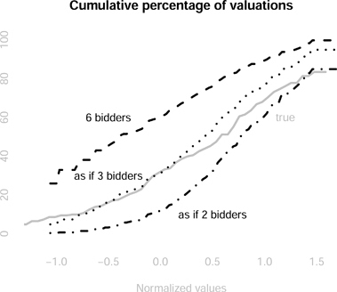

# 10Auctions

DOI: [10.1201/b23262-10](./https___doi.org_10.1201_b23262-10.md)

## 10.1 Introduction

According to the travel presenter, Rick Steves, the Aalsmeer auction house is one the largest commercial buildings in the world. Royal Flora Holland, the owner of Aalsmeer, sold 12.5 billion plants and flowers in 2016 through its auction houses. But with $5.2 billion in auction sales, Royal Flora Holland is nowhere near the biggest auction house in the world.[1](./20-chapter10.md#fn10_1) That honor may go to Google. Google sold $47.6 billion in search ads using what the economist, Hal Varian, called the biggest auction in the world ([Varian, 2007](./25-refbib.md#ref58)).[2](./20-chapter10.md#fn10_2) While that is impressive, a single auction in 2015 almost beat Google's annual number. The US Federal Communication Commission's auction number 97 (AWS-3) raised $44.9 billion dollars for US taxpayers.[3](./20-chapter10.md#fn10_3) That pails in comparison to the fact that every week the US Federal government offers billions of dollars in securities auctions. A single 4-week T-bill auction for July 6 2023 was for $70 billion.

Auctions are used to sell and buy a large number of products. Governments use auctions to purchase everything from paper to police body cameras. The US Federal government uses auctions to sell oil drilling rights, FCC spectrum, 10 year bonds and timber access. You can sell and buy items from [eBay.com](./http___eBay.com) using auctions.

The auctions at Aalsmeer are unique. The auction runs for a short amount of time with a “clock” clicking the price down as the auction continues. As the price falls, the first bidder to hit the button, wins, at whatever price the clock is at. A spokesperson for Aalsmeer stated that because the price falls, it is called a **Dutch auction**. Actually they got the causality backwards. Because the Dutch popularized these types of auctions for selling flowers, we call them **Dutch auctions**.

The auction style you may be most familiar with is called an **English auction**. In this auction, there is an auctioneer who often speaks very very fast and does a lot of pointing while bidders hold up paddles or make hand gestures. In English auctions, the last bidder wins and pays the price at which the bidding stops.

\_\_\_\_\_\_\_\_\_\_\_\_\_\_\_\_\_ [1](./20-chapter10.md#fn10_110b)<https://www.royalfloraholland.com>

[2](./20-chapter10.md#fn10_210b)[eMarketer.com](./http___eMarketer.com), 7/26/16

[3](./20-chapter10.md#fn10_310b)<https://www.fcc.gov/auction/97/factsheet>

Economic analysis of auctions began with William Vickrey's seminal 1961 paper, _Counterspeculation, Auctions, and Competitive Sealed Bid Tenders_. Vickrey pointed out that Dutch auctions and **sealed bid auctions** are **strategically equivalent**. In a standard sealed bid auction each bidder submits a secret written bid. The auctioneer chooses the highest bid, and the bidder pays the number written down in her bid.

Vickrey characterized what a bidder should optimally bid in such an auction. He then showed that the same bidder should bid exactly the same amount in a Dutch auction. That is, in a Dutch auction, the bidder should wait until the price falls to the number written down, and then hit the button. Vickrey showed that while these two auctions formats are strategically equivalent, they are not strategically equivalent to an English auction.

Vickrey wondered if there was a sealed bid auction that is strategically equivalent to an English auction. Vickrey invented a new auction. In a **Vickrey auction**, each bidder writes down a bid like in a standard sealed bid auction and the winner is the person who writes down the highest bid. However, the winner pays the amount written down by the second highest bidder. Vickrey showed that his auction is strategically equivalent to an English auction.

This chapter discusses two of the most important auction formats, sealed bid auctions and English auctions. It presents estimators for both. The sealed bid auction estimation is based on [Guerre et al. (2000)](./25-refbib.md#ref29). The English auction analysis uses the order statistic approach of [Athey and Haile (2002)](./25-refbib.md#ref9). In both cases, it presents analysis of timber auctions. The chapter tests whether loggers are bidding rationally in sealed bid auctions and whether loggers colluded in English auctions.

## 10.2 Sealed Bid Auctions

Sealed bid auctions are one of the most commonly used auction formats. These auctions are very prominent in procurement, both in government and in the private sector. In a sealed bid auction, each bidder writes down her bid and secretly submits it to the auctioneer. The auctioneer sorts the bids from highest to lowest (or lowest to highest if they are buying instead of selling). The winner is the highest bidder and she pays the amount she wrote down. This is called a **first price auction** because the price is determined by the highest bid or first price.

Vickrey pointed out that sealed bid auctions are strategically complicated. To see this, assume that a bidder's utility for an item is equal to their intrinsic value for the item less the price they pay for the item. For example, a logger bidding in a timber auction will earn profits from the logs less the price paid to the US Forestry service for access to the trees. If a logger bids an amount equal to her expected profits, then if she wins she will earn nothing from the logging. It is optimal for the logger to shade her bid down. The problem is that the more she shades down, the lower her chance of winning the auction. The bidder must calculate the trade off between the probability of winning the auction and the value of winning the auction.

The section presents the model of a sealed bid auction, it then simulates data from such an auction. The section develops an estimator for determining each bidder's type, or valuation for the item.

### 10.2.1 Sealed Bid Model

The sealed bid game has _N_ bidders and each bidder _i_ knows their own type _vi_.

* Players: _N_ bidders each with valuation _vi_ (type)
* Strategies: For each valuation (type) _vi_, for bidder _i_, she chooses a bid bi(vi).
* Payoffs:  
   1. bi\>bj∀j≠i: vi−bi  
   2. bi<bj∀j≠i: 0
* Beliefs: vi∼F

We will ignore ties.[4](./20-chapter10.md#fn10_4)

If the bidder has the highest bid she wins and has a payoff vi−bi, which is her intrinsic value less the amount of the bid. If she loses she gets nothing.

[Assumption 4.](chapter10) _Independent Private Values (IPV). Let_ vi∼iidF, _where vi is the value of bidder i and F is the distribution function_.

[Assumption 4](./20-chapter10.md#assu10_1) makes the exposition a lot simpler. It also seems to be a reasonable approximation for the problems considered in the chapter. It states that a bidder's value for the item is unrelated to the values of the other bidders in the auction, except that they draw their valuation from the same distribution. The next chapter considers an alternative assumption where valuations are associated with each other.

### 10.2.2 Bayes Nash Equilibrium

In equilibrium, the bidder is assumed to maximize her expected returns from the auction. Assume that the bidder gets 0 if she loses. If she wins, assume she gets her intrinsic value (_vi_) for the item less her bid (_bi_).

maxbiPr(win|bi)(vi−bi)(10.1)

\_\_\_\_\_\_\_\_\_\_\_\_\_\_\_\_\_ [4](./20-chapter10.md#fn10_410b)If the bid increments are small and the valuations are continuously distributed, then the probability of a tie is small.

If we take first-order conditions of Equation (10.1), then we get the following expression.

g(bi|N)(vi−bi)−G(bi|N)\=0(10.2)

Let G(bi|N) denote the probability that bidder _i_ is the highest bidder with a bid of _bi_, conditional on there being _N_ bidders in the auction, and g(bi|N) is the derivative. G(bi|N) is the probability that she wins the auction.

We can rearrange this formula to show how much the bidder should shade her bid.

bi\=vi−G(bi|N)g(bi|N)(10.3)

The formula states that the bidder should bid her value, less a shading factor which is determined by how much a decrease in her bid reduces her probability of winning the auction.

It will be useful for our code to write the probability of winning the auction as a function of the bid distribution as this distribution is observed in the data. Let H(b) denote the distribution of bids in the auctions. Given [Assumption 4](./20-chapter10.md#assu10_1), the probability of a particular bidder winning the auction is given by the following equation.

G(bi|N)\=H(bi)N−1(10.4)

If there are two bidders in the auction, then the probability of winning is simply the probability that her bid is higher than the other bidder. If there are more than two bidders, it is the probability that her bid is higher than _all_ the other bidders. The independent private values assumption, [Assumption 4](./20-chapter10.md#assu10_1), implies that this is the probability that each of the other bidders makes a bid less than hers, all multiplied together.

We can also determine the derivative of this function in terms of the bid distribution observed in the data.

g(bi|N)\=(N−1)h(bi)H(bi)N−2(10.5)

where _h_ is the derivative of the bid distribution _H_.

### 10.2.3 Sealed Bid Simulation in **R**

In the simulated data, each bidder draws their value from a uniform distribution. Vickrey shows that the optimal bid in this auction is calculated using the following formula.

bi\=(N−1)viN(10.6)

In Vickrey's version of the game, bidders know the function represented by Equation (10.6). The uniform distribution simplifies the problem, which is why it is used. In each simulated auction, there are different numbers of simulated bidders.

`_>   set.seed(123456789)_`
`_>   M = 1000 # number of simulated auctions._`
`_>   data1 = matrix(NA,M,12)_`
`_>   for (i in 1:M) {_`
`_+     N = round(runif(1, min=2,max=10)) # number of bidders._`
`_+     v = runif(N) # valuations, uniform distribution._`
`_+     b = (N - 1)*v/N # bid function_`
`_+     p = max(b) # auction price_`
`_+     x = rep(NA,10)_`
`_+     x[1:N] = b # bid data_`
`_+     data1[i,1] = N_`
`_+     data1[i,2] = p_`
`_+     data1[i,3:12] = x_`
`_+   }_`
`_>   colnames(data1) = c(“Num”,“Price”,“Bid1”_,`
`_+                        “Bid2”,“Bid3”,“Bid4”_,`
`_+                        “Bid5”,“Bid6”,“Bid7”_,`
`_+                        “Bid8”,“Bid9”,“Bid10”)_`
`_>   data1 = as.data.frame(data1)_`
The simulation creates a data set with 1,000 auctions. In each auction, there is between 2 and 10 bidders. The bidders are not listed in order.

### 10.2.4 Sealed Bid Estimator

The estimator uses Equation (10.3) to back out values from observed bids. To do this, we calculate the probability of winning the auction conditional on the number of bidders. It should be straightforward to determine this from the data. Once we have this function, we use the formula to determine the bidder's valuation from their bid.

The first step is to estimate the bid distribution.

H^(b)\=1N∑i\=1N1(bi<b)(10.7)

The **non-parametric estimate** of the distribution function, H(b), is the fraction of bids that are below some value _b_.[5](./20-chapter10.md#fn10_5)

\_\_\_\_\_\_\_\_\_\_\_\_\_\_\_\_\_ [5](./20-chapter10.md#fn10_510b)A non-parametric estimator makes no parametric assumptions about how the bids are distributed in the data.

The second step is to estimate the derivative of the bid distribution. This can be calculated numerically for some given “small” number, _ϵ_.[6](./20-chapter10.md#fn10_6)

h^(b)\=H^(b+ϵ)−H^(b−ϵ)2ϵ(10.8)

If there are two bidders, Equation (10.3) determines the valuation for each bidder.

v^i\=bi+H^(bi)h^(bi)(10.9)

where i∈{1,2}.

### 10.2.5 Sealed Bid Estimator in **R**

The estimator limits the data to only those auctions with two bidders. In this special case, the probability of winning is just given by the distribution of bids.[7](./20-chapter10.md#fn10_7) In the code, the epsilon stands for the Greek letter, _ϵ_, and refers to a “small” number. See Equation (10.8).

`_> fsealed2bid = function(bids, epsilon=0.5) {_`
`_+   # epsilon for “small” number for finite difference method_`
`_+   # of taking numerical derivatives._`
`_+   values = rep(NA,length(bids))_`
`_+   for (i in 1:length(bids)) {_`
`_+     Hhat = mean(bids < bids[i])_`
`_+     # bid probability distribution_`
`_+     hhat = (mean(bids < bids[i] + epsilon) -_`
`_+       mean(bids < bids[i] - epsilon))/(2*epsilon)_`
`_+     # bid density_`
`_+     values[i] = bids[i] + Hhat/hhat_`
`_+   }_`
`_+   return(values)_`
`_+ }_`
It is straightforward to calculate the probability of winning, as this is the probability the other bidder bids less. Given IPV ([Assumption 4](./20-chapter10.md#assu10_1)), this is the cumulative probability for a particular bid. Calculating the density is slightly more complicated. We can approximate this derivative numerically by looking at the change in the probability for a “small” change in the bids.[8](./20-chapter10.md#fn10_8) The value is calculated using Equation (10.3).

\_\_\_\_\_\_\_\_\_\_\_\_\_\_\_\_\_ [6](./20-chapter10.md#fn10_610b)This is a **finite difference estimator**.

[7](./20-chapter10.md#fn10_710b)The probability of winning is the probability that your bid is higher than the other bidders in the auction.

[8](./20-chapter10.md#fn10_810b)This is an example of using finite differences to calculate numerical derivatives. What happens with different values of epsilon?

The code creates a ggplot() object that shows the density of bids and the derived valuations from the two-person auctions.

`_> data2 = data1 |>_`
`_+   filter(_`
`_+     Num == 2_`
`_+   )_`
`_> ggplotsealed = data.frame(_`
`_+   “bids” = c(data2$Bid1, data2$Bid2)_,`
`_+   “values” = fsealed2bid(c(data2$Bid1, data2$Bid2))_`
`_+ ) |>_`
`_+   ggplot() +_`
`_+   geomdensity(aes(values)_,`
`_+                fill = “gray”_,`
`_+                alpha = 0.5) +_`
`_+   geomdensity(aes(bids)_,`
`_+                fill=“black”_,`
`_+                alpha = 0.5) +_`
`_+   scalexcontinuous(limits = c(-0.5,1.5)) +_`
`_+   labs(_`
`_+     x = “value”_,`
`_+     y = “”_,`
`_+     title = “Density of Bids and Values”_`
`_+   ) +_`
`_+   geomtext(aes(x = 1.2, y = 0.8, label = “Bids”)_,`
`_+             color = “gray”) +_`
`_+   geomtext(aes(x = -0.2, y = 1.2, label = “Values”)_,`
`_+             color = “gray”) +_`
`_+   theme(axis.text.y=elementblank()_,`
`_+         axis.ticks.y=elementblank())_`
` `
`_> ggplotsealed_`
[Figure 10.1](./20-chapter10.md#fig10_1) shows that the bids are significantly shaded from the true values, particularly for very high valuations. The figure presents the density functions for bids and derived valuations from the two-person auctions. The true density of valuations lies at 0.5 and goes from 0 to 1\. Here the estimated density is a little higher and goes over its bounds. However, part of the reason may be the method we are using to represent the density in the figure.[9](./20-chapter10.md#fn10_9) You should try different values of epsilon to see how that changes things.

[Figure 10.1](chapter10) Plot of the density function for bids and values from 2 person auctions. The true distribution of valuations has a density of 0.5 from 0 to 1.

\_\_\_\_\_\_\_\_\_\_\_\_\_\_\_\_\_ [9](./20-chapter10.md#fn10_910b)The kernel density method assumes the distribution can be approximated as a mixture of normal distributions.

## 10.3 English Auctions

The auction format that people are most familiar with is the English auction. These auctions are used to sell cattle, antiques, collector stamps, and houses (in Australia). In the 1970s, they were also the standard format used by the US Forestry Service to sell timber access ([Aryal et al., 2018](./25-refbib.md#ref6)).

Because bidders can observe each other's bid as the auction progresses, it is a dynamic game. To make our life a lot simpler, we will lean heavily on Vickrey's analysis and model these auctions as second price sealed bid auctions.

The section presents the game under the assumption of a second price sealed bid auction and determines the Bayes Nash equilibrium. It then switches focus to estimating valuations from English auctions. Often in these auctions, we only observe the winning bid, or the price, and possibly the number of bidders. Because of this limitation on the data we will use an idea of an order statistic and a result from [Athey and Haile (2002)](./25-refbib.md#ref9).

### 10.3.1 Second Price Auction Game

The game is a second price sealed bid auction with _N_ bidders and valuations _vi_.

* Players: _N_ bidders with valuation _vi_
* Strategies: Each bidder _i_ chooses a bid given their valuation for the item, bi(vi).
* Payoffs:  
   1. bi\>bj∀j≠i: vi−b2, where _b_2 is the bid of the second highest bidder.  
   2. bi<bj∀j≠i: 0
* Beliefs: vi∼F

In addition to assuming away the dynamics, we assume away bid increments that may make our life complicated.

### 10.3.2 Bayes Nash Equilibrium

Vickrey showed that English auctions are strategically very simple. Imagine a bidder hires an expert auction consultant to help them bid in an English auction.

* Expert: “What is your value for the item?”
* Bidder: “$2,300”
* Expert: “Bid up to $2,300 and then stop.”

In sealed bid auctions, there is an optimal trade-off between winning and profiting from the auction. In second price auctions, there is no such trade-off.

The optimal bid for bidder _i_ is to bid her value.

bi\=vi(10.10)

Equation (10.10) suggests that empirical analysis of English auctions is a lot simpler than for sealed bid auctions. If only that were so! To be clear, the “bid” in Equation (10.10) means the strategy described by the expert. In the data, we do not necessarily observe this strategy.

If we could observe all the bid strategies in the auction, then we would have an estimate of the value distribution. But that tends to be the problem. Depending on the context, not all active bidders in the auction may actually be observed making a bid. In addition, if the price jumps during the auction we may not have a good idea when bidders stopped bidding ([Haile and Tamer, 2003](./25-refbib.md#ref30)).

[Athey and Haile (2002)](./25-refbib.md#ref9) provide a solution. They point out that the price in an English auction has a straightforward interpretation. When valuations follow [Assumption 4](./20-chapter10.md#assu10_1), the price is the second highest valuation of the people who bid in the auction. Consider the case when the price is lower than the second highest valuation. How could that be? Why did one of the bidders exit the auction at a price lower than her valuation? What if the price is higher than the second highest valuation? How could that be? Why would a bidder bid more than her valuation?

If the price is equal to the second highest valuation, then it is a particular order statistic of the value distribution. [Athey and Haile (2002)](./25-refbib.md#ref9) show how the observed distributions of an order statistic uniquely determine the value distribution.

### 10.3.3 Order Statistics

To understand how order statistics work, consider the problem of determining the distribution of heights of players in the WNBA. The obvious way to do it is to take a data set on player heights and calculate the distribution. A less obvious way is to use order statistics.

In this method, data are taken from a random sample of teams, where for each team, the height of the tallest player is measured. Assume each team has 10 players on the roster and you know the height of the tallest, say the center. This is enough information to estimate the distribution of heights in the WBNA. We can use the math of order statistics and the fact that we know both the height of the tallest and we know that 9 other players are shorter. In this case we are using the tallest, but you can do the same method with the shortest or the second tallest, etc.

The price is more or less equal to the second highest valuation of the bidders in the auction.[10](./20-chapter10.md#fn10_10) The probability of the second highest of _N_ valuations is equal to some value _b_ which is given by the following formula:

Pr(b(N−1):N\=b)\=N(N−1)F(b)N−2f(b)(1−F(b))(10.11)

The order statistic notation for the second highest bid of _N_ is b(N−1):N. We can parse this equation from right to left. It states that the probability of seeing a price equal to _b_ is the probability that one bidder has a value greater than _b_. This is the winner of the auction and this probability is given by 1−F(b), where F(b) is the cumulative probability of a bidder's valuation less than _b_. This probability is multiplied by the probability that there is exactly one bidder with a valuation of _b_. This is the second highest bidder who is assumed to bid her value. This is represented by the density function f(b).[11](./20-chapter10.md#fn10_11) These two values are multiplied by the probability that the remaining bidders have valuations less than _b_. If there are _N_ bidders in the auction then N−2 of them have valuations less than the price. The probability of this occurring given [Assumption 4](./20-chapter10.md#assu10_1) is F(b)N−2. Lastly, the labeling of the bidders is irrelevant so there are N!1!(N−2)!\=N(N−1) possible combinations. If the auction has two bidders, then the probability of observing a price _p_ is 2f(p)(1−F(p)).

\_\_\_\_\_\_\_\_\_\_\_\_\_\_\_\_\_ [10](./20-chapter10.md#fn10_1010b)Officially, the price may be a small increment above the bid of the second highest bidder. We will ignore this possibility.

[11](./20-chapter10.md#fn10_1110b)This is the derivative of F(b).

The question raised by [Athey and Haile (2002)](./25-refbib.md#ref9) is whether we can use this formula to determine _F_. Can we use the order statistic formula of the distribution of prices to uncover the underlying distribution of valuations? Yes.

### 10.3.4 Identifying the Value Distribution

Let's say we observe a two bidder auction with a price equal to the lowest possible valuation for the item; call that _v_0. Actually, it is a lot easier to think about the case where the price is slightly above the lowest possible value. Say that the price is less than v1\=v0+ϵ, where _ϵ_ is a “small” number. What do we know? We know that one bidder has that very low valuation, which occurs with probability equal to F(v1). What about the other bidder? The other bidder may also have a value equal to the lowest valuation or they may have a higher valuation. That is, their value for the item could be anything. The probability of value lying between the highest and lowest possible value is 1\. So Pr(p≤v1)\=2×1×F(v1) and either bidder could be the high bidder. There are 2 possibilities, so we must multiply by 2\. As the probability of a price less than _v_1 is observed in the data, we can rearrange things to get the initial probability, F(v1)\=Pr(p≤v1)/2.

Now take another value, v2\=v1+ϵ. The probability of observing a price between _v_1 and _v_2 is as follows.

Pr(p∈(v1,v2\])\=2(F(v2)−F(v1))(1−F(v1))(10.12)

It is the probability of seeing one bidder with a value between _v_2 and _v_1 and the second bidder with a value greater than _v_1. Again, the two bidders can be ordered in two ways.

We can solve F(v2) using Equation (10.12). We observe the quantity on the left-hand side and we previously calculated F(v1).

For a finite subset of the valuations, we can use this iterative method to calculate the whole distribution. More generally, we would use differential equations. For this to work, each bidder's valuation is assumed to be independent of the other bidders and comes from the same distribution of valuations ([Assumption 4](./20-chapter10.md#assu10_1)).

### 10.3.5 English Auction Estimator

The non-parametric estimator of the distribution follows the logic above.

The initial step determines the probability at the minimum value,

F^(v1)\=∑j\=1M1(pj≤v1)2M(10.13)

where there are _M_ auctions and _pj_ is the price in auction _j_.

To this initial condition, we can add an iteration equation.

F^(vk)\=∑j\=1M1(vk<pj≤vk+1)2M(1−F^(vk−1))+F^(vk−1)(10.14)

These equations are then used to determine the distribution of the valuations.

### 10.3.6 English Auction Estimator in **R**

We can estimate the distribution function non-parametrically by approximating it at K\=100 points evenly distributed across the range of observed values. The estimator is based on Equations (10.13) and (10.14).

`_> fEnglish2bid = function(price, K=100, epsilon=1e-8) {_`
`_+   # K number of finite values._`
`_+   # epsilon small number for getting the probabilities_`
`_+   # calculated correctly._`
`_+   min1 = min(price)_`
`_+   max1 = max(price)_`
`_+   diff1 = (max1 - min1)/K_`
`_+   Fv = matrix(NA,K,2)_`
`_+   mintemp = min1 - epsilon_`
`_+   maxtemp = mintemp + diff1_`
`_+   # determines the boundaries of the cell._`
`_+   Fv[1,1] = (mintemp + maxtemp)/2_`
`_+   gp = mean(price > mintemp & price < maxtemp)_`
`_+   # price probability_`
`_+   Fv[1,2] = gp/2 # initial probability_`
`_+   for (k in 2:K) {_`
`_+     mintemp = maxtemp - epsilon_`
`_+     maxtemp = mintemp + diff1_`
`_+     Fv[k,1] = (mintemp + maxtemp)/2_`
`_+     gp = mean(price > mintemp & price < maxtemp)_`
`_+     Fv[k,2] = gp/(2*(1 - Fv[k-1,2])) + Fv[k-1,2]_`
`_+     # cumulative probability_`
`_+   }_`
`_+   return(Fv)_`
`_+ }_`
## 10.4 Empirical Analysis: Testing the Rationality of Loggers using **R**

In the 1970s, the US Forest Service conducted an interesting experiment. It introduced sealed bid auctions in 1977\. Previous to that, most US Forest Service auctions had been English auctions.[12](./20-chapter10.md#fn10_12) In 1977, the service mixed between auction formats. As discussed above, bidding in sealed bid auctions is strategically a lot more complicated than bidding in English auctions. In the latter, the bidder simply bids her value. In the former, she must trade off between bidding higher and increasing the likelihood of winning against paying more if she does win.

Because of the experiment, we can test whether the loggers in the sealed bid auctions bid consistently with their actions in the English auctions. Our test involves estimating the underlying value distribution using bid data from sealed bid auctions and comparing that to an estimate of the underlying value distribution using price data from English auctions. These two value distributions are the same under the assumptions of the game theory model.

### 10.4.1 Timber Data

The data used here are from the US Forest Service downloaded from Phil Haile's website.[13](./20-chapter10.md#fn10_13)

In order to estimate the distributions of bids and valuations it is helpful to “normalize” them so that we are comparing apples to apples. The standard method is to use a log function of the bid amount and run a linear regression on various characteristics of the auction including the number of acres bid on, the estimated value of the timber, access costs and characteristics of the forest and species ([Haile et al., 2006](./25-refbib.md#ref31)).[14](./20-chapter10.md#fn10_14)

The code brings in the data and uses lm() to create the object lm1. The regression creates dummy variables for the different tree species, regions, forests and districts using as.factor(). It then creates a normalized bid using the residuals from the linear regression.

\_\_\_\_\_\_\_\_\_\_\_\_\_\_\_\_\_ [12](./20-chapter10.md#fn10_1210b)You may think of this as just some academic question. But the US Senator for Idaho, Senator Church, was not happy with the decision. “In fact, there is a growing body of evidence that shows that serious economic dislocations may already be occurring as a result of the sealed bid requirement.” See _Congressional Record_ September 14 1977, p. 29223.

[13](./20-chapter10.md#fn10_1310b)<http://www.econ.yale.edu/~pah29/timber/timber.htm>. The version used here is available from here: <https://sites.google.com/view/microeconometricswithr/table-of-contents>.

[14](./20-chapter10.md#fn10_1410b)[Baldwin et al. (1997)](./25-refbib.md#ref13) discuss the importance of various observable characteristics of timber auctions.

`_>   file = paste0(dir, “auctions.csv”)_`
`_>   df = read.csv(file)_`
`_>   lm1 = lm(logamount ~ as.factor(Salvage) + Acres +_`
`_+               Sale.Size + logvalue + Haul +_`
`_+               Road.Construction + as.factor(Species) +_`
`_+               as.factor(Region) + as.factor(Forest) +_`
`_+               as.factor(District), data=df)_`
`_>   # as.factor creates a dummy variable for each entry under the_`
`_>   # variable name. For example, it will have a dummy for each_`
`_>   # species in the data._`
`_>   df$normbid = NA_`
`_>   df$normbid[-lm1$na.action] = lm1$residuals_`
`_>   # lm object includes “residuals” term which is the difference_`
`_>   # between the model estimate and the observed outcome._`
`_>   # na.action accounts for the fact that lm drops_`
`_>   # missing variables (NAs)_`
In general, we are looking for a normal-like distribution. [Figure 10.2](./20-chapter10.md#fig10_2) presents the histogram of the normalized log bids. It is not required that the distribution be normal, but if the distribution is quite different from normal, you should think about why that may be. Does this distribution look normal?[15](./20-chapter10.md#fn10_15)

[Figure 10.2](chapter10) Histogram of normalized bid residual for US Forest Service auctions from 1977.

### 10.4.2 Sealed Bid Auctions

In order to simplify things, we will limit the analysis to two-bidder auctions. In the data, sealed bid auctions are denoted “S”.

`_> df1 = df |>_`
`_+   filter(_`
`_+     numbidders == 2 &_`
`_+       Method.of.Sale == “S”_`
`_+   ) |>_`
`_+   mutate(_`
`_+     bids = as.vector(normbid)_,`
`_+     values = fsealed2bid(normbid)_`
`_+   )_`
`_> summary(df1$bids)_`
`     Min. 1st Qu. Median     Mean 3rd Qu.    Max.`
`  -4.0262 -0.7987 -0.1918 -0.2419 0.3437 5.0647`
`_> summary(df1$values)_`
`      Min. 1st Qu.    Median     Mean 3rd Qu.      Max.`
`   -4.0262 -0.0218    0.9185   4.8704   2.3108 860.0647`
\_\_\_\_\_\_\_\_\_\_\_\_\_\_\_\_\_ [15](./20-chapter10.md#fn10_1510b)It is approximately normal, but it is skewed somewhat to lower values. This may be due to low bids in the English auction. How does the distribution look if only sealed bids are graphed?

Using the same method that we used above, it is possible to back out an estimate of the value distribution from the bids in the data. We see that comparing the valuations to the bids, the bids are significantly shaded particularly for higher valuations. The negative numbers may seem odd but remember we have normalized the bids in the auction.

`_> df |>_`
`_+   ggplot() +_`
`_+   geomhistogram(aes(x = normbid)_,`
`_+                  fill = “gray”_,`
`_+                  alpha = 0.5) +_`
`_+   scalexcontinuous(limits = c(-3,2.5)) +_`
`_+   labs(_`
`_+     x = “bid”_,`
`_+     y = “”_,`
`_+     title = “Histogram of Bids”_`
`_+   ) +_`
`_+   theme(axis.text.y = elementblank()_,`
`_+         axis.ticks.y = elementblank())_`
### 10.4.3 Comparing English Auctions to Sealed Bid Auctions

We can back out the value distribution from the English auctions by assuming that the price is the second highest bid, the second highest **order statistic**. The English auctions are denoted “A”.

The function f\_English\_2bid estimates the cumulative probability function for the value distribution.

`_> df2 = df |>_`
`_+   filter(_`
`_+     numbidders == 2 &_`
`_+       Method.of.Sale == “A” &_`
`_+       Rank == 2_`
`_+   )_`
`_> Fvenglish = fEnglish2bid(df2$normbid)_`
To calculate the equivalent for the sealed bid auctions, we can use the ecdf() function.

`_> Fvsealed = ecdf(df1$values)_`
[Figure 10.3](./20-chapter10.md#fig10_3) shows that there is not a whole lot of difference between the estimate of the distribution of valuations from sealed bid auctions and English auctions. The two distributions of valuations from the sealed bid auctions and English auctions lie fairly close to each other, particularly for lower values. This suggests loggers are bidding rationally. That said, at higher values, the two distributions diverge. The value distribution from the sealed bid auctions suggests that valuations are higher than the estimate from the English auctions. What else may explain this divergence?

[Figure 10.3](chapter10) Comparison of estimated distributions from two bidder English and sealed bid auctions. The estimate from the English auction and the sealed bid auction are similar to about 0, then estimate from English auctions places more weight on lower valuations than the estimate from the sealed bid auctions.

## 10.5 Empirical Analysis: Testing for Collusion using **R**

Is there evidence that bidders in English auctions are colluding? This section presents a test of collusion based on using auction theory to back out the implied value distribution of the bidders in the larger English auctions. We can compare the implied distribution to the distribution we have estimated above.

### 10.5.1 A Test of Collusion

Consider the following test of collusion. Using large English auctions, we can estimate the distribution of valuations. Under the prevailing assumptions of the game theory model, this estimate should be the same as for two-bidder auctions. If the estimate from the large auctions suggests valuations are much lower than for two-bidder auctions, this suggests collusion.

Specifically, if the inferred valuations in these larger auctions look much like auctions with fewer bidders. That is, bidders may behave “as if” there are actually fewer bidders in the auction. For example, if there is an active **bid ring**, bidders may have a mechanism for determining who will win the auction and how the losers may be compensated for not bidding.[16](./20-chapter10.md#fn10_16) In an English auction, it is simple to enforce a collusive agreement because members of the bid ring can bid in the auction where their bids are observed.

Can we determine the size of the bid ring? How many people are bidding collusively? What if we have an auction with six bidders? If three of them are members of a bid ring, then those three will agree on who should bid from the ring. Only one of the members of the bid ring will bid their value. If we estimate the model under the assumption that there are four independent bidders, it will match the value distribution we estimated from the two bidder auction.[17](./20-chapter10.md#fn10_17)

\_\_\_\_\_\_\_\_\_\_\_\_\_\_\_\_\_ [16](./20-chapter10.md#fn10_1610b)[Asker (2010)](./25-refbib.md#ref8) presents a detailed account of a bid ring in stamp auctions.

[17](./20-chapter10.md#fn10_1710b)In the bid ring mechanism discussed in [Asker (2010)](./25-refbib.md#ref8), the collusion actually leads to higher prices in the main auction.

### 10.5.2 “Large” English Auctions

Assume there are six bidders in the auction. From above, the order statistic formula for this case is as follows.

Pr(b5:6\=b)\=30F(b)4f(b)(1−F(b))(10.15)

As above, order statistics are used to determine the underlying value distribution (_F_); however, in this case, it is a little more complicated to determine the starting value.

Think about the situation where the price in a 6 bidder auction is observed at the minimum valuation. What do we know? As before, one bidder may have a value equal to the minimum or a value above the minimum. That is, their value could be anything. The probability of a valuation lying between the minimum and maximum value is 1\. We also know that the five other bidders had valuations at the minimum. If not, one of them would have bid more and the price would have been higher. As there are six bidders, there are six different bidders that could have had the highest valuation. This reasoning gives the following formula for the starting value.

Pr(b5:6<v1)\=6F(v1)5(10.16)

Rearranging, we have F(v1)\=(Pr(p<v1)6)15.

Given this formula we can use the same iterative method as for two-bidder auctions to solve for the distribution of valuations.

### 10.5.3 Large English Auction Estimator

Again we can estimate the value distribution by using an iterative process. In this case, we have the following estimators.

F^(v1)\=(∑j\=1M1(pj<v1)6M)15(10.17)

and

F^(vk)\=∑j\=1M1(vk<pj<vk+1)30MF^(vk−1)4(1−F^(vk−1))+F^(vk−1)(10.18)

The other functions are as defined in the previous section.

We can also solve for the implied distribution under the assumption that there are three bidders and under the assumption that there are two bidders.[18](./20-chapter10.md#fn10_18) Note in each auction there are at least six bidders.[19](./20-chapter10.md#fn10_19)

\_\_\_\_\_\_\_\_\_\_\_\_\_\_\_\_\_ [18](./20-chapter10.md#fn10_1810b)See Equation (10.11) for the other cases.

[19](./20-chapter10.md#fn10_1910b)For simplicity, it is assumed that all of these auctions have six bidders. Once there are a large enough number of bidders in the auction, prices do not really change with more bidders. In fact, these methods may not work as the number of bidders gets large ([Deltas, 2004](./25-refbib.md#ref22)).

### 10.5.4 Large English Auction Estimator in **R**

We can adjust the estimator above to allow any number of bidders, _N_.

`_> fEnglishNbid = function(price, N, K=100, epsilon=1e-8) {_`
`_+   min1 = min(price)_`
`_+   max1 = max(price)_`
`_+   diff1 = (max1 - min1)/K_`
`_+   Fv = matrix(NA,K,2)_`
`_+   mintemp = min1 - epsilon_`
`_+   maxtemp = mintemp + diff1_`
`_+   Fv[1,1] = (mintemp + maxtemp)/2_`
`_+   gp = mean(price > mintemp & price < maxtemp)_`
`_+   Fv[1,2] = (gp/N)^(1/(N-1))_`
`_+   for (k in 2:K) {_`
`_+     mintemp = maxtemp - epsilon_`
`_+     maxtemp = mintemp + diff1_`
`_+     Fv[k,1] = (mintemp + maxtemp)/2_`
`_+     gp = mean(price > mintemp & price < maxtemp)_`
`_+     Fv[k,2] =_`
`_+       gp/(N*(N-1)*(Fv[k-1,2]^(N-2))*(1 - Fv[k-1,2])) +_`
`_+       Fv[k-1,2]_`
`_+   }_`
`_+   return(Fv)_`
`_+ }_`
### 10.5.5 Evidence of Collusion

We limit the auctions to ones with more than five bidders.

`_> df3 = df |>_`
`_+   filter(_`
`_+     numbidders > 5 &_`
`_+       Method.of.Sale == “A” &_`
`_+       Rank == 2_`
`_+   )_`
We can estimate the value distribution under the assumption that there are six bidders in the auction. We can also estimate the value distribution under the assumption that there are three bidders and two bidders. The results are presented in [Figure 10.4](./20-chapter10.md#fig10_4).

`_> Fv6 = fEnglishNbid(df3$normbid, N = 6)_`
`_> Fv3 = fEnglishNbid(df3$normbid, N = 3)_`
`_> Fv2 = fEnglish2bid(df3$normbid)_`
 Long Description for Figure 10.4 

Four curves are shown. The curve labeled 6 bidders rises sharply and reaches near 100 by value 1\. The curve labeled as if 3 bidders rises gradually and reaches around 90\. The curve labeled as if 2 bidders rises slowly and reaches around 80\. The curve labeled true lies between 3 and 2 bidders. It follows as if 3 bidders initially but diverges from the normalized value of 0 and increases to reach 80\. All data are approximate.

[Figure 10.4](chapter10) Comparison of estimated distribution of valuations from English auctions with at least 6 bidders. These estimates are compared to the estimate from 2 bidder auctions which is labeled “true.” The estimate of the 6-bidder auctions suggests valuations are much lower than for the 2-bidder auctions.

[Figure 10.4](./20-chapter10.md#fig10_4) suggests that there is in fact collusion in these auctions! Assuming there are 6 bidders in the auction implies that valuations are much lower than we estimated for 2 bidder auctions from both English auctions and sealed bid auctions. In the chart, the distribution function is shifted to the left, meaning there is greater probability of lower valuations.

In theory, these two estimates should be the same or very close. Remember we are estimating the underlying value distribution which is unrelated to the number of bidders in the auction. The estimate with 6 bidders suggests that bidders value the timber much lower than when there are 2 bidders. If we don't think there is any collusion in 2 bidder auctions, then these estimates provide the ground truth. These estimates tell us how the timber is valued. This implies that the reason the value distribution is lower is not that the values are lower, but that the bids are lower.

If there are 5 bidders in the ring, then bidders will bid as if they are in a 2 bidder auction. We can estimate the value distribution assuming that there are 2 bidders in the auction. The result is that the estimated value distribution is higher than the ground truth. Either the 2 bidders are bidding too much or there are more than 2 independent bidders in the auction.

If there are 4 bidders in the ring, then bidders will bid as if they are in a 3 bidder auction. Estimates assuming there are three bidders and two bidders lie above and below the true value, respectively. This suggests that bidders are behaving as if there are between two and three bidders in the auction. This implies that the bid ring has between four and five bidders in each auction.

These results are suggestive of an active bid ring in these auctions in 1977\. It turns out that this was of real concern. In 1977, the United States Senate conducted hearings into collusion in these auctions. In fact, this may be why the US Forestry Service looked into changing to sealed bid auctions. The US Department of Justice also brought cases against loggers and millers ([Baldwin et al., 1997](./25-refbib.md#ref13)). Alternative empirical approaches have also found evidence of collusion in these auctions, including [Baldwin et al. (1997)](./25-refbib.md#ref13) and [Athey et al. (2011)](./25-refbib.md#ref10).

## 10.6 Discussion and Further Reading

Economic analysis of auctions began with Vickrey's 1961 paper. Vickrey used game theory to analyze sealed bid auctions, Dutch auctions and English auctions. Vickrey also derived a new auction, the sealed bid second price auction.

The chapter considers two of the most important auction mechanisms, sealed bid auctions and English auctions. The sealed bid auctions are analyzed using the two-step procedure of [Guerre et al. (2000)](./25-refbib.md#ref29). The first step uses non-parametric methods to estimate the bid distribution. The second step uses the Nash equilibrium to back out the value distribution.

While we observe all the bids in the sealed bid auctions, we generally only observe the high bids in English auctions. The chapter uses the order statistic approach of [Athey and Haile (2002)](./25-refbib.md#ref9) to estimate the value distribution from these auctions.

[Baldwin et al. (1997)](./25-refbib.md#ref13) and [Athey et al. (2011)](./25-refbib.md#ref10) analyze collusion in US timber auctions. [Aryal et al. (2018)](./25-refbib.md#ref6) uses US timber auctions to measure how decision makers account for risk and uncertainty.

[_OceanofPDF.com_](./https___oceanofpdf.com)
