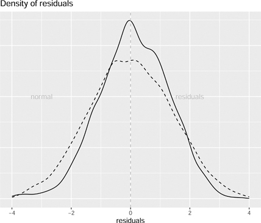
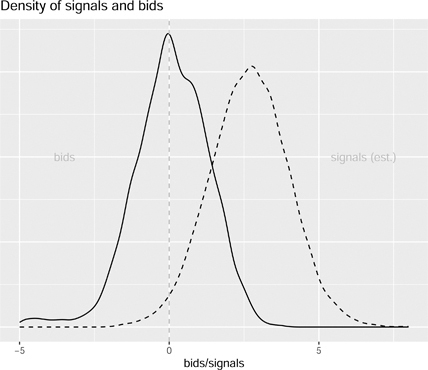
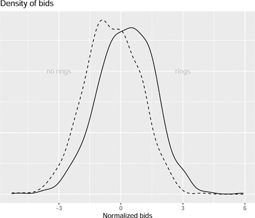

# 11 가치 연계 경매 (Auctions with Affiliated Valuations)

DOI: [10.1201/b23262-11](./https___doi.org_10.1201_b23262-11.md)

## 11.1 소개 (Introduction)

이전 장에서는 입찰자의 가치가 서로 독립적이라고 가정했습니다. 이는 게임 이론과 계량 경제학을 모두 상당히 단순화했습니다. 이 장에서는 이 가정을 완화할 것입니다. 이제 입찰자의 가치가 종속되는 것을 허용할 것입니다. 이러한 유형의 경매를 **연계 개인 가치 경매(affiliated private values auctions)**라고 합니다.

대표적인 예는 미국 외부 대륙붕(OCS)에서 석유 시추권을 입찰하는 것입니다. 땅에서 뽑아낼 수 있는 석유의 양은 입찰자와 아무런 관련이 없습니다. 마찬가지로 그 석유의 가격도 입찰자의 신원과 거의 또는 전혀 관련이 없습니다.[1](./21-chapter11.md#fn11_1)

이 장에서는 **공통 가치 경매(common value auctions)**를 분석하고 게임 이론 모델을 OCS 경매에 적용합니다. 이 장에서는 이러한 경매에서 입찰 담합(bid rings)을 허용해야 하는지 묻습니다.

## 11.2 공통 가치 경매 (Auctions with Common Values)

여기서는 입찰자의 가치가 상호 의존적인 경매를 고려합니다. 이러한 상호 의존성의 단순한 경우는 순수 **공통 가치 경매**입니다. 이 경매에서 입찰자는 입찰하는 품목의 정확한 가치를 모릅니다. 각 입찰자는 품목의 실제 가치에 대한 신호를 얻으며, 모든 신호를 집계하면 품목의 실제 가치에 꽤 근접한 근사치를 제공하게 됩니다.

\_\_\_\_\_\_\_\_\_\_\_\_\_\_\_\_\_ [1](./21-chapter11.md#fn11_111b)물론 일부 입찰자는 석유 시장에서 시장 지배력을 가지고 있을 수 있습니다.

전형적인 예는 특정 지역에서 석유를 시추할 권리에 대해 입찰자들이 얼마를 입찰할지 고려하는 것입니다. 유전에는 특정 가치가 있는 특정 양의 석유가 있습니다. 알려지지는 않았지만 입찰자가 누구인지와는 아무런 관련이 없습니다. 유전의 가치는 모든 입찰자에게 동일합니다. 그들은 단지 그것이 무엇인지 모를 뿐입니다. 입찰자인 석유 회사는 유전의 가치를 추정하기 위해 다양한 모델, 장비 및 전문 지식을 갖춘 다양한 지질학자를 고용할 것입니다. 이 지질학자들은 다른 추측을 내놓을 것입니다. 우리는 이러한 추측을 유전 가치의 신호라고 부릅니다.

이 섹션에서는 경매의 게임과 **베이즈 내쉬 균형(Bayes Nash equilibrium)**을 제시합니다. 입찰자가 균형에서 입찰가를 낮추게 만드는 **승자의 저주(winner's curse)**라는 개념을 논의합니다. 이 섹션에서는 **공통 가치 경매**를 위한 추정량을 제시하고 시뮬레이션 데이터를 사용하여 추정량을 설명합니다.

### 11.2.1 단순 모델 (Simple Model)

경매 게임에는 신호 *si*를 갖는 *N*명의 입찰자가 있습니다. 신호는 평균이 *v*이고 분산이 *σ_2인 정규 분포에서 도출됩니다. 품목의 실제 가치는 \_v*입니다. 각 입찰자의 입찰가는 그들의 신호인 bi(si)의 함수입니다. 높은 입찰가를 낸 입찰자가 경매에서 낙찰받고 자신의 입찰가를 지불합니다. 입찰자가 이기면 품목의 실제 가치인 *v*를 얻습니다. 입찰자가 지면 아무것도 얻지 못합니다.

- 플레이어: *N*명의 입찰자와 신호(유형) si∈ℜ.
- 전략: 각 입찰자 *i*는 신호(_si_)를 관찰하고 입찰가 bi(si)를 선택합니다.
- 보수:
  1.  bi\>bj∀j≠i: v−bi(si)
  2.  만약 ∃j s.t. bi<bj: 0
- 신념: si∼N(v,σ2), 여기서 *v*는 품목의 실제 가치입니다.

플레이어 *i*가 이기면 아래첨자가 없는 *v*를 얻습니다. 이는 모든 입찰자에게 동일하기 때문입니다. 입찰자들 사이에서 다른 점은 그들의 신호 *si*입니다. 입찰자들은 그들의 신호가 평균 *v*인 정규 분포에서 도출되었다는 것은 알지만 *v*를 알지는 못합니다.

### 11.2.2 승자의 저주 (Winner's Curse)

승자는 높은 입찰가를 제시한 입찰자입니다. 모든 입찰자가 자신의 가치를 입찰할 경우 어떤 일이 발생하는지 고려해 보십시오. 이 경우 승자는 순서 통계량(order statistic) 표기법을 사용하여 *v*보다 상당히 높을 sN:N을 입찰합니다.

`_>   set.seed(123456789)_`
`_>   N = 10_`
`_>   v = 5_`
`_>   s = rnorm(N, v)_`
` `
`_> max(s)_`
`  [1] 6.415538`
10명의 입찰자가 있는 예에서 승자는 실제 가치 5보다 훨씬 높은 6.42를 입찰합니다. 승자는 실제로 손해를 봅니다. 입찰자는 승자의 저주를 설명하기 위해 입찰가를 낮춤으로써 전략을 조정해야 합니다.

### 11.2.3 베이즈 내쉬 균형 (Bayes Nash Equilibrium)

우리는 종종 **제1가격 경매(first price auctions)**이기도 한 공통 가치 경매를 봅니다. 입찰자들은 두 가지 다른 이유로 입찰가를 낮춥니다. 첫째, 이전 장에서처럼 제1가격 경매이고 낙찰받아 입찰한 금액을 지불하는 것을 고려해야 하기 때문에 입찰가를 낮춥니다. 둘째, 이러한 입찰자들은 경매에서 이긴다면 그들의 신호가 다른 모든 사람의 신호보다 높고 따라서 품목의 실제 가치보다 높기 때문이라는 사실을 고려해야 합니다.

일을 더 간단하게 만들기 위해 입찰자가 품목에 대한 기대 가치를 입찰한다고 가정해 봅시다. 입찰자가 **베이즈 규칙(Bayes rule)**을 사용하고 그들의 기대 가치가 관찰한 신호와 경매에서 이겼다는 사실 모두에 조건부라고 가정합니다. 물론 그들은 실제로 경매에서 이겼는지 졌는지는 모르지만 지면 그들의 입찰가는 중요하지 않습니다. 입찰자는 사례를 고려하고 있습니다. 관심 있는 유일한 경우는 입찰자가 경매에서 이긴 경우입니다. 그들은 경매에서 이겼다면 정의상 자신의 입찰가가 높은 입찰가였음에 틀림없다는 것을 깨닫습니다.

다시 말하지만, 낙찰과 지불 금액의 상충 관계(trading off)는 당분간 제외됩니다. 그렇다면 입찰자는 얼마나 많은 정보를 가지고 있을까요? 가진 것이 하나의 신호뿐이기 때문에 많지 않다고 생각할 수 있지만 예상보다 훨씬 많은 것을 알고 있음이 밝혀졌습니다. 그들은 경매에서 이겼기 때문에 그들의 신호가 다른 모든 사람의 신호보다 높아야 한다는 것을 압니다. 따라서 이것은 그들에게 다른 모든 사람의 신호에 대해 꽤 많은 것을 알려줍니다.

[10장](./20-chapter10.md)은 순서 통계량이 어떻게 작동하는지 보여줍니다. 특정 신호 *s*가 높은 순서 통계량(sN:N)일 확률은 모든 신호가 분포 F(s|μ,σ)에서 독립적으로 도출되었다고 가정할 때 다음 방정식으로 주어집니다. 특정 *s*가 다른 모든 신호보다 높을 확률은 G(s|N,μ,σ)\=F(s|μ,σ)N−1이며 여기서 *μ*는 실제 가치 *v*의 다양한 가능한 값을 나타내고 N−1개의 다른 신호가 있습니다. 그러면 도함수는 g(s|N,μ,σ)\=(N−1)f(s|μ,σ)F(s|μ,σ)N−2입니다.

이 우도(likelihood)를 사용하여 낙찰 입찰가를 제출하는 조건에서 품목에 대한 입찰자의 기대 가치를 결정할 수 있습니다. 베이즈 규칙만 사용하면 됩니다. 기대 가치를 결정하려면 특정 분포가 우리가 관찰하는 신호를 생성할 확률이 필요합니다.

γ(μ,σ|s\=sN:N)\=g(s|N,μ,σ)∑μ′,σ′g(s|N,μ′,σ′)(11.1)

가능한 모든 *μ*와 *σ*를 알고 정규 분포를 가정하며 *μ*와 *σ*에 대한 사전 확률이 균일하다고 가정하면 수식 (11.1)은 관찰된 신호가 특정 *μ*와 *σ*에 의해 생성될 확률을 제공합니다.

μ\=v(실제 가치)이고 σ\=1인 간단한 버전을 생각해 보십시오. 이 경우 g(s|N,v)\=(N−1)ϕ(s−v)Φ(s−v)N−2이며 ϕ() 및 Φ는 각각 표준 정규 분포의 밀도 및 확률 함수를 나타냅니다.

입찰자가 높은 신호 s\=sN:N을 가지고 있을 때 품목의 기대 가치는 다음 함수로 주어집니다.

E(v|N,s)\=∫v′v′γ(v′|s\=sN:N)d(v′)(11.2)

여기서 γ()는 수식 (11.1)에 정의되어 있습니다. *N*명의 입찰자와 신호 *s*가 주어지면 실제 입찰가의 기대 가치는 *s*가 높은 신호라고 가정할 때 γ() 함수에 의해 가중치가 부여된 가능한 실제 가치에 대한 적분입니다. σ\=1임을 기억하십시오.

이제 입찰자가 품목의 가치를 얼마나 평가하는지 알았습니다. 다음 질문은 얼마를 입찰할지입니다. 이것은 밀봉 입찰 경매(sealed bid auction)라는 것을 기억하십시오. 따라서 입찰자가 이길 확률에 대해 이길 때의 가치를 여전히 상충하고(trading off) 있습니다.

bi(si)\=E(v|N,si)−G(bi|N,si)g(bi|N,si)(11.3)

따라서 입찰자의 신호를 조건으로 이길 확률을 결정해야 합니다. 만들기 간단한 가정은 균형 입찰이 신호에서 단조 증가(monotonically increasing)한다는 것입니다. 이것은 불합리해 보이지 않습니다.

단조성(monotonicity) 가정이 주어지면, 이길 확률은 높은 신호를 가질 확률일 뿐입니다. 우리는 G(bi|N,si)\=F(si|v)N−1 및 g(bi|N,si)\=(N−1)f(si|v)F(si|v)N−2를 가지며, 이는 우연이 아니라 이전에 정의한 유사한 함수입니다.

### 11.2.4 **R**을 이용한 공통 가치 경매 (Common Value Auction in **R**)

아래에서는 공통 가치가 있는 제1가격 경매의 입찰에 필요한 모든 확률 함수를 생성합니다. 두 가지 다른 목적으로 순서 통계량을 사용하기 때문에 약간 혼란스럽습니다. 첫째, 입찰자가 제1가격 경매에 대한 최적의 입찰가를 결정하는 이전 장에서 논의된 표준 방법이 있습니다. 둘째, 입찰자는 순서 통계량을 사용하여 관찰한 신호와 경매 낙찰을 조건으로 품목 가치에 대한 기대치를 역산(back out)합니다.

신호 분포는 밀도가 *f*인 정규 분포이며 *F*로 표시됩니다. log_F() 및 log_f()를 사용합니다. N명의 입찰자가 주어졌을 때 높은 신호의 분포는 *G*로 표시되며 밀도에 대해 log_G() 및 log_g()를 사용합니다. dnorm() 함수는 정규 분포의 밀도를 계산하고 pnorm()은 정규 분포의 확률을 계산합니다.

`_>   logf = function(s, v, sigma = 1)_`
`_+     log(dnorm(s, v, sigma))_`
`_>   logF = function(s, v, sigma = 1)_`
`_+     log(pnorm(s, v, sigma))_`
`_>   logG = function(s, v, sigma = 1, N) (N-1)*logF(s, v, sigma)_`
`_>   logg = function(s, v, sigma=1, N) log(N-1) +_`
`_+     logf(s, v, sigma) +_`
`_+     (N-2)*logF(s, v, sigma)_`
이러한 확률이 주어지면 입찰자의 품목에 대한 기대 가치와 입찰가를 결정할 수 있습니다. 기대 함수 E_fun()은 u 및 sig라는 두 가지 전역 변수를 사용합니다. 이는 입찰자가 관찰하는 신호를 결정하는 정규 분포의 가능한 매개변수입니다. 마지막으로, 수식 (11.3)을 기반으로 한 입찰 함수 b_fun()이 있습니다.

`_>   Efun = function(s, N) {_`
`_+     gu = matrix(NA,length(u),length(sig))_`
`_+     umat = matrix(NA, length(u), length(sig))_`
`_+     for(j in 1:length(sig)) {_`
`_+       gu[,j] = exp(logg(s, u, sig[j], N))_`
`_+       umat[,j] = u_`
`_+     }_`
`_+     sumgu = sum(gu)_`
`_+     gammau = gu/sumgu_`
`_+     mu = sum(umat*gammau)_`
`_+     sigma = sqrt(sum(umat^2*gammau) - mu^2)_`
`_+     return(list(mu=mu, sigma=sigma))_`
`_+   }_`
`_>   bfun = function(s, N) {_`
`_+     vbar = Efun(s, N)_`
`_+     G = exp(logG(s, vbar$mu, vbar$sigma, N))_`
`_+     g = exp(logg(s, vbar$mu, vbar$sigma, N))_`
`_+     return(vbar$mu - G/g)_`
`_+   }_`

### 11.2.5 **R**을 이용한 공통 가치 경매 시뮬레이션 (Simulation of Common Value Auction using **R**)

시뮬레이션을 통해 작업하는 것이 도움이 됩니다. 100회의 경매가 있고 입찰자 수가 다릅니다. 각 경매의 실제 가치는 0이고 신호는 표준 정규 분포를 따릅니다. seq() 함수는 세 번째 값을 간격으로 하여 첫 번째 값과 두 번째 값 사이의 일련의 숫자를 계산합니다. rnorm() 함수는 정규 분포에서 난수를 생성합니다. sample() 함수는 난수 집합에서 무작위로 추출합니다. rep() 함수는 특정 횟수만큼 숫자를 반복합니다.

이 코드는 sapply()를 사용하여 신호를 반복하고 각 신호에 대한 기대 가치와 입찰가를 계산합니다.

`_>   set.seed(123456789)_`
`_>   M = 100_`
`_>   N = NULL_`
`_>   bids = NULL_`
`_>   ids = NULL_`
`_>   values = NULL_`
`_>   u = seq(-10, 10, 0.15)_`
`_>   sig = seq(0.1, 3, 0.15)_`
`_>   Ns = sample(3:4, M, replace=TRUE)_`
`_>   v = rep(0, M)_`
`_>   sigma = 1_`
`_>   for(i in 1:M) {_`
`_+     ids = c(ids, rep(i, Ns[i]))_`
`_+     N = c(N, rep(Ns[i], Ns[i]))_`
`_+     si = rnorm(Ns[i], v[i], sigma)_`
`_+     values = c(values_,`
`_+                sapply(1:length(si)_,`
`_+                               function(j) Efun(si[j]_,`
`_+                                                 Ns[i])$mu))_`
`_+     bids = c(bids_,`
`_+              sapply(1:length(si)_,`
`_+                           function(j) bfun(si[j]_,`
`_+                                             Ns[i])))_`
`_+   }_`
아래 코드는 입찰가와 기대 가치의 밀도 플롯을 생성합니다. 입찰가는 기대 가치보다 낮게 이동합니다. 기대 가치는 균형 상태의 신호 분포보다 낮게 이동합니다.

`_> ggplotsimcvbids = data.frame(_`
`_+   bids = bids_,`
`_+   values = values_`
`_+ ) |>_`
`_+   ggplot(aes(bids)) +_`
`_+   geomdensity(alpha = 0.5) +_`
`_+   geomdensity(aes(values), linetype = 2, alpha = 0.5) +_`
`_+   labs(_`
`_+     x = “values/bids”_,`
`_+     y = “”_,`
`_+     title = “Density of bids and values”_`
`_+   ) +_`
`_+   geomvline(xintercept = 0, linetype = 2_,`
`_+              color = “gray”) +_`
`_+   geomtext(aes(x = -5, y = 0.2, label = “bids”)_,`
`_+             color = “gray”) +_`
`_+   geomtext(aes(x = 2, y = 0.2, label = “values”)_,`
`_+             color = “gray”) +_`
`_+   theme(axis.text.y=elementblank()_,`
`_+         axis.ticks.y=elementblank())_`
[그림 11.1](./21-chapter11.md#fig11_1)은 관찰된 입찰가와 추정된 가치를 보여줍니다. IPV의 경우에서 보았듯이 제1가격 경매에서는 입찰가가 가치보다 훨씬 낮게 차감됩니다. 기대 가치 역시 입찰자가 관찰한 원래 신호보다 크게 차감됩니다. 이러한 기대 가치는 베이즈 내쉬 균형에서 해당 신호가 높은 신호라는 가정 하에 신호를 조건으로 합니다. 실제 신호는 0 주위에 분포합니다.

[그림 11.1](chapter11) 제1가격 공통 가치 경매에서 입찰가 및 기대 가치 밀도 플롯. 제1가격 경매이기 때문에 입찰가는 평가액에서 낮게 이동합니다.

### 11.2.6 공통 가치 경매 추정량 (Estimator for Common Values Auctions)

이 추정량은 입찰 분포에서 신호 분포를 역엔지니어링(reverse engineer)합니다. 수식 (11.3)과 [10장](./20-chapter10.md)의 논의를 통해 신호를 조건으로 기대 가치의 분포를 식별할 수 있음을 알 수 있습니다. 불행히도 기대 가치 분포에서 신호 분포를 고유하게 결정하는 것은 일반적으로 불가능합니다. 파라미터 제약 조건에 의존해야 합니다.

### 11.2.7 **R**을 이용한 공통 가치 추정량 (Common Values Estimator in **R**)

관찰된 입찰가에서 기저의 신호 분포를 추정하기 위해 최대 우도법과 시뮬레이션을 결합할 것입니다. 추정량은 입찰자의 신호가 높다는 조건으로 기대 가치를 입찰한다는 게임 이론적 가정을 바탕으로 관찰된 입찰가의 우도를 최대화하는 신호 분포의 *μ*와 *σ*를 선택합니다.

추정량은 신호 분포에 대한 일련의 매개변수 값, mu 및 sigma를 가져와 결과 입찰가인 b_sim을 시뮬레이션하는 방식으로 작동합니다. 신호를 시뮬레이션한 다음 시뮬레이션된 신호를 순환하여 해당 시뮬레이션된 입찰가를 생성합니다. 그런 다음 입찰 분포에서 파생된 매개변수를 기반으로 관찰된 입찰가(bids_temp)를 관찰할 로그 우도를 계산합니다. 데이터의 각 경매 크기에 대해 이 작업을 수행합니다.

`_>   fbidml = function(mu, sigma, bidstemp, Ntemp, s) {_`
`_+     Ns = unique(Ntemp)_`
`_+     loglik = rep(NA, length(bidstemp))_`
`_+     for(i in 1:length(Ns)) {_`
`_+       Ni = Ns[i]_`
`_+       index = which(Ntemp==Ns[i])_`
`_+       bsim = sapply(1:length(s), function(i) bfun(s[i], Ni))_`
`_+       mui = mean(bsim, na.rm = TRUE)_`
`_+       sigmai = sd(bsim, na.rm = TRUE)_`
`_+       zi = (bidstemp[index] - mui)/sigmai_`
`_+       loglik[index] = log(dnorm(zi)) - log(sigmai)_`
`_+     }_`
`_+     return(loglik)_`
`_+   }_`
`_>   fbidmlint = function(par, bidstemp, Ntemp) {_`
`_+     set.seed(123456789)_`
`_+     mu = par[1]_`
`_+     sigma = exp(par[2])_`
`_+     s = U*sigma + mu_`
`_+     return(-sum(fbidml(mu, sigma, bidstemp, Ntemp, s)))_`
`_+   }_`
이 추정량은 U, u 및 sig의 세 가지 전역 변수가 필요합니다.

`_> U = rnorm(1000)_`
`_> a = optim(par = c(0, log(sigma)), fbidmlint_,`
`_+            bidstemp = bids, Ntemp = N_,`
`_+           control = list(trace=0, maxit=100000))_`
아래 코드는 관찰된 입찰가에서 신호 분포를 추정합니다.

`_> ggplotsimcvsignals =_`
`_+   data.frame(_`
`_+     signals = rnorm(length(values)_,`
`_+                     a$par[1]_,`
`_+                     exp(a$par[2]))_,`
`_+     values = values_`
`_+   ) |>_`
`_+     ggplot(aes(values)) +_`
`_+     geomdensity(alpha = 0.5) +_`
`_+     geomdensity(aes(signals), linetype = 2, alpha = 0.5) +_`
`_+     labs(_`
`_+       x = “values/signals”_,`
`_+       y = “”_,`
`_+       title = “Density of signals and values”_`
`_+     ) +_`
`_+     geomvline(xintercept = 0, linetype = 2, color = “gray”) +_`
`_+     geomtext(aes(x = -3.5, y = 0.2, label = “values”)_,`
`_+               color = “gray”) +_`
`_+     geomtext(aes(x = 2.5, y = 0.2, label = “signals (est.)”)_,`
`_+               color = “gray”) +_`
`_+     theme(axis.text.y=elementblank()_,`
`_+           axis.ticks.y=elementblank())_`
` `
`_> ggplotsimcvsignals_`
[그림 11.2](./21-chapter11.md#fig11_2)는 시뮬레이션된 데이터에서 기대 가치와 추정된 신호의 밀도를 보여줍니다. 추정된 신호는 표준 정규 분포인 실제 분포에 매우 가깝습니다. 이 그림은 입찰자가 관찰된 신호에서 입찰가를 상당히 할인한다는 것을 보여줍니다. 우리는 이것이 두 가지 이유 때문에 발생한다는 것을 알 수 있습니다. 첫째, 그들의 기대 가치(낙찰을 조건으로 함)는 그들의 신호에서 할인됩니다. 둘째, 제1가격 경매이기 때문에 입찰자는 품목의 기대 가치에서 입찰가를 할인합니다([그림 11.1](./21-chapter11.md#fig11_1) 참조).

[그림 11.2](chapter11) 제1가격 공통 가치 경매에서 기대 가치 및 신호(추정) 밀도 플롯. 입찰자의 평가는 추정된 신호 분포에서 아래로 이동합니다.

그림 11.3 정규화된 입찰가에 대한 평균 및 분산과 동일한 평균 및 분산을 갖는 정규 분포에서 추출한 시뮬레이션 데이터 세트에 대한 잔차 입찰가의 밀도 플롯. 이는 정규 분포가 입찰가의 합리적인 근사치임을 나타냅니다.

[그림 11.4](chapter11) 3~10명의 입찰자가 있는 담합 없는 OCS 경매에서 모든 경매의 정규화된 입찰가와 신호(추정)의 밀도 플롯. 입찰자의 평가는 추정된 신호 분포에서 아래로 이동합니다.

## 11.3 실증 분석: **R**을 이용한 OCS 경매의 신호 분포 (Empirical Analysis: Signal Distribution from OCS Auctions using **R**)

이 섹션에서는 1954년부터 1979년까지 텍사스와 루이지애나 앞바다의 외부 대륙붕(OCS) 석유 및 가스 광구에 대한 데이터를 사용합니다.[2](./21-chapter11.md#fn11_2)

\_\_\_\_\_\_\_\_\_\_\_\_\_\_\_\_\_ [2](./21-chapter11.md#fn11_211b)이 데이터는 펜실베니아 주립대학교 <https://capcp.la.psu.edu/data-and-software/outer-continental-shelf-ocs-auction-data/>에서 얻을 수 있습니다.

### 11.3.1 데이터 (Data)

코드는 데이터 세트 book_ocs_ch11.csv를 가져옵니다. 다음으로 입찰가를 경매의 관찰된 특성에 대해 회귀 분석하여 잔차 경매 가치를 생성하는 기법을 수행합니다. as.factor() 함수는 광구 코드 및 경매 날짜에 대한 더미 변수를 만드는 데 사용됩니다. lm() 함수는 선형 회귀를 추정하는 데 사용됩니다. 그런 다음 잔차를 계산하고 데이터 세트를 데이터 프레임으로 변환합니다.

`_>   file = paste0(dir, “bookocsch11.csv”)_`
`_>   df = read.csv(file) |>_`
`_+     select(_`
`_+       lbid_,`
`_+       lvalue_,`
`_+       lcost_,`
`_+       BlockCode_,`
`_+       Date_,`
`_+       TractNumber_,`
`_+       nCompany_`
`_+     ) |>_`
`_+     na.omit()_`
`_>   lm1 = lm(lbid ~ lvalue + as.factor(BlockCode) +_`
`_+              as.factor(Date) + lcost, data = df)_`
`_>   df$res = lm1$residuals_`
`_>   dt = setDT(df)_`
` `
`_> ggplotocsbids =_`
`_+   df |>_`
`_+   ggplot(aes(res)) +_`
`_+   geomdensity(alpha = 0.5) +_`
`_+   geomdensity(aes(rnorm(length(res)_,`
`_+                           mean(res)_,`
`_+                           sd(res)))_,`
`_+                linetype = 2, alpha = 0.5) +_`
`_+   scalexcontinuous(limits = c(-4,4)) +_`
`_+   labs(_`
`_+     x = “residuals”_,`
`_+     y = “”_,`
`_+     title = “Density of residuals”_`
`_+   ) +_`
`_+   geomvline(xintercept = 0, linetype = 2, color = “gray”) +_`
`_+   geomtext(aes(x = 2, y = 0.2, label = “residuals”)_,`
`_+             color = “gray”) +_`
`_+   geomtext(aes(x = -3, y = 0.2, label = “normal”)_,`
`_+             color = “gray”) +_`
`_+   theme(axis.text.y=elementblank()_,`
`_+         axis.ticks.y=elementblank())_`
` `
`_> ggplotocsbids_`
[그림 11.5](./21-chapter11.md#fig11_5)는 OCS 경매에 대한 정규화된 입찰가를 보여줍니다. 이 그림은 또한 정규 분포가 합리적인 근사치임을 시사하기 위해 정규 분포에서 시뮬레이션된 입찰가를 보여줍니다.

[그림 11.5](chapter11) 담합이 허용되지 않는 경우("no rings")와 담합이 허용되는 경우("rings")의 입찰 금액 밀도 플롯. 입찰가의 가치는 정규화되었습니다. 이러한 OCS 경매에서 담합이 허용될 때 입찰가가 더 높습니다.

### 11.3.2 신호 분포 추정 (Estimating the Signal Distribution)

우리는 샘플을 담합이 없는 경매로만 제한합니다.[3](./21-chapter11.md#fn11_3) 위의 추정량을 사용하여 이러한 경매에 대한 신호 분포를 추정할 수 있습니다. 또한 이 코드는 입찰자가 3명 미만, 10명 초과, 결측 잔차가 있는 관측치의 인덱스를 생성합니다. 그런 다음 코드는 최적화 루틴에 대한 초기 값을 계산하고 루틴을 실행합니다. 이 코드는 입찰자가 3명 미만이고 10명 초과인 경매를 결정하는 객체 index를 생성합니다. 그런 다음 \-index를 사용하여 해당 경매를 삭제합니다.

\_\_\_\_\_\_\_\_\_\_\_\_\_\_\_\_\_ [3](./21-chapter11.md#fn11_311b)담합(Coalitions)은 다음 섹션에서 자세히 설명합니다. 이것은 합법적인 입찰 담합(bid rings)입니다.

`_>   dt2 = dt[numcoy == N]_`
`_>   index = c(which(dt2$numcoy < 3 | dt2$numcoy > 10)_,`
`_+             which(is.na(dt2$res)))_`
`_>   init = c(mean(dt2$res[-index]), sd(dt2$res[-index]))_`
`_>   b1 = optim(par = init_,`
`_+              fbidmlint_,`
`_+              bidstemp = dt2$res[-index]_,`
`_+              Ntemp = dt2$numcoy[-index]_,`
`_+              control = list(trace = FALSE_,`
`_+                           maxit = 1000000))_`
그런 다음 코드는 추정된 신호 분포와 관찰된 입찰가의 플롯을 생성합니다.

`_> ggplotestcvsignals =_`
`_+   data.frame(_`
`_+     bids = dt$res_,`
`_+     signals = rnorm(length(dt$res)_,`
`_+                     b1$par[1]_,`
`_+                     exp(b1$par[2]))_`
`_+   ) |>_`
`_+     ggplot(aes(bids)) +_`
`_+     geomdensity(alpha = 0.5) +_`
`_+     geomdensity(aes(signals), linetype = 2, alpha = 0.5) +_`
`_+     scalexcontinuous(limits = c(-5,8)) +_`
`_+     labs(_`
`_+       x = “bids/signals”_,`
`_+       y = “”_,`
`_+       title = “Density of signals and bids”_`
`_+     ) +_`
`_+     geomvline(xintercept = 0, linetype = 2_,`
`_+                color = “gray”) +_`
`_+     geomtext(aes(x = -3.5, y = 0.2, label = “bids”)_,`
`_+               color = “gray”) +_`
`_+     geomtext(aes(x = 6.5, y = 0.2, label = “signals (est.)”)_,`
`_+               color = “gray”) +_`
`_+     theme(axis.text.y=elementblank()_,`
`_+           axis.ticks.y=elementblank())_`
` `
`_> ggplotestcvsignals_`
[그림 11.4](./21-chapter11.md#fig11_4)는 OCS 경매에서 정규화된 입찰가와 추정된 신호의 밀도를 보여줍니다. 이 그림은 입찰자가 관찰된 신호에서 입찰가를 상당히 할인한다는 것을 보여줍니다. 우리는 이것이 두 가지 이유 때문에 발생한다는 것을 알 수 있습니다. 첫째, 승자의 저주 때문에 그들의 기대 가치(낙찰을 조건으로 함)가 신호에서 할인됩니다. 둘째, 제1가격 경매이기 때문에 입찰자는 품목의 기대 가치에서 입찰가를 할인합니다.

## 11.4 담합이 있는 경매 (Auctions with Coalitions)

공통 가치 경매를 고려하기 위한 전형적인 데이터 세트는 미국 연방 정부의 해양 시추 경매입니다. 놀라운 사실 중 하나는 경매에 입찰자의 "담합(coalitions)"이 포함되어 있다는 것입니다. 기본적으로 합법적인 입찰 담합(bid rings)입니다. [10장](./20-chapter10.md)에서 입찰 담합에 대한 논의를 고려할 때 정부가 이러한 경매에서 담합을 허용한다는 것은 매우 이상해 보입니다.

명백한 정책 질문은 정부가 실제로 OCS 경매에서 입찰 담합을 허용해야 하는지 여부입니다. 여러분은 대답이 분명히 '아니오'라고 생각할 것입니다. 사실 공통 가치 경매의 경우 그렇게 명백하지 않습니다.

이 섹션에서는 담합에서의 입찰이 어떻게 추정될 수 있는지 살펴봅니다. 그런 다음 위의 추정된 매개변수와 OCS 경매의 몇 가지 특성을 사용하여 정책을 시뮬레이션합니다.

### 11.4.1 담합의 이점 (The Benefit of Coalitions)

담합을 허용하는 이유는 담합을 통해 입찰자가 품목의 가치에 대한 정보를 공유할 수 있기 때문입니다. 입찰자가 사용할 수 있는 정보의 양을 늘림으로써 담합은 더 높은 입찰가로 이어질 수 있습니다!

입찰자가 입찰가를 낮추는 데는 두 가지 이유가 있다고 말했던 것을 기억하십시오. [10장](./20-chapter10.md)에서 논의된 첫 번째는 입찰자가 이길 확률을 고려하여 입찰가를 낮추고, 이길 확률과 이길 경우 지불하는 금액을 상충한다(trade off)는 것입니다. 입찰자 수가 증가함에 따라 특정 입찰자가 이길 확률이 감소하므로 상충 관계가 작아져 입찰가가 높아집니다. 이전에 말했듯이 입찰 담합은 승리할 확률이 더 높기 때문에 입찰자가 입찰가를 낮출 수 있게 해줍니다. 입찰가를 낮추는 두 번째 이유는 정보 문제 때문입니다. 여기서 입찰 담합은 반대 방향으로 작동하는데, 정보를 공유함으로써 입찰자들은 품목의 가치에 대해 더 정확한 신호를 얻어 더 많이 입찰할 수 있게 됩니다.

더 많은 신호로 입찰자의 평가는 어떻게 변할까요? 해당 평균이 다른 모든 신호보다 크다는 조건 하에 담합의 기대 가치가 신호의 평균이 될 것이라고 가정해 보십시오. 통계학을 통해 우리는 이 표본 평균의 분포를 실제 평균과 같고 분산이 표본 크기로 나눈 실제 분산과 같은 정규 분포로 근사화할 수 있음을 알고 있습니다.

담합의 *J*명 구성원의 경우 특정 평균 신호(s¯)로 경매에서 이길 확률은 다음과 같습니다.

Φ(s¯−μσ)N−J−1(11.4)

여기서 이것은 담합의 *J*명 구성원이 신호의 특정 평균을 관찰할 확률에 담합 외부의 다른 입찰자가 담합의 평균보다 낮은 신호를 가질 확률을 곱한 값을 제공합니다.

담합 외부의 입찰자는 어떨까요?

Φ(s−μσ)N−J−1Φ(s−μσJ)(11.5)

이 확률은 신호 *s*가 관찰되고 담합 외부의 다른 모든 입찰자보다 크며 담합에 속한 신호의 평균보다 클 확률입니다.

### 11.4.2 **R**을 이용한 담합 추정 (Estimating Coalitions in **R**)

담합이 허용된 확률은 다음과 같습니다. 담합 내의 입찰자는 담합 외부의 입찰자보다 신호에 노이즈가 적습니다. 모든 입찰자에 대해 독립적인 입찰자 수가 더 적습니다. 코드는 담합 내의 입찰자를 나타내기 위해 \_ in을 사용하고 담합 외부의 입찰자를 나타내기 위해 \_ out을 사용합니다.

`_>   logGin = function(s, v, sigma=1, N, J)_`
`_+     (N-J-1)*logF(s, v, sigma/sqrt(J))_`
`_>   loggin = function(s, v, sigma=1, N, J) log(N-J-1) +_`
`_+     logf(s, v, sigma/sqrt(J)) +_`
`_+     (N-J-2)*logF(s, v, sigma/sqrt(J))_`
`_>   logGout = function(s, v, sigma=1, N, J)_`
`_+     (N-J-1)*logF(s, v, sigma)_`
`_>   loggout = function(s, v, sigma=1, N, J) log(N-J-1) +_`
`_+     logf(s, v, sigma) + (N-J-2)*logF(s, v, sigma)_`
담합 내외의 입찰자에 대한 기대 가치와 입찰가는 예상한 대로입니다.

`_>   Ein = function(s, Ni, Ji) {_`
`_+     gu = matrix(NA,length(u),length(sig))_`
`_+     umat = matrix(NA, length(u), length(sig))_`
`_+     for(j in 1:length(sig)) {_`
`_+       gu[,j] = exp(loggin(s, u, sig[j], Ni, Ji))_`
`_+       umat[,j] = u_`
`_+     }_`
`_+     sumgu = sum(gu)_`
`_+     gammau = gu/sumgu_`
`_+     mu = sum(umat*gammau)_`
`_+     sigma = sqrt(sum(umat^2*gammau) - mu^2)_`
`_+     return(list(mu=mu, sigma=sigma))_`
`_+   }_`
`_>   Eout = function(s, Ni, Ji) {_`
`_+     gu = matrix(NA,length(u),length(sig))_`
`_+     umat = matrix(NA, length(u), length(sig))_`
`_+     for(j in 1:length(sig)) {_`
`_+       gu[,j] = exp(loggout(s, u, sig[j], Ni, Ji))_`
`_+       umat[,j] = u_`
`_+     }_`
`_+     sumgu = sum(gu)_`
`_+     gammau = gu/sumgu_`
`_+     mu = sum(umat*gammau)_`
`_+     sigma = sqrt(sum(umat^2*gammau) - mu^2)_`
`_+     return(list(mu=mu, sigma=sigma))_`
`_+   }_`
`_>   bin = function(s, N, J) {_`
`_+     vbar = Ein(s, N, J)_`
`_+     G = exp(logG(s, vbar$mu, vbar$sigma, N-J+1))_`
`_+     g = exp(logg(s, vbar$mu, vbar$sigma, N-J+1))_`
`_+     return(vbar$mu - G/g)_`
`_+   }_`
`_>   bout = function(s, N, J) {_`
`_+     vbar = Eout(s, N, J)_`
`_+     G = exp(logG(s, vbar$mu, vbar$sigma, N-J+1))_`
`_+     g = exp(logg(s, vbar$mu, vbar$sigma, N-J+1))_`
`_+     return(vbar$mu - G/g)_`
`_+   }_`

### 11.4.3 정책 시뮬레이션 (Policy Simulation)

1970년대 중반, 국무부는 대규모 입찰자들이 힘을 합치는 것을 불법으로 만들도록 정책을 변경했지만 소규모 입찰자가 대규모 입찰자 또는 다른 소규모 입찰자와 힘을 합치는 것은 여전히 허용했습니다.

담합이 있는 경매가 담합이 없는 경매와 동일한 신호 분포를 갖는다고 가정해 보십시오. 이를 통해 위의 이전 섹션의 추정치를 정책 시뮬레이션에 사용할 수 있습니다.

이 분석은 단일 담합이 있고 입찰자가 2명 이상인 경우로 제한됩니다. 입찰 수가 입찰자 수보다 적을 때 경매에 담합이 있습니다. 이 정보는 기본 데이터 세트에 다시 병합됩니다. 코드는 이전 섹션의 mu 및 sigma 추정치를 사용하여 담합 내외의 입찰가를 시뮬레이션합니다. 경매의 입찰자 수는 데이터에서 가져온 것입니다. 입찰자의 담합을 허용하고 담합이 허용되지 않는 경우의 경매를 시뮬레이션합니다.

`_> dt1 = dt[, .(num = .N_,`
`_+              numcoy = sum(as.numeric(nCompany)))_,`
`_+          by = TractNumber]_`
`_> dt = merge(dt, dt1, by=“TractNumber”)_`
` `
`_>   dt2 = dt[numcoy - num == 1 & num > 2]_`
`_>   M = length(unique(dt2$TractNumber))_`
`_>   N = dt2$numcoy_`
`_>   mu = rep(b1$par[1], M)_`
`_>   sigma = exp(b1$par[2])_`
`_>   bidssim = NULL_`
`_>   bidscf = NULL_`
`_>   set.seed(123456789)_`
`_>   for(i in 1:M) {_`
`_+     Ni = N[i]_`
`_+     si = rnorm(Ni, mu, sigma)_`
`_+     bidsi = sapply(1:Ni, function(j) bfun(si[j], Ni))_`
`_+     bidsiin = bin(mean(si[1:2]), Ni, 2)_`
`_+     bidsiout = sapply(1:(Ni-1), function(j)_`
`_+       bout(si[j], Ni, 2))_`
`_+     bidssim = c(bidssim, bidsiin, bidsiout)_`
`_+     bidscf = c(bidscf, bidsi)_`
`_+     # print(i)_`
`_+   }_`
그런 다음 코드는 담합이 있는 경매와 없는 경매에서 입찰 밀도의 플롯을 생성합니다.

`_> ggplotocsbids =_`
`_+   data.frame(_`
`_+     rings = bidssim_,`
`_+     norings = bidscf_`
`_+   ) |>_`
`_+     filter(_`
`_+       is.finite(rings) & is.finite(norings)_`
`_+     ) |>_`
`_+     ggplot(aes(rings)) +_`
`_+     geomdensity(alpha = 0.5) +_`
`_+     geomdensity(aes(norings), linetype = 2, alpha = 0.5) +_`
`_+     labs(_`
`_+       x = “Normalized bids”_,`
`_+       y = “”_,`
`_+       title = “Density of bids”_`
`_+     ) +_`
`_+     geomtext(aes(x = 3, y = 0.2, label = “rings”)_,`
`_+               color = “gray”) +_`
`_+     geomtext(aes(x = -3, y = 0.2, label = “no rings”)_,`
`_+               color = “gray”) +_`
`_+     theme(axis.text.y=elementblank()_,`
`_+           axis.ticks.y=elementblank())_`
` `
`_> ggplotocsbids_`
[그림 11.5](./21-chapter11.md#fig11_5)는 입찰 담합(담합)을 허용하면 입찰가가 더 높아지는 경향이 있음을 보여줍니다! 이 분석은 독립적인 입찰자 수가 적기 때문에 입찰자가 더 낮게 입찰할 것이라는 사실을 설명합니다. 그럼에도 불구하고 입찰가가 높다는 것은 공통 가치 경매에서 신호를 집계하는 이점을 보여줍니다.

## 11.5 논의 및 추가 읽을거리 (Discussion and Further Reading)

[10장](./20-chapter10.md)에서는 독립 개인 가치(IPV)라는 단순화된 가정을 내렸습니다. 이 가정은 공통 가치 모델을 배제합니다. [Laffont and Vuong (1996)](./25-refbib.md#ref40)은 공통 가치 문헌의 주요 부정적인 결과를 제시합니다. 이것은 강력한 모수적 가정 없이는 이 설정에서 데이터를 생성하는 정확한 모델을 식별하는 것이 불가능하다는 것을 명시합니다. 이러한 부정적인 결과에도 불구하고 경매가 공통 가치 경매인지 테스트할 수 있습니다([Haile et al., 2006](./25-refbib.md#ref31)).

이 장의 분석은 모수적 모델을 사용합니다. 이 장에서는 경쟁사 간의 협력을 허용하는 것이 석유 시추권 매각에서 정부에 더 나은 결과를 가져올 수 있음을 시사합니다. 공통 가치 경매를 포함하여 경매의 계량 경제학에 대한 자세한 분석은 [Paarsch and Hong (2006)](./25-refbib.md#ref49)을 참조하십시오. 여기에 사용된 OCS 데이터는 여러 논문에서 분석되었습니다([Hendricks et al. (2003)](./25-refbib.md#ref33)).

[_OceanofPDF.com_](./https___oceanofpdf.com)
