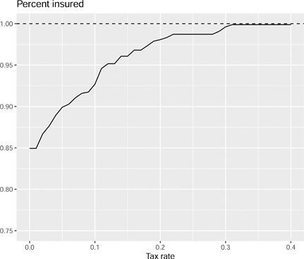

# 13 역선택 (Adverse Selection)

DOI: [10.1201/b23262-13](./https___doi.org_10.1201_b23262-13.md)

## 13.1 서론

이 장에서는 **역선택 (adverse selection)** 문제에 대해 살펴봅니다. 이러한 게임은 일반적으로 **신호 발송 (signalling)** 게임과 **선별 (screening)** 게임으로 나뉩니다. **신호 발송 게임**에서는 자신의 유형이 알려지지 않은 플레이어가 행동을 선택하고 그 행동 선택이 상대방에게 정보를 제공할 수 있습니다. **선별 게임**에서는 정보가 없는 플레이어가 먼저 움직여서 유형이 알려지지 않은 플레이어에게 몇 가지 선택지를 제공합니다. 관찰된 선택은 정보가 없는 플레이어에게 정보를 제공할 수 있습니다.

어느 경우든 문제는 관찰된 행동이 플레이어의 유형에 대한 정보를 제공하는지 여부입니다. 우리는 행동이 플레이어의 유형에 대한 정보를 제공하는 균형을 가질 수 있으며, 이를 **분리 균형 (separating equilibria)**이라고 부릅니다. 또한 행동이 플레이어의 유형에 대한 정보를 제공하지 않는 균형을 가질 수도 있습니다. 이를 **통합 균형 (pooling equilibria)**이라고 부릅니다.

이 장에서는 알려지지 않은 유형의 게임 중 가장 유명한 조지 애컬로프(George Akerlof)의 중고차 시장과 레몬 문제(lemons problem) 모델을 제시합니다. 그런 다음 이러한 아이디어를 사용하여 건강 보험 시장에 대해 생각합니다. 정부 보조금이나 세금을 사용하여 건강 보험의 레몬 문제를 해결할 수 있는지 고려합니다. 이 장에서는 MEPS(Medical Expenditure Panel Survey) 데이터를 사용하여 보정된 모델로 이러한 정책을 분석합니다.

## 13.2 애컬로프의 레몬

경제학 밖에서는 경제학자들이 자유 시장 자본주의를 열광적으로 믿는 사람들이라는 인식이 있습니다. 시장과 시장이 어떻게 작동하는지 또는 작동하지 않는지를 연구하는 경제학자들에게 "믿는 사람들"이라고 불리는 것은 이상합니다. 조지 애컬로프는 철저한 경제학자이며 노벨 경제학상을 수상하기도 했습니다. 그는 또한 세계에서 가장 영향력 있는 경제학자 중 한 명인 전 재무부 장관 재닛 옐런(Janet Yellen)과 결혼했습니다. 애컬로프는 시장에서 정보의 단순한 잘못된 배분이 어떻게 그 시장을 실패하게 만드는지 보여주었습니다.

이 섹션에서는 애컬로프의 레몬 시장을 소개하고 문제의 공식적인 게임 이론 버전을 제공합니다.

### 13.2.1 레몬 시장

자동차 시장을 고려해 보겠습니다. 이 시장에는 좋은 차와 레몬(나쁜 차)이라는 두 가지 유형의 차가 있습니다. 불행히도 소비자는 구매 전에 자동차의 유형을 관찰할 수 없습니다. 그러나 그들은 자동차의 유형을 관찰한 후 중고차 시장에 차를 되팔 수 있습니다.

이제 많은 새 차를 이용할 수 있게 되었다고 가정해 보겠습니다. 새 차에 관한 핵심은 자동차 판매자가 좋은 차든 레몬이든 관계없이 차를 판매한다는 것입니다. 소비자는 차를 구입하고 차의 유형을 알게 됩니다. 소비자가 차의 유형을 알게 된 후에는 중고 시장에서 차를 팔거나 유지할 수 있습니다. 중고차 시장의 가격이 새 차 시장의 가격과 대략 비슷하다면, 레몬을 구입한 고객은 중고차 시장에 차를 버리고 좋은 차를 얻기를 바라며 새 차 시장으로 돌아갈 것입니다.

중고차 시장의 고객은 레몬의 비율이 방금 훨씬 높아졌다는 것을 알게 될 것이므로 중고차 시장의 가격은 떨어질 것입니다. 이전에는 좋은 차를 소유한 사람들이 중고차 시장에서 자신의 차를 기꺼이 팔았을지 모르지만, 시장에 진입하는 모든 레몬 때문에 가격이 떨어졌습니다. 그래서 이 판매자들은 그들의 좋은 차를 유지할 것입니다. 레몬 소유자는 차를 버리고 좋은 차의 소유자는 차를 유지함에 따라 중고차 시장은 점점 더 레몬으로 채워집니다. 이에 대한 반응으로 중고차 시장의 가격이 떨어집니다. 이것은 상황을 악화시킬 뿐입니다. 가격이 더 떨어짐에 따라 중고차 시장에서 이익을 내고 팔 수 있는 차는 레몬뿐입니다. 결국 중고차 시장은 레몬뿐입니다.

시장이 실패합니다.

### 13.2.2 레몬 게임

애컬로프의 원래 주장은 게임 이론이 아니었습니다. 우리는 그것을 게임으로 방향을 바꿀 수 있습니다.

- 플레이어: 자동차 유형 나쁨(b) 또는 좋음(g)의 판매자, 구매자
- 전략:
  1.  구매자: 제안 가격, _p_.
  2.  자연: 자동차 유형 결정, {b,g}
  3.  판매자: 자동차 유형과 제안된 가격을 관찰한 다음 자동차를 팔거나(Sell) 유지(Keep)합니다.
- 보수:
  1.  판매자: 팔다. E(p|Sell), 유지: _V_
  2.  구매자: E(V|Sell,p)−p
  3.  V∈{b,g}
- 믿음: Pr(V=g)=π

구매자는 중고차에 대한 가격을 제안합니다. 판매자는 자신의 유형, 실제로 자동차의 유형을 관찰합니다. 그 관찰과 구매자가 제안한 관찰된 가격을 감안할 때 판매자는 자동차를 팔거나 유지하기로 선택합니다. 다시 말하지만 게임에서 일어나는 일과 균형에서 일어나는 일을 분리하는 것이 중요합니다. 균형에서 구매자의 가격은 판매자의 전략에 맞게 조정되어야 합니다.

### 13.2.3 베이즈 내쉬 균형

좋은 차가 거래되는 베이즈 내쉬 균형은 없습니다.

베이즈 내쉬 균형을 결정할 때 상대방의 유형에 대한 플레이어의 믿음을 업데이트해야 함을 기억하십시오. 다르게 말하자면, 믿음은 균형 상태에 있는 플레이어 전략과 일관되어야 합니다.

_b_ 유형 판매자만 판매하는 경우를 고려해 보겠습니다. 이 경우 구매자는 중고차 시장에서 자동차를 판매하는 판매자의 유형에 대한 자신의 믿음을 업데이트합니다. 이러한 업데이트된 믿음을 감안할 때 구매자는 *b*의 가격을 제안할 것입니다. 나쁜 차 판매자는 팔 것이지만 좋은 차 판매자는 팔지 않을 것입니다. 이것은 균형입니다. 자동차 유형이 *b*인 판매자는 _b_ 가격에 기꺼이 판매합니다. 자동차 유형이 *g*인 판매자는 _b_ 가격에 기꺼이 판매하지 않습니다. 구매자는 판매되는 모든 자동차가 유형 *b*라고 믿습니다. 구매자는 *b*를 제안합니다. 우리는 **분리 균형**을 가지고 있습니다.

두 유형의 판매자 모두 시장에서 판매하면 어떻게 될까요? 둘 다 판매하므로 구매자는 믿음을 업데이트하지 않습니다. 이 경우 구매자가 제안하는 가격은 πg+(1−π)b가 되며, 여기서 *π*는 판매자가 좋은 차를 가지고 있을 확률입니다. 이 가격이 *b*보다 크기 때문에 자동차 유형이 *b*인 판매자도 판매할 것입니다. 제안된 가격은 πg+(1−π)b<g입니다. 이 낮은 가격은 좋은 차의 가치보다 낮기 때문에 좋은 유형의 판매자는 팔고 싶어하지 않을 것입니다. 즉, 이것은 균형이 아닙니다. **통합 균형**은 없습니다.

레몬 시장의 베이즈 내쉬 균형에서 중고차 시장에서 판매되는 모든 자동차는 레몬입니다. 이것이 실제 중고차 시장을 정확하게 표현한 것입니까? 좋은 차 판매자가 중고차 시장에서 판매하도록 장려하는 어떤 메커니즘이 존재합니까?

## 13.3 보험

**역선택**의 가장 잘 알려진 예는 보험의 맥락에 있습니다. 보험은 두 에이전트가 선호하는 위험이 다르기 때문에 거래할 수 있다는 아이디어입니다. 실제로 보험 회사는 많은 수의 내기에 분산 투자할 수 있기 때문에 위험을 덜 회피할 수 있습니다.

이 섹션에서는 보험 구매자가 위험을 회피하는 보험 모델을 제시합니다. 그런 다음 구매자가 관찰되지 않은 다른 유형일 때 어떤 일이 일어나는지 고려합니다. 일부 구매자는 더 아플 가능성이 있습니다. 이 구매자는 보험을 더 높게 평가할 것입니다. 시장이 애컬로프의 레몬 시장처럼 행동하는 경향이 있을 것입니다. 아픈 유형은 보험에 가입하고 건강한 유형은 보험에 가입하지 않습니다. 문제는 더 건강한 사람들이 보험에 가입하도록 장려하기 위해 어떤 종류의 정책을 시행할 수 있는지입니다.

### 13.3.1 모델

세상에 아픈 상태와 건강한 상태라는 두 가지 가능한 상태가 있다고 가정합니다. 건강한 상태에서 개인은 특정 소득 *y*를 벌지만 아픈 상태에서는 개인이 *y*를 벌고 비용으로 *h*를 지불합니다. 이는 의료비나 소득 손실 등이 될 수 있습니다. 두 상태에서 개인의 효용은 u(y) 및 u(y−h)입니다. 중요한 것은 두 결과에 대한 기대 효용보다는 기대 결과를 받는 것이 개인이 더 낫다는 것입니다. 즉, 다음 부등식이 성립합니다.

u(πy+(1−π)(y−h))=u(y−(1−π)h)>πu(y)+(1−π)u(y−h)(13.1)

여기서 (1−π)는 이 개인에게 아픈 상태가 발생할 확률입니다.

부등식이 성립하면 개인이 위험을 회피한다고 말합니다. 수학적으로 그들의 효용 함수는 오목합니다.

개별 상태보다 기대 가치의 효용이 높기 때문에 개인은 건강한 상태에서는 덜 지불하지만 아픈 상태에서는 더 많이 지불하는 상품을 기꺼이 구매합니다.

모든 상태에서 지불하는 비용(프리미엄) *p*로 아픈 상태에서 *h*를 지불하는 제품을 고려해 보십시오.

πu(y−p)+(1−π)u(y−h+h−p)=u(y−p)(13.2)

프리미엄이 충분히 낮으면 개인은 보험에 가입하는 것을 선호합니다. p=(1−π)h+ϵ이면 개인은 방정식 (13.1)의 보험을 엄격하게 선호합니다(*ϵ*가 충분히 작은 경우).

보험 회사의 경우 p−(1−π)h≥0인 경우 상품을 제공하려고 합니다. 따라서 보험 회사가 보험을 제공하는 것이 수익성이 있고 개인이 기꺼이 보험에 가입할 의향이 있는 양의 *ϵ*가 존재합니다.

### 13.3.2 알려지지 않은 유형의 게임

따라서 (불확실성이 있더라도) 완벽한 정보가 있는 세상에서는 보험 회사가 보험을 제공하는 것이 수익성이 있습니다. 개인이 위험한 정도를 보험사가 관찰할 수 없다면 어떻게 될까요? 두 가지 유형 π∈{πl,πh}가 있으며, 여기서 *πl*은 아픈 상태에 있을 확률이 훨씬 높습니다. 개인은 보험에 가입하기 전에 자신의 유형을 관찰할 수 있지만 보험 회사는 개인의 유형을 관찰할 수 없습니다.

이러한 상황에서는 두 유형 모두 보험에 가입하고 싶어할 수 있지만 병에 걸릴 확률이 낮은 사람들에게 보험을 제공하기는 어렵습니다. 이것은 기본적으로 애컬로프의 레몬 시장과 동일한 문제입니다.

- 플레이어: (낮음(_πl_), 높음(_πh_)) 유형의 구매자, 보험사
- 전략:
  1.  보험사: (모든 상태에서 지불하는) 프리미엄 *p*로 아픈 상태에서 *h*를 지불하는 계약을 제안합니다.
  2.  자연: 구매자 유형 {πl,πh}을 선택합니다.
  3.  구매자: 자신의 유형을 관찰한 후 제안된 프리미엄으로 보험에 가입(또는 미가입)합니다.
- 보수:
  1.  구매자: 가입: u(y−p), 미가입: πu(y)+(1−π)u(y−h)
  2.  보험사: 가입: p−(1−π)h, 미가입: 0
  3.  여기서 π∈{πl,πh}
- 믿음: Pr(π=πl)=q

### 13.3.3 베이즈 내쉬 균형

두 유형 모두 기꺼이 보험에 가입하려는 경우를 고려하고 *q*를 "아픈" 개인의 비율이라고 합니다. 이 경우 보험사는 프리미엄이 p−(1−qπl−(1−q)πh)h≥0이 되기를 원할 것입니다. "아픈" 개인의 경우 다음 부등식이 성립하면 구매합니다.

u(y−p)≥πlu(y)+(1−πl)u(y−h)(13.3)

건강한 개인의 경우에도 마찬가지입니다.

이 게임에 베이즈 내쉬 균형이 존재합니까? 시뮬레이션을 사용하여 어떻게 되는지 알아보겠습니다.

### 13.3.4 **R**을 이용한 시뮬레이션

다음 시뮬레이션 게임을 고려해 보십시오. 구매자는 위험을 회피하며 일정한 절대 위험 회피 효용 함수를 가지며 매개변수 *r*이 회피 정도를 결정합니다.

u(C)=C1−r1−r(13.4)

이것은 문헌에서 많이 사용되는 비교적 단순한 효용 함수입니다.

건강한 사람은 1%만 아프고 병든 사람은 10% 아픕니다. 경제는 인구의 90%가 건강한 유형입니다. 개인이 병에 걸리면 소득의 절반을 잃습니다.

시뮬레이션과 위 게임 설정의 한 가지 차이점은 프리미엄이 보험 수리적으로 공정한 요율로 설정된다고 가정한다는 것입니다. 이것은 보험사가 이익을 내지 않는다는 말과 같으며 보험 시장에 완전 경쟁이 존재한다는 말과 같습니다.

`> uf = function(C, r) {(C^(1 - r))/(1 - r)}`
`> Euf = function(r, x, p) sum(p*uf(x, r))`
`> premf = function(pi, h) (1 - pi)*h`
u_f() 함수는 일정한 절대 위험 회피를 가진 효용 함수입니다. Eu_f() 함수는 에이전트의 기대 효용이고 prem_f()는 보험 수리적으로 공정한 프리미엄을 계산합니다.

시뮬레이션의 매개변수는 다음과 같습니다. 선택에 특별한 이유나 논리는 없습니다. 병든 유형은 병에 걸릴 확률이 10%인 반면 건강 유형은 병에 걸릴 확률이 0.1%입니다.

`>   r = 0.7`
`>   pil = 0.9`
`>   pih = 0.999`
`>   q = 0.9`
`>   y = 1`
`>   h = 0.5`
각 개인 유형에 대한 무보험자의 효용.

`> Euf(r, c(y, y-h), c(pil, 1 - pil))`
`  [1] 3.270751`
`> Euf(r, c(y, y-h), c(pih, 1 - pih))`
`  [1] 3.332708`
**통합 균형**이 있다고 가정합니다. 즉, 두 유형 모두 보험에 가입합니다.

`> prem = premf(q*pil + (1 - q)*pih, h)`
소득의 0.5%의 프리미엄이 주어지면 두 유형 모두 보험에 가입할까요?

`> Euf(r, c(y - prem, y - prem),`
`+      c(pil, 1 - pil)) >`
`+   Euf(r, c(y, y-h), c(pil, 1 - pil))`
`  [1] TRUE`
`> Euf(r, c(y - prem, y - prem),`
`+      c(pih, 1 - pih)) >`
`+   Euf(r, c(y, y-h), c(pih, 1 - pih))`
`  [1] FALSE`
아니요. 건강한 유형은 해당 프리미엄으로 기꺼이 보험을 구매하지 않습니다.

아픈 유형만 보험에 가입하는 균형이 있습니까? **분리 균형**이 있습니까?

`> prem = premf(pil, h)`
`> Euf(r, c(y - prem, y - prem),`
`+      c(pil, 1 - pil)) >`
`+   Euf(r, c(y, y-h), c(pil, 1 - pil))`
`  [1] TRUE`
`> prem`
`  [1] 0.05`
네. 병든 개인은 기꺼이 수입의 5%의 프리미엄을 지불합니다. 그러나 인구의 90%는 무보험자입니다.

### 13.3.5 의무 보험

위의 시뮬레이션에서 인구의 10%만이 보험에 가입하고 보험료는 매우 높습니다.

이 문제에 대한 한 가지 해결책은 보험을 의무화하는 것입니다. 또는 더 정확하게는 보험에 가입하지 않는 사람들에게 일종의 벌금이나 세금을 부과하는 것입니다. 즉, 개인이 건강 보험을 구입하지 않기로 선택할 때 개인에 대한 보수는 세금 금액만큼 감소합니다.

`> tax = 0.05`
`> prem = premf(q*pil + (1 - q)*pih, h)`
`> Euf(r, c(y - prem, y - prem),`
`+      c(pil, 1 - pil)) >`
`+   Euf(r, c(y - tax, y-h - tax),`
`+        c(pil, 1 - pil))`
`  [1] TRUE`
`> Euf(r, c(y - prem, y - prem),`
`+      c(pih, 1 - pih)) >`
`+   Euf(r, c(y - tax, y-h - tax),`
`+        c(pih, 1 - pih))`
`  [1] TRUE`
`> prem`
`  [1] 0.04505`
5%의 세금을 추가하면 무보험 기대 효용이 낮아져서 높은 유형은 기꺼이 더 높은 프리미엄을 지불하고 보험에 가입합니다. 이는 위험을 풀링할 수 있게 하고 보험 회사가 건강한 개인이 기꺼이 수용할 보험을 제공하는 것을 수익성 있게 만듭니다.

이러한 정책 하에서 아픈 유형은 아주 잘하고 있습니다. 프리미엄이 수입의 5%에서 수입의 4.5%로 떨어집니다.

## 13.4 실증 분석: **R**을 이용한 건강 보험

정책 입안자들이 건강 보험 시장에 대해 우려하는 것 중 하나는 많은 사람들이 보험에 가입하지 않는다는 것입니다. 일반적으로 건강한 사람들은 보험에 가입하지 않습니다. 이러한 경향은 애컬로프의 레몬 문제가 시장 실패로 이어진다는 것을 의미합니다. 더 아픈 경향이 있는 사람들은 보험에 가입하고 더 건강한 사람들은 보험에 가입하지 않습니다.

이 섹션에서는 MEPS(Medical Expenditure Panel Survey)를 사용하여 미국의 실제 건강 보험 시장을 살펴봅니다. 이 데이터 세트는 사람들의 실제 의료 비용, 소득 및 실제 보험 가입 여부에 대한 정보를 제공합니다.

### 13.4.1 지불 의사

각 하위 그룹에 대해 무보험 상태, 분리 균형(기준선 경우)에서 보험에 가입한 상태, 통합 균형(반사실적 경우)에 따라 보험에 가입한 상태에 대한 기대 효용을 계산할 수 있습니다. 분명히 하자면, 분석은 현재 관측된 데이터가 분리 균형에서 온 것이라고 가정합니다. 각 하위 그룹에는 보험 가입을 선택하지 않은 건강한 유형이 있습니다. 보험 회사는 보험에 가입한 유형을 감안할 때 보험 수리적으로 공정한 보험료를 제공하는 것으로 가정합니다.

효용은 위험 매개변수 r이 있는 CARA(일정 절대 위험 회피) 함수입니다. 기대 효용을 도출하기 위해 하위 그룹의 평균 소득, 의료비 지출 확률, 평균 지출 및 지출의 표준 편차를 가져옵니다. 코드에서 기대 효용은 수치적으로 계산됩니다. 코드는 전역 변수를 생성하고 균등 및 표준 정규 분포의 변환을 사용하는 트릭을 사용합니다.

`>   set.seed(123456789)`
`>   K = 1000`
`>   U = runif(K) #균등 분포`
`>   Z = qnorm(U) #표준 정규 분포로 변환`
`>   EUexp = function(r, income, exppos, expmean, expsd) {`
`+     exp = income - (U < exppos)*(Z*expsd + expmean)`
`+     return(Euf(r, ifelse(exp > 0, exp, 0), rep(1/K,K)))`
`+   }`

### 13.4.2 프리미엄

데이터에서 계산할 수 있는 프리미엄에는 세 가지가 있습니다. 첫째, 데이터 수혜자가 지불한 실제 프리미엄이 있습니다. 이를 "본인 부담(out of pocket)" 프리미엄이라고 합니다. 많은 미국인은 프리미엄에 대해 보조금을 받습니다. 일하는 많은 미국인의 경우 프리미엄의 일부 또는 전부를 일하는 회사에서 지불합니다. 이 근로자들은 고용주로부터 보험료에 대한 보조금을 받기 위해 최소한 일정량의 낮은 급여를 기꺼이 수용합니다. 건강 보험에 가입한 근로자에게는 상당한 세제 혜택도 있으며 이는 미국 납세자가 지불합니다. 둘째, 보험에 가입한 각 하위 그룹에 대해 보험 수리적으로 공정한 프리미엄을 계산할 수 있습니다. 마지막으로 무보험자가 보험에 가입할 경우 각 하위 그룹에 대한 보험 수리적으로 공정한 프리미엄이 어떻게 되는지 계산할 수 있습니다.

보험 수리적 공정 프리미엄은 보험 가입(UNISURD == 2)을 조건으로 하는 하위 그룹에 대한 예상 지출로 계산됩니다. 본인 부담 프리미엄은 데이터에서 읽습니다.

`> file = paste0(dir, "mepsfull.csv")`
`> dt1 = fread(file)`
`> dtins = dt1[UNINSURD == 2,.(premium = premium,`
`+                           premiumalt = exppos*expmean),`
`+             by = c("agegroup", "SEX", "edugroup")]`
MEPS 데이터는 각 하위 그룹의 평균 본인 부담 보험료 및 의료비를 계산하는 데 사용됩니다.

풀링 프리미엄은 보험 가입자와 무보험자가 모두 평균에 포함되는 각 하위 그룹의 평균 기대 지출로 계산됩니다.

`> dtpool = dt1[, .(premiumpool = mean(exppos*expmean)),`
`+                by = c("agegroup", "SEX", "edugroup")]`
두 데이터 세트가 원래 데이터로 다시 병합됩니다.

`> dt2 = merge(dt1, dtins,`
`+              by = c("agegroup", "SEX", "edugroup"))`
`> dt2 = merge(dt2, dtpool,`
`+              by = c("agegroup", "SEX", "edugroup"))`
`> dt2$premium = dt2$premium.y`
아래 코드는 연령대별 프리미엄을 계산하고 결과를 표시합니다.

`> ins = dt2[,.(premium = mean(premium),`
`+              premiumalt = mean(premiumalt),`
`+              premiumpool = mean(premiumpool)),`
`+                   by = agegroup]`
`> ins = ins[order(agegroup)]`
`> lineprems = setDF(ins) |>`
`+   ggplot(aes(x = agegroup)) +`
`+   geomline(aes(y = premiumalt), linetype = 2) +`
`+   geomline(aes(y = premium)) +`
`+   geomline(aes(y = premiumpool), linetype = 3) +`
`+   labs(x = "연령(Age)",`
`+         y = "",`
`+         title = "프리미엄 ($)") +`
`+   scale_y_continuous(limits = c(0,5000)) +`
`+   annotate("text", x = 50, y = 4000, label = "분리(Seperating)") +`
`+   annotate("text", x = 62, y = 3000, label = "풀링(Pooling)") +`
`+   annotate("text", x = 60, y = 500, label = "실제(Actual)")`
` `
`> lineprems`
[그림 13.1](./24-chapter13.md#fig13_1)은 서로 다른 연령대에 걸친 평균 프리미엄에 대한 꺾은선형 차트를 보여줍니다. 그것은 보험 수혜자가 지불한 실제 본인 부담 프리미엄뿐만 아니라 관찰된 경우와 모든 사람이 보험에 가입된 경우에 대해 보험 수리적으로 공정한 프리미엄을 나타냅니다. 그것은 특히 나이가 많은 수혜자의 경우 지불한 실제 프리미엄이 보험 수리적으로 공정한 프리미엄보다 상당히 낮음을 보여줍니다. 또한 풀링 균형에서 프리미엄이 떨어질 것임을 보여줍니다.

[그림 13.1](chapter13) MEPS 데이터의 연령대별 평균 프리미엄 꺾은선형 그래프입니다. 선은 연령에 따라 프리미엄이 증가하고 있음을 보여줍니다. 실제 본인 부담 프리미엄은 보험 가입 인구에 대한 보험 수리적 공정 프리미엄보다 상당히 낮습니다. 실제 보험료는 25세에서 65세까지 약 200달러에서 1,000달러로 증가합니다. 보험 수리적 공정 보험료는 연령대에 걸쳐 1,000달러에서 4,500달러로 증가합니다. 풀링 프리미엄은 약 750달러에서 3,000달러로 증가합니다.

### 13.4.3 조세 정책

건강 보험에 가입하지 않기로 선택하는 사람들이 너무 많을 수 있습니다. 무보험자는 병에 걸렸을 때 의료비를 감당하지 못하여 비용이 병원이나 정부로 넘어갈 수 있기 때문에 사회에 부담이 될 수 있습니다. 건강 보험 가입률을 높이기 위해 사용할 수 있는 두 가지 정책이 있습니다. 건강 보험에 가입하는 것을 더 저렴하게 만들거나 건강 보험에 가입하지 않는 것을 더 비싸게 만들 수 있습니다. 미국은 전자를 사용합니다. 소득 중 건강 보험 부분에는 세금이 부과되지 않아 취업자에게 보험 구매에 대한 세금 보조금을 제공합니다. 보험에 가입하지 않는 사람들에게 세금을 부과하는 대체 정책은 원래 저렴한 의료법(Affordable Care Act)의 일부로 만들어진 보험 거래소를 위해 계획되었습니다.

조세 정책은 건강 보험에 가입하지 않기로 한 사람들에게 세금을 부과합니다. 세금이 충분히 높으면 대부분의 사람들이 건강 보험에 가입하고 보험료가 인하됩니다.

행동이 어떻게 변하는지 확인하기 위해 현재 보험에 가입한 사람들과 현재 보험에 가입하지 않은 사람들에 대해 보험에 가입한 경우와 보험에 가입하지 않은 경우의 기대 가치를 계산합니다. 아래에서 이들은 각각 dt2_in 및 dt2_un으로 표시됩니다.

`> r = 0.7`
`> dt2in = dt2[UNINSURD == 2,`
`+              .(EUuns = EUexp(r,`
`+                                income + premiumalt - premium,`
`+                                exppos,`
`+                                expmean,`
`+                                expsd),`
`+                EUins = EUexp(r,`
`+                                income - premium,`
`+                                0,`
`+                                0,`
`+                                0)),`
`+              by = "id"]`
`> dt2un = dt2[UNINSURD == 1, .(EUuns = EUexp(r,`
`+                                            income,`
`+                                            exppos,`
`+                                            expmean,`
`+                                            expsd),`

`+                                            expsd),`
`+                EUinssep = EUexp(r,`
`+                                   income - premiumalt,`
`+                                   0,`
`+                                   0,`
`+                                   0),`
`+                EUinspool = EUexp(r,`
`+                                    income - premiumpool,`
`+                                    0,`
`+                                    0,`
`+                                    0)),`
`+           by="id"]`
tax_policy() 함수는 세율이 주어질 때 보험에 가입한 인구의 비율을 계산합니다. 코드가 약간 보기 안 좋습니다. 보험에 가입하지 않은 개인이 새로운 세금과 함께 보험에 가입하지 않은 상태를 유지하는 경우 기대 효용을 계산합니다. 그런 다음 결과를 원래 데이터로 다시 병합합니다. 이 함수는 정책 하에서 보험에 가입하기로 선택한 인구의 비율을 보고합니다. 이미 보험에 가입한 인구의 비율을 합산한 다음, 무보험 인구의 경우 풀링 균형 하의 기대 효용이 세금보다 큰지 여부를 결정합니다.

`> r = 0.7`
`> taxpolicy = function(tax) {`
`+   dt2_1 = dt2[UNINSURD == 1,`
`+               .(EUtax = EUexp(r,`
`+                                 (1 - tax)*income,`
`+                                 exppos,`
`+                                 expmean,`
`+                                 expsd)),`
`+             by = "id"]`
`+   dt2un1 = merge(dt2un, dt2_1, by = "id")`
`+   dt2un2 = merge(dt2un1, dt2, by = "id")`
`+   return((sum(dt2$count[dt2$UNINSURD==2], na.rm = TRUE) +`
`+             sum((dt2un2$EUtax < dt2un2$EUinspool)*`
`+                   dt2un2$count, na.rm = TRUE))/`
`+            sum(dt2$count, na.rm = TRUE))`
`+ }`
아래 코드는 다른 세율 하에서 보험에 가입한 인구의 비율을 계산하고 결과를 표시합니다.

`> lineinsprop = data.frame(tax = seq(0, 1, 0.01),`
`+             insprop = sapply(1:101, function(i)`
`+               taxpolicy(i/100))) |>`
`+   ggplot(aes(x = tax, y = insprop)) +`
`+   geomline() +`
`+   labs(x = "세율 (Tax rate)",`
`+         y = "",`
`+         title = "보험 가입률 (Percent insured)") +`
`+   scale_x_continuous(limits = c(0, 0.4)) +`
`+   scale_y_continuous(limits = c(0.75, 1)) +`
`+   geom_hline(yintercept = 1, linetype = 2)`
` `
` `
`> lineinsprop`
[그림 13.2](./24-chapter13.md#fig13_2)는 무보험자에게 세금 패널티를 부과하여 사람들이 보험에 가입하도록 장려하는 것이 그렇게 쉽지 않음을 시사합니다. 이 관계는 비선형적입니다. 즉, 작은 세금으로 많은 사람들이 보험에 가입할 수 있지만 세금이 높을수록 상대적인 효과는 떨어집니다. 분석에 따르면 모든 사람이 보험에 가입하려면 30% 범위의 세금이 필요합니다.

[그림 13.2](chapter13) 세율 대비 보험에 가입한 인구 비율의 꺾은선형 그래프입니다. 약 85%는 세금 없이 보험에 가입되어 있으며, 그 비율은 세율이 30%를 넘으면 100%에 도달합니다.

## 13.5 토론 및 추가 읽을거리

역선택은 [Akerlof (1970)](./25-refbib.md#ref4)와 레몬 시장이라는 아이디어로 가장 유명하게 설명됩니다. 역선택과 도덕적 해이는 건강 보험 시장을 이해하는 데 핵심이 되었습니다. 이러한 아이디어는 무보험자 수를 줄이는 것을 목표로 하는 저렴한 의료법(Affordable Care Act)에 도입된 정책의 기초를 형성했습니다. [Pauly (1974)](./25-refbib.md#ref50)를 참조하십시오. 무보험자에 대한 세금, 이른바 "개인 의무 가입(individual mandate)"은 소송의 대상이 되었고 결국 폐지되었습니다. 그렇다면 효과가 있었을까요? 브루킹스(Brookings)의 경제학자 맷 피들러(Matt Fiedler)의 최근 조사에 따르면 이 세금이 무보험률을 낮췄을 _수도_ 있다고 합니다. ACA 도입과 관련된 모든 변경 사항과 정책의 복잡성을 고려할 때 무슨 일이 일어났는지 파악하는 것은 매우 까다로운 것으로 밝혀졌습니다 ([Fiedler, 2020](./25-refbib.md#ref23)).

[_OceanofPDF.com_](./https___oceanofpdf.com)
