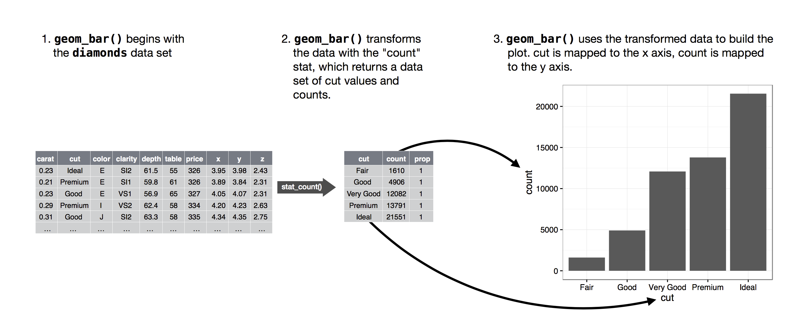

# 레이어 (Layers) {#sec-layers}

```{r}
#| echo: false
source("_common.R")
```

## 소개 (Introduction)

@sec-data-visualization에서 여러분은 산점도, 막대 차트, 상자 그림을 만드는 방법 그 이상의 것을 배웠습니다.
여러분이 배운 것은 ggplot2를 사용하여 *어떤* 유형의 플롯이든 만드는 데 사용할 수 있는 기초(foundation)입니다.

이 장에서는 그래픽의 레이어 문법(layered grammar of graphics)에 대해 배우면서 그 기초를 확장할 것입니다.
심미성 매핑(aesthetic mappings), 기하 객체(geometric objects), 패싯(facets)에 대해 더 깊이 알아보는 것으로 시작하겠습니다.
그런 다음 플롯을 생성할 때 ggplot2가 내부적으로 수행하는 통계적 변환(statistical transformations)에 대해 배울 것입니다.
이러한 변환은 막대 플롯의 막대 높이나 상자 그림의 중앙값과 같이 플롯할 새로운 값을 계산하는 데 사용됩니다.
또한 플롯에 지옴(geoms)이 표시되는 방식을 수정하는 위치 조정(position adjustments)에 대해서도 배웁니다.
마지막으로 좌표계(coordinate systems)를 간략하게 소개합니다.

이러한 각 레이어에 대한 모든 단일 함수와 옵션을 다루지는 않겠지만, ggplot2에서 제공하는 가장 중요하고 일반적으로 사용되는 기능을 안내하고 ggplot2를 확장하는 패키지들을 소개할 것입니다.

### 전제 조건 (Prerequisites)

이 장은 ggplot2에 중점을 둡니다.
이 장에서 사용된 데이터셋, 도움말 페이지 및 함수에 액세스하려면 다음 코드를 실행하여 tidyverse를 로드하세요.

```{r}
#| label: setup
#| message: false
library(tidyverse)
```

## 심미성 매핑 (Aesthetic mappings)

> "그림의 가장 큰 가치는 전혀 기대하지 않았던 것을 보게 만들 때 나타난다." --- 존 튜키(John Tukey)

ggplot2 패키지와 함께 번들로 제공되는 `mpg` 데이터 프레임에는 `r mpg |> distinct(model) |> nrow()`개의 자동차 모델에 대한 `r nrow(mpg)`개의 관측치가 포함되어 있다는 것을 기억하세요.

```{r}
mpg
```

`mpg`의 변수 중에는 다음이 있습니다.

1.  `displ`: 자동차의 엔진 크기(리터).
    숫자형(numerical) 변수입니다.

2.  `hwy`: 고속도로에서의 자동차 연료 효율(mpg, 갤런당 마일).
    연료 효율이 낮은 자동차는 같은 거리를 주행할 때 연료 효율이 높은 자동차보다 더 많은 연료를 소비합니다.
    숫자형 변수입니다.

3.  `class`: 자동차의 유형.
    범주형(categorical) 변수입니다.

다양한 `class`의 자동차에 대해 `displ`과 `hwy`의 관계를 시각화하는 것으로 시작해 보겠습니다.
숫자형 변수가 `x` 및 `y` 심미성에 매핑되고 범주형 변수가 `color` 또는 `shape`과 같은 심미성에 매핑되는 산점도를 사용하여 이를 수행할 수 있습니다.

```{r}
#| layout-ncol: 2
#| fig-width: 4
#| fig-alt: |
#|   나란히 있는 두 개의 산점도로, 둘 다 자동차의 고속도로 연료 
#|   효율 대 엔진 크기를 시각화하고 음의 
#|   연관성을 보여줍니다. 왼쪽 플롯에서 class는 색상 
#|   심미성에 매핑되어 각 class에 대해 다른 색상을 
#|   나타냅니다. 오른쪽 플롯에서 class는 모양 심미성에 매핑되어 
#|   suv를 제외한 각 class에 대해 다른 플롯 문자 모양을 
#|   나타냅니다. 각 플롯에는 색상 또는 모양과 
#|   class 변수의 수준 간의 매핑을 보여주는 범례가 함께 
#|   제공됩니다.
# Left
ggplot(mpg, aes(x = displ, y = hwy, color = class)) +
  geom_point()

# Right
ggplot(mpg, aes(x = displ, y = hwy, shape = class)) +
  geom_point()
```

`class`가 `shape`에 매핑되면 두 가지 경고가 표시됩니다.

> 1: The shape palette can deal with a maximum of 6 discrete values because more than 6 becomes difficult to discriminate; you have 7.
> Consider specifying shapes manually if you must have them.
> (모양 팔레트는 최대 6개의 이산형 값을 처리할 수 있습니다. 6개를 넘어가면 구별하기 어려워지기 때문입니다. 현재 7개가 있습니다.
> 반드시 모양을 지정해야 한다면 수동으로 모양을 지정하는 것을 고려해 보세요.)
>
> 2: Removed 62 rows containing missing values (`geom_point()`).
> (결측값이 포함된 62개의 행이 제거되었습니다 (`geom_point()`).)

ggplot2는 기본적으로 한 번에 6개의 모양만 사용하므로 모양 심미성을 사용하면 추가 그룹은 플롯되지 않은 상태로 유지됩니다.
두 번째 경고도 관련이 있습니다. 데이터셋에 62대의 SUV가 있으며 이들은 플롯되지 않습니다.

마찬가지로 `class`를 `size` 또는 `alpha` 심미성에 매핑할 수 있으며, 이는 각각 점의 크기와 투명도를 제어합니다.

```{r}
#| layout-ncol: 2
#| fig-width: 4
#| fig-alt: |
#|   나란히 있는 두 개의 산점도로, 둘 다 자동차의 고속도로 연료 
#|   효율 대 엔진 크기를 시각화하고 음의 
#|   연관성을 보여줍니다. 왼쪽 플롯에서 class는 크기 
#|   심미성에 매핑되어 각 class에 대해 다른 크기를 
#|   나타냅니다. 오른쪽 플롯에서 class는 알파 심미성에 매핑되어 
#|   각 class에 대해 다른 알파(투명도) 수준을 나타냅니다. 
#|   각 플롯에는 크기 또는 알파 수준과 
#|   class 변수의 수준 간의 매핑을 보여주는 범례가 함께 
#|   제공됩니다.
# Left
ggplot(mpg, aes(x = displ, y = hwy, size = class)) +
  geom_point()

# Right
ggplot(mpg, aes(x = displ, y = hwy, alpha = class)) +
  geom_point()
```

이 두 가지 모두 경고를 생성합니다.

> Using alpha for a discrete variable is not advised.
> (이산형 변수에 대해 alpha를 사용하는 것은 권장되지 않습니다.)

순서가 없는 이산형(범주형) 변수(`class`)를 순서가 있는 심미성(`size` 또는 `alpha`)에 매핑하는 것은 실제로는 존재하지 않는 순위(ranking)를 의미하므로 일반적으로 좋은 생각이 아닙니다.

일단 심미성을 매핑하면 나머지는 ggplot2가 알아서 처리합니다.
이 심미성과 함께 사용할 합리적인 스케일(scale)을 선택하고, 수준(levels)과 값(values) 간의 매핑을 설명하는 범례(legend)를 구성합니다.
x 및 y 심미성에 대해 ggplot2는 범례를 만들지 않지만 눈금 마크(tick marks)와 라벨이 있는 축 선(axis line)을 만듭니다.
축 선은 범례와 동일한 정보를 제공합니다. 즉 위치와 값 간의 매핑을 설명합니다.

모양(appearance)을 결정하기 위해 변수 매핑에 의존하는 대신 `aes()`의 *외부*에서 지옴 함수의 인수로 지옴의 시각적 속성을 수동으로 설정할 수도 있습니다.
예를 들어 플롯의 모든 점을 파란색으로 만들 수 있습니다.

```{r}
#| fig-alt: |
#|   음의 연관성을 보여주는 자동차의 고속도로 연료 효율 대 엔진 크기의 
#|   산점도. 모든 점은 파란색입니다.
ggplot(mpg, aes(x = displ, y = hwy)) + 
  geom_point(color = "blue")
```

여기서 색상은 변수에 대한 정보를 전달하지 않고 플롯의 모양만 변경합니다.
해당 심미성에 적합한 값을 선택해야 합니다.

-   문자열로 된 색상 이름, 예: `color = "blue"`
-   mm 단위의 점 크기, 예: `size = 1`
-   숫자로 된 점 모양, 예: @fig-shapes에 표시된 대로 `shape = 1`

```{r}
#| label: fig-shapes
#| echo: false
#| warning: false
#| fig.asp: 0.364
#| fig-align: "center"
#| fig-cap: |
#|   R에는 숫자로 식별되는 26개의 내장 모양이 있습니다. 일부 
#|   중복되어 보이는 것들이 있습니다. 예를 들어 0, 15, 22는 모두 정사각형입니다. 
#|   차이는 `color`와 `fill` 
#|   심미성의 상호 작용에서 비롯됩니다. 속이 빈 모양(0~14)은 `color`에 의해 테두리가 결정되고, 
#|   속이 찬 모양(15~20)은 `color`로 채워지며, 채워진 모양 
#|   (21~25)은 `color`의 테두리를 갖고 `fill`로 채워집니다. 비슷한 모양끼리 
#|   옆에 있도록 배열되어 있습니다.  
#| fig-alt: |
#|   모양과 이를 나타내는 숫자 간의 매핑: 0 - 속이 빈 정사각형, 
#|   1 - 속이 빈 원, 2 - 속이 빈 삼각형, 3 - 플러스, 4 - 십자가, 5 - 속이 빈 다이아몬드, 
#|   6 - 속이 빈 역삼각형, 7 - 정사각형 십자가, 8 - 별표, 9 - 다이아몬드 플러스, 
#|   10 - 원 플러스, 11 - 별, 12 - 정사각형 플러스, 
#|   13 - 원 십자가, 14 - 정사각형 삼각형, 15 - 정사각형, 
#|   16 - 작은 원, 17 - 삼각형, 18 - 다이아몬드, 
#|   19 - 원, 20 - 총알, 21 - 채워진 원, 
#|   22 - 채워진 정사각형, 23 - 채워진 다이아몬드, 24 - 채워진 삼각형, 
#|   25 - 채워진 역삼각형.
shapes <- tibble(
  shape = c(0, 1, 2, 5, 3, 4, 6:19, 22, 21, 24, 23, 20, 25),
  x = (0:25 %/% 5) / 2,
  y = (-(0:25 %% 5)) / 4
)
ggplot(shapes, aes(x, y)) + 
  geom_point(aes(shape = shape), size = 5, fill = "red") +
  geom_text(aes(label = shape), hjust = 0, nudge_x = 0.15) +
  scale_shape_identity() +
  expand_limits(x = 4.1) +
  scale_x_continuous(NULL, breaks = NULL) + 
  scale_y_continuous(NULL, breaks = NULL, limits = c(-1.2, 0.2)) + 
  theme_minimal() +
  theme(aspect.ratio = 1/2.75)
```

지금까지 point 지옴을 사용할 때 산점도에서 매핑하거나 설정할 수 있는 심미성에 대해 논의했습니다.
<https://ggplot2.tidyverse.org/articles/ggplot2-specs.html>의 심미성 사양 비넷(aesthetic specifications vignette)에서 가능한 모든 심미성 매핑에 대해 자세히 알아볼 수 있습니다.

플롯에 사용할 수 있는 특정 심미성은 데이터를 나타내는 데 사용하는 지옴에 따라 다릅니다.
다음 섹션에서는 지옴에 대해 자세히 알아봅니다.

### 연습 문제 (Exercises)

1.  점이 분홍색으로 채워진 삼각형인 `hwy` 대 `displ`의 산점도를 만드세요.

2.  다음 코드가 파란색 점이 있는 플롯을 생성하지 않은 이유는 무엇입니까?

    ```{r}
    #| fig-show: hide
    #| fig-alt: |
    #|   음의 연관성을 보여주는 자동차의 고속도로 연료 효율 대 엔진 크기의 
    #|   산점도. 모든 점은 빨간색이고 
    #|   범례에는 blue라는 단어에 매핑된 빨간색 점이 표시됩니다.
    ggplot(mpg) + 
      geom_point(aes(x = displ, y = hwy, color = "blue"))
    ```

3.  `stroke` 심미성은 무엇을 하나요?
    어떤 모양과 함께 작동하나요?
    (힌트: `?geom_point` 사용)

4.  변수 이름이 아닌 다른 것, 예를 들어 `aes(color = displ < 5)`와 같이 심미성을 매핑하면 어떻게 됩니까?
    참고로, x와 y도 지정해야 합니다.

## 기하 객체 (Geometric objects) {#sec-geometric-objects}

이 두 플롯은 어떻게 비슷한가요?

```{r}
#| echo: false
#| message: false
#| layout-ncol: 2
#| fig-width: 3
#| fig-alt: |
#|   두 개의 플롯이 있습니다. 왼쪽 플롯은 자동차의 엔진 크기 대 고속도로 
#|   연료 효율의 산점도이고 오른쪽 플롯은 
#|   이들 변수 간 관계의 궤적을 따르는 매끄러운 
#|   곡선을 보여줍니다. 매끄러운 곡선 주변의 신뢰 구간도 
#|   표시됩니다.
ggplot(mpg, aes(x = displ, y = hwy)) + 
  geom_point()

ggplot(mpg, aes(x = displ, y = hwy)) + 
  geom_smooth()
```

두 플롯 모두 동일한 x 변수, 동일한 y 변수를 포함하며 동일한 데이터를 설명합니다.
하지만 플롯이 동일하지는 않습니다.
각 플롯은 데이터를 나타내기 위해 다른 기하 객체(geometric object), 즉 지옴(geom)을 사용합니다.
왼쪽의 플롯은 point 지옴을 사용하고 오른쪽의 플롯은 데이터에 적합된(fitted) 매끄러운 선인 smooth 지옴을 사용합니다.

플롯에서 지옴을 변경하려면 `ggplot()`에 추가하는 지옴 함수를 변경하세요.
예를 들어 위와 같은 플롯을 만들려면 다음 코드를 사용할 수 있습니다.

```{r}
#| fig-show: hide
# Left
ggplot(mpg, aes(x = displ, y = hwy)) + 
  geom_point()

# Right
ggplot(mpg, aes(x = displ, y = hwy)) + 
  geom_smooth()
```
ggplot2의 모든 지옴 함수는 지옴 레이어에 로컬로 정의되거나 `ggplot()` 레이어에 글로벌로 정의된 `mapping` 인수를 사용합니다.
그러나 모든 심미성이 모든 지옴에서 작동하는 것은 아닙니다.
점의 모양을 설정할 수는 있지만 선의 "모양(shape)"을 설정할 수는 없습니다.
시도하더라도 ggplot2는 그 심미성 매핑을 조용히 무시합니다.
반면 선의 선종류(linetype)는 설정할 *수 있습니다*.
`geom_smooth()`는 여러분이 선종류에 매핑한 변수의 각 고유한 값에 대해 다른 선종류를 가진 다른 선을 그립니다.

```{r}
#| message: false
#| layout-ncol: 2
#| fig-width: 3
#| fig-alt: |
#|   자동차의 고속도로 연료 효율 대 엔진 크기에 대한 두 개의 플롯.
#|   데이터는 매끄러운 곡선으로 나타납니다. 왼쪽에는 선종류가 모두 같은 
#|   세 개의 매끄러운 곡선이 있습니다. 오른쪽에는 각 구동계(drive train) 유형에 대해 
#|   선종류(실선, 파선 또는 긴 파선)가 다른 세 개의 매끄러운 곡선이 
#|   있습니다. 두 플롯 모두에서 매끄러운 곡선 주위의 신뢰 
#|   구간도 표시됩니다.
# Left
ggplot(mpg, aes(x = displ, y = hwy, shape = drv)) + 
  geom_smooth()

# Right
ggplot(mpg, aes(x = displ, y = hwy, linetype = drv)) + 
  geom_smooth()
```

여기서 `geom_smooth()`는 자동차의 구동계(drive train)를 설명하는 `drv` 값에 따라 자동차를 세 개의 선으로 분리합니다.
한 선은 `4` 값을 갖는 모든 점을 설명하고, 한 선은 `f` 값을 갖는 모든 점을 설명하며, 한 선은 `r` 값을 갖는 모든 점을 설명합니다.
여기서 `4`는 4륜 구동(four-wheel drive), `f`는 전륜 구동(front-wheel drive), `r`은 후륜 구동(rear-wheel drive)을 의미합니다.

이것이 이상하게 들린다면 원시 데이터(raw data) 위에 선을 오버레이(overlaying)한 다음 `drv`에 따라 모든 것을 색칠하여 더 명확하게 만들 수 있습니다.

```{r}
#| message: false
#| fig-alt: |
#|   자동차의 고속도로 연료 효율 대 엔진 크기 플롯. 데이터는 
#|   점(구동계별로 색칠됨)뿐만 아니라 매끄러운 곡선(선종류 또한 
#|   구동계에 따라 결정됨)으로 나타납니다. 
#|   매끄러운 곡선 주위의 신뢰 구간도 표시됩니다.
ggplot(mpg, aes(x = displ, y = hwy, color = drv)) + 
  geom_point() +
  geom_smooth(aes(linetype = drv))
```

이 플롯에는 동일한 그래프에 두 개의 지옴이 포함되어 있다는 점에 유의하세요.

`geom_smooth()`와 같은 많은 지옴은 여러 데이터 행을 표시하기 위해 단일 기하 객체를 사용합니다.
이러한 지옴의 경우 여러 객체를 그리려면 범주형 변수에 `group` 심미성을 설정할 수 있습니다.
ggplot2는 그룹화 변수의 각 고유 값에 대해 별도의 객체를 그립니다.
실제로 ggplot2는 이산형 변수에 심미성을 매핑할 때마다(위의 `linetype` 예제에서처럼) 자동으로 이러한 지옴에 대한 데이터를 그룹화합니다.
`group` 심미성 자체는 지옴에 범례나 구별되는 특징(distinguishing features)을 추가하지 않기 때문에 이 기능에 의존하는 것이 편리합니다.

```{r}
#| layout-ncol: 3
#| fig-width: 3
#| fig-asp: 1
#| message: false
#| fig-alt: |
#|   세 개의 플롯, 각각 y축은 고속도로 연료 효율이고 x축은 자동차의 엔진 크기이며 
#|   데이터는 매끄러운 곡선으로 표현됩니다.
#|   첫 번째 플롯은 이 두 변수만 가지고 있고, 가운데 플롯은 구동계의 
#|   각 수준에 대해 3개의 별도 매끄러운 곡선을 가지고 있으며, 오른쪽 
#|   플롯은 구동계의 각 수준에 대해 동일하게 3개의 별도 매끄러운 곡선이 
#|   있을 뿐만 아니라 곡선들이 다른 색상으로 그려집니다. 
#|   매끄러운 곡선 주위의 신뢰 구간 
#|   또한 표시됩니다.
# Left
ggplot(mpg, aes(x = displ, y = hwy)) +
  geom_smooth()

# Middle
ggplot(mpg, aes(x = displ, y = hwy)) +
  geom_smooth(aes(group = drv))

# Right
ggplot(mpg, aes(x = displ, y = hwy)) +
  geom_smooth(aes(color = drv), show.legend = FALSE)
```

지옴 함수에 매핑을 배치하면 ggplot2는 이를 해당 레이어에 대한 로컬 매핑으로 취급합니다.
이러한 매핑을 사용하여 *해당 레이어에 대해서만* 글로벌 매핑을 확장하거나 덮어씁니다(overwrite).
이렇게 하면 서로 다른 레이어에 서로 다른 심미성을 표시할 수 있습니다.

```{r}
#| message: false
#| fig-alt: |
#|   자동차의 고속도로 연료 효율 대 엔진 크기 산점도, 점은 
#|   자동차 class에 따라 색칠됩니다. 자동차의 고속도로 연료 효율 대 엔진 크기 간 
#|   관계의 궤적을 따르는 매끄러운 곡선이 주위에 
#|   신뢰 구간과 함께 겹쳐집니다.
ggplot(mpg, aes(x = displ, y = hwy)) + 
  geom_point(aes(color = class)) + 
  geom_smooth()
```

동일한 아이디어를 사용하여 각 레이어에 서로 다른 `data`를 지정할 수 있습니다.
여기서는 2인승(two-seater) 자동차를 강조하기 위해 빨간색 점과 속이 빈 원을 사용합니다.
`geom_point()`의 로컬 데이터 인수는 해당 레이어에 대해서만 `ggplot()`의 글로벌 데이터 인수를 무효화(overrides)합니다.

```{r}
#| message: false
#| fig-alt: |
#|   자동차의 고속도로 연료 효율 대 엔진 크기 산점도, 여기서 
#|   2인승 자동차는 빨간색 점과 속이 빈 원으로 강조 표시됩니다.
ggplot(mpg, aes(x = displ, y = hwy)) + 
  geom_point() + 
  geom_point(
    data = mpg |> filter(class == "2seater"), 
    color = "red"
  ) +
  geom_point(
    data = mpg |> filter(class == "2seater"), 
    shape = "circle open", size = 3, color = "red"
  )
```

지옴은 ggplot2의 기본적인 구성 요소(building blocks)입니다.
지옴을 변경하여 플롯의 모양(look)을 완전히 변환할 수 있으며, 서로 다른 지옴은 데이터의 서로 다른 특징을 드러낼 수 있습니다.
예를 들어 아래의 히스토그램과 밀도 플롯(density plot)은 고속도로 주행 거리(highway mileage)의 분포가 쌍봉형(bimodal)이고 오른쪽으로 꼬리가 긴 형태(right skewed)라는 것을 보여주는 반면 상자 그림(boxplot)은 두 개의 잠재적인 이상치(outliers)를 보여줍니다.

```{r}
#| layout-ncol: 3
#| fig-width: 3
#| fig-alt: |
#|   세 개의 플롯: 고속도로 주행 거리의 히스토그램, 
#|   밀도 플롯, 상자 그림.
# Left
ggplot(mpg, aes(x = hwy)) +
  geom_histogram(binwidth = 2)

# Middle
ggplot(mpg, aes(x = hwy)) +
  geom_density()

# Right
ggplot(mpg, aes(x = hwy)) +
  geom_boxplot()
```

ggplot2는 40개 이상의 지옴을 제공하지만 이것들이 만들 수 있는 모든 가능한 플롯을 커버하지는 않습니다.
다른 지옴이 필요한 경우 다른 사람이 이미 구현했는지 먼저 확장 패키지(extension packages)를 찾아보는 것이 좋습니다(샘플링은 <https://exts.ggplot2.tidyverse.org/gallery/> 참조).
예를 들어 **ggridges** 패키지([https://wilkelab.org/ggridges](https://wilkelab.org/ggridges/){.uri})는 릿지라인 플롯(ridgeline plots)을 만드는 데 유용하며, 이는 범주형 변수의 다양한 수준에 대한 숫자형 변수의 밀도를 시각화하는 데 유용할 수 있습니다.
다음 플롯에서는 새로운 지옴(`geom_density_ridges()`)을 사용했을 뿐만 아니라 동일한 변수를 여러 심미성(`drv`를 `y`, `fill` 및 `color`에)에 매핑하고 밀도 곡선을 투명하게 만들기 위해 심미성을 설정(`alpha = 0.5`)했습니다.

```{r}
#| fig-asp: 0.33
#| fig-alt: 
#|   후륜(rear wheel), 전륜(front wheel), 4륜(4-wheel drive) 구동 자동차에 대한 
#|   고속도로 주행 거리의 밀도 곡선이 따로 플롯됩니다. 
#|   후륜 및 4륜 구동 자동차의 분포는 
#|   쌍봉형이고 대략 대칭적인 반면 전륜 구동 자동차는 
#|   단봉형(unimodal)이고 오른쪽으로 꼬리가 깁니다.
library(ggridges)

ggplot(mpg, aes(x = hwy, y = drv, fill = drv, color = drv)) +
  geom_density_ridges(alpha = 0.5, show.legend = FALSE)
```

ggplot2가 제공하는 모든 지옴과 패키지의 모든 함수에 대한 포괄적인 개요를 볼 수 있는 가장 좋은 곳은 참조 페이지인 <https://ggplot2.tidyverse.org/reference>입니다.
단일 지옴에 대해 더 자세히 알아보려면 도움말(`?geom_smooth`)을 사용하세요.

### 연습 문제 (Exercises)

1.  선 차트(line chart)를 그리려면 어떤 지옴을 사용하시겠습니까?
    상자 그림(boxplot)은요?
    히스토그램(histogram)은요?
    영역 차트(area chart)는요?

2.  이 장의 앞부분에서 우리는 설명 없이 `show.legend`를 사용했습니다.

    ```{r}
    #| fig-show: hide
    #| message: false
    ggplot(mpg, aes(x = displ, y = hwy)) +
      geom_smooth(aes(color = drv), show.legend = FALSE)
    ```

    여기서 `show.legend = FALSE`는 무슨 역할을 하나요?
    제거하면 어떻게 되나요?
    앞에서 왜 그것을 사용했다고 생각하시나요?

3.  `geom_smooth()`에 대한 `se` 인수는 무슨 역할을 하나요?

4.  다음 그래프를 생성하는 데 필요한 R 코드를 재현(Recreate)하세요.
    플롯에 범주형 변수가 사용될 때마다 그것은 `drv`입니다.

    ```{r}
    #| echo: false
    #| message: false
    #| layout-ncol: 2
    #| fig-width: 3
    #| fig-alt: |
    #|   이 그림에는 3x2 그리드로 배열된 6개의 산점도가 있습니다. 
    #|   모든 플롯에서 자동차의 고속도로 연료 효율이 y축에 있고 
    #|   엔진 크기가 x축에 있습니다. 첫 번째 플롯은 매끄러운 곡선이 겹쳐진 
    #|   모든 검은색 점을 보여줍니다. 두 번째 플롯에서도 점들은 
    #|   모두 검은색이며 구동계의 각 수준에 대해 별도의 매끄러운 곡선이 
    #|   겹쳐져 있습니다. 세 번째 플롯에서 점과 매끄러운 곡선은 
    #|   구동계의 각 수준에 대해 다른 색상으로 표시됩니다. 네 번째 
    #|   플롯에서 점들은 구동계의 각 수준에 대해 다른 색상으로 
    #|   표시되지만 전체 데이터에 맞춰진 단일한 매끄러운 선만 
    #|   있습니다. 다섯 번째 플롯에서 점들은 구동계의 각 수준에 
    #|   대해 다른 색상으로 표시되며 선종류가 다른 
    #|   별도의 매끄러운 곡선이 구동계의 각 수준에 맞춰집니다. 그리고 
    #|   마지막으로 여섯 번째 플롯에서 점들은 구동계의 각 수준에 
    #|   대해 다른 색상으로 표시되며 두꺼운 흰색 테두리를 가집니다.
    ggplot(mpg, aes(x = displ, y = hwy)) + 
      geom_point() + 
      geom_smooth(se = FALSE)
    ggplot(mpg, aes(x = displ, y = hwy)) + 
      geom_smooth(aes(group = drv), se = FALSE) +
      geom_point()
    ggplot(mpg, aes(x = displ, y = hwy, color = drv)) + 
      geom_point() + 
      geom_smooth(se = FALSE)
    ggplot(mpg, aes(x = displ, y = hwy)) + 
      geom_point(aes(color = drv)) + 
      geom_smooth(se = FALSE)
    ggplot(mpg, aes(x = displ, y = hwy)) + 
      geom_point(aes(color = drv)) +
      geom_smooth(aes(linetype = drv), se = FALSE)
    ggplot(mpg, aes(x = displ, y = hwy)) + 
      geom_point(size = 4, color = "white") + 
      geom_point(aes(color = drv))
    ```

## 패싯 (Facets)

@sec-data-visualization에서 여러분은 범주형 변수를 기반으로 플롯을 각각 데이터의 부분 집합(subset) 하나를 표시하는 하위 플롯(subplots)으로 나누는 `facet_wrap()`을 사용한 패싯(faceting)에 대해 배웠습니다.

```{r}
#| fig-alt: |
#|   자동차의 고속도로 연료 효율 대 엔진 크기 산점도, 실린더 수별로 
#|   패싯 처리(faceted)되었으며 두 개의 행에 걸쳐 패싯이 표시됩니다.
ggplot(mpg, aes(x = displ, y = hwy)) + 
  geom_point() + 
  facet_wrap(~cyl)
```

두 변수의 조합(combination)으로 플롯을 패싯 처리하려면 `facet_wrap()`에서 `facet_grid()`로 전환하세요.
`facet_grid()`의 첫 번째 인수는 역시 공식(formula)이지만, 이번에는 `rows ~ cols` 형태의 양면(double sided) 공식입니다.

```{r}
#| fig-alt: |
#|   자동차의 고속도로 연료 효율 대 엔진 크기 산점도, 행에 걸쳐 
#|   실린더 수로 패싯 처리되고 열에 걸쳐 구동계 유형으로 
#|   패싯 처리되었습니다. 이로 인해 12개의 패싯으로 구성된 4x3 그리드가 생성됩니다. 
#|   이들 패싯 중 일부에는 관측치가 없습니다. 5기통 4륜 구동, 
#|   4기통 또는 5기통 전륜 구동,
#|   4기통 또는 5기통 전륜 구동.
ggplot(mpg, aes(x = displ, y = hwy)) + 
  geom_point() + 
  facet_grid(drv ~ cyl)
```

기본적으로 각 패싯은 x축과 y축에 대해 동일한 스케일과 범위를 공유합니다.
이는 패싯 전체에서 데이터를 비교하려는 경우 유용하지만, 각 패싯 내에서의 관계를 더 잘 시각화하려는 경우 제한적일 수 있습니다.
패싯 함수의 `scales` 인수를 `"free_x"`로 설정하면 열에 걸쳐 x축 스케일을 다르게 할 수 있고, `"free_y"`는 행에 걸쳐 y축 스케일을 다르게 할 수 있으며, `"free"`는 둘 다 허용합니다.

```{r}
#| fig-alt: |
#|   자동차의 고속도로 연료 효율 대 엔진 크기 산점도, 행에 걸쳐 
#|   실린더 수로 패싯 처리되고 열에 걸쳐 구동계 유형으로 
#|   패싯 처리되었습니다. 이로 인해 12개의 패싯으로 구성된 4x3 그리드가 생성됩니다. 
#|   이들 패싯 중 일부에는 관측치가 없습니다. 5기통 4륜 구동, 
#|   4기통 또는 5기통 전륜 구동. 행 내의 패싯들은 
#|   동일한 y-스케일을 공유하고 열 내의 패싯들은 
#|   동일한 x-스케일을 공유합니다.
ggplot(mpg, aes(x = displ, y = hwy)) + 
  geom_point() + 
  facet_grid(drv ~ cyl, scales = "free")
```

### 연습 문제 (Exercises)

1.  연속형 변수에 대해 패싯 처리하면 어떻게 되나요?

2.  위의 플롯에서 `facet_grid(drv ~ cyl)`를 사용했을 때 빈 셀들은 무엇을 의미하나요?
    다음 코드를 실행하세요.
    결과 플롯과 어떤 관련이 있나요?

    ```{r}
    #| fig-show: hide
    ggplot(mpg) + 
      geom_point(aes(x = drv, y = cyl))
    ```

3.  다음 코드는 어떤 플롯을 만드나요?
    `.`은 무슨 역할을 하나요?

    ```{r}
    #| fig-show: hide
    ggplot(mpg) + 
      geom_point(aes(x = displ, y = hwy)) +
      facet_grid(drv ~ .)

    ggplot(mpg) + 
      geom_point(aes(x = displ, y = hwy)) +
      facet_grid(. ~ cyl)
    ```

4.  이 섹션의 첫 번째 패싯 플롯을 살펴봅시다.

    ```{r}
    #| fig-show: hide
    ggplot(mpg) + 
      geom_point(aes(x = displ, y = hwy)) + 
      facet_wrap(~ cyl, nrow = 2)
    ```

    색상 심미성 대신 패싯 처리를 사용할 때의 이점은 무엇입니까?
    단점은 무엇입니까?
    데이터셋이 더 커진다면 그 균형이 어떻게 변할까요?

5.  `?facet_wrap`을 읽어보세요.
    `nrow`는 무슨 역할을 하나요?
    `ncol`은 무슨 역할을 하나요?
    개별 패널의 레이아웃을 제어하는 다른 옵션은 무엇입니까?
    `facet_grid()`에는 왜 `nrow` 및 `ncol` 인수가 없습니까?

6.  다음 플롯 중 어느 것이 서로 다른 구동계를 가진 자동차 간에 엔진 크기(`displ`)를 비교하기 더 쉽게 만드나요?
    이것은 패싯 변수를 행에 배치할지 열에 배치할지 결정하는 데 대해 무엇을 시사합니까?

    ```{r}
    #| fig-show: hide
    #| message: false
    ggplot(mpg, aes(x = displ)) + 
      geom_histogram() + 
      facet_grid(drv ~ .)

    ggplot(mpg, aes(x = displ)) + 
      geom_histogram() +
      facet_grid(. ~ drv)
    ```

7.  `facet_grid()` 대신 `facet_wrap()`을 사용하여 다음 플롯을 다시 만들어보세요.
    패싯 라벨의 위치는 어떻게 변경되나요?

    ```{r}
    #| fig-show: hide
    ggplot(mpg) + 
      geom_point(aes(x = displ, y = hwy)) +
      facet_grid(drv ~ .)
    ```

## 통계적 변환 (Statistical transformations)

`geom_bar()` 또는 `geom_col()`로 그려진 기본적인 막대 차트를 고려해 보세요.
다음 차트는 `cut`별로 그룹화된 `diamonds` 데이터셋의 총 다이아몬드 수를 표시합니다.
`diamonds` 데이터셋은 ggplot2 패키지에 있으며 각 다이아몬드의 `price`, `carat`, `color`, `clarity`, `cut`을 포함하여 약 54,000개의 다이아몬드에 대한 정보가 들어 있습니다.
차트를 보면 저품질 컷보다 고품질 컷 다이아몬드가 더 많이 있다는 것을 알 수 있습니다.

```{r}
#| fig-alt: |
#|   각 다이아몬드 컷의 개수를 나타내는 막대 차트. 약 1500개의 
#|   Fair, 5000개의 Good, 12000개의 Very Good, 14000개의 Premium, 22000개의 Ideal 컷 
#|   다이아몬드가 있습니다.
ggplot(diamonds, aes(x = cut)) + 
  geom_bar()
```

x축에는 `diamonds`의 변수인 `cut`이 표시됩니다.
y축에는 개수(count)가 표시되지만 개수는 `diamonds`의 변수가 아닙니다!
개수는 어디에서 올까요?
산점도와 같은 많은 그래프는 데이터셋의 원시 값(raw values)을 플롯합니다.
막대 차트와 같은 다른 그래프들은 플롯할 새로운 값을 계산합니다.

-   막대 차트, 히스토그램 및 빈도 다각형(frequency polygons)은 데이터를 구간(bin)으로 나누고 각 구간에 속하는 점의 수인 구간 개수를 플롯합니다.

-   스무더(Smoothers)는 데이터에 모델을 적합시킨(fit a model) 다음 모델의 예측값을 플롯합니다.

-   상자 그림(Boxplots)은 분포의 5가지 요약 수치(five-number summary)를 계산한 다음 그 요약을 특별한 형식의 상자로 표시합니다.

그래프의 새 값을 계산하는 데 사용되는 알고리즘을 통계적 변환(statistical transformation)의 줄임말인 **stat**이라고 합니다.
@fig-vis-stat-bar는 이 프로세스가 `geom_bar()`에서 어떻게 작동하는지 보여줍니다.

```{r}
#| label: fig-vis-stat-bar
#| echo: false
#| out-width: "100%"
#| fig-cap: |
#|   막대 차트를 만들 때 먼저 원시 데이터에서 시작하여
#|   각 막대의 관측치 수를 세기 위해 이를 집계(aggregate)하고,
#|   마지막으로 계산된 변수들을 플롯 심미성에 매핑합니다.
#| fig-alt: |
#|   막대 차트를 만드는 세 단계를 보여주는 그림. 
#|   1단계. geom_bar()는 diamonds 데이터셋으로 시작합니다. 2단계. geom_bar()는 
#|   count stat을 사용하여 데이터를 변환하여, cut 값과 
#|   개수의 데이터셋을 반환합니다. 3단계. geom_bar()는 변환된 데이터를 사용하여 
#|   플롯을 구성합니다. cut은 x축에 매핑되고 count는 y축에 매핑됩니다.

```

지옴이 어떤 stat을 사용하는지 알아보려면 `stat` 인수의 기본값을 검사하면 됩니다.
예를 들어 `?geom_bar`를 보면 `stat`의 기본값이 "count"임을 보여주며, 이는 `geom_bar()`가 `stat_count()`를 사용함을 의미합니다.
`stat_count()`는 `geom_bar()`와 같은 페이지에 문서화되어 있습니다.
아래로 스크롤하면 "Computed variables(계산된 변수)"라는 섹션에서 두 개의 새로운 변수(`count`와 `prop`)를 계산한다고 설명합니다.

모든 지옴에는 기본(default) stat이 있으며 모든 stat에는 기본 지옴이 있습니다.
이것은 일반적으로 기본 통계적 변환에 대해 걱정하지 않고 지옴을 사용할 수 있음을 의미합니다.
그러나 stat을 명시적으로 사용해야 하는 세 가지 이유가 있습니다.

1.  기본 stat을 재정의(override)하고 싶을 수 있습니다.
    아래 코드에서는 `geom_bar()`의 stat을 개수(count)(기본값)에서 항등(identity)으로 변경합니다.
    이렇게 하면 막대의 높이를 y 변수의 원시 값에 매핑할 수 있습니다.

    ```{r}
    #| warning: false
    #| fig-alt: |
    #|   각 다이아몬드 컷의 개수를 나타내는 막대 차트. 약 1500개의 
    #|   Fair, 5000개의 Good, 12000개의 Very Good, 14000개의 Premium, 22000개의 Ideal 컷 
    #|   다이아몬드가 있습니다.
    diamonds |>
      count(cut) |>
      ggplot(aes(x = cut, y = n)) +
      geom_bar(stat = "identity")
    ```

2.  변환된 변수에서 심미성으로의 기본 매핑을 재정의하고 싶을 수 있습니다.
    예를 들어 개수 대신 비율(proportions) 막대 차트를 표시하고 싶을 수 있습니다.

    ```{r}
    #| fig-alt: |
    #|   각 다이아몬드 컷의 비율을 나타내는 막대 차트. 대략 Fair 
    #|   다이아몬드가 0.03, Good 0.09, Very Good 0.22, Premium 0.26, 
    #|   Ideal 0.40을 차지합니다.
    ggplot(diamonds, aes(x = cut, y = after_stat(prop), group = 1)) + 
      geom_bar()
    ```

    stat에 의해 계산될 수 있는 가능한 변수를 찾으려면 `geom_bar()` 도움말에서 "computed variables"라는 제목의 섹션을 찾으세요.

3.  코드에서 통계적 변환에 더 많은 주의를 끌고 싶을 수 있습니다.
    예를 들어 고유한 각 x 값에 대한 y 값을 요약하는 `stat_summary()`를 사용하여 계산하려는 요약 수치에 주의를 끌 수 있습니다.

    ```{r}
    #| fig-alt: |
    #|   y축은 depth, x축은 다이아몬드의 cut(수준은 
    #|   fair, good, very good, premium, ideal)인 플롯. cut의 
    #|   각 수준에 대해 해당 cut 카테고리의 다이아몬드의 
    #|   최소 depth에서 최대 depth까지 수직선이 연장되고, 
    #|   중앙값 depth가 선 위에 점으로 표시됩니다.
    ggplot(diamonds) + 
      stat_summary(
        aes(x = cut, y = depth),
        fun.min = min,
        fun.max = max,
        fun = median
      )
    ```

ggplot2는 여러분이 사용할 수 있는 20개 이상의 stat을 제공합니다.
각 stat은 함수이므로 일반적인 방법(`?stat_bin`)으로 도움말을 볼 수 있습니다.

### 연습 문제 (Exercises)

1.  `stat_summary()`와 연관된 기본 지옴은 무엇인가요?
    stat 함수 대신 해당 지옴 함수를 사용하도록 이전 플롯을 어떻게 다시 작성할 수 있을까요?

2.  `geom_col()`은 무슨 역할을 하나요?
    `geom_bar()`와 어떻게 다른가요?

3.  대부분의 지옴과 stat은 거의 항상 함께 사용되는 쌍으로 제공됩니다.
    모든 쌍의 목록을 만드세요.
    그들은 어떤 공통점이 있나요?
    (힌트: 문서를 자세히 읽어보세요.)

4.  `stat_smooth()`는 어떤 변수들을 계산하나요?
    어떤 인수들이 그 동작을 제어하나요?

5.  비율 막대 차트에서 우리는 `group = 1`을 설정해야 했습니다.
    왜일까요?
    다시 말해 이 두 그래프의 문제는 무엇입니까?

    ```{r}
    #| fig-show: hide
    ggplot(diamonds, aes(x = cut, y = after_stat(prop))) + 
      geom_bar()
    ggplot(diamonds, aes(x = cut, fill = color, y = after_stat(prop))) + 
      geom_bar()
    ```

## 위치 조정 (Position adjustments)

막대 차트와 관련된 또 다른 마법이 있습니다.
`color` 심미성을 사용하거나, 더 유용하게는 `fill` 심미성을 사용하여 막대 차트에 색을 입힐 수 있습니다.

```{r}
#| layout-ncol: 2
#| fig-width: 4
#| fig-alt: |
#|   자동차의 구동 유형에 대한 두 개의 막대 차트. 첫 번째 플롯에서 막대는 
#|   색상 테두리를 가집니다. 두 번째 플롯에서는 색상으로 채워집니다. 
#|   막대의 높이는 각 drv 카테고리에 속한 자동차의 수에 
#|   해당합니다.
# Left
ggplot(mpg, aes(x = drv, color = drv)) + 
  geom_bar()

# Right
ggplot(mpg, aes(x = drv, fill = drv)) + 
  geom_bar()
```

fill 심미성을 `class`와 같은 다른 변수에 매핑하면 막대가 자동으로 누적(stacked)된다는 점에 유의하세요.
각 색상 사각형은 `drv`와 `class`의 조합을 나타냅니다.

```{r}
#| fig-alt: |
#|   자동차의 구동 유형에 대한 분할 막대 차트(Segmented bar chart), 
#|   여기서 각 막대는 자동차 class에 대한 색상으로 채워집니다. 막대의 높이는 각 구동 
#|   카테고리의 자동차 수에 해당하며, 색상이 칠해진 
#|   세그먼트의 높이는 특정 구동 유형 수준 내에서 특정 
#|   class 수준을 가진 자동차의 수를 나타냅니다.
ggplot(mpg, aes(x = drv, fill = class)) + 
  geom_bar()
```

누적(stacking)은 `position` 인수로 지정된 **위치 조정(position adjustment)**을 사용하여 자동으로 수행됩니다.
누적 막대 차트를 원하지 않으면 `"identity"`, `"dodge"`, `"fill"`의 세 가지 다른 옵션 중 하나를 사용할 수 있습니다.

-   `position = "identity"`는 각 객체를 그래프의 문맥에서 원래 위치에 정확히 배치합니다.
    막대가 겹치기 때문에 막대에는 그다지 유용하지 않습니다.
    이 겹침을 보려면 `alpha`를 작은 값으로 설정하여 막대를 약간 투명하게 만들거나 `fill = NA`를 설정하여 완전히 투명하게 만들어야 합니다.

    ```{r}
    #| layout-ncol: 2
    #| fig-width: 4
    #| fig-alt: |
    #|   자동차의 구동 유형에 대한 분할 막대 차트, 여기서 각 막대는 자동차 class에 대한 색상으로 채워집니다. 
    #|   색상이 칠해진 
    #|   세그먼트의 높이는 특정 구동 유형 수준 내에서 특정 class 
    #|   수준을 가진 자동차의 수를 나타냅니다. 그러나 세그먼트들이 겹칩니다. 
    #|   첫 번째 플롯에서 막대는 투명한 색상으로 채워져 있고
    #|   두 번째 플롯에서는 색상으로 윤곽선만 그려져 있습니다.
    # Left
    ggplot(mpg, aes(x = drv, fill = class)) + 
      geom_bar(alpha = 1/5, position = "identity")

    # Right
    ggplot(mpg, aes(x = drv, color = class)) + 
      geom_bar(fill = NA, position = "identity")
    ```

    항등(identity) 위치 조정은 기본값으로 사용되는 점(points)과 같은 2차원 지옴에 더 유용합니다.

-   `position = "fill"`은 누적처럼 작동하지만 각 누적 막대 세트의 높이를 같게 만듭니다.
    이렇게 하면 그룹 전체에서 비율을 쉽게 비교할 수 있습니다.

-   `position = "dodge"`는 겹치는 객체를 나란히 *옆에* 배치합니다.
    이렇게 하면 개별 값을 쉽게 비교할 수 있습니다.

    ```{r}
    #| layout-ncol: 2
    #| fig-width: 4
    #| fig-alt: |
    #|   왼쪽에는 자동차 구동 유형의 분할 막대 차트, 여기서 각 막대는 class 수준에 대한 색상으로 
    #|   채워져 있습니다. 각 막대의 높이는 1이고 색상이 칠해진 
    #|   세그먼트의 높이는 특정 구동 유형 내에서 특정 class 
    #|   수준을 가진 자동차의 비율을 나타냅니다.
    #|   오른쪽에는 자동차 구동 유형의 회피(dodged) 막대 차트. 회피된 막대들은 
    #|   구동 유형의 수준에 따라 그룹화됩니다. 각 그룹 내에서 막대들은 class의 
    #|   각 수준을 나타냅니다. 일부 class는 일부 구동 유형 내에 표시되고 다른 
    #|   구동 유형 내에는 표시되지 않아 각 그룹 내 막대 수가 다릅니다. 
    #|   이러한 막대의 높이는 주어진 수준의 구동 유형 및 class를 
    #|   가진 자동차의 수를 나타냅니다.
    # Left
    ggplot(mpg, aes(x = drv, fill = class)) + 
      geom_bar(position = "fill")

    # Right
    ggplot(mpg, aes(x = drv, fill = class)) + 
      geom_bar(position = "dodge")
    ```

막대 차트에는 유용하지 않지만 산점도에는 매우 유용할 수 있는 또 다른 유형의 조정이 있습니다.
첫 번째 산점도를 다시 떠올려보세요.
데이터셋에 234개의 관측치가 있음에도 불구하고 플롯에 126개의 점만 표시된다는 사실을 눈치채셨나요?

```{r}
#| echo: false
#| fig-alt: |
#|   음의 연관성을 보여주는 자동차의 고속도로 연료 효율 대 엔진 크기의 
#|   산점도.
ggplot(mpg, aes(x = displ, y = hwy)) + 
  geom_point()
```

기저(underlying)가 되는 `hwy`와 `displ` 값이 반올림되기 때문에 점들이 그리드(grid)에 나타나고 많은 점이 서로 겹칩니다.
이 문제를 **오버플로팅(overplotting)**이라고 합니다.
이러한 배치(arrangement)는 데이터의 분포를 보기 어렵게 만듭니다.
데이터 포인트가 그래프 전체에 균일하게 분포되어 있나요, 아니면 109개의 값이 포함된 `hwy`와 `displ`의 한 특별한 조합이 있나요?

위치 조정을 "jitter"로 설정하여 이 그리딩(gridding)을 피할 수 있습니다.
`position = "jitter"`는 각 점에 소량의 임의의 노이즈(random noise)를 추가합니다.
두 점이 같은 양의 임의의 노이즈를 받을 가능성이 없기 때문에 점들이 넓게 퍼집니다.

```{r}
#| fig-alt: |
#|   자동차의 고속도로 연료 효율 대 엔진 크기의 지터 처리된(Jittered) 산점도. 
#|   플롯은 음의 연관성을 보여줍니다.
ggplot(mpg, aes(x = displ, y = hwy)) + 
  geom_point(position = "jitter")
```

무작위성(randomness)을 추가하는 것이 플롯을 개선하는 이상한 방법처럼 보일 수 있지만 소규모에서는 그래프의 정확성을 떨어뜨리는 반면 대규모에서는 그래프를 *더* 잘 보여줍니다(revealing).
이것이 너무나 유용한 작업이므로 ggplot2에는 `geom_point(position = "jitter")`의 약어인 `geom_jitter()`가 함께 제공됩니다.

위치 조정에 대해 자세히 알아보려면 각 조정과 연결된 도움말 페이지(`?position_dodge`, `?position_fill`, `?position_identity`, `?position_jitter`, `?position_stack`)를 찾아보세요.

### 연습 문제 (Exercises)

1.  다음 플롯의 문제점은 무엇인가요?
    어떻게 개선할 수 있을까요?

    ```{r}
    #| fig-show: hide
    ggplot(mpg, aes(x = cty, y = hwy)) + 
      geom_point()
    ```

2.  만약 있다면, 이 두 플롯 사이의 차이점은 무엇입니까?
    이유는 무엇입니까?

    ```{r}
    #| fig-show: hide
    ggplot(mpg, aes(x = displ, y = hwy)) +
      geom_point()
    ggplot(mpg, aes(x = displ, y = hwy)) +
      geom_point(position = "identity")
    ```

3.  `geom_jitter()`에 전달하는 어떤 매개변수가 지터링(jittering)의 양을 제어합니까?

4.  `geom_jitter()`와 `geom_count()`를 비교하고 대조하세요.

5.  `geom_boxplot()`의 기본 위치 조정은 무엇입니까?
    이를 보여주는 `mpg` 데이터셋의 시각화를 만드세요.

## 좌표계 (Coordinate systems)

좌표계(Coordinate systems)는 아마도 ggplot2에서 가장 복잡한 부분일 것입니다.
기본 좌표계는 각 점의 위치를 결정하기 위해 x 위치와 y 위치가 독립적으로 작용하는 데카르트 좌표계(Cartesian coordinate system)입니다.
가끔 유용한 두 가지 다른 좌표계가 있습니다.

-   `coord_quickmap()`은 지리 지도(geographic maps)의 가로세로 비율(aspect ratio)을 올바르게 설정합니다.
    이것은 ggplot2로 공간 데이터(spatial data)를 플롯하는 경우 매우 중요합니다.
    이 책에서는 지도를 논의할 지면이 부족하지만 *ggplot2: Elegant graphics for data analysis*의 [Maps 장](https://ggplot2-book.org/maps.html)에서 자세히 알아볼 수 있습니다.

    ```{r}
    #| layout-ncol: 2
    #| fig-width: 3
    #| message: false
    #| fig-alt: |
    #|   뉴질랜드 경계의 두 지도. 첫 번째 플롯에서는 가로세로 
    #|   비율이 잘못되었고 두 번째 플롯에서는 올바릅니다.
    nz <- map_data("nz")

    ggplot(nz, aes(x = long, y = lat, group = group)) +
      geom_polygon(fill = "white", color = "black")

    ggplot(nz, aes(x = long, y = lat, group = group)) +
      geom_polygon(fill = "white", color = "black") +
      coord_quickmap()
    ```

-   `coord_polar()`는 극좌표(polar coordinates)를 사용합니다.
    극좌표는 막대 차트와 콕스콤 차트(Coxcomb chart, 나이팅게일의 장미 다이어그램) 사이의 흥미로운 연관성을 보여줍니다.

    ```{r}
    #| layout-ncol: 2
    #| fig-width: 3
    #| fig-asp: 1
    #| fig-alt: |
    #|   두 개의 플롯이 있습니다. 왼쪽은 다이아몬드 clarity에 대한 막대 차트이고, 
    #|   오른쪽은 동일한 데이터에 대한 콕스콤 차트입니다.
    bar <- ggplot(data = diamonds) + 
      geom_bar(
        mapping = aes(x = clarity, fill = clarity), 
        show.legend = FALSE,
        width = 1
      ) + 
      theme(aspect.ratio = 1)

    bar + coord_flip()
    bar + coord_polar()
    ```

### 연습 문제 (Exercises)

1.  `coord_polar()`를 사용하여 누적 막대 차트를 파이 차트(pie chart)로 바꾸세요.

2.  `coord_quickmap()`과 `coord_map()`의 차이점은 무엇인가요?

3.  다음 플롯은 도시와 고속도로 mpg의 관계에 대해 무엇을 알려주나요?
    `coord_fixed()`가 왜 중요할까요?
    `geom_abline()`은 무슨 역할을 하나요?

    ```{r}
    #| fig-show: hide
    ggplot(data = mpg, mapping = aes(x = cty, y = hwy)) +
      geom_point() + 
      geom_abline() +
      coord_fixed()
    ```

## 그래픽의 레이어 문법 (The layered grammar of graphics)

우리는 @sec-ggplot2-calls에서 배운 그래프 작성 템플릿에 위치 조정, stats, 좌표계, 패싯 처리를 추가하여 다음과 같이 확장할 수 있습니다.

```         
ggplot(data = <DATA>) + 
  <GEOM_FUNCTION>(
     mapping = aes(<MAPPINGS>),
     stat = <STAT>, 
     position = <POSITION>
  ) +
  <COORDINATE_FUNCTION> +
  <FACET_FUNCTION>
```

우리의 새로운 템플릿은 템플릿에 나타나는 대괄호로 묶인 단어들인 7개의 매개변수를 취합니다.
실제로는 ggplot2가 데이터, 매핑, 지옴 함수를 제외한 모든 것에 유용한 기본값을 제공하기 때문에 그래프를 만들기 위해 7개의 매개변수를 모두 제공해야 하는 경우는 거의 없습니다.

템플릿의 7개 매개변수는 플롯을 구축하기 위한 형식적 시스템(formal system)인 그래픽의 문법(grammar of graphics)을 구성합니다.
그래픽의 문법은 *어떤* 플롯이든 데이터셋, 지옴, 매핑 집합, stat, 위치 조정, 좌표계, 패싯 체계(faceting scheme) 및 테마(theme)의 조합으로 고유하게 설명할 수 있다는 통찰(insight)에 기반합니다.

이것이 어떻게 작동하는지 보려면 처음부터 기본적인 플롯을 어떻게 만들 수 있는지 생각해 보세요. 데이터셋으로 시작하여 표시하려는 정보로 변환할 수 있습니다(stat 사용).
다음으로, 변환된 데이터의 각 관측치를 나타낼 기하 객체를 선택할 수 있습니다.
그런 다음 지옴의 심미성 속성을 사용하여 데이터의 변수들을 나타낼 수 있습니다.
각 변수의 값을 심미성의 수준(levels)에 매핑하게 됩니다.
이러한 단계는 @fig-visualization-grammar에 나와 있습니다.
그 후에는 x와 y 변수의 값을 표시하기 위해 객체의 위치(그 자체로 심미성 속성임)를 사용하여 지옴을 배치할 좌표계를 선택할 것입니다.

```{r}
#| label: fig-visualization-grammar
#| echo: false
#| fig-alt: |
#|   원시 데이터에서 각 행이 cut의 한 수준을 나타내고 count 열이 
#|   해당 cut 수준에 얼마나 많은 다이아몬드가 있는지 보여주는 빈도 테이블로 
#|   가는 단계를 보여주는 그림. 그런 다음 이러한 값이 
#|   막대 높이에 매핑됩니다.
#| fig-cap: |
#|   원시 데이터에서 빈도 테이블을 거쳐 막대 높이가 빈도를 나타내는 막대 플롯으로 가는 단계.
knitr::include_graphics("images/visualization-grammar.png")
```

이 시점에서 완전한 그래프를 갖게 되지만 좌표계 내에서 지옴의 위치(위치 조정)를 더 조정하거나 그래프를 하위 플롯(패싯)으로 분할할 수도 있습니다.
또한 각각의 추가 레이어가 데이터셋, 지옴, 매핑 집합, stat 및 위치 조정을 사용하는 하나 이상의 추가 레이어를 더해 플롯을 확장할 수도 있습니다.

여러분이 상상하는 *어떤* 플롯이든 이 방법을 사용하여 만들 수 있습니다.
다시 말해 이 장에서 배운 코드 템플릿을 사용하여 수십만 개의 고유한 플롯을 만들 수 있습니다.

ggplot2의 이론적 기초에 대해 더 자세히 알고 싶다면 ggplot2의 이론을 상세히 설명한 과학 논문인 "[The Layered Grammar of Graphics](https://vita.had.co.nz/papers/layered-grammar.pdf)"를 읽어보시기를 권합니다.

## 요약 (Summary)

이 장에서는 그래픽의 레이어 문법에 대해 배웠습니다. 간단한 플롯을 만들기 위한 심미성과 기하 구조, 플롯을 부분 집합으로 분할하기 위한 패싯, 지옴이 어떻게 계산되는지 이해하기 위한 통계, 지옴이 겹칠 수 있을 때 위치의 세부 사항을 제어하기 위한 위치 조정, 그리고 `x`와 `y`가 의미하는 바를 근본적으로 바꿀 수 있게 해주는 좌표계에 대해 배웠습니다.
아직 다루지 않은 하나의 레이어는 테마(theme)이며, 이는 @sec-themes에서 소개할 것입니다.

전체 ggplot2 기능의 개요를 얻을 수 있는 두 가지 매우 유용한 리소스는 ggplot2 치트시트(<https://posit.co/resources/cheatsheets>에서 찾을 수 있음)와 ggplot2 패키지 웹사이트([https://ggplot2.tidyverse.org](https://ggplot2.tidyverse.org/))입니다.

이 장에서 얻어야 할 중요한 교훈(lesson)은 ggplot2에서 제공하지 않는 지옴이 필요하다고 느낄 때, 누군가 이미 해당 지옴을 제공하는 ggplot2 확장 패키지를 만들어 여러분의 문제를 해결해 두지는 않았는지 항상 알아보는 것이 좋다는 것입니다.
