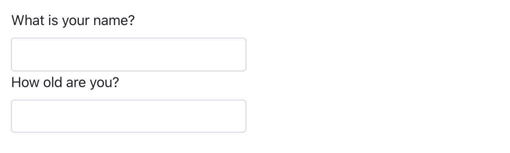

# Quarto 형식 (Quarto formats) {#sec-quarto-formats}

```{r}
#| echo: false
source("_common.R")
```

## 소개 (Introduction)

지금까지(So far) HTML 문서를 생성하는 데 Quarto가 사용되는 것을 보았습니다(seen).
이 장에서는 Quarto로 생성할 수 있는 다른 여러(many other) 유형의 출력(output)에 대해 간략하게(brief) 살펴봅니다(overview).

문서의 출력을 설정하는 방법에는 두 가지가 있습니다:

1.  YAML 헤더를 수정(modifying)하여 영구적으로(Permanently) 설정:

    ``` yaml
    title: "다이아몬드 크기(Diamond sizes)"
    format: html
    ```

2.  `quarto::quarto_render()`를 수동으로(by hand) 호출하여 일시적으로(Transiently) 설정:

    ```{r}
    #| eval: false
    quarto::quarto_render("diamond-sizes.qmd", output_format = "docx")
    ```

    `output_format` 인수는 값의 리스트(list of values)도 취할 수 있으므로(can also take), 여러 유형의 출력을 프로그래밍 방식(programmatically)으로 생성하려는 경우 이 방법이 유용합니다.

    ```{r}
    #| eval: false
    quarto::quarto_render("diamond-sizes.qmd", output_format = c("docx", "pdf"))
    ```

## 출력 옵션 (Output options)

Quarto는 매우 다양한(wide range of) 출력 형식을 제공(offers)합니다.
<https://quarto.org/docs/output-formats/all-formats.html>에서 전체 리스트(complete list)를 확인할 수 있습니다.
많은 형식이 일부(some) 출력 옵션을 공유하지만(share)(예: 목차(table of contents)를 포함하기 위한 `toc: true`), 일부 다른 형식에는 형식별로 지정된 옵션이 있습니다(예: `code-fold: true`는 HTML 출력의 경우 사용자가 요청 시(on demand) 표시할 수 있도록 코드 청크를 `<details>` 태그로 축소(collapses)하지만, PDF 또는 Word 문서에는 적용되지 않음(not applicable)).

기본(default) 옵션을 재정의(override)하려면 확장된(expanded) `format` 필드를 사용해야 합니다.
예를 들어 플로팅(floating) 목차가 있는 `html`을 렌더링(render)하려면 다음과 같이 사용합니다:

``` yaml
format:
  html:
    toc: true
    toc_float: true
```

형식 리스트(list of formats)를 제공(supplying)하여 여러 출력으로 렌더링할 수도(even) 있습니다:

``` yaml
format:
  html:
    toc: true
    toc_float: true
  pdf: default
  docx: default
```

기본 옵션을 재정의하지 않으려면 특수한 구문(special syntax)(`pdf: default`)에 유의(Note)하세요.

문서의 YAML에 지정된(specified) 모든 형식으로 렌더링하려면 `output_format = "all"`을 사용할 수 있습니다.

```{r}
#| eval: false
quarto::quarto_render("diamond-sizes.qmd", output_format = "all")
```

## 문서 (Documents)

이전(previous) 장에서는 기본 `html` 출력에 초점을 맞추었습니다(focused on).
이 주제(theme)에는 다양한 유형의 문서를 생성하는 몇 가지 기본(basic) 변형(variations)이 있습니다.
예를 들면(For example):

-   `pdf`는 설치(install)해야 하는 LaTeX(오픈 소스 문서 레이아웃 시스템)를 사용하여 PDF를 만듭니다(makes).
    아직 설치하지 않은 경우 RStudio에서 설치 메시지(prompt)를 표시합니다.

-   Microsoft Word(`.docx`) 문서의 경우 `docx`.

-   OpenDocument Text(`.odt`) 문서의 경우 `odt`.

-   서식 있는 텍스트 형식(Rich Text Format)(`.rtf`) 문서의 경우 `rtf`.

-   GitHub Flavored Markdown(`.md`) 문서의 경우 `gfm`.

-   Jupyter Notebooks(`.ipynb`)의 경우 `ipynb`.

의사 결정자(decision-makers)와 공유할 문서를 생성할 때 문서 YAML에서 전역(global) 옵션을 설정하여 기본 코드 표시를 끌 수(turn off) 있음을 기억하세요(Remember):

``` yaml
execute:
  echo: false
```

`html` 문서의 경우 또 다른 옵션(another option)은 코드 청크를 기본적으로 숨김(hidden) 상태로 만들고, 클릭하면 표시(visible)되도록 하는 것입니다:

``` yaml
format:
  html:
    code: true
```

## 프레젠테이션 (Presentations)

Quarto를 사용하여 프레젠테이션을 생성(produce)할 수도 있습니다.
Keynote나 PowerPoint와 같은 도구보다 시각적 제어(visual control)는 떨어지지만(get less), R 코드의 결과(results)를 프레젠테이션에 자동으로(automatically) 삽입(inserting)하면 엄청난(huge amount of) 시간을 절약할 수 있습니다.
프레젠테이션은 콘텐츠를 슬라이드(slides)로 분할(dividing)하는 방식으로 작동(work)하며, 각 2단계(`##`) 헤더(header)에서 새 슬라이드가 시작(beginning)됩니다.
또한(Additionally) 1단계(`#`) 헤더는 기본적으로(by default) 가운데 중앙(centered in the middle)에 맞춰진 섹션 제목 슬라이드가 있는 새 섹션의 시작을 나타냅니다(indicate).

Quarto는 다음을 포함하여(including) 다양한 프레젠테이션 형식을 지원(supports)합니다:

1.  `revealjs` - revealjs를 사용한 HTML 프레젠테이션

2.  `pptx` - PowerPoint 프레젠테이션

3.  `beamer` - LaTeX Beamer를 사용한 PDF 프레젠테이션.

Quarto로 프레젠테이션을 만드는 방법에 대한 자세한 내용(read more)은 [https://quarto.org/docs/presentations](https://quarto.org/docs/presentations/)에서 확인할 수 있습니다.

## 상호 작용 (Interactivity)

다른(any) HTML 문서와 마찬가지로(Just like), Quarto로 만든(created with) HTML 문서에도 대화형(interactive) 구성 요소(components)를 포함(contain)할 수 있습니다(as well).
여기서는 Quarto 문서에 상호 작용(interactivity)을 포함하기 위한 두 가지 옵션인 htmlwidgets와 Shiny를 소개(introduce)합니다.

### htmlwidgets

HTML은 대화형 형식(interactive format)이며 대화형 HTML 시각화(visualizations)를 생성하는 R 함수인 **htmlwidgets**를 사용하여 그 상호 작용을 활용(take advantage of)할 수 있습니다.
예를 들어 아래의 **leaflet** 지도를 살펴보세요(take).
웹에서 이 페이지를 보고(viewing) 있는 경우 지도를 드래그하여 이동(drag around)하고, 확대/축소(zoom in and out)하는 등의 작업을 할 수 있습니다.
분명히(obviously) 책에서는 그렇게 할 수 없으므로(can't do that) Quarto가 자동으로 정적 스크린샷(static screenshot)을 삽입해 줍니다.

```{r}
#| fig-alt: 망가화우(Maungawhau) / 에덴 산(Mount Eden)의 Leaflet 지도.
library(leaflet)
leaflet() |>
  setView(174.764, -36.877, zoom = 16) |> 
  addTiles() |>
  addMarkers(174.764, -36.877, popup = "Maungawhau") 
```

htmlwidgets의 좋은 점(great thing)은 사용하기 위해 HTML이나 JavaScript에 대해 전혀 몰라도(don't need to know anything) 된다는 것입니다.
모든 세부 사항이 패키지 내부에(inside) 래핑되어(wrapped) 있으므로 걱정(worry)할 필요가 없습니다.

다음을 포함하여 htmlwidgets를 제공하는 여러(many) 패키지가 있습니다:

-   대화형 시계열(time series) 시각화를 위한 [**dygraphs**](https://rstudio.github.io/dygraphs).

-   대화형 표를 위한 [**DT**](https://rstudio.github.io/DT/).

-   대화형 3D 플롯을 위한 [**threejs**](https://bwlewis.github.io/rthreejs).

-   다이어그램(흐름도(flow charts) 및 간단한 노드-링크(node-link) 다이어그램 등)을 위한 [**DiagrammeR**](https://rich-iannone.github.io/DiagrammeR).

htmlwidgets에 대해 자세히(learn more) 알아보고(about) 이를 제공하는 패키지의 전체 리스트를 보려면 <https://www.htmlwidgets.org>를 방문(visit)하세요.

### Shiny

htmlwidgets는 **클라이언트 측(client-side)** 상호 작용을 제공합니다 --- 즉(---) 모든 상호 작용은 R과 독립적으로(independently of) 브라우저에서 이루어집니다(happens).
한편으로는(On the one hand) R과 연결(connection)하지 않고도(without) HTML 파일을 배포(distribute)할 수 있으므로 매우 좋습니다(great).
그러나 이것은 HTML과 JavaScript로 구현(implemented)된 작업만 수행할 수 있도록 기본적으로 제한(fundamentally limits)합니다.
대안적인 접근 방식(alternative approach)은 JavaScript가 아닌 R 코드를 사용하여 상호 작용을 만들(create) 수 있는 패키지인 **shiny**를 사용하는 것입니다.

Quarto 문서에서 Shiny 코드를 호출(call)하려면 YAML 헤더에 `server: shiny`를 추가하세요:

``` yaml
title: "Shiny 웹 앱(Shiny Web App)"
format: html
server: shiny
```

그런 다음 "input" 함수를 사용하여 문서에 대화형 구성 요소를 추가할 수 있습니다:

```{r}
#| eval: false
library(shiny)

textInput("name", "What is your name?")
numericInput("age", "How old are you?", NA, min = 0, max = 150)
```

```{r}
#| echo: false
#| out-width: null
#| fig-alt: |
#|   서로 위아래로 쌓여(on top of each other) 있는 두 개의 입력 상자(input boxes). 위쪽(Top one)에는 "What is your 
#|   name?"이라고 쓰여 있고, 아래쪽(bottom)에는 "How old are you?"라고 쓰여(says) 있습니다.

```

또한 Shiny 서버에서 실행(run)해야 하는 코드가 포함된 청크 옵션 `context: server`가 있는 코드 청크도 필요합니다.

그런 다음 `input$name` 및 `input$age`로 값을 참조(refer to)할 수 있으며 이 값을 사용하는 코드는 값이 변경될(change) 때마다(whenever) 자동으로 다시 실행(re-run)됩니다.

shiny 상호 작용은 **서버 측(server-side)**에서 발생(occur)하기 때문에 여기서는 라이브(live) shiny 앱을 보여드릴(show) 수 없습니다.
즉(This means that), JavaScript를 몰라도 대화형 앱을 작성할 수는(write) 있지만 이를 실행할 서버가 필요합니다.
이로 인해 물류상의(logistical) 문제(issue)가 발생합니다(introduces): Shiny 앱을 온라인에서 실행하려면 Shiny 서버가 필요합니다.
자신의(own) 컴퓨터에서 Shiny 앱을 실행(run)할 때 Shiny는 여러분을 위해 자동으로 Shiny 서버를 설정(sets up)하지만, 이러한 종류의(sort of) 상호 작용을 온라인에 게시(publish)하려면 공개용(public-facing) Shiny 서버가 필요합니다.
이것이 shiny의 근본적인(fundamental) 트레이드오프(trade-off)입니다: shiny 문서에서는 R에서 할 수 있는 모든 작업을 수행할 수 있지만 누군가가(someone) R을 실행(running)하고 있어야(requires) 합니다.

Shiny에 대해 자세히 알아보려면 Hadley Wickham이 저술(by)한 Mastering Shiny([https://mastering-shiny.org](https://mastering-shiny.org/))를 읽어보실(reading) 것을 권장합니다.

## 웹사이트 및 책 (Websites and books)

약간의(bit of) 추가 인프라(infrastructure)만 있으면 Quarto를 사용하여 완전한(complete) 웹사이트나 책을 생성할 수 있습니다:

-   `.qmd` 파일을 단일 디렉터리에 넣으세요(Put).
    `index.qmd`가 홈페이지가 됩니다(become).

-   사이트의 탐색 기능(navigation)을 제공하는 `_quarto.yml`이라는 YAML 파일을 추가하세요.
    이 파일에서 `project` 유형(type)을 `book` 또는 `website`로 설정(set)합니다. 예(e.g.):

    ``` yaml
    project:
      type: book
    ```

예를 들어 다음 `_quarto.yml` 파일은 세 가지 소스(source) 파일인 `index.qmd`(홈페이지), `viridis-colors.qmd` 및 `terrain-colors.qmd`에서 웹사이트를 만듭니다(creates).

```{r}
#| echo: false
#| comment: ""
cat(readr::read_file("quarto/example-site.yml"))
```

책에 필요한 `_quarto.yml` 파일도 구조(structured)가 매우 유사(similarly)합니다.
다음 예제(example)는 세 가지 다른 출력(`html`, `pdf` 및 `epub`)으로 렌더링되는 네 개의 장(chapters)으로 구성된 책을 만드는 방법을 보여줍니다.
이번에도(Once again) 소스 파일은 `.qmd` 파일입니다.

```{r}
#| echo: false
#| comment: ""
cat(readr::read_file("quarto/example-book.yml"))
```

웹사이트 및 책에는 RStudio 프로젝트를 사용하는 것을 권장합니다(recommend).
`_quarto.yml` 파일을 기반으로(Based on) RStudio는 여러분이 작업 중인(working on) 프로젝트 유형을 인식(recognize)하고, 웹사이트 및 책을 렌더링하고 미리 볼(preview) 수 있는 빌드(Build) 탭을 IDE에 추가합니다(add).
웹사이트 및 책 모두 `quarto::quarto_render()`를 사용하여 렌더링할 수도 있습니다.

Quarto 웹사이트에 대한 자세한 내용(Read more)은 <https://quarto.org/docs/websites>에서, 책에 대한 내용은 <https://quarto.org/docs/books>에서 확인하세요.

## 기타 형식 (Other formats)

Quarto는 훨씬 더(even) 많은 출력 형식을 제공합니다:

-   Quarto Journal Templates(<https://quarto.org/docs/journals/templates.html>)를 사용하여 저널 기사(journal articles)를 작성할(write) 수 있습니다.

-   `format: ipynb`(<https://quarto.org/docs/reference/formats/ipynb.html>)를 사용하여 Quarto 문서를 Jupyter Notebooks로 출력할 수 있습니다.

훨씬 더 많은(even more) 형식 리스트를 보려면 <https://quarto.org/docs/output-formats/all-formats.html>을 참조하세요(See).

## 요약 (Summary)

이 장에서는 정적(static) 및 대화형(interactive) 문서부터 프레젠테이션, 웹사이트 및 책에 이르기까지(from) Quarto로 결과(results)를 소통(communicating)하기 위한 다양한 옵션(variety of options)을 소개(presented)해 드렸습니다.

이러한 다양한(different) 형식으로 효과적(effective)으로 소통하는 방법에 대해 자세히 알아보려면 다음 리소스(resources)를 추천(recommend)합니다:

-   프레젠테이션 스킬(skills)을 향상(improve)시키려면 Neal Ford, Matthew McCollough 및 Nathaniel Schutta의 [*Presentation Patterns*](https://presentationpatterns.com/)를 읽어보세요(try).
    이 책은 프레젠테이션을 향상시키기 위해 적용(apply)할 수 있는 효과적인 패턴(patterns) 세트(로우레벨(low-) 및 하이레벨(high-level) 모두(both))를 제공합니다.

-   학술(academic) 강연(talks)을 하는 경우(give) [*Leek group guide to giving talks*](https://github.com/jtleek/talkguide)를 좋아하실(might like) 수 있습니다.

-   우리가 직접(ourselves) 수강(taken)해 보지는 않았지만, 대중 연설(public speaking)에 대한 Matt McGarrity의 온라인 과정(online course)에 대한 좋은 평가(good things)를 들은(heard) 적이 있습니다: <https://www.coursera.org/learn/public-speaking>.

-   대시보드를 많이 만드는 경우 Stephen Few의 [*Information Dashboard Design: The Effective Visual Communication of Data*](https://www.amazon.com/Information-Dashboard-Design-Effective-Communication/dp/0596100167)를 꼭(make sure) 읽어보세요.
    단순히(just) 보기(look at)에 예쁜(pretty) 것이 아니라 진정으로(truly) 유용한(useful) 대시보드를 만드는 데 도움이 될 것입니다(help).

-   아이디어를 효과적으로 소통하려면 그래픽 디자인(graphic design)에 대한 약간의(some) 지식(knowledge)을 갖추는 것이 종종 도움이 됩니다(benefits from).
    Robin Williams의 [*The Non-Designer's Design Book*](https://www.amazon.com/Non-Designers-Design-Book-4th/dp/0133966151)은 시작하기에 아주 좋은 책(great place to start)입니다.
