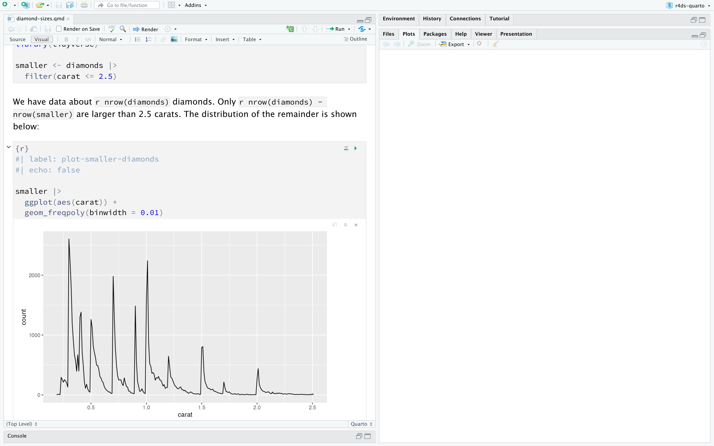
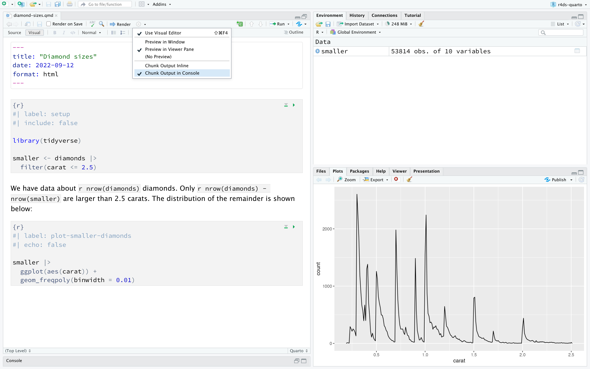
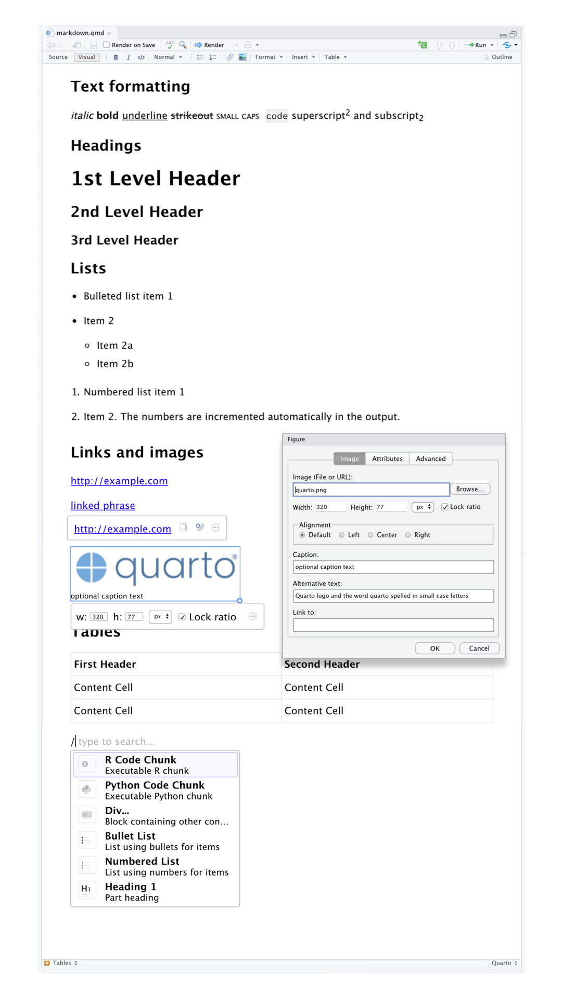
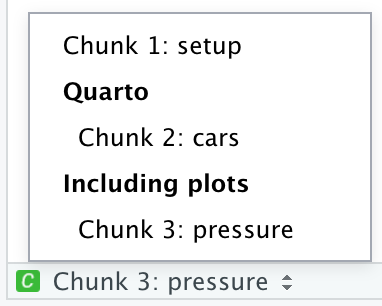

# Quarto {#sec-quarto}

```{r}
#| echo: false
source("_common.R")
```

## 소개 (Introduction)

Quarto는 데이터 과학을 위한 통합된(unified) 저작 프레임워크(authoring framework)를 제공하여 코드, 코드의 결과(results), 여러분의 산문(prose)을 결합(combining)합니다.
Quarto 문서는 완벽하게(fully) 재현 가능(reproducible)하며 PDF, Word 파일, 프레젠테이션 등과 같은 수십(dozens) 가지의 출력 형식(output formats)을 지원합니다.

Quarto 파일은 세 가지 방법(three ways)으로 사용하도록 설계(designed)되었습니다.

1.  분석 이면의(behind the analysis) 코드가 아니라 결론(conclusions)에 집중(focus on)하고자 하는 의사 결정자(decision-makers)와 소통(communicating)하기 위해.

2.  결론과 결론에 도달(reached)한 방법(i.e. 코드) 모두에 관심이 있는 다른 데이터 과학자(미래의 여러분 포함(including future you)!)와 협업(collaborating)하기 위해.

3.  데이터 과학을 *수행(do)*하는 환경으로서, 수행한 작업뿐만 아니라(not only what you did, but also) 여러분이 무슨 생각을 하고 있었는지 기록(capture)할 수 있는 현대의(modern-day) 랩 노트(lab notebook)로서.

Quarto는 R 패키지가 아니라 명령줄 인터페이스 도구(command line interface tool)입니다.
이는 전반적으로(by-and-large) `?`를 통해 도움말을 이용할 수 없음(not available)을 의미합니다.
대신 이 장을 진행(work through)하고 앞으로 Quarto를 사용할 때는 [Quarto 문서](https://quarto.org)를 참조(refer to)해야 합니다.

R Markdown 사용자라면 "Quarto가 R Markdown과 많이(a lot) 비슷하네"라고 생각(thinking)할 수 있습니다.
틀린 말이 아닙니다(You're not wrong)!
Quarto는 R Markdown 생태계(ecosystem)(rmarkdown, bookdown, distill, xaringan 등)에 속한 많은 패키지의 기능(functionality)을 단일하고(single) 일관된(consistent) 시스템으로 통합(unifies)할 뿐만 아니라, R 외에도(in addition to) Python 및 Julia와 같은 여러 프로그래밍 언어에 대한 기본(native) 지원으로 시스템을 확장(extends)합니다.
어떤 면에서(In a way) Quarto는 10년이 넘는 기간 동안(over a decade) R Markdown 생태계를 확장하고 지원하며(expanding and supporting) 얻은 모든 지식(everything that was learned)을 반영(reflects)합니다.

### 전제 조건 (Prerequisites)

Quarto 명령줄 인터페이스(Quarto CLI)가 필요하지만, 필요할 때마다(when needed) RStudio에서 두 가지 모두 자동으로 수행(automatically does both)하므로 명시적으로(explicitly) 설치(install)하거나 로드할(load) 필요가 없습니다.

```{r}
#| label: setup
#| include: false
chunk <- "```"
inline <- function(x = "") paste0("`` `r ", x, "` ``")
library(tidyverse)
```

## Quarto 기초 (Quarto basics)

이것이 Quarto 파일입니다 -- 확장자가 `.qmd`인 일반 텍스트 파일(plain text file):

```{r echo = FALSE, comment = ""}
cat(readr::read_file("quarto/diamond-sizes.qmd"))
```

여기에는 중요한 세 가지 유형의 콘텐츠가 포함(contains)되어 있습니다.

1.  `---`로 둘러싸인(surrounded by) (선택적(optional)) **YAML 헤더(YAML header)**.
2.  ```` ``` ````로 둘러싸인 R 코드의 **청크(Chunks)**.
3.  `# heading` 및 `_italics_`와 같은 간단한(simple) 텍스트 서식(text formatting)과 섞인(mixed) 텍스트.

@fig-diamond-sizes-notebook은 코드와 출력이 인터리브된(interleaved) 노트북 인터페이스가 있는 RStudio의 `.qmd` 문서를 보여줍니다.
실행 아이콘(Run icon)(청크 상단(top)의 재생 버튼(play button) 모양)을 클릭하거나 Cmd/Ctrl + Shift + Enter를 눌러 각 코드 청크를 실행(run)할 수 있습니다.
RStudio는 코드를 실행(executes)하고 그 결과(results)를 코드와 일렬(inline)로 표시(displays)합니다.

```{r}
#| label: fig-diamond-sizes-notebook
#| echo: false
#| out-width: "90%"
#| fig-cap: |
#|   RStudio의 Quarto 문서. 문서에 코드와 출력이 인터리브(interleaved)되어 
#|   있으며, 플롯 출력이 코드 바로 아래(right underneath)에 나타납니다.
#| fig-alt: |
#|   왼쪽에는 "diamond-sizes.qmd"라는 제목의 Quarto 문서가 있고 
#|   오른쪽에는 빈(blank) 뷰어 창(Viewer window)이 있는 RStudio 창. Quarto 
#|   문서에는 2.5캐럿 미만의 다이아몬드에 대한 빈도 플롯(frequency plot)을 
#|   생성하는 코드 청크가 있습니다. 플롯은 무게가 증가(increases)함에 따라 
#|   빈도가 감소(decreases)함을 보여줍니다.

```

문서에 플롯과 출력이 표시되는(seeing) 것을 원하지 않고(don't like) 대신(would rather) RStudio의 Console 및 Plot 창(panes)을 활용(make use of)하려면, @fig-diamond-sizes-console-output과 같이 "Render" 옆의 톱니바퀴 아이콘(gear icon)을 클릭하고 "Chunk Output in Console"로 전환(switch to)할 수 있습니다.

```{r}
#| label: fig-diamond-sizes-console-output
#| echo: false
#| out-width: "90%"
#| fig-cap: |
#|   플롯 출력이 Plots 창에 있는 RStudio의 Quarto 문서.
#| fig-alt: |
#|   왼쪽에는 "diamond-sizes.qmd"라는 제목의 Quarto 문서가 있고 
#|   오른쪽 아래(bottom right)에는 Plot 창이 있는 RStudio 창. Quarto 
#|   문서에는 2.5캐럿 미만의 다이아몬드에 대한 빈도 플롯을 생성하는 
#|   코드 청크가 있습니다. 플롯은 Plot 창에 표시(displayed)되며 무게가 
#|   증가함에 따라 빈도가 감소함을 보여줍니다. 
#|   Console에 Chunk Output을 표시하는 RStudio 옵션도 
#|   강조(highlighted) 표시되어 있습니다.

```

모든 텍스트, 코드, 결과가 포함된(containing) 전체(complete) 보고서(report)를 생성(produce)하려면 "Render"를 클릭하거나 Cmd/Ctrl + Shift + K를 누르세요.
`quarto::quarto_render("diamond-sizes.qmd")`를 사용하여 프로그래밍 방식(programmatically)으로 이 작업을 수행(do this)할 수도 있습니다.
그러면 @fig-diamond-sizes-report와 같이 뷰어 창에 보고서가 표시되고 HTML 파일이 생성됩니다.

```{r}
#| label: fig-diamond-sizes-report
#| echo: false
#| out-width: "90%"
#| fig-cap: |
#|   렌더링된(rendered) 문서가 Viewer 창에 있는 RStudio의 
#|   Quarto 문서.
#| fig-alt: |
#|   왼쪽에는 "diamond-sizes.qmd"라는 제목의 Quarto 문서가 있고 
#|   오른쪽 아래에는 Plot 창이 있는 RStudio 창. 렌더링된 문서는 코드를 
#|   전혀(any of) 표시하지 않지만 코드는 소스(source) 문서에 
#|   표시(visible)됩니다.
knitr::include_graphics("quarto/diamond-sizes-report.png")
```

문서를 렌더링할 때 Quarto는 `.qmd` 파일을 **knitr**(<https://yihui.org/knitr/>)로 보내고(sends), knitr는 모든 코드 청크를 실행(executes)하여 코드와 출력이 포함된 새로운 마크다운(`.md`) 문서를 생성합니다.
그런 다음(then) knitr에서 생성된(generated) 마크다운 파일은 완성된(finished) 파일을 생성(creating)하는 역할을 하는(responsible for) **pandoc**([https://pandoc.org](https://pandoc.org/){.uri})에 의해 처리(processed)됩니다.
이 프로세스(process)는 @fig-quarto-flow에 나와 있습니다(shown).
이 2단계 워크플로우(two step workflow)의 장점(advantage)은 @sec-quarto-formats에서 배울 수 있듯이 매우 다양한(very wide range of) 출력 형식을 생성할 수 있다는 것입니다.

```{r}
#| label: fig-quarto-flow
#| echo: false
#| out-width: "75%"
#| fig-alt: |
#|   qmd 파일로 시작(starting with)하여 knitr, md, pandoc, 그리고 PDF, 
#|   MS Word 또는 HTML 순서(then)로 진행되는 워크플로우 다이어그램.
#| fig-cap: |
#|   qmd에서 knitr, md, pandoc으로 이어져 PDF, MS Word 또는 
#|   HTML 형식으로 출력되는 Quarto 워크플로우 다이어그램.
knitr::include_graphics("images/quarto-flow.png")
```

여러분 자신의 `.qmd` 파일을 시작(get started)하려면 메뉴 모음(menu bar)에서 *File \> New File \> Quarto Document...*를 선택하세요.
RStudio는 Quarto의 주요 기능(key features)이 어떻게 작동하는지 상기(reminds)시켜 주는 유용한(useful) 콘텐츠로 파일을 미리 채우는(pre-populate) 데 사용할 수 있는 마법사(wizard)를 실행(launch)합니다.

다음 섹션(sections)에서는 Quarto 문서의 세 가지 구성 요소(components)인 마크다운 텍스트, 코드 청크, YAML 헤더에 대해 자세히(in more details) 살펴봅니다(dive into).

### 연습 문제 (Exercises)

1.  *File \> New File \> Quarto Document*를 사용하여 새 Quarto 문서를 생성하세요.
    지침(instructions)을 읽으세요(Read).
    청크를 개별적으로 실행(running the chunks individually)하는 연습을 해보세요(Practice).
    그런 다음 적절한(appropriate) 버튼을 클릭하고 적절한 키보드 단축키(keyboard shortcut)를 사용하여 문서를 렌더링(render)하세요.
    코드를 수정(modify)하고 다시 실행(re-run)하여 수정된 출력을 볼 수 있는지(see modified output) 확인(Verify)하세요.

2.  세 가지 기본(built-in) 형식(formats)인 HTML, PDF, Word에 대해 각각 하나의 새 Quarto 문서를 생성하세요.
    세 문서를 각각 렌더링하세요.
    출력은 어떻게 다른가요(differ)?
    입력(inputs)은 어떻게 다른가요?
    (PDF 출력을 빌드(build)하려면 LaTeX를 설치해야 할 수도(may need to) 있습니다 --- 필요한 경우(if this is necessary) RStudio에서 프롬프트(prompt)를 표시합니다.)

## 비주얼 편집기 (Visual editor)

RStudio의 비주얼 편집기(Visual editor)는 Quarto 문서를 작성(authoring)할 수 있는 [WYSIWYM](https://en.wikipedia.org/wiki/WYSIWYM) 인터페이스를 제공(provides)합니다.
내부적으로(Under the hood) Quarto 문서(`.qmd` 파일)의 산문(prose)은 일반 텍스트 파일의 서식을 지정(formatting)하기 위한 가벼운 규칙 집합(lightweight set of conventions)인 마크다운(Markdown)으로 작성됩니다.
사실(In fact) Quarto는 표, 인용(citations), 상호 참조(cross-references), 각주(footnotes), div/span, 정의 리스트(definition lists), 속성(attributes), 원시(raw) HTML/TeX 등과 코드 셀 실행(executing) 및 해당 출력을 일렬(inline)로 보기 지원(support)을 포함(including)하는 Pandoc 마크다운(Quarto가 이해할 수 있는 약간 확장된(slightly extended) 버전의 마크다운)을 사용합니다.
마크다운은 읽고 쓰기 쉽게(easy to read and write) 설계(designed)되었지만 @sec-source-editor에서 볼 수 있듯이(as you will see), 여전히(still) 새로운 구문(syntax)을 배워야(requires learning) 합니다.
따라서(`.qmd` 파일과 같은 컴퓨팅(computational) 문서를 처음 접하지만(new to) Google Docs나 MS Word와 같은 도구를 사용한 경험(experience)이 있다면) RStudio에서 Quarto를 시작하는 쉬운 방법은 비주얼 편집기입니다.

비주얼 편집기에서는 메뉴 모음의 버튼을 사용하여 이미지, 표, 상호 참조 등을 삽입(insert)하거나, 포괄적인(catch-all) 단축키인 <kbd>⌘</kbd> + <kbd>/</kbd> 또는 <kbd>Ctrl</kbd> + <kbd>/</kbd>를 사용하여 거의 모든 것(just about anything)을 삽입할 수 있습니다.
줄의 시작 부분(beginning)에 있는 경우(@fig-visual-editor에 표시된 것처럼) 단축키를 호출(invoke)하기 위해 그냥(just) <kbd>/</kbd>를 입력(enter)할 수도 있습니다.

```{r}
#| label: fig-visual-editor
#| echo: false
#| out-width: "75%"
#| fig-cap: |
#|   Quarto 비주얼 편집기(Quarto visual editor).
#| fig-alt: |
#|   텍스트 서식 지정(이탤릭체(italic), 굵게(bold), 밑줄(underline), 
#|   작은 대문자(small caps), 코드, 위첨자(superscript), 아래첨자(subscript)), 
#|   1~3단계 제목(first through third level headings), 글머리 기호(bulleted) 및 
#|   번호 매기기(numbered) 리스트, 링크, 연결된 문구(linked phrases), 
#|   이미지(이미지 크기 사용자 지정(customizing image size), 캡션 및 대체 텍스트(alt text) 
#|   추가 등을 위한 팝업 창과 함께), 헤더 행(header row)이 있는 표, 
#|   그리고 R 코드 청크, Python 코드 청크, div, 글머리 기호 리스트, 번호 매기기 리스트 
#|   또는 1단계 제목을 삽입하는 옵션이 있는(도구의 상단 몇 가지 선택 항목) 
#|   무엇이든 삽입(insert anything) 도구와 같은 비주얼 편집기의 다양한 
#|   기능(features)을 표시하는 Quarto 문서.

```

이미지를 삽입하고 표시되는 방식을 사용자 지정(customizing)하는 작업도 비주얼 편집기에서 쉽게 수행(facilitated)할 수 있습니다.
클립보드(clipboard)에 있는 이미지를 비주얼 편집기에 직접(directly) 붙여넣거나(paste)(RStudio가 해당 이미지의 사본을 프로젝트 디렉터리에 넣고(place) 그 사본에 연결(link)함), 비주얼 편집기의 Insert \> Figure / Image 메뉴를 사용하여 삽입하려는 이미지를 찾아보거나(browse) URL을 붙여넣을 수 있습니다.
또한(In addition) 동일한 메뉴를 사용하여 이미지 크기를 조정(resize)하고 캡션, 대체 텍스트(alternative text) 및 링크를 추가할 수 있습니다.

비주얼 편집기에는 여기서 열거(enumerated)하지 않은 훨씬 더 많은(many more) 기능이 있어, 이를 통해 문서를 작성하는 경험을 쌓으면서(as you gain experience) 유용하게 사용할(find useful) 수 있습니다.

중요(Most importantly)한 것은, 비주얼 편집기가 서식(formatting)과 함께 콘텐츠를 표시(displays)하지만 내부적으로는 콘텐츠를 일반(plain) 마크다운으로 저장(saves)하므로 시각적 편집기와 소스 편집기를 앞뒤로 전환(switch back and forth between)하여 둘 중 하나의 도구를 사용해 콘텐츠를 보고(view) 편집(edit)할 수 있다는 것입니다.

### 연습 문제 (Exercises)

1.  비주얼 편집기를 사용하여 @fig-visual-editor의 문서를 다시 생성하세요(Re-create).
2.  비주얼 편집기를 사용하여 Insert 메뉴와 무엇이든 삽입 도구(insert anything tool)를 사용하여 코드 청크를 삽입하세요.
3.  비주얼 편집기를 사용하여 다음 작업을 수행하는 방법을 알아내세요(figure out how to):
    a.  각주(footnote) 추가.
    b.  가로줄(horizontal rule) 추가.
    c.  블록 인용구(block quote) 추가.
4.  비주얼 편집기에서 Insert \> Citation으로 이동(go to)하여 DOI(digital object identifier)([10.21105/joss.01686](https://doi.org/10.21105/joss.01686))를 사용하여 [Welcome to the Tidyverse](https://joss.theoj.org/papers/10.21105/joss.01686)라는 제목의(titled) 논문(paper)에 대한 인용을 삽입하세요. 문서를 렌더링하고 참조(reference)가 문서에 어떻게 나타나는지(shows up) 관찰(observe)하세요. 문서의 YAML에서 어떤 변화(change)를 관찰할 수 있나요?

## 소스 편집기 (Source editor) {#sec-source-editor}

비주얼 편집기의 도움(assistance) 없이 RStudio의 소스 편집기(Source editor)를 사용하여 Quarto 문서를 편집(edit)할 수도 있습니다.
비주얼 편집기는 Google docs와 같은 도구로 글을 써본(writing in tools like) 경험이 있는 분들에게는 친숙(familiar)하게 느껴지는(will feel) 반면(While), 소스 편집기는 R 스크립트나 R Markdown 문서를 작성해 본 경험이 있는 분들에게 친숙하게 느껴질 것입니다.
소스 편집기는 종종 일반 텍스트에서 포착하기가(to catch these) 더 쉽기(easier) 때문에 Quarto 구문 오류(syntax errors)를 디버깅(debugging)하는 데 유용(useful)할 수 있습니다.

아래 가이드(guide)는 소스 편집기에서 Quarto 문서를 작성하기 위해 Pandoc의 마크다운을 사용하는 방법을 보여줍니다.

```{r}
#| echo: false
#| comment: ""
cat(readr::read_file("quarto/markdown.qmd"))
```

이것을 배우는(learn) 좋은 방법은 단순히(simply) 사용해 보는(try them out) 것입니다.
며칠(a few days) 걸리겠지만, 곧(soon) 제2의 천성(second nature)이 될 것이며 이에 대해 생각할(think about them) 필요가 없게 될 것입니다.
만약 잊어버린 경우(If you forget), *Help \> Markdown Quick Reference*를 통해 유용한(handy) 참조 시트(reference sheet)를 확인할(get to) 수 있습니다.

### 연습 문제 (Exercises)

1.  간단한 이력서(brief CV)를 작성하여 배운 내용을 연습하세요(Practice).
    제목은 여러분의 이름(name)이어야 하며, (최소한(at least)) 학력(education)이나 경력(employment)에 대한 제목(headings)을 포함해야(should include) 합니다.
    각 섹션에는 직업/학위에 대한 글머리 기호(bulleted) 리스트가 포함되어야 합니다.
    연도(year)를 굵게(bold) 강조(Highlight) 표시하세요.

2.  소스 편집기와 마크다운 빠른 참조(Markdown quick reference)를 사용하여 다음 작업을 수행하는 방법을 알아내세요.

    a.  각주 추가.
    b.  가로줄 추가.
    c.  블록 인용구 추가.

3.  <https://github.com/hadley/r4ds/tree/main/quarto>에서 `diamond-sizes.qmd`의 콘텐츠를 복사하여(Copy and paste) 로컬 R Quarto 문서에 붙여넣으세요.
    실행할 수 있는지(can run it) 확인(Check)한 다음, 빈도 다각형(frequency polygon) 뒤에(after) 두드러진(striking) 특징(features)을 설명하는(describes) 텍스트를 추가하세요.

4.  Google doc이나 MS Word에서 제목, 하이퍼링크(hyperlinks), 서식이 지정된(formatted) 텍스트 등과 같은 콘텐츠가 들어 있는 문서를 만들거나(이전에(previously) 만든 문서를 찾으세요(locate)).
    이 문서의 콘텐츠를 복사하여 비주얼 편집기의 Quarto 문서에 붙여넣으세요.
    그런 다음 소스 편집기로 전환하여(switch over to) 소스 코드를 검사(inspect)하세요.

## 코드 청크 (Code chunks)

Quarto 문서 내에서 코드를 실행하려면 청크를 삽입(insert)해야 합니다.
이 작업을 수행하는 데는 세 가지 방법이 있습니다.

1.  키보드 단축키(keyboard shortcut) Cmd + Option + I / Ctrl + Alt + I.

2.  편집기 도구 모음(editor toolbar)의 "Insert" 버튼 아이콘.

3.  청크 구분 기호(chunk delimiters) ```` ```{r} ```` 및 ```` ``` ````를 수동으로 입력(manually typing).

키보드 단축키를 배울 것을(learn) 권장합니다(recommend).
장기적으로(in the long run) 많은 시간을 절약(save)할 수 있습니다!

이제 여러분이 알고(know) 좋아할(love)(그러길 바랍니다(we hope)!) 키보드 단축키인 Cmd/Ctrl + Enter를 사용하여 코드를 계속(continue to) 실행할 수 있습니다.
그러나 청크에는 청크의 모든 코드를 실행하는 새로운 키보드 단축키인 Cmd/Ctrl + Shift + Enter가 생깁니다(get).
청크를 함수처럼(like a function) 생각하세요.
청크는 비교적(relatively) 독립적(self-contained)이어야 하며 단일(single) 작업(task)에 집중(focused around)해야 합니다.

다음 섹션에서는 ```` ```{r} ````로 구성(consists of)되고, 그 뒤에(followed by) `#|`로 표시된 각자 별도의 줄(own line)에 있는 선택적(optional) 청크 레이블(chunk label) 및 다양한 기타 청크 옵션이 오는 청크 헤더에 대해 설명합니다.

### 청크 레이블 (Chunk label)

청크에는 다음과 같이 선택적 레이블을 지정(given)할 수 있습니다.

```{r}
#| echo: fenced
#| label: simple-addition
1 + 1
```

이것은 세 가지 장점(advantages)이 있습니다.

1.  스크립트 편집기(script editor)의 왼쪽 하단(bottom-left)에 있는 드롭다운(drop-down) 코드 탐색기(code navigator)를 사용하여 특정(specific) 청크로 더 쉽게 이동(navigate to)할 수 있습니다.

    ```{r}
    #| echo: false
    #| out-width: "30%"
    #| fig-alt: |
    #|   세 개의 청크를 보여주는 드롭다운 코드 탐색기만(only) 
    #|   보여주는 RStudio IDE의 스니펫(Snippet). 청크 1은 setup입니다. 청크 2는 cars이며 
    #|   Quarto라는 섹션에 있습니다. 청크 3은 pressure이며 
    #|   Including plots라는 섹션에 있습니다.
    
    ```

2.  청크에서 생성된(produced) 그래픽은 다른 곳에서 더 쉽게(easier) 사용할 수 있도록 유용한 이름(useful names)을 갖게 됩니다.
    이에 대한 자세한 내용(More on that)은 @sec-figures에서 다룹니다.

3.  캐시된(cached) 청크 네트워크(networks)를 설정(set up)하여 매 실행마다 비용이 많이 드는(expensive) 계산(computations)을 다시 수행하는 것(re-performing)을 방지(avoid)할 수 있습니다.
    이에 대한 자세한 내용은 @sec-caching에서 다룹니다.

청크 레이블은 짧으면서도 연상(evocative)하기 쉬워야 하며 공백(spaces)을 포함(contain)해서는 안 됩니다.
단어를 구분(separate)할 때는 밑줄(`_`) 대신(instead of) 대시(`-`)를 사용하고 청크 레이블에 다른 특수 문자(special characters)를 사용하지 않는 것을 권장(recommend)합니다.

일반적으로(generally) 원하는 대로(however you like) 청크에 레이블을 지정할 수 있지만, 특별한 동작(special behavior)을 부여(imbues)하는 청크 이름이 하나 있습니다. `setup`입니다.
노트북 모드(notebook mode)에 있을 때, setup이라는 이름의 청크는 다른 코드가 실행되기 전에 한 번 자동으로(automatically) 실행됩니다.

또한(Additionally) 청크 레이블은 중복(duplicated)될 수 없습니다.
각 청크 레이블은 고유(unique)해야 합니다.

### 청크 옵션 (Chunk options)

청크 출력은 청크 헤더에 제공된(supplied) 필드인 **옵션(options)**을 사용하여 사용자 지정(customized)할 수 있습니다.
Knitr는 코드 청크를 사용자 지정하는 데 사용할 수 있는 거의 60개의 옵션을 제공합니다.
여기서는 여러분이 자주(frequently) 사용할 중요한 청크 옵션을 다룰(cover) 것입니다.
[https://yihui.org/knitr/options](https://yihui.org/knitr/options/){.uri}에서 전체 리스트(full list)를 볼 수 있습니다.

중요한 옵션 세트(set of options)는 코드 블록이 실행(executed)되는지 여부와 완료된(finished) 보고서에 삽입(inserted)되는 결과를 제어(controls)합니다.

-   `eval: false`는 코드가 평가(evaluated)되는 것을 방지(prevents)합니다.
    (그리고 당연히(obviously) 코드가 실행되지 않으면 결과도 생성되지 않습니다).
    이것은 예제(example) 코드를 표시하거나(displaying), 각 줄에 주석(commenting)을 달지 않고 대규모 코드 블록을 비활성화(disabling)하는 데 유용합니다.

-   `include: false`는 코드를 실행하지만 최종(final) 문서에 코드나 결과를 표시하지 않습니다.
    보고서를 어지럽히고(cluttering) 싶지 않은 설정(setup) 코드에 사용하세요.

-   `echo: false`는 결과는 나타나게 하면서 완성된 파일에 코드가 나타나는(appearing) 것을 방지합니다.
    기본(underlying) R 코드를 보고 싶어 하지 않는 사람을 대상으로(aimed at) 보고서를 작성할(writing) 때 사용하세요.

-   `message: false` 또는 `warning: false`는 메시지나 경고(warnings)가 완성된 파일에 나타나는 것을 방지합니다.

-   `results: hide`는 인쇄된(printed) 출력을 숨기고, `fig-show: hide`는 플롯을 숨깁니다.

-   `error: true`는 코드가 오류(error)를 반환하더라도(even if) 렌더링이 계속(continue)되도록 합니다.
    최종 버전의 보고서에 이 옵션을 포함하려는(want to include) 경우는 거의(rarely) 없지만, `.qmd` 내부에서 정확히(exactly) 무슨 일이 일어나고 있는지 디버그(debug)해야 하는 경우 매우 유용할 수 있습니다.
    R을 가르치고(teaching) 의도적으로(deliberately) 오류를 포함하려는 경우에도 유용합니다.
    기본값인 `error: false`는 문서에 단일(single) 오류라도 있으면 렌더링이 실패(fail)하도록 합니다.

이러한 각각의 청크 옵션은 청크의 헤더에서 `#|` 뒤에 추가됩니다(added). 예를 들어 다음 청크에서는 `eval`이 false로 설정(set)되어 결과가 인쇄되지 않습니다.

```{r}
#| echo: fenced
#| label: simple-multiplication
#| eval: false
2 * 2
```

다음 표는 각 옵션이 어떤(which) 유형의 출력을 억제(suppresses)하는지 요약(summarizes)한 것입니다.

| 옵션(Option)     | 코드 실행(Run code) | 코드 표시(Show code) | 출력(Output) | 플롯(Plots) | 메시지(Messages) | 경고(Warnings) |
|------------------|:--------:|:---------:|:------:|:-----:|:--------:|:--------:|
| `eval: false`    |    X     |           |   X    |   X   |    X     |    X     |
| `include: false` |          |     X     |   X    |   X   |    X     |    X     |
| `echo: false`    |          |     X     |        |       |          |          |
| `results: hide`  |          |           |   X    |       |          |          |
| `fig-show: hide` |          |           |        |   X   |          |          |
| `message: false` |          |           |        |       |    X     |          |
| `warning: false` |          |           |        |       |          |    X     |

### 전역 옵션 (Global options)

knitr로 더 많은 작업을 수행하다(work more with) 보면 일부 기본(default) 청크 옵션이 여러분의 필요(needs)에 맞지 않아(don't fit) 변경(change)하고 싶어질 것입니다.

문서 YAML의 `execute` 아래(under)에 선호하는(preferred) 옵션을 추가(adding)하여 이 작업을 수행할 수 있습니다.
예를 들어 코드는 볼 필요(need to see)가 없고 결과와 설명(narrative)만 보면 되는 대중(audience)을 위해 보고서를 준비(preparing)하는 경우, 문서 수준(document level)에서 `echo: false`를 설정(set)할 수 있습니다.
그러면 기본적으로 코드가 숨겨지므로 명시적으로(deliberately) 표시하도록 선택(choose)한 청크만 표시됩니다(`echo: true`를 사용하여).
`message: false` 및 `warning: false`를 설정하는 것을 고려(consider)할 수도 있지만, 그러면 최종 문서에 어떤 메시지도 표시되지 않기 때문에 문제를 디버그하기가 더 어려워집니다(harder).

``` yaml
title: "나의 보고서(My report)"
execute:
  echo: false
```

Quarto는 다국어(multi-lingual)(R뿐만 아니라(as well as) Python, Julia 등과 같은 다른 언어에서도 작동)를 지원하도록 설계되었기 때문에, 모든 knitr 옵션을 문서 실행 수준(document execution level)에서 사용할 수는 없습니다. 일부 옵션은 Quarto가 다른 언어에서 코드를 실행하는 데 사용하는 다른 엔진(engines)(Jupyter)에서는 작동하지 않고 knitr에서만 작동하기 때문입니다.
그러나 `knitr` 필드 아래의 `opts_chunk` 아래에서 문서에 대한 전역 옵션으로 이러한 옵션을 설정할 수는 있습니다.
예를 들어 책과 튜토리얼을 작성할 때 우리는 다음을 설정합니다.

``` yaml
title: "튜토리얼(Tutorial)"
knitr:
  opts_chunk:
    comment: "#>"
    collapse: true
```

이것은 우리가 선호하는(preferred) 주석 서식(comment formatting)을 사용하고 코드와 출력이 밀접하게(closely) 얽혀 있도록(entwined) 유지(kept)합니다.

### 인라인 코드 (Inline code)

R 코드를 Quarto 문서에 포함(embed)시키는 또 다른(one other) 방법이 있습니다. `r inline()`을 사용하여 텍스트에 직접(directly into the text) 포함시키는 것입니다.
이것은 텍스트에서 데이터의 속성(properties)을 언급(mention)할 때 매우 유용(very useful)할 수 있습니다.
예를 들어 이 장의 시작(start) 부분에서 사용된 예제 문서는 다음과 같습니다.

> 우리는 `r inline('nrow(diamonds)')`개의 다이아몬드에 대한 데이터를 가지고 있습니다.
> 단지(Only) `r inline('nrow(diamonds) - nrow(smaller)')`개만이 2.5캐럿보다 큽니다(larger than).
> 나머지(remainder)의 분포(distribution)는 다음과 같습니다(shown below):

보고서가 렌더링될 때 이러한 계산 결과(results of these computations)가 텍스트에 삽입(inserted)됩니다.

> 우리는 53940개의 다이아몬드에 대한 데이터를 가지고 있습니다.
> 단지 126개만이 2.5캐럿보다 큽니다.
> 나머지의 분포는 다음과 같습니다.

텍스트에 숫자를 삽입할 때 `format()`은 여러분의 친구(friend)입니다.
숫자를 쉽게 읽을 수 있도록 `digits`의 수(number of `digits`)를 설정하여 터무니없는 정확도(ridiculous degree of precision)까지 인쇄하지(don't print) 않도록 하고, `big.mark`를 설정할 수 있습니다(allows you to).
도우미(helper) 함수로 결합(combine)할 수 있습니다.

```{r}
comma <- function(x) format(x, digits = 2, big.mark = ",")
comma(3452345)
comma(.12358124331)
```

### 연습 문제 (Exercises)

1.  절단(cut), 색상(color) 및 투명도(clarity)에 따라 다이아몬드 크기가 어떻게 달라지는지(vary) 탐색(explores)하는 섹션을 추가하세요.
    R을 모르는(doesn't know) 사람을 위해 보고서를 작성한다고 가정(Assume)하고, 각 청크에 `echo: false`를 설정하는 대신(instead of) 전역 옵션을 설정하세요.

2.  <https://github.com/hadley/r4ds/tree/main/quarto>에서 `diamond-sizes.qmd`를 다운로드(Download)하세요.
    큰(largest) 다이아몬드 20개에 대해 설명하는(describes) 섹션을 추가하세요(중요한 속성(attributes)을 표시하는 표 포함(including)).

3.  멋지게 서식이 지정된(nicely formatted) 출력을 생성(produce)하기 위해 `label_comma()`를 사용하도록 `diamonds-sizes.qmd`를 수정(Modify)하세요.
    또한 2.5캐럿보다 큰 다이아몬드의 백분율(percentage)을 포함(include)하세요.

## 그림 (Figures) {#sec-figures}

Quarto 문서의 그림(figures)은 포함(embedded)되거나(PNG 또는 JPEG 파일) 코드 청크의 결과로 생성(generated)될 수 있습니다.

외부(external) 파일의 이미지를 포함하려면 RStudio의 비주얼 편집기(Visual Editor)에 있는 Insert 메뉴를 사용하여 Figure / Image를 선택할 수 있습니다.
이렇게 하면(This will) 삽입하려는 이미지를 찾을 수 있을(browse to) 뿐만 아니라 대체 텍스트나 캡션을 추가하고 크기를 조정(adjust)할 수 있는 메뉴가 팝업으로 열립니다(pop open).
비주얼 편집기에서는 클립보드의 이미지를 문서에 단순히(simply) 붙여넣기(paste)만 하면 RStudio가 프로젝트 폴더(folder)에 해당 이미지의 사본을 넣습니다(place).

그림을 생성하는 코드 청크를 포함(include)하는 경우(`ggplot()` 호출 포함), 생성된 그림이 Quarto 문서에 자동으로(automatically) 포함됩니다.

### 그림 크기 조정 (Figure sizing)

Quarto에서 그래픽의 큰 과제(biggest challenge)는 그림의 크기(size)와 모양(shape)을 적절하게(right) 맞추는 것입니다.
그림 크기를 제어하는 다섯 가지 주요 옵션이 있습니다. `fig-width`, `fig-height`, `fig-asp`, `out-width` 및 `out-height`입니다.
이미지 크기 조정이 까다로운(challenging) 이유는 두 가지 크기(R이 생성한 그림의 크기와 출력 문서에 삽입되는(inserted) 크기)가 있고, 크기를 지정하는 방법(ways of specifying)(즉, 높이(height), 너비(width), 가로 세로 비율(aspect ratio): 세 개 중 두 개 선택(pick two of three))이 여러 가지(multiple)이기 때문입니다.

다섯 가지 옵션 중 세 가지를 권장(recommend)합니다.

-   플롯은 일관된 너비를 가질 때 더 심미적으로 만족스러운(aesthetically pleasing) 경향(tend to)이 있습니다.
    이를 강제(enforce)하기 위해 기본값(defaults)으로 `fig-width: 6`(6") 및 `fig-asp: 0.618`(황금비(golden ratio))을 설정합니다.
    그런 다음 개별(individual) 청크에서 `fig-asp`만 조정합니다.

-   `out-width`를 사용하여 출력 크기를 제어하고 출력 문서의 본문 너비(body width)에 대한 백분율(percentage)로 설정합니다.
    `out-width: "70%"` 및 `fig-align: center`로 설정할 것을 제안(suggest)합니다.

    이렇게 하면 플롯이 공간(space)을 너무(too much) 많이 차지하지 않으면서(without taking up) 숨을 쉴 수 있는 여유(room to breathe)가 생깁니다.

-   여러 플롯을 단일 행(single row)에 배치(put)하려면 `layout-ncol`을 두 개의 플롯에는 2, 세 개의 플롯에는 3 등으로 설정합니다.
    이것은 `layout-ncol`이 2인 경우 각 플롯에 대해 효과적으로(effectively) `out-width`를 "50%"로, `layout-ncol`이 3인 경우 "33%" 등으로 설정합니다.
    설명하려는 내용(데이터 표시 또는 플롯 변형(variations) 표시)에 따라(Depending on) 아래에서 논의하는 것처럼 `fig-width`를 조정(tweak)할 수도 있습니다.

플롯의 텍스트를 읽기 위해 눈을 가늘게 떠야(squint) 하는 경우 `fig-width`를 조정해야 합니다.
`fig-width`가 최종 문서(final doc)에서 렌더링된(rendered) 그림의 크기보다 크면(larger than) 텍스트가 너무 작아지고(too small), `fig-width`가 작으면(smaller) 텍스트가 너무 커집니다(too big).
종종 문서의 `fig-width`와 최종(eventual) 너비 사이의 올바른 비율을 파악하기 위해(to figure out) 약간의 실험(experimentation)이 필요합니다(need to do).
원리를 설명하기 위해(To illustrate the principle) 다음 세 플롯의 `fig-width`는 각각(respectively) 4, 6, 8입니다.

```{r}
#| include: false
plot <- ggplot(mpg, aes(x = displ, y = hwy)) + geom_point()
```

```{r}
#| echo: false
#| fig-width: 4
#| out-width: "50%"
#| fig-alt: |
#|   자동차의 고속도로 연비(highway mileage)와 배기량(displacement)을 비교한 
#|   산점도(Scatterplot)로, 포인트의 크기가 정상적(normally)이고 
#|   축 텍스트(axis text)와 레이블(labels)이 주변(surrounding) 텍스트와 비슷한(similar) 글꼴 크기(font size)입니다.
plot
```

```{r}
#| echo: false
#| fig-width: 6
#| out-width: "50%"
#| fig-alt: |
#|   자동차의 고속도로 연비와 배기량을 비교한 산점도로, 
#|   포인트가 이전 플롯보다 더 작고 
#|   축 텍스트와 레이블이 주변 텍스트보다 더 작습니다(smaller).
plot
```

```{r}
#| echo: false
#| fig-width: 8
#| out-width: "50%"
#| fig-alt: |
#|   자동차의 고속도로 연비와 배기량을 비교한 산점도로, 
#|   포인트가 이전 플롯보다 훨씬 더(even) 작고 
#|   축 텍스트와 레이블이 주변 텍스트보다 훨씬 더 작습니다.
plot
```

모든 그림에서 글꼴 크기가 일관(consistent)되도록 하려면 `out-width`를 설정할 때마다 기본 `out-width`와 동일한 비율(ratio)을 유지(maintain)하도록 `fig-width`도 조정(adjust)해야 합니다.
예를 들어 기본 `fig-width`가 6이고 `out-width`가 "70%"인 경우, `out-width: "50%"`를 설정할 때 `fig-width`를 4.3(6 \* 0.5 / 0.7)으로 설정해야 합니다.

그림 크기 조정(sizing)과 스케일링(scaling)은 예술(art)이자 과학(science)이며 제대로(right) 하는 것은 반복적인 시행착오(iterative trial-and-error) 방식(approach)을 필요(require)로 할 수 있습니다.
[플롯 스케일링 제어 블로그 게시물(taking control of plot scaling blog post)](https://www.tidyverse.org/blog/2020/08/taking-control-of-plot-scaling/)에서 그림 크기 조정에 대해 자세히 알아볼 수 있습니다.

### 기타 중요한 옵션 (Other important options)

이 책과 같이 코드와 텍스트를 혼합(mingling)할 때 `fig-show: hold`를 설정하여 코드 뒤에(after) 플롯이 표시(shown)되도록 할 수 있습니다.
이것은 대규모 코드 블록과 설명(explanations)을 분리(break up)하도록 하는 기분 좋은 부작용(pleasant side effect)을 가지고 있습니다.

플롯에 캡션을 추가하려면 `fig-cap`을 사용합니다.
Quarto에서는 이렇게 하면(this will) 그림이 인라인(inline)에서 "플로팅(floating)"으로 변경됩니다.

PDF 출력을 생성하는 경우 기본 그래픽 유형(default graphics type)은 PDF입니다.
PDF는 고품질(high quality) 벡터(vector) 그래픽이므로 이것은 좋은 기본값입니다.
그러나 수천(thousands of) 개의 포인트를 표시하는 경우 매우 크고 느린(very large and slow) 플롯이 생성될 수 있습니다.
이 경우 `fig-format: "png"`를 설정하여 PNG를 사용하도록 강제(force)하세요.
이들은 약간 낮은 품질(slightly lower quality)이지만 훨씬 더 압축적(much more compact)입니다.

다른 청크에는 정기적(routinely)으로 레이블을 지정하지 않더라도(even if you don't) 그림을 생성하는 코드 청크의 이름은 지정하는 것이 좋습니다.
청크 레이블은 디스크에 그래픽의 파일 이름을 생성(generate)하는 데 사용되므로 청크의 이름을 지정하면 다른 상황(other circumstances)에서 재사용(reuse)하거나 플롯을 골라내기가(pick out) 훨씬 쉬워집니다(단일 플롯을 이메일에 빠르게 드롭(drop)하려는 경우).

### 연습 문제 (Exercises)

1.  비주얼 편집기에서 `diamond-sizes.qmd`를 열고 다이아몬드 이미지를 찾은(find) 다음 복사하여 문서에 붙여넣으세요. 이미지를 두 번 클릭(Double click)하고 캡션을 추가하세요. 이미지 크기를 조정(Resize)하고 문서를 렌더링하세요. 이미지가 현재 작업 디렉터리에 어떻게(how) 저장되는지 관찰하세요.
2.  플롯을 생성하는 `diamond-sizes.qmd`의 코드 청크 레이블을 `fig-` 접두사로 시작(start with the prefix)하도록 편집(Edit)하고 청크 옵션 `fig-cap`을 사용하여 그림에 캡션을 추가하세요. 그런 다음 코드 청크 위의 텍스트를 편집하여 Insert \> Cross Reference로 그림에 대한 상호 참조(cross-reference)를 추가하세요.
3.  다음 청크 옵션을 사용하여 그림 크기를 한 번에 하나씩(one at a time) 변경하고, 문서를 렌더링한 다음, 그림이 어떻게 변경되는지 설명(describe)하세요.
    a.  `fig-width: 10`

    b.  `fig-height: 3`

    c.  `out-width: "100%"`

    d.  `out-width: "20%"`

## 표 (Tables)

그림과 유사(Similar)하게 Quarto 문서에 두 가지 유형의 표를 포함할 수 있습니다.
(Insert Table 메뉴를 사용하여) Quarto 문서에서 직접(directly) 생성하는 마크다운 표일 수도 있고 코드 청크의 결과(result)로 생성되는 표일 수도 있습니다.
이 섹션에서는 후자(latter), 즉 계산(computation)을 통해 생성된 표에 초점을 맞출 것입니다.

기본적(By default)으로 Quarto는 콘솔(console)에 표시되는 대로(as you'd see them) 데이터 프레임과 행렬을 인쇄합니다.

```{r}
mtcars[1:5, ]
```

데이터가 추가 서식(additional formatting)과 함께 표시(displayed)되기를 원한다면(prefer) `knitr::kable()` 함수를 사용할 수 있습니다.
아래 코드는 @tbl-kable을 생성합니다.

```{r}
#| label: tbl-kable
#| tbl-cap: knitr kable(A knitr kable).
knitr::kable(mtcars[1:5, ], )
```

표를 사용자 지정할 수 있는 다른 방법을 보려면 `?knitr::kable`의 설명서를 읽어보세요.
더 깊은(even deeper) 사용자 지정(customization)을 원한다면 **gt**, **huxtable**, **reactable**, **kableExtra**, **xtable**, **stargazer**, **pander**, **tables** 및 **ascii** 패키지를 고려해(consider) 보세요.
각 패키지는 R 코드에서 서식이 지정된(formatted) 표를 반환(returning)하기 위한 도구 세트를 제공합니다.

### 연습 문제 (Exercises)

1.  비주얼 편집기에서 `diamond-sizes.qmd`를 열고 코드 청크를 삽입한 다음 `diamonds` 데이터 프레임의 처음 5행을 보여주는(shows) `knitr::kable()`로 표를 추가하세요.
2.  대신 `gt::gt()`를 사용하여 동일한 표를 표시(Display)하세요.
3.  `tbl-` 접두사로 시작하는 청크 레이블을 추가하고 청크 옵션 `tbl-cap`을 사용하여 표에 캡션을 추가하세요. 그런 다음 코드 청크 위의 텍스트를 편집하여 Insert \> Cross Reference로 표에 대한 상호 참조를 추가하세요.

## 캐싱 (Caching) {#sec-caching}

일반적으로(Normally) 문서를 렌더링할 때마다 완전히 깨끗한 상태(completely clean slate)에서 시작됩니다(starts from).
이것은 코드의 모든 중요한(every important) 계산(computation)을 기록(captured)하도록 보장(ensures)하기 때문에 재현성(reproducibility)에 매우 좋습니다(great).
그러나(However) 시간이 오래 걸리는(take a long time) 계산이 있는 경우 고통스러울(painful) 수 있습니다.
해결책(solution)은 `cache: true`입니다.

표준(standard) YAML 옵션을 사용하여 문서의 모든 계산 결과를 캐싱하기 위해 문서 수준(document level)에서 Knitr 캐시를 활성화(enable)할 수 있습니다.

``` yaml
---
title: "나의 문서(My Document)"
execute: 
  cache: true
---
```

특정(specific) 청크에서 계산 결과를 캐싱하기 위해 청크 수준(chunk level)에서 캐싱을 활성화할 수도 있습니다.

```{r}
#| echo: fenced
#| cache: true
# 시간이 오래 걸리는 계산을 위한 코드(code for lengthy computation)...
```

설정하면(When set) 청크의 출력(output)이 디스크의 특수한 이름(specially named)의 파일에 저장(save)됩니다.
후속 실행(subsequent runs) 시(On) knitr는 코드가 변경되었는지 확인(check to see)하고, 변경되지 않았다면 캐시된 결과를 재사용(reuse)합니다.

캐싱 시스템은 기본적으로 종속성(dependencies)이 아닌 코드만(code only)을 기반으로(based on) 하기 때문에 주의해서(with care) 사용해야 합니다.
예를 들어(For example) 여기에서 `processed_data` 청크는 `raw-data` 청크에 종속(depends on)됩니다.

````         
``` {{r}}
#| label: raw-data
#| cache: true
rawdata <- readr::read_csv("a_very_large_file.csv")
```
````

````         
``` {{r}}
#| label: processed_data
#| cache: true
processed_data <- rawdata |> 
  filter(!is.na(import_var)) |> 
  mutate(new_variable = complicated_transformation(x, y, z))
```
````

`processed_data` 청크를 캐싱하면 dplyr 파이프라인(pipeline)이 변경될 경우(if changed) 다시 실행되지만(get re-run), `read_csv()` 호출이 변경되는 경우에는 다시 실행되지 않습니다(won't get rerun).
`dependson` 청크 옵션을 사용하여 이 문제를 피할(avoid) 수 있습니다.

````         
``` {{r}}
#| label: processed-data
#| cache: true
#| dependson: "raw-data"
processed_data <- rawdata |> 
  filter(!is.na(import_var)) |> 
  mutate(new_variable = complicated_transformation(x, y, z))
```
````

`dependson`은 캐시된 청크가 종속된 *모든(every)* 청크의 문자 벡터를 포함해야 합니다.
Knitr는 종속성 중 하나가 변경되었음을 감지(detects)할 때마다(whenever) 캐시된 청크의 결과를 업데이트(update)합니다.

knitr 캐싱은 `.qmd` 파일 내의 변경 사항(changes)만 추적(tracks)하므로 `a_very_large_file.csv`가 변경되더라도(changes) 청크는 업데이트되지 않습니다(won't update).
해당 파일의 변경 사항도(also) 추적하려는 경우 `cache.extra` 옵션을 사용할 수 있습니다.
이것은 변경될 때마다 캐시를 무효화(invalidate)하는 임의의(arbitrary) R 표현식(expression)입니다.
사용하기 좋은(good) 함수는 `file.mtime()`입니다. 이 함수는 언제(when) 마지막으로(last) 수정(modified)되었는지를 반환(returns)합니다.
그러면 다음과 같이 작성할(write) 수 있습니다.

````         
``` {{r}}
#| label: raw-data
#| cache: true
#| cache.extra: !expr file.mtime("a_very_large_file.csv")
rawdata <- readr::read_csv("a_very_large_file.csv")
```
````

우리는 [David Robinson](https://twitter.com/drob/status/738786604731490304)의 조언(advice)에 따라 이러한 청크의 이름을 지정했습니다. 각 청크의 이름은 해당 청크가 생성하는(creates) 기본 객체(primary object)의 이름(named after)을 따릅니다.
이렇게 하면 `dependson` 사양(specification)을 이해하기가 더 쉬워집니다.
캐싱 전략(caching strategies)이 점차 더(progressively more) 복잡해짐(complicated)에 따라 `knitr::clean_cache()`를 사용하여 모든 캐시를 정기적으로 지우는(clear out) 것이 좋습니다.

### 연습 문제 (Exercises)

1.  `d`는 `c`와 `b`에 종속되고 `b`와 `c`는 모두 `a`에 종속되는 청크 네트워크(network of chunks)를 설정(Set up)하세요. 각 청크가 `lubridate::now()`를 인쇄(print)하도록 하고 `cache: true`를 설정한 다음 캐싱에 대한 이해를 확인(verify)하세요.

## 문제 해결 (Troubleshooting)

Quarto 문서는 더 이상 대화형(interactive) R 환경에 있지 않으며 새로운 요령(tricks)을 배워야(will need to learn) 하기 때문에 문제 해결이 까다로울(challenging) 수 있습니다.
또한(Additionally) 오류는 Quarto 문서 자체의 문제(issues with)로 인한 것일 수도 있고 Quarto 문서의 R 코드로 인한(due to) 것일 수도 있습니다.

코드 청크가 있는 문서에서 흔히 발생하는 오류 중 하나는 청크 레이블이 중복(duplicated)되는 것인데, 워크플로우에 코드 청크 복사(copying) 및 붙여넣기(pasting)가 포함(involves)된 경우 특히 만연(pervasive)합니다.
이 문제를 해결(address)하려면 중복된 레이블 중 하나를 변경(change)하기만 하면 됩니다.

문서의 R 코드로 인해 오류가 발생한 경우 항상(always) 먼저 시도(try)해야 할 일은 대화형 세션에서 문제를 재현(recreate)하는 것입니다.
R을 다시 시작(Restart)한 다음(then) Code 메뉴의 Run region 아래(under)에서 또는 키보드 단축키 Ctrl + Alt + R을 사용하여 "Run all chunks"를 실행하세요.
운이 좋다면(If you're lucky) 문제가 재현(recreate)되어 대화형으로 무슨 일이 일어나고 있는지 파악(figure out)할 수 있을 것입니다.

그래도 도움이 되지 않는다면 대화형 환경과 Quarto 환경 사이에(between) 무언가 차이가 있을(something different) 것입니다.
옵션을 체계적으로 탐색(systematically explore)해야 할 것입니다(going to need to).
흔한(common) 차이점은 작업 디렉터리(working directory)입니다. Quarto의 작업 디렉터리는 해당 파일이 있는(lives) 디렉터리입니다.
청크에 `getwd()`를 포함(including)하여 작업 디렉터리가 예상대로인지(what you expect) 확인(Check)하세요.

다음으로(Next) 버그(bug)를 일으킬 수 있는(cause) 모든 것을 브레인스토밍(brainstorm)하세요.
R 세션과 Quarto 세션에서 이러한 항목이(they're) 동일(same)한지 체계적으로 확인(check)해야 합니다.
쉬운 방법은 문제를 일으키는 청크에 `error: true`를 설정한 다음 `print()`와 `str()`을 사용하여 설정이 예상과 같은지(as you expect) 확인하는 것입니다.

## YAML 헤더 (YAML header)

YAML 헤더의 매개변수(parameters)를 조정(tweaking)하여 다른 여러 "전체 문서(whole document)" 설정을 제어할 수 있습니다.
YAML이 무엇을 의미하는지(stands for) 궁금할(wonder) 수 있습니다. "YAML은 마크업 언어가 아니다(YAML Ain't Markup Language)"의 약자로, 사람이 쉽게 읽고 쓸 수 있는 방식(way)으로 계층적(hierarchical) 데이터를 표현(representing)하도록 설계되었습니다.
Quarto는 이것을 사용하여 출력의 많은 세부 사항(details)을 제어합니다.
여기서는 자체 포함 문서(self-contained documents), 문서 매개변수(document parameters), 서지(bibliographies)라는 세 가지를 논의(discuss)하겠습니다.

### 자체 포함 (Self-contained)

일반적으로(typically) HTML 문서에는 다수의(number of) 외부 종속성(external dependencies)(이미지, CSS 스타일 시트, JavaScript 등)이 있으며, 기본적으로(by default) Quarto는 이러한 종속성을 `.qmd` 파일과 동일한 디렉터리에 있는 `_files` 폴더에 넣습니다(places).
호스팅 플랫폼(hosting platform)(QuartoPub, <https://quartopub.com/>)에 HTML 파일을 게시(publish)하는 경우 이 디렉터리의 종속성도 문서와 함께 게시되므로 게시된 보고서에서 사용할 수 있습니다(available).
그러나 보고서를 동료(colleague)에게 이메일로 보내고 싶다면 모든 종속성이 포함된 단일 자체 포함 HTML 문서(single, self-contained, HTML document)를 갖는 것을 선호(prefer)할 수 있습니다.
`embed-resources` 옵션을 지정(specifying)하여 이를 수행(do this)할 수 있습니다.

``` yaml
format:
  html:
    embed-resources: true
```

생성된(resulting) 파일은 자체 포함(self-contained)되므로 브라우저에 제대로(properly) 표시되기 위해 외부 파일이나 인터넷 액세스가 필요하지 않습니다.

### 매개변수 (Parameters)

Quarto 문서에는 보고서를 렌더링할 때 그 값을 설정(set)할 수 있는 하나 이상의 매개변수(parameters)를 포함할 수 있습니다.
다양한 주요 입력(various key inputs)에 대해 각기 다른(distinct) 값으로 동일한 보고서를 다시 렌더링(re-render)하려는 경우 매개변수가 유용합니다(useful).
예를 들어 지점별(per branch) 판매 보고서, 학생별(by student) 시험 결과, 국가별(by country) 인구통계학적(demographic) 요약을 생성(producing)할 수 있습니다.
하나 이상의 매개변수를 선언(declare)하려면 `params` 필드를 사용합니다.

이 예제에서는 어떤 자동차 등급(class of cars)을 표시할지 결정(determine)하기 위해 `my_class` 매개변수를 사용합니다.

```{r}
#| echo: false
#| out-width: "100%"
#| comment: ""
cat(readr::read_file("quarto/fuel-economy.qmd"))
```

보다시피(As you can see) 매개변수는 `params`라는 읽기 전용 리스트(read-only list)로 코드 청크 내에서(within) 사용할 수 있습니다(available).

원자 벡터(atomic vectors)를 YAML 헤더에 직접(directly) 작성(write)할 수 있습니다.
매개변수 값 앞에 `!expr`를 붙여 임의의(arbitrary) R 표현식(expressions)을 실행할 수도 있습니다.
이것은 날짜/시간 매개변수를 지정하는 좋은 방법입니다.

``` yaml
params:
  start: !expr lubridate::ymd("2015-01-01")
  snapshot: !expr lubridate::ymd_hms("2015-01-01 12:30:00")
```

### 서지 및 인용 (Bibliographies and Citations)

Quarto는 여러 가지 스타일(number of styles)로 인용 및 서지를 자동으로(automatically) 생성(generate)할 수 있습니다.
Quarto 문서에 인용 및 서지를 추가하는 직관적인 방법(most straightforward way of)은 RStudio의 비주얼 편집기(visual editor)를 사용하는 것입니다.

비주얼 편집기를 사용하여 인용을 추가하려면 Insert \> Citation으로 이동하세요.
인용은 다양한(variety of) 소스(sources)에서 삽입할 수 있습니다.

1.  [DOI](https://quarto.org/docs/visual-editor/technical.html#citations-from-dois) (Document Object Identifier) 참조(references).

2.  [Zotero](https://quarto.org/docs/visual-editor/technical.html#citations-from-zotero) 개인 또는 그룹 라이브러리(libraries).

3.  [Crossref](https://www.crossref.org/), [DataCite](https://datacite.org/) 또는 [PubMed](https://pubmed.ncbi.nlm.nih.gov/) 검색.

4.  문서 서지(문서 디렉터리에 있는 `.bib` 파일).

내부적으로 시각적 모드(visual mode)는 인용을 위해 표준(standard) Pandoc 마크다운 표현(representation)을 사용합니다(`[@citation]`).

처음 세 가지 방법 중 하나를 사용하여 인용을 추가하면 비주얼 편집기에서 자동으로 `bibliography.bib` 파일을 만들어주고 참조를 거기에 추가합니다.
문서 YAML에 `bibliography` 필드도 추가합니다.
참조를 추가할수록 이 파일이 해당 인용으로 채워집니다(populated).
BibLaTeX, BibTeX, EndNote, Medline 등 여러 일반적인(common) 서지 형식(formats)을 사용하여 이 파일을 직접(directly) 편집(edit)할 수도 있습니다.

소스 편집기의 .qmd 파일 내에 인용을 생성하려면 '\@' + 서지 파일의 인용 식별자(citation identifier)로 구성된(composed of) 키를 사용합니다.
그런 다음 인용을 대괄호(square brackets) 안에 넣습니다(place).
다음은 몇 가지 예제(examples)입니다.

``` markdown
여러 인용(multiple citations)은 `;`로 구분(Separate)합니다. 어쩌구 저쩌구(Blah blah) [@smith04; @doe99].

대괄호 안에 임의의 주석(arbitrary comments)을 추가할 수 있습니다. 
어쩌구 저쩌구 [see @doe99, pp. 33-35; also @smith04, ch. 1].

본문 내 인용(in-text citation)을 만들려면 대괄호를 제거(Remove)하세요. @smith04 
어쩌구(says blah) 하거나(or) @smith04 [p. 33] 어쩌구(says blah).

작성자 이름(author's name)을 표시하지 않으려면 인용 앞에 `-`를 추가(Add)하세요. 
Smith 어쩌구 [-@smith04].
```

Quarto가 파일을 렌더링하면 문서 끝에(end of) 서지를 작성(build)하고 추가(append)합니다.
서지에는 서지 파일에 있는 각(each of) 인용 참조가 포함(contain)되지만 섹션 제목(section heading)은 포함되지 않습니다.
그 결과 문서 끝에 `# 참고 문헌(References)` 또는 `# 서지(Bibliography)`와 같은 서지 섹션 헤더(section header)를 추가하는 것이 일반적인 관행(common practice)입니다.

`csl` 필드에서 CSL(citation style language) 파일을 참조하여 인용 및 서지 스타일을 변경할 수 있습니다.

``` yaml
bibliography: rmarkdown.bib
csl: apa.csl
```

bibliography 필드와 마찬가지로(As with), csl 파일도 파일 경로(path)를 포함(contain)해야 합니다.
여기서는(Here) csl 파일이 .qmd 파일과 같은(same) 디렉터리에 있다고 가정(assume)합니다.
일반적인 서지 스타일(common bibliography styles)에 대한 CSL 스타일 파일을 찾을 수 있는(find) 좋은 곳은 <https://github.com/citation-style-language/styles>입니다.

## 워크플로우 (Workflow)

앞서(Earlier) 대화형(interactively)으로 *콘솔(console)*에서 작업한 다음 제대로 작동하는 것(what works)을 *스크립트 편집기(script editor)*에서 기록하는(capture), R 코드를 기록하기 위한 기본 워크플로우를 논의(discussed)했습니다.
Quarto는 콘솔과 스크립트 편집기를 하나로 모아(brings together) 대화형 탐색(interactive exploration)과 장기적인(long-term) 코드 기록 사이의 경계(lines)를 모호(blurring)하게 합니다.
Cmd/Ctrl + Shift + Enter로 코드를 편집하고 다시 실행(re-executing)하며 청크 내에서(within) 빠르게 반복(rapidly iterate)할 수 있습니다.
만족스러우면(happy) 다음 단계로 이동(move on)하여 새 청크를 시작(start)합니다.

Quarto는 산문과 코드를 매우 긴밀하게(tightly) 통합(integrates)하기 때문에 중요하기도 합니다.
Quarto를 사용하면 코드를 개발(develop)하고 생각을 기록(record)할 수 있으므로 아주 좋은(great) **분석 노트북(analysis notebook)**이 됩니다.
분석 노트북은 자연과학(physical sciences) 분야의 전통적인(classic) 랩 노트(lab notebook)와 많은 동일한 목표(same goals)를 공유합니다.
그것은:

-   무엇을 했고 왜(why) 했는지 기록합니다(Records).
    아무리(Regardless of how) 기억력(memory)이 좋더라도 자신이 한 일을 기록하지(record) 않으면 중요한 세부 사항(details)을 잊어버리는(forgotten) 때가 올 것(come a time)입니다.
    잊어버리지 않도록 기록하세요(Write them down)!

-   엄밀한(rigorous) 사고(thinking)를 지원(Supports)합니다.
    진행하면서(as you go) 생각을 기록하고 지속적으로(continue to) 그것에 대해 반성(reflect on)하면 강력한 분석(strong analysis)을 생각해 낼(come up with) 가능성이 더 높습니다(more likely to).
    이렇게 하면 결국 다른 사람과 공유(share)하기 위해 분석 결과를 작성(write up)할 때 시간도 절약(saves)됩니다.

-   다른 사람이 작업 내용을 이해(understand)하는 데 도움이 됩니다(Helps).
    데이터 분석을 혼자서(by yourself) 하는 경우는 드물며(rare), 종종 팀의 일원(part of a team)으로 일하게 될 것입니다.
    랩 노트는 무엇을(what) 했는지뿐만 아니라 왜(why) 했는지 동료(colleagues)나 연구실 동료(lab mates)와 공유하는 데 도움이 됩니다.

랩 노트를 효과적(effectively)으로 사용하는 방법에 대한 많은(Much of) 훌륭한 조언(good advice)은 분석 노트북에도 적용될(translated) 수 있습니다.
우리는 자체적인 경험(own experiences)과 Colin Purrington의 랩 노트에 대한 조언(<https://colinpurrington.com/tips/lab-notebooks>)을 바탕으로(drawn on) 다음과 같은 팁(tips)을 생각(come up with)해 냈습니다.

-   각 노트북에는 설명적인 제목(descriptive title), 연상하기 쉬운(evocative) 파일 이름, 분석 목적(aims of the analysis)을 간략하게(briefly) 설명(describes)하는 첫 단락(first paragraph)이 있는지 확인(Ensure)합니다.

-   YAML 헤더의 날짜(date) 필드를 사용하여 노트북 작업을 시작한(started working on) 날짜를 기록합니다.

    ``` yaml
    date: 2016-08-23
    ```

    모호함(ambiguity)이 없도록 ISO8601 YYYY-MM-DD 형식을 사용합니다.
    평소에(normally) 날짜를 그런 식(that way)으로 쓰지 않더라도 사용하세요!

-   어떤 분석 아이디어에 많은 시간(a lot of time)을 투자했는데 결국 막다른 길(dead end)임이 밝혀지더라도(turns out to be) 삭제(delete)하지 마세요!
    실패한 이유(why it failed)에 대해 간단한 메모(brief note)를 작성(Write up)하고 노트북에 남겨두세요(leave).
    이렇게 하면 향후(in the future) 분석을 위해 다시 돌아올 때(come back to) 동일한(same) 막다른 길에 빠지는 것(going down)을 방지(avoid)하는 데 도움이 됩니다.

-   일반적으로(Generally) 데이터 입력은 R 외부(outside of)에서 수행(doing)하는 것이 더 좋습니다(better off).
    그러나(But) 데이터의 작은 스니펫(small snippet)을 기록해야 하는 경우(do need to) `tibble::tribble()`을 사용하여 명확하게 배치(lay it out)하세요.

-   데이터 파일에서 오류(error)를 발견(discover)하면 절대로 파일(it)을 직접(directly) 수정(modify)하지 말고 그 대신 값을 수정(correct)하는 코드를 작성하세요.
    수정(fix)한 이유(why)를 설명(Explain)하세요.

-   그날의 작업(the day)을 마치기(finish) 전에(Before) 노트북을 렌더링(render)할 수 있는지 확인(make sure)하세요.
    캐싱을 사용하는 경우 캐시를 지우세요(clear).
    이렇게 하면 코드가 머릿속에 아직 생생(fresh in your mind)할 때 발생한 문제(problems)를 해결할(fix) 수 있습니다.

-   여러분의 코드가 장기적으로(in the long-run) (즉(i.e.), 다음 달이나 내년에 다시 와서(come back to) 실행(run)할 수 있도록) 재현(reproducible) 가능하기를 원한다면(want), 코드가 사용하는 패키지의 버전(versions)을 추적(track)해야 합니다.
    엄밀한(rigorous) 접근 방식은 패키지를 프로젝트 디렉터리에 저장(stores)하는 **renv**(<https://rstudio.github.io/renv/index.html>)를 사용하는 것입니다.
    빠르고 조잡한 해킹(quick and dirty hack)은 `sessionInfo()`를 실행하는 청크를 포함하는(include) 것입니다 --- 이렇게 하면 패키지를 오늘(today)과 똑같이 쉽게 다시 만들 수(recreate)는 없지만(won't let you easily) 적어도 패키지가 어땠는지는 알(know what they were) 수 있습니다.

-   여러분은 경력(career)을 쌓아가는(over the course of) 동안 수많은(many, many, many) 분석 노트북을 만들(create)게 될 것입니다.
    앞으로(in the future) 다시 찾을(find) 수 있도록 노트북을 어떻게 정리(organize)할 계획(going to)인가요?
    노트북을 개별(individual) 프로젝트에 저장(storing)하고, 좋은 이름 지정 체계(good naming scheme)를 고안하는(coming up with) 것을 권장(recommend)합니다.

## 요약 (Summary)

이 장에서는 코드와 산문(prose)을 한 곳(one place)에 포함하는(include) 재현 가능(reproducible)한 컴퓨팅(computational) 문서를 작성(authoring)하고 게시(publishing)하기 위한 Quarto를 소개(introduced)했습니다.
RStudio에서 비주얼 또는 소스 편집기를 사용하여 Quarto 문서를 작성(writing)하는 방법, 코드 청크의 작동(work) 방식과 이에 대한 옵션(options)을 사용자 지정(customize)하는 방법, Quarto 문서에 그림과 표를 포함하는 방법, 계산(computations)에 캐싱 옵션을 사용하는 방법에 대해 배웠습니다.
또한(Additionally) 자체 포함(self-contained) 또는 매개변수화된(parametrized) 문서를 만들(creating)고 인용(citations) 및 서지(bibliography)를 포함하기 위해 YAML 헤더 옵션을 조정(adjusting)하는 방법도 배웠습니다.
또한 문제 해결(troubleshooting) 및 워크플로우 팁도 몇 가지 알려(given)드렸습니다.

이 소개(introduction)가 Quarto를 시작하는 데에는 충분(sufficient)하겠지만, 여전히 배워야 할 것이 훨씬 더 많습니다(still a lot more).
Quarto는 아직 비교적 초기 단계(relatively young)이며 여전히 빠르게(rapidly) 성장(growing)하고 있습니다.
혁신(innovations)을 최신(on top of) 상태로 유지하는 좋은 장소(best place)는 공식(official) Quarto 웹사이트([https://quarto.org](https://quarto.org/){.uri})입니다.

여기서 다루지 않은(haven't covered) 중요한 주제가 두 가지 있습니다. 협업(collaboration)과 아이디어를 다른 사람에게 정확하게(accurately) 전달(communicating)하는 세부 사항(details)입니다.
협업은 최신 데이터 과학의 필수적인(vital) 부분(part)이며, Git 및 GitHub와 같은 버전 제어 도구(version control tools)를 사용하면 삶(life)을 훨씬 더(much) 수월(easier)하게 만들 수 있습니다.
Jenny Bryan이 저술한, R 사용자를 위한 Git 및 GitHub에 대한 사용자 친화적인 소개서(user friendly introduction)인 "Happy Git with R"을 추천(recommend)합니다.
이 책은 온라인에서 무료로 읽을(freely available) 수 있습니다. <https://happygitwithr.com>.

또한 분석 결과를 명확하게(clearly) 전달하기 위해 무엇을 실질적으로(actually) 작성해야(write) 하는지에 대해서는 다루지(touched on) 않았습니다.
글쓰기를 향상(improve)시키려면 Joseph M. Williams와 Joseph Bizup의 [*Style: Lessons in Clarity and Grace*](https://www.amazon.com/Style-Lessons-Clarity-Grace-12th/dp/0134080416)나 George Gopen의 [*The Sense of Structure: Writing from the Reader's Perspective*](https://www.amazon.com/Sense-Structure-Writing-Readers-Perspective/dp/0205296327)를 읽는 것을 적극 권장(highly recommend)합니다.
이 두 책은 문장과 문단(sentences and paragraphs)의 구조(structure)를 이해(understand)하는 데 도움을 주며(help), 글을 더 명확하게 만드는(make your writing more clear) 도구(tools)를 제공합니다.
(이 책들은 새 책으로 구매할(purchased new) 경우 다소(rather) 비싸지만(expensive), 많은 영어 수업에서 사용되기 때문에 중고(second-hand)로 저렴한(cheap) 책이 많이(plenty) 있습니다).
George Gopen은 <https://www.georgegopen.com/litigation-articles.html>에 글쓰기에 관한 다수의(number of) 짧은 기사(short articles)도 작성(has)했습니다.
변호사(lawyers)를 대상으로(aimed at) 한 것이지만, 거의 모든(almost everything) 내용이 데이터 과학자에게도(too) 적용(applies)됩니다.
