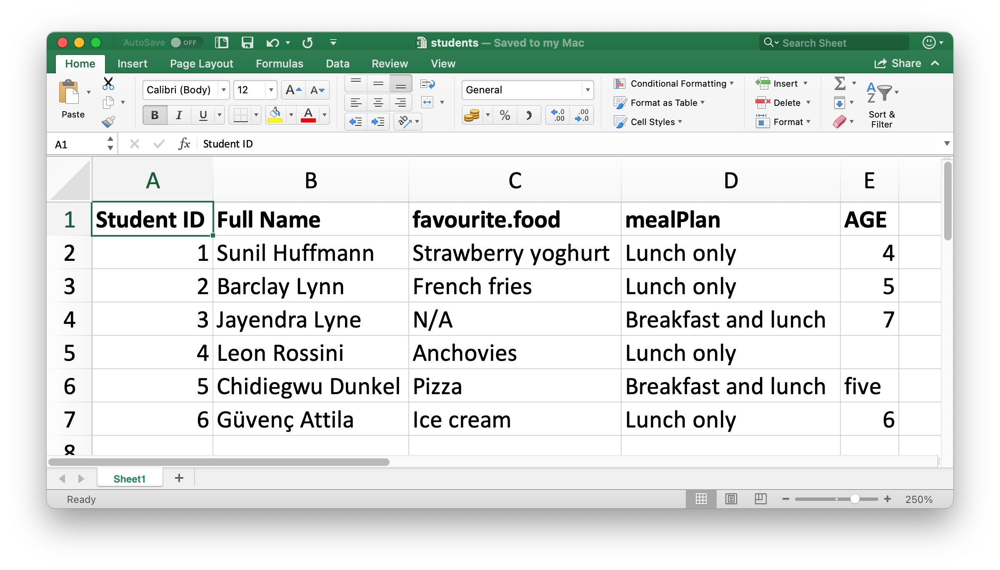
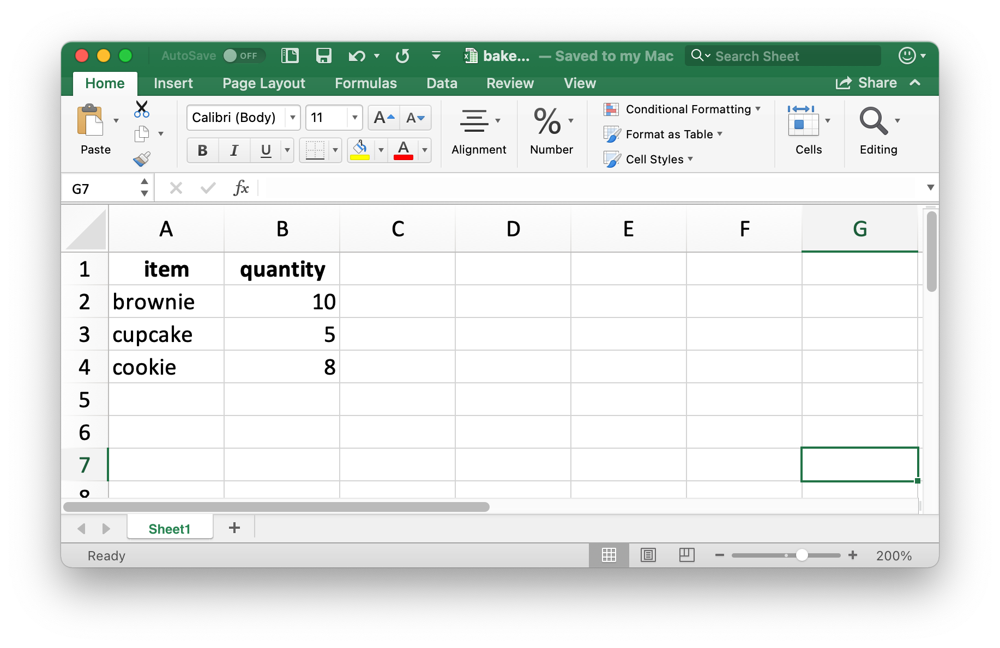
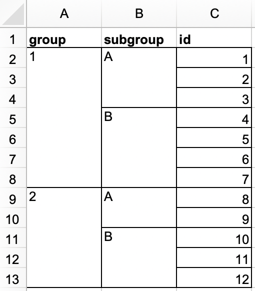
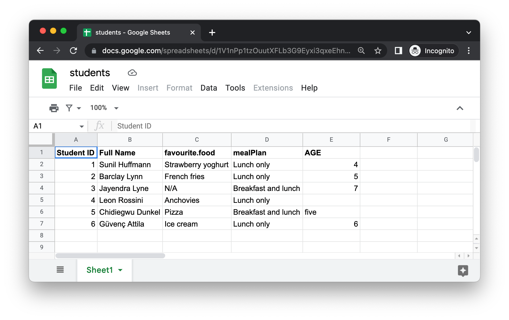

# 스프레드시트 (Spreadsheets) {#sec-import-spreadsheets}

```{r}
#| echo: false
source("_common.R")
```

## 소개 (Introduction)

@sec-data-import에서 `.csv` 및 `.tsv`와 같은 일반 텍스트 파일에서 데이터를 가져오는 방법에 대해 배웠습니다.
이제 Excel 스프레드시트나 Google 스프레드시트 등 스프레드시트에서 데이터를 가져오는 방법을 배울 차례입니다.
이는 @sec-data-import에서 배운 내용의 많은 부분을 기반으로 하지만 스프레드시트 데이터로 작업할 때 추가로 고려해야 할 사항(considerations)과 복잡성(complexities)에 대해서도 논의할 것입니다.

여러분이 혹은 여러분의 동료(collaborators)가 데이터 구성을 위해 스프레드시트를 사용하고 있다면 Karl Broman과 Kara Woo의 "스프레드시트의 데이터 구성(Data Organization in Spreadsheets)" 논문(<https://doi.org/10.1080/00031305.2017.1375989>)을 읽어보실 것을 강력히 권장합니다.
이 논문에 제시된 모범 사례(best practices)는 데이터를 분석하고 시각화하기 위해 스프레드시트에서 R로 가져올 때 많은 골칫거리(headache)를 덜어줄 것입니다.

## 엑셀 (Excel)

Microsoft Excel은 스프레드시트 파일 내의 워크시트(worksheets)에 데이터가 구성되는 널리 사용되는 스프레드시트 소프트웨어 프로그램입니다.

### 전제 조건 (Prerequisites)

이 섹션에서는 **readxl** 패키지를 사용하여 R에서 Excel 스프레드시트의 데이터를 로드하는 방법을 배웁니다.
이 패키지는 핵심(core) tidyverse가 아니므로 명시적으로 로드해야 하지만, tidyverse 패키지를 설치할 때 자동으로 설치됩니다.
나중에 Excel 스프레드시트를 만들 수 있는 writexl 패키지도 사용할 것입니다.

```{r}
#| message: false
library(readxl)
library(tidyverse)
library(writexl)
```

### 시작하기 (Getting started)

대부분의 readxl 함수를 사용하여 Excel 스프레드시트를 R로 로드할 수 있습니다.

-   `read_xls()`는 `xls` 형식의 Excel 파일을 읽습니다.
-   `read_xlsx()`는 `xlsx` 형식의 Excel 파일을 읽습니다.
-   `read_excel()`은 `xls` 및 `xlsx` 형식의 파일을 모두 읽을 수 있습니다. 입력을 기반으로 파일 유형을 추측(guesses)합니다.

이러한 함수들은 다른 유형의 파일을 읽기 위해 이전에 소개한 다른 함수(`read_csv()`, `read_table()` 등)와 마찬가지로 모두 유사한 구문(syntax)을 갖습니다.
이 장의 나머지 부분에서는 `read_excel()` 사용에 초점을 맞출 것입니다.

### 엑셀 스프레드시트 읽기 (Reading Excel spreadsheets) {#sec-reading-spreadsheets-excel}

@fig-students-excel은 R로 읽을 스프레드시트가 Excel에서 어떻게 생겼는지 보여줍니다.
이 스프레드시트는 <https://docs.google.com/spreadsheets/d/1V1nPp1tzOuutXFLb3G9Eyxi3qxeEhnOXUzL5_BcCQ0w/>에서 Excel 파일로 다운로드할 수 있습니다.

```{r}
#| label: fig-students-excel
#| echo: false
#| fig-width: 5
#| fig-cap: |
#|   Excel의 students.xlsx라는 스프레드시트.
#| fig-alt: |
#|   Excel의 students 스프레드시트 보기. 이 스프레드시트에는 
#|   6명의 학생에 대한 정보, ID, 전체 이름, 가장 좋아하는 음식, 식사 계획, 
#|   나이가 포함되어 있습니다.

```

`read_excel()`의 첫 번째 인수는 읽을 파일의 경로입니다.

```{r}
students <- read_excel("data/students.xlsx")
```

`read_excel()`은 파일을 티블로 읽어옵니다.

```{r}
students
```

데이터에는 6명의 학생이 있고 각 학생에 대해 5개의 변수가 있습니다.
그러나 이 데이터셋에서 해결(address)하고 싶은 몇 가지 사항이 있습니다.

1.  열 이름이 엉망입니다(all over the place).
    일관된 형식을 따르는 열 이름을 제공할 수 있습니다. `col_names` 인수를 사용하여 `snake_case`를 권장합니다.

    ```{r}
    #| include: false
    options(
      dplyr.print_min = 7,
      dplyr.print_max = 7
    )
    ```

    ```{r}
    read_excel(
      "data/students.xlsx",
      col_names = c("student_id", "full_name", "favourite_food", "meal_plan", "age")
    )
    ```

    ```{r}
    #| include: false
    options(
      dplyr.print_min = 6,
      dplyr.print_max = 6
    )
    ```

    불행히도(Unfortunately) 이것은 완전히(quite) 성공적이지는 않았습니다(didn't quite do the trick).
    이제 원하는 변수 이름이 생겼지만 이전 헤더 행이었던 것이 데이터의 첫 번째 관측값으로 나타납니다.
    `skip` 인수를 사용하여 해당 행을 명시적으로 건너뛸(skip) 수 있습니다.

    ```{r}
    read_excel(
      "data/students.xlsx",
      col_names = c("student_id", "full_name", "favourite_food", "meal_plan", "age"),
      skip = 1
    )
    ```

2.  `favourite_food` 열에서 관측값 중 하나는 `N/A`인데, 이는 "이용할 수 없음(not available)"을 의미하지만 현재는 `NA`로 인식(recognized)되지 않습니다(이 `N/A`와 목록에 있는 네 번째 학생의 나이의 대조(contrast)에 유의하세요).
    `na` 인수를 사용하여 어떤 문자열을 `NA`로 인식해야 하는지 지정할 수 있습니다.
    기본적으로 `""`(빈 문자열, 또는 스프레드시트에서 읽을 때 빈 셀이나 수식 `=NA()`가 있는 셀)만 `NA`로 인식됩니다.

    ```{r}
    read_excel(
      "data/students.xlsx",
      col_names = c("student_id", "full_name", "favourite_food", "meal_plan", "age"),
      skip = 1,
      na = c("", "N/A")
    )
    ```

3.  남아있는 또 다른 문제는 `age`가 문자형 변수로 읽히지만 실제로는 숫자형이어야 한다는 것입니다.
    플랫 파일에서 데이터를 읽기 위한 `read_csv()` 및 친구들과 마찬가지로, `read_excel()`에 `col_types` 인수를 제공(supply)하고 읽어올 변수의 열 유형을 지정할 수 있습니다.
    구문은 약간(a bit) 다릅니다.
    여러분의 옵션은 `"skip"`, `"guess"`, `"logical"`, `"numeric"`, `"date"`, `"text"` 또는 `"list"`입니다.

    ```{r}
    read_excel(
      "data/students.xlsx",
      col_names = c("student_id", "full_name", "favourite_food", "meal_plan", "age"),
      skip = 1,
      na = c("", "N/A"),
      col_types = c("numeric", "text", "text", "text", "numeric")
    )
    ```

    그러나 이것도 완전히 원하는 결과를 생성하지는 못했습니다.
    `age`가 숫자여야 한다고 지정함으로써 숫자형이 아닌 항목(항목 값 `five`)이 있는 하나의 셀을 `NA`로 변경했습니다.
    이 경우 나이를 `"text"`로 읽은 다음 데이터가 R에 로드된 후 변경해야 합니다.

    ```{r}
    students <- read_excel(
      "data/students.xlsx",
      col_names = c("student_id", "full_name", "favourite_food", "meal_plan", "age"),
      skip = 1,
      na = c("", "N/A"),
      col_types = c("numeric", "text", "text", "text", "text")
    )

    students <- students |>
      mutate(
        age = if_else(age == "five", "5", age),
        age = parse_number(age)
      )

    students
    ```

데이터를 우리가 원하는 형식으로 정확하게 로드하는 데 여러 단계와 시행착오(trial-and-error)가 필요했으며, 이는 예상치 못한 일(not unexpected)이 아닙니다.
데이터 과학은 반복적인(iterative) 과정(process)이며, 데이터 저장을 위해서뿐만 아니라 공유와 커뮤니케이션을 위해 사람이 스프레드시트에 데이터를 입력하고 사용하려는 경향이 있기 때문에 스프레드시트에서 데이터를 읽어 들일 때 반복 과정이 다른 일반 텍스트, 사각형(rectangular) 데이터 파일에 비해 훨씬 더 지루할(tedious) 수 있습니다.

데이터를 로드하고 살펴보기 전까지는 데이터가 정확히 어떻게 생겼는지 알 수 있는 방법이 없습니다.
음, 사실(actually) 한 가지 방법이 있습니다.
Excel에서 파일을 열고 엿볼(take a peek) 수 있습니다.
이렇게 하려는 경우 원본 데이터 파일은 손대지 않은(untouched) 상태로 유지하고 손대지 않은 파일에서 R로 읽는 동안 상호 작용하여 열어보고 탐색할 수 있도록(to open and browse interactively) Excel 파일의 복사본을 만드는 것이 좋습니다.
이렇게 하면 스프레드시트를 검사(inspecting)하는 동안 우발적으로 덮어쓰지(overwrite) 않도록 할 수 있습니다.
또한 여기서 우리가 한 작업, 즉 데이터를 로드하고, 살펴보고, 코드를 조정(adjustments)하고, 다시 로드하고, 결과에 만족(happy)할 때까지 반복하는 것을 두려워(afraid)해서는 안 됩니다.

### 워크시트 읽기 (Reading worksheets)

스프레드시트를 플랫 파일과 구별하는(distinguishes) 중요한 기능(feature)은 워크시트라고 하는 여러 시트의 개념(notion)입니다.
@fig-penguins-islands는 여러 워크시트가 있는 Excel 스프레드시트를 보여줍니다.
데이터는 **palmerpenguins** 패키지에서 가져온 것이며 이 스프레드시트는 <https://docs.google.com/spreadsheets/d/1aFu8lnD_g0yjF5O-K6SFgSEWiHPpgvFCF0NY9D6LXnY/>에서 Excel 파일로 다운로드할 수 있습니다.
각 워크시트에는 데이터가 수집된 서로 다른 섬의 펭귄에 대한 정보가 포함되어 있습니다.

```{r}
#| label: fig-penguins-islands
#| echo: false
#| fig-cap: |
#|   3개의 워크시트가 포함된 Excel의 penguins.xlsx라는 스프레드시트.
#| fig-alt: |
#|   Excel의 penguins 스프레드시트 보기. 이 스프레드시트에는 
#|   Torgersen Island, Biscoe Island, Dream Island의 세 가지 
#|   워크시트가 포함되어 있습니다.
knitr::include_graphics("screenshots/import-spreadsheets-penguins-islands.png")
```

`read_excel()`의 `sheet` 인수를 사용하여 스프레드시트에서 단일 워크시트를 읽을 수 있습니다.
지금까지(up until now) 의존해(relying on) 왔던 기본값은 첫 번째 시트입니다.

```{r}
read_excel("data/penguins.xlsx", sheet = "Torgersen Island")
```

숫자형 데이터가 포함된 것으로 보이는 일부 변수는 `"NA"` 문자열이 실제 `NA`로 인식되지 않아 문자형으로 읽혔습니다.

```{r}
penguins_torgersen <- read_excel("data/penguins.xlsx", sheet = "Torgersen Island", na = "NA")

penguins_torgersen
```

또는(Alternatively) `excel_sheets()`를 사용하여 Excel 스프레드시트의 모든 워크시트에 대한 정보를 가져온 다음 관심 있는 워크시트를 읽을 수 있습니다.

```{r}
excel_sheets("data/penguins.xlsx")
```

워크시트 이름을 알게 되면 `read_excel()`을 사용하여 개별적(individually)으로 읽을 수 있습니다.

```{r}
penguins_biscoe <- read_excel("data/penguins.xlsx", sheet = "Biscoe Island", na = "NA")
penguins_dream  <- read_excel("data/penguins.xlsx", sheet = "Dream Island", na = "NA")
```

이 경우 전체 펭귄 데이터셋은 스프레드시트의 3개 워크시트에 분산(spread)되어 있습니다.
각 워크시트에는 동일한 수의 열이 있지만 행 수는 다릅니다.

```{r}
dim(penguins_torgersen)
dim(penguins_biscoe)
dim(penguins_dream)
```

`bind_rows()`를 사용하여 함께 합칠(put them together) 수 있습니다.

```{r}
penguins <- bind_rows(penguins_torgersen, penguins_biscoe, penguins_dream)
penguins
```

@sec-iteration에서는 반복적인(repetitive) 코드 없이 이러한 종류의 작업을 수행하는 방법에 대해 설명합니다.

### 시트의 일부 읽기 (Reading part of a sheet)

많은 사람들이 데이터 저장뿐만 아니라 프레젠테이션용으로도 Excel 스프레드시트를 사용하기 때문에 R로 읽으려는 데이터의 일부가 아닌 셀 항목을 스프레드시트에서 찾는 것은 매우 흔한 일입니다.
@fig-deaths-excel은 이러한 스프레드시트를 보여줍니다. 시트 중간에는 데이터 프레임처럼 보이는 것이 있지만 데이터 위와 아래의 셀에는 외적인(extraneous) 텍스트가 있습니다.

```{r}
#| label: fig-deaths-excel
#| echo: false
#| fig-cap: |
#|   Excel의 deaths.xlsx라는 스프레드시트.
#| fig-alt: |
#|   Excel의 deaths 스프레드시트 보기. 스프레드시트의 상단에는 
#|   데이터가 아닌 정보가 포함된 4개의 행이 있습니다; '데이터 레이아웃의 
#|   일관성(consistency)을 위해, 이는 정말 아름다운 일이므로, 계속해서 
#|   여기에 메모를 작성하겠습니다.'라는 텍스트가 이 상위 4개 행의 셀에 분산되어 있습니다. 
#|   그런 다음 10명의 유명인에 대한 사망 정보(이름, 직업, 
#|   나이, 자녀 유무, 생년월일, 사망일 포함)가 포함된 데이터 프레임이 있습니다. 
#|   하단에는 데이터가 아닌 정보가 포함된 4개의 행이 더 있습니다; '정말 
#|   재미있었지만 이제 서명하고 마치겠습니다(signing off now)!'라는 텍스트가 
#|   이 하위 4개 행의 셀에 분산되어 있습니다.
knitr::include_graphics("screenshots/import-spreadsheets-deaths.png")
```

이 스프레드시트는 readxl 패키지에서 제공하는 예제 스프레드시트 중 하나입니다.
`readxl_example()` 함수를 사용하여 패키지가 설치된 디렉터리의 시스템에서 스프레드시트를 찾을(locate) 수 있습니다.
이 함수는 평소처럼 `read_excel()`에서 사용할 수 있는 스프레드시트의 경로를 반환합니다.

```{r}
deaths_path <- readxl_example("deaths.xlsx")
deaths <- read_excel(deaths_path)
deaths
```

상위 3개 행과 하위 4개 행은 데이터 프레임의 일부가 아닙니다.
`skip` 및 `n_max` 인수를 사용하여 이러한 외적인(extraneous) 행을 제거(eliminate)할 수 있지만 셀 범위를 사용하는 것을 권장합니다.
Excel에서 왼쪽 상단 셀은 `A1`입니다.
열을 가로질러 오른쪽으로 이동하면 셀 레이블이 알파벳순으로 이동합니다(`B1`, `C1` 등).
그리고 열 아래로 이동하면 셀 레이블의 숫자가 증가합니다(`A2`, `A3` 등).

여기서 우리가 읽고자 하는 데이터는 셀 `A5`에서 시작하여 셀 `F15`에서 끝납니다.
스프레드시트 표기법(notation)으로는 `A5:F15`이며, 이를 `range` 인수에 제공합니다.

```{r}
read_excel(deaths_path, range = "A5:F15")
```

### 데이터 유형 (Data types)

CSV 파일에서 모든 값은 문자열(strings)입니다.
이것이 데이터에 특히 충실한(true) 것은 아니지만 단순합니다. 모든 것이 문자열입니다.

Excel 스프레드시트의 근본적인(underlying) 데이터는 더 복잡합니다.
셀은 다음 네 가지 중 하나일 수 있습니다.

-   `TRUE`, `FALSE` 또는 `NA`와 같은 부울(boolean).

-   "10" 또는 "10.5"와 같은 숫자(number).

-   "11/1/21" 또는 "11/1/21 3:00 PM"과 같이 시간도 포함할 수 있는 날짜-시간(datetime).

-   "ten"과 같은 텍스트 문자열(text string).

스프레드시트 데이터로 작업할 때는 근본적인 데이터가 셀에 표시되는 내용과 매우 다를 수 있다는 점을 명심(keep in mind)하는 것이 중요합니다.
예를 들어 Excel에는 정수(integer)라는 개념(notion)이 없습니다.
모든 숫자는 부동 소수점(floating points)으로 저장되지만 사용자 지정 가능한(customizable) 소수점 이하 자릿수(decimal points)로 데이터를 표시하도록 선택할 수 있습니다.
마찬가지로 날짜는 실제로는 숫자, 구체적으로는 1900년 1월 1일 이후의 일수로 저장됩니다.
Excel에서 서식을 적용하여 날짜 표시 방식을 사용자 지정할 수 있습니다.
혼란스럽게도(Confusingly), 숫자처럼 보이지만 실제로는 문자열인 것도 가능합니다(Excel 셀에 `'10`을 입력).

근본적인 데이터가 저장되는 방식과 표시되는 방식 간의 이러한 차이로 인해 데이터가 R에 로드될 때 놀라움(surprises)을 유발할 수 있습니다.
기본적으로 readxl은 주어진 열의 데이터 유형을 추측합니다.
권장하는 워크플로는 readxl이 열 유형을 추측하도록 하고, 추측된 열 유형에 만족하는지(happy) 확인한 다음, 그렇지 않은 경우 @sec-reading-spreadsheets-excel에 표시된 대로 `col_types`를 지정하여 다시 가져오는(re-import) 것입니다.

또 다른 과제는 Excel 스프레드시트에 이러한 유형이 혼합된 열이 있는 경우입니다(일부 셀은 숫자, 일부는 텍스트, 일부는 날짜).
데이터를 R로 가져올 때 readxl은 몇 가지 결정을 내려야 합니다.
이러한 경우 이 열의 유형을 `"list"`로 설정할 수 있으며, 그러면 열이 길이 1인 벡터들의 목록으로 로드되며 각 벡터 요소의 유형이 추측됩니다.

::: callout-note
때로는 셀 배경색이나 텍스트의 굵게 표시 여부 등 데이터가 더 특이한(exotic) 방식으로 저장되는 경우가 있습니다.
이러한 경우 [tidyxl 패키지](https://nacnudus.github.io/tidyxl/)가 유용할 수 있습니다.
Excel에서 테이블 형식(tabular)이 아닌 데이터로 작업하기 위한 전략에 대한 자세한 내용은 <https://nacnudus.github.io/spreadsheet-munging-strategies/>를 참조하세요.
:::

### 엑셀에 쓰기 (Writing to Excel) {#sec-writing-to-excel}

나중에 쓸(write out) 수 있는 작은 데이터 프레임을 만들어 봅시다.
`item`은 요인(factor)이고 `quantity`는 정수입니다.

```{r}
bake_sale <- tibble(
  item     = factor(c("brownie", "cupcake", "cookie")),
  quantity = c(10, 5, 8)
)

bake_sale
```

[writexl 패키지](https://docs.ropensci.org/writexl/)의 `write_xlsx()` 함수를 사용하여 데이터를 디스크에 Excel 파일로 다시 쓸(write back) 수 있습니다.

```{r}
#| eval: false

write_xlsx(bake_sale, path = "data/bake-sale.xlsx")
```

@fig-bake-sale-excel은 Excel에서 데이터가 어떻게 보이는지 보여줍니다.
열 이름이 포함되고 굵게 표시된다는 점에 유의하세요.
`col_names` 및 `format_headers` 인수를 `FALSE`로 설정하여 이를 끌(turned off) 수 있습니다.

```{r}
#| label: fig-bake-sale-excel
#| echo: false
#| fig-width: 5
#| fig-cap: |
#|   Excel의 bake-sale.xlsx라는 스프레드시트.
#| fig-alt: |
#|   이전에 만든 베이크 세일(Bake sale) 데이터 프레임을 Excel에서 보여줍니다.

```

CSV에서 읽는 것과 마찬가지로 데이터를 다시 읽어올 때 데이터 유형에 대한 정보가 손실됩니다.
이로 인해 Excel 파일은 중간(interim) 결과를 캐싱(caching)하는 데에도 신뢰할 수 없습니다(unreliable).
대안(alternatives)에 대해서는 @sec-writing-to-a-file을 참조하세요.

```{r}
read_excel("data/bake-sale.xlsx")
```

### 형식이 지정된 출력 (Formatted output)

writexl 패키지는 간단한 Excel 스프레드시트를 작성하기 위한 가벼운(light-weight) 솔루션이지만, 스프레드시트 내의 시트에 쓰거나 스타일 지정(styling)과 같은 추가 기능에 관심이 있다면 [openxlsx 패키지](https://ycphs.github.io/openxlsx)를 사용하는 것이 좋습니다.
여기서 이 패키지 사용에 대한 자세한 내용을 다루지는 않지만(go into the details), openxlsx를 사용하여 R에서 Excel로 작성된 데이터에 대한 추가 서식 지정 기능에 대한 광범위한(extensive) 논의는 <https://ycphs.github.io/openxlsx/articles/Formatting.html>을 읽어보실 것을 권장합니다.

이 패키지는 tidyverse의 일부가 아니므로 함수와 워크플로가 생소하게(unfamiliar) 느껴질 수 있습니다.
예를 들어 함수 이름은 카멜 케이스(camelCase)이고, 여러 함수를 파이프라인으로 구성(composed)할 수 없으며, 인수의 순서가 tidyverse에서 흔히 쓰이는 순서와 다릅니다.
하지만 괜찮습니다.
이 책을 벗어나 R 학습과 사용이 확장(expands)됨에 따라 R에서 특정 목표를 달성(accomplish)하기 위해 사용할 수 있는 다양한 R 패키지에서 사용되는 다양한 스타일을 마주치게(encounter) 될 것입니다.
새로운 패키지에서 사용되는 코딩 스타일에 익숙해지는(familiarizing) 좋은 방법은 함수 설명서에 제공된 예제를 실행하여 구문과 출력 형식에 대한 감을 익히고(get a feel for) 패키지와 함께 제공될 수 있는 비네트(vignettes)를 읽어보는 것입니다.

### 연습 문제 (Exercises)

1.  Excel 파일에서 다음 데이터셋을 만들고 `survey.xlsx`로 저장하세요.
    또는(Alternatively) [여기](https://docs.google.com/spreadsheets/d/1yc5gL-a2OOBr8M7B3IsDNX5uR17vBHOyWZq6xSTG2G8)에서 Excel 파일로 다운로드할 수 있습니다.

    ```{r}
    #| echo: false
    #| fig-width: 4
    #| fig-alt: |
    #|   3개의 열(group, subgroup, id)과 12개의 행이 있는 스프레드시트. 
    #|   group 열에는 두 가지 값, 즉 1(병합된 7개 행에 걸쳐 있음)과 2 
    #|   (병합된 5개 행에 걸쳐 있음)가 있습니다. subgroup 열에는 4가지 값, 
    #|   즉 A(병합된 3개 행에 걸쳐 있음), B(병합된 4개 행에 걸쳐 있음), 
    #|   A(병합된 2개 행에 걸쳐 있음), B(병합된 3개 행에 걸쳐 있음)가 있습니다. 
    #|   id 열에는 1부터 12까지 12개의 값이 있습니다.
    knitr::include_graphics("screenshots/import-spreadsheets-survey.png")
    ```

    그런 다음 `survey_id`를 문자형 변수로, `n_pets`를 숫자형 변수로 하여 이를 R로 읽어오세요.

    ```{r}
    #| echo: false
    read_excel("data/survey.xlsx", na = c("", "N/A"), col_types = c("text", "text")) |>
      mutate(
        n_pets = case_when(
          n_pets == "none" ~ "0",
          n_pets == "two"  ~ "2",
          TRUE             ~ n_pets
        ),
        n_pets = as.numeric(n_pets)
      )
    ```

2.  다른 Excel 파일에서 다음 데이터셋을 만들고 `roster.xlsx`로 저장하세요.
    또는 [여기](https://docs.google.com/spreadsheets/d/1LgZ0Bkg9d_NK8uTdP2uHXm07kAlwx8-Ictf8NocebIE)에서 Excel 파일로 다운로드할 수 있습니다.

    ```{r}
    #| echo: false
    #| fig-width: 4
    #| fig-alt: |
    #|   3개의 열(group, subgroup, id)과 12개의 행이 있는 스프레드시트. 
    #|   group 열에는 두 가지 값, 즉 1(병합된 7개 행에 걸쳐 있음)과 2 
    #|   (병합된 5개 행에 걸쳐 있음)가 있습니다. subgroup 열에는 4가지 값, 
    #|   즉 A(병합된 3개 행에 걸쳐 있음), B(병합된 4개 행에 걸쳐 있음), 
    #|   A(병합된 2개 행에 걸쳐 있음), B(병합된 3개 행에 걸쳐 있음)가 있습니다. 
    #|   id 열에는 1부터 12까지 12개의 값이 있습니다.
    
    ```

    그런 다음 R로 읽어오세요.
    결과 데이터 프레임의 이름은 `roster`여야 하며 다음과 같아야 합니다.

    ```{r}
    #| echo: false
    #| message: false
    read_excel("data/roster.xlsx") |>
      fill(group, subgroup) |>
      print(n = 12)
    ```

3.  새 Excel 파일에서 다음 데이터셋을 만들고 `sales.xlsx`로 저장하세요.
    또는 [여기](https://docs.google.com/spreadsheets/d/1oCqdXUNO8JR3Pca8fHfiz_WXWxMuZAp3YiYFaKze5V0)에서 Excel 파일로 다운로드할 수 있습니다.

    ```{r}
    #| echo: false
    #| fig-alt: |
    #|   2개의 열과 13개의 행이 있는 스프레드시트. 처음 두 행에는 
    #|   시트에 대한 정보가 포함된 텍스트가 있습니다. 행 1은 "이 파일에는 
    #|   판매에 대한 정보가 포함되어 있습니다(This file contains information 
    #|   on sales)"라고 합니다. 행 2는 "데이터는 브랜드 이름별로 구성되며 각 
    #|   브랜드에 대해 판매된 품목의 ID 번호와 판매 개수가 있습니다(Data are organized 
    #|   by brand name, and for each brand, we have the ID number for the item sold, 
    #|   and how many are sold.)."라고 합니다. 그런 다음 빈 행 2개가 있고 데이터 행 9개가 있습니다.
    knitr::include_graphics("screenshots/import-spreadsheets-sales.png")
    ```

    a\.
    `sales.xlsx`를 읽어 들이고 `sales`로 저장합니다.
    데이터 프레임은 다음과 같아야 하며 `id`와 `n`이 열 이름이고 9개의 행이 있어야 합니다.

    ```{r}
    #| echo: false
    #| message: false
    read_excel("data/sales.xlsx", skip = 3, col_names = c("id", "n")) |>
      print(n = 9)
    ```

    b\.
    `sales`를 추가로(further) 수정(Modify)하여 3개의 열(`brand`, `id`, `n`)과 7개의 데이터 행이 있는 다음의 깔끔한(tidy) 형식으로 만드세요.
    `id`와 `n`은 숫자형이고 `brand`는 문자형 변수라는 점에 유의하세요.

    ```{r}
    #| echo: false
    #| message: false
    read_excel("data/sales.xlsx", skip = 3, col_names = c("id", "n")) |>
      mutate(brand = if_else(str_detect(id, "Brand"), id, NA)) |>
      fill(brand) |>
      filter(n != "n") |>
      relocate(brand) |>
      mutate(
        id = as.numeric(id),
        n = as.numeric(n)
      ) |>
      print(n = 7)
    ```

4.  `bake_sale` 데이터 프레임을 다시 만들고 openxlsx 패키지의 `write.xlsx()` 함수를 사용하여 Excel 파일로 출력하세요.

5.  @sec-data-import에서 열 이름을 스네이크 케이스(snake case)로 바꾸는 `janitor::clean_names()` 함수에 대해 배웠습니다.
    이 섹션 앞부분에서 소개한 `students.xlsx` 파일을 읽고 이 함수를 사용하여 열 이름을 "정리(clean)"하세요.

6.  `.xlsx` 확장자(extension)를 가진 파일을 `read_xls()`로 읽으려고 하면 어떻게 됩니까?

## 구글 스프레드시트 (Google Sheets)

Google 스프레드시트는 또 다른 널리 사용되는 스프레드시트 프로그램입니다.
무료이며 웹 기반입니다.
Excel과 마찬가지로 Google 스프레드시트에서도 데이터는 스프레드시트 파일 내부의 워크시트(또는 시트)에 구성(organized)됩니다.

### 전제 조건 (Prerequisites)
이 섹션에서도 스프레드시트에 중점을 두겠지만, 이번에는 **googlesheets4** 패키지를 사용하여 Google 스프레드시트에서 데이터를 로드해 보겠습니다.
이 패키지도 핵심(core) tidyverse가 아니므로 명시적으로 로드해야 합니다.

```{r}
library(googlesheets4)
library(tidyverse)
```

패키지 이름에 대한 간단한 참고 사항: googlesheets4는 R 인터페이스를 Google 스프레드시트에 제공하기 위해 [Sheets API v4](https://developers.google.com/sheets/api/)의 v4를 사용하므로 이런 이름이 붙었습니다.

### 시작하기 (Getting started)

googlesheets4 패키지의 주요 함수는 URL이나 파일 ID에서 Google 스프레드시트를 읽어오는 `read_sheet()`입니다.
이 함수는 `range_read()`라는 이름으로도 쓰입니다(goes by).

또한 `gs4_create()`를 사용하여 완전히 새로운(brand new) 시트를 만들거나 `sheet_write()`와 친구들을 사용하여 기존 시트에 쓸(write) 수도 있습니다.

이 섹션에서는 Excel 섹션에서 사용한 것과 동일한 데이터셋으로 작업하여 Excel에서 데이터를 읽는 워크플로와 Google 스프레드시트 간의 유사점(similarities)과 차이점을 강조(highlight)해 보겠습니다.
readxl과 googlesheets4 패키지는 모두 @sec-data-import에서 보았던 `read_csv()` 함수를 제공하는 readr 패키지의 기능을 모방(mimic)하도록 설계되었습니다.
따라서 `read_excel()`을 `read_sheet()`로 바꾸는(swapping out) 것만으로 많은 작업을 수행할(accomplished) 수 있습니다.
하지만 Excel과 Google 스프레드시트가 완전히(exactly) 같은 방식으로 동작하지는 않으므로 다른 작업에서는 함수 호출에 대한 추가 업데이트가 필요할 수 있다는 점도 보게 될 것입니다.

### 구글 스프레드시트 읽기 (Reading Google Sheets)

@fig-students-googlesheets는 R로 읽을 스프레드시트가 Google 스프레드시트에서 어떻게 보이는지 보여줍니다.
이것은 Excel 대신 Google 스프레드시트에 저장되어 있다는 점을 제외하고는 @fig-students-excel과 동일한 데이터셋입니다.

```{r}
#| label: fig-students-googlesheets
#| echo: false
#| fig-cap: |
#|   브라우저 창에 있는 students라는 Google 스프레드시트.
#| fig-alt: |
#|   Google 스프레드시트의 students 스프레드시트 보기. 이 스프레드시트에는 
#|   6명의 학생에 대한 정보, ID, 전체 이름, 가장 좋아하는 음식, 식사 계획, 
#|   나이가 포함되어 있습니다.

```

`read_sheet()`의 첫 번째 인수는 읽을 파일의 URL이며 티블(tibble)을 반환합니다.\
<https://docs.google.com/spreadsheets/d/1V1nPp1tzOuutXFLb3G9Eyxi3qxeEhnOXUzL5_BcCQ0w>.
이러한 URL은 작업하기(work with) 편하지(pleasant) 않으므로 종종 해당 ID로 시트를 식별하려고 할 것입니다.

```{r}
gs4_deauth()
```

```{r}
students_sheet_id <- "1V1nPp1tzOuutXFLb3G9Eyxi3qxeEhnOXUzL5_BcCQ0w"
students <- read_sheet(students_sheet_id)
students
```

`read_excel()`에서 했던 것과 마찬가지로 `read_sheet()`에 열 이름, NA 문자열 및 열 유형을 제공(supply)할 수 있습니다.

```{r}
students <- read_sheet(
  students_sheet_id,
  col_names = c("student_id", "full_name", "favourite_food", "meal_plan", "age"),
  skip = 1,
  na = c("", "N/A"),
  col_types = "dcccc"
)

students
```

여기서는 짧은 코드(short codes)를 사용하여 열 유형을 약간 다르게 정의했습니다.
예를 들어 "dcccc"는 "double, character, character, character, character"를 나타냅니다.

Google 스프레드시트에서 개별 시트를 읽는 것도 가능합니다.
[펭귄 구글 스프레드시트(penguins Google Sheet)](https://pos.it/r4ds-penguins)에서 "Torgersen Island" 시트를 읽어봅시다.

```{r}
penguins_sheet_id <- "1aFu8lnD_g0yjF5O-K6SFgSEWiHPpgvFCF0NY9D6LXnY"
read_sheet(penguins_sheet_id, sheet = "Torgersen Island")
```

`sheet_names()`를 사용하여 Google 스프레드시트 내의 모든 시트 목록을 얻을(obtain) 수 있습니다.

```{r}
sheet_names(penguins_sheet_id)
```

마지막으로 `read_excel()`과 마찬가지로 `read_sheet()`에 `range`를 정의하여 Google 스프레드시트의 일부분을 읽어들일 수 있습니다.
또한 아래의 `gs4_example()` 함수를 사용하여 googlesheets4 패키지와 함께 제공되는 예제 Google 스프레드시트를 찾고(locate) 있다는 점에 유의하세요.

```{r}
deaths_url <- gs4_example("deaths")
deaths <- read_sheet(deaths_url, range = "A5:F15")
deaths
```

### 구글 스프레드시트에 쓰기 (Writing to Google Sheets)

`write_sheet()`를 사용하여 R에서 Google 스프레드시트로 쓸 수 있습니다.
첫 번째 인수는 작성할 데이터 프레임이고 두 번째 인수는 작성할 Google 스프레드시트의 이름(또는 다른 식별자)입니다.

```{r}
#| eval: false
write_sheet(bake_sale, ss = "bake-sale")
```

데이터를 Google 스프레드시트 내의 특정 (워크)시트에 작성하려는 경우 `sheet` 인수를 사용하여 지정할 수도 있습니다.

```{r}
#| eval: false
write_sheet(bake_sale, ss = "bake-sale", sheet = "Sales")
```

### 인증 (Authentication)

공개(public) Google 스프레드시트의 경우 Google 계정 인증 없이 그리고 `gs4_deauth()`를 사용하여 읽을 수 있지만, 비공개(private) 시트를 읽거나 시트에 쓰려면(writing) googlesheets4가 *여러분의* Google 스프레드시트를 보고 관리할 수 있도록 인증(authentication)이 필요합니다.

인증이 필요한 시트를 읽으려고 시도할(attempt) 때, googlesheets4는 웹 브라우저로 안내하여 Google 계정에 로그인하고 Google 스프레드시트를 대신(on your behalf) 운영(operate)할 수 있는 권한을 부여하라는 메시지(prompt)를 표시합니다.
그러나 특정 Google 계정, 인증 범위(scope) 등을 지정하려는 경우 `gs4_auth()`를 사용할 수 있습니다(`gs4_auth(email = "mine@example.com")`). 이렇게 하면 특정 이메일과 연결된 토큰을 강제로 사용하게 됩니다.
인증에 대한 자세한 내용은 googlesheets4 인증 비네트(auth vignette) 문서(<https://googlesheets4.tidyverse.org/articles/auth.html>)를 읽어보실 것을 권장합니다.

### 연습 문제 (Exercises)

1.  이 장 앞부분의 `students` 데이터셋을 `read_excel()` 및 `read_sheet()` 함수에 추가 인수를 제공하지 않고 Excel과 Google 스프레드시트에서 모두 읽어옵니다.
    R에서 결과 데이터 프레임이 정확히(exactly) 같습니까?
    다르다면 어떻게 다릅니까?

2.  <https://pos.it/r4ds-survey>에서 survey라는 제목의 Google 스프레드시트를 읽고 `survey_id`는 문자형 변수로, `n_pets`는 숫자형 변수로 설정합니다.

3.  <https://pos.it/r4ds-roster>에서 roster라는 제목의 Google 스프레드시트를 읽습니다.
    결과 데이터 프레임의 이름은 `roster`여야 하며 다음과 같아야 합니다.

    ```{r}
    #| echo: false
    #| message: false
    read_sheet("https://docs.google.com/spreadsheets/d/1LgZ0Bkg9d_NK8uTdP2uHXm07kAlwx8-Ictf8NocebIE/") |>
      fill(group, subgroup) |>
      print(n = 12)
    ```

## 요약 (Summary)

Microsoft Excel과 Google 스프레드시트는 가장 인기 있는 스프레드시트 시스템 두 가지입니다.
R에서 직접 Excel 및 Google 스프레드시트 파일에 저장된 데이터와 상호 작용할 수 있다는 것은 엄청난(superpower) 일입니다!
이 장에서는 readxl 패키지의 `read_excel()`을 사용하여 Excel에서, googlesheets4 패키지의 `read_sheet()`를 사용하여 Google 스프레드시트에서 R로 데이터를 읽어오는 방법을 배웠습니다.
이러한 함수들은 서로 매우 유사하게 작동하며 열 이름, NA 문자열, 읽어 들이는 파일 상단에서 건너뛸 행 등을 지정하기 위한 유사한 인수를 갖습니다.
또한 두 함수 모두 스프레드시트에서 단일 시트를 읽는 것도 가능하게 합니다.

반면(On the other hand) Excel 파일에 쓰려면 다른 패키지와 함수(`writexl::write_xlsx()`)가 필요한 반면(while), googlesheets4 패키지를 사용하면 `write_sheet()`로 Google 스프레드시트에 쓸 수 있습니다.

다음 장에서는 또 다른 데이터 소스와 해당 소스에서 R로 데이터를 읽어들이는 방법인 데이터베이스에 대해 배웁니다.
