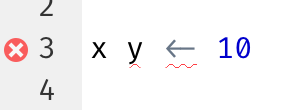

# 워크플로: 스크립트와 프로젝트 (Workflow: scripts and projects) {#sec-workflow-scripts-projects}

```{r}
#| echo: false
source("_common.R")
```

이 장에서는 코드를 구성하기 위한 두 가지 필수 도구인 스크립트(scripts)와 프로젝트(projects)를 소개합니다.

## 스크립트 (Scripts)

지금까지 여러분은 코드를 실행하기 위해 콘솔을 사용했습니다.
시작하기에는 아주 좋은 장소이지만, 더 복잡한 ggplot2 그래픽과 더 긴 dplyr 파이프라인을 만들다 보면 꽤 빨리 비좁아진다는 것을 알게 될 것입니다.
작업할 공간을 더 확보하려면 스크립트 에디터(script editor)를 사용하세요.
File 메뉴를 클릭하고 New File, R script를 차례로 선택하거나 키보드 단축키 Cmd/Ctrl + Shift + N을 사용하여 스크립트 에디터를 엽니다.
이제 @fig-rstudio-script처럼 네 개의 창(panes)이 보일 것입니다.
스크립트 에디터는 코드를 실험하기에 좋은 장소입니다.
무언가를 변경하고 싶을 때 전체를 다시 입력할 필요 없이 스크립트를 편집하고 다시 실행하기만 하면 됩니다.
그리고 작동하고 원하는 작업을 수행하는 코드를 작성했다면 스크립트 파일로 저장하여 나중에 쉽게 다시 열어볼 수 있습니다.

```{r}
#| label: fig-rstudio-script
#| echo: false
#| out-width: ~
#| fig-cap: |
#|   스크립트 에디터를 열면 IDE의 왼쪽 상단에 새 창이 추가됩니다.
#| fig-alt: |
#|   에디터, 콘솔, 출력이 강조 표시된 RStudio IDE.
knitr::include_graphics("diagrams/rstudio/script.png", dpi = 270)
```

### 코드 실행 (Running code)

스크립트 에디터는 복잡한 ggplot2 플롯이나 dplyr 조작의 긴 시퀀스를 구축하는 데 훌륭한 장소입니다.
스크립트 에디터를 효과적으로 사용하는 열쇠는 가장 중요한 키보드 단축키 중 하나인 Cmd/Ctrl + Enter를 외우는 것입니다.
이는 콘솔에서 현재의 R 표현식을 실행합니다.
예를 들어 아래 코드를 살펴보겠습니다.

```{r}
#| eval: false
library(dplyr)
library(nycflights13)

not_cancelled <- flights |> 
  filter(!is.na(dep_delay)█, !is.na(arr_delay))

not_cancelled |> 
  group_by(year, month, day) |> 
  summarize(mean = mean(dep_delay))
```

커서가 █에 있는 경우 Cmd/Ctrl + Enter를 누르면 `not_cancelled`를 생성하는 전체 명령이 실행됩니다.
또한 커서를 다음 명령문(`not_cancelled |>`로 시작하는 부분)으로 이동시킵니다.
이렇게 하면 Cmd/Ctrl + Enter를 반복적으로 눌러 전체 스크립트를 단계별로 실행하기 쉽습니다.

코드를 표현식별로(expression-by-expression) 실행하는 대신 Cmd/Ctrl + Shift + S를 사용하여 전체 스크립트를 한 번에 실행할 수도 있습니다.
이 작업을 정기적으로 수행하는 것은 코드의 모든 중요한 부분이 스크립트에 제대로 캡처(captured)되었는지 확인하는 좋은 방법입니다.

항상 필요한 패키지들을 로딩하는 것으로 스크립트를 시작할 것을 권장합니다.
그렇게 하면 다른 사람들과 코드를 공유할 때 그들이 어떤 패키지를 설치해야 하는지 쉽게 알 수 있습니다.
그러나 공유하는 스크립트에 `install.packages()`를 포함해서는 절대로 안 됩니다.
주의하지 않는다면 다른 사람의 컴퓨터에 있는 무언가를 변경할 수도 있는 스크립트를 건네는 것은 배려심 없는 행동입니다!

이후 장들을 학습할 때는 스크립트 에디터에서 시작하고 키보드 단축키를 연습하는 것을 적극 권장합니다.
시간이 지나면 이런 식으로 코드를 콘솔로 보내는 것이 너무 자연스러워져서 생각조차 하지 않게 될 것입니다.

### RStudio 진단 (RStudio diagnostics)

스크립트 에디터에서 RStudio는 사이드바에 빨간색 십자형 기호(cross)와 물결 모양 밑줄(squiggly line)로 구문 오류(syntax errors)를 강조 표시합니다.

```{r}
#| echo: false
#| out-width: ~
#| fig-alt: |
#|   `x y <- 10` 스크립트가 있는 스크립트 에디터. 빨간색 X는 구문 오류가 있음을 
#|   나타냅니다. 구문 오류는 빨간색 물결 모양 밑줄로도 강조 표시됩니다.

```

십자형 기호 위에 마우스를 올리면 어떤 문제인지 확인할 수 있습니다.

```{r}
#| echo: false
#| out-width: ~
#| fig-alt: |
#|   `x y <- 10` 스크립트가 있는 스크립트 에디터. 빨간색 X는 구문 오류가 있음을 
#|   나타냅니다. 구문 오류는 빨간색 물결 모양 밑줄로도 강조 표시됩니다.
#|   X 위로 마우스를 가져가면 'unexpected token y' 및 
#|   'unexpected token <-'라는 텍스트가 포함된 텍스트 상자가 표시됩니다.
knitr::include_graphics("screenshots/rstudio-diagnostic-tip.png")
```

RStudio는 또한 잠재적인 문제에 대해서도 알려줍니다.

```{r}
#| echo: false
#| out-width: ~
#| fig-alt: |
#|   `3 == NA` 스크립트가 있는 스크립트 에디터. 노란색 느낌표는 
#|   잠재적인 문제가 있을 수 있음을 나타냅니다. 느낌표 
#|   위로 마우스를 가져가면 'use is.na to check 
#|   whether expression evaluates to NA'라는 텍스트가 포함된 텍스트 상자가 표시됩니다.
knitr::include_graphics("screenshots/rstudio-diagnostic-warn.png")
```

### 저장 및 명명 (Saving and naming)

RStudio는 종료 시 스크립트 에디터의 내용을 자동으로 저장하고 다시 열 때 자동으로 다시 로드합니다.
그럼에도 불구하고 Untitled1, Untitled2, Untitled3 등과 같은 이름은 피하고 대신 스크립트를 저장하고 유익한 정보가 담긴 이름을 지정하는 것이 좋습니다.

파일 이름을 `code.R`이나 `myscript.R`로 지정하고 싶을 수도 있지만 파일 이름을 선택하기 전에 조금 더 신중하게 생각해야 합니다.
파일 이름 지정의 3가지 중요한 원칙은 다음과 같습니다.

1.  파일 이름은 **기계(machine)**가 읽을 수 있어야 합니다. 공백, 기호, 특수 문자를 피하세요. 대소문자 구분에 의존하여 파일을 구별하지 마세요.
2.  파일 이름은 **사람(human)**이 읽을 수 있어야 합니다. 파일 이름을 사용하여 파일에 무엇이 있는지 설명하세요.
3.  파일 이름은 기본 정렬(default ordering) 방식과 잘 어울려야 합니다. 알파벳순 정렬이 사용되는 순서대로 파일을 정렬할 수 있도록 숫자로 파일 이름을 시작하세요.

예를 들어 프로젝트 폴더에 다음과 같은 파일이 있다고 가정해 보겠습니다.

```         
alternative model.R
code for exploratory analysis.r
finalreport.qmd
FinalReport.qmd
fig 1.png
Figure_02.png
model_first_try.R
run-first.r
temp.txt
```

여기에는 다양한 문제가 있습니다. 어느 파일을 먼저 실행해야 하는지 찾기 어렵고, 파일 이름에 공백이 포함되어 있으며, 이름은 같지만 대소문자 구분이 다른 두 개의 파일(`finalreport` 대 `FinalReport`[^workflow-scripts-1])이 있고, 일부 이름은 내용(`run-first` 및 `temp`)을 설명하지 않습니다.

[^workflow-scripts-1]: 이름에 "final"을 사용하여 운명을 시험하고 있다는 것은 말할 것도 없습니다 😆 코믹스 Piled Higher and Deeper에 이에 대한 [재미있는 만화 스트립(fun strip)](https://phdcomics.com/comics/archive.php?comicid=1531)이 있습니다.

다음은 동일한 파일 집합의 이름을 지정하고 구성하는 더 나은 방법입니다.

```         
01-load-data.R
02-exploratory-analysis.R
03-model-approach-1.R
04-model-approach-2.R
fig-01.png
fig-02.png
report-2022-03-20.qmd
report-2022-04-02.qmd
report-draft-notes.txt
```

주요 스크립트에 번호를 지정하면 어떤 순서로 실행할지 명확해지며 일관된 명명 체계를 통해 무엇이 다른지(varies) 더 쉽게 확인할 수 있습니다.
또한 그림은 유사하게 라벨링되며 보고서는 파일 이름에 포함된 날짜로 구별되고 `temp`는 그 내용을 더 잘 설명하기 위해 `report-draft-notes`로 이름이 변경됩니다.
디렉토리에 많은 파일이 있는 경우 조직화(organization)를 한 단계 더 나아가 다양한 유형의 파일(스크립트, 그림 등)을 서로 다른 디렉토리에 배치하는 것이 권장됩니다.

## 프로젝트 (Projects)

언젠가 여러분은 R을 종료하고, 다른 일을 하고, 나중에 분석으로 돌아와야 할 것입니다.
언젠가 여러분은 여러 분석을 동시에 수행하게 될 것이고 이들을 별도로 유지하고 싶을 것입니다.
언젠가 외부 세계의 데이터를 R로 가져오고 R의 수치 결과와 그림을 외부 세계로 내보내야 할 것입니다.

이러한 실제 상황을 다루려면 두 가지 결정을 내려야 합니다.

1.  진실의 출처(source of truth)는 무엇인가?
    어떤 일이 있었는지에 대한 영구적인 기록으로 무엇을 남겨둘 것인가?

2.  분석 결과(analysis)는 어디에 존재하는가?

### 진실의 출처는 무엇인가? (What is the source of truth?)

초보자라면 분석 과정 전반에 걸쳐 생성한 모든 객체가 현재 환경(Environment)에 포함되도록 의존해도 괜찮습니다.
하지만 대규모 프로젝트에서 작업하거나 다른 사람들과 공동 작업하는 것을 더 쉽게 하려면 진실의 출처가 R 스크립트여야 합니다.
R 스크립트(및 데이터 파일)를 사용하면 환경을 다시 만들 수 있습니다.
환경만으로는 R 스크립트를 다시 만들기가 훨씬 어렵습니다. 기억을 더듬어 많은 코드를 다시 입력해야 하거나(이 과정에서 필연적으로 실수하게 됨) R 히스토리를 주의 깊게 캐내야(mine) 합니다.

R 스크립트를 분석의 진실의 출처로 유지하는 데 도움이 되도록 세션(sessions) 간에 작업 공간을 보존하지 않도록 RStudio에 지시하는 것을 적극 권장합니다.
`usethis::use_blank_slate()`[^workflow-scripts-2]를 실행하거나 @fig-blank-slate에 표시된 옵션을 모방하여 이 작업을 수행할 수 있습니다. 이것은 여러분에게 약간의 단기적 고통을 안겨줄 것입니다. 왜냐하면 이제 RStudio를 다시 시작하면 마지막으로 실행한 코드를 기억하지 못하며 여러분이 생성한 객체나 읽어온 데이터셋도 사용할 수 없게 되기 때문입니다.
하지만 이 단기적인 고통은 여러분이 중요한 모든 절차를 코드에 기록하도록 강제하기 때문에 장기적인 고통으로부터 여러분을 구합니다.
3개월 후에 중요한 계산의 결과만 환경에 저장해 두고 계산 그 자체는 코드에 저장하지 않았다는 사실을 알게 되는 것보다 더 최악인 것은 없습니다.

[^workflow-scripts-2]: usethis 패키지가 설치되어 있지 않다면 `install.packages("usethis")`를 사용하여 설치할 수 있습니다.

```{r}
#| label: fig-blank-slate
#| echo: false
#| fig-cap: |
#|   항상 백지 상태(clean slate)에서 RStudio 세션을 시작하려면 
#|   RStudio 옵션에서 이 옵션들을 복사하세요.
#| fig-alt: |
#|   RStudio Global Options 창에서 'Restore .RData into workspace 
#|   at startup' 옵션이 선택되어 있지 않습니다. 또한 'Save workspace to .RData 
#|   on exit' 옵션은 'Never'로 설정되어 있습니다.
#| out-width: ~
knitr::include_graphics("diagrams/rstudio/clean-slate.png", dpi = 270)
```

코드의 중요한 부분을 에디터에 제대로 캡처했는지 확인하기 위해 함께 작동하는 훌륭한 키보드 단축키 쌍이 있습니다.

1.  Cmd/Ctrl + Shift + 0/F10을 눌러 R을 다시 시작합니다.
2.  Cmd/Ctrl + Shift + S를 눌러 현재 스크립트를 다시 실행합니다.

우리는 일주일에 수백 번 이 패턴을 함께 사용합니다.

대안으로, 키보드 단축키를 사용하지 않는다면 Session \> Restart R로 이동한 다음 현재 스크립트를 강조 표시하고(highlight) 다시 실행할 수 있습니다.

::: callout-note
## RStudio server

RStudio 서버를 사용하는 경우 기본적으로 R 세션이 다시 시작되지 않습니다.
RStudio 서버 탭을 닫으면 R을 닫는 것처럼 느껴질 수 있지만, 실제로는 서버가 백그라운드에서 R을 계속 실행하고 있습니다.
다음에 다시 돌아오면 떠났을 때와 정확히 같은 상태일 것입니다.
이로 인해 백지 상태에서 시작할 수 있도록 R을 정기적으로 다시 시작하는 것이 더욱 중요해집니다.
:::

### 분석 결과는 어디에 존재하는가? (Where does your analysis live?)

R에는 **작업 디렉토리(working directory)**라는 강력한 개념이 있습니다.
이곳은 R이 로드해달라고 요청한 파일을 찾는 곳이며 저장하라고 요청한 파일이 저장되는 곳입니다.
RStudio는 콘솔 상단에 현재 작업 디렉토리를 표시합니다.

```{r}
#| echo: false
#| fig-alt: |
#|   콘솔 탭에 현재 작업 디렉토리가 
#|   ~/Documents/r4ds로 표시됩니다.
#| out-width: ~
knitr::include_graphics("screenshots/rstudio-wd.png")
```

`getwd()`를 실행하면 R 코드에서 이를 출력할 수 있습니다.

```{r}
#| eval: false
getwd()
#> [1] "/Users/hadley/Documents/r4ds"
```

이 R 세션에서 현재 작업 디렉토리("홈(home)"이라고 생각하세요)는 hadley의 Documents 폴더 안에 있는 r4ds라는 하위 폴더에 있습니다.
이 코드는 여러분의 컴퓨터가 Hadley의 컴퓨터와 다른 디렉토리 구조를 가지고 있기 때문에 실행할 때 다른 결과를 반환할 것입니다!

초보 R 사용자라면 작업 디렉토리를 홈 디렉토리, 문서 디렉토리 또는 컴퓨터의 다른 이상한 디렉토리로 설정해도 괜찮습니다.
하지만 여러분은 이 책을 벌써 여러 장 학습했고, 이제 더 이상 초보자가 아닙니다.
이제 곧 프로젝트를 디렉토리로 정리하는 것으로 발전해야 하며, 프로젝트를 작업할 때 R의 작업 디렉토리를 관련된 디렉토리로 설정해야 합니다.

R 내에서 작업 디렉토리를 설정할 수는 있지만 **우리는** **그것을 권장하지 않습니다**:

```{r}
#| eval: false
setwd("/path/to/my/CoolProject")
```
더 나은 방법이 있습니다. 전문가처럼 R 작업을 관리할 수 있도록 안내하는 방법입니다.
그 방법은 바로 **RStudio** **프로젝트(project)**입니다.

### RStudio 프로젝트 (RStudio projects)

주어진 프로젝트(입력 데이터, R 스크립트, 분석 결과, 그림 등)와 관련된 모든 파일을 하나의 디렉토리에 함께 보관하는 것은 매우 현명하고 일반적인 방법이기 때문에 RStudio는 **프로젝트**를 통해 이를 기본적으로 지원합니다.
이 책의 나머지 부분을 학습하는 동안 사용할 프로젝트를 만들어 보겠습니다.
File \> New Project를 클릭한 다음 @fig-new-project에 표시된 단계를 따릅니다.

```{r}
#| label: fig-new-project
#| echo: false
#| fig-cap: | 
#|   새 프로젝트를 만들려면: (위) 먼저 New Directory를 클릭한 다음 (가운데) 
#|   New Project를 클릭하고, (아래) 디렉토리(프로젝트) 이름을 입력하고 
#|   프로젝트가 위치할 적절한 하위 디렉토리를 선택한 후 Create Project를 클릭합니다.
#| fig-alt: |
#|   New Project 메뉴의 스크린샷 3개. 첫 번째 스크린샷에는 
#|   Create Project 창이 표시되고 New Directory가 선택되어 있습니다. 
#|   두 번째 스크린샷에는 Project Type 창이 표시되고 
#|   Empty Project가 선택되어 있습니다. 세 번째 스크린샷에는 Create New 
#|   Project 창이 표시되고 디렉토리 이름이 r4ds로 지정되어 있으며 
#|   프로젝트가 데스크톱의 하위 디렉토리로 생성되고 있습니다.
#| out-width: ~
knitr::include_graphics("diagrams/new-project.png")
```

프로젝트 이름을 `r4ds`로 지정하고 이 프로젝트를 어느 하위 디렉토리에 넣을지 신중하게 생각하세요.
적당한(sensible) 곳에 저장해 두지 않으면 나중에 찾기가 힘들 것입니다!

이 과정이 완료되면 오직 이 책만을 위한 새로운 RStudio 프로젝트가 생성됩니다.
프로젝트의 "홈(home)"이 현재 작업 디렉토리인지 확인합니다.

```{r}
#| eval: false
getwd()
#> [1] /Users/hadley/Documents/r4ds
```

이제 스크립트 에디터에 다음 명령들을 입력하고 파일을 "diamonds.R"이라는 이름으로 저장합니다.
그런 다음 "data"라는 새 폴더를 만듭니다.
이 작업은 RStudio의 Files 창에서 "New Folder" 버튼을 클릭하여 수행할 수 있습니다.
마지막으로, PNG와 CSV 파일을 프로젝트 디렉토리에 저장하는 전체 스크립트를 실행합니다.
세부 사항에 대해서는 걱정하지 마세요. 나중에 책에서 배우게 될 것입니다.

```{r}
#| label: toy-line
#| eval: false
library(tidyverse)

ggplot(diamonds, aes(x = carat, y = price)) + 
  geom_hex()
ggsave("diamonds.png")

write_csv(diamonds, "data/diamonds.csv")
```

RStudio를 종료합니다.
프로젝트와 연결된 폴더를 살펴보세요. `.Rproj` 파일이 있는 것을 주목하세요.
해당 파일을 더블 클릭하여 프로젝트를 다시 엽니다.
작업을 중단했던 곳으로 정확히 되돌아가는 것을 주목하세요. 동일한 작업 디렉토리와 명령 히스토리가 유지되며 작업 중이던 모든 파일이 여전히 열려 있습니다.
그러나 위의 지침을 따랐기 때문에 여러분의 환경은 완전히 새로워져 있을 것이며, 이는 여러분이 백지 상태(clean slate)에서 시작하고 있음을 보장합니다.

운영 체제에 맞는 즐겨 쓰는 방법으로 컴퓨터에서 `diamonds.png`를 검색해 보면 PNG 파일을 찾을 수 있을 뿐만 아니라(놀랄 일은 아니죠) *그것을 만든 스크립트*(`diamonds.R`)도 찾을 수 있습니다.
이것은 엄청난 성과입니다!
언젠가 여러분은 그림을 다시 만들거나 그림이 어떻게 만들어졌는지 이해하고 싶어 할 것입니다.
마우스나 클립보드가 아닌 **R 코드와 함께** 철저하게 파일로 그림을 저장한다면 기존의 작업을 쉽게 재현할 수 있을 것입니다!

### 상대 경로와 절대 경로 (Relative and absolute paths)

일단 프로젝트 내부에 들어가면 절대 경로가 아닌 상대 경로만 사용해야 합니다.
차이점이 무엇일까요?
상대 경로는 작업 디렉토리, 즉 프로젝트의 홈을 기준으로 합니다.
위에서 Hadley가 `data/diamonds.csv`를 작성했을 때 그것은 `/Users/hadley/Documents/r4ds/data/diamonds.csv`의 단축키였습니다.
하지만 중요한 것은 Mine이 자신의 컴퓨터에서 이 코드를 실행한다면 이 코드는 `/Users/Mine/Documents/r4ds/data/diamonds.csv`를 가리킬 것이라는 점입니다.
상대 경로가 중요한 이유는 바로 이것입니다. R 프로젝트 폴더가 어느 위치에 있든 상관없이 작동할 것입니다.

절대 경로는 작업 디렉토리와 상관없이 동일한 위치를 가리킵니다.
운영 체제에 따라 조금씩 다르게 보입니다.
Windows에서는 드라이브 문자(`C:`) 또는 두 개의 백슬래시(`\\servername`)로 시작하고 Mac/Linux에서는 슬래시 "/"(`/users/hadley`)로 시작합니다.
절대 경로는 공유를 방해하므로 스크립트에서 **절대** 사용해서는 안 됩니다. 다른 어느 누구도 여러분과 정확히 동일한 디렉토리 구성을 가지고 있지 않을 것입니다.

운영 체제 간에는 또 다른 중요한 차이점이 있습니다. 경로의 구성 요소를 구분하는 방법입니다.
Mac과 Linux는 슬래시(`data/diamonds.csv`)를 사용하고 Windows는 백슬래시(`data\diamonds.csv`)를 사용합니다.
R은 (현재 사용 중인 플랫폼에 상관없이) 두 유형 모두에서 작동할 수 있지만 불행히도 백슬래시는 R에서 특별한 의미를 가지며 경로에 백슬래시 한 개를 포함하려면 백슬래시 두 개를 입력해야 합니다!
이것은 생활을 실망스럽게(frustrating) 만들므로 우리는 항상 슬래시가 있는 Linux/Mac 스타일을 사용하는 것을 권장합니다.

## 연습 문제 (Exercises)

1.  RStudio Tips 트위터 계정 <https://twitter.com/rstudiotips>으로 이동하여 흥미로워 보이는 팁 하나를 찾으세요.
    이것을 사용하는 연습을 하세요!

2.  RStudio 진단이 보고하는 다른 일반적인 실수는 무엇이 있나요?
    <https://support.posit.co/hc/en-us/articles/205753617-Code-Diagnostics>를 읽고 알아보세요.

## 요약 (Summary)

이 장에서는 스크립트(파일)와 프로젝트(디렉토리)를 통해 R 코드를 구성하는 방법을 배웠습니다.
코드 스타일과 마찬가지로 처음에는 쓸데없는 바쁜 일(busywork)처럼 느껴질 수 있습니다.
그러나 여러 프로젝트에 걸쳐 더 많은 코드가 축적됨에 따라 약간의 사전 구성 작업이 장기적으로 얼마나 많은 시간을 절약해 주는지 이해하게 될 것입니다.

요약하자면, 스크립트와 프로젝트는 미래에 여러분에게 도움이 될 탄탄한 워크플로를 제공합니다.

-   데이터 분석 프로젝트마다 하나의 RStudio 프로젝트를 만듭니다.
-   프로젝트에 스크립트를 (유익한 이름으로) 저장하고, 편집하고, 부분별로 또는 전체로 실행합니다. 스크립트에 모든 내용을 제대로 캡처했는지 확인하기 위해 R을 자주 다시 시작하세요.
-   절대 경로가 아닌 상대 경로만 항상 사용하세요.

그러면 여러분에게 필요한 모든 것이 한곳에 있고 여러분이 작업 중인 다른 모든 프로젝트와 깔끔하게 분리됩니다.

지금까지 우리는 R 패키지 내부에 번들로 제공되는 데이터셋을 사용하여 작업했습니다.
이렇게 하면 미리 준비된 데이터를 통해 몇 가지 연습을 더 쉽게 할 수 있지만 여러분의 데이터를 이런 식으로 사용할 수 없는 것은 당연합니다.
그래서 다음 장에서는 readr 패키지를 사용하여 디스크에 있는 데이터를 R 세션으로 로드하는 방법에 대해 알아볼 것입니다.
