
1\.

# 1 시계열 요소 (Time Series Elements)

다른 시간대에서 관측된 데이터를 분석하면 전통적인 통계학으로는 다루기 어려운 고유한 문제들이 발생합니다. 시간에 따라 샘플링된 데이터에 의해 도입된 의존성은 무작위 표본을 요구하는 많은 전통적인 통계적 방법의 적용을 제한합니다. 이러한 데이터의 분석을 일반적으로 *시계열 분석(time series analysis)*이라고 합니다. 이 장에서는 몇 가지 전형적인 시계열 데이터 세트를 살펴보고, 데이터에서 관찰되는 동작을 모델링하는 방법을 알아봅니다.

## 1.1 소개 (Introduction)

시계열 데이터의 요소를 설명하기 위한 통계적 설정을 제공하기 위해, 데이터는 시간에 따라 획득된 순서대로 인덱싱된 확률 변수(random variables)의 집합으로 표현됩니다. 예를 들어, 특정 위치에서 일일 미세먼지 오염 수준을 관측하는 경우, 시계열을 확률 변수의 시퀀스 x1,x2,x3,… 로 생각할 수 있습니다. 여기서 확률 변수 *x_1은 첫째 날의 수준을, \_x_2는 둘째 날의 수준을, \_x_3은 셋째 날의 수준을 나타냅니다. 일반적으로 \_t*로 인덱싱된 확률 변수의 집합 {xt}를 *확률 과정(stochastic process)*이라고 합니다. 이 책에서 *t*는 일반적으로 이산적(discrete)이며 정수 t\=0,±1,±2,… 또는 정수의 일부 부분집합, 혹은 일년의 달과 같은 유사한 인덱스에 걸쳐 변합니다.

확률 과정의 관측된 값은 확률 과정의 실현(realization)이라고 합니다. 우리의 논의 문맥에서 분명해질 것이기 때문에, 우리는 프로세스를 일반적으로 지칭하든 특정 실현을 지칭하든 상관없이 시계열(time series)이라는 용어를 사용하며, 두 개념을 표기상 구분하지 않습니다.

역사적으로 시계열 방법은 물리 및 환경 과학의 문제에 적용되었습니다. 이 사실은 시계열 분석의 언어에 스며든 공학적 명명법을 설명합니다. 시계열 데이터 조사의 첫 번째 단계는 시간에 따라 플롯된 기록된 데이터를 주의 깊게 조사하는 것입니다. 특정 통계적 방법을 더 자세히 살펴보기 전에, 흔히 _시간 영역 접근법(time domain approach)_ ([4장](#chapter4) 및 [5장](#chapter5))과 _주파수 영역 접근법(frequency domain approach)_ ([6장](#chapter6) 및 [7장](#chapter7))으로 식별되는 상호 배타적이지 않은 두 가지 별개의 시계열 분석 접근법이 존재함을 언급해 둡니다.

## 1.2 2\. 시계열 데이터 (Time Series Data)

시계열 분석의 주요 목적은 표본 데이터에 대한 그럴듯한 설명을 제공하는 수학적 모델을 개발하는 것입니다. 이 절에서는 다양한 유형의 데이터 세트를 살펴보고, 우리가 관측하는 시계열 데이터의 동작을 설명하는 데 도움이 되는 몇 가지 모델에 대해 논의합니다.

예제 1.1 Johnson & Johnson 분기별 수익 [본문으로 돌아가기.⏎](chapter1)

[그림 1.1](#chapter1#fig1_1)은 Johnson & Johnson의 분기별 주당 순이익(QEPS)과 로그 변환된 데이터를 보여줍니다. 1960년 1분기부터 1980년 4분기까지 측정된 84개 분기(21년)의 데이터가 있습니다. 이러한 계열을 모델링하는 것은 시간 이력의 주요 패턴을 관찰하는 것부터 시작됩니다. 이 경우 근본적인 증가 추세와 변동성, 그리고 분기에 걸쳐 반복되는 것처럼 보이는 추세에 중첩된 다소 규칙적인 진동을 주목하십시오.

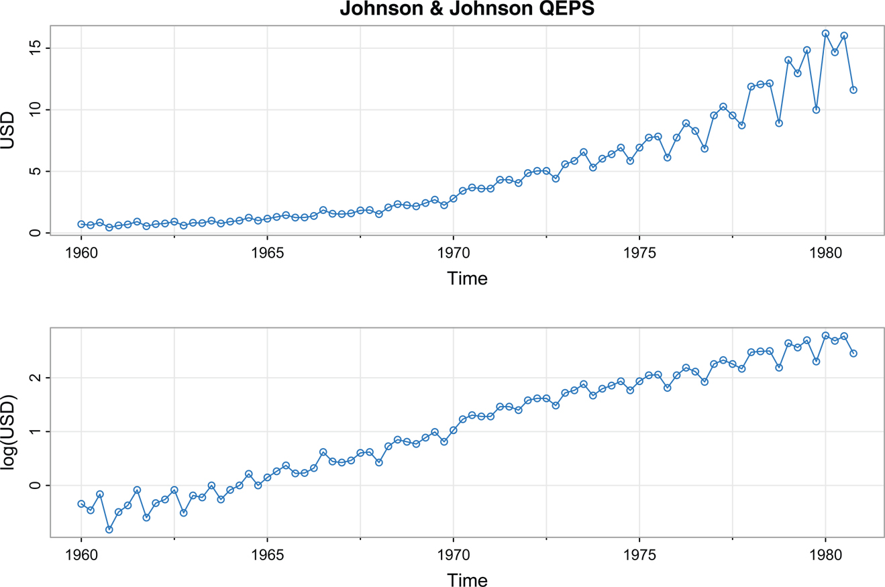

그림 1.1: Johnson & Johnson 분기별 주당 순이익, 1960-I 부터 1980-IV 까지 (위). 로그 변환된 동일한 데이터 (아래). [본문으로 돌아가기.⏎](chapter1)

데이터가 매 분기마다 작은 비율 변화, 예를 들어 _rt_ (음수일 수도 있음)로 생성된다고 생각하면 다음과 같이 쓸 수 있습니다.

xt\=(1+rt)xt−1,

여기서 *xt*는 분기 *t*의 수익입니다. 데이터에 로그를 취하면 다음과 같습니다.

log(xt)\=log(1+rt)+log(xt−1),

3\. 이는 선형 성장률을 암시합니다. 즉, 이번 분기의 로그 값은 지난 분기 값에 적은 양 log(1+rt)을 더한 것과 같습니다. 데이터의 이러한 특성은 [그림 1.1](#chapter1#fig1_1)의 아래쪽 플롯에 표시되어 있습니다. 이 예제의 데이터를 플롯하는 코드는 다음과 같습니다.

`library(astsa)   _# astsa should be loaded before each session_`
`tsplot(cbind(jj, log(jj)), ylab=c("USD", "log(USD)"), type="o", col=4,`
`   main="Johnson & Johnson QEPS")`

예제 1.2 다우존스 산업평균지수 (Dow Jones Industrial Average) [본문으로 돌아가기.⏎](#chapter3#b3exam1_2)

금융 시계열 데이터의 또 다른 예로, [그림 1.2](#chapter1#fig1_2)는 2006년부터 2016년까지 다우존스 산업평균지수(DJIA)의 거래일 종가 및 수익률(또는 백분율 변화)을 보여줍니다. *xt*가 일 *t*의 DJIA 종가 값이라면 수익률은 다음과 같습니다.

rt\=(xt−xt−1)/xt−1.

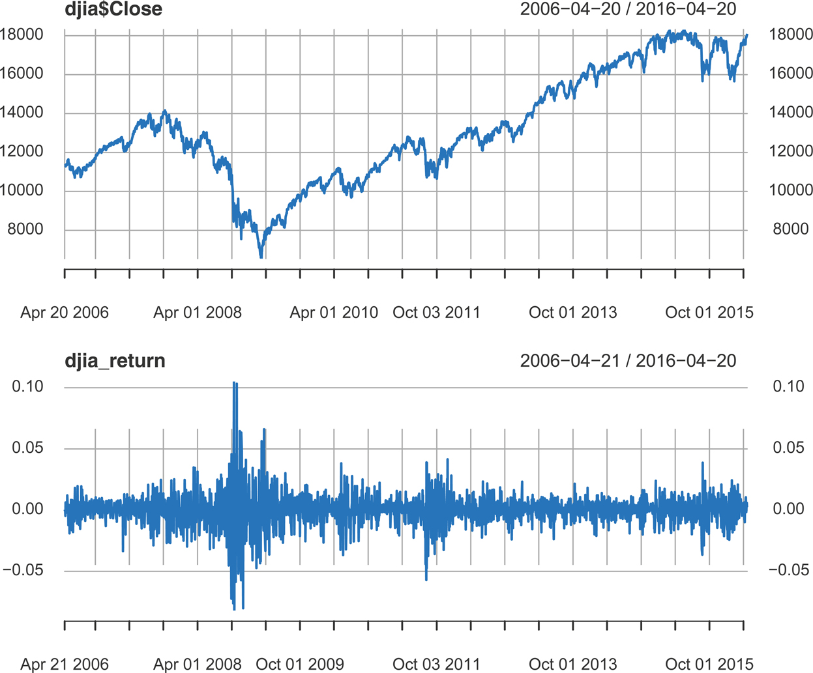

그림 1.2: 2006년 4월 20일부터 2016년 4월 20일까지 다우존스 산업평균지수(DJIA) 거래일 종가(위) 및 수익률(아래). [본문으로 돌아가기.⏎](chapter1)

이것은 1+rt\=xt/xt−1 이고

log(1+rt)\=log(xt/xt−1)\=log(xt)−log(xt−1),

4\. 임을 의미하며, 이는 [예제 1.1](#chapter1#exam1_1)과 동일합니다. 전개(expansion)를 참고하면 ([부록 A.10](#appA#secA_10) 참조)

log(1+r)\=r−r22+r33−⋯,−1<r≤1,

*r*이 0에 가까우면 고차항을 무시할 수 있음을 알 수 있습니다. 결과적으로 금융 데이터의 경우 *rt*는 일반적으로 작은 백분율이므로 다음과 같습니다.

log(1+rt)≈rt.

[그림 1.2](#chapter1#fig1_2)에서 2008년의 금융 위기를 주목하십시오. 표시된 데이터는 수익률 데이터의 전형적인 형태입니다. 시계열의 평균은 대략 0의 평균 수익률로 안정적으로 보이지만, 데이터의 _변동성(volatility)_ (또는 변이성)은 군집화를 보입니다. 즉, 변동성이 큰 기간이 함께 모이는 경향이 있습니다. 이러한 유형의 금융 데이터 분석에서 한 가지 문제는 미래 수익률의 변동성을 예측하는 것입니다. 이러한 문제를 처리하기 위해 다양한 모델이 개발되었으며, 일부 모델에 대해서는 [8장](#chapter8)에서 논의합니다. 데이터 세트는 xts 데이터 파일이며, 이는 거래일과 같이 불규칙한 시간 간격으로 취해진 관측치를 처리하는 데 사용될 수 있습니다.

`library(xts)   _# install if necessary_`
`djia_return = diff(log(djia$Close))`
`par(mfrow=2:1)`
`plot(djia$Close, col=4)`
`plot(djia_return, col=4)`

xts를 로드하지 않고도 astsa를 사용하여 유사한 그래픽을 생성할 수 있습니다. 예를 들면 다음과 같습니다.

`Close = ts(djia[,"Close"])               _# make a time series object_`
`x = cbind(Close, Return=diff(log(Close))) _# now columns are aligned_`
`tsplot(timex(Djia), x, col=4, lwd=2, main="DJIA")`

[그림 1.3](#chapter1#fig1_3)에서 *rt*와 log(1+rt)의 비교를 볼 수 있습니다. 이 그림은 로그 변환된 데이터의 차분을 계산하여 얻은 버전과 비교한 미국 GDP의 계절 조정 분기별 성장률 *rt*를 보여줍니다.5\.

`tsplot(diff(log(gdp)), type="o", col=4, ylab="GDP Growth") _# diff-log_`
`points(diff(gdp)/lag(gdp,-1), pch=3, col=6)           _# actual return_`

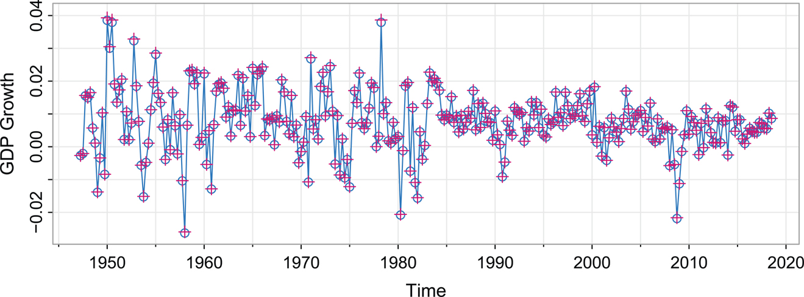

그림 1.3: 미국 GDP 성장률, 실제 값 (+) 및 로그 차분에 의한 값 (–∘–). [본문으로 돌아가기.⏎](chapter1)

많은 시계열이 이와 같이 동작하므로, 데이터를 로그 변환한 후 연속적인 차분을 취하는 것은 시계열 분석에서 표준적인 데이터 변환 방법입니다.

예제 1.3 지구 온난화와 기후 변화 [본문으로 돌아가기.⏎](#chapter2#b2exam1_3)

[그림 1.4](#chapter1#fig1_4)에 두 가지 전 지구 온도 기록이 표시되어 있습니다. 이 데이터는 지구 육지 면적에 걸쳐 평균을 내고 항상 얼음이 없는 바다(열린 바다)의 표면에 걸쳐 평균을 낸 연간 온도 이상치(anomalies)입니다. 기간은 1850년부터 2023년까지이며, 값은 1991~2020년 평균에서의 편차(∘C)이고, [Hansen et al. (2006)](#bibref1#refbib_23)에서 업데이트되었습니다. 20세기 후반 동안 두 시계열의 상승 추세는 기후 변화에 대한 논거로 사용되어 왔습니다. 대부분의 기후 과학자는 지구 온난화 추세의 주요 원인이 인간에 의한 온실 효과의 확대라는 데 동의합니다. 추세가 선형적이지 않으며, 평탄해지는 기간과 그 후 급격한 상승 추세가 있음에 유의하십시오. 어느 한 시계열 (_xt_)을 시간 (_t_)에 대해 단순 선형 회귀(xt\=α+βt+ϵt)로 직선을 피팅하는 것은 추세에 대한 정확한 설명을 산출하지 못할 것이 분명합니다. 그래픽 코드는 다음과 같습니다.

`tsplot(cbind(gtemp_land, gtemp_ocean), spaghetti=TRUE, lwd=2, pch=20, type="o",`
`   col=astsa.col(c(4,2),.5), ylab="Temperature Deviations (\u00B0C)",`
`   main="Global Warming", addLegend=TRUE, location="topleft", legend=c("Land`
`   Surface", "Sea Surface"))`

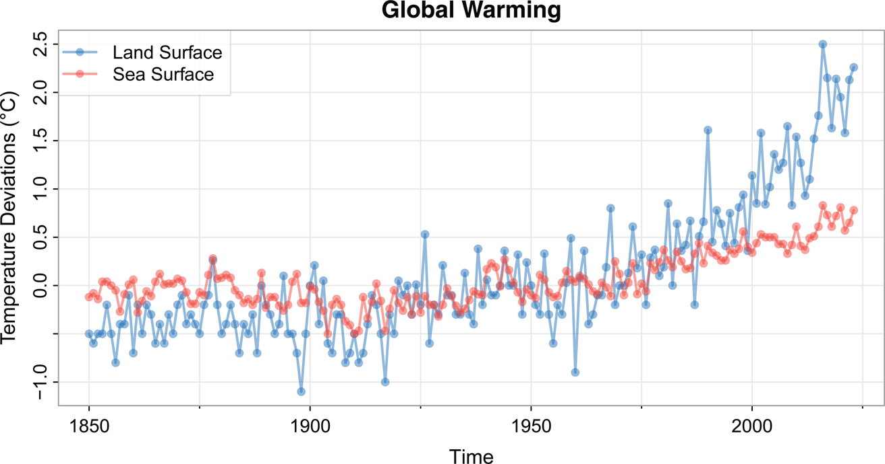

그림 1.4: 연평균 전 지구 육지 표면 및 해수면 온도 편차(1850–2023), 단위는 ∘C. [본문으로 돌아가기.⏎](chapter1)

예제 1.4 6\. 엘니뇨 – 남방 진동 (El Niño – Southern Oscillation, ENSO) [본문으로 돌아가기.⏎](#chapter2#b2exam1_4)

남방 진동 지수(Southern Oscillation Index, SOI)는 중앙 태평양의 해수면 온도와 관련된 기압 변화를 측정합니다. 중앙 태평양은 ENSO 효과로 인해 2년에서 7년마다 따뜻해지며, 이는 다양한 전 지구적 기상이변의 원인으로 지목되고 있습니다. 엘니뇨 동안 동태평양과 서태평양의 기압이 역전되어 무역풍이 약해지고 적도를 따라 따뜻한 물이 동쪽으로 이동하게 됩니다. 그 결과 중태평양과 동태평양의 지표수가 따뜻해져 기상 패턴에 광범위한 결과를 초래합니다.

[그림 1.5](#chapter1#fig1_5)는 남방 진동 지수(SOI)와 관련 보충량(Recruitment, 어획 가능한 자원으로 집단에 진입하는 어린 물고기 수의 지수)의 월별 값을 보여줍니다. 두 시계열 모두 1950년부터 1987년까지의 기간에 걸친 453개월의 데이터입니다. 둘 다 뚜렷한 연간 주기(여름에는 덥고 겨울에는 추움)를 보이며, 보기 어렵지만 대략 4년의 느린 주기적 요소도 나타납니다. 주기(cycles)의 종류와 그 강도에 대한 연구는 [6장](#chapter6)과 [7장](#chapter7)의 주제입니다. 어류 개체수 크기가 바다 온도의 영향을 받기 때문에 두 시계열은 관련이 있습니다.

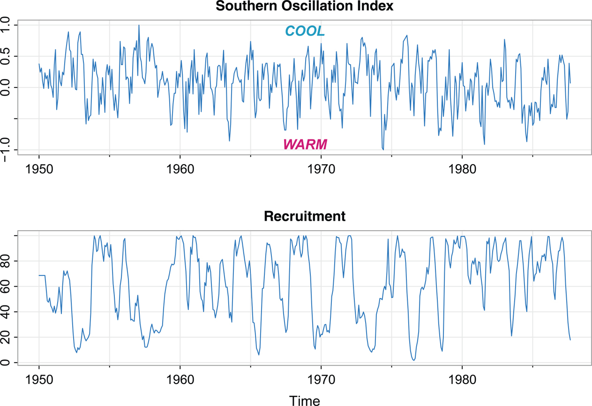

그림 1.5: 월별 남방 진동 지수(SOI) 및 보충량(추정된 새로운 물고기 수), 1950–1987. [본문으로 돌아가기.⏎](chapter1)

다음 코드는 [그림 1.5](#chapter1#fig1_5)를 재현합니다.

`par(mfrow = 2:1)`
`tsplot(soi, ylab=NA, main="Southern Oscillation Index", col=4)`
` text(1969, .91, "COOL", col=5, font=4)`
` text(1969,-.91, "WARM", col=6, font=4)`
`tsplot(rec, ylab=NA, main="Recruitment", col=4)`

예제 1.5 7\. 포식자-피식자 상호작용 (Predator–Prey Interactions) [본문으로 돌아가기.⏎](#chapter3#b3exam1_5)

포식자가 피식자의 수에 영향을 미치는 것은 분명하지만, 피식자도 포식자의 수에 영향을 미칩니다. 왜냐하면 피식자가 부족해지면 포식자가 굶어 죽거나 번식하지 못할 수 있기 때문입니다. 이러한 관계는 간단한 비선형 미분 방정식 쌍인 로트카-볼테라(Lotka–Volterra) 방정식으로 자주 모델링됩니다. ([Edelstein-Keshet, 2005, ch.6](#bibref1#refbib_14) 및 [예제 3.8](#chapter3#exam3_8) 참조).

포식자-피식자 상호작용에 대한 고전적인 연구 중 하나는 캐나다의 허드슨만 회사(Hudson's Bay Company)가 구매한 눈신토끼(snowshoe hare)와 스라소니(lynx) 가죽에 대한 기록입니다. 이것은 포식 활동에 대한 간접적인 측정치이지만, 수집된 가죽 수와 야생에 있는 토끼 및 스라소니 수 사이에 직접적인 관계가 있다고 가정합니다. 이러한 포식자-피식자 상호작용은 [그림 1.6](#chapter1#fig1_6)에서 볼 수 있듯이 포식자와 피식자 수의 순환적인 패턴으로 이어지는 경우가 많습니다. 스라소니와 토끼의 개체군 크기는 천천히 증가하고 빠르게 감소하는(↗↓) 비대칭적인 특징을 갖는다는 점에 유의하십시오.

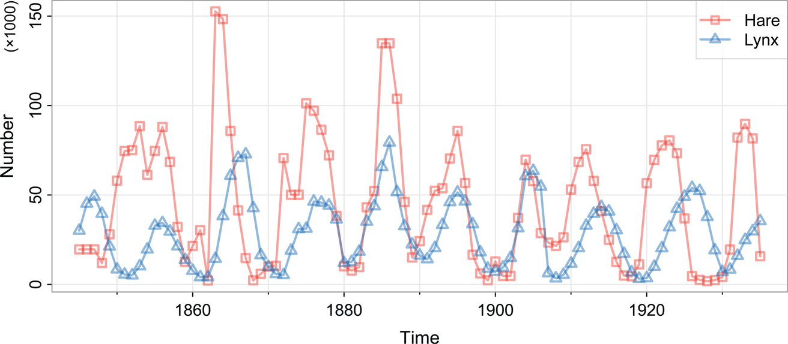

그림 1.6: 캐나다의 허드슨만 회사가 구매한 눈신토끼와 스라소니 가죽 간의 포식자-피식자 상호작용 시계열. 수집된 가죽 수와 야생의 토끼 및 스라소니 수 사이에 직접적인 관계가 있다고 가정합니다. [본문으로 돌아가기.⏎](chapter1)

스라소니의 먹이는 작은 설치류에서 사슴까지 다양하지만, 눈신토끼가 압도적으로 선호되는 먹이입니다. 사실 스라소니는 눈신토끼와 밀접하게 연관되어 있어 다른 식량원이 풍부하더라도 그 개체수는 토끼의 개체수와 함께 증가하고 감소합니다. 이 경우 스라소니 개체군 크기를 눈신토끼 개체군의 측면에서 모델링하는 것이 합리적으로 보입니다. 이 아이디어는 [예제 3.8](#chapter3#exam3_8)에서 더 자세히 탐구합니다. [그림 1.6](#chapter1#fig1_6)은 다음과 같이 재현할 수 있습니다.

`tsplot(cbind(Hare, Lynx), col=astsa.col(c(2,4),.5), lwd=2, type="o",`
`   pch=c(0,2), ylab="Number", spaghetti=TRUE, addLegend=TRUE)`
`mtext("(\u00D71000)", side=2, adj=1, line=1.5, cex=.8)`

예제 1.6 8\. 기능적 MRI 실험 (Functional MRI Experiment) [본문으로 돌아가기.⏎](chapter1)

종종 시계열은 다양한 실험 조건이나 처리 구성에서 관측됩니다. 이러한 계열 세트가 [그림 1.7](#chapter1#fig1_7)에 표시되어 있으며, 데이터는 기능적 자기공명영상(fMRI)을 통해 뇌의 여러 위치에서 수집되었습니다.

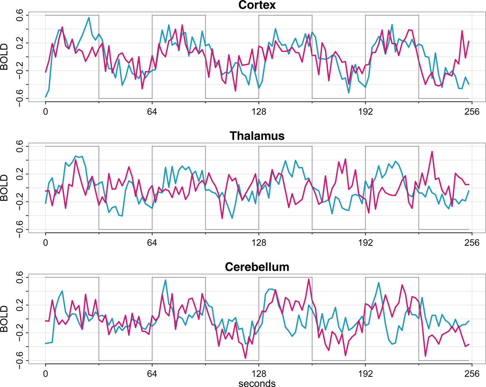

그림 1.7: 피질, 시상 및 소뇌의 두 위치에서 얻은 fMRI 데이터; n\=128 포인트, 2초마다 하나의 관측치를 취함. 계단 선은 자극의 유무를 나타냅니다. [본문으로 돌아가기.⏎](chapter1)

fMRI에서 피험자는 MRI 스캐너에 들어가고, 일정 기간 동안 자극이 가해진 후 중단됩니다. 이러한 자극의 켜짐-꺼짐 적용이 반복되고 뇌에서 활성화 영역을 측정하는 혈액 산소화 수준 의존적(bold) 신호 강도를 측정하여 기록됩니다. 이 bold 대조(contrast)는 옥시헤모글로빈과 디옥시헤모글로빈의 국소 혈액 농도 변화에서 기인합니다.

[그림 1.7](#chapter1#fig1_7)에 표시된 데이터는 조직 손상을 일으키지 않으면서 외과적 절개를 시뮬레이션하는 데 사용되는 초최대(supramaximal) 충격 자극을 가한 마취된 자원자의 결과를 비교하여 일반 마취가 통증 인지에 미치는 영향을 조사하기 위해 fMRI를 사용한 실험에서 가져온 것입니다. 이 예에서 자극은 32초 동안 적용되고 9\. 32초 동안 중단되어 신호 주기는 64초입니다. 샘플링 속도는 256초 동안(n\=128) 2초마다 1회의 관측이었습니다.

주기성은 운동 피질(motor cortex) 계열에서 강하게 나타나지만 시상(thalamus)과 아마도 소뇌(cerebellum)에서는 나타나지 않는 것 같습니다. 이 경우 시상과 소뇌 영역이 자극에 실제로 반응하고 있는지 통계적으로 결정하는 것이 중요합니다. 그래픽에는 다음 명령을 사용하십시오.

`par(mfrow=c(3,1), cex=.8)`
`x        = ts(fmri1[,4:9], start=0, freq=32)`
`names    = c("Cortex","Thalamus","Cerebellum")`
`stimulus = ts(rep(c(rep(.6,16), rep(-.6,16)), 4), start=0, freq=32)`
`for (i in 1:3){`
` j = 2*i-1`
` tsplot(x[,j:(j+1)], ylab="BOLD", xlab=NA, main=names[i], col=5:6, lwd=2,`
`   ylim=c(-.6,.6), xaxt="n", spaghetti=TRUE)`
` axis(seq(0, 256, 64), side=1, at=0:4)`
` lines(stimulus, type="s", col=gray(.4)) }`
`mtext("seconds", side=1, line=1.75)`

## 1.3 시계열 모델 (Time Series Models)

시계열 분석의 주요 목표는 앞서 살펴본 것과 같은 표본 데이터에 대해 그럴듯한 설명을 제공하는 수학적 모델을 개발하는 것입니다. [예제 1.1](#chapter1#exam1_1)부터 [예제 1.6](#chapter1#exam1_6)에 표시된 여러 계열을 구별하는 근본적인 시각적 특징은 이들의 매끄러운 정도(smoothness)가 서로 다르다는 것입니다. 이러한 매끄러움에 대한 한 가지 설명은 인접한 시점들이 서로 상관되어 있고(correlated), 계열의 값이 어떤 식으로든 그 과거에 의존한다는 것입니다. 이 아이디어는 우리가 현실적으로 보이는 시계열을 생성하는 방법에 대해 생각할 수 있는 근본적인 방식을 표현합니다.

예제 1.7 백색 잡음 (White Noise) [본문으로 돌아가기.⏎](chapter1)

단순한 종류의 생성된 시계열은 평균이 0이고 분산이 σw2으로 유한한 상관되지 않은(uncorrelated) 확률 변수 *wt*의 집합일 수 있습니다. 상관되지 않은 변수들로부터 생성된 시계열은 공학적 응용에서 백색 잡음(white noise)이라고 불리는 잡음에 대한 모델로 사용되며, 때로는 이 과정을 wt∼wn(0,σw2)로 표기합니다. '백색'이라는 명칭은 가시광선 스펙트럼의 모든 색상이 동일한 강도로 결합된 백색광과의 비유에서 비롯되었습니다 (자세한 내용은 [6장](#chapter6)에서 확인할 수 있습니다). 우리가 사용하는 백색 잡음의 특별한 형태는 변수들이 독립이고 동일하게 분포된(independent and identically distributed, iid) 정규 분포를 따를 때이며, 이는 wt∼ iid N(0,σw2)로 씁니다.

[그림 1.8](#chapter1#fig1_8)의 위쪽 패널은 추출된 순서대로 플롯된 250개의 독립 표준 정규 확률 변수(σw2\=1) 집합을 보여줍니다. 10\. 결과적인 시계열은 [그림 1.2](#chapter1#fig1_2)에 있는 DJIA 수익률의 일부분과 유사성을 나타냅니다.

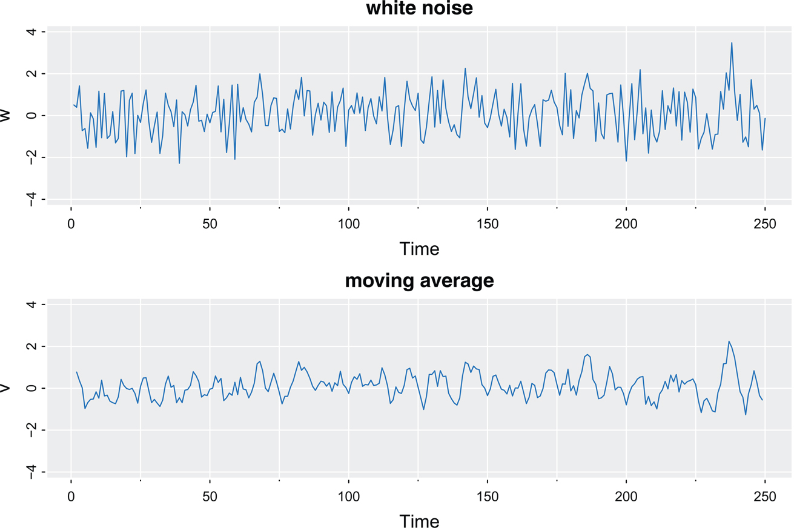

그림 1.8: 가우스 백색 잡음 계열(위) 및 가우스 백색 잡음 계열의 3점 이동 평균(아래). [본문으로 돌아가기.⏎](chapter1)

모든 시계열의 확률적 거동이 백색 잡음 모델 측면에서 설명될 수 있다면 전통적인 통계적 방법으로 충분할 것입니다. 시계열 모델에 계열 상관관계(serial correlation)와 더 많은 매끄러움을 도입하는 두 가지 방법이 [예제 1.8](#chapter1#exam1_8)과 [예제 1.9](#chapter1#exam1_9)에 나와 있습니다.

예제 1.8 이동 평균, 평활화 및 필터링 (Moving Averages, Smoothing and Filtering) [본문으로 돌아가기.⏎](chapter1)

[예제 1.7](#chapter1#exam1_7)의 *wt*를 다음과 같이 주어진 3점 이동 평균으로 대체하는 것을 고려해 보십시오.

vt\=13(wt−1+wt+wt+1).

결과 시계열은 [그림 1.8](#chapter1#fig1_8)의 아래쪽 패널에 표시되어 있습니다. 이 시계열은 평균화로 인해 백색 잡음 시계열보다 훨씬 더 매끄럽고 분산이 더 작습니다. 또한 평균화 과정이 잡음의 고주파(빠른 진동) 동작의 일부를 제거한다는 것도 명백할 것입니다. [그림 1.7](#chapter1#fig1_7)에 있는 비순환적(noncyclic) fMRI 계열의 일부와 유사성을 알아차리기 시작합니다.

시계열 값의 선형 결합은 일반적으로 필터링된 계열이라고 하며, 따라서 명령어 `filter`가 사용됩니다.[1](#chapter1#fn1_1) [그림 1.8](#chapter1#fig1_8)을 재현하려면:11\.

`set.seed(123456789)`
`w = rnorm(250)                    _# 250 N(0,1) variates_`
`v = filter(w, filter=rep(1/3,3)) _# moving average_`
`tsplot(cbind(w, v), col=4, ylim=c(-4, 4), las=1, gg=TRUE, title=c("white`
`   noise","moving average"))`

\_\_\_\_\_\_\_\_\_\_\_\_\_\_\_\_\_ 1패키지 dplyr이 로드된 경우 *선택된 연습 문제의 힌트*에 있는 경고를 참조하십시오. [본문으로 돌아가기.⏎](#chapter1#fn1_11b)

[그림 1.5](#chapter1#fig1_5)의 SOI 및 보충량 시계열과 [그림 1.7](#chapter1#fig1_7)의 일부 fMRI 시계열은 진동 동작이 지배적이기 때문에 이동 평균 계열과 다릅니다. 이러한 준주기적 동작이 있는 시계열을 생성하는 여러 가지 방법이 존재하며, 우리는 자기회귀(autoregressive) 모델을 기반으로 하는 널리 사용되는 방법을 설명합니다.

예제 1.9 자기회귀 (Autoregressions) [본문으로 돌아가기.⏎](chapter1)

[예제 1.7](#chapter1#exam1_7)의 백색 잡음 시계열 *wt*를 입력으로 간주하고, t\=1,2,…,250 에 대해 순차적으로 다음 2차 방정식을 사용하여 출력을 계산한다고 가정해 보겠습니다.

xt\=1.5xt−1−.75xt−2+wt(1.1)

결과 출력 시계열은 [그림 1.9](#chapter1#fig1_9)에 표시되어 있습니다. 식 (1.1)은 시계열의 현재 값 *xt*를 시계열의 과거 두 값의 함수로 회귀 또는 예측하는 것을 나타내며, 따라서 *자기회귀(autoregression)*라는 용어가 사용됩니다. (1.1)은 초기 조건 *x_0과 x−1에도 의존하기 때문에 여기서 시작 값에 문제가 있지만, 일단 이들을 0으로 설정합니다. 그런 다음 (1.1)에 대입하여 *재귀적으로(recursively)\_ 데이터를 생성할 수 있습니다. 즉, w1,w2,…,w250이 주어지면 x−1\=x0\=0으로 설정한 다음 t\=1에서 시작할 수 있습니다.

x1\=1.5x0−.75x−1+w1\= w1
x2\=1.5x1−.75x0+w2\= 1.5w1+w2
x3\=1.5x2−.75x1+w3
x4\=1.5x3−.75x2+w4

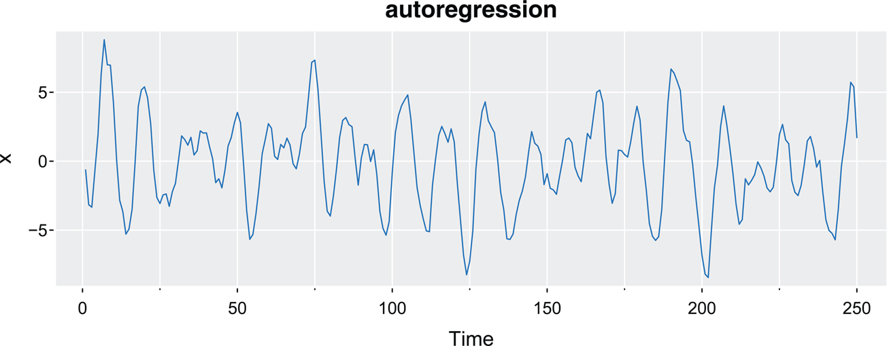

그림 1.9: 모델 (1.1)에서 생성된 자기회귀 계열. [본문으로 돌아가기.⏎](chapter1)

기타 등등입니다. 계열의 대략적인 주기적 동작에 주목해 보십시오. 이는 12\. [그림 1.5](#chapter1#fig1_5)의 SOI 및 보충량과 [그림 1.7](#chapter1#fig1_7)의 일부 fMRI 계열이 보여주는 것과 유사합니다. 이 특정 모델은 데이터가 약 12개 포인트마다 1주기의 유사 순환 거동(pseudo-cyclic behavior)을 갖도록 선택되었으며, 따라서 250개의 관측치에는 약 20개의 주기가 포함되어야 합니다. 이 자기회귀 모델과 그 일반화 형태는 관측된 많은 시계열의 근본적인 모델로 사용될 수 있으며 [4장](#chapter4)에서 자세히 연구될 것입니다.

R에서 모델 (1.1)의 데이터를 시뮬레이션하고 플롯하는 한 가지 방법은 다음 명령을 사용하는 것입니다. 초기 조건은 0으로 설정되어 있으므로 적어도 \_x_1과 \_x_2는 (1.1)을 만족하지 않습니다. 자세한 내용은 [문제 4.2](#chapter4#question4_2)에서 확인할 수 있습니다. 결과적으로 시작 문제를 방지하기 위해 필터가 50개의 값을 추가로 실행하도록 합니다.

`set.seed(90210)`
`w = rnorm(250 + 50) _# 50 extra to avoid startup problems_`
`x = filter(w, filter=c(1.5,-.75), method="recursive")[-(1:50)]`
`tsplot(x, main="autoregression", col=4, gg=TRUE)`

예제 1.10 표류(Drift)가 있는 무작위 보행 (Random Walk with Drift) [본문으로 돌아가기.⏎](chapter1)

[그림 1.4](#chapter1#fig1_4)의 지구 온도 데이터에서 볼 수 있는 추세를 분석하기 위한 모델은 다음과 같이 주어진 표류가 있는 무작위 보행 모델(random walk with drift model)입니다.

xt\=δ+xt−1+wt(1.2)

여기서 t\=1,2,… 이고, 초기 조건 x0\=0 이며,[2](#chapter1#fn1_2) *wt*는 백색 잡음입니다. 상수 *δ*를 표류(drift)라고 하며, δ\=0 일 때 시간 *t*에서의 시계열 값이 시간 t−1 에서의 계열 값에 *wt*에 의해 결정되는 완전히 무작위적인 움직임을 더한 것이기 때문에 모델을 단순히 무작위 보행(random walk)이라고 부릅니다. (1.2)를 백색 잡음 변량의 누적 합으로 다시 쓸 수 있다는 점에 유의하십시오. 즉,

xt\=δ t+∑j\=1twj(1.3)

여기서 t\=1,2,… 입니다. 귀납법을 사용하거나 (1.3)을 (1.2)에 대입하여 이 문장이 맞는지 확인해 보십시오. [그림 1.10](#chapter1#fig1_10)은 δ\=0과 .3으로 그리고 표준 정규 잡음과 함께 모델에서 생성된 200개의 관측치를 보여줍니다. 비교를 위해 직선 δt를 그래프 위에 겹쳐서 그렸습니다. [그림 1.10](#chapter1#fig1_10)을 재현하려면 다음 코드를 사용하십시오 (세미콜론을 사용하여 한 줄에 여러 명령을 사용한 것에 주목하십시오).

`set.seed(314159265)`
`w = rnorm(200); x = cumsum(w)     _# RW_`
`wd = w +.3;      xd = cumsum(wd) _# RW with drift_`
`tsplot(cbind(x, xd), main="random walk", col=2*1:2, gg=TRUE, spaghetti=TRUE)`
`clip(0,200, 0,80); abline(a=0, b=.3, h=0, lty=2, col=2*2:1)   _# drifts_`

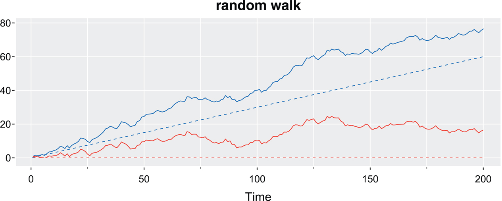

그림 1.10: 무작위 보행, σw\=1, 표류 δ\=.3 (위쪽 들쭉날쭉한 선), 표류 없음, δ\=0 (아래쪽 들쭉날쭉한 선), 그리고 표류를 보여주는 점선. [본문으로 돌아가기.⏎](chapter1)

\_\_\_\_\_\_\_\_\_\_\_\_\_\_\_\_\_ 2x0\=0 으로 설정한 것은 편의를 위한 것입니다. 임의의 상수나 확률 변수가 될 수 있습니다. [본문으로 돌아가기.⏎](#chapter1#fn1_21b)

예제 1.11 13\. 신호 더하기 잡음 (Signal Plus Noise) [본문으로 돌아가기.⏎](#chapter2#b2exam1_11)

시계열을 생성하기 위한 많은 현실적인 모델은 일정한 주기적 변동이 잡음으로 오염된 근본적인 신호(signal)를 가정합니다. 예를 들어, [그림 1.7](#chapter1#fig1_7)의 맨 위에 표시된 규칙적인 주기 fMRI 계열을 쉽게 감지할 수 있습니다. 다음 모델을 고려해 보십시오.

xt\=2cos(2πt+1550)+wt(1.4)

여기서 t\=1,2,…,500 이며, 첫 번째 항은 신호로 간주되고 [그림 1.11](#chapter1#fig1_11)의 위쪽 패널에 표시되어 있습니다. 정현파 파형(sinusoidal waveform)은 다음과 같이 쓸 수 있습니다.

Acos(2πωt+ϕ),(1.5)

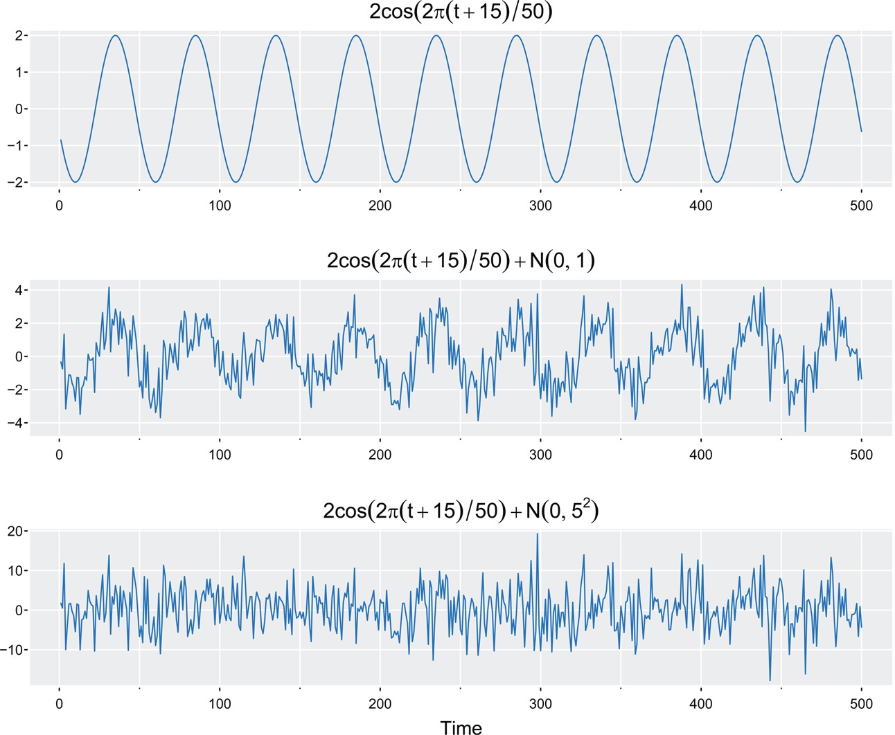

그림 1.11: 50포인트 주기의 코사인 파(위쪽 패널)와 가산 백색 가우스 잡음이 오염된 코사인 파의 비교, σw\=1(가운데 패널) 및 σw\=5(아래쪽 패널). [본문으로 돌아가기.⏎](chapter1)

여기서 *A*는 진폭, *ω*는 진동 주파수, *ϕ*는 위상 이동(phase shift)입니다. (1.4)에서 A\=2, ω\=1/50 (50시간 포인트마다 1주기), ϕ\=.6π 입니다.

가산 잡음(additive noise) 항은 정규 분포에서 추출된 σw\=1 (가운데 패널) 및 σw\=5 (아래쪽 패널)인 백색 잡음으로 취했습니다. 둘을 더하면 [그림 1.11](#chapter1#fig1_11)의 아래쪽 패널에 표시된 것처럼 신호가 모호해집니다. 신호가 모호해지는 정도는 _σw_ 크기에 대한 신호 진폭의 비율에 따라 달라집니다. 신호 진폭과 *σw*의 비율(또는 이 비율의 함수)을 때때로 *신호 대 잡음비(signal-to-noise ratio, SNR)*라고 합니다. SNR이 클수록 신호를 감지하기가 더 쉽습니다. 가운데 패널에서는 신호를 쉽게 식별할 수 있는 반면, 아래쪽 패널에서는 신호가 거의 소멸되었음에 주목하십시오. 일반적으로 우리는 신호를 관찰하는 것이 아니라 잡음에 의해 모호해진 신호를 관찰하게 됩니다.

[그림 1.11](#chapter1#fig1_11)을 재현하려면 다음 명령을 사용하십시오.

`cs   = 2*cos(2*pi*(1:500 + 15)/50)       _# signal_`
`w    = rnorm(500)                        _# noise_`
`cos0 = bquote(2*cos(2*pi*(t+15)/50))     _# titles_`
`cos1 = bquote(.(cos0) + N(0,1))`
`cos5 = bquote(.(cos0) + N(0,5^2))`
`tsplot(cbind(cs, cs+w, cs+5*w), col=4,   ylab=NA, xlab=c(NA,NA,"Time"), las=1,`
`   gg=TRUE, title=c(cos0, cos1, cos5))`

## 1.4 14\. 난수 생성 (Random Number Generation)\*

우리는 이 책에서 수치 시뮬레이션을 자주 수행합니다. 예를 들어, 데이터를 생성하는 예제에서 `set.seed` 및 `rnorm`과 같은 명령을 이미 사용했습니다. 편의성과 재현성을 위해 시뮬레이션에서는 진정한 난수가 아니라 *의사 난수(pseudo-random numbers)*가 사용됩니다. 난수 생성기(RNG)에 의해 생성된 값은 결정론적이지만 무작위인 것처럼 보입니다 (통계적 무작위성 테스트를 통과합니다).

우리의 초점은 확률 과정에 있지만, 난수 생성을 매우 자주 사용하므로 논의할 가치가 있습니다. 대부분의 통계 소프트웨어 패키지는 여기서 제시하는 것보다 더 복잡하고 정교한 여러 가지 다양한 난수 생성기를 포함하고 있습니다.

15\. 대부분의 경우 결정론적 생성기 *G*는 재귀적이며, *k*개의 이전 숫자 xn−1,…,xn−k 가 주어지면 다음 숫자 *xn*은 다음과 같이 생성됩니다.

xn\=G(xn−1,…,xn−k),

여기서 n\=1,2,… 이며, 이는 주어진 _시드(seed)_ (x0,…,x1−k)에서 시작됩니다. 빠르고 간단한(quick-and-dirty) 생성기 중 하나는 S\={0,1,…,m−1} 집합의 값을 생성하는 선형 합동 생성기(linear congruential generator, LCG)이며, 여기서 *m*은 큰 정수입니다. 초기값(시드) \_x_0이 주어지면 다음에 따라 숫자 {xn}을 재귀적으로 생성합니다.

xn\=axn−1+c(modm),

여기서 n\=1,2,…,N 이고, *N*은 원하는 값의 개수입니다. 이러한 숫자의 선택은 신중하게 이루어져야 하며, 다양한 값이 제안되었습니다. [Press et al. (2007)](#bibref1#refbib_37)에서는 a\=1664525, c\=1013904223, m\=232의 값이 다른 32비트 LCG만큼 훌륭하다고 언급되어 있습니다.

_동일한 시드로 생성된 시퀀스는 동일합니다._ 상태 공간이 유한하기 때문에 *xn*은 결국 이전 값으로 돌아가야 합니다. 어떤 상태에 대해 시퀀스가 *p*번의 반복 후에 해당 상태로 돌아가도록 하는 작은 정수 *p*를 생성기의 주기(period)라고 합니다. 주기가 짧은 것보다 긴 것이 좋지만, 긴 주기 그 자체만으로는 좋은 RNG를 보장하지 못합니다 (a\=c\=1인 LCG는 매우 긴 주기를 가지지만 끔찍한 RNG입니다). 위에서 논의한 LCG의 주기는 단지 230 (10억보다 약간 큼)에 불과합니다. 다음은 매우 나쁜 (p\=1) 32비트 LCG의 또 다른 예입니다.

`x = c(1) _# the bad seed (they are all bad)_`
`for (n in 2:30){ x[n] = (12*x[n-1] + 4) %% 2^32 }`
`x`
`  [1]          1         16        196       2356     28276     339316`
`  [7]    4071796   48861556 586338676 2741096820 2828390772 3875918196`
` [13] 3561345396 4081439092 1732628852 3611677044 390451572 390451572`
` [19] 390451572 390451572 390451572 390451572 390451572 390451572`
` [25] 390451572 390451572 390451572 390451572 390451572 390451572`

오늘날 수행되는 시뮬레이션에서 LCG의 주기는 충분히 무작위로 보이기에는 너무 짧을 수 있습니다. 대부분의 최신 분석 소프트웨어 시스템은 더 정교한 생성기를 사용합니다. 예를 들어 R의 기본 RNG는 주기가 219937−1 (메르센 소수)로 매우 긴 _Mersenne Twister_ 알고리즘입니다.

지정된 분포에서 생성된 대부분의 표본은 표준 균등 분포(standard uniforms)에서 시뮬레이션되며, 이 경우 우리는 다음을 사용할 수 있습니다.

un\=xn/m.

우리 중 다수는 연속 누적분포함수(cdf) *F*를 갖는 연속 확률 변수 *X*가 있을 때 U\=F(X)가 표준 균등 분포를 따른다는 확률 적분 변환(probability integral transform)을 통해 균등 분포를 사용하여 다른 확률 변수를 생성하는 방법을 소개받았습니다. 그러면 _U_ 값이 주어졌을 때 X\=F−1(U)를 얻을 수 있습니다. 그러나 확률 적분 변환은 16\. 일반적으로 매우 효율적인 난수 생성 방법은 아닙니다. 예를 들어 표준 정규 분포를 생성하는 더 나은 방법은 \_U_1과 \_U_2가 독립적인 표준 균등 분포 U(0,1)일 때 다음 사실을 사용하는 것입니다.

X1\=−2log(U1)cos(2πU2)andX2\=−2log(U1)sin(2πU2)

이 둘은 독립적인 표준 정규 분포 N(0,1)입니다. 이 기술을 Box-Muller 변환이라고 합니다. 컴퓨터 생성 값이 0에 아주 가깝게만 갈 수 있어 \_X_1과 \_X_2의 크기를 제한하기 때문에 일부 문제가 있습니다. 그러나 이 기술은 수정될 수 있습니다. 비균일 분포에서의 샘플링 및 RNG 주제에 대한 자세한 내용은 [Gentle (2003)](#bibref1#refbib_19) 또는 [Press et al. (2007, 7장)](#bibref1#refbib_37)에서 찾을 수 있습니다.

## 연습 문제 (Problems)

- 1.1.
  1.  [예제 1.9](#chapter1#exam1_9)에 설명된 방법을 사용하여 자기회귀  
      xt\=−.9xt−2+wt  
      에서 σw\=1 인 n\=100 개의 관측치를 생성하십시오. 다음으로 생성한 데이터 *xt*에 이동 평균 필터  
      vt\=(xt+xt−1+xt−2+xt−3)/4  
      를 적용하십시오. 이제 *xt*를 실선으로 그리고 그 위에 *vt*를 점선으로 겹쳐서 그리십시오.
  2.  (a)를 반복하되 이번에는  
      xt\=2cos(2πt/4)+wt,  
      이고 여기서 wt∼ iid N(0,1)입니다.
  3.  (a)를 반복하되, 이번에는 *xt*가 [예제 1.1](#chapter1#exam1_1)에서 논의된 Johnson & Johnson 데이터의 로그입니다.
  4.  계절 조정(seasonal adjustment)이란 무엇입니까 (인터넷 검색을 할 수 있습니다)?
  5.  결론을 명시하십시오 (즉, 이 연습을 통해 배운 내용).
- 1.2. **astsa**에는 지진과 광산 폭발에서 얻은 여러 지진 기록이 있습니다. 모든 데이터는 데이터프레임 **eqexp**에 있지만, 구체적으로 두 개의 기록이 **EQ5**와 **EXP6** (각각 다섯 번째 지진과 여섯 번째 폭발)에 있습니다. 이 데이터는 지진 기록 관측소에서 표면을 따라 도착하는 두 단계 또는 도착파를 나타내며 17\. P (t\=1,…,1024) 및 S (t\=1025,…,2048)로 표시됩니다. 기록 장비는 스칸디나비아에 있으며 러시아의 핵 실험장을 감시합니다. 여기서 관심 있는 일반적인 문제는 포괄적 핵실험 금지 조약을 유지하기 위해 이러한 파형을 구별하는 것입니다.  
  지진과 폭발 신호를 비교하려면 다음을 수행하십시오.
  1.  두 행과 하나의 열이 있는 다중 그래픽 플롯(multifigure plot)에 두 시계열을 별도로 그리십시오.
  2.  다른 색상이나 다른 선 유형을 사용하여 동일한 그래프에 두 시계열을 그리십시오.
  3.  지진과 폭발 시계열은 어떤 면에서 다릅니까?
- 1.3. 이 문제에서는 무작위 보행(random walk)과 이동 평균 모델의 차이점을 살펴봅니다.
  1.  표류 없이(δ\=0) σw\=1 이고 길이가 n\=500 인 무작위 보행([예제 1.10](#chapter1#exam1_10) 참조) 계열 *9개*를 생성하고 플롯하십시오.
  2.  [예제 1.8](#chapter1#exam1_8)에 정의된 형식 *vt*의 이동 평균인 길이 n\=500 의 계열 *9개*를 생성하고 플롯하십시오.
  3.  (a) 부분과 (b) 부분의 결과 차이에 대해 논평하십시오.
- 1.4. **GDP**의 데이터는 1947년 1분기부터 2023년 1분기까지 계절 조정된 분기별 미국 GDP입니다. **GDP**는 **gdp**의 업데이트된 버전이라는 점에 유의하십시오. 해당 기간에는 코로나19 전염병 기간이 포함됩니다. 전염병 발생 전의 성장률은 [그림 1.3](#chapter1#fig1_3)에 표시되어 있습니다.
  1.  데이터를 플롯하고 [1.3절](#chapter1#sec1_3)에서 논의된 모델 중 하나와 비교하십시오.
  2.  **GDP** 시계열을 사용하여 [그림 1.3](#chapter1#fig1_3)을 재현하십시오. 그런 다음 값이 매우 커지기 시작할 때 두 가지 성장률 계산 방법 간의 차이점에 대해 논평하십시오.
  3.  [1.3절](#chapter1#sec1_3)에서 논의된 모델 중 어느 것이 미국 GDP의 _성장률_ 동작을 잘 설명합니까? 18은 비어 있습니다.

---
