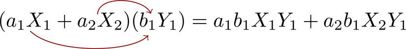
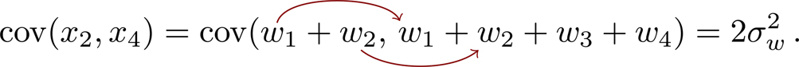
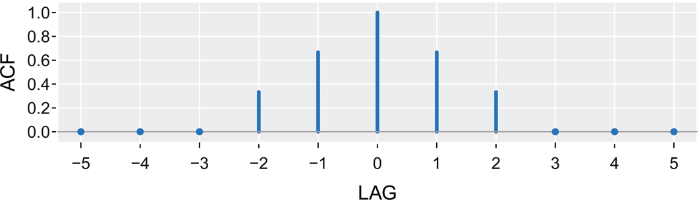
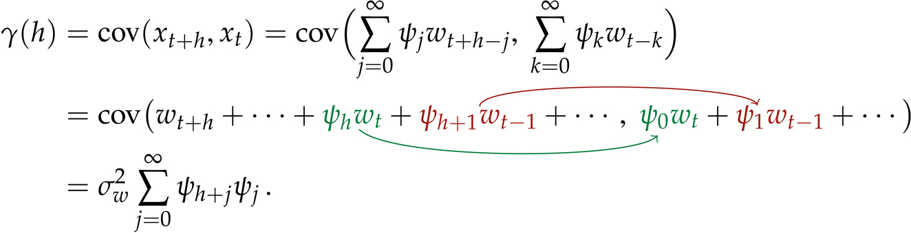
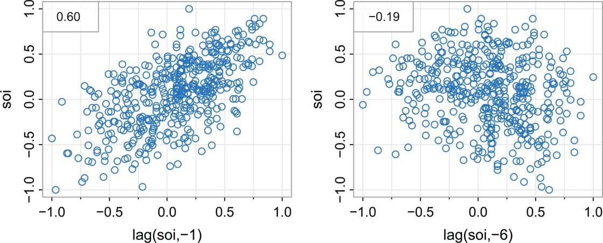
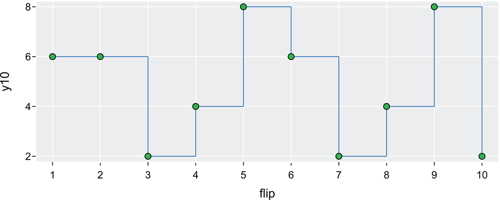
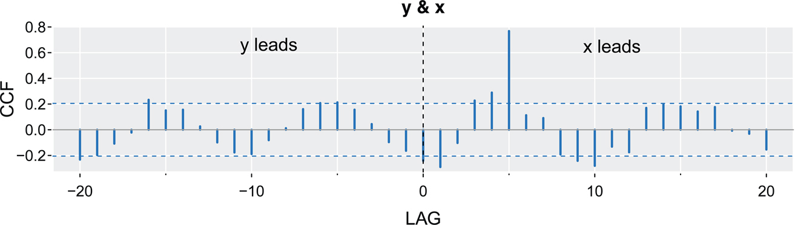
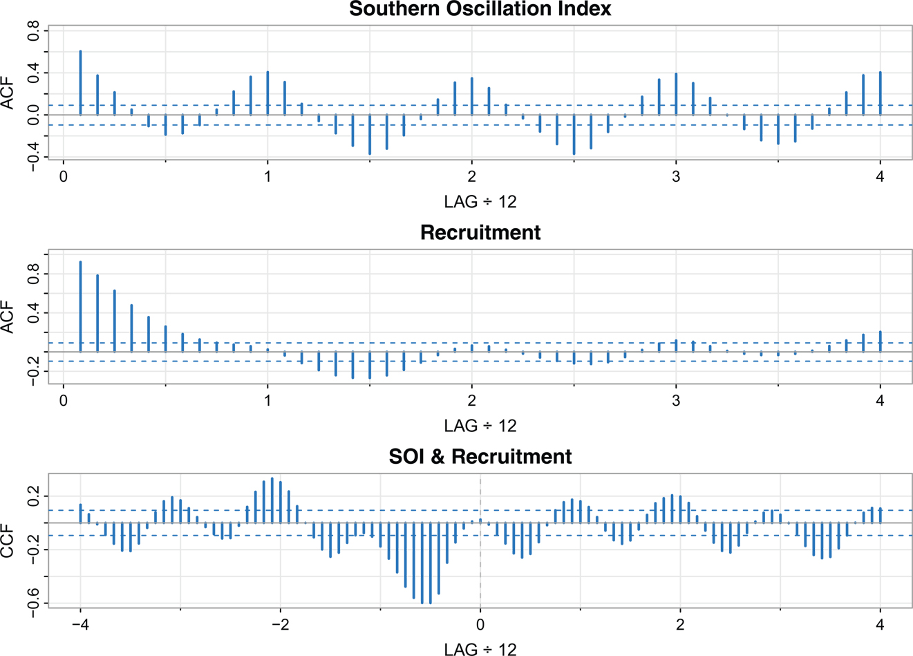
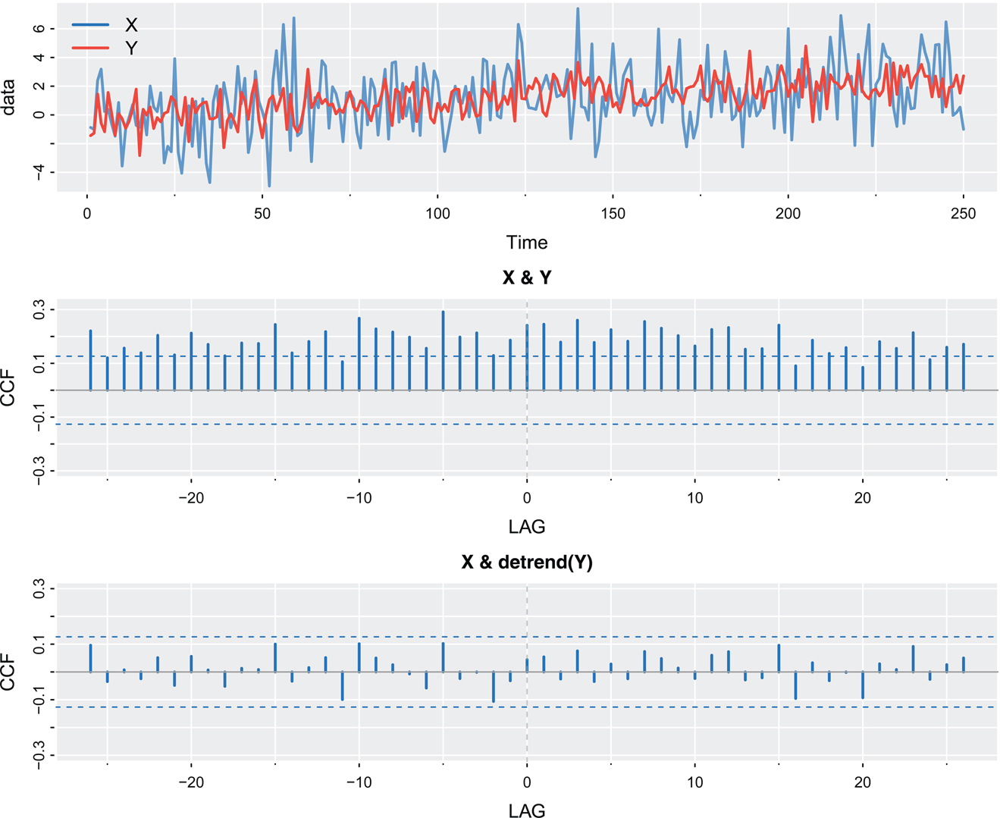

19\. 

# 2Correlation and Stationary Time Series

In this chapter, we first discuss various measures that describe the general behavior of a process as it evolves over time. Afterward, we present a useful concept of regularity called _stationarity_. The refresher material on probability and statistics in [Appendix A](#appA#appA) may be of help with some of the contents of this chapter.

## 2.1 Measuring Dependence

A simple but useful descriptive measure is the mean function, such as the average monthly high temperature of the Gobi Desert. In this case, the mean is a function of month.

Definition 2.1. _The **mean function** is defined as_

μxt\=E(xt)(2.1)

_provided it exists, where E denotes the usual expected value operator. When no confusion exists about which time series we are referring to, we will drop a subscript and write_ μxt _as μt._

Example 2.2 Mean Function of a Moving Average Series [Return to text.⏎](chapter2)

If _wt_ denotes a white noise series, then μwt\=E(wt)\=0 for all _t_. The top series in [Figure 1.8](#chapter1#fig1_8) reflects this, as the series clearly fluctuates around a mean value of zero. Smoothing the series as in [Example 1.8](#chapter1#exam1_8) does not change the mean because we can write

μvt\=E(vt)\=13\[E(wt−1)+E(wt)+E(wt+1)\]\=0.

Example 2.3 Mean Function of a Random Walk with Drift [Return to text.⏎](chapter2)

Consider the random walk with drift model given in (1.3),

xt\=δ t+∑j\=1twj,t\=1,2,….

20\. Because E(wt)\=0 and _δ_ is a constant, we have

μxt\=E(xt)\=δ t+∑j\=1tE(wj)\=δ t,

which is a straight line with slope _δ_. A realization of a random walk with drift can be compared to its mean function in [Figure 1.10](#chapter1#fig1_10).

Example 2.4 Mean Function of Signal Plus Noise

A great many practical applications depend on assuming the observed data have been generated by a fixed signal waveform superimposed on a zero-mean noise process, leading to an additive signal model of the form (1.4). Because the signal in (1.4) is a fixed function of time, we will have

μxt\=E\[2cos(2πt+1550)+wt\]\=2cos(2πt+1550)+E(wt)\=2cos(2πt+1550),

and the mean function is just the cosine wave.

The mean function describes only the marginal behavior of a time series. The lack of independence between two values _xs_ and _xt_ can be assessed numerically, as in classical statistics, using the notions of covariance and correlation. Assuming the variance of _xt_ is finite, we have the following definition.

Definition 2.5. _The **autocovariance function** is defined as_

γx(s,t)\=cov(xs,xt)\=E\[(xs−μs)(xt−μt)\],(2.2)

_for all s and t. When no possible confusion exists about which time series we are referring to, we will drop the subscript and write_ γx(s,t) _as_ γ(s,t).

Note that γ(s,t)\=γ(t,s) for all time points _s_ and _t_. The autocovariance measures the _linear_ dependence between two points on the same series observed at different times. Recall from classical statistics that if γ(s,t)\=0, then _xs_ and _xt_ are not linearly related, but there still may be some dependence structure between them. If, however, _xs_ and _xt_ are bivariate normal, γ(s,t)\=0 ensures their independence. When s\=t, the autocovariance reduces to the (assumed finite) _variance_, because

γ(t,t)\=E\[(xt−μt)2\]\=var(xt).

Example 2.6 21\. Autocovariance of White Noise [Return to text.⏎](chapter2)

The white noise series _wt_ has E(wt)\=0 and

γw(s,t)\=cov(ws,wt)\={σw2s\=t,0s≠t.

A realization of white noise is shown in the top panel of [Figure 1.8](#chapter1#fig1_8).

We often have to calculate the autocovariance between filtered series. A useful result is given in the following property.

Property 2.7. [Return to text.⏎](chapter2) _If the random variables_

U\=∑j\=1majXjandV\=∑k\=1rbkYk

_are linear filters of finite variance random variables_ {Xj} _and_ {Yk}, _respectively, then_

cov(U,V)\=∑j\=1m∑k\=1rajbkcov(Xj,Yk).(2.3)

_Furthermore_, var(U)\=cov(U,U).

An easy way to remember (2.3) is to treat it like multiplication:

 

Example 2.8 Autocovariance of a Moving Average [Return to text.⏎](chapter2)

Consider applying a three-point moving average to the white noise series _wt_ of the previous example as in [Example 1.8](#chapter1#exam1_8). In this case,

γv(s,t)\=cov(vs,vt)\=cov{13(ws−1+ws+ws+1),13(wt−1+wt+wt+1)}.

When s\=t there are nine terms, but cov(ws,wt)\=0 if s≠t. Thus,

γv(t,t)\=19cov{(wt−1+wt+wt+1),(wt−1+wt+wt+1)}\=19\[cov(wt−1,wt−1)+cov(wt,wt)+cov(wt+1,wt+1)\]\=39σw2.

When s\=t+1 there are nine terms, but only two terms survive,

γv(t+1,t)\=19cov{(wt+wt+1+wt+2),(wt−1+wt+wt+1)}\=19\[cov(wt,wt)+cov(wt+1,wt+1)\]\=29σw2.

22\. Similar computations give γv(t−1,t)\=2σw2/9, γv(t+2,t)\=γv(t−2,t)\=σw2/9, and 0 when |t−s|\>2. We summarize the values for all _s_ and _t_ as

γv(s,t)\={39σw2s\=t,\[1pt\]29σw2|s−t|\=1,\[1pt\]19σw2|s−t|\=2,\[1pt\]0|s−t|\>2.

Example 2.9 Autocovariance of a Random Walk [Return to text.⏎](chapter2)

For the random walk model, xt\=∑j\=1twj, we have

γx(s,t)\=cov(xs,xt)\=cov(∑j\=1swj,∑k\=1twk)\=min{s,t} σw2,

because, of the s×t terms, only the smaller of _s_ and _t_ terms are non-zero. For example, with s\=2 and t\=4,

 

Note that, as opposed to the previous examples, the autocovariance function of a random walk depends on the particular time values _s_ and _t_, and not on the time separation or lag. Also, notice that the variance of the random walk, var(xt)\=γx(t,t)\=t σw2, increases without bound as time _t_ increases. The effect of this variance increase can be seen in [Figure 1.10](#chapter1#fig1_10) where the processes start to move away from their mean functions δ t (note that δ\=0 and. 3 in that example).

As in classical statistics, it is more convenient to deal with a measure of association between −1 and 1, and this leads to the following definition.

Definition 2.10. _The **autocorrelation function (ACF)** is defined as_

ρ(s,t)\=γ(s,t)γ(s,s)γ(t,t).(2.4)

The ACF measures the linear predictability of the series _xt_ using only the value _xs_. And because it is a correlation, we must have −1≤ρ(s,t)≤1. If we can predict _xt perfectly_ from _xs_ through a linear relationship, xt\=β0+β1xs, then the correlation will be +1 when β1\>0, and −1 when β1<0. Hence, we have a rough measure of the ability to forecast the series at time _t_ from the value at time _s_.

23\. Often, we would like to measure the predictability of another series _yt_ from the series _xs_. Assuming both series have finite variances, we have the following definition.

Definition 2.11. _The **cross-covariance function** between two series, xt and yt, is_

γxy(s,t)\=cov(xs,yt)\=E\[(xs−μxs)(yt−μyt)\].

We can use the cross-covariance function to develop a correlation:

Definition 2.12. _The **cross-correlation function (CCF)** is given by_

ρxy(s,t)\=γxy(s,t)γx(s,s)γy(t,t).

## 2.2 Stationarity

So far, we have not made any special assumptions about the behavior of a time series. Many of the examples we have seen, however, hinted that a sort of regularity may exist over time in the behavior of a time series. Stationarity requires regularity in the mean and autocorrelation functions so that these quantities (at least) may be estimated by averaging.

Definition 2.13. [Return to text.⏎](chapter2) _A **s**tationary time series is a finite variance process where_

1. _the mean function, μt, defined in_ (2.1) _is constant and does not depend on time t, and_
2. _the autocovariance function,_ γ(s,t), _defined in_ (2.2) _depends on times s and t only through their time difference._

As an example, for a stationary hourly time series, the correlation between what happens at 1am and 3am is the same as between what happens at 9pm and 11pm because they are both two hours apart.

Example 2.14 A Random Walk Is Not Stationary [Return to text.⏎](chapter2)

A random walk is not stationary because its autocovariance function, γ(s,t)\=min{s,t}σw2, depends on time; see [Example 2.9](#chapter2#exam2_9) and [Problem 2.5](#chapter2#question2_5). Also, the random walk with drift violates both conditions of [Definition 2.13](#chapter2#defi2_13) because the mean function, μxt\=δt, also depends on time _t_ as shown in [Example 2.3](#chapter2#exam2_3).

24\. Because the mean function, E(xt)\=μt, of a stationary time series is independent of time _t_, we will write

μt\=μ.(2.5)

Also, because the autocovariance function, γ(s,t), of a stationary time series, _xt_, depends on _s_ and _t_ only through time difference, we may simplify the notation. Let s\=t+h, where _h_ represents the time shift or _lag_. Then

γ(t+h,t)\=cov(xt+h,xt)\=cov(xh,x0)\=γ(h,0)

because the time difference between t+h and _t_ is the same as the time difference between _h_ and 0\. Because the autocovariance function of a stationary time series depends only on the lag _h_, we will drop the second argument of γ(h,0).

Definition 2.15. _The **autocovariance function of a stationary time series** will be written as_

γ(h)\=cov(xt+h,xt)\=E\[(xt+h−μ)(xt−μ)\].

Definition 2.16. _The **autocorrelation function (ACF) of a stationary time series** will be written using (2.4) as_

ρ(h)\=γ(h)γ(0).(2.6)

Because it is a correlation, we have −1≤ρ(h)≤1 for all _h_, enabling one to assess the relative importance of a given autocorrelation value by comparing with the extreme values −1 and 1.

Example 2.17 Stationarity of White Noise

The mean and autocovariance functions of the white noise series as discussed in [Example 1.7](#chapter1#exam1_7) and [Example 2.6](#chapter2#exam2_6) are, by definition, μwt\=0 and

γw(h)\=cov(wt+h,wt)\={σw2h\=0,0h≠0.

Thus, white noise satisfies [Definition 2.13](#chapter2#defi2_13) and is stationary.

Example 2.18 Stationarity of a Moving Average

The three-point moving average process of [Example 1.8](#chapter1#exam1_8) is stationary because, from [Example 2.2](#chapter2#exam2_2) and [Example 2.8](#chapter2#exam2_8), the mean and autocovariance 25\. functions μvt\=0, and

γv(h)\={39σw2h\=0,29σw2h\=±1,19σw2h\=±2,0|h|\>2

are independent of time _t_, satisfying the conditions of [Definition 2.13](#chapter2#defi2_13). Thus, the ACF, ρ(h)\=γ(h)/γ(0), is given by

ρv(h)\={1h\=0,2/3h\=±1,1/3h\=±2,0|h|\>2.

[Figure 2.1](#chapter2#fig2_1) shows a plot of the autocorrelation as a function of lag _h_. Note that the autocorrelation function is symmetric about lag zero.

`ACF = c(0,0,0,1,2,3,2,1,0,0,0)/3`
`LAG = -5:5`
`**tsplot**(LAG, ACF, type="h", col=4, lwd=3, xlab="LAG", las=1, **gg**=TRUE)`
`abline(h=0, col=8)`
`points(LAG[-(4:8)], ACF[-(4:8)], pch=20, col=4)`
`axis(1, at=seq(-5, 5, by=2), col=gray(1))`

Figure 2.1: Autocorrelation function of a three-point moving average. [Return to text.⏎](chapter2)

Example 2.19 Trend Stationarity [Return to text.⏎](chapter2)

A time series can have stationary behavior around a trend. For example, suppose

xt\=βt+yt,

where _yt_ is stationary with mean and autocovariance functions _μy_ and γy(h), respectively. Then the mean function of _xt_ is

μx,t\=E(xt)\=βt+μy,

which is not independent of time. Therefore, the process is not stationary. The 26\. autocovariance function, however, is independent of time, because

γx(h)\=cov(xt+h,xt)\=E\[(xt+h−μx,t+h)(xt−μx,t)\]\=E\[(yt+h−μy)(yt−μy)\]\=γy(h).

This behavior is sometimes called _trend stationarity_. Examples of such processes might be the commodity series displayed in [Figure 3.1](#chapter3#fig3_1).

The autocovariance function of a stationary process has several important properties. First, the value at h\=0 is the variance of the series,

γ(0)\=E\[(xt−μ)2\]\=var(xt).

Another property is that the autocovariance function of a stationary series is symmetric around the origin,

γ(h)\=γ(−h)

for all _h_. This property follows because

γ(h)\=γ((t+h)−t)\=E\[(xt+h−μ)(xt−μ)\]\=E\[(xt−μ)(xt+h−μ)\]\=γ(t−(t+h))\=γ(−h),

which shows how to use the notation (_first subscript minus second subscript_) as well as proving the result.

Example 2.20 Autoregressive Models [Return to text.⏎](#chapter4#b4exam2_20)

The stationarity of autoregressive (AR) models is a little more complex and is dealt with in [Chapter 4](#chapter4). We'll use an AR(1) to examine some aspects of the model,

xt\=ϕxt−1+wt.

Since the mean must be constant, if _xt_ is stationary the mean function μt\=E(xt)\=μ is constant so

E(xt)\=ϕE(xt−1)+E(wt)

implies μ\=ϕμ+0 or μ\=0 (we know from [Example 2.14](#chapter2#exam2_14) that ϕ≠1). In addition, assuming xt−1 and _wt_ are uncorrelated,

var(xt)\=var(ϕxt−1+wt)\=var(ϕxt−1)+var(wt)+2cov(ϕxt−1,wt)\=ϕ2var(xt−1)+var(wt).

If _xt_ is stationary, the variance, var(xt)\=γx(0), is constant, so

γx(0)\=ϕ2γx(0)+σw2.

27\. Thus

γx(0)\=σw2 1(1−ϕ2).

Note that for the process to have a positive finite variance, we should require |ϕ|<1. Similarly,

γx(1)\=cov(xt,xt−1)\=cov(ϕxt−1+wt,xt−1)\=cov(ϕxt−1,xt−1)\=ϕγx(0).

Thus,

ρx(1)\=γx(1)γx(0)\=ϕ,

and we see that _ϕ_ is in fact a correlation, ϕ\=corr(xt,xt−1).

It should be evident that we have to be careful when working with AR models. It should also be evident that, as in [Example 1.9](#chapter1#exam1_9), simply setting the initial conditions equal to zero does not meet the stationary criteria because _x_0 is not a constant, but a random variable with mean _μ_ and variance σw2/(1−ϕ2).

In [Section 1.3](#chapter1#sec1_3), we discussed the notion that it is possible to generate realistic time series models by filtering white noise. In fact, there is a result by [Wold (1954)](#bibref1#refbib_54) that states that any stationary time series that has no deterministic component[1](#chapter2#fn2_1) can be written as a filter of white noise.

Property 2.21. (Wold Decomposition). [Return to text.⏎](chapter2) _Any stationary time series, xt, can be written as linear combination (filter) of white noise terms, that is,_

xt\=μ+∑j\=0∞ψjwt−j,

_where the ψs are numbers satisfying_ ∑j\=0∞ψj2<∞ _and_ ψ0\=1. _Such processes are called **linear processes**._

\_\_\_\_\_\_\_\_\_\_\_\_\_\_\_\_\_ 1A deterministic series is one where the future is perfectly predictable from the past, e.g., model (1.5). [Return to text.⏎](#chapter2#fn2_12b)

**Remark**. [Property 2.21](#chapter2#prop2_21) is important in the following ways:

* As previously suggested, stationary time series can be thought of as filtered white noise. It may not always be the best model, but models of this form are viable in many situations.
* Any stationary time series can be represented as a model that does not depend on the future. That is, _xt_ in [Property 2.21](#chapter2#prop2_21) depends only on the present _wt_ and the past wt−1,wt−2,....
* 28\. Because the coefficients satisfy ψj2→0 as j→∞, the dependence on the very remote past is negligible. Many of the models we will encounter satisfy the much stronger condition, ∑j\=0∞|ψj|<∞ (think of ∑n\=1∞1/n2<∞ but ∑n\=1∞1/n\=∞).

The models we will encounter in [Chapter 4](#chapter4) are linear processes. For the linear process, we may show that the mean function is E(xt)\=μ, and the autocovariance function is given by

γ(h)\=σw2∑j\=0∞ψj+hψj(2.7)

for h≥0 (ψ0\=1); recall that γ(−h)\=γ(h). To verify (2.7), note that

 

The moving average model is already in the form of a linear process. The autoregressive model such as the one in [Example 1.9](#chapter1#exam1_9) can also be put in this form as we suggested in that example.

When several series are available, a notion of stationarity still applies with additional conditions.

Definition 2.22. _Two time series, xt and yt, are **jointly stationary** if they are each stationary, and the cross-covariance function_

γxy(h)\=cov(xt+h,yt)\=E\[(xt+h−μx)(yt−μy)\](#undefined)

_is a function only of lag h._

Definition 2.23. _The **cross-correlation function (CCF)** of jointly stationary time series xt and yt is defined as_

ρxy(h)\=γxy(h)γx(0)γy(0).(2.9)

As usual, we have the result −1≤ρxy(h)≤1 which enables comparison with the extreme values −1 and 1 when looking at the relation between xt+h and _yt_. The cross-correlation function is _not_ generally symmetric about zero because when h\>0, _yt_ happens before xt+h whereas when h<0, _yt_ happens after xt+h.

Example 2.24 29\. Joint Stationarity

Consider the two series, xt and yt, formed from the sum and difference of two successive values of a white noise process,

xt\=wt+wt−1andyt\=wt−wt−1,

where _wt_ is white noise with variance σw2. The variances of _xt_ and _yt_ are

γx(0)\=γy(0)\=2σw2

because the _wt_s are uncorrelated. In addition,

γx(1)\=cov(xt+1, xt)\=cov(wt+1+wt, wt+wt−1)\=σw2,γy(1)\=cov(yt+1, yt)\=cov(wt+1−wt, wt−wt−1)\=−σw2,

noting γx(−1)\=γx(1) and γy(−1)\=γy(1). Also,

γxy(0)\=cov(xt,yt)\=cov(wt+1+wt,wt+1−wt)\=σw2−σw2\=0,γxy(1)\=cov(xt+1,yt)\=cov(wt+1+wt,wt−wt−1)\=σw2,γxy(−1)\=cov(xt−1,yt)\=cov(wt−1+wt−2,wt−wt−1)\=−σw2.

Since cov(xt+h,yt)\=0 for |h|\>2, using (2.9) we have,

ρxy(h)\={ 0h\=0, 12h\=1,−12h\=−1, 0|h|≥2.

Because the autocovariance and cross-covariance functions depend only on the lag separation, _h_, the series are jointly stationary. Note that two series do not have to be correlated at the same time (as in this example), but they may be dependent at various lags.

Example 2.25 Prediction via Cross-Correlation [Return to text.⏎](chapter2)

Consider the problem of determining leading or lagging relations between two stationary series _xt_ and _yt_. If for some unknown integer ℓ, the model

yt\=Axt−ℓ+wt

holds, the series _xt_ is said to **lead** _yt_ for ℓ\>0 and is said to **lag** _yt_ for ℓ<0. In some problems, an estimate of ℓ is of primary concern. For example, in _seismic reflection_, acoustic waves (_xt_) are used in estimating the location of a medium such as an oil deposit, which may be deduced by the delay, ℓ, in the reflected noisy signal _yt_.

30\. Assuming that the noise _wt_ is uncorrelated with the _xt_ series, the cross-covariance function can be computed as

γyx(h)\=cov(yt+h,xt)\=cov(Axt+h−ℓ+wt+h, xt)\=cov(Axt+h−ℓ, xt)\=Aγx(h−ℓ).

By the Cauchy-Schwarz inequality (A.3), the largest value of |γx(h−ℓ)| is γx(0), when h\=ℓ. The cross-covariance function will look like the autocovariance of the input series _xt_, and it will have an extremum on the positive side if _xt_ leads _yt_ and an extremum on the negative side if _xt_ lags _yt_. We continue this problem in the next section, [Example 2.32](#chapter2#exam2_32).

## 2.3 Estimation of Correlation

For data analysis, only the sample values, x1,x2,…,xn, are available for estimating the mean, autocovariance, and autocorrelation functions. _In this case, the assumption of stationarity becomes critical and allows the use of averaging to estimate the population mean and covariance functions._

Accordingly, if a time series is stationary, the mean function (2.5) μt\=μ is constant so we can estimate it by the sample mean,

x¯\=1n∑t\=1nxt.

The estimate is unbiased, E(x¯)\=μ, and its standard error is the square root of var(x¯), which can be computed using first principles ([Property 2.7](#chapter2#prop2_7)),

var(x¯)\=1n2cov(∑t\=1nxt,∑s\=1nxs)\=1n2∑t\=1n∑s\=1nγx(t−s)\=1n2(nγx(0)+(n−1)γx(1)+(n−2)γx(2)+⋯+γx(n−1) +(n−1)γx(−1)+(n−2)γx(−2)+⋯+γx(1−n))\=1n∑|h|<n(1−|h|n)γx(h),(2.10)

noting there are _n_ terms where t\=s, and (n−1) terms where t\=s+1, and (n−2) terms where t\=s+2, and so on.

If the process is white noise, (2.3) reduces to the familiar σx2/n recalling that γx(0)\=σx2 and γ(h)\=0 for h≠0. Note that in the case of dependence, the standard error of x¯ may be smaller or larger than the white noise case depending on the nature of the correlation structure (see [Problem 2.10](#chapter2#question2_10)).

31\. The theoretical autocorrelation function, (2.6), is estimated by the sample ACF as follows.

Definition 2.26. _The **sample autocorrelation function (ACF)** is defined as_

ρ^(h)\=γ^(h)γ^(0)\=∑t\=1n−h(xt+h−x¯)(xt−x¯)∑t\=1n(xt−x¯)2(2.11)

_for_ h\=0,1,…,n−1.

The sum in the numerator of (2.11) runs over a restricted range because xt+h is not available for t+h\>n. Note that we are in fact estimating the autocovariance function by

γ^(h)\=n−1∑t\=1n−h(xt+h−x¯)(xt−x¯),(2.12)

with γ^(−h)\=γ^(h) for h\=0,1,…,n−1. That is, we divide by _n_ even though there are only n−h pairs of observations at lag _h_,

{(xt+h, xt); t\=1,…,n−h}.

This assures that the sample autocovariance function will behave as a true autocovariance function, for example, it will not give negative values when estimating var(x¯) by replacing γx(h) with γ^x(h) in (2.10).

Example 2.27 Sample ACF and Scatterplots [Return to text.⏎](chapter2)

Estimating autocorrelation is similar to estimating of correlation in the classical case, but we use (2.11) instead. [Figure 2.2](#chapter2#fig2_2) shows an example using the SOI series where ρ^(1)\=.60 and ρ^(6)\=−.19. The following code was used for [Figure 2.2](#chapter2#fig2_2).

`( r = round(**acf1**(**soi**, 6, plot=FALSE), 2) )   _# sample acf_`
`  [1] 0.60 0.37 0.21 0.05 -0.11 -0.19`
`par(mfrow=c(1,2))`
`**tsplot**(lag(**soi**,-1), **soi**, col=4, type="p", xlab="lag(**soi**,-1)")`
` legend("topleft", legend=sprintf("%0.2f",r[1]), adj=.4, cex=.8, box.col=8)`
`**tsplot**(lag(**soi**,-6), soi, col=4, type="p", xlab="lag(**soi**,-6)")`
` legend("topleft", legend=r[6], adj=.25, cex=.8, box.col=8)`

Figure 2.2: Display for [Example 2.27](#chapter2#exam2_27). For the SOI series, we have a scatterplot of pairs of values one month apart (left) and six months apart (right). The estimated autocorrelation is displayed in the box. [Return to text.⏎](chapter2)

32\. **Remark**. It is important to note that this approach to estimating correlation _makes sense only if the data are stationary_. If the data were not stationary, each point in the graph could be an observation from a different correlation structure.

The sample autocorrelation function has a sampling distribution that allows us to assess whether the data comes from a completely random or white series or whether correlations are statistically significant at some lags.

Property 2.28 (ACF – Large-Sample Distribution). [Return to text.⏎](chapter2) _If xt is white noise, for n large and under mild conditions, the sample ACF values are approximately independent normals,_

ρ^x(h)∼⋅N(− 1n,1n)forh\=1,2,…,H,

_where H is fixed but arbitrary._

Here is a simulation showing that for n\=100 white noise observations having a Gamma distribution with a shape of 4 and a scale of 1 (the default), the bias in the sample ACF is about −1/100\=−.01 with a standard deviation of about 1/100\=.1. In the code, we calculate the sample ACF with H\=20 and repeat the process 1000 times.

`set.seed(101010)`
`ACF = replicate(1000, **acf1**(rgamma(100, shape=4), plot=FALSE)) _# H = 20 here_`
`round(c(mean(ACF), sd(ACF)), 3)`
`  [1]   -0.010   0.094`
`**QQnorm**(ACF) _# to check normality (not shown)_`

Based on [Property 2.28](#chapter2#prop2_28), we obtain a rough method for assessing whether a series is white noise by determining how many values of ρ^(h) are outside the interval −1/n±2/n (two standard errors); for white noise, approximately 95% of the sample ACFs should be within these limits.[2](#chapter2#fn2_2) The bounds do not hold in general and can be ignored if the interest is other than assessing whiteness. The applications of this property develop because many statistical modeling procedures depend on the residuals of the model fit to data should be white noise.

\_\_\_\_\_\_\_\_\_\_\_\_\_\_\_\_\_ 2In this text, z.025\=1.95996398454… of normal fame, often rounded to 1.96, is rounded to 2\. [Return to text.⏎](#chapter2#fn2_22b)

Example 2.29 A Simulated Time Series [Return to text.⏎](chapter2)

To compare the sample ACF for various sample sizes to the theoretical ACF, consider a contrived set of data generated by tossing a fair coin, letting xt\=2 when a head is obtained and xt\=−2 when a tail is obtained. Then, because 33\. we can only appreciate 2, 4, 6, or 8, we let

yt\=5+xt−.5xt−1.(2.13)

We consider two cases, one with a small sample size, n\=10 (see [Figure 2.3](#chapter2#fig2_3)), and another with a moderate sample size, n\=100.[3](#chapter2#fn2_3)

`set.seed(101011)`
`x    = sample(c(-2,2), 101, replace=TRUE)   _# simulated coin tosses_`
`y100 = 5 + filter(x, sides=1, filter=c(1,-.5))[-1]`
`y10 = y100[1:10]`
` `
`_# plot of the first 10 values_`
`**tsplot**(y10, type="s", col=4, yaxt="n", xaxt="n", xlab="flip", **gg**=TRUE)`
` axis(1, 1:10, col="white")`
` axis(2, seq(2,8,2), las=1, col="white")`
` points(y10, pch=21, cex=1.1, bg=3)`
` `
`_# sample autocorrelations_`
`round(**acf1**(y10, 4, plot=FALSE), 2)    _# n = 10_`
` [1] -0.22 -0.62 0.22 0.42`
`round(**acf1**(y100, 4, plot=FALSE), 2)   _# n = 100_`
` [1] -0.42 -0.03 0.05 -0.02`

Figure 2.3: Realization of (2.13) with n\=10. [Return to text.⏎](chapter2)

The theoretical ACF can be obtained from the model (2.13) using first principles so that

ρy(1)\=−.51+.52\=−.4

and ρy(h)\=0 for |h|\>1 (Problem 2.15). It is interesting to compare the theoretical ACF with sample ACFs for the realization where n\=10 and where n\=100; note that small sample size means increased variability.

\_\_\_\_\_\_\_\_\_\_\_\_\_\_\_\_\_ 3[Examples 2.27](#chapter2#exam2_27) and [2.29](#chapter2#exam2_29) use lag and filter. If the package dplyr is loaded, see the warning in _Hints for Selected Exercises_. [Return to text.⏎](#chapter2#fn2_32b)

34\. Next, we focus on estimating the cross-correlation coefficient given data pairs {(xt,yt); t\=1,…,n}.

Definition 2.30. [Return to text.⏎](chapter2) _The estimators for the cross-covariance function_, γxy(h), _as given in (2.8) and the cross-correlation_, ρxy(h), _in (2.9) are given, respectively, by the **sample cross-covariance function**_

γ^xy(h)\=n−1∑t\=1n−h(xt+h−x¯)(yt−y¯),

_where_ γ^xy(−h)\=γ^yx(h) _determines the function for negative lags, and the **sample cross-correlation function (CCF)**_

ρ^xy(h)\=γ^xy(h)γ^x(0)γ^y(0).

The sample cross-correlation function can be examined graphically as a function of lag _h_ to search for leading or lagging relations in the data using the property mentioned in [Example 2.25](#chapter2#exam2_25) for the theoretical cross-covariance function. Because −1≤ρ^xy(h)≤1, the practical importance of peaks can be assessed by comparing their magnitudes with their theoretical maximum values.

Property 2.31 (CCF – Large Sample Distribution). [Return to text.⏎](chapter2) _If xt and yt are independent processes, then under mild conditions, for large n and arbitrary fixed H, the sample CCF is approximately independent normal_

ρ^xy(h)∼⋅N(0,1n)forh\=0,±1,…,±H,

**_if at least one of the processes is white independent noise._**

Example 2.32 Prediction via Cross-Correlation (cont.) [Return to text.⏎](chapter2)

In [Example 2.25](#chapter2#exam2_25) we saw that in a simple seismic reflection model,

yt\=Axt−ℓ+wt 

where A\>0 and ℓ\>0 is unknown,

γyx(h)\=Aγx(h−ℓ).

Because the largest value of |γx(h−ℓ)| is γx(0) (when h\=ℓ), the cross-covariance function will look like the autocovariance of the input series _xt_, and it will have an extremum on the positive side if _xt_.

Below is the code of an example with a delay of ℓ\=5 and ρ^yx(h), which is defined in [Definition 2.30](#chapter2#defi2_30), shown in [Figure 2.4](#chapter2#fig2_4).

`x = cos(2*pi*.1*1:100) + rnorm(100)`
`y = lag(x,-5) + rnorm(100)`
`**ccf2**(y, x, lwd=2, col=4, **gg**=TRUE)`

Figure 2.4: Demonstration of the results of [Examples 2.25](#chapter2#exam2_25) and [2.32](#chapter2#exam2_32) when ℓ\=5. The title indicates which series is leading for negative and positive lags. [Return to text.⏎](chapter2)

35\. Notice that the sample CCF also inherits the sinusoidal pattern of the input series.

Example 2.33 SOI and Recruitment Correlation Analysis [Return to text.⏎](chapter2)

The autocorrelation and cross-correlation functions are useful for analyzing the linear behavior of two stationary series whose behavior may be related in some unspecified way. In [Example 1.4](#chapter1#exam1_4) (see [Figure 1.5](#chapter1#fig1_5)), we have considered simultaneous monthly readings of the SOI and an index for the number of new fish (Recruitment). [Figure 2.5](#chapter2#fig2_5) shows the sample autocorrelation and cross-correlation functions (ACFs and CCFs) for these two series.

Figure 2.5: Sample ACFs of the SOI series (top) and of the Recruitment series (middle), and the sample CCF of the two series (bottom); negative lags indicate SOI leads Recruitment. The lag axes are in terms of seasons (12 months). [Return to text.⏎](chapter2)

Both of the ACFs exhibit periodicities corresponding to the correlation between values separated by 12 units. Observations 12 months or one year apart are strongly positively correlated, as are observations at multiples such as 24,36,48,… Observations separated by six months are negatively correlated, showing that positive values tend to be associated with negative values six months later. This appearance is rather characteristic of the pattern that would be produced by monthly temperatures where it is hot in the summer and cold in the winter. The cross-correlation function “peaks” at h\=−6, suggesting that SOI measured at time t−6 months may be associated with Recruitment at time _t_. Neither series is white noise, so [Property 2.31](#chapter2#prop2_31) does not apply here. Consequently, it is difficult to assess significant cross-correlations and the displayed dashed lines at ±2/453 have no meaning. In addition, we have not checked if the relationship between the two series is indeed linear (we will discover soon that it is not linear). To reproduce [Figure 2.5](#chapter2#fig2_5), use the following commands:

`par(mfrow=c(3,1), cex=.8)`
`**acf1**(**soi**, 48, col=4, lwd=2, main="Southern Oscillation Index")`
`**acf1**(**rec**, 48, col=4, lwd=2, main="Recruitment")`
`**ccf2**(**soi**, **rec**, 48, col=4, lwd=2, main="SOI & Recruitment")`

Example 2.34 36\. Prewhitening and Cross-Correlation Analysis \* [Return to text.⏎](chapter2)

Although we do not have all the tools necessary yet, it is worthwhile discussing the idea of prewhitening a series prior to a cross-correlation analysis. The basic idea is simple: at least one of the series must be white noise to use [Property 2.31](#chapter2#prop2_31). If this is not the case, there is no simple way of telling if a cross-correlation estimate is significantly different from zero. Hence, in [Example 2.33](#chapter2#exam2_33), we were only guessing at the linear dependence relationship between SOI and Recruitment. The preferred method of prewhitening a time series is discussed in [Section 8.5](#chapter8#sec8_5).

For example, in [Figure 2.6](#chapter2#fig2_6) we generated two series, _xt_ and _yt_, independently as

xt\=.01t+wtandyt\=.01t+vt

Figure 2.6: Display for [Example 2.34](#chapter2#exam2_34). Simulated data (top), CCF of the data (middle), and CCF of the data with one series prewhitened. [Return to text.⏎](chapter2)

for t\=1,…,250, where wt∼iid N(0,4) independent of vt∼iid N(0,1). Similar to the calculations in [Example 2.19](#chapter2#exam2_19), the cross-correlation between _xt_ and _yt_ at any lag is 0 because

γxy(h)\=cov(xt+h,yt)\=cov(wt+h,vt)\=0.

The top of [Figure 2.6](#chapter2#fig2_6) shows the simulated trend stationary data. The middle row of [Figure 2.6](#chapter2#fig2_6) shows the sample CCF between _xt_ and _yt_, which appears 37\. to show significant cross-correlation even though the series are independent. This problem is caused because neither series is white noise. The bottom row displays the sample CCF between _xt_ and the _prewhitened yt_, which indicated the two sequences are uncorrelated.

By prewhitening _yt_, we mean that the series has been whitened by, in this case, removing the trend from the data. To do this, we run a regression of _yt_ on _t_ and then put y\~t\=yt−y^t, where y^t are the predicted values from the regression. Now y\~t is the prewhitened _yt_ series, and we can apply [Property 2.31](#chapter2#prop2_31).

The following code will replicate [Figure 2.6](#chapter2#fig2_6).

`set.seed(90210)`
`num = 250; t = 1:num`
`X = .01*t + rnorm(num,0,2)`
`Y = .01*t + rnorm(num)`
`par(mfrow=c(3,1), cex=.8)`
`**tsplot**(cbind(X,Y), ylab="data", col=c(4,2), lwd=2, **spag**=TRUE, **gg**=TRUE,`
`   **addLegend**=TRUE, **location**="topleft")`
`**ccf2**(X, Y, ylim=c(-.3,.3), col=4, lwd=2, **gg**=TRUE)`
`**ccf2**(X, **detrend**(Y), ylim=c(-.3,.3), col=4, lwd=2, **gg**=TRUE)`

38\. 

## Problems

* 2.1. In 25 words or less, and without using symbols, why is stationarity important?
* 2.2. Consider the time series  
xt\=β0+β1t+wt,  
where _β_0 and _β_1 are regression coefficients, and _wt_ is a white noise process with variance σw2.  
   1. Determine whether _xt_ is stationary.  
   2. Show that the process yt\=xt−xt−1 is stationary.  
   3. Show that the mean of the two-sided moving average  
   vt\=13(xt−1+xt+xt+1)  
   is β0+β1t.
* 2.3. When smoothing time series data, it is sometimes advantageous to give decreasing amounts of weights to values farther away from the center. Consider the simple two-sided moving average smoother of the form  
xt\=14(wt−1+2wt+wt+1),  
where _wt_ are independent with zero mean and variance σw2. Determine the autocovariance and autocorrelation functions as a function of lag _h_ and sketch the ACF as a function of _h_.
* 2.4. We have not discussed the stationarity of autoregressive models, and we will do that in [Chapter 4](#chapter4). But for now, let xt\=ϕxt−1+wt where wt∼wn(0,1) and _ϕ_ is a constant. Assume _xt_ is stationary and xt−1 is uncorrelated with the noise term _wt_.  
   1. Show that mean function of _xt_ is μxt\=0.  
   2. Show γx(0)\=var(xt)\=1/(1−ϕ2).  
   3. For which values of _ϕ_ does the solution to part (b) make sense?  
   4. Find the lag-one autocorrelation, ρx(1).
* 2.5. Consider the random walk with drift model  
xt\=δ+xt−1+wt,  
for t\=1,2,…, with x0\=0, where _wt_ is white noise with variance σw2.  
   1. 39\. Show that the model can be written as xt\=δt+∑k\=1twk.  
   2. Find the mean function and the autocovariance function of _xt_.  
   3. Argue that _xt_ is not stationary.  
   4. Show ρx(t−1,t)\=t−1t. Then, comment on the implication of the fact that ρx(t−1,t)→1 as t→∞.  
   5. Suggest a transformation to make the series stationary, and prove that the transformed series is stationary.
* 2.6. Would you treat the global temperature data discussed in [Example 1.3](#chapter1#exam1_3) and shown in [Figure 1.4](#chapter1#fig1_4) as stationary or non-stationary? Support your answer.
* 2.7. A time series with a periodic component can be constructed from  
xt\=U1sin(2πω0t)+U2cos(2πω0t),  
where _U_1 and _U_2 are independent random variables with zero means and E(U12)\=E(U22)\=σ2. The constant _ω_0 determines the period or time it takes the process to make one complete cycle. Show that this series is weakly stationary with autocovariance function  
γ(h)\=σ2cos(2πω0h).
* 2.8. Consider the two series  
xt\=wt  
yt\=wt−θwt−1+ut,  
where _wt_ and _ut_ are independent white noise series with variances σw2 and σu2, respectively, and _θ_ is an unspecified constant.  
   1. Express the ACF, ρy(h), for h\=0,±1,±2,… of the series _yt_ as a function of σw2,σu2, and _θ_.  
   2. Determine the CCF, ρxy(h) relating _xt_ and _yt_.  
   3. Show that _xt_ and _yt_ are jointly stationary.
* 2.9. Let _wt_, for t\=0,±1,±2,… be a normal white noise process, and consider the series  
xt\=wtwt−1.  
Determine the mean and autocovariance function of _xt_, and state whether it is stationary.
* 2.10. Suppose xt\=μ+wt+θwt−1, where wt∼wn(0,σw2).  
   1. Show that mean function is E(xt)\=μ.  
   2. 40\. Show that the autocovariance function of _xt_ is given by γx(0)\=σw2(1+θ2), γx(±1)\=σw2θ, and γx(h)\=0 otherwise.  
   3. Show that _xt_ is stationary for all values of θ∈R.  
   4. Use (2.10) to calculate var(x¯) for estimating _μ_ when (i) θ\=1, (ii) θ\=0, and (iii) θ\=−1  
   5. In time series, the sample size _n_ is typically large, so that (n−1)n≈1. With this as a consideration, comment on the results of part (d); in particular, how does the accuracy in the estimate of the mean _μ_ change for the three different cases?
* 2.11.  
   1. Simulate a series of n\=500 Gaussian white noise observations as in [Example 1.7](#chapter1#exam1_7) and compute the sample ACF, ρ^(h), to lag 20\. Compare the sample ACF you obtain to the actual ACF, ρ(h).  
   2. Repeat part (a) using only n\=50. How does changing _n_ affect the results?
* 2.12.  
   1. Simulate a series of n\=500 moving average observations as in [Example 1.8](#chapter1#exam1_8) and compute the sample ACF, ρ^(h), to lag 20\. Compare the sample ACF you obtain to the actual ACF, ρ(h).  
   2. Repeat part (a) using only n\=50. How does changing _n_ affect the results?
* 2.13. Simulate 500 observations from the AR model specified in [Example 1.9](#chapter1#exam1_9) and then plot the sample ACF to lag 50\. What does the sample ACF tell you about the approximate cyclic behavior of the data?
* 2.14. Simulate a series of n\=500 observations from the signal-plus-noise model presented in [Example 1.11](#chapter1#exam1_11) with (a) σw\=0, (b) σw\=1 and (c) σw\=5. Compute the sample ACF to lag 100 of the three series you generated and comment.
* 2.15. For the time series _yt_ described in [Example 2.29](#chapter2#exam2_29), verify the stated result that ρy(1)\=−.4 and ρy(h)\=0 for h\>1.

---

