
41\. 

# 3Time Series Regression and EDA

In this chapter we review regression techniques using time series examples. We discuss least squares estimation and model selection via information criteria. Then we present exploratory data analysis and smoothing for time series data.

## 3.1 Ordinary Least Squares for Time Series

We first consider the problem where a time series, _xt_, for t\=1,…,n, is possibly being influenced by a collection of fixed input series, zt1,zt2,…,ztq. The data layout with q\=3 exogenous variables is as follows:

| Time | Dependent Variable | Independent Variables |     |     |
| ---- | ------------------ | --------------------- | --- | --- |
| 1    | _x_1               | z11                   | z12 | z13 |
| 2    | _x_2               | z21                   | z22 | z23 |
| ⋮    | ⋮                  | ⋮                     | ⋮   | ⋮   |
| _n_  | _xn_               | zn1                   | zn2 | zn3 |

We express the general relation through the linear regression model

xt\=β0+β1zt1+β2zt2+⋯+βqztq+wt,(3.1)

where β0,β1,…,βq are unknown fixed regression coefficients, and {wt} is white normal noise with variance σw2. The white noise assumption is typically violated, but it can be relaxed; see [Section 5.4](#chapter5#sec5_4).

Example 3.1 Estimating the Linear Trend of a Commodity [Return to text.⏎](chapter3)

Commodities are real assets and tend to react to changing economic conditions in different ways than stocks and similar assets. For example, consider the monthly export price of Norwegian salmon per kilogram from September 2003 to June 2017 shown in [Figure 3.1](#chapter3#fig3_1). There is an obvious upward trend in the series, and we might use simple linear regression to estimate that trend by 42\. fitting the model,

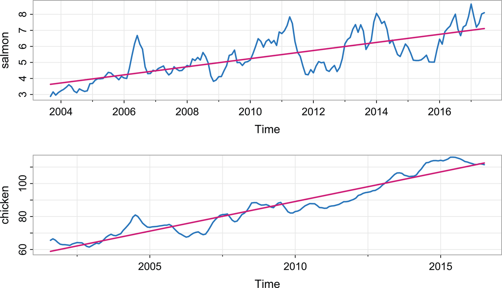

Figure 3.1: The monthly export price of Norwegian salmon per kilogram from September 2003 to June 2017 (top). The price of chicken in U.S. cents per pound, 2001–2016 (bottom). Each plot shows the data along with the fitted linear trend. [Return to text.⏎](chapter3)

xt\=β0+β1zt+wt,zt\=2003812,2003912,…,2017512.

This is in the form of the regression model (3.1) with q\=1. The data _xt_ are in the file **salmon**, and _zt_ is year-month with values in time(**salmon**). Our assumption that the error, _wt_, is white noise is probably not true because there is oscillatory behavior around the line, but we will assume it is true for now. The problem of autocorrelated errors will be discussed in detail in [Section 5.4](#chapter5#sec5_4).

In ordinary least squares (OLS), we minimize the error sum of squares

S\=∑t\=1nwt2\=∑t\=1n(xt−\[β0+β1zt\])2

with respect to _βi_ for i\=0,1. In this case, we can use simple calculus to evaluate ∂S/∂βi\=0 for i\=0,1, and obtain two equations to solve for the _β_s. The OLS estimates of the coefficients are explicit and given by

β^1\=∑t\=1n(xt−x¯)(zt−z¯)∑t\=1n(zt−z¯)2andβ^0\=x¯−β^1 z¯,

where x¯\=∑txt/n and z¯\=∑tzt/n are the respective sample means.

For these data, we obtained the estimated slope coefficient of β^1\=.25 (with a standard error of. 02) yielding a highly significant estimated increase of about 43\. 25 cents _per year_ (year is the unit of time in this case). [Figure 3.1](#chapter3#fig3_1) shows the data with the estimated trend line superimposed. The figure also displays a similar analysis on the data set **chicken**, which is the price (per pound) of a chicken in the U.S. from mid-2001 to mid-2016 (180 months). Note the similarities between the two commodity prices. The code for this example is:

`par(mfrow=2:1)`
`**trend**(**salmon**, lwd=2, results=TRUE, ci=FALSE)   _# graphic and results_`
`              Estimate      SE t.value p.value`
`  (Intercept) -503.09    34.44   -14.61        0`
`  time            0.25    0.02    14.76        0`
`  Noise SE estimated as: 0.88 on 164 df`
`**trend**(**chicken**, lwd=2, ci=FALSE)   _# graphic only_`

Simple linear regression extends to multiple linear regression in a fairly straight-forward manner. As in the previous example, OLS estimation minimizes the error sum of squares

S\=∑t\=1nwt2\=∑t\=1n(xt−\[β0+β1zt1+β2zt2+⋯+βqztq\])2,

with respect to β0,β1,…,βq. This minimization can be accomplished by solving ∂S/∂βi\=0 for i\=0,1,…,q, which yields q+1 equations with q+1 unknowns. These equations are typically called the _normal equations_ given by

∑t\=1n(xt−\[β^0+β^1zt1+β^2zt2+⋯+β^qztq\]) ztj\=0,j\=0,1,…,q,

with zt0\=1, and β^i denotes the estimate of _βi_. The minimized error sum of squares, denoted _SSE_, is

SSE\=∑t\=1n(xt−x^t)2,(3.2)

where

x^t\=β^0+β^1zt1+β^2zt2+⋯+β^qztq.

The (adjusted) total sum of squares is defined as

SST\=∑t\=1n(xt−x¯)2,

and we may measure the proportion of variation accounted for by the independent variables using the _coefficient of determination_ or _squared multiple correlation_,

R2\=SST−SSESST\=SSRSST\=∑t\=1n(x^t−x¯)2∑t\=1n(xt−x¯)2.(3.3)

The term SSR in the numerator of (3.3) is called the _regression sum of squares_.

44\. Note that SST≥SSE so that R2∈\[0, 1\] is measuring how much better (in reducing the error) it is to use the independent predictor variables to describe the average behavior of the data compared to simply using the sample mean (or using no predictors). Unfortunately, the value of _R_2 is hard to use as a measure of fit because it is inversely related to σw2, which has nothing to do with the linear relationship between the dependent variable and the independent variables. For example, if xt\=t+wt or xt\=t+3wt, the linear relationship between _xt_ and _t_ is the same in both cases, but the value of _R_2 will be much larger in the first case:

`set.seed(1984)`
`t = 1:10; w = rnorm(10)`
`x = t + w`
`summary( lm(x~ t) )$r.sq   _# cor(x,t)^2 also works in this case_`
`  [1] 0.9073`
`x = t + 3*w`
`summary( lm(x~ t) )$r.sq`
`  [1] 0.5633`

The ordinary least squares estimators of the _β_s are unbiased and have the smallest variance within the class of linear unbiased estimators. An unbiased estimator for the variance σw2 is

sw2\=MSE\=SSEn−(q+1),

where _MSE_ denotes the mean squared error. The estimated standard error of the _i_th coefficient estimate is

se(β^i)\=VIFisw∑t(zti−z¯i)2,

where z¯i\=∑tzti/n and the _variance inflation factor_ (VIF) for input zti is

VIFi\=(1−Ri2)−1,

with Ri2 being the squared multiple correlation of zti on all of the other independent variables \[if there is only one independent variable, we can set its VIF to 1 in the formula for se(β^1) \]. Note that VIF is unbounded, so if there is strong collinearity among the independent variables, some of the Ri2 will be close to 1 and the corresponding VIFi, and consequently those standard errors, will be very large.

Because the errors are normal, if se(β^i) represents the estimated standard error of the estimate of _βi_, for i\=1,…,q, then

T\=(β^i−βi)se(β^i)

has the _t_\-distribution with n−(q+1) degrees of freedom. This result is often used for individual confidence intervals and tests of the null hypothesis H0:βi\=0.

Example 3.2 45\. Kitchen Sink Economics\*

[Young and Pedregal (1999)](#bibref1#refbib_56) were interested in how various economic factors impacted unemployment in the USA after World War II. The time series are in econ5 and consist of quarterly unemployment, GNP, consumption, and government and private investment from 1948-III to 1988-II. The data are displayed in [Figure 3.2](#chapter3#fig3_2) along with the corresponding growth rates.

`gecon5 = diff(log(**econ5**))`
`**tsplot**(cbind(**econ5**, gecon5), byrow=FALSE, ylab=colnames(**econ5**), ncol=2,`
`   col=2:6, lwd=2, title=c("Actual", rep(NA,4),"Growth Rate"))`

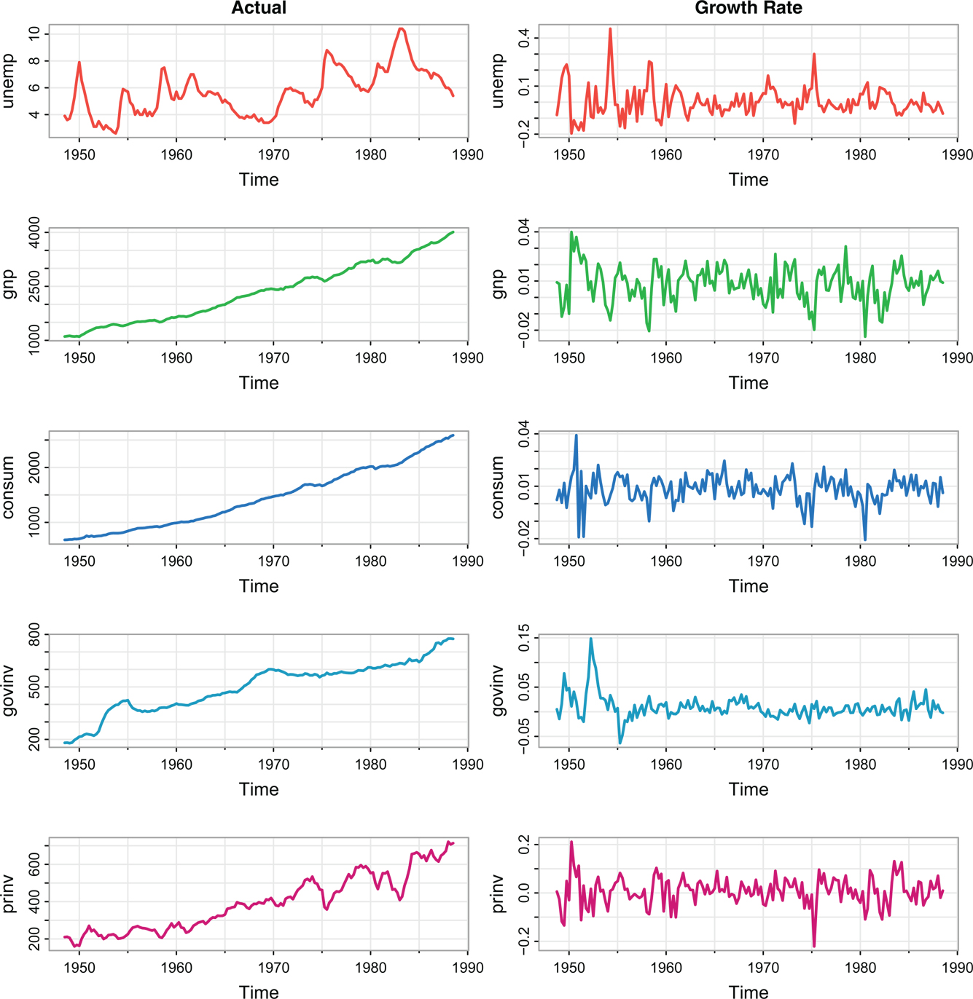

Figure 3.2: Unemployment and various economic factors (actual values and growth rates) for 40 years after World War II. [Return to text.⏎](chapter3)

At first, we will blindly throw all the factors into a regression (“everything but the kitchen sink”) and include a linear trend term because unemployment appears to be trending upward (partial output shown). The dot in the lm call 46\. means to include all other columns of the data frame except for the response variable.

`**ttable**( lm(**unemp**~ time(**unemp**) +   . , data=econ5), vif=TRUE)`
`  Coefficients:`
`              Estimate      SE    t.value   p.value       VIF`
`  (Intercept) 13.6122 0.7196      18.9166     0e+00`
`  time(unemp)    0.1427 0.0114    12.4618     0e+00   101.8556`
`  gnp           -0.0154 0.0017    -8.9391     0e+00   706.1012`
`  **consum         0.0169 0.0017     9.7853     0e+00   329.0045**`
`  govinv        -0.0096 0.0015    -6.3550     0e+00    16.9628`
`  prinv         -0.0078 0.0021    -3.7193     3e-04    34.4736`

The VIFs in the “kitchen sink” regression are enormous, so it might be better to think about the problem a little longer. First, notice that the predictor variables look like the trend component time(**unemp**) because they are increasing almost linearly. The coefficient of consumption is positive, whereas it should be negative because higher consumption is associated with lower unemployment. Reversal of coefficient signs is one of the many detrimental effects of strong collinearities. Removing the trend component does not help the problem.

We can try running the regression on the growth rates to avoid the problem that all the series are increasing over time (partial output shown):

`**ttable**( lm(**unemp**~ . , data=gecon5), vif=TRUE)`
`  Coefficients:`
`              Estimate      SE t.value p.value       VIF`
`  (Intercept)    0.0398 0.0090   4.4164   0.0000`
`  gnp           -5.7132 0.9666 -5.9106    0.0000   3.5000`
`  **consum         0.5690 0.8550   0.6655   0.5067   1.4576**`
`  **govinv         0.3225 0.2505   1.2871   0.2000   1.0343**`
`  **prinv          0.0770 0.1654   0.4654   0.6423   2.8104**`

The VIF for GNP is still moderately high, but often the advice is that VIFs less than 4 or 5 should not be much of a concern. But, and this is a big but, the coefficients of all the other factors are not significant and positive instead of negative (higher investment and consumption should lower unemployment).

Let's think about this a little longer. GNP is made up of various components, and consumption, investment, and government spending are three of those components (the others are net exports and income earned overseas). Consequently, GNP should be highly correlated with the other components in this study. One thing we can do is partial out these components from GNP and then run the regression:

`gnpp = resid( lm(**gnp**~ **consum** + **govinv** + **prinv**, data=gecon5) )`
`**ttable**(lm(**unemp**~ gnpp + **consum** + **govinv** + **prinv**, data=gecon5), vif=TRUE)`
`  Coefficients:`
`              Estimate      SE t.value p.value        VIF`
`  (Intercept)    0.0212 0.0084   2.5124   0.0130`
`  gnpp          -5.7132 0.9666 -5.9106    0.0000   1.0000`
`  consum        -2.0540 0.7308 -2.8108    0.0056   1.0649`
`  govinv         0.3532 0.2505   1.4102   0.1605   1.0338`
`  prinv         -0.6884 0.1029 -6.6894    0.0000   1.0879`
` Residual standard error: 0.07216 on 155 degrees of freedom`
` Multiple R-squared: 0.4062,     Adjusted R-squared: 0.3908`
` F-statistic: 26.5 on 4 and 155 DF, p-value: < 2.2e-16`

47\. Finally the VIFs are good, and consumption and private investment are significant and in the correct direction. Government investment, however, has a positive coefficient and is not significant over this time period. While government investment can lower the unemployment rate, there is feedback in that higher unemployment can lead to increased government spending.

The next step would be to perform residual diagnostics. Although we do not display the results, the residuals do appear to be white noise.

`res = resid( lm(**unemp**~ gnpp + **consum** + **govinv** + **prinv**, data=gecon5) )`
`**tsplot**(time(gecon5), res); **acf1**(res)`

Various competing models are often of interest to isolate or select the best subset of independent variables. Suppose a proposed model specifies that only a subset of r<q independent variables, zt,1:r\={zt1,zt2,…,ztr}, is influencing the dependent variable _xt_. In this case, the reduced model is

xt\=β0+β1zt1+⋯+βrztr+wt(3.4)

where β1,β2,…,βr are a subset of coefficients of the original _q_ variables. The null hypothesis in this case is H0:βr+1\=⋯\=βq\=0. We can test the reduced model (3.4) against the full model (3.1) by comparing the error sums of squares under the two models using the _F_\-statistic

F\=(SSEr−SSE)/(q−r)SSE/(n−q−1)\=MSRMSE,(3.5)

where _SSEr_ is the error sum of squares under the reduced model (3.4). In (3.5), the numerator is called the mean squared regression (MSR) and the denominator is called the mean squared error (MSE). Note that SSEr≥SSE because the reduced model has fewer parameters. If H0:βr+1\=⋯\=βq\=0 is true, then SSEr≈SSE because the estimates of those _β_s will be close to 0\. Hence, we do not believe H0 if _MSR_ is big relative to MSE. Under the null hypothesis, (3.5) has a central _F_\-distribution with q−r and n−q−1 degrees of freedom. These results are often summarized in an ANOVA table as given in [Table 3.1](#chapter3#tbl3_1). The difference in the numerator is often called the regression sum of squares (_SSR_). The null hypothesis is rejected at level _α_ if F\>Fn−q−1q−r(α), the 1−α percentile of the _F_ distribution with q−r numerator and n−q−1 denominator degrees of freedom.

__Table 3.1: Analysis of Variance for Regression [Return to text.⏎](chapter3)__
| Source   | df      | Sum of Squares | Mean Square      | _F_       |
| -------- | ------- | -------------- | ---------------- | --------- |
| zt,r+1:q | q−r     | SSR\=SSEr−SSE  | MSR\=SSR/(q−r)   | F\=MSRMSE |
| Error    | n−(q+1) | _SSE_          | MSE\=SSE/(n−q−1) |           |

48\. 

### Model Selection

While the techniques discussed in the previous paragraph can be used for model selection via stepwise or all subsets regression, another approach is based on _parsimony_ (also called _Occam's razor_) where we try to find the most _accurate_ model with the least amount of _complexity_. You may have been introduced to parsimony and model choice via Mallows _Cp_ in a course on regression.

For _accuracy_, we can use the error sum of squares, SSE\=∑t\=1n(xt−x^t)2, because it measures how close the fitted values (x^t) are to the actual data (_xt_). In particular, for a normal regression model with _k_ coefficients, consider the maximum likelihood estimator for the variance,

σ^k2\=SSE(k)n,(3.6)

where by SSE(k), we mean the residual sum of squares under the model with _k_ regression coefficients. The _complexity_ of the model can be characterized by _k_, the number of parameters in the model. [Akaike (1974)](#bibref1#refbib_1) suggested balancing the accuracy of the fit against the number of parameters in the model.[1](#chapter3#fn3_1)

Definition 3.3 _Akaike's Information Criterion (AIC)_ [Return to text.⏎](chapter3)

AIC\=log σ^k2+n+2kn,(3.7)

_where_ σ^k2 _is given by (3.6) and k is the number of parameters in the model._

Thus, the parsimonious model will be an accurate one (small error σ^k2) that is not overly complex (small _k_). Hence, the model yielding the minimum AIC specifies the best model among those considered.

The choice for the penalty term given by (3.7) is not the only one, and a considerable literature is available advocating different penalty terms. A corrected form, suggested by [Sugiura (1978)](#bibref1#refbib_47) and expanded by [Hurvich and Tsai (1989)](#bibref1#refbib_26) can be based on small-sample distributional results for the linear regression model. The corrected form is defined as follows.

Definition 3.4 _AIC, Bias Corrected (AICc)_

AICc\=log σ^k2+n+kn−k−2,(3.8)

_using the same notation as in [Definition 3.3](#chapter3#defi3_3)._

\_\_\_\_\_\_\_\_\_\_\_\_\_\_\_\_\_ 1Formally, AIC is defined as −2logLk+2k where _Lk_ is the maximum value of the likelihood and _k_ is the number of parameters in the model. For comparison, BIC is defined as −2logLk+klogn, so complexity has a much larger penalty. For the normal regression problem, AIC can be reduced to the form given by (3.7). Maximum likelihood estimation is discussed in [Section A.7](#appA#secA_7). [Return to text.⏎](#chapter3#fn3_13b)

49\. We may also derive a penalty term based on Bayesian arguments as in [Schwarz (1978)](#bibref1#refbib_40), which leads to the following.

Definition 3.5 _Bayesian Information Criterion (BIC)_

BIC\=log σ^k2+klognn,(3.9)

_using the same notation as in [Definition 3.3](#chapter3#defi3_3)._

BIC is also called the Schwarz Information Criterion (SIC). Various simulation studies have tended to verify that BIC does well at getting the correct order in large samples, whereas AICc tends to be superior in smaller samples where the relative number of parameters is large; see [McQuarrie and Tsai (1998)](#bibref1#refbib_34) for detailed comparisons.

Example 3.6 Pollution, Temperature, and Mortality [Return to text.⏎](chapter3)

The data shown in [Figure 3.3](#chapter3#fig3_3) are extracted series from a study by [Shumway et al. (1988)](#bibref1#refbib_43) of the possible effects of temperature and pollution on weekly mortality in Los Angeles County. Note the strong seasonal components in all of the series corresponding to winter-summer variations and the downward trend in the cardiovascular mortality over the 10-year period.

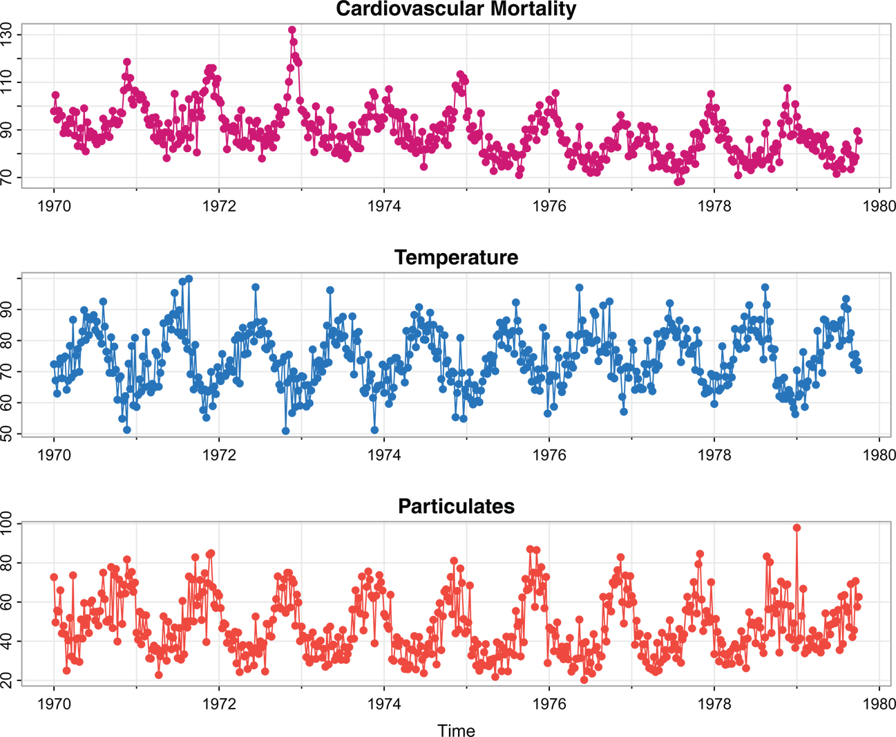

Figure 3.3: Average weekly cardiovascular mortality (top), temperature (middle), and particulate pollution (bottom) in Los Angeles County. There are 508 six-day smoothed averages obtained by filtering daily values over the 10-year period 1970–1979. [Return to text.⏎](chapter3)

Notice the inverse relationship between mortality and temperature; the mortality rate is higher for cooler temperatures. In addition, it appears that the mortality rate increases during higher levels of particulate pollution. These relationships can be better seen in [Figure 3.4](#chapter3#fig3_4), where the data are plotted together. The time series plots were produced as follows.

`_##-- Figure 3.3 --##_`
`par(mfrow=c(3,1), cex=.8)`
`**tsplot**(**cmort**, main="Cardiovascular Mortality", col=6, type="o", pch=19, ylab=NA)`
`**tsplot**(**tempr**, main="Temperature", col=4, type="o", pch=19, ylab=NA)`
`**tsplot**(**part**, main="Particulates", col=2, type="o", pch=19, ylab=NA)`
`_##-- Figure 3.4 --##_`
`**tsplot**(cbind(**cmort**, **tempr**, **part**), col=2:4, **spaghetti**=TRUE, **addLegend**=TRUE,`
`   legend=c("Mortality", "Temperature", "Particulates"))`

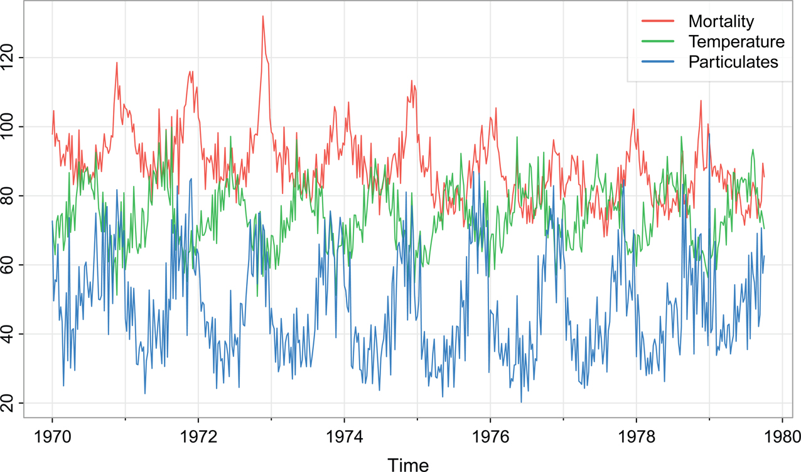

Figure 3.4: Mortality data on same plot. [Return to text.⏎](chapter3)

To investigate these relationships further, a scatterplot matrix is shown in [Figure 3.5](#chapter3#fig3_5) and indicates that cardiovascular mortality is linearly related to pollutant particulates, but it is nonlinearly related to temperature. We note that the curvilinear shape of the temperature–mortality curve indicates that higher temperatures as well as lower temperatures are associated with increases in cardiovascular mortality. The scatterplot matrix shown in [Figure 3.5](#chapter3#fig3_5) was generated as follows.

`**tspairs**(cbind(Mortality=**cmort**, Temperature=**tempr**, Particulates=**part**),`
`   hist=FALSE, col.diag=6)`

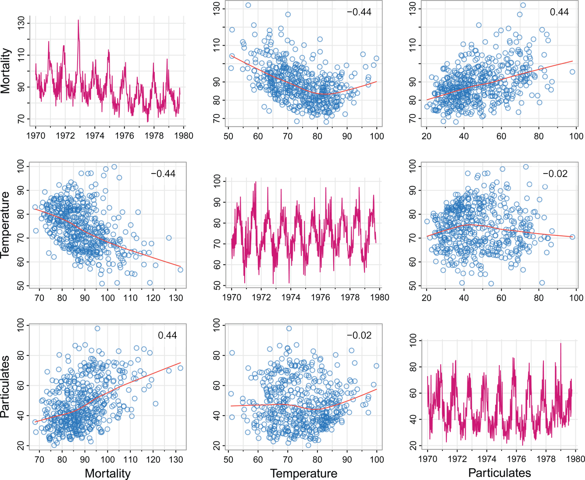

Figure 3.5: Scatterplot matrix showing relations between mortality, temperature, and pollution. The correlations are displayed in the upper right corner and the red lines are a lowess fit. [Return to text.⏎](chapter3)

50\. It is important that temperature and particulate pollution are nearly uncorrelated. If these two independent variables were highly correlated (i.e., collinear), then it would be difficult to distinguish between the effects of each on mortality. On the off-diagonals of the figure, the sample correlations are displayed in the upper right-hand corner, and the superimposed lines are locally weighted scatterplot smoothers (lowess) that can help discover any nonlinearities. We discuss smoothing in [Section 3.3](#chapter3#sec3_3), but for now, think of lowess as a method for fitting localized regression.

For ease, let _Mt_ denote cardiovascular mortality, _Tt_ denote temperature, and _Pt_ denote the particulate levels. Based on the scatterplot matrix, it seems clear that both _Tt_ and _Pt_ should be in the model, but for demonstration purposes, we 51\. entertain four models. They are

Mt\=β0+β1t+wt(3.10)

Mt\=β0+β1t+β2Tt+wt(3.11)

Mt\=β0+β1t+β2Tt+β3Tt2+wt(3.12)

Mt\=β0+β1t+β2Tt+β3Tt2+β4Pt+wt(3.13)

Note that (3.10) is a trend only model, (3.11) adds a linear temperature term, (3.12) adds a curvilinear temperature term, and (3.13) adds a pollution term. We summarize some of the statistics for the various model fits in [Table 3.2](#chapter3#tbl3_2).

__Table 3.2: Summary Statistics for Mortality Models [Return to text.⏎](chapter3)__
| Model  | _k_ | SSE    | df  | MSE  | _R_2 | AIC  | BIC  |
| ------ | --- | ------ | --- | ---- | ---- | ---- | ---- |
| (3.10) | 2   | 40,020 | 506 | 79.0 | .21  | 5.38 | 5.40 |
| (3.11) | 3   | 31,413 | 505 | 62.2 | .38  | 5.14 | 5.17 |
| (3.12) | 4   | 27,985 | 504 | 55.5 | .45  | 5.03 | 5.07 |
| (3.13) | 5   | 20,508 | 503 | 40.8 | .60  | 4.72 | 4.77 |

We note that each model does substantially better than the one before it and that the model including temperature, temperature squared, and particulates does the best, accounting for some 60% of the variability and with the best value for AIC and BIC (because of the large sample size, AIC and AICc are nearly the same). Note that one can compare any two models using the residual 52\. sums of squares and (3.5). Hence, a model with only trend could be compared to the full model using q\=4,r\=1,n\=508, so

F3,503\=(40,020−20,508)/320,508/503\=160,

which exceeds F3,503(.001)\=5.51.

The output for the best model, (3.13), is shown in the code below. As expected, a negative trend is present over time as well as a significant quadratic temperature effect (increased mortality is associated with extreme temperatures). Pollution weights positively and can be interpreted as the incremental contribution to weekly deaths per unit of particulate pollution. It would still be essential to check the residuals w^t\=Mt−M^t for autocorrelation (of which there is a substantial amount), but we defer this question to [Section 5.4](#chapter5#sec5_4) when we discuss regression with correlated errors.

`Z = cbind(trnd=time(**cmort**), **tempr**, **tempr**^2, **part**)`
`**ttable**( lm(**cmort**~ Z, na.action=NULL), vif=TRUE )`

`  Coefficients:`
`                   Estimate       SE t.value    p.value       VIF`
`  (Intercept)     2991.1402 199.4043 15.0004          0`
`  Ztrnd             -1.3959   0.1010 -13.8195         0     1.0110`
`  Ztempr            -3.8273   0.4236 -9.0357          0   181.2543`
`  Ztempr^2           0.0226   0.0028   7.9903         0   181.1552`
`  Zpart              0.2553   0.0189 13.5411          0     1.0133`
` `
`  Residual standard error: 6.385 on 503 degrees of freedom`
`  Multiple R-squared: 0.5954,      Adjusted R-squared: 0.5922`
`  F-statistic:    185 on 4 and 503 DF, p-value: < 2.2e-16`
`  AIC = 4.7217      AICc = 4.722     BIC = 4.7717`
`summary( aov(**cmort**~ Z) ) _# Table 3.1_`
`                Df Sum Sq Mean Sq F value Pr(>F)`
`  Z              4 30178     7545     185 <2e-16`
`  Residuals    503 20508       41`

53\. We will address the large VIFs in [Example 3.7](#chapter3#exam3_7). In [Figure 3.4](#chapter3#fig3_4) it appears that mortality may peak a few weeks after pollution peaks. In this case, we may want to include a lagged value of pollution into the model. This concept is explored further in [Problem 3.2](#chapter3#question3_2).

Example 3.7 Mortality and the Environment (cont.) [Return to text.⏎](chapter3)

According to [Pozzer et al. (2023)](#bibref1#refbib_36), “Of all deaths from non‐communicable diseases in 2019, about 20% may be attributed to environmental risk factors (including ambient air pollution, household air pollution, lead and radon exposure, extremes of temperature, unsafe water, sanitation, and hand washing).” In [Example 3.6](#chapter3#exam3_6), it was fairly obvious from the scatterplot matrix in [Figure 3.5](#chapter3#fig3_5) that temperature and particle pollution can be indicated in mortality, and that extreme temperatures have a detrimental effect. Consequently, it was not a surprise that model (3.13) was the best among the four models considered. There are, however, other series included in that study, and they are in the data set lap (LA Pollution Study).

For example, suppose we wish to include carbon monoxide (CO) levels into the regression and evaluate its contribution for predicting mortality.

`**ttable**( lm(**cmort**~ Z + **co**, data=**lap**), vif=TRUE ) _# Z from previous example_`
`  Coefficients:`
`                Estimate      SE t.value p.value         VIF`
`  (Intercept) 2589.3679 232.2554 11.1488    0.0000`
`  Ztrnd          -1.1909  0.1179 -10.1027   0.0000    1.4039`
`  Ztempr         -3.8930  0.4200 -9.2696    0.0000  181.6664`
`  Ztempr^2        0.0231  0.0028   8.2499   0.0000  181.8050`
`  Zpart           0.1318  0.0420   3.1404   0.0018    5.1177`
`  co              0.5869  0.1786   3.2870   0.0011    5.7200`
` `
` Residual standard error: 6.324 on 502 degrees of freedom`
` Multiple R-squared: 0.6039,     Adjusted R-squared:    0.6`
` F-statistic: 153.1 on 5 and 502 DF, p-value: < 2.2e-16`
` AIC = 4.7044     AICc = 4.7047     BIC = 4.7627`

54\. We see that CO is significant and the model that includes it is preferred to the model without it by all information criteria.

`AIC = 4.7044   AICc = 4.7047   BIC = 4.7627   _# with co_`
`AIC = 4.7217   AICc = 4.7220   BIC = 4.7717   _# without co_`

The VIFs for **tempr** and **tempr**^2 are high because the two are highly correlated in this temperature range. It is possible to remove these large VIFs by centering temperature first, but doing so will not change the result of the essential quadratic variable **tempr**^2. The other large VIFs are because **part** and **co** both are a result of incomplete combustion of various fuels. One option would be to combine the components of pollution into one measure. Because particulate matter can contribute to elevated CO levels, another option would be to partial out particulates from CO before the analysis:

`cop = resid(lm(**co**~ **part**, data=**lap**)) _# partial out particulates from co_`
`temp = **tempr** - mean(**tempr**)            _# center temperature_`
`Z = cbind(trnd=time(**cmort**), temp, temp^2, **part**, cop)`
`**ttable**( lm(**cmort**~ Z), vif=TRUE )`
`  Coefficients:`
`                Estimate      SE t.value p.value        VIF`
`  (Intercept) 2426.5270 232.8960 10.4189    0.0000`
`  Ztrnd          -1.1909  0.1179 -10.1027   0.0000   1.4039`
`  Ztemp          -0.4564  0.0317 -14.3968   0.0000   1.0349`
`  Ztemp^2         0.0231  0.0028   8.2499   0.0000   1.0190`
`  Zpart           0.2581  0.0187 13.8070    0.0000   1.0154`
`  Zcop            0.5869  0.1786   3.2870   0.0011   1.4291`
` `
` Residual standard error: 6.324 on 502 degrees of freedom`
` Multiple R-squared: 0.6039,     Adjusted R-squared:    0.6`
` F-statistic: 153.1 on 5 and 502 DF, p-value: < 2.2e-16`
` AIC = 4.7044     AICc = 4.7047     BIC = 4.7627`

Note that the summary statistics at the bottom of the output are the same as before.

It is possible to include lagged variables in time series regression models with some care. We will continue to discuss this type of problem throughout the text, and we start with the following example.

Example 3.8 Regression with Lagged Variables: Predator–Prey [Return to text.⏎](#chapter1#b1exam3_8)

In [Example 1.5](#chapter1#exam1_5), we discussed the predator–prey relationship between the lynx and the snowshoe hare populations. As mentioned in that example, the relationship between the prey (hare in this case, _Ht_) and the predator (lynx in this case, _Lt_) is often modeled by the Lotka–Volterra equations given by

Ht+1\=αHt−βLtHtLt+1\=δLt+γLtHt,(3.14)

where α\>1 is the growth rate of the prey in the absence of the predator, 0<δ<1 is the survival rate of the predator in the absence of its prey source, β\>0 is the consumption rate of the predators, and γ\>0 is the growth rate of 55\. the predator population due to the consumption of prey. Generated data from the model is shown in [Figure 3.6](#chapter3#fig3_6), and we notice the similarity to actual data shown in [Figure 1.6](#chapter1#fig1_6).

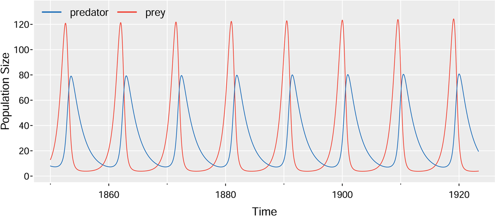

Figure 3.6: Example of predator–prey behavior based on the Lotka–Volterra equations given in (3.14). Compare to [Figure 1.6](#chapter1#fig1_6). [Return to text.⏎](chapter3)

Now suppose we wish to fit the model (3.14) to the Lynx data via regression. Unfortunately, performing lagged regression in base R is a little difficult because the series must be aligned prior to running the regression. Otherwise, the results of the analysis will be incorrect. The way to pre-process the data is to use ts.intersect to align the lagged series, and make it a data frame:

`prdpry = ts.intersect(L=**Lynx**, L1=lag(**Lynx**,-1), H1=lag(**Hare**,-1), dframe=TRUE)`
`fit    = lm(L~ L1 + L1:H1, data=prdpry, na.action=NULL)`
`**ttable**(fit)`
`  Coefficients:`
`              Estimate      SE t.value p.value`
`  (Intercept)   7.8498 2.1927    3.5799    6e-04`
`  L1            0.5563 0.0884    6.2932    0e+00`
`  L1:H1         0.0031 0.0009    3.5513    6e-04`
` `
`  Residual standard error: 11.35 on 87 degrees of freedom`
`  Multiple R-squared: 0.6502,      Adjusted R-squared: 0.6421`
`  F-statistic: 80.84 on 2 and 87 DF, p-value: < 2.2e-16`
`  AIC = 5.91306     AICc = 5.91616      BIC = 6.02416`
`_# residuals_`
`par(mfrow=1:2)`
`**tsplot**(resid(fit), col=4, main=NA)`
`**acf1**(resid(fit),   col=4, main=NA)`
`mtext("**Lynx** Residuals", outer=TRUE, line=-1.4, font=2)`

Finally, [Figure 3.7](#chapter3#fig3_7) shows the residuals and the corresponding sample ACF from the fit, and it is evident that the residuals are not white. In fact, the residuals are highly correlated and display an obvious 10-year cycle. As is evident from this example, and as will be seen in other examples, classical 56\. regression is often insufficient for explaining all of the interesting dynamics of a time series. This is actually good news for us because, in the end, we seldom use lm to analyze time series. This example is continued in [Example 5.16](#chapter5#exam5_16) where we discuss regression with correlated errors.

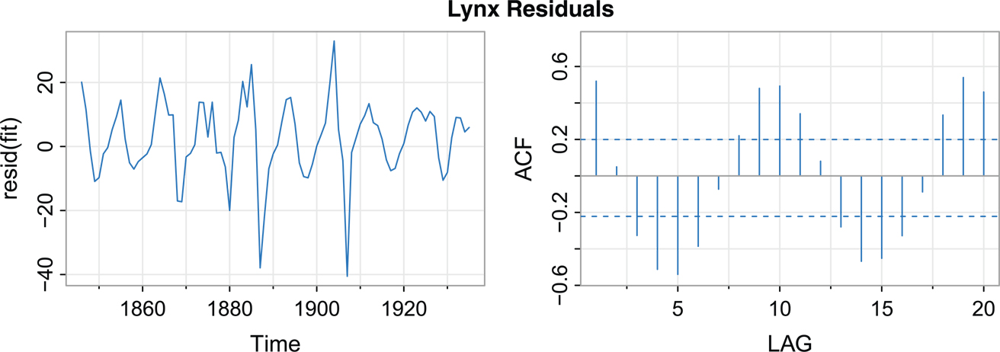

Figure 3.7: Residual analysis of the fitted predator Lotka–Volterra equation for the lynx data. [Return to text.⏎](chapter3)

## 3.2 Exploratory Data Analysis

For time series, it is the dependence between the values of the series that is important to measure; we must at least be able to estimate autocorrelations with precision. It would be difficult to measure autocorrelation if it were different for every pair of observations. Hence, it is crucial that a time series satisfies the conditions of stationarity stated in [Definition 2.13](#chapter2#defi2_13) for at least some reasonable stretch of time. Often this is not the case, and in this section we discuss some methods for smoothing and for coercing nonstationary data to stationarity.

A number of our examples came from clearly nonstationary series. The Johnson & Johnson series in [Figure 1.1](#chapter1#fig1_1) has a mean function that increases exponentially over time, and the increase in the magnitude of the fluctuations around this trend causes changes in the covariance function; the variance of the process, for example, clearly increases as one progresses over the length of the series. Also, the global temperature series shown in [Figure 1.4](#chapter1#fig1_4) contain clear evidence of an increasing, but nonlinear, trend over time.

Perhaps the easiest form of nonstationarity to work with is the _trend stationary_ model wherein the process has stationary behavior around a trend. We may write this type of model as

xt\=μt+yt(3.15)

where _xt_ are the observations, _μt_ denotes the trend, and _yt_ is a stationary process. Quite often, strong trend will obscure the behavior of the stationary process, _yt_, as 57\. we shall see in numerous examples. Hence, there is some advantage to removing the trend as a first step in an exploratory analysis of such time series. The steps involved are to obtain a reasonable estimate of the trend component, μ^t, and then work with the innovations (residuals)

y^t\=xt−μ^t.

Example 3.9 Detrending a Commodity [Return to text.⏎](chapter3)

Let _xt_ represent the salmon price data presented in [Example 3.1](#chapter3#exam3_1). Here we suppose the model is of the form of (3.15),

xt\=μt+yt,

where, as we suggested in [Example 3.1](#chapter3#exam3_1), a straight line might be useful for detrending the data,

μt\=β0+β1 t,

with _t_ being the time indices in time(salmon>). In that example, we estimated the trend using ordinary least squares[2](#chapter3#fn3_2) and found

μ^t\=−503+.25 t.

[Figure 3.1](#chapter3#fig3_1) (top) shows the data with the estimated trend line superimposed. To obtain the detrended series we simply subtract μ^t from the observations, _xt_, to obtain the detrended series

y^t\=xt+503−.25 t.

The top graph of [Figure 3.8](#chapter3#fig3_8) shows the detrended series. [Figure 3.9](#chapter3#fig3_9) shows the ACF of the detrended data (top panel).

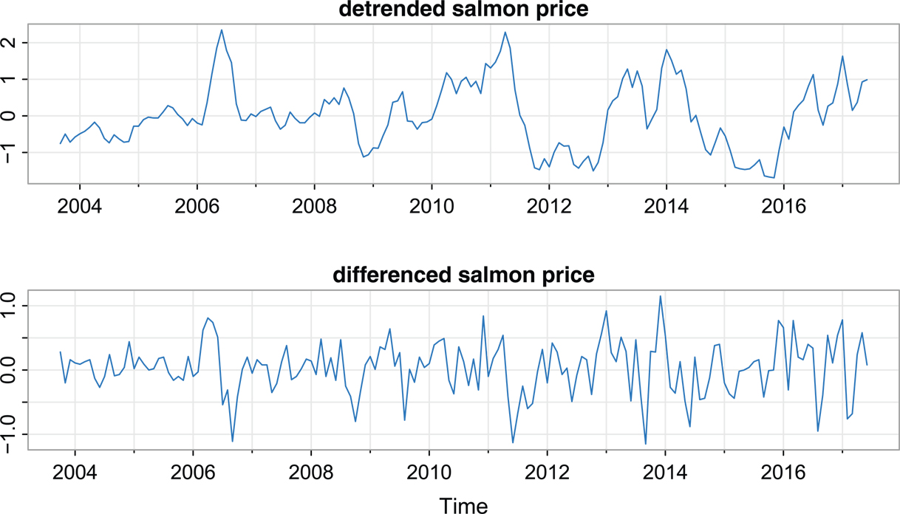

Figure 3.8: Detrended (top) and differenced (bottom) salmon price series. The original data are shown in [Figure 3.1](#chapter3#fig3_1). [Return to text.⏎](chapter3)

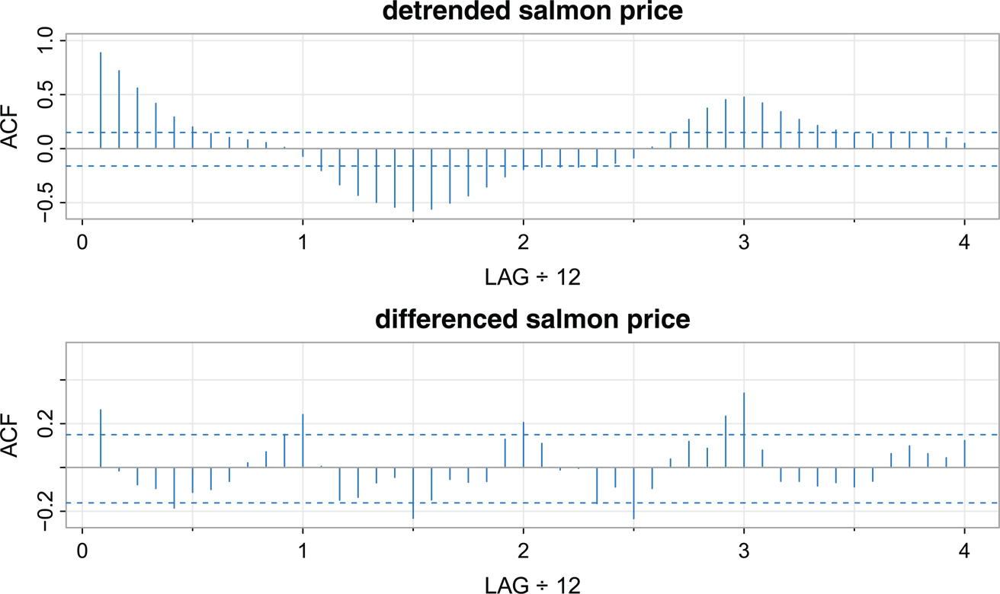

Figure 3.9: Sample ACFs of the detrended (top) and of the differenced (bottom) salmon price series. [Return to text.⏎](chapter3)

In [Example 1.10](#chapter1#exam1_10) we saw that a random walk might also be a good model for trend. That is, rather than modeling trend as fixed (as in [Example 3.9](#chapter3#exam3_9)), we might model trend as a stochastic component using the random walk with drift model,

μt\=δ+μt−1+wt

where _wt_ is white noise and is independent of _yt_. If the appropriate model is (3.15), then _differencing_ the data, _xt_, yields a stationary process; that is,

xt−xt−1\=(μt+yt)−(μt−1+yt−1)\=δ+wt+yt−yt−1.(3.16)

\_\_\_\_\_\_\_\_\_\_\_\_\_\_\_\_\_ 2Because _yt_ is not white noise, the reader may feel that generalized least squares should be used. However, we do not know the behavior of _yt_, and this is what we are trying to assess at this stage. A notable result by [Grenander and Rosenblatt (2008, ch. 7)](#bibref1#refbib_21) is that under mild conditions on _yt_, for polynomial regression or periodic regression, ordinary least squares is equivalent to generalized least squares with regard to efficiency for large samples. [Return to text.⏎](#chapter3#fn3_23b)

58\. It is easy to show zt\=yt−yt−1 is stationary using Property 2.7 because _yt_ is stationary,

γz(h)\=cov(zt+h,zt)\=cov(yt+h−yt+h−1,yt−yt−1)\=2γy(h)−γy(h+1)−γy(h−1)(3.17)

is independent of time; we leave it as an exercise ([Problem 3.5](#chapter3#question3_5)) to show that xt−xt−1 in (3.16) is stationary.

One advantage of differencing over detrending to remove trend is that no parameters are estimated in the differencing operation. One disadvantage, however, is that differencing does not yield an estimate of the stationary process _yt_ as can be seen in (3.16). If an estimate of _yt_ is essential, then detrending may be more appropriate. This would be the case, for example, if we were interested in the business cycle of commodities. The salmon prices appear to have a 3- to 4-year business cycle, which is known as the Kitchin cycle [(Kitchin, 1923)](#bibref1#refbib_32) and is seen in many commodity series.

If the goal is to coerce the data to stationarity, then differencing may be more appropriate. Differencing is also a viable tool if the trend is fixed as in [Example 3.9](#chapter3#exam3_9). For example, if μt\=β0+β1 t in the model (3.15), differencing the data produces stationarity (see [Problem 3.4](#chapter3#question3_4)):

xt−xt−1\=(μt+yt)−(μt−1+yt−1)\=β1+yt−yt−1.

Because differencing plays a central role in time series analysis, it receives its own notation. The first difference is denoted as

∇xt\=xt−xt−1.(3.18)

59\. As we have seen, the first difference eliminates a linear trend. A second difference, that is, the difference of (3.18), can eliminate a quadratic trend, and so on. To define higher differences, we need a variation in notation that we will use often.

Definition 3.10. [Return to text.⏎](#chapter4#b4defi3_10) _The **backshift operator** is defined as_

Bxt\=xt−1

_and extended to powers_ B2xt\=B(Bxt)\=Bxt−1\=xt−2, _and so on. Thus,_

Bkxt\=xt−k.

Now, we may rewrite (3.18) as

∇xt\=(1−B)xt,

and we may extend the notion further. For example, the second difference becomes

∇2xt\=(1−B)2xt\=(1−2B+B2)xt\=xt−2xt−1+xt−2

by the linearity of the operator.

Definition 3.11. [Return to text.⏎](#chapter5#b5defi3_11) _**Differences of order**_ d _are defined as_

∇d\=(1−B)d,

_where we may expand the operator_ (1−B)d _algebraically to evaluate for higher integer values of d. When_ d\=1, _we drop it from the notation._

The first difference (3.18) is an example of a _linear filter_ applied to eliminate a trend. Other filters, formed by averaging values near _xt_, can produce adjusted series that eliminate other kinds of unwanted fluctuations as in [Chapter 6](#chapter6). The differencing technique is an important component of the ARIMA model discussed in [Chapter 5](#chapter5).

Example 3.12 Differencing a Commodity [Return to text.⏎](#chapter7#b7exam3_12)

The first difference of the salmon prices series shown in the bottom panel of [Figure 3.8](#chapter3#fig3_8) produces different results than removing trend by detrending via regression. For example, the Kitchin business cycle we observed in the detrended series is not obvious in the differenced series (although it is still there, which can be verified using [Chapter 7](#chapter7) techniques).

The ACF of the differenced series is shown in the bottom panel of [Figure 3.9](#chapter3#fig3_9). In this case, the differenced series exhibits a strong annual cycle that was not evident in the original or detrended data. The code to reproduce [Figure 3.8](#chapter3#fig3_8) and [Figure 3.9](#chapter3#fig3_9) is as follows.

`par(mfrow=2:1)`
`**tsplot**(**detrend**(**salmon**), col=4, main="detrended **salmon** price")`
`**tsplot**(diff(**salmon**), col=4, main="differenced **salmon** price")`
`par(mfrow=2:1)`
`**acf1**(**detrend**(**salmon**), 48, col=4, main="detrended **salmon** price")`
`**acf1**(diff(**salmon**), 48, col=4, main="differenced **salmon** price")`

Example 3.13 60\. Differencing Global Temperature [Return to text.⏎](#chapter8#b8exam3_13)

The global temperature series shown in [Figure 1.4](#chapter1#fig1_4) appears to behave more as a random walk than a trend stationary series. Hence, rather than detrend the data, it would be more appropriate to use differencing to coerce it into stationarity. The differenced data are shown in [Figure 3.10](#chapter3#fig3_10) along with the corresponding sample ACF. In this case, the differenced process shows minimal autocorrelation except at lag 1, which may imply the global temperature series is nearly a random walk with drift.

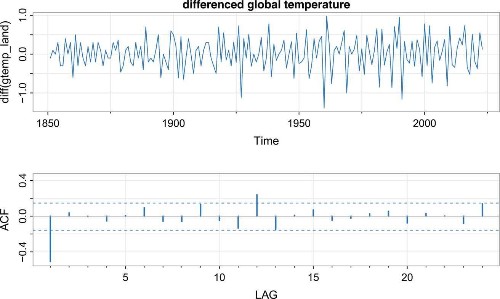

Figure 3.10: Differenced global temperature series and its sample ACF. [Return to text.⏎](chapter3)

It is interesting to note that if the series is a random walk with drift, the mean of the differenced series is an estimate of the drift. Restricting attention to the series before and after 1980 when global temperature increase is evident [(see Hansen and Lebedeff, 1987)](#bibref1#refbib_22), the drift increases by more than tenfold.

`par(mfrow=c(2,1))`
`**tsplot**(diff(**gtemp_land**), col=4, main="differenced global temperature")`
`**acf1**(diff(**gtemp_land**), col=4, nxm=0)`
`mean(window(diff(**gtemp_land**), end=1979))   _# drift before 1980_`
`  [1] 0.00465`
`mean(window(diff(**gtemp_land**), start=1980)) _# drift after 1980_`
`  [1] 0.04909`

61\. Sometimes, heteroscedasticity is seen in time series data. A particularly useful transformation in this case is

yt\=logxt,

which tends to suppress larger fluctuations that occur over portions of the series where the underlying values are larger. As we saw in [Example 1.1](#chapter1#exam1_1) and [Example 1.2](#chapter1#exam1_2), the log transformation arises naturally in time series that evolve by small percentage changes. Other possibilities are power transformations in the Box–Cox family of the form

yt\={(xtλ−1)/λλ≠0,logxtλ\=0.

Methods for choosing the power _λ_ are available [(see Johnson and Wichern, 2002, §4.7)](#bibref1#refbib_29), but we do not pursue them here. Often, transformations are used to improve the approximation to normality or to improve linearity in predicting the value of one series from another.

Example 3.14 Paleoclimatic Glacial Varves [Return to text.⏎](#chapter4#b4exam3_14)

Melting glaciers deposit yearly layers of sand and silt during the spring melting seasons, which can be reconstructed yearly over a period ranging from the time deglaciation began in New England (about 12,600 years ago) to the time it ended (about 6,000 years ago). Such sedimentary deposits, called _varves_, can be used as proxies for paleoclimatic parameters, such as temperature, because in a warm year, more sand and silt are deposited from the receding glacier. The top of [Figure 3.11](#chapter3#fig3_11) shows the thicknesses of the yearly 62\. varves collected from one location in Massachusetts for 634 years, beginning 11,834 years ago. For further information, see [Shumway and Verosub (1992)](#bibref1#refbib_45).

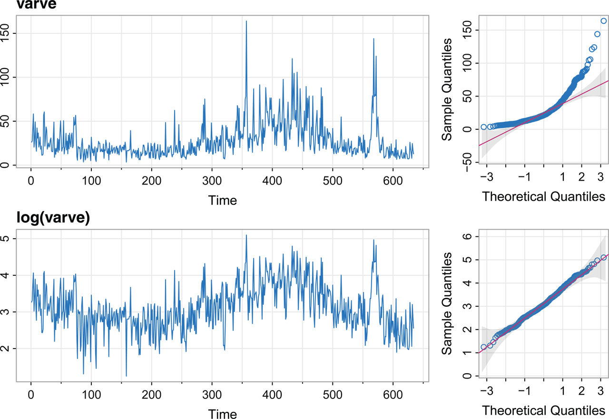

Figure 3.11: Glacial varve thicknesses (top) from Massachusetts for n\=634 years compared with _log_ transformed thicknesses (bottom). The plots on the right are corresponding normal Q-Q plots. [Return to text.⏎](chapter3)

Because the variation in thicknesses increases in proportion to the amount deposited, a logarithmic transformation could remove the nonstationarity observable in the variance as a function of time. [Figure 3.11](#chapter3#fig3_11) shows the original and the logged transformed varves, and it is clear that this improvement has occurred. Also plotted are the corresponding normal Q-Q plots. These plots are discussed in [Section A.1](#appA#secA_1), but briefly they are a graph of the quantiles of the data against the theoretical quantiles of the normal distribution. Normal data should fall approximately on the exhibited line of equality. In this case, we can argue that the approximation to normality is improved by the log transformation. [Figure 3.11](#chapter3#fig3_11) was generated as follows:

`layout(matrix(1:4,2), widths=c(2.5,1))`
`**tsplot**(**varve**, main=NA, ylab=NA, col=4, **margins**=0)`
` mtext("**varve**", side=3, line=.25, cex=1.1, font=2, adj=0)`
`**tsplot**(log(**varve**), main=NA, ylab=NA, col=4, **margins**=0)`
` mtext("log(**varve**)", side=3, line=.25, cex=1.1, font=2, adj=0)`
`**QQnorm**(**varve**, main=NA, **nxm**=0)`
`**QQnorm**(log(**varve**), main=NA, **nxm**=0)`

Next, we consider another preliminary data processing technique that is used for the purpose of visualizing the relations between series at different lags, namely the _lagplot_. 63\. When using the ACF and CCF, we are measuring the linear relation between lagged values of time series. The restriction of the ACF and CCF to linear predictability, however, may mask possible nonlinear relationships between the values _xt_ and its past values, xt−h, or of another series yt−h.

Example 3.15 Lagplots: SOI and Recruitment [Return to text.⏎](chapter3)

[Figure 3.12](#chapter3#fig3_12) displays a lagplot of the SOI, _St_, on the vertical axis plotted against St−h on the horizontal axis. The sample autocorrelations are displayed in the upper right-hand corner and superimposed on the lagplots are locally weighted scatterplot smoothing (lowess) lines that can be used to help discover any nonlinearities. We discuss smoothing in the next section, but for now, think of lowess as a method for fitting localized regression; that is, regression over small intervals of the horizontal axis.

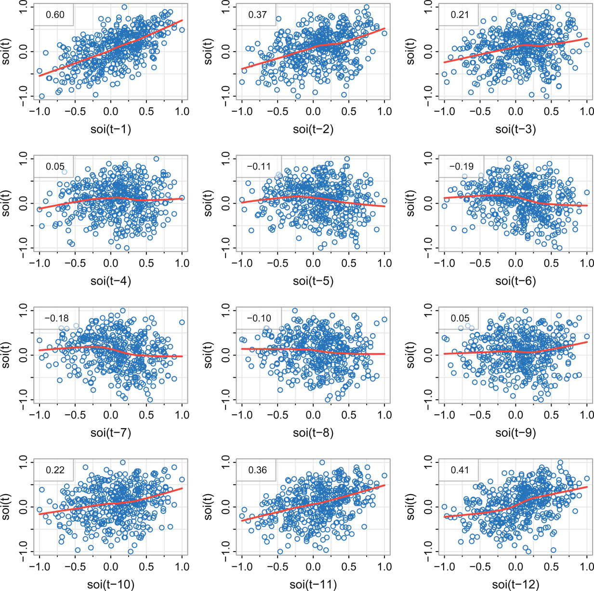

Figure 3.12: Lagplot relating current to past SOI values at lags from 1 to 12\. The values in the lower right corner are the sample autocorrelations and the lines are a lowess fit. [Return to text.⏎](chapter3)

64\. In [Figure 3.12](#chapter3#fig3_12), we notice that the local fits are approximately linear so that the sample autocorrelations are meaningful. Also, we see strong positive linear relations between _St_ and St−h at lags h\=1,2,11,12 and a negative linear relation at lags h\=6,7.

Similarly, we might want to look at values of Recruitment, _Rt_, plotted against SOI, _St_, at various lags to look for possible nonlinear relations between the two series. Because, for example, we might wish to predict the Recruitment series, _Rt_, from current or past values of the SOI series, St−h, for h\=0,1,2,... it would be worthwhile to examine the scatterplot matrix. [Figure 3.13](#chapter3#fig3_13) shows the lagplot of _Rt_ on the vertical axis plotted against St−h on the horizontal axis. In addition, the figure exhibits the sample cross-correlations as well as lowess fits.

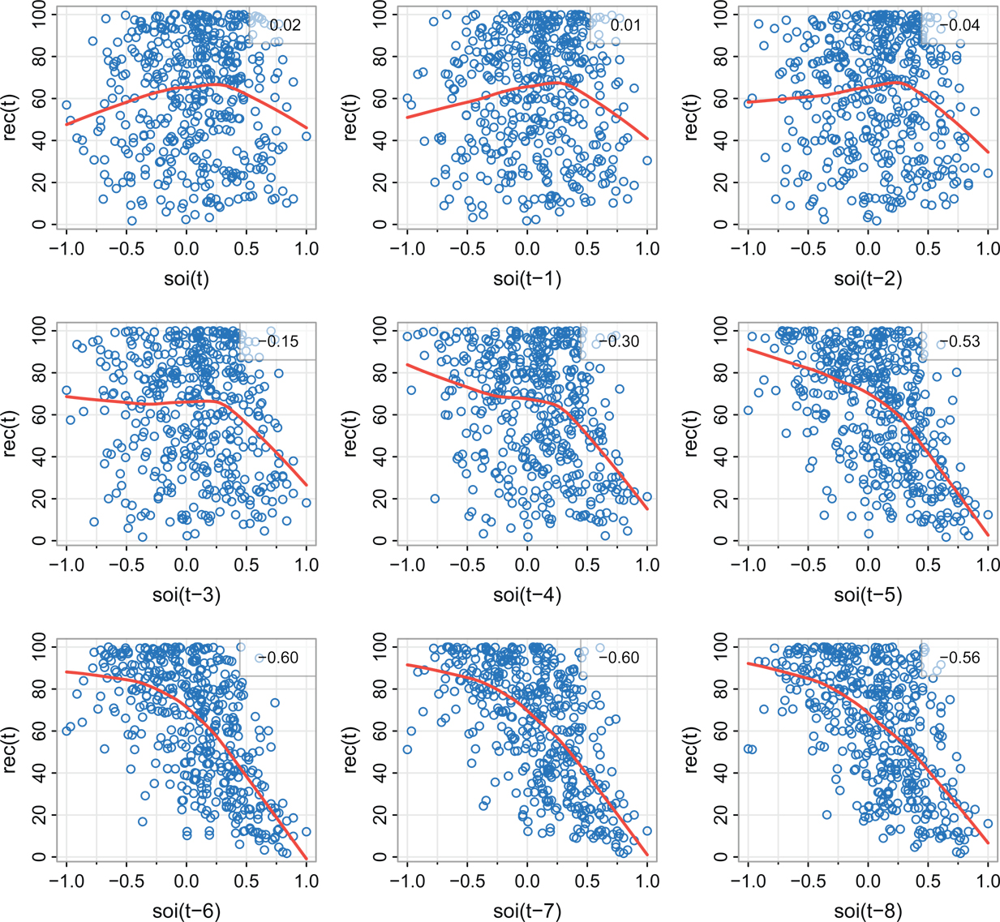

Figure 3.13: Lagplot of the Recruitment series, _Rt_, on the vertical axis plotted against the SOI series, St−h, on the horizontal axis at lags h\=0,1,…,8. The values in the upper right corner are the sample cross-correlations and the lines are a lowess fit. [Return to text.⏎](chapter3)

[Figure 3.13](#chapter3#fig3_13) shows a fairly strong nonlinear relationship between Recruitment and SOI for lags h\=5,6,7,8, indicating the SOI series tends to lead the 65\. Recruitment series at those lags. The relationships are negative, implying that increases in the SOI lead to decreases in the Recruitment. The nonlinearity observed in the lagplots (with the help of the superimposed lowess fits) indicates that the behavior between Recruitment and the SOI is different for positive values and for negative values of SOI.

`**lag1.plot**(**soi**, 12, col=4, **location**="topleft", lwl=2)   _#   Figure 3.12_`
`**lag2.plot**(**soi**, **rec**, 8, col=4, lwl=2)                   _#   Figure 3.13_`

Example 3.16 Using Regression to Discover a Signal in Noise [Return to text.⏎](chapter3)

In [Example 1.11](#chapter1#exam1_11), we generated n\=500 observations from the model

xt\=Acos(2πωt+ϕ)+wt,(3.19)

where ω\=1/50, A\=2, ϕ\=.6π, and σw\=5; the data are shown on the top panel of [Figure 3.14](#chapter3#fig3_14). At this point, we assume the frequency of oscillation ω\=1/50 is known, but _A_ and _ϕ_ are unknown parameters. In this case, the parameters appear in (3.19) in a nonlinear way, so we use a trigonometric identity (see [Section B.5](#appB#secB_5)) and write

Acos(2πωt+ϕ)\=β1cos(2πωt)+β2sin(2πωt),

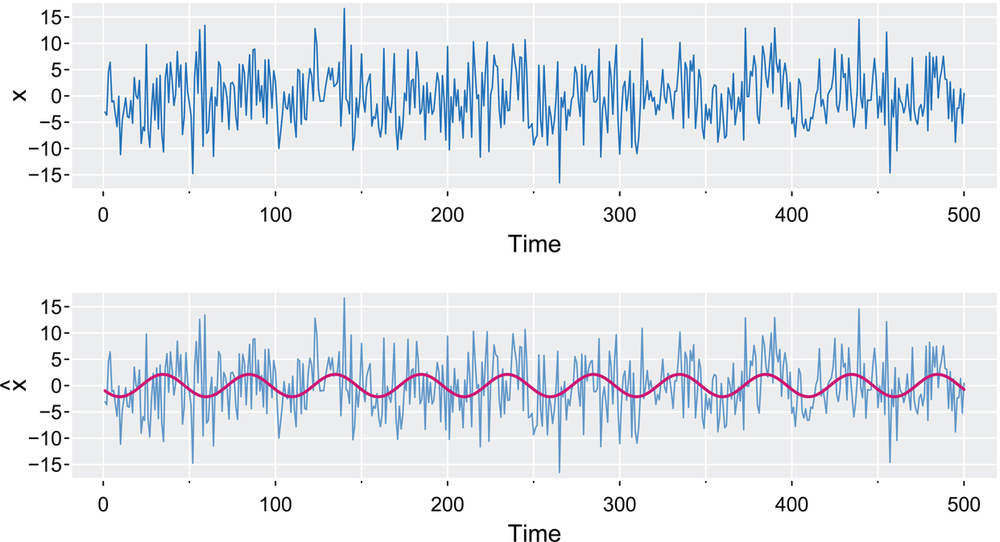

Figure 3.14: Data generated by (3.19) \[top\] and the fitted line superimposed on the data \[bottom\]. [Return to text.⏎](chapter3)

where β1\=Acos(ϕ) and β2\=−Asin(ϕ).

Now the model (3.19) can be written in the usual linear regression form given by (no intercept term is needed here)

xt\=β1cos(2πt/50)+β2sin(2πt/50)+wt.

66\. Using linear regression, we find β^1\=−.74(.33), β^2\=−1.99(.33) with σ^w\=5.18; the values in parentheses are the standard errors. We note the actual values of the coefficients for this example are β1\=2cos(.6π)\=−.62, and β2\=−2sin(.6π)\=−1.90. It is clear that we are able to detect the signal in the noise using regression, even though the signal-to-noise ratio is small. The top of [Figure 3.14](#chapter3#fig3_14) shows the data generated by (3.19); it is hard to discern the signal and the data look like noise. However, the bottom of the figure shows the same data with the fitted line superimposed. It is now easy to see the signal through the noise.

`set.seed(90210)                _# so you can reproduce these results_`
`x = 2*cos(2*pi*1:500/50 + .6*pi) + rnorm(500,0,5)`
`z1 = cos(2*pi*1:500/50); z2 = sin(2*pi*1:500/50)`
`**ttable**(fit <- lm(x~ 0 + z1 + z2)) _# zero to exclude the intercept_`
`      Estimate      SE t.value p.value`
`  z1   -0.7442 0.3274 -2.2729     0.0235`
`  z2   -1.9949 0.3274 -6.0926     0.0000`
` Residual standard error: 5.177 on 498 degrees of freedom`
`par(mfrow=c(2,1))`
`**tsplot**(x, col=4, **gg**=TRUE)`
`**tsplot**(x, ylab=bquote(hat(x)), col=**astsa.col**(4,.7), **gg**=TRUE)`
`lines(fitted(fit), col=6, lwd=2)`

Example 3.17 Using Nonlinear Regression to Discover a Signal in Noise\*

It is possible to handle the problem of fitting the model (3.19) from [Example 3.16](#chapter3#exam3_16) with unknown amplitude, phase, and frequency using nonlinear regression. We demonstrate how to use nonlinear least squares (nls) from the stats package without going into detail; however, nonlinear least squares via Gauss-Newton is discussed in [Example 4.27](#chapter4#exam4_27). Also, how to discover important frequencies is discussed in [Chapters 6](#chapter6) and [7](#chapter7).

As in [Example 3.16](#chapter3#exam3_16), we generated 500 observations from the model

xt\=2cos(2π(t+15)/50)+wt,

where σw\=5, using the same seed.

The nls script needs decent starting values. Looking at the top of [Figure 3.14](#chapter3#fig3_14), we note the data are very noisy, but for the most part the values are between ±10, so we start the amplitude at A\=10. It is not easy to detect the phase shift from the data, so we start at ϕ\=0. For the frequency, [Chapters 6](#chapter6) and [7](#chapter7) techniques will easily find a good starting value, but the ACF (not displayed) suggests the data are making approximately one cycle every 50 points. But to add to the fun, we will initialize at one cycle every 55 points.

`set.seed(90210)`
`t = 1:500`
`x = 2*cos(2*pi*(t+15)/50) + rnorm(500,0,5)`
`**acf1**(x, 200)    _# not displayed_`
`_# run the nonlinear regression_`
`initial.values = list(A=10, omega=1/55, phi=0)`
`summary(fit <- nls(x~ A*cos(2*pi*omega*t + phi), start=initial.values))`
`  Parameters:`
`           Estimate Std. Error t value Pr(>|t|)`
`  A       2.1531217   0.3284401   6.556 1.39e-10`
`  omega 0.0201519     0.0001664 121.100    < 2e-16`
`  phi   -4.6289548    0.3048891 -15.182    < 2e-16`
`  ---`
`  Residual standard error: 5.179 on 497 degrees of freedom`
`  Number of iterations to convergence: 11`
`**tsplot**(x, ylab=bquote(hat(x)), col=4, **gg**=TRUE) _# not shown but looks like_`
` lines(fitted(fit), col=2, lwd=2)                _# the bottom of Figure 3.14_`

The fitted values are very close to their actual values noting that for the phase (phi), cos(2π(t+15)/50)\=cos(2π(t−35)/50) and 2π(−35/50)\=−4.4.

## 3.3 67\. Smoothing Time Series

In [Example 1.8](#chapter1#exam1_8), we introduced the concept of smoothing a time series using a moving average.[3](#chapter3#fn3_3) This method is useful for discovering certain traits in a time series such as long-term trend and seasonal components (see [Section 6.3](#chapter6#sec6_3) for details). In particular, if _xt_ represents the observations, then

mt\=∑j\=−kkajxt−j,(3.20)

where aj\=a−j≥0 and ∑j\=−kkaj\=1 is a symmetric moving average.

Example 3.18 Moving Average Smoother [Return to text.⏎](chapter3)

[Figure 3.15](#chapter3#fig3_15) shows the monthly SOI series discussed in [Example 1.4](#chapter1#exam1_4) smoothed using (3.20) with k\=6 and weights a0\=a±1\=⋯\=a±5\=1/12, and a±6\=1/24. This particular method removes (filters out) the obvious annual temperature cycle and helps emphasize the El Niño cycle. The reason half-weights are used at the ends is so the same month does not get included in the average twice. For example, if we center on a July (j\=0), then January (j\=−6) of that year and January (j\=6) of the next year will be included in the smoother. Consequently, each January gets a half-weight, and so on. To reproduce [Figure 3.15](#chapter3#fig3_15):

`w = c(.5, rep(1,11), .5)/12`
`soif = filter(**soi**, sides=2, filter=w)`
`**tsplot**(**soi**, col=4)`
`lines(soif, lwd=2, col=6)`
`_# insert_`
`par(fig = c(0,.25,0,.25), new = TRUE, col=8)`
`w1 = c(rep(0,20), w, rep(0,20))`
`plot(w1, type="l", ylim = c(-.02,.1), xaxt="n", yaxt="n", ann=FALSE, col=4)`

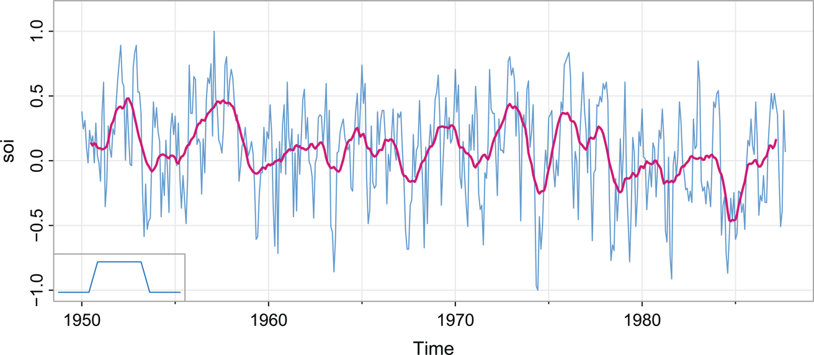

Figure 3.15: The SOI series smoothed using a seasonal moving average smoother. The insert shows the shape of the moving average kernel \[not drawn to scale\] described in [Example 3.18](#chapter3#exam3_18). [Return to text.⏎](chapter3)

\_\_\_\_\_\_\_\_\_\_\_\_\_\_\_\_\_ 3We will use the script filter. If dplyr is also loaded, see the warning in the _missing_Exercise Hints. [Return to text.⏎](#chapter3#fn3_33b)

68\. Although a moving average does a good job in highlighting the El Niño effect, it might be considered too choppy. We can obtain a smoother fit using the normal distribution for the weights instead.

Example 3.19 Kernel Smoothing [Return to text.⏎](chapter3)

Kernel smoothing is a moving average smoother that uses general weight functions, or kernels, to average the observations. [Figure 3.16](#chapter3#fig3_16) shows kernel smoothing of the SOI series, where _mt_ is now

mt\=∑i\=1nwi(t)xti,

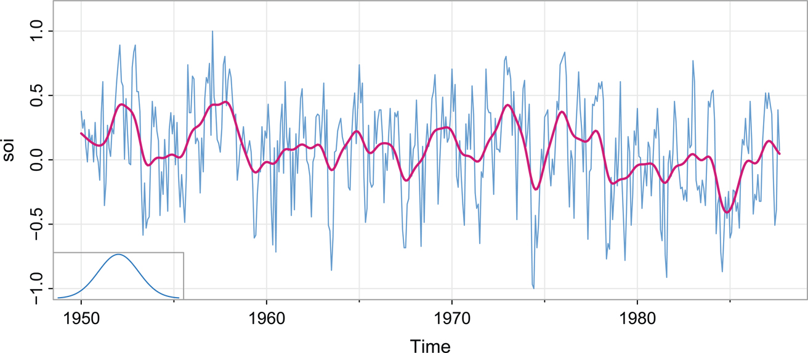

Figure 3.16: Kernel smoother of the SOI. The insert shows the shape of the normal kernel \[not drawn to scale\]. [Return to text.⏎](chapter3)

where

wi(t)\=K(t−tib)/∑k\=1nK(t−tkb)

are the weights, and K(⋅) is a kernel function. In this example, the normal kernel, K(z)\=exp(−z2/2), is used.

To implement this in R, we use the ksmooth function where a bandwidth can be chosen. Think of _b_ as standard deviation, and the bigger the bandwidth, the smoother the result. In our case, we are smoothing over time, which is of the form t/12 for soi. In [Figure 3.16](#chapter3#fig3_16), we used the value of b\=1 to correspond to approximately smoothing over about a year. The code for this example is69\. 

`**tsplot**(**soi**, col=4)`
`lines(ksmooth(time(**soi**), **soi**, "normal", bandwidth=1), lwd=2, col=6)`
`_# insert_`
`par(fig = c(0,.25,0,.25), new = TRUE, col=8)`
`curve(dnorm(x), -3, 3, xaxt="n", yaxt="n", ann=FALSE, col=4)`

We note that if the unit of time for SOI were months, then an equivalent smoother would use a bandwidth of 12:

`SOI = ts(**soi**, freq=1) _# make the unit of time a month_`
`**tsplot**(SOI, col=4)    _# not shown_`
`lines(ksmooth(time(SOI), SOI, "normal", bandwidth=12), lwd=2, col=6)`

Example 3.20 Lowess [Return to text.⏎](chapter3)

Another approach to smoothing is based on _k_\-nearest neighbor regression wherein, for k<n, one uses only the data {xt−k/2,…,xt,…,xt+k/2} to predict _xt_ via regression on time, and then sets mt\=x^t.

Lowess [(Cleveland, 1979)](#bibref1#refbib_11) is a method of smoothing that is rather complex, but the basic idea is close to nearest neighbor regression. First, a certain proportion of nearest neighbors to _xt_ are included in a weighting scheme; values closer to _xt_ in time get more weight. Then, a robust weighted regression is used to predict _xt_ and obtain the smoothed values _mt_. The larger the fraction of nearest neighbors included, the smoother the fit will be. We introduced lowess smoothing for lag plots in [Example 3.15](#chapter3#exam3_15); recall [Figure 3.12](#chapter3#fig3_12) and [Figure 3.13](#chapter3#fig3_13). In the lag plots, lowess is used to investigate nonlinear relationships between two variables (either lagged values of the same process or lagged values of a different process).

In [Figure 3.17](#chapter3#fig3_17), one smoother uses 5% of the data to obtain an estimate of the El Niño cycle of the data. In addition, a (negative) trend in SOI would indicate the long-term warming of the Pacific Ocean. To investigate this, we used trend 70\. from astsa with the default smoother span. [Figure 3.17](#chapter3#fig3_17) can be reproduced as follows.

`**trend**(**soi**, lowess=TRUE)                   _# trend (with default span)_`
`lines(lowess(soi, f=.05), lwd=2, col=6)   _# El Nio cycle_`

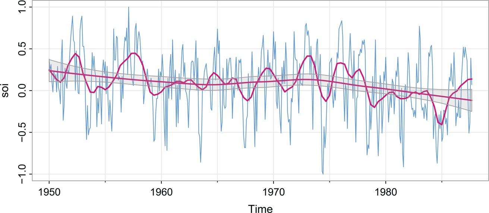

Figure 3.17: Locally weighted scatterplot smoothers (lowess) of the SOI series to emphasize trend and the El Niño cycle. [Return to text.⏎](chapter3)

Example 3.21 Smoothing One Series as a Function of Another

In addition to smoothing time plots, smoothing techniques can be applied to smoothing a time series as a function of another time series as in [Example 3.15](#chapter3#exam3_15) when we used lowess to visualize the nonlinear relationship between Recruitment and SOI at various lags.

In [Example 3.6](#chapter3#exam3_6), we discovered a nonlinear relationship between mortality and temperature. [Figure 3.18](#chapter3#fig3_18) shows a scatterplot of mortality, _Mt_, and temperature, _Tt_, along with _Mt_ smoothed as a function of _Tt_ using lowess. Note that mortality increases at extreme temperatures, but in an asymmetric way; mortality is higher at colder temperatures than at hotter temperatures. The minimum mortality rate occurs at 83.4∘ F.

`**tsplot**(**tempr**, **cmort**, type="p", col=4, xlab="Temperature", ylab="Mortality")`
`lines(lowess(**tempr**, **cmort**), col=6, lwd=2)`

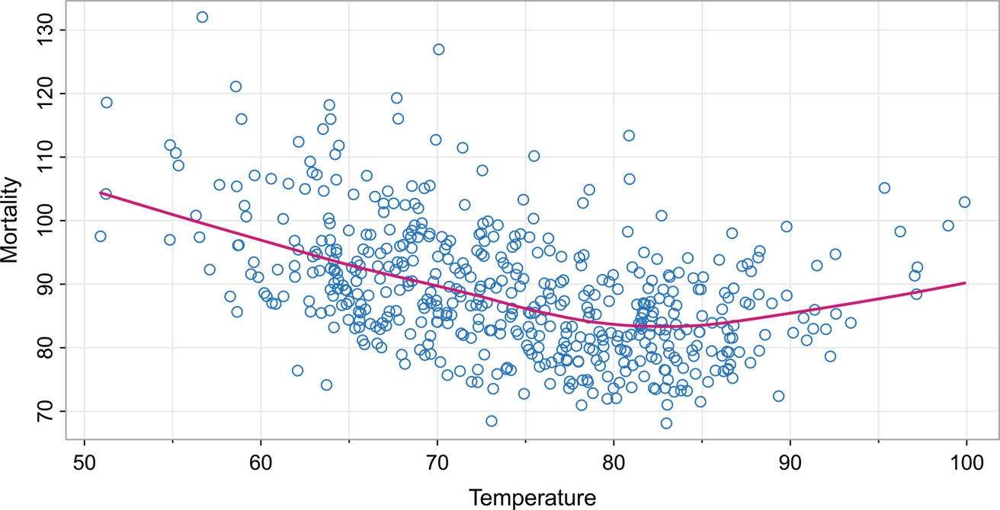

Figure 3.18: Smooth of mortality as a function of temperature using lowess. [Return to text.⏎](chapter3)

Example 3.22 Classical Structural Modeling [Return to text.⏎](chapter3)

A classical approach to time series analysis is to decompose data into components labeled trend (_Tt_), seasonal (_St_), irregular or noise (_Nt_). If we let _xt_ denote the data, we can then sometimes write

xt\=Tt+St+Nt.

71\. Of course, not all time series data fit into such a paradigm and the decomposition may not be unique. Occasionally an additional cyclic component, say _Ct_, such as a business cycle is added to the model.

[Figure 3.19](#chapter3#fig3_19) shows the result of fitting the decomposition using stl from the stats package on the quarterly occupancy rate of Hawaiian hotels from 2002 to 2016\. R provides other scripts to fit the decomposition. For example, the script decompose uses moving averages as in [Example 3.18](#chapter3#exam3_18). The script stl uses loess (which is related to lowess) to obtain each component and is similar to the approach used in [Example 3.20](#chapter3#exam3_20). To use stl, the seasonal smoothing method must be specified. That is, specify either the character string periodic or the span of the loess window for seasonal extraction. The span should be odd and at least 7 (there is no default). By using a seasonal window, we are allowing St≈St−4 rather than St\=St−4, which is forced by specifying a periodic seasonal component.

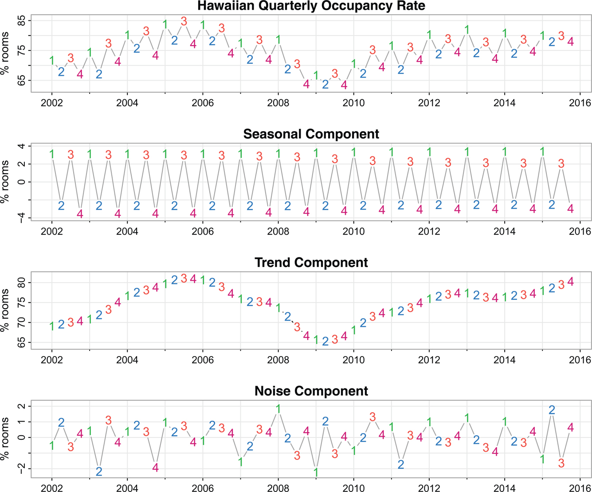

Figure 3.19: Structural model of the Hawaiian quarterly occupancy rate. [Return to text.⏎](chapter3)

Note that in [Figure 3.19](#chapter3#fig3_19), the seasonal component is very regular showing a 2% to 4% gain in the first and third quarters, while showing a 2% to 4% loss in the second and fourth quarters. The trend component is perhaps more like a business cycle than what may be considered a trend. As previously implied, the components are not well defined and the decomposition is not unique; one person's trend may be another person's business cycle. The basic R code for this example is:

`x = window(**hor**, start=2002)`
`plot(decompose(x))           _# not shown_`
`plot(stl(x, s.window="per")) _# seasons are periodic - not shown_`
`plot(stl(x, s.window=15))`

72\. A figure similar to [Figure 3.19](#chapter3#fig3_19) can be generated as follows:

`par(mfrow = c(4,1))`
`x = window(**hor**, start=2002)`
`out = stl(x, s.window=15)$time.series`
`**tsplot**(x, main="Hawaiian Occupancy Rate", ylab="% rooms", col=8, type="c")`
` text(x, labels=1:4, col=c(3,4,2,6), cex=1.25)`
`**tsplot**(out[,1], main="Seasonal", ylab="% rooms",col=8, type="c")`
` text(out[,1], labels=1:4, col=c(3,4,2,6), cex=1.25)`
`**tsplot**(out[,2], main="Trend", ylab="% rooms", col=8, type="c")`
` text(out[,2], labels=1:4, col=c(3,4,2,6), cex=1.25)`
`**tsplot**(out[,3], main="Noise", ylab="% rooms", col=8, type="c")`
` text(out[,3], labels=1:4, col=c(3,4,2,6), cex=1.25)`

## Problems

* 3.1 **(Structural Regression Model).** For the Johnson & Johnson data, _yt_, shown in [Figure 1.1](#chapter1#fig1_1), let xt\=log(yt). In this problem, we are going to fit a special 73\. type of structural model, xt\=Tt+St+Nt where _Tt_ is a trend component, _St_ is a seasonal component, and _Nt_ is noise. In our case, time _t_ is in quarters (1960.00,1960.25,…) so one unit of time is a year.  
   1. Fit the regression model  
   xt\=βt⏟trend+α1Q1(t)+α2Q2(t)+α3Q3(t)+α4Q4(t)⏟seasonal+wt⏟noise  
   where Qi(t)\=1 if time _t_ corresponds to quarter i\=1,2,3,4, and zero otherwise. The Qi(t) 's are called indicator variables. We will assume for now that _wt_ is a Gaussian white noise sequence.  
   2. If the model is correct, what is the estimated average annual increase in the logged earnings per share?  
   3. If the model is correct, does the average logged earnings rate increase or decrease from the third quarter to the fourth quarter? And, by what percentage does it increase or decrease?  
   4. What happens if you include an intercept term in the model in (a)? Explain why there was a problem.  
   5. Graph the data, _xt_, and superimpose the fitted values, x^t, on the graph. Examine the residuals, xt−x^t, and state your conclusions. Does it appear that the model fits the data well (do the residuals look white)?
* 3.2. For the mortality data examined in [Example 3.6](#chapter3#exam3_6):  
   1. Add another component to the regression in (3.13) that accounts for the particulate count four weeks prior; that is, add Pt−4 to the regression in (3.13). State your conclusion.  
   2. Using AIC and BIC, is the model in (a) an improvement over the final model in [Example 3.6](#chapter3#exam3_6)?
* 3.3. In this problem, we explore the difference between a random walk and a trend stationary process.  
   1. Generate _four_ series that are random walk with drift, (1.3), of length n\=500 with δ\=.01 and σw\=1. Call the data _xt_ for t\=1,…,500. Fit the regression xt\=βt+wt using least squares. Plot the data, the true mean function (i.e., μt\=.01 t) and the fitted line, x^t\=β^ t, on the same graph.  
   2. Generate _four_ series of length n\=500 that are linear trend plus noise, yt\=.01 t+wt, where _t_ and _wt_ are as in part (a). Fit the regression yt\=βt+wt using least squares. Plot the data, the true mean function (i.e., μt\=.01 t) and the fitted line, y^t\=β^ t, on the same graph.74\.  
   3. Comment on the differences between the results of part (a) and part (b).
* 3.4. Consider a process consisting of a linear trend with an additive noise term consisting of independent random variables _wt_ with zero means and variances σw2, that is,  
xt\=β0+β1t+wt,  
where β0,β1 are fixed constants.  
   1. Prove _xt_ is nonstationary.  
   2. Prove that the first difference series ∇xt\=xt−xt−1 is stationary by finding its mean and autocovariance function.  
   3. Repeat part (b) if _wt_ is replaced by a general stationary process, _yt_, with mean function _μy_ and autocovariance function γy(h).
* 3.5. Show that xt−xt−1 defined in (3.16) is stationary.
* 3.6. The glacial varve record plotted in [Figure 3.11](#chapter3#fig3_11) exhibits some nonstationarity that can be improved by transforming to logarithms and some additional nonstationarity that can be corrected by differencing the logarithms.  
   1. Argue that the glacial varves series, say _xt_, exhibits heteroscedasticity by computing the sample variance over the first half and the second half of the data. Argue that the transformation yt\=logxt stabilizes the variance over the series. Exhibit QQ plots of _xt_ and _yt_ to see whether the approximation to normality is improved by transforming the data.  
   2. Plot the series _yt_. Do any time intervals, of the order 100 years, exist where one can observe behavior comparable to that observed in the global temperature records in [Figure 1.4](#chapter1#fig1_4)?  
   3. Examine the sample ACF of _yt_ and comment.  
   4. Compute the difference ut\=yt−yt−1, examine its time plot and sample ACF, and argue that differencing the logged varve data produces a reasonably stationary series. Can you think of a practical interpretation for _ut_?
* 3.7. Use the three different smoothing techniques described in [Example 3.18](#chapter3#exam3_18), [Example 3.19](#chapter3#exam3_19), and [Example 3.20](#chapter3#exam3_20), to estimate the trend in the global temperature series gtemp\_land. Comment.
* 3.8. In [Section 3.3](#chapter3#sec3_3), we saw that the El Niño/La Niña cycle was approximately 4 years. To investigate whether there is a strong 4-year cycle, compare a sinusoidal (one cycle every four years) fit to the Southern Oscillation Index to a lowess fit (as in [Example 3.20](#chapter3#exam3_20)). In the sinusoidal fit, include a term for the trend. Discuss the results.75\.
* 3.9. As in [Problem 3.1](#chapter3#question3_1), let _yt_ be the raw Johnson & Johnson series shown in [Figure 1.1](#chapter1#fig1_1), and let xt\=log(yt). Use each of the techniques mentioned in [Example 3.22](#chapter3#exam3_22) to decompose the logged data as xt\=Tt+St+Nt and describe the results. If you did [Problem 3.1](#chapter3#question3_1), compare the results of that problem with those found in this problem.76 is blank.

---

