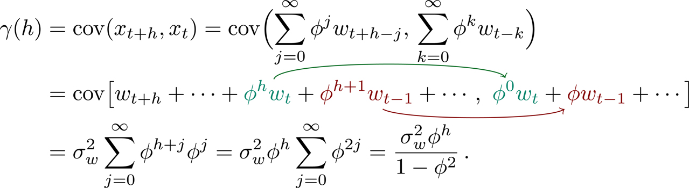
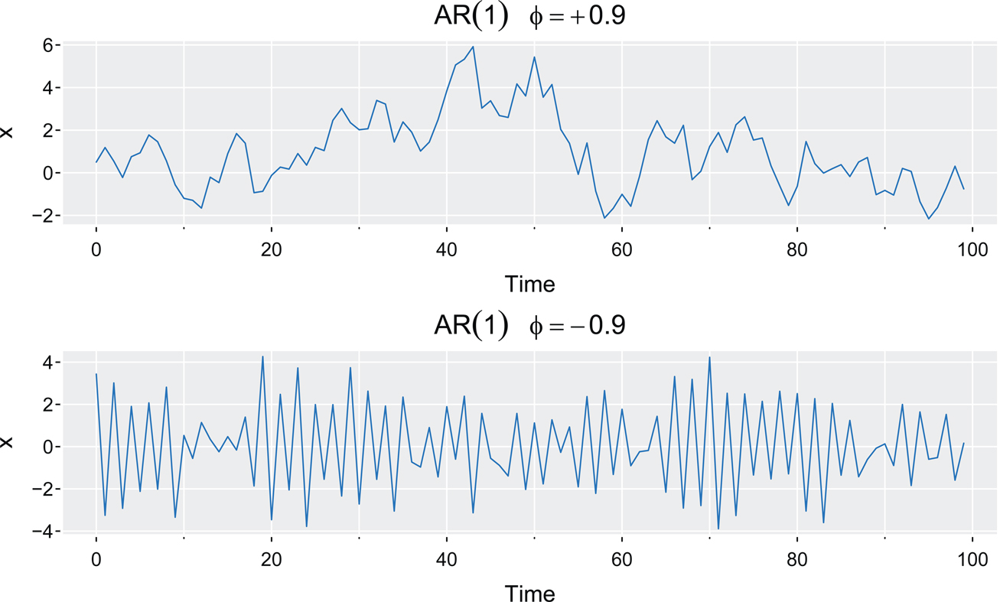
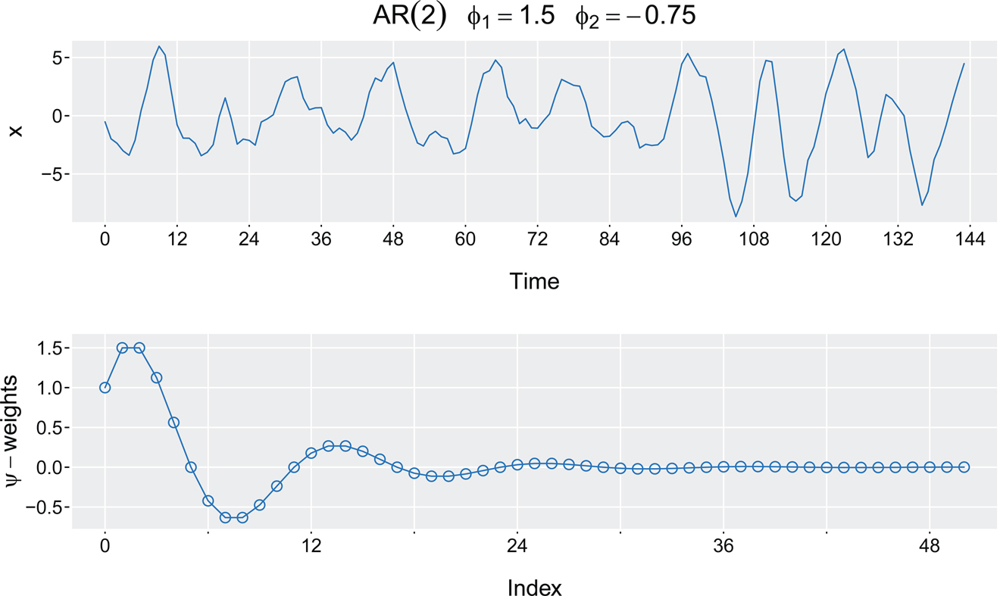
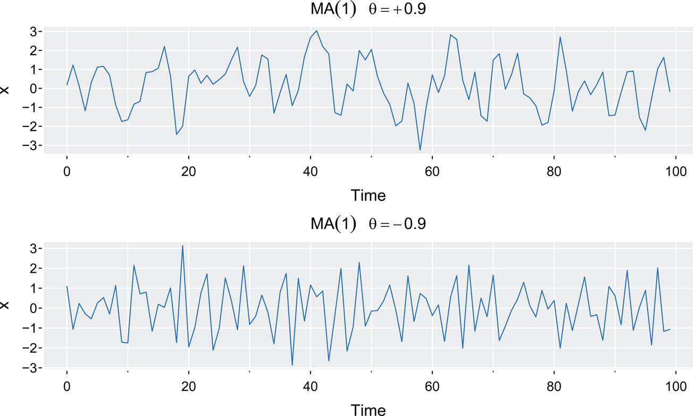
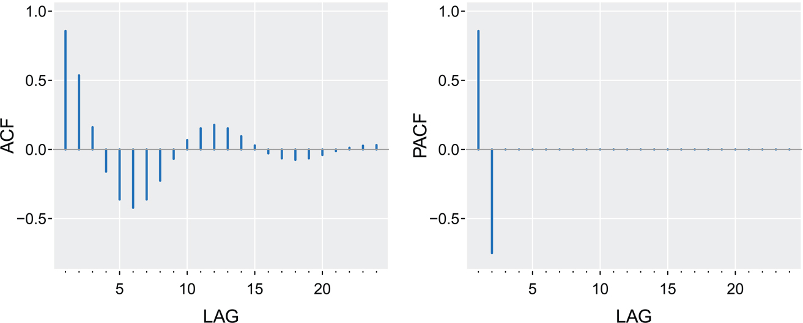
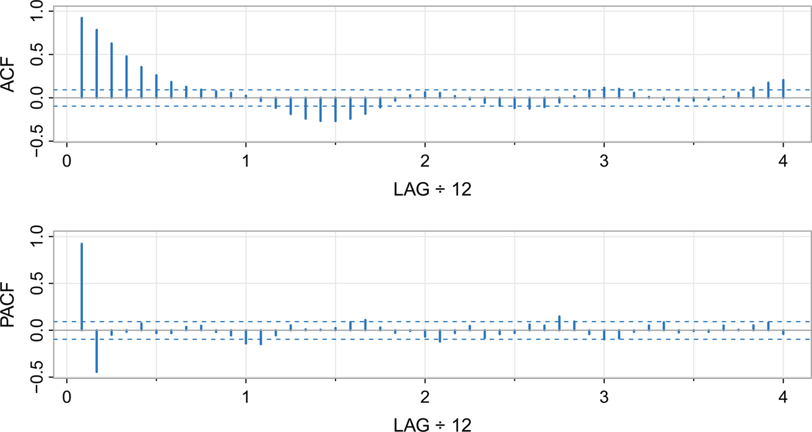
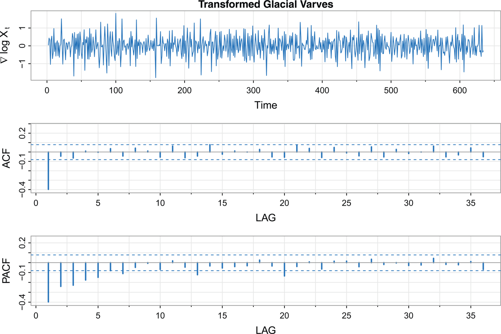
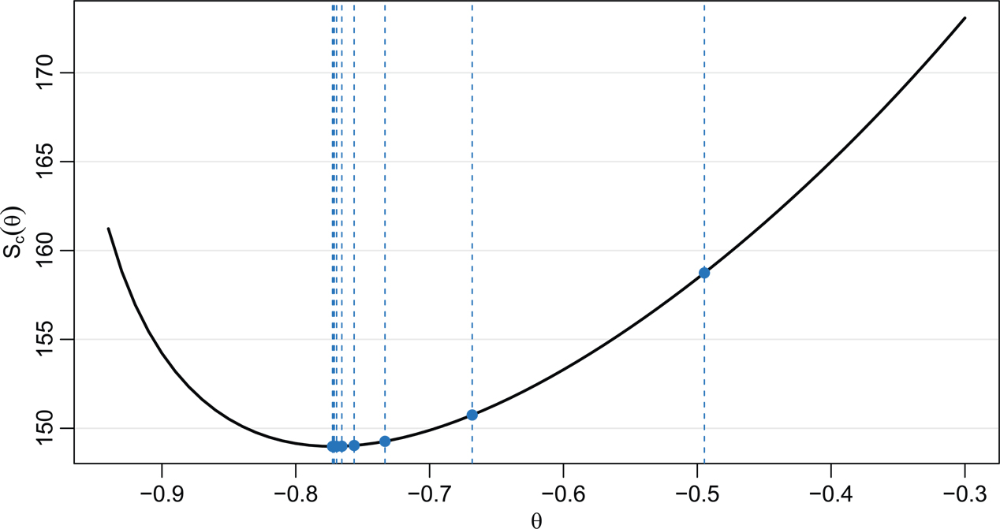
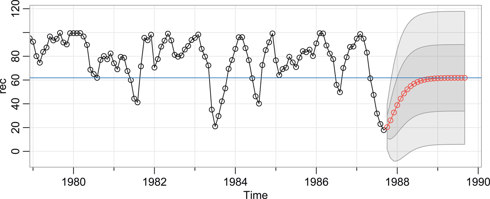
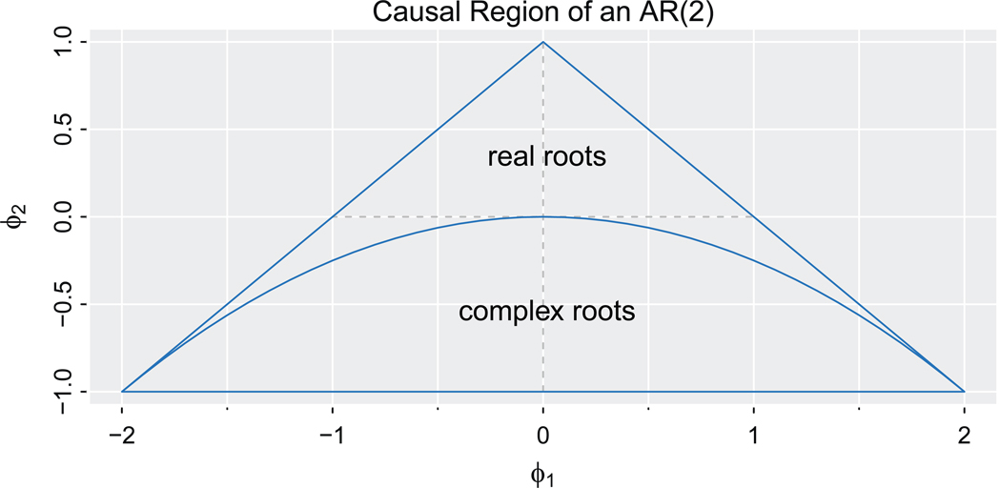

77\. 

# 4 ARMA 모델

선형 회귀 모델은 시계열의 흥미로운 동역학을 모두 설명하기에는 부족한 경우가 많습니다. 대신, 지연된 관계를 통한 상관관계의 도입은 자기회귀(AR, Autoregressive) 및 이동 평균(MA, Moving Average) 모델로 이어집니다. 이 모델들은 흔히 결합되어 자기회귀 이동 평균(ARMA, Autoregressive Moving Average) 모델을 형성하며, 이번 장에서는 이를 중점적으로 다룹니다.

## 4.1 자기회귀 모델(Autoregressive Models)

자기회귀 모델은 선형 회귀 모델의 자연스러운 확장입니다. 차수가 p인 자기회귀 모델(Autoregressive model), 줄여서 AR(p)는 다음과 같은 형태를 가집니다.

xt\=μ+ϕ1(xt−1−μ)+ϕ2(xt−2−μ)+⋯+ϕp(xt−p−μ)+wt,

여기서 xt는 정상성(Stationary)을 가지며 wt는 백색 잡음(White noise)입니다. AR 모델의 평균 함수는 E(xt)\=μ이며, 편의상 모델은 다음과 같이 작성됩니다.

xt\=α+ϕ1xt−1+⋯+ϕpxt−p+wt,

여기서 α\=μ(1−ϕ1−⋯−ϕp)입니다.

이 모델은 [Section 3.1](#chapter3#sec3_1)의 회귀 모델과 유사하며, 이로 인해 자기(auto- 또는 self-) 회귀라는 용어가 사용됩니다. 회귀 분석에서는 회귀 변수(Regressor)가 고정되어 있다고 가정하는 반면, 이 모델에서는 회귀 변수인 xt−1,…,xt−p가 무작위 성분(Random components)이기 때문에 모델을 적용할 때 기술적인 어려움이 발생합니다. 또한, 일반적으로 매개변수(Parameter) 제약이 없는 선형 회귀와 달리 AR 매개변수에는 제약이 있어야 함을 확인할 수 있습니다.

Example 4.1 AR(1) 모델과 인과성(Causality) [Return to text.⏎](chapter4)

1차, 평균이 0인 AR(1) 모델을 고려해 보겠습니다.

xt\=ϕxt−1+wt.

xt는 정상성을 가져야 하므로, ϕ\=1인 경우는 배제할 수 있습니다. 이는 xt를 확률 보행(Random walk)으로 만들며, 이는 정상성을 가지지 않음을 알고 있기 때문입니다(78\. [Example 2.14](#chapter2#exam2_14) 참조). 유사하게 ϕ\=−1인 경우도 배제할 수 있습니다. 즉, 다음 모델들은 정상성을 가지지 않으므로 AR 모델이 아닙니다.

xt\=xt−1+wt,andxt\=−xt−1+wt,

[Example 2.20](#chapter2#exam2_20)에서 보았듯이, xt가 정상성을 가진다면 xt−1과 wt가 상관관계가 없다고(Uncorrelated) 가정할 때 다음이 성립합니다.

var(xt)\=ϕ2var(xt−1)+var(wt),

여기서 var(xt−1)\=var(xt)이므로, 이는 다음을 의미합니다.

var(xt)\=γ(0)\=σw2 1(1−ϕ2).

따라서 프로세스가 양수(유한한) 분산을 가지려면 |ϕ|<1이어야 합니다. 이 결과는 ϕ가 xt와 xt−1 사이의 상관관계임을 보여준 [Example 2.20](#chapter2#exam2_20)과 일치합니다.

모델을 더 자세히 알아보기 위해, 방정식을 역방향으로 k번 반복해 볼 수 있습니다.

xt\=ϕxt−1+wt\=ϕ(ϕxt−2+wt−1⏟xt−1)+wt\=ϕ2xt−2+ϕwt−1+wt\=ϕ2(ϕxt−3+wt−2⏟xt−2)+ϕwt−1+wt\=ϕ3xt−3+ϕ2wt−2+ϕwt−1+wt⋮\=ϕkxt−k+∑j\=0k−1ϕjwt−j.

이를 무한히 계속하려면(k→∞), 이것이 의미를 가지기 위해 |ϕ|<1이어야 하며, 그러면 ϕk→0이 기하급수적으로 빠르게 성립합니다.

따라서 |ϕ|<1이라는 조건 하에 AR(1) 모델을 다음과 같이 주어지는 선형 프로세스로 나타낼 수 있습니다.

xt\=∑j\=0∞ϕjwt−j.(4.1)

표현 (4.1)은 모델의 인과적 해(Causal solution)라고 부릅니다(자세한 내용은 [Appendix 4.7](#chapter4#sec4_7) 참조). 인과성(Causal)이라는 용어는 xt가 미래에 의존하지 않는다는 사실을 나타냅니다. (4.1)을 xt\=ϕxt−1+wt에 간단히 대입하면 다음을 확인할 수 있습니다.

∑j\=0∞ϕjwt−j⏟xt\=ϕ (∑k\=0∞ϕkwt−1−k⏟xt−1)+wt.

79\. 확인 차원에서, 우변은 wt+ϕwt−1 \[k\=0\]+ϕ2wt−2 \[k\=1\]+… 입니다.

(4.1)을 사용하면, AR(1) 프로세스가 다음과 같은 평균 함수를 가지고 정상성을 가짐을 쉽게 확인할 수 있습니다.

E(xt)\=∑j\=0∞ϕjE(wt−j)\=0,

그리고 자기공분산(Autocovariance) 함수 (h≥0)는 다음과 같습니다.

(4.2) [Return to text.⏎](chapter4)

γ(h)\=γ(−h)임을 상기해 보면, h≥0에 대한 자기공분산 함수만 보여주면 됩니다. ([4.2](#chapter4#ufig4_1))에서 AR(1)의 자기상관함수(ACF)는 다음과 같습니다.

ρ(h)\=γ(h)γ(0)\=ϕh,h≥0.(4.3)

또한, 인과적 형태 (4.1)로부터 xt−1\=∑j\=0∞ϕjwt−1−j는 과거 잡음 값 wt−1,wt−2,…의 선형 필터(Linear filter)이므로 현재 값인 wt와 상관관계가 없음을 확인할 수 있습니다. 이는 필수 요건을 충족합니다. 또한, 모델의 인과적 형태를 통해 xt를 xt−μ로 대체할 경우 다음이 성립함을 쉽게 알 수 있습니다.

xt\=μ+∑j\=0∞ϕjwt−j,

따라서 평균 함수는 E(xt)\=μ가 됩니다.

Example 4.2 AR(1) 프로세스의 표본 경로(Sample Path)

[Figure 4.1](#chapter4#fig4_1)은 각각 ϕ\=.9와 ϕ\=−.9를 가지는 두 AR(1) 프로세스의 시간 도표를 보여줍니다. 두 경우 모두 σw2\=1입니다. 첫 번째 경우 h≥0에 대해 ρ(h)\=.9h이므로 시간상 가까운 관측치들은 양의 상관관계를 가집니다. 따라서 연속적인 시간점의 관측치들은 서로 비슷한 값을 가지는 경향이 있습니다. 이 사실은 [Figure 4.1](#chapter4#fig4_1)의 위쪽 도표에서 xt의 부드러운 표본 경로로 나타납니다.

Figure 4.1: 시뮬레이션된 AR(1) 모델: ϕ\=.9 (위); ϕ\=−.9 (아래). [Return to text.⏎](chapter4)

이제 이를 h≥0에 대해 ρ(h)\=(−.9)h가 되는 ϕ\=−.9인 경우와 대조해 보겠습니다. 이 결과는 연속적인 시간점의 관측치들은 음의 상관관계를 가지지만, 두 시간점 떨어진 관측치들은 양의 상관관계를 가지는 식의 패턴을 의미합니다. 이 사실은 [Figure 4.1](#chapter4#fig4_1)의 아래쪽 도표에 나타나는데, 예를 들어 관측치 xt가 양수이면 다음 관측치 xt+1은 80\. 일반적으로 음수가 되고, 그다음 관측치 xt+2는 일반적으로 양수가 됩니다. 이 경우 표본 경로는 요동치는 모습을 보입니다.

`par(mfrow=c(2,1))`
`tsplot(sarima.sim(ar= .9, n=100), main=bquote(AR(1)~~~phi==+.9), ylab="x",`
`   col=4, gg=TRUE)`
`tsplot(sarima.sim(ar=-.9, n=100), main=bquote(AR(1)~~~phi==-.9), ylab="x",`
`   col=4, gg=TRUE)`

Example 4.3. AR(p)와 인과성(Causality) [Return to text.⏎](chapter4)

[Example 4.1](#chapter4#exam4_1)에서 AR(1)이 인과적 표현을 가짐을 보았습니다. 예를 들어 xt\=.9xt−1+wt는 xt\=∑j\=0∞.9jwt−j로 작성될 수도 있습니다. 일반적인 경우에는 한 버전에서 다른 버전으로 변환하는 것이 복잡합니다. 하지만 ARMAtoMA 명령어를 사용하면 계수 중 일부를 출력할 수 있습니다.

예를 들어 다음의 AR(2) 모델은

xt\=1.5xt−1−.75xt−2+wt,

인과적 형태인 xt\=∑j\=0∞ψjwt−j로 작성될 수 있으며, 여기서 ψ0\=1이고 다음이 성립합니다.

ψj\=2(32)jcos(2π(j−2)12),j\=1,2,….

차분 방정식 이론(Difference equation theory)을 사용하여 ψ 가중치를 풀었습니다[(Shumway and Stoffer, 2025, §3.2 참조)](#bibref1#refbib_44). 이 계수들은 (월별 데이터처럼) 주기 12를 가지며 순환하지만, (3/2<1이므로) 0으로 기하급수적으로 빠르게 감소하여 과거에 대한 의존성이 짧음을 나타냅니다. [Figure 4.2](#chapter4#fig4_2)는 j\=1,…,50에 대한 81\. ψj의 도표와 모델에서 시뮬레이션된 데이터를 보여줍니다. 둘 다 이 특정 모델의 순환 형태 동작을 나타냅니다. 이처럼 선형 프로세스 형태의 모델인

Figure 4.2: 시뮬레이션된 데이터 및 AR(2), xt\=1.5xt−1−.75xt−2+wt의 ψ 가중치. [Return to text.⏎](chapter4)

xt\=∑j\=1∞2(32)jcos(2π(j−2)12)wt−j+wt,

이 식은 회귀 형태의 모델인 다음 식보다 모델에 대한 더 깊은 통찰력을 제공합니다.

xt\=1.5xt−1−.75xt−2+wt.

마지막으로 AR(p)는 MA(∞)이기도 함을 언급합니다.

모델이 인과성을 가지는지 결정하는 방법에 대한 자세한 내용은 [Section 4.7](#chapter4#sec4_7)에 설명되어 있습니다. AR(2)의 경우, 매개변수 공간(Parameter space)은 다음 주어진 조건을 만족하도록 결정될 수 있습니다.

ϕ1+ϕ2<1,ϕ2−ϕ1<1,and|ϕ2|<1.

이 인과성 조건은 삼각형 영역을 지정합니다. 자세한 내용은 [Example 4.41](#chapter4#exam4_41) 및 [Figure 4.9](#chapter4#fig4_9)를 참조하십시오. 이 예제에는 다음 코드가 사용되었습니다.

`set.seed(8675309)`
`x   = sarima.sim(ar=c(1.5,-.75), n=144, S=12)`
`psi = ts(c(1, ARMAtoMA(ar=c(1.5, -.75), ma=0, 50)), start=0, freq=12)`
`par(mfrow=c(2,1))`
`tsplot(x, main=bquote(AR(2)~~~phi[1]==1.5~~~phi[2]==-.75), col=4, xaxt="n",`
`   gg=TRUE)`
` mtext(seq(0,144,by=12), side=1, at=0:12, cex=.8)`
`tsplot(psi, col=4, type="o", ylab=bquote(psi-weights), xaxt="n", xlab="Index",`
`   gg=TRUE)`
` mtext(seq(0,48,by=12), side=1, at=0:4, cex=.8)`

82\. 이제 인과성의 개념을 공식적으로 정의합니다. 이 조건이 중요한 이유는 모델이 미래에 의존하지 않도록 보장하기 때문입니다. 이를 통해 우리는 현재와 과거만을 바탕으로 미래의 값을 예측할 수 있습니다.

Definition 4.4. [Return to text.⏎](chapter4) 시계열 xt가 다음과 같이 작성될 수 있다면 인과적(Causal)이라고 합니다.

xt\=μ+∑j\=0∞ψjwt−j

여기서 상수 ψj는 ∑j\=0∞ψj2<∞를 만족합니다.

참고사항. [Property 2.21](#chapter2#prop2_21)에 명시된 바와 같이, 모든 정상성을 가진(비결정론적) 시계열은 인과적 표현을 가집니다.

## 4.2 이동 평균 모델(Moving Average Models)

차수가 q인 이동 평균 모델(Moving average model), 또는 MA(q)는 다음과 같이 정의됩니다.

xt\=μ+wt+θ1wt−1+θ2wt−2+⋯+θqwt−q,

여기서 wt는 백색 잡음입니다.[1](#chapter4#fn4_1) 자기회귀 프로세스와 달리 이동 평균 프로세스는 매개변수 θ1,…,θq의 값에 관계없이 정상성을 가지며 E(xt)\=μ입니다. 또한, MA(q)는 ψj\=θj이고 j\>q에 대해 θj\=0인 [Definition 4.4](#chapter4#defi4_4)의 인과적 형태를 이미 취하고 있습니다.

Example 4.5 MA(1) 프로세스 [Return to text.⏎](chapter4)

MA(1) 모델 xt\=wt+θwt−1을 고려해 보겠습니다. 잡음 wt를 시점 t에서의 프로세스에 대한 무작위 "충격(Shock)"이라고 생각하십시오. 오늘 일어나는 일이 어제의 충격과 관련될 수도 있다고 짐작할 수 있습니다.

E(xt)\=0이며, xt를 xt−μ로 대체하면 E(xt)\=μ가 됩니다. 자기공분산 함수는 다음과 같습니다.

γ(h)\={(1+θ2)σw2h\=0,θσw2|h|\=1,0|h|\>1,

\_\_\_\_\_\_\_\_\_\_\_\_\_\_\_\_\_ 1일부 문헌 및 소프트웨어 패키지에서는 MA 모델을 음수 계수로 작성합니다. 즉, xt\=μ+wt−θ1wt−1−θ2wt−2−⋯−θqwt−q와 같이 표기합니다. R은 양수 계수를 사용하지만, 다른 소프트웨어를 사용할 때에는 먼저 확인하십시오. [Return to text.⏎](#chapter4#fn4_14b)

83\. 그리고 자기상관함수(ACF)는 다음과 같습니다.

ρ(h)\={θ(1+θ2)|h|\=1,0|h|\>1.

모든 θ 값에 대해 |ρ(1)|≤1/2임에 유의하십시오(Problem 4.1). 또한, xt는 xt−1과는 상관관계가 있지만 xt−2,xt−3,…와는 상관관계가 없습니다. 이를 xt와 xt−k 사이의 상관관계가 절대 0이 되지 않는 AR(1) 모델의 경우와 대조해 보십시오. 예를 들어 θ\=.9일 때 xt와 xt−1은 양의 상관관계를 가지며 ρ(1)\=.497입니다. θ\=−.9일 때 xt와 xt−1은 음의 상관관계를 가지며 ρ(1)\=−.497입니다. [Figure 4.3](#chapter4#fig4_3)은 σw2\=1인 두 프로세스의 시간 도표를 보여줍니다. θ\=.9인 계열이 θ\=−.9인 계열보다 부드럽습니다.

`par(mfrow = c(2,1))`
`tsplot(sarima.sim(ma= .9, n=100), main=bquote(MA(1)~~~theta==+.9), col=4,`
`   ylab="x", gg=TRUE)`
`tsplot(sarima.sim(ma=-.9, n=100), main=bquote(MA(1)~~~theta==-.9), col=4,`
`   ylab="x", gg=TRUE)`

Figure 4.3: 시뮬레이션된 MA(1) 모델: θ\=.9 (위); θ\=−.9 (아래). [Return to text.⏎](chapter4)

Example 4.6 MA 모델의 비유일성(Non-uniqueness)과 가역성(Invertibility)

[Example 4.5](#chapter4#exam4_5)를 통해, MA(1) 모델에서 σw2\=1이고 θ\=5인 쌍이 σw2\=25이고 θ\=1/5인 쌍과 동일한 자기공분산 함수를 생성함을 알 수 있습니다. 즉,

γ(h)\={26h\=0,5|h|\=1,0|h|\>1.

84\. 따라서 다음 두 MA(1) 프로세스는

xt\=wt+15wt−1,wt∼iid N(0,25)

그리고

yt\=vt+5vt−1,vt∼iid N(0,1)

확률적으로 동일합니다. 우리는 잡음인 wt나 vt를 관측할 수 없고 시계열인 xt나 yt만 관측할 수 있으므로, 모델을 구별할 수 없습니다. 그러므로 우리는 둘 중 하나만 선택해야 합니다. 편의를 위해 우리는 무한 AR 표현을 가지는 모델을 선택합니다. 이러한 프로세스를 가역적(Invertible)이라고 부릅니다.

어떤 모델이 가역적인 모델인지 확인하기 위해, xt와 wt의 역할을 뒤바꾸어 MA(1) 모델을 다음과 같이 작성해 볼 수 있습니다.

wt\=−θwt−1+xt.

(4.1)에서와 같이, |θ|<1이면 다음이 성립합니다.

wt\=∑j\=0∞(−θ)jxt−j,

이것이 바로 원하는 모델의 무한 표현입니다. 따라서 선택권이 주어지면, 가역성을 가지기 때문에 σw2\=25이고 θ\=1/5인 모델을 선택할 것입니다.

이제부터 유일성을 위해 이동 평균이 가역적인 표현을 가지도록 요구할 것입니다.

Definition 4.7. [Return to text.⏎](chapter4) 시계열 xt가 다음과 같이 작성될 수 있다면 가역적(Invertible)이라고 합니다.

wt\=∑j\=0∞πjxt−j.

여기서 상수 πj는 ∑j\=0∞πj2<∞를 만족하며, π0\=1입니다.

참고사항. 유일성 문제와는 별개로, 가역성이 중요한 이유는 현재 충격 wt를 현재와 과거 데이터의 관점에서 표현하게 해 주기 때문입니다. 결과적으로 시스템에 대한 현재 충격은 미래에 의존하지 않으므로 데이터가 주어지면 이를 추정할 수 있습니다. 또한, MA(q)는 AR(∞)임을 유의하십시오. 모델을 다음과 같이 작성할 수 있기 때문입니다.

xt\=−∑j\=1∞πjxt−j+wt.

## 4.3 85\. 자기회귀 이동 평균 모델(Autoregressive Moving Average Models)

이제 정상성을 가지는 시계열을 위한 혼합형 자기회귀 이동 평균(ARMA) 모델의 일반적인 전개를 진행합니다.

Definition 4.8. 시계열 {xt}는 다음의 경우 ARMA(p,q)입니다.

xt\=α+ϕ1xt−1+⋯+ϕpxt−p+wt+θ1wt−1+⋯+θqwt−q,

여기서 wt∼wn(0,σw2), ϕp≠0, θq≠0이며 모델은 인과적이고 가역적입니다. 만약 E(xt)\=μ라면, α\=μ(1−ϕ1−⋯−ϕp)입니다.

ARMA 모델은 연관된 오차가 있는 상태에서 현재 xt를 과거 xt−1,…,xt−p에 대해 회귀 분석하는 것으로 볼 수 있습니다. 즉,

xt\=β0+β1xt−1+⋯+βpxt−p+ϵt,

여기서

ϵt\=wt+θ1wt−1+⋯+θqwt−q,

우리는 회귀 매개변수를 β 대신 ϕ라고 부릅니다. 일반적인 회귀와 달리, 인과성을 얻기 위해 ϕ 매개변수는 특정 값으로 제한되며, 가역성을 얻기 위해 θ 매개변수 또한 특정 값으로 제한됩니다.

모델을 더 잘 이해하기 위해, 먼저 [Definition 3.10](#chapter3#defi3_10)에 정의된 후진이동 연산자(Backshift operator)인 Bkxt\=xt−k를 기반으로 표기법을 설정합니다. 후진이동 연산자를 사용하면 평균이 0인 AR(p) 모델을 다음과 같이 작성할 수 있습니다.

(1−ϕ1B−ϕ2B2−⋯−ϕpBp)xt\=wt.

따라서 자기회귀 연산자(Autoregressive operator)를 다음과 같이 정의하는 것이 편리합니다.

ϕ(B)\=1−ϕ1B−ϕ2B2−⋯−ϕpBp.

따라서 AR 모델은 다음과 같습니다.

ϕ(B)xt\=wt.

AR(p)의 경우와 마찬가지로 평균이 0인 MA(q) 모델은 다음과 같이 작성될 수 있습니다.

xt\=(1+θ1B+θ2B2+⋯+θqBq)wt,

따라서 이동 평균 연산자(Moving average operator)를 다음과 같이 정의합니다.

θ(B)\=1+θ1B+θ2B2+⋯+θqBq

그리고 MA(q) 모델을 다음과 같이 작성합니다.

xt\=θ(B)wt.

86\. 결과적으로 일반적인 ARMA(p,q) 모델은 다음과 같이 간결하게 작성될 수 있습니다.

ϕ(B)(xt−μ)\=θ(B)wt,(4.4)

여기서 ϕ(B)와 θ(B)의 차수는 각각 p와 q로 이해됩니다.

형태 (4.4)는 동역학을 변경하지 않고 양변에 다른 연산자를 곱하여 ARMA(p,q) 모델을 불필요하게 복잡하게 만들 수 있다는 문제점을 시사합니다.

η(B)ϕ(B)(xt−μ)\=η(B)θ(B)wt,

이는 매개변수 중복(Parameter redundancy)이라고 불립니다.

Example 4.9 매개변수 중복(Parameter Redundancy) [Return to text.⏎](chapter4)

백색 잡음 프로세스 xt\=wt를 고려해 보겠습니다. 이제 방정식의 양변에 (1−.9B)를 곱하면 다음과 같습니다.

(1−.9B)xt\=(1−.9B)wt,

또는

xt−.9xt−1\=wt−.9wt−1,

또는

xt\=.9xt−1−.9wt−1+wt,(4.5)

이 식은 ARMA(1,1) 모델처럼 보입니다. 물론 xt는 여전히 백색 잡음이며, 이 점에서는 아무것도 바뀌지 않았습니다\[즉, xt\=wt는 (4.5)의 해입니다]. 그러나 매개변수 중복 또는 과도한 매개변수화(Overparameterization)로 인해 xt가 백색 잡음이라는 사실을 숨기게 되었습니다.

[Example 4.9](#chapter4#exam4_9)는 데이터에 ARMA 모델을 피팅(Fitting)할 때 주의해야 할 필요성을 지적합니다. 불행히도 데이터에 지나치게 복잡한 ARMA 모델을 피팅하기 쉽습니다. 예를 들어, 프로세스가 진정으로 백색 잡음이라면 데이터에 유의미한 ARMA(k,k) 모델을 피팅하는 것이 가능합니다. 다음 예제를 살펴보겠습니다.

Example 4.10 매개변수 중복과 추정(Estimation) [Return to text.⏎](chapter4)

아직 추정에 대해 논의하지는 않았지만, 문제에 대한 다음과 같은 시연을 제시합니다. μ\=5이고 σ\=1인 150개의 iid(독립 항등 분포) 정규 분포를 생성한 다음, 데이터에 ARMA(p\=1,q\=1)을 피팅했습니다.

`set.seed(8675309)                    # Jenny, I got your number`
`x = rnorm(150, mean=5)               # generate iid N(5,1)s`
`sarima(x, p=1, q=1, details=FALSE)   # estimation`
`        Estimate    SE t.value p.value`
`  ar1     -0.960 0.169 -5.685        0`
`  ma1      0.953 0.175   5.444       0`
`  xmean    5.046 0.073 69.391        0`
` sigma^2 estimated as 0.799 on 147 degrees of freedom`

87\. 따라서 추정된 모델은 다음과 같습니다.

(1+.960B)(x^t−5.046)\=(1+.953B)w^t,

따라서 ϕ^(B)≈θ^(B)가 성립합니다. 당연히 데이터는 백색 잡음이지만, 추정 결과는 데이터가 높은 의존성을 가진다는 겉보기에 다른 결과를 암시합니다.

이 예제는 기본적인 이론을 모른 채 계산 방법에 의존하는 문제점을 지적합니다. 소프트웨어는 답변을 제공하지만, 사용자가 올바른 질문을 하고 있는지는 알지 못합니다.

이후부터 우리는 ARMA 모델이 가장 단순한 형태로 축소될 것을 요구할 것입니다. 모델에 이 문제가 존재하는지 확인하는 간단한 방법은 AR 부분을 왼쪽에, MA 부분을 오른쪽에 두고 양변을 비교하는 것입니다.

Example 4.11 매개변수 중복 확인 [Return to text.⏎](chapter4)

이전 예제에서는 좌변과 우변이 거의 동일하다는 것을 쉽게 알 수 있었습니다. 좀 더 복잡한 모델의 경우 R을 사용하여 양변을 비교할 수 있습니다. 예를 들어 다음 모델을 살펴보겠습니다.

xt\=.3xt−1+.4xt−2+wt+.5wt−1,

이 모델은 ARMA(2,1)처럼 보입니다. 이제 모델을 다음과 같이 작성해 보겠습니다.

(1−.3B−.4B2)xt\=(1+.5B)wt,

또는

(1+.5B)(1−.8B)xt\=(1+.5B)wt.

양변에서 (1+.5B)를 상쇄할 수 있으므로, 모델은 실제로는 AR(1)입니다.

xt\=.8xt−1+wt.

이러한 상황은 양변에 해당하는 B의 다항식의 근(Roots 또는 Zeros)을 살펴보면 쉽게 확인할 수 있습니다. 근이 서로 가깝다면 매개변수 중복이 있을 수 있습니다.

`AR = c(1, -.3, -.4) # original AR coefs on the left`
`polyroot(AR)`
` [1] 1.25-0i -2.00+0i`
`MA = c(1, .5)       # original MA coefs on the right`
`polyroot(MA)`
` [1] -2+0i`

이는 (근이 −2인) 하나의 공통 인수(Common factor)가 있음을 나타내며, 따라서 모델이 과도하게 매개변수화되어 축소될 수 있음을 의미합니다.

Example 4.12 88\. 인과적이고 가역적인 ARMA [Return to text.⏎](chapter4)

때로는 ARMA 모델을 인과적 또는 가역적 형태로 작성하는 것이 유용할 수 있습니다. 예를 들어 다음 모델을 고려해 보겠습니다.

xt\=.8xt−1+wt−.5wt−1.

ARMA(1,1) 모델의 인과적 및 가역적 계수 중 일부를 다음과 같이 나열할 수 있습니다.

`round( ARMAtoMA(ar=.8, ma=-.5, 10),   2)   # first 10 ψ-weights`
`  [1] 0.30 0.24 0.19 0.15 0.12 0.10   0.08 0.06 0.05 0.04`
`round( ARMAtoAR(ar=.8, ma=-.5, 10),   2) # first 10 π-weights`
`  [1] -0.30 -0.15 -0.08 -0.04 -0.02   -0.01 0.00 0.00 0.00 0.00`

따라서 인과적 형태는 다음과 같습니다 (ψ0\=1).

xt\=wt+.3wt−1+.24wt−2+.19wt−3+⋯+.05wt−9+.04wt−10+⋯,

반면 가역적 형태는 다음과 같습니다 (π0\=1).

wt\=xt−.3xt−1−.15xt−2−.08xt−3−.04xt−4−.02xt−5−.01xt−6+⋯.

모델이 인과적이거나 가역적이지 않으면 스크립트는 작동하지만 계수는 0으로 수렴하지 않습니다. 확률 보행 xt\=xt−1+wt 또는 xt\=∑j\=1twj의 경우를 예로 들면 다음과 같습니다.

`ARMAtoMA(ar=1, ma=0, 20)`
` [1] 1 1 1 1 1 1 1 1 1 1 1 1 1 1 1 1 1 1 1 1`

Example 4.13 인과적이고 가역적인 ARMA (계속)\*

인과적이고 가역적인 형태가 어떻게 결정되는지 알아보기 위해, [Example 4.12](#chapter4#exam4_12)의 모델을 살펴보겠습니다.

(1−.8B)xt\=(1−.5B)wt.(4.6)

B를 숫자처럼 취급하여, 양변을 (1−.8B)로 나누어 인과적 형태를 얻을 수 있습니다.

xt\=(1−.5B)(1−.8B)wt.

이제 AR 부분을 거듭제곱 급수(Power series)인 1/(1−.8B)\=∑j\=0∞(.8B)j로 전개하면 다음과 같습니다.

xt\=(1−.5B)(1+.8B+.82B2+.83B3+…)wt.

B에 대한 항들을 모아보면, (4.6)은 다음과 같이 작성될 수 있음을 알 수 있습니다.

xt\=wt+.3∑j\=1∞.8j−1wt−j.

89\. 따라서 이전 예제에서 `ARMAtoMA(ar=.8, ma=-.5, 10)`는 단순히 .3\*.8^(0:9)를 반환하는 것입니다. 가역적 형태도 비슷하게 결정됩니다.

(1−.8B)(1−.5B)xt\=wt,

또는

wt\=xt−.3∑j\=1∞.5j−1xt−j.

따라서 이전 예제에서 `ARMAtoAR(ar=.8, ma=-.5, 10)`는 단순히 -.3\*.5^(0 :9)를 반환하는 것입니다.

## 4.4 상관 함수(Correlation Functions)

이 절에서는 ARMA 모델의 자기상관함수에 대해 논의하고 부분 자기상관(Partial autocorrelation) 개념을 소개합니다.

### 자기상관함수 (acf, Autocorrelation Function)

Example 4.14 MA(q)의 자기상관함수(ACF) [Return to text.⏎](chapter4)

모델을 θ0\=1인 xt\=∑j\=0qθjwt−j로 작성하겠습니다. xt는 백색 잡음 항들의 유한한 선형 결합(Linear combination)이므로, 해당 프로세스는 다음과 같은 자기공분산 함수를 가지고 정상성을 가집니다.

γ(h)\=cov(xt+h,xt)\=cov(∑j\=0qθjwt+h−j, ∑k\=0qθkwt−k)\={σw2∑j\=0q−hθjθj+h,0≤h≤q0h\>q,(4.7)

이는 (2.7)의 계산과 비슷합니다. 지연(Lag) q 이후에 γ(h)가 절단(Cutting off)되는 것은 MA(q) 모델의 특징입니다. (4.7)을 γ(0)으로 나누면 MA(q)의 ACF가 산출됩니다.

ρ(h)\={∑j\=0q−hθjθj+h1+θ12+⋯+θq21≤h≤q0h\>q.(4.8)

또한, h\=q일 때 (4.8)의 분자는 θ0 θq\=θq≠0이므로 (θ0\=1임을 상기하십시오) ρ(q)≠0이라는 점에 유의해야 합니다.

Example 4.15 90\. AR(p) 및 ARMA(p,q)의 ACF

AR(p) 또는 ARMA(p,q) 모델의 경우, 모델을 다음과 같은 인과적 MA(∞) 형태로 작성합니다.

xt\=∑j\=0∞ψjwt−j.

그 결과로, xt의 자기공분산 함수를 다음과 같이 작성할 수 있음을 곧바로 알 수 있습니다.

γ(h)\=cov(xt+h,xt)\=σw2∑j\=0∞ψj+hψj,h≥0,

이는 (2.7)에서 계산된 바와 같습니다. ACF는 다음과 같이 주어집니다.

ρ(h)\=γ(h)γ(0)\=∑j\=0∞ψj+hψj∑j\=0∞ψj2,h≥0.(4.9)

MA(q)와 달리 AR(p) 또는 ARMA(p,q)의 ACF는 어떠한 지연(Lag)에서도 절단되지 않으므로, ACF를 사용하여 AR이나 ARMA의 차수를 식별하는 데 도움을 받는 것은 어렵습니다.

결과 (4.9)는 다양한 모델의 ACF 형태에 대해 거의 정보를 제공하지 않는다는 점에서 매력적이지 않습니다. 하지만 특정 모델에 대해 어떤 일이 일어나는지 확인할 수는 있습니다.

Example 4.16 AR(2)의 ACF [Return to text.⏎](chapter4)

[Figure 4.2](#chapter4#fig4_2)는 다음 AR(2) 모델에서 얻은 n\=144개의 관측치를 보여줍니다.

xt\=1.5xt−1−.75xt−2+wt,

여기서 σw2\=1입니다. [Example 4.3](#chapter4#exam4_3)에서 이 모델을 살펴보며 해당 프로세스가 12시간점마다 한 번씩 순환하는 주기를 가지는 유사 순환(Pseudo-cyclic) 동작을 보인다는 점에 주목했습니다. ψ 가중치가 순환적이므로 모델의 ACF 또한 주기 12를 가지며 순환적일 것입니다. 이 모델에 대한 ACF의 처음 50개 값을 계산하고 도표화하는 코드는 다음과 같습니다.

`plot(ARMAacf(ar=c(1.5,-.75), lag.max=50), type="h"); abline(h=0, col=8)`

[Figure 4.4](#chapter4#fig4_4)의 왼쪽에 ACF를 표시한 [Example 4.19](#chapter4#exam4_19)에서 이를 더 자세히 논의합니다.

Figure 4.4: ϕ1\=1.5 및 ϕ2\=−.75인 AR(2) 모델의 P/ACF. [Return to text.⏎](chapter4)

AR(p) 또는 ARMA(p,q)의 일반적인 ACF 동작은 AR 부분에 의해 제어됩니다. MA 부분은 유한한 영향력만 가지기 때문입니다.

Example 4.17 91\. ARMA(1,1)의 ACF

ARMA(1,1) 프로세스 xt\=ϕxt−1+θwt−1+wt를 고려해 보겠습니다. 차분 방정식 이론을 사용하면 ACF가 다음과 같이 주어짐을 보일 수 있습니다.

ρ(h)\=(1+θϕ)(ϕ+θ)ϕ(1+2θϕ+θ2) ϕh,h≥1.

ρ(h)의 일반적인 패턴이 (4.3)에서 주어진 AR(1)의 패턴, 즉 ρ(h)\=ϕh와 다르지 않다는 점에 유의하십시오. 따라서 표본에서 추정된 ACF만을 기반으로 ARMA(1,1)과 AR(1)의 차이를 구별할 수 있을 가능성은 희박합니다([Problem 4.4](#chapter4#question4_4) 참조). 이러한 고려를 통해 우리는 부분 자기상관함수로 나아가게 됩니다.

### 부분 자기상관함수 (pacf, Partial Autocorrelation Function)

[Example 4.14](#chapter4#exam4_14)에서 우리는 MA(q) 모델의 경우 q보다 큰 지연(Lag)에 대해 ACF가 0이 된다는 것을 확인했습니다. 또한, θq≠0이므로 지연 q에서 ACF는 0이 아닙니다. 따라서 해당 프로세스가 이동 평균 프로세스일 때 ACF는 의존성의 차수에 대한 상당한 양의 정보를 제공합니다.

그러나 해당 프로세스가 ARMA나 AR일 경우, ACF만으로는 의존성의 차수에 대해 거의 알 수 없습니다. 따라서 MA 모델의 ACF처럼 행동하면서도 AR 모델에 적합한 함수, 즉 부분 자기상관함수(PACF, Partial autocorrelation function)를 추구할 가치가 있습니다.

X, Y, 그리고 Z\={Z1,…,Zk}가 확률 변수일 때, Z가 주어졌을 때 X와 Y 사이의 부분 상관관계는 다음과 같이 구해짐을 상기해 보십시오. X를 Z에 대해 회귀시켜 예측값 X^를 얻고, Y를 Z에 대해 회귀시켜 예측값 Y^를 얻은 다음, 다음 식을 계산합니다.

ρXY|Z\=corr{X−X^, Y−Y^}.

기본 개념은 ρXY|Z가 Z1,…,Zk의 선형 효과가 제거된(또는 부분화된) 상태에서 X와 Y 사이의 상관관계를 측정한다는 것입니다. 변수들이 다변량 정규 분포(Multivariate normal)를 따른다면, 이 정의는 ρXY|Z\=corr(X,Y∣Z)와 일치합니다.

부분 자기상관(Partial autocorrelation)의 개념을 도출하기 위해, 인과적 AR(1) 모델 xt\=ϕxt−1+wt를 고려해 보겠습니다. 그러면 다음과 같습니다.

γx(2)\=cov(xt,xt−2)\=cov(ϕxt−1+wt,xt−2)\=cov(ϕxt−1,xt−2)\=ϕγx(1),

여기서 γx(h)는 ([4.2](#chapter4#ufig4_1))에 주어져 있습니다. xt−2는 wt와 상관관계가 없는 {wt−2, wt−3,…}를 포함하므로 인과성에 의해 cov(wt,xt−2)\=0이 됨에 유의하십시오. xt는 xt−1을 통해 xt−2에 의존하기 때문에 MA(1)의 경우처럼 xt와 xt−2 사이의 상관관계는 0이 아닙니다.

92\. 이제 xt와 xt−2에 대한 xt−1의 선형 효과를 제거하여 이 의존성 사슬을 끊는다고 가정해 보겠습니다. 즉, 다음의 평균 제곱 오차(Mean squared error)를 최소화하는 계수 a와 b를 찾습니다.

E(xt−axt−1)2andE(xt−2−bxt−1)2.

a와 b에 대해 미분을 수행하고 그 결과를 0으로 설정하면 다음과 같습니다.

E\[(xt−axt−1)xt−1\]\=0andE\[(xt−2−bxt−1)xt−1\]\=0,

또는

γx(1)−aγx(0)\=0andγx(1)−bγx(0)\=0,

γx(−1)\=γx(1)이므로, 결과는 다음과 같습니다.

a\=b\=γx(1)/γx(0)\=ρx(1)\=ϕ

이는 AR(1)의 경우입니다\[(4.3) 상기].

이런 방식으로 우리는 xt와 xt−2 사이의 의존성 사슬을 끊었습니다.

cov(xt−ϕxt−1,xt−2−ϕxt−1)\=cov(wt,xt−2−ϕxt−1)\=0,

이는 인과성에 기인합니다(xt−2와 xt−1은 wt와 상관관계가 없는 wt−1,wt−2,…에만 의존합니다). 따라서 우리에게 필요한 도구는 부분 자기상관(Partial autocorrelation)입니다. 이는 "중간에 있는" 모든 것의 선형 효과가 제거된 상태에서 xs와 xt 사이의 상관관계를 의미합니다.

Definition 4.18. 정상성을 가지는 프로세스 xt의 부분 자기상관함수(PACF, Partial autocorrelation function)는 h\=1,2,…에 대해 ϕhh로 표기하며, 다음과 같습니다.

ϕ11\=corr(x1,x0)\=ρ(1)

그리고

ϕhh\=corr(xh−x^h, x0−x^0),h≥2,

여기서 x^0와 x^h는 {x1,x2,…,xh−1}에 대한 x0와 xh의 회귀입니다.

따라서 정상성으로 인해, h\>1일 때 PACF인 ϕhh는 xt+h와 xt 사이의 상관관계로서, 이들 사이에 있는 모든 것, 즉 {xt+1,…,xt+h−1}의 선형 의존성이 각각에서 제거된 상태를 의미합니다.

더빈-레빈슨 알고리즘(Durbin-Levinson algorithm)을 사용하여 값을 재귀적으로 계산할 수 있으므로 PACF를 추정하기 위해 실제로 회귀를 실행할 필요는 없습니다[(예: Shumway and Stoffer, 2025, ch. 3 참조)](#bibref1#refbib_44).

Example 4.19 AR(p)의 PACF [Return to text.⏎](chapter4)

AR(p) 모델의 PACF는 p보다 큰 모든 지연에 대해 0이 될 것이며, 지연 p에서의 PACF는 0이 아닐 것입니다. 왜냐하면 ϕpp\=ϕp(모델의 마지막 매개변수)임을 증명할 수 있기 때문입니다.

93\. [Example 4.16](#chapter4#exam4_16)에서 우리는 다음 AR(2) 모델을 살펴보았습니다.

xt\=1.5xt−1−.75xt−2+wt.

이 경우 ϕ11\=ρ(1)\=ϕ1/(1−ϕ2)\=1.5/1.75≈.86, ϕ22\=ϕ2\=−.75이며 h\>2에 대해 ϕhh\=0입니다. [Figure 4.4](#chapter4#fig4_4)는 이 AR(2) 모델의 ACF와 PACF를 보여줍니다.

`ACF = ARMAacf(ar=c(1.5,-.75), ma=0, 24)[-1]`
`PACF = ARMAacf(ar=c(1.5,-.75), ma=0, 24, pacf=TRUE)`
`par(mfrow=1:2)`
`tsplot(ACF, type="h", xlab="LAG", ylim=c(-.8,1), col=4, las=1, gg=TRUE)`
`abline(h=0, col=8)`
`tsplot(PACF, type="h", xlab="LAG", ylim=c(-.8,1), col=4, las=1, gg=TRUE)`
`abline(h=0, col=8)`

Example 4.20 MA(q)의 PACF

가역적인 MA(q) 모델은 다음과 같은 AR(∞) 표현을 가짐을 상기해 보십시오.

xt\=−∑j\=1∞πjxt−j+wt.

또한, 유한한 표현은 존재하지 않습니다. 이 결과로부터 AR 모델의 경우처럼 PACF가 절대 절단되지 않을 것임이 분명합니다. |θ|<1인 MA(1) 프로세스 xt\=wt+θwt−1에 대해, 다음이 성립함을 증명할 수 있습니다.

ϕhh\=−(−θ)h(1−θ2)1−θ2(h+1),h≥1.

또한 PACF에 대해 다음과 같은 대표본 결과(Large sample result)를 얻을 수 있으며, 이는 [Property 2.28](#chapter2#prop2_28)에 주어진 ACF에 대한 유사한 결과와 비교해 볼 수 있습니다. 94\.

Property 4.21 (PACF – 대표본 분포). 시계열이 AR(p)이고 표본 크기 n이 큰 경우, 표본 부분 자기상관은 근사적으로 독립적인 정규 분포를 따릅니다.

ϕ^hh∼⋅N(0,1n)forh\>p.

이 결과는 프로세스가 백색 잡음인 p\=0인 경우에도 성립합니다.

따라서 표본 PACF는 일반적으로 ±2/n 경계선과 함께 그려집니다.

MA 모델의 PACF는 AR 모델의 ACF와 매우 유사하게 동작합니다. 또한, AR 모델의 PACF는 MA 모델의 ACF와 매우 유사하게 동작합니다. 가역적인 ARMA 모델은 무한 AR 표현을 가지기 때문에 PACF가 절단되지 않습니다. 이러한 결과를 [Table 4.1](#chapter4#tbl4_1)에 요약합니다.

__Table 4.1: ARMA 모델에 대한 ACF 및 PACF의 동작 [Return to text.⏎](chapter4)__

| AR(p) | MA(q) | ARMA(p,q) | |
| ------- | ---------------------- | ---------------------- | --------- |
| ACF | 꼬리가 얇아짐(Tails off) | 지연 q 이후에 절단됨(Cuts off) | 꼬리가 얇아짐(Tails off) |
| PACF | 지연 p 이후에 절단됨(Cuts off) | 꼬리가 얇아짐(Tails off) | 꼬리가 얇아짐(Tails off) |

Example 4.22 어획 가입량(Recruitment) 계열의 예비 분석 [Return to text.⏎](chapter4)

우리는 [Figure 1.5](#chapter1#fig1_5)에 표시된 어획 가입량 계열을 모델링하는 문제를 고려합니다. 1950년부터 1987년까지 총 453개월 분량의 관측치가 있습니다. [Figure 4.5](#chapter4#fig4_5)에 표시된 표본 ACF와 PACF는 AR(2)의 동작과 일치합니다. ACF는 대략 12개월 주기에 해당하는 사이클을 가지며, PACF는 h\=1,2에 대해 큰 값을 가지고 그 이상의 지연에 대해서는 본질적으로 0입니다. [Table 4.1](#chapter4#tbl4_1)에 근거할 때, 이러한 결과는 2차(p\=2) 자기회귀 모델이 훌륭한 적합도(Fit)를 제공할 수 있음을 시사합니다. [Section 4.5](#chapter4#sec4_5)에서 추정에 대해 자세히 논의하겠지만, 모델을 피팅하기 위해 데이터 삼중 쌍 {(x; z1,z2):(x3; x2,x1),(x4; x3,x2),…,(x453; x452,x451)}을 사용하여 회귀(OLS)를 실행했습니다.

xt\=ϕ0+ϕ1xt−1+ϕ2xt−2+wt

Figure 4.5: 어획 가입량 계열의 표본 ACF 및 PACF. 지연 축이 시즌(이 경우 12개월) 단위임에 유의하십시오. [Return to text.⏎](chapter4)

여기서 t\=3,4,…,453입니다. 추정값은 ϕ^0\=6.74(1.11), ϕ^1\=1.35(.04), ϕ^2\=−.46(.04), σ^w2\=89.72였으며, 괄호 안의 값은 추정된 표준 오차입니다.

이 분석에는 다음 코드를 사용할 수 있습니다. astsa의 acf2 스크립트를 사용하여 표본 ACF와 PACF를 출력하고 도표로 나타냅니다. 95\.

`acf2(rec, 48, col=4)      # will produce values and a graphic`
`(regr = ar.ols(rec, order=2, demean=FALSE, intercept=TRUE))`
`   Coefficients:`
`        1        2`
`   1.3541 -0.4632`
` Intercept: 6.737 (1.111)`
` sigma^2 estimated as 89.72`
`regr$asy.se.coef$ar # standard errors of the estimates`
`  [1] 0.04178901 0.04187942`

(약간 주의를 기울여) lm()을 사용하여 회귀를 수행할 수도 있었지만, ar.ols()를 사용하는 것이 훨씬 더 쉽습니다.

## 4.5 추정(Estimation)

이 절 전반에 걸쳐, 우리는 초기에 차수 매개변수 p와 q가 알려진 정규 ARMA(p,q) 프로세스에서 얻은 n개의 관측치 x1,…,xn이 있다고 가정합니다. 우리의 목표는 매개변수 μ, ϕ1,…,ϕp, θ1,…,θq, 그리고 σw2를 추정하는 것입니다.

우리는 적률법(Method of moments) 추정량부터 시작하겠습니다. 이 추정량의 기본 원리는 k\=1,2,…에 대해 모집단 적률(Population moments) E(xtk)를 표본 적률(Sample moments) 1n∑t\=1nxtk와 동일하게 설정한 다음, 표본 적률의 관점에서 매개변수를 푸는 것입니다. 만약 E(xt)\=μ라면 μ에 대한 적률법 추정량은 표본 평균인 x¯ (k\=1)임을 즉시 알 수 있습니다. 따라서 적률법에 대해 논의하는 동안, 표기상의 편의를 위해 μ\=0이라고 가정할 수 있습니다. 96\. 적률법이 좋은 추정량을 도출할 수도 있지만, 때로는 최적이 아닌 추정량으로 이어질 수 있습니다. 먼저 적률법이 최적의(효율적인) 추정량으로 이어지는 경우인 AR(p) 모델을 고려해 보겠습니다.

xt\=ϕ1xt−1+⋯+ϕpxt−p+wt.

AR 방정식의 양변에 h\=0,1,…,p에 대해 xt−h를 곱하고 기대값을 취한 뒤 h\>0일 때 γ(0)으로 나누면 다음 결과를 얻습니다.

Definition 4.23. [Return to text.⏎](chapter4) 율-워커 방정식(Yule-Walker equations)은 다음과 같이 주어집니다.

ρ(h)\=ϕ1ρ(h−1)+⋯+ϕpρ(h−p),h\=1,2,…,p,σw2\=γ(0) \[1−ϕ1ρ(1)−⋯−ϕpρ(p)\].

γ(0)을 그 추정치인 γ^(0)으로, ρ(h)를 그 추정치인 ρ^(h)로 대체하여 얻은 추정량을 율-워커 추정량(Yule-Walker estimators)이라고 부릅니다. AR(p) 모델의 경우 표본 크기가 크면 율-워커 추정량은 근사적으로 정규 분포를 따르며, σ^w2는 σw2의 실제 값에 가까워집니다.

Example 4.24 AR(1)에 대한 율-워커 추정(Yule-Walker Estimation) [Return to text.⏎](chapter4)

AR(1) 모델 (xt−μ)\=ϕ(xt−1−μ)+wt의 경우 평균 추정치는 μ^\=x¯이며, [Definition 4.23](#chapter4#defi4_23)의 첫 번째 방정식은 다음과 같습니다.

ρ(1)\=ϕρ(0)\=ϕ,

따라서

ϕ^\=ρ^(1)\=∑t\=1n−1(xt+1−x¯)(xt−x¯)∑t\=1n(xt−x¯)2,

이는 예상된 바와 같습니다. 그러면 오차 분산의 추정치는 다음과 같습니다.

σ^w2\=γ^(0) \[1−ϕ^2\]

([4.2](#chapter4#ufig4_1))에서 γ(0)\=σw2/(1−ϕ2)였음을 상기해 보면 이 추정치는 타당합니다.

Example 4.25 어획 가입량 계열의 율-워커 추정 [Return to text.⏎](chapter4)

[Example 4.22](#chapter4#exam4_22)에서 우리는 회귀 분석을 사용하여 어획 가입량 계열에 AR(2) 모델을 피팅했습니다. 이제 율-워커 추정을 사용해 보겠습니다.

`rec.yw = ar.yw(rec, order=2)`
`rec.yw$x.mean    # mean estimate`
` [1] 62.26278`
`rec.yw$ar        # phi1 and phi2 estimates`
` [1] 1.3315874 -0.4445447`
`sqrt(diag(rec.yw$asy.var.coef)) # their standard errors`
` [1] 0.04222637 0.04222637`
`rec.yw$var.pred # error variance estimate`
` [1] 94.79912`

97\. 일반적으로 율-워커 추정은 AR 모델에 대한 통상 최소 제곱(OLS) 추정과 가깝기 때문에 이 추정치들은 [Example 4.22](#chapter4#exam4_22)의 회귀 값에 가깝습니다.

AR(p) 모델의 경우 율-워커 추정량은 최적의 추정량이지만, MA(q)나 ARMA(p,q) 모델의 경우는 그렇지 않습니다. AR(p) 모델은 기본적으로 선형 모델이며 율-워커 추정량은 본질적으로 최소 제곱 추정량입니다. 반면 MA나 ARMA 모델은 비선형 모델이므로 이 기법으로는 최적의 추정량을 얻을 수 없습니다.

Example 4.26 MA(1)에 대한 적률법 추정 [Return to text.⏎](chapter4)

|θ|<1인 MA(1) 모델 xt\=wt+θwt−1을 고려해 보겠습니다. 그러면 모델은 다음과 같이 작성될 수 있습니다.

xt\=−∑j\=1∞(−θ)jxt−j+wt,(4.10)

이는 θ에 대해 비선형적입니다. 처음 두 개의 모집단 자기공분산은 γ(0)\=σw2(1+θ2)와 γ(1)\=σw2θ이므로, 다음 식을 풀어서 θ의 추정치를 찾습니다.

ρ^(1)\=γ^(1)γ^(0)\=θ^1+θ^2

여기서 θ^에 대해 풉니다.

두 개의 해가 존재하며, 우리는 가역적인 것을 선택할 것입니다. |ρ^(1)|≤12이면 해는 실수가 되고, 그렇지 않으면 실수 해는 존재하지 않습니다. 가역적인 MA(1)에 대해 |ρ(1)|<12임에도 불구하고, 추정치이기 때문에 |ρ^(1)|≥12인 경우가 발생할 수 있습니다. 예를 들어, n\=100인 다음 시뮬레이션에서는 실제 값이 ρ(1)\=.9/(1+.92)\=.497임에도 ρ^(1)\=.55라는 값이 산출됩니다.

`set.seed(1)`
`ma1 = sarima.sim(ma = 0.9, n = 100)`
`acf1(ma1, plot=FALSE)[1]`
` [1] 0.55`

사실, 이 표본 크기와 θ 값에서 |ρ^(1)|≥12일 확률은 약 38%입니다. 다음은 이에 대한 시뮬레이션입니다.

`# generate 10000 MA(1)s and calculate the first sample ACF`
`r = replicate(10^4, acf1(sarima.sim(ma=.9, n=100), max.lag=1, plot=FALSE))`
`mean(abs(r) >= .5)   # .5 exceedance prob`
` [1] 0.38`

선호되는 추정 방법은 관측치를 생성했을 가능성이 가장 높은 매개변수 값을 결정하는 최대우도추정(MLE, Maximum likelihood estimation)입니다. MLE에 대한 검토는 [Section A.7](#appA#secA_7)에 제시되어 있습니다. AR(1)의 경우는 조건부 최소 제곱 추정(Conditional least squares estimation)을 제시한 후 논의될 것입니다. 정규 모델과 큰 표본 크기의 경우, MLE와 조건부 최소 제곱은 동등합니다.

98\. 

### 조건부 최소 제곱(Conditional Least Squares)

[Chapter 3](#chapter3)에서 다룬 단순 선형 회귀 xt\=β0+β1zt+wt의 경우를 상기해 보면, 우리는 다음을 최소화합니다.

S(β)\=∑t\=1nwt2(β)\=∑t\=1n(xt−\[β0+β1zt\])2

이를 β들에 대해 최소화합니다. t\=1,…,n에 대한 모든 데이터 쌍 (xt,zt)가 있으므로 이는 간단한 문제입니다. 그러나 ARMA 모델의 경우에는 이러한 여건이 갖춰져 있지 않습니다.

단순한 AR(1) 모델 xt\=ϕxt−1+wt를 고려해 보겠습니다. 이 경우 오차 제곱합(Error sum of squares)은 다음과 같습니다.

S(ϕ)\=∑t\=1nwt2(ϕ)\=∑t\=1n(xt−ϕxt−1)2.

우리는 x0를 관측하지 못하기 때문에 문제가 발생합니다. 이 문제를 잊고 x1을 조건으로 설정하면(Conditioning on) 문제를 더 쉽게 만들 수 있습니다. 즉, 다음의 (조건부) 제곱합을 사용하여 최소 제곱을 수행해 보겠습니다.

Sc(ϕ)\=∑t\=2nwt2(ϕ)\=∑t\=2n(xt−ϕxt−1)2

이는 쉬우며(단순히 OLS입니다) n이 크다면 별로 문제가 되지 않을 것이기 때문입니다. 회귀 분석을 통해 해가 다음과 같음을 알 수 있습니다.

ϕ^\=∑t\=2nxtxt−1∑t\=2nxt−12,

이것은 [Example 4.24](#chapter4#exam4_24)의 율-워커 추정치와 거의 같습니다(평균이 0이 아닌 경우 xt를 xt−x¯로 대체하십시오).

이제 가우스-뉴턴(Gauss-Newton) 방법을 통한 ARMA(p,q) 모델의 조건부 최소 제곱에 초점을 맞추겠습니다. 모델 매개변수를 β\=(ϕ1,…,ϕp,θ1,…,θq)로 작성하고, 논의의 편의를 위해 μ\=0으로 설정하겠습니다. 오차의 관점에서 ARMA 모델을 다음과 같이 작성합니다.

wt(β)\=xt−∑j\=1pϕjxt−j−∑k\=1qθkwt−k(β),(4.11)

이는 오차가 매개변수에 의존함을 강조합니다(가역성에 의해 wt\=∑j\=0∞πjxt−j이며, πj는 β에 대한 복잡한 함수임을 상기하십시오).

다시 한번 t≤0에 대한 xt나 오차 wt를 관측할 수 없다는 문제가 발생합니다. 조건부 최소 제곱의 경우, x1,…,xp를 조건으로 설정하고 (p\>0인 경우) t≤p에 대해 wt\=0으로 둡니다. 이 경우 주어진 β에 대해 t\=p+1,…,n에 대한 (4.11)을 평가할 수 있습니다. 예를 들어, ARMA(1,1)의 경우

xt\=ϕxt−1+θwt−1+wt,

99\. p+1\=2에서 시작하고 w1\=0으로 설정하여 다음과 같이 만듭니다.

w2\=x2−ϕx1−θw1\=x2−ϕx1w3\=x3−ϕx2−θw2 ⋮wn\=xn−ϕxn−1−θwn−1

데이터가 주어지면 어떠한 매개변수 값에 대해서도 이러한 오차를 평가할 수 있습니다. 예를 들어, ϕ\=θ\=0일 때 wt는 단순히 t\>1에 대한 데이터 xt가 됩니다. 이러한 조건부 논증을 사용하면 조건부 오차 제곱합은 다음과 같습니다.

Sc(β)\=∑t\=p+1nwt2(β).(4.12)

Sc(β)를 β에 대해 최소화하면 조건부 최소 제곱 추정치를 얻을 수 있습니다. 가능한 매개변수 값들의 격자(Grid)에 대해 Sc(β)를 평가하고 가장 작은 오차 제곱합을 가지는 값을 선택하는 무차별 대입법(Brute-force method)을 사용할 수도 있지만, 매개변수가 많을 경우 이 방법은 실현 불가능해집니다.

q\=0인 경우, AR(1)의 예에서 본 바와 같이 이는 선형 회귀 문제입니다. q\>0인 경우, 문제는 비선형 회귀가 되며 우리는 수치적 최적화(Numerical optimization)에 의존하게 됩니다. 가우스-뉴턴 방법은 (4.12)를 최소화하는 문제를 해결하기 위한 반복적인 기법(Iterative method)입니다. MA(1)에 대해 이 기법을 시연해 보겠습니다.

Example 4.27 MA(1)에 대한 가우스-뉴턴 방법 [Return to text.⏎](chapter4)

MA(1) 프로세스 xt\=wt+θwt−1을 고려해 보겠습니다. 오차를 다음과 같이 작성합니다.

wt(θ)\=xt−θwt−1(θ),t\=1,…,n,(4.13)

여기서 w0(θ)\=0으로 조건을 설정합니다. 우리의 목표는 θ에 대한 비선형 함수인 Sc(θ)\=∑t\=1nwt2(θ)를 최소화하는 θ의 값을 찾는 것입니다\[(4.10) 상기].

θ(0)을 θ에 대한 초기 추정치(예: 적률법 추정치)라고 가정해 보겠습니다. 이제 θ(0)에서의 wt(θ)에 대한 1차 테일러 근사(Taylor approximation, [Section A.10](#appA#secA_10) 참조)를 사용하면 다음을 얻을 수 있습니다.

Sc(θ)\=∑t\=1nwt2(θ)≈∑t\=1n\[wt(θ(0))−(θ−θ(0))zt(θ(0))\]2,(4.14)

여기서

zt(θ(0))\=−∂wt(θ)∂θ|θ\=θ(0),

(도함수를 음수로 작성하면 마지막의 대수 계산이 간단해집니다.) 결과적으로 도함수는 평가하기 쉬운 간단한 형태를 가지게 됩니다. 100\. (4.13)에서 미분을 수행하면 다음과 같습니다.

∂wt(θ)∂θ\=−wt−1(θ)−θ∂wt−1(θ)∂θ,t\=1,…,n,(4.15)

여기서 ∂w0(θ)/∂θ\=0으로 설정합니다. 또한 (4.15)를 다음과 같이 작성할 수도 있습니다.

zt(θ)\=wt−1(θ)−θzt−1(θ),t\=1,…,n,(4.16)

여기서 z0(θ)\=0입니다. 이는 도함수 시퀀스가 AR 프로세스임을 암시하며, 주어진 θ 값에 대해 이를 재귀적으로 쉽게 계산할 수 있습니다.

(4.14)의 우변을 다음과 같이 작성할 것입니다.

Q(θ)\=∑t\=1n\[wt(θ(0))⏟y−(θ−θ(0))⏟βz(θ(0))⏟x\]2(4.17)

그리고 이것이 우리가 최소화할 수량(Quantity)입니다. 이제 이 문제는 단순 선형 회귀(y\=βx+ϵ)가 되므로 (β^\=∑xy/∑x2) 다음이 성립합니다.

(θ−θ(0))^\=∑t\=1nzt(θ(0))wt(θ(0))/∑t\=1nzt2(θ(0)),

또는

θ^\=θ(0)+∑t\=1nzt(θ(0))wt(θ(0))/∑t\=1nzt2(θ(0)).

결과적으로 이 경우 가우스-뉴턴 절차는 반복(Iteration) j+1에서 다음과 같이 설정됩니다.

θ(j+1)\=θ(j)+∑t\=1nzt(θ(j))wt(θ(j))∑t\=1nzt2(θ(j)),j\=0,1,2,…,(4.18)

여기서 (4.18)의 값은 (4.13)과 (4.16)을 사용하여 재귀적으로 계산됩니다. |θ(j+1)−θ(j)| 또는 |Q(θ(j+1))−Q(θ(j))|가 사전 설정된 수치보다 작아지면 계산을 중단합니다.

Example 4.28 빙하 점토층(Glacial Varve) 계열 피팅 [Return to text.⏎](chapter4)

[Example 3.14](#chapter3#exam3_14)와 [Problem 3.6](#chapter3#question3_6)에서 분석된 빙하 점토층 계열(xt)을 고려해 보겠습니다. 여기서 1차 이동 평균 모델이 로그 변환(Logarithmically transformed) 및 차분된(Differenced) 점토층 계열에 적합할 수 있다고 주장되었습니다.

∇log(xt)\=log(xt)−log(xt−1).

변환된 계열 및 표본 ACF와 PACF는 [Figure 4.6](#chapter4#fig4_6)에 표시되어 있으며, [Table 4.1](#chapter4#tbl4_1)에 기초하여 ∇log(xt)가 1차 이동 평균처럼 동작하는 경향이 있음을 확인합니다.

`tsplot(diff(log(varve)), col=4, ylab=bquote(nabla~log~X[~t]), main="Transformed`
`   Glacial Varves")`
`acf2(diff(log(varve)), col=4)`

Figure 4.6: 변환된 빙하 점토층 및 해당 표본 ACF와 PACF. [Return to text.⏎](chapter4)

101\. 우리는 ρ^(1)≈−.4임을 확인할 수 있으며, 초기 추정에 적률법을 사용하면 다음과 같습니다.

θ(0)\=1−1−4ρ^(1)22ρ^(1)≈−.5

이는 [Example 4.26](#chapter4#exam4_26) 및 근의 공식(Quadratic formula)에 기초합니다. 가우스-뉴턴 방법을 실행하기 위한 코드와 그 결과는 다음과 같습니다.

`x = diff(log(varve))                    #   data`
`r = acf1(x, 1, plot=FALSE)              #   acf(1)`
`c(0) -> z -> Sc -> Sz -> Szw -> theta   #   initialize ...`
`c(x[1]) -> w                            #   ... all variables`
`num = length(x)                         #   = 633`
` `
`## Estimation`
`theta[1] = (1-sqrt(1-4*(r^2)))/(2*r)     # MME`
`niter    = 12`
`for (j in 1:niter){`
` for (t in 2:num){ w[t] = x[t]     - theta[j]*w[t-1]`
`                     z[t] = w[t-1] - theta[j]*z[t-1]`
` }`
` Sc[j]       = sum(w^2)`
` Sz[j]       = sum(z^2)`
` Szw[j]      = sum(z*w)`
` theta[j+1] = theta[j] + Szw[j]/Sz[j]`
`}`
`## Results (rounded)`
`cbind(iteration=1:niter-1, thetahat=theta[1:niter], Sc, Sz)`
`   iteration thetahat       Sc       Sz`
`           0   -0.495 158.763 171.305`
`           1   -0.668 150.787 235.245`
`           2   -0.733 149.306 300.405`
`           3   -0.756 149.071 336.646`
`           4   -0.765 149.030 354.019`
`           5   -0.769 149.022 362.039`
`           6   -0.771 149.020 365.693`
`           7   -0.772 149.020 367.349`
`           8   -0.772 149.020 368.098`
`           9   -0.772 149.020 368.436`
`          10   -0.772 149.020 368.589`
`          11   -0.772 149.020 368.658`

102\. 추정치는 다음과 같습니다.

θ^\=θ(11)\=−.772,

그 결과 수렴 시 조건부 제곱합은 다음과 같습니다.

Sc(−.772)\=149.02.

오차 분산의 최종 추정치는 다음과 같습니다.

σ^w2\=149.02632\=.236

자유도는 632입니다. 수렴 시 제곱된 도함수의 합은 ∑t\=1nzt2(θ(11))\=368.66이며, 결과적으로 θ^의 추정된 표준 오차는 다음과 같습니다.

SE(θ^)\=.236/368.66\=.025 

이는 표준 회귀 결과를 근사치로 사용한 것입니다. 이를 통해 θ에 대한 대략적인 95% 신뢰 구간(Confidence interval)은 −.772±2(.025)\=(−0.822,−0.722)가 됩니다.

[Figure 4.7](#chapter4#fig4_7)은 θ에 대한 함수로서의 조건부 제곱합 Sc(θ)를 표시하고, 가우스-뉴턴 알고리즘의 각 단계에 대한 값을 보여줍니다. 가우스-뉴턴 절차는 초기에는 최소값을 향해 크게 이동하다가 최소화되는 값에 가까워질수록 매우 작은 폭으로 이동한다는 점에 유의하십시오.

`## Plot conditional SS`
`c(0) -> w -> cSS`
`th = -seq(.3, .94, .01)`
`for (p in 1:length(th)){`
`  for (t in 2:num){ w[t] = x[t] - th[p]*w[t-1] }`
`  cSS[p] = sum(w^2)      }`
`tsplot(th, cSS, ylab=bquote(S[c](#undefined)), xlab=bquote(theta))`
`abline(v=theta[1:12], lty=2, col=4)    # add previous results to plot`
`points(theta[1:12], Sc[1:12], pch=16, col=4)`

Figure 4.7: 빙하 점토층 예제 [Example 4.28](#chapter4#exam4_28)에 대한, 이동 평균 매개변수 값 대(Versus) 조건부 제곱합. 수직선은 가우스-뉴턴 방법을 통해 얻은 매개변수의 값을 나타냅니다. [Return to text.⏎](chapter4)

103\.

### 최대우도추정(Maximum Likelihood Estimation)

무작위 표본(Random samples)에 대한 최대우도추정(MLE)의 검토는 [Section A.7](#appA#secA_7)에 제시되어 있습니다. 시계열의 경우 기본 원리는 동일하며, 여기서는 평균이 0인 AR(1) 모델에 대한 세부 사항을 다룹니다.

xt\=ϕxt−1+wt,

여기서 |ϕ|<1이고 wt∼ N(0,σw2)입니다. 우도(Likelihood)는 데이터 x1,x2,…,xn의 결합 밀도(Joint density)이지만, 여기서는 매개변수가 관심 변수입니다. 우리는 우도를 다음과 같이 작성합니다.

L(ϕ,σw)\=fϕ,σw(x1,x2,…,xn)

편의상 θ\=(ϕ,σw)라고 하겠습니다. MLE의 목적은 데이터가 주어졌을 때 θ의 "가장 가능성 있는(Most likely)" 값을 찾는 것입니다. 이는 우도를 최대화하는 θ 값을 찾음으로써 달성됩니다.

AR(1)은 조건부로 하나에만 의존하므로(Conditionally one-dependent), 우도를 다음과 같이 작성할 수 있습니다.

L(θ)\=fθ(x1,x2,…,xn)\=fθ(x1)fθ(x2∣x1)fθ(x3∣x2,x1)⋯fθ(xn∣xn−1,…,x1)\=fθ(x1)fθ(x2∣x1)fθ(x3∣x2)⋯fθ(xn∣xn−1).

이제 t\=2,3,…,n에 대해 다음과 같습니다.

xt∣xt−1∼N(ϕxt−1, σw2),

104\. 따라서

fθ(xt∣xt−1)\=1σw2πexp{−12σw2(xt−ϕxt−1)2}.

f(x1)을 찾기 위해, [Example 4.1](#chapter4#exam4_1)에서처럼 인과적 표현을 사용하여 x1∼ N(0,σw2/(1−ϕ2))임을 알 수 있습니다. 따라서

fθ(x1)\=1−ϕ2σw2πexp{−1−ϕ22σw2x12}.

마지막으로, 평균이 0인 AR(1)에 대한 우도는 다음과 같습니다.

L(ϕ,σw)\=(2πσw2)−n/2(1−ϕ2)1/2exp\[−S(ϕ)2σw2\],(4.19)

여기서

S(ϕ)\=∑t\=2n(xt−ϕxt−1)2+(1−ϕ2)x12.(4.20)

일반적으로 S(ϕ)는 무조건부 제곱합(Unconditional sum of squares)이라고 부릅니다. 또한 우리는 무조건부 최소 제곱(Unconditional least squares)을 사용한 ϕ의 추정, 즉 무조건부 제곱합 S(ϕ)를 최소화함으로써 얻는 추정을 고려할 수도 있었을 것입니다. (4.19)와 표준 정규 이론(Standard normal theory)을 사용하면 σw2의 최대우도 추정치는 다음과 같습니다.

σ^w2\=n−1S(ϕ^),

여기서 ϕ^는 ϕ의 MLE입니다.

(4.19)에서 로그를 취하고 σw2를 그 MLE로 대체한 뒤 상수를 무시하면, ϕ^는 다음의 기준 함수(Criterion function)를 최소화하는 값이 됩니다.[2](#chapter4#fn4_2)

l(ϕ)\=log\[n−1S(ϕ)\]−n−1log(1−ϕ2).(4.21)

(4.20)과 (4.21)은 매개변수에 대한 복잡한 함수이므로 l(ϕ) 또는 S(ϕ)의 최소화는 수치적으로 이루어집니다. AR 모델의 경우, 초기값이 주어지면 선형 모델이 된다는 장점이 있습니다. 즉, 우도에서 비선형성을 유발하는 항을 제거할 수 있습니다. x1을 조건으로 설정하면, 조건부 우도(Conditional likelihood)는 다음과 같아집니다.

L(ϕ,σw∣x1)\=(2πσw2)−(n−1)/2exp\[−Sc(ϕ)2σw2\],

여기서 조건부 제곱합은 다음과 같습니다.

Sc(ϕ)\=∑t\=2n(xt−ϕxt−1)2.

\_\_\_\_\_\_\_\_\_\_\_\_\_\_\_\_\_ 2l(ϕ)∝−2logL(ϕ,σ^w)이므로 이를 윤곽(Profile) 또는 집중(Concentrated) 로그 우도라고 부르는 경우가 많습니다. [Return to text.⏎](#chapter4#fn4_24b)

105\. 이제 OLS를 사용하여 ϕ의 조건부 MLE가 다음과 같음을 확인할 수 있습니다.

ϕ^^\=∑t\=2nxtxt−1∑t\=2nxt−12,

따라서 σw2의 조건부 MLE는 다음과 같습니다.

σ^^w2\=Sc(ϕ^^)/(n−1).

표본 크기가 클 경우 이 두 추정 방법은 동일합니다. 중요한 차이는 표본 크기가 작을 때 발생하며, 이 경우 무조건부 MLE가 선호됩니다.

xt의 평균이 0이 아니면 이를 우도에 포함시킬 수 있습니다. 많은 통계 패키지는 단순히 표본 평균 x¯로 평균을 추정한 다음 데이터 xt−x¯에 대해 MLE를 수행합니다. 표본 평균이 반드시 μ의 MLE인 것은 아니지만, MLE만큼 훌륭합니다.

Example 4.29 변환된 빙하 점토층 (계속) [Return to text.⏎](#chapter5#b5exam4_29)

[Example 4.28](#chapter4#exam4_28)에서 우리는 가우스-뉴턴 방법을 사용하여 조건부 최소 제곱을 통해 변환된 빙하 점토층 계열에 MA(1) 모델을 피팅했습니다. MLE를 사용하려면 다음과 같이 astsa의 sarima 스크립트를 사용할 수 있습니다. 변환된 데이터는 평균이 0인 함수를 가지는 것으로 보이므로 상수를 피팅하지 않습니다.

`sarima(diff(log(varve)), q=1, no.constant=TRUE)`
`# partial output`
` initial value -0.551778    # conditional SS`
` iter   2 value -0.671626`
`  .     .   .`
` iter   9 value -0.723195`
` final value -0.723195`
` converged`
` initial value -0.722700     # MLE`
` iter   2 value -0.722702`
` iter   3 value -0.722702`
` final value -0.722702`
` converged`
` `
`Coefficients:`
`       Estimate     SE t.value p.value`
`  ma1   -0.7705 0.0341 -22.6161       0`
`sigma^2 estimated as 0.2353156 on 632 degrees of freedom`
`AIC = 1.398791 AICc = 1.398802 BIC = 1.412853`

이 스크립트는 데이터를 사용하여 매개변수 공간의 인과적이고 가역적인 영역 내에 있는 초기 추정치를 선택하는 것으로 시작합니다. 그런 다음 스크립트는 [Example 4.28](#chapter4#exam4_28)에서와 같이 조건부 최소 제곱을 사용합니다. 해당 과정이 수렴하면, 다음 단계로 조건부 추정치를 사용하여 MLE를 찾습니다.

출력 결과는 반복 횟수와 제곱합 또는 우도 값만 보여줍니다. 수렴하는지 그리고 경고가 없는지 확인하기 위해 수치적 최적화의 결과를 살펴보는 것이 좋습니다. 106\. 수렴에 문제가 있거나 경고가 표시되는 경우, 이는 제안된 모델이 현실과 동떨어져 있음을 의미하는 경우가 많습니다. 최종 추정치는 θ^\=−.7705(.034) 및 σ^w2\=.2353입니다. 이는 [Example 4.28](#chapter4#exam4_28)에서 얻은 값인 θ^\=−.773(.025) 및 σ^w2\=.236과 거의 일치합니다.

Example 4.30 수치적 최적화가 실패할 때 [Return to text.⏎](chapter4)

이 예제에서는 표본 크기가 큰 n\=1000인 백색 잡음에 ARMA(3,3) 모델을 피팅합니다. [Example 4.10](#chapter4#exam4_10)과 [4.11](#chapter4#exam4_11)을 상기해 보면, 매개변수 중복을 허용할 경우 백색 잡음을 ARMA로 표현할 수 있습니다. 이 예제에서는 매개변수들이 모두 유의미하지만 AR과 MA 양변이 거의 동일합니다. 즉 ϕ^(B)≈θ^(B)가 성립합니다. 또한, 수치적 루틴(Numerical routine)이 수렴하지 않고 경고가 표시된다는 점에 유의하십시오(하지만 이러한 상황에서 항상 그렇게 되는 것은 아닙니다).

`set.seed(666)`
`sarima(rnorm(1000), p=3, q=3)`
`  initial value -0.017416`
`  iter   2 value -0.017504`
`    .    .           .`
`  iter 78 value -0.022819`
`  iter 79 value -0.022819`
`  final value -0.022819`
`  converged`
`  initial value -0.019482`
`  iter   2 value -0.019495`
`    .    .           .`
`  iter 99 value -0.022822`
`  iter 100 value -0.022828`
`  final value -0.022828`
` stopped after 100 iterations`
`---`
`  Coefficients: # (-rounded for your pleasure-)`
`        Estimate     SE t.value p.value`
`  ar1        0.60  0.04     17.1    0.0`
`  ar2        0.48  0.05      8.8    0.0`
`  ar3       -0.93  0.04    -26.1    0.0`
`  ma1       -0.60  0.03    -21.6    0.0`
`  ma2       -0.51  0.04    -12.2    0.0`
`  ma3        0.96  0.03     34.1    0.0`
`  xmean     -0.02  0.03     -0.7    0.5`
` sigma^2 estimated as 0.9540239 on 993 degrees of freedom`
` AIC = 2.808193 AICc = 2.808306 BIC = 2.847455`
`Warning message: ...`
`  possible convergence problem: optim gave code = 1`

다음을 확인하십시오.

ϕ^(B)\=1−.60B−.48B2+.93B3θ^(B)\=1−.60B−.51B2+.96B3,

이는 프로세스가 잡음임을 나타냅니다. 하지만 모든 회귀 매개변수가 유의미하다는 점에 유의하십시오.

Example 4.31 107\. 자동화: 언제 그리고 왜 실패하는가\* [Return to text.⏎](chapter4)

[Example 4.9](#chapter4#exam4_9), [4.10](#chapter4#exam4_10), [4.11](#chapter4#exam4_11), 그리고 [4.30](#chapter4#exam4_30)에서 논의된 문제들은 현재 기계 학습(Machine learning)에서 선호되는 것으로 보이는 자동화된 ARMA 피팅 루틴을 괴롭히고 있습니다. 주요 문제는 매개변수 중복(추정된 모델에 대해 확인하기 어려울 수 있음)을 확인하지 않은 채로 AR과 MA 양변을 자동으로 데이터에 피팅하도록 허용한다는 것입니다.

기타 방법론적 결점으로는 유의미하지 않은 매개변수를 포함시키는 것과, 모델을 검증하기 위한 잔차 분석(Residual analysis)을 수행하지 않는 것을 들 수 있습니다. 모델에 유의미하지 않은 매개변수를 포함시키면 부정확한 추정으로 이어질 수 있습니다(자세한 내용은 [Example 4.32](#chapter4#exam4_32) 참조). 이러한 두 가지 자동화된 루틴으로는 IMSL Python Numerical Library의 `Auto_Arima`[(IMSL, 2020)](#bibref1#refbib_28)와 forecast R 패키지의 `auto.arima`가 있습니다.

다음 예제에서는 [Example 4.30](#chapter4#exam4_30)에서 생성된 n\=1000개의 백색 잡음 값을 사용합니다.

`set.seed(666)`
`x = rnorm(1000)`

`auto.arima`를 사용할 때, 기본 메서드가 자주 사용되므로 먼저 이것을 시도해 봅니다. 그 후 모든 하위 집합(모든 하위 집합 회귀(All subset regression)와 같은)을 살펴보는 메서드를 시도해 봅니다.

`library(forecast)`
`auto.arima(x)                   # stepwise`
`  ARIMA(2,0,1) with zero mean`
`    Coefficients:`
`              ar1       ar2     ma1`
`          -0.9744 -0.0477 0.9509`
`    s.e.   0.0429    0.0321 0.0294`
`   sigma^2 = 0.9657: log likelihood = -1400`
`   AIC=2808.01    AICc=2808.05   BIC=2827.64`
`auto.arima(x, stepwise=FALSE) # all subsets`
`  ARIMA(4,0,1) with zero mean`
`    Coefficients:`
`              ar1       ar2      ar3       ar4   ma1`
`          -0.9575 -0.0349 -0.0293 -0.0485 0.9354`
`    s.e.   0.0488    0.0438   0.0438   0.0325 0.0376`
`   sigma^2 = 0.9653: log likelihood = -1398.79`
`   AIC=2809.58    AICc=2809.66   BIC=2839.02`

두 모델 모두 과도하게 매개변수화된 백색 잡음이며, 유의미하지 않은 값을 포함합니다(모든 하위 집합이 어떤 IC에 의해서든 단계적 회귀(Stepwise)보다 더 나쁜 모델에 정착하는 이유는 확실하지 않습니다). 즉, 두 모델은 [Example 4.10](#chapter4#exam4_10)에서와 마찬가지로 본질적으로 ϕ^1≈−θ^1인 ARMA(1,1) 형태를 띱니다.

[Chapter 5](#chapter5)의 Problem 5.10에서 이러한 문제를 더 깊이 탐구합니다. 지금 당장 매개변수 중복을 피하기 위해 자동화에서 쉽게 선택할 수 있는 해결책은 증가하는 차수 p(어떤 한계까지)의 AR(p) 모델을 피팅하고, 선택된 IC가 가장 작은 것을 선택하는 것입니다. 이 아이디어는 간단하며, 그 타당성은 [Section 7.3](#chapter7#sec7_3)에서 논의됩니다. 다음은 동일한 백색 잡음 계열에서 AIC를 사용한 예제입니다. 이 경우 선택된 모델은 백색 잡음(p\=0)입니다.

`ar(x) # uses AIC by default`
` Order selected 0 sigma^2 estimated as   0.9687`

108\. 대부분의 패키지는 표준 오차를 추정하기 위해 대표본 이론을 사용합니다. 다음은 몇 가지 예제입니다.

Example 4.32 몇 가지 대표본 분포 [Return to text.⏎](chapter4)

표본 크기가 크면 ARMA 회귀 매개변수의 MLE는 근사적으로 정규 분포를 따릅니다. 이에 상응하는 근사적 신뢰 구간(CI, Confidence intervals)과 함께 몇 가지 예를 살펴보는 것은 가치 있는 일입니다.

AR(1):

ϕ^∼⋅N(ϕ, 1−ϕ2n).

ϕ에 대한 근사적인 100(1−α)% 신뢰 구간은 다음과 같습니다.

ϕ^±zα/21−ϕ^2n,

여기서 zq는 표준 정규 분포의 일반적인 (1−q) 분위수(Quantile)입니다.

AR(2):

ϕ^1∼⋅N(ϕ1, 1−ϕ22n)andϕ^2∼⋅N(ϕ2, 1−ϕ22n).

ϕ^1과 ϕ^2의 표준 오차가 같다는 점에 유의하십시오. 따라서 ϕ1과 ϕ2에 대한 근사적인 100(1−α)% 신뢰 구간은 다음과 같습니다.

ϕ^1±zα/21−ϕ^22nandϕ^2±zα/21−ϕ^22n.

MA(1):

θ^∼⋅N(θ, 1−θ2n).

θ에 대한 근사적인 100(1−α)% 신뢰 구간은 다음과 같습니다.

θ^±zα/21−θ^2n,

이는 AR(1)의 경우와 비슷합니다.

MA(2):

θ^1∼⋅N(θ1,1−θ22n)andθ^2∼⋅N(θ2,1−θ22n).

이번에도 추정된 표준 오차가 같다는 점에 유의하십시오. θ1과 θ2에 대한 근사적인 100(1−α)% 신뢰 구간은 다음과 같습니다.

θ^1±zα/21−θ^22nandθ^2±zα/21−θ^22n.

ARMA(1, 1):

ϕ^∼⋅N(ϕ,(1−ϕ2) C2(ϕ,θ)n)andθ^∼⋅N(θ,(1−θ2) C2(ϕ,θ)n),

109\. 여기서 C(ϕ,θ)\=(1+ϕθϕ+θ)입니다. ϕ와 θ에 대한 근사적인 100(1−α)% 신뢰 구간은 다음과 같습니다.

ϕ^±zα/2(1−ϕ^2) C2(ϕ^,θ^)nandθ^±zα/2(1−θ^2) C2(ϕ^,θ^)n.

만약 ϕ≈−θ라면([Example 4.30](#chapter4#exam4_30) 상기), C(ϕ,θ)의 분모는 0에 가까워질 것입니다. 결과적으로 표준 오차는 매우 커질 것이며 신뢰 구간은 지나치게 넓어질 수 있습니다.

[Example 4.32](#chapter4#exam4_32)에 표시된 매개변수 추정량의 대표본 동작은 ARMA 모델을 데이터에 피팅하는 문제에 대한 추가적인 통찰력을 제공합니다.

Example 4.33 과적합(Overfitting) 주의 사항

[Example 4.30](#chapter4#exam4_30)과 [4.31](#chapter4#exam4_31)에서 우리는 ARMA 모델을 데이터에 피팅할 때 AR과 MA 양변이 서로를 상쇄시켜 과도한 매개변수화와 지나치게 복잡한 모델을 초래할 수 있음을 보았습니다. 예를 들어 단순한 백색 잡음은 k\=1,2,…에 대해 ARMA(k,k) 모델로 작성될 수 있습니다.

또한, [Example 4.32](#chapter4#exam4_32)는 모델을 과적합하는 것에 대한 몇 가지 통찰력을 제공합니다. 시계열이 AR(1) 프로세스를 따른다고 가정할 때, 우리가 데이터에 AR(2)를 피팅하기로 결정한다면 무엇이 문제일까요? 어쨌든 이 프로세스가 정말 AR(1)이라면 두 번째 AR 매개변수의 추정치는 0에 가까워야 할 것입니다. 해답은 과적합을 하게 되면 효율성이 떨어지거나 덜 정밀한 매개변수 추정치를 얻게 된다는 것입니다. 예를 들어 AR(1) 프로세스에 AR(1)을 피팅한다면 큰 n에 대해 var(ϕ^1)≈n−1(1−ϕ12)이 됩니다. 하지만 AR(1) 프로세스에 AR(2)를 피팅한다면, ϕ2\=0이므로 큰 n에 대해 var(ϕ^1)≈n−1(1−ϕ22)\=n−1이 됩니다. 따라서 ϕ1의 분산이 부풀려져 추정량의 정밀도가 떨어지게 됩니다.

예를 들어, AR(1)에서 데이터를 시뮬레이션하고 올바른 모델을 피팅할 때와 과적합할 때 ϕ^1의 표준 오차를 비교해 볼 수 있습니다.

`set.seed(1)`
`x = sarima.sim(ar=.9, n=100)             # simulate an AR(1)`
`sarima(x,1,0,0, no.constant=TRUE)        #- fit AR(1)`
`      Estimate    SE t.value p.value`
`  ar1     0.91 0.04     22.84        0   # SE is .04`
`sarima(x,2,0,0, no.constant=TRUE)        #- overfit AR(2)`
`      Estimate    SE t.value p.value`
`  ar1     0.83 0.10      8.43     0.00   # SE is .10`
`  ar2     0.09 0.10      0.88     0.38`

과적합된 모델에서 ϕ^1의 추정된 표준 오차가 2.5배 더 크며, 추정치 또한 더 좋지 않다는 점에 유의하십시오.

그러나 과적합이 진단 도구(Diagnostic tool)로 사용될 수 있다는 점을 언급하고자 합니다. 예를 들어, 데이터에 AR(1) 모델을 피팅하고 해당 모델에 만족했다면, 하나의 매개변수를 추가하여 AR(2)를 피팅할 때에도 AR(1) 피팅에서와 거의 동일한 모델이 도출되어야 합니다. 모델 진단에 대해서는 [Section 5.2](#chapter5#sec5_2)에서 더 자세히 논의하겠습니다.

## 4.6 110\. 예측(Forecasting)

예측의 목표는 현재까지 수집된 데이터 x1,…,xn을 기반으로 시계열의 미래 값 xn+m (m\=1,2,…)을 예측하는 것입니다. 이 절 전반에 걸쳐 모델의 매개변수가 알려져 있다고 가정하겠습니다. 매개변수가 알려지지 않은 경우에는 이를 추정치로 대체합니다.

정규 ARMA 프로세스의 예측을 이해하려면 먼저 평균이 0인 AR(1)을 고려하는 것이 유익합니다.

xt\=ϕxt−1+wt.

만약 평균이 0이 아니라면 xs를 xs−μ로 대체하십시오. 한 단계 앞 예측(One-step-ahead prediction)의 경우, 데이터 x1,…,xn이 주어졌을 때 다음 시점인 xn+1에서의 시계열 값을 예측하고자 합니다. 이 예측값을 xn+1n이라고 부를 것이며, 여기서 표기법 xtn은 데이터 x1,…,xn이 주어졌을 때 우리가 기대할 수 있는 xt의 값을 나타냅니다.[3](#chapter4#fn4_3) 다음과 같으므로

xn+1\=ϕxn+wn+1,

다음이 성립합니다.

xn+1n\=ϕxnn+wn+1n.

그러나 우리는 xn을 알고 있고(이는 우리의 관측치 중 하나입니다) xnn\=xn이 되며, wn+1은 미래의 오차이자 x1,…,xn과 독립적이므로 wn+1n\=E(wn+1)\=0입니다. 결과적으로 1단계 앞 예측(One-step-ahead forecast)은 다음과 같습니다.

xn+1n\=ϕxn.

1단계 앞 평균 제곱 예측 오차(MSPE, Mean squared prediction error)는 다음과 같이 주어집니다.

Pn+1n\=E\[xn+1−xn+1n\]2\=E\[xn+1−ϕxn\]2\=Ewn+12\=σw2.

2단계 앞 예측(Two-step-ahead forecast)도 비슷하게 구합니다. 모델이 다음과 같으므로

xn+2\=ϕxn+1+wn+2,

다음과 같이 예측합니다.

xn+2n\=ϕxn+1n+wn+2n.

이번에도 wn+2는 미래의 오차이므로 wn+2n\=0입니다. 또한 우리는 이미 xn+1n\=ϕxn임을 알고 있으므로 예측은 다음과 같습니다.

xn+2n\=ϕxn+1n\=ϕ2xn.

2단계 앞 MSPE는 다음과 같이 주어집니다.

Pn+2n\=E\[xn+2−xn+2n\]2\=E\[ϕxn+1+wn+2−ϕ2xn\]2\=E\[wn+2+ϕ(xn+1−ϕxn)\]2\=E\[wn+2+ϕwn+1\]2\=σw2(1+ϕ2).

\_\_\_\_\_\_\_\_\_\_\_\_\_\_\_\_\_ 3공식적으로 xtn\=E(xt∣x1,…,xn)는 조건부 기대값이며, 이는 [Section A.5](#appA#secA_5)에서 논의됩니다. [Return to text.⏎](#chapter4#fn4_34b)

111\. 이러한 결과를 일반화하면, m단계 앞 예측(m-step-ahead forecast)은 다음과 같습니다.

xn+mn\=ϕmxn,(4.22)

이때 MSPE는 다음과 같습니다.

Pn+mn\=E\[xn+m−xn+mn\]2\=σw2(1+ϕ2+⋯+ϕ2(m−1)).(4.23)

이는 m\=1,2,…에 대해 성립합니다.

|ϕ|<1이므로 m→∞임에 따라 ϕm→0이 빠르게 진행될 것입니다. 따라서 (4.22)의 예측은 곧 0(또는 평균)이 됩니다. 또한, MSPE (4.23)은 σw2∑j\=0∞ϕ2j\=σw2/(1−ϕ2)로 수렴할 것이며, 이는 프로세스 xt의 분산입니다 (([4.2](#chapter4#ufig4_1)) 상기). 이는 데이터 x1,…,xn에만 기반할 때 예측 기간 m이 증가함에 따라 예측값은 표본 평균인 x¯가 되고, 제곱근 평균 제곱 예측 오차(Root mean square prediction error)는 데이터의 표본 표준 편차인 S가 됨을 의미합니다.

표본 크기 n이 차수 p보다 크다면(당연히 그러해야 합니다), AR(p) 모델의 예측은 기본적으로 AR(1)의 예측과 같습니다. MA(q) 및 ARMA(p,q) 모델은 가역성에 의해 AR(∞)이므로, 동일한 기본 기법을 사용할 수 있습니다. 해당 모델들은 가역적이어서 wt\=xt+∑j\=1∞πjxt−j이며 다음과 같이 작성할 수 있습니다.

xn+m\=−∑j\=1∞πjxn+m−j+wn+m.

만약 사용할 수 있는 데이터의 무한한 과거(Infinite history) {xn,xn−1,…,x1,x0,x−1,…}가 있다면, xn+m을 다음과 같이 예측할 수 있습니다.

xn+mn\=−∑j\=1∞πjxn+m−jn

이를 m\=1,2,…에 대해 연속적으로 수행합니다. 이 경우 t\=n,n−1,…에 대해 xtn\=xt입니다. 우리는 실제 데이터 {xn,xn−1,…,x1}만 사용할 수 있지만, 실용적인 해결책은 예측을 다음과 같이 절단(Truncate)하는 것입니다.

xn+mn\=−∑j\=1n+m−1πjxn+m−jn,(4.24)

여기서 1≤t≤n에 대해 xtn\=xt입니다. 이 경우 우리는 t≤0에 대해 xtn\=0으로 설정하는 것입니다. 일반적인 ARMA 모델의 경우 n이 크기만 하면 π 가중치가 기하급수적으로 빠르게 0에 가까워지기 때문에 근사가 잘 작동합니다. 큰 n에 대해 ARMA(p,q) 모델의 평균 제곱 예측 오차가 다음과 같이 근사된다는 것을 보일 수 있습니다(q\=0인 경우 정확히 일치함, [Problem 4.11](#chapter4#question4_11) 참조).

Pn+mn\=σw2∑j\=0m−1ψj2.(4.25)

이 결과는 AR(1)에 대한 (4.23)에서 확인한 바 있습니다. 그 경우에는 ψj2\=ϕ2j였기 때문입니다.

Example 4.34 112\. 어획 가입량 계열 예측

[Example 4.22](#chapter4#exam4_22)와 [4.25](#chapter4#exam4_25)에서 OLS와 율-워커를 사용하여 어획 가입량 계열에 AR(2) 모델을 피팅했습니다. 여기서는 최대우도추정(MLE)을 사용합니다.

`fish = sarima(rec, p=2)      # fit the model`
`       Estimate     SE t.value p.value`
` ar1     1.3512 0.0416 32.4933        0`
` ar2    -0.4612 0.0417 -11.0687       0`
` xmean 61.8585 4.0039 15.4494         0`

결과는 [Example 4.22](#chapter4#exam4_22) 및 [4.25](#chapter4#exam4_25)와 거의 동일합니다. 매개변수 추정치를 실제 매개변수 값으로 사용하여, 이 절의 서두에 나온 것과 유사한 방식으로 예측과 제곱근 MSPE(Root MSPEs)를 계산할 수 있습니다.

[Figure 4.8](#chapter4#fig4_8)은 m\=1,2,…,24인 24개월 기간에 걸쳐 어획 가입량 계열을 예측한 결과를 보여주며, 이는 다음과 같이 얻을 수 있습니다.

`sarima.for(rec, n.ahead=24, p=2)`
`abline(h=fish[[1]]$coef["xmean"])   # display estimated mean`

Figure 4.8: 어획 가입량 계열에 대한 24개월 예측. 표시된 실제 데이터는 약 1979년 1월부터 1987년 9월까지의 자료이며, 그 이후로는 예측값에 플러스/마이너스 1 및 2 표준 오차를 더한 값이 표시되어 있습니다. 실선 수평선은 추정된 평균 함수입니다. [Return to text.⏎](chapter4)

Figure 4.9: 매개변수의 관점에서 본 AR(2)에 대한 인과성 영역. [Return to text.⏎](chapter4)

예측이 평균으로 빠르게 수렴(Levels off)하며 예측 구간(Prediction intervals)이 넓고 일정해지는 점에 유의하십시오. 즉, 짧은 기억(Short memory) 때문에 예측은 추정된 평균인 61.86에 자리 잡고, 제곱근 MSPE는 꽤 커집니다(그리고 결국 전체 데이터의 표준 편차에 자리 잡습니다).

실용적인 측면에서 볼 때, 절단된 예측(Truncated prediction)은 간단한 재귀를 사용하여 계산할 수 있습니다. ARMA(1,1) 모델에서 이 기법을 시연하고, 이 방법이 모든 ARMA 모델로 일반화된다는 것을 살펴보겠습니다.

Example 4.35 113\. ARMA(1,1) 예측\*

데이터 x1,…,xn이 주어졌을 때, 예측을 목적으로 모델을 다음과 같이 작성합니다.

xn+1\=ϕxn+wn+1+θwn.

그러면 1단계 앞 예측은 다음과 같습니다.

xn+1n\=ϕxn+0+θwnn,

j≥1에 대해 wn+jn\=0임에 유의하십시오. m≥2에 대해서는 다음과 같습니다.

xn+mn\=ϕxn+m−1n,

이는 m\=2,3,…에 대해 재귀적으로 계산될 수 있습니다.

연속적인 예측을 초기화하는 데 필요한 wnn을 계산하려면 다음과 같이 작성합니다.

wt\=xt−ϕxt−1−θwt−1

이는 t\=1,…,n에 대해 성립합니다. 절단된 예측의 경우 w0n\=0 및 x0\=0으로 설정한 다음, 오차를 시간의 앞쪽 방향으로 반복(Iterate forward)합니다.

wtn\=xt−ϕxt−1−θwt−1n,t\=1,…,n.

MSPE는 ψ 가중치를 사용하여 (4.25)에서 반복적으로 계산할 수 있습니다. rm\=∑j\=0mψj2라고 두면(r0\=1임에 유의), 다음과 같이 됩니다.

rm\=rm−1+ψm2

결과적으로 m\=1,2,…에 대해 Pn+mn\=σw2rm−1을 재귀적으로 계산할 수 있습니다. 이 예제에서 ψ 가중치는 다음을 만족합니다.

ψj\=(ϕ+θ)ϕj−1,

이는 j≥1에 대해 성립합니다. 이 결과는 다음을 제공합니다.

Pn+mn\=σw2\[1+(ϕ+θ)2∑j\=1m−1ϕ2(j−1)\]\=σw2\[1+(ϕ+θ)2(1−ϕ2(m−1))(1−ϕ2)\].

## 4.7 인과성(Causality)과 가역성(Invertibility)\*

이 절에서는 인과성 및 가역성의 속성에 대해 더 자세히 살펴봅니다. 우리는 여러 가지 이유로 ARMA 모델이 이러한 요구 사항을 충족하도록 요구합니다. 인과성은 시계열의 현재 값이 114\. 미래에 의존하지 않을 것을 요구합니다. 그렇지 않으면 예측이 무용지물이 될 것입니다. 가역성은 잡음이 미래에 의존하지 않도록 요구함으로써 모델의 고유성(Uniqueness)을 보장합니다.

AR 연산자(Operator)는 다음과 같습니다.

ϕ(B)\=(1−ϕ1B−ϕ2B2−⋯−ϕpBp),(4.26)

그리고 MA 연산자는 다음과 같습니다.

θ(B)\=(1+θ1B+θ2B2+⋯+θqBq),(4.27)

따라서 ARMA 모델은 다음과 같이 작성될 수 있습니다.

ϕ(B)(xt−μ)\=θ(B)wt,

여기서 ϕ(B)와 θ(B)는 공통 인수(Common factors)를 가지지 않습니다. 다음에서는 표기를 편하게 하기 위해 평균 함수가 0(μt\=μ\=0)이라고 가정합니다.

Definition 4.36 (인과성). 모델의 인과적 형태(Causal form)는 다음과 같이 주어집니다.

xt\=ϕ(B)−1θ(B)wt\=ψ(B)wt\=∑j\=0∞ψjwt−j,(4.28)

여기서 ψ(B)\=∑j\=0∞ψjBj (ψ0\=1)이며, ϕ(B)−1이 존재한다고 가정합니다.

xt\=ψ(B)wt이므로, 다음을 만족해야 합니다.

ϕ(B)ψ(B)wt⏟xt\=θ(B)wt,

따라서 매개변수 ψj는 다음 식에서 B의 계수를 일치시킴으로써 얻을 수 있습니다.

ϕ(B)ψ(B)\=θ(B).(4.29)

Definition 4.37 (가역성). 모델의 가역적 형태(Invertible form)는 다음과 같이 주어집니다.

wt\=θ(B)−1ϕ(B)xt\=π(B)xt\=∑j\=0∞πjxt−j.(4.30)

여기서 π(B)\=∑j\=0∞πjBj (π0\=1)이며, θ(B)−1이 존재한다고 가정합니다.

마찬가지로 매개변수 πj는 다음 식에서 B의 계수를 일치시킴으로써 얻을 수 있습니다.

ϕ(B)\=π(B)θ(B).(4.31)

Remarks. ARMA 모델은 [Definition 4.4](#chapter4#defi4_4) 및 [Definition 4.7](#chapter4#defi4_7)에 명시된 것보다 더 강력한 인과적 및 가역적 속성을 갖습니다. 왜냐하면 매개변수들이 절대적으로 115\. 합산 가능(Absolutely summable)하기 때문이며, 이는 일반적인 정의에서의 제곱 합산 가능(Square summability) 요구 사항보다 더 강력합니다. 즉 ARMA 모델의 경우 다음과 같습니다.

∑j\=0∞|ψj|<∞and∑j\=0∞|πj|<∞,

계수가 기하급수적으로 빠르게 0으로 수렴하기 때문입니다.

Property 4.38 인과성 및 가역성(존재성) [Return to text.⏎](chapter4) 다음이 주어졌다고 가정해 보겠습니다.

ϕ(z)\=1−ϕ1z−⋯−ϕpzpandθ(z)\=1+θ1z+⋯+θqzq

이는 (4.26)과 (4.27)에서 후행 이동 연산자 B를 복소수 z로 대체하여 얻은 AR 및 MA 다항식(Polynomials)입니다.

ARMA(p,q) 모델이 인과적일 필요충분조건은 |z|≤1에 대해 ϕ(z)≠0인 것입니다. (4.28)에 주어진 선형 프로세스의 계수는 다음을 풀어 결정할 수 있습니다(ψ0\=1).

ψ(z)\=∑j\=0∞ψjzj\=θ(z)ϕ(z),|z|≤1.

ARMA(p,q) 모델이 가역적일 필요충분조건은 |z|≤1에 대해 θ(z)≠0인 것입니다. (4.30)에 주어진 π(B)의 계수 πj는 다음을 풀어 결정할 수 있습니다(π0\=1).

π(z)\=∑j\=0∞πjzj\=ϕ(z)θ(z),|z|≤1.

[Property 4.38](#chapter4#prop4_38)의 조건을 설명하는 또 다른 방법은 ARMA 모델이 인과적일 조건은 AR 다항식의 근(Roots)이 단위 원(Unit circle) 외부에 있을 때뿐이라는 것입니다. 마찬가지로 ARMA 모델이 가역적일 조건은 MA 다항식의 근이 단위 원 외부에 있을 때뿐입니다. 다음 예제에서 이러한 속성을 시연합니다.

Example 4.39 AR(1) 모델

[Example 4.1](#chapter4#exam4_1)에서 우리는 AR(1) 모델 xt\=ϕxt−1+wt 또는

(1−ϕB)xt\=wt

이 다음과 같은 인과적 표현을 갖는 것을 보았습니다.

xt\=ψ(B)wt\=∑j\=0∞ϕjwt−j,

단 |ϕ|<1이어야 합니다. AR 다항식은 ϕ(z)\=1−ϕz이며, 다음이 성립합니다.

1ϕ(z)\=11−ϕ z\=∑j\=0∞ϕjzj,|z|≤1.

116\. 우리는 즉시 ψj\=ϕj임을 알 수 있습니다. 또한 ϕ(z)\=1−ϕz의 근은 z0\=1/ϕ이며, |z0|\>1은 |ϕ|<1과 동등합니다.

Example 4.40 매개변수 중복, 인과성, 가역성

다음 프로세스를 고려해 보겠습니다.

xt\=.4xt−1+.45xt−2+wt+wt−1+.25wt−2,

또는 연산자 형태로는 다음과 같습니다.

(1−.4B−.45B2)xt\=(1+B+.25B2)wt.

처음에 xt는 ARMA(2,2) 프로세스처럼 보입니다. 하지만 다음을 확인하십시오.

ϕ(B)\=1−.4B−.45B2\=(1+.5B)(1−.9B)

그리고

θ(B)\=(1+B+.25B2)\=(1+.5B)2

이들은 취소(상쇄)할 수 있는 공통 인수를 가집니다. 취소 후의 연산자는 ϕ(B)\=(1−.9B) 및 θ(B)\=(1+.5B)이므로, 해당 모델은 ARMA(1,1) 모델인 (1−.9B)xt\=(1+.5B)wt가 되거나, 또는 다음과 같습니다.

xt\=.9xt−1+.5wt−1+wt.(4.32)

z\=10/9일 때 ϕ(z)\=(1−.9z)\=0이 되며 이는 단위 원 외부에 있으므로 이 모델은 인과적입니다. 또한 θ(z)\=(1+.5z)의 근이 z\=−2이며 단위 원 외부에 있으므로 이 모델은 가역적이기도 합니다.

모델을 선형 프로세스로 작성하기 위해 [Property 4.38](#chapter4#prop4_38)을 사용하여 ψ 가중치를 얻을 수 있습니다. 즉 ϕ(z)ψ(z)\=θ(z)이거나 다음과 같습니다.

(1−.9z)(1+ψ1z+ψ2z2+⋯+ψjzj+⋯)\=1+.5z.

재정렬하면 다음을 얻습니다.

1+(ψ1−.9)z+(ψ2−.9ψ1)z2+⋯+(ψj−.9ψj−1)zj+⋯\=1+.5z.

좌변과 우변의 z 계수는 동일해야 하므로 ψ1−.9\=.5 (즉, ψ1\=1.4)를 얻으며, j\>1에 대해 ψj−.9ψj−1\=0을 얻습니다. 따라서 j≥1에 대해 ψj\=1.4(.9)j−1이며 (4.32)는 다음과 같이 작성될 수 있습니다.

xt\=wt+1.4∑j\=1∞.9j−1wt−j.

[Property 4.38](#chapter4#prop4_38)을 사용한 가역적 표현은 θ(z)π(z)\=ϕ(z)에서 계수를 일치시킴으로써 얻어집니다.

(1+.5z)(1+π1z+π2z2+π3z3+⋯)\=1−.9z.

이 경우 π 가중치는 j≥1에 대해 πj\=(−1)j 1.4 (.5)j−1로 주어지며, 따라서 (4.32)는 다음과 같이 작성될 수 있습니다.

xt\=1.4∑j\=1∞(−.5)j−1xt−j+wt.

Example 4.41 117\. AR(2) 프로세스에 대한 인과성 조건 [Return to text.⏎](chapter4)

AR(1) 모델이 인과적이려면 |z|≤1에 대해 ϕ(z)≠0이어야 합니다. ϕ(z)\=1−ϕz\=0을 풀면 근(또는 영점)이 z0\=1/ϕ에서 발생함을 알 수 있으므로, |z0|\>1은 |ϕ|<1과 동등합니다. 이 경우 매개변수 조건을 근 조건(Root conditions)과 쉽게 연관시킬 수 있습니다.

AR(2) 모델은 ϕ(z)\=1−ϕ1z−ϕ2z2의 두 근이 단위 원 외부에 있을 때 인과적입니다. 즉, z1과 z2가 근이라면 |z1|\>1 및 |z2|\>1을 요구합니다. 근의 공식을 사용하면 이러한 요구 사항을 다음과 같이 작성할 수 있습니다.

|ϕ1±ϕ12+4ϕ2−2ϕ2|\>1.

ϕ(z)의 근은 실근이면서 서로 다를 수도 있고, 실근이면서 서로 같을(중근) 수도 있으며, 복소켤레 쌍(Complex conjugate pair)일 수도 있습니다. 계수의 관점에서 이에 상응하는 동등한 조건은 다음과 같습니다.

ϕ1+ϕ2<1,ϕ2−ϕ1<1,and|ϕ2|<1.

이러한 인과성 조건은 매개변수 공간에서 삼각형 영역을 지정합니다([Figure 4.9](#chapter4#fig4_9) 참조).

Example 4.42 복소수 근을 가지는 AR(2)

[Example 4.3](#chapter4#exam4_3)에서 우리는 다음의 AR(2) 모델을 고려했습니다.

xt\=1.5xt−1−.75xt−2+wt,

여기서 σw2\=1입니다. [Figure 4.2](#chapter4#fig4_2)는 ψ 가중치와 시뮬레이션된 표본을 보여줍니다. 이 특정 모델은 복소수 값의 근을 가지며, 프로세스가 12시점(Time points)마다 1주기의 속도로 의사 주기적(Pseudo-cyclic) 동작을 나타내도록 선택되었습니다.

이 모델에 대한 자기회귀 다항식은 다음과 같습니다.

ϕ(z)\=1−1.5z+.75z2.

118\. ϕ(z)의 근 z1,z2는 1±i/3이며, arg(z1)\=tan−1(1/3)\=2π/12 라디안/단위 시간(Radians per unit time)입니다(자세한 내용은 [Section B.2](#appB#secB_2) 참조). 이 각도를 단위 시간당 주기로 변환하려면 2π로 나누어 단위 시간당 1/12 주기를 얻습니다. 이 모델에 대한 ACF는 [Figure 4.4](#chapter4#fig4_4)에 표시되어 있습니다. 다음 코드는 다항식의 근을 계산하고 arg를 구합니다.

`z = c(1,-1.5,.75)       # coefficients of the polynomial`
`                                                 √`
`(z1 = polyroot(z)[1])   # print one root = 1 + i/ 3`
` [1] 1+0.57735i`
`arg = Arg(z1)/(2*pi)    # arg in cycles/pt`
`1/arg`
` [1] 12`

## 연습문제(Problems)

* 4.1. MA(1)인 xt\=wt+θwt−1에 대해 어떤 수치 θ이든 |ρx(1)|≤1/2임을 보이십시오. θ가 어떤 값일 때 ρx(1)이 최대값 및 최소값에 도달합니까?
* 4.2. {wt; t\=0,1,…}가 분산 σw2를 가지는 백색 잡음 프로세스이고 |ϕ|<1이 상수라고 가정해 보겠습니다. x0\=w0 및 다음 프로세스를 고려하십시오.
xt\=ϕxt−1+wt,t\=1,2,….  
우리는 시뮬레이션된 백색 잡음으로부터 AR(1) 프로세스를 시뮬레이션하기 위해 이 방법을 사용할 수 있습니다.  
   1. 임의의 t\=0,1,…에 대해 xt\=∑j\=0tϕjwt−j임을 보이십시오.
   2. E(xt)를 찾으십시오.
   3. t\=0,1,…에 대해 다음이 성립함을 보이십시오.
   var(xt)\=σw21−ϕ2(1−ϕ2(t+1))  
   4. h≥0에 대해 다음이 성립함을 보이십시오.
   cov(xt+h,xt)\=ϕhvar(xt).  
   5. xt는 정상적(Stationary)입니까?
   6. t→∞가 됨에 따라 프로세스가 정상적이 되며, 따라서 어떤 의미에서 xt가 "점근적으로 정상적(Asymptotically stationary)"임을 논증하십시오.
   7. 시뮬레이션된 iid N(0,1) 값으로부터 정상 가우스 AR(1) 모델의 n개 관측치를 시뮬레이션하기 위해 이러한 결과를 어떻게 사용할 수 있는지 설명하십시오.
   8. 이제 x0\=w0/1−ϕ2라고 가정해 보겠습니다. 이 프로세스는 정상적입니까? 힌트: var(xt)가 상수임을 보이십시오.
* 4.3. 119\. 다음 두 가지 모델을 고려해 보십시오.
   1. xt\=.80xt−1−.15xt−2+wt−.30wt−1.  
   2. xt\=xt−1−.50xt−2+wt−wt−1.  
   1. [Example 4.10](#chapter4#exam4_10) 및 [4.11](#chapter4#exam4_11)을 지침으로 삼아 모델에 매개변수 중복이 있는지 확인하십시오. 모델에 중복이 있다면 축소된 형태(Reduced form)의 모델을 구하십시오.
   2. ARMA 모델이 인과적인지 구별하는 한 가지 방법은 AR 항 ϕ(B)의 근을 조사하여 크기가 1보다 작거나 같은 근이 없는지 확인하는 것입니다. 마찬가지로 모델의 가역성을 판단하려면 MA 항 θ(B)의 근의 크기가 1보다 작거나 같아서는 안 됩니다. [Example 4.11](#chapter4#exam4_11)을 지침으로 삼아 축소된(해당하는 경우) 모델 (i) 및 (ii)가 인과적 및/또는 가역적인지 여부를 결정하십시오.
   3. [Example 4.3](#chapter4#exam4_3)과 [Example 4.12](#chapter4#exam4_12)에서 우리는 `ARMAtoMA`와 `ARMAtoAR`를 사용하여 모델의 인과적 \[MA(∞)\] 및 가역적 \[AR(∞)\] 표현에 대한 일부 계수를 표시했습니다. 모델이 실제로 인과적이거나 가역적이라면 계수는 0으로 빠르게 수렴해야 합니다. (해당하는 경우) 축소된 각각의 모델 (i) 및 (ii)에 대해 처음 50개의 계수를 찾고 설명하십시오.
* 4.4.  
   1. ϕ\=.6, θ\=.9에 대해 세 계열의 ACF와 PACF를 도표화하여 ARMA(1,1), ARMA(1,0), ARMA(0,1) 계열의 이론적 ACF와 PACF를 비교하십시오. 모델의 차수를 결정하는 ACF와 PACF의 능력에 대해 설명하십시오. 힌트: [Example 4.19](#chapter4#exam4_19)의 코드를 참조하십시오.
   2. `sarima.sim`을 사용하여 (a)에서 논의된 세 가지 모델 각각에서 n\=100개의 관측치를 생성하십시오. 각 모델의 표본 ACF와 PACF를 계산하고 이를 이론적 값과 비교하십시오. [Table 4.1](#chapter4#tbl4_1)에 제공된 일반적인 결과와 비교하면 어떤 차이가 있습니까?
   3. (b)를 반복하되 n\=500으로 설정하십시오. 설명하십시오.
* 4.5. [Example 3.6](#chapter3#exam3_6)에서 논의된 심혈관 사망률 계열(`cmort`)을 ct라 하고, 차분된 데이터를 xt\=∇ct라고 하겠습니다.
   1. xt를 도표화하고 [Figure 3.3](#chapter3#fig3_3)에 도표화된 실제 데이터와 비교하십시오. 이 경우 차분(Differencing)이 합리적으로 보이는 이유는 무엇입니까?
   2. xt의 표본 ACF 및 PACF를 계산하여 도표화하고, [Table 4.1](#chapter4#tbl4_1)을 사용하여 AR(1)이 xt에 적절함을 논증하십시오.
   3. 최대우도(Maximum likelihood)를 사용하여 xt에 AR(1)을 피팅하십시오. 이를 수행하는 가장 쉬운 방법은 `astsa`의 `sarima`를 사용하는 것입니다. 모델의 회귀 매개변수 추정치의 유의성에 대해 설명하십시오. 백색 잡음 분산의 추정치는 무엇입니까?
   4. 120\. 잔차를 조사하고 잔차가 백색(White)이라고 생각하는지 여부를 설명하십시오.
   5. 피팅된 모델이 실제 모델이라고 가정하고, m\=1,2,3,4에 대해 4주 기간에 걸친 예측 xn+mn과 그에 해당하는 95% 예측 구간을 찾으십시오. 여기서 n\=508입니다. 이를 수행하는 가장 쉬운 방법은 `sarima.for`를 사용하는 것입니다.
   6. (e) 부분에서 구한 값이 어떻게 계산되었는지 보여주십시오.
   7. 심혈관 사망률의 실제 값에 대한 1단계 앞 예측(즉, cn+1n)은 무엇입니까?
* 4.6. 동일한 시드(Seed)를 사용하여 [Example 4.30](#chapter4#exam4_30)의 분석을 다시 수행하되, 시뮬레이션된 데이터에 ARMA(2,2) 모델을 피팅하십시오. 이 경우에는 어떤 일이 발생합니까?
* 4.7. AR(1) 모델에 대해 m단계 앞 예측 xn+mn의 일반적인 형태를 결정하고 다음을 보이십시오.
E\[(xn+m−xn+mn)2\]\=σw21−ϕ2m1−ϕ2.
* 4.8. 다음 수치 연습을 5회 반복하십시오. n\=100개의 iid N(0,1) 관측치를 생성하십시오. 데이터에 ARMA(1,1) 모델을 피팅하십시오. 각 경우의 매개변수 추정치를 비교하고 결과를 설명하십시오.
* 4.9. ϕ\=.9, θ\=.5, σ2\=1인 ARMA(1,1) 프로세스에서 각각 길이가 n\=500인 실현(Realizations) 10개를 생성하십시오. 각 경우에 세 매개변수의 MLE를 찾고 추정치를 실제 값과 비교하십시오.
* 4.10. [Example 4.27](#chapter4#exam4_27)을 지침으로 삼아 데이터 x1,…,xn이 주어졌을 때 AR(1) 모델 xt\=ϕxt−1+wt에서 자기회귀 매개변수 ϕ를 추정하기 위한 가우스-뉴턴 절차를 구하십시오. 이 절차는 무조건부 추정량을 생성합니까, 아니면 조건부 추정량을 생성합니까?
* 4.11. \* (예측 오차) (4.25)에서 우리는 증명 없이 큰 n에 대해 ARMA(p,q) 모델의 평균 제곱 예측 오차가 근사적으로(n\>p인 경우 AR(p)에 대해서는 정확함) Pn+mn\=σw2∑j\=0m−1ψj2가 된다고 서술했습니다. (4.25)를 확립하기 위해 미래의 관측치를 인과적 표현을 사용하여 xn+m\=∑j\=0∞ψjwm+n−j로 작성하십시오. 사용 가능한 무한한 과거 {xn,xn−1,…,x1,x0,x−1,…}가 있다면 다음이 성립함을 보이십시오.
xn+mn\=∑j\=0∞ψjwm+n−jn\=∑j\=m∞ψjwm+n−j.  
이제 이 결과를 사용하여 다음을 보이십시오.
E\[xn+m−xn+mn\]2\=E\[∑j\=0m−1ψjwn+m−j\]2\=σw2∑j\=0m−1ψj2.

---

