
121\. 

# 5ARIMA Models

In this chapter we add a particular type of nonstationarity to ARMA models leading to the _autoregressive integrated moving average_ (ARIMA) model popularized by [Box and Jenkins (1970)](#bibref1#refbib_7). Seasonal data, such as the quarterly Johnson & Johnson earnings per share discussed in [Example 1.1](#chapter1#exam1_1) or the monthly Southern Oscillation Index presented in [Example 1.4](#chapter1#exam1_4) lead to seasonal autoregressive integrated moving average models.

## 5.1 Integrated Models

In previous chapters, we saw that if _xt_ is a random walk, xt\=xt−1+wt, then by differencing _xt_, we find that ∇xt\=wt is stationary. In many situations, time series can be thought of as being composed of two components, a nonstationary trend component and a zero-mean stationary component. For example, in [Section 3.1](#chapter3#sec3_1) we considered the model

xt\=μt+yt,(5.1)

where μt\=β0+β1t and _yt_ is stationary. Differencing such a process will lead to a stationary process:

∇xt\=xt−xt−1\=β1+yt−yt−1\=β1+∇yt.

Another model that leads to first differencing is the case in which _μt_ in (5.1) is stochastic and slowly varying according to a random walk with drift. That is,

μt\=δ+μt−1+vt

where _vt_ is stationary and uncorrelated with _yt_. In this case,

∇xt\=δ+vt+∇yt,

is stationary.

Although it is rare, the differenced data ∇xt may still have linear trend or random walk behavior. In this case, it may be appropriate to difference the data again, ∇(∇xt)\=∇2xt. For example, if _μt_ in (5.1) is quadratic, μt\=β0+β1t+β2t2, then the twice differenced series ∇2xt is stationary.

122\. The _integrated_ ARMA, or ARIMA model is a broadening of the class of ARMA models to include differencing. The basic idea is that if differencing the data at some order _d_ produces an ARMA process, then the original process is said to be ARIMA. Recall that the difference operator defined in [Definition 3.11](#chapter3#defi3_11) is ∇d\=(1−B)d.

Definition 5.1. _A process xt is said to be **ARIMA(p,d,q)** if_

∇dxt\=(1−B)dxt

_is ARMA(p,q). In general, we will write the model as_

ϕ(B)(1−B)dxt\=α+θ(B)wt,

_where_ α\=δ(1−ϕ1−⋯−ϕp) _and_ δ\=E(∇dxt).

Estimation for ARIMA models is the same as for ARMA models except that the data are differenced first. For example, if d\=1, we fit an ARMA model to ∇xt\=xt−xt−1 instead of _xt_.

Example 5.2 Fitting the Glacial Varve Series (cont.) [Return to text.⏎](chapter5)

In [Example 4.29](#chapter4#exam4_29), we fit an MA(1) to the differenced logged varve series as follows:

`**sarima**(diff(log(**varve**)), q=1, no.constant=TRUE)`

Equivalently, we can fit an ARIMA(0,1,1) to the logged series:

`**sarima**(log(**varve**), d=1, q=1, **no.constant**=TRUE)`
` Coefficients:`
`      Estimate     SE t.value p.value`
`  ma1 -0.7705 0.0341 -22.6161        0`
` sigma^2 estimated as 0.2353156 on 632 degrees of freedom`

The results are identical to [Example 4.29](#chapter4#exam4_29). The only difference will be when we forecast because in [Example 4.29](#chapter4#exam4_29), we get forecasts of ∇logxt and in this example we get forecasts for logxt, where _xt_ represents the varve series.

Forecasting ARIMA is also similar to the ARMA case, but it needs some additional consideration. Since yt\=∇dxt is ARMA, we can use [Section 4.6](#chapter4#sec4_6) methods to obtain forecasts of _yt_, which in turn lead to forecasts for _xt_. For example, if d\=1, given forecasts yn+mn for m\=1,2,…, we have yn+mn\=xn+mn−xn+m−1n, so that

xn+mn\=yn+mn+xn+m−1n

with initial condition xn+1n\=yn+1n+xn (noting xnn\=xn).

It is a little more difficult to obtain the prediction errors Pn+mn, but for large _n_, the approximation (4.25) works well. That is, the mean squared prediction error 123\. (MSPE) can be approximated by

Pn+mn\=σw2∑j\=0m−1ψj2,(5.2)

where _ψj_ is the coefficient of _B_ _j_ in ψ(B)\=θ(B)/ϕ(B)(1−B)d; [Section 4.7](#chapter4#sec4_7) has more details on how the _ψ_\-weights are determined.

To better understand forecasting integrated models, we examine the properties of some simple cases.

Example 5.3 Random Walk with Drift Forecasts

To fix ideas, we begin by considering prediction for the random walk with drift model first presented in [Example 1.10](#chapter1#exam1_10), that is,

xt\=δ+xt−1+wt,

for t\=1,2,…. Given data x1,…,xn, the one-step-ahead forecast is given by

xn+1n\=δ+xnn+wn+1n\=δ+xn,

because _xn_ has been observed (it does not have to be predicted), and the prediction of the error wn+1 is simply its mean, which is zero. The two-step-ahead forecast is given by xn+2n\=δ+xn+1n\=2δ+xn, and consequently, the _m_\-step-ahead forecast, for m\=1,2,…, is

xn+mn\=m δ+xn,(5.3)

To obtain the forecast errors, it is convenient to recall equation (1.3) wherein xn\=n δ+∑j\=1nwj. In this case we may write

xn+m\=(n+m) δ+∑j\=1n+mwj\=m δ+xn+∑j\=n+1n+mwj.(5.4)

Using the difference of (5.3) and (5.4), it follows that the _m_\-step-ahead prediction error is given by

Pn+mn\=E(xn+m−xn+mn)2\=E(∑j\=n+1n+mwj)2\=m σw2.(5.5)

Unlike the stationary case, as the forecast horizon grows, the prediction errors, (5.5), increase without bound and the forecasts, (5.3), follow a straight line with slope _δ_ emanating from _xn_.

We note that (5.2) is exact in this case because the _ψ_\-weights for this model are all equal to one. Thus, Pn+mn\=σw2∑j\=0m−1ψj2\=mσw2.

`ARMAtoMA(ar=1, ma=0, 20) _# ψ-weights_`
` [1] 1 1 1 1 1 1 1 1 1 1 1 1 1 1 1 1 1 1 1 1`

Example 5.4 124\. Forecasting an ARIMA(1,1,0) [Return to text.⏎](chapter5)

To get a better idea of what forecasts for ARIMA models will look like, we generated 150 observations from an ARIMA(1,1,0) model,

∇xt\=.9∇xt−1+wt.

Alternately, the model is xt−xt−1\=.9(xt−1−xt−2)+wt, or

xt\=1.9xt−1−.9xt−2+wt.

Although this form looks like an AR(2), the model is not causal and therefore not an AR(2). As a check, notice that the _ψ_\-weights do not converge to zero (and in fact converge to 10).

`round( ARMAtoMA(ar=c(1.9,-.9), ma=0, 60), 1 )`
` [1] 1.9 2.7 3.4 4.1 4.7 5.2 5.7 6.1 6.5 6.9 7.2 7.5`
`[13] 7.7 7.9 8.1 8.3 8.5 8.6 8.8 8.9 9.0 9.1 9.2 9.3`
`[25] 9.4 9.4 9.5 9.5 9.6 9.6 9.7 9.7 9.7 9.7 9.8 9.8`
`[37] 9.8 9.8 9.9 9.9 9.9 9.9 9.9 9.9 9.9 9.9 9.9 9.9`
`[49] 9.9 10.0 10.0 10.0 10.0 10.0 10.0 10.0 10.0 10.0 10.0 10.0`

We used the first 100 (of 150) generated observations to estimate a model and then predicted out-of-sample, 50 time units ahead. The results are displayed in [Figure 5.1](#chapter5#fig5_1) where the solid line represents all the data, the points represent the forecasts, and the gray areas represent ±1 and ±2 root MSPEs. Note that, unlike the forecasts of an ARMA model from the previous chapter, the error bounds continue to increase.

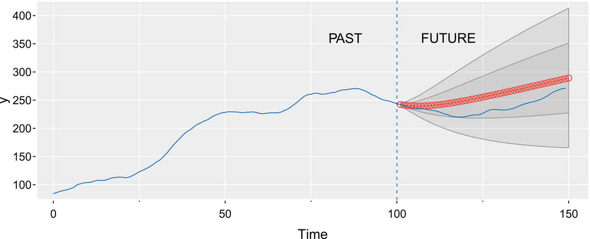

Figure 5.1: Output for [Example 5.4](#chapter5#exam5_4): Simulated ARIMA(1,1,0) series (solid line) with out-of-sample forecasts (points) and error bounds (gray area) based on the first 100 observations. [Return to text.⏎](chapter5)

The code to generate [Figure 5.1](#chapter5#fig5_1) is below. Note that sarima.for fits an ARIMA model and then does the forecasting out to a chosen horizon. In this 125\. case, x is the entire time series of 150 points, whereas y is only the first 100 values of x.

`set.seed(12345)`
`x <- **sarima.sim**(ar=.9, d=1, n=150)`
`y <- window(x, start=1, end=100)`
`**sarima.for**(y, n.ahead=50, p=1, d=1, **gg**=TRUE, **plot.all**=TRUE)`
`text(85, 360, "PAST"); text(115, 360, "FUTURE")`
`abline(v=100, lty=2, col=4)`
`lines(x, col=4)`

Example 5.5. (IMA(1,1) and EWMA). [Return to text.⏎](chapter5)

The ARIMA(0,1,1) or IMA(1,1) model is of interest because many economic time series can be successfully modeled this way. The model leads to a frequently used method called exponentially weighted moving average (EWMA). We will write the model as

xt\=xt−1+wt−λwt−1,(5.6)

with |λ|<1, because this model formulation is easier to work with here, and it leads to the standard representation for EWMA.

In this case, the one-step-ahead predictor is

xn+1n\=(1−λ)xn+λxnn−1.(5.7)

That is, the predictor is a linear combination of the present value of the process, _xn_, and the prediction of the present, xnn−1; details are given in [Problem 5.15](#chapter5#question5_15). This method of forecasting is popular because it is easy to use; we need only retain the previous forecast value and the current observation to forecast the next time period. EWMA is widely used, for example in control charts [(Shewhart, 1931)](#bibref1#refbib_42), and economic forecasting [(Winters, 1960)](#bibref1#refbib_53) whether or not the underlying dynamics are IMA(1,1).

The MSPE is given by

Pn+mn≈σw2\[1+(m−1)(1−λ)2\].(5.8)

In EWMA, the parameter α\=1−λ is often called the smoothing parameter and is restricted to be between zero and one. Larger values of _λ_ (or smaller values of _α_) lead to smoother forecasts.

In the following, we show how to generate 100 observations from an IMA(1,1) model with α\=1−λ\=.2 and then calculate and display the fitted EWMA superimposed on the data. This can be accomplished using the Holt–Winters command in R (see the help file ? HoltWinters for details).

`set.seed(666)`
`x = **sarima.sim**(ma=-.8, d=1, n=100)`
`(x.ima = HoltWinters(x, beta=FALSE, gamma=FALSE))`
`  Smoothing parameter:   alpha: 0.1853541    _# α is 1 − λ_`
`plot(x.ima)                                  _# see Figure 5.2_`

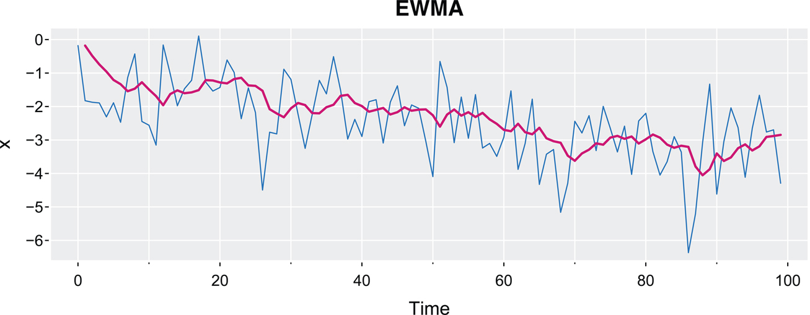

Figure 5.2: Output for [Example 5.5](#chapter5#exam5_5): Simulated data with an EWMA superimposed.

## 5.2 126\. Building ARIMA Models

There are a few steps to fitting ARIMA models to time series data. These steps involve

* plotting the data,
* possibly transforming the data,
* identifying the dependence orders of the model,
* parameter estimation,
* diagnostics, and
* model choice.

First, as with any data analysis, construct a time plot of the data and inspect the graph for any anomalies. It may be of interest to transform the data as we have seen in numerous examples. For example, if the data behave as xt\=(1+rt)xt−1, where _rt_ is a stable process of small percent changes, then ∇log(xt)≈rt will be stable. This general idea was used in [Example 4.28](#chapter4#exam4_28), and we will use it again in [Example 5.6](#chapter5#exam5_6).

After suitably transforming the data if necessary, the next step is to identify preliminary values of the autoregressive order, _p_, the order of differencing, _d_, and the moving average order, _q_. A time plot of the data will typically suggest whether any differencing is needed. If differencing is called for, then difference the data once, d\=1, and inspect the time plot of ∇xt. If additional differencing is necessary, then try differencing again and inspect a time plot of ∇2xt:

> _It is rare for d to be bigger than 1_.

127\. Be careful not to overdifference because this may introduce dependence where none exists. For example, xt\=wt is serially uncorrelated, but ∇xt\=wt−wt−1 is a non-invertible MA(1). In addition to time plots, the sample ACF can help in indicating whether differencing is needed. A slow (linear) decay in the ACF is an indication that differencing may be needed.

When preliminary values of _d_ have been chosen (including no differencing, d\=0), the next step is to look at the sample ACF and PACF of ∇dxt. Using [Table 4.1](#chapter4#tbl4_1) as a guide, preliminary values of _p_ and _q_ are chosen.

> _Note that it cannot be the case that both the ACF and PACF cut off. Because we are dealing with estimates, it will not always be clear whether the sample ACF or PACF is tailing off or cutting off. Also, two models that are seemingly different can actually be very similar._

It is a good idea to _start small_ and increase the orders slowly. Also, watch out for parameter redundancy and do not increase _p_ and _q_ at the same time. At this point, a few preliminary values of _p_, _d_, and _q_ should be at hand, and we can start estimating the parameters and performing diagnostics and model choice.

Example 5.6 Analysis of U.S. GNP [Return to text.⏎](chapter5)

In this example, we consider the analysis of quarterly U.S. gross national product (GNP) from 1947(1) to 2002(3), n\=223 observations. The data are real GNP in billions of chained 1996 dollars and have been seasonally adjusted. [Figure 5.3](#chapter5#fig5_3) shows a plot of the data, say _yt_. Because strong trend tends to obscure other effects, it is difficult to see any other variability in data except for occasional large dips in the economy. Typically, GNP and similar economic 128\. indicators are given in terms of growth rate (percent change) rather than in actual values. The growth rate, xt\=∇log(yt), is plotted in [Figure 5.4](#chapter5#fig5_4) and it appears to be a stable process, although the data appear to be less volatile starting in the mid-1980s. Although we will work with the entire sequence, if forecasting GNP is essential, it would be better to concentrate on the data after 1984.

`_##-- Figure 5.3 --##_`
`layout(1:2, heights=2:1)`
`**tsplot**(**gnp**, col=4)`
`**acf1**(**gnp**, 48, main=NA)`
`_##-- Figure 5.4 --##_`
`**tsplot**(diff(log(**gnp**)), ylab="**GNP** Growth Rate", col=4)`
`abline(h=mean(diff(log(**gnp**))), col=6)`
`_##-- Figure 5.5 --##_`
`**acf2**(diff(log(**gnp**)), main=NA)`

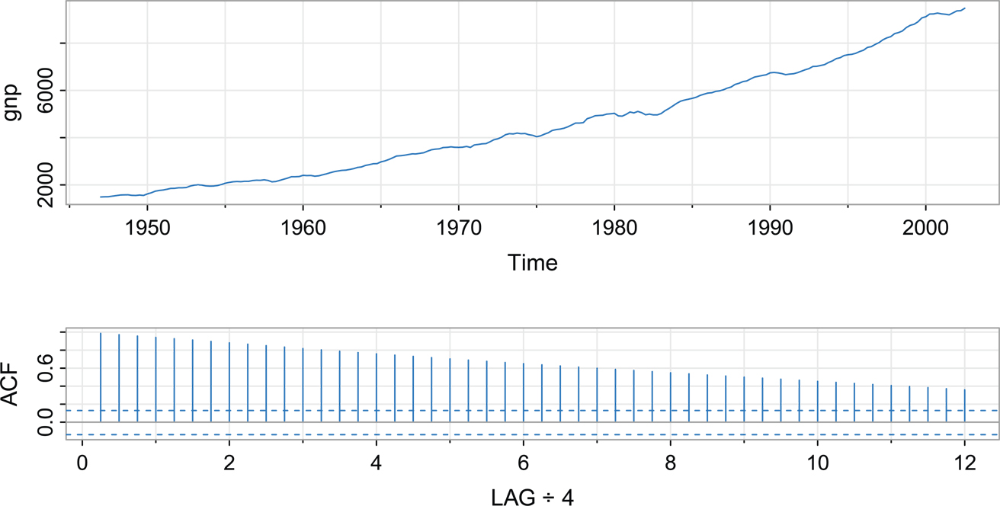

Figure 5.3: Top: Quarterly U.S. GNP from 1947(1) to 2002(3). Bottom: Sample ACF of the GNP data. Lag is in terms of years. [Return to text.⏎](chapter5)

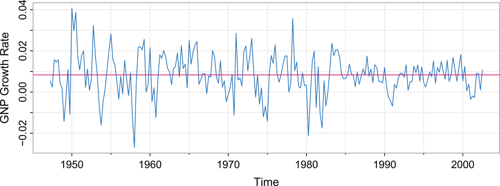

Figure 5.4: U.S. GNP quarterly growth rate. The horizontal line displays the average growth of the process, which is close to 1%. [Return to text.⏎](chapter5)

The sample ACF and PACF of the quarterly growth rate are plotted in [Figure 5.5](#chapter5#fig5_5). Inspecting the sample ACF and PACF, we might feel that the ACF is cutting off at lag 2 and the PACF is tailing off. This would suggest the GNP growth rate follows an MA(2) process, or log GNP is ARIMA(0,1,2).

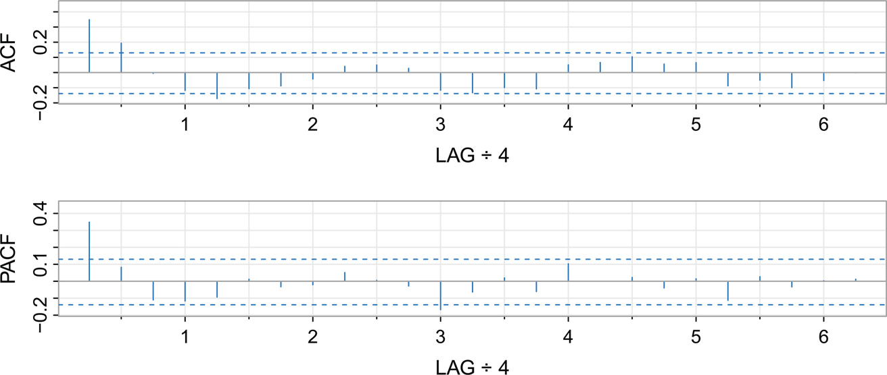

Figure 5.5: Sample ACF and PACF of the GNP quarterly growth rate. [Return to text.⏎](chapter5)

The MA(2) fit to the growth rate, _xt_, is given as results in the following:

`**sarima**(diff(log(**gnp**)), q=2)    _# MA(2) on growth rate_`
`  Coefficients:`
`        Estimate     SE t.value p.value`
`  ma1     0.3028 0.0654 4.6272 0.0000`
`  ma2     0.2035 0.0644 3.1594 0.0018`
`  xmean   0.0083 0.0010 8.7178 0.0000`
` sigma^2 estimated as 8.919178e-05 on 219 degrees of freedom`
` AIC = -6.450133 AICc = -6.449637 BIC = -6.388823`

We note that **sarima**(log**(gnp**), d=1, q=2) will produce the same results.

All of the regression coefficients are significant, _including the constant_ (we make a special note of this because some statistical programs, including base 129\. R, do not fit a constant in a differenced model, assuming without reason that there is no drift). Not including a constant assumes the average growth rate is zero, whereas the U.S. GNP average quarterly growth rate is about 1% (which can be easily seen in [Figure 5.4](#chapter5#fig5_4)).

Rather than focus on one model, we will also suggest that it appears that the ACF is tailing off and the PACF is cutting off at lag 1\. This suggests an AR(1) model for the growth rate, or ARIMA(1,1,0) for log GNP. The AR(1) fit is given as results in the following:

`**sarima**(diff(log(**gnp**)), p=1)    _# AR(1) on growth rate_`
`  Coefficients:`
`        Estimate     SE t.value p.value`
`  ar1     0.3467 0.0627 5.5255        0`
`  xmean   0.0083 0.0010 8.5398        0`
` sigma^2 estimated as 9.029569e-05 on 220 degrees of freedom`
` AIC = -6.44694 AICc = -6.446693 BIC = -6.400958`

As before, **sarima**(log(**gnp**), p=1, d=1) will produce the same results.

We will discuss diagnostics next, but assuming both of these models fit well, how are we to reconcile the apparent differences of the estimated MA(2) and AR(1) models? In fact, the fitted models are nearly the same. Consider the fitted AR(1) model (ignoring the mean),

xt\=.347xt−1+wt,

and write it in its causal form, xt\=∑j\=0∞ψjwt−j, where we recall ψj\=.347j.

`round( ARMAtoMA(ar=.347, ma=0, 10), 3) _# print 10 psi-weights_`
` [1] 0.347 0.120 0.042 0.014 0.005 0.002 0.001 0.000 0.000 0.000`

Thus, the AR(1) model is approximately an MA(2) model,

xt≈.347wt−1+.120wt−2+wt,

which is similar to the fitted MA(2) model.

130\. The next step in model fitting is residual diagnostics. First, we should inspect a time plot of the _innovations_ (residuals), xt−x^tt−1, or of the _standardized innovations_

et\=(xt−x^tt−1)/√P^tt−1,

where x^tt−1 is the one-step-ahead prediction of _xt_ based on the fitted model and P^tt−1 is the estimated one-step-ahead error variance. If the model fits well, the standardized residuals should behave as an independent normal sequence with mean zero and variance one. The time plot should be inspected for any obvious departures from this assumption. Investigation of marginal normality can be accomplished visually by inspecting a normal Q-Q plot.

We should also inspect the sample autocorrelations of the residuals, ρ^e(h), for any patterns or large values. In addition to plotting ρ^e(h), there is a general test of whiteness that takes into consideration the magnitudes of ρ^e(h) as a group. The _Ljung–Box–Pierce Q-statistic_ given by

Q\=n(n+2)∑h\=1H ρ^e2(h)n−h(5.9)

can be used to perform such a test. The value _H_ in (5.9) is chosen somewhat arbitrarily, but not too large. For large sample sizes, under the null hypothesis of model adequacy, Q∼⋅χH−p−q2. Thus, we would reject the null hypothesis at level _α_ if the value of _Q_ exceeds the (1−α) \-quantile of the χH−p−q2 distribution.

Example 5.7 Diagnostics for GNP Growth Rate Example [Return to text.⏎](chapter5)

We will focus on the AR(1) fit from [Example 5.6](#chapter5#exam5_6); the analysis of the MA(2) residuals is similar. [Figure 5.6](#chapter5#fig5_6) displays a plot of the standardized residuals, the ACF of the residuals, a Q-Q plot of the standardized residuals, and the p-values associated with the Q-statistic, (5.9). The residual analysis figure is generated as part of the **sarima** call. You can turn off the diagnostics by adding **details**\=FALSE in the call.

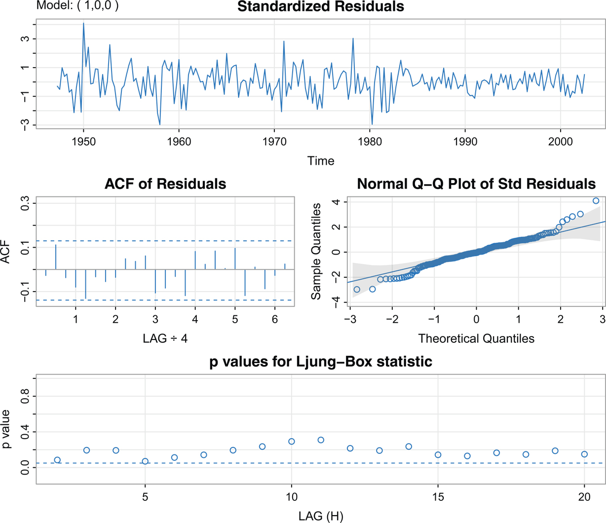

Figure 5.6: Diagnostics of the residuals from AR(1) fit on GNP growth rate. [Return to text.⏎](chapter5)

Inspection of the time plot of the standardized residuals in [Figure 5.6](#chapter5#fig5_6) shows no obvious patterns. Notice that there may be outliers because a couple of standardized residuals exceed 3 standard deviations in magnitude. However, there are no values that are exceedingly large in magnitude.

The ACF of the residuals shows no apparent departure from the model assumptions. The normal Q-Q plot of the residuals suggests that the assumption of normality is not unreasonable; however, there may be one large positive outlier.

Next, consider the Q-statistic. The graphic shows the p-values for the tests based on the lags H\=2 through H\=20 (with corresponding degrees of freedom H−1). The dashed horizontal line on the bottom indicates the. 05 131\. level. The way to view this graphic is not as doing 19 highly dependent tests, but as another way to view the ACF of the residuals. In particular, the Q-statistic looks at the accumulation of autocorrelation rather than individual autocorrelations seen in the ACF. In this example, all the p-values exceed. 05, so we can feel comfortable not rejecting the null hypothesis that the residuals are white.

As a final check, we might consider overfitting a model to see if the results change significantly. For example, we might try the following,

`**sarima**(diff(log(**gnp**)), q=3) _# try an MA(2+1) (partial output shown)_`
`       Estimate     SE t.value p.value`
`  ma1     0.3208 0.0662 4.8430 0.0000`
`  ma2     0.2478 0.0718 3.4512 0.0007`
`  ma3     0.0909 0.0701 1.2962 0.1963`
`**sarima**(diff(log(**gnp**)), p=2) _# try an AR(1+1) (partial output shown)_`
`        Estimate     SE t.value p.value`
`  ar1     0.3180 0.0667 4.7660 0.0000`
`  ar2     0.0820 0.0668 1.2282 0.2207`

and conclude that an extra parameter does not significantly change the results.

Example 5.8 132\. Model Choice for the U.S. GNP Series

To follow up on [Examples 5.6](#chapter5#exam5_6) and [5.7](#chapter5#exam5_7), we have two competing models, an AR(1) and an MA(2) that both have decent residual diagnostics. In addition, we showed that the two models are nearly the same and are not in contradiction. To choose the final model, we compare AIC, AICc, and BIC, for both models. These values are a byproduct of the **sarima** runs.

`_# MA(2):_`
`  AIC = -6.45013   AICc = -6.44964   BIC = -6.38882`
`_# AR(1):_`
`  AIC = -6.44694   AICc = -6.44669   BIC = -6.40096`

The AIC and AICc both prefer the MA(2) model, whereas the BIC prefers the simpler AR(1) model. The methods occasionally agree, but when they do not, the BIC will select a model of smaller order than the AIC or AICc because its penalty is much larger. In this case, it seems reasonable to retain the AR(1) because pure autoregressive models are easier to work with. In addition, as we have already seen, the models are nearly identical.

Example 5.9 Diagnostics for the Glacial Varve Series [Return to text.⏎](#chapter8#b8exam5_9)

In [Example 5.2](#chapter5#exam5_2), we fit an ARIMA(0,1,1) model to the logarithms of the glacial varve data, and there appears to be a small amount of autocorrelation left in the residuals and the Q-tests are all significant; see [Figure 5.7](#chapter5#fig5_7).

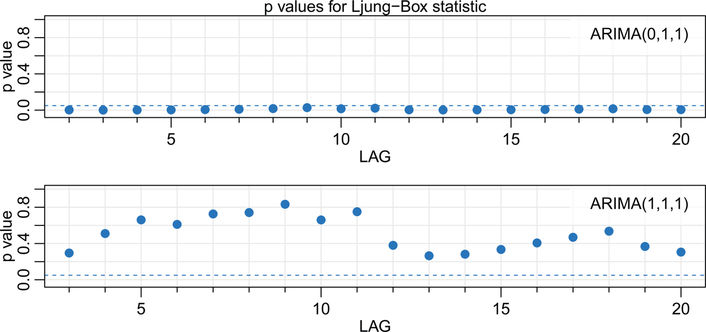

Figure 5.7: Q-statistic p-values for the ARIMA(0,1,1) fit (top) and the ARIMA(1,1,1) fit (bottom) to the logged varve data. [Return to text.⏎](chapter5)

To adjust for the small amount of autocorrelation left by the model, we added an AR parameter and fit an ARIMA(1,1,1) to the logged varve data.

`**sarima**(log(**varve**), 0, 1, 1, **no.constant**=TRUE)   _# ARIMA(0,1,1)_`
` AIC = 1.398792 AICc = 1.398802 BIC = 1.412853`
`**sarima**(log(**varve**), 1, 1, 1, **no.constant**=TRUE)   _# ARIMA(1,1,1)_`
`      Estimate     SE t.value p.value`
`  ar1   0.2330 0.0518   4.4994       0`
`  ma1 -0.8858 0.0292 -30.3861        0`
` sigma^2 estimated as 0.2284339 on 631 degrees of freedom`
` AIC = 1.37263 AICc = 1.372661 BIC = 1.393723`

Hence the additional AR term is significant. The Q-statistic p-values for this model are also displayed in [Figure 5.7](#chapter5#fig5_7), and it appears this model fits the data well.

As previously stated, the diagnostics are byproducts of the individual sarima runs. We note that we did not fit a constant in either model because there is no apparent drift in the differenced, logged varve series. This fact can be verified by noting the constant is not significant when we remove **no.constant**\=TRUE.

In [Example 5.6](#chapter5#exam5_6), we have two competing models, an AR(1) and an MA(2), on the GNP growth rate that each appear to fit the data well. In addition, we might also consider that fitting larger order models might do better for forecasting. As previously mentioned, we have to be concerned with _overfitting_ the model; it is not always the case that more is better. Overfitting leads to less-precise estimators, 133\. and adding more parameters may fit the data better but may also lead to bad forecasts. This result is illustrated in the following example.

Example 5.10 A Perfect Fit and a Terrible Forecast

[Figure 5.8](#chapter5#fig5_8) shows the U.S. population by official census, every 10 years from 1900 to 2020, as points. If we use these observations to predict the future population, we can fit a high degree polynomial so that the fit will be nearly perfect. There are 12 observations, so we could use an tenth-degree polynomial to get a near perfect fit. The model in this case is

xt\=β0+β1t+β2t2+⋯+β10t10+wt.

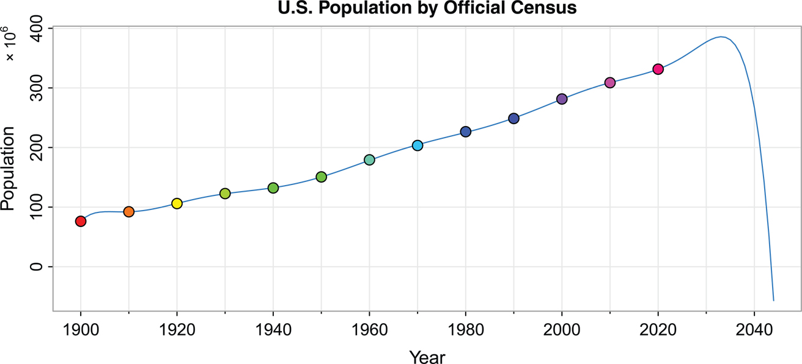

Figure 5.8: A near perfect fit and a terrible forecast. [Return to text.⏎](chapter5)

The fitted line is also plotted in [Figure 5.8](#chapter5#fig5_8), and it nearly passes through all the observations (R2\=99.99%). The model predicts that the population of the United States will cross zero in 2043! This may or may not be true.

`_# regression_`
`t    = time(USpop20)-1960`
`reg = lm( USpop20~ poly(t, 10, raw=TRUE) )`
`_# prediction curve_`
`b    = as.vector(coef(reg))`
`t    = 1900:2044`
`X    = outer(t-1960, 0:10, FUN="^")`
`pred = X %*% b`
`_# graphic_`
`tsplot(t, pred, ylab="Population", xlab="Year", cex.main=1, col=4,`
`          main="U.S. Population by Official Census")`
`points(time(USpop20), USpop20, pch=21, bg=rainbow(13), cex=1.25)`
`mtext(bquote("\u00D7"~10^6), side=2, line=1.5, adj=1, cex=.8)`

## 5.3 134\. Seasonal ARIMA Models

In this section, we introduce a modification of the ARIMA model to account for seasonal behavior. Often, the dependence on the past tends to occur most strongly at multiples of some underlying seasonal lag _s_. For example, with monthly economic data, there is typically a strong yearly component occurring at lags that are multiples of s\=12 due to strong connections of activity to the calendar year. Data taken quarterly often exhibit the yearly repetitive period at s\=4 quarters. Natural phenomena such as temperature also have strong components corresponding to seasons. Hence, the natural variability of many physical, biological, and economic processes tends to match with seasonal fluctuations.

Example 5.11 A Seasonal AR Model

A first-order seasonal autoregression that runs over months, denoted SAR(1)12, can be written as

xt\=Φxt−12+wt,

or using the backshift operator,

(1−ΦB12)xt\=wt.

Note that the regression parameter is capitalized in the seasonal model. This model exhibits the series _xt_ in terms of past lags at the multiple of the yearly seasonal period s\=12 months. Estimation and forecasting for such a process involves only straightforward modifications of the unit lag case already treated. In particular, the causal condition requires |Φ|<1.

135\. We simulated 3 years of data from the model with Φ\=.95, and exhibit the _theoretical_ ACF and PACF of the model in [Figure 5.9](#chapter5#fig5_9).

`set.seed(10101010)`
`SAR = **sarima.sim**(sar=.95, S=12, n=37) + 50`
`layout(matrix(c(1,2, 1,3), nc=2), heights=c(1.5,1))`
`**tsplot**(SAR, type="c", xlab="Year", **gg**=TRUE, ylab="SAR(1)", xaxt="n")`
` abline(v=0:3, col=4, lty=2)`
` points(SAR, pch=**Months**, cex=1.2, font=4, col=1:6)`
` axis(1, at=0:3, col="white")`
`phi = c(rep(0,11),.95)`
`ACF = ARMAacf(ar=phi, ma=0, 100)`
`PACF = ARMAacf(ar=phi, ma=0, 100, pacf=TRUE)`
`LAG = 0:100/12`
`**tsplot**(LAG, ACF, type="h", xlab="LAG \u00F7 12", ylim=c(-.04,1), **gg**=TRUE, col=4)`
` abline(h=0, col=8)`
`**tsplot**(LAG[-1], PACF, type="h", xlab="LAG \u00F7 12", ylim=c(-.04,1), **gg**=TRUE,`
`   col=4)`
` abline(h=0, col=8)`

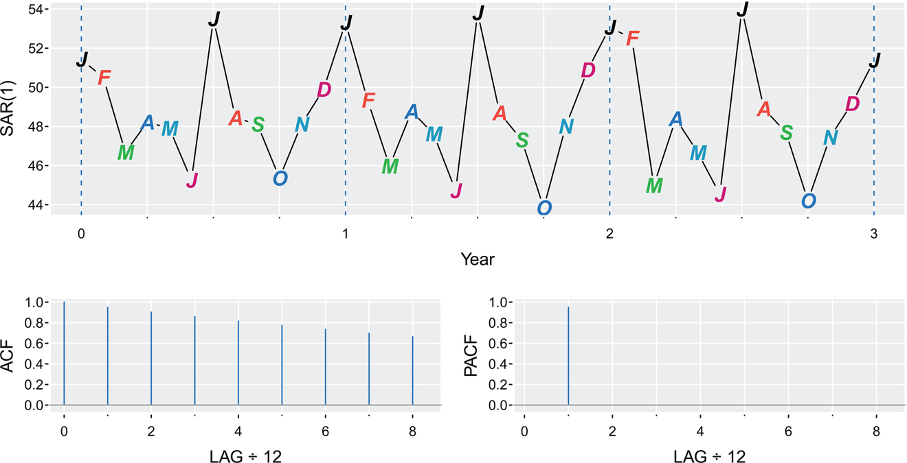

Figure 5.9: Data generated from an SAR(1)12 model, and the true ACF and PACF of the model(xt−50)\=.95(xt−12−50)+wt. Lag is in terms of seasons. [Return to text.⏎](chapter5)

For convenience, we introduce autoregressive and moving average polynomials that identify with the seasonal lags. The resulting _pure seasonal_ autoregressive moving average model, ARMA(P,Q)s, takes the form

ΦP(Bs)xt\=ΘQ(Bs)wt,

136\. where the operators

ΦP(Bs)\=1−Φ1Bs−Φ2B2s−⋯−ΦPBPs

and

ΘQ(Bs)\=1+Θ1Bs+Θ2B2s+⋯+ΘQBQs

are the _seasonal autoregressive operator_ and the _seasonal moving average operator_ of orders _P_ and _Q_, respectively, with seasonal period _s_.

For the first-order seasonal (s\=12) MA model, xt\=wt+Θwt−12, it is easy to verify that

γ(0)\=(1+Θ2)σw2γ(±12)\=Θσw2γ(h)\=0,otherwise.

Thus, the only nonzero correlation, aside from lag zero, is

ρ(±12)\=Θ/(1+Θ2).

For the first-order seasonal (s\=12) AR model, xt\=Φxt−12+wt, using the techniques of the nonseasonal AR(1), we have

γ(0)\=σw2/(1−Φ2)γ(±12k)\=σw2Φk/(1−Φ2)k\=1,2,…γ(h)\=0,otherwise.

In this case, the only nonzero correlations are

ρ(±12k)\=Φk,k\=0,1,2,….

These results can be verified using the general result that

γ(h)\=Φγ(h−12)for h≥1.

For example, when h\=1, γ(1)\=Φγ(11), but when h\=11, we have γ(11)\=Φγ(1), which implies that for any |Φ|<1,

γ(1)\=Φ2γ(1)andγ(11)\=Φ2γ(11),

so that γ(1)\=0 and γ(11)\=0. In addition to these results, the PACF have the analogous extensions from nonseasonal to seasonal models. These results are demonstrated in [Figure 5.9](#chapter5#fig5_9).

As an initial diagnostic criterion, we can use the properties for the pure seasonal autoregressive and moving average series listed in [Table 5.1](#chapter5#tbl5_1). These properties may be considered as generalizations of the properties for nonseasonal models that were presented in [Table 4.1](#chapter4#tbl4_1).137\. 

__Table 5.1: Behavior of the ACF and PACF for Pure SARMA Models [Return to text.⏎](chapter5)__
| AR(P)s                 | MA(Q)s                  | ARMA(P,Q)s             |              |
| ---------------------- | ----------------------- | ---------------------- | ------------ |
| ACF [\*](chapter5)  | Tails off at lags _ks_, | Cuts off after         | Tails off at |
| k\=1,2,…,              | lag _Qs_                | lags _ks_              |              |
| PACF [\*](chapter5) | Cuts off after          | Tails off at lags _ks_ | Tails off at |
| lag _Ps_               | k\=1,2,…,               | lags _ks_              |              |

\* The values at nonseasonal lags h≠ks, for k=1,2,…, are zero. [Return to text.⏎](#chapter5#tblfn5_1b)

Next, we combine the seasonal and nonseasonal operators into a _multiplicative seasonal autoregressive moving average model_, denoted by ARMA(p,q)×(P,Q)s, and write

ΦP(Bs)ϕ(B)xt\=ΘQ(Bs)θ(B)wt

as the overall model. Although the diagnostic properties in [Table 5.1](#chapter5#tbl5_1) are not strictly true for the overall mixed model, the behavior of the ACF and PACF tends to show rough patterns of the indicated form. In fact, for mixed models, we tend to see a mixture of the facts listed in [Table 4.1](#chapter4#tbl4_1) and [Table 5.1](#chapter5#tbl5_1).

Example 5.12 A Mixed Seasonal Model

Consider an ARMA(p\=0,q\=1)×(P\=1,Q\=0)s\=12 model

xt\=Φxt−12+wt+θwt−1,

where |Φ|<1 and |θ|<1. Then, because _xt_ is stationary, and xt−12, _wt_, and wt−1 are uncorrelated, γ(0)\=Φ2γ(0)+σw2+θ2σw2, or

γ(0)\=1+θ21−Φ2 σw2.

Multiplying both sides of the model by xt−h, h\>0, and taking expectations, we have γ(1)\=Φγ(11)+θσw2, and γ(h)\=Φγ(h−12), for h≥2. Thus, the model ACF is

ρ(12h)\=Φhh\=1,2,…ρ(12h−1)\=ρ(12h+1)\=θ1+θ2Φhh\=0,1,2,…,ρ(h)\=0,otherwise.

The ACF and PACF for this model with Φ\=.8 and θ\=−.5 are shown in [Figure 5.10](#chapter5#fig5_10). These types of correlation relationships, although idealized here, are typically seen with seasonal data.

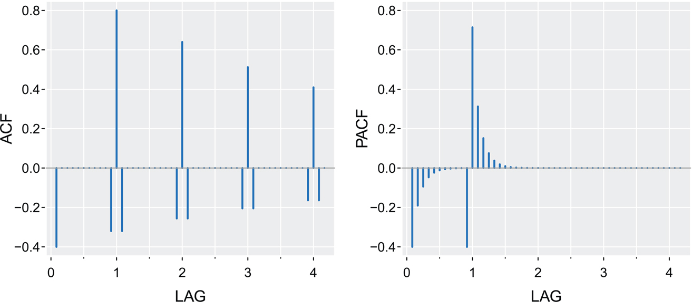

Figure 5.10: ACF and PACF of the mixed seasonal ARMA model xt\=.8xt−12+wt−.5wt−1. [Return to text.⏎](chapter5)

138\. To compare these results to actual data, consider the seasonal series birth, which are the monthly live births in thousands for the United States surrounding the “baby boom” era. The data are plotted in [Figure 5.11](#chapter5#fig5_11). Also shown in the figure are the differenced data and the corresponding sample ACF and PACF. We have highlighted certain values so that they may be compared to the idealized case in [Figure 5.10](#chapter5#fig5_10).

`_##-- Figure 5.10 --##_`
`par(mfrow=1:2)`
`phi = c(rep(0,11),.8)`
`ACF = ARMAacf(ar=phi, ma=-.5, 50)[-1]`
`PACF = ARMAacf(ar=phi, ma=-.5, 50, pacf=TRUE)`
`LAG = 1:50/12`
`tsplot(LAG, ACF, type="h", xlab="LAG", ylim=c(-.4,.8), col=4, lwd=2)`
`abline(h=0, col=8)`
`tsplot(LAG, PACF, type="h", xlab="LAG", ylim=c(-.4,.8), col=4, lwd=2)`
`abline(h=0, col=8)`
`_##-- Figure 5.11 --##_`
`tsplot(birth, col=4)     _# monthly number of births in US_`
`tsplot(diff(birth), col=4)`
`acf2(diff(birth))        _# P/ACF of the differenced birth rate_`

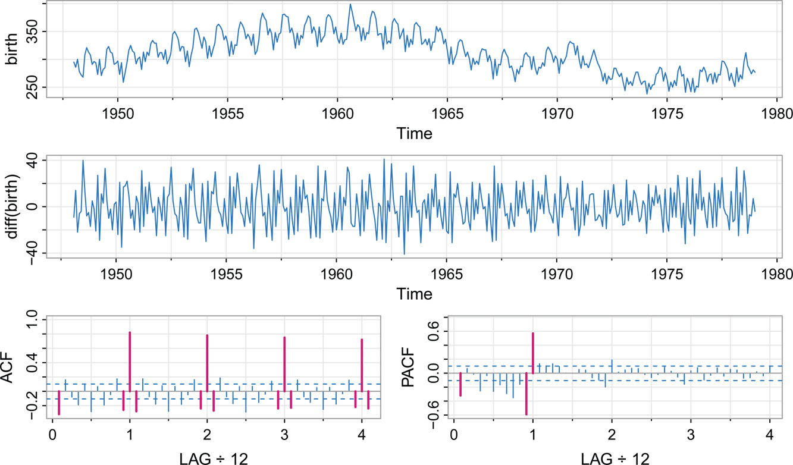

Figure 5.11: Monthly live births in thousands for the United States 1948–1979, which includes the baby boom (top). Differenced live births (middle). Sample ACF and PACF of the differenced data with certain lags highlighted (bottom). Compare the P/ACF to the idealized versions in [Figure 5.10](#chapter5#fig5_10). [Return to text.⏎](chapter5)

### Seasonal Persistence

Seasonal persistence occurs when the process is nearly constant in the season. For example, consider the quarterly occupancy rate of Hawaiian hotels shown in [Figure 5.12](#chapter5#fig5_12). The seasonal component from a structural model fit performed in [Example 3.22](#chapter3#exam3_22) is shown below the data. Note that the occupancy rate for the first and third quarters is always up 2% to 4%, while the occupancy rate for the second and fourth quarters is always down 2% to 4%. In this case, we might think of the 139\. seasonal component, _St_, as satisfying St≈St−4, or

St\=St−4+vt,(5.10)

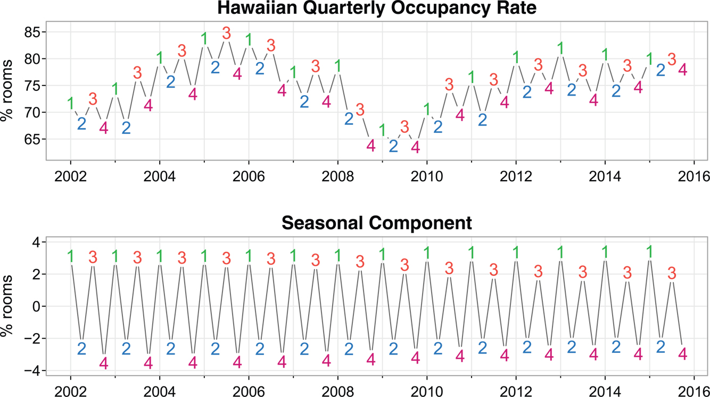

Figure 5.12: Seasonal persistence: The quarterly occupancy rate of Hawaiian hotels and the extracted seasonal component, St≈St−4, where _t_ is in quarters. [Return to text.⏎](chapter5)

where _vt_ is white noise.

`x = window(hor, start=2002)`
`par(mfrow = c(2,1), las=1)`
`**tsplot**(x, main="Hawaiian Occupancy Rate", ylab=" % rooms", col=8)`
`text(x, labels=1:4, col=c(3,4,2,6))`
`Qx = stl(x,15)$time.series[,1]`
`**tsplot**(Qx, main="Seasonal Component", ylab=" % rooms", col=8)`
`text(Qx, labels=1:4, col=c(3,4,2,6))`

The tendency of seasonal data to follow this type of behavior will be exhibited in a sample ACF that is large and decays very slowly at lags 1s,2s,3s,…. In the occupancy rate example, suppose _xt_ is the rate with the trend component removed, then a reasonable model might be

xt\=St+wt,

where _St_ satisfies (5.10), St\=St−4+vt, and _wt_ is white noise. If we use a seasonal difference, we find that with period s\=4,

(1−B4)xt\=xt−xt−4\=St+wt−(St−4+wt−4)\=(St−St−4)+wt−wt−4\=vt+wt−wt−4,

140\. is stationary and its ACF will have a peak only at lag s\=4.

In general, seasonal differencing is indicated when the ACF decays slowly at multiples of some season _s_. Then, a _seasonal difference of order D_ is defined as

∇sDxt\=(1−Bs)Dxt,(5.11)

where D\=1,2,…, takes positive integer values. Typically, D\=1 is sufficient to obtain seasonal stationarity. Incorporating these ideas into a general model leads to the following definition.

Definition 5.13. _The multiplicative **seasonal autoregressive integrated moving average** (**SARIMA**) model is given by_

ΦP(Bs)ϕ(B)∇sD∇dxt\=α+ΘQ(Bs)θ(B)wt,(5.12)

_where wt is the usual Gaussian white noise process. The general model is denoted as **ARIMA**_(p,d,q)×(P,D,Q)s.

The nonseasonal autoregressive and moving average components are represented by ϕ(B) and θ(B) of orders _p_ and _q_, respectively, and the seasonal autoregressive and moving average components by ΦP(Bs) and ΘQ(Bs) of orders _P_ and _Q_ with difference components ∇d\=(1−B)d and ∇sD\=(1−Bs)D.

Example 5.14 141\. A Seasonal ARIMA Model

Consider the following model that often provides a reasonable representation for seasonal, nonstationary, economic time series. We exhibit the equations for the model, denoted by ARIMA(0,1,1)×(0,1,1)12 in the notation given above, where the seasonal fluctuations occur every 12 months. Then, with α\=0, the model (5.12) is

∇12∇xt\=Θ(B12)θ(B)wt

or

(1−B12)(1−B)xt\=(1+ΘB12)(1+θB)wt.(5.13)

Expanding both sides of (5.13) leads to the representation

(1−B−B12+B13)xt\=(1+θB+ΘB12+ΘθB13)wt,

or in difference equation form

xt\=xt−1+xt−12−xt−13+wt+θwt−1+Θwt−12+Θθwt−13.

Note that the multiplicative nature of the model implies that the coefficient of wt−13 is the product of the coefficients of wt−1 and wt−12 rather than a free parameter. The multiplicative model assumption seems to work well with many seasonal time series data sets while reducing the number of parameters that must be estimated.

Selecting models for a given set of (possibly transformed) data is a simple step-by-step process.

* First, consider differencing to remove trend (_d_) and to remove seasonal persistence (_D_) if they are present.
* Then, look at the ACF and the PACF of the possibly differenced data. Consider the seasonal components (_P_ and _Q_) by looking at the seasonal lags (1s,2s,…,) only and keeping [Table 5.1](#chapter5#tbl5_1) in mind.
* Finally, look at the first few lags of the ACF and PACF and consider values for within seasonal components (_p_ and _q_) keeping [Table 4.1](#chapter4#tbl4_1) in mind.

It is reasonable at this point to have a few possible models to choose from. After fitting the various models, use residual analysis and information criteria to select the final model.

Example 5.15 Carbon Dioxide and the Greenhouse Effect

Carbon dioxide is necessary to keep global surface temperatures above freezing. Because we are adding more carbon dioxide to the atmosphere, we are supercharging the natural greenhouse effect, which in turn causes global temperature to rise. Concentration of CO2 in the atmosphere has now reached an unprecedented level. In 2025, the average of all of the global measuring sites 142\. showed a concentration above 420 parts per million (ppm). Scientists advising the United Nations recommend the world should act to keep the CO2 levels below 400-450 ppm in order to prevent even more irreversible and disastrous climate change effects.

The data shown in [Figure 5.13](#chapter5#fig5_13) are the CO2 readings, _xt_, from 1958 to 2023 at the Mauna Loa Observatory, which is the oldest continuous monitoring station of carbon dioxide. The trend and seasonal persistence are evident in the plot, so we also exhibit the trend and seasonally differenced data, ∇∇12xt, in the figure.

`par(mfrow=c(2,1))`
`**tsplot**(**cardox**, ylab=bquote(CO[2]), main="Monthly Carbon Dioxide Readings -`
`   Mauna Loa Observatory", col=4)`
`**tsplot**(diff(diff(**cardox**,12)), ylab=bquote(nabla~nabla[12]~CO[2]), col=4)`

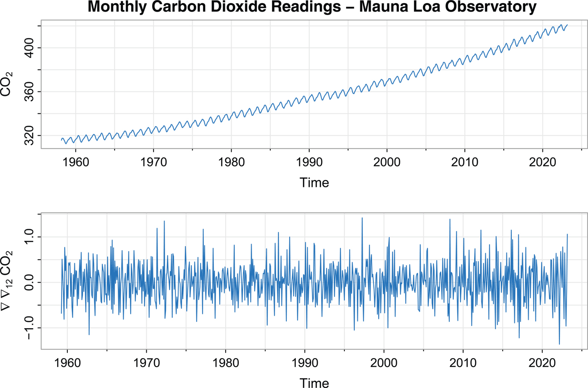

Figure 5.13: Monthly CO2 levels (ppm) taken at the Mauna Loa, Hawaii observatory (top) and the data differenced to remove trend and seasonal persistence (bottom). [Return to text.⏎](chapter5)

The sample ACF and PACF of the differenced data are shown in [Figure 5.14](#chapter5#fig5_14).

`**acf2**(diff(diff(**cardox**,12)), col=4)`

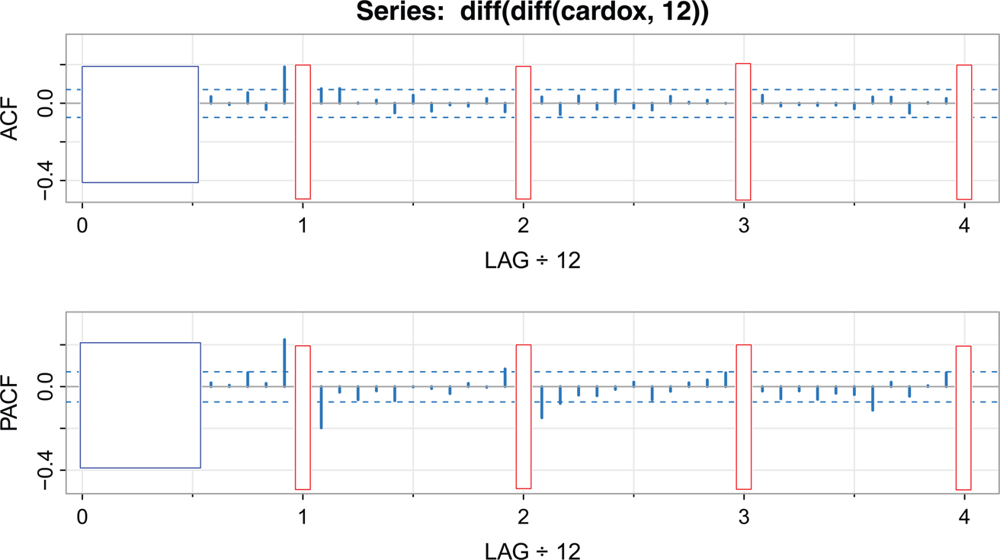

Figure 5.14: Sample ACF and PACF of the differenced CO2 data. The red rectangles focus on the seasonal lags, and the blue squares focus on the nonseasonal lags. [Return to text.⏎](chapter5)

**Seasonal:** In [Figure 5.14](#chapter5#fig5_14), focus on the larger red rectangles. It appears that at the seasons, the ACF is cutting off a lag 1_s_ (s\=12), whereas the PACF is tailing off at lags 1_s_,2_s_,3_s_,4_s_. These results imply an SMA(1), P\=0, Q\=1, in the seasonal component.

143\. **Nonseasonal:** In [Figure 5.14](#chapter5#fig5_14), focus on the blue squares. Inspecting the sample ACF and PACF at the first few lags, it appears as though the ACF cuts off at lag 1, whereas the PACF is tailing off. This suggests an MA(1) within the seasons, p\=0 and q\=1.

Thus, we first try an ARIMA(0,1,1)×(0,1,1)12 on the CO2 readings:

`**sarima**(**cardox**, d=1,q=1, D=1,Q=1,S=12, col=4)`
`       Estimate     SE t.value p.value`
`  ma1   -0.3869 0.0377 -10.2624       0`
`  sma1 -0.8655 0.0183 -47.2846        0`
` sigma^2 estimated as 0.0980908 on 766 degrees of freedom`
` AIC = 0.5456475 AICc = 0.545668 BIC = 0.5637873`

The residual analysis is exhibited in [Figure 5.15](#chapter5#fig5_15), and the results look decent although there may still be a small amount of significant autocorrelation.

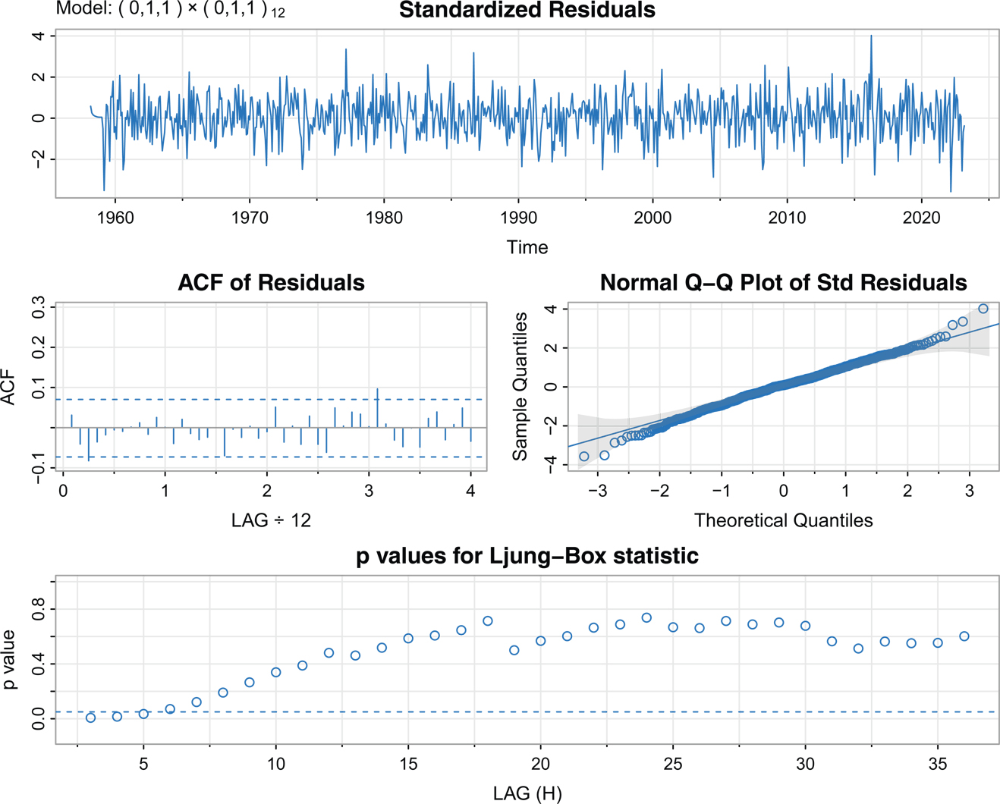

Figure 5.15: Residual analysis for the ARIMA(0,1,1)×(0,1,1)12 fit to the CO2 data set. [Return to text.⏎](chapter5)

The next step is to add a parameter to the within-seasons component. In this case, adding another MA parameter (q\=2) gives nonsignificant results. However, adding an AR parameter does yield significant results.

`**sarima**(**cardox**, 1,1,1, 0,1,1,12, col=4)`
`       Estimate     SE t.value p.value`
`  ar1    0.2203 0.0894   2.4660 0.0139`
`  ma1   -0.5797 0.0753 -7.7029 0.0000`
`  sma1 -0.8656 0.0182 -47.5947 0.0000`
` sigma^2 estimated as 0.09742764 on 765 degrees of freedom`
` AIC = 0.541514 AICc = 0.5415549 BIC = 0.5657004`

The residual analysis (not shown) indicates an improvement to the fit. We do note that while the AIC and AICc prefer the second model, the BIC prefers the 144\. first model. In addition, there is a noticeable difference in the MA(1) parameter estimate and its standard error. In the final analysis, the predictions from the two models will be close, so we will use the second model for forecasting.

The forecasts out five years are shown in [Figure 5.16](#chapter5#fig5_16).

`**sarima.for**(**cardox**, 60, 1,1,1, 0,1,1,12, col=4, ylab=bquote(CO[2]))`
`abline(v=2018.9, lty=6)`
`_##-- for comparison, try the first model --##_`
`**sarima.for**(**cardox**, 60, 0,1,1, 0,1,1,12) _# not shown_`

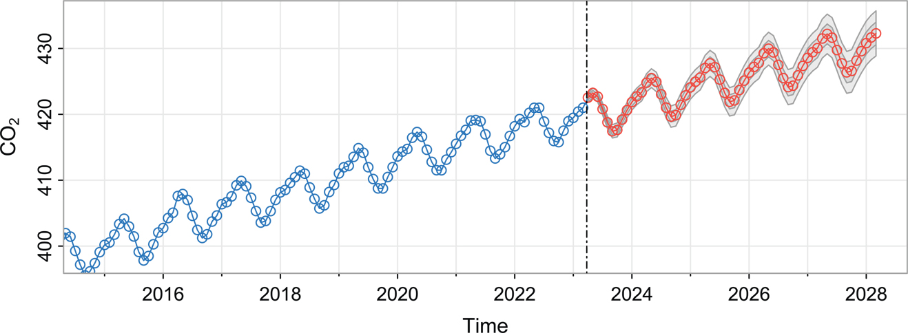

Figure 5.16: Five-year-ahead forecasts using the ARIMA(1,1,1)×(0,1,1)12 model on the Mauna Loa carbon dioxide readings. [Return to text.⏎](chapter5)

It is clear that without intervention, atmospheric CO2 concentrations will continue to grow to dangerous levels. Unfortunately, the carbon dioxide that we have released will remain in the atmosphere for thousands of years. Only after many millennia will it return to rocks, for example, through the formation of calcium carbonate. Once released, carbon dioxide is in our environment essentially forever. It does not go away, unless we, ourselves, remove it.

## 5.4 145\. Regression with Autocorrelated Errors

In [Section 3.1](#chapter3#sec3_1), we covered classical regression with uncorrelated errors _wt_. In this section, we discuss the modifications that might be considered when the errors are correlated. That is, consider the regression model

yt\=β1zt1+⋯+βrztr+xt

where _xt_ is a process with some covariance function γx(s,t). In ordinary least squares, the assumption is that _xt_ is white Gaussian noise, in which case γx(s,t)\=0 for s≠t and γx(t,t)\=σ2, independent of _t_. Otherwise, generalized least squares should be used and the covariance structure of _xt_ must be specified. Because _xt_ is not observed, it may be difficult to specify its covariance structure.

In the time series case, however, it is often possible to assume a stationary covariance structure. That is, it may be the case that the error process _xt_ is ARMA. For example, suppose we have the regression model

yt\=βzt+xt(5.14)

where xt\=ϕxt−1+wt is AR(1). Since xt\=yt−βzt is an AR(1), we can fit an AR(1) to yt−βzt, estimating all parameters simultaneously using numerical methods. This means the following model will be fit,

yt−βzt⏟xt\=ϕ(yt−1−βzt−1)⏟xt−1+ wt.

This idea generalizes to any regression model with ARMA errors. For example, if, in (5.14), the error is ARMA(1,1) xt\=ϕxt−1+wt+θwt−1, then we fit 146\. the model

yt−βzt⏟xt\=ϕ(yt−1−βzt−1)⏟xt−1+wt+θwt−1.

At this point, the main problem is that we do not typically know the behavior of the noise _xt_ prior to the analysis. An easy way to tackle this problem was first presented in [Cochrane and Orcutt (1949)](#bibref1#refbib_12), which we modernize:

1. First, run an ordinary regression of _yt_ on zt1,…,ztr (acting as if the errors are uncorrelated). Retain the residuals, x^t\=yt−(β^1zt1+⋯+β^rztr).
2. Identify an ARMA model for the residuals x^t. There may be competing models.
3. Estimate the parameters of the model(s) specified in step (ii).
4. Inspect the residuals of the transformed model, w^t, for whiteness, and adjust the model if necessary.
5. Select the best model if there are more than one.

Example 5.16 147\. Lynx–Hare Interaction (cont.) [Return to text.⏎](chapter5)

In [Example 3.8](#chapter3#exam3_8), we fit the predator Lotka–Volterra equation to the Lynx–Hare data first presented in [Example 1.5](#chapter1#exam1_5). The residual analysis, however, indicated that the residuals were not white noise. We now address that problem recalling that the model is

Lt\=β0+β1Lt−1+β2Lt−1Ht−1+xt,

where _Ht_ is the hare series, _Lt_ is the lynx series, and _xt_ represents the noise, which we saw in [Example 5.16](#chapter5#exam5_16) is autocorrelated.

The residuals analysis displayed in [Figure 3.7](#chapter3#fig3_7) indicates that there is a significant amount of periodic behavior left in the residuals. The ACF and PACF of the residuals (not shown) suggest that they satisfy an AR(2) model. The results of the regression with autocorrelated errors are given below in the code, and the corresponding residual analysis is displayed in [Figure 5.17](#chapter5#fig5_17).

`pp = ts.intersect(L=**Lynx**, L1=lag(**Lynx**,-1), H1=lag(**Hare**,-1), dframe=TRUE)`
`_# Original Regression_`
`**ttable**( fit <- lm(L~ L1 + L1:H1, data=pp, na.action=NULL) )`
`**acf2**(resid(fit), col=4)    _# ACF/PACF of the residuals_`
`_# Try AR(2) errors_`
`**sarima**(pp$L, p=2, xreg=cbind(L1=pp$L1, LH1=pp$L1*pp$H1), col=4)`
` Coefficients:`
`            Estimate      SE t.value p.value`
`  ar1          1.4552 0.0619 23.5122 0.0000`
`  ar2        -0.8331 0.0599 -13.8993 0.0000`
`  intercept 36.3990 3.6422     9.9936 0.0000`
`  L1         -0.4307 0.1189 -3.6232 0.0005`
`  LH1          0.0026 0.0008   3.0669 0.0029`
` sigma^2 estimated as 53.53512 on 85 degrees of freedom`
` AIC = 6.988916 AICc = 6.996853 BIC = 7.15557`

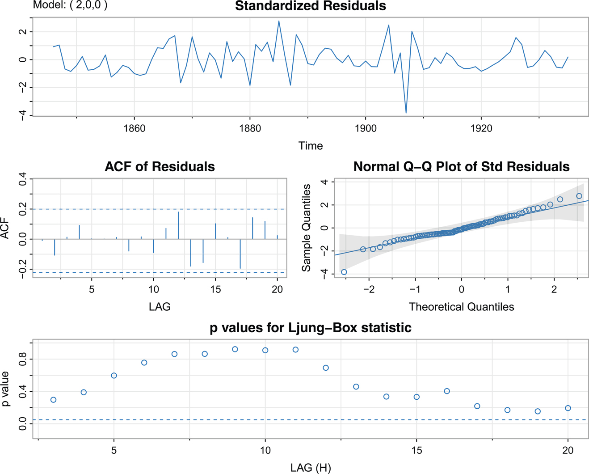

Figure 5.17: [Example 5.16](#chapter5#exam5_16): Residual analysis from the Lotka–Volterra fit to the lynx–hare interactions with autocorrelated errors. [Return to text.⏎](chapter5)

## Problems

* 5.1. For the logarithm of the glacial varve data, _xt_, presented in [Example 4.28](#chapter4#exam4_28), use the first 100 observations and calculate the EWMA, xn+1n, discussed in [Example 5.5](#chapter5#exam5_5), for n\=1,…,100, using λ\=.25,.50, and. 75, and plot the EWMAs and the data superimposed on each other. Comment on the results.
* 5.2. In [Example 5.6](#chapter5#exam5_6), we fit an ARIMA model to the quarterly GNP series. Repeat the analysis for the U.S. GDP series in **gdp**. Discuss all aspects of the fit as specified in the points at the beginning of [Section 5.2](#chapter5#sec5_2) from plotting the data to diagnostics and model choice.
* 5.3. Fit an ARIMA(p,d,q) model to **gtemp\_land**, the land-based global temperature data, performing all of the necessary diagnostics; include a model choice 148\. analysis. After deciding on an appropriate model, forecast (with limits) the next 10 years. Comment.
* 5.4. One of the series collected along with particulates, temperature, and mortality described in [Example 3.6](#chapter3#exam3_6) is the sulfur dioxide series, so2. Fit an ARIMA(p,d,q) model to the data, performing all of the necessary diagnostics. After deciding on an appropriate model, forecast the data into the future four time periods ahead (about one month) and calculate 95% prediction intervals for each of the four forecasts. Comment.
* 5.5. Fit a seasonal ARIMA model to the R data set AirPassengers, which are the monthly totals of international airline passengers taken from [Box and Jenkins (1970)](#bibref1#refbib_7).
* 5.6. Plot the theoretical ACF of the seasonal ARIMA(0,1)×(1,0)12 model with Φ\=.8 and θ\=.5 out to lag 50.
* 5.7. Fit a seasonal ARIMA model of your choice to the chicken price data in chicken. Use the estimated model to forecast the next 12 months.
* 5.8. Fit a seasonal ARIMA model of your choice to the unemployment data, UnempRate. Use the estimated model to forecast the next 12 months.
* 5.9. Fit a seasonal ARIMA model of your choice to the U.S. Live Birth Series, birth. Use the estimated model to forecast the next 12 months.
* 5.10. \* (**When Automation Fails**) [Example 4.31](#chapter4#exam4_31) pointed to a number of problems with automated ARIMA fitting. In this problem, we reexamine the seasonal series of cardiovascular mortality (ct\=**cmort**) by redoing [Problem 4.5](#chapter4#question4_5) using automation and enjoying the goofy results obtained.  
   1. Read through [Problem 4.5](#chapter4#question4_5) and following its advice, fit an AR(1) to the differenced data, xt\=∇ct, as defined in that problem.  
   2. Next, obtain the forecast package if it is not already installed on your system: install.packages(“forecast”). The package includes automatic seasonal ARIMA fitting. Run the automation on **cmort** using the defaults (this will take awhile): forecast::auto.arima(**cmort**).  
   3. What is the model chosen by auto.arima? Are any of the estimated parameters significant (are any more than two standard deviations from zero)?  
   4. To compare models, use **sarima** to fit the model chosen in part (b). Which model, the one in (a) or the one in (b), has the preferred AIC, AICc, and BIC values (use the values from **sarima** so they are comparable)?  
   5. From the **sarima** fit to the automated model, does the residual analysis present any obvious problems aside from those noted in part (c).
* 5.11. 149\. Let _St_ represent the monthly sales data in **sales** (n\=150), and let _Lt_ be the leading indicator in **lead**.  
   1. Fit an ARIMA model to _St_, the monthly sales data. Discuss your model fitting in a step-by-step fashion, presenting your (A) initial examination of the data, (B) transformations and differencing orders, if necessary, (C) initial identification of the dependence orders, (D) parameter estimation, (E) residual diagnostics and model choice.  
   2. Use the CCF and lag plots between ∇St and ∇Lt to argue that a regression of ∇St on ∇Lt−3 is reasonable.  
   3. Fit the regression model ∇St\=β0+β1∇Lt−3+xt, where _xt_ is an ARMA process (explain how you decided on your model for _xt_). Discuss your results.
* 5.12. One of the remarkable technological developments in the computer industry was the ability to store information densely on a small hard drive. In addition, the cost of storage has steadily declined. The data set for this assignment is **cpg**, which consists of the median annual retail price per GB of hard drives, _ct_, taken from a sample of manufacturers from 1980 to 2008.  
   1. Plot _ct_ and describe what you see.  
   2. Argue that the curve _ct_ versus _t_ behaves like ct≈αeβt by fitting a linear regression of logct on _t_ and then plotting the fitted line to compare it to the logged data. Comment.  
   3. Inspect the residuals of the linear regression fit and comment.  
   4. Fit the regression again, but now using the fact that the errors are autocorrelated. Comment.
* 5.13. From the effect of the environment on mortality presented in [Example 3.6](#chapter3#exam3_6), fit the model (3.13) without assuming the error term is white noise. How do the results compare with the fitted model from that example?
* 5.14.  
   1. Fit the model  
   Rt\=β0+β1St−6+β2Dt−6+β3Dt−6 St−6+wt,  
   where _wt_ is normal noise, _Rt_ is Recruitment, _St_ is SOI, and _Dt_ is a dummy variable that is 0 if St<0 and 1 otherwise.  
   2. Plot the ACF and PACF of the residuals in (a) and discuss why an AR(2) model might be appropriate.  
   3. 150\. Fit the dummy variable regression model assuming that the noise is correlated noise and compare your results to the results of (a); compare the estimated parameters and the corresponding standard errors.  
   4. Now fit a seasonal model for the noise in the previous part.
* 5.15. \* In this problem we show how to verify that IMA(1,1) model given in (5.6) leads to EWMA forecasting shown in (5.7). Most of the details are given here, the exercise is to verify (5.15) and (5.16) below.  
Write yt\=xt−xt−1 so that yt\=wt−λwt−1. Because |λ|<1, there is an invertible representation,  
wt\=∑j\=0∞λjyt−j.  
Replace _yt_ by xt−xt−1 and simplify to get  
xt\=∑j\=1∞(1−λ)λj−1xt−j+wt,(5.15)  
supposing that we have an infinite history available. Using (5.15),  
xnn−1\=∑j\=1∞(1−λ)λj−1xn−j  
because wnn−1\=0. Consequently,  
xn+1n\=∑j\=1∞(1−λ)λj−1xn+1−j\=(1−λ)xn+λxnn−1.(5.16)  
The mean squared prediction error can be approximated using (5.2) by noting that ψ(z)\=(1−λz)/(1−z)\=1+(1−λ)∑j\=1∞zj for |z|<1. Thus, for large _n_, (5.2) leads to (5.8).

---

