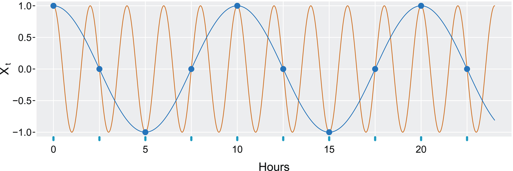
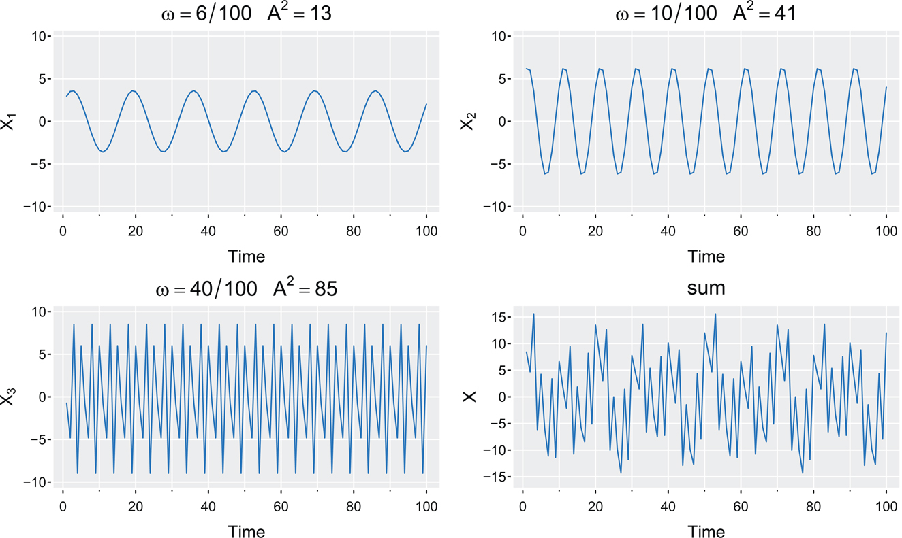
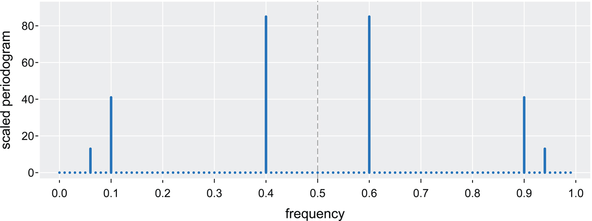
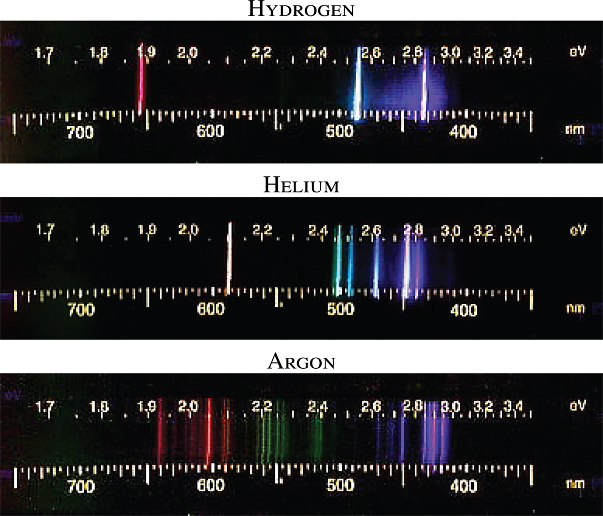
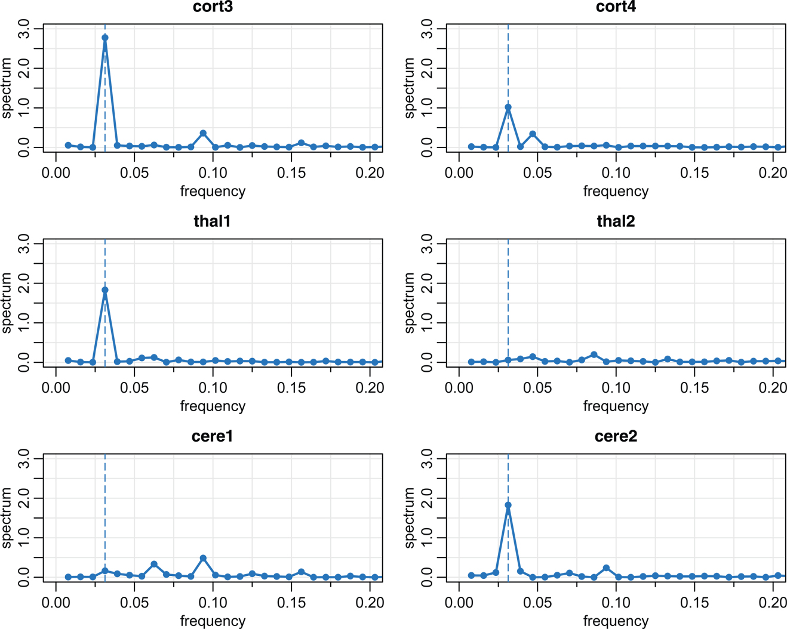
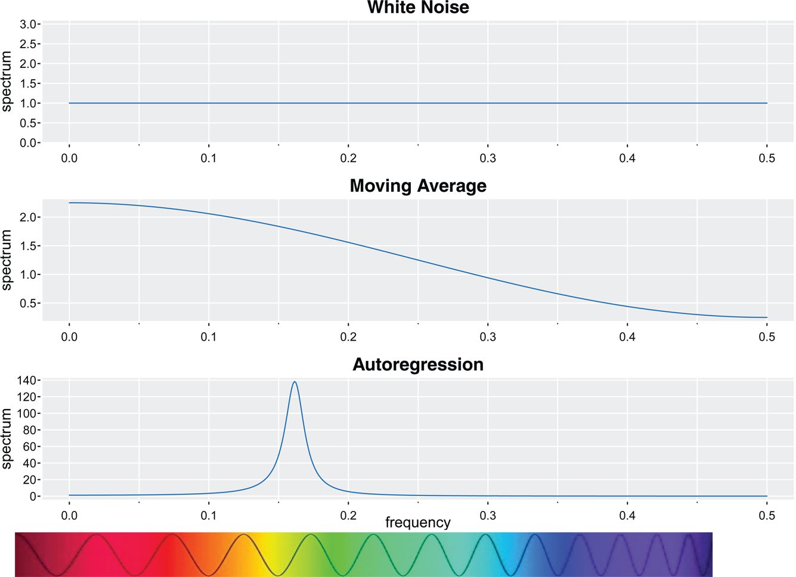
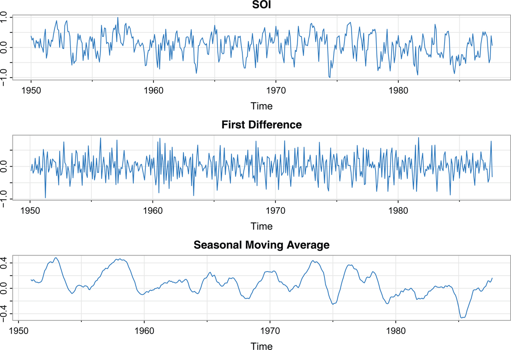
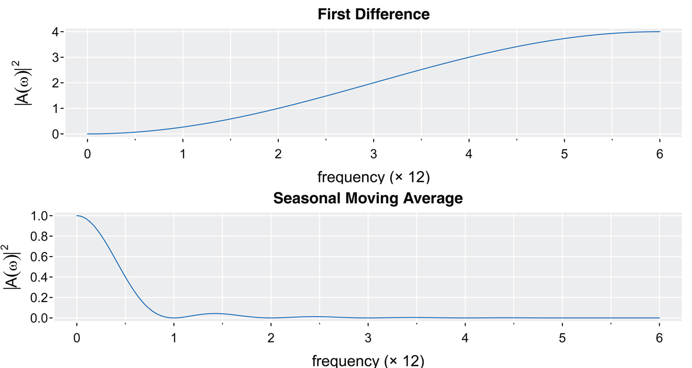

151\. 

# 6Spectral Analysis and Filtering

The cyclic behavior of data is the focus of this and the next chapter. The techniques are typically called the _frequency domain_ approach to time series analysis. Here, the concept of regularity of a series is expressed in terms of periodic variations of the underlying phenomenon that produced the series. Many of the examples in [Chapter 1](#chapter1) are time series that are driven by periodic components.

## 6.1 Periodicity and Cyclical Behavior

As an example of periodic behavior, the predominant frequency (_ω_) in the monthly SOI series shown in [Figure 1.5](#chapter1#fig1_5) is one cycle per year or one cycle every 12 months, ω\=1/12 cycles per observation. This is the obvious hot in the summer, cold in the winter cycle. The El Niño cycle seen in the preliminary analyses of [Section 3.3](#chapter3#sec3_3) is approximately 1 cycle every 4 years (48 months), or ω\=1/48 cycles per observation. The _period_ of a time series is defined as the number of points in a cycle, 1/ω. Hence, the predominant period of the SOI series is 12 months per cycle or 1 year per cycle. The El Niño period is about 48 months or 4 years.

The general notion of periodicity can be made more precise by introducing some terminology. For the rate at which a series oscillates, we first define a _cycle_ as one complete period of a sine or cosine function defined over a unit time interval. As in [Example 1.11](#chapter1#exam1_11), we first consider the periodic process

xt\=Acos(2πωt+φ),(6.1)

where _ω_ is a _frequency_ index defined in cycles per unit time with _A_ determining the height or _amplitude_ of the function and _φ_, called the _phase_, determining the start point of the cosine function. Recall that data from model (6.1) were plotted in [Figure 1.11](#chapter1#fig1_11) for the values A\=2 and φ\=.6π.

We can introduce random variation in this time series by allowing the amplitude _A_ and phase _φ_ to vary randomly. As discussed in [Example 3.16](#chapter3#exam3_16), for purposes of data analysis, it is easier to use the trigonometric identity (B.3) and write (6.1) as

xt\=U1cos(2πωt)+U2sin(2πωt),(6.2)

152\. where U1\=Acos(φ) and U2\=−Asin(φ) are often taken to be independent normal random variables with the same variance.[1](#chapter6#fn6_1)

If we assume that _U_1 and _U_2 are uncorrelated random variables with mean 0 and variance _σ_2, then _xt_ in (6.2) is stationary because E(xt)\=0 \[the (co)sine terms are constants\] and writing λ\=2πω,

γ(t,s)\=cov(xt,xs)\=cov\[U1cos(λt)+U2sin(λt),U1cos(λs)+U2sin(λs)\]\=cov\[U1cos(λt),U1cos(λs)\]+cov\[U1cos(λt),U2sin(λs)\] +cov\[U2sin(λt),U1cos(λs)\]+cov\[U2sin(λt),U2sin(λs)\]\=σ2cos(λt)cos(λs)+0+0+σ2sin(λt)sin(λs)\=σ2\[cos(λt)cos(λs)+sin(λt)sin(λs)\]\=σ2cos(λ(t−s))\=σ2cos(λ|t−s|),(6.3)

which depends only on the time difference, |t−s|. In (6.3) we used a trigonometric angle-sum result (B.3), Property 2.7, and the fact that cov(U1,U2)\=0.

The random process in (6.2) is a function of its frequency, _ω_. Generally we consider data that occur at discrete time points, so we will need at least two points to determine a cycle. This means the highest frequency of interest is 1/2 cycles per point. This frequency is called the _folding frequency_ (or Nyquist frequency) and defines the highest frequency that can be seen in discrete sampling. Higher frequencies sampled this way will appear at lower frequencies, called _aliases_. An example is the way a camera samples a rotating wheel on a moving automobile in a movie where the wheel appears to be rotating at a slow rate; this is often called the _Wagon Wheel Effect_. Typically, movies are recorded at 24 frames per second. If the camera is filming a wheel that is rotating at the rate of 24 cycles per second (or 24 Hertz), the wheel will appear to stand still (for a typical tire size, that's about 110 miles per hour).

To see how aliasing works, consider observing a process that completes 1 cycle every 2 hours at 2.5-hour intervals. Sampled this way, it appears that the process is much slower and making only 1 cycle in 10 hours; see [Figure 6.1](#chapter6#fig6_1).

`t = seq(0, 24, by=.01)`
`X = cos(2*pi*t*1/2)               _# 1 cycle every 2 hours_`
`**tsplot**(t, X, xlab="Hours", **gg**=TRUE, col=7)`
`T = seq(1, length(t), by=250)     _# observed every 2.5 hrs_`
`points(t[T], X[T], pch=19, col=4)`
`lines(t, cos(2*pi*t/10), col=4)`
`axis(1, at=t[T], labels=FALSE, lwd.ticks=3, col.ticks=5, col=gray(1))`

Figure 6.1: Aliasing: A process that makes 1 cycle in 2 hours (or 12 cycles in 24 hours) being sampled every 2.5 hours. Sampled this way, it appears that the process is making only 1 cycle in 10 hours. [Return to text.⏎](chapter6)

\_\_\_\_\_\_\_\_\_\_\_\_\_\_\_\_\_ 1The normal assumption for _U_1 and _U_2 is equivalent to assuming _A_2 is χ22 independent of _ϕ_, which is uniform on (−π,π). [Return to text.⏎](#chapter6#fn6_16b)

153\. Consider a generalization of (6.2) that allows mixtures of periodic series with multiple frequencies and amplitudes,

xt\=∑k\=1q\[Uk1cos(2πωkt)+Uk2sin(2πωkt)\],(6.4)

where Uk1,Uk2, for k\=1,2,…,q, are independent zero-mean random variables with variances σk2, and the _ωk_ are distinct frequencies. Notice that (6.4) exhibits the process as a sum of independent components, with variance σk2 for frequency _ωk_. Following (6.3), we can show ([Problem 6.3](#chapter6#question6_3)) that the autocovariance function of the process is

γ(h)\=∑k\=1qσk2cos(2πωkh),(6.5)

and we note the autocovariance function is the sum of periodic components with weights proportional to the variances σk2. Hence, _xt_ is a mean-zero stationary processes with variance

γ(0)\=var(xt)\=∑k\=1qσk2,

exhibiting the overall variance as a sum of variances of each component.

Example 6.1 A Periodic Series [Return to text.⏎](chapter6)

[Figure 6.2](#chapter6#fig6_2) shows an example of the mixture (6.4) with q\=3 constructed in the following way. First, for t\=1,…,100, we generated three series

xt1\=2cos(2πt 6/100) +3sin(2πt 6/100),xt2\=4cos(2πt 10/100)+5sin(2πt 10/100),xt3\=6cos(2πt 40/100)+7sin(2πt 40/100).

Figure 6.2: Periodic components and their sum as described in[Example 6.1](#chapter6#exam6_1). [Return to text.⏎](chapter6)

154\. These three series are displayed in [Figure 6.2](#chapter6#fig6_2) along with the corresponding frequencies and squared amplitudes. For example, the squared amplitude of xt1 is A2\=22+32\=13. Hence, the maximum and minimum values that xt1 will attain are ±13\=±3.61. Finally, we constructed

xt\=xt1+xt2+xt3

and this series is also displayed in [Figure 6.2](#chapter6#fig6_2). We note that _xt_ appears to behave as some of the periodic series we have already seen. The systematic sorting out of the essential frequency components in a time series, including their relative contributions, constitutes one of the main objectives of spectral analysis. The code for [Figure 6.2](#chapter6#fig6_2) is:

`x1 = 2*cos(2*pi*1:100*6/100) + 3*sin(2*pi*1:100*6/100)`
`x2 = 4*cos(2*pi*1:100*10/100) + 5*sin(2*pi*1:100*10/100)`
`x3 = 6*cos(2*pi*1:100*40/100) + 7*sin(2*pi*1:100*40/100)`
`x = x1 + x2 + x3; L = c(-10,10)`
`par(mfrow = c(2,2))`
`**tsplot**(x1, ylim=L, col=4, main=bquote(omega==6/100~~A^2==13), **gg**=TRUE)`
`**tsplot**(x2, ylim=L, col=4, main=bquote(omega==10/100~~A^2==41), **gg**=TRUE)`
`**tsplot**(x3, ylim=L, col=4, main=bquote(omega==40/100~~A^2==85), **gg**=TRUE)`
`**tsplot**(x, col=4, main="sum", font.main=1, **gg**=TRUE)`

The model given in (6.4) and its autocovariance given (6.5) are population constructs. Given data, our next step would be to estimate the variances σk2 and frequencies _ωk_ that form the model (6.4). If we could observe Uk1\=ak and Uk2\=bk for k\=1,…,q, then an estimate of the _k_th variance component, σk2, of var(xt), would be the sample variance Sk2\=(ak2+bk2)/2. Thus, an estimate of 155\. the total variance of _xt_ would be the sum of the Sk2,

γ^x(0)\=var^(xt)\=12∑k\=1q(ak2+bk2).(6.6)

Example 6.2 Estimation and the Periodogram [Return to text.⏎](chapter6)

For any time series sample x1,…,xn, where _n_ is odd, we may write, _exactly_

xt\=a0+∑j\=1(n−1)/2\[ajcos(2πt j/n)+bjsin(2πt j/n)\],(6.7)

for t\=1,…,n and suitably chosen coefficients. If _n_ is even, the representation (6.7) can be modified by summing to (n/2−1) and adding an additional component given by an/2cos(2πt 12)\=an/2(−1)t. The crucial point here is that (6.7) is exact. Hence (6.4) may be thought of as an approximation to (6.7), the idea being that many of the coefficients in (6.7) may be close to zero.

As a quick demonstration, we generated n\=7 normals, and then ran a regression on sines and cosines with frequencies ω\={1/7,2/7,3/7}; note that the fit is perfect:

`set.seed(1)`
`x   = rnorm(7)`
`t   = 1:7`
`c1 = cos(2*pi*t*1/7)`
`s1 = sin(2*pi*t*1/7)`
`c2 = cos(2*pi*t*2/7)`
`s2 = sin(2*pi*t*2/7)`
`c3 = cos(2*pi*t*3/7)`
`s3 = sin(2*pi*t*3/7)`
`reg = lm(x~ cbind(c1,s1,c2,s2,c3,s3))`
`rbind(x, xhat = fitted(reg)) _# print x and x̂_`
`           1      2       3      4      5       6      7`
`x    -0.6265 0.1836 -0.8356 1.5953 0.3295 -0.8205 0.4874`
`xhat -0.6265 0.1836 -0.8356 1.5953 0.3295 -0.8205 0.4874`

From the regression results in [Chapter 3](#chapter3), the coefficients _aj_ and _bj_ are of the form ∑t\=1nxtztj/∑t\=1nztj2, where ztj is either cos(2πt j/n) or sin(2πt j/n). Using Property B.3, ∑t\=1nztj2\=n/2 when j/n≠0,1/2, so the regression coefficients in (6.7) can be written as a0\=x¯, and

aj\=2n∑t\=1nxtcos(2πtj/n)andbj\=2n∑t\=1nxtsin(2πtj/n),(6.8)

for j\=1,…,n. It should be evident that the coefficients are nearly the correlation of the data with (co)sines oscillating at frequencies of _j_ cycles in _n_ time points.156\. 

Definition 6.3. _The **scaled periodogram** is_

P(j/n)\=aj2+bj2,(6.9)

_where aj and bj are defined in (6.8). The frequencies_ ωj\=j/n _(or j cycles in n time points) are called the **Fourier** or **fundamental frequencies**._

The scaled periodogram is the sample squared amplitude of each frequency component. Large values of P(j/n) indicate which frequencies ωj\=j/n are predominant in the series, whereas small values of P(j/n) may be associated with noise.

It is not necessary to run a large (saturated) regression to obtain the values of _aj_ and _bj_ because they can be computed quickly if _n_ is a highly composite integer. Although we will discuss it in more detail in [Section 7.1](#chapter7#sec7_1), the _discrete Fourier transform_ (DFT) is a complex-valued weighted average of the data given by[2](#chapter6#fn6_2)

d(j/n)\=n−1/2∑t\=1nxt e−2πitj/n\=n−1/2(∑t\=1nxtcos(2πtj/n)−i∑t\=1nxtsin(2πtj/n)),(6.10)

for j\=0,1,…,n−1. Because of a large number of redundancies in the calculation, (6.10) may be computed quickly using the _fast Fourier transform_ (FFT). Note that

|d(j/n)|2\=1n(∑t\=1nxtcos(2πtj/n))2+1n(∑t\=1nxtsin(2πtj/n))2

and it is this quantity that is called the _periodogram_. The scaled periodogram, (6.9), is

P(j/n)\=4n|d(j/n)|2.(6.11)

The scaled periodogram of the data _xt_ simulated in [Example 6.1](#chapter6#exam6_1) is shown in [Figure 6.3](#chapter6#fig6_3), and it clearly identifies the three components xt1,xt2, and xt3 of _xt_. Note that

P(j/n)\=P(1−j/n),j\=0,1,…,n−1,

Figure 6.3: The scaled periodogram (6.11) of the simulated data generated in [Example 6.1](#chapter6#exam6_1). [Return to text.⏎](chapter6)

so there is a mirroring effect at the folding frequency of 1/2; consequently, the periodogram is typically not plotted for frequencies higher than the folding frequency. In addition, note that the heights of the scaled periodogram shown in the figure are

P(6100)\=P(94100)\=13,P(10100)\=P(90100)\=41,P(40100)\=P(60100)\=85,

\_\_\_\_\_\_\_\_\_\_\_\_\_\_\_\_\_ 2If necessary, review the material in [Appendix B](#appB#appB) on complex numbers now. [Return to text.⏎](#chapter6#fn6_26b)

157\. and P(j/n)\=0 otherwise. These are exactly the values of the squared amplitudes of the components generated in [Example 6.1](#chapter6#exam6_1).

`per = Mod(fft(x)/sqrt(100))^2 _# x from Example 6.1_`
`P    = (4/100)*per;   Fr = 0:99/100`
`**tsplot**(Fr, P, type="h", lwd=3, col=4, **gg**=TRUE, ylab="scaled periodogram",`
`   xlab="frequency")   _# Figure 6.3_`

Different packages scale the FFT differently. R computes it without the factor n−1/2 and with an additional factor of e2πiωj that can be ignored because we will be interested in the squared modulus.

If we consider the data _xt_ in this example as a color (waveform) made up of primary colors xt1,xt2,xt3 at various strengths (amplitudes), then we might consider the periodogram as a prism that decomposes the color _xt_ into its primary colors (spectrum), hence the term _spectral analysis_.

Example 6.4 Spectrometry

An optical spectrum is the decomposition of the power or energy of light according to different wavelengths or optical frequencies. Every chemical element has a unique spectral signature that can be revealed by analyzing the light it gives off. In astronomy, for example, there is an interest in the spectral analysis of objects in space. From the simple spectroscopic analysis of a celestial body, we can determine its chemical composition from the spectra.

[Figure 6.4](#chapter6#fig6_4) shows the spectral signature of hydrogen, helium, and argon. The wavelengths of visible light are quite small, between about 400 and 700 nanometers (nm) shown as the bottom scale. The top scale in the figure is electron voltage (eV), which is proportional to frequency (_ω_). Note that the longer the wavelength (1/ω), the slower the frequency, with red being the slowest and violet being the fastest in the visible spectrum.

Figure 6.4: The spectral signature of hydrogen, helium, and argon. Nanometers (nm - bottom scale) is a measure of wavelength or period, and electron voltage (eV - top scale) is a measure of frequency. Figures provided by Professor J. E. Barnes, Institute for Astronomy, University of Hawaii. [Return to text.⏎](chapter6)

We can apply the concepts of spectrometry to the statistical analysis of data from numerous disciplines. The following is an example using the fMRI data set.158\. 

Example 6.5 Functional Magnetic Resonance Imaging (revisited) [Return to text.⏎](chapter6)

In [Example 1.6](#chapter1#exam1_6), we looked at data that were collected from various locations in the brain via fMRI. In the experiment, a stimulus was applied for 32 seconds and then stopped for 32 seconds with a sampling rate of one observation every 2 seconds for 256 seconds. The series are bold intensity, which measures areas of activation in the brain and are displayed in [Figure 1.7](#chapter1#fig1_7). In [Example 1.6](#chapter1#exam1_6), we noticed that the stimulus signal was strong in the motor cortex series, but it was not clear if the signal was present in the thalamus and cerebellum locations.

A simple periodogram analysis of each series shown in [Figure 1.7](#chapter1#fig1_7) can help answer this question, and the results are displayed in [Figure 6.5](#chapter6#fig6_5). We note that the stimulus signal is strong in four locations, whereas the signal is missing from the second thalamus location and the first cerebellum location. We address the question of when a periodogram ordinate is significant in the next chapter. An easy way to calculate the periodogram is to use mvspec as follows:

`par(mfrow=c(3,2))`
`for(i in 4:9){`
`**mvspec**(**fmri1**[,i], main=colnames(**fmri1**)[i], ylim=c(0,3), xlim=c(0,.2), col=4,`
`   lwd=2, type="o", pch=20)`
`abline(v=1/32, col=4, lty=5)   _# mark stimulus frequency_`
`}`

Figure 6.5: Periodograms of the fMRI series shown in [Figure 1.7](#chapter1#fig1_7). The vertical dashed line indicates the stimulus frequency of 1 cycle every 64 seconds (32 points). [Return to text.⏎](chapter6)

159\. The periodogram was developed as a sample based statistic for measuring frequency dependent variance. These components, however, are population parameters. How the sample statistics relate to the population parameters is the topic of the next section.

## 6.2 Spectral Density

The idea that a time series is composed of periodic components appearing in proportion to their underlying variances is fundamental to spectral analysis.

> A result called the **_Spectral Representation Theorem_**, which is quite technical, can vaguely be interpreted as _decomposition (6.4) is approximately true for any stationary time series_.

The examples in the previous section, however, are not generally realistic because time series are rarely exactly sinusoids (but only approximately of that form). In this section, we deal with a more realistic situation.

160\. Decomposition (6.4) may be thought of as a discrete distribution (of frequency dependent variances), whereas we now will consider continuous distributions. Hence, decomposition (6.4) can be thought of as a discrete approximation to a continuous distribution.

Property 6.6 (The Spectral Density). _If the autocovariance function of a stationary process is absolutely summable,_

∑h\=−∞∞|γ(h)|<∞,(6.12)

_then it may be written as_

γ(h)\=∫−1/21/2e2πiωh f(ω) dω(6.13)

_for_ h\=0,±1,±2,…, _where_

f(ω)\=∑h\=−∞∞γ(h)e−2πiωh(6.14)

_for_ −1/2≤ω≤1/2, _is called the spectral density of the process._

Condition (6.12) states that the correlation between values of a time series that are very far apart in time must be negligible. We note that the absolute summability condition, (6.12), is not satisfied by (6.5), which is the example we used to introduce the idea of a spectral representation. The condition, however, is satisfied for ARMA models. Because of the inverse relationships, the autocovariance function and the spectral density contain the same information but expressed in different ways. The autocovariance function measures dependence in terms of lags and the spectral density measures dependence in terms of periodicity.

Properties of γ(h) ensure that f(ω)≥0 for all _ω_, and that the spectral density is real-valued and even,

f(ω)\=f(−ω).

Because of the evenness, we will typically only plot f(ω) for ω≥0. In addition, putting h\=0 in (6.13) yields

γ(0)\=var(xt)\=∫−1/21/2f(ω) dω,

which expresses the total variance as the integrated spectral density over all of the frequencies. These results show that the spectral density is a density, not of probabilities, but rather of variances. We will explore this idea further as we proceed.

It is illuminating to examine the spectral density for the series that we have looked at in earlier discussions.161\. 

Example 6.7 White Noise – The Uniform Spectral Density [Return to text.⏎](chapter6)

As a simple example, consider the theoretical power spectrum of a sequence of uncorrelated random variables, _wt_, with variance σw2. A simulated set of data is displayed in the top of [Figure 1.8](#chapter1#fig1_8). Because the autocovariance function is γw(h)\=σw2 for h\=0, and zero otherwise (recall [Example 2.6](#chapter2#exam2_6)), it follows from (6.14), that

fw(ω)\=∑h\=−∞∞γw(h) e−2πiωh\=σw2

for −1/2≤ω≤1/2. Hence the process contains equal power at all frequencies. In fact, the name white noise comes from the analogy to white light, which contains all frequencies in the color spectrum at the same level of intensity. [Figure 6.6](#chapter6#fig6_6) shows a plot of the white noise spectrum for σw2\=1.

Figure 6.6: [Examples 6.7](#chapter6#exam6_7), [6.9](#chapter6#exam6_9), and [6.10](#chapter6#exam6_10): Theoretical spectra of white noise (top), an MA(1) with θ\=.5 (middle), and an AR(2) with ϕ1\=1 and ϕ2\=−.9 (bottom). [Return to text.⏎](chapter6)

If _xt_ is ARMA, its spectral density can be obtained explicitly using the fact that it is a linear process, i.e.,

xt\=∑j\=0∞ψjwt−j,

where ∑j\=0∞|ψj|<∞. In the following property, we exhibit the form of the spectral density of an ARMA model. The proof of the property follows directly from the proof of a more general result, [Property 6.11](#chapter6#prop6_11).

Property 6.8 (ARMA Spectral Density). [Return to text.⏎](chapter6) _If xt is ARMA(p,q)_, ϕ(B)xt\=θ(B)wt, _or equivalently_, xt\=ψ(B)wt, _its spectral density is given by_

fx(ω)\=σw2|ψ(e−2πiω)|2(6.15)

_where_ ψ(z)\=∑k\=0∞ψkzk. _Rather than work with the ψ-weights directly, we can use the following relationship,_

|ψ(z)|2\=|θ(z)|2|ϕ(z)|2

_where_ ϕ(z)\=1−∑k\=1pϕkzk, _and_ θ(z)\=1+∑k\=1qθkzk

The spectral densities of some specific models are displayed in [Figure 6.6](#chapter6#fig6_6) using the **arma.spec** script from astsa:

`par(mfrow=c(3,1))`
`**arma.spec**(main="White Noise", col=4, **gg**=TRUE)`
`**arma.spec**(ma=.5, main="Moving Average", col=4, **gg**=TRUE)`
`**arma.spec**(ar=c(1,-.9), main="Autoregression", col=4, **gg**=TRUE)`

The details for the MA and AR spectra are given in the following examples.162\. 

Example 6.9 Moving Average [Return to text.⏎](chapter6)

As an example of a series that does not have an equal mix of frequencies, we consider a moving average model. Specifically, consider the MA(1) model given by

xt\=wt+.5wt−1.

Recalling [Figure 4.3](#chapter4#fig4_3), the realization with positive _θ_ will have less of the higher or faster frequencies. The spectral density will verify this observation.

The autocovariance function is displayed in [Example 4.5](#chapter4#exam4_5), and for this particular example, we have

γ(0)\=(1+.52)σw2\=1.25σw2;γ(±1)\=.5σw2;γ(±h)\=0 for h\>1.

Substituting this directly into the definition given in (6.14), we have

f(ω)\=∑h\=−∞∞γ(h) e−2πiωh\=σw2\[1.25+.5(e−2πiω+e2πiω)\]\=σw2\[1.25+cos(2πω)\],

which is plotted in the middle of [Figure 6.6](#chapter6#fig6_6) with σw2\=1. In this case, the lower or slower frequencies have greater power than the higher or faster frequencies.

163\. We can also compute the spectral density using [Property 6.8](#chapter6#prop6_8), which states that for an MA, f(ω)\=σw2|θ(e−2πiω)|2. Because θ(z)\=1+.5z, we have

|θ(e−2πiω)|2\=|1+.5e−2πiω|2\=(1+.5e−2πiω)(1+.5e2πiω)\=1+.5e−2πiω+.5e2πiω+.25 e−2πiωe2πiω\=1.25+.5(e−2πiω+e2πiω)\=1.25+cos(2πω).

Example 6.10 Second-Order Autoregression [Return to text.⏎](chapter6)

We now consider the spectrum of an AR(2) series of the form

xt\=xt−1−.9xt−2+wt.

It's easier to use [Property 6.8](#chapter6#prop6_8) here. Note that θ(z)\=1, ϕ(z)\=1−z+.9z2, and

|ϕ(e−2πiω)|2\=(1−e−2πiω+.9e−4πiω)(1−e2πiω+.9e4πiω)\=2.81−1.9(e2πiω+e−2πiω)+.9(e4πiω+e−4πiω)\=2.81−3.8cos(2πω)+1.8cos(4πω).

Using this result in (6.15), we have that the spectral density of _xt_ is

fx(ω)\=σw22.81−3.8cos(2πω)+1.8cos(4πω).

The bottom of [Figure 6.6](#chapter6#fig6_6) displays fx(ω) with σw\=1, and it shows a strong power component at about ω\=.16 cycles per point or a period between six and seven cycles per point and very little power at other frequencies. In this case, the series is nearly sinusoidal, but not exact, which seems more realistic for actual data.

The spectral density can also be obtained from first principles without having to use [Property 6.8](#chapter6#prop6_8). Because wt\=xt−xt−1+.9xt−2 in this example, we have

γw(h)\=cov(wt+h,wt)\=cov(xt+h−xt+h−1+.9xt+h−2, xt−xt−1+.9xt−2)\=2.81γx(h)−1.9\[γx(h+1)+γx(h−1)\]+.9\[γx(h+2)+γx(h−2)\].

Now, substituting the spectral representation (6.13) for γx(h) in the above equation yields

γw(h)\=∫−1/21/2\[2.81−1.9(e2πiω+e−2πiω)+.9(e4πiω+e−4πiω)\]e2πiωhfx(ω)dω\=∫−1/21/2\[2.81−3.8cos(2πω)+1.8cos(4πω)\]e2πiωhfx(ω)dω.

164\. If the spectrum of the white noise process, _wt_, is gw(ω), the uniqueness of the Fourier transform allows us to identify

gw(ω)\=\[2.81−3.8cos(2πω)+1.8cos(4πω)\]fx(ω).

But, as we have already seen, gw(ω)\=σw2, from which we deduce that

fx(ω)\=σw22.81−3.8cos(2πω)+1.8cos(4πω)

is the spectrum of the autoregressive series.

## 6.3 Linear Filters \*

Some examples have hinted at the possibility that the distribution of power or variance in a time series can be modified by making a linear transformation. In this section, we explore that notion further by defining a _linear filter_ and showing how it can be used to extract signals from a time series. The linear filter modifies the spectral characteristics of a time series in a predictable way, and the systematic development of methods for taking advantage of the special properties of linear filters is an important topic in time series analysis.

A linear filter uses a set of specified coefficients _aj_, for j\=0,±1,±2,…, to transform an input series, _xt_, producing an output series, _yt_, of the form

yt\=∑j\=−∞∞ajxt−j,∑j\=−∞∞|aj|<∞.(6.16)

The form (6.16) is also called a convolution. The coefficients, collectively called the _impulse response function_, are required to satisfy absolute summability so that

Ayx(ω)\=∑j\=−∞∞aj e−2πiωj,(6.17)

called the _frequency response function_, is well defined. We have already encountered several linear filters, for example, the simple three-point moving average in [Example 1.8](#chapter1#exam1_8), which can be put into the form of (6.16) by letting a0\=a±1\=1/3 and taking aj\=0 otherwise.

The importance of the linear filter stems from its ability to enhance certain parts of the spectrum of the input series. We now state the following result, which is analogous to the fact that if X\=aY, then var(X)\=a2var(Y).165\. 

Property 6.11 (Output Spectrum). [Return to text.⏎](chapter6) _Assuming existence of spectra, the spectrum of the filtered output yt in (6.16) is related to the spectrum of the input xt by_

fy(ω)\=|Ayx(ω)|2 fx(ω),(6.18)

_where the frequency response function_ Ayx(ω) _is defined in (6.17)._

_Proof._ The autocovariance function of the filtered output _yt_ in (6.16) is

γy(h)\=cov(yt+h,yt)\=cov(∑rarxt+h−r,∑sasxt−s)\=∑r∑sarγx(h−r+s)as\=\[1\]∑r∑sar\[∫−1/21/2 e2πiω(h−r+s)fx(ω)dω\] as\=∫−1/21/2(∑rare−2πiωr)(∑sase2πiωs) e2πiωhfx(ω) dω\=\[2\]∫−1/21/2 e2πiωh|Ayx(ω)|2fx(ω)⏟fy(ω) dω,

where we have, \[1\] replaced γx(⋅) by its representation (6.13), and \[2\] substituted Ayx(ω) from (6.17). The result holds by exploiting the uniqueness of the Fourier transform. □

The result (6.18) enables us to calculate the exact effect on the spectrum of any given filtering operation. This important property shows the spectrum of the input series is changed by filtering and the effect of the change can be characterized as a frequency-by-frequency multiplication by the squared magnitude of the frequency response function.

Finally, we mention that [Property 6.8](#chapter6#prop6_8), which was used to get the spectrum of an ARMA process, is just a special case of [Property 6.11](#chapter6#prop6_11) where in (6.16), xt\=wt is white noise, in which case fx(ω)\=σw2, and aj\=ψj so that

Ayx(ω)\=ψ(e−2πiω)\=θ(e−2πiω)/ϕ(e−2πiω).

Example 6.12 First Difference and Moving Average Filters

We illustrate the effect of filtering with two common examples, the first difference filter

yt\=∇xt\=xt−xt−1

166\. and the symmetric moving average filter

yt\=124(xt−6+xt+6)+112∑r\=−55xt−r,

which is a seasonal smoother. The results of filtering the SOI series using the two filters are shown in the middle and bottom panels of [Figure 6.7](#chapter6#fig6_7). Notice that the effect of differencing is to roughen the series because it tends to retain the higher or faster frequencies. The centered moving average smoothes the series because it retains the lower frequencies and tends to attenuate the higher frequencies. In general, differencing is an example of a _high-pass filter_ because it retains or passes the higher frequencies, whereas the moving average is a _low-pass filter_ because it passes the lower or slower frequencies.

Figure 6.7: SOI series (top) compared with the differenced SOI (middle) and a 12-month moving average (bottom). [Return to text.⏎](chapter6)

Notice that the slower periods are enhanced in the symmetric moving average and the seasonal or yearly frequencies are attenuated. The filtered series makes about 9 to 10 cycles in the length of the data (about one cycle every 48 months) and the moving average filter tends to enhance or _extract_ the signal that is associated with El Niño. Moreover, by the low-pass filtering of the data, we get a better sense of the El Niño effect and its irregularity.

Now, having done the filtering, it is essential to determine the exact way in which the filters change the input spectrum. We shall use (6.17) and (6.18) for this purpose. The first difference filter can be written in the form (6.16) by 167\. letting a0\=1,a1\=−1, and ar\=0 otherwise. This implies that

Ayx(ω)\=1−e−2πiω,

and the squared frequency response becomes

|Ayx(ω)|2\=(1−e−2πiω)(1−e2πiω)\=2\[1−cos(2πω)\].

The top panel of [Figure 6.8](#chapter6#fig6_8) shows that the first difference filter will attenuate the lower frequencies and enhance the higher frequencies because the multiplier of the spectrum, |Ayx(ω)|2, is large for the higher frequencies and small for the lower frequencies. Generally, the slow rise of this kind of filter does not particularly recommend it as a procedure for retaining only the high frequencies.

Figure 6.8: Squared frequency response functions of the first difference (top) and 12-month moving average (bottom) filters. [Return to text.⏎](chapter6)

For the centered 12-month moving average, we can take a−6\=a6\=1/24, ak\=1/12 for −5≤k≤5 and ak\=0 elsewhere. Substituting and recognizing the cosine terms gives

Ayx(ω)\=112\[1+cos(12πω)+2∑k\=15cos(2πωk)\].(6.19)

Plotting the squared frequency response of this function as in [Figure 6.8](#chapter6#fig6_8) shows that we can expect this filter to zero-out most of the frequency content above 1/12 cycles per point (the annual cycle). The result is that this drives down the yearly component of 12 months and enhances the El Niño frequency, which is somewhat lower. The filter is not completely efficient at attenuating high frequencies; some power contributions are left at higher frequencies, as shown 168\. in the function |Ayx(ω)|2 and in the spectrum of the moving average shown in [Figure 6.6](#chapter6#fig6_6).

The following session shows how to filter the data and plot the squared frequency response curves of the difference and moving average filters.

`k = kernel("modified.daniell", 6)   _# seasonal MA weights_`
`tsplot(cbind(soi, diff(soi), kernapply(soi, k)), col=4, ylab=NA, title=c("SOI",`
`   "First Difference","Seasonal Moving Average"))`
` `
`_##-- frequency responses --##_`
`w      = seq(0, .5, by=.001)`
`FRdiff = abs(1-exp(2i*pi*w))^2`
` u     = rowSums(cos(outer(w, 2*pi*1:5)))`
`FRma   = ((1 + cos(12*pi*w) + 2*u)/12)^2`
`**tsplot**(12*w, cbind(FRdiff, FRma), col=4, ylab=NA, xlab="frequency (\u00D7 12)",`
`   title=c("First Difference","Seasonal Moving Average"), **gg**=TRUE)`

## Problems

* 6.1. Repeat the simulations and analyses in [Example 6.1](#chapter6#exam6_1) and [Example 6.2](#chapter6#exam6_2) with the following changes:  
   1. Change the sample size to n\=128 and generate and plot the same series as in [Example 6.1](#chapter6#exam6_1):  
   xt1\=2cos(2π.06 t)+3sin(2π.06 t),xt2\=4cos(2π.10 t)+5sin(2π.10 t),xt3\=6cos(2π.40 t)+7sin(2π.40 t),xt\=xt1+xt2+xt3.  
   What is the major difference between these series and the series generated in [Example 6.1](#chapter6#exam6_1)? (Hint: The answer is _fundamental_. But if your answer is the series are longer, you may be punished severely.)  
   2. As in [Example 6.2](#chapter6#exam6_2), compute and plot the periodogram of the series, _xt_, generated in (a) and comment.  
   3. Repeat the analyses of (a) and (b) but with n\=100 (as in [Example 6.1](#chapter6#exam6_1)) and adding noise to _xt_, that is  
   xt\=xt1+xt2+xt3+wt  
   where wt∼ iid N(0,σw\=5). In other words, simulate and plot the data with these changes, and then plot the periodogram of _xt_ and comment.169\.
* 6.2. For the first two bold series located in the cortex for the experiment discussed in [Example 6.5](#chapter6#exam6_5), use the periodogram to discover if those locations are responding to the stimulus. The series are in **fmri1**\[,2:3:\] and were left out of the analysis of [Example 6.5](#chapter6#exam6_5).
* 6.3. Verify (6.5).
* 6.4. Consider an MA(1) process  
xt\=wt+θwt−1,  
where _θ_ is a parameter.  
   1. Derive a formula for the power spectrum of _xt_, expressed in terms of _θ_ and _ω_.  
   2. Use **arma.spec** to plot the spectral density of _xt_ for θ\=.9 and for θ\=−.9. How should we interpret the two spectra?
* 6.5. Consider a first-order autoregressive model  
xt\=ϕxt−1+wt,  
where _ϕ_, for |ϕ|<1, is a parameter and the _wt_ is white noise with variance σw2.  
   1. Show that the power spectrum of _xt_ is given by  
   fx(ω)\=σw21+ϕ2−2ϕcos(2πω).  
   2. Verify the autocovariance function of this process is  
   γx(h)\=σw2 ϕ|h|1−ϕ2,  
   h\=0,±1,±2,…, by showing that the inverse transform of γx(h) is the spectrum derived in part (a).  
   3. Use **arma.spec** to plot the spectral density of _xt_ for ϕ\=.9 and for ϕ\=−.9. How should we interpret the two spectra?
* 6.6. In applications, we will often observe series containing a signal that has been delayed by some unknown time _D_, i.e.,  
xt\=st+Ast−D+nt,  
where _st_ and _nt_ are stationary and independent with zero means and spectral densities fs(ω) and fn(ω), respectively. The delayed signal is multiplied by some unknown constant _A_. Find the autocovariance function of _xt_ and use it to show  
fx(ω)\=\[1+A2+2Acos(2πωD)\]fs(ω)+fn(ω).  
170\.
* 6.7. \* Suppose _xt_ is stationary, and we apply two filtering operations in succession,  
yt\=∑rarxt−rthenzt\=∑sbsyt−s.  
   1. Use [Property 6.11](#chapter6#prop6_11) to show the spectrum of the output is  
   fz(ω)\=|A(ω)|2|B(ω)|2fx(ω),  
   where A(ω) and B(ω) are the Fourier transforms of the filter sequences _at_ and _bt_, respectively.  
   2. What would be the effect of applying the filter  
   ut\=xt−xt−12followed byvt\=ut−ut−1  
   to a time series?  
   3. Plot the frequency responses of the filters associated with _ut_ and _vt_ described in part (b).
* 6.8. \* Verify (6.19).

---

