
171\. 

# 7Spectral Estimation

We are now ready to discuss estimating a spectral density. There are two general methods that are typically called nonparametric and parametric spectral estimation. In the nonparametric method, which we discuss first, no assumption is made about the spectral density except that it is one. In the parametric method, we assume that the spectral density belongs to a parametric family.

## 7.1 Periodogram and Discrete Fourier Transform

We start by defining the discrete Fourier transform[1](#chapter7#fn7_1).

Definition 7.1. [Return to text.⏎](chapter7) _Given data_ x1,…,xn, _the **discrete Fourier transform (DFT)** is given by_

d(ωj)\=n−1/2∑t\=1nxt e−2πiωjt

_for_ j\=0,1,…,n−1, _where the frequencies_ ωj\=j/n _are the **Fourier** or **fundamental frequencies**._

If _n_ is a highly composite integer (i.e., n\=2p 3q 5r for integers _p,q,r_), the DFT can be computed efficiently by the fast Fourier transform (FFT) introduced in [Cooley and Tukey (1965)](#bibref1#refbib_13). Sometimes, it is helpful to exploit the inversion result for DFTs, which shows the linear transformation is one-to-one. For the _inverse DFT_ we have,

xt\=n−1/2∑j\=0n−1d(ωj) e2πiωjt

for t\=1,…,n. The following example shows how to calculate the DFT and its inverse for the data set {1,2,3,4}.

`( dft = fft(1:4)/sqrt(4) )`
`  [1] 5+0i -1+1i -1+0i -1-1i`
`fft(dft, inverse=TRUE)/sqrt(4)`
`  [1] 1+0i 2+0i 3+0i 4+0i`

\_\_\_\_\_\_\_\_\_\_\_\_\_\_\_\_\_ 1Complex numbers are reviewed in [Appendix B](#appB#appB). [Return to text.⏎](#chapter7#fn7_17b)

172\. We now define the periodogram as the squared modulus of the DFT.

Definition 7.2. _Given data_ x1,…,xn, _the **periodogram** is_

I(ωj)\=|d(ωj)|2(7.1)

_for_ j\=0,1,2,…,n−1, _where_ d(ωj) _is given in [Definition 7.1](#chapter7#defi7_1)._

We note that I(0)\=nx¯2 where x¯ is the sample mean. This number can be very large depending on the magnitude of the mean, which does not have anything to do with the cyclic behavior of the data. Consequently, the mean is usually subtracted from the data prior to a spectral analysis so that I(0)\=0.

For non-zero frequencies, we can show (details in [Problem 7.4](#chapter7#question7_4))

I(ωj)\=∑h\=−(n−1)n−1γ^(h)e−2πiωjh,(7.2)

where γ^(h) is the estimate of γ(h) that we saw in (2.12). In view of (7.2), the periodogram, I(ωj), is the sample version of f(ωj) given in (6.14). That is, we may think of the periodogram as the _sample spectral density_ of _xt_. Although I(ωj) seems like a reasonable estimate of f(ω), we will eventually realize that it is only the starting point.

It is sometimes useful to work with the real and imaginary parts of the DFT individually. To this end, we define the following transforms. \[3\]

Definition 7.3. _Given data_ x1,…,xn, _the **cosine transform** is_

dc(ωj)\=n−1/2∑t\=1nxtcos(2πωjt)(7.3)

_and the **sine transform** is_

ds(ωj)\=n−1/2∑t\=1nxtsin(2πωjt)(7.4)

_where_ ωj\=j/n _for_ j\=0,1,…,n−1.

Note that dc(ωj) and ds(ωj) are sample averages (like x¯) but with sinusoidal weights (the sample mean has weight 1/n for each observation). Under appropriate conditions, there is a central limit theorem (see [Section A.9](#appA#secA_9)) for these quantities given by

dc(ωj)∼⋅N(0,12f(ωj))andds(ωj)∼⋅N(0,12f(ωj)),(7.5)

173\. where ∼⋅ means _approximately distributed as_ for large _n_. Moreover, it can be shown that for large _n_, dc(ωj),ds(ωj),dc(ωk),ds(ωk) are mutually independent as long as ωj≠ωk. If _xt_ is Gaussian, then (7.5) and the subsequent independence statement are exactly true for any sample size.

We note that d(ωj)\=dc(ωj)−i ds(ωj) and hence the periodogram is

I(ωj)\=|dc(ωj)−i ds(ωj)|2\=dc2(ωj)+ds2(ωj),

which for large _n_ is the sum of the squares of two independent normal random variables, which has a chi-squared (_χ_2) distribution when appropriately normalized (see [Section A.4](#appA#secA_4)). Thus, by (7.5),

2 I(ωj)f(ωj)∼⋅χ22,(7.6)

where χ22 is the chi-squared distribution with 2 degrees of freedom. Since the mean and variance of a χν2 distribution are _ν_ and 2ν, respectively, it follows from (7.6) that

E(2 I(ωj)f(ωj))≈2andvar(2 I(ωj)f(ωj))≈4,

so that

E\[I(ωj)\]≈f(ωj)andvar\[I(ωj)\]≈f2(ωj).(7.7)

This is bad news because, while the periodogram is approximately unbiased, its variance does not go to zero with increasing sample sizes. Thus, the periodogram will never get close to the true spectrum no matter how many observations we have. Contrast this with the mean x¯ of a random sample of size _n_ for which E(x¯)\=μ and var(x¯)\=σ2/n→0 as n→∞.

The distributional result (7.6) can be used to derive an approximate confidence interval as is done for variances. Let χν2(α) denote the lower _α_ probability tail for the chi-squared distribution with _ν_ degrees of freedom. Then, an approximate 100(1−α) % confidence interval for the spectral density function would be of the form

2 I(ωj)χ22(1−α/2)≤f(ω)≤2 I(ωj)χ22(α/2).

The log transform is the variance stabilizing transformation. In this case, the confidence intervals are of the form

\[logI(ωj)−log12χ22(1−α2), logI(ωj)−log12χ22(α2)\].

Often, nonstationary trends are present that should be eliminated before computing the periodogram. Trends introduce extremely low frequency components in the periodogram that tend to obscure the appearance at higher frequencies. For this reason, it is conventional to center the data prior to a spectral analysis using 174\. either mean-adjusted data of the form xt−x¯ to eliminate the zero component or to use detrended data such as xt−β^1−β^2t. We note that the scripts in the astsa and stats packages detrend the data this way by default.

When calculating the DFT, and hence the periodogram, the fast Fourier transform (FFT) algorithm is used. The FFT utilizes a number of redundancies in the calculation of the DFT when _n_ is highly composite, that is, an integer with many factors of 2,3, or 5\. To accommodate this property, the data are detrended (or centered) and then padded with zeros to the next highly composite integer _n_′. This means that the fundamental frequency ordinates will be ωj\=j/n′ instead of j/n. We illustrate by considering the periodogram of the SOI and Recruitment series shown in [Figure 1.5](#chapter1#fig1_5). Recall that they are monthly series and n\=453 months. To find _n_′, use the command nextn(453) to see that n′\=480 will be used in the spectral analyses by default.

Example 7.4 Periodogram of SOI and Recruitment Series [Return to text.⏎](chapter7)

[Figure 7.1](#chapter7#fig7_1) shows the periodograms of each series, where the frequency axis is labeled in multiples of years. As previously indicated, the centered data have been padded to a series of length 480\. We notice a narrow-band peak at the 175\. obvious yearly cycle, ω\=1. In addition, there is considerable power in a wide band at the lower frequencies (about 2 to 7 years) roughly around the four-year cycle ω\=1/4 representing a possible El Niño effect. This wide band activity suggests that the El Niño cycle is irregular.

`par(mfrow=c(2,1))`
`**mvspec**(**soi**, col=4, lwd=2)`
`  rect(1/7, -1e5, 1/2, 1e5, density=NA, col=gray(.5,.2))`
`  abline(v=1/4, lty=2, col=4)`
`  mtext("1/4", side=1, line=0, at=.25, cex=.75)`
`**mvspec**(**rec**, col=4, lwd=2)`
`  rect(1/7, -1e5, 1/2, 1e5, density=NA, col=gray(.5,.2))`
`  abline(v=1/4, lty=2, col=4)`
`  mtext("1/4", side=1, line=0, at=.25, cex=.75)`

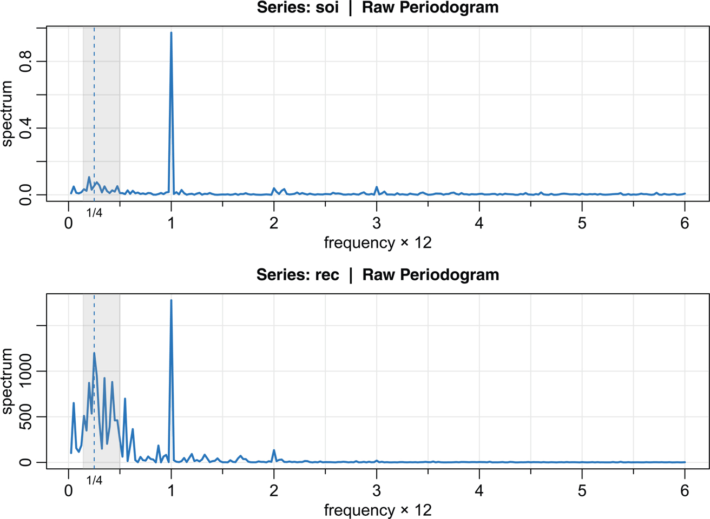

Figure 7.1: Periodogram of SOI and Recruitment: The frequency axis is in terms of years. The common peaks are at ω\=1 cycle per year, and some values near ω\=1/4, or one cycle every four years. The gray band shows periods between 2 and 7 years. [Return to text.⏎](chapter7)

We can construct confidence intervals from the information in the **mvspec** object, but plotting the spectra on a log scale will also produce a generic interval (“centered” at the tick mark) as seen in [Figure 7.2](#chapter7#fig7_2). Notice that, because there are only 2 degrees of freedom at each frequency, the generic confidence interval is too wide to be of much use. We will address this problem next.

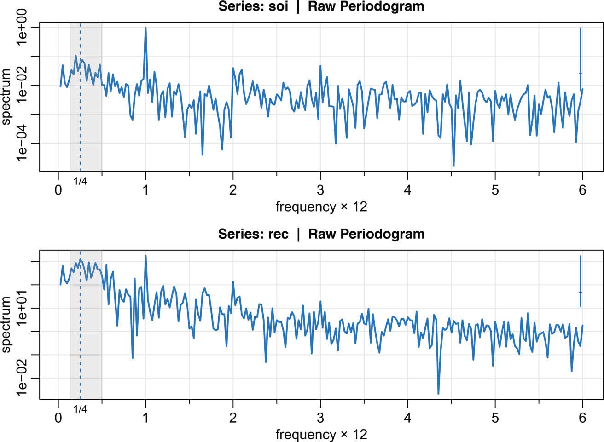

Figure 7.2: Log-periodogram of SOI and Recruitment. 95% confidence intervals are indicated by the blue line in the upper right corner. Imagine placing the horizontal tick mark on the log-periodogram ordinate at a desired frequency; the vertical line then gives the interval. [Return to text.⏎](chapter7)

176\. To display the periodograms on a log scale, add log=“y” in the **mvspec**() call (and also change the ybottom value of the rectangle rect() to 1e-5 ). For example,

`**mvspec**(**soi**, col=4, lwd=2, log="y")`
`  rect(1/7, 1e-5, 1/2, 1e5, density=NA, col=gray(.5,.2))`
`  abline(v=1/4, lty=2, col=4)`
`  mtext("1/4", side=1, line=0, at=.25, cex=.75)`

The periodogram as an estimator is susceptible to large uncertainties. This happens because the periodogram uses only two pieces of information at each frequency no matter how many observations are available.

## 7.2 Nonparametric Spectral Estimation

The solution to the periodogram dilemma is smoothing, and is based on the same ideas as in [Section 3.3](#chapter3#sec3_3). To understand the problem, we will examine the periodogram of 1000 independent standard normals (white normal noise) in [Figure 7.3](#chapter7#fig7_3). The true spectral density is the uniform density with a height of 1\. The periodogram is highly variable, but averaging helps.[2](#chapter7#fn7_2)

`u = **mvspec**(rnorm(1000), col=8, **gg**=TRUE) _# periodogram_`
`abline(h=1, col=2, lwd=5)               _# true spectrum_`
`sm = filter(u$spec, filter=rep(1,101)/101, circular=TRUE) _# smooth_`
`lines(u$freq, sm, col=5, lwd=2)         _# add the smooth_`

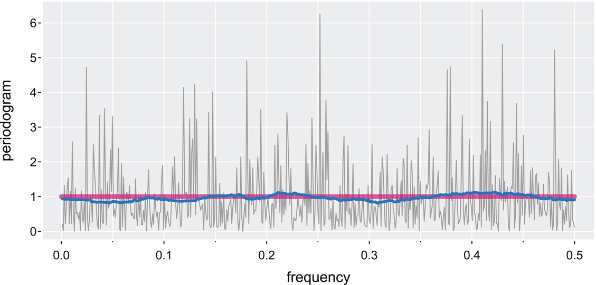

Figure 7.3: Periodogram of 1000 independent standard normals (white normal noise). The red straight line is the theoretical spectrum (uniform density) and the jagged blue line is a moving average of 101 periodogram ordinates. [Return to text.⏎](chapter7)

\_\_\_\_\_\_\_\_\_\_\_\_\_\_\_\_\_ 2If the package dplyr is loaded, see the warning in _Hints for Selected Exercises_. [Return to text.⏎](#chapter7#fn7_27b)

177\. We introduce a _frequency band_, B, of L≪n contiguous fundamental frequencies centered around frequency ωj\=j/n, which is chosen close to the frequency of interest, _ω_. Let

B\={ωj+k/n: k\=0,±1,…,±m},(7.8)

where

L\=2m+1

is an odd number chosen such that the spectral values in the interval B,

f(ωj+k/n),k\=−m,…,0,…,m

are approximately equal to f(ω).

We now define an averaged periodogram as the simple average of the periodogram values,

f¯(ω)\=1L∑k\=−mmI(ωj+k/n),(7.9)

over the band B. Under the assumption that the spectral density is fairly constant in the band B, and in view of the discussion around (7.5), we can show that, for large _n_,

2Lf¯(ω)f(ω)∼⋅χ2L2.(7.10)

Now we have

E\[f¯(ω)\]≈f(ω)andvar\[f¯(ω)\]≈f2(ω)/L,(7.11)

which can be compared to (7.7). In this case, var\[f¯(ω)\]→0 if we let L→∞ as n→∞, but _L_ must grow much slower than _n_.

When we smooth the periodogram by simple averaging, the width of the frequency interval defined by (7.8),

B\=Ln(7.12)

is called the _bandwidth_.[3](#chapter7#fn7_3)

The result (7.10) can be used to obtain an approximate 100(1−α)% confidence interval of the form

2Lf¯(ω)χ2L2(1−α/2)≤f(ω)≤2Lf¯(ω)χ2L2(α/2)(7.13)

for the true spectrum, f(ω).

\_\_\_\_\_\_\_\_\_\_\_\_\_\_\_\_\_ 3There are various definitions of bandwidth. The one given here is our preference because it coincides with the interpretation that it is the _width of the band_. [Return to text.⏎](#chapter7#fn7_37b)

178\. As previously discussed, certain aspects of a spectral density plot may be enhanced by plotting the logarithm of the spectrum. This phenomenon can occur when regions of the spectrum exist with peaks of interest much smaller than some of the main power components. For the log spectrum, we obtain the interval

(logf¯(ω)−log12Lχ2L2(1−α2), logf¯(ω)−log12Lχ2L2(α2)).(7.14)

If the data are padded before computing the spectral estimators, we need to adjust the degrees of freedom because you can't get something for nothing (unless your daddy's rich). An approximation that works well is to replace 2_L_ by 2Ln/n′. Hence, we define the _adjusted degrees of freedom_ as

df\=2Lnn′(7.15)

and use it instead of 2_L_ in the confidence intervals (7.13) and (7.14). For example, (7.13) becomes

dff¯(ω)χdf2(1−α/2)≤f(ω)≤dff¯(ω)χdf2(α/2).(7.16)

Before proceeding further, we pause to consider computing the average periodograms for the SOI and Recruitment series, as shown in [Figure 7.4](#chapter7#fig7_4).

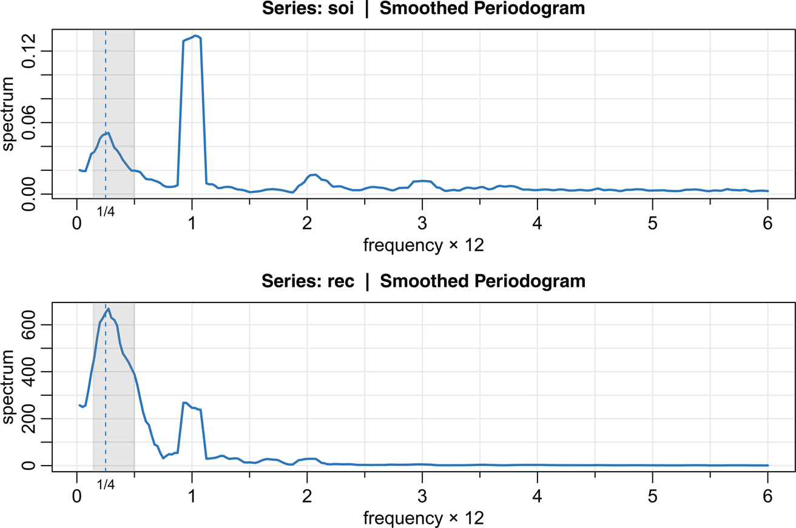

Figure 7.4: The averaged periodogram of the SOI and Recruitment series n\=453, n′\=480, L\=9, df\=17, showing common peaks at the four-year period ω\=1/4, the yearly periodω\=1, and some of its harmonics ω\=k fork\=2,3. The gray band shows periods between 2 to 7 years. [Return to text.⏎](chapter7)

Example 7.5 Averaged Periodogram for SOI and Recruitment [Return to text.⏎](chapter7)

Generally, it is a good idea to try several bandwidths that seem to be compatible with the general overall shape of the spectrum as suggested by the periodogram. The SOI and Recruitment series periodograms previously computed in [Figure 7.1](#chapter7#fig7_1) suggest the power in the lower El Niño frequency needs smoothing to identify the predominant overall period. Trying values of _L_ leads to the choice L\=9 as a reasonable value, and the result is displayed in [Figure 7.4](#chapter7#fig7_4).

The smoothed spectra shown in [Figure 7.4](#chapter7#fig7_4) provide a sensible compromise between the noisy version shown in [Figure 7.1](#chapter7#fig7_1) and a more heavily smoothed spectrum, which might lose some of the peaks. An undesirable effect of averaging can be noticed at the yearly cycle, ω\=1, where the narrow band peaks that appeared in the periodograms in [Figure 7.1](#chapter7#fig7_1) have been flattened and spread out to nearby frequencies. We also notice the appearance of _harmonics_ of the yearly cycle, that is, frequencies of the form ω\=k for k\=1,2,…. Harmonics typically occur when a periodic component is present, but not in a sinusoidal fashion; see [Example 7.6](#chapter7#exam7_6).

[Figure 7.4](#chapter7#fig7_4) shows the average spectral estimates. To compute averaged periodograms, we specify L\=2m+1 (L\=9 and m\=4 in this example) in the call to **mvspec**. We note that by default, half weights are used at the ends of the smoother as was done in [Example 3.18](#chapter3#exam3_18). This means that (7.12)–(7.16) will be off by a small amount, but it's not worth recoding everything to get precise results because we will move to other smoothers. The script also prints 179\. the bandwidth, degrees of freedom, and the amount of tapering, which we will discuss shortly. The R code for SOI is given below; the corresponding code for Recruitment is similar.

`soi_ave = **mvspec**(**soi**, spans=9, col=4, lwd=2)`
`    Bandwidth: 0.213 | Degrees of Freedom: 16.11 | split taper: 0%`
` rect(1/7, -1e5, 1/2, 1e5, density=NA, col=gray(.5,.2))`
` abline(v=.25, lty=2, col=4)`
` mtext("1/4", side=1, line=0, at=.25, cex=.75)`

For the two frequency bands identified as having the maximum power, we may look at the 95% confidence intervals and see whether the lower limits are substantially larger than adjacent baseline spectral levels. Recall that the confidence intervals are exhibited when the spectral estimate is plotted on a log scale (as before, add log=“y” to the code above and change the lower end of the rectangle from \-1e5 to 1e- 5). For example, in [Figure 7.5](#chapter7#fig7_5), the peak at the El Niño period of 4 years has lower limits that exceed the values the spectrum would have if there were simply a smooth underlying spectral function without the peaks.

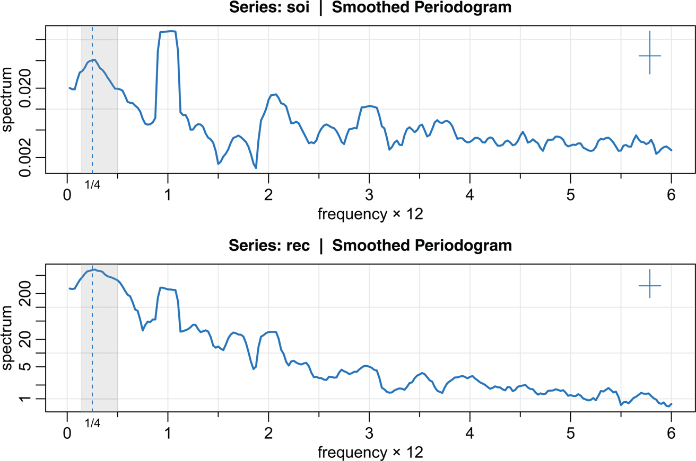

Figure 7.5: [Figure 7.4](#chapter7#fig7_4) with the average periodogram ordinates plotted on a log scale. The display in the upper right-hand corner represents a generic 95% confidence interval and the width of the horizontal segment represents the bandwidth. [Return to text.⏎](chapter7)

Example 7.6 180\. Harmonics [Return to text.⏎](chapter7)

In the previous example, we saw that the spectra of the annual signals displayed minor peaks at the harmonics. That is, there was a large peak at ω\=1 cycles/year and minor peaks at its harmonics ω\=k for k\=2,3,… (two-, three-, and so on, cycles per year). This will often be the case because most signals are not perfect sinusoids (or perfectly cyclic). In this case, the harmonics are needed to capture the non-sinusoidal behavior of the signal. As an example, consider the _sawtooth signal_ shown in [Figure 7.6](#chapter7#fig7_6) that is making one cycle every 20 points. Notice that the series is pure signal (no noise was added), but is non-sinusoidal in appearance and rises quickly then falls slowly. The periodogram of sawtooth signal is also shown in [Figure 7.6](#chapter7#fig7_6) and shows peaks at reducing levels at the harmonics of the main period.

`y = ts(100:1 %% 20, freq=20)   _# sawtooth signal_`
`par(mfrow=2:1)`
`**tsplot**(1:100, y, ylab="sawtooth signal", col=4, **gg**=TRUE)`
`**mvspec**(y, main=NA, ylab="periodogram", col=5, **gg**=TRUE)`

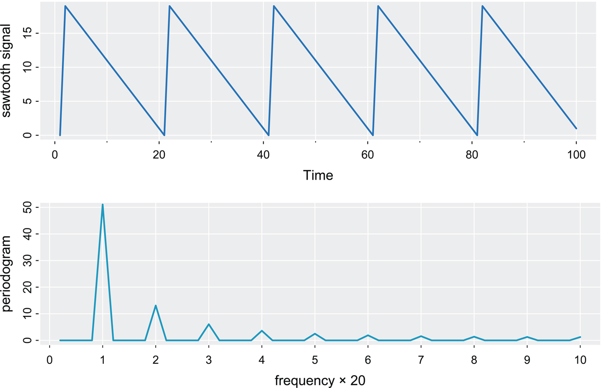

Figure 7.6: Harmonics: A pure sawtooth signal making one cycle every 20 points and the corresponding periodogram showing peaks at the signal frequency and at its harmonics. The frequency scale is in terms 20-point periods. [Return to text.⏎](chapter7)

[Example 7.5](#chapter7#exam7_5) points out the necessity for having some relatively systematic procedure for deciding whether peaks are significant. The question of when a peak is significant usually rests on establishing what we might think of as a baseline level for the spectrum, defined rather loosely as the shape that one would expect 181\. to see if no spectral peaks were present. This profile can usually be guessed by looking at the overall shape of the spectrum that includes the peaks; usually, a kind of baseline level will be apparent, with the peaks seeming to emerge from this baseline level. If the lower confidence limit for the spectral value is still greater than the baseline level at some predetermined level of significance, we may claim that frequency value as a statistically significant peak. To be consistent with our stated indifference to the upper limits, we might use a one-sided confidence interval.

Care must be taken when we make a decision about the bandwidth B over which the spectrum will be essentially constant. Taking too broad a band will tend to smooth out valid peaks in the data when the constant variance assumption is not met over the band. Taking too narrow a band will lead to confidence intervals, so wide that peaks are no longer statistically significant.

Thus, we note that there is a conflict here between variance properties or _bandwidth stability_, which can be improved by increasing the bandwidth B and _resolution_, which can be improved by decreasing B. A common approach is to try a number of different bandwidths and to look qualitatively at the spectral estimators for each case.

182\. To address the problem of resolution, it should be evident that the flattening of the peaks in [Figure 7.4](#chapter7#fig7_4) and [Figure 7.5](#chapter7#fig7_5) was due to the fact that simple averaging was used in computing f¯(ω) defined in (7.9). There is no particular reason to use simple averaging, and we might improve the estimator by employing a weighted average,

f^(ω)\=∑k\=−mmhk I(ωj+k/n),(7.17)

using the same definitions as in (7.9) but where the weights hk\>0 satisfy

∑k\=−mmhk\=1.

In particular, the resolution of the estimator will improve if we use weights that decrease in distance from the center weight _h_0; we will return to this idea shortly. To obtain the averaged periodogram, f¯(ω) in (7.17), set hk\=1/L for all _k_, where L\=2m+1. We define

Lh\=(∑k\=−mmhk2)−1,(7.18)

and note that if hk\=1/L as in simple averaging, then Lh\=L. The distributional properties of (7.17) are more difficult now because f^(ω) is a weighted linear combination of approximately independent _χ_2 random variables. An approximation that seems to work well (under mild conditions) is to replace _L_ by _Lh_ in (7.10). That is,

2Lhf^(ω)f(ω)∼⋅χ2Lh2.(7.19)

In analogy to (7.12), we will define the bandwidth in this case to be

B\=Lhn.

Similar to (7.11), for _n_ large,

E\[f^(ω)\]≈f(ω)andvar\[f^(ω)\]≈f2(ω)/Lh.

Using the approximation (7.19) we obtain an approximate 100(1−α)% confidence interval of the form

2Lhf^(ω)χ2Lh2(1−α/2)≤f(ω)≤2Lhf^(ω)χ2Lh2(α/2)(7.20)

for the true spectrum, f(ω). If the data are padded to _n_′, then replace 2Lh in (7.20) with df\=2Lhn/n′ as in (7.15).

183\. By default, the scripts that are used to estimate spectra, smooth the periodogram via the _modified Daniell kernel_, which uses averaging but with half weights at the end points. For example, with m\=1 (and L\=2m+1\=3) the weights are {hk}\={14,24,14}, and if applied to a sequence of numbers {ut}, the result is

u^t\=14ut−1+12ut+14ut+1.

Applying the same kernel again to u^t yields

^^ut\=14u^t−1+12u^t+14u^t+1,

which simplifies to

^^ut\=116ut−2+416ut−1+616ut+416ut+1+116ut+2.

Further details on this kernel are given in [Example A.9](#appA#examA_9).

Example 7.7 Smoothed Periodogram for SOI and Recruitment [Return to text.⏎](chapter7)

In this example, we estimate the spectra of the SOI and Recruitment series using the smoothed periodogram estimate in (7.17). We used a modified Daniell kernel twice, with m\=3 both times. This yields Lh\=1/∑hk2\=9.232, which is close to the value of L\=9 used in [Example 7.5](#chapter7#exam7_5). The weights, _hk_, can be obtained and graphed as follows; see [Figure 7.7](#chapter7#fig7_7) (the right plot adds another application of the kernel).

`(dm = kernel("modified.daniell", c(3,3)))       _# for a list_`
`par(mfrow=1:2)`
`plot(dm, ylab=bquote(h[~k]))                    _# for a plot_`
`plot(kernel("modified.daniell", c(3,3,3)), ylab=bquote(h[~k]))`

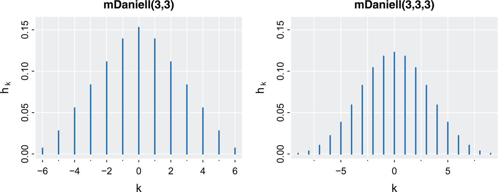

Figure 7.7: Modified Daniell kernel weights used in [Example 7.7](#chapter7#exam7_7). [Return to text.⏎](chapter7)

The spectral estimates can be viewed in [Figure 7.8](#chapter7#fig7_8), and we notice that the estimates are more appealing than those in [Figure 7.4](#chapter7#fig7_4). Notice in the code below that spans is a vector of odd integers, given in terms of L\=2m+1, the width of the kernel. While the bandwidth in terms of months is B\=9.232/480\=.019, 184\. one unit of time is a year, so the bandwidth for the graphic is converted to years, 9.232480cyclesmonths×12monthsyear\=.2308cyclesyear. The bandwidth, degrees of freedom, and tapering amount are printed out for each use of **mvspec** (unless plot=FALSE ).

`par(mfrow=c(2,1))`
`sois = **mvspec**(**soi**, spans=c(7,7), taper=.1, col=4, lwd=2)`
` Bandwidth: 0.231 | Degrees of Freedom: 15.61 | split taper: 10%`
`  rect(1/7, -1e5, 1/2, 1e5, density=NA, col=gray(.5,.2))`
`  abline(v=.25, lty=2, col=4)`
`  mtext("1/4", side=1, line=0, at=.25, cex=.75)`
`recs = **mvspec**(**rec**, spans=c(7,7), taper=.1, col=4, lwd=2)`
`  rect(1/7, -1e5, 1/2, 1e5, density=NA, col=gray(.5,.2))`
`  abline(v=.25, lty=2, col=4)`
`  mtext("1/4", side=1, line=0, at=.25, cex=.75)`

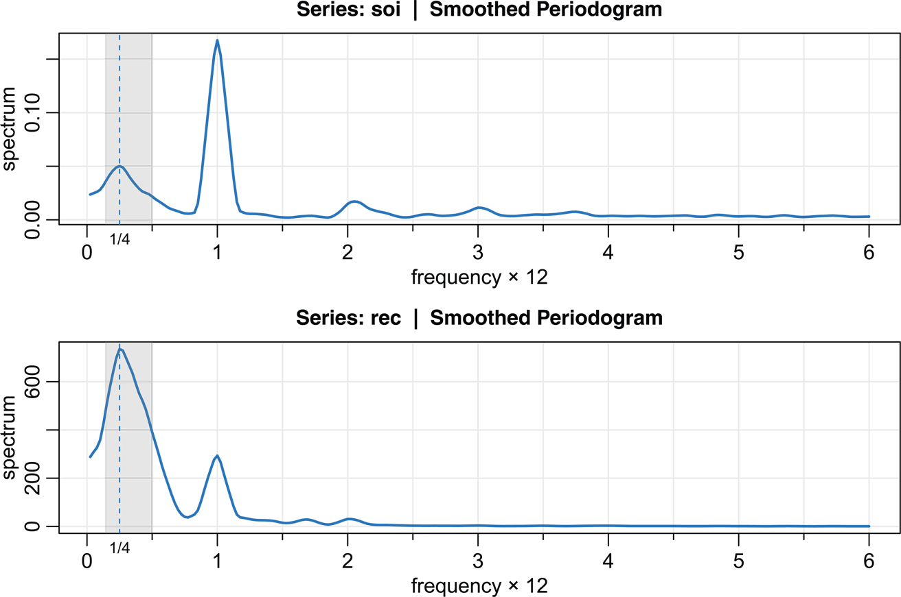

Figure 7.8: Smoothed (tapered) spectral estimates of the SOI and Recruitment series; see [Example 7.7](#chapter7#exam7_7) for details. [Return to text.⏎](chapter7)

As before, reissuing the **mvspec** commands with log=“y” will result in a figure similar to [Figure 7.5](#chapter7#fig7_5) (and don't forget to change the lower value of the rectangle to 1e-5). An easy way to find the locations of the spectral peaks is to print out some values near the location of the peaks. In this example, we know the peaks are near the beginning, so we look there:

`sois$details[1:45,]`
`      frequency period spectrum`
`             .      .       .`
` [5,]     0.125 8.0000   0.0320`
` [6,]     0.150 6.6667   0.0372 ∼ 7 year    period`
` [7,]     0.175 5.7143   0.0421`
` [8,]     0.200 5.0000   0.0461`
` [9,]     0.225 4.4444   0.0489`
`[10,]     0.250 4.0000   0.0502 <- 4 year   period`
`[11,]     0.275 3.6364   0.0490`
`[12,]     0.300 3.3333   0.0451`
`[13,]     0.325 3.0769   0.0403 ∼ 3 year    period`
`[14,]     0.350 2.8571   0.0361`
`             .      .       .`
`[38,]     0.950 1.0526   0.1253`
`[39,]     0.975 1.0256   0.1537`
`[40,]     1.000 1.0000   0.1675 <- 1 year   period`
`[41,]     1.025 0.9756   0.1538`
`[42,]     1.050 0.9524   0.1259`

185\. Finally, notice that [Figure 7.8](#chapter7#fig7_8) was generated with the use of a _taper_, which we talk about next.

### Tapering

We are now ready to introduce the concept of _tapering_; a more detailed discussion may be found in [Bloomfield (2004)](#bibref1#refbib_3). Suppose _xt_ is a mean-zero stationary process with spectral density fx(ω). If we specify weights _at_, replace the original series by the tapered series

yt\=atxt,(7.21)

for t\=1,2,…,n, use the modified DFT

dy(ωj)\=n−1/2∑t\=1natxte−2πiωjt,(7.22)

and let Iy(ωj)\=|dy(ωj)|2, we will obtain

E\[Iy(ωj)\]\=∫−1/21/2Wn(ωj−ω) fx(ω) dω.(7.23)

The value Wn(ω) is called a _spectral window_ because, in view of (7.23), it is determining which part of the spectral density fx(ω) is being “seen” by the estimator Iy(ωj) on average. In the case that at\=1 for all _t_, Iy(ωj)\=Ix(ωj) is simply the periodogram of the data and the window is

Wn(ω)\=sin2(nπω)nsin2(πω)(7.24)

with Wn(0)\=n.

186\. Tapers generally have a shape that enhances the center of the data relative to the extremities, such as a cosine bell of the form

at\=.5\[1+cos(2π(t−t―)n)\],(7.25)

where t―\=(n+1)/2, favored by [Blackman and Tukey (1959)](#bibref1#refbib_2).

In [Figure 7.9](#chapter7#fig7_9), we have plotted the shapes of two windows, Wn(ω), for n\=480 when using the estimator f¯(ω) in (7.9) with L\=9. The left side of the graphic shows the case when there is no tapering (at\=1), and the right side of the graphic shows the case when _at_ is the cosine taper in (7.25). In both cases, the bandwidth should be B\=9/480\=.01875 cycles per point, which corresponds to the “width” of the windows shown in [Figure 7.9](#chapter7#fig7_9). Both windows produce an integrated average spectrum over this band, but the untapered window on the left shows considerable ripples over the band and outside the band. The ripples outside the band are called sidelobes, and tend to introduce frequencies from outside the interval that may contaminate the desired spectral estimate within the band. This effect is sometimes called _leakage_. [Figure 7.9](#chapter7#fig7_9) emphasizes the suppression of the sidelobes when a cosine taper is used.

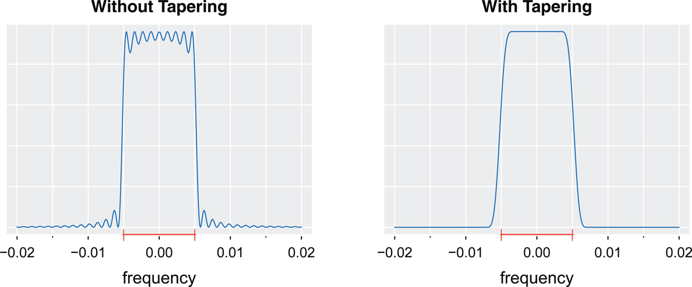

Figure 7.9: Spectral windows with and without tapering corresponding to the average periodogram with n\=480 and L\=9 as in [Example 7.5](#chapter7#exam7_5). The extra line and ticks on the abscissa exhibit the bandwidth. [Return to text.⏎](chapter7)

One way to think about the effect of tapering is to imagine looking out a glass window with the shape of the spectral window. If no tapering is done, the glass will have many ripples and your view of the outside will be blurry. This effect can be seen in many old buildings where windows were made by hand. However, if the glass window is made like the spectral window with tapering (more like modern glass windows), the view outside will be clear.

Example 7.8 187\. The Effect of Tapering the SOI Series [Return to text.⏎](chapter7)

In this example, we examine the effect of tapering on the estimate of the spectrum of the SOI series. [Figure 7.10](#chapter7#fig7_10) shows part of three spectral estimates plotted on a log scale. The degree of smoothing here is the same as in [Example 7.7](#chapter7#exam7_7). The three spectral estimates are without tapering, with tapering 20% on each side (i.e., only the first and last 20% of the data are tapered), and with full tapering, 50%. Notice that the tapered spectrum does a better job in separating the yearly cycle (ω\=1) and the El Niño cycle (ω\=1/4).

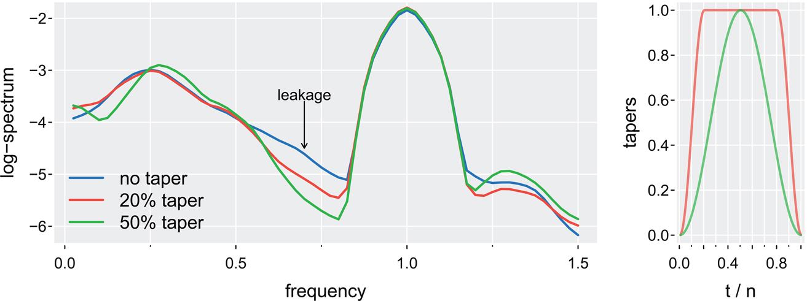

Figure 7.10: Display for [Example 7.8](#chapter7#exam7_8): Smoothed spectral estimates of SOI without tapering, with split tapering of 20%, and with a full (50%) cosine bell taper (7.25). The tapers are displayed on the right. [Return to text.⏎](chapter7)

The following session was used to generate [Figure 7.10](#chapter7#fig7_10). We note that, by default, mvspec does not taper. For full tapering, we use the argument taper=.5 to instruct mvspec to taper 50% of each end of the data; any value between 0 and. 5 is acceptable.

`layout(matrix(1:2,1), widths=c(3,1))`
`s0 = **mvspec**(**soi**, spans=c(7,7), plot=FALSE)              _# no taper_`
`s10 = **mvspec**(**soi**, spans=c(7,7), taper=.2, plot=FALSE) _# 20%_`
`s50 = **mvspec**(**soi**, spans=c(7,7), taper=.5, plot=FALSE)   _# full taper_`
`r = 1:60`
`**tsplot**(s0$freq[r], log(s0$spec[r]), **gg**=TRUE, col=4, lwd=2, ylab="log-spectrum",`
`   xlab="frequency")`
`lines(s10$freq[r], log(s10$spec[r]), col=2, lwd=2)`
`lines(s50$freq[r], log(s50$spec[r]), col=3, lwd=2)`
`text(.7, -3.5, "leakage", cex=.8)`
`arrows(.7, -3.6, .7, -4.5, length=0.05, angle=30)`
`legend("bottomleft", legend=c("no taper", "20% taper", "50% taper"), lwd=2,`
`   col=c(4,2,3), bty="n")`
`_# tapers_`
`x = rep(1,100)`
`**tsplot**(1:100/100, cbind(spec.taper(x, p=.2), spec.taper(x, p=.5)), col=2:3,`
`   **gg**=TRUE, **spag**=TRUE, xlab="t / n", lwd=2, ylab="tapers")`

Example 7.9 188\. Tapering Recommendation

Using a taper, {at}, increases the variance of the spectral estimator by a kurtosis factor given by

κn\=1n∑tat4(1n∑tat2)2,(7.26)

as n→∞, which is greater than or equal to 1 by the Cauchy-Schwarz inequality (A.3).

For the cosine bell taper in (7.25) with split tapering as discussed in [Example 7.8](#chapter7#exam7_8), [Bloomfield (2004, §9.5)](#bibref1#refbib_3) showed that (0≤p≤.5)

κn≈128−186p2(8−10p)2.

For p\=5%,10%,20%, the values of _κn_ are 1.06,1.12,1.26, respectively. In addition, tapering reduces the degrees of freedom of the estimator by a factor of 1/κn. Hence, split tapering at these levels only degrades the efficiency of the spectral estimator by a small amount and is worth the tradeoff for protecting against leakage.

## 7.3 Parametric Spectral Estimation

The methods of [Section 7.2](#chapter7#sec7_2) are generally referred to as nonparametric spectral estimators because no assumption is made about the parametric form of the spectral density. In Property 6.8, we exhibited the spectrum of an ARMA process and we might consider basing a spectral estimator on this function, substituting the parameter estimates from an ARMA(_p,q_) fit on the data into the formula for the spectral density fx(ω) given in (6.15). Such an estimator is called a _parametric spectral estimator_.

For convenience and to avoid parameter redundancy (as in Examples 4.9, 4.10, 4.11, 4.30 and 4.31), a parametric spectral estimator is obtained by fitting an AR(_p_) to the data where the order _p_ is determined by one of the model selection criteria, such as AIC, AICc, and BIC, defined in (3.7)–(3.9). The development of autoregressive spectral estimators has been summarized by [Parzen (1983)](#bibref1#refbib_35).

If ϕ^1,ϕ^2,…,ϕ^p and σ^w2 are the estimates from an AR(_p_) fit to _xt_, then based on Property 6.8, a parametric spectral estimate of fx(ω) is attained by substituting these estimates into (6.15), that is,

f^x(ω)\=σ^w2|ϕ^(e−2πiω)|2,

189\. where

ϕ^(z)\=1−ϕ^1z−ϕ^2z2−⋯−ϕ^pzp.(7.27)

Unfortunately, obtaining confidence intervals for spectra is difficult in this case. Most techniques rely on unrealistic assumptions.

An interesting fact about spectra of the form (6.15) is that any spectral density can be approximated, arbitrarily close, by the spectrum of an AR process.

Property 7.10 (AR Spectral Approximation). [Return to text.⏎](chapter7) _Let_ gx(ω) _be the spectral density of a stationary process, xt. Then, given_ ϵ\>0, _there is an AR(p) representation_

xt\=∑k\=1pϕkxt−k+wt

_with corresponding spectrum_ fx(ω) _such that_

|fx(ω)−gx(ω)|<ϵfor all ω∈\[−1/2,1/2\].

One drawback, however, is that the property does not tell us how large _p_ must be before the approximation is reasonable; in some situations _p_ may be extremely large. [Property 7.10](#chapter7#prop7_10) also holds for MA and for ARMA processes in general. We demonstrate the technique in the following example.

Example 7.11 Autoregressive Spectral Estimator for SOI

Consider obtaining results comparable to the nonparametric estimators shown in [Figure 7.4](#chapter7#fig7_4) for the SOI series. The resulting minimum AIC (p\=18) and minimum BIC (p\=15) spectra are shown in [Figure 7.11](#chapter7#fig7_11), and we note the broadband power near the 313 \-year and one-year cycles, which is similar to the nonparametric estimates obtained in [Section 7.2](#chapter7#sec7_2). The periods from 2 to 7 years are highlighted in [Figure 7.4](#chapter7#fig7_4). In that period range, the BIC spectrum appears to be more spread out suggesting that the ENSO cycle is more irregular than can be seen in the AIC spectrum. In addition, the harmonics of the yearly period are evident in the estimated spectrum.

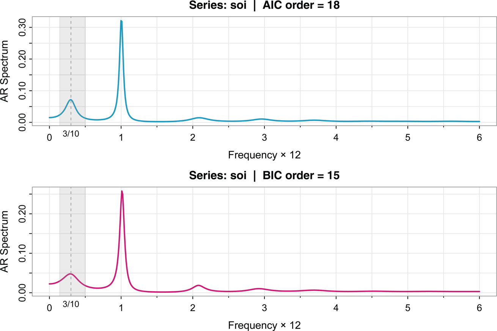

Figure 7.11: Autoregressive spectral estimator for the SOI series after detrending by lowess. AIC selects an AR(18) model, whereas BIC selects an AR(15). The periods from 2 to 7 years are highlighted. [Return to text.⏎](chapter7)

The AIC and BIC for each value of _p_ is displayed in [Figure 7.12](#chapter7#fig7_12). The p\=0 values are not displayed because they both exceed 200\. We can see from [Figure 7.12](#chapter7#fig7_12) that BIC is very definite about which model it chooses; that is, the minimum BIC is very distinct. On the other hand, AIC is not so definitive with values at p\=15,16,17,30 being close to the minimum at p\=18.

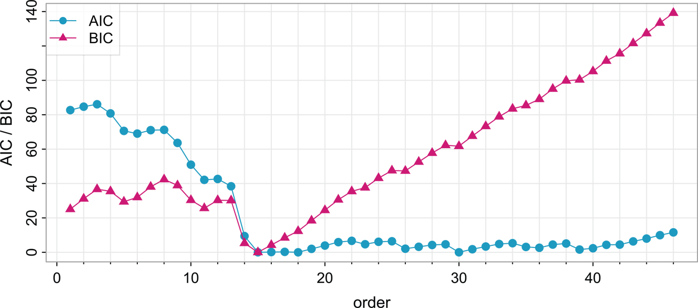

Figure 7.12: Model selection criteria AIC and BIC as a function of order _p_ for autoregressive models fitted to the SOI series. The values displayed are shifted by subtracting the values of the best model (hence the best values are zero). The p\=0 values are excluded in the plot because they both exceed 200. [Return to text.⏎](chapter7)

To perform the analysis, the command spec.ic can be used to fit the best model using AIC or BIC. The script plots the resulting minimum AIC (or BIC) spectral estimate by default, and returns the values of the AIC and BIC. The script also allows for detrending the data prior to the spectral analysis, including detrending via lowess, which we use here.

`par(mfrow=2:1)`
`**spec.ic**(**soi**, col=5, lwd=2, lowess=TRUE) -> u    _# min AIC spec_`
` rect(1/7, -1e5, 1/2, 1e5, density=NA, col=gray(.6,.2))`
` mtext("3/10", side=1, line=0, at=.3, cex=.75)`
` abline(v=.3, lty=2, col=8)    _# approximate El Niño Cycle_`
`**spec.ic**(**soi**, col=6, lwd=2, lowess=TRUE, BIC=TRUE)    _# min BIC spec_`
` rect(1/7, -1e5, 1/2, 1e5, density=NA, col=gray(.6,.2))`
` mtext("3/10", side=1, line=0, at=.3, cex=.75)`
` abline(v=.3, lty=2, col=8)`
`_# AIC/BIC plots_`
`**tsplot**(u[[1]][-1,1], u[[1]][-1,2:3], type="o", xlab="order", col=5:6,`
`   pch=c(19,17), ylab="AIC / BIC", cex=1.05, **nxm**=5, **spag**=TRUE, **addLegend**=TRUE,`
`   **location**="topleft")`

## 7.4 190\. Coherence and Cross-Spectra \*

Spectral analysis extends to multiple series the same way that correlation analysis extends to cross-correlation analysis. For example, if _xt_ and _yt_ are jointly stationary series, we can introduce a frequency-based measure called _coherence_ as follows.

Assuming it is absolutely summable, the cross-covariance function

γxy(h)\=E\[(xt+h−μx)(yt−μy)\]

191\. has a spectral representation given by

γxy(h)\=∫−1/21/2 fxy(ω)e2πiωh dω,h\=0,±1,±2,…,(7.28)

where the _cross-spectrum_ is defined as the Fourier transform

fxy(ω)\=∑h\=−∞∞γxy(h) e−2πiωh−12≤ω≤12.(7.29)

Because the cross-covariance is not necessarily symmetric, the cross-spectrum is generally a complex-valued function, and it is often written as

fxy(ω)\=cxy(ω)−iqxy(ω),

where

cxy(ω)\=∑h\=−∞∞γxy(h) cos(2πωh)

and

qxy(ω)\=∑h\=−∞∞γxy(h) sin(2πωh)

are defined as the _cospectrum_ and _quadspectrum_, respectively. Because of the relationship γyx(h)\=γxy(−h), it follows from (7.29) that

fyx(ω)\=fxy(ω)―.(7.30)

192\. This result implies that the cospectrum and quadspectrum satisfy

cyx(ω)\=cxy(ω)andqyx(ω)\=−qxy(ω).

An important example of the application of the cross-spectrum is to the problem of predicting an output series _yt_ from some input series _xt_ through a linear filter relation. A measure of the strength of such a relation is the **_coherence function_**, defined as

ρyx2(ω)\=|fyx(ω)|2fxx(ω)fyy(ω),(7.31)

where fxx(ω) and fyy(ω) are the individual spectra of the _xt_ and _yt_ series, respectively. Note that (7.31) is analogous to conventional squared correlation, which takes the form

ρyx2\=σyx2σx2σy2,

for random variables with variances σx2 and σy2 and covariance σyx\=σxy. This motivates the interpretation of coherence as the squared correlation between two time series at frequency _ω_.

Example 7.12 Three-Point Moving Average

As a simple example, we compute the cross-spectrum between _xt_ and the three-point moving average yt\=(xt−1+xt+xt+1)/3, where _xt_ is a stationary input process with spectral density fxx(ω). First,

γxy(h)\=cov(xt+h,yt)\=13 cov(xt+h,xt−1+xt+xt+1)\=13(γxx(h+1)+γxx(h)+γxx(h−1))\=13∫−1/21/2(e2πiω+1+e−2πiω)e2πiωhfxx(ω) dω\=13∫−1/21/2\[1+2cos(2πω)\]fxx(ω)e2πiωh dω,

where we have used (6.13). Using the uniqueness of the Fourier transform, we argue from the spectral representation (7.28) that

fxy(ω)\=13 \[1+2cos(2πω)\] fxx(ω)

so that the cross-spectrum is real in this case. As in [Example 6.9](#chapter6#exam6_9), the spectral density of _yt_ is

fyy(ω)\=19\[3+4cos(2πω)+2cos(4πω)\]fxx(ω)\=19 \[1+2cos(2πω)\]2 fxx(ω),

using the identity cos(2α)\=2cos2(α)−1 in the last step. Substituting into 193\. (7.31) yields the squared coherence between _xt_ and _yt_ as unity over all frequencies,

ρxy(ω)\=1−1/2≤ω≤1/2.

This is a characteristic inherited by more general linear filters.

For the vector series xt\=(xt1,xt2,…,xtp)′, we may use the vector of DFTs, d(ωj)\=(d1(ωj),d2(ωj),…,dp(ωj))′, and estimate the spectral matrix by

f¯(ω)\=L−1∑k\=−mmIp(ωj+k/n)(7.32)

where

Ip(ωj)\=d(ωj) d∗(ωj)

is a p×p complex matrix where \* denotes the conjugate transpose operation.

Again, the series may be tapered before the DFT is taken in (7.32) and we can use weighted estimation,

f^(ω)\=∑k\=−mmhk Ip(ωj+k/n)

where {hk} are weights as defined in (7.17). The estimate of squared coherence between two series, _yt_ and _xt_ is

ρ^yx2(ω)\=|f^yx(ω)|2f^xx(ω)f^yy(ω).(7.33)

If the spectral estimates in (7.33) are obtained using equal weights, we will write ρ¯yx2(ω) for the estimate.

Under general conditions, if ρyx2(ω)\>0 then

|ρ^yx(ω)|∼⋅N(|ρyx(ω)|,(1−ρyx2(ω))2/2Lh)(7.34)

where _Lh_ is defined in (7.18); the details of this result may be found in [Brockwell and Davis (2013, Ch 11)](#bibref1#refbib_8). We may use (7.34) to obtain approximate confidence intervals for the coherence ρyx2(ω).

We can test the hypothesis that ρyx2(ω)\=0 if we use ρ¯yx2(ω) for the estimate with L\>1,[4](#chapter7#fn7_4) that is,

ρ¯yx2(ω)\=|f¯yx(ω)|2f¯xx(ω)f¯yy(ω).(7.35)

In this case, under the null hypothesis, the statistic

F\=ρ¯yx2(ω)(1−ρ¯y⋅x2(ω))(L−1)(7.36)

\_\_\_\_\_\_\_\_\_\_\_\_\_\_\_\_\_ 4If L\=1 then ρ¯yx2(ω)≡1. [Return to text.⏎](#chapter7#fn7_47b)

194\. has an approximate _F_\-distribution with 2 and 2L−2 degrees of freedom. When the series have been extended to length _n_′, we replace 2L−2 by df−2, where _df_ is defined in (7.15). Solving (7.36) for a particular significance level _α_ leads to

Cα\=F2,2L−2(α)L−1+F2,2L−2(α)(7.37)

as the approximate value that must be exceeded for the original squared coherence to be able to reject ρyx2(ω)\=0 at an a priori specified frequency.

Example 7.13 Coherence Between SOI and Recruitment

[Figure 7.13](#chapter7#fig7_13) shows the coherence between the SOI and Recruitment series over a wider band than was used for the spectrum. In this case, we used L\=19, df\=2(19)(453/480)≈36 and F2,df−2(.001)≈8.53 at the significance level α\=.001. Hence, we may reject the hypothesis of no coherence for values of ρ¯yx2(ω) that exceed C.001\=.32. We emphasize that this method is crude because, in addition to the fact that the _F_\-statistic is approximate, we are examining the squared coherence across all frequencies with the Bonferroni inequality in mind. [Figure 7.13](#chapter7#fig7_13) also exhibits confidence bands. We emphasize that these bands are only valid for _ω_ where ρyx2(ω)\>0.

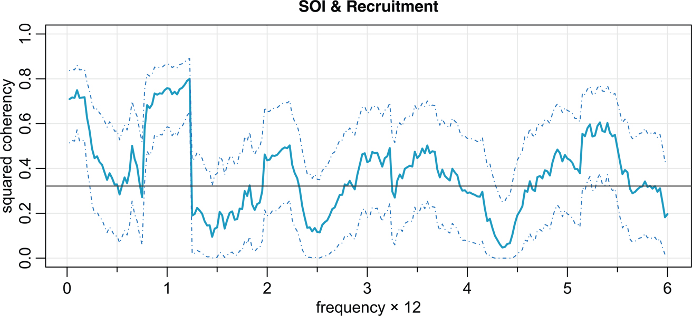

Figure 7.13: Squared coherency between the SOI and Recruitment series; L\=19, n\=453, n′\=480, and α\=.001. The horizontal line is _C_.001. [Return to text.⏎](chapter7)

In this case, the seasonal frequency and the El Niño frequencies ranging between about 3- and 7-year periods are strongly coherent. Other frequencies are also strongly coherent, although the strong coherence is less impressive because the underlying power spectrum at these higher frequencies is fairly small. Finally, we note that the coherence is persistent at the seasonal harmonic frequencies.

This example may be reproduced using the following commands. To do simple averaging, we specify the weights by kernel("daniell",9); otherwise 195\. the modified Daniell kernel will be used by default, which uses half weights at the ends. The script kernel() requires _m_ to be specified. Here, we use m\=9 so that L\=2m+1\=19.

`sr = **mvspec**(cbind(**soi**,**rec**), kernel=kernel("daniell",9), plot.type="coh",`
`   main="SOI & Recruitment", col=5, lwd=2)`
` Bandwidth: 0.475 | Degrees of Freedom: 35.86 | split taper: 0%`
`(f = qf(.999, 2, sr$df-2) )`
`  [1] 8.529792`
`(C = f/(18+f) )`
`  [1] 0.3215175`
`abline(h = C)`

## Problems

* 7.1. Let the observed series _xt_ be composed of a periodic signal and noise so it can be written as  
xt\=β1cos(2πωkt)+β2sin(2πωkt)+wt,  
where _wt_ is a white noise process with variance σw2. The frequency ωk≠0,12 is assumed to be known and of the form k/n. Given data x1,…,xn, suppose we consider estimating _β_1, _β_2 and σw2 by least squares.  
   1. Use the regression formulas from [Example 6.2](#chapter6#exam6_2) to show that for a fixed _ωk_, the least squares regression coefficients are  
   β^1\=2n−1/2dc(ωk)andβ^2\=2n−1/2ds(ωk),  
   where the dc(⋅) and ds(⋅) are the cosine and sine transforms given in (7.3) and (7.4).  
   2. Prove that the error sum of squares can be written as  
   SSE\=∑t\=1nxt2−2Ix(ωk)  
   so that the value of _ωk_ that minimizes squared error is the same as the value that maximizes the periodogram Ix(ωk) estimator (7.1).  
   3. Show that the sum of squares for the regression is given by  
   SSR\=2Ix(ωk).  
   4. Under the Gaussian assumption and fixed _ωk_, show that the _F_\-test of no regression leads to an _F_\-statistic that is a monotone function of Ix(ωk).  
196\.
* 7.2. [Figure 7.14](#chapter7#fig7_14) shows the biyearly smoothed (12-month moving average) number of sunspots from June 1749 to December 1978 with n\=459 points that were taken twice per year; the data are contained in **sunspotz**. With [Example 7.4](#chapter7#exam7_4) as a guide, perform a periodogram analysis identifying the predominant periods and obtain confidence intervals. Interpret your findings.  
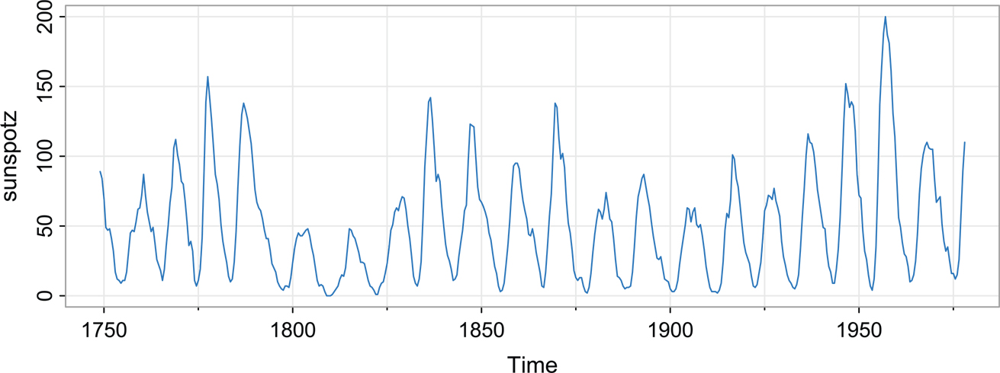  
Figure 7.14: Smoothed 12-month sunspot numbers (sunspotz) sampled twice per year. [Return to text.⏎](chapter7)
* 7.3. The levels of salt concentration known to have occurred over rows, corresponding to the average temperature levels for the soil science are in **salt** and **saltemp**. Plot the series and then identify the dominant frequencies by performing separate spectral analyses on the two series. Include confidence intervals and interpret your findings.
* 7.4. \* Verify (7.2) as follows.  
   1. Use the results in [Section B.4](#appB#secB_4) to show that  
   ∑t\=1nx¯ e−2πiωjt\=0.  
   2. Next, argue that  
   d(ωj)\=∑t\=1n(xt−x¯) e−2πiωjt  
   is equivalent to the DFT in [Definition 7.1](#chapter7#defi7_1).  
   3. Finally, let h\=t−s and show that  
   I(ωj)\=|d(ωj)|2\=n−1∑t\=1n∑s\=1n(xt−x¯)(xs−x¯)e−2πiωj(t−s)\=n−1∑h\=−(n−1)n−1∑t\=1n−|h|(xt+|h|−x¯)(xt−x¯)e−2πiωjh,  
   is the form of the periodogram given in (7.2).
* 7.5. 197\. Analyze the salmon price data (**salmon**) using a nonparametric spectral estimation procedure. Aside from the obvious annual cycle discovered in [Example 3.12](#chapter3#exam3_12), what other interesting cycles are revealed?
* 7.6. Repeat [Problem 7.2](#chapter7#question7_2) using a nonparametric spectral estimation procedure. In addition to discussing your findings in detail, comment on your choice of a spectral estimate with regard to smoothing and tapering.
* 7.7. Repeat [Problem 7.3](#chapter7#question7_3) using a nonparametric spectral estimation procedure. In addition to discussing your findings in detail, comment on your choice of a spectral estimate with regard to smoothing and tapering.
* 7.8. Often, the periodicities in the sunspot series are investigated by fitting an autoregressive spectrum of sufficiently high order. The main periodicity is often stated to be in the neighborhood of 11 years. Fit an autoregressive spectral estimator to the sunspot data using a model selection method of your choice. Compare the result with a conventional nonparametric spectral estimator found in [Problem 7.6](#chapter7#question7_6).
* 7.9. For this exercise, use the data in the file **chicken**, which is the whole bird spot price in U.S. cents per pound.  
   1. Plot the data set and describe what you see. Why does differencing make sense here?  
   2. Analyze the differenced chicken price data using a nonparametric spectral estimate and describe the results.  
   3. Repeat the previous part using a a parametric spectral estimation procedure and compare the results to the previous part.
* 7.10. Fit an autoregressive spectral estimator to the Recruitment series and compare it to the results of [Example 7.7](#chapter7#exam7_7).
* 7.11. The periodic behavior of a time series induced by echoes can also be observed in the spectrum of the series; this fact can be seen from the results stated in [Problem 6.6](#chapter6#question6_6). Using the notation of that problem, suppose we observe xt\=st+Ast−D+nt, which implies the spectra satisfy fx(ω)\=\[1+A2+2Acos(2πωD)\]fs(ω)+fn(ω). If the noise is negligible (fn(ω)≈0) then logfx(ω) is approximately the sum of a periodic component, log\[1+A2+2Acos(2πωD)\], and logfs(ω). [Bogert et al. (1963)](#bibref1#refbib_4) proposed treating the detrended log spectrum as a pseudo time series and calculating its spectrum, or _cepstrum_, which should show a peak at a _quefrency_corresponding to _D_. The cepstrum can be plotted as a function of quefrency, from which the delay, _D_, can be estimated.  
For the speech series presented in **speech**, estimate the pitch period using cepstral analysis as follows.  
   1. 198\. Calculate and display the log-periodogram of the data. Is the periodogram periodic, as predicted?  
   2. Perform a cepstral (spectral) analysis on the detrended logged periodogram, and use the results to estimate the delay _D_.
* 7.12.\* Analyze the coherency between the temperature and salt data discussed in [Problem 7.3](#chapter7#question7_3). Discuss your findings.
* 7.13.\* Consider two processes  
xt\=wtandyt\=ϕxt−D+vt  
where _wt_ and _vt_ are independent white noise processes with common variance _σ_2, _ϕ_ is a constant, and _D_ is a fixed integer delay.  
   1. Compute the coherency between _xt_ and _yt_.  
   2. Simulate n\=1024 normal observations from _xt_ and _yt_ for ϕ\=.9, σ2\=1, and D\=0. Then estimate and plot the coherency between the simulated series for the following values of _L_ and comment: (i) L\=1, (ii) L\=3, (iii) L\=41, and (iv) L\=101.

---

