
199\. 

# 8 부가적인 주제 (Additional Topics)\*

본 장에서는 다양한 심화 주제를 제시합니다. 각 절은 어떤 순서로 읽어도 무방합니다. 각 주제는 [4장](#chapter4)과 [5장](#chapter5)에서 다룬 ARMA 모델, 예측 및 추정에 대한 기본적인 지식을 바탕으로 합니다.

## 8.1 GARCH 모델

금융 분야의 옵션 가격 결정(Option pricing)과 같은 다양한 문제는 시계열의 변동성(Volatility) 또는 가변성 연구의 동기가 되었습니다. ARMA 모델은 조건부 분산(여기서는 σt2로 표기)이 일정할 때 프로세스의 조건부 평균(여기서는 _μt_로 표기)을 모델링하는 데 사용되었습니다. 예를 들어, AR(1) 모델 xt\=ϕ0+ϕ1xt−1+wt에서는 다음과 같습니다.

μt\=E(xt∣xt−1,xt−2,…)\=ϕ0+ϕ1xt−1σt2\=var(xt∣xt−1,xt−2,…)\=var(wt)\=σw2.

그러나 많은 문제에서 일정한 조건부 분산에 대한 가정이 위배됩니다. [Engle (1982)](#bibref1#refbib_16)이 처음 소개한 자기회귀 조건부 이분산성(ARCH, Autoregressive Conditionally Heteroscedastic) 모델과 같은 모델들은 변동성의 변화를 모델링하기 위해 개발되었습니다. 이러한 모델들은 이후 [Bollerslev (1986)](#bibref1#refbib_5)에 의해 일반화된 ARCH (GARCH) 모델로 확장되었습니다.

이러한 문제에서 우리는 시계열의 수익률(Return) 또는 성장률(Growth rate)을 모델링하는 데 관심을 둡니다. 시간 _t_에서 자산의 가치를 _xt_라고 할 때, 시간 _t_에서 자산의 수익률 또는 상대적 이득 _rt_는 다음과 같습니다.

rt\=xt−xt−1xt−1≈∇log(xt).

∇log(xt) 또는 (xt−xt−1)/xt−1 값 중 하나를 수익률(Return)이라 부르며, _rt_로 표기합니다. [1](#chapter8#fn8_1)

\_\_\_\_\_\_\_\_\_\_\_\_\_\_\_\_\_ 1잘못된 명칭이긴 하지만 ∇logxt를 종종 로그 수익률(Log-return)이라고 부릅니다. 하지만 수익률 자체에 로그를 취하는 것은 아닙니다. [본문으로 돌아가기.⏎](#chapter8#fn8_18b)

일반적으로 금융 시계열의 경우 수익률 _rt_는 일정한 조건부 평균(자산의 경우 보통 μt\=0)을 갖지만 일정한 조건부 분산을 갖지 않으며, 200\. 변동성이 높은 기간이 함께 군집하는 경향이 있습니다. 또한 _rt_의 자기상관(Autocorrelation) 구조는 백색 잡음(White noise)의 형태를 띠지만 수익률은 서로 종속적인 경우가 많습니다. 이는 종종 수익률의 제곱(또는 수익률의 거듭제곱 변환)에 대한 표본 ACF를 살펴봄으로써 확인할 수 있습니다. 예를 들어, [그림 8.1](#chapter8#fig8_1)은 [1장](#chapter1)에서 보았던 다우존스 산업평균지수(DJIA)의 일일 수익률을 보여줍니다. 이 경우 일반적으로 수익률 _rt_는 상당히 일정하며(μt\=0 포함) 거의 백색 잡음에 가깝지만, 변동성이 폭발적으로 증가하는 단기적인 기간이 존재하고 수익률의 제곱은 자기상관을 갖습니다.

`library(xts)`
`djiar = diff(log(**djia$Close**))`
`layout(matrix(c(1,2,1,3), 2), heights=2:1)`
`plot(djiar, col=4)`
`**acf1**(djiar, ylim=c(-.1,.6))`
`**acf1**(djiar^2, ylim=c(-.1,.6))`

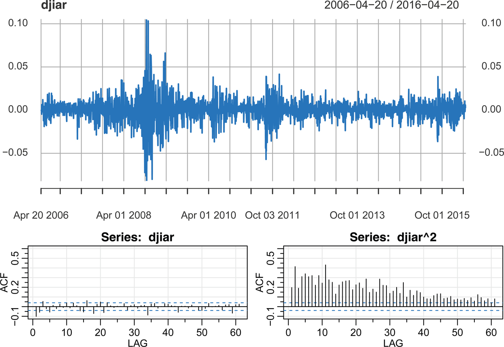

그림 8.1: DJIA 일일 마감 수익률 및 수익률과 제곱 수익률의 표본 ACF. [본문으로 돌아가기.⏎](chapter8)

가장 간단한 ARCH 모델인 ARCH(1)은 수익률을 다음과 같이 모델링합니다.

rt\=σtεt(8.1)

σt2\=α0+α1rt−12,(8.2)

여기서 _εt_는 표준 가우시안 백색 잡음이며, εt∼ iid N(0,1)입니다. 정규 분포 가정은 완화될 수 있으며, 이는 나중에 논의하겠습니다. ARMA 모델과 마찬가지로, 바람직한 특성을 얻기 위해 201\. 모델 매개변수에 약간의 제약을 가해야 합니다. σt2는 분산이므로 α0,α1≥0이어야 한다는 명백한 제약이 있습니다.

rt−1이 주어졌을 때 _rt_의 조건부 분포는 가우시안을 따릅니다. [2](#chapter8#fn8_2)

rt∣rt−1∼N(0,α0+α1rt−12).(8.3)

이는 (8.1)–(8.2)를 다르게 표현한 방법입니다. 또한 E(rt∣rt−1)\=0이므로, _rt_가 백색 잡음임을 보일 수 있습니다(자세한 내용은 [예제 8.4](#chapter8#exam8_4) 참조).

ARCH(1) 모델을 수익률의 제곱 rt2에 대한 비가우시안 AR(1) 모델로 작성할 수 있습니다. 먼저 (8.1)을 제곱하여 (8.1)–(8.2)를 다음과 같이 다시 작성합니다.

rt2\=σt2εt2α0+α1rt−12\=σt2,

이제 두 식을 빼서 다음을 얻고,

rt2−(α0+α1rt−12)\=σt2εt2−σt2,

다음과 같이 재배열합니다.

rt2\=α0+α1rt−12+vt,(8.4)

여기서 vt\=σt2(εt2−1)입니다. εt2는 N(0,1) 확률 변수의 제곱이므로, εt2−1은 (평균이 0이 되도록) 이동된 χ12 확률 변수입니다. 이 경우 _vt_는 비정규 백색 잡음입니다(자세한 내용은 [예제 8.4](#chapter8#exam8_4) 참조).

(8.4)의 모델이 인과적(Causal)이려면 0≤α1<1이어야 함이 분명합니다. 그러나 rt2가 유한한 분산을 가지려면 α12<1/3이어야 합니다(자세한 내용은 [예제 8.4](#chapter8#exam8_4)에 있습니다). 만약 그렇다면 제곱 프로세스 rt2는 모든 h\>0에 대해 ρr2(h)\=α1h≥0로 주어지는 ACF를 가지는 인과적 AR(1) 모델을 따릅니다. 따라서 이 모델은 [그림 8.1](#chapter8#fig8_1)에서 관찰되는 다음의 특징을 잘 나타냅니다.

* 수익률은 백색 잡음입니다.
* 제곱 수익률은 자기상관을 갖습니다.
* 수익률의 조건부 분산은 이전 수익률에 의존합니다(변동성 군집(Volatility clustering)).

ARCH(1) 모델의 매개변수 _α_0와 _α_1의 추정은 일반적으로 (8.3)에 명시된 정규 밀도에 기반한 조건부 최대우도추정(MLE)을 통해 수행됩니다. 이는 다음 식을 최소화하는 _α_0와 _α_1 값을 수치적 방법을 사용하여 찾는 것으로 이어지며, 

l(α0,α1)\=12∑t\=2nln(α0+α1rt−12)+12∑t\=2n(rt2α0+α1rt−12),(8.5)

자세한 내용은 [4.5절](#chapter4#sec4_5)에서 설명한 바와 같습니다.

\_\_\_\_\_\_\_\_\_\_\_\_\_\_\_\_\_ 2rt−1이 고정되었을 때 σt2\=α0+α1rt−12은 상수이며 rt∣rt−1\=σt×εt∼N(0,σt2)입니다. [본문으로 돌아가기.⏎](#chapter8#fn8_12b)

202\. ARCH(1) 모델은 명백한 방식으로 일반적인 ARCH(_p_) 모델로 확장될 수 있습니다. 즉, (8.1)은 유지되지만 (8.2)는 다음과 같이 확장됩니다.

rt\=σtεt,σt2\=α0+α1rt−12+⋯+αprt−p2.

ARCH(_p_)에 대한 추정 역시 ARCH(1) 모델에 대한 추정 논의에서 명백한 방식으로 도출됩니다.

조건부 평균에 대한 회귀분석 또는 ARMA 모델을 결합하는 것도 가능합니다.

rt\=μt+σtεt,

여기서 예를 들어 간단한 AR-ARCH 모델은 다음과 같은 형태를 가집니다.

μt\=ϕ0+ϕ1rt−1.

물론 모델은 _μt_에 대한 다양한 행동 유형을 갖도록 일반화될 수 있습니다.

ARMA-ARCH 모델을 적합하려면 다음 두 단계를 따릅니다.

1. 먼저 수익률 _rt_의 P/ACF를 살펴보고 ARMA 구조가 있는지 파악합니다. 일반적으로 자기상관이 전혀 없거나 매우 작으며, 필요한 경우 저차 AR 또는 MA로 충분할 때가 많습니다. 필요한 경우 수익률을 중심화(Center)할 수 있도록 _μt_를 추정합니다.
2. 중심화된 제곱 수익률 (rt−μ^t)2의 P/ACF를 살펴보고 ARCH 모델을 결정합니다. P/ACF가 AR 구조를 나타내면(즉, ACF가 점차 감소하고 PACF가 절단되면) ARCH를 적합합니다. P/ACF가 ARMA 구조를 나타내면(즉, 둘 다 점차 감소하면) 다음 예제 이후에 논의된 접근 방식을 사용합니다.

예제 8.1 미국 GNP 분석 [본문으로 돌아가기.⏎](chapter8)

[예제 5.6](#chapter5#exam5_6)에서는 미국 GNP 시계열에 AR(1) 모델을 적합했고 잔차가 백색 잡음 프로세스처럼 행동한다는 결론을 내렸습니다. 따라서 우리는 _rt_가 GNP의 분기별 성장률일 때 μt\=ϕ0+ϕ1rt−1라고 제안할 수 있습니다.

GNP 노이즈 항이 ARCH라는 의견이 제기된 바 있으며, 이 예제에서는 이 주장을 조사해 보겠습니다. GNP 노이즈 항이 ARCH라면, (8.4)에서 지적한 바와 같이 적합된 잔차의 제곱이 비가우시안 AR(1) 프로세스처럼 행동해야 합니다. [그림 8.2](#chapter8#fig8_2)는 제곱 잔차의 ACF 및 PACF를 보여주며, 작기는 하지만 잔차에 약간의 종속성이 남아 있을 수 있음을 알 수 있습니다. 이 그림은 다음과 같이 생성되었습니다.

`res = resid( **sarima**(diff(log(**gnp**)), p=1, **details**=FALSE)[[1]] )`
`**acf2**(res^2, 20)`

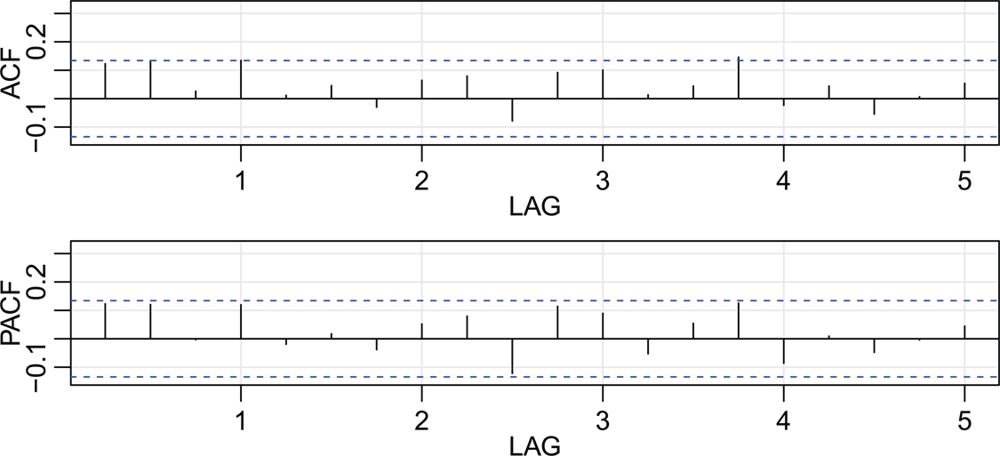

그림 8.2: 미국 GNP에 대한 AR(1) 적합 잔차 제곱의 ACF 및 PACF. [본문으로 돌아가기.⏎](chapter8)

203\. 우리는 fgarch 패키지를 사용하여 미국 GNP 수익률에 AR(1)-ARCH(1) 모델을 적합했으며 다음 결과를 얻었습니다. 부분적인 출력이 아래에 나와 있습니다. 아래 코드에서 garch( 1, 0)은 ARCH(1)을 지정한다는 점을 확인해 주십시오(자세한 내용은 예제 다음에 설명).

`library(fGarch)`
`gnpr = diff(log(**gnp**))`
`summary( garchFit(~arma(1,0) + garch(1,0), data = gnpr) )`
`            Estimate   Std.Error t.value Pr(>|t|) <- 2-sided !!!`
` φ0 mu         0.005       0.001    5.867    0.000`
` φ1 ar1        0.367       0.075    4.878    0.000`
` α0 omega      0.000       0.000    8.135    0.000 <- these parameters`
` α1 alpha1     0.194       0.096    2.035    0.042 <- can’t be negative`
` `
`   Standardised Residuals Tests: Statistic p-Value`
`    Jarque-Bera Test   R    Chi^2    9.118   0.010`
`    Shapiro-Wilk Test R     W        0.984   0.014`
`    Ljung-Box Test     R    Q(20)   23.414   0.269`
`    Ljung-Box Test     R^2 Q(20)    37.743   0.010`

주어진 p-값은 양측 검정이므로 ARCH 매개변수를 고려할 때는 그 값을 절반으로 줄여야 합니다. 이 예제에서는 AR(1) 매개변수 추정치로 ϕ^0\=.005(출력에서는 mu로 표기) 및 ϕ^1\=.367(ar1로 표기)을 얻습니다. [예제 5.6](#chapter5#exam5_6)에서는 이 값들이 각각 .008과 .347이었습니다. ARCH(1) 매개변수 추정치는 상수에 대해 α^0\=0(mega로 표기), 그리고 α^1\=.194이며 약 .02의 p-값으로 유의미합니다. 잔차 \[R\] 또는 제곱 잔차 \[R^2\]에 대해 수행되는 여러 가지 검정이 있습니다. 예를 들어, Jarque-Bera 통계량은 관측된 왜도(Skewness)와 첨도(Kurtosis)를 기반으로 적합 잔차의 정규성을 검정하며, 잔차에 비정규 왜도와 첨도가 있는 것으로 보입니다. Shapiro-Wilk 통계량은 경험적 순서 통계량을 기반으로 적합 잔차의 정규성을 검정합니다. Q-통계량에 주로 기반한 기타 검정들은 잔차 및 그 제곱에 사용됩니다.

204\. [예제 8.1](#chapter8#exam8_1)의 분석에는 몇 가지 문제가 있었습니다. 첫째, 잔차가 정규 분포를 따르지 않는 것으로 보입니다(_εt_에 대한 가정이었습니다). 또한 제곱 잔차에 약간의 자기상관이 남아 있을 수 있습니다([문제 8.2](#chapter8#question8_2) 참조). ARCH의 한 가지 확장은 일반화된 ARCH(Generalized ARCH) 즉 GARCH 모델입니다. 예를 들어 GARCH(1,1) 모델은 변동성 방정식에 추가 구성 요소를 더합니다.

rt\=μt+σtεt(8.6)

σt2\=α0+α1rt−12+β1σt−12.(8.7)

α1+β1<1이라는 조건 하에, (8.4)와 유사한 조작을 사용하면 GARCH(1,1) 모델은 제곱 프로세스에 대한 비가우시안 ARMA(1,1) 모델을 따릅니다.

rt2\=α0+(α1+β1)rt−12+vt−β1vt−1,(8.8)

여기서 편의상 μt\=0으로 설정했으며, _vt_는 (8.4)에서 정의된 바와 같습니다. (8.6)–(8.7) \[μt\=0 포함\]을 다음과 같이 작성하고, 표현식 (8.8)은

rt2−σt2\=σt2(εt2−1)β1(rt−12−σt−12)\=β1σt−12(εt−12−1),

첫 번째 방정식에서 두 번째 방정식을 빼고, (8.7)로부터 σt2−β1σt−12\=α0+α1rt−12라는 사실을 결과의 왼쪽 변에 사용함으로써 도출됩니다. GARCH(p,q) 모델은 (8.6)을 유지하고 (8.7)을 확장합니다.

rt\=μt+σtεt,σt2\=α0+∑j\=1pαjrt−j2+∑j\=1qβjσt−j2.

모델 매개변수의 추정은 ARCH 매개변수의 추정과 유사합니다. 다음 예제에서 이러한 개념들을 탐구해 보겠습니다.

예제 8.2 DJIA 수익률의 GARCH 분석 [본문으로 돌아가기.⏎](chapter8)

앞서 언급했듯이, [그림 8.1](#chapter8#fig8_1)에 나타난 DJIA의 일일 수익률은 전형적인 GARCH 특징을 나타냅니다. 또한 시계열 자체에 낮은 수준의 자기상관이 존재하며, 이러한 특징을 포함하기 위해 우리는 fGarch 패키지를 사용하여 시계열에 (정규 분포가 아닌) _t_-오차를 사용한 AR(1)-GARCH(1,1) 모델을 적합했습니다.

`djiar = diff(log(**djia**[,"Close"]))`
`**acf2**(djiar)      _# exhibits some autocorrelation - ACF in Figure 8.1_`
`res = resid( **sarima**(djiar, 1,0,0, **details**=FALSE)[[1]] )`
`**acf2**(res^2)      _# oozes autocorrelation - see Figure 8.1_`
`_# fit AR-GARCH model_`
`library(fGarch)`
`summary(djia.g <- garchFit( ~arma(1,0)+garch(1,1), data=djiar, cond.dist="std"))`
`             Estimate  Std.Error t.value    Pr(>|t|) <- 2-sided !!!`
`   mu       8.585e-04  1.470e-04     5.842  5.16e-09`
`   ar1    -5.531e-02   2.023e-02    -2.735  0.006239`
`   omega    1.610e-06  4.459e-07     3.611  0.000305`
`   alpha1 1.244e-01    1.660e-02     7.497  6.55e-14`
`   beta1    8.700e-01  1.526e-02    57.022  < 2e-16`
`   shape    5.979e+00  7.917e-01     7.552  4.31e-14`
`   ---`
`   Standardised Residuals Tests:`
`                                  Statistic   p-Value`
`    Ljung-Box Test     R   Q(10) 16.81507 0.0785575`
`    Ljung-Box Test     R^2 Q(10) 15.39137 0.1184312`
`plot(djia.g, which=3) _# similar to Figure 8.3_`

205\. shape 매개변수는 _t_ 오차 분포의 자유도이며, 약 6으로 추정됩니다. 또한 α^1+β^1이 1에 가깝다는 점에 주목하십시오. 이는 흔히 발생하는 경우입니다. 변동성에 대한 GARCH 예측을 탐구하기 위해, 우리는 2008년 금융 위기를 전후한 데이터의 일부와 이에 상응하는 변동성 σt2의 한 단계 앞 예측을 계산하여 [그림 8.3](#chapter8#fig8_3)에 실선으로 나타냈습니다.

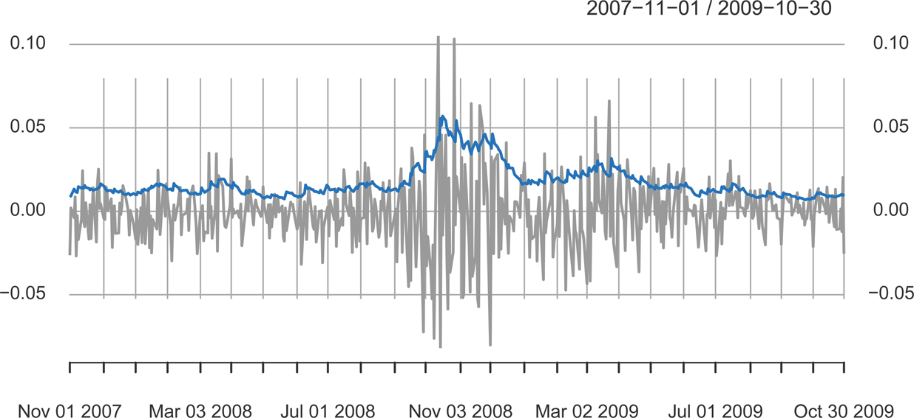

그림 8.3: 2008년 금융 위기를 포함한 데이터 일부에 겹쳐진 DJIA 변동성 _σt_의 GARCH 한 단계 앞 예측. [본문으로 돌아가기.⏎](chapter8)

간단히 언급할 또 다른 모델은 비대칭 거듭제곱 ARCH (Asymmetric power ARCH, APARCH) 모델입니다. 이 모델은 (8.6), rt\=μt+σtεt를 유지하지만 조건부 분산은 다음과 같습니다.

σtδ\=α0+∑j\=1pαj(|rt−j|−γjrt−j)δ+∑j\=1qβjσt−jδ.(8.9)

δ\=2이고 모든 j∈{1,…,p}에 대해 γj\=0일 때 이 모델은 GARCH가 됨을 참고하십시오. 매개변수 _γj_ (|γj|≤1)는 비대칭성을 측정하는 레버리지(Leverage) 매개변수이며, δ\>0은 거듭제곱 항의 매개변수입니다. 양의 \[음의\] _γj_ 값은 과거의 부정적 \[긍정적\] 충격이 206\. 과거의 긍정적 \[부정적\] 충격보다 현재의 조건부 변동성에 더 깊은 영향을 미침을 의미합니다. 이 모델은 레버리지 효과(Leverage effect)를 고려하기 위해 비대칭 계수와 다양한 지수의 유연성을 결합합니다. 또한 σt\>0을 보장하기 위해 α0\>0, 최소한 하나의 αj\>0와 함께 αj≥0, 그리고 βj≥0을 가정합니다.

다음 예제에서 DJIA 수익률 분석을 계속합니다.

예제 8.3 DJIA 수익률의 APARCH 분석

fGarch 패키지를 사용하여 [예제 8.2](#chapter8#exam8_2)에서 논의된 DJIA 수익률에 AR-APARCH 모델을 적합했습니다. 이전 예제와 마찬가지로 조건부 평균을 고려하기 위해 모델에 AR(1)을 포함합니다. 이 경우 모델을 rt\=μt+yt로 생각할 수 있으며, 여기서 _μt_는 AR(1)이고 _yt_는 _t_-오차를 가지며 (8.9)로 모델링된 조건부 분산을 가지는 APARCH 잡음입니다. 분석 결과의 일부가 아래에 제공됩니다. 그래프는 포함하지 않지만 이를 얻는 방법을 보여줍니다. 물론 예측된 변동성은 [그림 8.3](#chapter8#fig8_3)에 나타난 값과는 다르지만 그래프로 그렸을 때 유사해 보입니다.

`library(fGarch)`
`djiar = diff(log(**djia**[,"Close"]))`
`summary(djia.ap <- garchFit( ~arma(1,0)+aparch(1,1), data=djiar,`
`   cond.dist="std"))`
` `
`           Estimate   Std. Error   t value Pr(>|t|) <- still 2-sided !!!`
`  mu      3.270e-04    1.454e-04     2.249   0.0245`
`  ar1    -4.611e-02    1.943e-02    -2.373   0.0177`
`  omega   2.266e-04    4.781e-05     4.740 2.14e-06`
`  alpha1 1.233e-01     1.362e-02     9.053 < 2e-16`
`  gamma1 7.152e-01     1.097e-01     6.518 7.14e-11`
`  beta1   8.834e-01    1.232e-02    71.726 < 2e-16`
`  delta   1.033e+00    1.556e-01     6.638 3.18e-11`
`  shape   5.361e+00    5.513e-01     9.724 < 2e-16`
`  ---`
` `
`  Standardised Residuals Tests:`
`                                  Statistic p-Value`
`   Ljung-Box Test     R    Q(10) 15.89827 0.102582`
`   Ljung-Box Test     R^2 Q(10) 18.24210 0.051015`
`plot(djia.ap)   _# to see all plot options (none shown)_`

대부분의 응용 분야에서 (8.1)의 노이즈 _εt_의 분포는 정규 분포인 경우가 드뭅니다. fGarch 패키지를 사용하면 데이터에 다양한 분포를 적합할 수 있습니다. 자세한 내용은 도움말 파일을 참조하십시오. GARCH 및 관련 모델들의 몇 가지 단점은 다음과 같습니다. (i) GARCH 모델은 변동성이 수익률의 제곱에 의존하기 때문에 긍정적인 수익률과 부정적인 수익률이 동일한 영향을 미친다고 가정합니다. 비대칭 모델은 이 문제를 완화하는 데 도움이 됩니다. (ii) 이 모델들은 모델 매개변수에 대한 엄격한 제약 때문에 종종 제한적입니다. (iii) _n_이 매우 크지 않는 한 우도(Likelihood)는 평탄합니다. (iv) 고립된 큰 수익률에 느리게 반응하기 때문에 변동성을 과대 예측하는 경향이 있습니다.

207\. 방금 언급한 몇 가지 단점들을 극복하기 위해 기존 모델에 대한 다양한 확장이 제안되었습니다. 예를 들어, 우리는 이미 fGarch가 비대칭 수익률 동태를 허용한다는 사실을 논의했습니다. 변동성에 지속성이 있는 경우에는 통합 GARCH (Integrated GARCH, IGARCH) 모델을 사용할 수 있습니다. GARCH(1,1) 모델이 다음과 같이 작성될 수 있음을 보여준 (8.8)을 상기해 보십시오.

rt2\=α0+(α1+β1)rt−12+vt−β1vt−1

그리고 α1+β1<1이면 rt2는 정상적(Stationary)입니다. IGARCH 모델은 α1+β1\=1로 설정하며, 이 경우 IGARCH(1,1) 모델은 다음과 같습니다.

rt\=σtεtandσt2\=α0+(1−β1)rt−12+β1σt−12.

기본 ARCH 모델에는 실제에서 확인된 다양한 상황을 처리하기 위해 개발된 많은 확장이 있습니다. 관심 있는 독자는 [Bollerslev et al. (1994)](#bibref1#refbib_6) 및 [Shephard (1996)](#bibref1#refbib_41)의 일반적인 논의를 읽어보는 것이 좋을 것입니다. 금융 시계열 분석에 대한 두 가지 훌륭한 교재로 [Chan (2002)](#bibref1#refbib_10)과 [Tsay (2005)](#bibref1#refbib_51)가 있습니다.

예제 8.4 일부 ARCH 모델 이론 \* [본문으로 돌아가기.⏎](chapter8)

여기서는 ARCH 모델과 관련된 몇 가지 세부 사항을 논의합니다. 수익률 _rt_에 대한 ARCH(1) 모델은 다음과 같음을 상기하십시오.

rt\=σtεtσt2\=α0+α1rt−12,

여기서 _εt_는 표준 가우시안 백색 잡음(εt∼ iid N(0,1))입니다.

먼저, rt−1이 주어졌을 때 _rt_의 조건부 분포는 가우시안임을 주목하십시오.

rt|rt−1∼N(0,α0+α1rt−12).(8.10)

또한, 제곱 수익률은 다음과 같이 비가우시안 AR(1) 모델임을 보여주었습니다.

rt2\=α0+α1rt−12+vt,(8.11)

여기서 vt\=σt2(εt2−1)입니다.

ARCH의 특성을 더 깊이 알아보기 위해 Rs\={rs,rs−1,…}를 정의합니다. 그러면 [속성 A.1](#appA#propA_1)과 ([8.10](#appA#propA_1))을 사용하여 _rt_의 평균이 0임을 바로 알 수 있습니다.

E(rt)\=EE(rt|Rt−1)\=EE(rt|rt−1)\=0.(8.12)

E(rt∣Rt−1)\=0이기 때문에 프로세스 _rt_는 마팅게일 차분(Martingale difference)이라고 합니다.

_rt_가 마팅게일 차분이기 때문에 무상관(Uncorrelated) 시퀀스이기도 합니다. 예를 들어 h\>0일 때,

cov(rt,rt−h)\=E(rt−h rt)\=EE(rt−h rt∣Rt−1)\=E{rt−h E(rt∣Rt−1)}\=0.(8.13)

208\. (8.13)의 마지막 줄은 h\>0에 대해 rt−h가 정보 집합 Rt−1에 속하고 (8.12)에서 결정된 바와 같이 E(rt∣Rt−1)\=0이기 때문에 성립합니다.

(8.12) 및 (8.13)과 유사한 논증을 통해 (8.4)의 오차 프로세스 _vt_ 역시 마팅게일 차분이며 따라서 무상관 시퀀스라는 사실을 확립할 수 있습니다. _vt_의 분산이 유한하고 시간에 대해 일정하며 0≤α1<1이라면, [속성 4.38](#chapter4#prop4_38)에 근거하여 (8.11)은 rt2에 대한 인과적 AR(1) 프로세스를 지정합니다. 따라서 E(rt2)와 var(rt2)는 시간 _t_에 대해 일정해야 합니다. 이는 다음을 의미하며,

E(rt2)\=var(rt)\=α01−α1

약간의 조작을 거치면 3α12<1일 때 다음을 얻습니다.

E(rt4)\=3α02(1−α1)21−α121−3α12,

다음을 참고하십시오.

var(rt2)\=E(rt4)−\[E(rt2)\]2,

이는 0<α1<1/3≈.58인 경우에만 존재합니다. 또한 이러한 결과는 _rt_의 첨도(Kurtosis) _κ_가 다음과 같음을 의미합니다.

κ\=E(rt4)\[E(rt2)\]2\=31−α121−3α12,

이 값은 정규 분포의 첨도인 3보다 작아지지 않습니다. 따라서 수익률 _rt_의 주변 분포(Marginal distribution)는 렙토커틱(Leptokurtic) 분포 즉 "두꺼운 꼬리(Fat tails)"를 갖습니다. 요약하자면 0≤α1<1이면 프로세스 _rt_ 자체는 백색 잡음이고 그 무조건부 분포는 0을 중심으로 대칭으로 분포하며 이 분포는 렙토커틱합니다. 만약 3α12<1까지 만족한다면, 프로세스의 제곱 rt2는 모든 h\>0에 대해 ρy2(h)\=α1h≥0로 주어지는 ACF를 가지는 인과적 AR(1) 모델을 따릅니다.

ARCH(1) 모델의 매개변수 _α_0와 _α_1의 추정은 일반적으로 조건부 최대우도추정(MLE)을 통해 수행됩니다. _r_1이 주어졌을 때 데이터 r2,…,rn의 조건부 우도는 다음과 같습니다.

L(α0,α1|r1)\=∏t\=2nfα0,α1(rt|rt−1),

여기서 밀도 fα0,α1(rt|rt−1)은 (8.3)에 명시된 정규 밀도입니다. 따라서 최소화해야 할 기준 함수(Criterion function) l(α0,α1)∝−lnL(α0,α1|r1)는 다음과 같이 주어집니다.

l(α0,α1)\=12∑t\=2nln(α0+α1rt−12)+12∑t\=2n(rt2α0+α1rt−12).

추정은 [4.5절](#chapter4#sec4_5)에서 설명한 바와 같이 수치적 방법을 통해 수행됩니다. ARCH 모델의 우도는 _n_이 매우 크지 않는 한 평탄해지는 경향이 있습니다. 이 문제에 대한 논의는 [Shephard (1996)](#bibref1#refbib_41)에서 찾을 수 있습니다.

## 8.2 209\. 단위근 검정 (Unit Root Testing)

1차 차분(First difference) ∇xt\=(1−B)xt의 사용은, 통합 모델이 원본 프로세스의 과대차분(Overdifferencing)을 나타낼 수도 있다는 점에서 때로는 너무 가혹한 수정일 수 있습니다. 예를 들어 [예제 5.9](#chapter5#exam5_9)에서는 로그 변환된 연층(Varve) 시계열에 ARIMA(1,1,1) 모델을 적합했습니다. 시계열을 차분한다는 아이디어는 [예제 4.28](#chapter4#exam4_28)에서 처음 제시되었는데, 이는 해당 시계열이 양과 음의 방향으로 100년 이상 장기간 횡보(Walks)하는 것처럼 보였기 때문입니다.

[그림 8.4](#chapter8#fig8_4)는 생성된 무작위 행보(Random walk)의 표본 ACF를 로그 변환된 연층 시계열의 표본 ACF와 비교합니다.[3](#chapter8#fn8_3) 두 경우 모두 표본 상관관계가 선형적으로 감소하며 많은 시차에 대해 유의미한 상태를 유지하지만, 무작위 행보의 표본 ACF가 훨씬 더 큰 값을 갖습니다.

`par(mfrow=2:1)`
`**acf1**(cumsum(rnorm(634)), 100, col=4, main="Series: random walk")`
`**acf1**(log(**varve**), 100, col=4, ylim=c(-.1,1))`

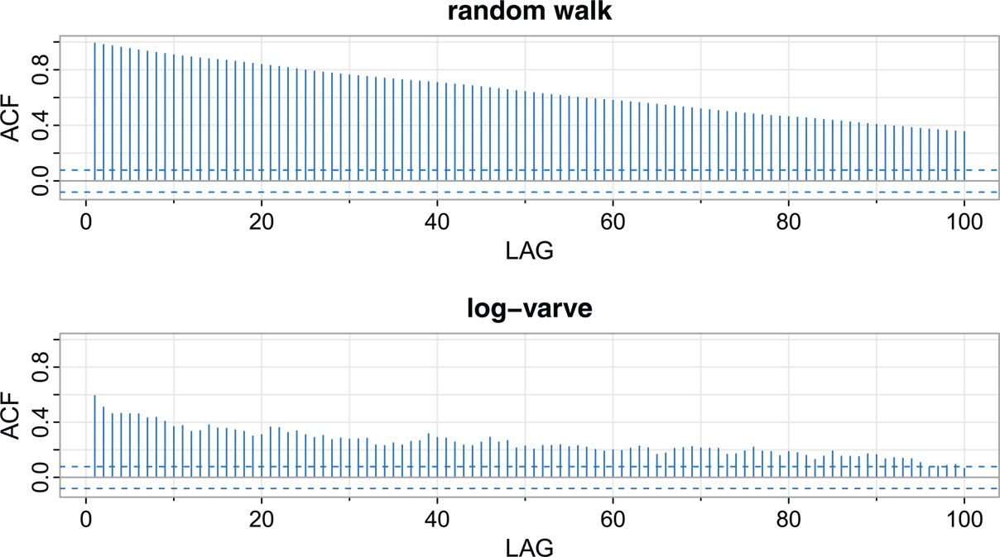

그림 8.4: 무작위 행보와 로그 변환된 연층 시계열의 표본 ACF. [본문으로 돌아가기.⏎](chapter8)

먼저 정규 분포 AR(1) 프로세스를 고려해 보겠습니다.

xt\=ϕxt−1+wt.

단위근 검정은 인과적 프로세스(대립가설)와 대비하여 ϕ\=1인지 여부(귀무가설)를 검정하는 방법을 제공합니다. 즉, 다음과 같은 가정을 검정하는 절차를 제공합니다.

H0:ϕ\=1versusH1:|ϕ|<1.

귀무가설이 합리적인지 확인하기 위해 t-검정을 개발할 목적으로 적절히 정규화된 (ϕ^−1)을 고려하는 명백한 검정 통계량을 생각할 수 있으며, 여기서 ϕ^은 [4.5절](#chapter4#sec4_5)에서 논의된 최적의 추정량(Optimal estimators) 중 하나입니다. 하지만 귀무가설 하에서는 프로세스가 정상적(Stationary)이지 않기 때문에 여기서 ϕ^의 분포에 대한 이론은 작동하지 않습니다.

그러나 다음의 검정 통계량을 사용할 수 있으며,

T\=n(ϕ^−1)

실제 DF 검정 통계량은 조금 다르게 정규화되지만 이를 단위근 또는 Dickey-Fuller (DF) 통계량이라고 합니다. 이 경우 검정 통계량의 분포는 닫힌 형태(Closed form)를 갖지 않으므로 분포의 분위수(Quantiles)는 수치적 근사 또는 시뮬레이션을 통해 계산해야 합니다. tseries 패키지는 간단히 언급할 보다 일반적인 검정들과 함께 이 검정을 제공합니다.

보다 일반적인 모델을 향해 나아가면서, DF 검정은 xt\=ϕxt−1+wt일 때 다음과 같이 표현할 수 있음에 착안하여 확립되었음을 참고하십시오.

∇xt\=(ϕ−1)xt−1+wt\=γxt−1+wt,

\_\_\_\_\_\_\_\_\_\_\_\_\_\_\_\_\_ 3무작위 행보가 정상적이지는 않지만 진정한 ACF가 시차에만 의존하지 않더라도 시차의 관점에서만 표본 ACF를 보는 것은 교훈적일 수 있습니다. [본문으로 돌아가기.⏎](#chapter8#fn8_38b)

210\. 그리고 ∇xt를 xt−1에 대해 회귀 분석하여 회귀 계수 추정치 γ^을 얻음으로써 H0:γ\=0을 검정할 수 있습니다. 그런 다음 통계량 nγ^을 구성하고 그 대표본 분포를 유도합니다.

이 검정은 AR(_p_) 모델인 xt\=∑j\=1pϕjxt−j+wt를 수용하도록 유사한 방식으로 확장되었습니다. 예를 들어 AR(2) 모델인

xt\=ϕ1xt−1+ϕ2xt−2+wt,

이 식을 다음과 같이 작성하고

xt\=(ϕ1+ϕ2)xt−1−ϕ2(xt−1−xt−2)+wt,

양변에서 xt−1을 뺍니다. 그러면 다음을 얻습니다.

∇xt\=γxt−1+ϕ2∇xt−1+wt,

여기서 γ\=ϕ1+ϕ2−1입니다. 프로세스가 1에서 단위근을 갖는다는(즉, z\=1일 때 AR 다항식 ϕ(z)\=1−ϕ1z−ϕ2z2\=0) 가설을 검정하기 위해, ∇xt를 xt−1 및 ∇xt−1에 대해 회귀 분석하여 _γ_를 추정하고 검정 통계량을 구성함으로써 H0:γ\=0을 검정할 수 있습니다. AR(_p_) 모델의 경우, AR(2)의 경우와 유사한 방식으로 ∇xt를 xt−1 및 ∇xt−1…,∇xt−p+1에 대해 회귀 분석합니다.

이 검정은 소위 확장된 Dickey-Fuller 검정(Augmented Dickey-Fuller test, ADF)으로 이어집니다. 대표본의 귀무 분포를 얻기 위한 계산 과정은 달라지지만 기본적인 아이디어와 메커니즘은 단순한 경우와 동일하게 유지됩니다. _p_의 선택은 중요하며, 예제에서 몇 가지 제안을 논의하겠습니다. ARMA(_p,q_) 모델의 경우 _p_가 필수적인 상관 구조를 포착하기에 충분히 크다고 가정함으로써 ADF 검정을 사용할 수 있습니다. ARMA(_p,q_) 모델은 AR(∞) 모델임을 기억하십시오. 대안으로는 Phillips-Perron (PP) 검정이 있으며, 이는 주로 오차의 계열 상관(Serial correlation)과 이분산성(Heteroscedasticity)을 다루는 방식에서 ADF 검정과 다릅니다.

예제 8.5 211\. 빙하 연층 시계열의 단위근 검정 [본문으로 돌아가기.⏎](chapter8)

이 예제에서는 tseries 패키지를 사용하여 로그 변환된 빙하 연층 시계열이 단위근을 갖는다는 귀무가설과 프로세스가 정상적이라는 대립가설을 검정합니다. 사용 가능한 DF, ADF 및 PP 검정을 사용하여 귀무가설을 검정합니다. 각 경우에 일반 회귀 방정식은 상수와 선형 추세를 통합한다는 점에 유의하십시오. ADF 검정에서 모델에 포함될 AR 컴포넌트의 기본 수는 k≈(n−1)13인데, 이는 표본 크기 _n_에 비해 _k_가 어떻게 커져야 하는지에 대한 이론적 정당성을 갖습니다. PP 검정의 기본값은 k≈.04n14입니다.

`library(tseries)`
`adf.test(log(**varve**), k=0)               _# DF test_`
`  Dickey-Fuller = -12.8572, Lag order = 0, p-value < 0.01`
`   alternative hypothesis: stationary`
`adf.test(log(**varve**))                    _# ADF test_`
`  Dickey-Fuller = -3.5166, Lag order = 8, p-value = 0.04071`
`   alternative hypothesis: stationary`
`pp.test(log(**varve**))                     _# PP test_`
`   Dickey-Fuller Z(alpha) = -304.5376,`
`    Truncation lag parameter = 6, p-value < 0.01`
`    alternative hypothesis: stationary`

각 검정에서 우리는 로그 변환된 연층 시계열이 단위근을 갖는다는 귀무가설을 기각합니다. 이러한 검정들의 결론은 [8.3절](#chapter8#sec8_3)의 [예제 8.6](#chapter8#exam8_6) 결론을 뒷받침하며, 거기서 로그 변환된 연층 시계열이 장기 기억(Long memory)을 갖는다고 가정합니다. 단위근 검정의 가설이 기각되면 이 데이터에 장기 기억 모델을 적합하는 것이 모델 적합의 자연스러운 수순일 것입니다.

## 8.3 장기 기억 및 부분 차분 (Long Memory and Fractional Differencing)

기존의 ARMA(p,q) 프로세스는 다음 표현식의 계수들이

xt\=∑j\=0∞ψjwt−j,

지수적 붕괴(Exponential decay)에 의해 지배되고 ∑j\=0∞|ψj|<∞이기 때문에 종종 단기 기억(Short memory) 프로세스라고 지칭됩니다(예: [예제 4.3](#chapter4#exam4_3) 상기). 이 결과는 단기 기억 프로세스의 ACF ρ(h)가 h→∞임에 따라 기하급수적으로 빠르게 0으로 수렴함을 의미합니다. 시계열의 표본 ACF가 천천히 감소할 때 [5장](#chapter5)에서 주어지는 조언은 시계열이 정상적인 것으로 보일 때까지 차분(Difference)하라는 것입니다. [예제 4.28](#chapter4#exam4_28)에서 처음 제시된 빙하 연층 시계열에 이 조언을 따르면, 데이터의 로그값에 대한 1차 차분 xt\= log( varve)가 1차 이동 평균으로 표현됩니다. [예제 5.9](#chapter5#exam5_9)에서는 잔차에 대한 추가 분석을 통해 212\. 다음 결과를 갖는 ARIMA(1,1,1) 모델을 적합하게 되었습니다.

∇x^t\=.23∇x^t−1+w^t−.89w^t−1.

그러나 1차 차분 ∇xt\=(1−B)xt의 사용은 때때로 너무 가혹한 변환이 될 수 있습니다. 예를 들어 _xt_가 인과적 AR(1) 모델인

xt\=.9xt−1+wt,

이라고 가정해 보겠습니다. 여기에 ∇\=(1−B)를 곱하면 다음과 같습니다.

∇xt\=.9∇xt−1+wt−wt−1.

이는 이동 평균 부분이 비가역적(Noninvertible)이기 때문에 ∇xt가 문제가 있는 ARMA(1,1)임을 의미합니다. 따라서 이 예제에서 과대차분(Overdifferencing)함으로써 단순한 인과적 AR(1)에서 비가역적 ARIMA(1,1,1)로 넘어가게 된 것입니다. 이것이 바로 우리가 [5장](#chapter5)에서 차분의 남용에 대해 여러 번 경고한 이유입니다.

장기 기억 시계열은 [Hosking (1981)](#bibref1#refbib_24) 및 [Granger and Joyeux (1980)](#bibref1#refbib_20)에서 단기 기억 ARMA 유형 모델과 ARIMA 클래스의 완전 통합 비정상(Nonstationary) 프로세스 사이의 중간 타협점으로 간주되었습니다. 장기 기억 시계열을 생성하는 가장 쉬운 방법은 부분적인(Fractional) 값 _d_(0<d<.5)에 대해 차분 연산자 (1−B)d를 사용하는 것을 생각하는 것입니다. 기본 장기 기억 시계열은 다음과 같이 생성될 수 있습니다.

(1−B)dxt\=wt,(8.14)

여기서 _wt_는 여전히 분산이 σw2인 백색 잡음을 나타냅니다. |d|<.5에 대해 부분 차분된 시계열 (8.14)는 종종 부분 잡음(Fractional noise)이라고 불립니다(_d_가 0인 경우 제외). 이제 _d_는 σw2와 함께 추정해야 할 매개변수가 됩니다. Box-Jenkins 접근법에서와 같이 원본 프로세스를 차분하는 것은 단순히 d\=1이라는 값을 할당하는 것으로 생각할 수 있습니다. 이 아이디어는 −.5<d<.5인 부분 누적 ARMA(Fractionally integrated ARMA, ARFIMA) 모델 클래스로 확장되었습니다. _d_가 음수일 때는 반지속성(Antipersistent)이라는 용어가 사용됩니다. 장기 기억 프로세스는 수문학([Hurst, 1951](#bibref1#refbib_25); [McLeod and Hipel, 1978](#bibref1#refbib_33) 참조) 및 앞서 분석한 연층 데이터와 같은 환경 시계열 등에서 관찰될 수 있습니다. 장기 기억 시계열 데이터는 표본 자기상관이 반드시 크지는 않더라도(d\=1인 경우처럼), 오랫동안 지속되는 경향을 나타냅니다. [그림 8.4](#chapter8#fig8_4)는 로그 변환된 연층 시계열의 시차 100까지의 표본 ACF를 보여주며, 이는 전형적인 장기 기억 동작을 나타냅니다.

그 특성을 조사하기 위해 우리는 이항 전개(Binomial expansion)[4](#chapter8#fn8_4)(d\>−1)를 사용하여 다음과 같이 쓸 수 있습니다.

wt\=(1−B)dxt\=∑j\=0∞πjBjxt\=∑j\=0∞πjxt−j(8.15)

\_\_\_\_\_\_\_\_\_\_\_\_\_\_\_\_\_ 4이 경우 이항 전개는 (1−z)d 형태의 함수에 대한 z\=0에서의 테일러 급수(Taylor series)입니다. [본문으로 돌아가기.⏎](#chapter8#fn8_48b)

213\. 여기서

πj\=Γ(j−d)Γ(j+1)Γ(−d)(8.16)

이며 Γ(x+1)\=xΓ(x)는 감마 함수(Gamma function)입니다. 유사하게 (d<1) 다음과 같이 쓸 수 있습니다.

xt\=(1−B)−dwt\=∑j\=0∞ψjBjwt\=∑j\=0∞ψjwt−j(8.17)

여기서

ψj\=Γ(j+d)Γ(j+1)Γ(d).(8.18)

|d|<.5일 때 프로세스 (8.15)와 (8.17)은 잘 정의된 정상적 프로세스입니다([자세한 내용은 Brockwell and Davis, 2013 참조](#bibref1#refbib_8)). 부분 차분의 경우 ARMA 프로세스 계수의 절대 가합성(Absolute summability)과는 달리 계수들이 ∑πj2<∞ 및 ∑ψj2<∞를 만족합니다.

표현식 (8.17)–(8.18)을 사용하면 큰 _h_에 대해 _xt_의 ACF가 다음과 같음을 보일 수 있습니다.

ρ(h)\=Γ(h+d)Γ(1−d)Γ(h−d+1)Γ(d)∼h2d−1(8.19)

이로부터 0<d<.5에 대해 다음이 성립함을 알 수 있으며,

∑h\=−∞∞|ρ(h)|\=∞

따라서 "장기 기억(Long memory)"이라는 용어가 붙습니다.

연층 시계열과 같은 시계열에서 발생 가능한 장기 기억 패턴을 조사하려면 _d_를 추정하는 방법을 살펴보는 것이 편리합니다. (8.16)을 사용하면 재귀식(Recursion)을 얻을 수 있습니다.

πj+1(d)\=(j−d)πj(d)(j+1),(8.20)

j\=0,1,…에 대해 π0(d)\=1입니다. 정규 분포인 경우 제곱 오차의 합을 최소화하여 _d_를 추정할 수 있습니다.

Q(d)\=∑wt2(d).

[4.5절](#chapter4#sec4_5)에서 설명한 통상적인 Gauss-Newton 방법은 다음의 전개로 이어집니다.

wt(d)≈wt(d0)+wt′(d0)(d−d0),

여기서

wt′(d0)\=∂wt∂d|d\=d0

214\. 그리고 _d_0는 _d_ 값에 대한 초기 추정치(추측)입니다. 일반적인 회귀를 설정하면 다음을 얻습니다.

d\=d0−∑twt′(d0)wt(d0)∑twt′(d0)2.(8.21)

도함수는 (8.20)을 _d_에 대해 연속적으로 미분함으로써 재귀적으로 계산됩니다. πj+1′(d)\=\[(j−d)πj′(d)−πj(d)\]/(j+1)이며, 여기서 π0′(d)\=0입니다. 오차는 (8.15)에 대한 근사치, 즉 다음 식으로부터 계산됩니다.

wt(d)\=∑j\=0tπj(d)xt−j.(8.22)

계산에서 일정 수의 초기 항을 생략하고, 합(8.21)을 꽤 큰 값에서 시작하는 것이 합리적인 근사치를 얻는 데 바람직합니다.

예제 8.6 빙하 연층 시계열의 장기 기억 적합 [본문으로 돌아가기.⏎](chapter8)

[예제 3.14](#chapter3#exam3_14) 및 [예제 4.28](#chapter4#exam4_28)에서 논의된 빙하 연층 시계열의 분석을 고려해 보겠습니다. [그림 3.11](#chapter3#fig3_11)은 원본 및 로그 변환된 시계열(이를 _xt_로 나타냄)을 보여줍니다. [예제 5.9](#chapter5#exam5_9)에서는 _xt_를 ARIMA(1,1,1) 프로세스로 모델링할 수 있음을 언급했습니다. 여기서는 arfima 패키지를 사용하여 부분 차분 모델 (8.14)를 _xt_에 적합합니다. 앞서 설명한 Gauss-Newton 반복 절차를 적용하면 최종값 d^≈.373을 얻습니다. [그림 8.5](#chapter8#fig8_5)에 나타난 것처럼 혁신(Innovations)을 조사함으로써 부분 잡음 적합이 데이터에 대해 갖는 성능을 평가할 수 있습니다.

`library(arfima)   _# assumes arfima package installed_`
`summary(varve.fd <- arfima(log(**varve**), order = c(0,0,0)))`
`  Mode 1 Coefficients:`
`              Estimate Std.Error Th.Std.Err. z-value       Pr(>|z|)`
` d.f         0.3727893 0.0273459     0.0309661 13.6324 < 2.22e-16`
` Fitted mean 3.0814142 0.2646507            NA 11.6433 < 2.22e-16`
` ---`
` sigma^2 estimated as 0.230081`
` Log-likelihood = 466.028; AIC = -926.056; BIC = -912.699`
`_# residual analysis_`
`` innov = resid(varve.fd)[[1]]   _# resid() produces a `list`_ ``
`**sarima**(innov, col=4)           _# arfima residuals (no need to adjust dfs)_`
`**sarima**(log(**varve**),1,1,1,no=TRUE) _# from Example 5.9 (not shown)_`

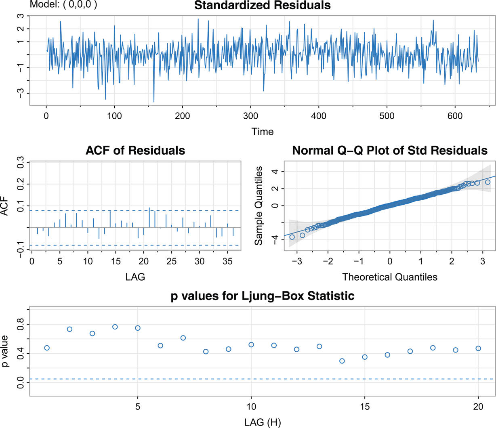

그림 8.5: 로그 변환된 연층 데이터 _xt_에 대한 부분 잡음 적합 w^t\=(1−B).37xt의 잔차 분석. [본문으로 돌아가기.⏎](chapter8)

이 경우 잔차 w^t\=(1−B).37xt는 백색 잡음 가정에 필적할 만하며, 부분 잡음 모델은 [예제 5.9](#chapter5#exam5_9)의 ARIMA(1,1,1) 모델보다 훨씬 더 간단합니다.

추정된 계수들의 집합 πj(d^)는 다음 코드를 사용하여 [그림 8.6](#chapter8#fig8_6)에 π0(d^)\=1과 함께 표시됩니다.

`d = coef(varve.fd)[1]`
`p = c(1)`
`for (k in 1:30) { p[k+1] = (k-d)*p[k]/(k+1) }`
`**tsplot**(1:30, p[-1], ylab=bquote(pi(d)), lwd=2, xlab="Index", type="h", col=4)`

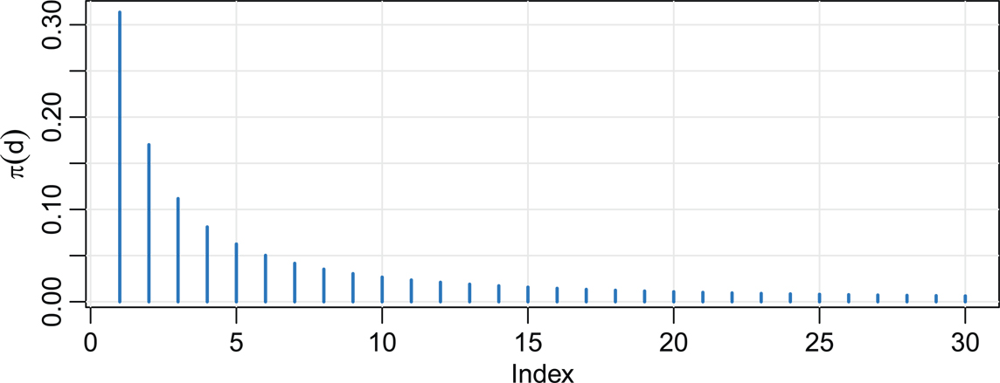

그림 8.6: 표현식 (8.20)에서 j\=1,2,…,30 및 d^≈.373일 때 계수 πj(d^). [본문으로 돌아가기.⏎](chapter8)

215\. 장기 기억 프로세스의 예측은 ARIMA 모델의 예측과 유사합니다. 즉 (8.15)와 (8.20)을 사용하여 m\=1,2,…에 대해 다음의 절단된 예측(Truncated forecasts)을 얻을 수 있습니다.

xn+mn\=−∑j\=1n+m−1πj(d^) xn+m−jn,(8.23)

오차의 한계는 다음을 사용하여 근사될 수 있습니다.

Pn+mn\=σ^w2∑j\=0m−1ψj2(d^)(8.24)

여기서, (8.20)과 마찬가지로 ψ0(d^)\=1과 함께 다음이 성립합니다.

ψj(d^)\=(j+d^)ψj(d^)(j+1),(8.25)

[그림 8.5](#chapter8#fig8_5)에 나타난 부분 차분된 연층 시계열 잔차의 ACF에서는 명백한 단기 기억 ARMA 유형 컴포넌트가 보이지 않습니다. 하지만 장기 기억을 나타내는 데이터에 단기 기억 유형의 컴포넌트 216\. 또한 존재하는 경우가 자연스럽게 발생할 수 있습니다. 따라서 −.5<d<.5인 일반적인 ARFIMA(p,d,q) 프로세스를 다음과 같이 정의하는 것은 자연스럽습니다.

ϕ(B)∇d(xt−μ)\=θ(B)wt,(8.26)

여기서 ϕ(B)와 θ(B)는 [4장](#chapter4)에 주어진 바와 같습니다. 모델을 다음 형태로 작성하면,

ϕ(B)πd(B)(xt−μ)\=θ(B)wt(8.27)

보다 일반적인 모델에 대한 매개변수를 어떻게 추정하는지가 명확해집니다. ARFIMA(p,d,q) 시계열에 대한 예측은 쉽게 수행될 수 있으며, 다음의 계수들을 동일하게 놓음으로써

ϕ(z)ψ(z)\=(1−z)−dθ(z)(8.28)

그리고

θ(z)π(z)\=(1−z)dϕ(z)(8.29)

다음 표현식들을 얻을 수 있음에 유의하십시오.

xt\=μ+∑j\=0∞ψjwt−j

그리고

wt\=∑j\=0∞πj(xt−j−μ).

그런 다음 (8.23) 및 (8.24)에서 논의된 대로 진행할 수 있습니다.

예제 8.7 빙하 연층 시계열 (계속)

[예제 8.6](#chapter8#exam8_6)에서는 단기 기억 컴포넌트의 징후가 없었지만, 여기서는 그러한 항을 포함하는 방법을 보여줍니다. 예시로서 우리는 217\. MA 항을 추가로 적합할 것이며, 단기 기억 항이 없음을 확인하기 위한 과적합(Overfitting) 연습으로 간주할 수 있습니다.

`library(arfima)`
`summary(varve1.fd <- arfima(log(**varve**), order=c(0,0,1)))`
`                Estimate Std.Error   Th.Std.Err z-value Pr(>|z|)`
`  theta(1)    0.0705603 0.0648228     0.0670149 1.08851 0.27637`
`  d.f         0.4089730 0.0440908     0.0523832 9.27569 < 2e-16`
`  Fitted mean 3.0775613 0.3541186            NA 8.69076 < 2e-16`
`  ---`
`  sigma^2 estimated as 0.22985; AIC = -925.306; BIC = -907.498`

단기 기억 MA 항이 유의미하지 않으며 두 정보 기준(Information criteria) 모두 MA 항이 없는 모델을 선호함을 알 수 있습니다. AR 단기 기억 항을 시도하려면 대신 order= c( 1, 0, 0)을 사용하십시오. 그렇게 해도 동일한 결론에 도달합니다.

## 8.4 상태 공간 모델 (State Space Models)

선형 회귀가 수행하는 것과 매우 유사한 방식으로 관심 있는 수많은 특수한 경우들을 포괄하는 매우 일반적인 모델이 바로 상태 공간 모델(State space model)이며, 이는 [Kalman (1960)](#bibref1#refbib_30) 및 [Kalman and Bucy (1961)](#bibref1#refbib_31)에서 설명되었습니다. 이 모델은 상태 방정식(State equation)이 위치 _xt_에 있는 우주선의 위치나 상태에 대한 운동 방정식을 정의하고, 데이터 _yt_는 추적 장치에서 관찰될 수 있는 정보를 반영하는 우주 추적 환경에서 등장했습니다. 비록 다변량 시계열에도 종종 적용되지만, 여기서는 일변량 경우에 초점을 맞춥니다. 모델에 대한 일반적인 취급과 수많은 예제에 대한 자세한 내용은 [Shumway and Stoffer (2025, 6장)](#bibref1#refbib_44)를 참조하십시오.

상태 공간 모델은 두 가지 원칙을 특징으로 합니다. 첫째, 상태 프로세스(State process)라고 불리는 은닉(Hidden) 또는 잠재(Latent) 프로세스 _xt_가 존재합니다. 관측되지 않는 상태 프로세스는 AR(1)이라고 가정하며,

xt\=α+ϕxt−1+wt,(8.30)

여기서 wt∼iid N(0,σw2)입니다. 또한 초기 상태는 x0∼N(μ0,σ02)라고 가정합니다. 두 번째 조건은 관측치 _yt_가 다음과 같이 주어진다는 것입니다.

yt\=Axt+vt,(8.31)

여기서 _A_는 상수이고 관측 노이즈는 vt∼iid N(0,σv2)입니다. 또한 _x_0, {wt} 및 {vt}는 상관관계가 없습니다. 이는 관측치 간의 종속성이 상태(States)에 의해 생성됨을 의미합니다. 이러한 원칙들은 [그림 8.7](#chapter8#fig8_7)에 나타나 있습니다.

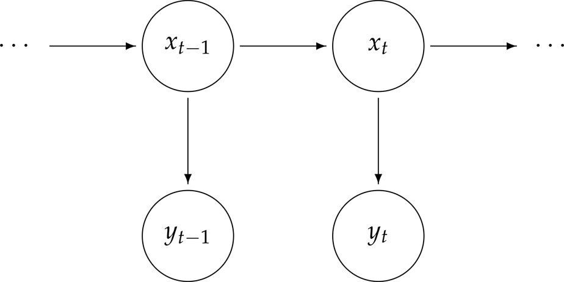

그림 8.7: 상태 공간 모델의 다이어그램. [본문으로 돌아가기.⏎](chapter8)

(8.30)–(8.31)의 상태 공간 모델과 관련된 분석의 주요 목적은 시간 _s_까지의 데이터 y1:s\={y1,…,ys}가 주어졌을 때, 기저에 있는 관측되지 않은 신호 _xt_에 대한 추정량을 생성하는 것입니다.

* 218\. s<t일 때 이 문제를 예측(Forecasting 또는 Prediction)이라고 합니다.
* s\=t일 때 이 문제를 필터링(Filtering)이라고 합니다.
* s\>t일 때 이 문제를 평활화(Smoothing)라고 합니다.

이러한 추정치들 외에도 우리는 그 정밀도를 측정하고자 할 것입니다. 이 문제들에 대한 해결책은 칼만 필터(Kalman filter)와 평활기(Smoother)를 통해 달성됩니다.

간단한 예로, 직접 측정하기에는 너무 뜨거워지는 연소실의 내부 온도 _xt_를 제어해야 한다고 가정해 보겠습니다. _xt_에 대한 모델은 시스템의 물리학에 의해 결정됩니다. 특정 시간 _t_의 현재 온도를 확인하기 위해, 센서를 연소실 근처의 더 차가운 표면에 배치하여 간접적으로 측정치 _yt_를 얻습니다(예: yt≈.01 xt). 측정 오차 항 _vt_는 해당 센서의 교정 또는 정확도에 기반합니다. 내부 온도가 너무 높거나 낮아지지 않도록 하는 것이 중요하므로, 측정치 y1,y2,…yt−1이 주어졌을 때 다음 판독 시점의 실제 온도 _xt_를 예측(Predict)하는 것이 중요할 것입니다. 예를 들어 온도가 너무 높을 것으로 예측된다면 사전에 시스템을 냉각시킬 수 있습니다. 다음으로 새로운 판독값 _yt_가 주어졌을 때, 연소실의 현재 온도를 추정(Filter)하는 것이 중요합니다. 마지막으로 n\>t인 측정치 y1,…,yn이 주어졌을 때 내부 온도 _xt_를 재평가(Smooth)하는 것이 중요할 수 있습니다.

먼저 예측 및 필터링 방정식을 제공하는 칼만 필터를 제시합니다. 우리는 다음의 표기법을 사용합니다.

xts\=E(xt∣y1:s)andPts\=E(xt−xts)2.

칼만 필터의 장점은 새로운 관측치를 얻었을 때 전체 데이터 세트를 다시 처리할 필요 없이 예측을 업데이트하는 방법을 명시한다는 점입니다.

속성 8.8 (칼만 필터). [본문으로 돌아가기.⏎](chapter8)

219\. _(8.30)과 (8.31)에 명시된 상태 공간 모델에 대해, 초기 조건이_ x00\=μ0_이고_ P00\=σ02_일 때,_ t\=1,…,n_에 대하여 다음이 성립합니다._

xtt−1\=α+ϕxt−1t−1andPtt−1\=ϕ2Pt−1t−1+σw2.(predict)xtt\=xtt−1+Kt(yt−Axtt−1)andPtt\=\[1−KtA\]Ptt−1,(filter)

_여기서_

Kt\=Ptt−1A/ΣtandΣt\=A2Ptt−1+σv2.

필터의 중요한 부산물은 독립적인 혁신(예측 오차)들입니다.

εt\=yt−E(yt∣y1:t−1)\=yt−ytt−1\=yt−Axtt−1,(8.32)

여기서 εt∼N(0,Σt)입니다.

칼만 필터의 유도는 [Shumway and Stoffer (2025, 6장)](#bibref1#refbib_44)과 같은 많은 자료에서 찾을 수 있습니다. 예측 방정식은 [4.6절](#chapter4#sec4_6)의 아이디어를 사용하여 모델에서 직접 도출됩니다. 즉, xt\=α+ϕxt−1+wt이므로 예측은 다음과 같습니다.

xtt−1\=α+ϕxt−1t−1+wtt−1\=α+ϕxt−1t−1,

_wt_는 미래 시스템 오차이므로 wtt−1\=0이라는 점에 유의하십시오.

필터링의 경우, 새로운 관측치 _yt_가 주어지면 상태 추정치를 업데이트해야 합니다. 이 업데이트가 어떻게 작동하는지 쉽게 생각하는 방법은 A\=1이어서 yt\=xt+vt인 경우를 고려하는 것입니다. 이 경우 필터는 다음과 같이 쓸 수 있습니다.

xtt\=(1−Kt) xtt−1+Kt yt,

여기서 _Kt_를 새로운 정보의 이득(Gain)이라고 합니다. 모든 항이 분산이므로 Kt\=Ptt−1/(Ptt−1+σv2)이고 따라서 0≤Kt≤1임에 유의하십시오. 우리는 필터가 예측과 새로운 관측치의 선형 결합(Linear combination)임을 알 수 있습니다. 더욱이 새로운 관측치의 영향력은 관측 노이즈 분산 σv2와 예측 오차 Ptt−1의 크기에 의존합니다. _Kt_가 0에 가까우면 새로운 관측치의 영향력이 작고, _Kt_가 1에 가까우면 그 영향력이 큽니다.

평활화를 위해서는 전체 데이터 표본 y1,…,yn에 기반한 _xt_에 대한 추정치 즉 xtn이 필요합니다. 이러한 추정치를 평활기(Smoother)라고 부르는데, 그 이유는 t\=1,…,n에 대한 xtn의 시간 플롯이 예측 xtt−1이나 필터 xtt보다 더 평활(Smooth)하기 때문입니다.

속성 8.9 220\. (칼만 평활기). _(8.30)과 (8.31)에 명시된 상태 공간 모델에 대해,_ [속성 8.8](#chapter8#prop8_8)_을 통해 구한 초기 조건_ xnn_과_ Pnn_을 가지고,_ t\=n,n−1,…,1_에 대하여 다음이 성립합니다._

xt−1n\=xt−1t−1+Jt−1(xtn−xtt−1)andPt−1n\=Pt−1t−1+Jt−12(Ptn−Ptt−1)

_여기서_ Jt−1\=ϕ Pt−1t−1/Ptt−1_입니다._

상태 공간 모델 (8.30)과 (8.31)을 지정하는 매개변수들의 추정은 ARIMA 모델에 대한 추정과 유사합니다. 실제로 R은 추정을 위해 ARIMA 모델의 상태 공간 형태를 사용합니다. 편의상 미지의 매개변수 벡터를 θ\=(α,ϕ,σw,σv)로 나타냅니다. ARIMA 모델과 달리 _ϕ_ 매개변수에는 제약이 없습니다. 우도(Likelihood)는 (8.32)에 주어진 혁신 시퀀스 _εt_를 사용하여 계산됩니다. 상수를 무시하면 정규 우도 LY(θ)를 다음과 같이 쓸 수 있습니다.

−2logLY(θ)\=∑t\=1nlogΣt(θ)+∑t\=1nεt2(θ)Σt(θ),(8.33)

여기서 혁신들이 매개변수 _θ_에 의존함을 강조했습니다. 수치적 최적화 절차는 우도를 극대화하기 위한 Newton 유형의 방법과 현재 _θ_ 값이 주어졌을 때 혁신을 평가하기 위한 칼만 필터를 결합합니다.

예제 8.10 전 세계 온도 [본문으로 돌아가기.⏎](chapter8)

[예제 1.3](#chapter1#exam1_3)에서는 1850년부터 2023년까지 지구 육지 면적의 연평균 온도 이상치(Anomalies)를 고려했습니다. [예제 3.13](#chapter3#exam3_13)에서는 전 세계 온도가 표류(Drift)가 있는 무작위 행보처럼 행동한다고 제안했으며,

xt\=α+xt−1+wt,

따라서 ϕ\=1입니다. 우리는 전 세계 온도 데이터를 _xt_ 프로세스에 대한 노이즈가 있는 관측치로 간주할 수 있습니다.

yt\=xt+vt,

여기서 _vt_는 측정 오차입니다. [그림 8.8](#chapter8#fig8_8)은 관측치 위에 겹쳐진 (오차 한계를 포함하는) 추정된 평활기를 보여줍니다. 코드는 다음과 같습니다.

`fit = **ssm**(**gtemp_land**, A=1, alpha=.01, phi=1, sigw=.01, sigv=.1, **fixphi**=TRUE)`
`          estimate          SE`
`  alpha 0.01428341 0.005139577`
`  sigw 0.06643936 0.013371066`
`  sigv 0.29495355 0.017371490`
`**tsplot**(**gtemp_land**, col=4, type="o", pch=20, ylab="Temperature Deviations")`
`lines(fit$Xs, col=6, lwd=2)`
` xx = c(time(fit$Xs), rev(time(fit$Xs)))`
` yy = c(fit$Xs-2*sqrt(fit$Ps), rev(fit$Xs+2*sqrt(fit$Ps)))`
`polygon(xx, yy, border=8, col=gray(.6, alpha=.25) )`

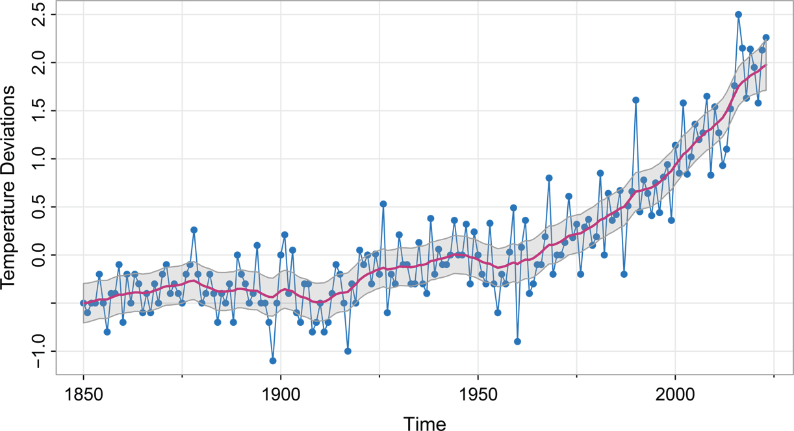

그림 8.8: 연간 평균 전 세계 육지 표면 온도 편차(1850~2023) (단위: ∘C) 및 ±2 오차 한계를 갖는 추정된 칼만 평활기. [본문으로 돌아가기.⏎](chapter8)

221\. 호출 시 fixphi=TRUE를 지정하여 ϕ\=1로 고정했다는 점에 유의하십시오(이에 대한 기본값은 FALSE입니다). 예측을 플로팅하려면 위 코드에서 Xs 및 Ps를 각각 Xp 및 Pp로 변경하십시오. 필터의 경우 Xf 및 Pf를 사용하십시오.

## 8.5 교차 상관 분석 및 백색화 (Cross-Correlation Analysis and Prewhitening)

[예제 2.34](#chapter2#exam2_34)에서는 [속성 2.31](#chapter2#prop2_31)을 사용하기 위해 시계열 중 적어도 하나가 백색 잡음이어야 한다는 사실을 논의했습니다. 그렇지 않으면 교차 상관 추정치가 0과 유의하게 다른지 여부를 알 수 있는 간단한 방법이 없습니다. 예를 들어 [예제 3.6](#chapter3#exam3_6)과 [문제 3.2](#chapter3#question3_2)에서는 온도와 오염이 심혈관 질환 사망률에 미치는 영향을 고려했습니다. 오염이 사망률보다 선행하는 것처럼 보였지만, 시계열 중 하나를 먼저 백색화(Prewhitening)하지 않고서는 그 관계를 식별하기 어렵습니다. 이 경우 [그림 3.4](#chapter3#fig3_4)와 같이 시계열을 시간 플롯으로 그리는 것은 두 시계열의 선행-지연(Lead-lag) 관계를 결정하는 데 별로 도움이 되지 않았습니다. 또한 [그림 8.9](#chapter8#fig8_9)는 두 시계열 간의 CCF를 보여주는데, 이 그래프에서도 적절한 정보를 추출하기는 어렵습니다.

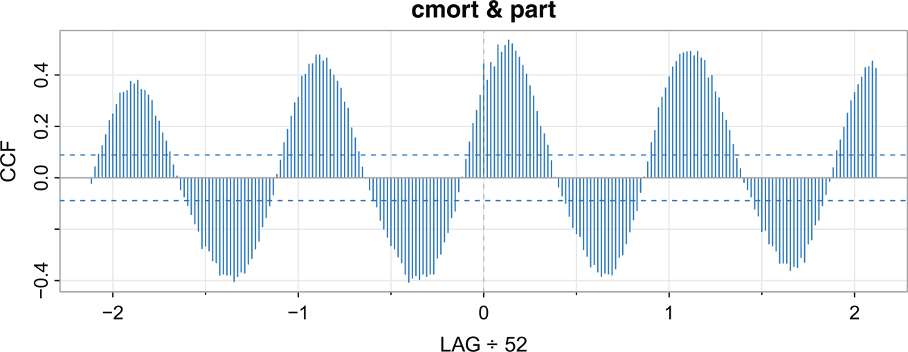

그림 8.9: 심혈관 질환 사망률과 입자상 물질 오염 간의 CCF. [본문으로 돌아가기.⏎](chapter8)

222\. 먼저 다음을 만족하는 두 시계열 _xt_와 _yt_가 있는 간단한 경우를 고려해 보겠습니다.

xt\=xt−1+wt,yt\=xt−3+vt,

따라서 _xt_가 _yt_를 3 단위 시간만큼 선행합니다(_wt_와 _vt_는 독립적인 노이즈 시계열입니다). [속성 2.31](#chapter2#prop2_31)을 사용하기 위해 단순 차분 ∇xt\=wt에 의해 _xt_를 백색화할 수 있으며, _xt_와 _yt_ 사이의 관계를 유지하려면 유사한 방식으로 _yt_를 변환해야 합니다.

∇xt\=wt,∇yt\=∇xt−3+∇vt.

따라서 ∇vt의 분산이 너무 크지 않다면 ∇yt와 ∇xt−3 사이에 강한 교차 상관관계가 있을 것입니다(또는 ∇yt와 ∇xt가 시차 3에서 상관관계를 가질 것입니다).

백색화 단계는 이 간단한 경우를 따릅니다. 두 개의 시계열 _xt_와 _yt_가 있고 우리는 두 시계열 간의 선행-지연 관계를 조사하고자 합니다. 이 시점에서 우리는 ARIMA 모델을 사용하여 시계열을 백색화하는 방법을 알고 있습니다. 즉 _xt_가 ARIMA라면 적합된 잔차 w^t는 백색 잡음이어야 합니다. 그런 다음 유사하게 변환된 _yt_ 시계열과의 교차 상관을 다음과 같이 조사하기 위해 w^t를 사용할 수 있습니다.

1. 시계열 _xt_ 중 하나에 ARIMA 모델을 적합하고,  
ϕ^(B)(1−B)dxt\=α^+θ^(B)w^t,  
반전(Inversion)에 의해 잔차를 구합니다. w^t\=π^(B)xt.  
_대안으로는 고차 AR(p) 모델_을 (아마도 차분된) 데이터에 단순히 적합한 다음 해당 잔차를 사용할 수도 있습니다. 이 경우 혁신은 π^(B)\=ϕ^(B)(1−B)d라는 단순한 형태를 갖습니다.
2. 223\. 이전 단계에서 적합된 모델을 사용하여 같은 방식으로 _yt_ 시계열을 필터링합니다.  
y^t\=π^(B)yt.
3. 이제 w^t와 y^t 프로세스에 대해 교차 상관 분석을 수행합니다.

astsa의 스크립트 **pre.white**()는 다음 예제에 설명된 대로 이 분석을 자동으로 수행합니다.

예제 8.11 사망률과 오염 [본문으로 돌아가기.⏎](chapter8)

[예제 3.6](#chapter3#exam3_6)에서는 동일 기간의 값들만을 사용하여 심혈관 질환 사망률(**cmort**)을 온도(**tempr**)와 입자상 물질 오염(**part**)에 대해 회귀 분석했습니다. [문제 3.2](#chapter3#question3_2)에서는 오염이 사망률을 약 এক 달 정도 선행하는 것으로 보였기 때문에 4주 지연된 오염의 추가 컴포넌트를 적합하는 것을 고려했습니다. 그러나 두 시계열 간에 선행-지연 관계가 존재하는지 결정하는 데 필요한 모든 도구가 당시에는 없었습니다.

우리는 사망률과 오염에 집중할 것이며, 사망률과 온도에 대한 분석은 [문제 8.10](#chapter8#question8_10)으로 남겨두겠습니다. [그림 8.9](#chapter8#fig8_9)는 사망률과 오염 간의 표본 CCF를 보여줍니다. 백색화 이전의 [그림 8.9](#chapter8#fig8_9)와 [그림 2.6](#chapter2#fig2_6) 사이의 유사성에 주목하십시오. CCF는 데이터에 연간 주기가 있음을 보여주지만 선행-지연 관계를 결정하기는 쉽지 않습니다.

절차에 따라 우리는 먼저 적절한 모델을 적합하여 cmort를 백색화합니다. 데이터는 추세가 관찰되는 [그림 3.3](#chapter3#fig3_3)에 나타나 있습니다. 명백한 다음 단계는 차분된 심혈관 질환 사망률의 동작을 조사하는 것입니다. [그림 8.10](#chapter8#fig8_10)은 ∇Mt의 표본 P/ACF를 보여주며 AR(1) 모델이 제시됩니다.

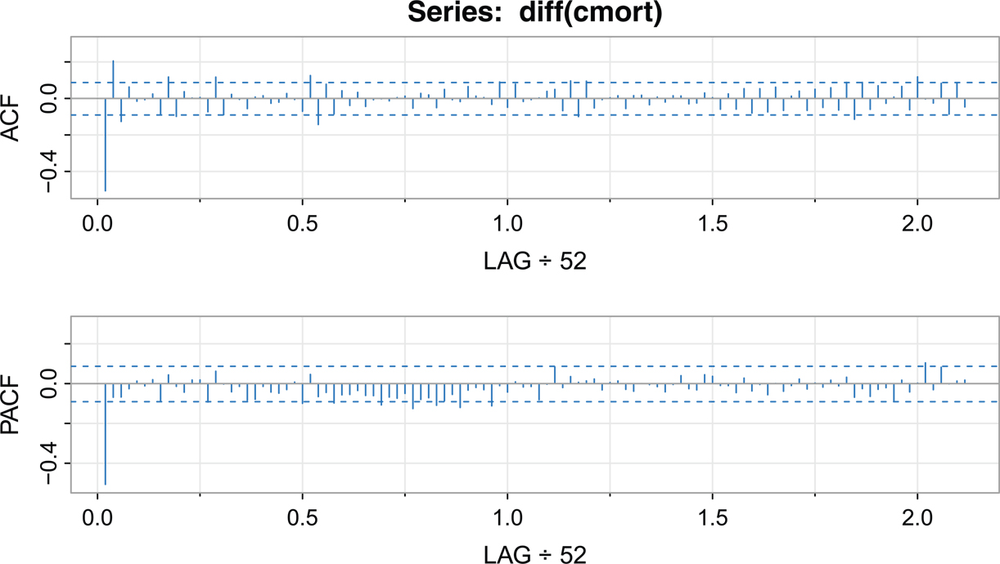

그림 8.10: 차분된 심혈관 사망률의 P/ACF. [본문으로 돌아가기.⏎](chapter8)

224\. 그런 다음 두 개의 차분 시계열에 대해 자동 교차 상관 절차를 수행하기 위해 **pre.white**()를 사용했습니다. [그림 8.11](#chapter8#fig8_11)은 결과적인 표본 CCF를 보여주는데, 시차 0에서의 상관관계가 가장 지배적임을 알 수 있습니다. 두 시계열이 동시에 움직인다는 사실은 데이터가 주 단위로 진전된다는 점을 고려하면 이치에 맞습니다. 오염이 4주 앞설 때 유의미하지만 작은 상관관계가 있을 수 있음을 언급합니다.

`**ccf2**(**cmort**, **part**, col=4) _# Figure 8.9_`
`**acf2**(diff(**cmort**), col=4) _# Figure 8.10     suggests AR(1)_`
`**pre.white**(**cmort**, **part**, diff=TRUE, col=4)`
`  cmort prewhitened using an AR p = 3`
`  after differencing d = 1`

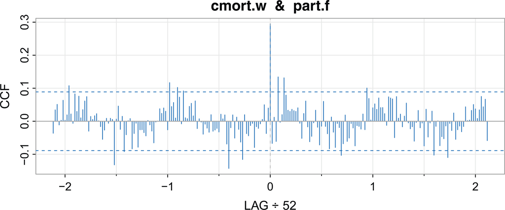

그림 8.11: 백색화된 심혈관 사망률과 필터링된 입자상 물질 오염 간의 CCF. [본문으로 돌아가기.⏎](chapter8)

분석 과정에서 스크립트가 AIC를 통해 차분된 사망률 데이터에 AR 모델을 적합하도록 허용했습니다. 위 호출에 order.max= 1을 포함하여 이를 제한할 수도 있었지만 결과는 크게 다르지 않습니다.

## 8.6 자기회귀 모델의 부트스트래핑 (Bootstrapping Autoregressive Models)

ARMA 프로세스의 매개변수를 추정할 때 신뢰구간을 개발하기 위해 [예제 4.32](#chapter4#exam4_32)와 같은 대표본(Large sample) 결과에 의존합니다. 예를 들어 AR(1)의 경우, _n_이 크면 _ϕ_에 대한 근사적인 100(1−α)% 신뢰구간은 다음과 같습니다.

ϕ^±zα/21−ϕ^2n.

만약 _n_이 작거나 매개변수가 경계(Boundaries)에 가깝다면 대표본 근사는 상당히 나쁠 수 있습니다. 이 경우 부트스트랩(Bootstrap)이 유용할 수 있습니다. 부트스트랩에 대한 일반적인 취급은 [Efron and Tibshirani (1994)](#bibref1#refbib_15)에서 찾을 수 있습니다. 225\. 여기서는 AR(1)의 경우를 논의하며 AR(_p_) 경우는 직접적으로 도출됩니다. ARMA 및 보다 일반적인 모델의 경우 [Shumway and Stoffer (2025, 6장)](#bibref1#refbib_44)을 참조하십시오.

인과성의 경계 근처에 회귀 계수가 있고 대칭이지만 정규 분포가 아닌 오차 프로세스를 가지는 AR(1) 모델을 고려해 보겠습니다. 구체적으로 다음 인과적 모델을 고려합니다.

xt\=μ+ϕ(xt−1−μ)+wt,(8.34)

여기서 μ\=50, ϕ\=.95이며 _wt_는 위치(Location) 0, 척도(Scale) 매개변수 β\=2인 iid 라플라스(이중 지수) 분포를 따릅니다. _wt_의 밀도는 다음과 같이 주어집니다.

g(w)\=12βexp{−|w|/β}−∞<w<∞.

이 예제에서 E(wt)\=0이고 var(wt)\=2β2\=8입니다. [그림 8.12](#chapter8#fig8_12)는 이 프로세스에서 시뮬레이션된 n\=100개의 관측치와, 표준 정규 밀도 및 표준 라플라스 밀도 간의 비교를 보여줍니다. 라플라스 밀도가 더 큰 꼬리를 가짐에 유의하십시오.

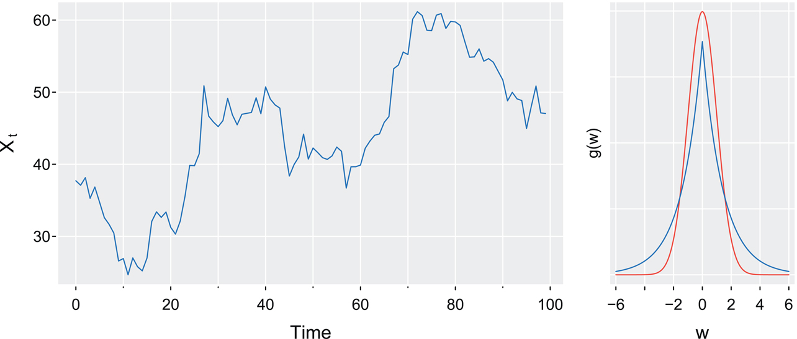

그림 8.12: 좌측: 라플라스 오차를 갖는 AR(1) 모델 (8.34)에서 생성된 백 개의 관측치. 우측: 표준 라플라스 밀도(파란색) 및 정규 밀도(빨간색). [본문으로 돌아가기.⏎](chapter8)

부트스트랩의 이점을 보여주기 위해 우리는 데이터가 정규 분포를 따르는 것처럼 행동할 것입니다. [그림 8.12](#chapter8#fig8_12)의 데이터는 다음과 같이 생성되었습니다.

`_# data_`
`set.seed(101010)`
`e   = rexp(150, rate=.5); u = runif(150,-1,1); de = e*sign(u)`
`dex = 50 + **sarima.sim**(n=100, ar=.95, innov=de, burnin=50)`
`layout(matrix(1:2, nrow=1), widths=c(5,2))`
`**tsplot**(dex, col=4, ylab=bquote(X[~t]), **gg**=TRUE)`
`_# densities for comparison_`
`g = function(x) {.5*dexp(abs(x), rate = 1/sqrt(2))}`
`w = seq(-6, 6, by=.01)`
`**tsplot**(w, dnorm(w), **gg**=TRUE, col=2, xlab="w", ylab="g(w)")`
`lines(w, g(w), col=4)`

이 데이터를 사용하여 우리는 다음과 같은 Yule-Walker 추정치를 얻었습니다.

`_# estimation_`
`fit = ar.yw(dex, aic=FALSE, order=1)`
`round(estyw <- c(mean=fit$x.mean, ar1=fit$ar, se=sqrt(fit$asy.var.coef),`
`   var=fit$var.pred), 3)`
`    mean    ar1     se    var`
`  44.496 0.966 0.026 6.151`

n\=100일 때 ϕ^의 유한 표본 분포(Finite sample distribution)를 평가하기 위해 우리는 이 AR(1) 프로세스의 1000개의 실현값(Realizations)을 시뮬레이션하고 Yule-Walker를 통해 매개변수를 추정했습니다. [5](#chapter8#fn8_5) 1000번의 반복 시뮬레이션을 기반으로 한 _ϕ_의 Yule-Walker 추정치의 유한 표본 밀도는 [그림 8.13](#chapter8#fig8_13)에 나와 있습니다. [예제 4.32](#chapter4#exam4_32)에 근거하면 ϕ^은 평균이 _ϕ_(우리가 알 수 없는)이고 분산이 (1−ϕ2)/100인 대략적인 정규 분포를 따른다고 말할 수 있으며, 이는 226\. (1−.9662)/100\=.0262로 근사할 수 있습니다. 이 분포는 [그림 8.13](#chapter8#fig8_13)에 겹쳐져 있습니다. 분명히 이 표본 크기에서 표본 분포는 정규성에 가깝지 않습니다. 시뮬레이션을 수행하기 위한 코드는 다음과 같습니다. 예제 끝에 있는 결과를 사용합니다.

\_\_\_\_\_\_\_\_\_\_\_\_\_\_\_\_\_ 5우리가 Yule-Walker 추정을 사용하는 이유는 시뮬레이션 기반 방법의 경우 MLE보다 빠르기 때문입니다. [본문으로 돌아가기.⏎](#chapter8#fn8_58b)

`_# finite sample distribution_`
`phi.yw = c()`
`for (i in 1:1000){`
`  e = rexp(150, rate=.5); u = runif(150,-1,1); de = e*sign(u)`
`  x = 50 + **sarima.sim**(n=100, ar=.95, innov=de, burnin=50)`
`  phi.yw[i] = ar.yw(x, order=1)$ar`
`}`

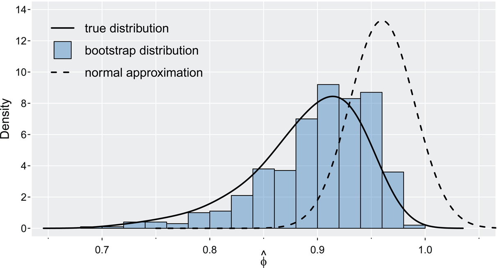

그림 8.13: _ϕ_의 Yule-Walker 추정치에 대한 유한 표본 밀도(실선) 및 상응하는 점근적 정규 밀도(점선). 500개의 부트스트랩된 표본을 기반으로 한 ϕ^의 부트스트랩 히스토그램. [본문으로 돌아가기.⏎](chapter8)

위의 시뮬레이션은 모델, 매개변수 값, 노이즈 분포에 대한 완전한 지식을 요구했습니다. 표본 추출(Sampling) 상황에서는 시뮬레이션을 수행하는 데 필요한 정보가 없으므로 실제 분포에서 시뮬레이션할 수 없습니다. 하지만 부트스트랩(Bootstrap)은 이 문제를 해결할 방법을 제공합니다.

이 경우 부트스트랩 시뮬레이션을 수행하기 위해 우리는 매개변수를 그 추정치인 μ^ 및 ϕ^으로 대체하고 다음의 오차를 계산합니다.

w^t\=(xt−μ^)−ϕ^(xt−1−μ^).t\=2,…,100,

여기서 _x_1이 주어졌다고 조건화합니다.

단일 부트스트랩 표본을 얻으려면 먼저 추정된 오차 집합 {w^2,…,w^100}에서 n\=99개의 값을 복원 추출(Randomly sample with replacement)하고 이렇게 추출된 값들을 다음과 같이 부릅니다.

{w2∗,…,w100∗}.

이제 다음을 설정하여 부트스트랩된 데이터 집합을 재귀적으로 생성합니다.

xt∗\=μ^+ϕ^(xt−1∗−μ^)+wt∗,t\=2,…,100,

여기서 x1∗는 _x_1로 고정하고 μ^\=44.496, ϕ^\=.966입니다.

227\. 다음으로 데이터가 xt∗인 것처럼 매개변수를 추정합니다. 이 추정치들을 μ^(1), ϕ^(1) 및 σ^w2(1)이라고 부르겠습니다. 이 프로세스를 큰 수인 _B_번 반복하여 부트스트랩된 매개변수 추정치 모음 {μ^(b),ϕ^(b),σ^w2(b); b\=1,…,B}을 생성합니다. 그런 다음 부트스트랩된 매개변수 값들로부터 추정량의 유한 표본 분포를 근사할 수 있습니다. 예를 들어 b\=1,…,B에 대해 ϕ^(b)−ϕ^의 경험적 분포(Empirical distribution)로 ϕ^−ϕ의 분포를 근사할 수 있습니다.

[그림 8.13](#chapter8#fig8_13)은 [그림 8.12](#chapter8#fig8_12)에 나타난 데이터를 사용하여 500개의 부트스트랩된 _ϕ_ 추정치 히스토그램을 보여주며, 이는 ϕ^의 실제 분포에 가깝습니다. astsa 패키지에는 AR 모델에 대해 부트스트랩을 수행하는 스크립트가 있습니다. 이를 사용하려면 데이터와 모델 차수만 제공하면 됩니다.

`boots = **ar.boot**(dex, order=1, plot=FALSE)   _# default is B = 500_`

ar.boot 스크립트는 기본적으로 회귀 매개변수에 대한 결과를 그립니다. 하지만 여기서는 ϕ^의 모든 분포, 즉 실제 분포, 부트스트랩 분포, 정규 근사치를 모두 그립니다([그림 8.13](#chapter8#fig8_13) 참조).

`hist(boots[[1]], main=NA, prob=TRUE, ylim=c(0,15), xlim=c(.65,1.05),`
`   col=**astsa.col**(4,.4), xlab=bquote(hat(phi)))`
`lines(density(phi.yw, bw=.02), lwd=2) _# true distribution_`
`u = seq(.75, 1.1, by=.001)            _# normal approximation_`
`lines(u, dnorm(u, mean=estyw[2], sd=estyw[3]), lty=2, lwd=2)`
`legend(.65, 15, bty="n", lty=c(1,0,2), lwd=c(2,0,2), col=1, pch=c(NA,22,NA),`
`   legend=c("true distribution", "bootstrap distribution", "normal`
`   approximation"), pt.bg=c(NA, **astsa.col**(4,.4), NA), pt.cex=2.5)`

100(1−α)% 신뢰구간을 원한다면 다음과 같이 ϕ^의 부트스트랩 분포를 사용할 수 있습니다.

`alf = .025   _# 95% CI_`
`quantile(phi.star.yw, probs=c(alf, 1-alf))`
`       2.5%   97.5%`
`     0.7801 0.9689`

228\. 이는 시뮬레이션 기반의 실제 구간과 가깝습니다.

`quantile(phi.yw, probs=c(alf, 1-alf))`
`       2.5%   97.5%`
`     0.7707 0.9623`

정규 신뢰구간은 상당히 다릅니다.

`qnorm(c(alf, 1-alf), mean=estyw[2], sd=estyw[3])`
` [1]   0.9149 1.0172`

## 8.7 임계 자기회귀 모델 (Threshold Autoregressive Models)

정상 정규 시계열(Stationary normal time series)은 미래로 향하는 시계열의 분포 x1:n\={x1,x2,…,xn}가 과거로 향하는 분포 xn:1\={xn,xn−1,…,x1}와 동일하다는 속성을 갖습니다. 이는 각각의 자기상관 함수가 오직 시간 차이에만 의존하며, 그 차이가 x1:n과 xn:1에 대해 동일하기 때문에 성립합니다. 이 경우 x1:n의 시간 플롯(미래 방향으로 그려진 데이터)은 xn:1의 시간 플롯(과거 방향으로 그려진 데이터)과 유사하게 보여야 합니다.

그러나 이 범주에 맞지 않는 많은 시계열이 존재합니다. 예를 들어 [그림 8.14](#chapter8#fig8_14)는 1968년부터 1978년까지 11년 동안 미국의 10,000명당 월별 폐렴 및 인플루엔자 사망자를 보여줍니다. 일반적으로 사망자 수는 특히 유행 기간 동안 감소하는 속도보다 더 빠르게 증가하는 경향이 있습니다(↑↘). 따라서 데이터가 과거 방향으로 플롯된다면 이 시계열은 감소하는 속도보다 더 느리게 증가하는 경향을 띠게 될 것입니다. 또한 월별 폐렴 및 인플루엔자 사망자가 선형 가우시안 프로세스를 따른다면 우리는 이 시계열에서 주기적으로 발생하는 이와 같이 엄청난 양과 음의 폭발적 변화를 예상하지 못할 것입니다. 뿐만 아니라 일반적으로 겨울철에 사망자 수가 가장 많지만 데이터가 완벽하게 계절적인 것은 아닙니다. 미국 질병통제예방센터(CDC)에 따르면 1982년부터 2022년까지 40년 동안 독감 유행은 보통 2월(17번의 시즌)에 최고조에 달했으며 그 다음으로 12월(7번의 시즌), 1월(6번의 시즌), 3월(6번의 시즌)이 뒤를 이었습니다\[[CDC, 2023](#bibref1#refbib_9) 참조\]. 즉 시계열의 정점이 겨울에 발생하기는 하지만 정점이 나타나는 달은 해마다 다릅니다. 따라서 계절적 ARMA 모델은 이러한 행동을 포착하지 못할 것입니다.

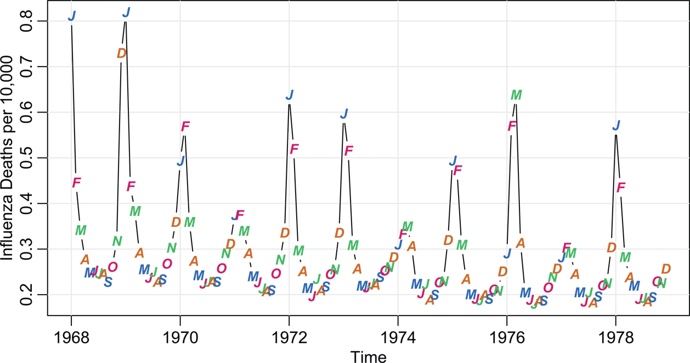

그림 8.14: 미국의 10,000명당 월별 폐렴 및 인플루엔자 사망자. [본문으로 돌아가기.⏎](chapter8)

이 절에서는 [Tong (1983)](#bibref1#refbib_48)에서 제시된 임계(Threshold) AR 모델에 초점을 맞춥니다. 기본적인 아이디어는 프로세스의 값에 따라 여러 개의 AR 모델을 적합하는 것이며, 글로벌 AR 모델을 적합할 때의 직관을 활용할 수 있다는 점이 매력적입니다. 예를 들어 두 가지 체제(Regimes)를 갖는 자기여기 임계 AR(Self-exciting threshold AR, SETAR) 모델은 229\. 다음과 같은 형태를 갖습니다.

xt\={ϕ0(1)+∑i\=1p1ϕi(1)xt−i+wt(1)if xt−d≤r,ϕ0(2)+∑i\=1p2ϕi(2)xt−i+wt(2)if xt−d\>r,(8.35)

여기서 j\=1,2에 대해 wt(j)∼iid N(0,σj2)이고 양의 정수 _d_는 지연(Delay), _r_은 실수(Real number)입니다.

이러한 모델들은 시간에 따른 AR 계수의 변화를 허용하며, 이러한 변화는 이전 값(_d_와 같은 시차만큼 역방향으로 이동됨)을 고정된 임계값과 비교함으로써 결정됩니다. 서로 다른 각각의 AR 모델을 체제(Regime)라고 합니다. 위 정의에서 AR 모델 차수의 값(_pj_)은 각 체제마다 다를 수 있지만 많은 응용 분야에서는 이 값들이 동일합니다.

이 모델은 포식자-피식자 사례와 같이 체제가 프로세스의 과거 값 모음에 의존하거나 외생 변수(Exogenous variable)에 의존하는(이 경우 모델은 자기여기가 아님) 가능성을 포함하도록 일반화될 수 있습니다. 예를 들어 [예제 1.5](#chapter1#exam1_5)에서 논의된 캐나다 스라소니(Canadian lynx)는 철저하게 연구되었으며 이 시계열은 임계 모델 적합을 시연하는 데 널리 사용됩니다. 눈덧신토끼(Snowshoe hare)는 스라소니가 압도적으로 선호하는 먹이이며 그 개체수는 토끼의 개체수와 함께 증가하고 감소함을 상기하십시오. 이 경우 (8.35)의 xt−d를 yt−d로 바꾸는 것이 합리적으로 보이는데, 여기서 _yt_는 눈덧신토끼 개체군의 크기입니다. 하지만 폐렴 및 인플루엔자 사망자 예제의 경우 독감 확산의 특성을 고려할 때 자기여기 모델이 적절해 보입니다.

TAR 모델이 인기 있는 이유는 다른 많은 비선형 시계열 모델들에 비해 지정, 추정, 해석이 비교적 간단하기 때문입니다. 게다가 외견상의 단순함에도 불구하고 TAR 모델 클래스는 230\. 여러 비선형 현상들을 재현할 수 있습니다. 다음 예제에서는 이러한 방법을 사용하여 앞서 언급한 월별 폐렴 및 인플루엔자 사망자 시계열에 임계 모델을 적합해 보겠습니다.

예제 8.12 인플루엔자 시계열의 임계 모델링

앞서 논의한 바와 같이 [그림 8.14](#chapter8#fig8_14)를 조사해 보면 월별 폐렴 및 인플루엔자 사망자 시계열 _flut_가 비선형적이라고 믿게 됩니다. [그림 8.14](#chapter8#fig8_14)에서 데이터에 약간의 음의 추세(Negative trend)가 있다는 점도 분명합니다. 추세를 제거하면서 이 데이터에 임계 모델을 적합하는 가장 편리한 방법은 1차 차분으로 작업하는 것임을 발견했으며, 이는

xt\=∇flut,

[그림 8.16](#chapter8#fig8_16)에 점으로 나타나 있습니다.

데이터의 비선형성은 1차 차분 _xt_의 플롯에서 더욱 두드러집니다. 분명히 _xt_는 몇 달 동안 서서히 상승하다가 겨울의 어느 시점에 _xt_가 임계값에 도달하면 큰 수로 도약할 가능성이 있습니다. 프로세스가 크게 도약하면 그 후 _xt_에 상당한 감소가 발생합니다. 또 다른 설득력 있는 그래픽은 [그림 8.15](#chapter8#fig8_15)에 나타난 xt−1에 대한 _xt_의 시차 플롯이며, 이는 xt−1이 .04를 초과하는지 여부에 기반한 두 개의 선형 체제 가능성을 시사합니다.

`thr    = 0.04`
`culer = **astsa.col**(c(7,3), .5)`
`culers = ifelse(diff(**flu**)<thr, culer[1], culer[2])`
`**tsplot**(lag(diff(**flu**),-1), diff(**flu**), type="p", xlab=bquote(nabla~**flu**[~t-1]),`
`   ylab=bquote(nabla~**flu**[~t]), pch=21, cex=1.25, bg=culers, xy.lines=FALSE,`
`   xy.labels=FALSE)`
`abline(v=thr, lty=2, col=4)`
`U = ts.intersect(lag(diff(**flu**),-1), diff(**flu**))`
`lines(lowess(U[,1], U[,2]), col=6)`

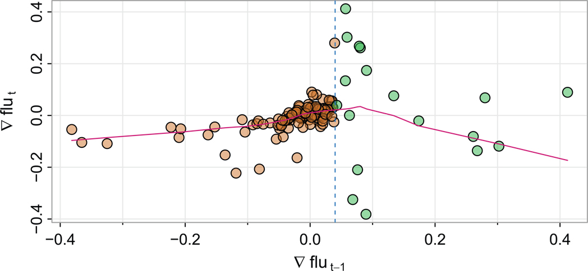

그림 8.15: lowess 적합(선)이 겹쳐진 ∇flut−1 대 ∇flut의 산점도. 수직 점선은 ∇flut−1\=.04를 나타냅니다. [본문으로 돌아가기.⏎](chapter8)

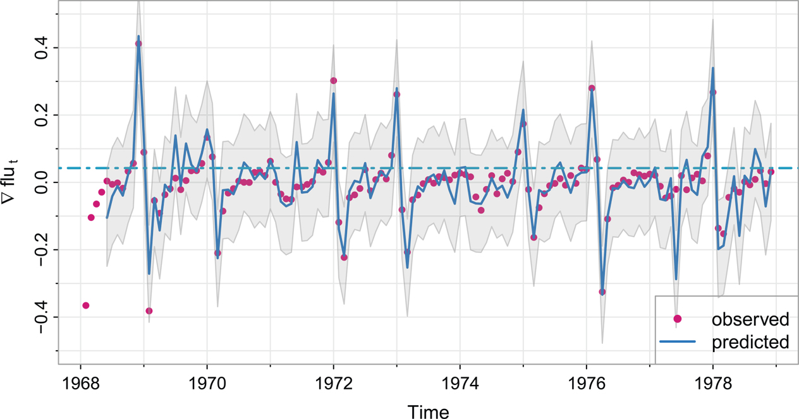

그림 8.16: 1차 차분된 미국의 월별 폐렴 및 인플루엔자 사망자(점); ±2 예측 오차 한계를 갖는 한 달 앞 예측(실선). 수평 점선은 임계값입니다. [본문으로 돌아가기.⏎](chapter8)

초기 분석으로서 우리는 다음의 임계 모델을 적합했으며,

xt\=α(1)+∑j\=1pϕj(1)xt−j+wt(1),xt−1<.04xt\=α(2)+∑j\=1pϕj(2)xt−j+wt(2),xt−1≥.04,(8.36)

이것이 필요 이상으로 클 것이라고 가정하여 p\=6을 사용했습니다.

231\. 차수 p\=4가 최종적으로 선택되었고 적합 결과는 다음과 같았습니다(반올림 적용).

x^t\=0+.51(.08)xt−1−.20(.06)xt−2+.12(.05)xt−3−.11(.05)xt−4+w^t(1), xt−1<.04에 대해x^t\=.40−.75(.17)xt−1−1.03(.21)xt−2−2.05(1.05)xt−3−6.71(1.25)xt−4+w^t(2),xt−1≥.04에 대해,

여기서 σ^1\=.05 및 σ^2\=.07입니다. 임계값 .04는 17회 초과되었습니다. 세부 사항은 아래 코드에 제공되어 있습니다.

최종 모델을 사용하여 한 달 앞 예측을 수행할 수 있으며 이는 [그림 8.16](#chapter8#fig8_16)에 선으로 나타나 있습니다. 이 모델은 독감 유행을 예측하는 데 매우 탁월한 성능을 발휘합니다. 그러나 이러한 모델에서 한 달 이후의 예측은 복잡하지만 몇 가지 근사 기법이 존재합니다([Tong, 1983 참조](#bibref1#refbib_48)).

이러한 모델들을 적합하는 데 사용할 수 있는 다양한 R 패키지가 있습니다. 예를 들어 tsdyn과 nts가 있습니다. 전자의 패키지가 더 일반적이지만 설정이 약간 까다롭습니다. 후자의 패키지는 두 개의 체제를 갖는 모델만 적합하며 우리의 경우 잘 작동합니다. NTS를 사용하여 두 체제를 갖는 AR(4) 모델을 적합하기 위한 코드 및 출력은 다음과 같습니다. 232\.

`library(NTS)       _# load package - install it first_`
`flutar = uTAR(diff(**flu**), p1=4, p2=4)`
`  Estimated Threshold: 0.042594`
` `
`  Regime 1:`
`         Estimate Std. Error     t value     Pr(>|t|)`
`  X1 0.004471044 0.004893995 0.9135776 3.630319e-01`
`  X2 0.506649694 0.078318883 6.4690618 3.198875e-09`
`  X3 -0.200086031 0.056573062 -3.5367722 6.043925e-04`
`  X4 0.121047354 0.054462770 2.2225706 2.838883e-02`
`  X5 -0.110938271 0.045979329 -2.4127858 1.756436e-02`
`  nob1 & sigma1: 110 0.04577968`
`  Regime 2:`
`       Estimate Std. Error   t value     Pr(>|t|)`
`  X1 0.4079353 0.04674982 8.725921 1.528671e-06`
`  X2 -0.7483325 0.16643827 -4.496156 7.315328e-04`
`  X3 -1.0323129 0.21136548 -4.884019 3.759579e-04`
`  X4 -2.0450407 1.05000304 -1.947652 7.523490e-02`
`  X5 -6.7117769 1.24538129 -5.389335 1.628721e-04`
`  nob2 & sigma2: 17 0.07209551`
`**sarima**(resid(flutar)) _# residual analysis (not shown)_`
` `
`_##-- graphic --##_`
`innov = resid(flutar)`
`pred = diff(**flu**)[-(1:4)] - innov`
`pred = ts(pred, start=c(1968,6), freq=12)`
`**tsplot**(diff(**flu**), type="p", ylim=c(-.5,.5), pch=20, col=6, **nym**=2,`
`   ylab=bquote(nabla~**flu**[~t]))`
`lines(pred, col=4, lwd=2)`
`abline(h = flutar$thr, lty=6, col=5)`
`_# error bnds_`
`prde1 = sqrt(sum(resid(flutar$model1)^2)/flutar$model1$df)`
`prde2 = sqrt(sum(resid(flutar$model2)^2)/flutar$model2$df)`
`    x = time(diff(**flu**))[-(1:4)]`
`prde = ifelse(lag(x,-1) < flutar$thr, prde1, prde2)`
`   xx = c(x, rev(x))`
`   yy = c(pred - 2*prde, rev(pred + 2*prde))`
`polygon(xx, yy, border=gray(.6,.5), col=gray(.6,.2))`
`legend("bottomright", legend=c("observed", "predicted"), lty=0:1, pch=c(20,NA),`
`   col=c(6,4), lwd=2)`

233\. 

## 연습 문제

* 8.1. 미국 GDP의 분기별 성장률(gdp)이 GARCH 동작을 나타내는지 조사하십시오. 만약 그렇다면 성장률에 적절한 모델을 적합하십시오.
* 8.2. [예제 8.1](#chapter8#exam8_1)에서 분석된 미국 GNP 데이터 세트에 정규 분포가 아닌 GARCH 모델을 적합하는 것이 적합도를 향상시키는지 조사하십시오.
* 8.3. 배럴당 달러로 표시된 주간 원유 현물 가격이 oil에 있습니다. 주간 원유 가격의 성장률이 GARCH 동작을 나타내는지 조사하십시오. 만약 그렇다면 성장률에 적절한 모델을 적합하십시오.
* 8.4. R의 stats 패키지는 네 개의 주요 유럽 주가 지수의 일일 종가를 포함합니다. 자세한 내용은 help(EuStockMarkets)를 입력하십시오. 이 시계열 중 하나의 수익률에 GARCH 모델을 적합하고 그 결과를 논의하십시오. (참고: 이 데이터 세트는 수익률이 아니라 실제 값을 포함합니다. 따라서 모델 적합 이전에 데이터를 변환해야 합니다.)
* 8.5. 전 세계(해양만) 온도 시계열인 gtemp\_ocean을 그린 다음, [예제 8.5](#chapter8#exam8_5)에서 논의된 세 가지 검정(DF, ADF, PP)을 사용하여 프로세스가 정상적이라는 대립가설에 대비하여 단위근이 존재하는지 검정하십시오. 의견을 제시하십시오.
* 8.6. GNP 시계열인 gnp를 그린 다음 프로세스가 폭발적이라는 대립가설에 대비하여 단위근 검정을 수행하십시오. 결론을 명시하십시오.
* 8.7. climhyd 데이터에는 Shasta 호수의 기후 변수인 기온, 이슬점, 운량, 풍속, 강수량 및 유입량에 대한 454개월 동안의 측정값이 있습니다. 데이터를 그리고 풍속 시계열 climhyd$WndSpd에 ARFIMA 모델을 적합한 후 모든 진단을 수행하십시오. 결론을 명시하십시오.
* 8.8. arf 데이터 세트는 ϕ\=.75 및 d\=.4인 ARFIMA(1,1,0) 모델에서 시뮬레이션된 1000개의 관측치입니다.  
   1. 데이터를 그리고 의견을 제시하십시오.  
   2. 데이터의 ACF와 PACF를 그리고 의견을 제시하십시오.  
   3. 매개변수를 추정하고 추정치 ϕ^ 및 d^의 유의성을 검정하십시오.  
   4. (a) 및 (b) 부분의 결과를 사용하여 분석 전에 데이터를 차분하는 것이 합리적인 이유를 설명하십시오. 즉, _xt_가 데이터를 나타낸다면 ∇xt에 ARMA 모델을 적합하는 것을 선택할 수 있는 이유를 설명하십시오.  
   5. ∇xt의 ACF와 PACF를 그리고 의견을 제시하십시오.  
   6. ∇xt에 ARMA 모델을 적합하고 의견을 제시하십시오.
* 8.9. 234\. [예제 8.10](#chapter8#exam8_10)을 지침으로 사용하여 jj에 있는 Johnson & Johnson 수익에 상태 공간 모델을 적합하십시오. (a) 평활기, (b) 예측기, (c) 필터가 오차 한계와 함께 겹쳐진 데이터를 각각 그리십시오(세 개의 별도 그래프). (a), (b), (c)의 결과를 비교하십시오. 또한 _ϕ_의 추정치가 수익의 성장률에 대해 무엇을 알려줍니까?
* 8.10.  
   1. 심혈관 질환 사망률과 온도 시계열 간의 표본 CCF를 그리십시오. 이를 [그림 8.9](#chapter8#fig8_9)와 비교하고 결과를 논의하십시오.  
   2. 심혈관 질환 사망률과 온도 시계열에 대해 [예제 8.11](#chapter8#exam8_11)의 교차 상관 분석을 다시 수행하십시오. 결론을 명시하십시오.
* 8.11. 중심화된 표준 로그 정규 분포의 비대칭 오차 분포를 사용하여 [8.6절](#chapter8#sec8_6)의 부트스트랩 분석을 반복하십시오(logX가 정규 분포이면 _X_는 로그 정규 분포임을 상기하십시오. ?rlnorm). 이 분포에서 _n_개의 관측치를 생성하려면 다음을 사용하십시오.  
`n = 150   _# desired number of obs_`  
`w = rlnorm(n) - exp(.5)`
* 8.12. R datasets 패키지의 lynx 시계열에 임계 AR 모델을 적합하십시오.
* 8.13. 흑점 데이터(**sunspotz**)가 [그림 7.14](#chapter7#fig7_14)에 표시되어 있습니다. 데이터의 시간 플롯에서 데이터에 임계 모델을 적합하는 것이 합리적인 이유를 논의한 다음, 임계 모델을 적합하십시오.

