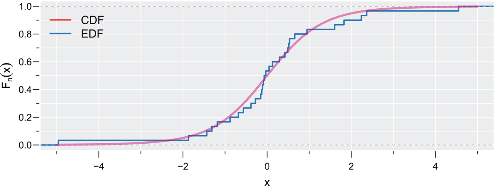
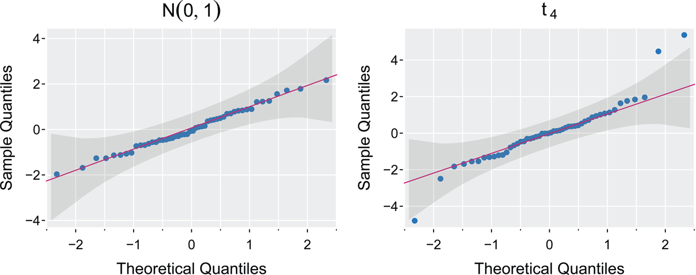
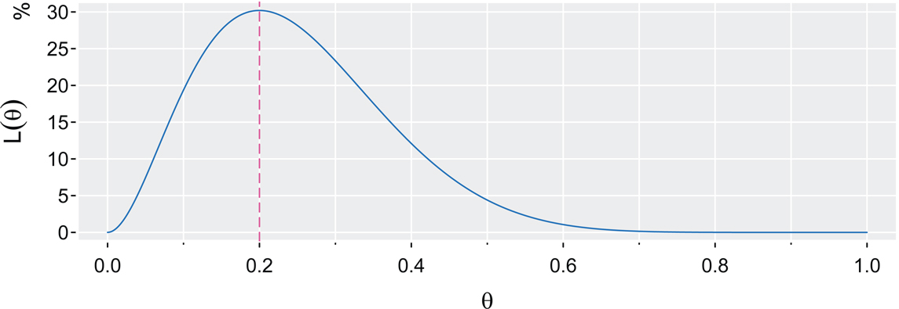
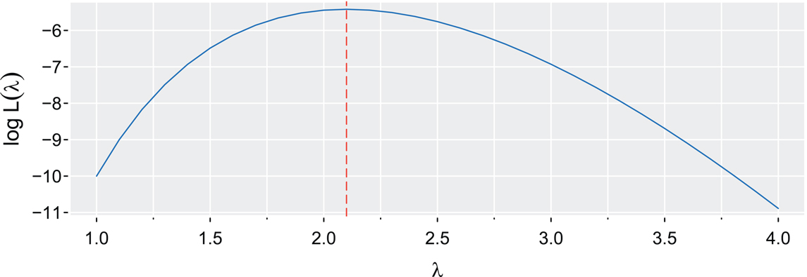
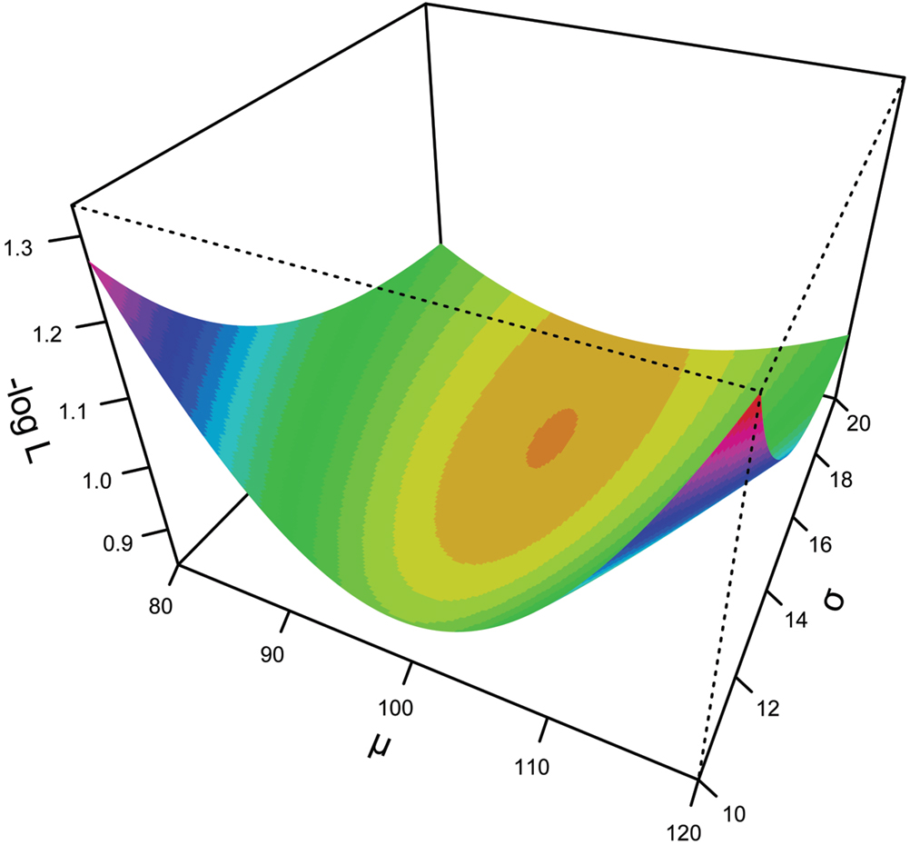
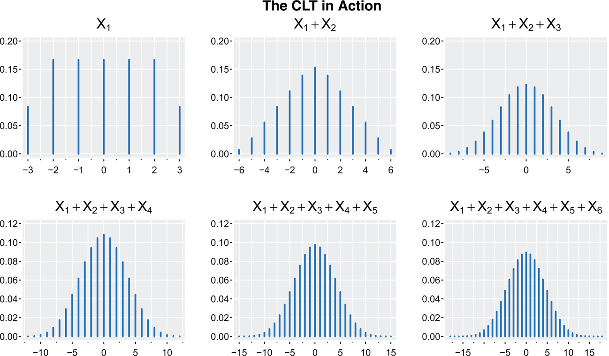
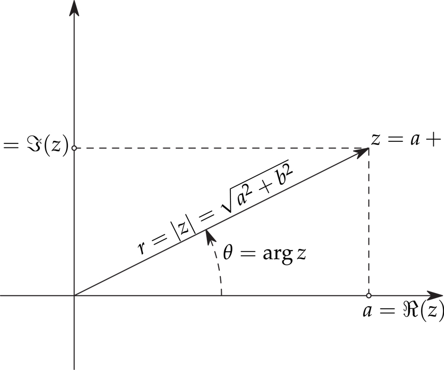
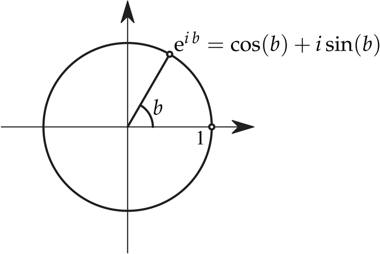

---

235\. 

# A 확률과 통계 입문 (A Probability and Statistics Primer)

독자께서 [Freund and Walpole (1986)](#bibref1#refbib_18) 수준의 미적분학 기반 확률 및 통계 과정을 이수하셨다고 가정합니다. 여기서 다루는 주제들은 본문에서 사용되는 내용에 대한 참고 지침 및 빠른 복습용으로 제공됩니다.

## A.1 분포와 밀도 (Distributions and Densities)

본 서에서는 주로 (절대) 연속 확률 변수를 다룹니다. 확률 변수(rv) _X_가 연속형인 경우, 누적 분포 함수(CDF)는 다음과 같이 작성할 수 있습니다.

F(x)\=Pr(X≤x)\=∫−∞xf(u) du,x∈R,

여기서 밀도 함수 f(x)는 다음을 만족합니다.

1. 모든 x∈R에 대해 f(x)≥0 입니다.
2. ∫−∞∞f(x) dx\=1 입니다.

확률은 밀도 함수를 적분하여 얻을 수 있습니다.

Pr(a≤X≤b)\=F(b)−F(a)\=∫abf(x) dx.

본 서에서 정규 분포는 중요합니다. 확률 변수 _X_가 평균이 _μ_이고 분산이 _σ_2인 정규 분포를 따른다고 할 때, 이를 X∼ N(μ,σ2)로 표기하며, 밀도 함수는 다음과 같습니다.

f(x)\=1σ2πexp{−12σ2(x−μ)2}forx∈R.

확률 표본 X1,…,Xn이 주어졌을 때, 값 _x_보다 작거나 같은 표본의 비율로 주어지는 _경험적 분포 함수(empirical distribution function, EDF)_를 통해 CDF를 추정할 수 있습니다.

Fn(x)\=n−1∑i\=1n1{Xi≤x},

여기서 대괄호 안의 조건이 참이면 1{Xi≤x}\=1이고, 거짓이면 0입니다. 다음은 자유도가 5인 t-분포를 사용한 예제입니다. [그림 A.1](#appA#figA_1)은 n\=30개의 관측치로 계산한 EDF와 실제 CDF를 비교한 결과를 보여줍니다.

`set.seed(123)`
`X = rt(30, 5)   _# sample of size 30 from t-dist with 5 df_`
`plot(ecdf(X), col=4, pch=NA, lwd=2, verticals=TRUE)    _# EDF_`
`curve(pt(x,5), -5,5, col=6, lwd=3, add=TRUE)           _# CDF_`

그림 A.1: 자유도가 5인 t 모집단에서 추출한 크기 30의 무작위 표본에 대한 경험적 분포 함수(EDF)입니다. 누적 분포 함수(CDF)가 EDF 위에 겹쳐서 표시되어 있습니다. [본문으로 돌아가기.⏎](appA)

236\. 

### 정규 QQ 산점도 (Normal QQ Plot)

표준 정규 분포 Z∼N(0,1)의 분위수(quantiles) _q_는 다음과 같이 정의됩니다.

Pr(Z≤q)\=p,

여기서 _p_는 확률입니다. 예를 들어, 표준 정규 분포에서 p\=.95인 분위수는 잘 알려진 값인 q\=1.645입니다. 이는 Pr(Z≤1.645)\=.95 (반올림 후)이기 때문입니다. 다른 익숙한 표준 정규 분포의 분위수는 다음과 같습니다.

`p = c(.025, .05, .10, .25, .5, .75, .90, .95, .975)`
`round(qnorm(p), 3)`
` [1] -1.960 -1.645 -1.282 -0.674 0.000 0.674 1.282    1.645   1.960`

표본 x1,…,xn과 관련된 분위수는 경험적 분포 함수(EDF)의 분위수입니다. 예를 들어, 표본의 0.95 분위수는 표본의 최소 95%가 해당 값보다 작거나 같은 가장 작은 데이터 값입니다. 데이터를 오름차순으로 정렬하여 x(1)≤x(2)≤⋯≤x(n)이라고 하면, x(j)는 EDF의 _j_번째 분위수가 됩니다. 이는 데이터의 j/n이 해당 값보다 작거나 같기 때문입니다. 일반적으로 연속성 수정(continuity correction)이 사용되므로, x(j)는 (j−12)/n 분위수로 간주됩니다.

표준 정규 분포의 (j−12)/n 분위수를 q(j)라고 할 때, QQ 산점도는 단순히 j\=1,…,n에 대한 쌍 (q(j),x(j))의 산점도입니다. 기본 개념은 데이터가 정규 모집단에서 추출된 표본이라면, 예상 표본 분위수의 추정치가 μx+σxq(j)이므로 이 쌍들이 근사적으로 선형 관계를 가질 것이라는 점입니다.

간단한 예시로, [그림 A.2](#appA#figA_2)는 두 표본에 대한 정규 QQ 산점도를 보여줍니다. 그래픽의 왼쪽은 표준 정규 모집단에서 추출한 크기 50의 표본이며, 237\. 오른쪽은 자유도가 4인 t-분포에서 추출한 크기 50의 표본입니다. 신뢰 구간은 95% 점별 구간(pointwise intervals)입니다.

`set.seed(123)`
`x = rnorm(50); y = rt(50, 4)`
`par(mfrow=1:2)`
`**QQnorm**(x, main=bquote(N(0,1)), ci=95, pch=20, **gg**=TRUE)`
`**QQnorm**(y, main=bquote(t[~4]), ci=95, pch=20, **gg**=TRUE)`

그림 A.2: 크기 50인 두 표본의 정규 QQ 산점도입니다. 왼쪽은 표준 정규 모집단에서, 오른쪽은 t4 모집단에서 추출한 표본입니다. [본문으로 돌아가기.⏎](appA)

## A.2 기댓값 (Expectation)

밀도 함수 f(x)를 갖는 연속 확률 변수 _X_에 대해, _X_의 기댓값은 다음과 같이 정의됩니다.

μx\=E(X)\=∫−∞∞x f(x) dx

단, 이 적분이 존재해야 합니다. _X_의 기댓값은 일반적으로 _X_의 평균(mean)이라고 불리며, _μx_로 표기하거나 특정 확률 변수가 명확할 때는 단순히 _μ_로 표기합니다. 평균, 즉 기댓값은 확률 변수 X의 값들을 대표하거나 평균적인 역할을 하는 단일 값을 제공하며, 이러한 이유로 종종 중심 경향성(central tendency)의 척도라고 불립니다.

기댓값의 몇 가지 성질은 다음과 같습니다.

1. 임의의 상수 _a_와 _b_에 대해 E(a+bX)\=a+bE(X)\=a+bμx 입니다.
2. 두 확률 변수 _X_와 _Y_에 대해, E(X+Y)\=E(X)+E(Y)\=μx+μy 입니다.
3. 독립적인 두 확률 변수 _X_와 _Y_에 대해, E(XY)\=E(X)E(Y)\=μxμy 입니다.
4. E\[g(X)\]\=∫g(x)f(x) dx 입니다.

238\. 분산은 평균으로부터의 편차 제곱의 평균입니다. 분산이 존재한다고 가정할 때, 다음과 같이 정의합니다.

σx2\=var(X)\=E(X−μ)2\=∫−∞∞(x−μ)2f(x) dx.

여기서도 특정 확률 변수가 명확할 때는 아래첨자를 생략합니다. 분산의 양의 제곱근인 _σ_를 표준편차(standard deviation)라고 합니다. 분산의 몇 가지 성질은 다음과 같습니다.

1. 임의의 상수 _a_와 _b_에 대해, var(a+bX)\=b2var(X)\=b2σ2 입니다.
2. var(X)\=EX2−μ2 입니다.
3. 독립적인 두 확률 변수 _X_와 _Y_에 대해, var(X+Y)\=var(X)+var(Y) 입니다.
4. _X_의 평균이 _μ_이고 분산이 _σ_2이면, 확률 변수  
Z\=X−μσ  
는 평균이 0이고 분산이 1입니다. 이 변환을 표준화(standardization)라고 합니다.

정규 분포는 평균과 분산에 의해 완전히 지정되므로, X∼ N(μ,σ2)와 같이 표기합니다. 또한, 위의 성질들은 X∼ N(μ,σ2)일 때 Z∼ N(0,1)이 됨을 보여주며, 이를 표준 정규 분포(standard normal distribution)라고 하고 다음과 같은 밀도 함수를 가집니다.

f(z)\=12πexp{−z22{forz∈R.

마지막으로, 확률 변수의 _r_번째 중심 적률(central moment)을 다음과 같이 정의합니다(존재하는 경우).

E(X−μ)rr\=1,2,…,

평균을 중심점으로 하지 않는 경우, 적률 E(Xr)은 원적률(raw moment)이라고 부릅니다. 또한, 표준화된 적률(standardized moments)을 다음과 같이 정의할 수 있습니다.

κr\=E(X−μσ)r.

중요한 값으로는 비대칭도(skewness)를 측정하는 _κ_3와 첨도(kurtosis)를 측정하는 _κ_4가 있습니다.

## A.3 공분산과 상관관계 (Covariance and Correlation)

각각 유한한 분산을 가지는 두 확률 변수 _X_와 _Y_에 대해, 공분산(covariance)은 다음의 기댓값 곱으로 정의됩니다.

σxy\=cov(X,Y)\=E\[(X−μx)(Y−μy)\].

239\. 공분산의 몇 가지 성질은 다음과 같습니다.

1. σxy\=cov(X,Y)\=cov(Y,X)\=σyx 입니다.
2. |σxy|≤σxσy 입니다. 식 (A.3)을 참고하시기 바랍니다.
3. var(X)\=cov(X,X) 입니다.
4. var(X±Y)\=cov(X±Y,X±Y)\=var(X)+var(Y)±2 cov(X,Y) 입니다.
5. 독립적인 두 확률 변수 _X_와 _Y_에 대해, cov(X,Y)\=0 입니다. 하지만 역은 성립하지 않습니다. 즉, cov(X,Y)\=0이라고 해서 _X_와 _Y_가 독립적인 것은 아닙니다.

상관관계(Correlation)는 척도가 조정된 공분산으로 정의됩니다.

ρ\=corr(X,Y)\=σxyσx σy.

상관관계의 몇 가지 성질은 다음과 같습니다.

1. −1≤ρ≤1 입니다.
2. ρ\=0이면, _X_와 _Y_가 상관관계가 없다고(uncorrelated) 합니다. 이는 _X_와 _Y_가 선형 관계에 있지 않다는 것을 의미합니다. 하지만 이들은 종속적인 확률 변수일 수 있습니다. 예를 들어, _X_가 대칭적이라면 _X_와 _X_2는 상관관계가 없지만 종속성이 높습니다.
3. ρ\=±1이면, 어떤 수 _a_와 b\>0에 대해 X\=a±bY가 (거의 모든 곳에서) 성립합니다.

## A.4 정규 분포와 관련된 분포 (Distributions Related to the Normal)

추론에 필수적인 세 가지 분포가 있으며, 이들과 그 성질 일부를 설명합니다.

### 카이제곱 분포 (Chi-squared Distribution)

이 분포는 χν2로 표기하며, 여기서 _ν_는 자유도입니다. 이 분포의 평균과 분산은 각각 _ν_와 2ν입니다. Z∼N(0,1)이면, _Z_2는 χ12 분포를 따릅니다. _Z_1과 _Z_2가 서로 독립적인 표준 정규 확률 변수라면, Z12+Z22는 χ22 분포를 따르며, 이러한 성질이 계속 이어집니다.

이 분포가 유용한 이유는 정규 모집단에서 구한 표본 분산이 카이제곱 분포를 따르기 때문입니다. 즉, 분산이 _σ_2인 정규 모집단에서 추출한 크기가 _n_인 무작위 표본 X1,…,Xn으로부터 구한 표본 분산이 S2\=1n−1∑i\=1n(Xi− X―)2일 때, 다음이 성립합니다.

(n−1)S2σ2∼χn−12.

240\. 

### t-분포 (t-Distribution)

자유도가 _ν_인 t-분포는 다음과 같이 도출됩니다. Z∼N(0,1)이고 V∼χν2이며, _Z_와 _V_가 서로 독립적인 확률 변수라고 가정합니다. 이때,

T\=ZV/ν,

는 자유도가 _ν_인 t-분포를 따릅니다. _T_의 평균은 ν\>1일 때 0이며, _T_의 분산은 ν\>2일 때 ν/ν−2입니다.

이 분포가 유용한 이유는 많은 추정량이 이 형태로 변환될 수 있기 때문입니다. 예를 들어, 선형 회귀 분석에서 회귀 계수에 대한 가설 검정은 t-검정 형태로 작성할 수 있습니다 ([섹션 3.1](#chapter3#sec3_1) 참고). 평균이 _μ_이고 분산이 _σ_2인 정규 모집단에서 추출한 크기가 _n_인 무작위 표본이 X1,…,Xn이라고 할 때,

T\= X―−μS/n,

는 (여기서 _S_2는 표본 분산입니다) 자유도가 n−1인 t-분포를 따릅니다.

### F-분포 (F-Distribution)

F-분포는 식 (3.5)에서와 같이 분산 성분들을 비교할 때 발생합니다. _U_와 _V_가 서로 독립적인 카이제곱 확률 변수이고, U∼χν12, V∼χν22라고 할 때,

F\=U/ν1V/ν2

는 자유도가 (ν1,ν2)인 F-분포를 따릅니다. 이 분포의 평균은 ν2\>2일 때 ν2/(ν2−2)이며, 분산은 ν2\>4일 때 2ν22(ν1+ν2−2)/ν1(ν2−2)2(ν2−4)입니다.

이 분포는 두 정규 모집단의 분산을 비교하는 과정에서 도출되었습니다. 두 정규 모집단에서 각각 추출한 크기가 _n_1과 _n_2인 독립적인 무작위 표본이 있고, S12과 S22가 각각의 표본 분산이라고 할 때,

F\=S12/σ12S22/σ22

는 자유도가 n1−1과 n2−1인 F-분포를 따릅니다. σ1\=σ2라는 귀무가설 하에서, 검정 통계량은 단순히 표본 분산들의 비율이 됩니다.

## A.5 241\. 조건부 기댓값 (Conditional Expectation)

우리는 종속성을 다루기 때문에 핵심 도구로 조건부 기댓값을 사용하며, 일반적으로 관심 있는 확률 변수가 _X_와 _Y_일 때 E(X∣Y)로 표기합니다. 이 자체도 확률 변수이며, 분포 f(y)에 따라 E(X∣Y\=y) 값을 가집니다.

_X_와 _Y_의 결합 밀도 함수가 f(x,y)일 때, Y\=y가 주어졌을 때 _X_의 조건부 밀도 함수는 다음과 같습니다.

f(x∣y)\=f(x,y)f(y),

단, f(y)\>0이어야 합니다. 함수 g(X)에 대해 Y\=y가 주어졌을 때의 조건부 기댓값은 다음과 같습니다.

E\[g(X)∣Y\=y\]\=∫g(x) f(x∣y) dx.

이 결과는 반복 기댓값의 법칙(law of iterated expectation)으로 이어집니다.

속성 A.1 (반복 기댓값의 법칙, Law of Iterated Expectation). [본문으로 돌아가기.⏎](#chapter8#b8propA_1) 모든 기댓값이 존재한다고 가정할 때,

E(X)\=E\[E(X∣Y)\].

증명. 연속형인 경우,

E\[E(X∣Y)\]\=∫yE(X∣Y\=y)f(y)dy\=∫y∫xxf(x∣y)dxf(y)dy\=∫xx\[∫yf(x,y)dy\]dx\=∫xxf(x)dx\=E(X),

여기서 f(x,y)\=f(y) f(x∣y)라는 사실을 사용했습니다. □

예제 A.2 포아송 혼합 (Poisson Mixture) [본문으로 돌아가기.⏎](#appA#bexam9_2)

_X_를 아침 출근 시간의 사고 건수라고 하고, _Y_를 강수 여부를 나타내는 지표라고 가정합니다. 건조할 때는 Y\=1, 강수가 있을 때는 Y\=2로 정의하여, Pr(Y\=1)\=p이고 Pr(Y\=2)\=q라고 설정합니다(여기서 p+q\=1). 이때 X∣Y\=y가 Poisson(λy)를 따른다고 가정합니다.

Pr(X\=x∣Y\=y)\=λyx e−λy/x!x\=0,1,…; y\=1,2,

여기서 λy\>0입니다. 즉, 건조할 때의 사고 건수 비율은 _λ_1이고, 비가 올 때의 사고 건수 비율은 λ2\>λ1이 됩니다.

다음 사항에 유의하시기 바랍니다.

E(X∣Y\=1)\=∑x\=0∞xλ1xe−λ1x!\=λ1∑x\=1∞λ1(x−1)e−λ1(x−1)!\=λ1

242\. 동일한 방식으로 E(X∣Y\=2)\=λ2입니다.

이제 E(X∣Y)는 확률 _p_ 또는 _q_로 각각 _λ_1 또는 _λ_2 값을 가지는 확률 변수입니다. 편의상 Z\=E(X∣Y)라고 작성하면 다음과 같습니다.

E(X∣Y)\=Z\={λ1 wp p(dry: Y\=1)λ2wp q(wet: Y\=2).

따라서 E(Z)\=pλ1+qλ2\=EE(X∣Y)가 되며, 마침내 다음을 얻습니다.

E(X)\=EE(X∣Y)\=pλ1+qλ2,

이는 우리가 예상했던 바와 같습니다.

분산에 대해서도 유사한 결과가 있습니다.

속성 A.3 (총 분산의 법칙, Law of Total Variance). [본문으로 돌아가기.⏎](#appA#bpropA_3) 모든 기댓값이 존재한다고 가정할 때,

var(X)\=E\[var(X∣Y)\]+var\[E(X∣Y)\].

예제 A.4 포아송 혼합 (계속) (Poisson Mixture (cont.))

이제 [속성 A.3](#appA#propA_3)을 사용하여 [예제 A.2](#appA#exam9_2)에서의 출근 시간 사고 건수 _X_의 분산을 계산합니다. 두 단계에 걸쳐 계산을 진행합니다.

먼저, Z\=var(X∣Y)라고 합니다. 포아송 분포의 평균과 분산은 같으므로, _Z_는 확률 _p_로 _λ_1을, 확률 _q_로 _λ_2를 가집니다. 그 결과,

E\[var(X∣Y)\]\=E\[Z\]\=pλ1+qλ2\=E(X).

이제 Z\=E(X∣Y)라고 하면, 다음이 성립합니다.

var\[E(X∣Y)\]\=var\[Z\]\=EZ2−E2\[Z\]\=pλ12+qλ22−(pλ1+qλ2)2\=pqλ12+pqλ22−2λ1λ2pq\=pq(λ1−λ2)2.

마지막으로,

var(X)\=E(X)+pq(λ2−λ1)2\>E(X).

var(X)\>E(X)임에 유의하십시오. 이는 값들이 동일한 포아송 분포와 대비됩니다. 이러한 "과대산포(overdispersion)"는 **EQcount**에 나열된 연간 주요 지진 발생 횟수와 같은 계수(count) 데이터에서 흔히 관찰됩니다.

`c( mean(**EQcount**), var(**EQcount**) )`
` [1]    19.36        51.57`

243\. 알아두면 유용한 몇 가지 추가 사실은 다음과 같습니다. _X_와 _Y_를 확률 변수, _g_를 실수값 함수, 그리고 _a,b_를 상수라고 합니다. 모든 기댓값이 존재한다고 가정할 때 다음이 성립합니다.

1. E\[a∣Y\]\=a
2. E\[aX+bZ∣Y\]\=aE\[X∣Y\]+bE\[Z∣Y\]
3. _X_와 _Y_가 독립이면, E\[X∣Y\]\=E\[X\]
4. E\[Xg(Y)∣Y\]\=g(Y)E\[X∣Y\]
5. 4번째 항목에 X≡1을 대입하면 E\[g(Y)∣Y\]\=g(Y)

## A.6 이변량 정규 분포 (Bivariate Normal Distribution)

이변량 정규 분포는 다음과 같이 표기합니다.

(XY)∼N2\[(μxμy), (σx2 ρσxσyρσxσy σy2)\],

여기서 |ρ|<1은 _X_와 _Y_ 사이의 상관관계입니다. 이변량 정규 밀도 함수는 다음과 같습니다.

f(x,y)\=exp{−12(1−ρ2)\[(x−μxσx)2−2ρ(x−μxσx)(y−μyσy)+(y−μyσy)2\]}2πσxσy1−ρ2,

단, −∞<x,y<∞ 입니다.

다음 사항에 유의하시기 바랍니다.

1. ρ\=corr(X,Y)\=0이라는 사실이 _X_와 _Y_가 독립임을 의미하는 유일한 경우는 이변량 정규 분포일 때입니다.
2. 결합 분포가 정규 분포가 되기 위해서는 주변 분포(marginal distributions)가 정규 분포인 것만으로는 충분하지 않습니다. _X_와 _Y_가 정규 분포를 따르지만 (X,Y)가 이변량 정규 분포를 따르지 않는 상황을 구성하기 쉽습니다. 예를 들어, _X_와 _Z_가 독립적인 정규 확률 변수이고, XZ\>0일 때 Y\=Z, XZ≤0일 때 Y\=−Z라고 가정해 보십시오. 다음 코드는 결과를 시각화하는 데 도움이 될 수 있습니다(이때 _X_와 _Y_는 항상 같은 부호를 가짐에 유의하십시오).  
`x = rnorm(1000); z = rnorm(1000)`  
`y = ifelse(x*z > 0, z, -z)`  
`**scatter.hist**(x, y, hist.col=5, pt.col=6)`
3. (X,Y)가 이변량 정규 분포를 따르면, X\=x가 주어졌을 때 _Y_의 조건부 분포도 정규 분포를 따릅니다.  
Y∣X\=x∼N(μy+ρσyσx(x−μx), (1−ρ2) σy2).

244\. 마지막 성질에 의하여,

E(Y∣X\=x)\=μy+ρσyσx(x−μx)var(Y∣X\=x)\=(1−ρ2) σy2,

이는 단순 선형 회귀의 근거가 됩니다. β\=ρσyσx 및 α\=μy+βμx로 정의하고 i\=1,…,n인 _n_개의 쌍 (xi,Yi)으로 이루어진 무작위 표본이 있을 때, 우리는 회귀 모델

Yi\=α+βxi+ϵi

을 데이터에 적합시킵니다. 여기서 _ϵi_는 평균이 0이고 분산이 σϵ2으로 일정한 독립적인 정규 확률 변수라고 가정합니다.

## A.7 최대 우도 추정 (Maximum Likelihood Estimation)

모수 추정의 일반적인 방법은 최대 우도 추정(MLE)입니다. 기본 아이디어는 단순하며 예제를 통해 설명하는 것이 가장 좋습니다.

예제 A.5 지구는 평평하다 (The Earth is Flat)

10명에게 지구가 평평한지 무작위로 물어보았을 때, 2명이 '그렇다'고 답했다고 가정해 보겠습니다. 이 데이터가 주어졌을 때, 지구가 평평하다고 생각하는 사람들의 가장 가능성 높은 비율은 얼마일까요? 정답은 20%인데, 이는 관측된 데이터를 낳을 가능성이 가장 높은 참값 비율이기 때문입니다. 예를 들어, 데이터에 기반할 때 18%나 30%가 더 가능성이 높다고 말하지는 않을 것입니다.

지구 평면설 질문에 '그렇다'고 답한 사람의 수를 _X_라고 하면, _n_번의 독립 시행에서 _X_의 확률 분포는 이항 분포(Binomial)인 Binomial(n,θ)를 따릅니다.

Pr(X\=x)\=(nx)θx(1−θ)n−x,for x\=0,1,…,n,0<θ<1,

여기서 _θ_는 우리가 추정하고자 하는 지구 평면설 지지자의 실제 비율입니다. 우리 예제에서는 x\=2이고 n\=10입니다. 이제 _θ_를 변수로 간주하면, 우도(likelihood)라고 불리는 형태로 확률을 조사할 수 있습니다.

L(θ)\=(102)θ2(1−θ)8,

이는 다양한 _θ_ 값에 대해 관측된 이항 확률입니다.

이제 L(θ)를 최대화하는 _θ_ 값을 찾아보겠습니다. 이 경우, 어떤 _θ_ 값이 해당 데이터를 생성할 가능성이 가장 높은지 묻는 것입니다. 종종 _θ_에 대해 로그 우도(log-likelihood)를 최대화하는 것이 더 쉽습니다.

logL(θ)\=2logθ+8log(1−θ),

245\. 여기서 _θ_를 포함하지 않는 항은 무시했습니다. 미분하여 그 결과를 0으로 설정하면 다음과 같습니다.

∂L(θ)∂θ\=2θ−81−θ\=0.

이제 양변에 θ(1−θ)를 곱하면 다음을 얻습니다.

2(1−θ)−8θ\=0,

따라서 _θ_의 MLE라고 불리는 해는 다음과 같습니다.

θ^\=210,

그리고 이는 우리의 직관과 일치합니다. 우도 L(θ)는 [그림 A.3](#appA#figA_3)에 도식화되어 있으며, _θ_의 가장 가능성 높은 값으로 θ^\=.2를 보여줍니다.

`th   = 0:100/100`
`like = dbinom(2, 10, th)`
`**tsplot**(th, like, col=4, ylab=bquote(L(theta)), xlab=bquote(theta), **gg**=TRUE)`
`abline(v=.2, col=6, lty=5)`

그림 A.3: 지구 평면설 예제의 우도입니다. _θ_의 가장 가능성 높은 값으로 θ^\=.2를 보여줍니다. [본문으로 돌아가기.⏎](appA)

예제 A.6 포아송 비율의 MLE (MLE for a Poisson Rate)

포아송은 계수(counts)의 분포임을 상기하십시오. 예를 들어, _X_는 아침 출근 시간 동안 특정 교차로에서 λ\>0의 비율로 발생하는 사고 건수일 수 있습니다. 이 경우,

Pr(X\=x)\=λxe−λx!,for x\=0,1,…,

이며,

E(X)\=λandvar(X)\=λ.

246\. X1,…,Xn이 이 분포에서 추출한 _n_개의 관측치로 구성된 무작위 표본이라고 가정합니다. 그러면 관련된 결합 확률은 다음과 같습니다.

Pr(X1\=x1,…,Xn\=xn)\=Pr(X1\=x1)⋯Pr(Xn\=xn)\=λx1e−λx1!…λxne−λxn!\=λ∑i\=1nxie−nλ∏i\=1nxi!.

이제 데이터를 고정시킨 상태에서 _λ_를 변수로 간주하고 우도를 다음과 같이 작성합니다.

L(λ)\=λ∑i\=1nxie−nλ,

여기서 _λ_를 포함하지 않는 항은 제외했습니다. 이전과 마찬가지로 로그 우도를 다루는 것이 더 쉽습니다.

logL(λ)\=∑i\=1nxilogλ−nλ.

미분하여 그 결과를 0으로 설정하면 다음과 같습니다.

∂L(λ)∂λ\=∑i\=1nxiλ−n\=0,

풀어보면, _λ_의 MLE는 다음과 같습니다.

λ^\=1n∑i\=1nxi\=x¯,

이는 표본 평균입니다. 비율 _λ_가 분포의 평균이므로 이 결과는 타당합니다.

간단한 예제로, 비율이 λ\=2인 포아송 분포에서 n\=10개의 관측치를 시뮬레이션했습니다. 로그 우도는 MLE x¯\=2.1과 함께 [그림 A.4](#appA#figA_4)에 나타나 있습니다.

`set.seed(1)`
`logL = function(lam, x) { log(lam)*sum(x) - length(x)*lam }`
`x = rpois(n=10, lambda=2)`
`lam = seq(1, 4, by=.1)`
`**tsplot**(lam, logL(lam, x), col=4, **gg**=TRUE, xlab=bquote(lambda),`
`   ylab=bquote(log~L(lambda)))`
`abline(v=mean(x), col=2, lty=5)`
`c(mean(x), var(x))`
`[1] 2.1      2.1`

그림 A.4: 포아송 예제의 로그 우도입니다. _λ_의 가장 가능성 높은 값으로 λ^\=x¯\=2.1을 보여줍니다. [본문으로 돌아가기.⏎](appA)

더 복잡한 예제로 이 섹션을 마무리하겠습니다.

예제 A.7 247\. 정규 분포 평균과 분산의 MLE (MLE for a Normal Mean and Variance)

평균이 _μ_이고 분산이 _σ_2인 정규 모집단에서 추출한 크기가 _n_인 무작위 표본 X1,…,Xn이 있다고 가정합니다. 정규 밀도는 다음과 같이 주어집니다.

f(x)\=1σ2πexp{−12σ2(x−μ)2},−∞<x<∞,

여기서 μ∈R이고 σ2\>0입니다. 따라서 표본의 결합 밀도는 다음과 같습니다.

f(x1,…,xn)\=f(x1)⋯f(xn)\=∏i\=1n1σ2πexp{−12σ2(xi−μ)2}\=(2π σ2)−n2exp{−12σ2∑i\=1n(xi−μ)2}.

그러므로 이 경우 2π를 포함하는 상수를 무시한 로그 우도는 다음과 같습니다.

logL(μ,σ2)\=−n2log(σ2)−12σ2∑i\=1n(xi−μ)2.

_μ_와 _σ_2에 대해 편미분하고 그 결과를 0으로 설정하면 다음을 얻습니다.

∂logL(μ,σ2)∂μ\=1σ2∑i\=1n(xi−μ)\=0,(A.1)

∂logL(μ,σ2)∂σ2\=−n2σ2+12σ4∑i\=1n(xi−μ)2\=0.(A.2)

(9.1)에서 _μ_의 MLE인 μ^는 다음을 만족해야 함을 알 수 있습니다.

0\=∑i\=1n(xi−μ^)\=∑i\=1nxi−nμ^,

248\. 또는

μ^\=∑i\=1nxin\=x¯,

즉 표본 평균입니다. _μ_의 MLE를 (9.2)에 대입하고 양변에 2σ4를 곱하면 다음과 같습니다.

0\=−nσ2+∑i\=1n(xi−μ^)2,

따라서

σ^2\=1n∑i\=1n(xi−x¯)2,

이것이 _σ_2의 MLE입니다.

수치적 예제로, μ\=100이고 σ2\=152인 정규 분포에서 200개의 관측치를 시뮬레이션한 후 MLE를 구했습니다. 결과적으로 도출된 −logL(μ,σ2) 형태의 우도가 [그림 A.5](#appA#figA_5)에 나와 있습니다. 이 특정 예제에서 μ^\=99.24이고 σ^2\=16.072입니다.

`set.seed(90210)`
`N     = 200`
`xdata = rnorm(N, mean=100, sd=15)`
`mean(xdata)   _# µ̂_`
`  [1] 99.24213`
`sd(xdata)*sqrt(1-1/N)   _# σ̂_`
`  [1] 16.06858`

그림 A.5: 정규 분포 예제의 MLE입니다. 다양한 _μ_ 및 _σ_ 값에 대한 −logL(μ,σ2) 표면이 표시되어 있으며, MLE(이 경우 최소점)의 위치인 (μ^,σ^)≈(99,16)을 보여줍니다. [본문으로 돌아가기.⏎](appA)

249\. −logL(μ,σ2)의 등고선도(contour plot)는 다음과 같이 얻을 수 있습니다 ([그림 A.5](#appA#figA_5)는 원근도(perspective plot)이지만, 코드가 약간 길고 복잡하여 여기에 표시하지 않습니다).

`normL = function(x, mu, sigma) {`
`   -sum(dnorm(x, mu, sigma, log=TRUE)) }`
`_# grid of parameter values_`
`mu         = seq(80, 120, length.out=N)`
`sigma      = seq(10, 20, length.out=N)`
`parm.grid = expand.grid(mu=mu, sigma=sigma)`
`_# evaluate -log L over the grid_`
`like       = c()`
`for (i in 1:N^2) {`
`   like[i] = normL(xdata, parm.grid[i,"mu"], parm.grid[i,"sigma"]) }`
`like = matrix(like, nrow=N, ncol=N)`
`contour(mu, sigma, like, xlab="\u03BC", ylab="\u03C3", nlevels=250,`
`    drawlabels=FALSE, col=rainbow(275), lwd=3, main=bquote(-log~L(mu,sigma)))`
`abline(v=mean(xdata), h=sd(xdata)*sqrt(1-1/N), lty=5) _# locate MLEs_`

## A.8 부등식 (Inequalities)

몇 가지 중요한 부등식을 나열합니다. 각 항목에 대해 모든 기댓값이 존재한다고 가정합니다.

* **마르코프 (Markov):** _X_가 음이 아닌 확률 변수인 경우 ϵ\>0에 대해,  
Pr(X≥ϵ)≤E(X)ϵ.  
증명. 유한한 평균을 가정할 때, 연속형의 경우 다음을 갖습니다.  
E(X)\=∫0∞xf(x)dx≥∫ϵ∞xf(x)dx≥ϵ∫ϵ∞f(x)dx\=ϵPr(X≥ϵ),  
그리고 결과가 도출됩니다. □
* **체비쇼프 (Chebyshev):** ϵ\>0에 대해,  
Pr(|X−E(X)|≥ϵ)≤var(X)ϵ2.  
체비쇼프의 부등식은 먼저 Y\=(X−EX)2 관점에서 부등식을 작성함으로써 마르코프 부등식의 직접적인 결과로 도출됩니다. 또한, 250\. μ\=E(X)와 σ2\=var(X)로 작성하고, δ\>0에 대해 ϵ\=δσ라고 하면, 이 부등식을 다음과 같이 쓸 수 있습니다.  
Pr(μ−δσ≤X≤μ+δσ)≥1−1δ2,  
이는 확률 변수가 평균으로부터 _δ_ 표준 편차 내에 있을 확률의 하한을 제공합니다(단, 이는 δ\>1일 때만 유용합니다).
* **코시-슈바르츠 (Cauchy-Schwarz):** 유한 분산 확률 변수 _X_와 _Y_에 대해,  
|cov(X,Y)|2≤var(X) var(Y).(A.3)  
_X_와 _Y_ 사이의 상관관계가  
corr(X,Y)\=cov(X,Y)var(X)var(Y)  
이므로, −1≤corr(X,Y)≤1이 성립합니다.  
증명. 편의상 EX\=EY\=0으로 설정합니다. 다음으로,  
0≤E(X−aY)2\=EX2−2aEXY+a2EY2,  
가 임의의 상수 _a_에 대해 성립함에 유의하십시오. 이제 a\=EXY/EY2를 대입하면 다음을 얻습니다.  
0≤EX2−E2XY/EY2.  
이제 양변에 EY2를 곱하고 단순화하면 다음과 같습니다.  
E2XY≤EX2 EY2.  
□

## A.9 중심 극한 정리 (Central Limit Theorem)

통계적 추론 분야의 주요 내용 중 하나는 다양한 추정량의 대표본 분포(large sample distributions) 개념을 포함합니다. 본 서 전반에 걸쳐, _Sn_이 오직 데이터 X1,…,Xn에 기반한 일반적인 통계량일 때,

Sn∼⋅N(μn,σn2),

와 같이 작성하는 것은,

limn→∞Pr(Sn−μnσn≤z)\=Pr(Z≤z),

를 의미합니다. 여기서 Z∼N(0,1)로, 표준 정규 분포입니다. 이 경우, 표본 크기가 클 때 _Sn이 근사적으로 정규 분포를 따른다_고 이 동작을 종종 설명하며, ∼⋅를 _근사적으로 분포한다_로 해석합니다.

린데베르그-펠러(Lindeberg–Feller) 중심 극한 정리(CLT)의 결과인 다음과 같은 일반적인 정리가 유용합니다. 251\. 

정리 A.8 _중심 극한 정리 (Central Limit Theorem)_ [본문으로 돌아가기.⏎](#appA#btheoA_8) X1,…,Xn_이 평균이 μ이고 분산이_ σ2_로 상호 독립적이고 동일하게 분포한다고 가정합니다._ _상수_ {aj}_에 대해_ n→∞_일 때_ ∑j\=1naj2/max1≤j≤naj2→∞_를 만족하면, 다음이 성립합니다._

∑j\=1najXj∼⋅N(μ∑j\=1naj, σ2∑j\=1naj2).(A.4)

고전적인 CLT는 aj\=1/n일 때의 [정리 A.8](#appA#theoA_8)임에 유의하십시오. 이 경우 결과는 다음과 같습니다.

X―n∼⋅N(μ,σ2/n),

여기서 X―n\=1n∑j\=1nXj는 표본 평균입니다.

물론 독립적인 데이터를 얻는 경우는 드물지만, 완화된 종속성 속성 하에서 [정리 A.8](#appA#theoA_8)을 정상(stationary) 데이터로 일반화할 수 있습니다. 이러한 고려는 [예제 4.32](#chapter4#exam4_32)에 제시된 것과 같은 ARMA 모수 추정량의 대표본 분포를 도출합니다. 또한, (7.5)에 제시된 코사인 및 사인 변환의 근사 분포를 얻고, 결과적으로 (7.10)에 제시된 평활화된 스펙트럼 추정치의 대표본 χν2 분포를 얻기 위해 [정리 A.8](#appA#theoA_8)의 일반화가 사용됩니다.

예제 A.9 252\. 다니엘과 중심 극한 정리 (Daniell and the Central Limit Theorem) [본문으로 돌아가기.⏎](#chapter7#b7examA_9)

[섹션 7.2](#chapter7#sec7_2)에 설명된 수정된 다니엘 커널(modified Daniell kernel)은 양끝 가중치를 절반으로 줄인다는 점을 제외하면 단순 평균을 사용하는 이동 평균입니다. 예제로 L\=2m+1이 이동 평균에서 가중치의 (홀수) 개수이고 m\=1이라고 하면, 가중치는 {ak}\={14,24,14}입니다. 이 가중치를 숫자 열 {xt}에 적용하면 결과는 다음과 같습니다.

x^t\=14xt−1+12xt+14xt+1.

x^t에 동일한 커널을 다시 적용하면,

^^xt\=14x^t−1+12x^t+14x^t+1,

이는 다음과 같이 단순화됩니다.

^^xt\=116xt−2+416xt−1+616xt+416xt+1+116xt+2.

이러한 커널 가중치들이 확률 분포를 형성함에 유의하십시오. _X_1과 _X_2가 각각 확률이 {14,12,14}이고 정수 {−1,0,1}의 값을 가지는 독립 확률 변수라면, 합성곱(convolution) X1+X2는 해당 확률이 {116,416,616,416,116}이고 정수 {−2,−1,0,1,2} 상의 이산 분포가 됩니다. 따라서 중심 극한 정리에 의해, 커널을 계속 적용하거나 이에 상응하게 독립 확률 변수들 X1+X2+⋯+Xn을 더해 나간다면, 가중치(또는 확률)는 정규 분포를 형성하게 됩니다. [그림 7.7](#chapter7#fig7_7)에 작은 예시가 나와 있지만, 여기서는 더 큰 예시를 제시합니다. [그림 A.6](#appA#figA_6)을 참고하십시오.

`md = function(n){kernel("modified.daniell", m=rep(3,n))}`
`par(mfrow=c(2,3), cex=.8, oma=c(0,0,.5,0))`
`for (i in 1:6){`
` ytop = ifelse(i<4,.2,.12)`
` **tsplot**(md(i), ylab=NA, lwd=2, col=4, ylim=c(0,ytop), xlab=NA, type="h",`
`   **gg**=TRUE)`
`if (i==1) { mtext(bquote(X[1]), side=3, line=-2, adj=.95) } else {`
`   mtext(bquote(sum(X[j], j==1, .(i))), side=3, line=-3, adj=.9) }`
`}`
` title("The CLT in Action", outer=TRUE, adj=.52, line=-.9)`

그림 A.6: 독립적이고 동일하게 분포된(iid) 확률 변수의 합(합성곱) 분포입니다. 이는 수정된 다니엘 커널(양끝에는 절반 가중치를 두는 균등 분포, 왼쪽 위 그림 참고)에 기반한 확률로 정수 −3부터 3까지의 이산 값을 가집니다. [본문으로 돌아가기.⏎](appA)

## A.10 테일러 전개 (Taylor Expansion)

테일러 정리는 확률과 통계에서 중요하며, 무엇보다 수치적 최적화([섹션 4.5](#chapter4#sec4_5))의 필수 구성 요소입니다. 정리는 다음과 같습니다.

정리 A.10 253\. (테일러 정리, Taylor's Theorem). _f가 구간 \[a,b\] 상의 실수값 함수이고 n이 양의 정수라고 가정합니다._ f(x)_의_ (n−1)_계 도함수인_ f(n−1)(x)_가 \[a,b\]에서 연속이고 n계 도함수인_ f(n)(x)_가_ (a,b)_에 존재하면,_ x∈\[a,b\]_에 대해,_

f(x)\=f(a)+(x−a)f(1)(a)+(x−a)22!f(2)(a)++⋯+ (x−a)n−1(n−1)! f(n−1)(a)+(x−a)nn!f(n)(ξ),

_단,_ a<ξ<x_입니다._

마지막 항은 나머지(remainder)라고 불립니다.

Rn\=(x−a)nn!f(n)(ξ).

f(x)가 _a_의 이웃에서 모든 차수의 도함수를 가지고 n→∞일 때 Rn→0이면, 다음과 같습니다.

f(x)\=f(a)+∑n\=1∞(x−a)nn!f(n)(a).

a\=0인 특수한 경우를 맥로린 급수(Maclaurin series)라고 합니다. 다음은 본 서에서 사용하는 몇 가지 급수의 목록입니다.

1. 11−x\=∑n\=0∞xn, 단 |x|<1 입니다.
2. ex\=∑n\=0∞xnn!, 단 x∈R 입니다.
3. cos(x)\=∑n\=0∞(−1)nx2n(2n)!, 단 x∈R 입니다.
4. sin(x)\=∑n\=0∞(−1)nx2n+1(2n+1)!, 단 x∈R 입니다.
5. log(1+x)\=∑n\=1∞(−1)n+1xnn, 단 x∈(−1,1\] 입니다. 254쪽은 공백입니다.

---

255\.

# B 복소수 입문 (B Complex Number Primer)

이 부록에서는 복소수에 대한 간략한 개요를 제공하고 일부 표기법과 기본 연산을 확립합니다.

## B.1 복소수 (Complex Numbers)

대부분의 사람들은 처음에 이차 방정식의 표준 형태에 대한 해로 복소수를 접하게 됩니다.

ax2+bx+c\=0,

이차 공식을 사용하면 두 개의 해는 다음과 같습니다.

x±\=−b±b2−4ac2a.

b2−4ac≥0이면 이 공식은 두 개의 실수 해를 제공합니다. 그러나 b2−4ac<0이면 실수 해는 존재하지 않습니다.

예를 들어, 방정식 x2+1\=0은 실수 해를 가지지 않는데, 이는 임의의 실수 *x*에 대해 제곱 *x_2이 음수가 아니기 때문입니다. 그럼에도 불구하고 다음과 같은 수 \_i*가 존재한다고 가정하는 것은 매우 유용합니다.

i2\=−1,

따라서 x2\=−1의 두 해는 ±i가 됩니다.

임의의 복소수(complex number)는 z\=a+bi 형태의 수식입니다. 여기서 a\=ℜ(z)와 b\=ℑ(z)는 실수이며, 각각 *z*의 실수부(real part)와 허수부(imaginary part)라고 부릅니다.

임의의 복소수는 두 개의 실수로 지정되므로, 복소수 z\=a+bi에 대해 평면상의 좌표가 (a,b)인 점을 찍음으로써 시각화할 수 있습니다. 이러한 복소수들을 표시하는 평면을 복소 평면(complex plane)이라고 부르며, [그림 B.1](#appB#figB_1)에 나타나 있습니다.

그림 B.1: 복소수 z\=a+bi. [본문으로 돌아가기.⏎](appB)

z\=a+bi와 w\=c+di를 더하거나 뺄 때는 다음과 같습니다.

z+w\=(a+bi)+(c+di)\=(a+c)+(b+d)i,

z−w\=(a+bi)−(c+di)\=(a−c)+(b−d)i.

256\. *z*와 *w*를 곱할 때는 다음과 같습니다.

zw\=(a+bi)(c+di)\=a(c+di)+bi(c+di)\=ac+adi+bci+bdi2\=(ac−bd)+(ad+bc)i

여기서 i2\=−1이라는 정의 속성을 사용했습니다. 두 복소수를 나눌 때는 다음과 같이 할 수 있습니다.

zw\=a+bic+di\=a+bic+di⋅c−dic−di\=(a+bi)(c−di)(c+di)(c−di)\=ac+bdc2+d2+bc−adc2+d2 i.

이 공식으로부터 다음을 쉽게 알 수 있습니다.

1i\=−i,

이는 분자에서 a\=1, b\=0이고 분모에서 c\=0, d\=1이기 때문입니다. 이 결과는 1/i가 *i*의 역수여야 한다는 점에서도 타당하며, 실제로도 그렇습니다.

1i i\=−i⋅i\=−i2\=1.

임의의 복소수 z\=a+bi에 대해, z¯\=a−bi라는 수는 그 복소수의 켤레 복소수(complex conjugate)라고 부릅니다. 켤레 복소수의 자주 사용되는 성질은 다음 공식과 같습니다.

|z|2\=zz¯\=(a+bi)(a−bi)\=a2−(bi)2\=a2+b2.

## B.2 257\. 절댓값과 편각 (Modulus and Argument)

주어진 임의의 복소수 z\=a+bi에 대해 절댓값(absolute value) 또는 크기(modulus)는 다음과 같습니다.

|z|\=a2+b2

즉, |z|는 [그림 B.1](#appB#figB_1)에 표시된 것처럼 복소 평면에서 원점으로부터 점 *z*까지의 거리입니다.

[그림 B.1](#appB#figB_1)의 각도 *θ*는 복소수 *z*의 편각(argument)이라고 부르며, 다음과 같습니다.

argz\=θ,

이 편각은 (−π,π\] 구간에서 정의함으로써 유일해집니다.

삼각법을 통해 [그림 B.1](#appB#figB_1)에서 z\=a+bi에 대해 다음을 알 수 있습니다.

cos(θ)\=a/|z| and sin(θ)\=b/|z|,

따라서,

tan(θ)\=sin(θ)cos(θ)\=ba,

그리고

θ\=arctanba.

임의의 *θ*에 대해, 다음 수는

z\=cos(θ)+isin(θ)

단위 원 위에 위치하며, 결과적으로 길이가 1입니다. 그 편각은 argz\=θ입니다. 역으로, 단위 원 위의 임의의 복소수는 cos(θ)+isin(θ) 형태를 가지며, 여기서 *θ*는 그 복소수의 편각입니다.

## B.3 복소 지수 함수 (Complex Exponential Function)

복소수 *z*에 대해, 이제 ez\=ea+ib의 의미에 초점을 맞추겠습니다. 먼저 a\=0인 경우를 고려해 보겠습니다.

정의 B.1 (Definition B.1). [본문으로 돌아가기.⏎](#appB#bdefiB_1) _임의의 실수 b에 대해 다음과 같이 설정합니다._

eib\=cos(b)+isin(b)

_[그림 B.2](#appB#figB_2)를 참조하십시오._

그림 B.2: 오일러의 eib 정의. [본문으로 돌아가기.⏎](appB)

258\. [정의 B.1](#appB#defiB_1)을 사용하면, 우리가 자주 사용하는 삼각함수 항등식에 도달하게 됩니다.

cos(b)\=eib+e−ib2 and sin(b)\=eib−e−ib2i(B.1)

[정의 B.1](#appB#defiB_1)은 다음을 함의함에 유의하십시오.

eiπ\=cos(π)+isin(π)\=−1.

이는 그 유명한 오일러 공식으로 이어집니다.

eiπ+1\=0,

이 공식은 수학에서 가장 기본적인 다섯 가지 양인 _e_, _π_, _i_, 1, 0을 결합합니다.

[정의 B.1](#appB#defiB_1)은 타당해 보이는데, 왜냐하면 _e_ *x*의 테일러 급수에 *bi*를 대입하면 다음과 같은 결과를 얻기 때문입니다. 실수 *x*를 복소수 *ib*로 대체할 수 있다고 가정합니다.

ebi\=1+bi+(bi)22!+(bi)33!+(bi)44!+⋯\=1+bi−b22!−ib33!+b44!+ib55!−⋯\=1−b2/2!+b4/4!−⋯+i(b−b3/3!+b5/5!−⋯)\=cos(b)+isin(b),

또한, x\=ib이고 y\=id인 복소수일 때에도 공식 ex⋅ey\=ex+y는 여전히 성립합니다. 즉, 삼각함수 공식 cos(α±β)\=cos(α)cos(β)∓sin(α)sin(β)와 sin(α±β)\=sin(α)cos(β)±cos(α)sin(β)를 사용하면 다음과 같습니다.

eibeid\=\[cos(b)+isin(b)\]\[cos(d)+isin(d)\]\=cos(b+d)+isin(b+d)\=ei(b+d),

모든 복소수에 대해 ex⋅ey\=ex+y가 참이 되도록 요구하면, 임의의 복소수 a+bi에 대한 ea+bi의 정의가 도출됩니다.

정의 B.2 (Definition B.2). 259\. _임의의 복소수_ a+bi*에 대해 다음과 같이 설정합니다.*

ea+bi\=ea⋅ebi\=ea\[cos(b)+isin(b)\].

## B.4 기타 유용한 성질 (Other Useful Properties)

### 거듭제곱 (Powers)

복소수를 극좌표 z\=reiθ로 작성하면, 정수 *n*에 대해 다음과 같습니다.

zn\=rneinθ.

r\=1을 대입하고 (eiθ)n\=einθ라는 점에 유의하면 드 무아브르(de Moivre) 공식을 얻습니다.

(cos(θ)+isin(θ))n\=cos(nθ)+isin(nθ)n\=0,±1,±2,….

### 적분 (Integrals)

복소 지수함수를 사용한 적분은 꽤 단순합니다. 예를 들어, 다음과 같은 복소 적분을 평가해야 한다고 가정해 보겠습니다.

I\=∫e(3+2i)x dx.

e2ix\=cos2x+isin2x이므로 이 적분은 의미를 가지며, 따라서 다음과 같이 작성할 수 있습니다.

I\=∫e3x(cos2x+isin2x)dx\=∫e3xcos2xdx+i∫e3xsin2xdx.

적분을 실수부와 허수부로 나누는 것은 그 의미를 입증하지만, 이것이 적분을 평가하는 가장 쉬운 방법은 아닙니다. 오히려 복소 지수함수를 그대로 유지하면 다음과 같습니다.

I\=∫e(3+2i)xdx\=e(3+2i)x3+2i+C

여기서 다음 사실을 사용했습니다.

∫eaxdx\=1aeax+C,

이는 *a*가 복소수일 때도 성립합니다.

### 합 (Summations)

다음 결과는 본 서의 여러 곳에서 사용됩니다. 260\.

속성 B.3 (Property B.3). _임의의 양의 정수 n과 정수_ j,k\=0,1,…,n−1*에 대해 다음이 성립합니다.*

1. j\=0 _또는_ j\=n/2*인 경우를 제외하고,*  
   ∑t\=1ncos2(2πtj/n)\=∑t\=1nsin2(2πtj/n)\=n/2.
2. j\=0 _또는_ j\=n/2*인 경우,*  
   ∑t\=1ncos2(2πtj/n)\=n*이지만* ∑t\=1nsin2(2πtj/n)\=0*입니다.*
3. j≠k*인 경우,*  
   ∑t\=1ncos(2πtj/n)cos(2πtk/n)\=∑t\=1nsin(2πtj/n)sin(2πtk/n)\=0.
4. _또한 임의의 j와 k에 대해,_  
   ∑t\=1ncos(2πtj/n)sin(2πtk/n)\=0.

_증명._ 대부분의 결과가 같은 방식으로 증명되므로, (a)의 첫 번째 부분만 보여드리겠습니다. 식 (B.1)을 사용하면,

∑t\=1ncos2(2πt j/n)\=14∑t\=1n(e2πit j/n+e−2πit j/n)(e2πit j/n+e−2πit j/n)\=14∑t\=1n(e4πit j/n+1+1+e−4πit j/n)\=n2.

□

증명 과정(및 다른 곳)에서 기하급수(geometric sums)에 대한 다음 결과를 사용했습니다. 1이 아닌 임의의 복소수 z에 대해,

∑t\=1nzt\=z 1−zn1−z.(B.2)

식 (B.2)를 암기하는 대신, 이것이 어떻게 도출되었는지를 기억하는 것이 훨씬 더 쉽습니다. Sn\=∑t\=1nzt라고 가정하겠습니다. 그러면 다음과 같이 작성하는 것이 요령입니다.

Sn\=z+z2+⋯+zn,z Sn\=z+ z2+⋯+zn+zn+1.

261\. 이제 빼보면,

(1−z)Sn\=z−zn+1,

이것이 (B.2)입니다. z\=1이면, 이는 1을 *n*번 더한 것이므로 Sn\=n입니다.

결과적으로, j\=0,1,…,n−1에 대해 ωj\=j/n 형태의 임의의 주파수에 대해,

∑t\=1ne2πiωjt\={0if ωj≠0nif ωj\=0.

ω\=0일 때 합은 1을 *n*번 더한 것인 반면, ω≠0일 때 (B.2)의 분자는 다음과 같습니다.

1−e2πin(j/n)\=1−e2πij\=1−\[cos(2πj)+isin(2πj)\]\=0.

## B.5 몇 가지 삼각함수 항등식 (Some Trigonometric Identities)

우리에게 유용한 몇 가지 항등식을 나열합니다. 이것들은 복소 지수함수를 사용하여 쉽게 증명할 수 있으며, 일부는 다른 것들로부터 직접 도출됩니다.

(i)cos2(α)+sin2(α)\=1.(ii)sin(α±β)\=sin(α)cos(β)±cos(α)sin(β).(iii)cos(α±β)\=cos(α)cos(β)∓sin(α)sin(β).(iv) 2cos(α)cos(β)\=cos(α+β)+cos(α−β).(v)sin(2α)\=2sin(α)cos(α).(vi)cos(2α)\=cos2(α)−sin2(α)\=2cos2(α)−1.(B.3)262쪽은 공백입니다.

271\.

# 참고문헌 (References)

- Akaike, H. (1974). A new look at the statistical model identification. IEEE Transactions on Automatic Control, 19(6):716–723.[본문으로 돌아가기.⏎](#chapter3#b3refbib_1)
- Blackman, R. and Tukey, J. (1959). The measurement of power spectra, from the point of view of communications engineering. Dover, pages 185–282.[본문으로 돌아가기.⏎](#chapter7#b7refbib_2)
- Bloomfield, P. (2004). Fourier Analysis of Time Series: An Introduction. John Wiley & Sons.[본문으로 돌아가기.⏎](#chapter7#b7refbib_3)
- Bogert, R., Healy, M., and Tukey, J. (1963). The Quefrency Alanysis of Time Series for Echoes: Cepstrum, Pseudo-Autocovariance, Cross-Cepstrum and Saphe Cracking. In _Proc. Symposium Time Series Analysis, 1963_, pages 209–243.[본문으로 돌아가기.⏎](#chapter7#b7refbib_4)
- Bollerslev, T. (1986). Generalized autoregressive conditional heteroskedasticity. J. Econometrics, 31:307–327.[본문으로 돌아가기.⏎](#chapter8#b8refbib_5)
- Bollerslev, T., Engle, R. F., and Nelson, D. B. (1994). ARCH models. Handbook of Econometrics, 4:2959–3038.[본문으로 돌아가기.⏎](#chapter8#b8refbib_6)
- Box, G. and Jenkins, G. (1970). Time Series Analysis, Forecasting, and Control. Holden–Day.[본문으로 돌아가기.⏎](#chapter5#b5refbib_7)
- Brockwell, P. J. and Davis, R. A. (2013). Time Series: Theory and Methods. Springer Science & Business Media.[본문으로 돌아가기.⏎](#chapter7#b7refbib_8)
- CDC (2023). Flu Season. Centers for Disease Control and Prevention. <https://www.cdc.gov/flu/about/season/index.html>.[본문으로 돌아가기.⏎](#chapter8#b8refbib_9)
- Chan, N. H. (2002). Time Series Applications to Finance. John Wiley & Sons, Inc.[본문으로 돌아가기.⏎](#chapter8#b8refbib_10)
- Cleveland, W. S. (1979). Robust locally weighted regression and smoothing scatterplots. Journal of the American Statistical Association, 74(368):829–836.[본문으로 돌아가기.⏎](#chapter3#b3refbib_11)
- Cochrane, D. and Orcutt, G. H. (1949). Application of least squares regression to relationships containing auto-correlated error terms. Journal of the American Statistical Association, 44(245):32–61.272\. [본문으로 돌아가기.⏎](#chapter5#b5refbib_12)
- Cooley, J. W. and Tukey, J. W. (1965). An algorithm for the machine calculation of complex Fourier series. Mathematics of Computation, 19(90):297–301.[본문으로 돌아가기.⏎](#chapter7#b7refbib_13)
- Edelstein-Keshet, L. (2005). Mathematical Models in Biology. Society for Industrial and Applied Mathematics, Philadelphia.[본문으로 돌아가기.⏎](#chapter1#b1refbib_14)
- Efron, B. and Tibshirani, R. J. (1994). An Introduction to the Bootstrap. CRC Press.[본문으로 돌아가기.⏎](#chapter8#b8refbib_15)
- Engle, R. F. (1982). Autoregressive conditional heteroscedasticity with estimates of the variance of United Kingdom inflation. Econometrica, 50:987–1007.[본문으로 돌아가기.⏎](#chapter8#b8refbib_16)
- Fabio Di Narzo, A., Aznarte, J. L., and Stigler, M. (2009). _tsDyn: Time series analysis based on dynamical systems theory_. <https://CRAN.R-project.org/package=tsDyn>.
- Freund, J. E. and Walpole, R. E. (1986). Mathematical Statistics. Prentice-Hall, 4th edition. <https://archive.org/details/mathematical%5Fstatistics>.[본문으로 돌아가기.⏎](#appA#brefbib_18)
- Gentle, J. E. (2003). Random Number Generation and Monte Carlo Methods. Springer.[본문으로 돌아가기.⏎](#chapter1#b1refbib_19)
- Granger, C. W. and Joyeux, R. (1980). An introduction to long-memory time series models and fractional differencing. Journal of Time Series Analysis, 1(1):15–29.[본문으로 돌아가기.⏎](#chapter8#b8refbib_20)
- Grenander, U. and Rosenblatt, M. (2008). Statistical Analysis of Stationary Time Series. American Mathematical Soc.[본문으로 돌아가기.⏎](#chapter3#b3refbib_21)
- Hansen, J. and Lebedeff, S. (1987). Global trends of measured surface air temperature. Journal of Geophysical Research: Atmospheres, 92(D11):13345–13372.[본문으로 돌아가기.⏎](#chapter3#b3refbib_22)
- Hansen, J., Sato, M., Ruedy, R., Lo, K., Lea, D. W., and Medina-Elizade, M. (2006). Global temperature change. Proceedings of the National Academy of Sciences, 103(39):14288–14293.[본문으로 돌아가기.⏎](#chapter1#b1refbib_23)
- Hosking, J. R. (1981). Fractional differencing. Biometrika, 68(1):165–176.[본문으로 돌아가기.⏎](#chapter8#b8refbib_24)
- Hurst, H. E. (1951). Long-term storage capacity of reservoirs. Trans. Amer. Soc. Civil Eng., 116:770–799.[본문으로 돌아가기.⏎](#chapter8#b8refbib_25)
- Hurvich, C. M. and Tsai, C.-L. (1989). Regression and time series model selection in small samples. Biometrika, 76(2):297–307.[본문으로 돌아가기.⏎](#chapter3#b3refbib_26)
- Hyndman, R. J. and Khandakar, Y. (2008). Automatic time series forecasting: the forecast package for R. Journal of Statistical Software, 27(3):1–22\. <https://CRAN.R-project.org/package=forecast>.273\.
- IMSL (2020). IMSL Numerical Libraries: Auto Arima. <https://www.imsl.com/blog/auto-arima>.[본문으로 돌아가기.⏎](#chapter4#b4refbib_28)
- Johnson, R. A. and Wichern, D. W. (2002). Applied Multivariate Statistical Analysis. Prentice Hall.[본문으로 돌아가기.⏎](#chapter3#b3refbib_29)
- Kalman, R. E. (1960). A new approach to linear filtering and prediction problems. Journal of Basic Engineering, 82(1):35–45.[본문으로 돌아가기.⏎](#chapter8#b8refbib_30)
- Kalman, R. E. and Bucy, R. S. (1961). New results in linear filtering and prediction theory. Journal of Basic Engineering, 83(1):95–108.[본문으로 돌아가기.⏎](#chapter8#b8refbib_31)
- Kitchin, J. (1923). Cycles and trends in economic factors. The Review of Economic Statistics, pages 10–16.[본문으로 돌아가기.⏎](#chapter3#b3refbib_32)
- McLeod, A. I. and Hipel, K. W. (1978). Preservation of the rescaled adjusted range: 1\. A reassessment of the Hurst phenomenon. Water Resources Research, 14(3):491–508.[본문으로 돌아가기.⏎](#chapter8#b8refbib_33)
- McQuarrie, A. D. and Tsai, C.-L. (1998). Regression and Time Series Model Selection. World Scientific.[본문으로 돌아가기.⏎](#chapter3#b3refbib_34)
- Parzen, E. (1983). Autoregressive Spectral Estimation. Handbook of Statistics, 3:221–247.[본문으로 돌아가기.⏎](#chapter7#b7refbib_35)
- Pozzer, A., Anenberg, S., Dey, S., Haines, A., Lelieveld, J., and Chowdhury, S. (2023). Mortality attributable to ambient air pollution: A review of global estimates. GeoHealth, 7(1):e2022GH000711.[본문으로 돌아가기.⏎](#chapter3#b3refbib_36)
- Press, W. H., Teukolsky, S. A., Vetterling, W. T., and Flannery, B. P. (2007). Numerical Recipes: The Art of Scientific Computing. Cambridge University Press.[본문으로 돌아가기.⏎](#chapter1#b1refbib_37)
- R Core 기여자 (2025). R: A Language and Environment for Statistical Computing. R Foundation for Statistical Computing, Vienna, Austria. <https://www.R-project.org/>.[본문으로 돌아가기.⏎](#preface1#brefbib_38)
- Ryan, J. A. and Ulrich, J. M. (2024). _xts: eXtensible Time Series_. <https://CRAN.R-project.org/package=xts>.
- Schwarz, G. (1978). Estimating the dimension of a model. The Annals of Statistics, 6(2):461–464.[본문으로 돌아가기.⏎](#chapter3#b3refbib_40)
- Shephard, N. (1996). Statistical aspects of arch and stochastic volatility. Monographs on Statistics and Applied Probability, 65:1–68.[본문으로 돌아가기.⏎](#chapter8#b8refbib_41)
- Shewhart, W. A. (1931). Economic Control of Quality of Manufactured Product. ASQ Quality Press.274\. [본문으로 돌아가기.⏎](#chapter5#b5refbib_42)
- Shumway, R., Azari, A., and Pawitan, Y. (1988). Modeling mortality fluctuations in Los Angeles as functions of pollution and weather effects. Environmental Research, 45(2):224–241.[본문으로 돌아가기.⏎](#chapter3#b3refbib_43)
- Shumway, R. and Stoffer, D. (2025). Time Series Analysis and Its Applications: With R Examples. Springer, New York, 5th edition.[본문으로 돌아가기.⏎](#chapter4#b4refbib_44)
- Shumway, R. H. and Verosub, K. L. (1992). State space modeling of paleoclimatic time series. In _Proc. 5th Int. Meeting Stat. Climatol_, pages 22–26.[본문으로 돌아가기.⏎](#chapter3#b3refbib_45)
- Stoffer, D. S. (2026). _astsa: Applied Statistical Time Series Analysis_. <https://CRAN.R-project.org/package=astsa>.
- Sugiura, N. (1978). Further analysts of the data by Akaike's information criterion and the finite corrections: Further analysts of the data by Akaike's. Communications in Statistics-Theory and Methods, 7(1):13–26.[본문으로 돌아가기.⏎](#chapter3#b3refbib_47)
- Tong, H. (1983). Threshold Models in Non-linear Time Series Analysis. Springer-Verlag, New York.[본문으로 돌아가기.⏎](#chapter8#b8refbib_48)
- Trapletti, A. and Hornik, K. (2024). _tseries: Time Series Analysis and Computational Finance_. <https://CRAN.R-project.org/package=tseries>.
- Tsay, R., Chen, R., and Liu, X. (2023). _NTS: Nonlinear Time Series Analysis_. <https://CRAN.R-project.org/package=NTS>.
- Tsay, R. S. (2005). Analysis of Financial Time Series, volume 543. John Wiley & Sons.[본문으로 돌아가기.⏎](#chapter8#b8refbib_51)
- Veenstra, J. Q. (2012). Persistence and Anti-persistence: Theory and Software. PhD thesis, Western University. <https://CRAN.R-project.org/package=arfima>.
- Winters, P. R. (1960). Forecasting sales by exponentially weighted moving averages. Management Science, 6(3):324–342.[본문으로 돌아가기.⏎](#chapter5#b5refbib_53)
- Wold, H. (1954). Causality and econometrics. Econometrica: Journal of the Econometric Society, pages 162–177.[본문으로 돌아가기.⏎](#chapter2#b2refbib_54)
- Wuertz, D., Chalabi, Y., Setz, T., Maechler, M., and Boshnakov, G. N. (2024). _fGarch: Rmetrics - Autoregressive Conditional Heteroskedastic Modelling_. <https://CRAN.R-project.org/package=fGarch>.
- Young, P. C. and Pedregal, D. J. (1999). Macro-economic relativity: government spending, private investment and unemployment in the usa 1948–1998. Structural Change and Economic Dynamics, 10(3-4):359–380.[본문으로 돌아가기.⏎](#chapter3#b3refbib_56)
